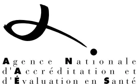

## Conférence de consensus

### AVANT-PROPOS

Cette conférence a été organisée et s'est déroulée conformément aux règles méthodologiques préconisées par l'agence nationale d'accréditation et d'évaluation en santé (ANAES) qui lui a attribué son label de qualité. Les conclusions et recommandations présentées dans ce document ont été rédigées par le Jury de la conférence, en toute indépendance. Leur teneur n'engage en aucune manière la responsabilité de l'ANAES.

# Les traumatisés crâniens adultes en médecine physique et réadaptation : du coma à l'éveil (texte court des recommandations du jury)☆

### Conférencier invité

Sortir du coma : Pr François Cohadon, neurochirurgien,  
Camblanes

### Experts

Question 1 : comment définir les modalités et niveaux cliniques de passage du coma à l'éveil ?

Dr François Tasseau, médecine physique et réadaptation (MPR), Aveize

Question 2 : quel est l'apport des examens complémentaires à l'évaluation et à la compréhension physiopathologique de l'éveil ?

- • Le point de vue du neuro-physiologiste : Dr Catherine Fischer, neurologue, Lyon
- • Le point de vue du neuro-radiologue : Pr Jean-Claude Solacroup, neuro-radiologue, Toulon
- • Le point de vue du clinicien : Dr Eliane Melon, neuro-réanimateur, Créteil

Question 3 : quelles sont les indications, l'efficacité et la tolérance des traitements médicamenteux susceptibles d'améliorer la reprise de la conscience ?

Dr Edwige Richer, neurologue, Cénac

Question 4 : quelles sont les indications, l'efficacité et la tolérance des procédures à utiliser en rééducation, pour améliorer la reprise de la conscience ?

Dr Pascal Rigaux, MPR, Berck

### Groupe bibliographique

Dr Emmanuel Cuny, neurochirurgien, Bordeaux  
Dr Evelyne Emery, neurochirurgien, Clichy  
Dr Catherine Kiefer, MPR, Villeneuve-la-Garenne  
Dr Véronique Mutschler, neuro-physiologiste, Strasbourg  
Dr Joanna Rome, MPR, Nantes

---

\*Auteur correspondant.

Adresse e-mail : [jean-michel.mazaux@chu-bordeaux.fr](mailto:jean-michel.mazaux@chu-bordeaux.fr)  
(J.M. Mazaux).

☆ Conférence de consensus. Les traumatisés crâniens adultes en médecine physique et réadaptation : du coma à l'éveil – 8 octobre 2001.Dr Laurence Tell, MPR, Saint-Genis-Laval  
 Dr Jean-Hugues Tourrette, radiologue, Toulon

### Comité d'organisation

Pr Jean-Michel Mazaux\*, coordonnateur, MPR, Bordeaux  
 Dr Eric Berard, MPR, Aveize  
 Pr Cyrille Colin, épidémiologiste, Lyon  
 Dr François Danze, neurologue, Berck  
 Dr Xavier Debellex, MPR, Bruges  
 Dr Philippe Decq, neurochirurgien, Créteil  
 Pr Jean-François Mathe, MPR, Nantes  
 Dr Antoine Rogier, médecin-expert, Laval

### Jury

Pr Jean-Luc Truelle, président, neurologue, Suresnes  
 Dr Jean-Marie Beis, MPR, Nancy  
 Dr Géry Boulard, réanimateur, Bordeaux  
 Mr Eric Favereau, journaliste, Paris  
 Pr Jean-Michel Guerit, neurophysiologiste, Bruxelles  
 Amiral Jean Picart, président de l'Union Nationale des Associations de Familles de Traumatisés Crâniens (UNAFTC), Brest  
 Dr Florence Saillour, épidémiologiste, Bordeaux  
 Mme Michèle Triplet, cadre infirmier, Berck  
 Pr Marie Vanier, psychologue, Montréal  
 Mr Patrick Verspieren, professeur d'éthique médicale, Paris  
 Mme Elisabeth Vieux, magistrat, Aix-en-Provence.

## 1. Introduction

Les traumatismes crâniens graves (TCG) représentent un problème majeur de santé publique. Chaque année, en France, 12 000 personnes en meurent, 8 à 10 000 en gardent des séquelles, 1800 perdent leur autonomie. Le plus tragique, c'est que les trois-quarts ont moins de 30 ans et sont, pour la plupart, victimes d'accidents de la route, dont la prévention est très insuffisante.

Les TCG tombent dans le coma. Ils en sortent le plus souvent grâce aux progrès de la prise en charge précoce (recommandations pour la pratique clinique 1999). La rééducation a fait l'objet de deux récentes conférences de consensus (USA, 1998, Italie, 2000). Cependant, entre coma et phase de rééducation, le « passage » fait problème : pronostic et traitements insuffisamment fondés, isolement fréquent des soignants, place incertaine laissée à la famille, discontinuité de la prise en charge, disparité géographique.

La société française de médecine physique et réadaptation (SOFMER) a suscité une conférence de consensus sur la phase d'éveil des TCG adultes. Une enquête préalable (Mazaux J.M., J. Rehab. Med. 2001) et un questionnaire d'impact (Mathe J.F., 2001) ont dressé un bilan des pratiques.

## 2. Remarques méthodologiques

Les recommandations ont été hiérarchisées en trois catégories : A, B et C, en fonction du niveau de preuve apporté par la littérature.

Pour les questions 3 et 4, portant sur l'efficacité et la tolérance des thérapeutiques, la classification adoptée est celle de la Canadian Task Force on Periodic Health, qui concerne les niveaux d'efficacité d'une intervention médicale. En revanche, les questions 1 et 2 s'appuient principalement sur des études pronostiques et de validation d'échelle. Cette classification, qui hiérarchise la qualité des études en fonction de leur schéma d'étude, est apparue moins bien adaptée. En effet, le meilleur schéma d'étude attendu étant de type cohorte, toute recommandation devrait être, au mieux, classée C. Les membres du jury ont préféré avoir recours à des facteurs de classification plus sensibles, en introduisant la notion de qualité méthodologique des études. Ce jugement a été obtenu à partir des grilles de lecture critique remplies par les membres du groupe bibliographique.

Tableau 1. Classification du niveau de preuve pour les recommandations des questions 3 et 4

<table border="1">
<thead>
<tr>
<th>Niveaux d'efficacité d'une intervention médicale</th>
<th>Grade des recommandations</th>
</tr>
</thead>
<tbody>
<tr>
<td>I Preuves obtenues par au moins : - un essai comparatif - une méta-analyse d'essais randomisés</td>
<td>A</td>
</tr>
<tr>
<td>II 1 Preuves obtenues aux moyens - d'essais comparatifs non randomisés - de petits essais comparatifs ou aux résultats incertains</td>
<td>B</td>
</tr>
<tr>
<td>II 2 Preuves obtenues par des études de cohorte ou des études cas témoins de préférence multicentriques</td>
<td>C</td>
</tr>
<tr>
<td>II 3 Preuves obtenues par des comparaisons de séries non contemporaines</td>
<td></td>
</tr>
<tr>
<td>III Études descriptives (série de cas, étude de cas) Avis d'experts</td>
<td></td>
</tr>
</tbody>
</table>

Parmi les recommandations de grade C, celles issues d'avis d'experts ont été identifiées dans le texte. Les recommandations correspondant à un « accord professionnel » n'ont pas fait l'objet de publication dans la littérature.Tableau 2. Classification du niveau de preuve pour les recommandations des questions 1 et 2

<table border="1">
<thead>
<tr>
<th>Force des recommandations</th>
<th>Grade des recommandations</th>
</tr>
</thead>
<tbody>
<tr>
<td>Preuves obtenues par au moins :</td>
<td>A</td>
</tr>
<tr>
<td>- une étude pronostique bien menée*</td>
<td></td>
</tr>
<tr>
<td>- une étude de validation d'échelle bien menée*</td>
<td></td>
</tr>
<tr>
<td>Preuves obtenues par :</td>
<td>B</td>
</tr>
<tr>
<td>- une étude pronostique dont la méthodologie présente des imperfections*</td>
<td></td>
</tr>
<tr>
<td>- une étude de validation d'échelle dont la méthodologie présente des imperfections*</td>
<td></td>
</tr>
<tr>
<td>Preuves obtenues par des études pronostiques ou de validation d'échelle de qualité méthodologique médiocre*</td>
<td>C</td>
</tr>
<tr>
<td>Études descriptives (séries de cas, étude de cas)</td>
<td></td>
</tr>
<tr>
<td>Avis d'experts</td>
<td></td>
</tr>
</tbody>
</table>

\* les critères précis de classement des études pronostiques et de validation d'échelle, en fonction de leur qualité méthodologique (études bien menées, études présentant des imperfections et études de qualité méthodologique médiocre) sont fournies dans le texte long.

### 3. Question 1 : modalités et niveaux cliniques de passage du coma à l'éveil

#### 3.1. Modalités de passage du coma à l'éveil

Le coma est « un état de non-réponse dans lequel le sujet repose les yeux fermés et ne peut être réveillé » (Plum et Posner).

La réapparition de périodes où le patient garde les yeux ouverts est le signe clinique habituellement retenu du passage d'une première frontière, entre coma et récupération de la vigilance. La seconde frontière à franchir est celle qui inaugure la reprise d'une activité consciente. Celle-ci se fait graduellement. Avant la restauration des fonctions cognitives, il est souvent observé une période transitoire, de durée variable, au cours de laquelle le patient reste amnésique, confus, voire agité.

Dans la majorité des cas, le patient récupère, à des degrés divers, vigilance puis conscience, avant son transfert en rééducation. Dans certains cas, une observation, même attentive et prolongée, ne permet de recueillir aucun signe de reprise d'une telle activité consciente. Un tel état de « veille sans manifestation de conscience » est couramment dénommé « état végétatif ».

Cependant, le passage de cette frontière qu'est la reprise d'une activité consciente n'exclut pas la possibilité d'observer d'autres tableaux cliniques très graves que sont les « états pauci-rationnels ». Telle est l'une des dénominations proposées pour désigner les états où peuvent être mis en évidence des manifestations fluctuantes, mais clairement identifiables, de perception, par les patients, de ce qui se déroule dans leur environnement. La littérature propose

aussi d'autres dénominations : *Minimally Conscious State*, *Minimally Responsive State*.

Tant les états végétatifs que les états pauci-rationnels doivent être clairement distingués du mutisme akinétique et du *locked-in syndrome*. Il s'agit d'états proches quant à leurs manifestations cliniques mais chez lesquels l'état de conscience est probablement (mutisme akinétique) ou certainement (*locked-in syndrome*) conservé.

Ces différentes entités, au cours d'un coma traumatique, sont les moins fréquentes mais les plus graves. Elles impliquent un long séjour en unité de rééducation.

#### 3.2. Evaluation

Dans la pratique des réanimateurs, le score de coma de Glasgow (GCS) est l'échelle de référence. Il reste, associé à l'observation attentive des patients, le meilleur moyen de coter rapidement les niveaux cliniques de passage du coma à l'éveil (accord professionnel). La durée de l'amnésie post-traumatique (APT) sépare la perte de conscience (ou l'amnésie) initiale de la récupération des souvenirs d'un jour à l'autre. Elle est évaluée par le *Galveston Orientation and Amnesia test* (GOAT) (grade C). Par rapport au GCS et à la durée du coma, c'est le meilleur index pronostique global à la période initiale (grade C).

L'évaluation des états pauci-rationnels et végétatifs est plus difficile. Elle exige, d'une part, une observation multidisciplinaire répétée et d'autre part, l'utilisation d'une échelle plus sensible. À cet égard, la *Wessex Head Injury Matrix* (WHIM) bénéficie d'une traduction française validée (grade B); cependant, sa valeur prédictive n'a pas encore été déterminée. D'autre part, les stimulations sensorielles peuvent contribuer à l'évaluation de ces états et permettre de distinguer état pauci-rationnel et végétatif (grade B).

La *Glasgow Outcome Scale* (GOS) classe les issues de coma en cinq catégories (décès (1), état végétatif persistant (2), handicap sévère (3), handicap modéré (4), bonne récupération (5). Il existe une corrélation entre, d'une part, la durée du coma, la durée de la PTA et d'autre part, les résultats de la GOS (grade C). Une version étendue, à 8 niveaux, de la GOS, permet de disposer d'un outil d'évaluation du handicap plus précis.

L'importance des résultats de ces échelles (GCS, GOAT, WHIM, GOS) pour les services de rééducation et en expertise médico-légale amène à recommander de les consigner et de garantir leur accessibilité à toutes les unités successivement en charge du patient (accord professionnel).

#### 3.3. Transfert de réanimation en rééducation

Le moment du transfert vers une unité de rééducation est souvent différé par manque de place dans un serviceentraîné à la prise en charge des cérébrolésés. Ce transfert d'un malade, dont les grandes fonctions sont stabilisées, devrait cependant intervenir plus précocement (accord professionnel). Le retard au transfert est le plus souvent lié à l'engorgement des unités de rééducation qui elles-mêmes, manquent de structures d'aval appropriées. La matérialisation de filières de soins constitue un début de solution à cette cascade de retards (accord professionnel).

Compte tenu des spécificités de ces patients cérébrolésés, les établissements de rééducation doivent identifier des unités fonctionnelles dédiées à cette population. Pour organiser un transfert plus précoce, il est en outre recommandé d'identifier, au sein de ces unités de rééducation pour cérébro-lésés, un secteur - ou « unité d'éveil » - dédié aux blessés en état d'éveil retardé, au mieux à proximité de l'unité de réanimation, permettant ainsi de pallier une éventuelle complication grave (accord professionnel).

La conférence de consensus italienne (2000) recommande que les patients en GOS 4 et 5 fassent l'objet d'un suivi externe, que les GOS 3 ou 4 soient orientés vers un centre de rééducation fonctionnelle (CRF) spécialisé et que les GOS 2 et les MCS soient orientés vers un CRF spécialisé, comportant une unité dédiée (accord professionnel). À la sortie de cette unité, ces derniers patients seront orientés soit vers le CRF soit vers une autre institution ou le domicile.

#### 4. Question 2 : quel est l'apport des examens complémentaires d'évaluation et de la compréhension physiopathologique de l'éveil ?

Les examens complémentaires de pratique courante se subdivisent en deux catégories : les techniques d'imagerie : tomodensitométrie (TDM), imagerie en résonance magnétique (IRM), permettant de visualiser les lésions cérébrales et les techniques électrophysiologiques (EEG, potentiels évoqués - PE), évaluant la fonction nerveuse et présentant, par rapport à l'examen clinique, l'avantage de permettre une approche plus quantitative.

Il convient de distinguer la phase aiguë (premiers jours) et les phases subaiguë et chronique.

##### 4.1. Phase aiguë

###### 4.1.1. Techniques d'imagerie

La TDM constitue l'examen de l'admission (recommandation B) et de la 24e heure (avis d'experts). Elle permet le diagnostic en urgence de la majorité des lésions, en particulier de celles qui sont accessibles à un traitement neurochirurgical immédiat. L'IRM précoce peut apporter des précisions diagnostiques et pronostiques supplémentaires

sur l'évolution neurologique du patient, en particulier par sa capacité à détecter les lésions axonales diffuses et du tronc cérébral (grade B). Mais cet examen ne peut être recommandé systématiquement en raison, d'une part, des risques liés aux conditions de l'examen (source potentielle d'agressions cérébrales secondaires d'origine systémique (ACSOS)), au cours du transport et d'autre part et surtout, parce que les informations diagnostiques qu'elle apporte ne modifient pas le processus de prise en charge précoce (avis d'experts).

##### 4.1.2. Techniques neurophysiologiques

Outre l'EEG, reflétant l'activité du cortex cérébral et la modulation de celle-ci par le tronc cérébral, on distingue, d'une part, les PE de courte latence (PE auditifs du tronc cérébral : PEATC ; composantes précoces des PE somesthésiques : PES) permettant l'évaluation fonctionnelle du tronc cérébral, d'autre part, les PE de moyenne latence permettant l'évaluation des aires corticales primaires, enfin, les PE cognitifs (négativité de discordance, P300) permettant d'évaluer les aires corticales associatives. L'apport de ces techniques au stade aigu concerne le pronostic, le diagnostic et le suivi :

- • la valeur pronostique des PE dépend du type de modalité utilisée. La présence d'altérations majeures des PEATC et des PES permet de se prononcer avec un grand degré de certitude quant à la probabilité de survenue d'une évolution défavorable, à court ou à long terme. Par contre, des PEATC normaux ou la persistance d'activités corticales primaires au niveau des PES ne permettent pas de se prononcer favorablement (grade A). À l'inverse, les PE cognitifs, lorsqu'ils sont présents, présentent une forte valeur prédictive de l'éveil, sans qu'il soit possible de se prononcer sur la qualité de celui-ci et sur l'intégrité future des fonctions cognitives. Par contre, des PE cognitifs absents n'ont aucune valeur pronostique (grade A) ;
- • l'enregistrement des PE peut permettre de préciser la physiopathologie d'un coma traumatique. Les PE peuvent ainsi fournir des marqueurs neurologiques susceptibles d'être utilisés comme critères de classification des patients lors d'études d'efficacité de traitements médicamenteux ou de rééducation ;
- • l'EEG, de préférence en monitoring continu, permet la détection des états de mal épileptiques non convulsifs. L'EEG permet également d'évaluer la réactivité du cortex cérébral et en cela, possède une valeur pronostique quant à l'évolution ultérieure (grade B).

L'interprétation de l'EEG et des PE cognitifs doit tenir compte de la sédation et de l'influence possible de facteurs non primitivement cérébraux tels que les ACSOS (avis d'experts).## 4.2. Les phases subaiguë et chronique

### 4.2.1. La TDM et l'IRM

La TDM reste le standard de suivi thérapeutique (grade A) mais sa valeur prédictive sur l'évolution clinique, bien que significative, est cependant inférieure à celle de l'IRM (grade A). Sont nettement péjoratifs à l'IRM : la profondeur des lésions - corps calleux, noyaux gris centraux, hippocampe, mésencéphale, partie dorso-latérale du tronc cérébral - le nombre de lésions supérieur à 3 et l'association de plusieurs types de lésions cérébrales (lésions axonales diffuses, hématomes) (grade B). La réalisation d'une IRM est recommandée au moment du transfert en rééducation, pour tout patient ayant subi un traumatisme crânien grave (avis d'experts).

### 4.2.2. Les examens neurophysiologiques

L'enregistrement des PE sensoriels et moteurs est utile pour l'évaluation de la perméabilité sensorielle chez les patients candidats à des stimulations (avis d'experts), pour identifier le locked-in syndrome (grade C) et le mutisme akinétique. En phase subaiguë, la réapparition de PE cognitifs est prédictive du réveil dans les jours qui suivent (grade C). En phase chronique, ils peuvent fournir des arguments en faveur de capacités conscientes résiduelles (avis d'experts).

### 4.2.3. Évaluation anatomo-fonctionnelle

La plus grande faisabilité et les développements récents de l'IRM - diffusion, transfert magnétique spectroscopie - apportent des informations utiles au diagnostic et au pronostic. Ils sont de nature à élargir, dans l'avenir, la place de l'IRM en phase précoce.

Dans l'état actuel des données scientifiques, le SPECT (scintigraphie de perfusion) n'est pas recommandé à la phase des soins initiaux et de l'éveil (accord professionnel).

Bien que restant du domaine de la recherche, le PET-scan et l'IRM fonctionnelle peuvent apporter des éléments spécifiques d'individualisation de tableaux neurologiques complexes (mutisme akinétique, *locked-in syndrome*) (grade C) et une meilleure définition de troubles de la neurotransmission (par exemple, au niveau des voies dopaminergiques) (grade C).

## 5. Question 3 : Quelles sont les indications, l'efficacité et la tolérance des traitements médicamenteux susceptibles d'améliorer la reprise de la conscience ?

### 5.1. Résultats des études

L'indication des traitements médicamenteux susceptibles d'améliorer la reprise de conscience est fondée sur les

connaissances actuelles concernant les neuro-transmetteurs (acétylcholine, monoamines, peptides et amino-acides) et la pharmacologie correspondante (levodopa/carbidopa, amantadine, bromocriptine, dextroamphétamine, methylphénidate, pemoline, tricycliques et inhibiteurs de la recapture de la sérotonine).

Les études de l'efficacité de ces traitements sur l'éveil comportent huit études descriptives dont deux pour la levodopa/carbidopa, quatre pour l'amantadine, une pour les amphétamines, une pour le methylphénidate et une étude comparative de type « comparaison de séries non contemporaines » (bromocriptine). Tous ces essais ont permis d'observer un effet positif des traitements étudiés, à l'exception de celle utilisant la levodopa/carbidopa. Des effets secondaires ont été rapportés dans la majorité des études (crise comitiale, tachycardie, insomnie, anxiété, agitation, hallucinations, hyperthermie). Un décès a été observé dans l'étude concernant l'amantadine.

De façon générale, les critères de jugement et les outils de mesure de ces critères sont variés et souvent peu sensibles, les groupes de patients sont hétérogènes, les délais de mise sous traitement sont tardifs, 3 à 12 mois, (expliqués par l'échec des traitements antérieurs) et les durées des traitements sont diverses (14 j à un an). Les résultats des essais ont un faible niveau de preuve (grade C). Il n'est donc pas possible de se prononcer quant à l'efficacité de ces traitements.

Les symptômes associés et leurs traitements, qu'il s'agisse de la spasticité, de la douleur, de la comitialité ou de l'agitation, n'ont pas été analysés dans la littérature, quant à leur effet sur l'éveil, qu'ils sont susceptibles de différer. Leur traitement approprié, en tenant compte également de leurs effets secondaires (sédatif) est donc à recommander. L'agitation à la phase d'éveil est une préoccupation des réanimateurs et des rééducateurs. Son traitement ne s'appuie pas sur des protocoles validés à cette phase. Il doit prendre en compte la variation fréquente de réponse, d'un malade à l'autre. Des études ultérieures sont nécessaires pour préciser ces interactions (accord professionnel).

### 5.2. Prospective

Des programmes scientifiques capables d'affirmer ou d'infirmer l'efficacité des traitements pharmacologiques doivent être développés. Ces programmes pourraient comprendre deux étapes. La première, exploratoire, utiliserait des études de type « cas unique avec mesures répétées dans le temps ». Cette première phase, de réalisation simple, permettrait de préciser le cadre méthodologique (définition des critères d'inclusion des patients, choix des critères d'évaluation les plus pertinents, précision quant aux modalités de traitement). La seconde étape serait fondée sur desessais thérapeutiques randomisés en double aveugle portant sur des groupes importants de patients.

D'autres voies de recherche, incluant les techniques du PETscan et d'IMR fonctionnelle, pourraient contribuer à la formulation d'hypothèses permettant le développement de nouveaux modèles thérapeutiques.

## 6. Question 4 : Quelles sont les indications, l'efficacité et la tolérance des procédures à utiliser en rééducation pour améliorer la reprise de la conscience ?

### 6.1. Résultats des études

Quatre types de procédures ont fait l'objet d'études publiées : la neurostimulation cérébrale profonde ou médullaire (NS), la stimulation sensorielle (SS) et sa variante, la régulation sensorielle (RS) et enfin, une approche thérapeutique fondée sur la sémiotique (AS).

Ces procédures concernent des patients en coma (à l'exception de l'AS), en état de veille sans manifestation de conscience ou en état pauci-relationnel. Vingt-sept études, publiées entre 1969 et 1996, de l'efficacité de l'une ou de l'autre de ces interventions, ont été analysées.

Sur huit études de la NS, deux étaient des essais cliniques randomisés et cinq des études descriptives. Les auteurs de ces études concluent à un effet positif de la NS.

Dix-huit études concernent l'efficacité de la SS ou de la RS. Un seul essai contrôlé randomisé de faible effectif sur la SS a été recensé. Il conclut à l'absence d'effets de l'intervention. Une étude sur la SS de type comparatif non randomisé montre des résultats positifs. Les quatre études sur la SS, de type cas unique avec mesures répétées, ont toutes mises en évidence l'efficacité de l'intervention. Cinq études, dont quatre concernant la SS et une de RS, sont de type comparaison de séries non contemporaines. Celle sur la RS et trois sur la SS concluent à l'efficacité de l'intervention. Sept articles sur la SS sont des études descriptives, dont six permettent d'observer des résultats positifs.

Une étude de type comparaison de suivis non contemporains porte sur une approche fondée sur la sémiotique (AS) et conclut à l'efficacité de l'intervention.

En ce qui concerne les procédures non invasives (RS, SS, AS), seule la SS a fait l'objet de réserves en termes de tolérance (application incontrôlée). Les procédures invasives (NS) comportent les risques inhérents à toute implantation d'électrode dans le système nerveux central.

Les résultats de l'application des différentes procédures, qui visent à favoriser la reprise de la conscience, sont en général encourageants. Mais ils doivent être considérés avec réserve, étant donné le faible niveau d'efficacité des études analysées, notamment du fait de l'absence de groupe

contrôle. D'autres problèmes sont aussi rencontrés : la définition et les corrélats cliniques et paracliniques de l'état de conscience avant et après l'intervention sont en général présentés de façon trop imprécise pour que l'on puisse juger des résultats ; de plus, dans plusieurs cas, les protocoles d'intervention sont à peine décrits, rendant impossible la reproduction de l'étude. Les problèmes méthodologiques ou conceptuels rencontrés dans les études recensées ne permettent donc pas de proposer des recommandations précises quant aux approches à privilégier.

### 6.2. Prospective

La poursuite des programmes scientifiques susceptibles de confirmer (ou d'infirmier) l'efficacité des procédures de stimulation (RS, SS) doit être maintenue. Ces recherches devraient recourir, dans un premier temps, à des études de type « cas unique avec mesures répétées dans le temps » et mieux définir les critères d'inclusion des patients, le choix des critères d'évaluation les plus pertinents, des modalités de traitement plus écologiques. Ainsi pourrait-on préciser le cadre méthodologique le plus adapté pour mener, dans un second temps, des essais contrôlés encore actuellement délicats à mettre en œuvre, au sein d'une population hétérogène (avis d'experts).

En ce qui concerne la NS, les résultats des études antérieures chez l'animal et chez l'homme vont dans le sens d'un effet sur l'éveil. Il n'y a pas d'effet connu à long terme. L'élaboration de modèles théoriques et les avancées en terme de fiabilité des nouvelles technologies sont des préalables nécessaires à la mise en œuvre des techniques de stimulation cérébrale profonde ou médullaire.

### 6.3. L'étude des procédures en rééducation appelle nécessairement trois autres approches qui font partie intégrante de la prise en charge du patient

#### 6.3.1. Un pronostic difficile à formuler

Malgré les progrès des examens complémentaires et la multiplication des études, la formulation d'un pronostic à la phase initiale se heurte toujours à des données statistiques de force limitée, à des scores pronostiques de spécificité et de sensibilité aussi limitées.

L'énoncé d'un pronostic individuel en devient d'autant plus difficile. Or, on sait qu'il influence les attitudes thérapeutiques des équipes soignantes. L'annonce d'une évolution favorable nourrit l'engagement de l'équipe. Un pronostic pessimiste risque de démobiliser et augmente les risques de l'issue fatale que justement, on avait prévue. C'est en quelque sorte une prédiction auto-accomplie (grade C).### 6.3.2. *La famille soignante et patiente*

Au delà de la nécessité humainement impérieuse d'être au contact de leur proche, les familles apportent à l'équipe soignante la connaissance de la personnalité et du vécu antérieur du blessé et souvent, les premiers indices de manifestations de conscience.

Elles revendiquent fréquemment leur place dans la thérapie, avec son registre de stimulations.

Au même titre que d'autres méthodes, la démonstration scientifique de son efficacité n'est pas faite. Cependant, argument logique et compassion doivent élargir le temps de présence de la famille dans les limites de l'organisation des soins (accord professionnel).

Dans cette phase où l'histoire de la maladie se fond, définitivement dans les cas les plus graves, avec la survie du patient et la vie brisée de ses proches, l'information est essentielle et à valeur thérapeutique : la violence faite à la vie en plein élan d'un jeune, la prise en compte de l'angoisse externe et parfois, du déni et de l'espoir déme-

suré, mais aussi la redistribution des rôles familiaux, constituent des spécificités du traumatisé crânien grave. Elle conduit à recommander une information cohérente, adaptée au moment, pas à pas, donc évolutive et pédagogique (accord professionnel).

La présence de psychologues apparaît ainsi nécessaire pour aider les familles, mais aussi l'équipe soignante, soumises à une charge émotionnelle parfois insupportable (avis d'experts).

### 6.3.3. *Aspects médico-légaux*

Il est important de noter qu'une majorité des TCG rembourse, par l'indemnisation de leur préjudice corporel par les assurances, la totalité des frais de soins engagés.

Dans l'évaluation médico-légale, il serait souhaitable que les différentes composantes du préjudice subi par les familles soient également prises en compte (accord professionnel).