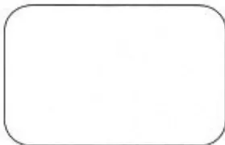

## ANNEXE 9 : Feuille de recueil de la morbi/mortalité

### Anesthésie vigilance : C.H.U. de

**AXE de LECTURE CODE à BARRES**

**N° Secteur**

<table border="1" style="width: 100%; text-align: center;">
<tr><td>0</td><td>0</td></tr>
<tr><td>1</td><td>1</td></tr>
<tr><td>2</td><td>2</td></tr>
<tr><td>3</td><td>3</td></tr>
<tr><td>4</td><td>4</td></tr>
<tr><td>5</td><td>5</td></tr>
<tr><td>6</td><td>6</td></tr>
<tr><td>7</td><td>7</td></tr>
<tr><td>8</td><td>8</td></tr>
<tr><td>9</td><td>9</td></tr>
</table>

**N° Salle**

<table border="1" style="width: 100%; text-align: center;">
<tr><td>0</td><td>0</td></tr>
<tr><td>1</td><td>1</td></tr>
<tr><td>2</td><td>2</td></tr>
<tr><td>3</td><td>3</td></tr>
<tr><td>4</td><td>4</td></tr>
<tr><td>5</td><td>5</td></tr>
<tr><td>6</td><td>6</td></tr>
<tr><td>7</td><td>7</td></tr>
<tr><td>8</td><td>8</td></tr>
<tr><td>9</td><td>9</td></tr>
</table>

**Jour Mois An**

<table border="1" style="width: 100%; text-align: center;">
<tr><td>0</td><td>0</td><td></td></tr>
<tr><td>1</td><td>1</td><td></td></tr>
<tr><td>2</td><td>2</td><td></td></tr>
<tr><td>3</td><td>3</td><td></td></tr>
<tr><td>4</td><td>4</td><td></td></tr>
<tr><td>5</td><td>5</td><td></td></tr>
<tr><td>6</td><td>6</td><td></td></tr>
<tr><td>7</td><td>7</td><td></td></tr>
<tr><td>8</td><td>8</td><td></td></tr>
<tr><td>9</td><td>9</td><td></td></tr>
</table>

**Mois**

<table border="1" style="width: 100%; text-align: center;">
<tr><td>Janv</td></tr>
<tr><td>Fév</td></tr>
<tr><td>Mars</td></tr>
<tr><td>Avril</td></tr>
<tr><td>Mai</td></tr>
<tr><td>Juin</td></tr>
<tr><td>Juil</td></tr>
<tr><td>Août</td></tr>
<tr><td>Sept</td></tr>
<tr><td>Oct</td></tr>
<tr><td>Nov</td></tr>
<tr><td>Dec</td></tr>
</table>

**Heure Début Heure Fin**

<table border="1" style="width: 100%; text-align: center;">
<tr><td>0</td><td>0</td><td>0</td><td>0</td><td>0</td><td>0</td><td>0</td><td>0</td></tr>
<tr><td>1</td><td>1</td><td>1</td><td>1</td><td>1</td><td>1</td><td>1</td><td>1</td></tr>
<tr><td>2</td><td>2</td><td>2</td><td>2</td><td>2</td><td>2</td><td>2</td><td>2</td></tr>
<tr><td>3</td><td>3</td><td>3</td><td>3</td><td>3</td><td>3</td><td>3</td><td>3</td></tr>
<tr><td>4</td><td>4</td><td>4</td><td>4</td><td>4</td><td>4</td><td>4</td><td>4</td></tr>
<tr><td>5</td><td>5</td><td>5</td><td>5</td><td>5</td><td>5</td><td>5</td><td>5</td></tr>
<tr><td>6</td><td>6</td><td>6</td><td>6</td><td>6</td><td>6</td><td>6</td><td>6</td></tr>
<tr><td>7</td><td>7</td><td>7</td><td>7</td><td>7</td><td>7</td><td>7</td><td>7</td></tr>
<tr><td>8</td><td>8</td><td>8</td><td>8</td><td>8</td><td>8</td><td>8</td><td>8</td></tr>
<tr><td>9</td><td>9</td><td>9</td><td>9</td><td>9</td><td>9</td><td>9</td><td>9</td></tr>
</table>

**ACTE**

Acte sans hospitalisation

Acte pendant un transport médical

Mort cérébrale

**PO SSPI**

Trans. homologue

Homo. ou Auto Moins d'1/2 MS

Homo. ou Auto Plus d'1/2 MS

**si TECHNIQUE d'ALR**

Rachi anesth. Bloc plexique non cervical

Rachi continu Bloc plexique ou tronculaire avec KT laissé en place

Péri lombaire ALRIV

Autre péri Caudale

Péri-rachi combinées A locale simple

Bloc plexique cervical Autre

Bloc tronculaire injection unique Echec technique avec passage en AG

Bloc tronculaire plusieurs injections

**ASA**

1

2

3

4

5

U

**POSITION**

Trendelenbourg

Décubitus latéral

Proctive

Ventrale

Genu pectorale

Assise

Table ortho

Concorde

Gynéco

**TRANSFUSION AUTOLOGUE**

HDANI

TAD

Récup. per

Récup. post

**si ANESTHÉSIE GÉNÉRALE**

AG avec sonde type carlens

AG avec masque laryngé

AG avec intubation

AG sans intubation

**TECHNICITÉ**

AG avec réa per-op. médication cardiovasc., hypotension provoquée

Pression artérielle sanglante

AG + Swan-Ganz ou équivalent

Monitoring de la PVC

Mise en condition avant anesthésie pour patient urgent ou en état critique

Monitoring lourd (écho, doppler)

Potentiel évoqué somes ou moteur

AG + CEC

AG avec pneumopéritoine

Intubation difficile (rétro, fibro)

Anesth. pour IRM

Ventilation haute fréquence

Changement de position PO

Sondage Urinaire

Prise en charge sans anesthésie d'un patient à risque pendant un acte médical/technique

**DURÉE DU SÉJOUR SSPI**

Moins d'1 heure

1 h à 1 h 59

2 h à 2 h 59

3 h à 3 h 59

4 h à 5 heures

Plus de 5 heures

**DEVENIR**

Domicile

Salle d'hospitalisation

Soins intensifs

Réanimation

Décès

Autre

**SSPI**

Hypothermie < 35° à l'entrée en S de R

Ventilation contrôlée en S de R

Radio en S de R pour anesthésie/réa

Biologie en S de R pour anesthésie/réa

Technique d'antalgie (KT, PCA)

Hyperthermie > 39°

Monitoring standard

Monitoring lourd

**INCIDENTS D'INTUBATION**

Obstruction trachéale

Difficulté imprévue d'intubation

Plus d'une tentative d'intubation

Traumatisme dentaire

Intubation oesophagienne

Intubation bronchique sélective

Extubation accidentelle

Obstruction de la sonde d'intubation

Reintubation imprévue

Dyspnée majeure post-intubation

Autres

**INCIDENTS CIRCULATOIRES**

Hypotension (< 80 de systolique)

Hypertension (> 110 de diastolique)

Dépression récente du segment ST

Surélévation récente du segment ST

Extrasystoles ventriculaires récentes nombreuses (> 5/min)

Tachycardie ventriculaire

Fibrillation ventriculaire

Asystole

Infarctus aigu du myocarde

Tachycardie sinusale

Bradycardie sévère

Hypovolémie sévère (< 60 de systolique)

Autres

**INCIDENTS VENTILATOIRES**

Inhalation pulmonaire

Laryngo bronchospasme

Hyperventilation ( $pCO_2 < 4$  KpA)

Hypoventilation ( $pCO_2 > 6,6$  KpA)

Ventilation post-opératoire non prévue

Hypoxémie ( $SpO_2 < 90\%$  ou  $paO_2 < 7,3$  KpA)

Pneumothorax

Oedème pulmonaire

Autres

**INCIDENTS NEUROLOGIQUES**

Convulsion

Paralysie prolongée

Délirium ou agitation majeure

Rétard de réveil (> 2 heures)

Absence de réveil

Autres

**INCIDENTS RENAUX**

Anurie

Oligurie (< 1 cm3/KG/h)

Globe vésical nécessitant sondage

Autres

**INCIDENTS PHARMACOLOGIQUES**

Réactions anaphylactiques

Erreurs d'administration de drogues

Décurarisation impossible

Excès de morphiniques nécessitant Naloxone

Autres

**INCIDENTS CUTANÉS**

Brûlures

Lésion oculaire

Echymoses

Infiltrations sous-cutanées

Lésions en rapport avec le garrot

Autres

**INCIDENTS D'EQUIPEMENT**

Respirateur d'anesthésie

Circuit d'anesthésie

Moniteurs

Autres## CENTRE HOSPITALIER UNIVERSITAIRE DE

### INFORMATION MEDICALE SUR L'ANESTHESIE

Ce document est destiné à vous informer sur l'anesthésie, ses avantages et ses risques. Nous vous demandons de le lire attentivement, afin de pouvoir donner votre consentement à la procédure anesthésique qui vous sera proposée par le médecin anesthésiste-réanimateur. Vous pourrez également poser à ce médecin des questions sur cette procédure. Pour les questions relatives à l'acte qui motive l'anesthésie, il appartient au spécialiste qui réalisera cet acte d'y répondre.

#### **Qu'est-ce que l'anesthésie ?**

L'anesthésie est un ensemble de techniques qui permet la réalisation d'un acte chirurgical, obstétrical ou médical (endoscopie, radiologie, etc.), en supprimant ou atténuant la douleur. Il existe deux grands types d'anesthésie : *l'anesthésie générale et l'anesthésie locorégionale*.

- • **L'anesthésie générale** est un état comparable au sommeil, produit par l'injection de médicaments, par voie intraveineuse et/ou par la respiration de vapeurs anesthésiques, à l'aide d'un dispositif approprié.
- • **L'anesthésie locorégionale** permet, par différentes techniques, de n'endormir que la partie de votre corps sur laquelle se déroulera l'opération. Son principe est de bloquer les nerfs de cette région, en injectant à leur proximité un produit anesthésique local. Une anesthésie générale peut être associée ou devenir nécessaire, notamment en cas d'insuffisance de l'anesthésie locorégionale.

La rachianesthésie et l'anesthésie péridurale sont deux formes particulières d'anesthésie locorégionale, où le produit anesthésique est injecté à proximité de la moelle épinière et des nerfs qui sortent de celle-ci.

Toute anesthésie, générale ou locorégionale, réalisée pour un acte non urgent, nécessite une consultation, plusieurs jours à l'avance et une visite préanesthésique, la veille ou quelques heures avant l'anesthésie selon les modalités d'hospitalisation. Comme l'anesthésie, elles sont effectuées par un médecin anesthésiste-réanimateur. Au cours de la consultation et de la visite, vous êtes invité(e) à poser les questions que vous jugez utiles à votre information. Le choix du type d'anesthésie sera déterminé en fonction de l'acte prévu, de votre état de santé et du résultat des examens complémentaires éventuellement prescrits. Le choix final relève de la décision et de la responsabilité du médecin anesthésiste-réanimateur qui pratiquera l'anesthésie.## Annexe 10 : Exemple de Dossier complet : page 2

### **Comment serez-vous surveillé (e) pendant l'anesthésie et à votre réveil ?**

L'anesthésie, quel que soit son type, se déroule dans une salle équipée d'un matériel adéquat, adapté à votre cas et vérifié avant chaque utilisation. Tout ce qui est en contact avec votre corps est soit à usage unique, soit désinfecté ou stérilisé. En fin d'intervention, vous serez conduit(e) dans une salle de surveillance postinterventionnelle (salle de réveil) pour y être surveillé(e) de manière continue avant de regagner votre chambre ou de quitter l'établissement.

Durant l'anesthésie et votre passage en salle de surveillance postinterventionnelle, vous serez pris(e) en charge par un personnel infirmier qualifié, sous la responsabilité d'un médecin anesthésiste-réanimateur.

### **Quels sont les risques de l'anesthésie ?**

Tout acte médical, même conduit avec compétence et dans le respect des données acquises de la science, comporte un risque.

Les conditions actuelles de surveillance de l'anesthésie et de la période de réveil, permettent de dépister rapidement les anomalies et de les traiter.

### **Quels sont les inconvénients et les risques de l'anesthésie générale ?**

Les nausées et les vomissements au réveil sont devenus moins fréquents avec les nouvelles techniques et les nouveaux médicaments. Les accidents liés au passage de vomissements dans les poumons sont très rares si les consignes de jeûne sont bien respectées.

L'introduction d'un tube dans la trachée (intubation) ou dans la gorge (masque laryngé) pour assurer la respiration pendant l'anesthésie peut provoquer des maux de gorge ou un enrouement passagers.

Des traumatismes dentaires sont également possibles. C'est pourquoi il est important que vous signaliez tout appareil ou toute fragilité dentaire particulière.

Une rougeur douloureuse au niveau de la veine dans laquelle les produits ont été injectés peut s'observer. Elle disparaît en quelques jours.

La position prolongée sur la table d'opération peut entraîner des compressions, notamment de certains nerfs, ce qui peut provoquer un engourdissement ou, exceptionnellement, la paralysie d'un bras ou d'une jambe. Dans la majorité des cas, les choses rentrent dans l'ordre en quelques jours ou quelques semaines.

Des troubles passagers de la mémoire ou une baisse des facultés de concentration peuvent survenir dans les heures suivant l'anesthésie.

Des complications imprévisibles comportant un risque vital comme une allergie grave, un arrêt cardiaque, une asphyxie, sont extrêmement rares. Quelques cas sont décrits, alors que des centaines de milliers d'anesthésies de ce type sont réalisées chaque année.

### **Quels sont les inconvénients et les risques de l'anesthésie locorégionale ?**

Après une rachianesthésie ou une anesthésie péridurale, des maux de tête peuvent survenir. Ils nécessitent parfois un repos de plusieurs jours et/ou un traitement local spécifique. Une paralysie transitoire de la vessie peut nécessiter la pose temporaire d'une sonde urinaire. Des douleurs au niveau du point de ponction dans le dos sont également possibles. Une répétition de la ponction peut être nécessaire en cas de difficulté. Des démangeaisons passagères peuvent survenir lors de l'utilisation de la morphine ou de ses dérivés. Très rarement, on peut observer une baisse transitoire de l'acuité auditive ou visuelle.

En fonction des médicaments associés, des troubles passagers de la mémoire ou une baisse des facultés de concentration peuvent survenir dans les heures suivant l'anesthésie.

Des complications plus graves comme des convulsions, un arrêt cardiaque, une paralysie permanente ou une perte plus ou moins étendue des sensations sont extrêmement rares. Quelques cas sont décrits, alors que des centaines de milliers d'anesthésies de ce type sont réalisées chaque année.# Centre Hospitalier Universitaire de

ANESTHESIE-REANIMATION

Anesthésiste :

Service :

Chirurgien :

Chambre :

Intervention :

Date :

---

**CONSULTATION D'ANESTHESIE**

Date :

Anesthésiste :

Consultation

Hospitalisation

Urgence

**Interrogatoire**

Histoire de la maladie :

Antécédents :

Traitement :## Annexe 10 : Exemple de Dossier complet : page 4

### **Examen clinique**

- - Poids :                      - Taille :
- - Etat veineux :
- - Prothèses :
  - dentaires :
  - autres :

### **Para clinique**

- - Pas d'examen complémentaire
- - Examens demandés :
- - Examens à faire dans le service :

### **Facteurs de risques**

- Difficultés d'intubation prévues
- ASA :

### **Préparation conseillée**

### **Consignes transfusionnelles - Commande de produits sanguins**

### **Information**

- - Information médicale sur l'anesthésie donnée
- - Informations spécifiques sur.....## Annexe 10 : Exemple de Dossier complet : page 5

### **VISITE PRÉ ANESTHÉSIQUE**

Date :

Anesthésiste :

- Autorisation d'opérer

#### **Thérapeutique pré-opératoire**

• la veille : - Traitement à poursuivre :

- Prémédication / sédation :

• début du jeûne < pour les solides :  
pour les liquides :

• le matin : - Traitement à poursuivre :

- Prémédication :

#### **Technique anesthésique envisagée**

### **PRISE EN CHARGE ANESTHÉSIQUE**

**Salle et appareils** vérifiés

**Dossier patient** vérifié

#### **Effet de la prémédication**

#### **Préparation et équipement du patient**

• monitoring standard

• capteur artériel :

• réchauffement :

• voies veineuses :

• sondes : - trachéale :

- gastrique :

- vésicale :

- thermométrique :**Annexe 10 : Exemple de Dossier complet : page 6**

<table border="1">
<thead>
<tr>
<th colspan="2">ANESTHESISTE :</th>
<th colspan="6">CHIRURGIEN :</th>
<th colspan="6">SURVEILLANT :</th>
</tr>
<tr>
<th colspan="2">IADE :</th>
<th colspan="3">15</th>
<th colspan="3">30</th>
<th colspan="3">15</th>
<th colspan="3">30</th>
<th colspan="3">45</th>
</tr>
</thead>
<tbody>
<tr>
<td rowspan="2">Événements</td>
<td></td>
<td colspan="3"></td>
<td colspan="3"></td>
<td colspan="3"></td>
<td colspan="3"></td>
<td colspan="3"></td>
</tr>
<tr>
<td></td>
<td colspan="3"></td>
<td colspan="3"></td>
<td colspan="3"></td>
<td colspan="3"></td>
<td colspan="3"></td>
</tr>
<tr>
<td rowspan="6">Anesthésiques</td>
<td>Narcotiques</td>
<td colspan="3"></td>
<td colspan="3"></td>
<td colspan="3"></td>
<td colspan="3"></td>
<td colspan="3"></td>
</tr>
<tr>
<td>Analgésiques</td>
<td colspan="3"></td>
<td colspan="3"></td>
<td colspan="3"></td>
<td colspan="3"></td>
<td colspan="3"></td>
</tr>
<tr>
<td>Curares</td>
<td colspan="3"></td>
<td colspan="3"></td>
<td colspan="3"></td>
<td colspan="3"></td>
<td colspan="3"></td>
</tr>
<tr>
<td>Monitoring curarisation</td>
<td colspan="3"></td>
<td colspan="3"></td>
<td colspan="3"></td>
<td colspan="3"></td>
<td colspan="3"></td>
</tr>
<tr>
<td>Halogénés</td>
<td colspan="3"></td>
<td colspan="3"></td>
<td colspan="3"></td>
<td colspan="3"></td>
<td colspan="3"></td>
</tr>
<tr>
<td>Fe %</td>
<td colspan="3"></td>
<td colspan="3"></td>
<td colspan="3"></td>
<td colspan="3"></td>
<td colspan="3"></td>
</tr>
<tr>
<td rowspan="7">Ventilation</td>
<td>Air <input type="checkbox"/> N2O <input type="checkbox"/> FiO2 :</td>
<td colspan="3"></td>
<td colspan="3"></td>
<td colspan="3"></td>
<td colspan="3"></td>
<td colspan="3"></td>
</tr>
<tr>
<td>Débit de gaz frais</td>
<td colspan="3"></td>
<td colspan="3"></td>
<td colspan="3"></td>
<td colspan="3"></td>
<td colspan="3"></td>
</tr>
<tr>
<td>Volume / minute</td>
<td colspan="3"></td>
<td colspan="3"></td>
<td colspan="3"></td>
<td colspan="3"></td>
<td colspan="3"></td>
</tr>
<tr>
<td>Volume courant</td>
<td colspan="3"></td>
<td colspan="3"></td>
<td colspan="3"></td>
<td colspan="3"></td>
<td colspan="3"></td>
</tr>
<tr>
<td>Fréquence</td>
<td colspan="3"></td>
<td colspan="3"></td>
<td colspan="3"></td>
<td colspan="3"></td>
<td colspan="3"></td>
</tr>
<tr>
<td>Pression</td>
<td colspan="3"></td>
<td colspan="3"></td>
<td colspan="3"></td>
<td colspan="3"></td>
<td colspan="3"></td>
</tr>
<tr>
<td>Pet CO2</td>
<td colspan="3"></td>
<td colspan="3"></td>
<td colspan="3"></td>
<td colspan="3"></td>
<td colspan="3"></td>
</tr>
<tr>
<td rowspan="12">Surveillance cardio-vasculaire</td>
<td rowspan="12">
 Pouls  
 T.A.
                </td>
<td>200</td>
<td colspan="3"></td>
<td colspan="3"></td>
<td colspan="3"></td>
<td colspan="3"></td>
<td colspan="3"></td>
</tr>
<tr>
<td>180</td>
<td colspan="3"></td>
<td colspan="3"></td>
<td colspan="3"></td>
<td colspan="3"></td>
<td colspan="3"></td>
</tr>
<tr>
<td>160</td>
<td colspan="3"></td>
<td colspan="3"></td>
<td colspan="3"></td>
<td colspan="3"></td>
<td colspan="3"></td>
</tr>
<tr>
<td>140</td>
<td colspan="3"></td>
<td colspan="3"></td>
<td colspan="3"></td>
<td colspan="3"></td>
<td colspan="3"></td>
</tr>
<tr>
<td>120</td>
<td colspan="3"></td>
<td colspan="3"></td>
<td colspan="3"></td>
<td colspan="3"></td>
<td colspan="3"></td>
</tr>
<tr>
<td>100</td>
<td colspan="3"></td>
<td colspan="3"></td>
<td colspan="3"></td>
<td colspan="3"></td>
<td colspan="3"></td>
</tr>
<tr>
<td>80</td>
<td colspan="3"></td>
<td colspan="3"></td>
<td colspan="3"></td>
<td colspan="3"></td>
<td colspan="3"></td>
</tr>
<tr>
<td>60</td>
<td colspan="3"></td>
<td colspan="3"></td>
<td colspan="3"></td>
<td colspan="3"></td>
<td colspan="3"></td>
</tr>
<tr>
<td>40</td>
<td colspan="3"></td>
<td colspan="3"></td>
<td colspan="3"></td>
<td colspan="3"></td>
<td colspan="3"></td>
</tr>
<tr>
<td>20</td>
<td colspan="3"></td>
<td colspan="3"></td>
<td colspan="3"></td>
<td colspan="3"></td>
<td colspan="3"></td>
</tr>
<tr>
<td>PVC / Température</td>
<td colspan="3"></td>
<td colspan="3"></td>
<td colspan="3"></td>
<td colspan="3"></td>
<td colspan="3"></td>
</tr>
<tr>
<td>Diurèse</td>
<td colspan="3"></td>
<td colspan="3"></td>
<td colspan="3"></td>
<td colspan="3"></td>
<td colspan="3"></td>
</tr>
<tr>
<td rowspan="3">Transfusions</td>
<td>Pertes sanguines</td>
<td colspan="3"></td>
<td colspan="3"></td>
<td colspan="3"></td>
<td colspan="3"></td>
<td colspan="3"></td>
</tr>
<tr>
<td>Biologie : Hb / Hte</td>
<td colspan="3"></td>
<td colspan="3"></td>
<td colspan="3"></td>
<td colspan="3"></td>
<td colspan="3"></td>
</tr>
<tr>
<td>T. Homologue <input type="checkbox"/> CG PVA</td>
<td colspan="3"></td>
<td colspan="3"></td>
<td colspan="3"></td>
<td colspan="3"></td>
<td colspan="3"></td>
</tr>
<tr>
<td rowspan="2">Perfusions</td>
<td>TAP <input type="checkbox"/> CG PFC</td>
<td colspan="3"></td>
<td colspan="3"></td>
<td colspan="3"></td>
<td colspan="3"></td>
<td colspan="3"></td>
</tr>
<tr>
<td></td>
<td colspan="3"></td>
<td colspan="3"></td>
<td colspan="3"></td>
<td colspan="3"></td>
<td colspan="3"></td>
</tr>
</tbody>
</table>**Annexe 10 : Exemple de Dossier complet : page 7**

**CE ANESTHESIE**

<table border="1">
<thead>
<tr>
<th align="center" colspan="12"><b>CE ANESTHESIE</b></th>
<th align="center" colspan="2"><b>RÉSUMÉ</b></th>
</tr>
<tr>
<th align="center" colspan="3"><b>30 45</b></th>
<th align="center" colspan="3"><b>15 30 45</b></th>
<th align="center" colspan="3"><b>15 30 45</b></th>
<th align="center" colspan="3"><b>15 30 45</b></th>
<th></th>
</tr>
</thead>
<tbody>
<tr>
<td colspan="12" rowspan="10">

Position :

Contrôle des voies aériennes :

</td>
<td><b>DOSES TOTALES</b></td>
</tr>
<tr><td> </td></tr>
<tr><td> </td></tr>
<tr><td> </td></tr>
<tr><td> </td></tr>
<tr><td> </td></tr>
<tr><td> </td></tr>
<tr><td> </td></tr>
<tr><td> </td></tr>
<tr><td> </td></tr>
<tr>
<td colspan="12" rowspan="7">

<b>SORTIES</b>

.....

.....

.....

.....

</td>
<td><b>Total</b> .....</td>
</tr>
<tr>
<td colspan="12" rowspan="6">

<b>APPORTS</b>

.....

.....

.....

.....

.....

</td>
<td><b>Total</b> .....</td>
</tr>
<tr>
<td colspan="12" rowspan="4">

<b>REF. PRODUITS SANGUINS</b>

</td>
</tr>
<tr><td> </td></tr>
<tr><td> </td></tr>
<tr><td> </td></tr>
</tbody>
</table>**Annexe 10 : Exemple de Dossier complet : page 8**

<table border="1">
<thead>
<tr>
<th rowspan="2">IADE :</th>
<th rowspan="2">MODE D'ANESTHESIE :</th>
<th colspan="12">ANESTHESISTE :</th>
</tr>
<tr>
<th>15</th><th>30</th><th>45</th>
<th>15</th><th>30</th><th>45</th>
<th>15</th><th>30</th><th>45</th>
<th>15</th><th>30</th><th>45</th>
</tr>
</thead>
<tbody>
<tr>
<td rowspan="10"><b>SURVEILLANCE RESPIRATOIRE</b></td>
<td>INTUBATION</td>
<td colspan="12"></td>
</tr>
<tr>
<td>EXTUBATION</td>
<td colspan="12"></td>
</tr>
<tr>
<td>V. Assistée - V. Spontanée</td>
<td colspan="12"></td>
</tr>
<tr>
<td>Ballon SNasale Masque Aérosol</td>
<td colspan="12"></td>
</tr>
<tr>
<td>FiO2 / O2 / Air I</td>
<td colspan="12"></td>
</tr>
<tr>
<td>Pression</td>
<td colspan="12"></td>
</tr>
<tr>
<td>Fréquence</td>
<td colspan="12"></td>
</tr>
<tr>
<td>VT ml</td>
<td colspan="12"></td>
</tr>
<tr>
<td>Spirométrie</td>
<td colspan="12"></td>
</tr>
<tr>
<td>Sa O2 / Pet CO2</td>
<td colspan="12"></td>
</tr>
<tr>
<td rowspan="10"><b>SURVEILLANCE CARDIO-VASCULAIRE</b></td>
<td>Monitoring curarisation</td>
<td colspan="12"></td>
</tr>
<tr>
<td>✓ Pouls</td>
<td>200</td><td></td><td></td><td></td><td></td><td></td><td></td><td></td><td></td><td></td><td></td><td></td>
</tr>
<tr>
<td></td>
<td>180</td><td></td><td></td><td></td><td></td><td></td><td></td><td></td><td></td><td></td><td></td><td></td>
</tr>
<tr>
<td></td>
<td>160</td><td></td><td></td><td></td><td></td><td></td><td></td><td></td><td></td><td></td><td></td><td></td>
</tr>
<tr>
<td></td>
<td>140</td><td></td><td></td><td></td><td></td><td></td><td></td><td></td><td></td><td></td><td></td><td></td>
</tr>
<tr>
<td></td>
<td>120</td><td></td><td></td><td></td><td></td><td></td><td></td><td></td><td></td><td></td><td></td><td></td>
</tr>
<tr>
<td></td>
<td>100</td><td></td><td></td><td></td><td></td><td></td><td></td><td></td><td></td><td></td><td></td><td></td>
</tr>
<tr>
<td></td>
<td>80</td><td></td><td></td><td></td><td></td><td></td><td></td><td></td><td></td><td></td><td></td><td></td>
</tr>
<tr>
<td></td>
<td>60</td><td></td><td></td><td></td><td></td><td></td><td></td><td></td><td></td><td></td><td></td><td></td>
</tr>
<tr>
<td></td>
<td>40</td><td></td><td></td><td></td><td></td><td></td><td></td><td></td><td></td><td></td><td></td><td></td>
</tr>
<tr>
<td rowspan="10"><b>SURVEILLANCE NEURO</b></td>
<td></td>
<td>20</td><td></td><td></td><td></td><td></td><td></td><td></td><td></td><td></td><td></td><td></td><td></td>
</tr>
<tr>
<td>PVC</td>
<td colspan="12"></td>
</tr>
<tr>
<td>Ouverture des yeux</td>
<td>spontanée</td><td></td><td></td><td></td><td></td><td></td><td></td><td></td><td></td><td></td><td></td><td></td>
</tr>
<tr>
<td></td>
<td>à la demande</td><td></td><td></td><td></td><td></td><td></td><td></td><td></td><td></td><td></td><td></td><td></td>
</tr>
<tr>
<td></td>
<td>pas d'ouverture</td><td></td><td></td><td></td><td></td><td></td><td></td><td></td><td></td><td></td><td></td><td></td>
</tr>
<tr>
<td>Niveau de récupération</td>
<td>sensitive</td><td></td><td></td><td></td><td></td><td></td><td></td><td></td><td></td><td></td><td></td><td></td>
</tr>
<tr>
<td></td>
<td>motrice</td><td></td><td></td><td></td><td></td><td></td><td></td><td></td><td></td><td></td><td></td><td></td>
</tr>
<tr>
<td>Réponse verbale</td>
<td>orientée</td><td></td><td></td><td></td><td></td><td></td><td></td><td></td><td></td><td></td><td></td><td></td>
</tr>
<tr>
<td></td>
<td>confuse</td><td></td><td></td><td></td><td></td><td></td><td></td><td></td><td></td><td></td><td></td><td></td>
</tr>
<tr>
<td></td>
<td>inexistante</td><td></td><td></td><td></td><td></td><td></td><td></td><td></td><td></td><td></td><td></td><td></td>
</tr>
<tr>
<td rowspan="4"></td>
<td>Douleur / EVA</td>
<td colspan="12"></td>
</tr>
<tr>
<td>Température</td>
<td colspan="12"></td>
</tr>
<tr>
<td>Frissons</td>
<td colspan="12"></td>
</tr>
<tr>
<td>Nausées / Vomissements</td>
<td colspan="12"></td>
</tr>
</tbody>
</table>**Annexe 10 : Exemple de Dossier complet : page 9**

<table border="1">
<thead>
<tr>
<th colspan="1">SORTES</th>
<th colspan="26">ENTRÉES</th>
<th colspan="2">OBSERVATIONS</th>
</tr>
<tr>
<th>(lames, sonde, redons...)</th>
<th colspan="13">Biologie</th>
<th colspan="10">Entrees</th>
<th rowspan="2" style="writing-mode: vertical-rl; text-orientation: mixed;">Anesthésiste autorisant la sortie :</th>
<th rowspan="2"></th>
</tr>
<tr>
<th></th>
<th colspan="10">Biologie</th>
<th colspan="3">Transfusions</th>
<th colspan="4">Perfusions</th>
<th colspan="3">Injections</th>
</tr>
<tr>
<th></th>
<th>Diurèse</th>
<th colspan="10">Sonde gastrique</th>
<th>Hb</th>
<th>Hte</th>
<th>HGT</th>
<th>CG</th>
<th>PVA</th>
<th colspan="3"></th>
<th colspan="3"></th>
<th></th>
<th></th>
</tr>
<tr>
<th></th>
<th></th>
<th>Verification pansement</th>
<th>KB</th>
<th colspan="10"></th>
<th colspan="3"></th>
<th colspan="3"></th>
<th colspan="3"></th>
<th></th>
<th></th>
</tr>
</thead>
<tbody>
<tr><td></td><td></td><td></td><td></td><td></td><td></td><td></td><td></td><td></td><td></td><td></td><td></td><td></td><td></td><td></td><td></td><td></td><td></td><td></td><td></td><td></td><td></td><td></td><td></td><td></td><td></td><td></td><td></td><td></td></tr>
<tr><td></td><td></td><td></td><td></td><td></td><td></td><td></td><td></td><td></td><td></td><td></td><td></td><td></td><td></td><td></td><td></td><td></td><td></td><td></td><td></td><td></td><td></td><td></td><td></td><td></td><td></td><td></td><td></td><td></td></tr>
<tr><td></td><td></td><td></td><td></td><td></td><td></td><td></td><td></td><td></td><td></td><td></td><td></td><td></td><td></td><td></td><td></td><td></td><td></td><td></td><td></td><td></td><td></td><td></td><td></td><td></td><td></td><td></td><td></td><td></td></tr>
<tr><td></td><td></td><td></td><td></td><td></td><td></td><td></td><td></td><td></td><td></td><td></td><td></td><td></td><td></td><td></td><td></td><td></td><td></td><td></td><td></td><td></td><td></td><td></td><td></td><td></td><td></td><td></td><td></td><td></td></tr>
<tr><td></td><td></td><td></td><td></td><td></td><td></td><td></td><td></td><td></td><td></td><td></td><td></td><td></td><td></td><td></td><td></td><td></td><td></td><td></td><td></td><td></td><td></td><td></td><td></td><td></td><td></td><td></td><td></td><td></td></tr>
<tr><td></td><td></td><td></td><td></td><td></td><td></td><td></td><td></td><td></td><td></td><td></td><td></td><td></td><td></td><td></td><td></td><td></td><td></td><td></td><td></td><td></td><td></td><td></td><td></td><td></td><td></td><td></td><td></td><td></td></tr>
<tr><td></td><td></td><td></td><td></td><td></td><td></td><td></td><td></td><td></td><td></td><td></td><td></td><td></td><td></td><td></td><td></td><td></td><td></td><td></td><td></td><td></td><td></td><td></td><td></td><td></td><td></td><td></td><td></td><td></td></tr>
<tr><td></td><td></td><td></td><td></td><td></td><td></td><td></td><td></td><td></td><td></td><td></td><td></td><td></td><td></td><td></td><td></td><td></td><td></td><td></td><td></td><td></td><td></td><td></td><td></td><td></td><td></td><td></td><td></td><td></td></tr>
<tr><td></td><td></td><td></td><td></td><td></td><td></td><td></td><td></td><td></td><td></td><td></td><td></td><td></td><td></td><td></td><td></td><td></td><td></td><td></td><td></td><td></td><td></td><td></td><td></td><td></td><td></td><td></td><td></td><td></td></tr>
<tr><td></td><td></td><td></td><td></td><td></td><td></td><td></td><td></td><td></td><td></td><td></td><td></td><td></td><td></td><td></td><td></td><td></td><td></td><td></td><td></td><td></td><td></td><td></td><td></td><td></td><td></td><td></td><td></td><td></td></tr>
<tr><td></td><td></td><td></td><td></td><td></td><td></td><td></td><td></td><td></td><td></td><td></td><td></td><td></td><td></td><td></td><td></td><td></td><td></td><td></td><td></td><td></td><td></td><td></td><td></td><td></td><td></td><td></td><td></td><td></td></tr>
<tr><td></td><td></td><td></td><td></td><td></td><td></td><td></td><td></td><td></td><td></td><td></td><td></td><td></td><td></td><td></td><td></td><td></td><td></td><td></td><td></td><td></td><td></td><td></td><td></td><td></td><td></td><td></td><td></td><td></td></tr>
<tr><td></td><td></td><td></td><td></td><td></td><td></td><td></td><td></td><td></td><td></td><td></td><td></td><td></td><td></td><td></td><td></td><td></td><td></td><td></td><td></td><td></td><td></td><td></td><td></td><td></td><td></td><td></td><td></td><td></td></tr>
<tr><td></td><td></td><td></td><td></td><td></td><td></td><td></td><td></td><td></td><td></td><td></td><td></td><td></td><td></td><td></td><td></td><td></td><td></td><td></td><td></td><td></td><td></td><td></td><td></td><td></td><td></td><td></td><td></td><td></td></tr>
<tr><td></td><td></td><td></td><td></td><td></td><td></td><td></td><td></td><td></td><td></td><td></td><td></td><td></td><td></td><td></td><td></td><td></td><td></td><td></td><td></td><td></td><td></td><td></td><td></td><td></td><td></td><td></td><td></td><td></td></tr>
<tr><td></td><td></td><td></td><td></td><td></td><td></td><td></td><td></td><td></td><td></td><td></td><td></td><td></td><td></td><td></td><td></td><td></td><td></td><td></td><td></td><td></td><td></td><td></td><td></td><td></td><td></td><td></td><td></td><td></td></tr>
<tr><td></td><td></td><td></td><td></td><td></td><td></td><td></td><td></td><td></td><td></td><td></td><td></td><td></td><td></td><td></td><td></td><td></td><td></td><td></td><td></td><td></td><td></td><td></td><td></td><td></td><td></td><td></td><td></td><td></td></tr>
<tr><td></td><td></td><td></td><td></td><td></td><td></td><td></td><td></td><td></td><td></td><td></td><td></td><td></td><td></td><td></td><td></td><td></td><td></td><td></td><td></td><td></td><td></td><td></td><td></td><td></td><td></td><td></td><td></td><td></td></tr>
<tr><td></td><td></td><td></td><td></td><td></td><td></td><td></td><td></td><td></td><td></td><td></td><td></td><td></td><td></td><td></td><td></td><td></td><td></td><td></td><td></td><td></td><td></td><td></td><td></td><td></td><td></td><td></td><td></td><td></td></tr>
</tbody>
</table>**Annexe 10 : Exemple de Dossier complet : page 10**

<table border="1">
<tr>
<td>Anesthésiste prescripteur</td>
<td><b>POST-OPÉRATOIRE : 24 PREMIÈRES HEURES</b></td>
<td>Chirurgien</td>
</tr>
<tr>
<td><b>Surveillance</b></td>
<td><b>Prescriptions</b></td>
<td><b>Réhydratation</b></td>
</tr>
<tr>
<td>Standard :</td>
<td></td>
<td></td>
</tr>
<tr>
<td>Spécifique :</td>
<td></td>
<td></td>
</tr>
<tr>
<td><b>Prescription non médicamenteuse</b></td>
<td></td>
<td></td>
</tr>
<tr>
<td>
<ul style="list-style-type: none; padding-left: 0;">
<li>- Bas de Contention <input type="checkbox"/></li>
<li>- O2 nasal / masque Débit :</li>
<li>- Position :</li>
</ul>
</td>
<td></td>
<td></td>
</tr>
<tr>
<td><b>Examens</b></td>
<td></td>
<td></td>
</tr>
<tr>
<td><b>Alimentation</b></td>
<td></td>
<td></td>
</tr>
<tr>
<td></td>
<td></td>
<td><b>Événements péri-opératoires</b></td>
</tr>
</table>**Annexe 10 : Exemple de Dossier complet : page 11**

**Anesthésie vigilance : C.H.U. de**

AXE de LECTURE  
CODE à BARRES

<table border="1">
<tr>
<td rowspan="12">
<b>N° Secteur</b> 
                0 0 
                1 1 
                2 2 
                3 3 
                4 4 
                5 5 
                6 6 
                7 7 
                8 8 
                9 9
            </td>
<td rowspan="12">
<b>N° Salle</b> 
                0 0 
                1 1 
                2 2 
                3 3 
                4 4 
                5 5 
                6 6 
                7 7 
                8 8 
                9 9
            </td>
<td rowspan="12">
<b>Jour Mois An</b> 
                0 0 
                1 1 
                2 2 
                3 3 
                4 4 
                5 5 
                6 6 
                7 7 
                8 8 
                9 9
            </td>
<td rowspan="12">
<b>Janv Fév Mars Avril Mai Juin Juil Aout Sept Oct Nov Dec</b> 
                01 
                02 
                03 
                04
            </td>
<td rowspan="12">
<b>Heure Début Heure Fin</b> 
                0 0 0 0 
                1 1 1 1 
                2 2 2 2 
                3 3 3 3 
                4 4 4 4 
                5 5 5 5 
                6 6 6 6 
                7 7 7 7 
                8 8 8 8 
                9 9 9 9
            </td>
<td colspan="2">
<b>ACTE</b> 
                Acte sans hospitalisation 
                Acte pendant un transport médical 
                Mort cérébrale
            </td>
</tr>
<tr>
<td rowspan="2">
<b>ASA</b> 
                1 
                2 
                3 
                4 
                5 
                U
            </td>
<td rowspan="2">
<b>POSITION</b> 
                Trendelenbourg 
                Décubitus latéral 
                Proctive 
                Ventrale 
                Genu pectorale 
                Assise 
                Table ortho 
                Concorde 
                Gyméco
            </td>
</tr>
<tr>
<td>
<b>TRANSFUSION</b> 
                Trans. homologue 
                Homo. ou Auto Moins d'1/2 MS 
                Homo. ou Auto Plus d'1/2 MS
            </td>
<td>
<b>PO SSPI</b> 
<input type="checkbox"/>
</td>
</tr>
<tr>
<td rowspan="4">
<b>TRANSFUSION AUTOLOGUE</b> 
                HDANI 
                TAD 
                Recup. per. 
                Recup. post.
            </td>
<td>
<b>PO SSPI</b> 
<input type="checkbox"/>
</td>
</tr>
<tr>
<td>
<b>si ANESTHÉSIE GÉNÉRALE</b> 
                AG avec sonde type carlens 
                AG avec masque laryngé 
                AG avec intubation 
                AG sans intubation
            </td>
<td>
<b>PO SSPI</b> 
<input type="checkbox"/>
</td>
</tr>
<tr>
<td>
<b>si TECHNIQUE d'ALR</b> 
                Rachi anesth. 
                Rachi continu 
                Péri lombaire 
                Autre péri 
                Péri-rachi combinées 
                Bloc plexique cervical 
                Bloc tronculaire injection unique 
                Bloc tronculaire plusieurs injections
            </td>
<td>
<input type="checkbox"/> Bloc plexique non cervical 
<input type="checkbox"/> Bloc plexique ou tronculaire avec KT laissé en place 
<input type="checkbox"/> ALRIV 
<input type="checkbox"/> Caudale 
<input type="checkbox"/> A locale simple 
<input type="checkbox"/> Autre 
<input type="checkbox"/> Echoc technique avec passage en AG
            </td>
</tr>
<tr>
<td>
<b>TECHNICITÉ</b> 
                AG avec réa per-op. médication cardiovasc., hypotension provoquée 
                Pression artérielle sanglante 
                AG + Swan-Ganz ou équivalent 
                Monitoring de la PVC 
                Mise en condition avant anesthésie pour patient urgent ou en état critique 
                Monitoring lourd (écho, doppler) 
                Potentiel évoqué somes ou moteur
            </td>
<td>
<input type="checkbox"/> AG + CEC 
<input type="checkbox"/> AG avec pneumopéritoine 
<input type="checkbox"/> Intubation difficile (rétro, fibre) 
<input type="checkbox"/> Anesth. pour IRM 
<input type="checkbox"/> Ventilation haute fréquence 
<input type="checkbox"/> Changement de position PO 
<input type="checkbox"/> Sondage Urinaire 
<input type="checkbox"/> Prise en charge sans anesthésie d'un patient à risque pendant un acte médicaux technique
            </td>
</tr>
<tr>
<td>
<b>DURÉE DU SÉJOUR SSPI</b> 
                Moins d'1 heure 
                1 h à 1 h 59 
                2 h à 2 h 59 
                3 h à 3 h 59 
                4 h à 5 heures 
                Plus de 5 heures
            </td>
<td>
<b>DEVENIR</b> 
                Domicile 
                Salle d'hospitalisation 
                Soins intensifs 
                Réanimation 
                Décès 
                Autre
            </td>
<td>
<b>INCIDENTS D'INTUBATION</b> 
                Obstruction trachéale 
                Difficulté imprévue d'intubation 
                Plus d'une tentative d'intubation 
                Traumatisme dentaire 
                Intubation oesophagienne 
                Intubation bronchique sélective 
                Extubation accidentelle 
                Obstruction de la sonde d'intubation 
                Reintubation imprévue 
                Dyspnée majeure post-intubation 
                Autres
            </td>
<td>
<b>PO SSPI</b> 
<input type="checkbox"/>
</td>
</tr>
<tr>
<td>
<b>SSPI</b> 
                Hypothermie &lt; 35° à l'entrée en S de R 
                Ventilation contrôlée en S de R 
                Radio en S de R pour anesthésie/réa 
                Biologie en S de R pour anesthésie/réa 
                Technique d'antalgie (KT, PCA) 
                Hyperthermie &gt; 39° 
                Monitoring standard 
                Monitoring lourd
            </td>
<td>
<b>INCIDENTS VENTILATOIRES</b> 
                Inhalation pulmonaire 
                Laryngo bronchospasme 
                Hyperventilation (pCO2 &lt; 4 KpA) 
                Hypoventilation (pCO2 &gt; 6,6 KpA) 
                Ventilation post-opératoire non prévue 
                Hypoxémie (SpO2 &lt; 90% ou paO2 &lt; 7,3 KpA) 
                Pneumothorax 
                Oedème pulmonaire 
                Autres
            </td>
<td>
<b>PO SSPI</b> 
<input type="checkbox"/>
</td>
</tr>
<tr>
<td>
<b>INCIDENTS PHARMACOLOGIQUES</b> 
                Réactions anaphylactiques 
                Erreurs d'administration de drogues 
                Décurarisation impossible 
                Excès de morphiniques nécessitant Naloxone 
                Autres
            </td>
<td>
<b>PO SSPI</b> 
<input type="checkbox"/>
</td>
</tr>
<tr>
<td>
<b>INCIDENTS NEUROLOGIQUES</b> 
                Convulsion 
                Paralyse prolongée 
                Délirium ou agitation majeure 
                Retard de réveil (&gt; 2 heures) 
                Absence de réveil 
                Autres
            </td>
<td>
<b>PO SSPI</b> 
<input type="checkbox"/>
</td>
</tr>
<tr>
<td>
<b>INCIDENTS CUTANÉS</b> 
                Brûlures 
                Lésion oculaire 
                Ecchymoses 
                Infiltrations sous-cutanées 
                Lésions en rapport avec le garrot 
                Autres
            </td>
<td>
<b>PO SSPI</b> 
<input type="checkbox"/>
</td>
</tr>
<tr>
<td>
<b>INCIDENTS CIRCULATOIRES</b> 
                Hypotension (&lt; 80 de systolique) 
                Hypertension (&gt; 110 de diastolique) 
                Dépression récente du segment ST 
                Surélévation récente du segment ST 
                Extrasystoles ventriculaires récentes nombreuses (&gt; 5/min) 
                Tachycardie ventriculaire 
                Fibrillation ventriculaire 
                Asystole 
                Infarctus aigu du myocarde 
                Tachycardie sinusale 
                Bradycardie sévère 
                Hypovolémie sévère (&lt; 60 de systolique) 
                Autres
            </td>
<td>
<b>PO SSPI</b> 
<input type="checkbox"/>
</td>
</tr>
<tr>
<td>
<b>INCIDENTS RENALX</b> 
                Anurie 
                Oligurie (&lt; 1 cm3/KG/H) 
                Globe vésical nécessitant sondage 
                Autres
            </td>
<td>
<b>PO SSPI</b> 
<input type="checkbox"/>
</td>
</tr>
<tr>
<td>
<b>INCIDENTS D'EQUIPEMENT</b> 
                Respirateur d'anesthésie 
                Circuit d'anesthésie 
                Moniteurs 
                Autres
            </td>
<td>
<b>PO SSPI</b> 
<input type="checkbox"/>
</td>
</tr>
</table>