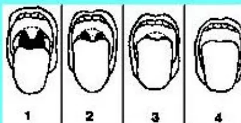
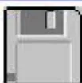
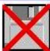
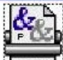
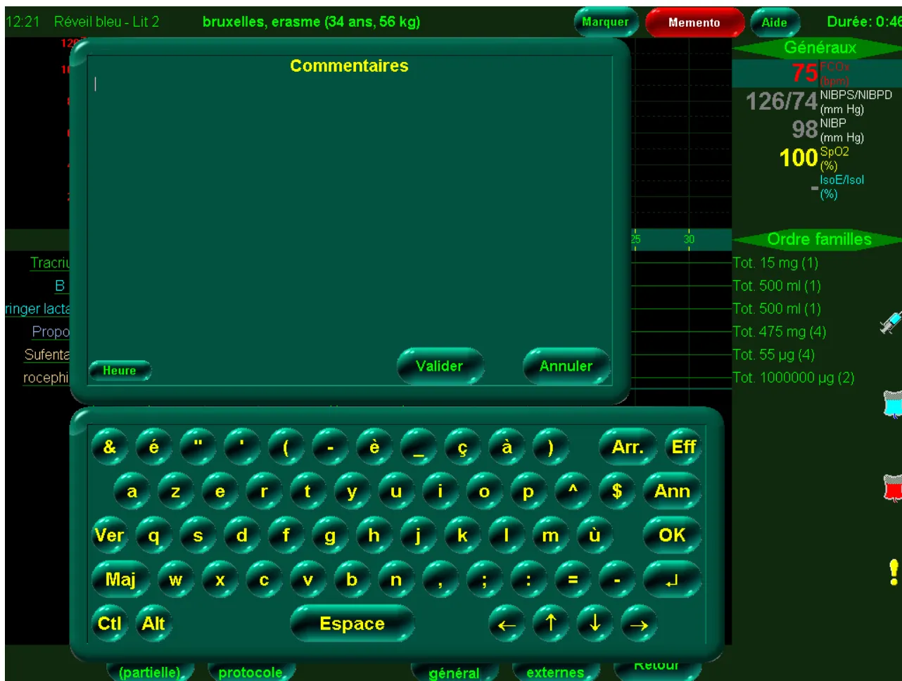
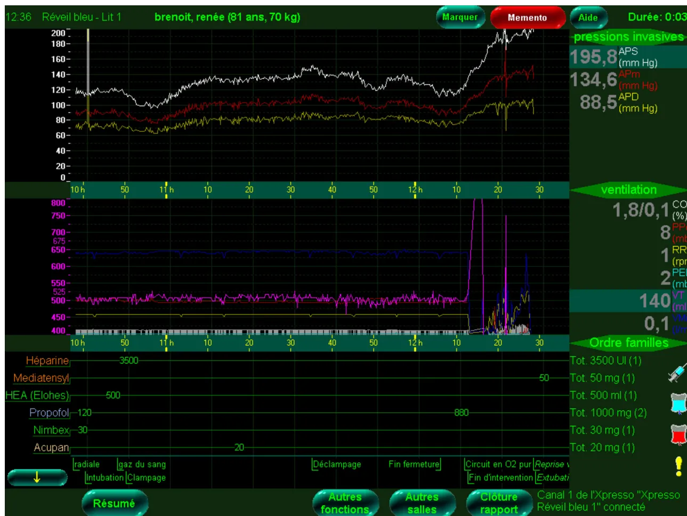
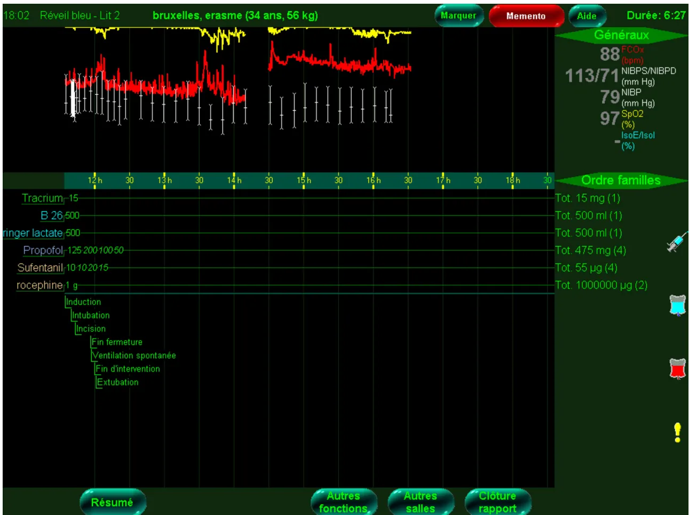
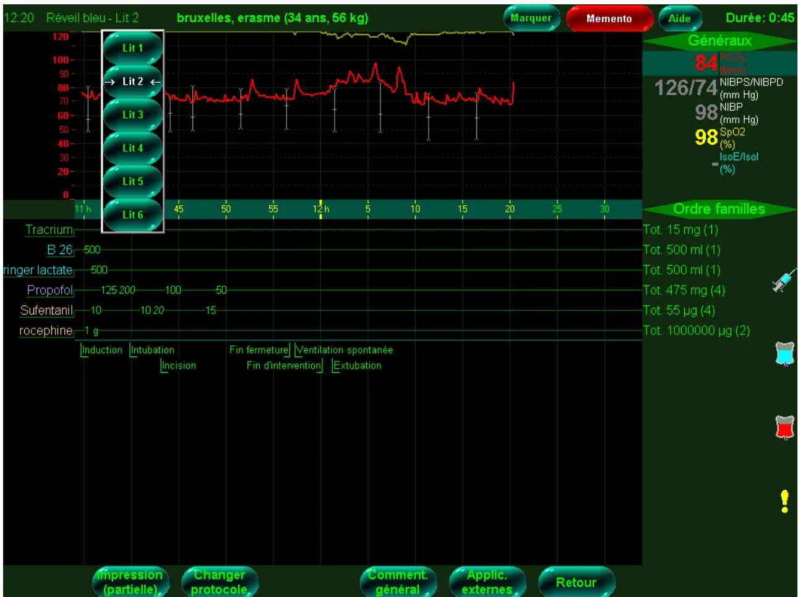

## ANNEXE 8.1.a : Exemple d'écran en consultation d'anesthésie

Page 1 : Etat civil, antécédents, paramètres

**Fiche Patients**
**Dr**
14/01/1999

**Nom**  **Prénom**

Date Naissance 15/ /1953
**Groupe** O+ pro
**Agglu** POSITIVE le 07/07/99

Méd Traitant : Dr 
22, Avenue

**Antécédents médicaux** S 6 00 03 00
 

<table border="1" style="width: 100%; border-collapse: collapse; margin-top: 5px;">
<tr>
<td style="width: 12.5%;">Cardiovasc</td>
<td style="width: 12.5%;">Pulmonaire</td>
<td style="width: 12.5%;">Digestif</td>
<td style="width: 12.5%;">Néphro_Uro</td>
<td style="width: 12.5%;">Neuro_Psy</td>
<td style="width: 12.5%;">Métabol</td>
<td style="width: 12.5%;">ORL-Ophth</td>
<td style="width: 12.5%;">Génitaux</td>
<td style="width: 12.5%;">Divers</td>
</tr>
</table>

HTA, hypogonadisme secondaire, Obésité++, Hypothyroïdie, Hyperuricémie, suspicion embolie pulmonaire (hospitalisation a Laennec)

**Antécédents chirurgicaux**

<table border="1" style="width: 100%; border-collapse: collapse; margin-top: 5px;">
<tr>
<td style="width: 12.5%;">Cardiovasc</td>
<td style="width: 12.5%;">Thoraciques</td>
<td style="width: 12.5%;">Chir Générale</td>
<td style="width: 12.5%;">Urologie</td>
<td style="width: 12.5%;">Orthopédie</td>
<td style="width: 12.5%;">ORL-Ophth</td>
<td style="width: 12.5%;">Gynéco</td>
<td style="width: 12.5%;">Divers</td>
</tr>
</table>

Orchidectomie (néo), curage ggl lomboaortique, Eventration 2X, kyste pancréas avec colostomie avec hospitalisation en réa chir Hautepierre, Chimiothérapies, Colectomie à Gauche, Rectum

**Antécédents obstétricaux**

**Antécédents allergiques**  
 PAS D'ALLERGIES

**Antécédents Familiaux**  
 Obésité

**Antécédents anesthésiques**  
 Pb infectieux post-op ayant nécessité transfert en réa, Intubation très difficile (mandrin, seule l'épiglotte)

Poids 114 Kg  
 Taille 1,70 m  
 Phlébites  OUI  NON

Tabac NEANT  
 Dents DENTS SP

Déjà transfusé : OUI  
 Mallampati 4  
 Intubation

[Précisions sur l'intubation](#)

**ACTES A LA CLINIQUE**

Naissance 15/ /53  
**Colectomie à Gauche, Re**  
 AG+Intubation  
 (Dr )  
 (Dr )  
 Le 14/04/99

Naissance 15/ /53  
**Kyste pancreas**  
 AG+Intub  
 (Dr )  
 (Dr )  
 Le 23/06/95

Naissance  
 Le

Naissance  
 Le

VALIDER

QUITTER

CONSULTATIONS

ANESTHESIES

ETAT CIVIL

NOUVEAU DOSSIER ( Personne différente)

COURRIERS

EFFACER

MODIFIER MEDECIN TRAITANT

CHERCHER DANS LISTE DES MEDECINS## ANNEXE 8.1.b : Exemple d'écran en consultation d'anesthésie

**Menus déroulants. Ici celui de la chirurgie orthopédique déclenché par un clic sur la case Orthopédie. L'item choisi s'inscrit sans taper**

The screenshot shows a patient record form titled "Fiche Patients". It includes fields for "Nom", "Date Naissance" (01/01/1956), "Groupe" (A), and "Méd Traitant : Dr". There are sections for "Antécédents médicaux" (Cardiovasc, Pulmonaire, Digestif, Néphro-Uro, Neuro-Psy, Métabol, ORL-Opht, Génitaux, Divers), "Antécédents chirurgicaux" (Cardiovasc, Thoraciques, Chir Générale, Urologie), "Antécédents obstétricaux", and "Antécédents allergiques". A dropdown menu is open, showing a list of orthopedic procedures. A red arrow points to the "NOUVELLE VALEUR" option at the top of the list. At the bottom of the form, there are buttons for "Paiements", "Plannings", "RETOU", "MODIFI", and "CHERCHER".

**Antécédents médicaux**

<table border="1"><tr><td>Cardiovasc</td><td>Pulmonaire</td><td>Digestif</td><td>Néphro-Uro</td><td>Neuro-Psy</td><td>Métabol</td><td>ORL-Opht</td><td>Génitaux</td><td>Divers</td></tr></table>

**Antécédents chirurgicaux**

<table border="1"><tr><td>Cardiovasc</td><td>Thoraciques</td><td>Chir Générale</td><td>Urologie</td></tr></table>

**Antécédents obstétricaux**

**Antécédents allergiques**

Poids : 0 Kg    Tabac :  
Taille : ,00 m    Dents :  
Phlébites :  OUI  NON

**NOUVELLE VALEUR**

- Ablation Agrafe
- Ablation matériel
- Ablation matériel hanche
- Acromioplastie
- Algodystrophie
- Arhrodèse cervicale
- Arthrodèse cheville
- Arthrodèse genou
- Arthrodèse hanche
- Arthrolyse
- Arthroscopie cheville
- Arthroscopie épaule
- Arthroscopie genou
- Arthrotomie coude
- Biopsie osseuse
- Bursite
- Butée épaule (Bristow)
- Changement PTH
- Changt Polyéthylène PTG
- Comblement cavité osseuse
- Ender
- Epicondylite
- Examen sous AG
- Excision plaie sur cicatrice
- Exostose
- Fracture
- Fracture jambe
- Hallux Valgus
- Harrington
- Hernie discale

**Paiements**  
**Plannings**

**RETOU**  
**MODIFI**  
**CHERCHER**

**THESIES**  
**EMENT**### ANNEXE 8.1.c : Exemple d'écran en consultation d'anesthésie

Page 2 : Motifs de la CPA, données cliniques, examens demandés, prémédications

<table border="1">
<tr>
<td colspan="2">
<input type="checkbox"/> Anesthésiste: <b>Dr</b> 
        Remplaçant:
      </td>
<td colspan="2">
<b>Fiche de Consultation</b> 
        Date Consultation Jeu 08 nov 2001
      </td>
<td colspan="2">
        Chirurgien: Dr
      </td>
</tr>
<tr>
<td colspan="3"></td>
<td colspan="3">
        Date de Naissance Dim 16 juil 19 2 ans
      </td>
</tr>
<tr>
<td colspan="3">
<b>PTH Gauche</b>
</td>
<td colspan="3">
        Date Admission Ven 30 nov 2001 
        Date Intervention Lun 03 déc 2001
      </td>
</tr>
<tr>
<td>
<b>Intervention</b> 
        Générale ORL-Opht 
        Vasculaire Urologie 
        Orthopédie Endoscopie 
        Sein Thora Radio Vasc 
        Gynéco Esthétique 
        Divers SOS Main
      </td>
<td>
<b>Traitement</b> 
<input checked="" type="checkbox"/> <b>Antiagregants</b> 
        ZYLORIC 100, CELECTOL, PLAVIX (ARRET LE 8/11)
      </td>
<td colspan="4">
<input type="checkbox"/> Ambulatoire
      </td>
</tr>
<tr>
<td></td>
<td>
        CardioVasc 
        Dyspnée d'effort, Artérite II prédominant à D, HTA 
        TRAITEE, Toux productive
      </td>
<td>
        Pulmonaire
      </td>
<td>
        Digestif 
        PAS DE SYMPTOME DIGESTIF
      </td>
<td>
        Rénal
      </td>
<td>
        Neuro 
        NEURO SP
      </td>
</tr>
<tr>
<td></td>
<td></td>
<td></td>
<td></td>
<td></td>
<td>
        Divers
      </td>
</tr>
<tr>
<td colspan="6">
<b>COTE</b>
</td>
</tr>
<tr>
<td>
<b>TA 16/8</b> 
        Etat général Moyen 
        ASA 2 
        ECG 
        Suivi par Dr 
        Consult chez Cardiologue: Dr
      </td>
<td>
        Pouls 70 
<b>Mallampati</b> 2 
        THORAX
      </td>
<td>
<b>Veines</b> <input checked="" type="radio"/> Faciles <input type="radio"/> Difficiles 
<b>Intubation</b> <input checked="" type="radio"/> Facile <input type="radio"/> A Risque 
        Facile a priori
      </td>
<td colspan="3">
<b>BIOLOGIE</b> 
        BIOLOGIE A LA CLINIQUE
      </td>
</tr>
<tr>
<td colspan="6">
<b>DIVERS</b> 
<b>Doppler carotidien : sténose moyenne à G (Dr ); demande par l'angiologue de faire une artério TSA et mbres inf.</b>
</td>
</tr>
<tr>
<td colspan="2">
        Veille Soir : Prémédication - 
        Atarax 50+ 1/2 Lexomil
      </td>
<td>
        Anticoagulants 
        AUCUN
      </td>
<td>
        Prémé Matin J op 
        Atarax 50+ 1/2 Lexomil
      </td>
<td>
        Heure 
        VOIR A LA VISITE
      </td>
<td>
        Prévisions Transfusionnelles 
        Pas nécessaire
      </td>
</tr>
<tr>
<td colspan="3">
<b>Technique d'anesthésie proposée</b>
</td>
<td colspan="3">
<b>AG+Intubation</b>
</td>
</tr>
<tr>
<td>
<b>Début</b> 
        17:07 
<b>Fin</b> 
        17:30 
        00:23
      </td>
<td>
<b>VALIDER</b> <b>QUITTER</b> <b>DOSSIER PATIENT</b> <b>INTERVENTIONS</b> <b>IMPRIMER FICHE</b> <b>PLANNING</b> 
<b>LETTRES-IMPRIMES</b> <b>ORDONNANCES et BILANS</b> <b>EXAMENS DEMANDES</b> <b>OP EN 2 TEMPS</b> 
<b>NOUVELLE CS</b> <b>ETAT CIVIL</b> <b>Cs PRECEDENTES</b> <b>HORAIRES</b> <b>EFFACER</b> <b>CORONARO</b>
</td>
<td colspan="4">
        Honoraires Cs : 
        150 
        Dépassement prévu :
      </td>
</tr>
</table>## ANNEXE 8.1.d : Exemple d'écran en consultation d'anesthésie

Par de simples clics, des ordonnances et des courriers préfabriqués s'impriment

<table border="1"><thead><tr><th colspan="4"> <b>TYPE D'ORDONNANCE A EDITER :</b></th></tr><tr><th><b>EXAMENS / ANALYSES</b></th><th><b>ORDONNANCES</b></th><th><b>EPARGNE SANGUINE</b></th><th><b>DIVERS</b></th></tr></thead><tbody><tr><td><ul style="list-style-type: none; padding-left: 0;"><li><input type="radio"/> BIOLOGIE EN VILLE</li><li><input checked="" type="radio"/> EXAMENS A LA CLINIQUE</li><li> </li><li><input type="radio"/> THORAX</li><li><input type="radio"/> CORONAROGRAPHIE</li><li><input type="radio"/> SCANNER</li><li><input type="radio"/> ARTERIOGRAPHIE</li><li> </li><li><input type="radio"/> EFR</li><li> </li><li><input type="radio"/> AUTRE EXAMEN</li><li> </li><li><input type="radio"/> BILAN TCK ALLONGE</li></ul></td><td>
<b>AVK</b>
<ul style="list-style-type: none; padding-left: 0;"><li><input type="radio"/> RELAIS AVK-CALCIPARINE</li><li><input type="radio"/> RELAIS AVK-HBPM</li><li><input type="radio"/> PROLONGATION RELAIS (= + 3 jours à partir d'aujourd'hui)</li></ul>
<b>ANTIAGREGANTS</b>
<ul style="list-style-type: none; padding-left: 0;"><li><input type="radio"/> RELAIS ASPIRINE-CEBUTID</li><li><input type="radio"/> RELAIS TICLID-CEBUTID</li><li><input type="radio"/> CONSIGNES ARRET ASPIRINE</li></ul>
<b>EMLA</b>
<ul style="list-style-type: none; padding-left: 0;"><li><input type="radio"/> PATCH EMLA</li></ul></td><td><ul style="list-style-type: none; padding-left: 0;"><li><input type="radio"/> ERYTHAPHERESE PRE-OP</li><li><input checked="" type="radio"/> AUTOTRANSFUSION</li><li><input type="radio"/> ERYTHROPOIETINE</li><li><input type="radio"/> FER-ACIDE FOLIQUE</li><li><input type="radio"/> BILAN POST TRANSFUSION</li></ul></td><td><ul style="list-style-type: none; padding-left: 0;"><li><input type="radio"/> PREPA ANTI-ALLERGIQUE</li><li><input type="radio"/> PREVENTION ENDOCARDITE</li><li><input type="radio"/> FAIRE UN COURRIER</li><li><input type="radio"/> ORDONNANCE MANUSCRITE</li></ul></td></tr></tbody></table>### ANNEXE 8.1.e : Exemple d'écran en consultation d'anesthésie

De simples clics pour choisir les examens demandés. Les ordonnances s'impriment automatiquement.

**EXAMENS A FAIRE A LA CLINIQUE**

<table border="1"><tr><td>
<input checked="" type="checkbox"/> <b>BIOLOGIE</b>
<table><tr><td><input checked="" type="checkbox"/> NFS</td><td><input type="checkbox"/> CPK, CPK-MB</td></tr><tr><td><input checked="" type="checkbox"/> Plaquettes</td><td><input type="checkbox"/> Bilirubine T+D</td></tr><tr><td><input checked="" type="checkbox"/> Groupe (ABO,Rh,Kell) <input type="radio"/> 1 détermination <input type="radio"/> 2 déterminations</td><td><input type="checkbox"/> Protéines, Albumine</td></tr><tr><td><input checked="" type="checkbox"/> RAI</td><td><input type="checkbox"/> Gaz du sang</td></tr><tr><td><input checked="" type="checkbox"/> TP, TCK</td><td><input type="checkbox"/> Cholestérol, Triglycérides</td></tr><tr><td><input checked="" type="checkbox"/> YS, CRP</td><td><input checked="" type="checkbox"/> Fer sérique</td></tr><tr><td><input checked="" type="checkbox"/> NA, K, Cl</td><td><input checked="" type="checkbox"/> Ferritine</td></tr><tr><td><input type="checkbox"/> Glycémie</td><td><input checked="" type="checkbox"/> Transferrine + Saturation</td></tr><tr><td><input type="checkbox"/> Ca, Ph</td><td><input type="checkbox"/> Sérologies HIY</td></tr><tr><td><input type="checkbox"/> Mg</td><td><input type="checkbox"/> Ag et Ac Hépatite B</td></tr><tr><td><input type="checkbox"/> Urée</td><td><input type="checkbox"/> Ac Hépatite C</td></tr><tr><td><input checked="" type="checkbox"/> Créatinine</td><td><input type="checkbox"/> Autre :</td></tr><tr><td><input type="checkbox"/> Clearance Créatinine</td><td></td></tr><tr><td><input checked="" type="checkbox"/> SGOT, SGPT, Phosph. Alc</td><td></td></tr><tr><td><input type="checkbox"/> Amylase</td><td></td></tr><tr><td><input type="checkbox"/> Gamma-GT</td><td></td></tr></table></td><td>
<input type="checkbox"/> <b>CARDIOLOGIE</b>
<table><tr><td><input type="checkbox"/> ECG + Consult Cardio</td></tr><tr><td><input type="checkbox"/> Echographie cardiaque</td></tr><tr><td><input type="checkbox"/> Coronarographie</td></tr><tr><td><input type="checkbox"/> Doppler cervical</td></tr></table>
<input type="checkbox"/> <b>RADIOLOGIE</b>
<table><tr><td><input type="checkbox"/> Thorax</td></tr><tr><td><input type="checkbox"/> Scanner</td></tr><tr><td><input type="checkbox"/> Colonne lombaire</td></tr></table>
<input type="checkbox"/> Consult Pneumo + EFR

<input type="checkbox"/> <b>PAS D' EXAMEN A FAIRE</b>
</td></tr></table>**ANNEXE 8.1.f : Exemple d'écran en consultation d'anesthésie**  
Aide à la saisie avec rappels de critères prédictifs d'intubation difficile

**NOM**  **Prénom**

**Difficile prévisible**

**Poids :**

Distance Thyro-mentonnière < 65 mm

Rétrognathisme

Ouverture de bouche < 35 mm

Subluxation mâchoire impossible

Proéminence des incisives

ATCD connu d'échec d'intubation

Cou Court

Extension cervicale limitée

**Dents :**

Dents à pivots

**Commentaires**

Antécédent de néo de base de la langue,

The image shows four diagrams of the head and neck in profile, labeled 1, 2, 3, and 4. Diagram 1 shows the tongue at rest. Diagram 2 shows the tongue protruding slightly. Diagram 3 shows the tongue protruding further. Diagram 4 shows the tongue protruding to the maximum extent without traction.

Mallampati :

*(Patient assis, regard à l'horizontale, langue sortie au maximum (sans traction), sans phonation*

A small icon of a floppy disk, representing a save function.

A small icon of a floppy disk with a large red 'X' over it, representing a delete or cancel function.

A small icon of a printer with the characters '&&' on it, representing a print function.## ANNEXE 8.2.a : Exemple d'écran en perinterventionnel

The image shows a medical monitoring system interface. At the top, there is a status bar with the following information: 12:21, Réveil bleu - Lit 2, bruxelles, erasme (34 ans, 56 kg), Marquer, Memento, Aide, and Durée: 0:46. Below this, a large green box titled 'Commentaires' is displayed. To the right of the 'Commentaires' box, there is a 'Généraux' (General) section showing vital signs:  $75 \text{ FCO}_2 \text{ (bpm)}$ ,  $126/74 \text{ NIBPS/NIBPD (mm Hg)}$ ,  $98 \text{ NIBP (mm Hg)}$ ,  $100 \text{ SpO}_2 \text{ (\%)}$ , and  $\text{IsoE/IsoI (\%)}$ . Below the 'Généraux' section, there is an 'Ordre familles' (Family Orders) section with a list of orders: Tot. 15 mg (1), Tot. 500 ml (1), Tot. 500 ml (1), Tot. 475 mg (4), Tot. 55  $\mu\text{g}$  (4), and Tot. 1000000  $\mu\text{g}$  (2). At the bottom of the screen, there is a virtual keyboard with various keys including letters, numbers, and function keys like 'Arr.', 'Eff', 'Ann', 'OK', 'Espace', and 'Retour'. The keyboard is overlaid on a grid background. At the very bottom, there are several tabs: (partielle), protocole, général, externes, and Retour.

Saisie sur clavier virtuel (écran tactile)## ANNEXE 8.2.b : Exemple d'écran en perinterventionnel

The screenshot displays a comprehensive medical monitoring interface for a patient named 'brenoit, renée (81 ans, 70 kg)' at 12:36. The interface is divided into several sections:

- **Top Bar:** Shows the time (12:36), patient name, and status (Réveil bleu - Lit 1). There are buttons for 'Marquer', 'Memento', 'Aide', and 'Durée: 0:03'.
- **Vital Signs Graphs:**
  - **pressions invasives:** A graph showing three lines (white, red, yellow) representing different blood pressure measurements. The y-axis ranges from 0 to 200 mm Hg.
  - **ventilation:** A graph showing ventilation parameters. The y-axis ranges from 400 to 800.
- **Right Sidebar (Data Summary):**
  - **pressions invasives:**
    - APS (mm Hg): 195,8
    - APm (mm Hg): 134,6
    - APD (mm Hg): 88,5
  - **ventilation:**
    - CO2 (%) : 1,8/0,1
    - PPe (mb) : 8
    - RR (rpn) : 1
    - PEE (mb) : 2
    - VT (ml) : 140
    - VMI (l/m) : 0,1
  - **Ordre familles:**
    - Tot. 3500 UI (1)
    - Tot. 50 mg (1)
    - Tot. 500 ml (1)
    - Tot. 1000 mg (2)
    - Tot. 30 mg (1)
    - Tot. 20 mg (1)
- **Medication Graphs:** A graph showing the cumulative dosages of various medications over time. The y-axis ranges from 0 to 800. The medications and their cumulative doses are:
  - Héparine: 3500
  - Mediatensyl: 50
  - HEA (Elohes): 500
  - Propofol: 120
  - Nimbex: 30
  - Acupan: 20
- **Event Log:** A timeline at the bottom showing various medical events: 'radiale', 'gaz du sang', 'Intubation', 'Clampage', 'Déclampage', 'Fin fermeture', 'Circuit en O2 pur', 'Reprise v', 'Fin d'intervention', 'Extubati'.
- **Navigation and Action Buttons:** Includes 'Résumé', 'Autres fonctions', 'Autres salles', 'Clôture rapport', and 'Canal 1 de l'Xpresso "Xpresso Réveil bleu 1" connecté'.

Affichage des courbes et des valeurs des moniteurs et du ventilateur. Affichage des événements saisis (menus déroulants sur écran tactile) et visualisation synthétique de la chronologie. Affichages des doses et volumes cumulés des médicaments et des perfusions## ANNEXE 8.2.c : Exemple d'écran en perinterventionnel

12:39 Réveil bleu - Lit 1      brenoit, renée (81 ans, 70 kg)      Marquer      Memento      Aide      Durée: 0:06

### Récapitulatif des introductions manuelles

<table border="1">
<thead>
<tr>
<th>Acte posé</th>
<th>Introduction manuelle</th>
<th>Famille</th>
<th>Encodé</th>
</tr>
</thead>
<tbody>
<tr>
<td>10:35:50</td>
<td>Circuit en O2 pur</td>
<td></td>
<td>10:46:30</td>
</tr>
<tr>
<td>10:35:50</td>
<td>Induction</td>
<td></td>
<td>10:46:17</td>
</tr>
<tr>
<td>10:36:34</td>
<td>Ringer lactate: 500 ml</td>
<td>Cristalloïde</td>
<td>10:43:47</td>
</tr>
<tr>
<td>10:36:40</td>
<td>radiale</td>
<td></td>
<td>11:07:07</td>
</tr>
<tr>
<td>10:37:45</td>
<td>Propofol: 120 mg</td>
<td>Hypnotique / BDZ / Neuroleptique</td>
<td>10:45:50</td>
</tr>
<tr>
<td>10:37:53</td>
<td>Nimbex: 30 mg</td>
<td>Myorelaxant</td>
<td>10:42:07</td>
</tr>
<tr>
<td>10:37:57</td>
<td>Remifentanil: 50 µg</td>
<td>Analgésique</td>
<td>10:42:54</td>
</tr>
<tr>
<td>10:39:30</td>
<td>Intubation</td>
<td></td>
<td>10:47:16</td>
</tr>
<tr>
<td>10:44:40</td>
<td>HEA (Elohes): 500 ml</td>
<td>Autres</td>
<td>10:44:39</td>
</tr>
<tr>
<td>10:47:20</td>
<td>gaz du sang</td>
<td></td>
<td>10:48:36</td>
</tr>
<tr>
<td>10:48:00</td>
<td>Héparine: 3500 UI</td>
<td>Réanimation</td>
<td>11:06:20</td>
</tr>
<tr>
<td>10:49:25</td>
<td>Clampage</td>
<td></td>
<td>10:51:31</td>
</tr>
<tr>
<td>10:54:33</td>
<td>Ringer lactate: 500 ml</td>
<td>Cristalloïde</td>
<td>10:54:33</td>
</tr>
<tr>
<td>11:15:45</td>
<td>Acupan: 20 mg</td>
<td>Analgésique</td>
<td>11:22:06</td>
</tr>
<tr>
<td>11:34:19</td>
<td>Déclampage</td>
<td></td>
<td>11:34:19</td>
</tr>
<tr>
<td>11:38:46</td>
<td>Morphine: 10 mg</td>
<td>Analgésique</td>
<td>11:38:46</td>
</tr>
<tr>
<td>11:53:34</td>
<td>Ringer lactate: 500 ml</td>
<td>Cristalloïde</td>
<td>11:53:34</td>
</tr>
<tr>
<td>12:05:15</td>
<td>Fin fermeture</td>
<td></td>
<td>12:06:45</td>
</tr>
<tr>
<td>12:07:48</td>
<td>Remifentanil: 2,13 mg</td>
<td>Analgésique</td>
<td>12:07:48</td>
</tr>
<tr>
<td>12:08:47</td>
<td>Propofol: 880 mg</td>
<td>Hypnotique / BDZ / Neuroleptique</td>
<td>12:08:47</td>
</tr>
<tr>
<td>12:11:00</td>
<td>Circuit en O2 pur</td>
<td></td>
<td>12:11:18</td>
</tr>
<tr>
<td>12:11:50</td>
<td>Fin d'intervention</td>
<td></td>
<td>12:09:16</td>
</tr>
</tbody>
</table>

Sélection multiple      Supprimer      Modifier      Retour

1 de l'Xpresso "Xpresso bleu 1" connecté

**pressions invasives**

APS (mm Hg) **195,8**

APm (mm Hg) **134,6**

APD (mm Hg) **88,5**

**Ordre familles**

- Tot. 3500 UI (1)
- Tot. 50 mg (1)
- Tot. 500 ml (1)
- Tot. 1000 mg (2)
- Tot. 30 mg (1)
- Tot. 20 mg (1)
- Tot. 10 mg (1)
- Tot. 2180 µg (2)
- Tot. 1500 ml (3)

Lecture chronologique synthétique des événements saisis (à l'aide de menus déroulants)## ANNEXE 8.2.d : Exemple d'écran en perinterventionnel

**Aperçu avant impression**

Nom: bruxelles, erasme Intervention: Hysterectomie Anesthésiste: Landais A. Date: 28 juin 2002  
 Date de naissance: 12 décembre 1968 Chirurgien: Chevalier Réveil bleu - Lit 2

**Vital Signs:**  
 SpO2 %: 75 (FCO2 bpm)  
 NIBPS/NIBPD (mm Hg): 126/74  
 NIBP (mm Hg): 98  
 SpO2 (%): 99  
 IsoE/IsoL (%): -

**Order families:**  
 Tot. 15 mg (1)  
 Tot. 500 ml (1)  
 Tot. 500 ml (1)  
 Tot. 475 mg (4)  
 Tot. 55 µg (4)  
 Tot. 1000000 µg (2)

**Drug Administration:**

<table border="1">
<tr>
<td>Sufentanil (µg)</td>
<td>10</td>
<td>10</td>
<td>15</td>
</tr>
<tr>
<td>Propofol (mg)</td>
<td>125</td>
<td>200</td>
<td>100</td>
</tr>
<tr>
<td>B 26 (ml)</td>
<td>500</td>
<td></td>
<td>50</td>
</tr>
<tr>
<td>Tractium (mg)</td>
<td>145</td>
<td></td>
<td></td>
</tr>
<tr>
<td>inger lactate (ml)</td>
<td>500</td>
<td></td>
<td></td>
</tr>
<tr>
<td>rocephaine (µg)</td>
<td>1</td>
<td></td>
<td></td>
</tr>
</table>

**Timeline:**  
 Induction [10:35] Intubation [10:39] Incision [10:41] Fin fermeture [12:01] Ventilation spontanée [12:01] Fin d'intervention [12:02] Extubation [12:02]

**Buttons:** Autres rapports, Changer protocole, Imprimer, Retour

Visualisation synthétique à l'écran avant impression sur papier de la feuille d'anesthésie## ANNEXE 8.2.e : Exemple d'écran en perinterventionnel

The screenshot displays an anesthesia monitoring interface for a patient named 'bruxelles, erasme (34 ans, 56 kg)' at 18:02. The interface is divided into several sections:

- **Top Bar:** Shows the time (18:02), patient name, and duration (6:27). Buttons for 'Marquer', 'Memento', and 'Aide' are also visible.
- **Graphs:** Two main graphs are shown. The top graph displays a yellow line (likely ECG) and a red line (likely SpO2). The bottom graph shows a red line (likely blood pressure) and a yellow line (likely heart rate). Both graphs have a time axis with markers for 12h, 13h, 14h, 15h, 16h, 17h, 18h, and 30 minutes.
- **General Parameters (Généraux):** Located on the right side, this section displays vital signs:
  - FCOx (bpm): 88
  - NIBPS/NIBPD (mm Hg): 113/71
  - NIBP (mm Hg): 79
  - SpO2 (%): 97
  - IsoE/IsoL (%): -
- **Medication Orders (Ordre familles):** Listed on the left side of the graph area:
  - Tracrium: 15
  - B: 26 500
  - ringier lactate: 500
  - Propofol: 125 200 100 50
  - Sufentanil: 10 10 20 15
  - rocephine: 1 g
- **Procedure Timeline:** A vertical list of events is shown on the left:
  - Induction
  - Intubation
  - Incision
  - Fin fermeture
  - Ventilation spontanée
  - Fin d'intervention
  - Extubation
- **Bottom Navigation:** Buttons for 'Résumé', 'Autres fonctions', 'Autres salles', and 'Clôture rapport' are located at the bottom.
- **Right Sidebar:** Includes icons for syringes, a bag, and a red box, along with a yellow exclamation mark icon.

Acquisition et fusion dans le même dossier de la phase per et postinterventionnelle. Différentes visualisations (choix des courbes et des paramètres) sont possibles.## ANNEXE 8.2.f : Exemple d'écran en perinterventionnel

The screenshot displays an anesthesia monitoring interface for a patient named 'bruxelles, erasme (34 ans, 56 kg)' at 12:20. The interface is divided into several sections:

- **Top Bar:** Shows the time (12:20), patient name, and duration (0:45). Buttons for 'Marquer', 'Memento', and 'Aide' are also present.
- **Vital Signs (Généraux):**
  - ECO2 (bpm): 84
  - NIBPS/NIBPD (mm Hg): 126/74
  - NIBP (mm Hg): 98
  - SpO2 (%): 98
  - IsoE/IsoI (%): -
- **Monitoring Sites:** A vertical list of sites (Lit 1 to Lit 6) is shown on the left, with Lit 2 currently selected.
- **Drug Administration:**
  - Tracrium: 500
  - B 26: 500
  - ringier lactate: 500
  - Propofol: 125 200, 100, 50
  - Sufentanil: 10, 10 20, 15
  - rocephine: 1 g
- **Procedure Timeline:**
  - Induction
  - Intubation
  - Incision
  - Fin fermeture
  - Fin d'intervention
  - Ventilation spontanée
  - Extubation
- **Order Families (Ordre familles):**
  - Tot. 15 mg (1)
  - Tot. 500 ml (1)
  - Tot. 500 ml (1)
  - Tot. 475 mg (4)
  - Tot. 55 µg (4)
  - Tot. 1000000 µg (2)
- **Bottom Navigation:** Buttons for 'Impression (partielle)', 'Changer protocole', 'Comment. général', 'Applic. externes', and 'Retour'.

Accès possible à distance (depuis d'autres postes) des différents sites monitorés## ANNEXE 9 : Feuille de recueil de la morbi/mortalité

### Anesthésie vigilance : C.H.U. de

**AXE de LECTURE CODE à BARRES**

**N° Secteur**

<table border="1" style="border-collapse: collapse; text-align: center;">
<tr><td>0</td><td>0</td></tr>
<tr><td>1</td><td>1</td></tr>
<tr><td>2</td><td>2</td></tr>
<tr><td>3</td><td>3</td></tr>
<tr><td>4</td><td>4</td></tr>
<tr><td>5</td><td>5</td></tr>
<tr><td>6</td><td>6</td></tr>
<tr><td>7</td><td>7</td></tr>
<tr><td>8</td><td>8</td></tr>
<tr><td>9</td><td>9</td></tr>
</table>

**N° Salle**

<table border="1" style="border-collapse: collapse; text-align: center;">
<tr><td>0</td><td>0</td></tr>
<tr><td>1</td><td>1</td></tr>
<tr><td>2</td><td>2</td></tr>
<tr><td>3</td><td>3</td></tr>
<tr><td>4</td><td>4</td></tr>
<tr><td>5</td><td>5</td></tr>
<tr><td>6</td><td>6</td></tr>
<tr><td>7</td><td>7</td></tr>
<tr><td>8</td><td>8</td></tr>
<tr><td>9</td><td>9</td></tr>
</table>

**Jour Mois An**

<table border="1" style="border-collapse: collapse; text-align: center;">
<tr><td>0</td><td>0</td><td></td></tr>
<tr><td>1</td><td>1</td><td></td></tr>
<tr><td>2</td><td>2</td><td></td></tr>
<tr><td>3</td><td>3</td><td></td></tr>
<tr><td>4</td><td>4</td><td></td></tr>
<tr><td>5</td><td>5</td><td></td></tr>
<tr><td>6</td><td>6</td><td></td></tr>
<tr><td>7</td><td>7</td><td></td></tr>
<tr><td>8</td><td>8</td><td></td></tr>
<tr><td>9</td><td>9</td><td></td></tr>
</table>

**Mois**

<table border="1" style="border-collapse: collapse; text-align: center;">
<tr><td>Jan</td></tr>
<tr><td>Fév</td></tr>
<tr><td>Mars</td></tr>
<tr><td>Avril</td></tr>
<tr><td>Mai</td></tr>
<tr><td>Juin</td></tr>
<tr><td>Juil</td></tr>
<tr><td>Aout</td></tr>
<tr><td>Sept</td></tr>
<tr><td>Oct</td></tr>
<tr><td>Nov</td></tr>
<tr><td>Dec</td></tr>
</table>

**Heure Début Heure Fin**

<table border="1" style="border-collapse: collapse; text-align: center;">
<tr><td>0</td><td>0</td><td>0</td><td>0</td><td>0</td><td>0</td><td>0</td><td>0</td></tr>
<tr><td>1</td><td>1</td><td>1</td><td>1</td><td>1</td><td>1</td><td>1</td><td>1</td></tr>
<tr><td>2</td><td>2</td><td>2</td><td>2</td><td>2</td><td>2</td><td>2</td><td>2</td></tr>
<tr><td>3</td><td>3</td><td>3</td><td>3</td><td>3</td><td>3</td><td>3</td><td>3</td></tr>
<tr><td>4</td><td>4</td><td>4</td><td>4</td><td>4</td><td>4</td><td>4</td><td>4</td></tr>
<tr><td>5</td><td>5</td><td>5</td><td>5</td><td>5</td><td>5</td><td>5</td><td>5</td></tr>
<tr><td>6</td><td>6</td><td>6</td><td>6</td><td>6</td><td>6</td><td>6</td><td>6</td></tr>
<tr><td>7</td><td>7</td><td>7</td><td>7</td><td>7</td><td>7</td><td>7</td><td>7</td></tr>
<tr><td>8</td><td>8</td><td>8</td><td>8</td><td>8</td><td>8</td><td>8</td><td>8</td></tr>
<tr><td>9</td><td>9</td><td>9</td><td>9</td><td>9</td><td>9</td><td>9</td><td>9</td></tr>
</table>

**ACTE**

Acte sans hospitalisation

Acte pendant un transport médical

Mort cérébrale

**PO SSPI**

Trans. homologue

Homo. ou Auto Moins d'1/2 MS

Homo. ou Auto Plus d'1/2 MS

**TRANSFUSION AUTOLOGUE**

HDANI

TAD

Récup. per

Récup. post

**si ANESTHÉSIE GÉNÉRALE**

AG avec sonde type carlens

AG avec masque laryngé

AG avec intubation

AG sans intubation

**si TECHNIQUE d'ALR**

Rachi anesth. Bloc plexique non cervical

Rachi continu Bloc plexique ou tronculaire avec KT laissé en place

Péri lombaire ALRIV

Autre péri Caudale

Péri-rachi combinées A locale simple

Bloc plexique cervical Autre

Bloc tronculaire injection unique Echec technique avec passage en AG

Bloc tronculaire plusieurs injections

**ASA**

1

2

3

4

5

U

**POSITION**

Trendelenbourg

Décubitus latéral

Proclive

Ventrale

Genu pectorale

Assise

Table ortho

Concorde

Gynéco

**DURÉE DU SÉJOUR SSPI**

Moins d'1 heure

1 h à 1 h 59

2 h à 2 h 59

3 h à 3 h 59

4 h à 5 heures

Plus de 5 heures

**DEVENIR**

Domicile

Salle d'hospitalisation

Soins intensifs

Réanimation

Décès

Autre

**SSPI**

Hypothermie < 35° à l'entrée en S de R

Ventilation contrôlée en S de R

Radio en S de R pour anesthésie/réa

Biologie en S de R pour anesthésie/réa

Technique d'antalgie (KT, PCA)

Hyperthermie > 39°

Monitoring standard

Monitoring lourd

**INCIDENTS VENTILATOIRES**

Inhalation pulmonaire

Laryngo bronchospasme

Hyperventilation ( $pCO_2 < 4$  KpA)

Hypoventilation ( $pCO_2 > 6,6$  KpA)

Ventilation post-opératoire non prévue

Hypoxémie ( $SpO_2 < 90\%$  ou  $paO_2 < 7,3$  KpA)

Pneumothorax

Oedème pulmonaire

Autres

**INCIDENTS PHARMACOLOGIQUES**

Réactions anaphylactiques

Erreurs d'administration de drogues

Décurarisation impossible

Excès de morphiniques nécessitant Naloxone

Autres

**INCIDENTS D'INTUBATION**

Obstruction trachéale

Difficulté imprévue d'intubation

Plus d'une tentative d'intubation

Traumatisme dentaire

Intubation oesophagienne

Intubation bronchique sélective

Extubation accidentelle

Obstruction de la sonde d'intubation

Reintubation imprévue

Dyspnée majeure post-intubation

Autres

**INCIDENTS NEUROLOGIQUES**

Convulsion

Paralysie prolongée

Délirium ou agitation majeure

Rétard de réveil (> 2 heures)

Absence de réveil

Autres

**INCIDENTS CUTANÉS**

Brûlures

Lésion oculaire

Echymoses

Infiltrations sous-cutanées

Lésions en rapport avec le garrot

Autres

**INCIDENTS CIRCULATOIRES**

Hypotension (< 80 de systolique)

Hypertension (> 110 de diastolique)

Dépression récente du segment ST

Surélévation récente du segment ST

Extrasystoles ventriculaires récentes nombreuses (> 5/min)

Tachycardie ventriculaire

Fibrillation ventriculaire

Asystole

Infarctus aigu du myocarde

Tachycardie sinusal

Bradycardie sévère

Hypovolémie sévère (< 60 de systolique)

Autres

**INCIDENTS RENAUX**

Anurie

Oligurie (< 1 cm3/KG/h)

Globe vésical nécessitant sondage

Autres

**INCIDENTS D'EQUIPEMENT**

Respirateur d'anesthésie

Circuit d'anesthésie

Moniteurs

Autres