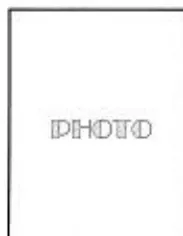
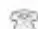

**ANNEXE 4.a : Exemple de feuille de surveillance per anesthésique (page 1)**

**DATE :**

**CHECK-LIST FAITE**

**CONTROLE DES APPUIS**

<table border="1">
<tr>
<td>Heure</td>
<td></td>
<td></td>
<td></td>
<td></td>
<td></td>
<td></td>
<td></td>
<td></td>
<td></td>
</tr>
<tr>
<td></td>
<td></td>
<td></td>
<td></td>
<td></td>
<td></td>
<td></td>
<td></td>
<td></td>
<td></td>
</tr>
<tr>
<td>Événements position</td>
<td></td>
<td></td>
<td></td>
<td></td>
<td></td>
<td></td>
<td></td>
<td></td>
<td></td>
</tr>
<tr>
<td>VC VS VACI</td>
<td>200</td>
<td></td>
<td></td>
<td></td>
<td></td>
<td></td>
<td></td>
<td></td>
<td></td>
</tr>
<tr>
<td>Respirateur :</td>
<td>180</td>
<td></td>
<td></td>
<td></td>
<td></td>
<td></td>
<td></td>
<td></td>
<td></td>
</tr>
<tr>
<td></td>
<td>160</td>
<td></td>
<td></td>
<td></td>
<td></td>
<td></td>
<td></td>
<td></td>
<td></td>
</tr>
<tr>
<td></td>
<td>140</td>
<td></td>
<td></td>
<td></td>
<td></td>
<td></td>
<td></td>
<td></td>
<td></td>
</tr>
<tr>
<td></td>
<td>120</td>
<td></td>
<td></td>
<td></td>
<td></td>
<td></td>
<td></td>
<td></td>
<td></td>
</tr>
<tr>
<td></td>
<td>100</td>
<td></td>
<td></td>
<td></td>
<td></td>
<td></td>
<td></td>
<td></td>
<td></td>
</tr>
<tr>
<td></td>
<td>80</td>
<td></td>
<td></td>
<td></td>
<td></td>
<td></td>
<td></td>
<td></td>
<td></td>
</tr>
<tr>
<td></td>
<td>60</td>
<td></td>
<td></td>
<td></td>
<td></td>
<td></td>
<td></td>
<td></td>
<td></td>
</tr>
<tr>
<td></td>
<td>40</td>
<td></td>
<td></td>
<td></td>
<td></td>
<td></td>
<td></td>
<td></td>
<td></td>
</tr>
<tr>
<td></td>
<td>20</td>
<td></td>
<td></td>
<td></td>
<td></td>
<td></td>
<td></td>
<td></td>
<td></td>
</tr>
<tr>
<td>FR x VT</td>
<td></td>
<td></td>
<td></td>
<td></td>
<td></td>
<td></td>
<td></td>
<td></td>
<td></td>
</tr>
<tr>
<td>+ PEP &amp; (I / E)</td>
<td></td>
<td></td>
<td></td>
<td></td>
<td></td>
<td></td>
<td></td>
<td></td>
<td></td>
</tr>
<tr>
<td>SpO2</td>
<td></td>
<td></td>
<td></td>
<td></td>
<td></td>
<td></td>
<td></td>
<td></td>
<td></td>
</tr>
<tr>
<td>Et CO2</td>
<td></td>
<td></td>
<td></td>
<td></td>
<td></td>
<td></td>
<td></td>
<td></td>
<td></td>
</tr>
<tr>
<td>Fi O2</td>
<td></td>
<td></td>
<td></td>
<td></td>
<td></td>
<td></td>
<td></td>
<td></td>
<td></td>
</tr>
<tr>
<td>Fi N2O</td>
<td></td>
<td></td>
<td></td>
<td></td>
<td></td>
<td></td>
<td></td>
<td></td>
<td></td>
</tr>
<tr>
<td>P+ insufflation</td>
<td></td>
<td></td>
<td></td>
<td></td>
<td></td>
<td></td>
<td></td>
<td></td>
<td></td>
</tr>
<tr>
<td>TOF</td>
<td></td>
<td></td>
<td></td>
<td></td>
<td></td>
<td></td>
<td></td>
<td></td>
<td></td>
</tr>
<tr>
<td>Halogéné Fi</td>
<td></td>
<td></td>
<td></td>
<td></td>
<td></td>
<td></td>
<td></td>
<td></td>
<td></td>
</tr>
<tr>
<td>Fe</td>
<td></td>
<td></td>
<td></td>
<td></td>
<td></td>
<td></td>
<td></td>
<td></td>
<td></td>
</tr>
<tr>
<td></td>
<td></td>
<td></td>
<td></td>
<td></td>
<td></td>
<td></td>
<td></td>
<td></td>
<td></td>
</tr>
<tr>
<td></td>
<td></td>
<td></td>
<td></td>
<td></td>
<td></td>
<td></td>
<td></td>
<td></td>
<td></td>
</tr>
<tr>
<td></td>
<td></td>
<td></td>
<td></td>
<td></td>
<td></td>
<td></td>
<td></td>
<td></td>
<td></td>
</tr>
<tr>
<td></td>
<td></td>
<td></td>
<td></td>
<td></td>
<td></td>
<td></td>
<td></td>
<td></td>
<td></td>
</tr>
<tr>
<td></td>
<td></td>
<td></td>
<td></td>
<td></td>
<td></td>
<td></td>
<td></td>
<td></td>
<td></td>
</tr>
<tr>
<td>PSE 1 :</td>
<td></td>
<td></td>
<td></td>
<td></td>
<td></td>
<td></td>
<td></td>
<td></td>
<td></td>
</tr>
<tr>
<td>PSE 2 :</td>
<td></td>
<td></td>
<td></td>
<td></td>
<td></td>
<td></td>
<td></td>
<td></td>
<td></td>
</tr>
<tr>
<td>PSE 3 :</td>
<td></td>
<td></td>
<td></td>
<td></td>
<td></td>
<td></td>
<td></td>
<td></td>
<td></td>
</tr>
<tr>
<td>SORTIES</td>
<td>Diurèse</td>
<td></td>
<td></td>
<td></td>
<td></td>
<td></td>
<td></td>
<td></td>
<td></td>
</tr>
<tr>
<td></td>
<td>Aspiration</td>
<td></td>
<td></td>
<td></td>
<td></td>
<td></td>
<td></td>
<td></td>
<td></td>
</tr>
<tr>
<td></td>
<td></td>
<td></td>
<td></td>
<td></td>
<td></td>
<td></td>
<td></td>
<td></td>
<td></td>
</tr>
<tr>
<td>APPORTS</td>
<td></td>
<td></td>
<td></td>
<td></td>
<td></td>
<td></td>
<td></td>
<td></td>
<td></td>
</tr>
<tr>
<td></td>
<td></td>
<td></td>
<td></td>
<td></td>
<td></td>
<td></td>
<td></td>
<td></td>
<td></td>
</tr>
<tr>
<td></td>
<td></td>
<td></td>
<td></td>
<td></td>
<td></td>
<td></td>
<td></td>
<td></td>
<td></td>
</tr>
<tr>
<td></td>
<td></td>
<td></td>
<td></td>
<td></td>
<td></td>
<td></td>
<td></td>
<td></td>
<td></td>
</tr>
</table>**ANNEXE 4.a : Exemple de feuille de surveillance per anesthésique (page 2)**

**PROTECTION DES YEUX**

**COUVERTURE CHAUFFANTE**

<table border="1">
<tr>
<td></td>
<td></td>
<td></td>
<td></td>
<td></td>
<td></td>
</tr>
<tr>
<td></td>
<td></td>
<td></td>
<td></td>
<td></td>
<td></td>
</tr>
<tr>
<td></td>
<td></td>
<td></td>
<td></td>
<td></td>
<td></td>
</tr>
<tr>
<td></td>
<td></td>
<td></td>
<td></td>
<td></td>
<td></td>
</tr>
<tr>
<td></td>
<td></td>
<td></td>
<td></td>
<td></td>
<td></td>
</tr>
<tr>
<td></td>
<td></td>
<td></td>
<td></td>
<td></td>
<td></td>
</tr>
<tr>
<td></td>
<td></td>
<td></td>
<td></td>
<td></td>
<td></td>
</tr>
<tr>
<td></td>
<td></td>
<td></td>
<td></td>
<td></td>
<td></td>
</tr>
<tr>
<td></td>
<td></td>
<td></td>
<td></td>
<td></td>
<td></td>
</tr>
<tr>
<td></td>
<td></td>
<td></td>
<td></td>
<td></td>
<td></td>
</tr>
<tr>
<td></td>
<td></td>
<td></td>
<td></td>
<td></td>
<td></td>
</tr>
<tr>
<td></td>
<td></td>
<td></td>
<td></td>
<td></td>
<td></td>
</tr>
<tr>
<td></td>
<td></td>
<td></td>
<td></td>
<td></td>
<td></td>
</tr>
<tr>
<td></td>
<td></td>
<td></td>
<td></td>
<td></td>
<td></td>
</tr>
<tr>
<td></td>
<td></td>
<td></td>
<td></td>
<td></td>
<td></td>
</tr>
<tr>
<td></td>
<td></td>
<td></td>
<td></td>
<td></td>
<td></td>
</tr>
<tr>
<td></td>
<td></td>
<td></td>
<td></td>
<td></td>
<td></td>
</tr>
<tr>
<td></td>
<td></td>
<td></td>
<td></td>
<td></td>
<td></td>
</tr>
<tr>
<td></td>
<td></td>
<td></td>
<td></td>
<td></td>
<td></td>
</tr>
<tr>
<td></td>
<td></td>
<td></td>
<td></td>
<td></td>
<td></td>
</tr>
<tr>
<td></td>
<td></td>
<td></td>
<td></td>
<td></td>
<td></td>
</tr>
<tr>
<td></td>
<td></td>
<td></td>
<td></td>
<td></td>
<td></td>
</tr>
<tr>
<td></td>
<td></td>
<td></td>
<td></td>
<td></td>
<td></td>
</tr>
<tr>
<td></td>
<td></td>
<td></td>
<td></td>
<td></td>
<td></td>
</tr>
<tr>
<td></td>
<td></td>
<td></td>
<td></td>
<td></td>
<td></td>
</tr>
<tr>
<td></td>
<td></td>
<td></td>
<td></td>
<td></td>
<td></td>
</tr>
<tr>
<td></td>
<td></td>
<td></td>
<td></td>
<td></td>
<td></td>
</tr>
<tr>
<td></td>
<td></td>
<td></td>
<td></td>
<td></td>
<td></td>
</tr>
<tr>
<td></td>
<td></td>
<td></td>
<td></td>
<td></td>
<td></td>
</tr>
<tr>
<td></td>
<td></td>
<td></td>
<td></td>
<td></td>
<td></td>
</tr>
<tr>
<td></td>
<td></td>
<td></td>
<td></td>
<td></td>
<td></td>
</tr>
<tr>
<td></td>
<td></td>
<td></td>
<td></td>
<td></td>
<td></td>
</tr>
<tr>
<td></td>
<td></td>
<td></td>
<td></td>
<td></td>
<td></td>
</tr>
<tr>
<td></td>
<td></td>
<td></td>
<td></td>
<td></td>
<td></td>
</tr>
<tr>
<td></td>
<td></td>
<td></td>
<td></td>
<td></td>
<td></td>
</tr>
<tr>
<td></td>
<td></td>
<td></td>
<td></td>
<td></td>
<td></td>
</tr>
<tr>
<td></td>
<td></td>
<td></td>
<td></td>
<td></td>
<td></td>
</tr>
<tr>
<td></td>
<td></td>
<td></td>
<td></td>
<td></td>
<td></td>
</tr>
<tr>
<td></td>
<td></td>
<td></td>
<td></td>
<td></td>
<td></td>
</tr>
<tr>
<td></td>
<td></td>
<td></td>
<td></td>
<td></td>
<td></td>
</tr>
<tr>
<td></td>
<td></td>
<td></td>
<td></td>
<td></td>
<td></td>
</tr>
<tr>
<td></td>
<td></td>
<td></td>
<td></td>
<td></td>
<td></td>
</tr>
<tr>
<td></td>
<td></td>
<td></td>
<td></td>
<td></td>
<td></td>
</tr>
<tr>
<td></td>
<td></td>
<td></td>
<td></td>
<td></td>
<td></td>
</tr>
<tr>
<td></td>
<td></td>
<td></td>
<td></td>
<td></td>
<td></td>
</tr>
<tr>
<td></td>
<td></td>
<td></td>
<td></td>
<td></td>
<td></td>
</tr>
<tr>
<td></td>
<td></td>
<td></td>
<td></td>
<td></td>
<td></td>
</tr>
<tr>
<td></td>
<td></td>
<td></td>
<td></td>
<td></td>
<td></td>
</tr>
<tr>
<td></td>
<td></td>
<td></td>
<td></td>
<td></td>
<td></td>
</tr>
<tr>
<td></td>
<td></td>
<td></td>
<td></td>
<td></td>
<td></td>
</tr>
<tr>
<td></td>
<td></td>
<td></td>
<td></td>
<td></td>
<td></td>
</tr>
<tr>
<td></td>
<td></td>
<td></td>
<td></td>
<td></td>
<td></td>
</tr>
<tr>
<td></td>
<td></td>
<td></td>
<td></td>
<td></td>
<td></td>
</tr>
<tr>
<td></td>
<td></td>
<td></td>
<td></td>
<td></td>
<td></td>
</tr>
<tr>
<td></td>
<td></td>
<td></td>
<td></td>
<td></td>
<td></td>
</tr>
<tr>
<td></td>
<td></td>
<td></td>
<td></td>
<td></td>
<td></td>
</tr>
<tr>
<td></td>
<td></td>
<td></td>
<td></td>
<td></td>
<td></td>
</tr>
<tr>
<td></td>
<td></td>
<td></td>
<td></td>
<td></td>
<td></td>
</tr>
</table>

*Monitoring per op particulier*

- •
- •
- •
- •

*Produits sanguins*

FR x VT  
+PEP & (I/E)

SpO2  
EtCO2  
Fi O2  
FiN2O  
P\* Ins.  
TOF

Fi  
Fe

Diurèse  
Aspiration

*Apports totaux :*  
Ringer : ml SG5 % : ml  
Macromolécules :  
Produits sanguins :**ANNEXE 4.b : Exemple de feuille de surveillance per anesthésique**

<table border="1">
<tr>
<td colspan="2"><b>Date :</b> _____</td>
<td align="center" colspan="2"><b>Heures</b></td>
<td align="center">10</td><td align="center">20</td><td align="center">30</td><td align="center">40</td><td align="center">50</td><td align="center">60</td>
<td align="center">10</td><td align="center">20</td><td align="center">30</td><td align="center">40</td><td align="center">50</td><td align="center">60</td>
<td align="center">10</td><td align="center">20</td><td align="center">30</td><td align="center">40</td><td align="center">50</td><td align="center">60</td>
<td align="center">10</td><td align="center">20</td><td align="center">30</td><td align="center">40</td><td align="center">50</td><td align="center">60</td>
</tr>
<tr>
<td colspan="2">
<b>MONITORAGE</b> 
                - PNI <input type="checkbox"/> 
                - Cardioscope <input type="checkbox"/> 
                - SpO2 <input type="checkbox"/> 
                - Monitorage ET CO2 <input type="checkbox"/> 
                - Monitorage halogénés <input type="checkbox"/> 
                - Neurostimulateur <input type="checkbox"/> 
                - Sonde vésicale <input type="checkbox"/> 
                - Sonde gastrique <input type="checkbox"/> 
                - Réchauffeur <input type="checkbox"/> 
                - Sonde température <input type="checkbox"/> 
                - Autres <input type="checkbox"/> 
<b>REEVALUATION PRE-OPERATOIRE</b> <input type="checkbox"/>
</td>
<td>
<b>VOIE VEINEUSE PERIPHERIQUE</b> 
                Lieu _____ 
                Type _____ 
                Autres _____ 
<b>TYPE CHIRURGIE</b> 
                Propre <input type="checkbox"/> 
                Propre-Contaminé <input type="checkbox"/> 
                Contaminé <input type="checkbox"/> 
                Sale <input type="checkbox"/>
</td>
<td align="center" rowspan="10"><b>ANESTHESIE</b></td>
<td align="center" colspan="2"><b>Temps Opérateur</b></td>
<td></td><td></td><td></td><td></td><td></td><td></td>
<td></td><td></td><td></td><td></td><td></td><td></td>
<td></td><td></td><td></td><td></td><td></td><td></td>
<td></td><td></td><td></td><td></td><td></td><td></td>
</tr>
<tr>
<td colspan="2"><b>POSITION PATIENT</b> 
                Déclive Proclive DD DV DLG DLD 
                Gynéco Genu pectoral Billot
            </td>
<td align="center">200 40° 20</td>
<td></td><td></td><td></td><td></td><td></td><td></td>
<td></td><td></td><td></td><td></td><td></td><td></td>
<td></td><td></td><td></td><td></td><td></td><td></td>
<td></td><td></td><td></td><td></td><td></td><td></td>
</tr>
<tr>
<td colspan="2"><b>TYPE ANESTHESIE</b> 
<b>Loco-régionale</b> Rachi Péridurale ALRIV 
                Périlombaire Bloc Locale 
<b>Générale</b> AG sans intubation 
                AG avec intubation
            </td>
<td align="center">150 38° 15</td>
<td></td><td></td><td></td><td></td><td></td><td></td>
<td></td><td></td><td></td><td></td><td></td><td></td>
<td></td><td></td><td></td><td></td><td></td><td></td>
<td></td><td></td><td></td><td></td><td></td><td></td>
</tr>
<tr>
<td colspan="2"><b>INTUBATION</b> OT NT N° ..... 
                Difficile
            </td>
<td align="center">100 37° 10</td>
<td></td><td></td><td></td><td></td><td></td><td></td>
<td></td><td></td><td></td><td></td><td></td><td></td>
<td></td><td></td><td></td><td></td><td></td><td></td>
<td></td><td></td><td></td><td></td><td></td><td></td>
</tr>
<tr>
<td colspan="2"><b>MASQUE LARYNGE</b> N° ..... 
<b>FIBROSCOPIE</b> <input type="checkbox"/> Dr .....
            </td>
<td align="center">50 34° 5</td>
<td></td><td></td><td></td><td></td><td></td><td></td>
<td></td><td></td><td></td><td></td><td></td><td></td>
<td></td><td></td><td></td><td></td><td></td><td></td>
<td></td><td></td><td></td><td></td><td></td><td></td>
</tr>
<tr>
<td colspan="2"><b>VENTILATION</b> Spontanée Masque Autre 
<b>OXYGENOTHERAPIE</b> l/min.
            </td>
<td align="center">pouls θ TA</td>
<td></td><td></td><td></td><td></td><td></td><td></td>
<td></td><td></td><td></td><td></td><td></td><td></td>
<td></td><td></td><td></td><td></td><td></td><td></td>
<td></td><td></td><td></td><td></td><td></td><td></td>
</tr>
<tr>
<td colspan="2"><b>RESPIRATEUR</b> 
                VT X f ..... FI02/N2O ..... 
<b>Circuit</b> Ouvert <input type="checkbox"/> Fermé <input type="checkbox"/>
</td>
<td align="center">SPO2</td>
<td></td><td></td><td></td><td></td><td></td><td></td>
<td></td><td></td><td></td><td></td><td></td><td></td>
<td></td><td></td><td></td><td></td><td></td><td></td>
<td></td><td></td><td></td><td></td><td></td><td></td>
</tr>
<tr>
<td colspan="2"><b>SALLE DE REVEIL</b> 
                Réveil simple <input type="checkbox"/> 
                Réveil monitoré <input type="checkbox"/>
</td>
<td align="center">ET CO2</td>
<td></td><td></td><td></td><td></td><td></td><td></td>
<td></td><td></td><td></td><td></td><td></td><td></td>
<td></td><td></td><td></td><td></td><td></td><td></td>
<td></td><td></td><td></td><td></td><td></td><td></td>
</tr>
<tr>
<td colspan="2"><b>Signature</b></td>
<td align="center">HALOGENES</td>
<td></td><td></td><td></td><td></td><td></td><td></td>
<td></td><td></td><td></td><td></td><td></td><td></td>
<td></td><td></td><td></td><td></td><td></td><td></td>
<td></td><td></td><td></td><td></td><td></td><td></td>
</tr>
<tr>
<td colspan="2"></td>
<td align="center"><b>MEDICAMENTS</b></td>
<td></td><td></td><td></td><td></td><td></td><td></td>
<td></td><td></td><td></td><td></td><td></td><td></td>
<td></td><td></td><td></td><td></td><td></td><td></td>
<td></td><td></td><td></td><td></td><td></td><td></td>
</tr>
<tr>
<td colspan="2"></td>
<td align="center"><b>PERFU</b></td>
<td></td><td></td><td></td><td></td><td></td><td></td>
<td></td><td></td><td></td><td></td><td></td><td></td>
<td></td><td></td><td></td><td></td><td></td><td></td>
<td></td><td></td><td></td><td></td><td></td><td></td>
</tr>
</table>**ANNEXE 5.a : Exemple de feuille de SSPI**

<table border="1" style="width:100%; border-collapse: collapse;">
<thead>
<tr style="background-color: #333; color: white;">
<th colspan="12" style="text-align: center; padding: 5px;"><b>RÉVEIL</b></th>
<th colspan="12" style="text-align: center; padding: 5px;"><b>AMBULATOIRE</b></th>
</tr>
</thead>
<tbody>
<tr>
<td colspan="12">Date : _____ IDE : _____</td>
<td colspan="12">Date : _____ IDE : _____</td>
</tr>
<tr>
<td colspan="12" style="background-color: #ccc;"><b>PRESCRIPTION</b></td>
<td colspan="12" style="background-color: #ccc;"><b>PRESCRIPTION</b></td>
</tr>
<tr>
<td colspan="12">
<b>Score ALDRETE</b> Toutes les 15 minutes : la première heure 
                    Toutes les 30 minutes : les heures suivantes
                </td>
<td colspan="12">
<b>Score de « SORTIE DOMICILE »</b> 
                    Toutes les 15 minutes : la première heure 
                    Toutes les 30 minutes : les heures suivantes
                </td>
</tr>
<tr>
<td colspan="12" style="background-color: #ccc;"><b>PRESCRIPTIONS AU RÉVEIL</b></td>
<td colspan="12" style="background-color: #ccc;"><b>PRESCRIPTIONS AMBULATOIRES</b></td>
</tr>
<tr><td colspan="12"> </td><td colspan="12"> </td></tr>
<tr><td colspan="12"> </td><td colspan="12"> </td></tr>
<tr><td colspan="12"> </td><td colspan="12"> </td></tr>
<tr><td colspan="12"> </td><td colspan="12"> </td></tr>
<tr><td colspan="12"> </td><td colspan="12"> </td></tr>
<tr><td colspan="12"> </td><td colspan="12"> </td></tr>
<tr><td colspan="12"> </td><td colspan="12"> </td></tr>
<tr><td colspan="12"> </td><td colspan="12"> </td></tr>
<tr><td colspan="12"> </td><td colspan="12"> </td></tr>
<tr>
<td colspan="12" style="background-color: #ccc;"><b>SCORE D'ALDRETE dès que &gt;9 : sortie réveil possible</b></td>
<td colspan="12" style="background-color: #ccc;"><b>SCORE DE « SORTIE DOMICILE »&gt;9 : sortie possible</b></td>
</tr>
<tr>
<td rowspan="10" style="background-color: #ccc; text-align: center; vertical-align: middle;"><b>P A R A M È T R E S</b></td>
<td style="background-color: #ccc;"><b>HEURES</b></td>
<td></td><td></td><td></td><td></td><td></td><td></td><td></td><td></td><td></td><td></td>
<td></td><td></td><td></td><td></td><td></td><td></td><td></td><td></td><td></td><td></td>
</tr>
<tr>
<td>Niveau Activité</td>
<td></td><td></td><td></td><td></td><td></td><td></td><td></td><td></td><td></td><td></td>
<td></td><td></td><td></td><td></td><td></td><td></td><td></td><td></td><td></td><td></td>
</tr>
<tr>
<td>Fréquence respiratoire</td>
<td></td><td></td><td></td><td></td><td></td><td></td><td></td><td></td><td></td><td></td>
<td></td><td></td><td></td><td></td><td></td><td></td><td></td><td></td><td></td><td></td>
</tr>
<tr>
<td>TA</td>
<td></td><td></td><td></td><td></td><td></td><td></td><td></td><td></td><td></td><td></td>
<td></td><td></td><td></td><td></td><td></td><td></td><td></td><td></td><td></td><td></td>
</tr>
<tr>
<td>Fréquence cardiaque</td>
<td></td><td></td><td></td><td></td><td></td><td></td><td></td><td></td><td></td><td></td>
<td></td><td></td><td></td><td></td><td></td><td></td><td></td><td></td><td></td><td></td>
</tr>
<tr>
<td>SP02</td>
<td></td><td></td><td></td><td></td><td></td><td></td><td></td><td></td><td></td><td></td>
<td></td><td></td><td></td><td></td><td></td><td></td><td></td><td></td><td></td><td></td>
</tr>
<tr>
<td>Nausées / Vomissements</td>
<td></td><td></td><td></td><td></td><td></td><td></td><td></td><td></td><td></td><td></td>
<td></td><td></td><td></td><td></td><td></td><td></td><td></td><td></td><td></td><td></td>
</tr>
<tr>
<td>Douleur/EVA</td>
<td></td><td></td><td></td><td></td><td></td><td></td><td></td><td></td><td></td><td></td>
<td></td><td></td><td></td><td></td><td></td><td></td><td></td><td></td><td></td><td></td>
</tr>
<tr>
<td>Saignement</td>
<td></td><td></td><td></td><td></td><td></td><td></td><td></td><td></td><td></td><td></td>
<td></td><td></td><td></td><td></td><td></td><td></td><td></td><td></td><td></td><td></td>
</tr>
<tr>
<td>Diurèse</td>
<td></td><td></td><td></td><td></td><td></td><td></td><td></td><td></td><td></td><td></td>
<td></td><td></td><td></td><td></td><td></td><td></td><td></td><td></td><td></td><td></td>
</tr>
<tr>
<td colspan="12" style="background-color: #ccc;"><b>SCORE D'ALDRETE</b></td>
<td colspan="12" style="background-color: #ccc;"><b>SCORE DE « SORTIE DOMICILE »</b></td>
</tr>
<tr>
<td colspan="12">INCIDENTS</td>
<td colspan="12">INCIDENTS</td>
</tr>
<tr><td colspan="12"> </td><td colspan="12"> </td></tr>
<tr><td colspan="12"> </td><td colspan="12"> </td></tr>
<tr>
<td colspan="12">Signatures médecins D'..... D'.....</td>
<td colspan="12">Signatures médecins D'..... D'.....</td>
</tr>
</tbody>
</table>## ANNEXE 5.b : Exemple de feuille de SSPI

Nom : ..... Intervention : .....  
 Prénom : ..... Service : ..... Type d'anesthésie : .....

<table border="1" style="width: 100%; border-collapse: collapse;">
<tr>
<td style="width: 5%;"></td>
<td style="width: 5%;">T°</td>
<td style="width: 5%;">TA</td>
<td style="width: 5%;">P</td>
<td style="width: 10%;">10</td>
<td style="width: 10%;">20</td>
<td style="width: 10%;">30</td>
<td style="width: 10%;">40</td>
<td style="width: 10%;">50</td>
<td style="width: 10%;">10</td>
<td style="width: 10%;">20</td>
<td style="width: 10%;">30</td>
<td style="width: 10%;">40</td>
<td style="width: 10%;">50</td>
<td style="width: 10%;">10</td>
<td style="width: 10%;">20</td>
<td style="width: 10%;">30</td>
<td style="width: 10%;">40</td>
<td style="width: 10%;">50</td>
<td style="width: 10%;">15</td>
<td style="width: 10%;">30</td>
<td style="width: 10%;">45</td>
<td style="width: 15%;">Date :</td>
</tr>
<tr>
<td></td>
<td>40</td>
<td>24</td>
<td>140</td>
<td></td><td></td><td></td><td></td><td></td>
<td></td><td></td><td></td><td></td><td></td>
<td></td><td></td><td></td><td></td><td></td>
<td></td><td></td><td></td>
<td>ANESTHESISTE :</td>
</tr>
<tr>
<td></td>
<td>39</td>
<td>22</td>
<td>120</td>
<td></td><td></td><td></td><td></td><td></td>
<td></td><td></td><td></td><td></td><td></td>
<td></td><td></td><td></td><td></td><td></td>
<td></td><td></td><td></td>
<td>INFIRMIER(E) :</td>
</tr>
<tr>
<td></td>
<td>38</td>
<td>20</td>
<td>100</td>
<td></td><td></td><td></td><td></td><td></td>
<td></td><td></td><td></td><td></td><td></td>
<td></td><td></td><td></td><td></td><td></td>
<td></td><td></td><td></td>
<td>HEURES :</td>
</tr>
<tr>
<td></td>
<td>37</td>
<td>18</td>
<td>80</td>
<td></td><td></td><td></td><td></td><td></td>
<td></td><td></td><td></td><td></td><td></td>
<td></td><td></td><td></td><td></td><td></td>
<td></td><td></td><td></td>
<td>Arrivée :</td>
</tr>
<tr>
<td></td>
<td>36</td>
<td>16</td>
<td>60</td>
<td></td><td></td><td></td><td></td><td></td>
<td></td><td></td><td></td><td></td><td></td>
<td></td><td></td><td></td><td></td><td></td>
<td></td><td></td><td></td>
<td>Départ :</td>
</tr>
<tr>
<td></td>
<td>35</td>
<td>14</td>
<td>40</td>
<td></td><td></td><td></td><td></td><td></td>
<td></td><td></td><td></td><td></td><td></td>
<td></td><td></td><td></td><td></td><td></td>
<td></td><td></td><td></td>
<td></td>
</tr>
<tr>
<td></td>
<td>34</td>
<td>12</td>
<td>20</td>
<td></td><td></td><td></td><td></td><td></td>
<td></td><td></td><td></td><td></td><td></td>
<td></td><td></td><td></td><td></td><td></td>
<td></td><td></td><td></td>
<td></td>
</tr>
<tr>
<td></td>
<td>33</td>
<td>10</td>
<td></td>
<td></td><td></td><td></td><td></td><td></td>
<td></td><td></td><td></td><td></td><td></td>
<td></td><td></td><td></td><td></td><td></td>
<td></td><td></td><td></td>
<td></td>
</tr>
<tr>
<td></td>
<td>32</td>
<td>8</td>
<td></td>
<td></td><td></td><td></td><td></td><td></td>
<td></td><td></td><td></td><td></td><td></td>
<td></td><td></td><td></td><td></td><td></td>
<td></td><td></td><td></td>
<td></td>
</tr>
<tr>
<td></td>
<td>31</td>
<td>6</td>
<td></td>
<td></td><td></td><td></td><td></td><td></td>
<td></td><td></td><td></td><td></td><td></td>
<td></td><td></td><td></td><td></td><td></td>
<td></td><td></td><td></td>
<td></td>
</tr>
<tr>
<td></td>
<td>4</td>
<td></td>
<td></td>
<td></td><td></td><td></td><td></td><td></td>
<td></td><td></td><td></td><td></td><td></td>
<td></td><td></td><td></td><td></td><td></td>
<td></td><td></td><td></td>
<td></td>
</tr>
<tr>
<td rowspan="3" style="writing-mode: vertical-rl; transform: rotate(180deg);">VENTILATION</td>
<td>O2</td>
<td></td><td></td><td></td><td></td><td></td><td></td><td></td>
<td></td><td></td><td></td><td></td><td></td>
<td></td><td></td><td></td><td></td><td></td>
<td></td><td></td><td></td>
<td rowspan="3">
<table border="1" style="width: 100%; border-collapse: collapse;">
<tr><th style="width: 10%;">Qui</th><th style="width: 10%;">Nom</th></tr>
<tr><td>Curarisation résiduelle</td><td></td></tr>
<tr><td>Morphinisation résiduelle</td><td></td></tr>
<tr><td>Reversion autorisée</td><td></td></tr>
</table>
</td>
</tr>
<tr>
<td>FR</td>
<td></td><td></td><td></td><td></td><td></td><td></td><td></td><td></td>
<td></td><td></td><td></td><td></td><td></td>
<td></td><td></td><td></td><td></td><td></td>
<td></td><td></td><td></td>
</tr>
<tr>
<td>Spo2</td>
<td></td><td></td><td></td><td></td><td></td><td></td><td></td><td></td>
<td></td><td></td><td></td><td></td><td></td>
<td></td><td></td><td></td><td></td><td></td>
<td></td><td></td><td></td>
</tr>
<tr>
<td rowspan="4" style="writing-mode: vertical-rl; transform: rotate(180deg);">SCORES</td>
<td>Sédation</td>
<td></td><td></td><td></td><td></td><td></td><td></td><td></td>
<td></td><td></td><td></td><td></td><td></td>
<td></td><td></td><td></td><td></td><td></td>
<td></td><td></td><td></td>
<td rowspan="4">Observations :</td>
</tr>
<tr>
<td>Douleur</td>
<td></td><td></td><td></td><td></td><td></td><td></td><td></td>
<td></td><td></td><td></td><td></td><td></td>
<td></td><td></td><td></td><td></td><td></td>
<td></td><td></td><td></td>
</tr>
<tr>
<td>Motricité</td>
<td></td><td></td><td></td><td></td><td></td><td></td><td></td>
<td></td><td></td><td></td><td></td><td></td>
<td></td><td></td><td></td><td></td><td></td>
<td></td><td></td><td></td>
</tr>
<tr>
<td>Effets II</td>
<td></td><td></td><td></td><td></td><td></td><td></td><td></td>
<td></td><td></td><td></td><td></td><td></td>
<td></td><td></td><td></td><td></td><td></td>
<td></td><td></td><td></td>
</tr>
<tr>
<td rowspan="3" style="writing-mode: vertical-rl; transform: rotate(180deg);">POINTS</td>
<td>Diurèse</td>
<td></td><td></td><td></td><td></td><td></td><td></td><td></td>
<td></td><td></td><td></td><td></td><td></td>
<td></td><td></td><td></td><td></td><td></td>
<td></td><td></td><td></td>
<td></td>
</tr>
<tr>
<td>S. Gastrique</td>
<td></td><td></td><td></td><td></td><td></td><td></td><td></td>
<td></td><td></td><td></td><td></td><td></td>
<td></td><td></td><td></td><td></td><td></td>
<td></td><td></td><td></td>
<td></td>
</tr>
<tr>
<td>Redons</td>
<td></td><td></td><td></td><td></td><td></td><td></td><td></td>
<td></td><td></td><td></td><td></td><td></td>
<td></td><td></td><td></td><td></td><td></td>
<td></td><td></td><td></td>
<td></td>
</tr>
<tr>
<td rowspan="3" style="writing-mode: vertical-rl; transform: rotate(180deg);">APPORTS</td>
<td>Perfusions</td>
<td></td><td></td><td></td><td></td><td></td><td></td><td></td>
<td></td><td></td><td></td><td></td><td></td>
<td></td><td></td><td></td><td></td><td></td>
<td></td><td></td><td></td>
<td></td>
</tr>
<tr>
<td>Sang</td>
<td></td><td></td><td></td><td></td><td></td><td></td><td></td>
<td></td><td></td><td></td><td></td><td></td>
<td></td><td></td><td></td><td></td><td></td>
<td></td><td></td><td></td>
<td></td>
</tr>
<tr>
<td>Dérivés</td>
<td></td><td></td><td></td><td></td><td></td><td></td><td></td>
<td></td><td></td><td></td><td></td><td></td>
<td></td><td></td><td></td><td></td><td></td>
<td></td><td></td><td></td>
<td></td>
</tr>
<tr>
<td></td>
<td>SE</td>
<td></td><td></td><td></td><td></td><td></td><td></td><td></td>
<td></td><td></td><td></td><td></td><td></td>
<td></td><td></td><td></td><td></td><td></td>
<td></td><td></td><td></td>
<td></td>
</tr>
<tr>
<td></td>
<td>Titration</td>
<td></td><td></td><td></td><td></td><td></td><td></td><td></td>
<td></td><td></td><td></td><td></td><td></td>
<td></td><td></td><td></td><td></td><td></td>
<td></td><td></td><td></td>
<td></td>
</tr>
<tr>
<td></td>
<td>INJECTIONS MEDICAMENTS</td>
<td></td><td></td><td></td><td></td><td></td><td></td><td></td>
<td></td><td></td><td></td><td></td><td></td>
<td></td><td></td><td></td><td></td><td></td>
<td></td><td></td><td></td>
<td>Signature :</td>
</tr>
<tr>
<td></td>
<td>PANSEMENT</td>
<td></td><td></td><td></td><td></td><td></td><td></td><td></td>
<td></td><td></td><td></td><td></td><td></td>
<td></td><td></td><td></td><td></td><td></td>
<td></td><td></td><td></td>
<td></td>
</tr>
<tr>
<td></td>
<td>EXAMENS COMPLEMENT.</td>
<td></td><td></td><td></td><td></td><td></td><td></td><td></td>
<td></td><td></td><td></td><td></td><td></td>
<td></td><td></td><td></td><td></td><td></td>
<td></td><td></td><td></td>
<td></td>
</tr>
</table>ANNEXE 6.a : Exemple de feuille de prescription postinterventionnelle

<table border="1"><tr><td colspan="2"><b>PRESCRIPTIONS POST-OPÉRATOIRE</b></td><td rowspan="3">
Etiquette
</td></tr><tr><td>Du</td><td>au</td></tr><tr><td>D'</td><td>.....</td></tr><tr><td colspan="3">INTERVENTION .....</td></tr><tr><td colspan="3" style="text-align: center;"><b>THERAPEUTIQUE</b></td></tr><tr><td style="vertical-align: top;"><b>Perfusions</b>  ..... ..... ..... .....  <b>Antalgiques</b>  ..... ..... ..... .....  <b>Anticoagulants</b>  ..... ..... ..... .....</td><td style="vertical-align: top;"><b>Antibiotiques</b>  .....  <b>Médicaments</b>  ..... ..... .....  <b>Examens complémentaires :</b> <table border="0" style="width: 100%;"><tr><td><input type="checkbox"/> NFS</td><td><input type="checkbox"/> TP</td><td><input type="checkbox"/> TCA</td><td><input type="checkbox"/> IONO</td><td><input type="checkbox"/> Urée</td><td><input type="checkbox"/> Créatinine</td></tr><tr><td><input type="checkbox"/> Glycémie</td><td><input type="checkbox"/> Protides</td><td>Réserve Alca</td><td><input type="checkbox"/> Gaz du sang</td><td colspan="2"></td></tr><tr><td><input type="checkbox"/> Calcémie</td><td><input type="checkbox"/> Phosphorémie</td><td><input type="checkbox"/> Magnésémie</td><td colspan="3"></td></tr><tr><td><input type="checkbox"/> ECG</td><td><input type="checkbox"/> Radio pulmonaire</td><td colspan="4"></td></tr><tr><td><input type="checkbox"/></td><td colspan="5">.....</td></tr></table> <b>Consultations à prévoir</b>  .....  <b>Prescriptions CV</b>  ..... .....</td></tr></table>**ANNEXE 6.b : Exemple de feuille de prescription postinterventionnelle (page 1)**

Service Chirurgie Thoracique  
Pr. P. Fuentes

**Nom**

**Intervention:**

**Date:**

Chir.: \_\_\_\_\_

AR: \_\_\_\_\_

**V**

AP1  
N/C

<table border="1">
<tr>
<td style="height: 80px;"></td>
</tr>
<tr>
<td style="text-align: center;">% <math>\frac{E00}{1000}</math></td>
</tr>
</table>

<table border="1">
<tr>
<td style="height: 80px;"></td>
</tr>
<tr>
<td style="text-align: center;">% <math>\frac{E00}{1000}</math></td>
</tr>
</table>

<table border="1">
<tr>
<td style="height: 80px;"></td>
</tr>
<tr>
<td style="text-align: center;">% <math>\frac{E00}{1000}</math></td>
</tr>
</table>

<table border="1">
<tr>
<td style="height: 80px;"></td>
</tr>
<tr>
<td style="text-align: center;">% <math>\frac{E00}{1000}</math></td>
</tr>
</table>

**Produits transfusionne**

Date: \_\_\_\_\_

AP2  
En Y

<table border="1">
<tr>
<td style="height: 20px;"></td>
</tr>
</table>

<table border="1">
<tr>
<td style="height: 20px;"></td>
</tr>
</table>

<table border="1">
<tr>
<td style="height: 20px;"></td>
</tr>
</table>

<table border="1">
<tr>
<td style="height: 20px;"></td>
</tr>
</table>

**Bilan sérologique pré-transfusion**  
à faire déjà fait

<table border="1">
<tr>
<td><input type="checkbox"/></td><td><input type="checkbox"/></td><td><input type="checkbox"/></td><td><input type="checkbox"/></td><td><input type="checkbox"/></td><td><input type="checkbox"/></td><td><input type="checkbox"/></td><td><b>h</b></td>
</tr>
<tr>
<td><input type="checkbox"/></td><td><input type="checkbox"/></td><td><input type="checkbox"/></td><td><input type="checkbox"/></td><td><input type="checkbox"/></td><td><input type="checkbox"/></td><td><input type="checkbox"/></td><td><b>h</b></td>
</tr>
<tr>
<td><input type="checkbox"/></td><td><input type="checkbox"/></td><td><input type="checkbox"/></td><td><input type="checkbox"/></td><td><input type="checkbox"/></td><td><input type="checkbox"/></td><td><input type="checkbox"/></td><td><b>h</b></td>
</tr>
</table>

**APD (SE):**

-----  
-----  
-----

<table border="1">
<tr>
<td><b>j</b></td>
<td><b>1</b></td>
<td><b>2</b></td>
<td><b>3</b></td>
<td><b>4</b></td>
</tr>
<tr>
<td><b>Dose</b></td>
<td></td>
<td></td>
<td></td>
<td></td>
</tr>
<tr>
<td><b>Vit. (ml/h)</b></td>
<td></td>
<td></td>
<td></td>
<td></td>
</tr>
</table>

**ACP (Pompe):**

Produit: \_\_\_\_\_  
 Titration en S-SPIT: EVA<3 PCA  3<EVA<5  EVA>5   
 Bolus: \_\_\_\_\_  
 Période d'interruption: S-SPIT **10** min  Salle d'hospitalisation \_\_\_\_\_ min

Bolus: \_\_\_\_\_  
 \_\_\_\_\_  
 \_\_\_\_\_

**Anticoagulation/Prophylaxie antithrombotique**

**SC**

**IV**

**Voie Orale:**

**Prescriptions urgentes:**

**Modifications:**

**Date:**

Médecin prescripteur

Médecin prescripteur

Ce document portant la signature du prescripteur, a valeur d'ordonnance  
© Nové 8**ANNEXE 6.b : Exemple de feuille de prescription postinterventionnelle (page 2)**

Date: / /

<table border="1" style="width:100%; border-collapse: collapse;">
<tr>
<th colspan="4" style="text-align: center;">DRAINS THORACIQUES</th>
<th colspan="4" style="text-align: center;">OXYGENOTHERAPIE</th>
</tr>
<tr>
<td rowspan="2" style="text-align: center; vertical-align: middle;">Siphonnage Aspiration</td>
<td style="text-align: center;">DROIT</td>
<td style="text-align: center;">GAUCHE</td>
<td style="text-align: center;">MEDIAST</td>
<td colspan="2" style="text-align: center;">Continue</td>
<td style="text-align: center;">Discontinue</td>
<td style="text-align: center;">Date</td>
</tr>
<tr>
<td> </td>
<td> </td>
<td> </td>
<td> </td>
<td> </td>
<td> </td>
<td> </td>
</tr>
<tr>
<td colspan="4" style="text-align: center;"><b>AEROSOLS</b></td>
<td colspan="4" style="text-align: center;">l/mn</td>
</tr>
<tr>
<td colspan="4">Humidificateur</td>
<td colspan="4">Nébulisateur Ultrasonique</td>
</tr>
</table>

**SONDE GASTRIQUE** \* Ecoulement libre - Siphonnage - Aspiration.....cm eau.  
\* Poser - Clamper - Retirer.

<table border="1" style="width:100%; border-collapse: collapse;">
<tr>
<th style="width: 20%;">ALIMENTATION</th>
<th style="width: 15%;">A jeûn</th>
<th style="width: 15%;">Eau seulement</th>
<th style="width: 15%;">1ère Diét.</th>
<th style="width: 15%;">Normal</th>
</tr>
<tr>
<td>Date</td>
<td> </td>
<td> </td>
<td> </td>
<td> </td>
</tr>
<tr>
<td>Date</td>
<td> </td>
<td> </td>
<td> </td>
<td> </td>
</tr>
<tr>
<td>Date</td>
<td> </td>
<td> </td>
<td> </td>
<td> </td>
</tr>
</table>

Diabétique  
Pateux  
Sans sel  
Supplémentation calorique

<table border="1" style="width:100%; border-collapse: collapse;">
<tr>
<th style="width: 25%;">JEJUNOSTOMIE</th>
<th style="width: 25%;">Date</th>
<th style="width: 25%;"> </th>
<th style="width: 25%;"> </th>
</tr>
<tr>
<td>Produit Quantité/24 h autres</td>
<td> </td>
<td> </td>
<td> </td>
</tr>
</table>

**SONDE URINAIRE** Poser - S. évacuateur - à demeure - Réduquer - Retirer **CYSTOCATHETER**

<table border="1" style="width:100%; border-collapse: collapse; border: 3px double black;">
<tr>
<th style="width: 20%;">SURVEILLANCE</th>
<th style="width: 10%;">FC-TA</th>
<th style="width: 10%;">FR</th>
<th style="width: 10%;">Conscience</th>
<th style="width: 10%;">EVA</th>
<th style="width: 10%;">SpO2</th>
<th style="width: 10%;">T°</th>
<th style="width: 10%;">Diurèse</th>
<th style="width: 10%;">PVC</th>
<th style="width: 10%;">HGT</th>
<th style="width: 10%;"> </th>
</tr>
<tr>
<td style="text-align: center;">SSPI</td>
<td style="text-align: center;">min</td>
<td style="text-align: center;">min</td>
<td style="text-align: center;">min</td>
<td style="text-align: center;">min</td>
<td style="text-align: center;">min</td>
<td style="text-align: center;">min</td>
<td style="text-align: center;">h</td>
<td style="text-align: center;">h</td>
<td style="text-align: center;">h</td>
<td style="text-align: center;">h</td>
</tr>
<tr>
<td style="text-align: center;">HOSPITALISATION</td>
<td style="text-align: center;">h</td>
<td style="text-align: center;">h</td>
<td style="text-align: center;">h</td>
<td style="text-align: center;">h</td>
<td style="text-align: center;">h</td>
<td style="text-align: center;">h</td>
<td style="text-align: center;">h</td>
<td style="text-align: center;">h</td>
<td style="text-align: center;">h</td>
<td style="text-align: center;">h</td>
</tr>
</table>

<table border="1" style="width:100%; border-collapse: collapse;">
<tr>
<th style="width: 10%;">EXAMENS</th>
<th>Nb</th>
<th>K</th>
<th>mot</th>
<th>Ca</th>
<th>Gly</th>
<th>Alco</th>
<th>SI</th>
<th>GD</th>
<th>GR</th>
<th>Trop</th>
<th>CPK</th>
<th>Créa</th>
<th>GR</th>
<th>GB</th>
<th>Hb</th>
<th>Ht</th>
<th>Form</th>
<th>Plaq</th>
<th>Fib</th>
<th>TP</th>
<th>TCK</th>
<th> </th>
<th> </th>
<th> </th>
<th> </th>
<th> </th>
</tr>
<tr>
<td>SSPI</td>
<td> </td><td> </td><td> </td><td> </td><td> </td><td> </td><td> </td><td> </td><td> </td><td> </td><td> </td><td> </td><td> </td><td> </td><td> </td><td> </td><td> </td><td> </td><td> </td><td> </td><td> </td><td> </td><td> </td><td> </td><td> </td><td> </td>
</tr>
<tr>
<td>si drains &gt;</td>
<td> </td><td> </td><td> </td><td> </td><td> </td><td> </td><td> </td><td> </td><td> </td><td> </td><td> </td><td> </td><td> </td><td> </td><td> </td><td> </td><td> </td><td> </td><td> </td><td> </td><td> </td><td> </td><td> </td><td> </td><td> </td><td> </td>
</tr>
<tr>
<td>Date</td>
<td> </td><td> </td><td> </td><td> </td><td> </td><td> </td><td> </td><td> </td><td> </td><td> </td><td> </td><td> </td><td> </td><td> </td><td> </td><td> </td><td> </td><td> </td><td> </td><td> </td><td> </td><td> </td><td> </td><td> </td><td> </td><td> </td>
</tr>
<tr>
<td>Date</td>
<td> </td><td> </td><td> </td><td> </td><td> </td><td> </td><td> </td><td> </td><td> </td><td> </td><td> </td><td> </td><td> </td><td> </td><td> </td><td> </td><td> </td><td> </td><td> </td><td> </td><td> </td><td> </td><td> </td><td> </td><td> </td><td> </td>
</tr>
</table>

<table border="1" style="width:100%; border-collapse: collapse;">
<tr>
<th style="width: 10%;">SSPI</th>
<th style="width: 10%;">Thorax</th>
<th style="width: 10%;">Gazo</th>
<th style="width: 10%;">ECG</th>
<th style="width: 10%;">CBC</th>
<th style="width: 10%;">Hémoc</th>
<th style="width: 10%;">CBU</th>
<th style="width: 10%;">Urines</th>
<th style="width: 10%;">Autres</th>
<th style="width: 10%;"> </th>
</tr>
<tr>
<td>Date</td>
<td> </td><td> </td><td> </td><td> </td><td> </td><td> </td><td> </td><td> </td><td> </td>
</tr>
<tr>
<td>Date</td>
<td> </td><td> </td><td> </td><td> </td><td> </td><td> </td><td> </td><td> </td><td> </td>
</tr>
<tr>
<td>Date</td>
<td> </td><td> </td><td> </td><td> </td><td> </td><td> </td><td> </td><td> </td><td> </td>
</tr>
</table>

**PROTOCOLES:** APD PCA Autre.....  
Autres examens: .....

Ce document portant la signature du prescripteur, a valeur d'ordonnance  
© Nov98

<table border="1" style="width:100%; border-collapse: collapse;">
<tr>
<td style="height: 30px; vertical-align: top; text-align: center;">Médecin prescripteur</td>
</tr>
</table>**ANNEXE 6.c : Exemple de feuille de prescription postinterventionnelle informatisée**  
(à partir d'une bibliothèque de modèles créés par les prescripteurs)

**FEUILLE DE PRESCRIPTIONS AVEC SERINGUE ELECTRIQUE**

Date 9/11/2001

Anesthésiste : Dr xxxxxxxxxxxxxx

AG Rachianesthésie Sédation Sédation+AL Locorégionale

---

**PATIENT :**  
(ou coller étiquette)

---

**INTERVENTION : PTG D**

**1°) EN SALLE DE REVEIL :**

SOINS : O2 : 3 l/mn

2g Prodaf  5 mg Viscéralgine : miniflac  Fait en per-op  
 100mg Profenid  50 mg Azantac: miniflac  Fait en per-op  
 Titration IV en SSPI :

Morphine  Temgesic

SURVEILLANCES : Pouls, TA, Respiration, Conscience, EVA, EVS

BLOC .....

FAIT  A FAIRE  SANS OBJET  SI BESOIN  
(Préparer ..... ml de ..... %)

AUTRE :

**2°) AU SERVICE**

PERFUSIONS : BIONOLYTE 5% (1000 ml +.....Primperan) X ...../24h

**SERINGUE ELECTRIQUE en Y :**

(100 mg Profenid + 10 mg Morphine)/50 cc Physio : .....ml/h

RELAIS DES ANTALGIQUES :

**Codoliprane systématique**/6h ( demain )  
 Diantalvic /8h si besoin  
 Voltarene LP 1/j  
 Temgesic sublingual si besoin : 1 à 2 glossette(s)/8h  
 Morphine 1/2 amp SC/6h en complément si besoin

REPRISE DU TRAITEMENT HABITUEL COMPLET à partir de ce soir

LOVENOX :

DIVERS :

SIGNATURE :**ANNEXE 7.a : Exemple de compte-rendu anesthésique**

**BILAN ALLERGOLOGIQUE REALISE**

.....  
 .....  
 .....  
 .....

**TRANSFUSIONS EFFECTUEES**

.....  
 .....  
 .....  
 .....

**CARTE D'ANESTHÉSIE**

Nom : .....

Prénom : .....

Date de naissance : .....

Adresse : .....

.....  
 .....

**Vous devez conserver cette CARTE D'ANESTHÉSIE sur vous avec vos papiers d'identité, et la présenter lors de toute anesthésie ultérieure.**

**Département d'Anesthésie  
CLINIQUE**

**ANESTHÉSIES PRATIQUÉES**

<table border="1">
<thead>
<tr>
<th>Date</th>
<th>Type D'anesthésie</th>
<th>Produits utilisés</th>
<th>Observations</th>
<th>Nom de l'anesthésiste Adresse et téléphone</th>
</tr>
</thead>
<tbody>
<tr>
<td>1re</td>
<td></td>
<td></td>
<td></td>
<td></td>
</tr>
<tr>
<td>2e</td>
<td></td>
<td></td>
<td></td>
<td></td>
</tr>
<tr>
<td>3e</td>
<td></td>
<td></td>
<td></td>
<td></td>
</tr>
<tr>
<td>4e</td>
<td></td>
<td></td>
<td></td>
<td></td>
</tr>
<tr>
<td>5e</td>
<td></td>
<td></td>
<td></td>
<td></td>
</tr>
</tbody>
</table>## ANNEXE 7.b : Exemple de compte-rendu anesthésique

<table border="1"><tr><td colspan="2" style="text-align: center;"><b>CENTRE HOSPITALIER ET UNIVERSITAIRE DE</b></td></tr><tr><td style="text-align: center;">Pr. DEPARTEMENT D'ANESTHESIE-REANIMATION</td><td style="text-align: center;"> PR SERVICE DE CHIRURGIE THORACIQUE</td></tr></table>

**Docteur**

Praticien Hospitalier Anesthésie - Réanimation

N° d'Ordre :

@mail

06 82

Le

Je soussigné Dr \_\_\_\_\_, certifie l'authenticité des faits suivants survenus  
chez \_\_\_\_\_.

La consultation d'anesthésie pratiquée le \_\_\_\_\_ par le Dr \_\_\_\_\_, mentionnait :

Mallampati \_\_\_\_\_,

Ouverture de bouche \_\_\_\_\_ mm,

Distance thyro-mentonnière \_\_\_\_\_ cm,

Autres: « \_\_\_\_\_, »

Conclusion: « \_\_\_\_\_, »

Lors de l'anesthésie générale nécessaire à l'intervention du \_\_\_\_\_, il a été constaté une  
difficulté d'intubation orotrachéale :

Solution utilisée:

Commentaires:

Certificat établi pour faire valoir ce que de droit.

A présenter au médecin anesthésiste avant toute anesthésie.## ANNEXE 7.c : Exemple de compte-rendu anesthésique

### COMPTE RENDU D'ANESTHESIE

Concernant ..... né(e) le .....

CONSULTATION D'ANESTHESIE : le ..... , Docteur

Antécédents médicaux et chirurgicaux :

Antécédents anesthésiques :

Allergies :

Examen clinique :

Traitement en cours :

Examens biologiques :

CONCLUSION DE LA CONSULTATION D'ANESTHESIE :

+ + + + + + + + + + +

Prémédication 1 heure avant l'intervention :

Anesthésie proposée :

Type et date de l'intervention :

Anesthésiste :

Opérateur :

DEROULEMENT DE L'ACTE ANESTHESIQUE :

SURVEILLANCE POST-INTERVENTIONNELLE EN SALLE DE REVEIL :

SERVICE D'HOSPITALISATION :

INCIDENTS - ACCIDENTS - COMPLICATIONS :

CONCLUSION :

Signature## ANNEXE 7.d : Exemple de compte-rendu anesthésique

### ANESTHESIE AMBULATOIRE

*Cher(ère) Confrère,*

*Votre patient(e) M .....*

*a bénéficié de ..... en ambulatoire.*

*Sous anesthésie générale, produits utilisés :*

.....

*Sous anesthésie loco-régionale, techniques et produits utilisés :*

.....

En postopératoire immédiat,  
le traitement a été le suivant :

*Il(Elle) a quitté l'hôpital à ..... h,*

*après avoir répondu aux critères de sortie.*

*Cependant, sa sortie est soumise aux consignes de sécurité qui lui ont été remises.*

*En cas de problème, vous pouvez nous contacter au numéro de téléphone suivant :*

*N° .....*

Traitement de sortie :

*Docteur .....*

*Date .....*