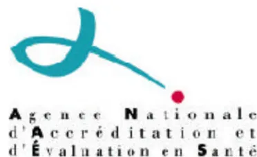

## CONCLUSIONS ET RECOMMANDATIONS DU JURY

### TEXTE COURT

# PANCREATITE AIGUË

Jeudi 25 et vendredi 26 janvier 2001

Hôtel Sofitel Paris Forum rive Gauche - 75014 PARIS

Promoteur

**Société Nationale Française de Gastro-Entérologie**

Organisée par

**Association Française de Chirurgie**

**Association Nationale des Gastroentérologues des Hôpitaux Généraux**

**Club Français du Pancréas**

**Société d'Imagerie Abdominale et Digestive**

**Société Française d'Anesthésie-Réanimation**

**Société Française de Chirurgie Digestive**

**Société Française d'Endoscopie Digestive**

**Société Francophone de Nutrition Entérale et Parentérale**

**Société de Réanimation de Langue Française**

**Société Nationale Française de Gastro-Entérologie**## COMITE D'ORGANISATION

P RUSZNIEWSKI, **Président** : Hépato-Gastroentérologue, Hôpital Beaujon (Clichy)  
P BOISSEL : Chirurgien Digestif, Hôpitaux de Brabois Adultes (Vandoeuvre)  
G BOMMELAER : Hépato-Gastroentérologue, Hôtel-Dieu (Clermont- Ferrand)  
G BONMARCHAND : Réanimateur Médical, Hôpital Charles Nicolle, (Rouen)  
J-F BRETAGNE, **Secrétaire** : Hépato-Gastroentérologue, Hôpital Pontchaillou (Rennes)  
L BUSCAIL : Hépato-Gastroentérologue, Hôpital de Rangueil (Toulouse)  
M CHOUSTERMAN : Hépato-Gastroentérologue, C H I (Créteil)  
P-L FAGNIEZ : Chirurgien Digestif, Hôpital Henri Mondor (Créteil)  
X HEBUTERNE : Hépato-Gastroentérologue, Hôpital de l'Archet (Nice)  
L PALAZZO : Hépato-Gastroentérologue libéral (Paris)  
P-J : VALETTE : Radiologue, Hôpital Edouard Herriot (Lyon)  
B VEBER : Réanimateur Chirurgical, Hôpital Charles Nicolle (Rouen)

## JURY

G BOMMELAER, **Président** :Hépato-Gastroentérologue, Hôtel-Dieu (Clermont Ferrand)  
G BLEICHNER : Réanimateur Polyvalent, Hôpital Victor Dupouy (Argenteuil)  
C BOUTELOUP : Nutritioniste, CRNH Auvergne (Clermont Ferrand)  
H BRICARD : Anesthésiste, CHU Côte de Nacre (Caen)  
J-M BRUEL : Radiologue, Hôpital Saint-Eloi (Montpellier)  
G CAPELLIER : Réanimateur Médical, Hôpital Jean Minjoz (Besançon)  
L DREYFUS : Médecin Généraliste (Paris)  
R DUMAS : Hépato-Gastroentérologue, Hôpital de l'Archet (Nice)  
A LACROIX : Chirurgien, C H G (Auch)  
B MATHEY : Chirurgien (Strasbourg)  
B NAPOLEON : Hépato-Gastroentérologue, Clinique Saint Jean (Lyon)  
O NOUEL : Hépato-Gastroentérologue, Centre Hospitalier La Beauchée (Saint Brieuc)  
J-F QUARANTA : Santé Publique, Hôpital de Cimiez (Nice)  
N ROTMAN : Chirurgien Digestif, Hôpital Henri Mondor (Créteil)  
G ROUMIEU : Radiologue, C H G (Avignon)  
D SAUTEREAU : Hépato-Gastroentérologue, Hôpital Dupuytren (Limoges)

## EXPERTS

M BARTHET : Hépato-Gastroentérologue, Hôpital Nord (Marseille)  
S BELOUCIF : Réanimateur Chirurgical, Hôpital Bichat (Paris)  
J-P BERNARD : Hépato-Gastroentérologue, Hôpital Ste Marguerite (Marseille)  
J BOYER : Hépato-Gastroentérologue, CHRU (Angers)  
F BRIVET : Réanimateur Médical, Hôpital Henri Béclère (Clamart)  
J-F DELATTRE : Chirurgien Général, CHU (Reims)  
R DELCENSERIE : Hépato-Gastroentérologue, Hôpital Nord (Amiens)  
B DUREUIL : Réanimateur Chirurgical, Hôpital Charles Nicolle (Rouen)  
J ESCOURROU : Hépato-Gastroentérologue, CHU Rangueil (Toulouse)  
L GAMBIEZ : Chirurgien, Hôpital Claude Huriez, (Lille)  
P HASTIER : Hépato-Gastroentérologue, Hôpital de l'Archet 2 (Nice)  
P LEVY : Hépato-Gastroentérologue, Hôpital Beaujon (Clichy)  
C MATOS : Radiologue, Hôpital Erasme (Bruxelles)  
B MILLAT : Chirurgien Viscéral, Hôpital Saint Eloi (Montpellier)  
P MONTRAVERS : Anesthésiste-Réanimateur, CHU-Groupe Hôpital Sud (Amiens)  
J MOREAU : Hépato-Gastroentérologue, CHU Rangueil (Toulouse)  
D PEZET : Chirurgien Digestif, Hôtel-Dieu (Clermont Ferrand)  
A SAUVANET : Chirurgien Digestif, Hôpital Beaujon (Clichy)  
V VILGRAIN : Radiologue, Hôpital Beaujon (Clichy)  
J-L VINCENT : Réanimateur, Hôpital Erasme (Bruxelles)  
J-F ZAZZO : Anesthésiste-Réanimateur, Hôpital Antoine Beclère (Clamart)  
M ZINS : Radiologue, Institut Mutualiste Monsouris (Paris)## **GROUPE BIBLIOGRAPHIQUE**

D MALKA : Hépato-Gastroentérologue, Hôpital Beaujon (Clichy)  
I ROSA HEZODE : Hépato-Gastroentérologue, CHI (Créteil)  
R LECESNE : Radiologue, Hôpital du Haut Lévêque (Pessac)  
E MAURY : Réanimateur Médical, Hôpital Saint Antoine (Paris)  
P BERTHELEMY : Hépato-Gastroentérologue, Hôpital (Pau)  
P PAGES : Hépato-Gastroentérologue, CHU de Rangueil (Toulouse)  
H DUPONT : Réanimateur Chirurgical, Hôpital Bichat (Paris)  
D SEGUY : Hépato-Gastroentérologue, Hôpital Huriez (Lille)  
F PILLEUL : Radiologue Digestif & d'Urgence, Hôpital Edouard Herriot (Lyon)  
K SLIM : Chirurgien Digestif, Hôtel Dieu (Clermont Ferrand)  
M DEBETTE GRATIEN : Hépato-Gastroentérologue, Hôpital Dupuytren (Limoges)  
E YAHCHOUCHI : Chirurgien Digestif, Hôpital Henri Mondor (Créteil)  
L HEYRIES : Hépato-Gastroentérologue, Hôpital Ste Marguerite (Marseille)## **AVANT – PROPOS**

*Cette Conférence de Consensus a été organisée et s'est déroulée conformément aux règles méthodologiques préconisées par l'Agence Nationale d'Accréditation et d'Evaluation en Santé (ANAES) qui lui a attribué son label de qualité.*

*Les conclusions et recommandations présentées dans ce document ont été rédigées, en toute indépendance, par le Jury de la Conférence. Leur teneur n'engage en aucune manière la responsabilité de l'ANAES.*

## **INTRODUCTION**

La pancréatite aiguë (PA) est une affection parfois grave, nécessitant une prise en charge multidisciplinaire impliquant gastro-entérologues, chirurgiens, réanimateurs, anesthésistes, radiologues, urgentistes et biologistes. Chaque étape de sa prise en charge (diagnostic positif, choix des examens d'imagerie, diagnostic étiologique, appréciation de la gravité, place de l'antibiothérapie prophylactique, conduite à tenir devant la nécrose stérile ou infectée) est l'objet de controverses. Sur de nombreux points de litige, des études, souvent randomisées, sont maintenant disponibles. Il paraissait opportun d'essayer de dégager un consensus sur les pratiques recommandables en matière de prise en charge de la PA.

Deux enquêtes récentes françaises ont donné un éclairage sur l'épidémiologie et les pratiques professionnelles dans notre pays. L'ensemble de ces résultats concernant l'incidence, les formes étiologiques, la gravité, rejoint la plupart des statistiques internationales les plus récentes. Une grande disparité dans la prise en charge de ces malades a été trouvée : grande variété de pratiques concernant les méthodes diagnostiques employées, l'utilisation des scores de gravité, les différentes techniques d'imagerie pour le diagnostic d'origine biliaire de la PA, les critères de transfert en réanimation, ainsi que les principales options thérapeutiques. Elles soulignent surtout la différence de comportement entre les représentants des différentes spécialités dans la prise en charge de cette affection quel que soit leur établissement d'exercice. Cette disparité de pratiques professionnelles souligne l'intérêt de la tenue de cette Conférence de Consensus.Durant cette Conférence, qui s'est déroulée les 25 et 26 Janvier 2001, le Jury a eu à répondre aux 6 questions suivantes :

1. 1/ Comment faire le diagnostic positif et étiologique ?
2. 2/ Comment et à quel moment établir la gravité d'une pancréatite aiguë ?
3. 3/ Comment prendre en charge les formes non compliquées ?
4. 4/ Comment prendre en charge les formes compliquées ?
5. 5/ Comment traiter une pancréatite aiguë biliaire ?
6. 6/ Peut-on prévoir et prévenir la pancréatite aiguë post CPRE ?## **QUESTION 1.**

### **COMMENT FAIRE LE DIAGNOSTIC POSITIF ET ETIOLOGIQUE ?**

#### **Diagnostic positif de la PA**

Les douleurs abdominales sont présentes dans près de 100 % des cas. Le début des douleurs représente le début de l'histoire de la maladie.

Les autres signes cliniques (non spécifiques ou rares) n'ont pas d'intérêt pratique.

Le dosage de la lipasémie a une valeur diagnostique supérieure à celle de l'amylasémie et de l'isoamylase pancréatique. L'élévation de la lipasémie est plus prolongée que celle de l'amylasémie. Un taux de 3N est considéré comme valeur seuil significative pour ces enzymes. Le dosage de la lipasémie doit pouvoir être obtenu en urgence. L'intérêt de l'association du dosage de l'amylasémie et de la lipasémie par rapport au dosage isolé de la lipasémie n'est pas démontré.

La mesure du trypsinogène de type 2 sur bandelette urinaire pourrait être proposée dans les services d'urgence pour éliminer l'hypothèse d'une PA, en raison de sa forte valeur prédictive négative (VPN : 99 %). Aucun autre test n'a prouvé son intérêt.

Toute douleur abdominale aiguë évocatrice associée à une élévation de la lipasémie supérieure à 3 N dans les 48 premières heures suivant le début des symptômes fait porter le diagnostic de PA. Lorsque le diagnostic de PA est porté sur des signes cliniques et biologiques, il n'y a pas lieu de réaliser un examen d'imagerie pour le confirmer.

En cas de doute diagnostique, l'examen de référence est la tomodensitométrie (TDM). Elle peut établir à elle seule le diagnostic de PA. Elle permet le diagnostic différentiel. Pour le diagnostic de PA, la TDM nécessite une injection de produit de contraste iodé. Dans l'impossibilité d'un recours en urgence à la TDM, l'échographie abdominale peut aider au diagnostic. Elle est cependant toujours d'interprétation difficile, et ne permet pas d'explorer la région pancréatique dans près de 40 % des cas. L'imagerie par résonance magnétique (IRM) est supérieure à la TDM dans l'analyse des signes morphologiques pancréatiques et extra-pancréatiques. Sous réserve d'une plus grande accessibilité des appareils et d'une standardisation des protocoles, l'IRM pourrait être proposée en remplacement de la TDM. Ceci estparticulièrement vrai pour les malades avec ou à risque d'insuffisance rénale car elle utilise un produit de contraste de très faible toxicité (chélates de gadolinium) pour apprécier le rehaussement vasculaire.

## **Diagnostic étiologique**

En France, les deux causes les plus fréquentes de PA sont l'alcoolisme et la lithiase biliaire qui représentent chacune environ 40 % des cas.

### *Recherche de l'origine biliaire*

L'origine biliaire de la PA est à rechercher en priorité en raison de sa fréquence et de l'existence d'un traitement spécifique. Les arguments cliniques en faveur d'une cause lithiasique sont l'âge supérieur à 50 ans et le sexe féminin (deux fois plus fréquent). Le meilleur marqueur biologique de PA biliaire est l'élévation des ALAT, qui doivent être dosées précocement. Au seuil de 3N, leur valeur prédictive positive est de 95 %. L'élévation de la bilirubine témoigne plus d'un obstacle cholédocien persistant que de l'origine biliaire d'une PA.

La recherche de l'origine biliaire d'une PA doit être systématiquement effectuée, même en l'absence de critères clinico-biologiques évocateurs. Elle peut s'envisager dans deux circonstances : en urgence, uniquement si l'on envisage de traiter une éventuelle lithiase cholédocienne ; à distance, pour chercher une lithiase vésiculaire et poser l'indication d'une cholécystectomie.

La TDM peut objectiver une lithiase vésiculaire ou cholédocienne, mais sa VPN est faible. La sensibilité (Se) de l'échographie pour le diagnostic de lithiase cholédocienne est faible (30 %). Elle plus élevée pour le diagnostic de lithiase vésiculaire (90 %), sauf à la phase initiale (67 %) en raison de l'iléus. Il est donc recommandé de répéter l'échographie avant de pratiquer des explorations plus complexes. La présence d'un "sludge" vésiculaire est d'interprétation délicate chez les malades à jeun depuis plusieurs jours. Une échographie vésiculaire normale n'exclut pas l'origine biliaire de la PA.

En cas de négativité de l'échographie éventuellement répétée et de la TDM, l'examen le plus performant est l'échoendoscopie (EE), aussi bien pour le diagnostic de lithiase cholédocienne que vésiculaire. La cholangio-IRM est une méthode non invasive dont la place reste à préciser.En cas de négativité des examens précédents et en l'absence d'autre cause de PA, la recherche de microcristaux dans la bile duodénale ou cholédocienne peut permettre de déterminer l'origine biliaire. Cette technique difficile, dont la réalisation doit être rigoureuse, est réservée aux PA récidivantes.

#### *Diagnostic d'une PA non alcoolique non biliaire*

Environ 20 % des PA ne sont ni d'origine biliaire ni d'origine alcoolique. L'exhaustivité et la répétition de l'enquête étiologique, en particulier en cas de PA récidivante, sont susceptibles de diminuer le pourcentage de PA dites idiopathiques. Il faut insister sur la difficulté d'éliminer, d'une part, l'origine biliaire d'une PA en raison de l'existence de calculs inframillimétriques, d'autre part, une pancréatite chronique alcoolique débutante. Parfois seule l'évolution permettra de rattacher un épisode de PA à une pancréatite chronique vue précocement.

L'interrogatoire et le contexte clinique permettent d'emblée d'évoquer une PA iatrogène (CPRE, postopératoire ou médicamenteuse). L'imputabilité intrinsèque d'un médicament repose sur des critères chronologiques cohérents et sur l'élimination des autres causes de PA. L'imputabilité extrinsèque repose sur des données bibliographiques ou informatisées (Pancréatox®, Gastroenterol Clin Biol 2001;25:1S22-1S27). Lorsqu'une origine médicamenteuse a été suspectée, le cas doit être signalé au Centre Régional de Pharmacovigilance.

Les PA infectieuses peuvent être bactériennes, virales (VIH) ou parasitaires.

Les examens biologiques initiaux devront chercher une cause métabolique (hypertriglycéridémie ou hypercalcémie) ; ces examens devront de nouveau être réalisés à distance de l'épisode aigu.

Les PA d'origine génétique doivent être cherchées chez un sujet jeune présentant un contexte clinique évocateur. Les PA associées aux entérocolites inflammatoires (maladie de Crohn) ou aux maladies systémiques (lupus, vascularite) seront cherchées par un interrogatoire ciblé.

Une cause obstructive, en particulier néoplasique, devra être cherchée au mieux par EE (ou IRM ?) réalisée à distance de l'épisode de PA.

En cas de PA récidivante sans cause déterminée au terme de ces explorations, une CPRE sera réalisée à la recherche d'anomalies canalaire.

Au terme de ces investigations qu'il faudra au besoin répéter, surtout dans les formes récidivantes, un certain nombre de PA demeurent "idiopathiques".## QUESTION 2.

### COMMENT ET A QUEL MOMENT ETABLIR LA GRAVITE D'UNE PANCREATITE AIGUË ?

La PA grave est définie par l'existence d'une défaillance d'organes et/ou par la survenue d'une complication locale à type de nécrose, d'abcès ou de pseudokyste. Elle est associée à une mortalité de 30 %. Les éléments d'appréciation de la gravité du pronostic doivent permettre de sélectionner et d'orienter les malades graves vers un service de réanimation, d'identifier ceux dont l'aggravation nécessitera une prise en charge différente et de définir des cohortes de malades homogènes statistiquement comparables.

Les éléments d'appréciation retenus sont

- a) le terrain (âge > 80 ans, obésité : BMI > 30, insuffisances organiques préexistantes)
- b) les scores biocliniques spécifiques (Ranson, Imrie) avec 3 pour valeur seuil

#### **Score de Ranson (1 point par item)**

A l'admission ou au moment du diagnostic

- - Age > 55 ans
- - Globules blancs > 16 G/L
- - Glycémie > 11 mmol/L (sauf diabète)
- - LDH > 350 U/L (1,5 N)
- - ASAT > 250 U/L (6N)

Durant les 48 premières heures

- - Baisse hématocrite > 10%
- - Ascension urée sanguine > 1,8 mmol/L
- - Calcémie < 2 mmol/L
- -  $PaO_2$  < 60 mm Hg
- - Déficit en bases > 4 mmol/L
- - Séquestration liquidienne estimée > 6 L

#### **Score d'Imrie (1 point par item)**

- - Age > 55 ans
- - Globules blancs > 15 G/L
- - Glycémie > 10 mmol/L (sauf diabète)
- - LDH > 600 U/L (3,5 N)
- - Urée sanguine > 16 mmol/L
- - Calcémie < 2 mmol/L
- -  $PaO_2$  < 60 mm Hg
- - Albuminémie < 32 g/L
- - ASAT > 100 U/L (2N)c) les éléments d'évaluation et de gradation de la défaillance d'organes qui comportent des critères hémodynamiques (fréquence cardiaque, tension artérielle < 90 mm Hg malgré un remplissage, perfusion cutanée), respiratoires (fréquence respiratoire,  $PaO_2$  sous air < 60 mm Hg (8 kPa),  $SpO_2$ ), neurologiques (agitation, confusion, somnolence, score de Glasgow neurologique < 13), rénaux (diurèse, créatininémie > 170 mmol/L) et hématologiques (plaquettes < 80 G/L). Ils peuvent être regroupés sous forme de scores. Ils permettent de réaliser une évaluation continue du malade. Ils ne sont pas spécifiques de la PA ;

d) la C reactive protein (CRP) : malgré l'absence de validation, un taux > 150 mg/L à la 48ème heure est retenu. Son augmentation au cours de l'évolution doit faire rechercher une aggravation locale ;

e) la TDM : l'index de sévérité TDM (tableau), décrit par Balthazar, présente une bonne corrélation avec la morbidité et la mortalité. Il est évalué au mieux à J3. Il est recommandé de le mentionner dans les compte-rendus. L'analyse TDM tiendra également compte d'éléments pronostiques non intégrés dans l'index de gravité : ascite, épanchement pleural, siège céphalique de la nécrose, complications des coulées (infection, fistule, pseudo-anévrysme, thrombose veineuse).

**Inflammation pancréatique et péripancréatique**

**Nécrose pancréatique**

<table border="1">
<tbody>
<tr>
<td>Grade A : pancréas normal <b>(0pt)</b></td>
<td>Pas de nécrose* <b>(0pt)</b></td>
</tr>
<tr>
<td>Grade B : élargissement focal ou diffus du pancréas <b>(1pt)</b></td>
<td>Nécrose &lt; 30 % <b>(2pts)</b></td>
</tr>
<tr>
<td>Grade C : Pancréas hétérogène associé à une densification de la graisse péri-pancréatique <b>(2 pts)</b></td>
<td>Nécrose 30-50 % <b>(4pts)</b></td>
</tr>
<tr>
<td>Grade D : Coulée péri pancréatique unique <b>(3pts)</b></td>
<td>Nécrose &gt; 50 % <b>(6pts)</b></td>
</tr>
<tr>
<td>Grade E : Coulées multiples ou présence de bulles de gaz au sein d'une coulée <b>(4pts)</b></td>
<td></td>
</tr>
</tbody>
</table>

\*défaut de rehaussement du parenchyme pancréatique

**Total (maximum 10 pts)**

<table border="1">
<thead>
<tr>
<th>Index de sévérité</th>
<th>Morbidité %</th>
<th>Mortalité %</th>
</tr>
</thead>
<tbody>
<tr>
<td>&lt; 3</td>
<td>8</td>
<td>3</td>
</tr>
<tr>
<td>4 - 6</td>
<td>35</td>
<td>6</td>
</tr>
<tr>
<td>7 - 10</td>
<td>92</td>
<td>17</td>
</tr>
</tbody>
</table>Les performances du score APACHE II sont comparables à celles des scores spécifiques de gravité. Ce score est peu utilisé en France, même en réanimation. Le SAPS II, utilisé en France, n'a pas été étudié dans la PA. Le dosage du peptide activateur de la trypsine (TAP) est prometteur mais encore en cours de validation. L'IRM, bien que supérieure à la TDM dans l'appréciation des lésions pancréatiques et péripancréatiques, est difficilement utilisable pour les malades de réanimation et mal adaptée aux gestes interventionnels. Le nombre restreint d'appareils est une contrainte majeure. L'étude du liquide péritonéal, trop invasive pour un rendement diagnostique faible, doit être abandonnée.

La survenue d'une défaillance viscérale justifie à elle seule et à tout moment le passage en réanimation. Sa recherche est effectuée de façon pluri-quotidienne dans les 48 premières heures. Après 48 h, on définit des malades à risques sur la base d'un score de Ranson ou d'Imrie > 3, d'une CRP > 150mg/L, d'un index de sévérité TDM > 4, ou d'un terrain particulier. Ces malades justifient une surveillance renforcée clinique, biologique (créatininémie, SpO2 ou gaz du sang, hémogramme quotidiens et CRP bihebdomadaire) et radiologique (TDM tous les 10 à 15 jours ou en cas de suspicion de complications).

### **QUESTION 3.**

#### **COMMENT PRENDRE EN CHARGE LES FORMES NON COMPLIQUÉES ?**

Tout malade porteur d'une PA doit être hospitalisé. Compte tenu de l'évolution possible vers une forme compliquée, cette hospitalisation doit se faire dans des services spécialisés en pathologie digestive ayant accès à une endoscopie bilio-pancréatique, à proximité d'un service de réanimation et d'un service de radiologie équipé d'un scanner et de moyens de radiologie interventionnelle. Les malades doivent être évalués cliniquement plusieurs fois par jour pour détecter rapidement toute aggravation. Le dosage itératif des enzymes pancréatiques n'a pas d'intérêt. En l'absence d'aggravation, il n'y a pas d'indication à renouveler la TDM si elle a été réalisée initialement.Du fait de l'iléus réflexe et des vomissements, les malades ont tendance à présenter une déshydratation extra-cellulaire justifiant des apports hydro-électrolytiques importants. Seuls les vomissements répétés justifient la mise en place d'une sonde nasogastrique d'aspiration. Le jeûne s'impose souvent en raison des douleurs et de l'intolérance digestive. Il ne doit pas être prolongé et une réalimentation orale progressive est possible après 48 heures sans douleur. La mise en route d'une nutrition artificielle est inutile si la reprise de l'alimentation se fait avant le 7ème jour. La douleur doit être évaluée et traitée. Les dérivés salicylés et les anti-inflammatoires non stéroïdiens sont contre-indiqués en raison de leurs effets secondaires. Le paracétamol peut être suffisant mais doit être utilisé avec prudence chez les malades alcooliques. La morphine est l'antalgique de choix pour les douleurs importantes. L'analgésie contrôlée par le malade est une modalité bien adaptée. L'antibiothérapie préventive, les antisécrétoires gastriques, la somatostatine, l'octréotide, les extraits pancréatiques n'ont pas d'indication.

#### **QUESTION 4.**

#### **COMMENT PRENDRE EN CHARGE LES FORMES COMPLIQUÉES ?**

### **Complications générales**

#### *Traitements spécifiques*

Les traitements spécifiques ont pour objectif de s'opposer à l'auto-digestion enzymatique du pancréas (aprotinine, gabexate, camostat), de contrôler la sécrétion pancréatique (atropine, glucagon, somatostatine, octréotide) ou de neutraliser les médiateurs de l'inflammation (antagonistes des cytokines, y compris le lexipafant). Aucun n'a fait la preuve de son efficacité sur l'incidence des complications et sur la mortalité.

#### *Défaillances viscérales*

La PA peut se compliquer de défaillances viscérales qui font la gravité de la maladie, et dont le traitement n'est pas spécifique.L'atteinte respiratoire peut être secondaire à des épanchements pleuraux, à une altération de la cinétique diaphragmatique responsable d'atélectasies des bases. La PA grave est une cause fréquente de syndrome de détresse respiratoire de l'adulte. Les défaillances circulatoires comportent le plus souvent une hypovolémie notamment en rapport avec l'iléus intestinal et les épanchements. L'insuffisance hépatique survient généralement après une défaillance circulatoire sévère. L'insuffisance rénale est souvent fonctionnelle. La nécessité d'une épuration extra-rénale est de pronostic péjoratif.

#### *Modalités de la nutrition artificielle*

La PA compliquée est une agression sévère responsable d'un état hypercatabolique dans 60 % des cas et justifiant un support nutritionnel. Les besoins énergétiques varient selon la gravité. Les principes généraux sont ceux appliqués à la nutrition des malades agressés. Les lipides ne sont pas contre-indiqués sauf en cas d'hypertriglycéridémie importante. Les besoins azotés sont élevés. Une supplémentation en micronutriments, en particulier à visée anti-oxydante et en zinc, est indiquée. L'efficacité d'une supplémentation en glutamine, des solutions de nutrition entérale à visée immunomodulatrice et des nouvelles émulsions lipidiques à base d'huile d'olive ou de poisson, mériterait d'être confirmée dans cette indication. Le support nutritionnel se fait par voie entérale, le plus précocement possible, en site jéjunal, à l'aide d'une sonde naso-jéjunale. La mise en place d'une jéjunostomie ne doit pas être par elle-même une indication chirurgicale. La nutrition parentérale est indiquée en complément de la nutrition entérale si les objectifs d'apports ne sont pas atteints ou en remplacement de celle-ci, si elle n'est pas tolérée.

### **Complications locales : la nécrose pancréatique**

La nécrose pancréatique est l'un des déterminants essentiels de l'évolution locale et du pronostic de la PA. Sa définition anatomique est celle de la Conférence de Consensus d'Atlanta de 1992 : la nécrose glandulaire est définie comme une (des) zone(s) de parenchyme pancréatique non viable focalisée(s) ou diffuse(s), éventuellement localisée(s) en périphérie glandulaire, et éventuellement associée(s) à une nécrose graisseuse péri-pancréatique. Cette définition anatomique est actuellement supplantée par une définition d'imagerie TDM et IRM : la nécrosepancréatique est évoquée devant la présence de zones qui ne se rehaussent pas après injection de produit de contraste.

L'évolution de la nécrose pancréatique est dominée par le risque d'infection secondaire. C'est la plus grave des complications locales et l'on estime que plus de 80 % des décès par PA sont dus aux complications septiques loco-régionales.

La contamination de la nécrose se fait par translocation d'origine colique, par contiguité ou par voie sanguine. L'apparition de l'infection peut survenir dès la première semaine. Le risque d'infection augmente progressivement jusqu'à la troisième semaine d'évolution puis décroît. La probabilité de survenue de l'infection semble proportionnelle à l'étendue de la nécrose.

En l'absence de surinfection au-delà de la quatrième semaine, la nécrose évolue vers la résorption dans plus de 50 % des cas. Elle peut évoluer vers la constitution de pseudokystes ou d'abcès pancréatiques.

#### *Antibiothérapie préventive*

L'infection de la nécrose pancréatique est plurimicrobienne. Ce constat a conduit à proposer une antibiothérapie systématique, précoce et prolongée, administrée par voie systémique et/ou digestive. Si des études animales pouvaient justifier quelques espoirs, les résultats des études cliniques actuellement disponibles prêtent à discussion sur de nombreux points méthodologiques et incitent à une réserve prudente. Les risques en matière d'écologie liés à des prescriptions s'écartant des bonnes pratiques de l'antibiothérapie doivent être pris en considération. Pour toutes ces raisons, dans l'état actuel des connaissances, une antibiothérapie précoce préventive systématique ne peut être recommandée.

#### *Ponction guidée de la nécrose et des collections liquidiennes*

La démonstration de l'infection de la nécrose est indispensable à la prise en charge thérapeutique de la PA. Si les arguments cliniques, TDM et biologiques ont une valeur d'orientation, seule l'étude microbiologique des prélèvements obtenus par ponction percutanée guidée par imagerie permet d'affirmer le diagnostic d'infection et d'identifier le germe.

La ponction n'est indiquée que chez les malades présentant un faisceau d'arguments cliniques, TDM et biologiques faisant suspecter l'infection de la nécrose. La ponction systématique n'est pas justifiée. La ponction est le plus souvent réalisée à l'aiguille fine (18 à 22 G), sous guidage TDM. Il faut ponctionner, sous réserve de leuraccessibilité, les lésions dont le remaniement TDM est le plus évocateur d'infection. Il ne faut pas ponctionner le tissu pancréatique sain. L'infection pouvant survenir dès la première semaine, la ponction doit être réalisée précocement. Il est licite de répéter la ponction chez les malades dont les troubles persistent ou se majorent après une première ponction négative. Le prélèvement doit être immédiatement traité pour identification du germe et antibiogramme. Parfois, les caractéristiques macroscopiques du prélèvement permettent de transformer immédiatement le geste diagnostique en geste thérapeutique de drainage.

#### *Traitement de la nécrose*

La nécrose stérile n'a pas à faire l'objet de résection ou de drainage. Seules la nécrose et les collections infectées, confirmées par ponction diagnostique, doivent être traitées par voie chirurgicale, percutanée ou mixte.

Les buts du traitement sont l'évacuation des débris nécrotiques et le drainage des collections infectées, en respectant le pancréas restant.

Le drainage chirurgical reste la technique la plus classique. Les avantages respectifs des diverses techniques chirurgicales n'ont pas été démontrés. Aucun argument scientifique ne justifie les résections pancréatiques réglées précoces. La technique doit être adaptée aux lésions anatomiques ; la nécrosectomie associée au lavage continu, après fermeture de la laparotomie, semble devoir être privilégiée. L'évolution oblige souvent à des interventions itératives. Les résultats du drainage percutané sont améliorés par l'emploi de drains de gros calibre. Le drainage percutané a une durée longue, et une gestion délicate.

La place respective des méthodes chirurgicales et percutanées n'est pas encore établie, mais la tendance actuelle est à une association dans le temps des deux méthodes, selon des modalités à affiner dans une démarche multidisciplinaire.

## **QUESTION 5.**

### **COMMENT TRAITER UNE PANCREATITE AIGUË BILIAIRE ?**

#### **Traitement d'urgence**

L'évolution de la majorité des PA biliaires est spontanément favorable en quelques jours et seul le problème de la prévention de la récidive se pose. La chirurgie biliairen'a pas de place en urgence. Seule la sphinctérotomie endoscopique (SE) peut avoir un intérêt.

Deux situations font l'objet d'un consensus : a) en cas d'angiocholite et/ou d'ictère obstructif, la SE est indiquée quels que soient la durée d'évolution et le degré de gravité ; b) dans les PA bénignes d'évolution favorable, il n'y a pas d'indication à réaliser une SE en urgence.

Deux situations ne font pas l'objet d'un consensus : a) dans les PA graves, la SE peut être réalisée en urgence par une équipe disposant d'un plateau technique adapté. Elle n'est indiquée qu'au cours des 72 premières heures d'évolution ; b) dans les PA vues à un stade précoce (12 premières heures), il est difficile de prédire la gravité de l'évolution et aucune recommandation ne peut être faite.

## **Traitement différé**

Dans les formes de PA non compliquées, le pronostic est dominé par le risque de récidive .

Une cholécystectomie doit être réalisée, et la voie laparoscopique, au cours de la même hospitalisation, est le traitement de référence de la lithiase vésiculaire. En fonction de l'équipement et du degré d'expertise de chaque centre, la recherche et le traitement de la lithiase cholédocienne peuvent se faire, soit dans le même temps que la cholécystectomie laparoscopique, soit avant celle-ci à l'aide d'un examen de haute performance diagnostique (EE ou IRM) en vue d'une SE préopératoire.

Dans les PA graves, le pronostic est dominé par les complications générales et locorégionales. La cholécystectomie laparoscopique peut être réalisée à distance des phénomènes aigus mais s'accompagne d'un taux de conversion élevé.

Chez les malades à très haut risque opératoire, une SE sans cholécystectomie associée est préconisée.

## **QUESTION 6.**

### **PEUT ON PREVOIR ET PREVENIR LA PANCREATITE POST CPRE ?**

La PA post CPRE est à distinguer de l'hyperamylasémie ou de l'hyperlipasémie isolées fréquemment observées au cours de cet examen. Les facteurs de risquesont multiples liés au malade, à la technique et à l'opérateur. Même en l'absence de tout facteur de risque, la pancréatite post CPRE peut survenir de façon imprévisible. La meilleure prévention consiste à limiter les indications diagnostiques de CPRE. La prévention médicamenteuse reste décevante. Le drainage pancréatique prophylactique par endoprothèse reste à valider.

## **CONCLUSION - SEQUELLES ET QUALITE DE VIE**

Le diabète, insulinodépendant ou non, survient avec une fréquence variable, favorisé par une nécrose étendue et la pancréatectomie gauche. Il est toujours définitif et peut s'aggraver. L'insuffisance pancréatique exocrine, avec ou sans manifestation clinique, constante au décours immédiat de la PA, s'améliore souvent spontanément. Les explorations fonctionnelles ne seront faites qu'en cas de signes cliniques persistants.

Les anomalies canalaires, fréquentes, semblent favorisées par le caractère nécrosant de la pancréatite et l'origine alcoolique. Elles sont cherchées en cas de PA récidivante non expliquée. Les pseudokystes compliquent 10 à 25 % des PA nécrosantes et régressent parfois spontanément au cours des deux premiers mois. Une régression tardive est d'autant plus probable que le pseudokyste est asymptomatique ou de petite taille. Les pseudokystes symptomatiques doivent être traités. Le traitement peut être endoscopique, radiologique ou chirurgical. Les fistules pancréatiques internes et externes ont un traitement de première intention médical ou endoscopique ; la chirurgie est réservée aux échecs.

Au total, la qualité de vie après PA est globalement bonne. Ces résultats à long terme justifient une prise en charge de niveau élevé.

***L'organisation de cette Conférence de Consensus a été rendue possible grâce à l'aide apportée par les Laboratoires : AstraZeneca, Aventis Hoechst Houdé, Baxter, Boston Scientific, Bristol-Myers-Squibb, Byk France, Fresenius Kabi France, Fujinon, GlaxoWellcome, Ipsen Biotech, Janssen Cilag, MSD Chibret, Nestle Clinical Nutrition France, Novartis Pharma, Nutricia France, Parke Davis – Pfizer, Pentax, Sanofi Synthelabo France, Schering Plough, SmithKline Beecham, Solvay Pharma, et Takeda.***