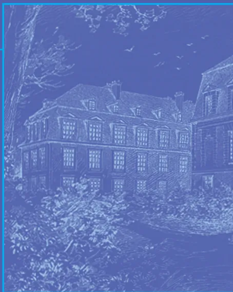
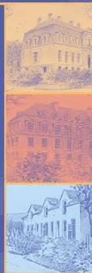
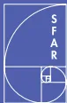
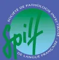
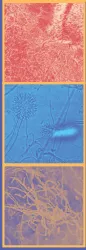
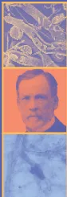

organisée conjointement par

la SFAR, la SPILF et la SRLF

## Prise en charge des candidoses et aspergilloses invasives de l'adulte

avec la participation de la Société Française d'Hématologie,  
de la Société Française de Mycologie Médicale  
et de la Société Française de Greffe de Moelle



13 mai 2004

Paris, Institut Pasteur



# Prise en charge des candidoses et aspergilloses invasives de l'adulte

## Question 1 :

### Quels moyens pour le diagnostic et le suivi des candidoses et des aspergilloses invasives ? (A1 et C1)

La recherche de levures et de champignons filamenteux doit être systématique chez les patients à risque. Seuls les prélèvements tissulaires ou de sites normalement stériles sont spécifiques. L'examen direct est crucial car il oriente le diagnostic et restera parfois le seul argument biologique. Il est donc systématique, réalisé rapidement avec des techniques spécifiques. De plus, l'examen histologique des tissus permet d'apprécier le caractère invasif de l'infection. La présence de *Candida* sp. dans les sécrétions provenant des voies aériennes inférieures, y compris le lavage broncho-alvéolaire, n'a pas de valeur diagnostique (B3).

La présence d'*Aspergillus* sp. est à interpréter en fonction du risque de colonisation bronchique et du degré d'immunodépression. Elle est prédictive d'aspergillose pulmonaire invasive (API) chez le patient d'hématologie (B2).

Les hémocultures sont positives dans seulement 50 % des C1 mais la positivité d'une seule suffit au diagnostic. Sauf exception, la présence d'*Aspergillus* sp. correspond à une contamination.

Pour les autres prélèvements, le milieu de culture de référence est le milieu de Sabouraud incubé à 30 °C pendant 21 jours, même si dans la majorité des cas, *Candida* sp. et *Aspergillus* sp. se développent sur les milieux usuels de bactériologie. L'identification au niveau de l'espèce doit être réalisée pour tous les champignons. Pour les levures, certaines méthodes permettent un gain de 24 à 72 heures dans le diagnostic d'espèce.

En hématologie, l'antigénémie aspergillaire par technique ELISA est un examen sensible lorsqu'il est répété, et spécifique s'il est confirmé par un deuxième prélèvement à 24-48 heures (A1). Des faux positifs ont été rapportés à la présence de galactomannanes d'origine alimentaire ou médicamenteuse. L'antigénémie précède souvent les signes radiologiques et la mise en évidence du champignon. Sa valeur prédictive de l'efficacité du traitement reste à préciser. En dehors des patients d'hématologie, la valeur diagnostique de l'antigénémie aspergillaire est moins bien précisée. La recherche couplée d'anticorps circulants et d'antigènes candidosiques par technique ELISA, serait évocatrice de C1 mais son intérêt doit être confirmé. Les techniques de biologie moléculaire pour la détection et l'identification ne sont pas standardisées et non disponibles en routine.

Le choix de l'antifongique repose avant tout sur la connaissance de l'épidémiologie locale et/ou de l'espèce isolée. La méthode Etest®, réalisable en routine, est la seule à être actuellement corrélée à la méthode de référence NCCLS (B2). Elle permet de déterminer les concentrations minimales inhi-la méthode de référence NCCLS (B2). Elle permet de déterminer les concentrations minimales inhibitrices (CMI), pour *Candida* sp., du fluconazole, de l'itraconazole et de la flucytosine. Pour *Aspergillus* sp. l'intérêt de la détermination des CMI n'est pas confirmé.

Dans l'API, la radiographie de thorax standard est peu sensible et peu spécifique. La TDM thoracique en haute résolution est l'examen à réaliser précocement. Chez le patient d'hématologie en aplasie post-chimiothérapie, le signe du halo, précoce mais transitoire, est très évocateur du diagnostic. En dehors de cette population il est moins spécifique et d'autres aspects sont observés.

L'injection de produit de contraste précise les rapports entre les lésions et les structures vasculaires afin de poser à temps l'indication chirurgicale. La TDM thoracique permet aussi de guider une éventuelle ponction à visée diagnostique, de suivre l'évolution et de faire le bilan des lésions résiduelles en vue d'une éventuelle « chirurgie de propreté ». La TDM des sinus recherche une lyse osseuse qui témoigne de l'invasion loco-régionale. Dans l'aspergillose cérébrale, l'IRM est l'examen le plus sensible.

Dans les candidémies, l'examen ophtalmologique est systématique. L'échographie et/ou la TDM sont utiles pour rechercher des métastases septiques en particulier lors de la sortie d'aplasie. L'IRM semble être l'examen le plus sensible dans les candidoses hépato-spléniques.

## Question 2 :

### Quels sont les moyens thérapeutiques disponibles pour les candidoses et aspergilloses invasives ?

Quatre familles d'antifongiques sont disponibles : les polyènes, la flucytosine, les azolés et les échinocandines.

#### 1 - Spectre d'activité

<table border="1">
<thead>
<tr>
<th></th>
<th>Fungizone®</th>
<th>Ancotil®</th>
<th>Triflucan®</th>
<th>Sporanox®</th>
<th>Vfend®</th>
<th>Cancidas®</th>
</tr>
</thead>
<tbody>
<tr>
<td colspan="7"><i>Candida</i> sp.</td>
</tr>
<tr>
<td><i>albicans</i></td>
<td>S</td>
<td>S/R</td>
<td>S</td>
<td>S</td>
<td>S</td>
<td>S</td>
</tr>
<tr>
<td><i>glabrata</i></td>
<td>S/I</td>
<td>S</td>
<td>SDD/R</td>
<td>SDD/R</td>
<td>S/ ??</td>
<td>S</td>
</tr>
<tr>
<td><i>parapsilosis</i></td>
<td>S</td>
<td>S</td>
<td>S</td>
<td>S</td>
<td>S</td>
<td>S/ ??</td>
</tr>
<tr>
<td><i>tropicalis</i></td>
<td>S</td>
<td>S</td>
<td>S/SDD</td>
<td>S</td>
<td>S</td>
<td>S</td>
</tr>
<tr>
<td><i>krusei</i></td>
<td>S/I</td>
<td>I/R</td>
<td>R</td>
<td>SDD/R</td>
<td>S</td>
<td>S</td>
</tr>
<tr>
<td><i>lusitaniae</i></td>
<td>S/R</td>
<td>S</td>
<td>S</td>
<td>S</td>
<td>S</td>
<td>S</td>
</tr>
<tr>
<td colspan="7"><i>Aspergillus</i> sp.</td>
</tr>
<tr>
<td><i>fumigatus</i></td>
<td>S</td>
<td>R</td>
<td>R</td>
<td>S/R</td>
<td>S</td>
<td>S/R</td>
</tr>
<tr>
<td><i>flavus</i></td>
<td>S</td>
<td>R</td>
<td>R</td>
<td>S</td>
<td>S</td>
<td>S</td>
</tr>
<tr>
<td><i>terreus</i></td>
<td>S</td>
<td>R</td>
<td>R</td>
<td>S</td>
<td>S</td>
<td>S</td>
</tr>
</tbody>
</table>

S : sensible - SDD : sensibilité dose-dépendante - I : intermédiaire - R : résistant## Voies d'administration et effets indésirables

<table border="1">
<thead>
<tr>
<th></th>
<th>Voies d'administration</th>
<th>Principaux effets indésirables</th>
</tr>
</thead>
<tbody>
<tr>
<td>Fungizone®<br/>amphotéricine B désoxycholate (AmB)</td>
<td>IV</td>
<td>Hypokaliémie, hypomagnésémie, insuffisance rénale<br/>Fièvre, frissons lors de l'injection<br/>Cytopénie</td>
</tr>
<tr>
<td>Ambisome® AmB liposomale (ABLp)<br/>Abelcet® AmB lipid complex (ABLC)</td>
<td>IV</td>
<td>Mêmes complications que la Fungizone®<br/>mais fréquence moindre<br/>Tolérance supérieure pour l'Ambisome®</td>
</tr>
<tr>
<td>Ancotil® flucytosine</td>
<td>IV/PO</td>
<td>Troubles digestifs, hématologiques et hépatiques<br/>dose-dépendants</td>
</tr>
<tr>
<td>Sporanox®* itraconazole</td>
<td>IV/PO</td>
<td rowspan="3">Troubles digestifs,<br/>cytolyse hépatique,<br/>cholestase, réactions<br/>allergiques et cutanées</td>
</tr>
<tr>
<td>Triflucan® fluconazole</td>
<td>IV/PO</td>
</tr>
<tr>
<td>Vfend®* voriconazole</td>
<td>IV/PO</td>
</tr>
<tr>
<td>Cancidas® caspofungine</td>
<td>IV</td>
<td>Insuffisance cardiaque congestive<br/><br/>Troubles visuels réversibles<br/><br/>Peu fréquents et bénins</td>
</tr>
</tbody>
</table>

\* Relais oral précoce recommandé chez l'insuffisant rénal (accumulation d'un excipient toxique de la forme IV)

## 2 - Suivi thérapeutique

Le suivi des concentrations plasmatiques à l'équilibre est pertinent pour l'itraconazole (variabilité d'absorption et de métabolisme hépatique, interactions médicamenteuses fréquentes), le voriconazole (15 à 20 % de métaboliseurs lents chez les patients d'origine asiatique et interactions médicamenteuses fréquentes) et la flucytosine (toxicité dose-dépendante).

## 3 - Interactions médicamenteuses

La prescription d'AmB est déconseillée avec d'autres médicaments néphrotoxiques (aminosides, ciclosporine...), avec les digitaliques et diurétiques hypokaliémiant.

Le voriconazole est contre-indiqué en co-prescription avec le sirolimus, les inducteurs enzymatiques susceptibles d'en diminuer les concentrations plasmatiques (rifampicine, carbamazépine, phénobarbital),

Les interactions de l'itraconazole sont proches de celles du voriconazole.

Le fluconazole, l'ABLp et la caspofungine ne présentent pas d'interactions majeures à l'origine de contre-indications.

## Aspects médico-économiques

Les nouveaux antifongiques injectables sont coûteux (500 à 650 €/j) et si leur financement a été individualisé en 2004 il s'intègre néanmoins aux dépenses des établissements de santé. Ces surcoûts contribuent à maintenir l'emploi d'AmB malgré ses effets indésirables.### Question 3 :

## Quelle stratégie thérapeutique pour les candidoses systémiques ?

### 1 - Choix du traitement curatif

#### 1.1 - Selon le genre et l'espèce

##### 1.1.1 - Après isolement d'une levure et avant identification de l'espèce (A1)

L'augmentation de l'incidence des *Candida* sp. de sensibilité diminuée ou résistants aux azolés, une neutropénie, une insuffisance rénale et les médicaments co-prescrits (néphrotoxicité, interactions) interviennent dans les choix.

```
graph TD
    C1[Créatininémie < 1,5 fois la normale] --> N1[NEUTROPENIQUE  
recevant ≥ 2 traitements  
néphrotoxiqes ?]
    C1 --> N2[NON-NEUTROPENIQUE  
Tt. antérieur par azolé ?]
    C2[Créatininémie ≥ 1,5 fois la normale] --> N3[NON-NEUTROPENIQUE  
Tt. antérieur par azolé ?]
    C2 --> N4[NEUTROPENIQUE]

    N1 -- OUI --> T1[Cancidas® IV, 70 mg J1, 50 mg/j  
OU Ambisome® IV, 3 mg/kg/j]
    N1 -- NON --> T2[Fungizone® IV  
1 mg/kg/j]
    N2 -- OUI --> T2
    N2 -- NON --> T3[Fungizone® IV 1 mg/kg/j  
OU  
Triflucan® IV 12 mg/kg/j]
    N3 -- NON --> T4[Triflucan® IV  
12 mg/kg/j]
    N4 --> T1

    T2 --> T5[Cancidas® IV, 70 mg J1, 50 mg/j  
OU Ambisome® IV, 3 mg/kg/j]
```

Flowchart for choosing treatment for systemic candidosis based on creatinine levels and neutropenia:

- **Créatininémie < 1,5 fois la normale**
  - **NEUTROPENIQUE recevant ≥ 2 traitements néphrotoxiqes ?**
    - OUI → Cancidas® IV, 70 mg J1, 50 mg/j OU Ambisome® IV, 3 mg/kg/j
    - NON → Fungizone® IV 1 mg/kg/j
  - **NON-NEUTROPENIQUE Tt. antérieur par azolé ?**
    - OUI → Fungizone® IV 1 mg/kg/j
    - NON → Fungizone® IV 1 mg/kg/j OU Triflucan® IV 12 mg/kg/j
- **Créatininémie ≥ 1,5 fois la normale**
  - **NON-NEUTROPENIQUE Tt. antérieur par azolé ?**
    - NON → Triflucan® IV 12 mg/kg/j
    - OUI → Cancidas® IV, 70 mg J1, 50 mg/j OU Ambisome® IV, 3 mg/kg/j
  - **NEUTROPENIQUE** → Cancidas® IV, 70 mg J1, 50 mg/j OU Ambisome® IV, 3 mg/kg/j

##### 1.1.2 - Après identification de l'espèce de *Candida* sp. (A1)

```
graph TD
    C1[Candida Triflucan®-S] --> N1[NEUTROPENIQUE  
OU NON]
    C1 --> T1[Triflucan® IV 6 mg/kg/j  
Relais per os  
dès que possible]

    C2[Candida Triflucan®-R ou -SDD] --> C1a[Créatininémie < 1,5 fois  
la normale]
    C2 --> C1b[Créatininémie ≥ 1,5 fois  
la normale]

    C1a --> N2[NON-NEUTROPENIQUE]
    C1a --> N3[NEUTROPENIQUE  
recevant ≥ 2 traitements  
néphrotoxiqes ?]
    C1b --> N4[NEUTROPENIQUE  
OU NON]

    N2 --> T2[Fungizone® IV  
1 mg/kg/j]
    N3 -- NON --> T2
    N3 -- OUI --> T3[Cancidas® IV 50 mg/j  
OU Ambisome® IV, 3 mg/kg/j  
OU, si C.krusei Vfend®  
12 mg/kg/j1 puis 8 mg/kg/j]
    N4 --> T3

    T2 --> T4[Relais par Vfend® oral  
si infection contrôlée]
    T3 --> T4
```

Flowchart for choosing treatment for systemic candidosis after identification of the *Candida* species:

- **Candida Triflucan®-S**
  - **NEUTROPENIQUE OU NON**
    - Triflucan® IV 6 mg/kg/j Relais per os dès que possible
- **Candida Triflucan®-R ou -SDD**
  - **Créatininémie < 1,5 fois la normale**
    - **NON-NEUTROPENIQUE** → Fungizone® IV 1 mg/kg/j
    - **NEUTROPENIQUE recevant ≥ 2 traitements néphrotoxiqes ?**
      - NON → Fungizone® IV 1 mg/kg/j
      - OUI → Cancidas® IV 50 mg/j OU Ambisome® IV, 3 mg/kg/j OU, si *C.krusei* Vfend® 12 mg/kg/j1 puis 8 mg/kg/j
  - **Créatininémie ≥ 1,5 fois la normale**
    - **NEUTROPENIQUE OU NON** → Cancidas® IV 50 mg/j OU Ambisome® IV, 3 mg/kg/j OU, si *C.krusei* Vfend® 12 mg/kg/j1 puis 8 mg/kg/j## 1.2 - Selon les localisations

### 1.2.1 - Candidémie

- - Il n'y a pas d'argument pour une association (B3) (sauf certaines localisations - cf. 1.2.3).
- - La durée de traitement est de 2 semaines après la dernière hémoculture positive et la disparition des symptômes (C3) ou au moins 7 jours après la correction de la neutropénie.
- - Le retrait du cathéter intravasculaire est recommandé (B3).

### 1.2.2 - Candidose hépato-splénique (chronique disséminée)

La durée du traitement est de 6 mois en moyenne

### 1.2.3 - Autres localisations, associées ou non à une candidémie

Les mêmes schémas thérapeutiques sont utilisés, cependant l'association AmB et flucytosine est proposée dans les localisations oculaires, méningées et cardiaques (B3). Les durées de traitement sont souvent plus prolongées.

## 2 - Traitement préemptif en réanimation

Malgré l'absence de validation, un tableau septique préoccupant, sans autre documentation microbiologique, avec colonisation de plusieurs sites par *Candida* sp. et des facteurs de risques de CI, autorise un traitement préemptif (idem schémas page précédente) (C3).

## Question 4 :

### Quelle chimio-prophylaxie antifongique en réanimation et en hématologie ?

#### 1 - En réanimation

Il n'y a pas d'argument en faveur de l'utilisation d'une chimioprophylaxie (A2).

L'absence de données suffisantes ne permet pas d'identifier les patients qui en bénéficieraient.

#### 2 - En hématologie

L'incidence élevée et la mortalité importante (50 % à 90 %) des infections fongiques ont justifié l'évaluation extensive de la chimioprophylaxie.

##### 2.1 - La chimio-prophylaxie primaire

L'AmB par voie respiratoire ou par voie veineuse (quelle que soit la formulation) ne réduit pas l'incidence des infections invasives.

Le fluconazole (400 mg/j) est recommandé dans l'allogreffe de cellules souches hématopoïétiques (CSH) car il réduit la fréquence des CI et leur mortalité (A1). Cependant, en raison du risque de sélection de souches résistantes, 50 % des équipes européennes lui préfèrent l'utilisation des polyènes oraux. Pour les LA et autogreffes, l'incidence habituelle des CI n'a pas permis de documenter l'intérêt d'une prophylaxie et le fluconazole n'est pas recommandé. L'itraconazole peut aussi être prescrit dans l'allogreffe de CSH (A1). Cependant, sa difficulté d'utilisation justifie de restreindre sa prescription à certaines situations à risque : corticothérapie prolongée post-allogreffe de CSH (C3). Aucune donnée n'est actuellement disponible avec le voriconazole.

##### 2.2 - La chimio-prophylaxie secondaire

Elle doit être systématique, utiliser une molécule active vis-à-vis du champignon précédemment isolé ou suspecté et couvrir la période d'immunodépression (C3).## Question 5 :

### Quelle stratégie thérapeutique pour les aspergilloses invasives ?

Le mauvais pronostic de l'AI, avec une mortalité de 50 à 90 %, a été récemment amélioré grâce à la prescription précoce, dès que le diagnostic est présumé, d'antifongiques plus actifs et mieux tolérés, éventuellement associés à la chirurgie.

#### 1 - Les moyens thérapeutiques

Les polyènes : une seule étude randomisée prospective a établi la supériorité d'ABLp sur l'AmB. Les autres études démontrent la meilleure tolérance des formes lipidiques (A).

Les azolés : le taux de réponse avec l'itraconazole (IV/PO) varie de 39 à 63% dans des essais non contrôlés et limités. Le voriconazole (IV puis per os) s'est avéré supérieur à l'AmB, en terme d'efficacité, de survie et de tolérance.

Les échinocandines : le seul essai avec la caspofungine, encore non publié (dossier d'AMM), rapporte 45 % de réponses favorables dans les formes réfractaires.

Les associations d'antifongiques : leur efficacité clinique n'a pas été démontrée dans des études prospectives.

#### 2 - Les stratégies du traitement curatif

Les résultats de l'essai randomisé comparant AmB et voriconazole, conduisent à proposer le voriconazole comme traitement de première ligne de l'AI (A1) mais cette stratégie repose sur une seule étude de non-infériorité. Le voriconazole n'a pas été comparé aux formes lipidiques d'AmB et l'impact de l'utilisation prolongée des triazolés à large spectre sur l'écologie fongique n'est pas évalué.

L'ABLp (3 ou 5 mg/kg/jour) et la caspofungine sont indiqués en deuxième intention. L'itraconazole IV pourrait constituer une alternative.

Chez les malades dont l'infection paraît contrôlée, un relais oral peut être effectué par du voriconazole ou de l'itraconazole (C3).

Le traitement doit être poursuivi jusqu'à la guérison de l'aspergillose et la disparition des facteurs prédisposants.

La place des associations dans le traitement de l'aspergillose est encore inconnue. Certaines associations peuvent être potentiellement antagonistes, toxiques et coûteuses.

#### 3 - Autres traitements

Certaines situations peuvent imposer un geste chirurgical : en urgence pour exérèse de lésions pulmonaires au contact d'un gros vaisseau, secondairement en cas de lésion persistante circonscrite avant un nouveau traitement aplatissant et, en cas de non réponse au traitement, à visée de diagnostic mycologique formel.

Aucune étude contrôlée n'a été réalisée avec l'adjonction du G-CSF.

# Conférence de Consensus commune

## de la SFAR, la SPILF et la SRLF

### **Président du jury :**

B. REGNIER (Paris)

### **Jury du consensus :**

M. ATTAL (Toulouse)

Y. BEZIE (Paris)

V. BLANC (Antibes)

A. BUZYN (Paris)

P. CHOUTET (Tours)

O. MIMOZ (Poitiers)

L. PAPAZIAN (Marseille)

G. PIALOUX (Paris)

T. POTTECHER (Strasbourg)

C. POYART (Paris)

A. TAZI (Paris)

P. TILLEUL (Paris)


### **Comité d'organisation :**

SFAR : Y. MALLEDANT (Rennes), C. MARTIN (Marseille), C. PAUGAM (Paris)

SPILF : G. BEAUCAIRE (Lille), B. DUPONT (Paris), O. LORTHOLARY (Paris)

SRLF : P. CHARBONNEAU (Caen), R. ROBERT (Poitiers), M. WOLFF (Paris)

Coordonnateurs de la conférence : B. DUPONT (Paris), P. CHARBONNEAU (Caen)

### **Conseillers scientifiques :**

SFAR : F. GOUIN (Marseille)

SPILF : P. CHAVANET (Dijon)

SRLF : J. CARLET (Paris)

### **Recherche bibliographique :**

P.E. CHARLES (Dijon)

L. VELLY (Marseille)

A. VEINSTEIN (Poitiers)