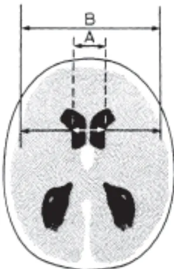

**Société Française d'Anesthésie et de Réanimation**

**en partenariat avec :**

L'Association de neuroanesthésie de langue française  
La Société française de neurochirurgie  
La Société française de neuroradiologie

**Hémorragie sous-arachnoïdienne grave**

**Conférence d'experts**

**Texte court**

**2004**# Introduction

L'hémorragie sous-arachnoïdienne (HSA) par rupture d'anévrysome est une pathologie importante à plusieurs titres. Elle concerne une population le plus souvent jeune et en bonne santé. Son pronostic est incertain, parfois grave. Son traitement est urgent et met en jeu une filière complexe et multidisciplinaire qui doit assurer la prise en charge du patient de façon rapide et coordonnée. Enfin, le traitement de l'HSA comporte également une part de risque non-maîtrisable.

Les recommandations antérieures américaines et canadiennes sont anciennes (1994 et 1997)\* ce qui justifie ce travail, d'autant que ce domaine a considérablement évolué ces dernières années. A quelques exceptions près, la majorité des études le concernant comporte un faible niveau de preuve ce qui justifiait le choix méthodologique d'une « conférence d'experts ».

Cette conférence a été initiée par la Société française d'anesthésie et de réanimation (Sfar), en partenariat avec l'Association de neuroanesthésie réanimation de langue française (ANARLF), la Société française de neurochirurgie et la Société française de neuroradiologie.

## Composition du panel d'experts

### SFAR et ANARLF

Dr G. Audibert (Nancy); Dr J. Berré (Bruxelles); Pr L. Beydon (Angers) *Président*; Dr G. Boulard (Bordeaux); Pr N. Bruder (Marseille); Pr P. Hans (Liège); Pr L. Puybasset (Paris); Pr P. Ravussin (Sion); Dr A. Ter Minassian (Angers)

### Société française de neurochirurgie

Pr H. Dufour (Marseille); Pr J.P. Lejeune (Lille); Pr F. Proust (Rouen)

### Société française de neuroradiologie

Pr A. Bonafé (Montpellier); Dr J. Gabrillargues (Clermont-Ferrand); Pr A. de Kersaint Gilly (Nantes)

## Groupe de lecture

### SFAR et ANARLF

Dr V. Bonhomme (Liège); Dr M. Bonnard-Gougeon (Clermont-Ferrand); Pr E. Cantais (Toulon); Pr D. Chassard (Lyon); Dr A.M. Debaillieu (Lille); Pr J.J. Eledjam (Montpellier); Dr J.P. Graftieaux (Reims); Pr J.M. Malinovsky (Reims); Pr C. Martin (Marseille); Dr G. Oriaguet (Paris); Pr J.F. Payen (Grenoble); Dr J.L. Ragguenau (Paris); Pr E. Tassonyi (Genève)

### Société française de neurochirurgie

Pr J.P. Castel (Bordeaux); Pr T. Civit (Nancy); Pr P. Decq (Créteil); Pr R. Deruty (Lyon); Pr E. Emery (Caen); Pr J. Lagarrigue (Toulouse); Dr M. Lonjon (Nice); Pr P. Mercier (Angers); Dr X. Morandi (Rennes); Pr K. Mourier (Dijon); Pr F. Parker (Le Kremlin-Bicêtre); Pr F. Segnarbieux (Montpellier); Dr P. Toussaint (Amiens)

### Société Française de Neuroradiologie

Dr R. Axionnat (Nancy); Dr J. Berge (Bordeaux); Dr P. Bessou (Grenoble); Dr A. Boulin (Suresnes); Pr J. Chiras (Paris); Pr C. Cognard (Toulouse); Pr P. Courthéoux (Caen); Dr O. Levrier (Marseille); Pr F. Ricolfi (Dijon); Dr L. Spelle (Paris); Pr F. Turjman (Lyon)

---

\* King WA, Martin NA. Critical care of patients with subarachnoid hemorrhage. *Neurosurg Clin N Am* 1994 ; 5 : 767-87.  
Findlay JM. Current management of aneurysmal subarachnoid hemorrhage guidelines from the Canadian Neurosurgical Society. *Can J Neurol Sci* 1997 ; 24 : 161-70.## DIAGNOSTIC EN HÔPITAL GÉNÉRAL ET PRISE EN CHARGE INITIALE

### 1. Quels sont l'incidence et les facteurs de risque ?

L'âge moyen des patients souffrant d'HSA se situe autour de 50 ans avec une prédominance féminine (environ 60 % de femmes). Son incidence en France est de l'ordre de 5-7 pour 100 000 sujets-année, avec des variations interethniques. Les facteurs de risque clairement identifiés sont l'hypertension artérielle et le tabagisme.

Il existe des formes familiales et génétiques d'anévrysme qui sont rares mais qui justifient des explorations.

### 2. Quels sont les signes cliniques ?

La pierre angulaire du diagnostic de l'HSA est la céphalée brutale qui peut se développer en quelques secondes ou minutes. Elle est intense, inhabituelle et souvent suivie de vomissements.

Une perte de conscience est fréquente ; sa prolongation est un facteur de mauvais pronostic. Des convulsions accompagnant la céphalée sont hautement évocatrices d'HSA. Le syndrome méningé peut apparaître plusieurs heures après l'HSA et peut donc faire défaut lors de l'admission aux urgences.

Les deux échelles d'évaluation clinique les plus utilisées sont celles de la World Federation of Neurological Surgeons (WFNS) et de Hunt et Hess, (tableaux 1 et 2) ; la première (tableau 1) doit être privilégiée. Le score de Glasgow doit être utilisé (Grade E). Ces échelles et scores seront utilisés tout au long de l'évolution clinique pour quantifier la gravité de l'HSA.

**On retient la définition d'HSA grave pour des HSA cotées III à V dans l'échelle de la WFNS (Grade D).**

**Tableau 1 :** Classification de la World Federation of Neurological Surgeons (WFNS).

<table border="1">
<thead>
<tr>
<th>Grade</th>
<th>Score de Glasgow</th>
<th>Déficit moteur</th>
</tr>
</thead>
<tbody>
<tr>
<td>I</td>
<td>15</td>
<td>absent</td>
</tr>
<tr>
<td>II</td>
<td>13 - 14</td>
<td>absent</td>
</tr>
<tr>
<td>III</td>
<td>13-14</td>
<td>présent</td>
</tr>
<tr>
<td>IV</td>
<td>7-12</td>
<td>présent ou absent</td>
</tr>
<tr>
<td>V</td>
<td>3-6</td>
<td>présent ou absent</td>
</tr>
</tbody>
</table>

**Tableau 2 :** Classification de Hunt et Hess.

<table border="1">
<thead>
<tr>
<th>Grade</th>
<th>Description clinique</th>
</tr>
</thead>
<tbody>
<tr>
<td>0</td>
<td>Anévrysme non rompu</td>
</tr>
<tr>
<td>1</td>
<td>Asymptomatique ou céphalée minime</td>
</tr>
<tr>
<td>2</td>
<td>Céphalée modérée à sévère, raideur de nuque</td>
</tr>
<tr>
<td>3</td>
<td>Somnolence, confusion, déficit focal minime</td>
</tr>
<tr>
<td>4</td>
<td>Coma léger, déficit focal, troubles végétatifs</td>
</tr>
<tr>
<td>5</td>
<td>Coma profond, moribond</td>
</tr>
</tbody>
</table>### 3. Imagerie

#### 3.1. Place du scanner cérébral

Tout patient suspect d'HSA doit être exploré par un scanner cérébral, en urgence (**Grade D**). En cas de doute d'interprétation, les images feront l'objet d'une télétransmission vers un centre de référence (**Grade E**).

Le scanner permet, outre le diagnostic, d'évaluer l'importance de l'HSA et ses éventuelles conséquences (hydrocéphalie, hématome, infarctus). La classification scanographique la plus utilisée est l'échelle de Fisher (tableau 3).

L'intérêt de pratiquer un angio-scanneur pour rechercher la cause de l'HSA en dehors d'un centre neurochirurgical est discutable (**Grade E**). Cet examen n'a qu'un intérêt préthérapeutique et n'est donc pas utile pour la décision du transfert du patient.

Toute dégradation neurologique impose la réalisation d'un nouveau scanner (**Grade D**).

**Tableau 3 :** Echelle scanographique de Fisher.

<table border="1">
<thead>
<tr>
<th>Grade</th>
<th>Aspect scanner</th>
</tr>
</thead>
<tbody>
<tr>
<td>1</td>
<td>Absence de sang</td>
</tr>
<tr>
<td>2</td>
<td>Dépôts de moins de 1 mm d'épaisseur</td>
</tr>
<tr>
<td>3</td>
<td>Dépôts de plus de 1 mm d'épaisseur</td>
</tr>
<tr>
<td>4</td>
<td>Hématome parenchymateux ou hémorragie ventriculaire</td>
</tr>
</tbody>
</table>

### 4. Place de la ponction lombaire

La ponction lombaire n'a aucune indication lorsque l'HSA est visualisée sur le scanner cérébral (**Grade D**). On y recourt pour éliminer le diagnostic d'HSA lorsque la symptomatologie est évocatrice et le scanner normal, ce qui est exceptionnel dans les formes graves.

### 5. Transfert du patient et mise en condition : critères de transfert

Le diagnostic d'HSA impose le transfert dans un centre de référence incluant des équipes de neurochirurgie, de neuroradiologie et de neuroanesthésie-réanimation. Le centre doit comporter une unité compétente en neuro-réanimation (**Grade E**).## COMPLICATIONS PRÉCOCES

### HYPERTENSION INTRACRÂNIENNE (HTIC), HYDROCÉPHALIE, RESAIGNEMENT, ÉPILEPSIE, DYSNATRÉMIES

#### 1. HTIC et hydrocéphalie aiguë

L'HSA anévrysmales s'accompagne d'une HTIC quasi constante pour les patients de grade clinique élevé et résulte d'un ou plusieurs des mécanismes suivants :

- – un *hématome intracérébral* peut accompagner une HSA dans 20 % des cas et être directement responsable d'une HTIC. Dans ce cas, il doit être évacué chirurgicalement (**Grade D**). Ce geste sera associé au traitement chirurgical de l'anévrysme (**Grade D**). En cas d'engagement cérébral et si la localisation de l'hématome au scanner est suffisamment informative, le traitement chirurgical de l'anévrysme peut être réalisé sans angiographie diagnostique car dans ces formes graves, le pronostic dépend de la précocité du traitement chirurgical (**Grade E**). Dans ce cas particulier, il est logique de compléter le scanner diagnostique par un angioscanner qui fournira des informations utiles au chirurgien ;
- – un *œdème cérébral* peut s'installer dans les heures qui suivent l'HSA. Il impose un monitoring de la PIC, au mieux par cathéter intraventriculaire (**Grade E**) ;
- – une *hydrocéphalie* résultant du trouble de la résorption du liquide cérébrospinal par le sang présent dans les espaces sous-arachnoïdiens peut survenir rapidement. Les signes radiologiques de dilatation ventriculaire sont discrets dans les premières heures. Les signes scanographiques devant faire évoquer une hydrocéphalie sont l'apparition d'une dilatation des cornes temporales ou l'augmentation de l'index bicaudé. Elle impose une dérivation ventriculaire externe (DVE) en urgence (**Grade E**). Dans ce cas, et si un geste endovasculaire est envisagé, la DVE devrait être posée avant l'embolisation car l'héparinothérapie per- et post-embolisation génère la pose ultérieure d'une DVE.

La DVE est maintenue à 15 cm au-dessus de l'orifice du conduit auditif externe, afin d'assurer une contre-pression au niveau de la paroi du sac et de réduire ainsi le risque d'une nouvelle rupture de l'anévrysme (**Grade E**).

**Figure.** Index bicaudé : rapport A/B (A : largeur des cornes frontales au niveau des noyaux caudés ; B : diamètre cérébral au même niveau).

Le diagramme montre une coupe axiale du cerveau sur un scanner. Deux lignes horizontales sont superposées : la ligne supérieure est plus courte et est étiquetée 'A', indiquant la largeur des cornes frontales au niveau des noyaux caudés. La ligne inférieure est plus longue et est étiquetée 'B', indiquant le diamètre cérébral au même niveau. Des lignes verticales pointent vers ces deux mesures.

Cet index doit être interprété en fonction de l'âge :

<table><thead><tr><th>Age</th><th>Index bicaudé normal</th></tr></thead><tbody><tr><td>≤ 30</td><td>&lt; 0,16</td></tr><tr><td>50</td><td>&lt; 0,18</td></tr><tr><td>60</td><td>&lt; 0,19</td></tr><tr><td>80</td><td>&lt; 0,21</td></tr><tr><td>100</td><td>&lt; 0,25</td></tr></tbody></table>Les facteurs prédictifs de l'hydrocéphalie sont l'âge, l'hémorragie intraventriculaire, l'importance de l'HSA et la localisation de l'anévrysme sur la circulation postérieure.

En cas de doute, le Doppler transcrânien (DTC) peut permettre d'objectiver des signes d'HTIC (Grade E).

Une réaction de Cushing (hypertension artérielle avec bradycardie et ataxie respiratoire) contribue au maintien d'un niveau minimal de la pression de perfusion cérébrale (PPC) lors du saignement. Dans ces conditions, le traitement de l'HTA relève d'un nécessaire compromis entre le risque de resaignement et celui d'hypoperfusion cérébrale (Grade E).

## 2. Resaignement précoce

L'objectif premier du traitement de l'anévrysme est d'éviter la récidive hémorragique par une exclusion précoce (Grade D).

En effet, le resaignement est le plus souvent responsable d'une dégradation neurologique avec un taux de mortalité de plus de 70%.

## 3. Hémorragie sous-arachnoïdienne et épilepsie

La majorité des convulsions sont précoces et associées à un mauvais pronostic neurologique.

Aucune donnée formelle ne permet de statuer sur la prophylaxie anti-épileptique. Une prophylaxie anti-épileptique peut être envisagée chez les patients à haut risque de développer des crises convulsives, c'est-à-dire, en présence de sang dans les citernes, d'un infarctus cérébral ou d'une lésion focale, ou encore d'un hématome sous-dural (Grade E). Cependant, les patients victimes d'une forme grave d'HSA bénéficient souvent d'une anesthésie et/ou d'une sédation dont les effets anti-comitiaux sont établis.

Aucune recommandation n'existe concernant la durée de la prophylaxie anti-épileptique.

## 4. Répercussions cardiovasculaires et pulmonaires des hémorragies sous-arachnoïdiennes

Les HSA par rupture d'anévrysme peuvent entraîner des troubles du rythme cardiaque, des altérations de la fonction myocardique et un œdème pulmonaire. Ces troubles cardiovasculaires résultent d'une hyperactivation du système sympathique et d'une décharge noradrénergique.

Dans les cas les plus graves, l'œdème pulmonaire « neurogénique » aboutit à un SDRA compliquant la prise en charge de la pathologie anévrysmale. La fréquence des troubles cardiovasculaires cliniques est variable selon les antécédents des patients et plus importante dans les formes graves d'HSA.

Le diagnostic des complications cardio-vasculaires repose sur la clinique, les marqueurs biologiques et l'échocardiographie et/ou le cathétérisme droit. La troponine I est un indicateur sensible mais relativement peu spécifique du dysfonctionnement myocardique. Des taux élevés de troponine I doivent inciter à réaliser un bilan échocardiographique (Grade E). Une élévation du taux plasmatique du « *brain natriuretic peptide* » (BNP) peut traduire une lésion myocardique ou hypothalamique.

Une défaillance cardiovasculaire et/ou respiratoire sévère peut nécessiter de différer le traitement étiologique de l'anévrysme, qui sera réalisé dès la situation contrôlée (Grade E).

## 5. Natrémie et rein

Une hyponatrémie (natrémie < 135 mmol/l) généralement différée (entre les 4e et 10e jours) peut compliquer une HSA grave. Son diagnostic repose sur une mesure au moins quotidienne de lanatrémie. En cas d'hyponatrémie, une hypovolémie doit être recherchée ainsi qu'une augmentation de la natrurèse. L'association de ces 3 éléments évoque un « *Cerebral Salt Wasting Syndrome* » (CSWS) et doit conduire à remplacer les pertes en eau et en sel et proscrire toute restriction hydrique (Grade E). Les minéralocorticoïdes peuvent être utilisés en complément. Le syndrome de sécrétion inappropriée d'ADH est souvent évoqué à tort. En cas d'hyponatrémie symptomatique, une correction initiale rapide, ayant pour objectif d'atteindre une natrémie de 125 mmol/l, est recommandée (Grade E).

En cas d'hypernatrémie, un diabète insipide doit être recherché (natrémie > 145 mmol/l ; densité urinaire < 1005). La correction de l'hypernatrémie ne doit pas être trop rapide (baisse de la natrémie inférieure à 12 mmol/l par 24 heures) ; elle peut majorer une éventuelle HTIC (Grade E).

## TRAITEMENT DE L'ANÉVRYSME

Le traitement précoce (dans les 72 premières heures) (Grade E) du sac anévrysma s'impose. Il a deux objectifs : mettre à l'abri du resaignement et permettre d'optimiser la PPC afin de prévenir les conséquences ischémiques de l'HTIC. La décision du choix thérapeutique doit résulter d'une discussion entre chirurgiens, radiologues et neuro-anesthésistes (Grade E). Celle-ci doit tenir compte de la localisation de l'anévrysme, de son aspect morphologique, de l'état clinique du patient et de ses antécédents. La disponibilité et l'expérience des équipes chirurgicale et neuroradiologique sont des critères qui interviennent dans la discussion. Un traitement intensif des patients en grade élevé (monitorage de la PIC, drainage du LCS, monitorage hémodynamique, triple H thérapie précoce) améliore significativement leur pronostic (Grade D). Quand le traitement endovasculaire et chirurgical sont tous deux possibles et en dehors des hématomes compressifs, le traitement endovasculaire est probablement l'option thérapeutique appropriée (Grade B) ; si on transpose aux patients en grade WFNS élevé les conclusions de l'étude ISAT\*, qui portait sur des grades faibles d'HSA. Dans tous les cas, le choix doit faire l'objet d'une discussion des indications entre le neurochirurgien, le neuroradiologue interventionnel et l'anesthésiste-réanimateur.

En cas de défaillance cardiaque (associée ou non à un œdème aigu pulmonaire neurogénique), le traitement du sac anévrysma doit être différé jusqu'à obtention d'une stabilisation de la fonction cardiaque. En revanche, ce choix ne doit pas retarder la mise en place d'une DVE (Grade E).

### 1. Traitement chirurgical des anévrysmes intracrâniens

La principale voie d'accès chirurgical est la voie d'abord fronto-ptérionale qui est la plus souvent utilisée hormis dans les rares cas d'anévrysme péricaliceux qui imposent l'utilisation d'un volet parasagittal. Le volet doit être large en raison de l'HIC souvent associée aux formes graves d'HSA (Grade E). L'objectif du traitement est d'exclure l'anévrysme par un ou plusieurs clips à ressort, non ferromagnétiques.

Obtenir la détente cérébrale est impératif car toute turgescence du cerveau rend impossible la poursuite de l'intervention. Elle est généralement déjà obtenue chez les patients porteurs d'une DVE. Chez les autres, la combinaison de plusieurs méthodes permet d'y parvenir : mannitol 20 %, hyperventilation, renforcement de l'anesthésie par agent intraveineux, drainage cisternal, évacuation de l'hématome.

Le clampage temporaire du vaisseau porteur de l'anévrysme permet de contrôler les situations difficiles ; il doit être le plus bref possible. L'hypotension artérielle est à proscrire, excepté dans des conditions de sauvetage sur rupture incontrôlable (Grade E).

---

\* Molyneux A, Kerr R, Stratton I, Sandercock P, Clarke M, Shrimpton J *et al*. International Subarachnoid Aneurysm Trial (ISAT) of neurosurgical clipping versus endovascular coiling in 2,143 patients with ruptured intracranial aneurysms : a randomised trial. Lancet 2002 ; 360 : 1267-74.## 2. Traitement endovasculaire des anévrysmes intracrâniens

L'objectif du traitement endovasculaire est d'occlure l'anévrysme par des coils largables, introduits par voie endovasculaire, dans le sac anévrysmal. Ce traitement se déroule en deux phases : microcathétérisme du sac anévrysmal et occlusion de la poche anévrysmale.

Les limitations des indications du traitement endovasculaire tiennent avant tout à la taille du collet. Les indications de l'embolisation sont progressivement étendues par diverses innovations techniques.

Les trois facteurs favorisant l'occlusion complète à long terme sont la taille modérée de l'anévrysme, sa topographie en dehors de l'axe du flux artériel et un bon niveau d'expertise du neuroradiologue.

Durant le geste interventionnel, une héparinothérapie à dose efficace est nécessaire (Grade E). La nécessité de poursuivre un traitement anticoagulant et/ou d'instaurer un traitement antiplaquettaire au cours de la procédure, sera évaluée au cas par cas.

En cas de rupture durant la procédure, il convient de poursuivre le remplissage de la poche anévrysmale le plus rapidement possible (Grade E). Avant de reprendre un éventuel traitement anticoagulant, un scanner de contrôle est indiqué (Grade E).

La survenue d'une thrombose en cours d'embolisation doit faire envisager un traitement par un fibrinolytique in situ ou par un agent antiplaquettaire (Grade E). En cas de déficits neurologiques apparaissant dans les suites de la procédure, une exploration tomodensitométrique doit être impérativement réalisée afin d'écarter l'hypothèse d'un resaignement (Grade E). Une thrombolyse peut se discuter dans les six heures suivant la constitution de la thrombose.

Une DVE peut devoir être mise en place après l'embolisation. Il faudra soit le faire après l'arrêt et épuisement de l'héparine circulante, soit après antagonisation par protamine, ce qui n'est pas sans danger. Ceci explique pourquoi il est particulièrement indiqué de poser la DVE avant l'embolisation (Grade E).

## ANESTHÉSIE

En cas d'HSA grave avec HTIC, l'anesthésie intraveineuse est clairement à préférer. L'injection de fortes doses de morphiniques en bolus est à éviter car elle est susceptible de provoquer une augmentation de la PIC (Grade D). Les curares, à l'exception de la succinylcholine, n'ont pas d'effet sur la circulation cérébrale et la pression intracrânienne.

L'objectif peranesthésique est d'éviter les poussées hypertensives qui augmentent le risque de rupture anévrysmale, et l'hypotension qui est source d'hypoperfusion cérébrale. Il est donc important de prévenir les modifications hémodynamiques des stimuli douloureux.

Les principes de l'anesthésie pour le traitement endovasculaire sont les mêmes que ceux de la chirurgie (Grade E). Les deux objectifs principaux sont le maintien d'une PPC suffisante et l'immobilité absolue.

## TRAITEMENT DE LA DOULEUR

Les patients atteints d'HSA grave sont hospitalisés en réanimation et généralement ventilés. Dans ce contexte, ils ne présentent aucune contre-indication aux opiacés (Grade E). En dehors de cette situation, les morphiniques peuvent être d'utilisation délicate. L'utilisation du paracétamol est intéressante par son effet antipyretique associé. Les AINS sont à discuter car ils induisent des risques mal documentés (Grade E).## VASOSPASME

### 1. Aspects cliniques

Le vasospasme est défini comme une réduction réversible de la lumière d'une artère de l'espace sous-arachnoïdien débutant le plus souvent entre j4 et j14 après l'HSA. Un tel vasospasme est identifiable par angiographie, dans 30 à 70 % des cas. Le vasospasme peut avoir un retentissement clinique aboutissant à un « déficit neurologique ischémique retardé » (DNI) qui apparaît dans 17 à 40 % des cas d'HSA par rupture anévrysmaie.

Le vasospasme à expression clinique peut se manifester par une altération de la conscience, des céphalées croissantes et/ou un déficit neurologique focal tel qu'une hémiparésie ou une aphasie. Ces signes cliniques peuvent apparaître brutalement en quelques minutes ou s'installer graduellement sur plusieurs heures. Ils s'accompagnent souvent d'une fièvre supérieure à 38 °C, d'une hypertension artérielle, d'une leucocytose élevée et/ou d'une hyponatrémie. Son diagnostic clinique est difficile chez les patients de grade élevé ou sous sédation. Un vasospasme sévère, étendu ou de longue durée, peut évoluer vers l'infarctus cérébral, être à l'origine de lourdes séquelles neurologiques fonctionnelles, voire du décès du patient.

### 2. Diagnostic : imagerie du vasospasme

La première étape du diagnostic par imagerie du vasospasme consiste à éliminer d'autres causes d'aggravation neurologique : l'ischémie postopératoire, l'hydrocéphalie, le resaignement, les troubles hydroélectrolytiques et les convulsions infracliniques. On réalisera un scanner de façon systématique (Grade E).

La réalisation quotidienne d'un Doppler transcrânien est recommandée (Grade E). Seul le vasospasme de l'artère sylvienne peut être prédit avec une sensibilité et une spécificité suffisantes pour être validé en pratique clinique. La valeur seuil de 120 cm/s pour la vitesse moyenne du flux sanguin au niveau de l'artère cérébrale moyenne est celle retenue habituellement (Grade E). Le rapport de la vitesse de l'artère cérébrale moyenne/vitesse de la carotide interne extra-crânienne est utile pour identifier et grader le vasospasme. Un rapport supérieur à 3 traduit la présence d'un vasospasme et un rapport supérieur à 6 dénote un vasospasme sévère. Le diagnostic de vasospasme sur le DTC pour les autres artères est peu fiable. Un accroissement des vitesses supérieur à 50 cm/s par jour est un facteur prédictif de déficit neurologique (Grade E).

En cas de doute et pour pallier les limites du Doppler, l'IRM, le scanner de perfusion, ou toute imagerie évaluant le débit sanguin cérébral peuvent être utilisés, selon les possibilités locales (Grade E).

L'angiographie permet le diagnostic du vasospasme et la réalisation d'un traitement in situ concomitant.

### 3. Traitement médical du vasospasme

#### 3.1. Traitement préventif

La prévention pharmacologique du vasospasme cérébral dans les suites d'une HSA est basée sur l'utilisation de nimodipine (Grade A). Le nombre de sujets à traiter pour observer une bonne évolution neurologique supplémentaire varie entre 7 et 13 patients. La nimodipine doit être administrée par voie orale à la dose de 360 mg/j pendant 21 jours (Grade A). Cette durée pourrait être abrégée à 15 jours (Grade D). La voie intraveineuse (1 à 2 mg/h, selon le poids) est une alternative courante en France. Elle expose à un risque d'hypotension artérielle systémique chez certains patients, qui justifie d'atteindre progressivement la dose thérapeutique. L'hypotension doit impérativement être corrigée (Grade E).En dehors de la nimodipine, aucun médicament (nicardipine, tirilazad, magnésium) n'a une efficacité démontrée dans la prévention du vasospasme après HSA.

Une fois l'anévrysme exclu, le maintien d'une PPC et d'une volémie optimales participe à la prévention du vasospasme.

### 3.2. Traitement médical curatif

Le traitement médical vise à augmenter le DSC dans les territoires en aval du vasospasme. Le traitement hyperdynamique encore appelé « triple H therapy » (3-HT) dans la littérature anglo-saxonne associe hypervolémie, hypertension artérielle et hémodilution. Cependant, aucune étude contrôlée randomisée n'a démontré l'efficacité de ce traitement, ni dans la prévention du vasospasme, ni dans l'amélioration des déficits ischémiques et de la survie. Actuellement, cette stratégie est réduite dans la plupart des centres au contrôle de la volémie, associé à l'hypertension artérielle, une fois l'anévrysme sécurisé (Grade E).

L'hypertension contrôlée doit cependant être limitée en présence d'un infarctus cérébral constitué, pour réduire le risque de transformation hémorragique. Un objectif de PAM jusqu'à 100-120 mmHg peut être envisagé en l'absence d'infarctus (Grade E).

Le traitement hyperdynamique est administré en réanimation, sous monitoring continu approprié, comportant au minimum la mesure invasive de la pression artérielle et de la pression veineuse centrale. Un contrôle fréquent de la natrémie et de la glycémie ainsi que la température est indispensable (Grade E).

Les complications de la 3-HT sont l'œdème cérébral et l'HTIC, l'hémorragie cérébrale, l'œdème pulmonaire.

### 3.3. Traitement endovasculaire

L'infusion intra-artérielle de vasodilatateur et/ou l'angioplastie sont deux techniques endovasculaires utilisables pour le traitement du vasospasme (Grade E). Elles font encore l'objet d'évaluation et leurs indications ne peuvent encore être généralisées.

La papavérine a un pouvoir vasodilatateur très important. Sa demi-vie est courte, expliquant le caractère transitoire de son action (60 à 90 min après la perfusion). Une alternative est la perfusion intra-artérielle de nimodipine diluée. Les complications de ces traitements sont rares et habituellement transitoires, en rapport avec des perfusions trop rapides.

La dilatation endovasculaire du spasme se fait à l'aide d'un ballonnet. La rupture artérielle en cours de dilatation est la complication majeure, généralement catastrophique, mais rare.

Angioplastie et vasodilatateurs peuvent être associés. Les résultats angiographiques sont généralement bons, montrant une restitution correcte du calibre des artères concernées. Il n'y a habituellement pas de récidive clinique ou angiographique.

Les études disponibles montrent que l'efficacité de ce traitement est corrélée à la précocité de l'intervention (Grade E).## STRATÉGIE DE SUIVI DU MALADE

### IMAGERIE, DOPPLER, BIOLOGIE DURANT LA PÉRIODE AIGUË, MESURES MÉTABOLIQUES LOCALES ( $PO_2$ TISSULAIRE, MICRODIALYSE), MARQUEURS BIOLOGIQUES

#### 1. Protéine S100

Lors de l'HSA par rupture anévrysmales, la protéine S100b mesurée dans le LCS et dans le sang périphérique augmente proportionnellement à la sévérité de l'hémorragie et est corrélée au pronostic à six mois. Une augmentation secondaire de la concentration plasmatique est prédictive d'un vasospasme.

La protéine S100b peut s'intégrer dans le monitoring multimodal des patients ayant une lésion une HSA d'origine anévrysmales (Grade E).

#### 2. Monitoring de la PIC

Les capteurs peuvent être placés dans différents espaces intracrâniens : sous-dural, ventriculaire ou intraparenchymateux. Les experts recommandent, chez les patients en grade sévère d'HSA, un monitoring systématique de la PIC par une DVE ou à défaut, par capteur intraparenchymateux. La DVE sera utilisée avec une contre-pression de 15 cmH2O (Grade E).

#### 3. Monitoring métabolique invasif

Le monitoring des  $PO_2$ ,  $PCO_2$  et pH tissulaires contribue à déceler les éventuelles complications (HTIC et ischémie), et guide les thérapeutiques.

En effet, dans l'HSA, la souffrance cérébrale est plus souvent focale que globale, ce qui peut expliquer une mauvaise valeur diagnostique de la  $SvjO_2$  dans le vasospasme. Les mesures intraparenchymateuses cérébrales de paramètres métaboliques offrent l'avantage de refléter la situation d'une zone à risque, dite de « pénombre ». Le site d'implantation est déterminé au vu de l'imagerie initiale.

Les patients ayant une évolution défavorable ont un plus grand nombre d'épisodes de diminution de la  $PO_2$  tissulaire que les patients évoluant favorablement. L'augmentation de  $PCO_2$  et la diminution de pH doivent faire évoquer une HTIC ou un vasospasme.

La microdialyse est une technique lourde mais prometteuse par ses sensibilité et spécificité et sa capacité à annoncer une ischémie secondaire. Néanmoins, la sujétion en termes de temps et la discontinuité des mesures n'en font pas une technique simple.

La spectroscopie dans le proche infrarouge n'a pas fait la preuve de sa fiabilité.

#### 4. Doppler

Pendant la phase aiguë, la réalisation d'un Doppler par jour est utile pour détecter l'apparition d'un vasospasme, sur le territoire sylvien principalement (Grade E). Il permet une surveillance accrue et une intensification du traitement préventif si un vasospasme est suspecté.## FILIÈRE DE LA PRISE EN CHARGE DE L'HSA

Une filière de prise en charge permettant l'hospitalisation dans le centre de référence dans les plus brefs délais doit être préalablement établie dans chaque région. Pour ce faire, l'information des différents acteurs potentiels de la filière d'amont doit être assurée (**Grade E**).

On entend par centre de référence, un établissement capable d'assurer sa prise en charge multidisciplinaire associant neuroradiologue, neurochirurgien et neuroanesthésiste-réanimateur. Ce centre doit pouvoir réaliser dans un délai bref, un bilan neuroradiologique (scanner, IRM, angiographie), un traitement par radiologie interventionnelle, une intervention neurochirurgicale, en optimisant les contraintes techniques.

Le centre de référence doit traiter un nombre suffisant de patients souffrant d'HSA pour entretenir une filière interne efficace car entraînée à faire face aux nombreuses situations, tant cliniques que radiologiques et chirurgicales, qui se voient dans ce contexte (**Grade E**).

Les différents médecins impliqués doivent converger vers le patient. Pour ce faire, cette filière doit prendre en compte les particularités propres à chaque établissement (**Grade E**).

Il est essentiel que la cohérence de la chaîne très spécialisée de prise en charge des HSA soit optimisée, tant sur le plan des infrastructures que par le regroupement des moyens humains au sein de chaque région.

Cela implique (**Grade E**) :

- - en amont de l'hospitalisation, un diagnostic précoce de l'HSA qui repose sur la qualité de formation des médecins généralistes et urgentistes ;
- - au cours de l'hospitalisation, le traitement précoce du sac anévrysmaux, c'est-à-dire, dès que les conditions physiologiques et les conséquences immédiates de l'HSA le permettent.

L'accord du centre de référence doit être obtenu avant transfert, par un échange téléphonique de senior à senior qui n'exclut en aucun cas la transmission d'un dossier circonstancié.

Enfin, l'échange d'informations et la coopération avec les centres de rééducation sont des aspects importants de la récupération à long terme.