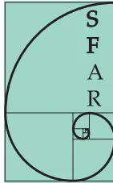
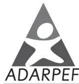
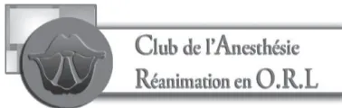

**Société Française d'Anesthésie et de Réanimation**

**Association des anesthésistes réanimateurs pédiatriques  
d'expression française**

## **Anesthésie pour amygdalectomie chez l'enfant**

**Conférence d'experts**

**Texte court**

**2005**## Liste des Experts

Sfar, Adarpef et Carorl

Pr I. Constant (Paris) *Secrétaire*, Dr P. Courrèges (Lille), Dr M. Dupont (Marseille), Pr C. Ecoffey (Rennes), Dr P. Grison (La Roche-sur-Yon), Dr C. Hayem (Nice), Pr G. Orliaguet (Paris) *Président*, Pr O. Paut (Marseille), Dr F. Vergnes (Bordeaux).

## Groupe de lecture

Dr C. Amory, Pr J.-E. Bazin, Pr D. Benhamou, Pr F. Bonnet, Dr J.-L. Bourgain, Dr D. Boisson-Bertrand, Dr B. Camus, Dr M.-L. Cittanova-Pansard, Dr L. Delaunay, Dr A. Delbos, Dr M. Dumeix, Pr B. Dureuil, Dr J.-P. Estebe, Dr E. Gaertner, Dr M. Gentili, Dr J. Godard, Pr J.-C. Granry, Dr W. Habre, Dr B. Hmamouchi, Dr L. Jouffroy, Dr C. Lejus, Dr M. Levy, Pr A. Lienhart, Dr B. Marciniak, Pr J. Marty, Dr P. Narchi, Dr M. Palot, Dr C. Penon, Pr J.-L. Pourriat, Dr A. Pouyau, Pr B. Riou

## Introduction

En France, l'anesthésie pour chirurgie ORL représente 12 % du total des actes réalisés, et occupe ainsi la troisième place, après l'anesthésie en orthopédie et en chirurgie digestive1. Sur environ 670 000 anesthésies annuelles en ORL, 17 % le sont pour amygdalectomie, associée (43 %) ou non (57 %) à une adénoïdectomie. La prévalence de l'amygdalectomie en France en 1996 était de 19/10 000 habitants2. Par ailleurs, l'anesthésie en ORL représente 25 % des actes réalisés chez les enfants de moins de 1 an, 64 % chez les 1-4 ans, et 28 % chez les 5-14 ans. Malgré les progrès réalisés en terme de prise en charge périopératoire, il persiste une morbi-mortalité non négligeable.

Cette conférence d'experts s'adresse à tous les médecins anesthésistes réanimateurs, que leur mode d'exercice soit libéral ou public, qui sont amenés à prendre en charge en périodes pré-, per-ou postopératoire des enfants opérés pour amygdalectomie.

## Méthodologie du travail

Ce travail est le fruit de la collaboration entre la Société française d'anesthésie et de réanimation (Sfar), l'Association des anesthésistes réanimateurs pédiatriques d'expression française (Adarpef), et le Club de l'anesthésie réanimation en ORL (Carorl).

Le but de cette conférence d'experts est de fournir une information sur les données récentes concernant la prise en charge périopératoire de l'enfant opéré pour amygdalectomie.

Le travail a été découpé en questions et sous questions, et ce découpage ainsi que le sujet des questions a été validé par le Comité des Référentiels de la Sfar. Le choix des questions posées aux experts a été orienté par le souci de répondre aux interrogations les plus fréquentes relatives à la prise en charge anesthésique d'un enfant programmé pour une amygdalectomie. Les sociétés savantes ont ensuite été contactées afin de fournir des noms d'experts chargés de rédiger les réponses aux questions et sous questions de l'argumentaire. Une fois le choix avalué, les experts ont été contactés et se sont réunis dans les locaux de la Sfar. A cette occasion, le calendrier du travail a été exposé et la méthodologie expliquée.

1 Auroy Y, Clergue F, Laxenaire MC, Lienhart A, Pequignot F, Jougla E. Anesthésie en chirurgie. Ann Fr Anesth Réanim 1998 ; 17 : 1324-41.

2 Laxenaire MC, Auroy Y, Clergue F, Pequignot F, Jougla E, Lienhart A. Anesthésies des patients ambulatoires. Ann Fr Anesth Réanim 1998 ; 17 : 1363-73.## Réalisation de l'argumentaire

Pour chaque question et sous question de l'argumentaire, les experts se sont vus définir des objectifs visant à répondre aux principales questions posées. Les textes de chaque expert ont été discutés en séance de travail, puis envoyés sur support électronique à tout le monde. Un groupe de praticiens extérieurs a relu l'ensemble des textes, et a fait des propositions de modifications qui ont été avalisées ou non après discussion.

## Réalisation du texte court/recommandations et de la cotation

Chaque expert a sélectionné les idées force de son chapitre pour constituer des recommandations visant à optimiser la prise en charge des enfants devant bénéficier d'une amygdalectomie. Il les a présentés au groupe d'experts en les justifiant tant sur le fond que sur la forme.

Le niveau de preuve et la force des recommandations sur lesquelles se sont appuyés les experts sont présentés dans les tableaux 1 et 2.

**Tableau 1 :** Niveaux de preuve en médecine factuelle.

<table border="1">
<tbody>
<tr>
<td>Niveau I</td>
<td>Etudes aléatoires avec un faible risque de faux positifs (<math>\alpha</math>) et de faux négatifs (<math>\beta</math>) (puissance élevée : (<math>\beta</math> = 5 à 10 %))</td>
</tr>
<tr>
<td>Niveau II</td>
<td>Risque a élevé, ou faible puissance</td>
</tr>
<tr>
<td>Niveau III</td>
<td>Etudes non aléatoires. Sujets « contrôlés » contemporains</td>
</tr>
<tr>
<td>Niveau IV</td>
<td>Etudes non aléatoires. Sujets « contrôlés » non contemporains</td>
</tr>
<tr>
<td>Niveau V</td>
<td>Etudes de cas. Avis d'experts</td>
</tr>
</tbody>
</table>

**Tableau 2 :** Force des recommandations en médecine factuelle.

<table border="1">
<tbody>
<tr>
<td>Grade A</td>
<td>Deux (ou plus) études de niveau I</td>
</tr>
<tr>
<td>Grade B</td>
<td>Une étude de niveau I</td>
</tr>
<tr>
<td>Grade C</td>
<td>Etude(s) de niveau II</td>
</tr>
<tr>
<td>Grade D</td>
<td>Une étude (ou plus) de niveau III</td>
</tr>
<tr>
<td>Grade E</td>
<td>Etude(s) de niveau IV ou V</td>
</tr>
</tbody>
</table>

Les recommandations nécessitant une validation, en particulier celles reposant sur de faible niveau de preuve, ont été cotées individuellement par chacun des experts selon une méthodologie dérivée de la RAND/UCLA. Les réponses à chaque question sont analysées en définissant la médiane des cotations et les extrêmes sur une échelle de 1 à 9.

Trois zones sont définies en fonction de la place de la médiane :

- – la zone [1 à 3] correspond à la zone de « désaccord »
- – la zone [4 à 6] correspond à la zone « d'indécision »
- – la zone [7 à 9] correspond à la zone « d'accord »

Pour chaque proposition, le degré d'accord du groupe est apprécié par la position sur l'échelle de l'intervalle borné par les cotations extrêmes. L'accord est dit « fort », si l'intervalle est situé à l'intérieur des bornes d'une des trois zones [1 à 3] ou [4 à 6] ou [7 à 9]. Si l'intervalle empiète sur une borne, l'accord est dit « faible » (intervalle [1 à 4] ou [6 à 8] par exemple).## Question 1

### Quelles doivent être l'évaluation préopératoire et la préparation à la chirurgie ?

#### 1.1. Quels sont les objectifs et les modalités de la consultation d'anesthésie, y compris l'information sur le risque donnée aux patients et à leurs parents ?

- – La consultation d'anesthésie en prévision d'une amygdalectomie a deux buts essentiels : l'évaluation des risques inhérents à l'acte et l'information du patient et de ses parents. [Accord fort]
- – L'évaluation des risques repose sur l'interrogatoire des parents et si possible de l'enfant, ainsi que sur l'examen clinique de l'enfant. [Accord fort]
- – Les risques respiratoires et hémorragiques doivent faire l'objet d'une attention et d'une information particulières. [Accord fort]
- – Le risque respiratoire est majoré en cas de Syndrome d'apnée obstructive du sommeil (SAOS) grave. [Accord fort]
- – L'information s'adresse à la fois à l'enfant et aux parents, et doit être adaptée au degré de compréhension de chacun. [Accord fort]

#### 1.2. Quel bilan préopératoire peut-on proposer avant amygdalectomie chez l'enfant ?

- – L'évaluation préopératoire du risque hémorragique, repose sur un interrogatoire précis à la recherche d'antécédents personnels et/ou familiaux suggérant une anomalie de l'hémostase, et sur un examen clinique recherchant une symptomatologie hémorragique. [Accord fort]
- – En cas d'antécédents personnels ou familiaux d'hémorragie connus ou suspectés, ou lorsque l'évaluation préopératoire ne peut être considérée comme fiable, notamment chez l'enfant de moins de trois ans, une étude de l'hémostase doit être réalisée. [Accord fort]
- – Les résultats de cette étude initiale, s'ils restent anormaux après contrôle doivent être discutés avec un spécialiste de l'hémostase afin de déterminer l'opportunité d'une étude plus approfondie. [Accord fort]
- – Si des examens d'hémostase sont prescrits, le temps de céphaline avec activateur et la numération plaquettaire sont les tests les plus utiles. [Accord fort]
- – Chez l'enfant de plus de trois ans, lorsque l'évaluation clinique préopératoire ne dépiste pas de risque hémorragique anormal, l'étude systématique de l'hémostase ne s'impose pas. [Accord fort]

#### 1.3. Comment faut-il gérer une infection des voies aériennes supérieures (IVAS) avant amygdalectomie chez l'enfant ?

- – L'amygdalectomie majeure le risque de complications respiratoires du fait de la localisation du site chirurgical sur les voies aériennes supérieures (**Grade A**).
- – Ces complications respiratoires contribuent à générer une morbidité dénuée de réelle gravité si l'anesthésiste est expérimenté dans ce contexte (**Grade B**).
- – Quelles sont les conséquences anesthésiques de l'IVAS chez l'enfant ?
  - • l'IVAS entraîne une fréquence accrue de complications respiratoires telles que désaturation et pause respiratoire (**Grade A**).
  - • l'IVAS entraîne une augmentation de la fréquence des bronchospasmes lorsque l'enfant est intubé (**Grade A**).#### 1.4. En cas d'IVAS, quels sont les critères de report d'intervention ?

- - L'intervention est différée si l'enfant présente [Accord fort] :
  - • des signes spastiques bronchiques ;
  - • une laryngite ;
  - • une température supérieure à 38°.
- - En cas de report d'intervention, le délai de re-programmation est d'au moins trois semaines. [Accord fort]

#### 1.5. Quelles sont les conséquences du syndrome d'apnée du sommeil (SAOS) sur la prise en charge anesthésique des patients ?

- - Le SAOS représente environ deux tiers des indications d'amygdalectomie. [Accord fort]
- - Les enfants concernés ont le plus souvent moins de cinq ans. [Accord fort]
- - En l'absence de critères de gravité, le SAOS ne modifie habituellement pas la prise en charge anesthésique. [Accord fort]
- - Les formes graves de SAOS sont plus fréquentes chez le jeune enfant et en cas de dysmorphie faciale ou de pathologie associées. [Accord fort]
- - Les formes graves de SAOS nécessitent une évaluation préopératoire du retentissement cardio-pulmonaire, et justifient une surveillance postopératoire d'au moins 24 heures dans une structure de type salle de surveillance post-interventionnelle (SSPI) ou surveillance continue. [Accord fort]

### Question 2

#### Quelle doit être la prise en charge anesthésique des enfants programmes pour amygdalectomie ?

##### 2.1. Quelle doit être la prise en charge anesthésique des patients ?

- - Les règles de jeûne habituelles, adaptées à l'âge de l'enfant, doivent être appliquées (**Grade C**).
- - En dehors des syndromes obstructifs graves, une prémédication anxiolytique est utile (**Grade C**).
- - Les structures de prise en charge et le matériel utilisé doivent être conformes aux recommandations de la Sfar et de l'Adarpef. [Accord fort]
- - La surveillance peropératoire repose sur un monitoring conforme aux recommandations de la Sfar. [Accord fort]
- - L'anesthésie générale lors de l'amygdalectomie a pour but d'assurer une composante hypnotique suffisante pour éviter la mémorisation peropératoire, et une composante analgésique efficace. [Accord fort]
- - L'induction par inhalation est la modalité la plus fréquente. [Accord fort]
- - L'induction intraveineuse est parfois préférée chez les grands enfants ou en cas de syndrome obstructif sévère. [Accord fort]
- - L'entretien de l'anesthésie est souvent assuré par un agent halogéné associé à un morphinique. [Accord fort]
- - Les apports hydroélectrolytiques peropératoires reposent sur l'utilisation d'un soluté isotonique en sel, pouvant contenir une faible concentration de glucose et perfusé à un débit adapté à l'âge de l'enfant. [Accord fort]- – Le débit de perfusion doit suivre la règle des 4-2-1 : 4 ml/kg par heure pour les 10 premiers kilos de poids corporel, auxquels on ajoute 2 ml/kg par heure pour les 10 kg de poids suivant, auxquels on ajoute 1 ml/kg par heure pour les 10 kg de poids suivant ; soit 65 ml/h pour un enfant de 25 kg par exemple. [Accord fort]
- – Il est recommandé d'utiliser un dispositif médical de contrôle du débit de perfusion. [Accord fort]
- – L'administration peropératoire de dexaméthasone est recommandée car elle réduit l'incidence des NVPO, et le délai avant la reprise alimentaire (**Grade B**).
- – L'administration d'une antibioprophylaxie peropératoire n'a pas démontré son intérêt, et ne s'impose donc pas systématiquement. [Accord fort]

## 2.2. Quelles sont les modalités de contrôle des voies aériennes lors de l'amygdalectomie ?

- – L'amygdalectomie chez l'enfant requiert une anesthésie générale balancée impliquant une protection des voies aériennes. [Accord fort]
- – Le contrôle optimal des voies aériennes est assuré par une sonde d'intubation trachéale à ballonnet. [Accord fort]
- – L'extubation est réalisée, en présence d'un médecin anesthésiste, au réveil complet de l'enfant, déterminé par l'ouverture des yeux à la demande. [Accord fort]

## Question 3 Comment doivent être organisés les soins postopératoires ?

### 3.1. Quelles sont les modalités de surveillance postopératoires ?

- – La surveillance en SSPI doit être systématique. [Accord fort]
- – En plus de la surveillance habituelle, le dépistage et le traitement éventuel des complications respiratoires et hémorragique est indispensable. [Accord fort]
- – La surveillance en SSPI peut être prolongée chez les jeunes enfants opérés dans un contexte de SAOS grave. [Accord fort]
- – La sortie de SSPI est autorisée après vérification des critères habituels (respiration, état hémodynamique, conscience, douleur, NVPO) et vérification de l'absence de saignement pharyngé par le chirurgien. [Accord fort]

### 3.2. Quelles sont les règles de perfusion postopératoires et de reprise des boissons et de l'alimentation ?

- – Les apports hydroélectrolytiques postopératoires reposent sur un soluté isotonique en sel, pouvant contenir une faible concentration de glucose. [Accord fort]
- – La perfusion est poursuivie jusqu'à la reprise efficace des boissons. [Accord fort]
- – En raison du risque hémorragique, la reprise de l'alimentation s'effectue six heures après la fin de l'intervention, par contre la reprise des liquides clairs est possible après la deuxième heure. [Accord fort]
- – Un régime alimentaire spécifique n'a pas fait preuve de sa supériorité par rapport à une alimentation libre après amygdalectomie (**Grade C**).### 3.3. Quelles sont les modalités de l'analgésie postopératoire ?

- - La douleur post-amygdalectomie est considérée comme une douleur forte à composante inflammatoire. Elle dure en moyenne huit jours, avec un maximum les trois premiers jours. [Accord fort]
- - L'évaluation et le traitement de la douleur doivent être systématiques, y compris à domicile (Grade C).
- - L'utilisation du paracétamol doit être large, quasi-systématique ; les voies IV et orale sont les plus fiables (Grade B).
- - Seule la morphine est efficace en monothérapie, administrée par voie IV en SSPI, elle est considérée comme l'antalgique de référence. Les autres analgésiques doivent être utilisés en association et en tenant compte de leur délai d'action (Grade C).
- - La posologie de la morphine doit être réduite en cas de SAOS grave. [Accord fort]
- - Les antalgiques du palier II en association avec le paracétamol, peuvent prendre le relais de la morphine IV. Leur administration par voie orale doit être débutée dès que possible (Grade C).
- - Les AINS non sélectifs ne sont pas recommandés car ils peuvent s'associer à une augmentation de la fréquence des reprises chirurgicales pour saignement. [Accord faible]

## Question 4

### Quelles sont les principales complications postopératoires et quelle doit être leur prise en charge ?

#### 4.1. Quelles sont les principales complications postopératoires après amygdalectomie chez l'enfant ?

- - Les principales complications primaires (avant la 24e heure) sont : les complications respiratoires, l'hémorragie et les nausées et vomissements (Grade B).
- - Les principaux facteurs de risques de complications respiratoires sont : la gravité du SAOS et l'importance de la désaturation artérielle préopératoire (Grade C).
- - Chez les patients atteints de SAOS, 70 % des complications respiratoires majeures surviennent dans la première heure postopératoire, alors que les complications mineures surviennent habituellement avant la sixième heure (Grade C).
- - L'hémorragie postopératoire survient chez 0,5 à 3 % des patients (Grade B).
- - Quatre vingt pour cent des hémorragies primaires surviennent avant la sixième heure (Grade B).
- - Approximativement 25 % des hémorragies postopératoires vont nécessiter une reprise chirurgicale (Grade C).
- - Les patients nécessitant une reprise chirurgicale pour hémostase doivent être considérés comme ayant l'estomac plein et justifient une induction en séquence rapide. [Accord fort]

#### 4.2. Quelles sont l'incidence, les conséquences et la prise en charge des nausées et vomissements postopératoire (NVPO) après amygdalectomie chez l'enfant ?

- - Après amygdalectomie on observe des nausées et vomissements chez 40 à 70 % des patients (Grade C).
- - L'utilisation peropératoire de protoxyde d'azote ne modifie pas l'incidence des NVPO (Grade C).- - Les NVPO sont moins fréquentes après injection peropératoire de propofol (**Grade C**).
- - L'administration prophylactique IV de sétron réduit significativement l'incidence des NVPO après amygdalectomie chez l'enfant (**Grade C**).
- - La dexaméthasone réduit significativement l'incidence des NVPO, et potentialise l'efficacité des sétrons (**Grade C**).
- - Des protocoles de prise en charge des NVPO doivent être prévus et accessibles en SSPI. [Accord fort]

### Question 5

#### Quelles sont les conditions requises pour la pratique de l'amygdalectomie en ambulatoire ?

- - La réalisation de l'amygdalectomie en ambulatoire est possible si [Accord fort] :
  - • l'enfant est âgé de plus de trois ans ;
  - • il n'existe pas de comorbidité majorant notamment le risque respiratoire ;
  - • il n'existe pas d'anomalie de l'hémostase ;
  - • il n'existe pas de syndrome d'apnée du sommeil grave ;
  - • les critères habituels de proximité et d'entourage familial sont satisfaits ;
  - • et sous réserve d'un consensus entre le chirurgien, l'anesthésiste et les parents.
- - L'intervention doit être réalisée le plus tôt possible dans la matinée afin de permettre la sortie après une surveillance postopératoire de six heures. [Accord fort]
- - La gestion anesthésique doit privilégier la prévention des NVPO, et l'anticipation peropératoire de l'analgésie postopératoire. [Accord fort]
- - Le relais antalgique oral devrait être débuté avant la sortie du patient. [Accord fort]
- - Il est recommandé de remettre aux parents un document avec les coordonnées de la personne à contacter en cas de difficultés, ainsi que l'ordonnance d'antalgiques de sortie. [Accord fort]
- - La sortie de l'enfant est autorisée après la sixième heure postopératoire, si les critères suivants sont réunis [Accord fort] :
  - • absence de saignement au niveau des loges amygdaliennes, confirmée par le chirurgien ;
  - • absence de douleur ;
  - • absence de NVPO ;
  - • accord signé du chirurgien et de l'anesthésiste.
- - Un suivi téléphonique du patient à domicile à la 24e heure est souhaitable, car il améliore la qualité de la prise en charge. [Accord fort]