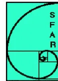

**Organisme Agréé de Réanimation de langue Française**  
**Société de Réanimation de Langue Française**  
**Collège Français des Anesthésistes Réanimateurs**  
**Société Française d'Anesthésie Réanimation**

**CRITERES D'EVALUATION ET D'AMELIORATION**  
**DES**  
**PRATIQUES PROFESSIONNELLES:**

Proposition d'un programme d'EPP « clés en main » : audit clinique

**Ventilation Non Invasive**  
**au cours de l'insuffisance respiratoire aiguë**  
**(nouveau-né exclu)**

**VERSION 1 : DECEMBRE 2007**

Ce document est la propriété intellectuelle des deux OA OARLF et CFAR.  
Son utilisation nécessite leur accord préalable## Introduction

Un programme d'évaluation des pratiques professionnelles (EPP) consiste en l'analyse des pratiques professionnelles en référence à des recommandations et selon une méthode élaborée ou validée par la Haute Autorité de Santé (HAS). Le programme comporte ensuite, obligatoirement, la mise en œuvre et le suivi d'actions d'amélioration des pratiques. L'HAS propose de nombreuses méthodes pour les programmes d'EPP. Les guides d'utilisation de ces méthodes sont téléchargeables gratuitement sur le site de la Haute Autorité de santé (<http://www.has-sante.fr>). Les critères d'évaluation et d'amélioration des pratiques reposent sur des objectifs de qualité à atteindre. Ils sont sélectionnés dans des recommandations professionnelles valides ou dans des textes réglementaires. Les critères d'évaluations sont des éléments plus concrets permettant de voir si on a atteint les objectifs. L'utilisation de ces critères est précisée dans l'annexe I

## Ventilation Non Invasive au cours de l'insuffisance respiratoire aiguë (nouveau-né exclu)

## Promoteurs

L'organisme Agréé de Réanimation de langue Française

La société de Réanimation de langue Française

Le Collège Français des Anesthésistes Réanimateurs

La Société Française d'Anesthésie- Réanimation

## Sources

Le document de référence principalement sélectionné par le groupe de travail a été le texte de la **conférence de consensus de 2006**, organisée par la SRLF, la SFAR , la SPLF, avec la participation de la SFMU et SAMU DE FRANCE et du GFRUP.

Le système choisi pour la cotation des recommandations de la conférence est le système GRADE. Dans ce système, seuls les éléments majeurs sont cotés. Les niveaux de preuves (haut niveau, niveau intermédiaire, bas et très bas niveaux) sont pondérés par différents éléments, dont la balance bénéfices/risques. Les recommandations sont intégrées au texte de la façon suivante : « il faut faire (G1+) ou il ne faut pas faire (G1-); il faut probablement faire (G2+) ou il ne faut probablement pas faire (G2-) ».

## Cibles Professionnelles

Médecins réanimateurs, anesthésistes réanimateurs, pneumologues et urgentistes.

## Patients concernés

Le programme d'EPP proposé concerne la VNI mise en œuvre chez des malades en insuffisance respiratoire aiguë **pris en charge par un service de réanimation adulte**. Il peut être adapté pour d'autres spécialités## Objectifs de qualité

### Identification au niveau de la structure :

1. 1. La mise en œuvre de la VNI doit faire l'objet de protocoles écrits, validés, actualisés et adaptés aux situations cliniques spécifiques rencontrées dans le secteur d'activité concerné. Niveau de recommandation : G2+ (*critères 1 et 2*) ;
2. 2. L'équipe dispose des moyens humains et matériels nécessaires à la mise en œuvre de la VNI :
   - • choix d'interfaces (différents modèles et tailles)
   - • dispositifs de VNI (ventilateurs, circuit de VS-PEP) permettant de délivrer un mode ventilatoire adapté à la population prise en charge
   - • monitoring adapté à la surveillance des patients sous VNINiveau de recommandation : G1+

### Identification au niveau du dossier patient :

1. 1. Disposer d'une évaluation avant la VNI prenant en compte le rapport bénéfices/risques et permettant de proposer une indication en fonction de la pathologie (*critères 4 et 5*).
   - - Evaluation avant la VNI
   - - chez le **BPCO**: critères de décompensation respiratoire  $pH < 7,35$
   - - **OAP**: hypercapnie ou échec du traitement initial ou gravité
   - - **pneumonie** : la recommandation de la conférence de consensus est "prudence dans cette indication", la discussion "bénéfice/risque" doit apparaître dans le dossier
   - - Chaque unité peut appliquer l'évaluation à d'autres groupes de pathologie (IRA immunodéprimé, maladie neuromusculaire décompensée, VNI sevrage, VNI post-opératoire...)
2. 2. Assurer la lisibilité et contrôler la qualité de la prescription et de la surveillance de la VNI par rapport aux recommandations du service (*critères 6, 7, 8, 9 et 10*). Grade 2+ ;
3. 3. Pouvoir vérifier l'adéquation de la pratique professionnelle dans la gestion des échecs et des complications par rapport aux recommandations locales (*critères 11 et 12*). Grade 2+

## Méthodes proposées

Audit clinique ciblé rétrospectif portant sur la structure et 20 dossiers de patients

## Déroulement de la démarche pour ce programme

Information du programme EPP apportée à l'ensemble de l'équipe médicale. Lecture par chacun de ce document.Appropriation des critères

Tirage au sort de 20 dossiers patients

Remplissage de la grille d'évaluation.

Synthèse de l'audit exposée à l'équipe médicale par un médecin

Discussion et décisions pour modifier les pratiques,

Nouvel audit ou suivi d'indicateurs

## **Critères d'évaluation :**

### **Critères portant sur la structure :**

1. L'équipe médicale dispose de protocoles de mise en œuvre de la VNI dans les situations d'insuffisance respiratoire aiguë rencontrées, écrits, validés et adaptés à la pathologie et à la gravité des patients pris en charge.

2. L'équipe dispose des moyens nécessaires à la mise en œuvre de la VNI :

- - un choix suffisant d'interfaces (différents modèles et tailles)
- - des dispositifs de VNI (ventilateurs, circuit de VS-PEP) permettant de délivrer un mode de ventilation adapté à la population prise en charge
- - un monitoring paraclinique adapté à la surveillance des patients sous VNI

3. Les équipes médicales et para-médicales sont formées (formation théorique et pratique) à la technique.

### **Critères à rechercher dans les dossiers des patients :**

4. L'indication de la VNI est reportée dans le dossier médical.

5. En fonction des particularités liées au terrain et à la pathologie du patient le rapport bénéfices/risques de la VNI est discuté et renseigné dans le dossier médical.

6. Les conditions de mise en œuvre (interface, réglages ventilatoires, périodicité des séances) sont conformes au protocole du service et sont mentionnées dans la prescription médicale.

7. Les traitements spécifiques à la pathologie sous-jacente sont appliqués parallèlement et sans délai.

8. Les paramètres d'une surveillance clinique et paraclinique (Vte, FR) rapprochée pendant les premières heures figurent sur la prescription médicale et sont reportés sur le dossier de surveillance infirmière.

9. L'oxymétrie de pouls est monitoré en continu et la SpO2 est régulièrement relevée.

10. Une gazométrie artérielle est disponible au plus tard dans les 1 à 2 heures suivant le début de la VNI.

11. Les raisons de l'échec de la VNI sont reportées dans l'observation médicale.

12. Les complications et les effets indésirables liés à la VNI sont reportés dans le dossier médical et font l'objet d'une stratégie de prévention.## Guide de l'utilisateur

**Critères portant sur la structure (une seule réponse par critère) :**

### **Critère 1 :**

*L'équipe médicale dispose de protocoles de mise en œuvre de la VNI dans les situations d'insuffisance respiratoire aiguë rencontrées, écrits, validés et adaptés à la pathologie et à la gravité des patients pris en charge.*

Répondre OUI s'il existe dans la structure un protocole écrit correspondant aux situations cliniques spécifiques rencontrées dans le secteur d'activité concerné (OAP, BPCO, postopératoire, hématologie, pédiatrie, etc.) et validés.

| Répondre NON si les protocoles ne sont pas disponibles ou n'ont pas été validés.

### **Critère 2 :**

*L'équipe dispose des moyens nécessaires à la mise en œuvre de la VNI :*

- - *choix d'interfaces (modèles et tailles)*
- - *dispositifs de VNI (ventilateurs, circuit de VS-PEP) permettant de délivrer un mode de ventilation adapté à la population prise en charge*
- - *monitoring paraclinique adapté à la surveillance des patients sous VNI*

Répondre OUI si il existe dans la structure : 1° un choix de divers types d'interfaces disponibles en plusieurs tailles pour couvrir largement les spécificités morphologiques des patients; 2° en fonction des patients pris en charge par la structure : des circuits de CPAP et/ou des ventilateurs permettant de délivrer un mode assisté à double niveaux de pression et comportant : le réglage du trigger inspiratoire, de la pente de pressurisation du niveau d'AI, du temps inspiratoire maximal ou du cyclage inspiration/expiration (trigger expiratoire); l'affichage du volume courant expiré et des pressions; 3° pour les structures utilisant des modes assistés en pression, un matériel permettant le monitoring du volume courant expiré, la détection des fuites et des asynchronies patient-ventilateur (courbes de pression-volume sur écran ); 4° Des systèmes d'humidification des gaz inspirés disponibles (humidificateur chauffant ou filtre échangeur de chaleur et d'humidité)

| Répondre NON : si l'équipe ne dispose pas du matériel correspondant aux quatre points spécifiés.

### **Critère 3 :**

*Les équipes médicales et para-médicales sont formées (formation théorique et pratique) à la technique.*

Répondre OUI si une formation initiale minimale (théorique et pratique) à la VNI est organisée dans la structure à l'arrivée des nouveaux personnels (médicaux et paramédicaux ?).

Répondre NON si aucune formation spécifique à la VNI n'est organisée dans la structure.**Critères à rechercher dans les 20 dossiers patients analysés (une réponse pour chaque dossier, soit 20 réponses par critère) :**

**Critère 4 :**

*L'indication de la VNI est reportée dans le dossier médical.*

Répondre OUI si l'indication de la VNI est renseignée dans le dossier médical précisant la pathologie respiratoire à l'origine de l'insuffisance respiratoire aiguë et sa gravité, les critères de la conférence doivent apparaître quand ils ont été précisés (ex pH<7,35 pour BPCO)

Répondre NON s'il manque un des items.

**Critère 5 :**

*En fonction des particularités liées au terrain et à la pathologie du patient le rapport bénéfices/-risques de la VNI est discuté et renseigné dans le dossier médical.*

Répondre OUI si le rapport bénéfices/-risques de la VNI est renseignée dans le dossier médical

Répondre NON si le rapport bénéfices/-risques de la VNI n'y figure pas

**Critère 6 :**

*Les conditions de mise en œuvre (interface, réglages ventilatoires, périodicité des séances) sont conformes au protocole du service et sont mentionnées dans la prescription médicale.*

Répondre OUI si la prescription médicale précise interface, réglages ventilatoires, périodicité des séances conformément au protocole de la structure.

Répondre NON si la prescription ne détaille pas ces conditions ou si ces conditions de mise en œuvre ne sont pas conformes au protocole.

**Critère 7 :**

*Les traitements spécifiques à la pathologie sous-jacente sont appliqués parallèlement et sans délai.*

Répondre OUI si le traitement, en particulier cardiologique (OAP), est débuté préalablement ou simultanément à la VNI

Répondre NON si le traitement spécifique est initié avec délai

Répondre Non Applicable (NA) lorsque la VNI représente le traitement pivot de la détresse respiratoire.

**Critère 8 :**

*Les paramètres d'une surveillance clinique et paraclinique (Vte, FR) rapprochée pendant les premières heures figurent sur la prescription médicale et sont reportés sur le dossier de surveillance infirmière.*

Répondre OUI si les paramètres de surveillance (FR, Vte), sont prescrits et figurent sur la feuille de surveillance infirmière.

Répondre NON si les paramètres de surveillance et les conditions de leur recueil ne sont pas prescrits et/ou ne figurent pas sur la feuille de surveillance infirmière**Critère 9 :**

*L'oxymétrie de pouls est monitorée en continu et la SpO2 est régulièrement relevée*

Répondre OUI si l'oxymétrie de pouls est monitorée en continu et la SpO2 est régulièrement relevée

Répondre NON si l'oxymétrie de pouls n'est pas régulièrement relevée

**Critère 10 :**

*Une gazométrie artérielle est disponible au plus tard dans les 1 à 2 heures suivant le début de la VNI. NB: la conférence de consensus n'a pas précisé si les GDS devaient être faits en VNI ou juste après.*

Répondre OUI si les résultats de la gazométrie initiale sont reportés dans le dossier médical.

Répondre NON si aucune gazométrie n'a été prescrite et/ou si les résultats de la gazométrie artérielle ne sont pas retrouvés dans le dossier médical.

Répondre Non Applicable si la réalisation de la gazométrie artérielle n'est pas possible techniquement : ex intervention pré-hospitalière.

**Critère 11 :**

*Les raisons de l'échec de la VNI sont reportées dans l'observation médicale.*

Répondre OUI si les raisons de l'échec de la VNI conduisant à l'intubation trachéale figurent dans le dossier médical.

Répondre NON si ces raisons ne sont pas retrouvées dans le dossier médical.

Répondre Non Applicable en cas de succès de la VNI.

**Critère 12 :**

*Les complications et les effets indésirables liés à la VNI sont reportés dans le dossier médical et font l'objet d'une stratégie de prévention.*

Répondre OUI si les complications et les effets indésirables de la VNI figurent sur l'observation médicale et font l'objet d'une stratégie de prévention

Répondre NON si elles ne sont pas rapportées et/ou ne font pas l'objet d'une stratégie de prévention

Répondre NA si la VNI n'a occasionnée ni complications ni effets indésirables## Grilles d'évaluation

Notez une seule réponse par case :

**O** si la réponse est OUI ou présent

**N** si la réponse est NON ou absent

**NA** si le critère ne s'applique pas à ce patient ou à votre pratique (précisez dans la zone de commentaires). N'hésitez pas à ajouter des informations qualitatives !

N° d'anonymat :

Date :

Temps passé à cette évaluation :

**Critères concernant la structure (une seule réponse par critère) :**

<table border="1">
<thead>
<tr>
<th>CRITERES</th>
<th>OUI</th>
<th>NON</th>
<th>NA</th>
<th>COMMENTAIRES SI NA OU NON</th>
</tr>
</thead>
<tbody>
<tr>
<td>
<b>Critère 1 :</b> 
                    L'équipe médicale dispose de protocoles de mise en œuvre de la VNI dans les situations d'insuffisance respiratoire aiguë écrits, validés et adaptés à son secteur d'activité..
                </td>
<td></td>
<td></td>
<td></td>
<td></td>
</tr>
<tr>
<td>
<b>Critère 2 :</b> 
                    L'équipe dispose des moyens nécessaires à la mise en oeuvre de la VNI :
                    <ul style="list-style-type: none;">
<li>- choix d'interfaces (modèles et tailles)</li>
<li>- systèmes de VNI permettant de délivrer un mode ventilatoire adapté à la population prise en charge</li>
<li>- monitoring adapté à la surveillance des patients sous VNI</li>
</ul>
</td>
<td></td>
<td></td>
<td></td>
<td></td>
</tr>
<tr>
<td>
<b>Critère 3. :</b> 
                    Les équipes médicales et paramédicales sont formées (formation théorique et pratique) à la technique.
                </td>
<td></td>
<td></td>
<td></td>
<td></td>
</tr>
</tbody>
</table>## Critères retrouvés dans les dossiers patients

Notez une seule réponse par case : **O** si la réponse est OUI (= présent) **N** si la réponse est NON (= absent) **NA** si le critère ne s'applique pas à ce patient ou à votre pratique (précisez dans la zone de commentaires). N'hésitez pas à ajouter des informations qualitatives

N° d'anonymat :      Date :

Temps passé à cette évaluation

<table border="1">
<thead>
<tr>
<th></th>
<th>1</th>
<th>2</th>
<th>3</th>
<th>4</th>
<th>5</th>
<th>6</th>
<th>7</th>
<th>8</th>
<th>9</th>
<th>10</th>
<th>Total</th>
</tr>
</thead>
<tbody>
<tr>
<td><b>Critère 4.</b> L'indication de la VNI est reportée dans le dossier médical</td>
<td></td>
<td></td>
<td></td>
<td></td>
<td></td>
<td></td>
<td></td>
<td></td>
<td></td>
<td></td>
<td>O : N : NA :</td>
</tr>
<tr>
<td><b>Critère 5.</b> En fonction des particularités liées au terrain et à la pathologie du patient le rapport bénéfices/-risques de la VNI est discuté et renseigné dans le dossier médical.</td>
<td></td>
<td></td>
<td></td>
<td></td>
<td></td>
<td></td>
<td></td>
<td></td>
<td></td>
<td></td>
<td>O : N : NA :</td>
</tr>
<tr>
<td><b>Critère 6.</b> Les conditions de mise en œuvre (interface, réglages ventilatoires, périodicité des séances) sont conformes au protocole du service et sont mentionnées dans la prescription médicale.</td>
<td></td>
<td></td>
<td></td>
<td></td>
<td></td>
<td></td>
<td></td>
<td></td>
<td></td>
<td></td>
<td>O : N : NA :</td>
</tr>
<tr>
<td><b>Critère 7.</b> Les traitements spécifiques à la pathologie sous-jacente sont appliqués parallèlement et sans délai.</td>
<td></td>
<td></td>
<td></td>
<td></td>
<td></td>
<td></td>
<td></td>
<td></td>
<td></td>
<td></td>
<td>O : N : NA :</td>
</tr>
<tr>
<td><b>Critère 8.</b> Les paramètres d'une surveillance clinique et paraclinique (Vte,FR) rapprochée pendant les premières heures figurent sur la prescription médicale et sont reportés sur le dossier de surveillance infirmière</td>
<td></td>
<td></td>
<td></td>
<td></td>
<td></td>
<td></td>
<td></td>
<td></td>
<td></td>
<td></td>
<td>O : N : NA :</td>
</tr>
<tr>
<td><b>Critère 9.</b> L'oxymétrie de pouls est monitorée en continu et la SpO2 est régulièrement relevée</td>
<td></td>
<td></td>
<td></td>
<td></td>
<td></td>
<td></td>
<td></td>
<td></td>
<td></td>
<td></td>
<td>O : N : NA :</td>
</tr>
<tr>
<td><b>Critère 10.</b> Une gazométrie artérielle est disponible au plus tard dans les 1 à 2 heures suivant le début de la VNI.</td>
<td></td>
<td></td>
<td></td>
<td></td>
<td></td>
<td></td>
<td></td>
<td></td>
<td></td>
<td></td>
<td>O : N : NA :</td>
</tr>
<tr>
<td><b>Critère 11.</b> Les raisons de l'échec de la VNI sont reportées dans l'observation médicale.</td>
<td></td>
<td></td>
<td></td>
<td></td>
<td></td>
<td></td>
<td></td>
<td></td>
<td></td>
<td></td>
<td>O : N : NA :</td>
</tr>
<tr>
<td><b>Critère 12.</b> Les complications et les effets indésirables liés à la VNI sont reportés dans le dossier médical et font l'objet d'une stratégie de prévention.</td>
<td></td>
<td></td>
<td></td>
<td></td>
<td></td>
<td></td>
<td></td>
<td></td>
<td></td>
<td></td>
<td>O : N : NA :</td>
</tr>
</tbody>
</table>## Critères retrouvés dans les dossiers patients

<table border="1">
<thead>
<tr>
<th></th>
<th>11</th>
<th>12</th>
<th>13</th>
<th>14</th>
<th>15</th>
<th>16</th>
<th>17</th>
<th>18</th>
<th>19</th>
<th>20</th>
<th>Total</th>
</tr>
</thead>
<tbody>
<tr>
<td><b>Critère 4.</b> L'indication de la VNI est reportée dans le dossier médical</td>
<td></td>
<td></td>
<td></td>
<td></td>
<td></td>
<td></td>
<td></td>
<td></td>
<td></td>
<td></td>
<td>O : N : NA :</td>
</tr>
<tr>
<td><b>Critère 5.</b> En fonction des particularités liées au terrain et à la pathologie du patient le rapport bénéfices/-risques de la VNI est discuté et renseigné dans le dossier médical.</td>
<td></td>
<td></td>
<td></td>
<td></td>
<td></td>
<td></td>
<td></td>
<td></td>
<td></td>
<td></td>
<td>O : N : NA :</td>
</tr>
<tr>
<td><b>Critère 6.</b> Les conditions de mise en œuvre (interface, réglages ventilatoires, périodicité des séances) sont conformes au protocole du service et sont mentionnées dans la prescription médicale.</td>
<td></td>
<td></td>
<td></td>
<td></td>
<td></td>
<td></td>
<td></td>
<td></td>
<td></td>
<td></td>
<td>O : N : NA :</td>
</tr>
<tr>
<td><b>Critère 7.</b> Les traitements spécifiques à la pathologie sous-jacente sont appliqués parallèlement et sans délai.</td>
<td></td>
<td></td>
<td></td>
<td></td>
<td></td>
<td></td>
<td></td>
<td></td>
<td></td>
<td></td>
<td>O : N : NA :</td>
</tr>
<tr>
<td><b>Critère 8.</b> Les paramètres d'une surveillance clinique et paraclinique (Vte,FR) rapprochée pendant les premières heures figurent sur la prescription médicale et sont reportés sur le dossier de surveillance infirmière</td>
<td></td>
<td></td>
<td></td>
<td></td>
<td></td>
<td></td>
<td></td>
<td></td>
<td></td>
<td></td>
<td>O : N : NA :</td>
</tr>
<tr>
<td><b>Critère 9.</b> L'oxymétrie de pouls est monitorée en continu et la SpO2 est régulièrement relevée</td>
<td></td>
<td></td>
<td></td>
<td></td>
<td></td>
<td></td>
<td></td>
<td></td>
<td></td>
<td></td>
<td>O : N : NA :</td>
</tr>
<tr>
<td><b>Critère 10.</b> Une gazométrie artérielle est disponible au plus tard dans les 1 à 2 heures suivant le début de la VNI.</td>
<td></td>
<td></td>
<td></td>
<td></td>
<td></td>
<td></td>
<td></td>
<td></td>
<td></td>
<td></td>
<td>O : N : NA :</td>
</tr>
<tr>
<td><b>Critère 11.</b> Les raisons de l'échec de la VNI sont reportées dans l'observation médicale.</td>
<td></td>
<td></td>
<td></td>
<td></td>
<td></td>
<td></td>
<td></td>
<td></td>
<td></td>
<td></td>
<td>O : N : NA :</td>
</tr>
<tr>
<td><b>Critère 12.</b> Les complications et les effets indésirables liés à la VNI sont reportés dans le dossier médical et font l'objet d'une stratégie de prévention.</td>
<td></td>
<td></td>
<td></td>
<td></td>
<td></td>
<td></td>
<td></td>
<td></td>
<td></td>
<td></td>
<td>O : N : NA :</td>
</tr>
</tbody>
</table><table border="1"><thead><tr><th data-bbox="113 93 204 125"><b>Dossiers</b></th><th data-bbox="204 93 952 125"><b>Observations et commentaires</b></th></tr></thead><tbody><tr><td data-bbox="113 125 204 161">1</td><td data-bbox="204 125 952 161"></td></tr><tr><td data-bbox="113 161 204 197">2</td><td data-bbox="204 161 952 197"></td></tr><tr><td data-bbox="113 197 204 233">3</td><td data-bbox="204 197 952 233"></td></tr><tr><td data-bbox="113 233 204 269">4</td><td data-bbox="204 233 952 269"></td></tr><tr><td data-bbox="113 269 204 305">5</td><td data-bbox="204 269 952 305"></td></tr><tr><td data-bbox="113 305 204 341">6</td><td data-bbox="204 305 952 341"></td></tr><tr><td data-bbox="113 341 204 377">7</td><td data-bbox="204 341 952 377"></td></tr><tr><td data-bbox="113 377 204 413">8</td><td data-bbox="204 377 952 413"></td></tr><tr><td data-bbox="113 413 204 449">9</td><td data-bbox="204 413 952 449"></td></tr><tr><td data-bbox="113 449 204 485">10</td><td data-bbox="204 449 952 485"></td></tr><tr><td data-bbox="113 485 204 521">11</td><td data-bbox="204 485 952 521"></td></tr><tr><td data-bbox="113 521 204 557">12</td><td data-bbox="204 521 952 557"></td></tr><tr><td data-bbox="113 557 204 593">13</td><td data-bbox="204 557 952 593"></td></tr><tr><td data-bbox="113 593 204 629">14</td><td data-bbox="204 593 952 629"></td></tr><tr><td data-bbox="113 629 204 665">15</td><td data-bbox="204 629 952 665"></td></tr><tr><td data-bbox="113 665 204 701">16</td><td data-bbox="204 665 952 701"></td></tr><tr><td data-bbox="113 701 204 737">17</td><td data-bbox="204 701 952 737"></td></tr><tr><td data-bbox="113 737 204 773">18</td><td data-bbox="204 737 952 773"></td></tr><tr><td data-bbox="113 773 204 809">19</td><td data-bbox="204 773 952 809"></td></tr><tr><td data-bbox="113 809 204 845">20</td><td data-bbox="204 809 952 845"></td></tr></tbody></table>## Suggestion pour déterminer des Indicateurs permettant le suivi du programme

(Ces indicateurs sont proposés. D'autres indicateurs peuvent être déterminés par l'équipe)

- - Taux de succès/échec (intubation, décès, intolérance) de la VNI :  
  Etant donné les fortes recommandations de la conférence de consensus concernant les indications de VNI dans la BPCO et l'OAP, ces deux pathologies doivent être ciblées de façon privilégiée.
- - nombre de BPCO décompensées traitées par VNI. Taux de succès/échec chez le BPCO
- - nombre d'OAP traités par VNI ; Taux de succès/échec chez l'OAP. Dans cette situation, il faut souligner que la VNI est souvent réalisée en dehors des services de réanimation.
- - nombre de pneumopathies aigues traitées par VNI ; Taux de succès/échec. La conférence de consensus a souligné le risque potentiel de la VNI dans cette indication. Cet indicateur a pour but de vérifier qu'il n'y a pas trop d'échec de la VNI dans cette indication.
- - Complications (lésions cutanées) liées à la VNI

## Remerciements

### Membres du groupe de travail

(membres du jury de la conférence)

Bertrand DUREUIL (SFAR) et René ROBERT (SRLF), (chefs de projet)  
Christian BENGLER (SRLF)  
Pascal BEURET (SRLF)  
Gérard GEHAN (SFAR)  
Christophe GIRAULT (SRLF)  
Frédéric JOYE (SFMU)  
Christophe PINET (SPLF)  
Fatima RAYEH (SFMU)  
Nicolas ROCHE (SPLF)  
Jean ROESELER (Kinésithérapeute)  
Odile Noizet (Pédiatre SRLF)  
Vincent LAUDENBACH (Pédiatre SFAR)

### Membres du groupe de lecture

**Comité Scientifique d'EPPdu CFAR (Président : Vincent Piriou)**

**Commission méthodes: (Responsable : Béatrice EON)**

**membres SFAR :**

Dan BENHAMOU  
Christian BLERY  
Rémi BOCQUETJean-Luc FELLAHI  
Jean-Claude GRANRY  
Philippe MONTRAVERS  
Emmanuel SAMAIN  
Michel VIGNIER

**membres CFAR :**

Pierre ALBALADEJO  
Béatrice EON  
Jean-Philippe CARAMELLA  
Paul-Michel MERTES

**Commission Programme et Evaluation (Responsable : Hubert le Hetet)**

**membres SFAR :**

Laurent DELAUNAY  
Nicolas DUFEU  
Elisabeth GAERTNER  
Alain LEPAPE

**membres CFAR :**

Marie-Paule CHARIOT  
Marc DAHLET  
Jean-Marc DUMEIX  
Claude JACQUOT  
Pierre PERUCHO  
Philippe SCHERPEREEL

**Commission des Référentiels et de l'Evaluation (CRE) de L'OARLF:**

Igor AURIANT  
Nicolas BERCAULT  
Thierry BOULAIN  
Gilles CAPELLIER  
Alain CARIOU  
Laurence DONETTI  
Alain DUROCHER  
Hervé GASTINNE  
Claude GERVAIS  
Christophe GIRAULT  
Christian GOUZES  
Stéphane LETAURTE  
Thierry LHERM  
Philippe MATEU  
Jean-Claude RAPHAEL  
Marie THUONG GUYOT  
Isabelle VINATIER

**Groupe de pilotage de l'OARLF (les membres de la CRE ne sont pas re-cités) :**

Hervé HOUTIN  
Marie-Claude JARS-GUINCESTRE  
Khaloun KUTEIFAN  
Francis LECLERC  
Philippe LOIRAT## Annexes I :

### Rappels Théoriques Sur l'utilisation des critères d'évaluation et d'amélioration des pratiques :

**Ces critères d'évaluation et d'amélioration des pratiques constituent des éléments simples et opérationnels de bonne pratique.** Ils peuvent être utilisés pour une démarche d'Evaluation des Pratiques Professionnelles (EPP). En effet ces critères permettent d'évaluer la qualité et la sécurité de la prise en charge d'un patient, et d'améliorer les pratiques notamment par la mise en œuvre et le suivi d'actions visant à faire converger, si besoin, la pratique réelle vers une pratique de référence. Il est tout à fait possible, en fonction des problèmes qui se posent dans les services, de se servir de tout ou partie des critères.

Ces critères ont vocation à être intégrés dans des démarches variées d'amélioration de la qualité (AQ). D'une manière générale, les démarches AQ s'inscrivent dans le modèle proposé par *W.E. Deming*. Ce modèle comprend, 4 étapes distinctes qui se succèdent indéfiniment : Planifier, Faire, Analyser, Améliorer.

1. 1. **Planifier :**  
   une démarche AQ et des critères sont choisis
2. 2. **Faire :**  
   la démarche AQ est mise en œuvre
3. 3. **Analyser :**  
   le praticien analyse sa pratique en référence aux critères sélectionnés et selon la démarche AQ adoptée.
4. 4. **Améliorer :**  
   les professionnels mettent en œuvre des actions correctrices en vue d'améliorer leur organisation et leurs pratiques.  
   Ils en évaluent périodiquement l'impact.

Le diagramme illustre le cycle de Deming. Au centre se trouve un rectangle jaune avec le mot 'Critères' en noir. Autour de ce centre, quatre rectangles bleus sont disposés en cercle, reliés par des flèches rouges indiquant un flux horaire. Les rectangles sont étiquetés : 'PLANIFIER' (en haut), 'FAIRE' (à droite), 'ANALYSER' (en bas) et 'AMELIORER' (à gauche).

La HAS a publié de nombreuses méthodes d'amélioration de la qualité (cf. [www.has-sante.fr](http://www.has-sante.fr)). Parmi celles-ci, voici quelques exemples permettant de valider une démarche d' EPP :

- critères et **audit clinique** (cf. documents méthode HAS et CFAR) : ces critères peuvent être utilisés dans le cadre d'un audit clinique. Ils deviennent alors, après une adaptation éventuelle de leur formulation, des critères d'audit. Une grille d'auto-évaluation peut être élaborée pour faciliter le recueil des données à partir d'une vingtaine de dossiers analysés rétrospectivement (pour chaque critère on recherche si celui-ci est présent, absent ou non-applicable). Un plan d'amélioration et de suivi est proposé.

Lorsque sont disponibles pour un thème donné des critères organisationnels et des critères de pratique, l'audit peut-être réalisé en deux temps.

Un premier tour d'audit est mis en œuvre concernant uniquement les critères organisationnels.

Un deuxième tour d'audit concernant les critères de pratiques (recherchés dans une vingtaine de dossiers) est ensuite réalisé uniquement si le premier tour d'audit estsatisfaisant, ou, en cas de non conformité, seulement après avoir entrepris et réalisé les améliorations nécessaires.

- critères et **revue mortalité-morbidité** (cf. documents méthode HAS, CFAR OARLF) : à l'occasion d'un décès ou d'une complication morbide, une analyse du dossier et des causes ayant entraîné la complication est réalisée. L'anonymat est respecté, les critères sont utilisés pour évaluer et améliorer la pratique. Un suivi du plan d'amélioration est assuré.

- critères et **Staff-EPP** : lors d'une revue de dossiers, les critères sont utilisés pour évaluer et améliorer la pratique. Un suivi du plan d'amélioration est assuré. L'anonymat est respecté.

- critères et **Programme d'Amélioration de la Qualité** (cf. guide anaes, et HAS) : une équipe médicale souhaite améliorer sa pratique. Un groupe de travail est mis en place qui identifiera (définition, limites, acteurs) et décrira le processus (ou la prise en charge) étudié (description précise, risques), puis le groupe construira un processus répondant aux critères de qualité requis à l'aide des critères proposés (rédaction de procédure ou de protocole propre à l'équipe), enfin un suivi du nouveau processus mis en place est assuré.

D'autres méthodes validant une démarche d'EPP existent, elles associent toutes l'utilisation de critères à une méthode structurée et explicite d'amélioration de la qualité.

Ces critères peuvent également être utilisés pour construire des outils d'amélioration sous la forme de protocoles, mémos (ou « reminders »), chemins clinique etc ...