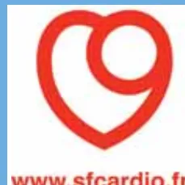

The logo of SAMU DE FRANCE, featuring a blue circle with a white caduceus symbol and the text 'SAMU DE FRANCE' in white.The logo of fmu, featuring a stylized black 'f' and 'mu' with a blue swoosh.The logo for www.scardio.fr, featuring a red heart shape with a white circle inside, and the text 'www.scardio.fr' in red below it.

## RECOMMANDATIONS PROFESSIONNELLES

# Prise en charge de l'infarctus du myocarde à la phase aiguë en dehors des services de cardiologie

**Conférence de consensus**

**23 novembre 2006**

Paris (faculté de médecine Paris V)

**Texte des recommandations**

(version courte)

Avec le partenariat méthodologique et le concours financier de la

**HAS**

HAUTE AUTORITÉ DE SANTÉLa version courte des recommandations est disponible  
sur demande écrite auprès de :

**Haute Autorité de Santé**

Service communication

2 avenue du Stade de France – F 93218 Saint-Denis La Plaine CEDEX

Les versions courte et longue sont consultables sur le site de la HAS :  
[www.has-sante.fr](http://www.has-sante.fr) - rubrique « Toutes nos publications »# Sommaire

<table><tr><td>Avertissement</td><td>3</td></tr><tr><td><b>QUESTION 1</b><br/>Quels sont les critères décisionnels pour la prescription d'une désobstruction coronaire pour un infarctus aigu (indépendamment de la technique) ?</td><td>3</td></tr><tr><td><b>QUESTION 2</b><br/>Quels sont les stratégies de reperfusion et les traitements adjuvants à mettre en œuvre pour un syndrome coronarien aigu ST+ ?</td><td>4</td></tr><tr><td><b>QUESTION 3</b><br/>Quelles sont les caractéristiques des filières de prise en charge d'un patient avec une douleur thoracique évoquant un infarctus aigu ?</td><td>7</td></tr><tr><td><b>QUESTION 4</b><br/>Quelles sont les situations particulières de prise en charge d'un infarctus aigu ?</td><td>8</td></tr><tr><td><b>QUESTION 5</b><br/>Quelle est la prise en charge des complications initiales ?</td><td>9</td></tr><tr><td>Annexe 1 - Échelle de gradation des recommandations utilisées par la HAS pour les études thérapeutiques</td><td>12</td></tr><tr><td>Méthode « Conférence de consensus »</td><td>13</td></tr><tr><td>Participants</td><td>15</td></tr><tr><td>Fiche descriptive</td><td>17</td></tr></table>

## Abréviations

<table><tr><td>AC</td><td>arrêt circulatoire</td></tr><tr><td>bpm</td><td>battements par minute</td></tr><tr><td>CEE</td><td>choc électrique externe</td></tr><tr><td>CPBIA</td><td>contre-pulsion par ballonnet intra-aortique</td></tr><tr><td>DSA</td><td>défibrillateur semi-automatique</td></tr><tr><td>ECG</td><td>électrocardiogramme</td></tr><tr><td>HBPM</td><td>héparine de bas poids moléculaire</td></tr><tr><td>HNF</td><td>héparine non fractionnée</td></tr><tr><td>IDM</td><td>infarctus du myocarde</td></tr><tr><td>OAP</td><td>œdème aigu du poumon</td></tr><tr><td>RACS</td><td>récupération d'activité cardiaque spontanée</td></tr><tr><td>RCP</td><td>réanimation cardio-pulmonaire</td></tr><tr><td>SCA</td><td>syndrome coronarien aigu</td></tr><tr><td>SCA ST+</td><td>syndrome coronarien aigu avec sus-décalage du segment ST</td></tr><tr><td>SCDI</td><td>salle de coronarographie diagnostique et interventionnelle</td></tr><tr><td>SMUR</td><td>structure mobile d'urgence et de réanimation</td></tr><tr><td>TV</td><td>tachycardie ventriculaire</td></tr></table>## **Promoteurs**

SAMU de France

Société francophone de médecine d'urgence

Société française de cardiologie

## **Copromoteurs**

Agence française de sécurité sanitaire des produits de santé

Association pédagogique nationale pour l'enseignement de la thérapeutique

Bataillon des marins-pompiers de Marseille

Brigade de sapeurs-pompiers de Paris

Société française d'anesthésie et de réanimation

Société française de biologie clinique

Société française de médecine sapeur-pompier

Société de réanimation de langue française

SOS Médecins France

L'organisation de cette conférence a été rendue possible grâce à l'aide financière apportée par la Haute Autorité de Santé, SAMU de France, la Société française de cardiologie et la Société francophone de médecine d'urgence.## Avertissement

Cette conférence a été organisée et s'est déroulée conformément aux règles méthodologiques préconisées par la Haute Autorité de Santé (HAS).

Les conclusions et recommandations présentées dans ce document ont été rédigées par le jury de la conférence, en toute indépendance. Leur teneur n'engage en aucune manière la responsabilité de la HAS.

## QUESTION 1

### Quels sont les critères décisionnels pour la prescription d'une désobstruction coronaire pour un infarctus aigu (indépendamment de la technique) ?

La décision de prescription d'une désobstruction coronaire pour un infarctus du myocarde (IDM) aigu repose sur une démarche de type bayesienne : l'évaluation clinique établit une probabilité initiale, réévaluée à travers la lecture de l'électrocardiogramme (ECG), permettant ainsi de choisir entre (cf. *algorithme 1*) :

- • débuter la thérapeutique de désobstruction coronaire ;
- • poursuivre la démarche diagnostique par le dosage de troponines ;
- • mettre en place une autre stratégie.

```
graph TD
    A[Forte probabilité clinique de SCA] -- Oui --> B[ECG contributif]
    A -- Non --> C[ECG contributif]
    B -- Oui --> D[Désobstruction urgente]
    B -- Non --> E[Dosage de troponines positif]
    C -- Oui --> D
    C -- Non --> F[Pas de stratégie invasive  
(Suivi médical,  
évaluation secondaire)]
    E -- Oui --> G[Stratégie invasive  
différée (24-48h)]
    E -- Non --> H[Pas de stratégie invasive  
(Suivi médical,  
évaluation secondaire)]
```

The flowchart illustrates the decision-making process for coronary revascularization in an acute myocardial infarction. It starts with a clinical assessment of a strong probability of SCA. If 'Oui' (Yes), it leads to an ECG. If 'Non' (No), it leads to an ECG. If the ECG is contributory ('Oui'), it leads to urgent revascularization. If 'Non', it leads to a troponin test. If the troponin test is positive ('Oui'), it leads to a delayed invasive strategy (24-48h). If 'Non', it leads to no invasive strategy (medical follow-up, secondary evaluation). If the ECG is contributory ('Oui'), it leads to urgent revascularization. If 'Non', it leads to no invasive strategy (medical follow-up, secondary evaluation).

**Algorithme 1.** Algorithme des critères décisionnels pour la prescription d'une désobstruction coronaire pour un IDM aigu.## QUESTION 2

### Quels sont les stratégies de reperfusion et les traitements adjuvants à mettre en œuvre pour un syndrome coronarien aigu ST+ ?

#### 1. Stratégies de reperfusion

##### ► Délais

La pierre angulaire de la stratégie de reperfusion du syndrome coronarien aigu (SCA) ST+ (SCA ST+) est la réduction du temps écoulé depuis le début de la symptomatologie jusqu'à la reperméabilisation coronarienne.

Dans les textes internationaux, le **délai door to balloon** correspond le plus souvent au délai entre l'arrivée à l'établissement de santé et l'expansion du ballonnet dans une coronaire. Il est défini pour le système français comme le **délai entre le premier contact médical et l'expansion du ballonnet**.

Le **premier contact médical** est le moment de l'arrivée auprès du patient du médecin permettant la réalisation d'un ECG et donc la confirmation du diagnostic de SCA ST+.

Le sujet de la conférence de consensus étant la prise en charge de l'IDM à la phase aiguë *en dehors des services de cardiologie*, le jury recommande de scinder le *délai premier contact médical-expansion du ballonnet* en 2 délais complémentaires :

- • le délai entre le premier contact médical et l'arrivée au service de cardiologie interventionnelle, appelé **délai porte à porte cardio** ;
- • le délai entre l'arrivée au service de cardiologie interventionnelle et l'expansion du ballonnet, appelé **délai porte cardio-ballon**.

Pour continuer à respecter le délai global international de 90 minutes, le jury recommande comme seuil décisionnel pour le *délai porte à porte cardio* une valeur de 45 minutes.

Le respect et l'amélioration respective de chacun de ces 2 délais doivent permettre d'augmenter le nombre de patients accédant à la reperfusion mécanique.

##### ► Stratégies de reperfusion

**Les stratégies de reperfusion reposent sur l'angioplastie coronaire et la fibrinolyse.**

- • Le choix d'une stratégie par rapport à l'autre repose sur l'évaluation respective du rapport bénéfices/risques dans une situation clinique donnée.
- • L'angioplastie primaire est la technique la plus sûre et la plus efficace, puisqu'elle permet de rouvrir l'artère occluse dans près de 90 % des cas contre seulement 60 % pour la fibrinolyse.
- • La réalisation de la fibrinolyse a pour elle l'avantage de sa simplicité. Elle est réalisable en tous lieux du territoire. Son efficacité est optimale au cours des 3 premières heures qui suivent le début des symptômes. Le risque hémorragique intracérébral (entre 0,5 et 1 %) est incontournable malgré le respect strict des contre-indications.- • Le jury recommande l'utilisation préférentielle de la ténectéplase, produit fibrino-spécifique, utilisable en bolus intraveineux unique en 10 secondes environ, à demi-vie courte, adaptable au poids du patient, la dose ne devant cependant pas excéder 10 000 UI, soit 50 mg de ténectéplase. La streptokinase n'est pas recommandée.

### ► Choix de la stratégie

**Pour le choix de la stratégie, le jury recommande la stratégie initiale<sup>1</sup> suivante (cf. algorithme 2) :**

1. 1. connaître le *délai porte à porte cardio* et le *délai porte cardio-ballon* ;
2. 2. si le *délai porte à porte cardio* est supérieur à 45 minutes, la probabilité que le *délai global premier contact médical-expansion du ballonnet* soit supérieur à 90 minutes est trop élevée, et cela justifie la fibrinolyse pour tout patient dont le début des symptômes est inférieur à 12 heures. La stratégie est identique si le début des symptômes date de moins ou de plus de 3 heures ;
3. 3. si le *délai porte à porte cardio* est inférieur à 45 minutes et si la somme de ce délai avec le *délai porte cardio-ballon* est inférieure à 90 minutes, la stratégie devient fonction de l'heure du début des symptômes :
   - • si ce délai est inférieur à 3 heures, le médecin auprès du patient peut proposer ou la fibrinolyse ou l'angioplastie primaire en fonction de procédures écrites et évaluées,
   - • si le délai depuis le début des symptômes est compris entre 3 et 12 heures, l'angioplastie primaire est privilégiée ;
4. 4. l'évaluation de l'efficacité de la fibrinolyse sera réalisée dès son administration afin de dépister précocement une non-réponse justifiant une angioplastie de sauvetage.

**Cette stratégie justifie les recommandations suivantes :**

- • il est impératif que l'ensemble des structures d'urgences (SMUR et accueil des urgences) dispose des moyens de pratiquer une fibrinolyse (recommandation unanime du jury) ;
- • après fibrinolyse, le patient doit être dirigé vers un centre disposant d'une salle de coronarographie diagnostique et interventionnelle (SCDI) ;
- • la mise en place de registres d'évaluation des stratégies de prise en charge des SCA ST+, registres communs aux équipes participant à cette prise en charge et permettant de faire évoluer la stratégie initiale de reperfusion, et notamment les 2 délais proposés *porte à porte cardio* et *porte cardio-ballon*.

---

1. Cette stratégie de départ devra évoluer en fonction des résultats des registres.**SCA ST+**

<table border="1" style="width: 100%; border-collapse: collapse;">
<tr>
<td colspan="2" style="text-align: center;">Délai porte à porte cardio* &lt; 45 min</td>
<td colspan="2" style="text-align: center;">Délai porte à porte cardio* &gt; 45 min ou délai porte cardio-ballon non estimable</td>
</tr>
<tr>
<td style="text-align: center;">Signes &lt; 3 h</td>
<td style="text-align: center;">Signes &gt; 3 h et &lt; 12 h</td>
<td style="text-align: center;">Signes &lt; 3 h</td>
<td style="text-align: center;">Signes &gt; 3 h et &lt; 12 h</td>
</tr>
</table>

Choix

TL

Si échec fibrinolyse →

APL

APL

APL

Stratégie identique

APL

TL

Si échec fibrinolyse ←

APL

**Centre de cardiologie interventionnelle**

\* Le délai porte à porte cardio doit s'intégrer dans le délai global de prise en charge qui ne doit pas être supérieur à 90 minutes.  
 TL : thrombolyse APL : angioplastie CI : contre-indication.

**Algorithme 2.** Stratégie de reperfusion d'un SCA ST+ non compliqué avant la cardiologie (cf. *supra* définition des délais).

## 2. Traitements adjuvants

**Acide acétylsalicylique** : son bénéfice dans le traitement des SCA est largement démontré (grade A)<sup>2</sup>.

**Clopidogrel** : il est recommandé à la phase précoce d'un SCA ST+, en association avec l'aspirine ou seul si celle-ci est contre-indiquée (grade A).

**Antagonistes des récepteurs GPIIb/IIIa** : l'abciximab est utilisé en phase aiguë de SCA ST+ avant une angioplastie primaire.

**Anticoagulants** : en cas de fibrinolyse, l'énoxaparine est supérieure à l'héparine non fractionnée (HNF) chez les patients de moins de 75 ans, à fonction rénale normale (grade B). En cas d'angioplastie, l'HNF est le traitement de référence.

**Dérivés nitrés** : en dehors de l'œdème aigu du poumon (OAP) et éventuellement en cas de poussée hypertensive, ils ne sont pas recommandés (grade C).

**Oxygénéthérapie** : elle n'est pas systématique.

**Antalgiques** : le traitement de choix est la morphine en titration IV.

2. Une recommandation de grade A est fondée sur une preuve scientifique établie par des études de fort niveau de preuve (niveau 1). Une recommandation de grade B est fondée sur une présomption scientifique fournie par des études de niveau de preuve intermédiaire (niveau 2). Une recommandation de grade C est fondée sur des études de faible niveau de preuve (niveau 3 ou 4). **En l'absence de précisions, les recommandations reposent sur un consensus exprimé par le jury.** Voir annexe 1.**Bêtabloquants** : leur administration n'est pas préconisée de façon systématique.

**Inhibiteurs de l'enzyme de conversion et antagonistes calciques** : aucun argument ne permet de les recommander.

**Insuline** : elle est recommandée pour corriger une élévation de la glycémie en phase aiguë d'IDM. La solution glucose-insuline-potassium n'est pas recommandée (grade A).

## QUESTION 3

### Quelles sont les caractéristiques des filières de prise en charge d'un patient avec une douleur thoracique évoquant un infarctus aigu ?

Compte tenu des pertes de chances induites par le retard diagnostique et thérapeutique pour les patients en phase aiguë d'un IDM, il faut insister sur la réalisation répétée de campagnes d'éducation à destination du grand public et des professionnels de santé. **L'objectif est de « prescrire le 15 ».**

Les filières de prise en charge du patient avec une douleur thoracique évoquant un IDM aigu doivent idéalement fonctionner selon le schéma suivant :

- • l'*appel*, qu'il provienne du patient lui-même ou d'un *tiers appelant*, doit aboutir au SAMU-Centre 15 ;
- • le *médecin régulateur du SAMU* essaiera d'être mis directement en relation avec le patient, puis il déclenchera un *effecteur* dont le but est d'amener le patient en SCDI opérationnelle (filière cardiologique).

Le patient peut aussi se trouver dans un service hospitalier qui devra diagnostiquer et traiter l'IDM, soit en relation directe avec la SCDI opérationnelle, soit en relation avec le SAMU-Centre 15.

Le jury recommande que le médecin régulateur du SAMU soit le « gardien du temps » du déroulement de l'intervention. C'est lui qui fait le lien entre l'équipe d'intervention et l'équipe de la structure d'accueil (cf. *algorithme 3*).

Les moyens engagés en dehors des unités mobiles hospitalières (UMH) comportent au minimum :

- • la présence d'un médecin avec ECG ;
- • un vecteur de transport avec au moins défibrillateur semi-automatique (DSA) et O<sub>2</sub>.

Dans certaines situations d'exception définies par un isolement ou un défaut d'accessibilité durable et prévisible aux secours médicalisés et aux moyens d'évacuation rapides, le jury recommande la rédaction préalable de protocoles décisionnels.```

graph TD
    Start[Patient douleur thoracique +]
    Start -- "Est déjà hospitalisé" --> USI[USI]
    Start -- "Est déjà hospitalisé" --> SCDI[SCDI opérationnelle]
    Start -- "Est déjà hospitalisé" --> Urgences[Urgences hôpital]
    Start -- "Association urgentistes" --> Conf1[Conférence à 3]
    Start -- "Régulation libérale PDS" --> Conf2[Conférence à 3]
    Start -- "Appel" --> SAMU[SAMU-CENTRE 15]
    Start -- "Vient directement" --> Urgences
    Start -- "Service de soins" --> SAMU
    Start -- "Médecin libéral" --> SAMU
    Conf1 --> SAMU
    Conf2 --> SAMU
    SAMU --> UMH[UMH  
et/ou à défaut  
Médecin correspondant SAMU  
Urgentiste libéral convention  
Médecin pompier + ECG  
Médecin libéral (accord préalable) + ECG  
+ DSA systématique]
    UMH -- "± fibrinolyse" --> SCDI
    SCDI --> USIC[USIC]
  
```

**Algorithme 3.** Algorithme des filières de prise en charge d'un patient présentant une douleur thoracique suspecte d'un infarctus du myocarde.

## QUESTION 4

### Quelles sont les situations particulières de prise en charge d'un infarctus aigu ?

#### ► Personnes âgées

La stratégie thérapeutique globale de l'IDM chez le sujet âgé ne doit pas différer de celle des sujets jeunes malgré le risque de complications plus élevé (grade B), à l'exception du choc cardiogénique. Dans ce dernier cas, le recours à la reperfusion ne peut être systématique, mais est discuté cas par cas. L'HNF est préférée aux héparines de bas poids moléculaire (HBPM) chez le sujet de plus de 75 ans (grade B).### ► Personnes diabétiques

La stratégie thérapeutique globale de l'IDM chez le diabétique ne diffère pas de celle des sujets non diabétiques (grade B). Chez tous les patients, le jury recommande de déterminer la glycémie capillaire au plus tôt, y compris en préhospitalier. La réduction précoce de l'hyperglycémie par l'insuline et la réduction des apports glucidiques à la phase aiguë d'un infarctus paraît logique.

### ► Infarctus survenant dans un service de soins non cardiologiques

La prise en charge de l'IDM dans un service de soins en dehors de la cardiologie doit être organisée par des protocoles locaux afin de proposer dans les plus brefs délais une prise en charge adaptée. En cas de décision de reperfusion coronaire en urgence, les patients dans des sites avec plateau de cardiologie interventionnelle accessible doivent avoir une angioplastie primaire. Dans les autres cas, la stratégie de reperfusion du patient ne diffère pas de celle proposée en dehors des structures de soins.

### ► Infarctus périopératoires

La prévention de l'IDM périopératoire se fonde sur l'analyse du segment ST et la correction rapide de toute anomalie hémodynamique (hypotension, hypertension, tachycardie) ou métabolique importante (anémie, hypothermie). La détection repose sur une analyse ECG quotidienne ainsi que sur des dosages répétés de troponine en postopératoire, avec une prise en charge graduée en fonction, d'une part, de l'existence ou non d'une modification du segment ST et, d'autre part, de la cinétique d'élévation de la troponine. Le recours systématique en urgence à une coronarographie n'est licite qu'en cas de détection d'un sus-décalage du segment ST.

## QUESTION 5

### Quelle est la prise en charge des complications initiales ?

Les complications initiales de l'IDM sont abordées par le jury en tenant compte de leur fréquence et de leur gravité. Est traitée également la problématique des transferts interhospitaliers des IDM compliqués. Le traitement spécifique des complications doit être associé à la correction des facteurs favorisants, notamment les dyskaliémies et l'hypoxie.

### ► Bradycardies

Plusieurs options thérapeutiques peuvent être envisagées :

- • la surveillance électrocardioscopique seule, sur une bradycardie bien tolérée et sans risque d'asystolie ;
- • l'entraînement électrosystolique externe, indiqué devant toute bradycardie symptomatique avec intolérance hémodynamique, habituellement liée à un BAV de haut degré. Il est également indiqué s'il existe un risque de survenue d'une asystolie ou si le traitement par atropine est inefficace ;- • le traitement pharmacologique : en l'absence de cause réversible, l'atropine est la thérapeutique de choix devant toute bradycardie symptomatique aiguë. L'isoprénaline n'est pas recommandée et l'adrénaline ne doit être utilisée qu'en dernier recours.

## ► Tachycardies

Plusieurs options thérapeutiques peuvent être envisagées (grade B) :

- • le patient en arrêt circulatoire nécessite un choc électrique externe (CEE) immédiat, asynchrone, sans sédation et une réanimation cardio-pulmonaire (RCP) médicalisée ;
- • le patient en défaillance hémodynamique (hors contexte de tachycardie sinusal) nécessite la réalisation immédiate d'un CEE de préférence synchrone ;
- • le patient conscient sans défaillance hémodynamique, mais avec des signes cliniques d'intolérance (douleur thoracique ou OAP) a sa stratégie thérapeutique détaillée dans l'*algorithme 4* ;
- • le patient conscient sans signes d'intolérance clinique : les tachycardies ventriculaires (TV) soutenues ou polymorphes justifient l'administration d'amiodarone et/ou d'un CEE après sédation. Dans les autres cas, l'abstention thérapeutique avec maintien de la surveillance seule est de règle.

```

graph TD
    A["- Administrer de l'oxygène en fonction de la SpO2  
- Monitoring ECG  
- Surveillance continue PA et SpO2  
- Accès veineux"] --> B([Arrêt circulatoire])
    B -- Oui --> C["• RCP médicalisée  
• CEE asynchrone"]
    B -- Non --> D([État de choc cardiogénique  
OAP massif])
    D -- Oui --> E["• Sédation si patient conscient  
• CEE synchrone si possible  
• Gestes de réanimation"]
    D -- Non --> F([Autres signes d'intolérance  
OAP, douleur thoracique])
    F -- Non --> G["• Surveillance clinique et paraclinique (scope)"]
    F -- Oui --> H([Rythme ?])
    H -- irrégulier --> I([Aspect QRS ?])
    H -- régulier --> J([Aspect QRS ?])
    I -- "< 0,12 s  
QRS fin" --> K["FA rapide  
  
• Amiodarone IV :  
300 mg en 20 à 60 min,  
puis 900 mg sur 24 h  
• Si échec : esmolol IV  
(dose de charge de  
500 µg/kg en 1 minute,  
puis 50 à 200 µg/kg en  
4 minutes) ou aténolol  
(5 mg IV suivi de 75 mg  
PO)"]
    I -- "> 0,12 s  
QRS large" --> L["TV polymorphe  
  
• Amiodarone IV :  
300 mg en 20 à 60 min,  
puis 900 mg sur 24 h  
• Si échec : CEE  
synchrone  
  
▮ : évoquer de principe  
une FA avec conduction  
aberrante : voir encadré  
FA rapide"]
    J -- "< 0,12 s  
QRS fin" --> M["Tachycardie  
sinuale  
  
• Surveillance attentive  
  
▮ : évoquer de principe  
un flutter auriculaire :  
voir encadré FA rapide"]
    J -- "> 0,12 s  
QRS large" --> N["TV  
  
• Amiodarone IV :  
300 mg en 20 à 60 min,  
puis 900 mg sur 24 h  
• Si échec : CEE  
synchrone  
  
▮ : évoquer de principe  
une TSV avec conduction  
aberrante : voir  
encadré Tachycardie  
sinuale"]
  
```

**Algorithme 4.** Algorithme thérapeutique de la tachycardie (fréquence cardiaque > 100 bpm) chez un patient présentant un SCA, hors défaillance vitale et tachycardie bien tolérée (d'après J.E. de la Coussaye *et al*).## ► Arrêt circulatoire (AC)

Le contexte ischémique de l'AC ne modifie pas les recommandations générales de la RCP.

- • L'AC survient sur un IDM déjà diagnostiqué : chez un patient qui a une récupération d'activité cardiaque spontanée (RACS), la décision de la stratégie de reperfusion repose sur l'appréciation d'un accès rapide à une SCDI opérationnelle (sans qu'un délai maximal puisse être fourni dans ce contexte). La réalisation d'un massage cardiaque externe ne contre-indique pas la fibrinolyse. Chez un patient fibrinolyse, la survenue d'un AC peut être un signe de reperfusion coronaire. Une réanimation prolongée (60 à 90 minutes après l'injection du fibrinolytique) est justifiée pour favoriser son efficacité. En l'absence de RACS, il n'y a pas d'argument scientifique pour recommander ou interdire la fibrinolyse.
- • L'AC constitue la première manifestation de l'IDM : il n'y a pas d'argument pour recommander une fibrinolyse dans ce contexte.

## ► Choc cardiogénique

La stratégie thérapeutique repose sur le traitement étiologique associé au traitement symptomatique et comporte une désobstruction coronaire précoce (grade B) par angioplastie préférentiellement, associée à des mesures visant à la diminution de la consommation myocardique en oxygène (notamment analgésie et oxygène). La restauration hémodynamique repose sur un remplissage vasculaire prudent (en l'absence de signes d'insuffisance ventriculaire gauche) avec si nécessaire utilisation titrée de catécholamines (dobutamine en 1<sup>re</sup> intention, noradrénaline en 2<sup>e</sup> intention). La contre-pulsion par ballonnet intra-aortique (CPBIA) favorise la stabilisation initiale des patients en choc cardiogénique secondaire à un IDM (grade B).

## ► Transferts interhospitaliers des infarctus compliqués

Ce sont toujours des transports médicalisés par le SMUR, dont le premier objectif est de permettre au patient d'accéder à un niveau de soins supérieur tout en assurant sa sécurité au cours du transfert. Chaque intervenant impliqué dans la chaîne (médecin d'amont, médecin SMUR, médecin régulateur et médecin d'accueil) en a une part de responsabilité. Les équipes du SMUR doivent être formées aux techniques d'assistance circulatoire (CPBIA de plus en plus couramment utilisée, et très rarement assistance circulatoire périphérique). L'équipe SMUR peut être complétée, le cas échéant, par un médecin maîtrisant ces techniques. Dans ce cas, les procédures doivent s'inscrire dans un protocole en réseau impliquant tous les acteurs concernés.# Annexe 1. Échelle de gradation des recommandations utilisées par la HAS pour les études thérapeutiques

**Tableau.** Grade des recommandations.

<table border="1"><thead><tr><th>Niveau de preuve scientifique fourni par la littérature (études thérapeutiques)</th><th>Grade des recommandations</th></tr></thead><tbody><tr><td><b>Niveau 1</b><ul><li>• Essais comparatifs randomisés de forte puissance</li><li>• Méta-analyse d'essais comparatifs randomisés</li><li>• Analyse de décision basée sur des études bien menées</li></ul></td><td><b>A</b><br/>Preuve scientifique établie</td></tr><tr><td><b>Niveau 2</b><ul><li>• Essais comparatifs randomisés de faible puissance</li><li>• Études comparatives non randomisées bien menées</li><li>• Études de cohorte</li></ul></td><td><b>B</b><br/>Présomption scientifique</td></tr><tr><td><b>Niveau 3</b><ul><li>• Études cas-témoins</li></ul></td><td rowspan="2"><b>C</b><br/>Faible niveau de preuves</td></tr><tr><td><b>Niveau 4</b><ul><li>• Études comparatives comportant des biais importants</li><li>• Études rétrospectives</li><li>• Séries de cas</li></ul></td></tr></tbody></table>

En l'absence de précisions, les recommandations reposent sur un consensus exprimé par le jury.# Méthode

## « Conférence de consensus »

Les recommandations professionnelles sont définies comme « des propositions développées selon une méthode explicite pour aider le praticien et le patient à rechercher les soins les plus appropriés dans des circonstances cliniques données ».

La méthode *Conférence de consensus* (CdC) est l'une des méthodes préconisées par la Haute Autorité de Santé (HAS) pour élaborer des recommandations professionnelles. Les recommandations sont rédigées en toute indépendance par un jury de non-experts du thème traité, dans le cadre d'un huis clos de 48 heures faisant suite à une séance publique. Elles répondent à une liste de 4 à 6 questions prédéfinies. Au cours de la séance publique, les éléments de réponse à ces questions sont exposés par des experts du thème et débattus avec le jury, les experts et le public présents. La réalisation d'une conférence de consensus est particulièrement adaptée lorsqu'il existe une controverse professionnelle forte, justifiant une synthèse des données disponibles, une présentation des avis des experts du thème, un débat public, puis une prise de position de la part d'un jury indépendant.

- • Choix du thème de travail

Les thèmes de recommandations professionnelles sont choisis par le Collège de la HAS. Ce choix tient compte des priorités de santé publique et des demandes exprimées par les ministres chargés de la Santé et de la Sécurité sociale. Le Collège de la HAS peut également retenir des thèmes proposés notamment par des sociétés savantes, l'Institut national du cancer, l'Union nationale des caisses d'assurance maladie, l'Union nationale des professionnels de santé, des organisations représentatives des professionnels ou des établissements de santé, des associations agréées d'usagers.

Les conférences de consensus sont habituellement réalisées dans le cadre d'un partenariat entre la HAS et une ou des sociétés savantes promotrices. La HAS apporte une aide méthodologique et un concours financier.

Pour chaque conférence de consensus, la méthode de travail comprend les étapes et les acteurs suivants.

- • Comité d'organisation

Un comité d'organisation est réuni à l'initiative du promoteur. La HAS y participe. Ce comité est composé de représentants des sociétés savantes, des associations professionnelles ou d'usagers, et, si besoin, des agences sanitaires et des institutions concernées. Il définit d'abord précisément le thème de la conférence, les populations de patients et les cibles professionnelles concernées, et les 4 à 6 questions auxquelles le jury devra répondre. Il choisit ensuite les experts chargés d'apporter des éléments de réponse aux questions posées en fonction des données publiées et de leur expertise propre. Il choisit les membres du groupe bibliographique chargé de faire une synthèse critique objective des données disponibles. Il choisit le jury de non-experts. Enfin, il organise la séance publique et informe de sa tenue les publics concernés (professionnels, patients, etc.).

- • Experts

Les experts sont choisis en raison de leur expérience, de leur compétence, de leur notoriété et de leurs publications sur le thème. Chaque expert rédige un rapport, remis au jury pour information deux mois avant la séance publique. Il en fait également une présentation au cours de la séance publique et participe aux débats. Il synthétise les données publiées en soulignantce qui lui paraît le plus significatif pour résoudre la question qui lui est posée et en donnant son avis personnel, fruit de son expérience.

- • Groupe bibliographique

Parallèlement au travail des experts, chaque membre du groupe bibliographique analyse et fait une synthèse critique des données disponibles, sans donner son avis. Il rédige un rapport remis au jury pour information deux mois avant la séance publique. Lors de la séance publique, il ne présente pas ce rapport, mais participe au débat public.

- • Jury

Le jury est constitué de non-experts du thème. Un président est désigné par le comité d'organisation. C'est le seul membre du jury qui participe aux réunions du comité d'organisation. L'ensemble du jury prend connaissance des rapports des experts et du groupe bibliographique avant la séance publique. Il participe activement au débat public, en particulier en posant des questions aux experts. Immédiatement après la séance publique, il se réunit à huis clos (48 heures) pour écrire en toute indépendance les recommandations en réponse aux questions posées par le comité d'organisation.

- • Recommandations

Les recommandations traduisent la position consensuelle que le jury dégage du débat public. Elles tiennent également compte du niveau de preuve des données publiées lorsqu'il en existe et sont donc, autant que faire se peut, gradées. Elles se présentent habituellement sous deux formes : une version longue, argumentant et détaillant les prises de position du jury, et une version courte, synthétique et opérationnelle. Une relecture, concernant uniquement la forme des recommandations, par des membres du comité d'organisation est possible avant qu'elles soient rendues publiques.

- • Rôle du Collège de la HAS

Les recommandations sont de la responsabilité du jury. Le Collège de la HAS est informé du contenu des recommandations avant leur diffusion.

- • Diffusion

La HAS met en ligne gratuitement sur son site ([www.has-sante.fr](http://www.has-sante.fr)) les recommandations (versions courte et longue). Les rapports préparatoires des experts et du groupe bibliographique sont publiés par le promoteur.

- • Travail interne à la HAS

Outre l'encadrement méthodologique du comité d'organisation et la diffusion des recommandations, la HAS a la responsabilité de la formation et de l'accompagnement du groupe bibliographique. Elle assure la recherche et la fourniture documentaires pour ce groupe, et non pour les experts. Une recherche documentaire approfondie est effectuée par interrogation systématique des banques de données bibliographiques médicales et scientifiques sur une période adaptée à chaque question. Elle est complétée par l'interrogation d'autres bases de données spécifiques si besoin. Tous les sites Internet utiles (agences gouvernementales, sociétés savantes, etc.) sont explorés. Les documents non accessibles par les circuits conventionnels de diffusion de l'information (littérature grise) sont recherchés par tous les moyens disponibles. Les recherches initiales sont réalisées dès la constitution du groupe bibliographique et sont mises à jour régulièrement jusqu'à la fin de chacun des rapports. L'examen des références citées dans les articles analysés permet de sélectionner des articles non identifiés lors de l'interrogation des différentes sources d'information. Les langues retenues sont le français et l'anglais.# Participants

## Comité d'organisation

F. Adnet, président : urgentiste, Bobigny

M. Alazia, urgentiste, anesthésiste-réanimateur, Marseille

J. Allal, cardiologue, Poitiers

AM. Arvis, urgentiste, Brigade de sapeurs-pompiers de Paris, Paris

S. Baqué, urgentiste, Saint-Girons

F. Carpentier, urgentiste, Grenoble

A. Desplanques, méthodologie HAS, Saint-Denis La Plaine

JL. Diehl, réanimateur médical, Paris

P. Dosquet, méthodologie HAS, Saint-Denis La Plaine

JL. Ducassé, urgentiste, anesthésiste-réanimateur, Toulouse

N. Dumarcet, Afssaps, Saint-Denis

JM. Duquesne, urgentiste, SDIS 78, Versailles

P. Jabre, urgentiste, méthodologiste, Créteil

J. Leyral, urgentiste, Bataillon des marins-pompiers de Marseille, Marseille

JP. Monassier, cardiologue, Mulhouse

C. Morin, biologiste, Calais

C. Paindavoine, méthodologie HAS, Saint-Denis La Plaine

J. Puel, cardiologue, Toulouse

L. Rouxel, SOS Médecins, Bordeaux

L. Soulat, urgentiste, Châteauroux

P. Taboulet, cardiologue, urgentiste, Paris

MD. Touzé, méthodologie HAS, Saint-Denis La Plaine

## Jury

JL. Ducassé, président : urgentiste, anesthésiste-réanimateur, Toulouse

X. Attrait, urgentiste, Brigade de sapeurs-pompiers de Paris, Paris

A. Bonneau, cardiologue, Châteauroux

V. Bounes, urgentiste, anesthésiste-réanimateur, Toulouse

JC. Branchet-Allinieu, SOS Médecins, Nantes

F. Braun, urgentiste, Verdun

B. Citron, cardiologue, Clermont-Ferrand

F. Diévert, cardiologue, Dunkerque

A. Ellrodt, urgentiste, Neuilly-sur-Seine

P. Julien, médecin généraliste, Puycasquier

F. Kerbault, anesthésiste-réanimateur, Marseille

S. Laribi, urgentiste, Paris

JM. Philippe, urgentiste, Aurillac

E. Plantin-Carrenard, biologiste, Bourges

F. Rayeh-Pelardy, urgentiste, anesthésiste-réanimateur, Poitiers

A. Ricard-Hibon, urgentiste, anesthésiste-réanimateur, Clichy-sur-Seine## Experts

C. Barnay, cardiologue, Aix-en-Provence  
JP. Bassand, cardiologue, Besançon  
L. Beck, cardiologue, Nîmes  
L. Belle, cardiologue, Annecy  
D. Blanchard, cardiologue, Tours  
P. Brasseur, SOS Médecins, Paris  
P. Carli, urgentiste, anesthésiste-réanimateur, Paris  
P. Corbi, chirurgien cardio-thoracique, Poitiers  
P. Coriat, anesthésiste-réanimateur, Paris  
Y. Cottin, cardiologue, Dijon  
N. Danchin, cardiologue, Paris  
V. Debierre, urgentiste, Nantes  
JE. de la Coussaye, urgentiste, anesthésiste-réanimateur, Nîmes  
JJ. Dujardin, cardiologue, Douai  
P. Ecollan, urgentiste, Paris  
S. Foulon, SOS Médecins, Amiens  
F. Funck, cardiologue, Cergy-Pontoise  
M. Giroud, urgentiste, anesthésiste-réanimateur, Cergy-Pontoise  
P. Goldstein, urgentiste, anesthésiste-réanimateur, Lille  
P. Guéret, cardiologue, Créteil  
PY. Gueugniaud, anesthésiste-réanimateur, Pierre-Bénite  
M. Hanssen, cardiologue, Haguenau  
P. Henry, cardiologue, Paris

D. Imbert, cardiologue, Paris  
D. Jost, urgentiste, Brigade des sapeurs-pompiers de Paris, Paris  
JM. Juliard, cardiologue, Paris  
T. Laperche, cardiologue, Saint-Denis  
F. Lapostolle, urgentiste, Bobigny  
P. Le Dreff, urgentiste, Bataillon des marins-pompiers de Marseille, Marseille  
G. Lefèvre, biologiste, Paris  
P. Leprince, chirurgien cardio-vasculaire, Paris  
D. Meyran, anesthésiste-réanimateur, Bataillon des marins-pompiers de Marseille, Marseille  
P. Moulène, médecin généraliste, Le Blanc  
P. Nelh, urgentiste, Marseille  
P. Pès, urgentiste, Nantes  
P. Rougé, anesthésiste-réanimateur, Toulouse  
É. Roupie, urgentiste, Caen  
D. Savary, urgentiste, Annecy  
J. Schmidt, urgentiste, Clermont-Ferrand  
L. Soulat, urgentiste, Châteauroux  
C. Spaulding, cardiologue, Paris  
P. Taboulet, cardiologue, urgentiste, Paris  
K. Tazarourte, urgentiste, Melun  
G. Vanzetto, cardiologue, Grenoble

## Groupe bibliographique

T. Aczel, urgentiste, Bataillon des marins-pompiers de Marseille, Marseille  
N. Assez, urgentiste, Lille  
F. Boutot, anesthésiste-réanimateur, Le Chesnay  
S. Charpentier, urgentiste, Toulouse

C. Chollet-Xemard, urgentiste, Créteil  
H. Giannoli, SOS Médecins, Lyon  
F. Joye, urgentiste, Carcassonne  
P. Ray, urgentiste, Paris  
V. Thomas, urgentiste, Melun  
JP. Torres, urgentiste, Grenoble# Fiche descriptive

<table border="1">
<tr>
<td><b>TITRE</b></td>
<td><b>Prise en charge de l'infarctus du myocarde à la phase aiguë en dehors des services de cardiologie</b></td>
</tr>
<tr>
<td><b>Type de document</b></td>
<td>Conférence de consensus</td>
</tr>
<tr>
<td><b>Date de mise en ligne</b></td>
<td>Février 2007</td>
</tr>
<tr>
<td><b>Date de publication</b></td>
<td>Mai 2007</td>
</tr>
<tr>
<td><b>Objectif(s)</b></td>
<td>Répondre aux cinq questions suivantes :
<ul style="list-style-type: none;">
<li>– Quels sont les critères décisionnels pour la prescription d'une désobstruction coronaire pour un infarctus aigu (indépendamment de la technique) ?</li>
<li>– Quels sont les stratégies de reperfusion et les traitements adjuvants à mettre en oeuvre pour un syndrome coronarien aigu ST+ ?</li>
<li>– Quelles sont les caractéristiques des filières de prise en charge d'un patient avec une douleur thoracique évoquant un infarctus aigu ?</li>
<li>– Quelles sont les situations particulières de prise en charge d'un infarctus aigu ?</li>
<li>– Quelle est la prise en charge des complications initiales ?</li>
</ul>
</td>
</tr>
<tr>
<td><b>Professionnel(s) concerné(s)</b></td>
<td>Tout professionnel de santé amené à prendre en charge un infarctus du myocarde à la phase aiguë, en dehors des services de cardiologie, en particulier tous les urgentistes</td>
</tr>
<tr>
<td><b>Demandeur</b></td>
<td>SAMU de France<br/>Société francophone de médecine d'urgence<br/>Société française de cardiologie</td>
</tr>
<tr>
<td><b>Promoteur</b></td>
<td>SAMU de France<br/>Société francophone de médecine d'urgence<br/>Société française de cardiologie<br/>avec le partenariat méthodologique et le concours financier de la Haute Autorité de santé (HAS)</td>
</tr>
<tr>
<td><b>Pilotage du projet</b></td>
<td>Comité d'organisation (président : Pr Frédéric Adnet)</td>
</tr>
<tr>
<td><b>Participants</b></td>
<td>Comité d'organisation<br/>Experts<br/>Groupe bibliographique<br/>Jury</td>
</tr>
<tr>
<td><b>Recherche</b></td>
<td>Experts : sous la responsabilité de chaque expert<br/>Groupe bibliographique : recherche documentaire effectuée par le service de documentation de la HAS (période 1995-2006)</td>
</tr>
<tr>
<td><b>Auteurs</b></td>
<td>Jury (président : Dr Jean-Louis Ducassé)</td>
</tr>
<tr>
<td><b>Validation</b></td>
<td>Jury</td>
</tr>
<tr>
<td><b>Autres formats</b></td>
<td><b>Versions courte et longue des recommandations téléchargeables gratuitement sur <a href="http://www.has-sante.fr">www.has-sante.fr</a></b></td>
</tr>
</table>A completely blank white page with no visible content, text, or markings.Achevé d'imprimer en mai 2007  
Imprimerie Moderne de l'Est  
Dépôt légal mai 2007

The image contains three logos. On the left is the logo of the Ministry of Health, featuring a stylized 'M' and 'H' in green and blue. In the center is the logo of the National Institute of Epidemiology and Public Health, which is a circular emblem with a globe and a plant. On the right is the logo of the AFAP (Association Française d'Apiculture), which consists of the letters 'AFAP' in a stylized font with a bee illustration.A completely blank white page with no visible content, text, or markings.A completely blank white page with no visible content, text, or markings.The logo for the French Health Authority (HAS) is centered at the bottom of the page. It consists of the letters 'HAS' in a white, stylized, sans-serif font. The 'A' is uniquely designed with a horizontal bar that curves upwards, resembling a stylized 'A' or a bridge.

Toutes les publications de la HAS sont téléchargeables sur  
**[www.has-sante.fr](http://www.has-sante.fr)**