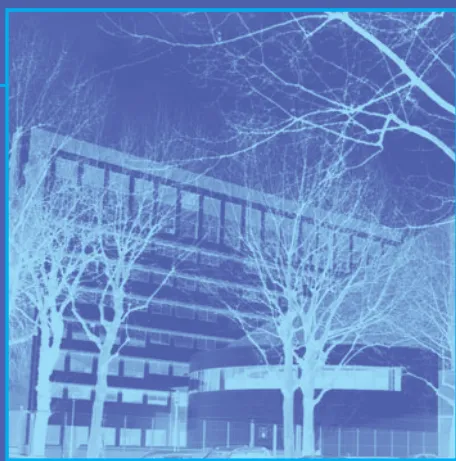
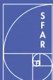
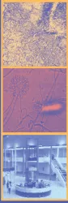
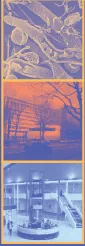
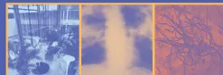

organisée conjointement par  
la SFAR, la SPLF et la SRLF

## Ventilation Non Invasive au cours de l'insuffisance respiratoire aiguë (nouveau-né exclu)

Avec la participation de la SFMU,  
du SAMU de France,  
du GFRUP  
et de l'ADARPEF

**Le 12 octobre 2006**  
Paris, Institut Montsouris

42, boulevard Jourdan  
75014 Paris

# Ventilation Non Invasive

## au cours de l'insuffisance respiratoire aiguë (nouveau-né exclu)

Cette conférence a pour mission de déterminer la place et les modalités de la ventilation non invasive (VNI) dans les différents types d'insuffisance respiratoire aiguë (IRA). La VS-PEP (ventilation spontanée avec pression expiratoire positive) sous-entend une pression positive continue (PPC). La VS-AI-PEP (ventilation spontanée avec aide inspiratoire et pression expiratoire positive) correspond à une ventilation avec deux niveaux de pression.

Le système choisi de cotation des recommandations est le système GRADE (BMJ 2004; 328: 1490-8). Les niveaux de preuves sont pondérés par la balance bénéfices/risques. Les recommandations sont intégrées au texte de la façon suivante: « il faut faire (G1+), il ne faut pas faire (G1-); il faut probablement faire (G2+), il ne faut probablement pas faire (G2-) ». Les particularités pédiatriques apparaissent en *italique*.

### Question 1 :

#### Quels patients relèvent ou ne relèvent pas de la VNI ?

Le succès de mise en œuvre de la VNI impose le respect de ses contre-indications (tableau 1).

**Tableau 1 – Contre-indications absolues de la VNI**

- • environnement inadapté, expertise insuffisante de l'équipe
- • patient non coopérant, agité, opposant à la technique
- • intubation imminente (sauf VNI en pré-oxygénation)
- • coma (sauf coma hypercapnique de l'insuffisance respiratoire chronique [IRC])
- • épuisement respiratoire
- • état de choc, troubles du rythme ventriculaire graves
- • sepsis sévère
- • immédiatement après un arrêt cardio-respiratoire
- • pneumothorax non drainé, plaie thoracique soufflante
- • obstruction des voies aériennes supérieures (sauf apnées du sommeil, laryngo-trachéomalacie)
- • vomissements incoercibles
- • hémorragie digestive haute
- • traumatisme crânio-facial grave
- • tétraplégie traumatique aiguë à la phase initialeLes différentes indications de la VNI sont résumées dans le tableau 2.

<table border="1">
<thead>
<tr>
<th colspan="2"><b>Tableau 2 – Niveaux de recommandation pour les indications de la VNI</b></th>
</tr>
</thead>
<tbody>
<tr>
<td>Intérêt certain Il faut faire (G1+)</td>
<td>Décompensation de BPCO OAP cardiogénique</td>
</tr>
<tr>
<td>Intérêt non établi de façon certaine Il faut probablement faire (G2+)</td>
<td>IRA hypoxémique de l'immunodéprimé Post-opératoire de chirurgie thoracique et abdominale Stratégie de sevrage de la ventilation invasive chez les BPCO Prévention d'une IRA post extubation Traumatisme thoracique fermé isolé Décompensation de maladies neuromusculaires chroniques et autres IRC restrictives Mucoviscidose décompensée <i>Forme apnéisante de la bronchiolite aiguë</i> <i>Laryngo-trachéomalacie</i></td>
</tr>
<tr>
<td>Aucun avantage démontré Il ne faut probablement pas faire (G2-)</td>
<td>Pneumopathie hypoxémiant SDRA Traitement de l'IRA post-extubation Maladies neuromusculaires aiguës réversibles</td>
</tr>
<tr>
<td>Situations sans cotation possible</td>
<td>Asthme Aigu Grave Syndrome d'obésité-hypoventilation <i>Bronchiolite aiguë du nourrisson (hors forme apnéisante)</i></td>
</tr>
</tbody>
</table>

La VNI peut également être utilisée dans les situations suivantes :

- – fibroscopie bronchique chez les patients hypoxémiques (G2+),
- – pré-oxygénation avant intubation pour IRA (G2+)

### **VNI et limitations thérapeutiques.**

La VNI peut être réalisée chez des patients pour lesquels la ventilation invasive n'est pas envisagée en raison du refus du patient ou de son mauvais pronostic (G2+).

Chez les patients en fin de vie, la VNI ne se conçoit que si elle leur apporte un confort.## Question 2 :

### Quels sont les critères cliniques pour instaurer la VNI et avec quels modes ?

#### 1 - BPCO

La VNI (mode VS-AI-PEP) est recommandée dans les décompensations de BPCO avec acidose respiratoire et  $\text{pH} < 7,35$  (G1+). La VS-PEP ne doit pas être utilisée (G2-).

#### 2 - OAP cardiogénique

La VNI ne se conçoit qu'en association au traitement médical optimal (G1+) et ne doit pas retarder la prise en charge spécifique d'un syndrome coronarien aigu (G2+).

Elle doit être instaurée sur le mode VS-PEP ou VS-AI-PEP (G1+) :

- – en cas de signes cliniques de détresse respiratoire, sans attendre le résultat des gaz du sang (G2+).
- – en cas d'hypercapnie avec  $\text{PaCO}_2 > 45 \text{ mmHg}$  (G1+)
- – en cas de non-réponse au traitement médical.

#### 3 - IRA de l'immunodéprimé

La VNI (mode VS-AI-PEP) doit être proposée en première intention en cas d'IRA ( $\text{PaO}_2 / \text{FiO}_2 < 200 \text{ mmHg}$ ) avec infiltrat pulmonaire (G2+).

#### 4 - Post-opératoire

En post-opératoire de chirurgie de résection pulmonaire ou sus-mésocolique, la VNI (VS-PEP ou VS-AI-PEP) est indiquée en cas d'IRA (G2+), sans retarder la recherche et la prise en charge d'une complication chirurgicale.

Une VNI prophylactique (VS-PEP) doit probablement être proposée après une chirurgie d'anévrysme aortique thoracique et abdominal (G2+).

En cas de rapport  $\text{PaO}_2 / \text{FiO}_2 < 300 \text{ mmHg}$  après abord sus-mésocolique, la VS-PEP peut être envisagée (G2+).

#### 5 - Sevrage de la ventilation invasive

La VS-AI-PEP peut être envisagée :

- – en cas de sevrage difficile chez un BPCO (G2+).
- – en prévention de l'IRA après extubation chez le patient hypercapnique (G2+).

#### 6 - Traumatismes thoraciques

Lorsque la VNI est utilisée, le mode ventilatoire peut être la VS-PEP ou la VS-AI-PEP.

#### 7 - Pathologies neuromusculaires

Les signes cliniques de lutte même frustrés ou l'hypercapnie dès  $45 \text{ mmHg}$  constituent des indications formelles de VNI (associée au désencombrement) (G2+). Les modes possibles sont la VS-AI-PEP, la ventilation assistée contrôlée (VAC) en pression (p) ou en volume (v).

#### 8 - Pneumopathies hypoxémiantes

La VNI n'est pas recommandée en première intention en cas de :

- – défaillance extra-respiratoire,
- –  $\text{PaO}_2 / \text{FiO}_2 < 150 \text{ mmHg}$
- – GCS  $< 11$ , agitation

Si une VNI est utilisée, le mode VS-AI-PEP doit être privilégié.## 9 - Mucoviscidose (enfant et adulte)

La VS-AI-PEP doit être le mode ventilatoire de première intention dans les IRA des mucoviscidoses (G2+). Les modes VACp et VACv sont possibles.

## 10- Autres indications pédiatriques

La VNI doit être envisagée :

- – dans les formes apnéisantes des bronchiolites du nourrisson (G2+).
- – au cours des IRA sur laryngo-trachéomalacie (mode VS-PEP) (G2+).

Des études contrôlées sont nécessaires dans les autres bronchiolites aigües.

## 11 - Endoscopie bronchique

Un protocole de VNI peut être proposé en cas de rapport  $PaO_2/FiO_2 < 250$  mmHg (G2+).

## Question 3 :

### Quels sont les moyens requis pour la mise en œuvre de la VNI ?

#### 1 - Interfaces

Elles jouent un rôle majeur pour la tolérance et l'efficacité. Elles doivent être disponibles en plusieurs tailles et modèles. Le masque naso-buccal est recommandé en première intention (G2+). Les complications liées à l'interface peuvent conduire à utiliser d'autres modèles : « masque total », casque, pour améliorer la tolérance.

*Avant l'âge de 3 mois, les canules nasales sont privilégiées. Entre 3 et 12 mois, aucune interface commerciale adaptée n'est validée ; certains masques "nasaux" peuvent être employés en « naso-buccal ».*

#### 2 - Humidification

Elle pourrait améliorer la tolérance et peut être réalisée par un humidificateur chauffant (*privilégié en pédiatrie, G2+*) ou un filtre échangeur de chaleur et d'humidité.

#### 3 - Modes ventilatoires

Il existe deux modes ventilatoires principaux : la VS-PEP et les modes assistés (VS-AI-PEP et VAC).

La VS-PEP est le mode le plus simple. Le circuit utilisant le principe du système « Venturi » est plus adapté en pré-hospitalier.

Les modes assistés nécessitent l'utilisation d'un ventilateur permettant

- – Le réglage des : trigger inspiratoire, pente, temps inspiratoire maximal, cyclage expiratoire,
- – L'affichage du volume courant expiré et des pressions.

#### 4 - Réglages initiaux

En VS-PEP, le niveau de pression est habituellement compris entre 5 et 10  $cmH_2O$ .

La VS-AI-PEP est le mode le plus utilisé en situation aiguë. Sa mise en œuvre privilégie l'augmentation progressive de l'AI (en débutant par 6 à 8  $cmH_2O$  environ) jusqu'à atteindre le niveau optimal. Celui-ci permet d'obtenir le meilleur compromis entre l'importance des fuites et l'efficacité de l'assistance ventilatoire.

Un volume courant expiré cible autour de 6 à 8 mL/kg peut être recommandé.

Une pression inspiratoire totale dépassant 20  $cmH_2O$  expose à un risque accru d'insufflation d'air dans l'estomac et de fuites.

Le niveau de la PEP le plus souvent utilisé se situe entre 4 et 10  $cmH_2O$  selon l'indication de la VNI.

La VACv est aussi efficace que la VS-AI-PEP, mais est moins bien tolérée.

*Tous les réglages doivent être adaptés à l'âge.*## 5 - Suivi et monitoring

Une surveillance clinique est indispensable, particulièrement durant la première heure. La mesure répétée de la fréquence respiratoire (G1+), de la pression artérielle, de la fréquence cardiaque et de l'oxymétrie de pouls est essentielle. La surveillance des gaz du sang est requise.

En mode assisté, le monitoring du volume courant expiré, la détection des fuites et des asynchronies sont importants.

## 6 - Formation, moyens humains

La VNI nécessite une formation spécifique de l'équipe. Le niveau de formation et d'expérience pourrait être un déterminant important de son succès. Des protocoles de mise en route doivent être utilisés.

*L'initiation d'une VNI pédiatrique en aigu doit se faire au minimum en unité de soins continus pédiatrique.*

## Question 4 :

### Quels sont les critères d'efficacité, d'échec et les risques encourus ?

#### 1 - Critères généraux prédictifs de succès :

Ce sont :

- • Le site de réalisation :
  - – Pré-hospitalier et urgences : la VNI se limite à la VS-PEP dans l'OAP (G1+). La VS-AI-PEP dans l'OAP cardiogénique ou la décompensation de BPCO est réservée aux équipes formées et entraînées disposant de respirateurs adaptés (G2+).
  - – Services de médecine : la VNI peut être envisagée pour les décompensations modérées de BPCO ( $\text{pH} \geq 7,30$ ), dans un environnement aux conditions de surveillance adaptées (G2+).
- • Le niveau de performance de l'équipe : ratio personnels/malades, compétences, disponibilité, pratiques protocolisées.
- • La tolérance est conditionnée par le choix des matériels et leur maîtrise.
- • L'identification et le traitement précoce des risques et effets indésirables (tableau 3).

Le risque principal de la VNI est le retard à l'intubation.

**Tableau 3 – Effets indésirables de la VNI**

<table border="1"><thead><tr><th>Origine de la complication</th><th>Complications</th><th>Mesures préventives et curatives</th></tr></thead><tbody><tr><td>Interface</td><td>érythème, ulcération cutanée  allergies cutanées réinhalation du <math>\text{CO}_2</math> expiré  <i>nécrose des narines ou de la columelle (canules nasales)</i></td><td>protection cutanée serrage adapté du harnais changement d'interface changement d'interface réduction de l'espace mort application d'une PEP <i>changement d'interface ou intubation</i></td></tr><tr><td>Débit ou Pressions</td><td>sécheresse des voies aériennes supérieures distension gastro-intestinale  otalgies, douleurs naso-sinusiennes distension pulmonaire  pneumothorax</td><td>humidification  réduction des pressions, sonde gastrique réduction des pressions optimisation des réglages drainage thoracique, arrêt de la VNI</td></tr><tr><td>L'ensemble</td><td>fuites, complications conjonctivales</td><td>changement d'interface optimisation des réglages</td></tr></tbody></table>## 2 - Critères prédictifs d'échec spécifiques aux indications :

Les critères associés à un risque d'échec accru sont résumés dans le tableau 4.

<table border="1"><thead><tr><th colspan="3"><b>Tableau 4 – Critères associés à un risque d'échec accru</b></th></tr><tr><th><b>Indication</b></th><th><b>À l'admission</b></th><th><b>Réévaluation précoce</b></th></tr></thead><tbody><tr><td><b>Décompensation de BPCO</b></td><td>pH &lt; 7,25 FR &gt; 35 cycles/min GCS &lt; 11 Pneumonie Comorbidités cardio-vasculaires Score d'activité physique quotidienne défavorable.</td><td><b>À la 2e heure :</b> pH &lt; 7,25, FR &gt; 35 cycles/min GCS &lt; 11</td></tr><tr><td><b>IRA hypoxémique sur cœur et poumons antérieurement sains</b></td><td>Age &gt; 40 ans FR &gt; 38 cycles/min Pneumonie communautaire Sepsis IRA post-opératoire par complication chirurgicale</td><td><b>À la 1re heure :</b> PaO2/FiO2 &lt; 200 mmHg</td></tr></tbody></table>

Dans le sevrage précoce de la ventilation invasive ou la prévention de l'IRA post-extubation, les chances de succès de la VNI sont supérieures dans l'insuffisance respiratoire chronique, en particulier des BPCO.

## 3 - Critères de poursuite et d'arrêt de la VNI :

La VNI doit être interrompue en cas :

- – d'amélioration soutenue du patient en dehors d'une séquence de VNI, avec régression des signes cliniques d'IRA (plus rapide dans l'OAP), oxygénation efficace, correction de l'acidose.
- – de survenue d'une contre-indication
- – d'intolérance
- – d'inefficacité nécessitant une intubation

La VNI ne doit pas être interrompue brutalement au-delà de la phase initiale de prise en charge de l'IRC décompensée.

## 3e Conférence de Consensus commune de la SFAR, la SPLF et la SRLF

### **Président du jury :**

ROBERT René - Poitiers

### **Jury du consensus :**

BENGLER Christian - Nîmes  
BEURET Pascal - Roanne  
DUREUIL Bertrand - Rouen  
GEHAN Gérard - Salon-de-Provence  
JOYE Frédéric - Carcassonne  
LAUDENBACH Vincent - Rouen  
NOIZET Odile - Reims  
PERRIN Christophe - Cannes  
PINET Christophe - Marseille  
RAYEH Fatima - Poitiers  
ROCHE Nicolas - Paris  
ROESELER Jean - Bruxelles

### **Comité d'organisation :**

ROBERT Dominique (Président) - Lyon  
BOULAIN Thierry (Secrétaire) - Orléans  
SRLF : BLANC Thierry - Rouen, SEVENS Chantal - Paris,  
THUONG-GUYOT Marie - Saint-Denis  
SFAR : BAILLARD Christophe - Paris, CHASSARD Dominique - Lyon,  
LEPOUSÉ Claire - Reims  
SPLF : CARRÉ Philippe - Carcassonne, CHABOT François - Nancy,  
CUVELIER Antoine - Rouen, FARTOUKH Muriel - Paris  
SFMU : LESTAVEL Philippe - Henin Beaumont  
SAMU DE FRANCE : PLAISANCE Patrick - Paris

### **Conseillers scientifiques :**

SRLF : BROCHARD Laurent - Créteil  
SFAR : ROUBY Jean-Jacques - Paris  
SPLF : SIMILOWSKI Thomas - Paris

