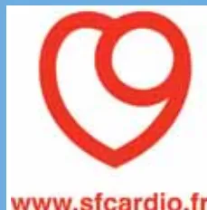

The logo of SAMU DE FRANCE, featuring a blue circle with a white caduceus symbol and the text 'SAMU DE FRANCE' in white.The logo of the Faculté de Médecine de l'Université Paris-Sud (fmu), featuring a stylized black 'f' and 'mu' with a blue swoosh.The logo of sfcardio, featuring a red heart shape with a white circle inside, and the website address 'www.sfcardio.fr' in red text below it.

## RECOMMANDATIONS PROFESSIONNELLES

# Prise en charge de l'infarctus du myocarde à la phase aiguë en dehors des services de cardiologie

**Conférence de consensus**

**23 novembre 2006**

Paris (faculté de médecine Paris V)

**Texte des recommandations**

(version longue)

Avec le partenariat méthodologique et le concours financier de la

**HAS**

HAUTE AUTORITÉ DE SANTÉLes versions longue et courte des recommandations  
sont consultables sur le site de la HAS  
[www.has-sante.fr](http://www.has-sante.fr) - rubrique « Toutes nos publications »

La version courte des recommandations est disponible  
sur demande auprès de  
[Haute Autorité de Santé](#)  
Service communication

2 avenue du Stade de France – F 93218 Saint-Denis La Plaine CEDEX# Sommaire

<table><tr><td>Avertissement</td><td>5</td></tr><tr><td><b>QUESTION 1</b><br/>Quels sont les critères décisionnels pour la prescription d'une désobstruction coronaire pour un infarctus aigu (indépendamment de la technique) ?</td><td>7</td></tr><tr><td><b>QUESTION 2</b><br/>Quels sont les stratégies de reperfusion et les traitements adjuvants à mettre en œuvre pour un syndrome coronarien aigu ST+ ?</td><td>10</td></tr><tr><td><b>QUESTION 3</b><br/>Quelles sont les caractéristiques des filières de prise en charge d'un patient avec une douleur thoracique évoquant un infarctus aigu ?</td><td>16</td></tr><tr><td><b>QUESTION 4</b><br/>Quelles sont les situations particulières de prise en charge d'un infarctus aigu ?</td><td>20</td></tr><tr><td><b>QUESTION 5</b><br/>Quelle est la prise en charge des complications initiales ?</td><td>27</td></tr><tr><td>Annexe 1 - Échelle de gradation des recommandations utilisées par la HAS pour les études thérapeutiques</td><td>37</td></tr><tr><td>Annexe 2 - Classement de Killip</td><td>38</td></tr><tr><td>Annexe 3 - Glossaire des termes et définitions</td><td>39</td></tr><tr><td>Méthode</td><td>41</td></tr><tr><td>Participants</td><td>43</td></tr><tr><td>Fiche descriptive</td><td>45</td></tr></table>## **Promoteurs**

SAMU de France

Société francophone de médecine d'urgence

Société française de cardiologie

## **Copromoteurs**

Agence française de sécurité sanitaire des produits de santé

Association pédagogique nationale pour l'enseignement de la thérapeutique

Bataillon des marins-pompiers de Marseille

Brigade de sapeurs-pompiers de Paris

Société française d'anesthésie et de réanimation

Société française de biologie clinique

Société française de médecine sapeur-pompier

Société de réanimation de langue française

SOS Médecins France

L'organisation de cette conférence a été rendue possible grâce à l'aide financière apportée par la Haute Autorité de Santé, SAMU de France, la Société française de cardiologie et la Société francophone de médecine d'urgence.# Abréviations

<table border="0">
<tbody>
<tr>
<td>AC</td>
<td>arrêt circulatoire</td>
<td>IVG</td>
<td>insuffisance ventriculaire gauche</td>
</tr>
<tr>
<td>ACC</td>
<td><i>American College of Cardiology</i></td>
<td>LVA</td>
<td>liberté des voies aériennes</td>
</tr>
<tr>
<td>ACP</td>
<td>assistance circulatoire percutanée</td>
<td>MCE</td>
<td>massage cardiaque externe</td>
</tr>
<tr>
<td>AHA</td>
<td><i>American Heart Association</i></td>
<td>MVO<sub>2</sub></td>
<td>consommation d'oxygène du myocarde</td>
</tr>
<tr>
<td>AMU</td>
<td>aide médicale urgente</td>
<td>OAP</td>
<td>œdème aigu pulmonaire</td>
</tr>
<tr>
<td>ASSU</td>
<td>association de secours et de soins urgents</td>
<td>PAD</td>
<td>pression artérielle diastolique</td>
</tr>
<tr>
<td>BAV</td>
<td>bloc auriculo-ventriculaire</td>
<td>PAS</td>
<td>pression artérielle systolique</td>
</tr>
<tr>
<td>BBD</td>
<td>bloc de branche droite</td>
<td>PDS</td>
<td>permanence des soins</td>
</tr>
<tr>
<td>BBG</td>
<td>bloc de branche gauche</td>
<td>PEC</td>
<td>prise en charge</td>
</tr>
<tr>
<td>bpm</td>
<td>battements par minute</td>
<td>RACS</td>
<td>reprise d'activité cardiaque spontanée</td>
</tr>
<tr>
<td>CC</td>
<td>choc cardiogénique</td>
<td>RCP</td>
<td>réanimation cardio-pulmonaire</td>
</tr>
<tr>
<td>CEE</td>
<td>choc électrique externe</td>
<td>RIVA</td>
<td>rythme idioventriculaire accéléré</td>
</tr>
<tr>
<td>CPBIA</td>
<td>contre-pulsion par ballonnet intra-aortique</td>
<td>ROC</td>
<td><i>Receiver Operating Characteristic</i></td>
</tr>
<tr>
<td>CRRRA</td>
<td>centre de réception et de régulation des appels</td>
<td>SAMU</td>
<td>service d'aide médicale urgente</td>
</tr>
<tr>
<td>DSA</td>
<td>défibrillateur semi-automatique</td>
<td>SAU</td>
<td>service d'accueil des urgences</td>
</tr>
<tr>
<td>ECG</td>
<td>électrocardiogramme</td>
<td>SCA</td>
<td>syndrome coronarien aigu</td>
</tr>
<tr>
<td>EESE</td>
<td>entraînement électrosystolique externe</td>
<td>SCA ST +</td>
<td>syndrome coronarien aigu avec sus-décalage du segment ST</td>
</tr>
<tr>
<td>EESI</td>
<td>entraînement électrosystolique interne</td>
<td>SCDI</td>
<td>salle de coronarographie diagnostique et interventionnelle</td>
</tr>
<tr>
<td>ERC</td>
<td><i>European Ressuscitation Council</i></td>
<td>SFC</td>
<td>Société française de cardiologie</td>
</tr>
<tr>
<td>ESC</td>
<td><i>European Society of Cardiology</i></td>
<td>SMUR</td>
<td>structure mobile d'urgence et de réanimation</td>
</tr>
<tr>
<td>FA</td>
<td>fibrillation auriculaire</td>
<td>TSV</td>
<td>tachycardie supraventriculaire</td>
</tr>
<tr>
<td>FC</td>
<td>fréquence cardiaque</td>
<td>TV</td>
<td>tachycardie ventriculaire</td>
</tr>
<tr>
<td>FV</td>
<td>fibrillation ventriculaire</td>
<td>UMH</td>
<td>unité mobile hospitalière</td>
</tr>
<tr>
<td>HBPM</td>
<td>héparine de bas poids moléculaire</td>
<td>USI</td>
<td>unité de soins intensifs</td>
</tr>
<tr>
<td>HNF</td>
<td>héparine non fractionnée</td>
<td>VA</td>
<td>ventilation assistée</td>
</tr>
<tr>
<td>HVG</td>
<td>hypertrophie ventriculaire gauche</td>
<td>VNI</td>
<td>ventilation non invasive</td>
</tr>
<tr>
<td>IDM</td>
<td>infarctus du myocarde</td>
<td></td>
<td></td>
</tr>
<tr>
<td>ISR</td>
<td>induction à séquence rapide</td>
<td></td>
<td></td>
</tr>
<tr>
<td>IV</td>
<td>intraveineux</td>
<td></td>
<td></td>
</tr>
</tbody>
</table>A completely blank white page with no visible content, text, or markings.## Avertissement

Cette conférence a été organisée et s'est déroulée conformément aux règles méthodologiques préconisées par la Haute Autorité de Santé (HAS).

Les conclusions et recommandations présentées dans ce document ont été rédigées par le jury de la conférence, en toute indépendance. Leur teneur n'engage en aucune manière la responsabilité de la HAS.

## Introduction

L'infarctus du myocarde (IDM) est une urgence vitale qui est observée dans tous les pays avec une plus grande incidence dans les pays à fort niveau socio-économique.

Actuellement l'IDM aigu comprend, au plan nosologique, le syndrome coronarien aigu (SCA) avec élévation du segment ST (SCA ST+) et sans élévation du segment ST (SCA non ST+). Son diagnostic est plus ou moins aisé et les difficultés diagnostiques sont plus fréquentes chez les femmes, les personnes âgées et les diabétiques. Il repose classiquement sur des signes cliniques et électrocardiographiques et sur des paramètres biologiques. Ces trois groupes de signes servent également de critères décisionnels pour la prescription d'une reperfusion.

Il est démontré aujourd'hui que la reperfusion coronaire précoce à la phase aiguë de l'IDM contribue largement à améliorer le pronostic des patients. La relation entre le bénéfice pronostique et la précocité de la reperfusion a été établie, et cela quel que soit le moyen thérapeutique de la reperfusion.

De nombreux registres existent, notamment en France, pour suivre l'évolution des prises en charge de l'IDM. En France, l'incidence des SCA est proche de 100 000 personnes par an. Au sein de ces syndromes, la mortalité globale par IDM à la phase aiguë est de l'ordre de 15 %.

Une des principales particularités du système de soins en France est l'existence d'une organisation forte de la prise en charge des urgences en dehors des établissements de santé. Elle repose sur les services d'aide médicale urgente (SAMU) assurant la réception et la régulation des appels d'urgence. Ces SAMU peuvent activer plusieurs types d'effecteurs médicaux parmi lesquels les structures mobiles d'urgences et réanimation (SMUR), des médecins libéraux (soit des généralistes plus ou moins isolés, soit des médecins regroupés dans des associations d'urgentistes libéraux), des médecins des services départementaux d'incendie et de secours, etc. La France dispose également de nombreuses structures accueillant des urgences dans des établissements de soins publics et privés.

Cette médicalisation précoce des urgences s'est accompagnée du développement de moyens diagnostiques et thérapeutiques qui sont embarqués dans les moyens d'intervention des effecteurs. Ainsi le diagnostic et le traitement, en particulier la reperfusion pharmacologique des SCA ST+, sont devenus réalisables en dehors des établissements de soins.Les IDM en urgence doivent bénéficier d'une coopération entre médecins cardiologues et non cardiologues. Cette coopération permet de dégager des stratégies communes fondées sur des études le plus souvent internationales et sur les résultats des registres.

L'efficacité de cette coopération se retrouve dans l'évolution de la morbi-mortalité des SCA ST+. Ainsi, la comparaison des données des registres français USIC 1995 et USIC 2000 montre que le déploiement progressif d'une stratégie précoce de reperfusion coronaire a permis, en 5 ans, une réduction significative de la mortalité à 5 jours et une augmentation également significative de la survie à 1 an.

En revanche, au regard des données des registres régionaux d'évaluation des pratiques de la prise en charge des SCA ST+, il faut noter une différence dans les chiffres de mortalité selon les régions. Ils traduisent une forte variabilité des pratiques aux niveaux interrégional, interdépartemental et interétablissement, tant dans les délais que dans l'indication des moyens de reperfusion.

Même si l'IDM est une pathologie cardiaque et du fait de l'organisation des soins d'urgence et de la permanence des soins (PDS) en France, ce sont les médecins urgentistes et les médecins libéraux qui s'y trouvent le plus souvent confrontés. Ainsi, dans le registre ESTIM Midi-Pyrénées, la première prise en charge est effectuée par le SMUR dans 52 % des cas, par les services des urgences dans 29 % des cas et dans 19 % des cas par les services de cardiologie (à part égale entre les services de cardiologie interventionnelle ou non). Les interventions du SMUR sont consécutives à un appel direct du patient au SAMU-Centre 15 dans 45 % des cas et dans 38 % des cas par un médecin libéral (généraliste, cardiologue, etc.).

Ainsi, dans l'IDM, le premier intervenant de la chaîne médicale est le plus souvent non cardiologue et cette situation s'accompagne d'une très grande hétérogénéité de la prise en charge des SCA ST+ en termes de décisions thérapeutiques, de choix des techniques de reperfusion et de filières de prise en charge. Cela amène au constat qu'un pourcentage important de patients échappe à toute décision de reperfusion en urgence. Ainsi les « *oublis de la reperfusion* » dans les 24 premières heures représentaient plus d'un tiers (35 %) des SCA ST+ en 2004 dans le registre ESTIM Limousin.

De nombreuses recommandations à dire d'experts ont été élaborées au niveau international. L'objectif principal de cette conférence de consensus est d'établir des recommandations claires sur la prise en charge des SCA ST+ avant l'arrivée du patient dans un service de cardiologie. Ces recommandations ont pour but, *dans le schéma actuel d'organisation des soins en France*, de permettre d'homogénéiser les pratiques, de préconiser des filières identifiées de prise en charge afin d'optimiser les délais de reperfusion et, *in fine*, d'augmenter le nombre de patients bénéficiant d'une stratégie de reperfusion précoce afin d'atteindre le taux recommandé de 75 % de patients reperfusés dans les 3 premières heures, tout cela devant concourir à diminuer les taux de morbidité et de mortalité. L'objectif secondaire de cette conférence est deproposer des pistes d'action vis-à-vis de l'évaluation de la prise en charge du SCA ST+ en France par la formalisation de registres.

## QUESTION 1

### Quels sont les critères décisionnels pour la prescription d'une désobstruction coronaire pour un infarctus aigu (indépendamment de la technique) ?

Le traitement actuel de l'IDM aigu repose sur une reperfusion précoce et efficace de l'artère coronaire responsable de la nécrose myocardique : la qualité du pronostic est en relation exponentielle avec la précocité de la reperfusion.

Quelle que soit la stratégie de reperfusion choisie, pharmacologique (thrombolyse) ou mécanique (angioplastie), la reconnaissance, sur des critères cliniques, électrocardiographiques et éventuellement biologiques, du SCA est la première étape de la stratégie de reperfusion coronaire.

Dans sa forme typique, l'IDM aigu associe une douleur persistante au-delà de 20 minutes, médio-thoracique et rétrosternale, oppressive, angoissante, irradiant dans le bras gauche, le cou et le maxillaire inférieur (grade C<sup>1</sup>).

L'électrocardiogramme (ECG) objective un sus-décalage du segment ST d'au moins 0,1 mV dans les dérivations frontales (D1, D2, D3, aVL et aVF), précordiales gauches (V4 à V6) ou postérieures (V7, V8, V9) et d'au moins 0,2 mV dans les dérivations précordiales droites (V1 à V3), dans au moins deux dérivations contiguës d'un territoire coronaire (grade A). Une technique de réalisation parfaite de l'enregistrement est une condition indispensable à une interprétation pertinente du tracé ECG. L'amplitude du sus-décalage est définie entre le point J (intersection entre la dépolarisation et la repolarisation) et la ligne de base définie comme le segment PR.

L'élévation de marqueurs biologiques spécifiques fait partie des critères diagnostiques actuels et validés de nécrose myocardique (grade C) : parmi ces marqueurs, les troponines (I et T), de par leur cardiospécificité, sont les marqueurs de référence (grade C). Cependant le délai d'apparition de ces marqueurs (4 à 6 heures) doit être pris en compte et, de ce fait, a peu d'impact sur une décision rapide de reperfusion. Devant un SCA ST+, la réalisation de dosages biologiques ne doit en aucun cas retarder la mise en route d'une stratégie de reperfusion (grade C).

---

1. Une *recommandation de grade A* est fondée sur une preuve scientifique établie par des études de fort niveau de preuve (niveau 1). Une *recommandation de grade B* est fondée sur une présomption scientifique fournie par des études de niveau de preuve intermédiaire (niveau 2). Une *recommandation de grade C* est fondée sur des études de faible niveau de preuve (niveau 3 ou 4). **En l'absence de précisions, les recommandations reposent sur un consensus exprimé par le jury.** Voir annexe 1.De nombreuses formes atypiques peuvent entraîner une errance diagnostique, responsable de choix thérapeutiques non adaptés. Une analyse rigoureuse des signes cliniques et ECG, par un praticien expérimenté, doit permettre de ne pas méconnaître des SCA devant bénéficier d'une stratégie de reperfusion rapide.

## 1. Critères cliniques de l'IDM aigu

**Ancienneté de la douleur** : la détermination de l'heure de début des symptômes est indispensable à la décision de prescription de reperfusion. Pour les SCA ST+, cette thérapeutique doit être entreprise dans les 12 heures suivant l'apparition de ces symptômes (grade A) ; au-delà de ce délai, la littérature ne permet pas de mettre en évidence un bénéfice à une telle stratégie.

Bien que les éléments suivants n'entrent pas dans le cadre des critères décisionnels pour la prescription d'une reperfusion coronaire, le jury souhaite sensibiliser le clinicien sur des sous-groupes de population ne bénéficiant qu'insuffisamment d'une prise en charge précoce (grade C) :

- ▶ diabétique ;
- ▶ personne avec antécédent d'insuffisance cardiaque ;
- ▶ personne âgée de plus de 75 ans ;
- ▶ femme.

## 2. Critères décisionnels ECG en faveur de l'IDM aigu

L'ECG est un examen rapide, peu coûteux, non invasif et renouvelable, essentiel pour poser le diagnostic d'IDM aigu et guider la prescription de reperfusion coronaire. Il doit être réalisé le plus rapidement possible, au mieux dans les 10 minutes après le premier contact médical (grade C). Si une hypothèse ischémique ne peut être éliminée chez un patient restant symptomatique, l'ECG est renouvelé toutes les 10 minutes, et le tracé électrocardioscopique poursuivi jusqu'à l'orientation finale (grade C).

Chez les patients suspects d'un SCA, la constatation d'un **sus-décalage persistant du segment ST**, selon les critères décrits ci-dessus, ou d'un **bloc de branche gauche (BBG) récent ou présumé récent** conduit à proposer, sans retard, une indication de reperfusion précoce (grade A).

Un **sous-décalage isolé du segment ST** dans les dérivations précordiales V1, V2 ou V3 doit faire rechercher un IDM postérieur isolé. Pour cette raison, l'enregistrement systématique des dérivations postérieures V7, V8 et V9 pour dépister un sus-décalage de ST d'au moins 0,1 mV est recommandé (grade B).

**SCA et BBG non récent** : le BBG est associé à des anomalies du segment ST et de l'onde T qui rendent, dans un contexte de douleur thoracique, le diagnostic d'IDM aigu difficile. La perte de la discordance normale entre le complexe QRS et le segment ST doit faire suspecter une ischémie aiguë. Sgarbossa *et al.* ont défini descritères électrocardiographiques pour identifier un IDM en évolution en présence d'un BBG complet à partir de l'étude Gusto-I (grade C). Il s'agit de trois critères électriques ayant une valeur diagnostique indépendante qui permettent l'établissement d'un score :

- ▶ sus-décalage de ST  $\geq 0,1$  mV concordant avec la déflexion principale du QRS (score de 5) ;
- ▶ sous-décalage de ST  $\geq 0,1$  mV dans les dérivations V1, V2 ou V3 (score de 3) ;
- ▶ sus-décalage de ST  $\geq 0,5$  mV discordant avec la déflexion principale du QRS (score de 2).

Dans ce travail, un score de 3 ou plus (test positif) suggérait un IDM aigu avec une spécificité de 96 % et une sensibilité de 36 %. Selon Shlipak *et al.*, qui ont testé la valeur diagnostique de l'algorithme de Sgarbossa, le test n'est positif que chez 10 % des patients à l'admission. En revanche, sa spécificité voisine de 100 % permet d'identifier rapidement un IDM en évolution et d'indiquer une stratégie de reperfusion (grade C).

Certaines situations, comme l'entraînement ventriculaire permanent, l'hypertrophie ventriculaire gauche, le syndrome de préexcitation ventriculaire, ne permettent pas une analyse fiable du tracé ECG. Si des critères permettant d'évoquer un SCA sont proposés, aucune étude ne permet de distinguer, dans ces situations, des éléments décisionnels pour une stratégie de reperfusion coronaire.

### **3. Critères décisionnels biologiques en faveur de l'IDM aigu**

Le dosage des troponines (I et T) ne doit pas intervenir dans la décision de reperfusion coronaire dans le SCA ST+. Ce dosage est proposé dans la stratification du risque et ainsi peut être proposé comme critère décisionnel thérapeutique dans le SCA sans sus-décalage du segment ST. L'élévation, supérieure au 99<sup>e</sup> percentile d'une population de référence (variation de la précision de la mesure de 10 % au maximum), permet d'identifier une situation à haut risque justifiant une stratégie agressive de reperfusion coronaire mécanique (grade A).

En cas de valeur négative des troponines, un second dosage est réalisé dans un délai de 4 à 6 heures (respect de la cinétique de la libération) pour vérifier l'absence de nécrose myocardique.

### **4. Critères décisionnels d'imagerie**

Aucune étude ne permet de recommander l'échocardiographie ou tout autre examen d'imagerie non invasif dans les critères décisionnels pour la prescription d'une reperfusion coronaire pour un IDM aigu. Toutefois, l'échocardiographie en urgence peut être utile à l'établissement de certains diagnostics différentiels.## QUESTION 2

**Quels sont les stratégies de reperfusion et les traitements adjuvants à mettre en œuvre pour un syndrome coronarien aigu ST+ ?**

### 1. Stratégies de reperfusion

#### 1.1 Les délais à prendre en compte

Le choix de la stratégie de reperfusion d'un SCA ST+ est fonction de plusieurs paramètres. La pierre angulaire de cette stratégie est la réduction du temps écoulé depuis le début de la symptomatologie jusqu'à la reperméabilisation coronarienne. Cependant, compte tenu du fort pourcentage de patients ne bénéficiant actuellement pas d'une stratégie de reperfusion, tous les efforts doivent être entrepris pour augmenter le pourcentage de patients désobstrués afin de diminuer la morbi-mortalité. Ainsi tout patient présentant un SCA ST+ doit en bénéficier dans les 12 premières heures (grade A).

La spécificité française des SAMU-SMUR fait que les données de la littérature internationale ne sont pas toutes transposables à notre système de santé. Notamment un délai proposé dans les études et recommandations internationales non françaises n'est pas applicable tel quel à notre organisation des soins. Il est important d'avoir une définition consensuelle et adaptée à l'organisation des soins préhospitaliers français car les valeurs retrouvées dans la littérature pour différents délais sont la pierre angulaire sur laquelle reposent les stratégies de reperfusion.

Dans les textes internationaux, le délai « *door to balloon* » correspond le plus souvent au délai entre l'arrivée à l'établissement de santé et l'expansion du ballonnet dans une coronaire. Le jury retient comme définition pour le système français le **délai entre le premier contact médical et l'expansion du ballonnet**.

Cela conduit à proposer de définir le **premier contact médical** comme l'arrivée auprès du patient du médecin permettant la réalisation d'un ECG et donc la confirmation du diagnostic de SCA ST+. Il ne correspond pas au contact téléphonique avec un médecin.

Cette conférence de consensus traite de la prise en charge de l'IDM à la phase aiguë *en dehors des services de cardiologie*. Son champ de recommandations s'arrête donc à la porte du service de cardiologie. Le jury décide de scinder le **délai premier contact médical-expansion du ballonnet** en 2 délais complémentaires :

- ▶ le délai entre le premier contact médical et l'arrivée dans le service de cardiologie interventionnelle, appelé **délai porte à porte cardio** ;
- ▶ le délai entre l'arrivée dans le service de cardiologie interventionnelle et l'expansion du ballonnet, appelé **délai porte cardio-ballon**.

Le jury n'a pas trouvé d'argument suffisant pour justifier une modification du *délai premier contact médical-expansion du ballonnet*. Les recommandations de l'ESC(European Society of Cardiology) et de l'AHA (American Heart Association) proposent un seuil décisionnel de 90 minutes pour le choix de la stratégie de reperfusion.

Pour continuer à respecter ce délai de 90 minutes, le jury recommande comme seuil décisionnel pour le *délai porte à porte cardio* une valeur de 45 minutes. Ce chiffre est issu des estimations faites sur le *délai porte cardio-ballon* par des experts de la conférence, des résultats des études CAPTIM, ASSENT3+ et des différents registres français<sup>2</sup> : ce chiffre est compris entre 33 et 45 minutes et le jury retient la valeur de 45 minutes. Ainsi, la somme des 2 délais est bien égale à 90 minutes.

**Le respect et l'amélioration respective de chacun de ces 2 délais doivent permettre d'augmenter le nombre de patients accédant à la reperfusion mécanique.**

L'évaluation de ces 2 délais au moyen de registres et la diffusion des informations entre urgentistes et cardiologues sur ces données sont donc indispensables.

## 1.2 Les stratégies de reperfusion reposent sur l'angioplastie coronaire et la fibrinolyse

Le choix d'une stratégie par rapport à l'autre repose sur l'évaluation respective du rapport bénéfices/risques dans une situation clinique donnée.

Une stratégie combinée systématique associant fibrinolyse et angioplastie précoce n'est pas recommandée.

L'angioplastie primaire est la technique la plus sûre et la plus efficace, puisqu'elle permet de ouvrir l'artère occluse dans près de 90 % des cas contre seulement 60 % pour la fibrinolyse. Son risque hémorragique est inférieur à celui de la fibrinolyse, notamment en ce qui concerne les hémorragies graves, principalement cérébrales.

La réalisation de la fibrinolyse a pour elle l'avantage de sa simplicité. Elle est réalisable en tous lieux du territoire, à l'intérieur comme à l'extérieur d'un établissement de soins, sous réserve d'un environnement de réanimation. Ces caractéristiques en font un élément clef de l'égalité des chances face à l'IDM aigu. L'efficacité de la fibrinolyse est optimale au cours des 3 premières heures qui suivent le début des symptômes<sup>3</sup>. Le risque hémorragique intracérébral est incontournable malgré le respect strict des contre-indications. Il est compris entre 0,5 et 1 % et augmente avec l'âge.

Choix du fibrinolytique : le jury recommande l'utilisation préférentielle de la ténecteplase, produit fibrino-spécifique, utilisable en bolus intraveineux (IV) unique en 10 secondes environ, à demi-vie courte, adaptable au poids du patient, la dose ne devant cependant pas excéder 10 000 UI, soit 50 mg de ténecteplase. Les arguments de ce choix sont (grade B) :

---

2. Registre E-Must et registres ESTIM des régions Nord-Pas-de-Calais, Champagne, Rhône, Aquitaine, Pays de Loire, PACA, Limousin, Centre et Midi-Pyrénées.  
3. Boersma *et al.*, Lancet, 1996;348:771-5.- ▶ l'amélioration du rapport bénéfices/risques par rapport au r-tPA ;
- ▶ l'efficacité thérapeutique persistante au-delà de la 4<sup>e</sup> heure ;
- ▶ sa facilité d'emploi pouvant permettre un gain de temps.

Le jury recommande de ne pas utiliser la streptokinase du fait (grade B) :

- ▶ d'une efficacité moindre comparativement aux autres agents fibrinolytiques ;
- ▶ d'une réduction de son index thérapeutique au-delà de la 4<sup>e</sup> heure.

## 1.3 Le choix de la stratégie

Le choix de la stratégie repose sur l'argumentaire suivant.

Dans les 3 premières heures après le début des symptômes, il est montré (grade B) que l'angioplastie primaire et la fibrinolyse font jeu égal en termes de réduction de mortalité à 30 jours, à condition que cette stratégie puisse être mise en œuvre avec un *délai premier contact médical-expansion du ballonnet* inférieur à 90 minutes. L'angioplastie primaire expose à un moindre taux d'accidents vasculaires cérébraux hémorragiques que la fibrinolyse.

Au-delà de la 3<sup>e</sup> heure, le bénéfice de la fibrinolyse s'estompe au profit de l'angioplastie primaire. C'est donc l'angioplastie primaire qu'il faut privilégier, en gardant à l'esprit que la rapidité de mise en œuvre d'une technique de reperfusion continue à influencer le pronostic. L'angioplastie primaire doit donc être effectuée dans le délai maximal de 90 minutes ; si l'angioplastie ne peut pas être réalisée dans les 90 minutes, la fibrinolyse est à réaliser en l'absence de contre-indication.

Au-delà de la 12<sup>e</sup> heure, il est admis que la reperfusion urgente ne diminue ni la mortalité ni la morbidité des SCA ST+. Cependant, certaines situations peuvent amener à considérer une reperfusion tardive : choc cardiogénique (CC) ou persistance d'une douleur thoracique. L'angioplastie est à privilégier.

Compte tenu de ces éléments, le jury recommande la stratégie initiale<sup>4</sup> suivante qui est résumée dans l'*algorithme 1*.

La mise en œuvre de cette stratégie comprend les étapes suivantes :

**1. Connaître les 2 délais suivants : le *délai porte à porte cardio* et le *délai porte cardio-ballon* :**

- ▶ le *délai porte à porte cardio* doit être estimé par le médecin effecteur en fonction de la durée estimée de mise en condition, de brancardage et du transport du patient en salle de coronarographie diagnostique et interventionnelle (SCDI). Il est transmis au médecin régulateur ;
- ▶ le *délai porte cardio-ballon* doit être estimé par le médecin régulateur en fonction de l'heure de disponibilité de la table et de l'équipe d'angioplastie, heure fournie par l'appel préalable à la SCDI. Il est également estimé grâce aux données des registres communs. Ce délai doit faire l'objet d'une contractualisation entre les

4. Cette stratégie de départ devra évoluer en fonction des résultats des registres.```

graph TD
    SCA[SCA ST+] --> D1[Délai porte à porte cardio* < 45 min]
    SCA --> D2[Délai porte à porte cardio* > 45 min ou délai porte cardio-ballon non estimable]
    
    D1 --> S1[Signes < 3 h]
    D1 --> S2[Signes > 3 h et < 12 h]
    
    D2 --> S3[Signes < 3 h]
    D2 --> S4[Signes > 3 h et < 12 h]
    
    S1 --> C[Choix]
    C --> TL[TL]
    C --> APL1[APL]
    C --> APL2[APL]
    C --> APL3[APL]
    
    S2 --> CI1[CI à la TL]
    CI1 --> APL1
    CI1 --> APL2
    CI1 --> APL3
    
    S3 --> APL4[APL]
    S4 --> APL5[APL]
    
    D2 --> SI[Stratégie identique]
    SI --> CI2[CI à la TL]
    CI2 --> APL6[APL]
    
    TL --> CI[Centre de cardiologie interventionnelle]
    APL1 --> CI
    APL2 --> CI
    APL3 --> CI
    APL4 --> CI
    APL5 --> CI
    APL6 --> CI
    
    TL -- "Si échec fibrinolyse" --> APL1
    APL6 -- "Si échec fibrinolyse" --> APL4
  
```

\* Le délai porte à porte cardio doit s'intégrer dans le délai global de prise en charge qui ne doit pas être supérieur à 90 minutes.  
 TL : thrombolyse APL : angioplastie CI : contre-indication.

**Algorithme 1.** Stratégie de reperfusion d'un SCA ST+ non compliqué avant la cardiologie (cf. *supra* définition des délais).

équipes. Si ce *délai porte cardio-ballon* ne peut être estimé (incertitude quant à la disponibilité de la SCDI), il doit être considéré comme supérieur à 45 minutes.

2. Si le *délai porte à porte cardio* est supérieur à 45 minutes, la probabilité que le *délai global premier contact médical-expansion du ballonnet* soit supérieur à 90 minutes est trop élevée et justifie la fibrinolyse pour tout patient dont le début des symptômes est inférieur à 12 heures. La stratégie est identique entre moins et plus de 3 heures.

3. Si le *délai porte à porte cardio* est inférieur à 45 minutes et que la somme de ce délai avec le *délai porte cardio-ballon* est inférieure à 90 minutes, la stratégie devient fonction de l'heure du début des symptômes :

- ▸ si ce délai est inférieur à 3 heures, le médecin auprès du patient peut proposer soit la fibrinolyse, soit l'angioplastie primaire en fonction de procédures écrites et évaluées. Ces procédures communes aux cardiologues et urgentistes doivent prendre en compte le libre choix du patient informé et certaines caractéristiques cliniques (notamment l'âge, le territoire antérieur de la nécrose, un délai de prise en charge inférieur à 1 heure, etc.) ;
- ▸ si le délai depuis le début des symptômes est compris entre 3 et 12 heures, l'angioplastie primaire est privilégiée.

4. L'évaluation de l'efficacité de la fibrinolyse sera réalisée dès son administration afin de dépister précocement une non-réponse justifiant une angioplastie de sauvetage. Il n'y a pas de critères validés pour affirmer cette non-réponse, même si l'examen clinique et l'ECG permettent d'évoquer un défaut de reperfusion.Cette stratégie justifie les recommandations suivantes :

- ▸ il est impératif que l'ensemble des structures d'urgences (SMUR et accueil des urgences) dispose des moyens de pratiquer une fibrinolyse (recommandation unanime du jury) ;
- ▸ après fibrinolyse, le patient doit être dirigé vers un centre disposant d'une SCDI compte tenu du taux de non-réponse d'environ 40 %. Après échec d'une fibrinolyse, une angioplastie de sauvetage est recommandée, une seconde fibrinolyse n'est pas indiquée (grade B) ;
- ▸ la mise en place de registres d'évaluation des stratégies de prise en charge des SCA ST+. Ces registres doivent être communs aux équipes participant à cette prise en charge. Ces registres sont régionaux ou infrarégionaux. Les critères à recueillir devraient être définis en commun par les sociétés savantes nationales concernées. Le traitement des données doit pouvoir être rendu possible sur le plan national. Localement, ces registres doivent être une aide pour faire évoluer la stratégie initiale de reperfusion et notamment les délais proposés.

## 2. Traitements adjuvants

Dans le cadre des SCA ST+, l'objectif essentiel de reperfusion coronaire précoce ne doit pas faire oublier les thérapeutiques adjuvantes dont certaines peuvent avoir un effet antithrombotique propre. Elles doivent s'intégrer dans le schéma général de prise en charge du patient.

### 2.1 Les antithrombotiques

Le traitement adjuvant antithrombotique dans le cadre des SCA ST+ a pour objectif essentiel de prévenir l'extension d'un thrombus intracoronaire déjà formé ou de prévenir une réaction thrombotique excessive favorisée par la thrombolysie préhospitalière ou l'angioplastie primaire. Ainsi, le maintien d'une artère ouverte ou la prévention d'une réocclusion artérielle précoce favorise la perfusion microcapillaire, limite l'extension de l'IDM et permet pour plusieurs de ces traitements de réduire la mortalité.

► **Aspirine** : son bénéfice dans le traitement des SCA est démontré (grade A). C'est pourquoi, en dehors de ses contre-indications (allergie vraie et diathèse hémorragique majeure), l'aspirine doit être administrée *per os* ou par voie IV à la posologie de 160 à 500 mg dès les premiers symptômes évoquant un SCA (grade A), y compris lors de la régulation téléphonique d'un appel pour douleur thoracique très évocatrice d'IDM chez un sujet conscient pour une prise orale.

► **Clopidogrel** : le clopidogrel est recommandé à la phase précoce d'un SCA ST+, en association avec l'aspirine ou seul si celle-ci est contre-indiquée (grade A). La posologie initiale recommandée est une dose de charge de 300 mg *per os* pour les patients de moins de 75 ans, et de 75 mg pour les patients de plus de 75 ans.

► **Antagonistes des récepteurs GPIIb/IIIa** : les antagonistes de la glycoprotéine IIb/IIIa n'ont leur place ni seuls par manque d'efficacité, ni en association avec une fibrinolyse du fait de la majoration du risque hémorragique (grade B). Leur utilisation en phaseaiguë de SCA ST+ ne doit s'envisager qu'avant une angioplastie primaire. Leur rapport bénéfices/risques en phase préhospitale, en association avec du clopidogrel, n'est pas connu. La molécule conseillée est l'abciximab à la posologie de 250 µg/kg par voie IV, suivie d'une perfusion IV continue de 0,125 µg/kg/min jusqu'à un maximum de 10 µg/min.

► **Anticoagulants** : l'utilisation des héparines lors de la prise en charge d'un SCA ST+ est bénéfique. En cas de fibrinolyse, l'énoxaparine est supérieure à l'héparine non fractionnée (HNF) chez les patients de moins de 75 ans à fonction rénale normale (grade B). L'héparine de bas poids moléculaire (HBPM) recommandée est l'énoxaparine, hors AMM, en bolus initial IV de 30 mg, suivi d'injections sous-cutanées de 1 mg/kg toutes les 12 heures.

En cas d'angioplastie, il n'y a pas d'arguments en faveur des HBPM par rapport à l'HNF qui reste, dans ce cas, le traitement de référence.

Chez le sujet de plus de 75 ans et l'insuffisant rénal, l'HNF est l'héparine recommandée (grade B). La posologie d'HNF est de 60 UI/kg pour le bolus initial par voie IV directe (sans dépasser 4 000 UI) avec une posologie d'entretien de 12 UI/kg/h (maximum 1 000 UI/h).

## 2.2 Autres thérapeutiques adjuvantes

► **Dérivés nitrés** : en dehors de l'œdème aigu pulmonaire (OAP), et éventuellement en cas de poussée hypertensive (et en seconde intention après les bêtabloquants), les dérivés nitrés ne sont pas recommandés dans la prise en charge de l'IDM en phase aiguë (grade C).

Le test diagnostique (trinitrine sublinguale) est contre-indiqué en cas d'IDM du ventricule droit et de pression artérielle systolique inférieure à 90 mmHg, et n'est pas conseillé en présence d'un IDM inférieur. Il peut parfois être utile pour le diagnostic sans que le jury ne puisse émettre une opinion consensuelle.

► **Oxygénothérapie** : elle n'est pas systématique, mais est recommandée en cas de décompensation cardiaque ou si la  $SpO_2$  est inférieure à 94 %.

► **Antalgiques** : après évaluation de l'intensité douloureuse, le traitement de choix est la morphine administrée en titration IV jusqu'à l'obtention d'une intensité douloureuse inférieure ou égale à 3 sur une échelle d'autoévaluation de type échelle numérique.

► **Bêtabloquants** : si l'intérêt des bêtabloquants dans les suites d'un SCA ST+ est démontré, leur administration n'est pas préconisée de façon systématique avant les services de cardiologie, notamment en préhospitalier.

► **Inhibiteurs de l'enzyme de conversion (IEC)** : si l'intérêt des IEC dans les suites d'un SCA ST+ est démontré, aucun argument ne permet de les recommander en dehors d'un service de cardiologie.► **Antagonistes calciques** : les antagonistes calciques ne sont pas recommandés dans la prise en charge de l'IDM en phase aiguë. Leur administration sublinguale peut être délétère et est contre-indiquée dans ce contexte.

► **Insuline** : l'insuline est recommandée pour corriger une élévation de la glycémie en phase aiguë d'IDM. La solution GIK (glucose insuline potassium) n'est pas recommandée (grade B).

► **Statines** : la survenue d'un IDM ne doit pas conduire à l'arrêt, même transitoire, des statines.

## QUESTION 3

### Quelles sont les caractéristiques des filières de prise en charge d'un patient avec une douleur thoracique évoquant un infarctus aigu ?

#### 1. « Prescrire le 15 »

Chaque minute perdue pour la prise en charge d'un patient présentant un IDM aggrave le risque de morbi-mortalité.

Compte tenu des pertes de chances induites par le retard dans l'appel au SAMU-Centre 15 pour les patients en phase aiguë d'un IDM, il faut insister sur la réalisation répétée de campagnes d'éducation. Ces campagnes non seulement devront être à destination du grand public, mais aussi être ciblées vers les professionnels de santé afin de réorienter au plus vite l'appel vers le SAMU-Centre 15.

Un pourcentage important des patients présentant des symptômes évocateurs d'un IDM s'adresse à un autre intervenant que le SAMU-Centre 15. Le jury recommande l'utilisation de procédures compréhensibles pour tous afin de réorienter ces patients vers le médecin régulateur du SAMU-Centre 15.

Il faut aussi prendre en compte les patients ayant un IDM qui se présentent directement dans les services d'urgences ou qui sont déjà dans un service de soins.

#### 2. Description des filières de prise en charge

Les filières de prise en charge du patient avec une douleur thoracique évoquant un IDM aigu doivent au mieux fonctionner selon le schéma suivant : l'**appel**, qu'il provienne du patient lui-même ou d'un **tiers appelant**, doit aboutir au SAMU-Centre 15. Le **médecin régulateur du SAMU** déclenche un **effecteur** dont le but est d'amener le patient à la SCDI opérationnelle (**filière cardiologique**). Le patient peut aussi se trouver dans un service hospitalier qui devra diagnostiquer et traiter l'IDM, soit en relation directe avec la SCDI opérationnelle, soit en relation avec le SAMU-Centre 15. Le diagnostic et la prise en charge du patient peuvent être rendus plus difficiles en raison de **situations d'exception**.

L'optimisation des délais de prise en charge du patient ayant un IDM aigu impose de bien identifier chaque étape et intervenant de la filière de soins, et de préciser l'attitude à adopter pour chacun d'entre eux.

## 2.1 L'appel

Il peut provenir directement du patient, mais aussi d'une tierce personne (voisin, paramédical, etc.). Dans tous les cas le médecin régulateur essaiera autant que possible d'être mis directement en relation avec le patient. En effet, l'objectif de la régulation du SAMU-Centre 15 est de :

- • caractériser le plus rapidement possible le risque d'être en présence d'un IDM ;
- • donner les premiers conseils au patient ;
- • déclencher l'envoi du secours le plus approprié le plus rapidement possible ;
- • préparer l'orientation et l'accueil.

Quelle que soit la personne qui répond à l'appel (médecin ou non-médecin), le jury recommande de faciliter la détection d'une situation à forte probabilité d'IDM en se basant sur l'analyse de la douleur d'après les critères suivants :

- • **l'expression du patient** : « j'ai mal dans la poitrine », « ça me serre dans la poitrine », « je m'étouffe », etc. ;
- • **les critères de la douleur** (augmentation de la probabilité d'IDM selon le nombre de critères présents) :
  - ▶ constrictive, à type de serrement,
  - ▶ thoracique ou rétrosternale,
  - ▶ irradiant vers le haut (épaule et/ou mâchoire),
  - ▶ persistante au repos, durée supérieure à 20 minutes,
  - ▶ aggravation d'une douleur angineuse déjà connue auparavant, résistante à la prise de trinitrine,
  - ▶ signes neurovégétatifs d'accompagnement : nausées, vomissements, sueurs, etc.

Le médecin peut compléter l'interrogatoire en recherchant les facteurs de risque comme :

- • les traitements en cours ;
- • les antécédents personnels coronariens ;
- • les facteurs de risque (tabagisme, HTA, diabète, hérédité cardio-vasculaire) ;
- • l'âge et le sexe.

## 2.2 Le tiers appelant

- • Le médecin libéral (généraliste, cardiologue ou autre spécialiste), ou son secrétariat si le médecin n'est pas joignable, doit organiser si possible une conférence à trois (appelant, médecin libéral, médecin régulateur du SAMU). Si la prise en charge directe de l'appelant par le médecin régulateur du SAMU-Centre 15 n'est pas réalisable, le médecin libéral, ou son secrétariat en son absence, s'assure descoordonnées de l'appelant et du patient (tous les numéros de téléphone possibles, adresses respectives, identités) et contacte le régulateur du SAMU-Centre 15 en composant le 15 après avoir recommandé à l'appelant de garder sa ligne libre pour le rappel du SAMU.

Le jury recommande la rédaction préalable de protocoles par le médecin libéral pour son secrétariat.

- • Les standards téléphoniques des associations d'urgentistes libéraux et les centres de régulation libéraux de permanence des soins doivent avoir passé convention avec les hôpitaux où siège le centre de réception et de régulation des appels (CRRRA) : après s'être assuré des coordonnées de l'appelant et du patient (tous les numéros de téléphone possibles, adresses respectives, identités), une conférence à trois est instaurée sans délai.
- • Les services de soins hors unité de soins intensifs (USI) et services d'urgences : en fonction de protocoles validés, l'appelant s'adresse soit au SAMU-Centre 15, soit au centre de cardiologie interventionnelle si celui-ci est sur le même site que le service demandeur.
- • Les USI et services d'urgences : ces services sont à même d'assurer la prise en charge initiale de l'IDM (ECG initial plus monitoring et thérapeutique).

Le jury recommande :

- ▶ que le tri initial se fasse selon les critères d'interrogatoire déjà listés. Dans tous les cas, un ECG devra être réalisé (par un personnel médical ou non médical formé selon un protocole validé) et interprété dans un délai maximal de 10 minutes entre le premier contact à l'arrivée et l'interprétation par un médecin de l'ECG (grade B) ;
- ▶ qu'en fonction des moyens thérapeutiques disponibles, le médecin décide de la technique de reperfusion la mieux adaptée, en concertation avec les autres intervenants de la prise en charge.

## 2.3 Le médecin régulateur du SAMU

Le médecin régulateur du SAMU confirme au terme de sa régulation l'hypothèse diagnostique d'IDM aigu probable :

- ▶ il est responsable de l'envoi de l'effecteur d'aide médicale urgente (AMU) adaptée en fonction des moyens à sa disposition ;
- ▶ il doit aussi, dès le déclenchement de l'équipe d'intervention d'AMU, se préoccuper de l'orientation du patient ;
- ▶ il formule des conseils au patient pouvant être des prescriptions thérapeutiques téléphoniques.

Le jury recommande que, depuis le déclenchement de l'effecteur d'AMU jusqu'à l'arrivée du patient dans le service de SCDI opérationnelle, le médecin régulateur du SAMU-Centre 15 soit le **chrono-synchronisateur** de l'intervention : il est le « gardien du temps » du déroulement de l'intervention ; il fait le lien entre l'équipe d'intervention et l'équipe de la structure d'accueil.## 2.4 Les effecteurs

Le jury recommande que les moyens engagés pour se porter auprès du patient comportent au minimum :

- ▸ la présence d'un médecin avec ECG ;
- ▸ un vecteur de transport avec au moins défibrillateur semi-automatique (DSA) et O<sub>2</sub>.

### ► L'unité mobile hospitalière (UMH)

Elle doit caractériser l'IDM (clinique, ECG 18 dérivations), faire la mise en condition du patient (monitorage, voie veineuse périphérique, défibrillateur prêt), transmettre un bilan le plus rapidement possible au médecin régulateur pour décider conjointement du devenir du patient (choisir le mode de reperfusion le mieux adapté).

Dans tous les cas, le jury recommande que le patient en phase aiguë d'IDM ST+ ou non ST+ avec une douleur persistante soit dirigé vers une SCDI opérationnelle 24 h sur 24 (grade A).

Le jury recommande que le transport du patient soit médicalisé dans le vecteur déclenché par le médecin régulateur.

### ► Les autres effecteurs de l'aide médicale urgente

Le jury recommande que le médecin régulateur, en cas d'indisponibilité de l'équipe SMUR et dans l'attente qu'elle se libère, ou parallèlement au déclenchement de cette dernière en cas de délai d'acheminement important, choisisse un moyen complémentaire ou alternatif selon le cas.

- • Un médecin est disponible et proche du patient (sur place en 30 min) :
  - ▸ médecin correspondant SAMU ;
  - ▸ médecin d'association d'urgentistes libéraux ayant passé convention ;
  - ▸ médecin pompier ;
  - ▸ médecin libéral avec ECG si ce dernier accepte cette mission.

Un moyen de transport avec DSA et O<sub>2</sub> au minimum est envoyé de façon simultanée.

Dans l'attente de la prise en charge par l'UMH, le médecin sur place doit caractériser l'infarctus (clinique, ECG 12 dérivations au minimum, 18 dérivations si possible), assurer la mise en condition du patient (monitorage, voie veineuse périphérique si possible, DSA prêt), faire un bilan au médecin régulateur pour décider conjointement de la poursuite de la prise en charge du patient.

- • Il n'y a pas de médecin disponible proche du patient : il faut envoyer sans délai une équipe munie d'un DSA qui doit rendre compte d'un bilan secouriste au médecin régulateur : celui-ci décide de la conduite à tenir.## 2.5 La place de la filière cardiologique

Dès la phase aiguë, et afin d'assurer le meilleur taux de reperfusion possible, le cardiologue de la SCDI opérationnelle collabore à la prise en charge du patient, en relation avec les autres médecins intervenants.

Le jury recommande la réalisation de protocoles locaux de coordination entre les différents intervenants (grade B).

Le cardiologue de la SCDI opérationnelle contribue à améliorer le délai de reperfusion en assurant la disponibilité de la table de coronarographie à l'arrivée si nécessaire, et l'optimisation du délai de mise en œuvre de cette reperfusion.

L'USIC accueillant le patient après la coronarographie pourra être distincte géographiquement de la localisation de la salle de coronarographie. Cela permettra d'optimiser la disponibilité de l'USIC associée au service de SCDI opérationnelle. Cette organisation justifie la mise en place de protocoles validés.

## 2.6 Les situations d'exception

Il s'agit d'un isolement ou d'un défaut d'accessibilité durable et prévisible aux secours médicalisés et aux moyens d'évacuation rapides.

La prise en charge du patient sera adaptée en fonction des possibilités locales :

- ▶ protocoles écrits ;
- ▶ dotation médicamenteuse et matérielle ;
- ▶ délai d'intervention du personnel médical ou paramédical ;
- ▶ moyens de transmission développés ;
- ▶ délai des secours et d'évacuation.

Des dispositions réglementaires récentes permettent au médecin régulateur la prescription thérapeutique téléphonique.

Le jury recommande aux professionnels concernés :

- ▶ de s'assurer de la formation préalable de leurs personnels, de la mise à disposition de matériel et de moyens de communication adaptés ;
- ▶ de rédiger préalablement des protocoles décisionnels dans de telles situations.

## QUESTION 4

### Quelles sont les situations particulières de prise en charge d'un infarctus aigu ?

Le jury a retenu dans ce cadre l'IDM :

- ▶ chez les sujets âgés ;
- ▶ chez les patients diabétiques ;
- ▶ dans les services de soins en dehors de la cardiologie ;
- ▶ lors de la période périopératoire.# 1. Prise en charge de l'IDM aigu chez le sujet âgé

L'IDM du sujet âgé est fréquent et grave. Il survient après 80 ans dans près de 25 % des cas chez l'homme et de 50 % des cas chez la femme. Environ un tiers des IDM atteint un octogénaire. On estime que 50 % des décès par IDM touchent des sujets de plus de 75 ans. Cela souligne la nécessité de mettre fin au paradoxe qui fait de ces patients les oubliés de la reperfusion. Les facteurs prédictifs indépendants de non-reperfusion sont l'âge  $\geq 75$  ans, la présence d'un BBG et un délai de prise en charge  $\geq 6$  heures.

## 1.1 Particularités diagnostiques

La présentation clinique de l'IDM est souvent atypique. La douleur est moins intense que chez les sujets jeunes, confusément décrite, souvent absente (40 % des cas). La dyspnée est fréquente. Une confusion, une symptomatologie digestive, une asthénie, une faiblesse ou des chutes peuvent être au premier plan du tableau clinique et retarder le diagnostic. Une complication peut être révélatrice : bloc auriculo-ventriculaire (BAV), complication mécanique (rupture septale ou mitrale), insuffisance cardiaque ou CC. Le diagnostic électrocardiographique peut aussi être compliqué par un BBG, une hypertrophie ventriculaire gauche (HVG) ou une fibrillation auriculaire (FA). La mortalité hospitalière du sujet âgé augmente avec chaque année d'âge supplémentaire.

## 1.2 Particularité de prise en charge

La non-reperfusion des SCA ST+ en phase aiguë reste fréquente. Le bénéfice de la thrombolyse persiste quels que soient l'âge, le sexe, les facteurs de risque et les manifestations antérieures de la maladie coronaire.

La stratégie globale de prise en charge de l'IDM chez le sujet âgé ne doit pas différer de celle des sujets jeunes. Elle est indépendante de l'âge malgré le risque de complications plus élevé (grade B).

## 1.3 Traitements adjuvants

► **Aspirine** : l'administration d'aspirine aux mêmes posologies que chez le sujet jeune doit être la plus précoce possible en préhospitalier (grade A).

► **Clopidogrel** : pour le sujet de plus de 75 ans, la prescription à la posologie quotidienne de 75 mg est recommandée dès la prise en charge. Si une angioplastie est envisagée, la dose de charge de 300 mg n'est recommandée que chez le sujet de moins de 75 ans (grade B).

► **Anti-GPIIb/IIIa** : la prescription ne diffère pas de celle du sujet jeune.

► **HBPM et fibrinolyse** : une dose de charge d'HBPM majeure les complications hémorragiques. L'absence de bénéfice clinique net démontré des HBPM à posologie ajustée fait recommander l'utilisation de l'HNF chez le sujet de plus de 75 ans (grade B).## 1.4 Choc cardiogénique

Il n'existe aucune preuve de l'efficacité d'une stratégie de reperfusion précoce systématique chez les sujets âgés de plus de 75 ans. La stratégie thérapeutique de reperfusion et l'indication d'une assistance circulatoire (contre-pulsion intra-aortique) doivent être discutées au cas par cas.

# 2. Prise en charge de l'IDM aigu chez le diabétique

## 2.1 Particularités cliniques

L'IDM du diabétique est volontiers atypique, entraînant des retards de prise en charge, ce qui contribue à aggraver le pronostic. Il doit être suspecté en cas de douleur thoracique prolongée, mais également en cas de pesanteur gastrique, gêne abdominale ou douleur dorsale même modérée et de courte durée. Un déséquilibre glycémique inexplicué doit également faire rechercher cette pathologie. Les IDM complètement silencieux s'accompagnent de dégâts myocardiques souvent importants, responsables d'une dysfonction ventriculaire gauche et de complications mécaniques.

## 2.2 Particularités de prise en charge

► **Contrôle de la glycémie :** l'existence d'une hyperglycémie à l'admission, qu'il s'agisse d'une hyperglycémie chronique ou d'une « hyperglycémie de stress » chez un diabétique connu ou chez un non-diabétique, constitue un marqueur de mauvais pronostic. Cette hyperglycémie est associée à une augmentation de la mortalité hospitalière secondaire à une incidence plus élevée d'épisodes d'insuffisance cardiaque et de CC.

Le jury recommande de déterminer la glycémie capillaire au plus tôt, y compris en préhospitalier. La réduction précoce de l'hyperglycémie par l'insuline et celle des apports glucidiques à la phase aiguë d'un IDM paraissent logiques. Les biguanides doivent être arrêtés en prévention d'une majoration du risque d'acidose lactique.

► **Stratégies de reperfusion :** l'analyse de la littérature ne retrouve pas d'études spécifiquement validées chez les populations diabétiques, mais simplement des analyses de sous-groupes. La stratégie de reperfusion ne diffère donc pas de celle du non-diabétique (grade C). Cependant, la fréquence des événements cardiovasculaires après angioplastie est plus importante, et la thrombolyse chez le diabétique semble moins efficace.

► **Traitements adjuvants :** ils ne sont pas différents de ceux des non-diabétiques. En l'absence de données spécifiques, l'association clopidogrel et aspirine doit être utilisée, d'autant plus que des anomalies morphologiques et fonctionnelles des plaquettes ont été décrites dans cette population (grade C). L'utilisation d'HBPM semble préférable à l'utilisation d'HNF en association à une fibrinolyse (grade C). L'utilisation des inhibiteurs des récepteurs GPIIb/IIIa plaquettaires est probablement utile à la phase aiguë de l'IDM en association avec l'angioplastie primaire (grade C).### **3. Prise en charge de l'IDM aigu dans un service de soins en dehors de la cardiologie**

La prise en charge de l'IDM dans les services non cardiologiques au sein des établissements de soins doit être organisée en tenant compte de leur spécificité.

Les services de soins comprennent les services de court, moyen et long séjour des établissements de soins et également des établissements médico-sociaux, publics et privés.

Pour ne pas faire courir au patient un risque injustifié, le code de déontologie impose au médecin l'obligation de proposer la consultation d'un confrère dès que les circonstances l'exigent, et interdit de formuler des prescriptions dans des domaines qui dépassent ses connaissances, son expérience et les moyens disponibles.

La gravité potentielle et la nécessité de reperfusion rapide des IDM aigus imposent le recours à des filières de soins protocolisées dans chaque établissement, tenant compte des spécificités locales, prenant en considération le traitement de l'alerte et la prise en charge. L'application du protocole est régulièrement évaluée.

#### **3.1 Circonstances et traitement de l'alerte**

La première contrainte est l'obtention d'un ECG du patient. En cas d'absence d'un médecin sur place, une infirmière diplômée d'État formée peut, dans le cadre de protocoles et après accord d'un médecin d'astreinte ou d'un médecin régulateur, réaliser cet acte. En l'absence d'un médecin pouvant interpréter cet ECG sur place ou dans les 10 minutes, une télétransmission doit être immédiate au médecin régulateur du SAMU. Celui-ci rappelle le service dans les 10 minutes pour lui faire part de la stratégie.

#### **3.2 Prise en charge**

La prise en charge de ces patients sera adaptée à leur état de santé global. Cela impose une information sur l'état de santé en permanence accessible au médecin les prenant en charge.

Les thérapeutiques élémentaires (oxygénéthérapie, traitement antalgique adapté au niveau de douleur, aspirine, etc.) pourront le cas échéant être complétées par d'autres prescriptions (bêtabloquant, héparine, etc.) rédigées par le médecin de l'unité de soins en accord avec le médecin contacté.

Compte tenu du risque de complication précoce, il faut faire amener immédiatement un chariot d'urgence avec défibrillateur au chevet du patient et garder l'électrocardiographe ou le scope connecté au malade.

En cas de décision de reperfusion coronaire en urgence, les patients dans des sites avec plateau de cardiologie interventionnelle accessible doivent bénéficier d'une angioplastie primaire.

Dans les autres cas, la stratégie de reperfusion du patient ne diffère pas de celle proposée en dehors des structures de soins. Le patient doit être conditionné sipossible dans un milieu sécurisé (soins intensifs cardiologiques, salle d'accueil des urgences vitales, réanimation).

À l'intérieur des services de soins, la thrombolyse n'est en tout cas envisageable que dans un tel environnement de réanimation ou en présence d'un SMUR.

## 4. Prise en charge de l'IDM aigu en périopératoire

### 4.1 Incidence

L'incidence des IDM est plus importante en phase postopératoire. Elle est liée à plusieurs facteurs en rapport avec :

- • le patient :
  - ▶ antécédents médicaux : on recherche chez les patients les facteurs prédictifs indépendants de la survenue de complications coronaires postopératoires (*cf. tableau 1*) ;
  - ▶ aptitude fonctionnelle : une aptitude faible est définie par l'inaptitude à produire un effort physique équivalent à une activité domestique quotidienne.

**Tableau 1. Critères cliniques prédictifs de survenue d'une complication cardiaque postopératoire (d'après Eagle).**

<table border="1">
<tbody>
<tr>
<td rowspan="5"><b>Élevés</b></td>
<td>Syndrome coronaire instable<br/>Infarctus du myocarde récent (&lt; 1 mois)<br/>Angor instable</td>
</tr>
<tr>
<td>Insuffisance cardiaque décompensée</td>
</tr>
<tr>
<td>Troubles du rythme ou de conduction<br/>Bloc auriculo-ventriculaire de haut grade<br/>Troubles du rythme ventriculaire symptomatiques en l'absence de cardiopathie sous-jacente<br/>Troubles du rythme supraventriculaire sans contrôle du rythme ventriculaire</td>
</tr>
<tr>
<td>Valvulopathie sévère</td>
</tr>
<tr>
<td></td>
</tr>
<tr>
<td rowspan="5"><b>Intermédiaires</b></td>
<td>Angor stable</td>
</tr>
<tr>
<td>Antécédent d'infarctus du myocarde à l'interrogatoire ou présence d'ondes Q sur l'électrocardiogramme</td>
</tr>
<tr>
<td>Insuffisance cardiaque compensée avérée ou antécédents</td>
</tr>
<tr>
<td>Diabète</td>
</tr>
<tr>
<td>Insuffisance rénale chronique</td>
</tr>
<tr>
<td rowspan="7"><b>Mineurs</b></td>
<td>Âge avancé</td>
</tr>
<tr>
<td>Anomalies électrocardiographiques<br/>Hypertrophie ventriculaire gauche<br/>Bloc de branche gauche<br/>Anomalies du segment ST ou de l'onde T</td>
</tr>
<tr>
<td>Rythme non sinusal</td>
</tr>
<tr>
<td>Faible aptitude fonctionnelle</td>
</tr>
<tr>
<td>Antécédent d'accident vasculaire cérébral ou ischémique transitoire</td>
</tr>
<tr>
<td>Hypertension artérielle non contrôlée</td>
</tr>
<tr>
<td></td>
</tr>
</tbody>
</table>En présence de trois critères prédictifs ou plus (cf. *tableau 1*), il est préconisé de réaliser une exploration fonctionnelle préopératoire de la réserve myocardique (échocardiographie de stress ou scintigraphie myocardique) ;

- • la procédure chirurgicale :
  - ▸ le type de chirurgie (cf. *tableau 2*),
  - ▸ l'existence d'une stabilité hémodynamique per et postopératoire. En effet, il existe une relation directe entre la mortalité périopératoire et une chute de plus de 50 % de la pression artérielle, même pour une courte durée.

**Tableau 2. Critères chirurgicaux prédictifs de survenue d'une complication cardiaque postopératoire (d'après Eagle).**

<table border="1">
<tbody>
<tr>
<td rowspan="4"><b>Élevés</b><br/>&gt; 5 %</td>
<td>Chirurgie lourde en urgence, en particulier chez le vieillard</td>
</tr>
<tr>
<td>Chirurgie aortique ou autre chirurgie vasculaire lourde</td>
</tr>
<tr>
<td>Chirurgie vasculaire périphérique</td>
</tr>
<tr>
<td>Chirurgie prolongée associée à d'importantes pertes sanguines ou hydriques</td>
</tr>
<tr>
<td rowspan="5"><b>Intermédiaires</b><br/>1 à 5 %</td>
<td>Endartériectomie carotidienne</td>
</tr>
<tr>
<td>Chirurgie de la tête et du cou</td>
</tr>
<tr>
<td>Chirurgie intrapéritonéale ou intrathoracique</td>
</tr>
<tr>
<td>Chirurgie orthopédique</td>
</tr>
<tr>
<td>Chirurgie de la prostate</td>
</tr>
<tr>
<td rowspan="4"><b>Mineurs</b><br/>&lt; 1 %</td>
<td>Procédures endoscopiques</td>
</tr>
<tr>
<td>Chirurgie superficielle</td>
</tr>
<tr>
<td>Chirurgie de la cataracte</td>
</tr>
<tr>
<td>Chirurgie du sein</td>
</tr>
</tbody>
</table>

## 4.2 Diagnostic

La nécrose myocardique postopératoire est asymptomatique dans plus de 90 % des cas. Son risque est majoré durant les 5 premiers jours postopératoires. Rarement transmurale, elle concerne dans plus de 90 % des cas le sous-endocarde, dont la traduction électrocardiographique est un sous-décalage du segment ST. Il convient de disposer de l'analyse digitalisée du segment ST en phase peropératoire et postopératoire immédiate en présence de facteurs prédictifs.

Le diagnostic biologique par le dosage de la troponine, marqueur hautement spécifique de la nécrose myocardique non affecté par l'intervention chirurgicale, est essentiel. Il est démontré que le pronostic est directement corrélé à l'élévation du taux de troponine postopératoire (grade B).

Le dosage de troponine doit être répété toutes les 6 heures en association à un ECG chez les opérés coronariens ayant eu une chirurgie dite à haut risque ou risque intermédiaire durant les 24 premières heures afin de dépister précocement un épisode d'ischémie silencieuse ou l'apparition d'une nécrose myocardique ; cette surveillance sera effectuée quotidiennement par la suite.### 4.3 Prise en charge thérapeutique

Le diagnostic de nécrose myocardique aiguë postopératoire doit conduire à la mise en route d'un traitement médical spécifique immédiat tenant compte du risque hémorragique de la chirurgie et de la précocité de survenue de la nécrose par rapport à celle-ci.

Ce traitement associe l'oxygénéthérapie, le contrôle de la température corporelle et des variations hémodynamiques, la transfusion, les bêtabloquants, le renforcement de l'analgésie (morphine), les statines, les dérivés nitrés (en cas d'OAP hémodynamique), les inhibiteurs de l'enzyme de conversion. Si la chirurgie le permet, on aura recours aux antiagrégants plaquettaires (aspirine et/ou clopidogrel) et aux anticoagulants. La majoration du risque hémorragique postopératoire contre-indique l'utilisation des anti-GPIIb/IIIa et de la fibrinolyse dans toutes les chirurgies à risque hémorragique patent. Le seuil transfusionnel périopératoire habituellement retenu chez les opérés coronariens instables est une concentration d'hémoglobine de 10 g/dl.

► Classification et prise en charge en fonction des dosages de la troponine et de l'ECG

L'interprétation de la troponinémie dépend des caractéristiques de la trousse de dosage utilisée. Toute valeur de troponine supérieure au 99<sup>e</sup> percentile des valeurs normales du laboratoire doit être considérée comme une nécrose myocardique imposant des mesures thérapeutiques spécifiques urgentes. Les critères décisionnels dépendent également de l'aire sous la courbe ROC pour la nécrose myocardique du dosage analytique utilisé.

Le taux de troponine postopératoire est directement corrélé à la morbidité et à la mortalité et conditionne donc la prise en charge de ces infarctus. Cette prise en charge sera d'autant plus importante que le taux de troponine est élevé et elle sera concertée avec le cardiologue pour l'indication éventuelle d'une coronarographie et d'une angioplastie. À titre d'exemple, le jury présente une attitude thérapeutique en phase postopératoire de chirurgie vasculaire (*cf. tableau 3*).

**Tableau 3. Protocole en place dans le département d'anesthésie-réanimation de l'hôpital de la Pitié-Salpêtrière à Paris (d'après P. Coriat et al.).**

<table border="1">
<thead>
<tr>
<th>Troponine I<sup>c*</sup><br/>ECG</th>
<th>&gt; 0 - 1,5 ng/ml<br/>et non ST+</th>
<th>1,5 - 3 ng/ml<br/>et non ST+</th>
<th>&gt; 3 ng/ml<br/>ou ST+</th>
</tr>
</thead>
<tbody>
<tr>
<td><b>Nécrose</b></td>
<td>Nécrose limitée</td>
<td>Nécrose myocardique</td>
<td>Nécrose myocardique étendue</td>
</tr>
<tr>
<td><b>Pronostic</b></td>
<td>Risque de nécrose étendue d'autant plus élevé que malade à risque</td>
<td>Espérance de vie limitée</td>
<td>Risque vital</td>
</tr>
<tr>
<td><b>Orientation</b></td>
<td>Unité de chirurgie<br/>Monitoring troponine et ECG</td>
<td colspan="2">Soins intensifs avec plateau d'angioplastie</td>
</tr>
<tr>
<td><b>Traitement</b></td>
<td>Améliorer l'oxygénation myocardique : sortie sous traitement, bilan coronaire impératif à distance</td>
<td>Sortie sous traitement, bilan avec coronarographie impérative à distance</td>
<td>Discuter une reperfusion myocardique si traitement antiagrégant possible, suivi cardiologique</td>
</tr>
</tbody>
</table>

\* Ces propositions sont valables pour un dosage analytique ayant un seuil au 99<sup>e</sup> percentile des valeurs normales de 0,2 ng/ml et un seuil courbe ROC pour la nécrose myocardique à 1,5 ng/ml.L'existence de protocoles écrits, validés localement avec les intervenants et détaillant notamment les possibilités de reprise rapide des antiagrégants en postopératoire selon les principaux types de chirurgie, est recommandée.

## **QUESTION 5**

### **Quelle est la prise en charge des complications initiales ?**

Les complications initiales de l'IDM ont été abordées par le jury en tenant compte de leur fréquence et de leur gravité. La problématique des transferts interhospitaliers des IDM compliqués est traitée à la fin de cette question.

## **1. Troubles du rythme et de la conduction**

### **1.1 Introduction**

La survenue d'un trouble de la conduction ou d'un trouble du rythme cardiaque est particulièrement fréquente durant les premières heures après le début des symptômes d'un SCA ST+. Ces troubles du rythme cardiaque sont la manifestation d'un désordre grave provoqué par l'ischémie, l'insuffisance cardiaque, mais peuvent également être liés à d'autres facteurs comme une hypoxie, des désordres hydro-électrolytiques (dyskaliémie) et/ou acido-basiques, qui imposent des mesures thérapeutiques spécifiques et immédiates. Leur fréquence élevée justifie une prise en charge médicalisée précoce et le monitoring immédiat et permanent de l'ECG chez tout patient ayant un SCA (grade B).

Certains troubles du rythme cardiaque sont transitoires et/ou bien tolérés. Ils ne justifient pas d'adaptation thérapeutique spécifique immédiate. En revanche, d'autres troubles du rythme cardiaque, par leur nature ou leur retentissement, justifient une stratégie thérapeutique spécifique et notamment la disponibilité immédiate d'un défibrillateur fonctionnel et d'un appareil d'entraînement électrosystolique externe (EESE) (grade B).

L'examen clinique doit rechercher les signes d'intolérance hémodynamique de l'arythmie (PAS < 90 mmHg, autres signes de choc, douleur thoracique, OAP) ainsi que ses conséquences neurologiques (troubles de la conscience, convulsions). Leur diagnostic repose sur l'analyse de l'ECG 12 dérivations avec un D2 long.

### **1.2 Bradycardies**

La bradycardie se définit par une fréquence cardiaque (FC) < 60/min et la bradycardie absolue par une FC < 40/min.

Différents types de bradycardies peuvent se rencontrer au cours de l'IDM, notamment la bradycardie sinusale et les troubles de la conduction auriculo-ventriculaire (BAV). Les conséquences du BAV sont différentes selon la localisation de l'IDM. Elles sontplus graves dans les localisations antérieures qu'inférieures. La gravité est aussi majorée si le BAV est associé à un trouble de la conduction intraventriculaire (BBG ou BBD).

Un facteur favorisant, en particulier une dyskaliémie, doit toujours être recherché et traité si nécessaire.

Trois options thérapeutiques peuvent être envisagées (cf. *algorithme 2*) :

```
graph TD
    A["- Administrer de l'oxygène en fonction de la SpO2  
- Monitorage électrocardioscopique  
- Surveillance continue PA et SpO2  
- 2 accès veineux  
- LVA et VA si détresse"] --> B("Signes d'intolérance  
(PA < 90 mmHg,  
FC < 40 bpm,  
choc...)")
    B -- Oui --> C("ATROPINE 0,5 mg IV")
    B -- Non --> D("Risque d'asystolie ?")
    C --> E("Efficace ?")
    E -- Oui --> D
    E -- Non --> F("EEESE disponible")
    D -- Oui --> F
    D -- Non --> G("EEESE")
    F -- Oui --> H["En 1re intention :  
- atropine : 0,5 mg IV à répéter toutes les 2 à 3 min, sans dépasser 3 mg  
En 2e intention :  
- dopamine : 2 à 10 µg/kg/min  
En 3e intention :  
- adrénaline : 2 à 10 µg/min"]
    F -- Non --> G
    H --> I("Efficace ?")
    I -- Oui --> J("Surveillance  
Transfert dans un service de cardiologie interventionnelle")
    I -- Non --> G
    G --> J
```

– Administrer de l'oxygène en fonction de la  $SpO_2$   
– Monitorage électrocardioscopique  
– Surveillance continue PA et  $SpO_2$   
– 2 accès veineux  
– LVA et VA si détresse

Signes d'intolérance  
(PA < 90 mmHg,  
FC < 40 bpm,  
choc...)

Oui

ATROPINE 0,5 mg IV

Efficace ?

Oui

Non

Risque d'asystolie ?

Oui

Non

EEESE disponible

Oui

Non

En 1<sup>re</sup> intention :  
– atropine : 0,5 mg IV à répéter toutes les 2 à 3 min, sans dépasser 3 mg  
En 2<sup>e</sup> intention :  
– dopamine : 2 à 10 µg/kg/min  
En 3<sup>e</sup> intention :  
– adrénaline : 2 à 10 µg/min

Efficace ?

Oui

Non

EEESE

Surveillance  
Transfert dans un service de cardiologie interventionnelle

**Algorithme 2.** Algorithme thérapeutique de la bradycardie (d'après JE. de La Coussaye *et al.*).1. 1. La surveillance électrocardioscopique sans action thérapeutique spécifique.
2. 2. Le traitement pharmacologique : en l'absence de cause réversible, l'atropine est la thérapeutique de choix devant toute bradycardie symptomatique aiguë. La posologie initiale d'atropine est de 0,5 mg IV, répétée lorsque cela est nécessaire (sans dépasser une posologie totale de 3 mg). L'atropine est recommandée pour traiter une bradycardie sinusal symptomatique et peut être utilisée lors de la survenue d'un BAV.

La dopamine n'est pas préconisée en dehors d'une inefficacité de l'atropine et de la non-disponibilité d'un EESE. L'isoprénaline n'est pas recommandée. L'adrénaline ne doit être utilisée qu'en dernier recours, notamment en cas de bradycardie symptomatique avec hypotension artérielle résistante aux autres thérapeutiques.

1. 3. L'EESE: il est non invasif et parfaitement utilisable en dehors des services spécialisés. Il est indiqué dans les cas suivants :
   - ▸ immédiatement devant toute bradycardie symptomatique avec intolérance hémodynamique habituellement liée à un BAV de haut degré (BAV 2 de type II ou BAV 3) ;
   - ▸ s'il existe un risque de survenue d'une asystolie ;
   - ▸ si le traitement par atropine est inefficace.

Les modalités pratiques de mise en œuvre de l'EESE sont rappelées dans le *tableau 4*. L'EESE peut être mal toléré et est parfois douloureux. Il peut nécessiter une analgésie ou une sédation (morphine titrée +/- midazolam titré). La mise en place, en intrahospitalier, d'un entraînement électrosystolique interne peut être envisagée d'emblée et est recommandée en cas d'inefficacité de l'EESE.

**Tableau 4.** Modalités pratiques de l'entraînement électrosystolique externe (EESE).

<table border="1">
<tbody>
<tr>
<td>
<ol>
<li>1. Sur un patient monitoré (scope, PNI, SpO<sub>2</sub>), placer les électrodes :
              <ul>
<li>• antérieure : parasternale gauche, centrée sur l'intersection du 5<sup>e</sup> espace intercostal et de la ligne médioclaviculaire</li>
<li>• postérieure : latérovertébrale gauche en regard de la région cardiaque</li>
</ul>
</li>
</ol>
</td>
</tr>
<tr>
<td>
<ol>
<li>2. Régler l'intensité sur zéro</li>
</ol>
</td>
</tr>
<tr>
<td>
<ol>
<li>3. Puis la fréquence cardiaque (entre 60 et 70 bpm)</li>
</ol>
</td>
</tr>
<tr>
<td>
<ol>
<li>4. Sur certains appareils il est possible de mesurer l'impédance (normalement entre 70 et 80 ohms) : si elle est trop élevée, il convient alors de déplacer les électrodes pour la réduire au maximum</li>
</ol>
</td>
</tr>
<tr>
<td>
<ol>
<li>5. Augmenter l'intensité jusqu'à la plus faible intensité efficace (généralement entre 50 et 80 mA, mais parfois jusqu'à 120 mA) : il faut chercher la capture sur le scope (QRS après chaque <i>spike</i>) et vérifier la restauration d'une hémodynamique efficace (présence d'un pouls radial et mesure de la pression artérielle)</li>
</ol>
</td>
</tr>
</tbody>
</table>

## 1.3 Tachycardies

Les tachycardies se définissent par une FC > 100/min. Elles sont classées en tachycardies ventriculaires (TV) et supraventriculaires (TSV). L'analyse diagnostique repose principalement sur l'ECG 12 dérivations avec D2 long, avec notamment la différenciation entre les tachycardies à QRS fins (QRS < 0,12 s) d'origine supraventriculaire et les tachycardies à QRS larges (QRS ≥ 0,12 s) qui peuvent être ventriculaires ou supraventriculaires.Les conséquences des tachycardies sur la morbi-mortalité dépendent de leur type, de leurs causes, du terrain et de leur retentissement hémodynamique. Ces éléments influent sur la stratégie thérapeutique. Un facteur favorisant, notamment la dyskaliémie, doit toujours être recherché et traité.

La prise en charge repose sur l'évaluation du retentissement hémodynamique de la tachycardie et l'analyse, sur l'ECG, de la régularité et de la morphologie des complexes QRS, de la fréquence ainsi que du couplage des auriculogrammes et des ventriculogrammes.

La stratégie thérapeutique doit prendre en compte différentes situations (grade B) (*cf. algorithme 3*).

- • Patient en arrêt circulatoire (AC) : la confirmation à l'électrocardioscope d'un trouble du rythme rapide impose la réalisation immédiate d'un choc électrique externe (CEE) asynchrone, sans sédation et d'une réanimation cardio-pulmonaire (RCP) médicalisée.
- • Patient en défaillance hémodynamique (PAS < 90 mmHg ou signes d'insuffisance circulatoire périphérique) : après analyse de l'ECG et élimination d'une tachycardie sinusale, la réalisation immédiate d'un CEE, de préférence synchrone, est indiquée. Le recours à une sédation pour la réalisation du CEE est à apprécier en fonction du niveau de conscience, sachant que le geste est douloureux, mais très bref.
- • Patient conscient sans défaillance hémodynamique, mais avec des signes cliniques d'intolérance (douleur thoracique ou OAP) : l'attitude thérapeutique dépend de l'analyse des complexes QRS. Le CEE n'est pas indiqué d'emblée, mais la réduction pharmacologique ou le ralentissement de la fréquence ventriculaire sont conseillés.
- • Patient conscient sans signes d'intolérance clinique : les TV soutenues (> 30 s) ou polymorphes, qui risquent à tout moment de dégénérer en fibrillation ventriculaire (FV), justifient l'administration d'amiodarone et/ou d'un CEE après sédation. Dans les autres cas, l'abstention thérapeutique est de règle, mais impose une surveillance attentive. Le rythme idioventriculaire accéléré (RIVA), marqueur assez spécifique mais peu sensible de la reperfusion coronaire, est le plus souvent bien toléré et ne nécessite pas de traitement spécifique.

Il n'y a pas d'indication validée pour la prévention primaire pharmacologique systématique des troubles du rythme des SCA ST+. Les experts de la conférence ne recommandent pas la lidocaïne dans cet objectif. L'adénosine n'a pas d'indication thérapeutique à la phase aiguë de l'IDM. Il en est de même pour les inhibiteurs calciques, qui n'ont pas d'indication en phase aiguë de l'IDM.

Le traitement pharmacologique des troubles du rythme repose sur :

- • l'amiodarone IV en première intention à la posologie de 5 mg/kg (sans dépasser 300 mg) en 20 à 60 min, suivie d'une perfusion continue de 0,5 mg/min (jusqu'à 900 mg sur 24 heures) ;
- • les bêtabloquants pour des tachycardies régulières à complexes fins chez des patients ayant une fonction ventriculaire gauche préservée. L'aténolol à la posologie de 5 à 10 mg IV lent (1 mg par minute), suivi 15 minutes plus tard de 50 à 75 mg *per os*, ou l'esmolol à la posologie de 500 µg/kg IV en 1 minute, suivi de perfusions croissantes de 50 à 200 µg/kg sur 4 minutes, peuvent être prescrits dans ce cadre ;
- • le sulfate de magnésium pour la prise en charge des torsades de pointe à la posologie de 2 g sur 20 min, suivi d'une perfusion continue de 3 à 20 mg/min.La prévention pharmacologique des récidives rythmiques repose sur :

- • la correction des facteurs favorisants, notamment les dyskaliémies et l'hypoxie ;
- • l'amiodarone comme traitement de 1<sup>re</sup> intention ;
- • les bêtabloquants comme alternative ou complément de l'amiodarone.

La sédation et/ou l'analgésie pour un CEE doivent tenir compte de 2 situations :

- • en cas de tachycardie mal tolérée dans un contexte préalable d'instabilité hémodynamique, l'induction à séquence rapide (ISR) par étomidate et suxaméthonium avec intubation et ventilation contrôlée est justifiée préalablement à la réalisation du CEE. La sédation continue associant une benzodiazépine et un agoniste morphinique avec ventilation contrôlée doit être poursuivie jusqu'à l'admission dans une SCDI ;
- • en cas de tachycardie mal tolérée dans un contexte préalable de stabilité hémodynamique, deux stratégies peuvent être envisagées : soit une ISR, soit une analgésie IV par titration de morphine, éventuellement associée à une titration prudente de midazolam.

```

graph TD
    Start["- Administrer de l'oxygène en fonction de la SpO2  
- Monitoring ECG  
- Surveillance continue PA et SpO2  
- Accès veineux"] --> Arrêt["Arrêt circulatorio"]
    Arrêt -- Oui --> RCP["● RCP médicalisée  
● CEE asynchrone"]
    Arrêt -- Non --> Choc["État de choc cardiogénique  
OAP massif"]
    Choc -- Oui --> Sedation["● Sédation si patient conscient  
● CEE synchrone si possible  
● Gestes de réanimation"]
    Choc -- Non --> Autres["Autres signes d'intolérance  
OAP, douleur thoracique"]
    Autres -- Non --> Surveillance["● Surveillance clinique et paraclinique (scope)"]
    Autres -- Oui --> Rythme{"Rythme ?"}
    Rythme -- irrégulier --> AspectQRS1["Aspect QRS ?"]
    Rythme -- régulier --> AspectQRS2["Aspect QRS ?"]
    
    AspectQRS1 -- "< 0,12 s  
QRS fin" --> FArapide["FA rapide  
  
● Amiodarone IV :  
300 mg en 20 à 60 min,  
puis 900 mg sur 24 h  
● Si échec : esmolol IV  
(dose de charge de  
500 µg/kg en 1 minute,  
puis 50 à 200 µg/kg en  
4 minutes) ou aténolol  
(5 mg IV suivi de 75 mg  
PO)"]
    AspectQRS1 -- "> 0,12 s  
QRS large" --> TVpolymorphe["TV polymorphe  
  
● Amiodarone IV :  
300 mg en 20 à 60 min,  
puis 900 mg sur 24 h  
● Si échec : CEE  
synchrone  
  
▮ : évoquer de principe  
une FA avec conduction  
aberrante : voir encadré  
FA rapide"]
    
    AspectQRS2 -- "< 0,12 s  
QRS fin" --> Tachycardiesinuse["Tachycardie  
sinusale  
  
● Surveillance attentive  
  
▮ : évoquer de principe  
un flutter auriculaire :  
voir encadré FA rapide"]
    AspectQRS2 -- "> 0,12 s  
QRS large" --> TV["TV  
  
● Amiodarone IV :  
300 mg en 20 à 60 min,  
puis 900 mg sur 24 h  
● Si échec : CEE  
synchrone  
  
▮ : évoquer de principe  
une TSV avec conduc-  
tion aberrante : voir  
encadré Tachycardie  
sinusale"]
  
```

**Algorithme 3.** Algorithme thérapeutique de la tachycardie (fréquence cardiaque > 100 bpm) chez un patient présentant un SCA, hors défaillance vitale et tachycardie bien tolérée (d'après JE. de La Coussaye *et al.*).## 2. Traitement de l'arrêt circulatoire lié à un IDM

### 2.1 Introduction

La pathologie coronarienne est une des causes principales d'arrêt circulatoire (AC) chez l'adulte. L'AC pose des problèmes différents en fonction du moment de sa survenue. Il peut survenir au cours de la prise en charge de l'IDM par l'équipe médicale. Il peut également être la première manifestation de l'IDM, survenant avant l'arrivée des secours. Le problème est alors de diagnostiquer une occlusion coronaire aiguë. Dans les deux cas, la réanimation de l'AC est effectuée selon les mêmes principes.

### 2.2 Réanimation cardio-pulmonaire

La RCP doit être la plus précoce possible. Le contexte ischémique de l'AC ne modifie pas les recommandations générales de la RCP de base et médicalisée.

### 2.3 Stratégie de reperfusion coronaire

- • L'AC survient devant l'équipe médicale sur un IDM déjà diagnostiqué chez un patient qui a une récupération d'activité cardiaque spontanée (RACS). La décision de la stratégie de reperfusion repose sur l'appréciation d'un accès rapide à une SCDI opérationnelle :
  - ▶ si l'accès est rapide (sans qu'un délai maximal puisse être précisé dans ce contexte), le patient est conditionné vers une SCDI opérationnelle. Le traitement pharmacologique comporte l'aspirine et l'HNF. Le clopidogrel peut être envisagé chez un patient conscient. L'indication de l'abciximab est à envisager au cas par cas en fonction de la durée de la RCP et du caractère potentiellement traumatique du massage cardiaque externe (MCE) ;
  - ▶ si le délai d'accès à une SCDI opérationnelle paraît prolongé, la fibrinolyse est alors indiquée, associée à l'aspirine et l'HNF, et, si le patient est conscient, au clopidogrel. La réalisation d'un MCE ne contre-indique pas la fibrinolyse. Un transfert vers une SCDI opérationnelle est recommandé à l'issue de la fibrinolyse.
- • Chez un patient fibrinolysé, la survenue d'un AC peut être un signe de reperfusion coronaire. Une réanimation prolongée (60 à 90 min après l'injection du fibrinolytique) est justifiée pour favoriser son efficacité. Un transfert vers une SCDI opérationnelle est recommandé dans tous les cas et particulièrement en cas d'échec de reperfusion qui doit conduire à un transfert direct en SCDI opérationnelle.
- • En l'absence de RACS, il n'est pas démontré que le transfert vers une SCDI d'un patient en AC pendant la réalisation d'un MCE standard influe sur la mortalité. Les techniques de MCE automatique sont à évaluer dans cette indication. Il n'y a pas d'argument scientifique pour recommander ou interdire la fibrinolyse dans ce contexte, ce qui justifie la réalisation d'études complémentaires.
- • L'AC constitue la première manifestation de l'IDM :
  - ▶ le problème est le diagnostic de l'occlusion coronaire aiguë. La valeur prédictive des données cliniques et de l'ECG en préhospitalier est médiocre ;- ▸ malgré une fréquence élevée d'occlusion coronaire associée à la survenue d'un AC, il n'y a pas de données suffisantes pour recommander la pratique systématique d'une coronarographie précoce ;
- ▸ il n'y a pas d'argument validé pour recommander une fibrinolyse dans ce contexte.

## **3. Prise en charge d'un choc cardiogénique lors d'un syndrome coronarien aigu ST+ en dehors des services de cardiologie**

### **3.1 Introduction**

Le CC complique 6 à 7 % des IDM et est responsable d'une lourde mortalité. Il peut être secondaire soit à une défaillance myocardique, soit à une complication mécanique, soit à un hémopéricarde. Les CC sont en général exclus des études randomisées. Les stratégies proposées ont donc un faible niveau de preuve.

### **3.2 Définition**

Le CC est une défaillance aiguë de la pompe cardiaque qui se traduit cliniquement par l'association d'une hypoperfusion tissulaire et d'une hypotension artérielle (PAS < 90 mmHg durant plus de 30 minutes ou une chute de la pression artérielle systolique de plus de 30 mmHg par rapport à sa valeur de base). Les signes d'hypoperfusion tissulaire sont associés dans 80 % des cas à des signes cliniques de congestion pulmonaire (Killip<sup>5</sup> III ou IV) ; ces derniers peuvent être absents en cas d'hypovolémie relative.

Le CC peut être secondaire à des complications mécaniques qui doivent être recherchées. Ces complications sont : l'insuffisance mitrale par rupture de cordage ou de pilier, la rupture septale et la rupture de la paroi libre avec tamponnade par hémopéricarde. Enfin, un hémopéricarde peut compliquer une fibrinolyse. Le diagnostic de ces complications est échocardiographique.

### **3.3 Stratégie thérapeutique**

La stratégie thérapeutique repose sur le traitement étiologique associé au traitement symptomatique et comporte les éléments suivants (*cf. algorithme 4*) :

- • la reperfusion coronaire précoce (grade B) :
  - ▸ l'angioplastie est la stratégie préférentielle, car la fibrinolyse est reconnue comme peu efficace en cas d'insuffisance circulatoire,
  - ▸ la fibrinolyse reste toutefois indiquée en l'absence d'accès immédiat à une SCDI opérationnelle et en cas de CC réfractaire au traitement adapté ;
- • la diminution de la consommation d'oxygène du myocarde ( $MVO_2$ ) par :
  - ▸ l'analgésie par la morphine IV titrée,
  - ▸ l'oxygénéthérapie,

---

5. Voir annexe 2.- - l'indication large d'une ventilation artificielle invasive. La ventilation non invasive (VNI) ne semble pas adaptée à ce contexte ;
- la restauration hémodynamique qui repose sur :
  - en 1<sup>re</sup> intention et en l'absence de signes d'IVG, un remplissage vasculaire prudent est indiqué pour corriger une hypovolémie relative et/ou dans le cadre d'une insuffisance ventriculaire droite (colloïde 3 ml/kg en 20 min),
  - l'utilisation prudente de catécholamines, en titration :
    - la dobutamine est indiquée en 1<sup>re</sup> intention à la posologie initiale de 5 µg/kg/min qui doit être augmentée par paliers de 5 µg/kg/min (sans dépasser 15 µg/kg/min) ;
    - la noradrénaline peut être utilisée en 2<sup>e</sup> intention et en association à la dobutamine. L'adrénaline n'est pas recommandée, car elle déséquilibre davantage la balance énergétique.

La contre-pulsion par ballonnet intra-aortique (CPBIA) favorise la stabilisation initiale des patients en CC secondaire à un IDM (grade B). Le bénéfice obtenu par la CPBIA appliquée seule sans reperfusion associée est limité au temps de l'assistance. Elle ne modifie pas le pronostic du CC secondaire à l'IDM. Quelques études soulignent l'intérêt de l'association CPBIA/fibrinolyse initiale en termes de réduction de la mortalité précoce du CC secondaire à un IDM (grade B).

L'assistance circulatoire percutanée en amont d'un service de cardiologie ne peut être recommandée. Son apport doit être évalué.

```

graph TD
    A[CC en phase aiguë d'IDM] --> B(Analgésie – O2  
Expansion volémique adaptée,  
β-adrénergiques,  
Aspirine, HNF)
    B --> C(Restauration PAS < 90 mmHg)
    C -- Oui --> D(Plateau technique adapté immédiat)
    C -- Non --> E(Thrombolyse)
    D -- Oui --> F[Cardiologie interventionnelle]
    D -- Non --> E
    E --> G(Restauration PAS > 90 mmHg)
    G -- Oui --> F
    G -- Non --> H[CPBIA si disponible]
  
```

**Algorithme 4.** Stratégie de prise en charge du choc cardiogénique au cours d'un SCA ST+ (d'après P. Rougé *et al.*).## 4. Transferts interhospitaliers des infarctus compliqués

Le transfert interhospitalier (TIH) d'un patient a pour objectif de le faire accéder à un autre établissement qui possède un niveau de soins plus approprié à son état. Le TIH d'un patient ayant une complication d'un IDM doit être un transport médicalisé par le SMUR. Le pivot de cette organisation doit naturellement être constitué par le SAMU, le SMUR, une SCDI et une unité chirurgicale. L'organisation de ce transfert comprend 4 étapes :

- • l'indication ;
- • la préparation du patient ;
- • la prise en charge du patient pendant le transfert ;
- • le relais avec l'équipe médicale d'accueil.

Deux types de transferts sont définis :

- • TIH d'amont : transfert d'une structure de soins sans plateau de cardiologie interventionnelle opérationnel vers une SCDI opérationnelle ;
- • TIH d'aval : transfert d'une USIC vers un service de chirurgie cardiaque.

Cette typologie trouve sa justification dans le fait que le contexte et les conditions de réalisation des TIH d'amont et des TIH d'aval sont très différents :

- • le TIH d'aval s'inscrit dans une démarche de continuité des soins ;
- • le TIH d'amont est considéré sur le plan médical comme un transport primaire, car le niveau de soins offert par l'établissement de premier accueil est inadapté à l'état du patient.

Les critères de décision pour justifier du TIH dépendent :

- • de l'état du patient et de la nature des complications de l'IDM ;
- • des niveaux de soins respectifs de l'établissement d'origine et de l'établissement d'accueil ;
- • des techniques médicales et de la technologie des équipements mobiles, déterminant l'organisation médicale du transfert.

L'indication du transfert repose sur l'appréciation du rapport entre le bénéfice du transfert et le risque du transport. L'absence de transfert est parfois une perte de chance. Tout doit être fait pour que le risque du transport demeure limité et acceptable. Le premier objectif d'un TIH est de permettre au patient d'accéder à un niveau de soins supérieur tout en assurant sa sécurité au cours du transfert. Le système français des SAMU-SMUR permet par ailleurs :

- • d'apporter au patient, là où il se trouve, une optimisation de sa prise en charge par une intervention médicale appropriée permettant une stabilisation de son état avant, puis tout au long de son transport ;
- • d'assurer la continuité des soins de réanimation au cours du transport, ce qui autorise des déplacements plus longs pour accéder au service receveur le plus approprié.

Chaque intervenant impliqué dans la chaîne (médecin d'amont, médecin SMUR, médecin régulateur et médecin d'accueil) a une responsabilité dans ce transfert. Lesdécisions sont à prendre de manière consensuelle. L'équipe SMUR peut être complétée, le cas échéant, par un médecin maîtrisant les techniques d'assistance circulatoire en TIH. Dans ce cas, les procédures doivent être formalisées.

Les techniques mises en œuvre dans le cadre du TIH d'un IDM compliqué sont :

- • la CPBIA, de plus en plus couramment utilisée au cours du transfert des patients en CC. En France, cette pratique est essentiellement utilisée dans les TIH d'aval. Pour cela, la formation des urgentistes à la surveillance des CPBIA est recommandée. Pour les TIH d'amont, la pose d'une CPBIA peut s'envisager, notamment dans une structure ne possédant pas de cardiologie interventionnelle. Dans ce dernier cas, la présence d'un médecin maîtrisant la CPBIA au sein de l'équipe du SMUR est nécessaire. En amont comme en aval, la mise en œuvre de cette technique doit être codifiée et régulièrement évaluée ;
- • l'assistance circulatoire périphérique (ACP) : l'indication de TIH sous ACP est rare et nécessite une organisation spécifique qui doit faire l'objet d'un protocole.

Les techniques d'assistance circulatoire en transport SMUR connaissent une progression régulière et doivent s'inscrire dans un protocole en réseau impliquant tous les acteurs concernés.# Annexe 1. Échelle de gradation des recommandations utilisées par la HAS pour les études thérapeutiques

**Tableau.** Grade des recommandations.

<table border="1">
<thead>
<tr>
<th data-bbox="93 235 604 276">Niveau de preuve scientifique fourni par la littérature (études thérapeutiques)</th>
<th data-bbox="604 235 904 276">Grade des recommandations</th>
</tr>
</thead>
<tbody>
<tr>
<td data-bbox="93 276 604 368">
<p style="text-align: center;"><b>Niveau 1</b></p>
<ul style="list-style-type: none;">
<li>• Essais comparatifs randomisés de forte puissance</li>
<li>• Méta-analyse d'essais comparatifs randomisés</li>
<li>• Analyse de décision basée sur des études bien menées</li>
</ul>
</td>
<td data-bbox="604 276 904 368">
<p style="text-align: center;"><b>A</b></p>
<p>Preuve scientifique établie</p>
</td>
</tr>
<tr>
<td data-bbox="93 368 604 448">
<p style="text-align: center;"><b>Niveau 2</b></p>
<ul style="list-style-type: none;">
<li>• Essais comparatifs randomisés de faible puissance</li>
<li>• Études comparatives non randomisées bien menées</li>
<li>• Études de cohorte</li>
</ul>
</td>
<td data-bbox="604 368 904 448">
<p style="text-align: center;"><b>B</b></p>
<p>Présomption scientifique</p>
</td>
</tr>
<tr>
<td data-bbox="93 448 604 494">
<p style="text-align: center;"><b>Niveau 3</b></p>
<ul style="list-style-type: none;">
<li>• Études cas-témoins</li>
</ul>
</td>
<td data-bbox="604 448 904 565" rowspan="2">
<p style="text-align: center;"><b>C</b></p>
<p>Faible niveau de preuves</p>
</td>
</tr>
<tr>
<td data-bbox="93 494 604 565">
<p style="text-align: center;"><b>Niveau 4</b></p>
<ul style="list-style-type: none;">
<li>• Études comparatives comportant des biais importants</li>
<li>• Études rétrospectives</li>
<li>• Séries de cas</li>
</ul>
</td>
</tr>
</tbody>
</table>

En l'absence de précisions, les recommandations reposent sur un consensus exprimé par le jury.## Annexe 2. Classification de Killip

<table border="1"><thead><tr><th>Classe</th><th>Définition</th><th>Prévalence moyenne estimée</th></tr></thead><tbody><tr><td>1</td><td>Pas de râles pulmonaires, pas de galop</td><td>30 à 40 %</td></tr><tr><td>2a</td><td>Râles pulmonaires sur moins de la moitié des champs pulmonaires, pas de galop</td><td>20 à 30 %</td></tr><tr><td>2b</td><td>Râles pulmonaires sur moins de la moitié des champs pulmonaires, présence d'un galop</td><td>10 à 20 %</td></tr><tr><td>3</td><td>Râles pulmonaires sur plus de la moitié des champs pulmonaires. Œdème pulmonaire</td><td>5 à 10 %</td></tr><tr><td>4</td><td>Choc</td><td>10 %</td></tr></tbody></table>## Annexe 3. Glossaire des termes et définitions

<table border="1">
<thead>
<tr>
<th>Termes</th>
<th>Définitions</th>
</tr>
</thead>
<tbody>
<tr>
<td>Aiguille</td>
<td>Traduction du terme « needle » (utilisé surtout dans l'expression « Door to Needle »)<br/>Indique le moment de l'injection intraveineuse du traitement fibrinolytique.</td>
</tr>
<tr>
<td>Angioplastie primaire</td>
<td>Angioplastie coronaire effectuée comme premier geste de reperfusion coronaire en cas d'IDM aigu. Il n'y a donc pas de fibrinolyse préalable.</td>
</tr>
<tr>
<td>Angioplastie de sauvetage</td>
<td>Angioplastie coronaire effectuée après échec d'au moins une première tentative de reperfusion coronaire (pharmacologique et/ou mécanique). Le terme sauvetage indique que l'angioplastie est effectuée car des arguments indiquent une occlusion (réocclusion ou occlusion persistante) de l'artère coronaire, et peut donc parfois correspondre à une situation clinique hémodynamique instable.</td>
</tr>
<tr>
<td>Balloon</td>
<td>Voir : Ballonnet.</td>
</tr>
<tr>
<td>Ballonnet</td>
<td>Traduction du terme « balloon » de la littérature non francophone (utilisé surtout dans l'expression « door to balloon »).<br/>Moment de l'inflation du ballonnet dans la coronaire (ce qui est différent de l'obtention d'un flux TIMI 3).</td>
</tr>
<tr>
<td>D2B</td>
<td>Abréviation anglaise de l'expression « Door to Balloon », voir : Porte au ballonnet (de la).</td>
</tr>
<tr>
<td>Door</td>
<td>Voir : Porte.</td>
</tr>
<tr>
<td>Door to Balloon</td>
<td>Voir : Porte au ballonnet (de la).</td>
</tr>
<tr>
<td>Door to Needle</td>
<td>Porte à l'aiguille (de la).</td>
</tr>
<tr>
<td>ECG qualifiant</td>
<td>ECG permettant le diagnostic de l'infarctus du myocarde ST +.</td>
</tr>
<tr>
<td>ERC</td>
<td>Fait référence aux recommandations émises en 2005 et intitulées : European Resuscitation Council Guidelines for Resuscitation 2005 (Resuscitation, 2005 : 67S1).</td>
</tr>
<tr>
<td>Needle</td>
<td>Voir : Aiguille.</td>
</tr>
<tr>
<td>Porte</td>
<td>Traduction du terme « door » utilisé dans la littérature non francophone (utilisé surtout dans les expressions « Door to Balloon (D2B) » et « Door to Needle »).<br/><br/>Correspond au moment du premier contact du patient avec le médecin permettant, grâce à l'ECG, le diagnostic de SCA ST +.<br/><br/>Il est à noter qu'en Amérique du Nord, la « door » est assimilée à la porte de l'hôpital. En France, le SAMU, structure hospitalière ambulatoire, déplace cette « door » en divers sites géographiques, notamment hors de l'hôpital.</td>
</tr>
<tr>
<td>Porte au ballonnet (de la)</td>
<td>Correspond à une durée écoulée entre deux moments :
<ul>
<li>celui du premier contact du patient avec le médecin permettant, grâce à l'électrocardiogramme, le diagnostic de SCA ST + ;</li>
<li>celui du moment de l'inflation du ballonnet dans la coronaire (ce qui est différent de l'obtention d'un flux TIMI 3).</li>
</ul>
</td>
</tr>
</tbody>
</table><table border="1">
<tr>
<td>Porte à porte cardio</td>
<td>Durée entre le premier contact médical permettant d'effectuer l'ECG qualifiant et l'arrivée devant la porte du centre de cardiologie interventionnelle.</td>
</tr>
<tr>
<td>Porte cardio-ballon</td>
<td>Durée entre l'arrivée au centre de cardiologie et l'expansion du ballonnet.</td>
</tr>
<tr>
<td>TIH</td>
<td>Transport interhospitalier.</td>
</tr>
<tr>
<td>TIMI (Flux TIMI)</td>
<td>Score permettant d'évaluer la qualité du flux sanguin dans une artère coronaire, élaboré lors de l'étude TIMI 1 au début des années 1980 pour quantifier comparativement l'efficacité de diverses stratégies de reperfusion coronaire.
<ul>
<li>• TIMI 0 : occlusion complète d'une artère coronaire (interruption complète du flux coronaire dans une artère)</li>
<li>• TIMI 1 et 2 : diminution et/ou ralentissement du flux coronaire</li>
<li>• TIMI 3 : flux coronaire normal</li>
</ul>
</td>
</tr>
<tr>
<td>Stratégie de reperfusion combinée</td>
<td>Stratégie reposant sur la réalisation d'une angioplastie systématique et aussi rapide que possible après une fibrinolyse, qu'il y ait ou non des signes de reperfusion.<br/>Est parfois dénommée dans la littérature « angioplastie facilitée ».</td>
</tr>
<tr>
<td>Transport primaire</td>
<td>Transport réalisé par le SMUR du lieu de détresse vers une structure de soins.</td>
</tr>
<tr>
<td>Transport secondaire</td>
<td>Voir : TIH.</td>
</tr>
<tr>
<td>Thrombolyse ou fibrinolyse préhospitalière</td>
<td>Bien que l'unité mobile du SMUR soit considérée comme une structure hospitalière mobile, la thrombolyse préhospitalière est celle qui est effectuée en dehors d'un service hospitalier fixe, donc, en France, y compris par une unité hospitalière mobile, en l'occurrence le SMUR.</td>
</tr>
</table># Méthode

## « Conférence de consensus »

Les recommandations professionnelles sont définies comme « des propositions développées selon une méthode explicite pour aider le praticien et le patient à rechercher les soins les plus appropriés dans des circonstances cliniques données ».

La méthode *Conférence de consensus* (CdC) est l'une des méthodes préconisées par la Haute Autorité de Santé (HAS) pour élaborer des recommandations professionnelles. Les recommandations sont rédigées en toute indépendance par un jury de non-experts du thème traité, dans le cadre d'un huis clos de 48 heures faisant suite à une séance publique. Elles répondent à une liste de 4 à 6 questions prédéfinies. Au cours de la séance publique, les éléments de réponse à ces questions sont exposés par des experts du thème et débattus avec le jury, les experts et le public présents. La réalisation d'une conférence de consensus est particulièrement adaptée lorsqu'il existe une controverse professionnelle forte, justifiant une synthèse des données disponibles, une présentation des avis des experts du thème, un débat public, puis une prise de position de la part d'un jury indépendant.

- • Choix du thème de travail

Les thèmes de recommandations professionnelles sont choisis par le Collège de la HAS. Ce choix tient compte des priorités de santé publique et des demandes exprimées par les ministres chargés de la Santé et de la Sécurité sociale. Le Collège de la HAS peut également retenir des thèmes proposés notamment par des sociétés savantes, l'Institut national du cancer, l'Union nationale des caisses d'assurance maladie, l'Union nationale des professionnels de santé, des organisations représentatives des professionnels ou des établissements de santé, des associations agréées d'usagers.

Les conférences de consensus sont habituellement réalisées dans le cadre d'un partenariat entre la HAS et une ou des sociétés savantes promotrices. La HAS apporte une aide méthodologique et un concours financier.

Pour chaque conférence de consensus, la méthode de travail comprend les étapes et les acteurs suivants.

- • Comité d'organisation

Un comité d'organisation est réuni à l'initiative du promoteur. La HAS y participe. Ce comité est composé de représentants des sociétés savantes, des associations professionnelles ou d'usagers, et, si besoin, des agences sanitaires et des institutions concernées. Il définit d'abord précisément le thème de la conférence, les populations de patients et les cibles professionnelles concernées, et les 4 à 6 questions auxquelles le jury devra répondre. Il choisit ensuite les experts chargés d'apporter des éléments de réponse aux questions posées en fonction des données publiées et de leur expertise propre. Il choisit les membres du groupe bibliographique chargé de faire une synthèse critique objective des données disponibles. Il choisit le jury de non-experts. Enfin, il organise la séance publique et informe de sa tenue les publics concernés (professionnels, patients, etc.).

- • Experts

Les experts sont choisis en raison de leur expérience, de leur compétence, de leur notoriété et de leurs publications sur le thème. Chaque expert rédige un rapport, remis au jury pour information deux mois avant la séance publique. Il en fait également une présentation au cours de la séance publique et participe aux débats. Il synthétise les données publiées en soulignantce qui lui paraît le plus significatif pour résoudre la question qui lui est posée et en donnant son avis personnel, fruit de son expérience.

- • Groupe bibliographique

Parallèlement au travail des experts, chaque membre du groupe bibliographique analyse et fait une synthèse critique des données disponibles, sans donner son avis. Il rédige un rapport remis au jury pour information deux mois avant la séance publique. Lors de la séance publique, il ne présente pas ce rapport, mais participe au débat public.

- • Jury

Le jury est constitué de non-experts du thème. Un président est désigné par le comité d'organisation. C'est le seul membre du jury qui participe aux réunions du comité d'organisation. L'ensemble du jury prend connaissance des rapports des experts et du groupe bibliographique avant la séance publique. Il participe activement au débat public, en particulier en posant des questions aux experts. Immédiatement après la séance publique, il se réunit à huis clos (48 heures) pour écrire en toute indépendance les recommandations en réponse aux questions posées par le comité d'organisation.

- • Recommandations

Les recommandations traduisent la position consensuelle que le jury dégage du débat public. Elles tiennent également compte du niveau de preuve des données publiées lorsqu'il en existe et sont donc, autant que faire se peut, gradées. Elles se présentent habituellement sous deux formes : une version longue, argumentant et détaillant les prises de position du jury, et une version courte, synthétique et opérationnelle. Une relecture, concernant uniquement la forme des recommandations, par des membres du comité d'organisation est possible avant qu'elles soient rendues publiques.

- • Rôle du Collège de la HAS

Les recommandations sont de la responsabilité du jury. Le Collège de la HAS est informé du contenu des recommandations avant leur diffusion.

- • Diffusion

La HAS met en ligne gratuitement sur son site ([www.has-sante.fr](http://www.has-sante.fr)) les recommandations (versions courte et longue). Les rapports préparatoires des experts et du groupe bibliographique sont publiés par le promoteur.

- • Travail interne à la HAS

Outre l'encadrement méthodologique du comité d'organisation et la diffusion des recommandations, la HAS a la responsabilité de la formation et de l'accompagnement du groupe bibliographique. Elle assure la recherche et la fourniture documentaires pour ce groupe, et non pour les experts. Une recherche documentaire approfondie est effectuée par interrogation systématique des banques de données bibliographiques médicales et scientifiques sur une période adaptée à chaque question. Elle est complétée par l'interrogation d'autres bases de données spécifiques si besoin. Tous les sites Internet utiles (agences gouvernementales, sociétés savantes, etc.) sont explorés. Les documents non accessibles par les circuits conventionnels de diffusion de l'information (littérature grise) sont recherchés par tous les moyens disponibles. Les recherches initiales sont réalisées dès la constitution du groupe bibliographique et sont mises à jour régulièrement jusqu'à la fin de chacun des rapports. L'examen des références citées dans les articles analysés permet de sélectionner des articles non identifiés lors de l'interrogation des différentes sources d'information. Les langues retenues sont le français et l'anglais.# Participants

## Comité d'organisation

F. Adnet, président : urgentiste, Bobigny

M. Alazia, urgentiste, anesthésiste-réanimateur, Marseille

J. Allal, cardiologue, Poitiers

AM. Arvis, urgentiste, Brigade de sapeurs-pompiers de Paris, Paris

S. Baqué, urgentiste, Saint-Girons

F. Carpentier, urgentiste, Grenoble

A. Desplanques, méthodologie HAS, Saint-Denis La Plaine

JL. Diehl, réanimateur médical, Paris

P. Dosquet, méthodologie HAS, Saint-Denis La Plaine

JL. Ducassé, urgentiste, anesthésiste-réanimateur, Toulouse

N. Dumarcet, Afssaps, Saint-Denis

JM. Duquesne, urgentiste, SDIS 78, Versailles

P. Jabre, urgentiste, méthodologiste, Créteil

J. Leyral, urgentiste, Bataillon des marins-pompiers de Marseille, Marseille

JP. Monassier, cardiologue, Mulhouse

C. Morin, biologiste, Calais

C. Paindavoine, méthodologie HAS, Saint-Denis La Plaine

J. Puel, cardiologue, Toulouse

L. Rouxel, SOS Médecins, Bordeaux

L. Soulat, urgentiste, Châteauroux

P. Taboulet, cardiologue, urgentiste, Paris

MD. Touzé, méthodologie HAS, Saint-Denis La Plaine

## Jury

JL. Ducassé, président : urgentiste, anesthésiste-réanimateur, Toulouse

X. Attrait, urgentiste, Brigade de sapeurs-pompiers de Paris, Paris

A. Bonneau, cardiologue, Châteauroux

V. Bounes, urgentiste, anesthésiste-réanimateur, Toulouse

JC. Branchet-Allinieu, SOS Médecins, Nantes

F. Braun, urgentiste, Verdun

B. Citron, cardiologue, Clermont-Ferrand

F. Diévert, cardiologue, Dunkerque

A. Ellrodt, urgentiste, Neuilly-sur-Seine

P. Julien, médecin généraliste, Puycasquier

F. Kerbault, anesthésiste-réanimateur, Marseille

S. Laribi, urgentiste, Paris

JM. Philippe, urgentiste, Aurillac

E. Plantin-Carrenard, biologiste, Bourges

F. Rayeh-Pelardy, urgentiste, anesthésiste-réanimateur, Poitiers

A. Ricard-Hibon, urgentiste, anesthésiste-réanimateur, Clichy-sur-Seine## Experts

C. Barnay, cardiologue, Aix-en-Provence  
JP. Bassand, cardiologue, Besançon  
L. Beck, cardiologue, Nîmes  
L. Belle, cardiologue, Annecy  
D. Blanchard, cardiologue, Tours  
P. Brasseur, SOS Médecins, Paris  
P. Carli, urgentiste, anesthésiste-réanimateur, Paris  
P. Corbi, chirurgien cardio-thoracique, Poitiers  
P. Coriat, anesthésiste-réanimateur, Paris  
Y. Cottin, cardiologue, Dijon  
N. Danchin, cardiologue, Paris  
V. Debierre, urgentiste, Nantes  
JE. de la Coussaye, urgentiste, anesthésiste-réanimateur, Nîmes  
JJ. Dujardin, cardiologue, Douai  
P. Ecollan, urgentiste, Paris  
S. Foulon, SOS Médecins, Amiens  
F. Funck, cardiologue, Cergy-Pontoise  
M. Giroud, urgentiste, anesthésiste-réanimateur, Cergy-Pontoise  
P. Goldstein, urgentiste, anesthésiste-réanimateur, Lille  
P. Guéret, cardiologue, Créteil  
PY. Gueugniaud, anesthésiste-réanimateur, Pierre-Bénite  
M. Hanssen, cardiologue, Haguenau  
P. Henry, cardiologue, Paris

D. Himbert, cardiologue, Paris  
D. Jost, urgentiste Brigade des sapeurs-pompiers de Paris, Paris  
JM. Juliard, cardiologue, Paris  
F. Lapostolle, urgentiste, Bobigny  
P. Le Dreff, urgentiste, Bataillon des marins-pompiers de Marseille, Marseille  
G. Lefèvre, biologiste, Paris  
P. Leprince, chirurgien cardio-vasculaire, Paris  
D. Meyran, anesthésiste-réanimateur, Bataillon des marins-pompiers de Marseille, Marseille  
P. Moulène, médecin généraliste, Le Blanc  
P. Nelh, urgentiste, Marseille  
P. Pès, urgentiste, Nantes  
P. Rougé, anesthésiste-réanimateur, Toulouse  
É. Roupie, urgentiste, Caen  
D. Savary, urgentiste, Annecy  
J. Schmidt, urgentiste, Clermont-Ferrand  
L. Soulat, urgentiste, Châteauroux  
C. Spaulding, cardiologue, Paris  
P. Taboulet, cardiologue, urgentiste, Paris  
K. Tazarourte, urgentiste, Melun  
G. Vanzetto, cardiologue, Grenoble

## Groupe bibliographique

T. Aczel, urgentiste, Bataillon des marins-pompiers de Marseille, Marseille  
N. Assez, urgentiste, Lille  
F. Boutot, anesthésiste-réanimateur, Le Chesnay  
S. Charpentier, urgentiste, Toulouse

C. Chollet-Xemard, urgentiste, Créteil  
H. Giannoli, SOS Médecins, Lyon  
F. Joye, urgentiste, Carcassonne  
P. Ray, urgentiste, Paris  
V. Thomas, urgentiste, Melun  
JP. Torres, urgentiste, Grenoble# Fiche descriptive

<table border="1">
<tr>
<td><b>TITRE</b></td>
<td><b>Prise en charge de l'infarctus du myocarde à la phase aiguë en dehors des services de cardiologie</b></td>
</tr>
<tr>
<td><b>Type de document</b></td>
<td>Conférence de consensus</td>
</tr>
<tr>
<td><b>Date de mise en ligne</b></td>
<td>Février 2007</td>
</tr>
<tr>
<td><b>Date de publication</b></td>
<td>Mai 2007</td>
</tr>
<tr>
<td><b>Objectif(s)</b></td>
<td>Répondre aux cinq questions suivantes :
<ul style="list-style-type: none;">
<li>– Quels sont les critères décisionnels pour la prescription d'une désobstruction coronaire pour un infarctus aigu (indépendamment de la technique) ?</li>
<li>– Quels sont les stratégies de reperfusion et les traitements adjuvants à mettre en œuvre pour un syndrome coronarien aigu ST+ ?</li>
<li>– Quelles sont les caractéristiques des filières de prise en charge d'un patient avec une douleur thoracique évoquant un infarctus aigu ?</li>
<li>– Quelles sont les situations particulières de prise en charge d'un infarctus aigu ?</li>
<li>– Quelle est la prise en charge des complications initiales ?</li>
</ul>
</td>
</tr>
<tr>
<td><b>Professionnel(s) concerné(s)</b></td>
<td>Tout professionnel de santé amené à prendre en charge un infarctus du myocarde à la phase aiguë, en dehors des services de cardiologie, en particulier tous les urgentistes</td>
</tr>
<tr>
<td><b>Demandeurs</b></td>
<td>SAMU de France<br/>Société francophone de médecine d'urgence<br/>Société française de cardiologie</td>
</tr>
<tr>
<td><b>Promoteurs</b></td>
<td>SAMU de France<br/>Société francophone de médecine d'urgence<br/>Société française de cardiologie<br/>avec le partenariat méthodologique et le concours financier de la Haute Autorité de Santé (HAS)</td>
</tr>
<tr>
<td><b>Pilotage du projet</b></td>
<td>Comité d'organisation (président : Pr Frédéric Adnet)</td>
</tr>
<tr>
<td><b>Participants</b></td>
<td>Comité d'organisation<br/>Experts<br/>Groupe bibliographique<br/>Jury</td>
</tr>
<tr>
<td><b>Recherche</b></td>
<td>Experts : sous la responsabilité de chaque expert<br/>Groupe bibliographique : recherche documentaire effectuée par le service de documentation de la HAS (période 1995-2006)</td>
</tr>
<tr>
<td><b>Auteurs</b></td>
<td>Jury (président : Dr JL. Ducassé)</td>
</tr>
<tr>
<td><b>Validation</b></td>
<td>Jury</td>
</tr>
<tr>
<td><b>Autres formats</b></td>
<td><b>Versions courte et longue des recommandations<br/>Téléchargeables gratuitement sur <a href="http://www.has-sante.fr">www.has-sante.fr</a></b></td>
</tr>
</table>A completely blank white page with no visible content, text, or markings.Achevé d'imprimer en mai 2007  
Imprimerie Moderne de l'Est  
Dépôt légal mai 2007

The image contains three logos. On the left is the logo of the Ministry of Culture and Communication, featuring a stylized 'M' and 'C' in blue and green. In the center is the logo of the National Institute of Copyright, which is a circular emblem with a green border and a central design. On the right is the logo of the National Institute of Audiovisual and Image, which is a square emblem with a blue and green design.The logo for the Haute Autorité de Santé (HAS) in France. It consists of the letters 'H', 'A', and 'S' in a white, serif font. The 'A' is stylized with a horizontal bar that extends to the left and right, creating a sense of movement or a bridge.

Toutes les publications de la HAS sont téléchargeables  
sur [www.has-sante.fr](http://www.has-sante.fr)

XXX-XXX-XXX