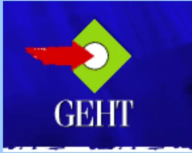
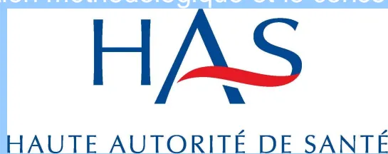

## RECOMMANDATIONS PROFESSIONNELLES

# **Prise en charge des surdosages en antivitamines K, des situations à risque hémorragique et des accidents hémorragiques chez les patients traités par antivitamines K en ville et en milieu hospitalier**

**RECOMMANDATIONS**

**Avril 2008**

Avec la participation méthodologique et le concours financier de la

L'argumentaire de ces recommandations est téléchargeable sur  
[www.has-sante.fr](http://www.has-sante.fr)

Haute Autorité de Santé  
Service communication  
2 avenue du Stade de France - F 93218 Saint-Denis La Plaine CEDEX  
Tél. :+33 (0)1 55 93 70 00 - Fax :+33 (0)1 55 93 74 00

Ce document a été validé par le Collège de la Haute Autorité de Santé en avril 2008.  
© Haute Autorité de Santé – 2008# Sommaire

<table><tr><td><b>Abréviations.....</b></td><td><b>4</b></td></tr><tr><td><b>Recommandations.....</b></td><td><b>5</b></td></tr><tr><td><b>1 Introduction.....</b></td><td><b>5</b></td></tr><tr><td>1.1 Thème et objectifs des recommandations</td><td>5</td></tr><tr><td>1.2 Patients concernés</td><td>6</td></tr><tr><td>1.3 Professionnels concernés</td><td>6</td></tr><tr><td><b>2 Conduite à tenir en cas de surdosage asymptomatique .....</b></td><td><b>6</b></td></tr><tr><td>2.1 Mode de prise en charge</td><td>6</td></tr><tr><td>2.2 Mesures thérapeutiques permettant de corriger le surdosage</td><td>6</td></tr><tr><td>2.3 A faire dans tous les cas</td><td>7</td></tr><tr><td><b>3 Conduite à tenir en cas d'hémorragies spontanées ou traumatiques .....</b></td><td><b>7</b></td></tr><tr><td>3.1 Comment classer les hémorragies en fonction de leur gravité ?</td><td>7</td></tr><tr><td>3.2 Conduite à tenir en cas d'hémorragie non grave</td><td>8</td></tr><tr><td>3.3 Médicaments utilisables en cas d'hémorragie grave</td><td>8</td></tr><tr><td>3.4 Conduite à tenir en cas d'hémorragie grave</td><td>8</td></tr><tr><td>3.5 Conduite à tenir chez le patient victime d'un traumatisme</td><td>9</td></tr><tr><td>3.6 Réintroduction des AVK après une hémorragie grave</td><td>10</td></tr><tr><td><b>4 Conduite à tenir vis-à-vis du traitement par AVK en cas de chirurgie ou d'acte invasif .....</b></td><td><b>10</b></td></tr><tr><td>4.1 Procédures qui peuvent être réalisées sans interrompre les AVK</td><td>10</td></tr><tr><td>4.2 Situations qui imposent un relais par une héparine, si l'interruption des AVK est nécessaire pour un acte programmé</td><td>11</td></tr><tr><td>4.3 Modalités du relais par une héparine, si nécessaire, en cas d'acte programmé</td><td>12</td></tr><tr><td>4.4 Prise en charge pour un acte programmé en fonction de l'indication du traitement anticoagulant</td><td>13</td></tr><tr><td>4.5 Prise en charge préopératoire du patient pour une chirurgie ou un acte invasif urgent à risque hémorragique</td><td>15</td></tr><tr><td><b>Annexe 1. Risque hémorragique des actes invasifs de rhumatologie.....</b></td><td><b>16</b></td></tr><tr><td><b>Annexe 2. Exemple de relais préopératoire AVK-héparine en vue d'un acte chirurgical programmé.....</b></td><td><b>17</b></td></tr><tr><td><b>Annexe 3. Gradation des recommandations.....</b></td><td><b>18</b></td></tr><tr><td><b>Participants .....</b></td><td><b>19</b></td></tr><tr><td><b>Fiche descriptive .....</b></td><td><b>21</b></td></tr></table>## Abréviations

<table><tr><td>ACFA</td><td>arythmie complète par fibrillation auriculaire</td></tr><tr><td>AMM</td><td>autorisation de mise sur le marché</td></tr><tr><td>AVK</td><td>antivitamine K</td></tr><tr><td>CCP</td><td>concentré de complexe prothrombinique</td></tr><tr><td>CHADs</td><td><i>cardiac failure, hypertension, âge, diabetes, stroke</i> (score CHADs)</td></tr><tr><td>FA</td><td>fibrillation auriculaire</td></tr><tr><td>HBPM</td><td>héparine de bas poids moléculaire</td></tr><tr><td>HIC</td><td>hémorragie intracrânienne</td></tr><tr><td>HNF</td><td>héparine non fractionnée</td></tr><tr><td>INR</td><td><i>International Normalized Ratio</i></td></tr><tr><td>PAM</td><td>pression artérielle moyenne</td></tr><tr><td>PAS</td><td>pression artérielle systolique</td></tr><tr><td>PVM</td><td>prothèse valvulaire mécanique</td></tr><tr><td>MTEV</td><td>maladie thrombo-embolique veineuse</td></tr><tr><td>RCP</td><td>résumé des caractéristiques du produit</td></tr><tr><td>SC</td><td>sous-cutané</td></tr></table># Recommandations

## 1 Introduction

Ces recommandations professionnelles ont été élaborées à l'initiative du Groupe d'étude sur l'hémostase et la thrombose (promoteur) et avec les sociétés savantes ou collèges cités en fin de document, en partenariat avec la Haute Autorité de Santé et suivant sa méthode de travail1. L'Agence française de sécurité sanitaire des produits de santé a participé à la rédaction et à la relecture des recommandations.

### 1.1 Thème et objectifs des recommandations

#### ► Situations entrant dans le cadre des recommandations

Environ 600 000 patients sont traités par un antivitamine (AVK) en France chaque année (environ 1 % de la population). Trois types de situations ont été retenus comme devant faire l'objet de recommandations :

- • **les surdosages asymptomatiques** : c'est une situation fréquente (15 à 30 % des contrôles d'INR, suivant les études). Quelle que soit l'indication, l'intensité de coagulation effective apparaît comme un facteur de risque hémorragique lorsque l'INR est au-delà de 4. Cette situation exige une correction, avec l'objectif de retour rapide en zone thérapeutique, suivant des modalités qui font l'objet des recommandations ;
- • **la survenue d'une hémorragie, spontanée ou traumatique, associée ou non à un surdosage** : d'après une enquête réalisée en 1998 par le réseau des centres régionaux de pharmacovigilance sur un échantillon représentatif de services de médecine et spécialités médicales des hôpitaux publics, les accidents hémorragiques des AVK viennent au 1er rang des accidents iatrogènes, avec 13 % des hospitalisations pour effets indésirables médicamenteux, soit environ 17 000 hospitalisations par an dues aux complications hémorragiques des AVK. L'argumentaire rapporte les facteurs de risque identifiés de complications hémorragiques. Les recommandations concernent la prise en charge de ces accidents ;
- • **la prise en charge lors d'une chirurgie ou d'un acte invasif** : le risque hémorragique varie suivant le type de procédure et le terrain. Le risque thrombotique est essentiellement fonction de l'indication du traitement anticoagulant par un AVK. Les différentes modalités, poursuite ou interruption du traitement AVK, relais par un anticoagulant d'action rapide (héparines), font l'objet de recommandations qui représentent un compromis entre ces deux risques.

#### ► Objectif des recommandations

L'objectif principal est de réduire la morbi-mortalité des accidents liés aux AVK, grâce à la diffusion de stratégies de prise en charge des situations à risque ou des accidents hémorragiques.

Les questions traitées sont :

- • Quel doit être le mode de prise en charge en cas de surdosage asymptomatique ?
- • Quelles sont les mesures thérapeutiques permettant de corriger le surdosage ?
- • Comment classer les hémorragies en fonction de leur gravité ?
- • Quelle est la conduite à tenir en cas d'hémorragie non grave ?

---

1 Cf. Guide méthodologique « Les recommandations pour la pratique clinique – Base méthodologique pour leur réalisation en France » (Anaes, 1999) téléchargeable sur [www.has-sante.fr](http://www.has-sante.fr)- • Quels sont les médicaments utilisables en cas d'hémorragie grave ?
- • Quelle est la conduite à tenir en cas d'hémorragie grave ?
- • Quelle est la conduite à tenir chez le patient victime d'un traumatisme ?
- • Comment réintroduire les AVK après une hémorragie grave lorsque le saignement est contrôlé, si l'indication est maintenue ?
- • Dans le cas d'un acte chirurgical ou invasif, quelles sont les procédures qui peuvent être réalisées sans interrompre les AVK ?
- • Si l'interruption des AVK est nécessaire pour un acte programmé, quelles sont les situations qui imposent un relais par une héparine ?
- • Quelles sont, pour un acte programmé, les modalités du relais périopératoire par une héparine, si celui-ci est nécessaire ?
- • Quelle est la prise en charge en cas d'acte programmé, selon l'indication du traitement anticoagulant ?
- • Quelle est la prise en charge préopératoire pour une chirurgie ou un acte invasif urgent à risque hémorragique ?

## 1.2 Patients concernés

Tous les patients qui reçoivent un traitement par AVK.

## 1.3 Professionnels concernés

Médecins traitants, biologistes, infirmières, médecins des services d'accueil des urgences et de toute discipline amenés à prendre en charge des patients traités un AVK (chirurgiens, anesthésistes-réanimateurs, etc.) en milieu hospitalier ou en ville, ainsi que les médecins des disciplines intervenant dans l'indication du traitement anticoagulant (cardiologues, chirurgiens cardio-vasculaires, médecins vasculaires, internistes, etc.).

# 2 Conduite à tenir en cas de surdosage asymptomatique

## 2.1 Mode de prise en charge

Dans le cadre de la prise en charge d'un surdosage asymptomatique, il est recommandé de privilégier une prise en charge ambulatoire, si le contexte médical et social le permet.

L'hospitalisation est préférable s'il existe un ou plusieurs facteurs de risque hémorragique individuel (âge, antécédent hémorragique, comorbidité).

L'absence d'hospitalisation impose de bien informer le patient et son entourage :

- • de l'existence d'un risque hémorragique à court terme ;
- • des signes d'alerte : la constatation d'un saignement, même minime, ou tout symptôme nouveau doit conduire à une consultation médicale dans les plus brefs délais.

## 2.2 Mesures thérapeutiques permettant de corriger le surdosage

Quel que soit le mode de prise en charge, les mesures du tableau 1 sont recommandées.**Tableau 1.** Mesures correctrices recommandées en cas de surdosage en AVK, en fonction de l'INR mesuré et de l'INR cible.

<table border="1">
<thead>
<tr>
<th rowspan="2">INR Mesuré</th>
<th colspan="2">Mesures correctrices</th>
</tr>
<tr>
<th>INR cible 2,5 (fenêtre entre 2 et 3)</th>
<th>INR cible <math>\geq 3</math> (fenêtre 2,5 – 3,5 ou 3 – 4,5)</th>
</tr>
</thead>
<tbody>
<tr>
<td>INR &lt; 4</td>
<td>
<ul>
<li>pas de saut de prise</li>
<li>pas d'apport de vitamine K</li>
</ul>
</td>
<td></td>
</tr>
<tr>
<td>4 <math>\leq</math> INR &lt; 6</td>
<td>
<ul>
<li>saut d'une prise</li>
<li>pas d'apport de vitamine K</li>
</ul>
</td>
<td>
<ul>
<li>pas de saut de prise</li>
<li>pas d'apport de vitamine K</li>
</ul>
</td>
</tr>
<tr>
<td>6 <math>\leq</math> INR &lt; 10</td>
<td>
<ul>
<li>arrêt du traitement par AVK</li>
<li>1 à 2 mg de vitamine K par voie orale (1/2 à 1 ampoule buvable forme pédiatrique) (grade A2)</li>
</ul>
</td>
<td>
<ul>
<li>saut d'une prise</li>
<li>un avis spécialisé (ex. cardiologue si le patient est porteur d'une prothèse valvulaire mécanique) est recommandé pour discuter un traitement éventuel par 1 à 2 mg de vitamine K par voie orale (1/2 à 1 ampoule buvable forme pédiatrique)</li>
</ul>
</td>
</tr>
<tr>
<td>INR <math>\geq 10</math></td>
<td>
<ul>
<li>arrêt du traitement par AVK</li>
<li>5 mg de vitamine K par voie orale (1/2 ampoule buvable forme adulte) (grade A)</li>
</ul>
</td>
<td>
<ul>
<li>un avis spécialisé sans délai ou une hospitalisation est recommandé</li>
</ul>
</td>
</tr>
</tbody>
</table>

### 2.3 A faire dans tous les cas

La cause du surdosage doit être recherchée et prise en compte dans l'adaptation éventuelle de la posologie.

Un contrôle de l'INR doit être réalisé le lendemain.

En cas de persistance d'un INR supratherapeutique, les recommandations précédentes (cf. tableau 1) restent valables et doivent être reconduites.

La surveillance ultérieure de l'INR doit se calquer sur celle habituellement réalisée lors de la mise en route du traitement3.

## 3 Conduite à tenir en cas d'hémorragies spontanées ou traumatiques

### 3.1 Comment classer les hémorragies en fonction de leur gravité ?

**Une hémorragie grave, ou potentiellement grave, dans le cadre d'un traitement par AVK est définie par la présence d'au moins un des critères suivants :**

- hémorragie extériorisée non contrôlable par les moyens usuels ;
- instabilité hémodynamique : PAS < 90 mmHg ou diminution de 40 mmHg par rapport à la PAS habituelle, ou PAM < 65 mmHg, ou tout signe de choc ;
- nécessité d'un geste hémostatique urgent : chirurgie, radiologie interventionnelle, endoscopie ;

2 Cf. Gradation des recommandations en annexe 3.

3 Voir sur le site de l'Afssaps le dossier « Les médicaments antivitamine K » à l'adresse suivante : <http://afssaps.sante.fr/htm/10/avk/sommaire.htm>- • nécessité de transfusion de culots globulaires ;
- • localisation menaçant le pronostic vital ou fonctionnel, par exemple :
  - › hémorragie intracrânienne et intraspinale,
  - › hémorragie intraoculaire et rétro-orbitaire,
  - › hemothorax, hémopericarde, hémopéricarde,
  - › hématome musculaire profond et/ou syndrome de loge,
  - › hémorragie digestive aiguë,
  - › hémarthrose.

S'il n'existe aucun de ces critères, l'hémorragie est qualifiée de non grave.

### **3.2 Conduite à tenir en cas d'hémorragie non grave**

Une prise en charge ambulatoire par le médecin traitant est recommandée si :

- • l'environnement médico-social du patient le permet ;
- • le type d'hémorragie le permet (ex. épistaxis rapidement contrôlable, etc.).

La mesure de l'INR en urgence est recommandée.

En cas de surdosage, les mêmes mesures de correction de l'INR que celles décrites précédemment (chapitre 2) sont recommandées.

Dans tous les cas, la prise en charge ultérieure dépend du type d'hémorragie et de la réponse aux premières mesures hémostatiques. L'absence de contrôle de l'hémorragie (durée, reprise, etc.) par les moyens usuels peut être considérée comme un critère de gravité, et est à ce titre une indication de prise en charge hospitalière pour une antagonisation rapide.

La recherche de la cause du saignement doit être réalisée.

### **3.3 Médicaments utilisables en cas d'hémorragie grave**

La vitamine K et les concentrés de complexes prothrombiniques (CCP, aussi appelés PPSB, dont les deux spécialités commercialisées en France en avril 2008 sont Kaskadil® et Octaplex®) sont les moyens médicamenteux les plus appropriés. Les posologies des CCP sont exprimées en unités de facteur IX et celles de la vitamine K en mg.

Sauf en cas d'indisponibilité d'un CCP, il est recommandé de ne pas utiliser le plasma dans le seul but d'antagonisation des effets des AVK (grade B).

Il est recommandé de ne pas utiliser le facteur VII activé recombinant (eptacog alpha, disponible en avril 2008 sous le nom NovoSeven®) dans le but d'antagonisation des effets des AVK (grade C).

### **3.4 Conduite à tenir en cas d'hémorragie grave**

Une hémorragie grave nécessite une prise en charge hospitalière. L'existence de procédures organisationnelles pluridisciplinaires améliore la rapidité et la qualité de prise en charge (niveau de preuve 3). La formalisation de telles procédures est recommandée.

La nécessité d'un geste hémostatique chirurgical, endoscopique ou endovasculaire, doit être rapidement discutée avec les chirurgiens et les radiologues.

A l'admission du patient, il est recommandé de mesurer l'INR en urgence. La mise en route du traitement ne doit pas attendre le résultat de l'INR, s'il ne peut pas être obtenu rapidement. Si le délai prévisible pour obtenir le résultat est important (au-delà de 30 à 60 min), la réalisation d'un INR par microméthode au lit du patient est recommandée,sous réserve du respect des bonnes pratiques et de la réglementation applicables aux actes de biologie délocalisée.

En cas d'hémorragie grave, la restauration d'une hémostase normale (objectif d'un INR au moins inférieur à 1,5) doit être réalisée dans un délai le plus bref possible (quelques minutes).

Il est recommandé :

- • d'arrêter l'AVK ;
- • d'administrer en urgence du CCP et de la vitamine K (grade C) ;
- • d'assurer simultanément le traitement usuel d'une éventuelle hémorragie massive (correction de l'hypovolémie, transfusion de culots globulaires si besoin, etc.)

En l'absence d'un circuit d'approvisionnement rapide, il est recommandé qu'il existe, en accord avec la pharmacie et dans le respect de la traçabilité, une réserve de quelques flacons de CCP dans les services hospitaliers concernés, notamment les services d'urgences, de réanimation et dans certains blocs opératoires.

### **Les modalités thérapeutiques suivantes sont recommandées :**

- • administration de CCP :
  - ▸ dose utilisée :
    - - si l'INR contemporain de l'hémorragie n'est pas disponible : administrer une dose de 25 UI/kg d'équivalent facteur IX, soit 1 ml/kg dans le cas de l'utilisation de CCP dosés à 25 U/ml de facteur IX (préparations disponibles en France) (grade C),
    - - si l'INR contemporain de l'hémorragie est disponible, la dose suivra les recommandations du résumé des caractéristiques du produit (RCP) de la spécialité utilisée,
  - ▸ vitesse d'injection : la vitesse d'injection intraveineuse préconisée par les fabricants est de 4 ml/min. Toutefois, des données préliminaires indiquent qu'une administration en bolus (3 minutes) permet d'obtenir le même taux de correction (proportion d'INR < 1,5) en seulement 3 minutes (niveau de preuve 4) ;
- • administration de vitamine K : administration concomitante de 10 mg de vitamine K par voie orale ou intraveineuse lente, quel que soit l'INR de départ (grade C) ;
- • contrôles biologiques :
  - ▸ la réalisation d'un INR 30 minutes après administration du CCP est recommandée,
  - ▸ si l'INR reste > 1,5, une administration complémentaire de CCP, adaptée à la valeur de l'INR et en suivant le RCP de la spécialité utilisée, est recommandée,
  - ▸ la mesure de l'INR 6 à 8 heures plus tard, puis quotidiennement pendant la période critique, est recommandée.

## **3.5 Conduite à tenir chez le patient victime d'un traumatisme**

Il est recommandé de mesurer l'INR en urgence et d'adopter la même conduite que celle définie pour les hémorragies spontanées, graves ou non graves, suivant la nature du traumatisme.

En cas de traumatisme crânien, sont recommandées :

- • l'hospitalisation systématique pour surveillance pendant au moins 24 heures ;
- • la réalisation d'un scanner cérébral :
  - ▸ immédiatement s'il existe une symptomatologie neurologique,
  - ▸ dans un délai rapide (4 à 6 heures) dans les autres cas (grade C).### 3.6 Réintroduction des AVK après une hémorragie grave

Si l'indication des AVK est maintenue et lorsque le saignement est contrôlé, un traitement par héparine non fractionnée (HNF) ou héparine de bas poids moléculaire (HBPM) à dose curative (cf. chapitre gestion périopératoire des AVK, relais postopératoire) est recommandé, en parallèle de la reprise des AVK.

Il est recommandé que la réintroduction de l'anticoagulation se déroule en milieu hospitalier, sous surveillance clinique et biologique.

Les modalités sont fonction du siège de l'hémorragie et de l'indication des AVK.

#### ► Dans le cas d'une hémorragie intracrânienne

- • Chez un patient porteur d'une prothèse valvulaire mécanique (PVM) :
  - ▶ l'existence d'une PVM impose la reprise d'une anticoagulation au long cours (grade A) ;
  - ▶ une fenêtre thérapeutique de normocoagulation de 1 à 2 semaines est proposée (grade C) ;
  - ▶ une discussion multidisciplinaire pour fixer la durée de cette fenêtre est souhaitable4.
- • Chez un patient ayant une pathologie thrombo-embolique artérielle (arythmie complète par fibrillation auriculaire [ACFA]) : l'arrêt définitif du traitement anticoagulant en cas d'hémorragie intracrânienne à localisation hémisphérique et d'ACFA non valvulaire est recommandé (grade A).
- • Chez un patient ayant une MTEV :
  - ▶ une fenêtre thérapeutique de normocoagulation de 1 à 2 semaines est proposée (grade C) ;
  - ▶ une discussion multidisciplinaire pour fixer la durée de cette fenêtre est proposée ;
  - ▶ en cas de pathologie thrombo-embolique datant de moins de 1 mois, la mise en place d'un filtre cave est discutée.

#### ► Dans les autres cas d'hémorragies graves

Une fenêtre thérapeutique de 48 à 72 heures, à moduler en fonction du risque thrombo-embolique, est proposée.

La reprise de l'anticoagulation est d'autant plus précoce qu'un geste hémostatique (chirurgical, endoscopique ou endoluminal) a été réalisé et garantit une faible probabilité de récidive.

## 4 Conduite à tenir vis-à-vis du traitement par AVK en cas de chirurgie ou d'acte invasif

### 4.1 Procédures qui peuvent être réalisées sans interrompre les AVK

Certaines chirurgies ou certains actes invasifs, responsables de saignements peu fréquents, de faible intensité ou aisément contrôlés, peuvent être réalisés chez des patients traités par un AVK dans la zone thérapeutique usuelle (INR compris entre 2 et 3). Le traitement par AVK peut alors être poursuivi après avoir vérifié l'absence de surdosage. Toutefois, la prise d'autres médicaments interférant avec l'hémostase, ou

---

4 Le risque thrombotique des PVM en position mitrale, des PVM de 1re génération, ou lorsque le patient est porteur de 2 PVM, est supérieur au risque des PVM en position aortique, mais il n'a jamais été étudié dans un contexte d'hémorragie intracrânienne.l'existence d'une comorbidité, augmente le risque hémorragique et peut conduire à choisir l'interruption de l'AVK.

Ces situations concernent :

- • la chirurgie cutanée (grade C) ;
- • la chirurgie de la cataracte (grade C) ;
- • les actes de rhumatologie de faible risque hémorragique (cf. annexe 1) ;
- • certains actes de chirurgie bucco-dentaire (se rapporter aux recommandations de la Société francophone de médecine buccale et chirurgie buccale : [www.societechirbuc.com](http://www.societechirbuc.com)) ;
- • certains actes d'endoscopie digestive (se rapporter aux recommandations de la Société française d'endoscopie digestive : [www.sfed.org](http://www.sfed.org)).

Dans les autres cas, l'arrêt des AVK ou leur antagonisation en cas d'urgence est recommandé.

La valeur de 1,5 (1,2 en neurochirurgie) peut être retenue comme seuil d'INR en dessous duquel il n'y a pas de majoration des complications hémorragiques périopératoires.

Il est rappelé que les injections sous-cutanées peuvent être réalisées sans interruption des AVK, mais que les injections intramusculaires présentent un risque hémorragique et sont déconseillées.

## **4.2 Situations qui imposent un relais par une héparine, si l'interruption des AVK est nécessaire pour un acte programmé**

Lorsque le risque thrombo-embolique, fonction de l'indication du traitement AVK, est élevé, un relais pré et postopératoire par une héparine à dose curative (HNF ou HBPM sous réserve de leur contre-indication) est recommandé.

Dans les autres cas, le relais postopératoire par une héparine à dose curative est recommandé lorsque la reprise des AVK dans les 24 à 48 heures postopératoires n'est pas possible du fait de l'indisponibilité de la voie entérale.

- • Chez les patients porteurs de PVM cardiaques : le relais pré et postopératoire des AVK par les héparines est recommandé (grade C), quel que soit le type de PVM.
- • Chez les patients en ACFA :
  - ▸ le relais pré et postopératoire des AVK par les héparines est recommandé chez les patients à haut risque thrombo-embolique, défini (niveau de preuve 2) par un antécédent d'accident ischémique cérébral, transitoire ou permanent, ou d'embolie systémique ;
  - ▸ dans les autres cas, l'anticoagulation par AVK peut être interrompue sans relais préopératoire (grade C), mais l'anticoagulation est reprise dans les 24-48 heures postopératoires.
- • Chez les patients ayant un antécédent de MTEV :
  - ▸ le relais pré et postopératoire des AVK par les héparines est recommandé (grade C) chez les patients à haut risque thrombo-embolique, défini par un accident (thrombose veineuse profonde et/ou embolie pulmonaire) datant de moins de 3 mois, ou une maladie thrombo-embolique récidivante idiopathique (nombre d'épisodes  $\geq 2$ , au moins un accident sans facteur déclenchant) ;
  - ▸ dans les autres cas, l'anticoagulation par AVK peut être interrompue sans relais préopératoire (grade C), mais l'anticoagulation est reprise dans les 24 à 48 heures postopératoires.### **4.3 Modalités du relais par une héparine, si nécessaire, en cas d'acte programmé**

#### **► Relais préopératoire**

##### **Arrêt préopératoire des AVK et introduction des héparines à dose curative**

Il est recommandé de mesurer l'INR 7 à 10 jours avant l'intervention :

- • si l'INR est en zone thérapeutique, il est recommandé d'arrêter l'AVK 4 à 5 jours avant l'intervention et de commencer l'héparine à dose curative 48 heures après la dernière prise de fluindione (Previscan®) ou de warfarine (Coumadine®) ou 24 heures après la dernière prise d'acénocoumarol (Sintrom®) ;
- • si l'INR n'est pas en zone thérapeutique, l'avis de l'équipe médico-chirurgicale doit être pris pour moduler les modalités du relais.

Si la procédure de relais n'est pas réalisée dans un parcours de soins coordonné en ville, il est recommandé d'hospitaliser le patient, au plus tard la veille de la chirurgie, pour adapter l'anticoagulation.

La réalisation d'un INR la veille de l'intervention est recommandée. Il est suggéré que les patients ayant un INR supérieur à 1,5 la veille de l'intervention bénéficient de l'administration de 5 mg de vitamine K *per os*. Dans ce cas, un INR de contrôle est réalisé le matin de l'intervention.

##### **Arrêt préopératoire de l'héparinothérapie**

Il est souhaitable que les interventions aient lieu le matin.

L'arrêt préopératoire des héparines est recommandé comme suit :

- • HNF intraveineuse à la seringue électrique: arrêt 4 à 6 heures avant la chirurgie ;
- • HNF sous-cutanée : arrêt 8 à 12 heures avant la chirurgie ;
- • HBPM : dernière dose 24 heures avant l'intervention.

Le contrôle du TCA ou de l'activité anti-Xa le matin de la chirurgie n'est pas nécessaire.

En l'absence de protocole de service, il est proposé un exemple de schéma de prise en charge (cf. annexe 2).

#### **► Relais postopératoire**

##### **Reprise des héparines après l'intervention**

Les héparines doivent être administrées à dose curative dans les 6 à 48 heures postopératoires selon le risque hémorragique et le risque thrombo-embolique.

Il est recommandé de ne pas reprendre les héparines à dose curative avant la 6e heure.

Si le traitement par héparine à dose curative n'est pas repris dès la 6e heure, dans les situations où elle est indiquée, la prévention postopératoire de la MTEV doit être réalisée selon les modalités habituelles.

##### **Reprise des AVK et arrêt des héparines**

En l'absence de risque hémorragique majeur et persistant, il est recommandé de reprendre les AVK dans les 24 premières heures. Sinon, dès que possible après l'intervention.

Il est recommandé de reprendre les AVK aux posologies habituellement reçues par le patient sans dose de charge.Lorsque la voie entérale n'est pas disponible pendant plus de 24 à 48 heures, et en l'absence de risque hémorragique majeur et persistant, il est recommandé de poursuivre en postopératoire l'anticoagulation par l'héparine à dose curative, introduite dans les délais préconisés ci-avant jusqu'à ce que la reprise de l'AVK devienne possible.

Le traitement par héparine est interrompu après 2 INR successifs en zone thérapeutique à 24 heures d'intervalle.

#### **4.4 Prise en charge pour un acte programmé en fonction de l'indication du traitement anticoagulant**

##### **► Patient porteur d'une valve mécanique cardiaque**

Pour les patients traités par AVK pour une PVM, dans le cadre d'une chirurgie ou d'un acte invasif programmé, et en dehors des procédures ne nécessitant pas d'arrêt systématique des antivitaminés K :

- • le relais des AVK par des héparines est recommandé en périopératoire (grade C) ;
- • ce relais peut être effectué par HBPM (hors AMM) à dose curative en deux injections sous-cutanées quotidiennes, par HNF intraveineuse à la seringue électrique, ou par HNF sous-cutanée (2-3 injections/jour) à dose curative. Ces trois options sont possibles (grade B). Les HBPM étudiées dans cette situation sont l'enoxaparine et la dalteparine (niveau de preuve 2) ;
- • en l'absence de données dans la littérature en périopératoire, pour les procédures à risque hémorragique modéré ou élevé, l'utilisation à dose curative d'HBPM en une injection par jour ou du fondaparinux ne peut être recommandée ;
- • les héparines doivent être administrées à dose curative dans les 6 à 48 heures postopératoires, selon le risque hémorragique et le risque thrombo-embolique. Il est recommandé de ne pas reprendre les héparines avant la 6e heure ;
- • si le traitement par héparine à dose curative n'est pas repris à la 6e heure, dans les situations où elle est indiquée, la prévention postopératoire précoce de la MTEV doit être réalisée selon les modalités habituelles.

##### **► Patient traité par AVK pour une arythmie chronique par fibrillation auriculaire (ACFA)**

Pour les patients traités par AVK pour une ACFA, dans le cadre d'une chirurgie ou d'un acte invasif programmé, et en dehors des procédures ne nécessitant pas d'arrêt systématique des antivitaminés K, les recommandations sont les suivantes.

##### **Chez les patients à risque thrombo-embolique élevé**

Un relais préopératoire des AVK par HBPM ou HNF à dose curative est recommandé (grade C), préférentiellement par des HBPM (grade C).

Les héparines doivent être administrées à dose curative dans les 6 à 48 heures postopératoires, selon le risque hémorragique et le risque thrombo-embolique. Il est recommandé de ne pas reprendre les héparines avant la 6e heure.

Si le traitement par héparine à dose curative n'est pas repris à la 6e heure, dans les situations où elle est indiquée, la prévention postopératoire de la MTEV doit être réalisée selon les modalités habituelles.

##### **Chez les patients à risque thrombo-embolique faible ou modéré**

L'anticoagulation par AVK peut être interrompue sans relais préopératoire (grade C).Lorsque la reprise des AVK n'est pas possible dans les 24 à 48 premières heures postopératoires, un relais postopératoire par HBPM ou HNF à dose curative doit être envisagé.

Dans les situations où elle est indiquée, la prévention postopératoire précoce de la MTEV doit être réalisée selon les modalités habituelles.

Dans tous les cas, en l'absence de données de la littérature en périopératoire, pour les procédures à risque hémorragique modéré ou élevé, l'utilisation à dose curative d'HBPM en une injection par jour ou du fondaparinux ne peut être recommandée.

#### ► Patients traités par AVK pour un antécédent de MTEV

Pour les patients traités par AVK pour un épisode thrombo-embolique veineux, dans le cadre d'une chirurgie ou d'un acte invasif programmé, et en dehors des procédures ne nécessitant pas d'arrêt systématique des antivitamines K, les recommandations sont les suivantes.

#### Pour les patients traités par AVK pour un épisode thrombo-embolique veineux à haut risque de récidive

Il est recommandé de différer une chirurgie réglée si cela est possible, au minimum au-delà du 1er mois suivant un épisode thrombo-embolique veineux, de préférence au-delà du 3e mois.

Si la chirurgie a lieu dans le 1er mois après un épisode thrombo-embolique veineux, la mise en place d'un filtre cave en préopératoire doit être discutée (grade C), ainsi que le choix éventuel d'un filtre optionnel.

Un relais préopératoire des AVK par HBPM à dose curative ou par HNF intraveineuse à la seringue électrique ou sous-cutanée (2-3 injections/jour) est recommandé (grade C).

Si en postopératoire le risque hémorragique lié à l'héparinothérapie est considéré comme inacceptable, la mise en place d'un filtre cave en préopératoire doit être discutée. Le choix d'un filtre optionnel est à discuter. La mise en place d'un filtre cave ne dispenserait pas de la reprise d'une anticoagulation à dose curative dès que celle-ci est envisageable.

#### Pour les patients à risque de récidive modéré

L'anticoagulation par AVK peut être interrompue sans relais préopératoire.

Il est recommandé de reprendre les AVK dans les 24 à 48 heures postopératoires.

Lorsque la reprise des AVK n'est pas possible dans ce délai, un relais postopératoire par HBPM ou HNF à dose curative doit être réalisé.

Dans tous les cas :

- • la prévention postopératoire précoce de la MTEV doit être réalisée jusqu'à ce que l'INR soit dans la zone thérapeutique (ou la reprise des héparines à dose curative) ;
- • en l'absence de données de la littérature en périopératoire, l'utilisation du fondaparinux à dose curative ne peut être recommandée ;
- • l'utilisation d'une HBPM à dose curative en 2 injections par jour doit être privilégiée. L'utilisation d'une HBPM en une injection par jour peut être discutée au cas par cas.#### **4.5 Prise en charge préopératoire du patient pour une chirurgie ou un acte invasif urgent à risque hémorragique**

Un acte urgent est défini par sa réalisation indispensable dans un délai qui ne permet pas d'atteindre le seuil hémostatique (objectif d'un INR < 1,5 et 1,2 en cas de neurochirurgie) par la seule administration de vitamine K.

La mesure de l'INR doit être réalisée à l'admission du patient.

L'administration de CCP est recommandée (grade C) suivant les modalités indiquées au paragraphe « conduite à tenir en cas d'hémorragie grave ».

Il est recommandé d'associer 5 mg de vitamine K à l'administration des CCP, sauf si la correction de l'hémostase est nécessaire pendant moins de 4 heures (grade C). L'administration par voie entérale doit être privilégiée, lorsqu'elle est possible (grade A).

La réalisation d'un INR est recommandée dans les 30 minutes suivant l'administration du CCP et avant la réalisation de la chirurgie ou de l'acte invasif. En cas d'INR insuffisamment corrigé, il est recommandé d'administrer un complément de dose de CCP, adapté à la valeur de l'INR suivant les recommandations des RCP du médicament.

La réalisation d'un INR 6 à 8 heures après l'antagonisation est recommandée.

Lorsque l'acte peut être réalisé dans un délai compatible avec la réversion par la seule vitamine K (6 à 24 heures suivant le niveau de l'INR) :

- • l'administration de CCP n'est pas nécessaire ;
- • la vitamine K est administrée à la dose de 5 à 10 mg, si possible par voie entérale ;
- • la mesure de l'INR est répétée toutes les 6 à 8 heures jusqu'à l'intervention.

La prise en charge postopératoire rejoint celle des actes programmés.## Annexe 1. Risque hémorragique des actes invasifs de rhumatologie

<table border="1"><thead><tr><th>TYPE D'ACTE</th><th>Niveau de risque</th></tr></thead><tbody><tr><td>Infiltrations périarticulaires</td><td>3</td></tr><tr><td>Ponction-infiltration simple des articulations périphériques hors coxo-fémorales</td><td>3</td></tr><tr><td>Ponction-infiltration simple des articulations coxo-fémorales</td><td>2</td></tr><tr><td>Infiltration canalaire superficielle</td><td>3</td></tr><tr><td>Infiltration canalaire profonde (cf. Alcock)</td><td>2</td></tr><tr><td>Tenotomie percutanée</td><td>2</td></tr><tr><td>Ponction-infiltration rachidienne cervicale ou lombaire, épidurale ou intradurale</td><td>1</td></tr><tr><td>Ponction-infiltration rachidienne cervicale, foraminale</td><td>1</td></tr><tr><td>Ponction-infiltration rachidienne lombaire, foraminale</td><td>2</td></tr><tr><td>Ponction-infiltration rachidienne articulaire postérieure</td><td>2</td></tr><tr><td>Ponction-infiltration rachidienne dorsale costo-vertébrale</td><td>2</td></tr><tr><td>Lavage articulaire d'une articulation périphérique</td><td>2</td></tr><tr><td>Ponction-trituration de l'épaule</td><td>2</td></tr><tr><td>Biopsie synoviale</td><td>2</td></tr><tr><td>Biopsie osseuse</td><td>2</td></tr><tr><td>Ponction-biopsie discale</td><td>1</td></tr><tr><td>Biopsie des glandes salivaires accessoires</td><td>3</td></tr><tr><td>Cimentoplastie</td><td>1</td></tr><tr><td>Infiltration sacro-iliaque</td><td>2</td></tr><tr><td>Ponction kyste poplité</td><td>2</td></tr><tr><td>Capsulodistension</td><td>2</td></tr><tr><td>Ponction-infiltration sterno-claviculaire</td><td>2</td></tr><tr><td>Ponction-infiltration par le hiatus sacro-coccygien</td><td>2</td></tr><tr><td colspan="2"><b>Cotation :</b></td></tr><tr><td colspan="2"><b>1 = risque élevé</b></td></tr><tr><td colspan="2"><b>2 = risque modéré</b></td></tr><tr><td colspan="2"><b>3 = risque faible</b></td></tr></tbody></table>## Annexe 2. Exemple de relais préopératoire AVK-héparine en vue d'un acte chirurgical programmé

**(INR, déterminé 7 à 10 j avant, dans la fourchette thérapeutique)**

**J-5** : dernière prise de fluindione/warfarine

**J-4** : pas de prise d'AVK

**J-3** : première dose d'HBPM curative sous-cutanée (SC) ou HNF SC le soir

**J-2** : HBPM x 2/j SC ou HNF SC x 2 ou 3/j

**J-1** : hospitalisation systématique

- • HBPM à dose curative le matin de la veille de l'intervention ou HNF SC jusqu'au soir de la veille de l'intervention
- • Ajustement de l'anticoagulation en fonction du bilan biologique : si  $INR \geq 1,5$  la veille de l'intervention, prise de 5 mg de vitamine K *per os*

**J0** : chirurgie## Annexe 3. Gradation des recommandations

Selon le niveau de preuve des études sur lesquelles elles sont fondées, les recommandations ont un grade variable, coté de A à C selon l'échelle proposée par la HAS pour les études thérapeutiques (cf. tableau ci-dessous).

<table border="1"><thead><tr><th colspan="2"><b>Tableau. Gradation des recommandations</b></th></tr><tr><th><b>Niveau de preuve scientifique fourni par la littérature (études thérapeutiques)</b></th><th><b>Grade des recommandations</b></th></tr></thead><tbody><tr><td>
<b>Niveau 1</b>
<ul><li>• Essais comparatifs randomisés de forte puissance</li><li>• Méta-analyse d'essais comparatifs randomisés</li><li>• Analyse de décision basée sur des études bien menées</li></ul></td><td style="text-align: center;"><b>A</b> Preuve scientifique établie</td></tr><tr><td>
<b>Niveau 2</b>
<ul><li>• Essais comparatifs randomisés de faible puissance</li><li>• Études comparatives non randomisées bien menées</li><li>• Études de cohorte</li></ul></td><td style="text-align: center;"><b>B</b> Présomption scientifique</td></tr><tr><td>
<b>Niveau 3</b>
<ul><li>• Études cas-témoins</li></ul></td><td></td></tr><tr><td>
<b>Niveau 4</b>
<ul><li>• Études comparatives comportant des biais importants</li><li>• Études rétrospectives</li><li>• Séries de cas</li></ul></td><td style="text-align: center;"><b>C</b> Faible niveau de preuve</td></tr></tbody></table>

En l'absence d'études, les recommandations sont fondées sur un accord professionnel au sein du groupe de travail réuni par la HAS, après consultation du groupe de lecture. Dans le texte, les recommandations non gradées sont celles qui sont fondées sur un accord professionnel. L'absence de gradation ne signifie pas que les recommandations ne sont pas pertinentes et utiles. Elle doit, en revanche, inciter à engager des études complémentaires.## Participants

### Agence sanitaire, sociétés savantes et associations professionnelles ayant participé à la rédaction des recommandations

Agence française de sécurité sanitaire des produits de santé  
Association pédagogique nationale pour l'enseignement de la thérapeutique  
Groupe d'études sur l'hémostase et la thrombose (demandeur et promoteur)  
Collège national des généralistes enseignants  
Société française d'anesthésie et réanimation  
Société française de cardiologie  
Société française de chirurgie thoracique et cardiaque  
Société française d'endoscopie digestive  
Société nationale française de médecine interne  
Société française de médecine d'urgence  
Société française de médecine vasculaire  
Société française de rhumatologie  
Société de réanimation de langue française

### Comité d'organisation

<table><tbody><tr><td>Pr Pierre Sié, hématologue, Toulouse - président</td><td>Dr Philippe Leger, médecin vasculaire, Toulouse</td></tr><tr><td>Pr Jacques Bouget, médecin urgentiste, Rennes</td><td>Dr Isabelle Mahe, médecin interniste, cardiologue, Paris</td></tr><tr><td>Dr Thierry Boulain, réanimateur médical, Orléans</td><td>Pr Alain Pavie, chirurgien cardio-vasculaire et thoracique, Paris</td></tr><tr><td>Dr Anne Castot, Afssaps, Saint-Denis</td><td>Mlle Agnès Pelladeau, représentante associative, La Celle-les-Bordes</td></tr><tr><td>Dr Nathalie Dumarcet, Afssaps, Saint-Denis</td><td>Pr Pierre-Marie Roy, médecin urgentiste, Angers</td></tr><tr><td>Dr Philippe-Louis Druais, médecin généraliste, Paris</td><td>Pr Charles-Marc Samama, anesthésiste-réanimateur, Paris</td></tr><tr><td>Pr Yves Gruel, hématologue, Tours</td><td></td></tr><tr><td>Pr Gérard Helft, cardiologue, Paris</td><td></td></tr><tr><td>Pr Dominique Huas, médecin généraliste, Vendôme</td><td></td></tr><tr><td>Pr Bernard lung, cardiologue, Paris</td><td></td></tr><tr><td>Dr Jean-Pierre Laroche, médecin vasculaire, Montpellier</td><td></td></tr></tbody></table>

### Groupe de travail

Pr Gilles Permod, médecin vasculaire, Grenoble – président  
Dr Philippe Blanchard, chef de projet, HAS, Saint-Denis  
Dr Anne Godier, anesthésiste-réanimateur, Paris - chargée de projet  
Dr Claire Gozalo, pharmacologue, Reims - chargée de projet  
Dr Benjamin Tremey, anesthésiste-réanimateur, Suresnes - chargé de projet

<table><tbody><tr><td>Dr Pierre Albaladejo, anesthésiste-réanimateur, Créteil</td><td>Dr Francis Couturaud, pneumologue, Brest</td></tr><tr><td>Dr Pascal d'Azemar, médecin généraliste, Paris</td><td>Pr Charles de Riberolles, chirurgien cardio-vasculaire, Clermont-Ferrand</td></tr><tr><td>Pr Gilles Berrut, gériatre, Nantes</td><td>Pr Ludovic Drouet, hématologue, Paris</td></tr><tr><td>Pr Jean-Luc Bosson, médecin vasculaire, Grenoble</td><td>Dr Christian Faugère, médecin généraliste, Pessac</td></tr><tr><td>Dr Laurent Calvel, médecin urgentiste, Strasbourg</td><td>Pr Émile Ferrari, cardiologue, Nice</td></tr><tr><td>Pr Jean-Pierre Carteaux, chirurgien cardiovasculaire et thoracique, Nancy</td><td>Pr Pascale Gaussem, hématologue, Paris</td></tr><tr><td></td><td>Pr Claude Gervais, réanimateur médical, Nîmes</td></tr></tbody></table>Prise en charge des surdosages, des situations à risque hémorragique et des accidents hémorragiques chez les patients traités par antivitamines K en ville et en milieu hospitalier

---

Pr Françoise Haramburu, pharmacologue, Bordeaux  
Dr Bénédicte Hay, Afssaps, Saint-Denis  
Pr Brigitte Ickx, anesthésiste-réanimateur, Bruxelles  
Pr Patrick Jego, médecin interniste, Rennes  
Dr Frédéric Lapostole, anesthésiste-réanimateur, médecin urgentiste, Bobigny  
Dr Dominique Lasne, hématologue, Paris  
Dr Grégoire Le Gal, médecin interniste, Brest  
Pr Thomas Lecompte, hématologue, Nancy  
Pr Anne Long, médecin vasculaire, Reims  
Pr Emmanuel Marret, anesthésiste-réanimateur, Paris  
Dr Marc-Antoine May, anesthésiste-réanimateur, Tours  
Pr Guy Meyer, pneumologue, Paris

Pr Olivier Montagne, thérapeute, Créteil  
Pr Serge Motte, médecin vasculaire, Bruxelles  
Mme Emmanuelle Nozieres, infirmière, Grenoble  
Dr Florence Parent, pneumologue, Clamart  
Dr Eric Pautas, gériatre, Paris  
Dr Catherine Rey-Quino, Afssaps, Saint-Denis  
Pr Christian Riché, pharmacologue, Brest  
Dr Virginie Siguret, hématologue, Paris  
Pr Annick Steib, anesthésiste-réanimateur, Strasbourg  
Dr Sophie Susen, hématologue, Lille  
Dr Karim Tazeroute, médecin urgentiste, Melun  
Dr Bernard Viguié, anesthésiste-réanimateur, Paris

## Groupe de lecture

Dr Nadine Ajzenberg, hématologue, Paris  
Pr Michel Andrejak, pharmacologue, Amiens  
Dr Gérard Audibert, anesthésiste-réanimateur, Nancy  
Pr Jean-François Bergmann, médecin interniste, Paris  
Dr Normand Blais, hématologue et oncologue médical, Montréal  
Pr Nicolas Bruder, anesthésiste-réanimateur, Marseille  
Dr Alessandra Bura-Rivière, médecin vasculaire, Toulouse  
Dr Alain Cariou, thérapeute, Paris  
Dr Claire Cazalets-Lacoste, médecin interniste, Rennes  
M Jean-Claude Colombani, biologiste, Romans  
Pr Philippe de Moerloose, hématologue, Genève  
Dr Mathieu Debray, gériatre, Annecy  
Dr Richard Fabre, biologiste, Toulouse  
Pr Jean-Marie Fauvel, cardiologue, Toulouse  
Dr Sophie Fernandez, médecin urgentiste et réanimateur médical, Toulouse  
Pr François Fourrier, médecin urgentiste, Lille  
Dr Philippe Girard, pneumologue, Paris  
Dr Isabelle Gouin-Thibault, hématologue, Paris  
Dr Benoît Guillet, hématologue, Rennes  
Dr Marie-Hélène Horellou, hématologue, Paris

Dr Marie-Françoise Hurtaud-Roux, hématologue, Paris  
Pr Gérard Janvier, anesthésiste-réanimateur, Bordeaux  
Dr Philippe Lacroix, médecin vasculaire, Limoges  
Dr Karine Lacut, thérapeute, Brest  
Dr Catherine Lamy, neurologue, Paris  
Dr Sylvie Laporte, méthodologiste, Saint-Etienne  
Dr Véronique Le Cam-Duchez, hématologue, Rouen  
Dr Annick Legras, réanimateur médical, Tours  
Pr Patrick Mismetti, pharmacologue clinique, Saint-Etienne  
Dr Philippe Moinard, biologiste, Toulouse  
Pr Gilles Montalescot, cardiologue, Paris  
Pr Philippe Nguyen, hématologue, Reims  
Pr Robert Nicodème, médecin généraliste, Toulouse  
Dr Jean-François Pinel, neurologue, Rennes  
Pr Vincent Piriou, anesthésiste-réanimateur, Lyon  
Pr Raymond Roudot, cardiologue, Bordeaux  
Pr Jean-François Schved, hématologue, Montpellier  
Dr Michel Sellin, anesthésiste-réanimateur, Rennes  
Mme Marie Toussaint-Hacquard, pharmacienne, Nancy  
Pr André Vincentelli, chirurgien cardiovasculaire, Lille  
Pr Denis Wahl, médecin interniste, Nancy## Fiche descriptive

<table border="1">
<tr>
<td><b>TITRE</b></td>
<td>Prise en charge des surdosages en antivitamines K, des situations à risque hémorragique et des accidents hémorragiques chez les patients traités par antivitamines K, en ville et en milieu hospitalier</td>
</tr>
<tr>
<td><b>Méthode de travail</b></td>
<td>Recommandations pour la pratique clinique</td>
</tr>
<tr>
<td><b>Objectif(s)</b></td>
<td>Réduire la fréquence des accidents hémorragiques en cas de traitement par AVK Réduire la fréquence et la durée des périodes où l'INR est en dehors de la zone thérapeutique</td>
</tr>
<tr>
<td><b>Professionnel(s) concerné(s)</b></td>
<td>Tous les médecins amenés à prescrire ou suivre un traitement par AVK, ou amenés à prendre en charge les patients en état de surdosage asymptomatique, d'hémorragie ou de risque hémorragique sous AVK Infirmiers, biologistes</td>
</tr>
<tr>
<td><b>Demandeur</b></td>
<td>Groupe d'étude sur l'hémostase et la thrombose (GEHT)</td>
</tr>
<tr>
<td><b>Promoteur</b></td>
<td>GEHT, avec le partenariat méthodologique et le concours financier de la Haute Autorité de Santé (HAS)</td>
</tr>
<tr>
<td><b>Financement</b></td>
<td>Fonds publics</td>
</tr>
<tr>
<td><b>Pilotage du projet</b></td>
<td>Coordination Pr Pierre Sié, hématologue, Toulouse – GEHT – président du comité d'organisation Dr Philippe Blanchard, chef de projet, service des bonnes pratiques professionnelles de la HAS (chef de service : Dr Patrice Dosquet) Secrétariat : Mlle Laetitia Cavalière, HAS. Recherche documentaire : Mlle Gaëlle Fanelli, avec l'aide de Mme Julie Mohkbi, service de documentation de la HAS (chef de service : Mme Frédérique Pagès)</td>
</tr>
<tr>
<td><b>Participants</b></td>
<td>Sociétés savantes, comité d'organisation, groupe de travail (président : Pr Gilles Pernod, médecin de médecine vasculaire, Grenoble), groupe de lecture : cf . liste des participants. Les participants au comité d'organisation et au groupe de travail ont communiqué leur déclaration d'intérêts à la HAS.</td>
</tr>
<tr>
<td><b>Recherche documentaire</b></td>
<td>Recherche systématique, sans limite inférieure, jusqu'au 30 juin 2006, puis recherche ciblée jusqu'au 31 octobre 2007.</td>
</tr>
<tr>
<td><b>Auteurs de l'argumentaire</b></td>
<td>Dr Anne Godier, anesthésiste-réanimateur, Paris Dr Claire Gozalo, pharmacologue, Reims Dr Benjamin Tremey, anesthésiste-réanimateur, Suresnes</td>
</tr>
<tr>
<td><b>Validation HAS</b></td>
<td>Avis de la commission <i>Évaluation des stratégies de santé</i> de la HAS Validation par le Collège de la HAS en avril 2008</td>
</tr>
<tr>
<td><b>Autres formats</b></td>
<td>Synthèse des recommandations et argumentaire scientifique téléchargeables sur <a href="http://www.has-sante.fr">www.has-sante.fr</a></td>
</tr>
<tr>
<td><b>Documents d'accompagnement</b></td>
<td>Document d'information à l'intention des médecins généralistes</td>
</tr>
</table>