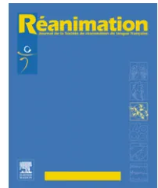

Disponible en ligne sur  
 ScienceDirect  
www.sciencedirect.com

Elsevier Masson France  
EM|consulte  
www.em-consulte.com

## RAPPORTS D'EXPERTS

**Prise en charge en situation d'urgence et en réanimation des états de mal épileptiques de l'adulte et de l'enfant (nouveau-né exclu). Recommandations formalisées d'experts sous l'égide de la Société de réanimation de langue française☆**

**Emergency and intensive care unit management of status epilepticus in adult patients and children (new-born excluded). Société de réanimation de langue française experts recommendations**

**H. Outina,\*, T. Blancb, I. Vinatierc, le groupe d'experts1**

a Service de réanimation médicochirurgicale, CHI Poissy-St-Germain-en-Laye, 10, rue du Champ-Gaillard, BP 3082, 78303 Poissy cedex, France

b Service de pédiatrie néonatale et réanimation, hôpital Charles-Nicolle, CHU hôpitaux de Rouen, 1, rue de Germont, 76031 Rouen cedex, France

c Service de réanimation polyvalente, CHD Les Oudairies, 85925 La-Roche-Sur-Yon cedex 9, France

Disponible sur Internet le 26 juillet 2008

☆ Avec la participation du Groupe francophone de réanimation et urgences pédiatriques (GFRUP) et de la Société française d'urgences (SFMU).

\* Auteur correspondant.

Adresse e-mail : [outin@chi-poissy-st-germain.fr](mailto:outin@chi-poissy-st-germain.fr) (H. Outin).

1 Comité d'organisation : organisateurs délégués : T. Blanc (Rouen), I. Vinatier (La-Roche-Sur-Yon) coordinateur d'experts : H. Outin (Poissy). Groupe d'experts : B. Clair (Garches), A. Crespel (Montpellier), P. Convers (St-Étienne), S. Demeret (Paris), S. Dupont (Paris), N. Engrand (Paris), C. Fischer (Lyon), P. Gélisse (Montpellier), P. Hubert (Paris), J.-X. Mazoit (Le Kremlin Bicêtre), V. Navarro (Paris), D. Parain (Rouen), A. Rossetti (Lausanne), F. Santoli (Aulnay-sous-Bois), K. Tazarourte (Melun), P. Thomas (Nice), D. Savary (Annecy), L. Vallée (Lille). Commission des référentiels et de l'évaluation de la SRLF. H. Gastinne, G. Capellier, L. Donetti, I. Auriant, D. Barnoud, T. Blanc, A. Cariou, A. Cravoisy-Popovic, L. Dupic, C. Gervais, C. Girault, C. Gouzes, F. Jacobs, P. Mateu, P. Meyer, M. Monchi, D. Orlkowski, J.-C. Raphael, P. Sauder, T. Van der Linden, I. Verheyde, I. Vinatier.## Introduction et présentation de la méthodologie des recommandations d'experts de la société de réanimation de langue française (SRLF)

Ces recommandations sont le résultat du travail d'un groupe d'experts réunis par la SRLF. Ces experts ont élaboré des textes argumentaires pour chacun des dix champs d'application qui avaient été définis par le comité d'organisation. Un champ supplémentaire a été dédié aux spécificités pédiatriques. À partir de ces argumentaires, les experts ont également proposé des recommandations pour chaque champ d'application. Ces recommandations ont été dans un second temps soumises au vote de l'ensemble des experts. Les propositions de recommandations ont été présentées et discutées une à une, chaque expert (ou sous-groupe d'experts) devant justifier le fond et la forme des propositions qui le concernent, l'un et l'autre pouvant être modifiés selon les remarques apportées.

Le but n'est pas d'aboutir obligatoirement à un avis unique et convergent des experts sur l'ensemble des propositions, mais de dégager clairement les points de concordance, base des recommandations, et les points de discorde ou d'indécision, base d'éventuels travaux ultérieurs. Chaque recommandation a été cotée par chacun des experts selon la méthodologie dérivée de la RAND/UCLA, à deux tours de cotation après élimination des valeurs extrêmes (experts déviants). Chaque expert a coté à l'aide d'une échelle continue graduée de 1 à 9 (1 signifie l'existence d'un « désaccord complet » ou d'une « absence totale de preuve » ou d'une « contre-indication formelle » et 9 celle d'un « accord complet » ou d'une « preuve formelle » ou d'une « indication formelle »). Trois zones ont ainsi été définies en fonction de la place de la médiane : la zone (1–3) correspond à la zone de « désaccord » ; la zone (4–6) correspond à la zone « d'indécision » ; la zone (7–9) correspond à la zone « d'accord ». L'accord, le désaccord, ou l'indécision est dit « fort » si l'intervalle de la médiane est situé à l'intérieur d'une des trois zones (1–3), (4–6) ou (7–9). L'accord, le désaccord ou l'indécision est dit « faible » si l'intervalle de médiane empiète sur une borne (intervalle [1–4] ou intervalle [6–8] par exemple).

## Champ 1 : épidémiologie, retentissement cérébral, définitions, formes cliniques, et classification de l'état de mal épileptique (EME)

### Épidémiologie et retentissement cérébral

L'incidence annuelle des EME convulsifs et non convulsifs est comprise entre 10 et 41 pour 100 000 habitants. L'incidence est plus élevée chez l'enfant et chez les adultes de plus de 60 ans. La prise en compte injustifiée dans certaines études épidémiologiques de tableaux électrocliniques constatés dans l'encéphalopathie post-anoxo-ischémique et pris à tort pour des EME majeure considérablement l'incidence et la mortalité des EME.

Les EME surviennent dans 39 à 50% des cas chez un patient porteur d'une maladie épileptique. Une réci-

dive chez un même patient est observée dans 6 à 13% des cas.

Les crises observées sont le plus souvent partielles évoluant secondairement vers des crises généralisées.

Il existe de nombreuses classifications des états de mal épileptiques (EME) répondant à des problématiques différentes : épidémiologique, descriptive, thérapeutique et physiopathologique. Les EME se traduisent par une grande variété de présentations électro-cliniques, et surviennent dans des contextes étiologiques et physiopathologiques très variés pouvant influencer le pronostic.

Les lésions cérébrales apparaissent expérimentalement chez le primate au bout de 60 à 90 minutes dans l'EME convulsif généralisé. Le retentissement systémique de l'EME convulsif (hypertension puis hypotension, hyperthermie, hypoxie, hyperglycémie puis hypoglycémie, acidose métabolique et parfois mixte) peut majorer le risque de lésions cérébrales.

### Définitions

L'EME est défini, de façon générale, par des crises continues ou par la succession de crises sans amélioration de la conscience sur une période de 30 minutes (*accord fort*).

Du fait de sa gravité, l'EME tonicoclonique généralisé requiert une définition spécifique impliquant une prise en charge plus précoce. Cette définition opérationnelle fait référence à des crises continues ou subintrantes pendant au moins cinq minutes (*accord fort*).

L'EME larvé correspond à l'évolution défavorable d'un EME tonicoclonique généralisé non traité ou traité de façon inadéquate. Il se caractérise par l'atténuation, voire la disparition des manifestations motrices chez un patient comateux contrastant avec la persistance d'un EME électrique (*accord fort*).

Les crises sérielles avec récupération de la conscience antérieure entre les crises peuvent évoluer vers un état de mal mais ne rentrent pas dans la définition de celui-ci (*accord fort*).

Chez l'enfant, les définitions sont les mêmes. L'état de conscience en pédiatrie étant très fluctuant, il est d'autant plus difficile à apprécier que l'enfant est plus jeune (*accord fort*).

### Formes cliniques et classification

On distingue sur un plan clinique les EME convulsifs, dont le diagnostic repose sur les seules données cliniques, des EME non convulsifs, dont le diagnostic plus difficile nécessite la réalisation d'un électroencéphalogramme (EEG) (*accord fort*).

Une classification « opérationnelle » basée sur le pronostic et donc sur le degré d'urgence thérapeutique est indispensable dans la pratique quotidienne (*accord fort*).

La classification opérationnelle proposée prend en compte trois degrés de mise en jeu du pronostic et donc d'urgence thérapeutique (*accord fort*) :

- • EME avec pronostic vital engagé à court terme ;
  - ◦ EME convulsif généralisé tonicoclonique (d'emblée ou secondairement généralisé) (*accord fort*),- ○ EME larvé (*accord fort*),
- ● EME avec pronostic vital et/ou fonctionnel engagé à moyen terme ;
  - ○ EME confusionnel partiel complexe (*accord faible*),
  - ○ EME convulsif focal avec ou sans marche Bravais-Jacksonienne (*accord faible*),
- ● EME n'engageant pas le pronostic vital à court terme ;
  - ○ EME convulsif généralisé myoclonique (*accord faible*),
  - ○ EME absence (*accord faible*),
  - ○ EME à symptomatologie élémentaire donc sans rupture de contact (hallucinations, aphasie ...) (*accord faible*),
  - ○ épilepsie partielle continue (*accord faible*).

Dans le cadre des encéphalopathies épileptiques, chez l'enfant comme chez l'adulte, il faut savoir tolérer les EME toniques (que les benzodiazépines peuvent aggraver), cloniques ou myocloniques et ne pas avoir systématiquement recours à des traitements agressifs (*accord faible*).

## Champ 2 : diagnostic différentiel

Tout patient hospitalisé pour un EME doit être secondairement réévalué par un neurologue, afin de préciser, à distance de l'épisode aigu, le diagnostic positif, syndromique et différentiel de l'EME, et d'adapter les éventuels traitements antiépileptiques (*accord fort*).

### Pseudo état de mal

Face à des manifestations motrices prolongées atypiques suggérant un EME convulsif, il convient systématiquement d'évoquer un pseudo état de mal (origine psychogène) (*accord fort*). Les éléments cliniques faisant évoquer ce diagnostic doivent être connus de tout médecin prenant en charge un EME tonicoclinique : fermeture des yeux, résistance à l'ouverture des yeux, atypie des mouvements et contact possible avec le patient (*accord fort*).

En cas de doute diagnostique, l'EEG (idéalement couplé à un enregistrement vidéo) est utile pour distinguer un EME d'un pseudo état de mal (*accord faible*).

### Mouvements anormaux

En cas de mouvement anormal dont l'origine épileptique est suspectée, chez un patient en réanimation, l'enregistrement d'un EEG devrait comporter au moins une dérivation d'électromyogramme, et doit être au mieux couplé à un enregistrement vidéo simultanément (*accord fort*). La suppression d'un mouvement anormal par l'injection de benzodiazépine ne prouve pas son origine épileptique (*accord fort*).

### Encéphalopathie postanoxique

L'encéphalopathie postanoxique s'accompagne souvent de myoclonies non épileptiques d'importance variable, typiquement à prédominance axiale, parfois déclenchées par des stimulations sonores et tactiles. Elle ne s'accompagne que rarement de crise d'épilepsie voire d'un EME convulsif (*accord fort*).

L'EEG lors d'une encéphalopathie postanoxique montre des anomalies variées, en particulier des pointes périodiques généralisées qui ne doivent pas faire évoquer des crises voire un état de mal. Des myoclonies non épileptiques peuvent être associées ou non à ces anomalies EEG (*accord fort*).

Dans un contexte d'anoxie cérébrale, des pointes périodiques généralisées sur l'EEG, qui ne s'organisent pas en décharge rythmique, et sans symptôme clinique autre qu'un coma, reflètent un trouble de l'électrogénèse corticale et ne doivent pas conduire à un traitement (*accord fort*).

### Particularité chez l'enfant

Le diagnostic différentiel chez l'enfant entre crise d'épilepsie occipitale prolongée et migraine avec aura est parfois difficile (*accord fort*).

## Champ 3 : place de l'électroencéphalogramme

Le traitement d'un EME dont le diagnostic est évident doit débuter sans attendre l'EEG (*accord fort*). Celui-ci devrait idéalement être disponible 24 h/24 pour le diagnostic et le suivi des formes graves (*accord fort*).

Un EEG en urgence est indiqué :

- ● dans les EME convulsifs généralisés sans en retarder la prise en charge thérapeutique initiale (*accord fort*);
- ● en cas de suspicion d'EME non convulsif à expression confusionnelle (*accord fort*);
- ● en cas de doute persistant sur un pseudo état de mal (*accord faible*).

Tout patient hospitalisé pour un EME doit bénéficier d'un EEG le plus tôt possible (*accord fort*).

Un enregistrement EEG standard avec au moins huit voies, et idéalement 21 voies, durant au moins 20 minutes, et au mieux 30 minutes, est l'examen de référence (*accord fort*). Il doit être au mieux couplé à un enregistrement vidéo (*accord faible*). Il permet de confirmer le diagnostic d'EME, d'écarter les diagnostics différentiels, de préciser le cas échéant le diagnostic syndromique voire étiologique, de guider la prise en charge thérapeutique, et de participer au suivi évolutif de l'EME (*accord fort*).

Un test d'injection d'un antiépileptique d'action rapide lors d'un EEG n'est en faveur d'une activité épileptique que s'il corrige les anomalies EEG et améliore cliniquement le patient. Ce test thérapeutique doit se faire en présence d'un médecin (*accord fort*).

L'interprétation de l'EEG doit utiliser un vocabulaire facilement compréhensible et comporter une conclusion qui stipule la présence (ou la persistance) ou non d'un EME (*accord fort*). Il ne s'interprète qu'à la lumière des données cliniques et des différents traitements reçus par le patient (*accord fort*). L'expertise visuelle est plus fiable que les logiciels d'analyse de l'EEG (*accord fort*).

La présence d'anomalies EEG diffuses et périodiques, et a fortiori celle d'ondes triphasiques ne doivent pas faire évoquer le diagnostic d'EME non convulsif, mais plutôt différents types d'encéphalopathies (postanoxique, métabolique, infectieuse, toxique et spongiforme) (*accord fort*).Dans un contexte postanoxique, l'existence de figures épileptiques diffuses (comme des pointes, des polypointes), n'évoluant pas de façon rythmique, en décharge, mais de façon périodique, même si elles sont très fréquentes, ne signe habituellement pas l'existence d'une crise ou d'un EME (*accord fort*).

Chez l'enfant, l'EEG de longue durée (>12 heures) est très utile au diagnostic positif d'EME non convulsif et pour surveiller l'efficacité des traitements (*accord fort*).

## Champ 4 : enquête étiologique et facteurs pronostiques

### Enquête étiologique

La recherche étiologique doit être effectuée rapidement, sans retarder ni la mise en œuvre du traitement antiépileptique ni les manœuvres de réanimation (*accord fort*). Un EME répond souvent à plusieurs étiologies (*accord faible*). Si une étiologie n'est pas diagnostiquée et maîtrisée, elle peut être un facteur d'entretien de l'EME (*accord fort*).

La recherche de certains troubles métaboliques est incontournable (*accord fort*). Une hypoglycémie, une hyponatremie et une hypocalcémie doivent être recherchées et corrigées en urgence (*accord fort*).

Chez le patient épileptique connu :

- • la première cause d'EME est un sevrage de médicaments antiépileptiques relatif ou absolu par non-observance thérapeutique, adjonction d'un traitement inducteur enzymatique ou au cours du changement de médicament antiépileptique (*accord fort*);
- • les principales autres causes sont l'intoxication ou le sevrage alcoolique, la prescription de médicaments proconvulsivants et les infections intercurrentes (*accord faible*);
- • en l'absence de facteur déclenchant évident, en cas de doute étiologique ou d'EME persistant, l'enquête doit être identique à celle réalisée devant un EME inaugural, du fait de l'intrication fréquente des étiologies (*accord fort*).

En cas d'EME inaugural, les principales étiologies sont :

- • les souffrances cérébrales aiguës, qu'elles soient structurelles (méningoencéphalites, accidents vasculaires cérébraux, traumatismes...) ou fonctionnelles (hyponatremie aiguë, intoxications médicamenteuses ou par substances illicites...) (*accord fort*);
- • plus rarement, car dans ces cas le patient peut déjà avoir présenté des crises, les lésions cérébrales subaiguës évolutives (comme les tumeurs, la toxoplasmose cérébrale), les affections dégénératives (*accord faible*) ou les lésions cicatricielles (comme les séquelles d'accident vasculaire cérébral et de traumatisme) (*accord fort*).

Dans moins de 10% des cas, l'enquête est négative (*accord fort*).

Les indications de l'imagerie cérébrale doivent rester larges (*accord fort*). Il faut tenir compte, chez le patient épileptique connu, des circonstances de survenue de l'état de mal (par exemple traumatisme en cours de crise) et

des caractéristiques électrocliniques habituelles des crises (*accord fort*).

L'imagerie cérébrale (scanner cérébral sans et avec injection ou IRM) est indiquée en urgence en tenant compte de l'état neurologique antérieur (*accord fort*) :

- • s'il existe des signes de localisation (*accord fort*);
- • si le début électro-clinique de l'EME est partiel (*accord faible*);
- • si une ponction lombaire est nécessaire (*accord fort*);
- • en cas de notion de traumatisme crânien (*accord fort*);
- • en cas de notion de néoplasie (*accord fort*);
- • en cas de notion d'immunodépression (VIH, corticothérapie...) (*accord fort*);
- • si la cause demeure obscure (*accord fort*).

Une ponction lombaire, en dehors de ses contre-indications, est préconisée dans un contexte infectieux (*accord fort*), en cas d'immunodépression (*accord fort*) et en cas de négativité de la recherche étiologique (*accord faible*). Chez l'adulte et plus encore chez l'enfant, en cas d'état de mal convulsif fébrile, lorsque la ponction lombaire ne peut être réalisée immédiatement, il est recommandé de débuter sans délai par voie veineuse, un traitement antibiotique probabiliste et de l'acyclovir vis-à-vis d'une possible encéphalite herpétique (*accord fort*).

La persistance de l'EME sans étiologie identifiée impose la poursuite des examens, en s'aidant dès que possible des conseils d'un neurologue (*accord fort*).

Chez l'enfant, une hypocalcémie profonde (calcémie ionisée <0,8 mmol/l) ou une hypomagnésémie (<0,5 mmol/l) peuvent être responsables d'un EME ; sa correction par voie veineuse ne sera effectuée qu'après dosage sanguin (*accord faible*).

En l'absence de cause évidente à un EME convulsif chez un nourrisson, une injection de pyridoxine doit être proposée (50 à 100 mg/kg) en milieu de réanimation sous monitoring et enregistrement EEG (*accord fort*).

### Facteurs pronostiques

La mortalité des EME est mieux étudiée que leur morbidité. Elle est comprise entre 8 et 39% des cas (décès survenant dans les 30 premiers jours après le début de l'EME). Elle est principalement déterminée par l'étiologie.

La qualité de la prise en charge améliore le pronostic (*accord fort*).

Le pronostic fonctionnel (séquelles motrices, cognitives, apparition ou aggravation d'une maladie épileptique) est difficile à déterminer indépendamment des facteurs étiologiques sous-jacents et des complications liées à la prise en charge (*accord fort*). Chez l'adulte comme chez l'enfant, les trois principaux déterminants de la mortalité et des séquelles neurologiques d'un EME sont l'âge, sa cause et sa durée (*accord fort*).

Par rapport à des crises épileptiques inaugurales, un EME de novo augmente le risque de développer une épilepsie (*accord fort*).

Le caractère réfractaire d'un EME augmente le risque de mortalité, le risque de récidive d'EME et possiblement celui de développer une maladie épileptique (*accord fort*).Chez l'enfant, le pronostic de l'EME est plus sévère lorsqu'il est fébrile compte tenu du risque de lésions hippocampiques (*accord fort*).

## Champ 5 : prise en charge non spécifique de l'EME convulsif généralisé

La prise en charge symptomatique de l'EME convulsif généralisé est une urgence. Elle nécessite, en préhospitalier, l'intervention d'une équipe médicale d'urgence. L'hospitalisation est systématique. Le transfert en réanimation est indiqué en cas de persistance des crises, du trouble de la vigilance ou de défaillances associées (*accord fort*).

Dans tous les cas, le contrôle des facteurs d'agression cérébrale est impératif, ce d'autant que l'EME est consécutif à des lésions cérébrales aiguës (*accord fort*).

Les mesures de prise en charge immédiate comportent : la mise en position latérale de sécurité, le maintien de la liberté des voies aériennes supérieures, une oxygénation avec pour objectif une  $SpO_2$  supérieure ou égale à 95 %, la mise en place d'une voie veineuse périphérique avec perfusion de sérum physiologique, la mesure de la glycémie capillaire et la correction d'une éventuelle hypoglycémie (*accord fort*).

L'intubation et la ventilation mécanique ne sont pas systématiques d'emblée. Elles sont indiquées en cas de recours à des agents anesthésiques, de détresse respiratoire aiguë ou d'altération profonde et prolongée de la vigilance, malgré l'arrêt des convulsions (*accord fort*). En préhospitalier, la sécurité du transport autorise un délai plus court de recours à la ventilation mécanique (*accord faible*). La technique d'induction anesthésique recommandée est celle de la procédure à séquence rapide. L'utilisation de succinylcholine est recommandée. Les curares de longue durée d'action doivent être évités. Le thiopental, le propofol, ou l'étomidate peuvent être utilisés comme agent d'induction. Le midazolam n'est pas recommandé en induction (*accord fort*).

En préhospitalier, l'entretien d'une sédation chez les patients ventilés est souvent nécessaire. Le midazolam est recommandé et l'adjonction d'un morphinomimétique est utile. Les curares de longue durée d'action doivent être évités afin de ne pas masquer des convulsions (*accord fort*).

En dehors des situations d'hypertension intracrânienne, l'interruption de la sédation est conseillée à l'arrivée du patient en réanimation, afin de faciliter l'évaluation de l'état neurologique et de l'activité épileptique (*accord fort*). Chez le malade intubé et ventilé, le recours à une curarisation ponctuelle peut s'avérer nécessaire pour éliminer les artefacts musculaires sur l'EEG et pour réaliser une ponction lombaire ou une imagerie cérébrale (*accord fort*).

Lorsque la sédation et la ventilation restent nécessaires, l'objectif est d'obtenir une normoxie et une normocapnie (35 à 40 mmHg). La ventilation en hypocapnie est contre-indiquée, y compris en cas d'œdème cérébral (*accord fort*).

Il est recommandé de maintenir une pression artérielle moyenne entre 70 et 90 mmHg (*accord fort*).

La surveillance continue du tracé électrocardiographique et la réalisation dès que possible d'un électrocardiogramme sont indispensables (*accord fort*).

La détection et le traitement d'une hyperthermie font partie intégrante de la prise en charge de l'EME. Les vertus neuroprotectrices de l'hypothermie n'ont pas été confirmées en pratique clinique (*accord fort*).

Le monitoring et le contrôle de la glycémie (en prévenant tout épisode d'hypoglycémie) et celui de la natrémie sont systématiques (*accord fort*). L'acidose métabolique se corrige généralement avec l'arrêt des crises, sans que l'administration de bicarbonates soit nécessaire (*accord fort*).

Chez l'éthylique connu ou suspecté, l'injection de thiamine (vitamine B1 : 100 mg en intraveineux lent) est recommandée (*accord fort*).

En cas d'hypertension intracrânienne potentielle ou avérée (traumatisme crânien, pathologie cérébrale vasculaire, infectieuses, tumorale...), l'EME est considéré comme un véritable facteur d'agression secondaire susceptible d'aggraver l'hypertension intracrânienne (*accord fort*).

Aucune molécule à visée neuroprotectrice ne peut être recommandée actuellement (*accord fort*).

## Champ 6 : médicaments utilisés dans le traitement de l'EME : données pharmacologiques

Le mode d'action et la pharmacocinétique des médicaments utilisables dans l'EME sont développés dans ce chapitre.

Aucune courbe dose-effet n'est disponible, ce qui gêne la comparaison entre les molécules en ce qui concerne l'équipotence. Ainsi, le choix d'un agent et/ou d'une stratégie repose sur une opinion consensuelle d'experts.

## Champ 7 : prise en charge de l'EME convulsif généralisé : stratégies thérapeutiques (Fig. 1)

Un traitement antiépileptique doit être, une fois le diagnostic établi, administré en urgence devant des crises convulsives généralisées continues ou subintrantes persistant au moins cinq minutes (*accord fort*). La pérennisation de l'EME convulsif augmente le risque de lésions cérébrales et induit une pharmacorésistance dont les mécanismes sont mal connus (*accord fort*).

L'EME larvé nécessite une prise en charge immédiate sans attendre l'EEG si l'histoire clinique et les manifestations observées sont évocatrices (*accord fort*).

Dans tous les cas, un monitoring de la fréquence cardiaque et respiratoire, de la pression artérielle et de la saturation en oxygène est mis en place (*accord fort*).

La survenue d'une hypotension ou de troubles du rythme cardiaque impose la diminution du débit de perfusion de l'antiépileptique en cours ou son arrêt (éventuellement transitoire) en fonction de la sévérité (*accord fort*).

## Le schéma thérapeutique initial est le suivant

Quand le patient est pris en charge entre cinq et 30 minutes après le début des convulsions, une benzodiazépine en monothérapie est recommandée par voie intraveineuse lente (en une à deux minutes au moins) (*accord fort*). En cas**EME tonico-clonique généralisé**

**< 30 min**

- clonazépam 0,015 mg/kg → convulsions après 5 min
  - clonazépam 0,015 mg/kg + fosphénytoïne 20 mg/kg → Convulsions 30 min après le début de la fosphénytoïne
    - oui → phénobarbital 15 mg/kg → Convulsions 20 min après le début du phénobarbital
    - non → AG
  - clonazépam 0,015 mg/kg + phénobarbital 15 mg/kg → Convulsions 20 min après le début du phénobarbital
    - oui → fosphénytoïne 20 mg/kg → Convulsions 30 min après le début de la fosphénytoïne
    - non → AG

**> 30 min**

- clonazépam 0,015 mg/kg + fosphénytoïne 20 mg/kg → convulsions après 5 min
  - clonazépam 0,015 mg/kg → Convulsions 30 min après le début de la fosphénytoïne
    - thiopental: bolus (1) 2 mg/kg, bolus (n) 2 mg/kg/5 min. puis 3 à 5 mg/kg/h
    - propofol: bolus (1) 2 mg/kg, bolus (n) 1 mg/kg/5 min. puis 2 à 5 mg/kg/h
  - clonazépam 0,015 mg/kg + phénobarbital 15 mg/kg → convulsions après 5 min
    - clonazépam 0,015 mg/kg → Convulsions 20 min après le début du phénobarbital
      - thiopental: bolus (1) 2 mg/kg, bolus (n) 1 mg/kg/5 min. puis 2 à 5 mg/kg/h
      - propofol: bolus (1) 2 mg/kg, bolus (n) 1 mg/kg/5 min. puis 2 à 5 mg/kg/h
    - clonazépam 0,015 mg/kg → Convulsions 30 min après le début du phénobarbital
      - thiopental: bolus (1) 2 mg/kg, bolus (n) 1 mg/kg/5 min. puis 2 à 5 mg/kg/h
      - propofol: bolus (1) 2 mg/kg, bolus (n) 1 mg/kg/5 min. puis 2 à 5 mg/kg/h

**durée totale de l'EME < 60 min**  
 probabilité faible de lésion cérébrale aiguë  
 pas de facteur incontrôlé d'agression cérébrale  
 pas d'EME larvé

**AG**

**thiopental**  
 bolus (1) 2 mg/kg  
 bolus (n) 2 mg/kg/5 min.  
 puis 3 à 5 mg/kg/h

**propofol**  
 bolus (1) 2 mg/kg  
 bolus (n) 1 mg/kg/5 min.  
 puis 2 à 5 mg/kg/h

**midazolam**  
 bolus (1) 0,1 mg/kg  
 bolus (n) 0,05 mg/kg/5 min.  
 puis 0,05 à 0,6 mg/kg/h

**Fig. 1** Diagramme d'utilisation des médicaments antiépileptiques lors d'un EME tonico-clonique généralisé. EME : état de mal épileptique, AG : anesthésie générale. bolus (1) : bolus initial, bolus (n) : bolus itératifs successifs jusqu'à cessation clinique des convulsions, selon tolérance hémodynamique.

de persistance des convulsions au bout de cinq minutes, on procédera à une seconde injection de la même benzodiazépine, à la même dose, associée à un autre médicament antiépileptique en intraveineux (*accord fort*).

Quand le patient est pris en charge au-delà de 30 minutes après le début des convulsions, une injection de benzodiazépine est effectuée, d'emblée associée à un autre médicament antiépileptique en intra veineux (*accord fort*). En cas de persistance des convulsions, au bout de cinq minutes, on procédera à une seconde injection de la même benzodiazépine à la même dose (*accord fort*).

Le médicament antiépileptique donné en association avec la benzodiazépine sera de la phénytoïne/fosphénytoïne ou du phénobarbital. Le choix tiendra compte de leurs contre-indications, de l'appréciation de leurs risques iatrogènes et de leur rapidité d'action. Dans des situations particulières, le valproate de sodium (qui n'a pas l'AMM dans l'EME) pourra être utilisé (*accord fort*).

Quelle que soit l'évolution des convulsions, y compris une éventuelle cessation, l'intégralité de la dose prescrite doit être administrée (*accord fort*).

Le schéma proposé pour l'EME larvé est celui décrit pour l'EME convulsif évoluant depuis plus de 30 minutes (*accord fort*).

**En cas de persistance des convulsions 20 minutes après le début de la perfusion de phénobarbital ou 30 minutes après le début de la perfusion de phénytoïne ou de fosphénytoïne, on proposera (*accord fort*)**

- Le recours au médicament antiépileptique non utilisé en première intention (phénobarbital après phénytoïne/fosphénytoïne, et vice versa) si toutes les conditions suivantes sont satisfaites (*accord fort*),
  - EME évoluant depuis moins de 60 minutes (*accord fort*),
  - probabilité faible de lésion cérébrale aiguë (*accord fort*),
  - pas de facteur incontrôlé d'agression cérébrale (instabilité hémodynamique, hypoxie, hyperthermie majeure) (*accord fort*),
  - pas d'EME larvé (*accord faible*);- • dans les autres situations, le recours à un traitement par thiopental, midazolam ou propofol, sous couvert d'une assistance respiratoire (*accord fort*).

Le valproate de sodium peut être utilisé dans des situations où la mise en œuvre d'une anesthésie générale avec ventilation mécanique est déraisonnable (limitation de soins) (*accord fort*).

L'attitude qui consiste à administrer un complément de dose de phénytoïne, fosphénytoïne ou phénobarbital ne repose sur aucune donnée clinique validée (*accord fort*).

### Après le contrôle de l'état de mal

Un relais par benzodiazépines par voie entérale (clobazam : 5 à 10 mg × 3 ou clonazépam : 1 à 2 mg × 3) ou parentérale discontinue est indispensable. Ce relais doit être immédiat si l'EME a été contrôlé par une seule dose de diazépam ou de midazolam en raison du risque de récidive à court terme (*accord fort*). Pour l'instauration ou l'adaptation d'un éventuel traitement antiépileptique de fond, un avis spécialisé devra être pris pour choisir le médicament antiépileptique le plus approprié en fonction du type de l'épilepsie et du terrain. Le phénobarbital devrait être évité au long cours (*accord faible*).

### Posologies et modalités d'administration des médicaments antiépileptiques à disposition dans l'EME convulsif non réfractaire

#### Benzodiazépines

La durée d'action prolongée de plusieurs heures du clonazépam amène à privilégier son utilisation en France (*accord fort*). S'il n'est pas disponible, le diazépam sera utilisé (*accord fort*). La posologie du clonazépam est de 0,015 mg/kg, celle du diazépam de 0,15 mg/kg (*accord fort*). Le lorazépam, benzodiazépine d'action prolongée validée dans des essais contrôlés n'est pas disponible en France, sauf dans le cadre de l'ATU (*accord fort*). La posologie du lorazépam est de 0,1 mg/kg (*accord fort*).

Lorsque l'administration de benzodiazépines par voie intraveineuse est impossible, le midazolam en intramusculaire (0,15 mg/kg) ou par voie buccale (0,3 mg/kg) peut être employé (*accord fort*).

#### Phénobarbital

Le phénobarbital est utilisé en intraveineux à la posologie de 15 mg/kg à un débit de perfusion maximum de 100 mg/min (*accord fort*). Il est contre-indiqué chez l'insuffisant respiratoire sévère (*accord fort*). Il induit une dépression de la vigilance, qui peut gêner l'appréciation de l'état neurologique, et une dépression respiratoire modérée (*accord fort*). Le phénobarbital a un délai d'action rapide qui permet de juger en pratique de sa pleine efficacité 20 minutes après le début de la perfusion (*accord fort*).

#### Fosphénytoïne/phénytoïne

La fosphénytoïne (ampoules de 500 mg en équivalents de phénytoïne sodique) est utilisée à la posologie de 20 mg/kg en équivalents de phénytoïne sodique, à un débit de perfu-

sion maximum de 150 mg/min. Ce débit pourra être réduit chez des patients considérés comme fragiles (sujet âgé, coronarien) (*accord fort*).

La phénytoïne (ampoules de 250 mg) est utilisée à la posologie de 20 mg/kg avec un débit de perfusion maximum de 50 mg/min. Ce débit pourra être réduit chez des patients considérés comme fragiles (sujet âgé, coronarien) (*accord fort*).

La phénytoïne et la fosphénytoïne sont contre-indiquées en cas de troubles de la conduction ou de cardiopathie sévère (*accord fort*). La phénytoïne et la fosphénytoïne influent peu sur la vigilance et la fonction respiratoire (*accord fort*). La phénytoïne nécessite un cathéter périphérique de gros calibre et une voie unique. La meilleure tolérance locale et la facilité d'administration de la fosphénytoïne (compatibilité avec les solutés de perfusion et autres médicaments) la font privilégier à la phénytoïne (*accord fort*).

La phénytoïne et la fosphénytoïne, bien qu'administrées à un débit différent (trois fois plus rapide pour la fosphénytoïne), agissent dans le même délai. En pratique, leur pleine efficacité ne pourra être évaluée que 30 minutes après le début de la perfusion (*accord fort*).

#### Valproate de sodium

Le valproate de sodium en intraveineux est indiqué en première intention (associé aux benzodiazépines) à la dose de 25 mg/kg en dose de charge puis, selon les taux sanguins, de 1 à 4 mg/kg par heure par voie intraveineuse (*accord fort*), en cas de contre-indication à la fosphénytoïne et au phénobarbital (*accord fort*) et en cas d'état de mal secondaire à un sevrage en valproate de sodium (*accord fort*). Il est contre-indiqué en cas d'hépatopathie préexistante (*accord fort*).

### Particularités liées à certaines étiologies

Lors de l'éclampsie, outre les benzodiazépines et l'extraction du fœtus en urgence, il est recommandé d'associer du sulfate de magnésium (4 g en 20 minutes puis 1 g/h en intraveineux continu) (*accord fort*).

Lors des crises aiguës de porphyrie, on utilise le clonazépam ou le lorazépam. L'intérêt potentiel du propofol doit être souligné. Sont notamment contre-indiqués le diazépam, la phénytoïne et la fosphénytoïne, les barbituriques, le valproate de sodium, l'étomidate et la kétamine ([www.drugs-porphyria.org](http://www.drugs-porphyria.org)) (*accord faible*).

Lors des intoxications par médicaments ou substances illicites, les benzodiazépines puis les barbituriques (si nécessaires) sont conseillés (*accord fort*).

### Chez l'enfant

Les posologies des benzodiazépines sont les suivantes : 0,1 mg/kg pour le lorazépam (maximum : 4 mg); 0,02 à 0,04 mg/kg pour le clonazépam (maximum : 1 mg); 0,2 à 0,4 mg/kg pour le diazépam (maximum : 5 mg chez l'enfant de moins de cinq ans, 10 mg pour l'enfant de cinq ans et plus) (*accord fort*). Lorsque l'administration d'une benzodiazépine est impossible par voie intraveineuse, peuvent être utilisés le diazépam par voie intrarectale (0,3 à 0,5 mg/kg),ou le midazolam par voie nasale (0,2 à 0,3 mg/kg), buccale (0,2 à 0,3 mg/kg) ou intramusculaire (0,2 à 0,5 mg/kg). Le choix sera avant tout fonction de l'expérience et des préférences des professionnels ou des parents (*accord fort*).

Le phénobarbital est utilisé par voie veineuse à la posologie de 15 à 20 mg/kg avec un débit de perfusion maximum de 100 mg/min (*accord fort*).

La dose de charge de phénytoïne par voie veineuse est de 20 mg/kg (maximum 1 g) sans dépasser un débit de perfusion de 1 mg/kg par minute (*accord fort*).

Chez l'enfant, il n'y a pas actuellement de données cliniques suffisamment fortes pour recommander d'utiliser la fosphénytoïne à la place de la phénytoïne. La fosphénytoïne n'a l'AMM que chez l'enfant de plus de cinq ans (*accord fort*). Elle est utilisée à la posologie de 20 mg/kg d'équivalent phénytoïne avec un débit de perfusion maximum de 3 mg/kg par minute d'équivalent phénytoïne (*accord fort*).

## Champ 8 : état de mal épileptique réfractaire

On n'abordera ici que le traitement de l'EME convulsif réfractaire.

En général, il n'est pas indiqué d'induire un coma médicamenteux dans les EME réfractaires non convulsifs et partiel moteur. Un avis spécialisé est nécessaire (*accord fort*).

### Définition et diagnostic

Il n'existe pas de définition consensuelle de l'EME réfractaire (*accord fort*). En général, on peut définir un EME comme réfractaire lorsqu'il existe une résistance à au moins deux médicaments antiépileptiques différents administrés à posologie adaptée (*accord fort*). Les patients en EME convulsif intubés ventilés, n'ayant pas reçu l'association benzodiazépine—autre médicament antiépileptique telle qu'elle a été décrite dans le champ 7, ne doivent pas être considérés comme étant en EME réfractaire ; le traitement devra être complété avant de les traiter comme tel (*accord fort*).

Les diagnostics de pseudo état de mal (origine psychogène) ou de mouvements anormaux d'autre étiologie qu'épileptique doivent être considérés avant de retenir le diagnostic d'état de mal réfractaire (*accord fort*). Dans un contexte d'encéphalopathie postanoxique, les myoclonies sont rarement en rapport avec un état mal réfractaire nécessitant un traitement antiépileptique (*accord fort*).

### Arsenal thérapeutique

Les barbituriques, le propofol et le midazolam sont les trois traitements utilisés dans l'EME réfractaire (*accord fort*). Il n'y a pas de donnée comparative contrôlée concernant les barbituriques, le propofol et le midazolam lors de leur utilisation en cas d'état de mal réfractaire (*accord fort*). Il faut toujours associer des médicaments antiépileptiques aux agents anesthésiques et s'assurer de taux sanguins efficaces des antiépileptiques (*accord fort*).

Les barbituriques ont l'avantage d'être connus depuis de nombreuses années, et le désavantage de présenter une thésaurisation tissulaire qui en prolonge considérablement la demi-vie plasmatique lors d'administration en continu (*accord fort*). Le thiopental est administré en plusieurs bolus de 2 mg/kg en 20 secondes toutes les cinq minutes jusqu'à arrêt des convulsions et selon la tolérance hémodynamique, puis en attendant l'EEG, avec un débit de 3 à 5 mg/kg par heure. La dose d'entretien est adaptée sur les données EEG, et dépend de la tolérance hémodynamique (*accord fort*).

Le propofol a l'avantage d'une courte demi-vie d'élimination, et le désavantage d'exposer au risque de développer un syndrome de perfusion de propofol (SPP ou Propofol Infusion Syndrome « PRIS ») (*accord fort*). Le « SPP » constitue une complication probablement rare mais potentiellement fatale chez les patients en EME réfractaire (*accord fort*). Le propofol est administré en bolus initial de 2 mg/kg, titré jusqu'à arrêt clinique des convulsions (bolus de 1 mg/kg toutes les cinq minutes), puis en attendant l'EEG à un débit de 2 à 5 mg/kg par heure (parfois transitoirement jusqu'à 10 mg/kg par heure). La dose d'entretien sera adaptée sur les données EEG. Il est recommandé d'y associer des benzodiazépines et de ne pas dépasser la dose de 5 mg/kg par heure au-delà de 48 heures (*accord fort*). L'utilisation du propofol, particulièrement à des fortes posologies et au-delà de 48 heures, impose une détermination au moins biquotidienne des lactates, des triglycérides et des enzymes musculaires afin de dépister rapidement un « SPP » qui implique son arrêt immédiat (*accord fort*).

Le midazolam induit une tachyphylaxie importante lors de l'administration prolongée (*accord fort*). Le midazolam est administré en bolus initial de 0,1 mg/kg, titré jusqu'à arrêt clinique des convulsions (bolus de 0,05 mg/kg toutes les cinq minutes), puis en attendant l'EEG à un débit de 0,05 à 0,6 mg/kg par heure. La dose d'entretien sera adaptée sur les données EEG et la tolérance hémodynamique (*accord fort*).

Dans les cas d'EME réfractaires résistant aux traitements usuels (barbituriques, propofol, midazolam), il peut être utile de les associer entre eux. Le topiramate, le lévétiracétam, la kétamine (contre-indiquée en cas d'hypertension intracrânienne et associée à des benzodiazépines), voire des anesthésiques inhalés peuvent également, être, entre autres, considérés (*accord fort*).

La durée de l'administration des médicaments anesthésiques et la cinétique de leur décroissance ne sont pas déterminées (*accord fort*).

### Objectif thérapeutique

Il est bien entendu indispensable d'obtenir la suppression clinique de l'EME convulsif.

L'objectif minimal sur l'EEG est la suppression des crises (*accord fort*).

La profondeur optimale de la suppression électroencéphalographique : seule suppression des crises, bouffées-suppressions (burst-suppression) ou tracé isoélectrique ne sont pas établis (*accord fort*).

L'administration d'un médicament anesthésique ayant pour cible EEG un tracé de bouffées-suppressions (burst-suppression) pendant 12 à 24 heures est proposée, suivi d'un sevrage progressif sur 12 à 24 heures (*accord faible*).

En cas de reprise de l'EME au cours de l'arrêt du traitement, on peut soit reprendre l'administration du traitement déjà utilisé, soit passer à une autre substance (*accord fort*). La poursuite du traitement même après plusieurs semaines d'EME réfractaire, est justifiée tant qu'il n'y a pas d'argument qui atteste d'une atteinte irréversible du cerveau (*accord fort*).

### Chez l'enfant

Le thiopental est très efficace, mais ses nombreux effets secondaires conduisent à proposer de le réserver aux formes les plus rebelles et de débuter par une perfusion continue de benzodiazépines à fortes doses (*accord fort*). La posologie de thiopental proposée est identique à celle de l'adulte (bolus de 2 mg/kg répétés jusqu'à arrêt des convulsions, suivis d'une perfusion continue de 3 à 5 mg/kg par heure) (*accord fort*).

Le midazolam est la benzodiazépine la mieux étudiée, mais le diazépam semble aussi efficace. Les posologies de midazolam proposées comportent une dose de charge de 0,15 à 0,50 mg/kg suivie d'une perfusion continue de 0,12 mg/kg par heure qui peut être augmentée rapidement par paliers jusqu'à 1,4 mg/kg par heure (*accord fort*). La facilité d'emploi du midazolam (hydrosoluble, demi-vie courte) doit être pondérée par la plus grande fréquence de récidives des convulsions observée avec ce médicament (*accord fort*).

Il est recommandé de ne pas utiliser le propofol dans le traitement des états de mal convulsifs réfractaires, en raison de l'absence de supériorité démontrée par rapport aux autres traitements et du risque d'accident mortel lié au syndrome de perfusion de propofol, plus fréquent chez l'enfant que chez l'adulte (*accord fort*).

### Champ 9 : états de mal épileptiques non convulsifs

L'expression clinique d'un EME non convulsif est le plus souvent une confusion mentale d'intensité variable (*accord fort*).

La réalisation d'un EEG est nécessaire dès que possible lors de la suspicion clinique d'un EME non convulsif (*accord fort*). Une collaboration étroite entre le médecin qui demande l'EEG et celui qui l'interprète est indispensable car le diagnostic d'EME non convulsif est clinique et électroencéphalographique (*accord fort*). L'injection d'une benzodiazépine au cours de l'EEG constitue un test diagnostique et thérapeutique qui est positif lorsqu'il normalise l'EEG et fait céder la confusion ou les signes neurologiques.

Cependant, sa négativité n'élimine pas ce diagnostic (*accord fort*).

L'enquête étiologique des états d'absence de novo du sujet âgé doit comporter en premier lieu la recherche de facteurs toxiques et/ou métaboliques comme un sevrage en benzodiazépines ou une imprégnation chronique en médicaments psychotropes (*accord fort*). Il faut savoir évoquer chez un sujet épileptique qui présente des états d'absence récurrents, la possibilité d'une aggravation paradoxale de l'épilepsie par certains médicaments antiépileptiques tels que la carbamazépine, la phénytoïne, le vigabatrin, la gabapentine, la tiagabine dans le cadre d'une épilepsie généralisée idiopathique (*accord fort*).

Le bilan étiologique d'un EME partiel non convulsif inaugural impose de rechercher en premier lieu une affection aiguë du système nerveux central (*accord fort*).

La résistance aux benzodiazépines concerne essentiellement les états de mal partiels non convulsifs. Une approche graduelle doit être privilégiée. La phénytoïne ou la fosphénytoïne semblent être les molécules de choix (*accord fort*).

### Coma et anomalies paroxystiques diffuses à l'EEG

Les comas dus à des encéphalopathies ou agressions cérébrales sévères qui s'accompagnent d'anomalies paroxystiques diffuses à l'EEG doivent être exclus du cadre nosographique des états de mal non convulsifs. La présence d'activités EEG paroxystiques généralisées peut en effet traduire une atteinte cérébrale sévère (en particulier postanoxique), sans phénomène épileptique associé (*accord faible*).

Les anomalies EEG paroxystiques généralisées parfois rencontrées lors d'un coma consécutif à une agression cérébrale sévère (post-traumatique, postanoxique,...) sont à différencier de l'EME larvé, terme évolutif d'un EME convulsif généralisé non ou insuffisamment traité, et surtout de l'EME non convulsif qui peut s'accompagner au maximum d'un état catatonique mais non d'un coma (*accord faible*).

La prise en charge thérapeutique d'anomalies EEG paroxystiques généralisées parfois rencontrées lors d'un coma postagression cérébrale n'est pas codifiée. Si un traitement antiépileptique devait être instauré, en particulier devant des anomalies clairement organisées en décharges successives, l'absence d'amélioration électroclinique nette ne doit pas conduire à une escalade thérapeutique (*accord fort*).

La mise en place de protocoles dans les diverses structures amenées à prendre en charge des EME est recommandée (*accord fort*).

Ces recommandations établies début 2008 devront être réactualisées dans un délai maximum de trois ans (*accord fort*).