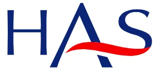

The logo of the Haute Autorité de Santé (HAS) in France. It consists of the letters 'HAS' in a dark blue, sans-serif font. A red, curved line or swoosh is positioned below the 'A' and 'S', extending slightly to the left.

HAUTE AUTORITÉ DE SANTÉ

RECOMMANDATIONS DE BONNE PRATIQUE

**Accident vasculaire cérébral :  
prise en charge précoce  
(alerte, phase préhospitale, phase  
hospitale initiale, indications de la  
thrombolyse)**

RECOMMANDATIONS

Mai 2009L'argumentaire et la synthèse des recommandations sont téléchargeables sur  
[www.has-sante.fr](http://www.has-sante.fr)

Haute Autorité de Santé  
Service communication et information des publics  
2 avenue du Stade de France - F 93218 Saint-Denis La Plaine CEDEX  
Tél. :+33 (0)1 55 93 70 00 - Fax :+33 (0)1 55 93 74 00

Ce document a été validé par le Collège de la Haute Autorité de Santé en mai 2009.  
© Haute Autorité de Santé – 2009# Sommaire

<table><tr><td><b>Abréviations .....</b></td><td><b>4</b></td></tr><tr><td><b>Recommandations .....</b></td><td><b>5</b></td></tr><tr><td><b>1 Introduction .....</b></td><td><b>5</b></td></tr><tr><td>1.1 Thème et objectifs des recommandations</td><td>5</td></tr><tr><td>1.2 Populations concernées</td><td>6</td></tr><tr><td>1.3 Professionnels concernés</td><td>7</td></tr><tr><td>1.4 Gradation des recommandations</td><td>7</td></tr><tr><td><b>2 L’alerte .....</b></td><td><b>8</b></td></tr><tr><td>2.1 La sensibilisation et l’information de la population générale à la pathologie neuro-vasculaire</td><td>8</td></tr><tr><td>2.2 La sensibilisation et la formation de la population médicale et paramédicale à la pathologie neuro-vasculaire</td><td>8</td></tr><tr><td><b>3 Phase préhospitalière .....</b></td><td><b>9</b></td></tr><tr><td>3.1 Évaluation du patient</td><td>9</td></tr><tr><td>3.2 Régulation médicalisée au Samu Centre 15</td><td>9</td></tr><tr><td>3.3 Le transport</td><td>10</td></tr><tr><td><b>4 Phase hospitalière initiale .....</b></td><td><b>10</b></td></tr><tr><td>4.1 L’accueil hospitalier</td><td>10</td></tr><tr><td>4.2 Imagerie cérébrale et vasculaire</td><td>11</td></tr><tr><td>4.3 Quels patients justifient d’une hospitalisation en UNV ?</td><td>11</td></tr><tr><td>4.4 Quels patients justifient d’une hospitalisation en réanimation ?</td><td>11</td></tr><tr><td>4.5 Quand faire appel à l’expertise neurochirurgicale ?</td><td>12</td></tr><tr><td>4.6 Algorithme de prise en charge initiale</td><td>12</td></tr><tr><td><b>5 La thrombolyse des infarctus cérébraux.....</b></td><td><b>12</b></td></tr><tr><td>5.1 Thrombolyse intraveineuse</td><td>12</td></tr><tr><td>5.2 Thrombolyse intra-artérielle, thrombolyse combinée (intra-artérielle et intraveineuse) et revascularisation mécanique</td><td>12</td></tr><tr><td><b>Annexe 1. Algorithme de prise en charge précoce des patients ayant un AVC .....</b></td><td><b>14</b></td></tr><tr><td><b>Annexe 2. Contre-indications de l’altéplase retenues dans l’AMM de l’ACTILYSE® .....</b></td><td><b>15</b></td></tr><tr><td><b>Méthode <i>Recommandations pour la pratique clinique</i>.....</b></td><td><b>16</b></td></tr><tr><td><b>Participants.....</b></td><td><b>18</b></td></tr><tr><td><b>Fiche descriptive des recommandations.....</b></td><td><b>21</b></td></tr></table>## Abréviations

<table border="1"><tr><td>AIT</td><td>accident ischémique transitoire</td></tr><tr><td>altéplase ou rt-PA</td><td>activateur tissulaire du plasminogène</td></tr><tr><td>AMM</td><td>autorisation de mise sur le marché</td></tr><tr><td>ARM</td><td>angiographie par résonance magnétique</td></tr><tr><td>ASA</td><td><i>American Stroke Association</i></td></tr><tr><td>AVC</td><td>accident vasculaire cérébral</td></tr><tr><td>EHPAD</td><td>établissement d'hébergement pour personnes âgées dépendantes</td></tr><tr><td>FAST</td><td><i>Face Arm Speech Time</i> (message dérivé de l'échelle préhospitalière de Cincinnati)</td></tr><tr><td>HAS</td><td>Haute Autorité de Santé</td></tr><tr><td>HC</td><td>hémorragie cérébrale</td></tr><tr><td>IA</td><td>intra-artériel</td></tr><tr><td>IC</td><td>infarctus cérébral</td></tr><tr><td>IRM</td><td>imagerie par résonance magnétique</td></tr><tr><td>IV</td><td>intraveineux</td></tr><tr><td>NIHSS</td><td><i>National Institute of Health Stroke Scale</i></td></tr><tr><td>ROSIER</td><td><i>Recognition of Stroke in Emergency Room Scale</i></td></tr><tr><td>Samu</td><td>service d'aide médicale urgente</td></tr><tr><td>SFMU</td><td>Société française de médecine d'urgence</td></tr><tr><td>Smur</td><td>service mobile d'urgence et de réanimation</td></tr><tr><td>UNV</td><td>unité neuro-vasculaire</td></tr><tr><td>USI</td><td>unité de soins intensifs</td></tr></table># Recommandations

## 1 Introduction

### 1.1 Thème et objectifs des recommandations

#### ► Thème des recommandations

Ces recommandations de bonne pratique concernent la prise en charge précoce de l'accident vasculaire cérébral (AVC) : alerte, phase préhospitalière, phase hospitalière initiale, indications de la thrombolyse. Elles ont été élaborées par la Haute Autorité de Santé (HAS) à la demande conjointe de la Société française neuro-vasculaire et de la Direction de l'hospitalisation et de l'organisation des soins.

Ces recommandations complètent celles sur la prévention vasculaire après un infarctus cérébral ou un accident ischémique transitoire (AIT)<sup>1</sup> qui concernent la prévention des événements vasculaires (AVC, infarctus du myocarde et décès d'origine vasculaire), d'une part, chez les patients ayant eu un infarctus cérébral (IC) après la phase aiguë et, d'autre part, chez les patients ayant eu un AIT dès que le diagnostic a été établi.

Dans les pays occidentaux, l'AVC est la première cause de handicap acquis de l'adulte, la deuxième cause de démente après la maladie d'Alzheimer (30 % des démentes sont entièrement ou en partie dues à des AVC) et la troisième cause de mortalité. En France, l'incidence annuelle est de 1,6 à 2,4/1 000 personnes tous âges confondus, soit de 100 000 à 145 000 AVC par an, avec 15 à 20 % de décès au terme du premier mois et 75 % de patients survivant avec des séquelles ; la prévalence annuelle des AVC est de 4 à 6/1 000 personnes tous âges confondus.

L'âge moyen de survenue de l'AVC, déterminé à partir des données du registre dijonnais des AVC de 1985 à 2004, est de 71,4 ans chez l'homme et de 76,5 ans chez la femme. Ce registre montre une augmentation du nombre absolu des cas incidents d'AVC. Le rôle de l'âge et le vieillissement de la population font craindre une augmentation du nombre de patients ayant un AVC et du poids de cette pathologie pour la société. Il faut souligner que l'AVC ne touche pas que la population âgée, puisque 25 % des patients victimes d'AVC ont moins de 65 ans.

#### ► Objectifs des recommandations

Ces recommandations ont pour but :

- • d'identifier les éléments d'information du grand public pour le sensibiliser aux signes d'alerte et à l'urgence de la prise en charge ;
- • d'optimiser la filière préhospitalière et intrahospitalière initiale des patients ayant une suspicion d'AVC, afin de pouvoir proposer une meilleure prise en charge au plus grand nombre possible de patients atteints d'AVC ;
- • de réduire la fréquence et la sévérité des séquelles fonctionnelles associées aux AVC grâce à une prise en charge multiprofessionnelle précoce, réalisée le plus rapidement possible en unité neuro-vasculaire (UNV), ou à défaut dans un établissement ayant structuré une filière de prise en charge des patients suspects d'AVC en coordination avec une UNV ;

---

<sup>1</sup> Prévention vasculaire après un infarctus cérébral ou un accident ischémique transitoire. Recommandations de bonne pratique. HAS, 2008.- • d'améliorer les pratiques professionnelles des médecins régulateurs des Samu Centre 15, des urgentistes et de l'ensemble des professionnels intervenant dans la prise en charge précoce des AVC (y compris des AIT).

### ► Questions posées

Étant donné la quantité de recommandations disponibles concernant les pratiques et l'organisation de la prise en charge des AVC, il a semblé pertinent de retenir, pour construire ces recommandations, la description de situations concrètes allant de l'alerte à la mise en route du traitement. L'organisation de la prise en charge des AVC soulève, dans chacune de ces situations, les questions suivantes.

- • **Alerte en cas de suspicion d'AVC** (c-à-d appel de la part du patient ou d'un tiers ou d'un professionnel de santé)
  - • Quelle information apporter à la population sur qui appeler et pourquoi ?
  - • Quels sont les messages à délivrer à la population et de quelle façon ?
- • **Phase préhospitalière**
  - • Quels patients doivent avoir un transport médicalisé ? Qui peut assurer le transport ? Quelle est la place du transport héliporté ?
  - • Y a-t-il un message particulier à adresser aux médecins généralistes ? Doivent-ils se déplacer quand ils sont appelés pour une suspicion d'AVC ? Comment peuvent-ils répondre sans se déplacer ?
  - • Quelles sont les échelles pour faire le diagnostic clinique et évaluer la sévérité de l'AVC (échelles Cincinnati, Los Angeles, ROSIER [*Recognition of Stroke in Emergency Room Scale*], NIHSS) ? Quelles sont les échelles utilisables par les non-médecins ?
  - • Y a-t-il des examens complémentaires à faire ?
  - • Qu'en est-il des scanners mobiles et que peut-on en attendre ?
- • **Phase hospitalière initiale**
  - • Dans quel service le patient doit-il être adressé en priorité ? Service d'accueil des urgences ou bien service de radiologie ou bien UNV quand elle existe ?
  - • Comment organiser la prise en charge initiale si le patient arrive de lui-même aux urgences ?
  - • Y a-t-il un point de passage obligé pour tous les patients ou doit-on seulement déterminer un point de rencontre où arrivent le patient, le neurologue ou l'urgentiste, l'infirmière ?
  - • Quelle est en général la place de la télémédecine dans toute cette prise en charge ?
- • **La thrombolyse des infarctus cérébraux**
  - • Faut-il revoir les indications et contre-indications de la thrombolyse ?
  - • Avec l'avènement de la télémédecine, peut-on envisager l'utilisation de l'altéplase dans certains cas par d'autres médecins que des neurologues ou en dehors des UNV ?

## 1.2 Populations concernées

### ► Population générale

Ces recommandations sont destinées à sensibiliser et à informer le grand public ainsi que le patient à risque vasculaire et son entourage à la pathologie neuro-vasculaire.

### ► Patients concernés

Ces recommandations concernent la prise en charge des patients dans les premières heures qui suivent les premiers symptômes faisant suspecter un AVC. En pratique, cela peut correspondre à :

- • un AIT ;- • un IC ;
- • une hémorragie cérébrale (HC).

Il faut souligner que la prise en charge de l'AIT doit être superposable à celle de l'AVC. Lorsqu'il est question d'AVC en général dans ces recommandations, cela inclut systématiquement les AIT. Il convient de rappeler ici la définition de l'AIT proposée en 2004<sup>2</sup> : « Un AIT est un épisode bref de dysfonction neurologique dû à une ischémie focale cérébrale ou rétinienne, dont les symptômes durent typiquement moins d'une heure, sans preuve d'infarctus aigu. » Cette définition sous-entend que l'imagerie cérébrale soit réalisée.

Les patients atteints d'hémorragie sous-arachnoïdienne sont exclus du champ des recommandations.

### 1.3 Professionnels concernés

Les recommandations sont destinées à tous les professionnels de santé et acteurs impliqués dans la prise en charge de l'AVC, notamment :

- • médecins généralistes ;
- • neurologues, urgentistes, réanimateurs, médecins sapeurs-pompiers, radiologues et neuroradiologues, neurochirurgiens, cardiologues, internistes, gériatres, angiologues, médecins de médecine physique et réadaptation, médecins coordinateurs en EHPAD (établissement d'hébergement pour personnes âgées dépendantes) ;
- • professionnels paramédicaux (infirmiers, aides-soignants, kinésithérapeutes, orthophonistes, etc.) des services d'urgence, des UNV et d'autres services recevant des patients ayant un AVC, personnels soignants en EHPAD ;
- • permanenciers auxiliaires de régulation médicale des Samu Centre 15 et personnels des centres d'appel médicaux ;
- • secouristes, ambulanciers.

### 1.4 Gradation des recommandations

Les recommandations proposées ont été classées en grade A, B ou C selon les modalités suivantes :

- • une recommandation de grade A est fondée sur une preuve scientifique établie par des études de fort niveau de preuve, comme des essais comparatifs randomisés de forte puissance et sans biais majeur ou méta-analyse d'essais comparatifs randomisés, analyse de décision basée sur des études bien menées (niveau de preuve 1) ;
- • une recommandation de grade B est fondée sur une présomption scientifique fournie par des études de niveau intermédiaire de preuve, comme des essais comparatifs randomisés de faible puissance, des études comparatives non randomisées bien menées, des études de cohorte (niveau de preuve 2) ;
- • une recommandation de grade C est fondée sur des études de moindre niveau de preuve, comme des études cas-témoins (niveau de preuve 3), des études rétrospectives, des séries de cas, des études comparatives comportant des biais importants (niveau de preuve 4).

En l'absence d'études, les recommandations sont fondées sur un accord professionnel au sein du groupe de travail réuni par la HAS, après consultation du groupe de lecture. Dans ce texte, les recommandations non gradées sont celles qui sont fondées sur un accord professionnel. L'absence de gradation ne signifie pas que les recommandations ne sont pas pertinentes et utiles. Elle doit, en revanche, inciter à engager des études complémentaires.

---

<sup>2</sup> Prise en charge diagnostique et traitement immédiat de l'accident ischémique transitoire de l'adulte. Recommandations de bonne pratique. Anaes, 2004.## 2 L'alerte

La prise en charge rapide des patients ayant un AVC nécessite que les symptômes de l'AVC soient connus par la population générale et plus particulièrement par les patients ayant des facteurs de risque ou des antécédents vasculaires, ainsi que par leur entourage (grade C).

Elle nécessite aussi que les filières de prise en charge préhospitalière et hospitalière initiale soient efficaces et pour cela il convient de sensibiliser les professionnels (accord professionnel).

### 2.1 La sensibilisation et l'information de la population générale à la pathologie neuro-vasculaire

#### ► Éléments d'information destinés au grand public

Les campagnes d'information vis-à-vis du grand public doivent être encouragées et répétées car leur effet est temporaire. L'information ne doit pas se limiter aux patients ayant des facteurs de risque vasculaire, mais doit concerner l'ensemble de la population y compris les jeunes (grade C).

L'information du grand public doit porter sur les axes suivants :

- • la reconnaissance des symptômes devant faire évoquer un AVC ou un AIT. L'utilisation du message FAST <sup>3</sup> (*Face Arm Speech Time*) peut être un vecteur efficace de l'information (accord professionnel) ;
- • l'urgence :
  - ◦ la prise en charge et les traitements sont urgents (admission en UNV et thrombolyse éventuelle) et d'autant plus efficaces que précoces,
  - ◦ même régressifs les symptômes imposent la nécessité d'appeler le Samu Centre 15 pour déclencher l'alerte (accord professionnel) ;
- • la nécessité de laisser le patient allongé (accord professionnel).

#### ► Messages transmis par le médecin traitant

Il est recommandé que le médecin traitant informe les patients à risque (antécédents vasculaires, HTA, diabète, artériopathie des membres inférieurs, etc.) ainsi que leur entourage des principaux signes de l'AVC. Il doit préconiser devant les symptômes l'appel immédiat au Samu Centre 15 avant même tout appel à son cabinet. Il doit expliquer l'importance de noter l'heure des premiers symptômes (accord professionnel).

En cas d'appel direct à son cabinet ou à son centre d'appel d'un patient présentant des signes évoquant un AVC, le médecin traitant doit transférer l'appel au Samu Centre 15 et au mieux rester en ligne pour permettre l'établissement d'une conférence à trois (appelant, médecin traitant, médecin régulateur du Samu Centre 15) (accord professionnel).

### 2.2 La sensibilisation et la formation de la population médicale et paramédicale à la pathologie neuro-vasculaire

Il est recommandé qu'une formation spécifique et continue pour l'identification des patients suspects d'AVC soit développée ou renforcée pour les permanenciers auxiliaires de

---

<sup>3</sup> Message dérivé de l'échelle préhospitalière de Cincinnati (perte de force ou engourdissement au visage, perte de force ou engourdissement au membre supérieur, trouble de la parole : appeler le service de prise en charge en urgence si l'un de ces 3 symptômes est survenu de façon brutale ou est associé à l'apparition brutale de troubles de l'équilibre, ou de céphalée intense, ou d'une baisse de vision).régulation médicale des Samu Centre 15 et les standardistes des centres de réception des appels médicaux en utilisant les cinq signes d'alerte de l'ASA<sup>4</sup> (accord professionnel).

Il est recommandé que les programmes de formation spécifiques à l'identification et à la prise en charge de l'AVC à la phase aiguë soient renforcés et développés auprès des acteurs du premier secours (pompiers, ambulanciers, secouristes) en utilisant le message FAST (accord professionnel).

Il est recommandé de développer les actions de formation continue dans le domaine de la prise en charge de l'AVC auprès des professionnels de la filière d'urgence et de tous ceux susceptibles de prendre en charge ce type de patients (médecins généralistes et spécialistes, infirmières, aides-soignants, kinésithérapeutes, orthophonistes, auxiliaires de vie, secrétaires, etc.) (accord professionnel).

Les messages clés à diffuser aux professionnels prenant en charge des AVC comprennent la nécessité de (accord professionnel) :

- • considérer tout déficit neurologique brutal, transitoire ou prolongé, comme une urgence absolue ;
- • noter l'heure exacte de survenue des symptômes ;
- • connaître l'efficacité de la prise en charge en UNV ;
- • connaître les traitements spécifiques de l'AVC.

L'AIT est une urgence et justifie une prise en charge neuro-vasculaire immédiate pour confirmer le diagnostic, préciser l'étiologie et instaurer le traitement en urgence (grade C).

## 3 Phase préhospitalière

### 3.1 Évaluation du patient

Il est recommandé d'utiliser un nombre limité d'échelles d'évaluation des AVC afin de standardiser leur prise en charge :

- • l'échelle FAST (ou son équivalent en français) doit être utilisée comme outil diagnostique pour les paramédicaux et les premiers secours qui devront être formés à cet effet (accord professionnel) ;
- • tout médecin urgentiste doit savoir utiliser l'échelle NIHSS (*National Institute of Health Stroke Scale*) et évaluer la sévérité de l'AVC (accord professionnel).

### 3.2 Régulation médicalisée au Samu Centre 15

La gestion de l'appel initial par un patient ou son entourage pour suspicion d'AVC doit être faite par les centres de régulation médicale des Samu Centre 15 (accord professionnel).

Des questionnaires ciblés et standardisés doivent être utilisés pour l'évaluation téléphonique des patients présentant une suspicion d'AVC et pour aider à la décision du médecin régulateur (accord professionnel).

Tout acte de régulation médicale pour un patient suspect d'AVC ou d'AIT comprend l'appel au médecin de l'UNV la plus proche. L'orientation est décidée de concert entre le médecin régulateur et le médecin de l'UNV (accord professionnel).

---

<sup>4</sup> Les 5 signes d'alerte de l'ASA sont la survenue brutale :

- - d'une faiblesse ou d'un engourdissement soudain uni ou bilatéral de la face, du bras ou de la jambe ;
- - d'une diminution ou d'une perte de vision uni ou bilatérale ;
- - d'une difficulté de langage ou de la compréhension ;
- - d'un mal de tête sévère, soudain et inhabituel, sans cause apparente ;
- - d'une perte de l'équilibre, d'une instabilité de la marche ou de chutes inexplicables, en particulier en association avec l'un des symptômes précédents.### **3.3 Le transport**

L'envoi d'une équipe médicale du Smur ne doit pas retarder la prise en charge d'un patient suspect d'AVC. Il est nécessaire en cas de troubles de la vigilance, de détresse respiratoire ou d'instabilité hémodynamique (accord professionnel).

Les centres de régulation doivent choisir le moyen de transport le plus rapide pour l'acheminement du patient (accord professionnel).

Aucune recommandation ne peut être formulée concernant la place d'une imagerie embarquée ; celle-ci est à évaluer.

Il est recommandé de remplir une fiche standardisée de recueil des antécédents, des traitements en cours, de l'heure de début des symptômes et des éléments de gravité clinique évalués par l'échelle NIHSS (accord professionnel).

En cas de transport médicalisé, il est recommandé d'effectuer les prélèvements sanguins qui permettront de réaliser le bilan biologique, ce en attente de l'évaluation de la biologie embarquée (accord professionnel).

Il est recommandé d'autoriser la réalisation d'une glycémie capillaire en préhospitalier par tous les acteurs de la chaîne d'urgence (accord professionnel).

L'hypoglycémie doit être corrigée en préhospitalier. En cas d'hyperglycémie, il n'y a pas de preuve en faveur de débuter en préhospitalier un traitement par insuline.

En cas de médicalisation du transport, un électrocardiogramme doit être réalisé (accord professionnel).

Compte tenu du rôle potentiellement délétère des troubles de l'hémodynamique sur la majoration de l'ischémie cérébrale, il est recommandé, en l'absence de signes d'hypertension intracrânienne, de troubles de la vigilance, de nausées ou de vomissements, de privilégier le transport en décubitus dorsal (accord professionnel).

La pression artérielle doit être mesurée. Mais il n'y a pas d'argument pour traiter une HTA, sauf indication extraneurologique associée comme une décompensation cardiaque (accord professionnel).

L'oxygénéthérapie systématique n'est pas recommandée, sauf si la saturation est inférieure à 95 % (accord professionnel).

## **4 Phase hospitalière initiale**

### **4.1 L'accueil hospitalier**

La filière intrahospitalière neuro-vasculaire doit être organisée au préalable, coordonnée avec tous les acteurs impliqués (urgentistes, neurologues, radiologues, réanimateurs, biologistes, etc.) et formalisée avec des procédures écrites. Elle doit privilégier la rapidité d'accès à l'expertise neuro-vasculaire et à l'imagerie cérébrale en organisant au mieux les aspects structuraux et fonctionnels. L'évaluation régulière de la performance de l'organisation doit être réalisée (accord professionnel).

Les patients adressés vers un établissement disposant d'une UNV doivent être pris en charge dès leur arrivée par un médecin de la filière neuro-vasculaire (accord professionnel).

Une fiche standardisée de recueil des antécédents, des traitements en cours, de l'heure de début des symptômes et des éléments de gravité clinique évalués par le score du NIH est remplie dès l'admission si cela n'a pas été fait en préhospitalier (accord professionnel).Un électrocardiogramme et des prélèvements biologiques comprenant une hémostase, un hémogramme et une glycémie capillaire sont réalisés en urgence s'ils n'ont pas été faits en préhospitalier (accord professionnel).

Un monitoring de la pression artérielle, du rythme cardiaque et de la saturation en oxygène ainsi qu'une surveillance de la température sont réalisés (accord professionnel).

Les établissements recevant des AVC et ne disposant pas d'UNV doivent structurer une filière de prise en charge des patients suspects d'AVC en coordination avec une UNV (accord professionnel).

## **4.2 Imagerie cérébrale et vasculaire**

Les patients suspects d'AVC aigu doivent avoir un accès prioritaire 24 h/24 et 7 j/7 à l'imagerie cérébrale. Des protocoles de prise en charge des patients suspects d'AVC aigu doivent être formalisés et contractualisés entre le service accueillant ces patients et le service de radiologie (accord professionnel).

L'IRM est l'examen le plus performant pour montrer précocement des signes d'ischémie récente, et elle visualise l'hémorragie intracrânienne. Il convient de la réaliser de façon privilégiée.

Si l'IRM est possible comme examen de première intention, elle doit être accessible en urgence et elle doit privilégier des protocoles courts incluant les séquences suivantes : diffusion, FLAIR, écho de gradient (grade B).

En cas d'impossibilité d'accéder en urgence à l'IRM, il convient de réaliser un scanner cérébral. Cet examen ne montre qu'inconstamment des signes d'ischémie récente, mais permet de visualiser une hémorragie intracrânienne.

L'exploration des artères intracrâniennes est effectuée par ARM cérébrale, angioscanner ou Doppler transcânien (accord professionnel).

Une exploration des artères cervicales doit être réalisée précocement devant tout accident ischémique cérébral. Celle-ci est urgente en cas d'AIT, d'infarctus mineur, d'accident ischémique fluctuant ou évolutif. L'examen de première intention peut être un écho-Doppler, une ARM des vaisseaux cervico-encéphaliques avec injection de gadolinium ou un angioscanner des troncs supra-aortiques (grade B).

## **4.3 Quels patients justifient d'une hospitalisation en UNV ?**

Tout patient ayant un AVC doit être proposé à une UNV.

## **4.4 Quels patients justifient d'une hospitalisation en réanimation ?**

Les décisions d'hospitalisation en réanimation sont prises au cas par cas et partagées par l'ensemble des professionnels, dont les réanimateurs et les neurologues, en respectant les souhaits du patient (accord professionnel).

Les décisions de limitation et d'arrêt de traitement doivent être prises de façon collégiale (accord professionnel).

Les réanimateurs sont aussi impliqués dans la prise en charge des patients en mort cérébrale (accord professionnel).## 4.5 Quand faire appel à l'expertise neurochirurgicale ?

Après avis neuro-vasculaire, un avis neurochirurgical doit être demandé pour les patients ayant un infarctus sylvien malin, un infarctus ou un hématome cérébelleux compliqué d'hypertension intracrânienne ou dans certains cas d'hématomes cérébraux hémisphériques (accord professionnel).

## 4.6 Algorithme de prise en charge initiale

Un algorithme de prise en charge des patients ayant une suspicion d'AVC reprenant les principales étapes de l'alerte à la phase hospitalière initiale figure en annexe 1.

# 5 La thrombolyse des infarctus cérébraux

## 5.1 Thrombolyse intraveineuse

### ► Indications

La thrombolyse intraveineuse (IV) par rt-PA des IC est recommandée jusqu'à 4 heures 30 (hors AMM, *voir annexe 2*) (accord professionnel). Elle doit être effectuée le plus tôt possible (grade A).

La thrombolyse IV peut être envisagée après 80 ans jusqu'à 3 heures (accord professionnel).

En dessous de 18 ans, les indications de thrombolyse doivent être discutées au cas par cas avec un neurologue d'une UNV (accord professionnel).

Une glycémie initiale supérieure à 11 mmol/l doit conduire à réévaluer l'indication de la thrombolyse, du fait du risque hémorragique accru (grade C).

Les données actuelles ne permettent pas de recommander la sonothrombolyse.

### ► Modalités de réalisation

Dans les établissements disposant d'une UNV, la thrombolyse IV est prescrite par un neurologue (AMM) et/ou un médecin titulaire du DIU de pathologie neuro-vasculaire (hors AMM). Le patient doit être surveillé au sein de l'UNV (accord professionnel).

Dans les établissements ne disposant pas d'une UNV, l'indication de la thrombolyse doit être portée lors d'une téléconsultation par télémédecine du médecin neuro-vasculaire de l'UNV où le patient sera transféré après thrombolyse (hors AMM) (accord professionnel).

## 5.2 Thrombolyse intra-artérielle, thrombolyse combinée (intra-artérielle et intraveineuse) et revascularisation mécanique

Des décisions de thrombolyse par voie intra-artérielle (IA) peuvent être prises au cas par cas, après concertation entre neurologues vasculaires et neuroradiologues, et ce jusqu'à 6 heures pour les occlusions de l'artère cérébrale moyenne, voire au-delà de 6 heures pour les occlusions du tronc basilaire du fait de leur gravité extrême (hors AMM) (accord professionnel).La thrombolyse par voie IA doit être réalisée dans un établissement disposant d'un centre de neuroradiologie interventionnelle autorisé dans le cadre du SIOS (schéma interrégional d'organisation sanitaire) et d'une UNV (accord professionnel).

La thrombolyse combinée (IV puis IA) et la revascularisation mécanique par thrombectomie ou ultrasons par voie endovasculaire ne sont pas recommandées et doivent être évaluées.## Annexe 1. Algorithme de prise en charge précoce des patients ayant un AVC

```
graph TD
    Start([Suspicion d'AVC  
Patient ou son entourage]) --> Call15[Appel du 15]
    Start -.->|Conférence à 3| Call15
    Start -.->|Médecin généraliste| Call15
    Call15 --> Decision1{Suspicion AVC ou AIT confirmée}
    Decision1 -- non --> Urgences[Urgences de proximité ou orientation adaptée]
    Decision1 -- oui --> Decision2{Recherche des signes de gravité clinique :  
troubles de la vigilance, détresse respiratoire, instabilité hémodynamique}
    Decision1 -- ne sait pas et UNV éloignée --> Eval[Evaluation médicale]
    Eval --> Decision3{Confirmation}
    Decision3 -- non --> Urgences
    Decision3 -- oui --> Call15
    Decision2 -- oui --> SendTeam[Envoi d'une équipe médicale (Smur)]
    Decision2 -- non --> Call15
    SendTeam --> CallUNV[Appel médecin UNV la plus proche  
Transport à l'UNV ou à un établissement ayant structuré une filière de prise en charge des patients suspects d'AVC en coordination avec une UNV  
par le moyen le plus rapide  
Choix de l'effecteur approprié  
Préparation de l'admission dans la filière organisée (urgentistes, neurologues, radiologues, biologistes, réanimateurs, etc.)  
Recherche des contre-indications à la thrombolyse]
    Call15 --> CallUNV
    CallUNV --> Facility1[Établissement disposant d'une UNV, d'une NC et d'une NRI]
    CallUNV --> Facility2[Établissement disposant d'une UNV]
    CallUNV --> Facility3[Établissement ayant structuré une filière de prise en charge des patients suspects d'AVC en coordination avec une UNV]
    Facility1 <-->|TM| Facility2
    Facility2 <-->|TM| Facility3
    Facility1 --> End([Bilan clinique, biologique, imagerie, évaluation pronostique, traitement])
    Facility2 --> End
    Facility3 --> End
```

NC : neurochirurgie ; NRI : neuroradiologie interventionnelle ; TM : télémédecine ; UNV : unité neuro-vasculaire## Annexe 2. Contre-indications de l'altéplase retenues dans l'AMM de l'ACTILYSE<sup>®</sup>

« Hypersensibilité à la substance active ou à l'un des excipients.

Comme tous les agents thrombolytiques, ACTILYSE<sup>®</sup> est contre-indiqué dans tous les cas associés à un risque hémorragique élevé :

- • trouble hémorragique significatif actuel ou au cours des 6 derniers mois
- • diathèse hémorragique connue
- • traitement concomitant par des anticoagulants oraux (par exemple warfarine)
- • hémorragie sévère ou potentiellement dangereuse, manifeste ou récente
- • antécédents ou suspicion d'hémorragie intracrânienne
- • suspicion d'hémorragie sous-arachnoïdienne ou antécédents d'hémorragie sous-arachnoïdienne liée à un anévrisme
- • antécédents de lésion sévère du système nerveux central (par exemple néoplasie, anévrisme, intervention chirurgicale intracérébrale ou intrarachidienne)
- • massage cardiaque externe traumatique récent (moins de 10 jours), accouchement, ponction récente d'un vaisseau non accessible à la compression (par exemple, ponction de la veine sous-clavière ou jugulaire)
- • hypertension artérielle sévère non contrôlée
- • endocardite bactérienne, péricardite
- • pancréatite aiguë
- • ulcères gastro-intestinaux documentés au cours des 3 derniers mois, varices œsophagiennes, anévrisme artériel, malformations artérielles ou veineuses
- • néoplasie majorant le risque hémorragique
- • hépatopathie sévère, y compris insuffisance hépatique, cirrhose, hypertension portale (varices œsophagiennes) et hépatite évolutive
- • intervention chirurgicale ou traumatismes importants au cours des 3 derniers mois.

Dans l'indication d'accident vasculaire cérébral ischémique à la phase aiguë les contre-indications complémentaires sont :

- • symptômes d'accident vasculaire cérébral ischémique apparus plus de 3 heures avant l'initiation du traitement ou dont l'heure d'apparition est inconnue
- • déficit neurologique mineur ou symptômes s'améliorant rapidement avant l'initiation du traitement
- • accident vasculaire cérébral jugé sévère cliniquement (par exemple NIHSS > 25) et/ou par imagerie
- • crise convulsive au début de l'accident vasculaire cérébral
- • signes d'hémorragie intracrânienne (HIC) au scanner
- • symptômes suggérant une hémorragie sous-arachnoïdienne, même en l'absence d'anomalie au scanner
- • administration d'héparine au cours des 48 heures précédentes avec un temps de thromboplastine dépassant la limite supérieure de la normale
- • patient diabétique présentant des antécédents d'accident vasculaire cérébral
- • antécédent d'accident vasculaire cérébral au cours des 3 derniers mois
- • plaquettes inférieures à 100 000/mm<sup>3</sup>
- • pression artérielle systolique > 185 mmHg ou pression artérielle diastolique > 110 mmHg, ou traitement d'attaque (par voie intraveineuse) nécessaire pour réduire la pression artérielle à ces valeurs seuils
- • glycémie inférieure à 50 ou supérieure à 400 mg/dl.

### **Utilisation chez l'enfant, l'adolescent et le patient âgé**

ACTILYSE<sup>®</sup> n'est pas indiqué pour le traitement de l'accident vasculaire cérébral à la phase aiguë chez les patients de moins de 18 ans ou de plus de 80 ans. »<sup>5</sup>

---

<sup>5</sup> La plupart des patients inclus dans les essais contrôlés randomisés étaient âgés de 18 à 80 ans.## **Méthode *Recommandations pour la pratique clinique***

Les recommandations professionnelles sont définies comme « des propositions développées selon une méthode explicite pour aider le praticien et le patient à rechercher les soins les plus appropriés dans des circonstances cliniques données ».

La méthode Recommandations pour la pratique clinique (RPC) est l'une des méthodes utilisées par la Haute Autorité de Santé (HAS) pour élaborer des recommandations professionnelles. Elle repose, d'une part, sur l'analyse et la synthèse critiques de la littérature médicale disponible, et, d'autre part, sur l'avis d'un groupe multidisciplinaire de professionnels concernés par le thème des recommandations.

### **► Choix du thème de travail**

Les thèmes de recommandations professionnelles sont choisis par le Collège de la HAS. Ce choix tient compte des priorités de santé publique et des demandes exprimées par les ministres chargés de la santé et de la sécurité sociale. Le Collège de la HAS peut également retenir des thèmes proposés par des sociétés savantes, l'Institut national du cancer, l'Union nationale des caisses d'assurance maladie, l'Union nationale des professionnels de santé, des organisations représentatives des professionnels ou des établissements de santé, des associations agréées d'usagers.

Pour chaque thème retenu, la méthode de travail comprend les étapes suivantes.

### **► Comité d'organisation**

Un comité d'organisation est réuni par la HAS. Il est composé de représentants des sociétés savantes, des associations professionnelles ou d'usagers, et, si besoin, des agences sanitaires et des institutions concernées. Ce comité définit précisément le thème de travail, les questions à traiter, les populations de patients et les professionnels concernés. Il signale les travaux pertinents, notamment les recommandations, existants. Il propose des professionnels susceptibles de participer aux groupes de travail et de lecture. Ultérieurement, il participe au groupe de lecture.

### **► Groupe de travail**

Un groupe de travail multidisciplinaire et multiprofessionnel est constitué par la HAS. Il est composé de professionnels de santé, ayant un mode d'exercice public ou privé, d'origine géographique ou d'écoles de pensée diverses, et, si besoin, d'autres professionnels concernés et de représentants d'associations de patients et d'usagers. Un président est désigné par la HAS pour coordonner le travail du groupe en collaboration avec le chef de projet de la HAS. Un chargé de projet est également désigné par la HAS pour sélectionner, analyser et synthétiser la littérature médicale et scientifique pertinente. Il rédige ensuite l'argumentaire scientifique des recommandations en définissant le niveau de preuve des études retenues. Ce travail est réalisé sous le contrôle du chef de projet de la HAS et du président.

### **► Rédaction de la première version des recommandations**

Une première version des recommandations est rédigée par le groupe de travail à partir de cet argumentaire et des avis exprimés au cours des réunions de travail (habituellement deux réunions). Cette première version des recommandations est soumise à un groupe de lecture.

### **► Groupe de lecture**

Un groupe de lecture est constitué par la HAS selon les mêmes critères que le groupe de travail. Il est consulté par courrier et donne un avis sur le fond et la forme de l'argumentaire et des recommandations, en particulier sur la lisibilité et l'applicabilité de ces dernières. Ce groupe de lecture externe est complété par des relecteurs du comité de validation des recommandations au sein de la HAS.### ► Version finale des recommandations

Les commentaires du groupe de lecture sont ensuite analysés et discutés par le groupe de travail, qui modifie si besoin l'argumentaire et rédige la version finale des recommandations et leur synthèse, au cours d'une réunion de travail.

La version finale de l'argumentaire et des recommandations et le processus de réalisation sont discutés par le comité de la HAS chargé de la validation des recommandations. À sa demande, l'argumentaire et les recommandations peuvent être revus par le groupe de travail. La commission rend son avis au Collège de la HAS.

### ► Validation par le Collège de la HAS

Sur proposition du comité de validation des recommandations, le Collège de la HAS valide le rapport final et autorise sa diffusion.

### ► Diffusion

La HAS met en ligne sur son site ([www.has-sante.fr](http://www.has-sante.fr)) l'intégralité de l'argumentaire, les recommandations et leur synthèse. La synthèse et les recommandations peuvent être éditées par la HAS.

### ► Travail interne à la HAS

Un chef de projet de la HAS assure la conformité et la coordination de l'ensemble du travail suivant les principes méthodologiques de la HAS.

Une recherche documentaire approfondie est effectuée par interrogation systématique des banques de données bibliographiques médicales et scientifiques sur une période adaptée à chaque thème. En fonction du thème traité, elle est complétée, si besoin, par l'interrogation d'autres bases de données spécifiques. Une étape commune à toutes les études consiste à rechercher systématiquement les recommandations pour la pratique clinique, conférences de consensus, articles de décision médicale, revues systématiques, méta-analyses et autres travaux d'évaluation déjà publiés au plan national et international. Tous les sites Internet utiles (agences gouvernementales, sociétés savantes, etc.) sont explorés. Les documents non accessibles par les circuits conventionnels de diffusion de l'information (littérature grise) sont recherchés par tous les moyens disponibles. Par ailleurs, les textes législatifs et réglementaires pouvant avoir un rapport avec le thème sont consultés. Les recherches initiales sont réalisées dès le démarrage du travail et permettent de construire l'argumentaire. Elles sont mises à jour régulièrement jusqu'au terme du projet. L'examen des références citées dans les articles analysés permet de sélectionner des articles non identifiés lors de l'interrogation des différentes sources d'information. Enfin, les membres des groupes de travail et de lecture peuvent transmettre des articles de leur propre fonds bibliographique. Les langues retenues sont le français et l'anglais.

### ► Gradation des recommandations

Chaque article sélectionné est analysé selon les principes de lecture critique de la littérature à l'aide de grilles de lecture, ce qui permet d'affecter à chacun un niveau de preuve scientifique. Selon le niveau de preuve des études sur lesquelles elles sont fondées, les recommandations ont un grade variable, coté de A à C selon l'échelle proposée par la HAS (cf. § 1.4).

En l'absence d'études, les recommandations sont fondées sur un accord professionnel au sein du groupe de travail réuni par la HAS, après consultation du groupe de lecture. Dans ce texte, les recommandations non gradées sont celles qui sont fondées sur un accord professionnel. L'absence de gradation ne signifie pas que les recommandations ne sont pas pertinentes et utiles. Elle doit, en revanche, inciter à engager des études complémentaires.

Pour en savoir plus sur la méthode d'élaboration des recommandations pour la pratique clinique, se référer au guide publié par l'Anaes en 1999 : « Les recommandations pour la pratique clinique - Base méthodologique pour leur réalisation en France ». Ce guide est téléchargeable sur le site Internet de la HAS : [www.has-sante.fr](http://www.has-sante.fr).# Participants

## Sociétés savantes et associations professionnelles

Les sociétés savantes et associations professionnelles suivantes ont été sollicitées pour l'élaboration de ces recommandations :

- • Association de recherche en soins infirmiers ;
- • Bataillon des marins-pompiers de Marseille ;
- • Brigade des sapeurs-pompiers de Paris ;
- • Centre européen de référence pour l'éducation aux premiers secours ;
- • Collège des neurologues des hôpitaux généraux ;
- • Collège français de médecine d'urgence ;
- • Collège national des généralistes enseignants ;
- • Collège professionnel des gériatres français ;
- • Fédération des médecins coordonnateurs en EHPAD (établissement d'hébergement pour personnes âgées dépendantes) ;
- • Fédération française de neurologie ;
- • France AVC ;
- • Observatoire régional des urgences de Midi-Pyrénées ;
- • Samu de France ;
- • Société de formation thérapeutique du généraliste ;
- • Société de réanimation de langue française ;
- • Société française de documentation et de recherche en médecine générale ;
- • Société française de médecine générale ;
- • Société française de neurologie ;
- • Société française neuro-vasculaire ;
- • Société française de cardiologie ;
- • Société française de gériatrie et de gérontologie ;
- • Société française de médecine d'urgence ;
- • Société française de médecine sapeurs-pompiers ;
- • Société française de neurochirurgie ;
- • Société française de pédiatrie ;
- • Société française de radiologie ;
- • SOS Médecin France.

## Comité d'organisation

Dr Bruno Bailly, chef de projet, SEVAM, HAS, Saint-Denis

Dr Jérôme Beaujard, médecine générale, La Fare-des-Oliviers

Pr Max Budowski, médecine générale, Paris  
Dr Muriel Dhénain, chef de projet, HAS, Saint-Denis

Dr Patrice Dosquet, chef du service des bonnes pratiques professionnelles, HAS, Saint-Denis

Dr Guillaume Foucart, urgentiste, Samu 31, Toulouse

Pr Marc Freysz, anesthésie-réanimation, Samu 21, Dijon

Mme Christine Gardel, chef de service, IPAQS, HAS, Saint-Denis

Dr Sylvie Gillier-Poirier, médecine générale, Saint-Sébastien-sur-Loire

Dr Michel Laurence, chef de projet, HAS, Saint-Denis

Dr Daniel Meyran, anesthésie-réanimation, bataillon des marins-pompiers de Marseille, Marseille

Dr France Woimant, neurologie, Paris

## Groupe de travail

Dr France Woimant, neurologie, Paris - présidente du groupe de travail

Dr Yann L'hermitte, médecine d'urgence, médecin régulateur Samu 77, Melun - chargé de projet

Dr Valérie Wolff, neurologie, Strasbourg - chargée de projet

Dr Muriel Dhénain, HAS, Saint-Denis - chef de projetDr Thomas Aczel, médecine d'urgence,  
médecin régulateur, bataillon des marins-  
pompiers de Marseille, Marseille  
Pr Alain Bonafé, radiologie, Montpellier  
Dr Catherine Busseuil, médecine d'urgence,  
Montélimar  
Dr Pascal Cassan, médecine d'urgence, Croix-  
Rouge française, Paris  
Dr Alban Chantegret, médecine d'urgence,  
médecin régulateur Samu 21, Dijon  
Mme Denise Desseaux, représentante  
d'association de patients, France AVC,  
Tourcoing  
Dr Stéphane Dubourdieu, médecine d'urgence,  
médecin régulateur, brigade des sapeurs-  
pompiers de Paris, Paris  
Dr Jean-Louis Ducassé, anesthésie-  
réanimation, médecin régulateur Samu 31,  
Toulouse

Mme Marie Erbault, chef de projet, SPP, HAS,  
Saint-Denis  
Dr Sandrine Greffard, gériatrie, Paris  
Pr Charles Honnorat, médecine générale,  
Rennes  
Dr Jean-Pierre Larrumbe, médecine générale,  
Velaux  
Dr Elisabeth Medeiros de Bustos, neurologie,  
Besançon  
Dr Patrick Miroux, médecine d'urgence,  
Compiègne  
Pr Jean-Philippe Neau, neurologie, Poitiers  
Dr Philippe Niclot, neurologie, Pontoise  
Pr François Proust, neurochirurgie, Rouen  
Mme Évelyne Uzols, infirmière de service  
d'urgence, Aurillac

## Groupe de lecture

Dr Laurent d'Araujo, médecine  
d'urgence, Provins  
Dr Caroline Arquizan, neurologie,  
Montpellier  
Dr Christophe Barberis, médecine  
d'urgence, bataillon des marins-pompiers  
de Marseille, Marseille  
Dr Denis Berthelon, radiologie, Le  
Creusot  
Dr Frédéric Berthier, médecine  
d'urgence, médecin régulateur Samu 44,  
Nantes  
Dr Karine Blanc-Lasserre, neurologie,  
Valence  
Dr Éric Bodiguel, neurologie, Bourges  
Dr Pierre-Edouart Bollaert, réanimation  
médicale, Nancy  
Dr Anne Boulin, radiologie, Paris  
Dr Jacques Boulliat, neurologie, France  
AVC, Paris  
Pr Marie-Germaine Bousser, neurologie,  
Paris  
Dr Thomas de Broucker, neurologie,  
Saint-Denis  
Dr Yves Burckel, médecine d'urgence,  
bataillon des marins-pompiers de  
Marseille, Marseille  
Dr Anne Castot, Afssaps, Saint-Denis  
Dr Renato Colamarino, neurologie, Vichy  
M. Yvon Croguenec, infirmier  
anesthésiste, Samu 29, Brest

Dr Emmanuel Cuny, neurochirurgie,  
Bordeaux  
Dr Olivier Dereeper, neurologie, Calais  
Dr Claude Depriester, neuroradiologie,  
Lille  
Dr Sabine Deveau, médecine d'urgence,  
Cergy-Pontoise  
Dr Jean-Michel Dudouit, médecine  
d'urgence, médecin régulateur Samu 972,  
Fort-de-France  
Dr Antoine Dunac, neurologie, Nice  
Dr Emmanuel Ellie, neurologie, Bayonne  
Dr Annette Girard-Claudon, médecine  
d'urgence, coordinateur neurologie et  
référent filière AVC, médecin régulateur  
Samu 972, Fort-de-France  
Pr Maurice Giroud, neurologie, Dijon  
Dr Patrick Goldstein, anesthésie-  
réanimation, médecin régulateur Samu  
59, Lille  
Dr Benoît Guillon, neurologie, Nantes  
Dr Jean-Michel Hervocho, radiologie, La  
Rochelle  
Dr Vincent Hubert, anesthésie-  
réanimation, Amiens  
Dr Christophe Lapras, neurochirurgie,  
Argonay  
Dr Benoît Lavallart, gériatrie, Paris  
Pr Xavier Leclerc, neuroradiologie, Lille  
Dr Christian Léorier, médecine générale,  
Saint-Paul-les-Trois-ChâteauxDr Daniel Levy, médecine d'urgence,  
bataillon des marins-pompiers de  
Marseille, Marseille  
Dr David Luis, réanimation polyvalente  
Bondy  
Dr Guillaume Marc, neurologie, Angers  
Dr Nathalie Maubourguet, médecine  
générale, Pessac  
Dr Jacques Miguères, médecine  
générale, Paris  
Dr Thierry Moulin, neurologie, Besançon  
Dr François Mounier-Vehier, neurologie, Lens  
Pr Catherine Oppenheim, radiologie, Paris  
Dr Hervé Outin, réanimation médicale, Poissy  
M. Patrick Peulmeule, infirmier anesthésiste,  
Villeneuve-sur-Lot  
Dr Jean-Marc Philippe, médecine d'urgence,  
Aurillac

Pr Fernando Pico, neurologie, Versailles  
Pr Laurent Pierot, radiologie, Reims  
Dr Jean-François Pinel, neurologie, Rennes  
Dr Laurent Renie, neurologie, Aix-en-Provence  
Dr Catherine Rey-Quino, Afssaps, Saint-Denis  
Dr Gilles Rodier, neurologie, Pringy  
Dr Thierry Rusterholtz, ARH Rhône-Alpes,  
Lyon  
Dr Denis Sablot, neurologie, Perpignan  
Dr Jean-François Savet, neurologie, France  
AVC, Mâcon  
Dr Igor Sibon, neurologie, Bordeaux  
Dr Serge Timsit, neurologie, Brest  
Dr Xavier Vandamme, neurologie, La Rochelle  
Pr Marc Verny, gériatrie, Paris  
Dr Viguier Alain, neurologie, Toulouse

## Remerciements

La HAS tient à remercier l'ensemble des membres cités ci-dessus ainsi que les personnes dont les noms suivent, pour leur implication particulière dans la rédaction de certains paragraphes ou annexes de l'argumentaire ou leur relecture en interne au sein de la HAS :

Mme Isabelle Bongiovanni, chef de projet, SEMESP, HAS, Saint-Denis  
Dr Armelle Desplanques, chef du service des programmes pilotes, HAS, Saint-Denis  
Mme Gersende Georg, chef de projet, SBPP, HAS, Saint-Denis  
Dr Valérie Izard, chef de projet, SEM, HAS, Saint-Denis  
Mme Catherine Rumeau-Pichon, adjointe au directeur DEMESP, HAS, Saint-Denis  
Mme Francine Reymann, Association des infirmières de neurologie, Mulhouse# Fiche descriptive des recommandations

<table border="1">
<tr>
<td><b>TITRE</b></td>
<td><b>Accident vasculaire cérébral : prise en charge précoce (alerte, phase préhospitalière, phase hospitalière initiale, indications de la thrombolyse)</b></td>
</tr>
<tr>
<td><b>Méthode de travail</b></td>
<td>Recommandations pour la pratique clinique (RPC)</td>
</tr>
<tr>
<td><b>Date d'édition</b></td>
<td>Uniquement disponible sous format électronique</td>
</tr>
<tr>
<td><b>Objectif(s)</b></td>
<td>
<p>Ces recommandations ont pour but :</p>
<ul>
<li>• d'identifier les éléments d'information du grand public pour le sensibiliser aux signes d'alerte et à l'urgence de la prise en charge ;</li>
<li>• d'optimiser la filière préhospitalière et intrahospitalière initiale des patients ayant une suspicion d'AVC, afin de pouvoir proposer une meilleure prise en charge au plus grand nombre possible de patients victimes d'AVC ;</li>
<li>• de réduire la fréquence et la sévérité des séquelles fonctionnelles associées aux AVC grâce à une prise en charge multiprofessionnelle précoce, réalisée le plus rapidement possible en unité neuro-vasculaire (UNV), ou à défaut dans un établissement ayant structuré une filière de prise en charge des patients suspects d'AVC en coordination avec une UNV ;</li>
<li>• d'améliorer les pratiques professionnelles des médecins régulateurs des Samu Centre 15, des urgentistes et de l'ensemble des professionnels intervenant dans la prise en charge précoce des AVC (y compris les accidents ischémiques transitoires [AIT]).</li>
</ul>
</td>
</tr>
<tr>
<td><b>Professionnel(s) concerné(s)</b></td>
<td>
<ul>
<li>• Médecins généralistes</li>
<li>• Neurologues, urgentistes, réanimateurs, radiologues et neuroradiologues, neurochirurgiens, cardiologues, internistes, gériatres, angiologues, médecins de médecine physique et réadaptation, médecins coordinateurs en EHPAD</li>
<li>• Médecins sapeurs-pompiers</li>
<li>• Professionnels paramédicaux des services d'urgence, des UNV et d'autres services recevant des AVC, personnel soignant en EHPAD, permanenciers auxiliaires de régulation médicale des Samu Centre 15 et personnels des centres d'appel médicaux</li>
<li>• Secouristes, ambulanciers</li>
</ul>
</td>
</tr>
<tr>
<td><b>Demandeur</b></td>
<td>Société française neuro-vasculaire et Direction de l'hospitalisation et de l'organisation des soins</td>
</tr>
<tr>
<td><b>Promoteur</b></td>
<td>Haute Autorité de Santé (HAS), service des bonnes pratiques professionnelles</td>
</tr>
<tr>
<td><b>Financement</b></td>
<td>Fonds publics</td>
</tr>
<tr>
<td><b>Pilotage du projet</b></td>
<td>
<p>Coordination : Dr Muriel Dhénain, chef de projet, service des bonnes pratiques professionnelles de la HAS (chef de service : Dr Patrice Dosquet)</p>
<p>Secrétariat : Mlle Jessica Layouni</p>
<p>Recherche documentaire : Mme Emmanuelle Blondet, avec l'aide de Mlle Sylvie Lascols (chef du service documentation : Mme Frédérique Pagès)</p>
</td>
</tr>
<tr>
<td><b>Participants</b></td>
<td>
<p>Sociétés savantes, comité d'organisation, groupe de travail (présidente : Dr France Woimant, neurologie, Paris), groupe de lecture : cf. liste des participants</p>
<p>Les participants au comité d'organisation et au groupe de travail ont communiqué leur déclaration d'intérêts à la HAS</p>
</td>
</tr>
<tr>
<td><b>Recherche documentaire</b></td>
<td>De janvier 2002 à avril 2009 (cf. stratégie de recherche documentaire dans l'argumentaire)</td>
</tr>
<tr>
<td><b>Auteurs de l'argumentaire</b></td>
<td>
<p>Dr Yann Lhermitte, médecine d'urgence, Melun</p>
<p>Dr Valérie Wolff, neurologie, Strasbourg</p>
</td>
</tr>
<tr>
<td><b>Validation</b></td>
<td>
<p>Avis du comité de la HAS chargé de la validation des recommandations</p>
<p>Validation par le Collège de la HAS en mai 2009</p>
</td>
</tr>
<tr>
<td><b>Autres formats</b></td>
<td>Synthèse des recommandations et argumentaire scientifique, téléchargeables sur <a href="http://www.has-sante.fr">www.has-sante.fr</a></td>
</tr>
</table>