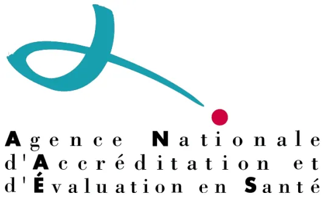

# **PRISE EN CHARGE DE L'INTERRUPTION VOLONTAIRE DE GROSSESSE JUSQU'À 14 SEMAINES**

**MARS 2001**

**Concernant l'IVG par méthode médicamenteuse, se référer aux recommandations de la HAS finalisées en décembre 2010, qui actualisent les recommandations ci-dessous.  
Les parties des recommandations de mars 2001 modifiées suite aux recommandations de décembre 2010 apparaissent en rouge dans ce document.**

**Service des recommandations et références professionnelles**---

## AVANT-PROPOS

---

La médecine est marquée par l'accroissement constant des données publiées et le développement rapide de nouvelles techniques qui modifient constamment les stratégies de prise en charge préventive, diagnostique et thérapeutique des malades. Dès lors, il est très difficile pour les professionnels de santé d'assimiler toutes les informations découlant de la littérature scientifique, d'en faire la synthèse et de l'incorporer dans sa pratique quotidienne.

L'Agence Nationale d'Accréditation et d'Évaluation en Santé (ANAES), qui a succédé à l'Agence Nationale pour le Développement de l'Évaluation Médicale (ANDEM), a notamment pour mission de promouvoir la démarche d'évaluation dans le domaine des techniques et des stratégies de prise en charge des malades, en particulier en élaborant des recommandations professionnelles. À ce titre, elle contribue à mieux faire comprendre les mécanismes qui relient évaluation, amélioration de la qualité des soins et régularisation du système de santé.

Les recommandations professionnelles sont définies comme « des propositions développées méthodiquement pour aider le praticien et le patient à rechercher les soins les plus appropriés dans des circonstances cliniques données ». Leur objectif principal est de fournir aux professionnels de santé une synthèse du niveau de preuve scientifique des données actuelles de la science et de l'opinion d'experts sur un thème de pratique clinique, et d'être ainsi une aide à la décision en définissant ce qui est approprié, ce qui ne l'est pas ou ne l'est plus, et ce qui reste incertain ou controversé.

Les recommandations professionnelles contenues dans ce document ont été élaborées par un groupe multidisciplinaire de professionnels de santé, selon une méthodologie explicite, publiée par l'ANAES dans son document intitulé : « Les Recommandations pour la Pratique Clinique - Base méthodologique pour leur réalisation en France – 1999 ».

Le développement des recommandations professionnelles et leur mise en application doivent contribuer à une amélioration de la qualité des soins et à une meilleure utilisation des ressources. Loin d'avoir une démarche normative, l'ANAES souhaite, par cette démarche, répondre aux préoccupations de tout acteur de santé soucieux de fonder ses décisions cliniques sur les bases les plus rigoureuses et objectives possible.

Professeur Yves MATILLON  
Directeur général de l'ANAESCes recommandations ont été faites à la demande de la Direction générale de la santé. Elles ont été établies dans le cadre d'un partenariat entre l'Agence Nationale d'Accréditation et d'Évaluation en Santé et :

- - l'Association Nationale des Centres d'Interruption Volontaire de Grossesse et de Contraception,
- - l'Association Nationale des Sages-Femmes Libérales,
- - le Collège National des Généralistes Enseignants,
- - le Collège National des Gynécologues et Obstétriciens Français,
- - la Confédération nationale du mouvement pour le planning familial,
- - la Fédération Française de Psychiatrie,
- - le Regroupement national des sages-femmes occupant un poste d'encadrement,
- - la Société Française d'Anesthésie et de Réanimation,
- - la Société Française de Médecine Générale,
- - la Société Française Thérapeutique du Généraliste.

La méthode utilisée est celle décrite dans le guide d'élaboration des « Recommandations pour la pratique clinique – Bases méthodologiques pour leur réalisation en France – 1999 » publié par l'ANAES.

L'ensemble du travail a été coordonné par M. le Pr Alain DUROCHER, responsable du service recommandations et références professionnelles

La recherche documentaire a été réalisée par Mme Christine DEVAUD, documentaliste, avec l'aide de Mme Sylvie LASCOLS, sous la responsabilité de Mme Hélène CORDIER.

Le secrétariat a été réalisé par Mlle Marie-Laure TURLET.

L'Agence Nationale d'Accréditation et d'Évaluation en Santé tient à remercier les membres du comité d'organisation, les membres du groupe de travail, les membres du groupe de lecture et les membres du Conseil scientifique dont les noms suivent.## COMITE D'ORGANISATION

---

Mme le Dr Chantal BELORGEY-BISMUT, AFSSAPS, Saint-Denis ;  
Mme Chantal BIRMAN, sage-femme, Paris ;  
M. le Dr Paul CESBRON, gynécologue-obstétricien, Creil ;  
M. le Dr Abram COEN, psychiatre, Saint-Denis ;  
M. le Dr Alain CORDESSE, gynécologue-obstétricien, Gonesse ;  
Mme le Dr Catherine DENIS, AFSSAPS, Saint-Denis ;  
M. le Dr Jean DOUBOVETZKY, médecin généraliste, Albi ;

Mme le Dr Laurence LUCAS-COUTURIER, médecin généraliste, Asnières ;  
M. le Dr Bernard MARIA, gynécologue-obstétricien, Paris ;  
Mme Claude MOREL, sage-femme, Caen ;  
Mme Muriel NAESSEMS, animatrice au planning familial, Villepinte ;  
Mme le Dr Maryse PALOT, anesthésiste-réanimateur, Reims ;  
M. le Pr Michel TOURNAIRE, gynécologue-obstétricien, Paris.

## GROUPE DE TRAVAIL

---

M. le Pr Michel TOURNAIRE, gynécologue-obstétricien, Paris, président du groupe de travail ;  
M. le Dr Bruno CARBONNE, gynécologue-obstétricien, Paris, chargé de projet du groupe de travail ;  
M. le Dr Gérard ANDREOTTI, médecin généraliste, La Crau ;  
Mme Florence BARUCH-GOURDEN, psychologue, Gentilly ;  
Mme Chantal BIRMAN, sage-femme, Paris ;  
M. le Dr Alain BOURMEAU, médecin généraliste, Nantes ;  
M. le Dr Paul CESBRON, gynécologue-obstétricien, Creil ;  
Mme le Dr Catherine DENIS, AFSSAPS, Saint-Denis ;  
Mme le Dr Régine DETRE, médecin scolaire, Paris ;

Mme le Dr Lise DURANTEAU, AFSSAPS, Saint-Denis ;  
M. le Dr Bernard FONTY, gynécologue-obstétricien, Paris ;  
Mme Elisabeth GAREZ, sage-femme, Caen ;  
Mme le Dr Danielle GAUDRY, gynécologue-obstétricien, Saint-Maur ;  
Mme Martine LEROY, cadre de santé, Nantes ;  
Mme le Dr Patricia MEDIONI, anesthésiste-réanimateur, Villeneuve-Saint-Georges ;  
Mme Sylvie NIEL, infirmière scolaire, Rouen ;  
Mme le Dr Maryse PALOT, anesthésiste-réanimateur, Reims ;  
M. le Dr Pierre-Yves PIETO, médecin généraliste, Lamballe ;  
Mme Colette REGIS, assistante sociale, Paris ;  
M. le Dr Jean-Yves VOGEL, médecin généraliste, Husseren-Wesserling.## GROUPE DE LECTURE

---

Mme Danièle ABRAMOVICI, CADAC, Paris ;  
Mme le Dr Danielle-Eugénie ADORIAN, médecin généraliste, Paris ;  
Mme Christiane ANDREASSIAN, sage-femme, Paris ;  
Mme le Dr Nicole ATHEA, gynécologue-obstétricien, Paris ;  
Mme le Dr Elisabeth AUBENY, gynécologue-médicale, Paris ;  
Mme Brigitte AUBERT, infirmière, Paris ;  
Mme le Dr Isabelle AUBIN-AUGER, médecin généraliste, Soisy-sous-Montmorency ;  
M. le Dr Jean-Jacques BALDAUF, gynécologue-obstétricien, Strasbourg ;  
Mme Christine BARBIER, médecin inspecteur, Melun ;  
M. le Dr Philippe BOURGEOT, gynécologue, Villeneuve-d'Ascq ;  
Mme le Dr Chantal BELORGEY-BISMUT, AFSSAPS, Saint-Denis ;  
M. le Dr Jean-Christian BERARDI, gynécologue-obstétricien, Mantes-la-Jolie ;  
Mme le Dr Anne-Marie BORG, gynécologue-obstétricien, Douarnenez ;  
M. le Dr Géry BOULARD, anesthésiste-réanimateur, Paris ;  
M. le Pr Gérard BREART, directeur de recherche, INSERM, Paris ;  
Mme le Dr Marie-Laure BRIVAL, gynécologue-obstétricien, Paris ;  
Mme le Dr Joëlle BRUNERIE, gynécologue-obstétricien, Clamart ;  
M. le Dr Jean BRUXELLE, anesthésiste-réanimateur, Paris ;  
M. le Dr Olivier CHEVRANT-BRETON, gynécologue-obstétricien, Rennes ;  
Mme Martine CHOSSON, conseillère conjugale, Paris ;  
M. le Dr Pascal CLERC, médecin généraliste, Issy-les-Moulineaux ;  
M. le Dr Abram COEN, psychiatre, Saint-Denis ;  
Mme Pascale COPPIN, assistante sociale, Issy-les-Moulineaux ;  
M. le Dr Alain CORDESSE, gynécologue-obstétricien, Gonesse ;  
M. le Dr Guy-Marie COUSIN, gynécologue-obstétricien, Saint-Herblain ;

Mme le Dr Laurence DANJOU, gynécologue-médicale, Paris ;  
Mme le Dr Bernadette DE GASQUET, gynécologue-obstétricien, Paris ;  
M. le Dr Alain DESROCHES, gynécologue-obstétricien, Orléans ;  
Mme le Dr Anne DIB, endocrinologue, Paris ;  
M. le Dr Jean DOUBOVETZKY, médecin généraliste, Albi ;  
M. le Pr Bertrand DUREUIL, membre du conseil scientifique de l'ANAES ;  
M. le Dr Jean-Claude FAILLE, anesthésiste-réanimateur, Béthune ;  
Mme le Dr Catherine FREDOUILLE, gynécologue, La Seyne-sur-Mer ;  
M. le Pr René FRYDMAN, gynécologue-obstétricien, Clamart ;  
Mme Célia GABISON, Mouvement français pour le planning familial, Paris ;  
Mlle Valérie GAGNERAUD, sage-femme, Limoges ;  
Mme Brigitte GAUTHIER, sage-femme, Castelnau-le-Lez ;  
M. le Dr Bernard GAY, membre du conseil scientifique de l'ANAES ;  
M. le Dr Patrick GINIES, anesthésiste-réanimateur, Montpellier ;  
Mme Marie-Pierre GIRARD, sage-femme, Grenoble ;  
Mme Anne-Marie GIRARDOT, sage-femme, Valenciennes ;  
Mme Rolande GRENTE, membre du conseil scientifique de l'ANAES ;  
Mme Brigitte HAIE, psychologue, Tours ;  
Mme le Dr Danielle HASSOUN, gynécologue-obstétricien, Saint-Denis ;  
Mme le Dr Martine HATCHUEL, gynécologue-obstétricien, Paris ;  
Mme Paule INIZAN-PERDRIX, sage-femme, Lyon ;  
Mme le Dr Joëlle JANSE-MAREC, gynécologue-obstétricien, Levallois ;  
Mme Marie-Josée KELLER, sage-femme, Paris ;  
M. le Dr Philippe LAMBERT, médecin généraliste, Sète ;  
Mme le Dr Marie-Chantal LANDEAU, gynécologue-obstétricien, Paris ;M. le Dr Philippe LARMIGNAT, anesthésiste-réanimateur, Bobigny ;  
M. le Dr Daniel LAVERDISSE, anesthésiste-réanimateur, Montauban ;  
Mme LAVILLONNIERE, sage-femme, Vals-les-Bains ;  
M. le Dr Jean-Marie LE BORGNE, anesthésiste-réanimateur, Laon ;  
Mme Denise LEDARE, sage-femme, Brest ;  
Mme Elisabeth LEDUC, infirmière, Bihorel ;  
M. le Dr Philippe LEFEBVRE, gynécologue, Roubaix ;  
Mme le Dr Marie-France LEGOAZIOU, médecin généraliste, Lyon ;  
M. le Pr Michel LEVARDON, gynécologue-obstétricien, Clichy ;  
M. le Dr Michel LEVY, anesthésiste-réanimateur, La Roche-sur-Yon ;  
M. le Pr Gérard LEVY, gynécologue-obstétricien, Caen ;  
Mme Anne LEYRONAS, sage-femme, Paris ;  
Mme Pierrette LHEZ, membre du conseil scientifique de l'ANAES ;  
Mme le Dr Claudie LOCQUET, médecin généraliste, Bourg-de-Plourivo ;  
Mme le Dr Laurence LUCAS-COUTURIER, médecin généraliste, Asnières ;  
Mme Laëtitia LUSSOU-PLOIX, sage-femme, Saint-Cloud ;  
M. le Dr Bernard MARIA, gynécologue-obstétricien, Villeneuve-Saint-Georges ;  
Mme le Dr Christine MATUCHANSKY, gynécologue, Maisons-Laffitte ;  
Mme Eliane MEILLIER, médecin généraliste, Paris ;  
M. le Pr Jacques MENTION, gynécologue-obstétricien, Amiens ;  
Mme Rosine MEYNIAL, Fédération nationale couple et famille, Paris ;  
M. le Dr Alain MILLET, médecin généraliste, Tarcenay ;  
M. le Dr Michel MINTZ, gynécologue, Paris ;  
Mme Claude MOREL, sage-femme, Caen ;  
M. le Dr Jack MOUCHEL, gynécologue-obstétricien, Le Mans ;

Mme Muriel NAESSEMS, Mouvement français pour le planning familial, Villepinte ;  
Mme Sylvie NIEL, infirmière, Rouen ;  
M. le Pr Israël NISAND, gynécologue-obstétricien, Strasbourg ;  
Mme Sarah PAILHES, sage-femme, Les Lilas ;  
Mme le Dr Clara PELISSIER, gynécologue, Paris ;  
Mme Geneviève PERESSE, sage-femme, Échirolles ;  
M. le Dr André PODEVIN, sexologue, Arras ;  
M. le Dr Bernard POLITUR, médecin généraliste Cayenne ;  
M. le Dr Emmanuel ROUBERTIE, médecin généraliste, Vendôme ;  
M. le Dr Francis SAILLY, gynécologue, Tourcoing ;  
M. le Dr Stéphane SAINT LEGER, gynécologue-obstétricien, Montreuil ;  
M. le Dr David SERFATY, gynécologue, Paris ;  
M. le Dr Alain SERRIE, anesthésiste-réanimateur, Paris ;  
Mme Annie SIRVEN, sage-femme, Vesseaux ;  
M. le Dr Gérard SOFER, gynécologue-obstétricien, Hyères ;  
Mme Maya SURDUTS, CADAC, Paris ;  
M. le Pr Claude SUREAU, gynécologue-obstétricien, Paris ;  
M. le Dr Pierre TARY, gynécologue-obstétricien, Montluçon ;  
Mme Nora TENENBAUM, CADAC, Paris ;  
M. le Dr Patrick THONNEAU, gynécologue-obstétricien, Toulouse ;  
Mme Claude TOURE, conseillère conjugale, Paris ;  
Mme Françoise TRUCCO, conseillère conjugale, Clichy-sous-Bois ;  
Mme le Dr Isabelle VANONI, médecin généraliste, Nice ;  
M. le Dr Érik VASSORT, anesthésiste-réanimateur, Grenoble ;  
Mme le Dr Françoise VENDITTELLI, gynécologue-obstétricien, Grenoble ;  
M. le Dr Pascal VILLEMONTÉIX, gynécologue-obstétricien, Bressuire.## TEXTE DES RECOMMANDATIONS

---

Ces recommandations concernent la prise en charge de l'interruption volontaire de grossesse, réalisée dans le cadre légal, dans un délai de 14 semaines d'aménorrhée. Elles sont destinées à tous les professionnels de santé concernés par cette pratique.

Les recommandations proposées sont classées en grade A, B ou C selon les modalités suivantes :

- – une recommandation de grade A est fondée sur une preuve scientifique établie par des études de fort niveau de preuve, par exemple essais comparatifs randomisés de forte puissance et sans biais majeur, méta-analyse d'essais contrôlés randomisés, analyse de décision basée sur des études bien menées ;
- – une recommandation de grade B est fondée sur une présomption scientifique fournie par des études de niveau intermédiaire de preuve : par exemple essais comparatifs randomisés de faible puissance, études comparatives non randomisées bien menées, études de cohortes ;
- – une recommandation de grade C est fondée sur des études de moindre niveau de preuve, par exemple études cas-témoins, séries de cas.

En l'absence de précision, les recommandations proposées correspondent à un accord professionnel.

### I. Structures de prise en charge des IVG

- ▪ Les structures de prise en charge des IVG doivent être en nombre suffisant dans chaque département pour permettre l'accueil correct et dans des délais rapides de toutes les demandes. Les structures d'IVG fonctionnent chaque semaine, sans interruption, pendant toute l'année et s'organisent de façon à pouvoir prendre en compte les recommandations médicales, techniques, sociales et psychologiques exprimées ci-dessous.
- ▪ Jusqu'à 12 semaines d'aménorrhée (SA) (84 jours), les structures d'IVG sont, soit intégrées dans un établissement de soins ayant un service de gynécologie-obstétrique, soit en convention avec un établissement disposant d'un plateau technique permettant de prendre en charge l'ensemble des complications de l'IVG.
- ▪ Les IVG au-delà de 12 SA doivent être prises en charge dans une structure disposant d'un plateau technique chirurgical. Ces structures doivent être désignées et connues de tous les centres d'accueil des IVG au sein de chaque département.
- ▪ Il est indispensable que chaque centre d'accueil des IVG dispose au sein de l'établissement d'au moins un échographe avec sonde vaginale.
- ▪ L'activité d'IVG entre dans le cadre d'un projet de service auquel adhèrent tous les membres du personnel qui participent à cette activité. Le personnel de ces structures doit bénéficier d'une formation spécifique à cette activité.## II. Accueil, organisation

- ■ Toute patiente demandant une IVG doit obtenir un rendez-vous de consultation dans les 5 jours suivant son appel. Plus l'IVG intervient précocement pendant la grossesse et plus le risque de complications est faible. La précocité de réalisation permet également un choix plus large de techniques utilisables. L'accès à l'IVG doit donc être simple et rapide.
- ■ Chaque structure de prise en charge des IVG doit disposer d'une ligne téléphonique dédiée à cette seule activité, connue et largement diffusée. En dehors des heures ou jours de présence du personnel, un message téléphonique clair et précis apporte les réponses les plus utiles sur le fonctionnement de l'unité et les principales démarches à effectuer.
- ■ Un accueil et un secrétariat opérationnels doivent permettre d'apporter les principales réponses aux demandes des femmes, l'orientation vers les consultations préalables, l'information sur les modalités de l'IVG. Cet accueil et ce secrétariat sont signalés avec précision à l'entrée, ainsi qu'à l'intérieur de l'établissement de soins.
- ■ Sauf cas exceptionnel, les IVG doivent être réalisées en ambulatoire ou en hôpital de jour (séjour inférieur à 12 heures).

## III. Consultations pré-IVG

- ■ Lors de la première consultation, des informations claires et précises sont apportées à la patiente sur la procédure (méthode médicamenteuse ou chirurgicale) et les choix offerts de recours à l'anesthésie locale ou générale, ainsi que sur le temps de réflexion. Outre cette information orale, les professionnels établissent et mettent à la disposition des patientes des documents d'information écrits.
- ■ À l'occasion ou préalablement à la consultation médicale, un entretien d'information, de soutien et d'écoute doit pouvoir être proposé systématiquement et réalisé pour les femmes qui souhaitent en bénéficier. L'entretien doit dans ce cas être confié à des professionnels qualifiés pour cet accompagnement et l'identification de difficultés psychosociales.
- ■ L'âge gestationnel de la grossesse est précisé par l'interrogatoire, l'examen clinique ; le recours à une échographie doit être possible sur place lors de la consultation.
- ■ La consultation pré-IVG est l'occasion de proposer, selon le contexte clinique, un dépistage des maladies sexuellement transmissibles dont l'infection par le VIH et des frottis cervico-vaginaux de dépistage.
- ■ Le mode de contraception ultérieure est abordé et éventuellement prescrit dès la visite précédant l'IVG. Il est utile de tenter de comprendre les raisons de l'échec de la contraception actuelle ou de son absence.
- ■ Une procédure d'urgence permet de raccourcir le délai de réflexion. Cette procédure s'applique aux femmes dont l'âge gestationnel est situé entre 12 et 14 SA.- ▪ Toutes les patientes doivent disposer d'un groupe sanguin Rhésus avec recherche d'agglutinines irrégulières. D'autres examens peuvent être prescrits si nécessaire lors d'une éventuelle consultation préanesthésique.

#### IV. Techniques d'IVG en fonction de l'âge gestationnel

Dans tous les cas où cela est possible, les femmes doivent pouvoir choisir la technique, médicale ou chirurgicale, ainsi que le mode d'anesthésie, locale ou générale.

- - La technique chirurgicale repose sur la dilatation du col et l'évacuation du contenu utérin par aspiration dans des conditions strictes d'asepsie. La dilatation du col peut être précédée d'une préparation cervicale médicamenteuse.

Lorsqu'elle est recommandée, la technique de préparation cervicale repose sur :

- - mifépristone 200 mg *per os* 36 à 48 heures avant aspiration (grade A) ;
- - ou misoprostol 400 µg par voie orale ou vaginale 3 à 4 heures avant aspiration (grade A).

La préparation cervicale, quel que soit le produit utilisé, ne nécessite pas d'hospitalisation.

Le contrôle visuel du produit d'aspiration est indispensable.

En postopératoire, toute patiente ayant bénéficié d'une sédation intraveineuse, d'une anesthésie générale ou périmédullaire doit séjourner en salle de surveillance post-interventionnelle.

- - La technique médicale repose sur l'association de l'antiprogestérone mifépristone et de prostaglandines. **Concernant l'IVG par méthode médicamenteuse, se référer aux recommandations de la HAS de décembre 2010.**

- ▪ Jusqu'à 7 SA révolues (49 jours)

Les deux techniques, chirurgicale et médicale, sont utilisables selon les disponibilités et le choix de la patiente.

La technique chirurgicale expose à un risque d'échec inférieur à la technique médicale ; cependant, ce risque d'échec est plus important à cet âge gestationnel que plus tardivement.

- ▪ A 8e et 9e SA (de 50 à 63 jours)

Les deux techniques, chirurgicale ou médicale, sont utilisables selon les disponibilités et le choix de la patiente.

Pour la technique chirurgicale, une préparation cervicale médicamenteuse est recommandée chez la nullipare. Elle repose sur :

- - mifépristone 200 mg *per os* 36 à 48 heures avant l'aspiration ;
- - ou misoprostol 400 µg par voie orale ou vaginale 3 à 4 heures avant l'aspiration.

- ▪ De la 10e à la 12e SA (de 64 à 84 jours)

La technique chirurgicale est la technique de choix. Une préparation cervicale médicamenteuse est recommandée. Elle repose sur :

- - mifépristone 200 mg *per os* 36 à 48 heures avant l'aspiration ;
- - ou misoprostol 400 µg par voie orale ou vaginale 3 à 4 heures avant l'aspiration.■ 13e et 14e SA (de 85 à 98 jours)

La technique chirurgicale est la technique de choix (grade B).

L'évacuation utérine repose sur l'aspiration à l'aide d'une canule et, lorsque cela est nécessaire, sur l'utilisation de pinces spécifiques. Cette technique requiert une formation spécifique.

Une préparation cervicale médicamenteuse est recommandée. Elle repose sur :

- - mifépristone 200 mg *per os* 36 à 48 heures avant l'aspiration ;
- - ou misoprostol 400 µg par voie orale ou vaginale 3 à 4 heures avant l'aspiration.

L'utilisation éventuelle de l'anesthésie locale demande une très bonne maîtrise de la technique de dilatation et évacuation.

V. Prise en charge de la douleur – Analgésie et anesthésie

- ■ L'interruption volontaire de grossesse médicamenteuse est responsable de douleurs, modérées à sévères pour plus de 50 % des femmes, liées principalement à l'utilisation des prostaglandines. L'efficacité des traitements antalgiques proposés dans l'IVG a été peu évaluée.
- ■ Lors des avortements par aspiration, pour environ le tiers des patientes, la technique d'anesthésie locale par bloc paracervical ne prévient pas la survenue de douleurs considérées comme sévères lors de la pratique de l'aspiration endo-utérine (grade C). Toutefois, l'injection de lidocaïne intracervicale au niveau de la région isthmique (orifice interne du col) diminue significativement le score de la douleur par comparaison à la technique précédente (grade B).
- ■ Les benzodiazépines sont inefficaces sur la douleur des IVG par aspiration. L'efficacité du paracétamol n'est pas prouvée. En revanche, l'administration d'ibuprofène (AINS) diminue les scores de douleur per et postopératoire (grade A) ; seul l'ibuprofène a été étudié.
- ■ Les facteurs de risque de survenue d'une douleur intense sont le jeune âge, la peur de l'acte, l'existence d'un utérus rétroversé, les antécédents de dysménorrhée, les grossesses les plus précoces et les plus avancées (grade C). De telles situations justifient l'utilisation d'antalgiques efficaces en préopératoire en cas d'anesthésie locale ou la proposition d'une anesthésie générale.
- ■ La patiente doit être informée sur les différentes modalités d'anesthésie possibles (anesthésie générale ou anesthésie locale) ; le choix du type d'anesthésie revient à la patiente.
- ■ Le recours à l'anesthésie générale doit être possible. Si l'anesthésie générale est retenue, elle répond aux exigences du décret n° 94-1050 du 5 décembre 1994. Les données concernant l'augmentation des complications liées à l'anesthésie générale (perforations, hémorragies, mortalité) sont anciennes et précèdent l'utilisation du misoprostol et des mesures de surveillance per et postopératoires actuelles. Pour la réalisation de l'anesthésie générale, les halogénés à forte concentration augmentent le volume des pertes sanguines ; l'utilisation d'ocytocine le diminue (grade B).## VI. Prévention des complications infectieuses

Bien qu'il n'existe pas de démonstration d'un bénéfice à long terme, il est recommandé, en cas d'IVG chirurgicale, d'adopter une stratégie de prévention des complications infectieuses qui peut faire appel à :

- - une antibiothérapie en cas d'antécédent connu d'infection génitale haute ;
- - pour toute autre situation à risque de MST : large indication de prélèvement vaginal et/ou de recherche de *Chlamydiae trachomatis* par PCR sur les urines, suivi de traitement de la patiente et du (des) partenaire(s) en cas de positivité ;
- - en l'absence de facteur de risque : les données de la littérature ont montré l'efficacité de l'utilisation des antibiotiques pour réduire la fièvre post-IVG mais il n'y a pas de données sur les effets bénéfiques à long terme des antibiotiques.

## VII. Prévention de l'incompatibilité Rhésus

La prévention de l'incompatibilité Rhésus doit être réalisée chez toutes les femmes Rhésus négatif par l'injection intraveineuse d'une dose standard de gamma-globulines anti-D.

En cas d'IVG médicamenteuse à domicile, la prévention doit être faite lors de la prise de mifépristone.

## VIII. Suites immédiates de l'IVG

### ■ Avant la visite de contrôle

- - Après une IVG, médicamenteuse ou chirurgicale, une contraception œstrogénique peut être commencée dès le lendemain de l'IVG.  
  La pose d'un dispositif intra-utérin est possible lors de l'examen de surveillance ou bien en fin d'aspiration en cas d'IVG chirurgicale.
- - Une fiche de conseils sur les suites normales de l'IVG sera remise à la patiente ainsi qu'un numéro de téléphone à appeler en cas d'urgence.

### ■ Visite de contrôle

- - La visite de contrôle est prévue entre le 14e et le 21e jour post-IVG.
- - Le contrôle de la vacuité utérine nécessite un examen clinique. Selon les données de cet examen, une échographie peut être réalisée.
- - La compréhension de la contraception et de sa bonne utilisation, normalement prescrite au cours même de l'IVG, doit être vérifiée. La présence et la situation correcte d'un éventuel dispositif intra-utérin mis en place lors d'une IVG chirurgicale sont vérifiées. Le cas échéant, le dispositif intra-utérin peut être mis en place.
- - Il existe peu de données concernant le retentissement psychologique de l'IVG. Un accompagnement spécifique doit être proposé et disponible.## IX. Évaluation

Les IVG doivent être déclarées. Un recueil national des données concernant l'IVG est nécessaire pour permettre une surveillance épidémiologique et l'évaluation des pratiques. Les données de ce recueil doivent être rapidement accessibles aux professionnels.

## X. Proposition d'actions futures

Des travaux sont nécessaires, notamment :

- - permettant de comparer techniques médicale et chirurgicale ;
- - afin d'améliorer la prise en charge de la douleur liée à l'IVG ;
- - afin de déterminer l'utilité à long terme d'une antiopiophylaxie ou d'une antibiothérapie au cours de l'IVG ;
- - afin de préciser le retentissement psychologique de l'IVG.