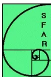

## Recommandations Formalisées d'Experts Anesthésie loco – régionale en pédiatrie

Ces recommandations formalisées actualisent la Conférence d'Experts organisée par la Société Française d'Anesthésie et de Réanimation (SFAR) en 1997. L'actualisation a été jugée nécessaire car la Conférence d'Experts datait de plus de dix ans. Des évolutions importantes sont apparues concernant le matériel, les techniques et les médicaments de l'anesthésie loco-régionale (ALR) pédiatrique.

Les recommandations ont été élaborées conformément à la méthodologie développée par la SFAR et approuvée par l'Association des Anesthésistes Réanimateurs Pédiatriques d'Expression Française (ADARPEF). Le président du groupe d'experts a été désigné conjointement par le Comité des Référentiels de la SFAR et le Conseil d'Administration de l'ADARPEF. Il a constitué le groupe d'experts en collaboration avec ce Comité et ce Conseil d'Administration.

### **LISTE DES EXPERTS**

P. Courrèges, Hôpital Jeanne de Flandre, Lille (*Président*);  
C. Dadure, CHU Montpellier;  
C. Ecoffey, CHU Pontchaillou; Rennes (*Secrétaire*);  
E. Giaufre, Hôpital Privé Clairval, Résidence du Parc, Marseille;  
F. Lacroix, Hôpital Timone Enfants Marseille;  
C. Lejus, CHU Nantes;  
JX. Mazoit, Hôpital du Kremlin Bicêtre, Paris;  
G. Oriaguet, Hôpital Necker Enfants Malades, Paris;  
A. Pouyau, Hôpital Femme Mère Enfant Lyon;  
F. Veyckemans, Cliniques universitaires Saint Luc Bruxelles.

### **MÉTHODOLOGIE**

Les experts ont travaillé seuls ou en sous groupes pour chaque question posée. Ils ont élaboré les recommandations après analyse et synthèse de la littérature médicale. L'analyse a été conduite avec la méthodologie GRADE retenue par le Comité des Référentiels de la SFAR et approuvée par le Comité Scientifique de l'ADARPEF lorsqu'elle semblait pertinente.

Dans un premier temps, un niveau de preuve était proposé pour chaque référence bibliographique en fonction du type d'étude : haut niveau (essai randomisé, méta analyse), bas niveau (étude «tout ou rien», études contrôlées de validation de tests diagnostiques, études prospectives de cohortes parallèles, études prospectives «exposés-non exposés»,études de cas-témoins) et très bas niveau (autres sources de données). Dans un second temps, chaque niveau de preuve était réévalué en tenant compte de la qualité de l'étude (méthodologie, puissance statistique, pertinence et fiabilité des résultats....). À l'issue de cette étape, l'étude pouvait soit être exclue des sources documentaires pertinentes à examiner, soit être surcotée ou sous cotée de 1 ou 2 niveaux de preuve. Dans un troisième temps, les études communes à chaque critère de jugement étaient regroupées et un niveau de preuve globale fort, modéré, faible ou très faible était déterminé pour chacun des groupes en tenant compte du type des études, du niveau de preuve le plus élevé, de la cohérence entre les différentes études et du caractère plus ou moins direct des preuves.

En absence de consensus entre les experts, en cas de preuve globale jugée trop faible ou en cas de non pertinence de la méthode GRADE (données scientifiques absentes ou peu nombreuses, réponses des différents travaux disponibles indirectes ou partielles...), les recommandations ont fait l'objet d'un accord professionnel après cotation à un ou plusieurs tours selon la méthode «Groupe Nominal» adaptée de la RAND/UCLA. Les recommandations qui font l'objet d'un tel accord professionnel expriment la prise de position à un temps donné d'un groupe d'experts dans un domaine pour lequel les pratiques s'avèrent peu ou mal codifiées.

Après évaluation de la balance bénéfice/risque, les recommandations ont été classées en recommandations fortes (il faut faire, il ne faut pas faire) et en recommandations optionnelles (il est possible de faire, il faut probablement faire ou ne pas faire, les experts proposent de faire ou de ne pas faire, il faut penser à ...). Une recommandation forte n'impose pas de prendre en charge tous les enfants de façon identique, mais tente de refléter un choix décisionnel qui serait probablement celui de la majorité des praticiens comme celui de la majorité des parents correctement informés.

## **LES RECOMMANDATIONS**

### **Introduction**

L'actualisation intéresse surtout la pratique de l'ALR chez le nouveau-né, le nourrisson et le petit enfant. Chez les grands enfants et les adolescents, il faut probablement se rapprocher des recommandations faites pour l'adulte. Les techniques d'infiltration du champ opératoire n'ont pas été évaluées.

À l'heure actuelle (2008 - 2009), l'ALR pédiatrique a pour but de procurer une analgésie per et postopératoire. Plus rarement, elle vise à traiter un syndrome douloureux complexe ou une douleur cancéreuse. Elle est très peu utilisée pour assurer uniquement la réalisation du geste chirurgical. Elle est le plus souvent associée à une anesthésie générale (AG) de complément et réalisée après l'induction de-celle ci.## **QUESTION N° 1 : QUELS ANESTHÉSIQUES LOCAUX (ALx) CHOISIR ET QUELLES POSOLOGIES EN FONCTION DE L'ÂGE, DE LA TECHNIQUE ET DE LA LOCALISATION (BLOCS CENTRAUX, BLOCS PÉRIPHÉRIQUES) ?**

### **1-1 Quels sont les ALx habituellement utilisés ?**

- ● Les ALx habituellement utilisés pour l'ALR pédiatrique sont les ALx du groupe des amino amides.

### **1-2 Y a t-il des particularités pharmacologiques chez l'enfant et ont-elles des implications pratiques ?**

- ● Chez le nouveau né et le nourrisson, il faut utiliser des ALx moins concentrés que chez l'adulte.
- ● Chez l'enfant > 2 mois, il faut utiliser un volume d'ALx d'autant plus important par rapport au poids que l'enfant est jeune.
- ● Il faut réduire les posologies d'ALx chez l'enfant < 2 ans en raison d'une fréquence cardiaque de base élevée qui augmente la vulnérabilité à la toxicité cardiaque des ALx. Chez l'enfant < 1 an, le risque de toxicité systémique est renforcé par des concentrations plasmatiques libres d'ALx élevées en relation avec un taux constamment faible de protéines sériques. Ce risque est encore plus grand avant l'âge de 6 mois en raison de l'immaturité hépatique, surtout en cas de réinjections ou d'administration continue.

### **1-3 Qu'apportent les nouveaux ALx ?**

- ● Les nouveaux ALx d'action longue, ropivacaine et lévobupivacaine sont moins toxiques pour le cœur.
- ● Ils provoquent une analgésie d'intensité et de durée équivalente à celle de la bupivacaine racémique.
- ● La ropivacaine provoque un bloc moteur moins intense que celui de la bupivacaine racémique lors de la réalisation d'anesthésies caudales et d'anesthésies péridurales lombaires.
- ● La lévobupivacaine utilisée dans ces mêmes indications provoque un bloc moteur moins intense que celui de la bupivacaine racémique. Le bloc moteur est équivalent ou plus intense que celui de la ropivacaine.

### **1-4 Quels ALx choisir et quelles posologies en fonction de l'âge, de la technique et de la localisation ?**

#### *1-4-1 Injection unique*

##### *1-4-1-1 Anesthésie péridurale ou caudale*

- ● Il faut privilégier l'usage de la ropivacaine à 2 mg/ml ou de la lévobupivacaine à 2,5mg/ml.

- ● En cas d'anesthésie caudale, il ne faut pas dépasser une posologie de 2 mg/kg pour la ropivacaine ou la lévobupivacaine.
- ● En cas d'anesthésie péridurale, il ne faut pas dépasser une posologie de 1,7 mg/kg pour la ropivacaine.
- ● En cas d'anesthésie péridurale, il ne faut probablement pas dépasser 1,7 mg/kg de lévobupivacaine.
- ● Il faut adapter le volume injecté au niveau métamérique à atteindre.

Exemples :

*- Schéma d'Armitage pour l'anesthésie caudale : 0,5 ml/kg pour atteindre les métamères sacrés, 1 ml/kg pour atteindre les métamères lombaires et 1,25 ml/kg pour atteindre les métamères dorsaux inférieurs.*

*- Formule de Schulte Steinberg pour l'anesthésie péridurale : volume par métamère à bloquer (ml) =  $1/10^{\text{ème}}$  de l'âge (années).*

#### 1-4-1-2 Rachianesthésie

- ● Il faut probablement limiter l'usage de la bupivacaine racémique à la pratique de la rachianesthésie. La posologie recommandée est 1 mg/kg de bupivacaine à 0,5% chez l'enfant < 5 kg, 0,4 mg/kg chez l'enfant de 5 à 15kg et 0,3 mg/kg chez l'enfant > 15 kg.

#### 1-4-1-3 Blocs périphériques du tronc ou des membres

- ● Pour les blocs périphériques du tronc ou des membres, il ne faut probablement pas injecter plus de 0,5 ml/kg de ropivacaine à 2 mg/ml ou de lévobupivacaine à 2,5 mg/ml.

#### 1-4-2 Entretien par administration continue (cathéter périnerveux ou analgésie péridurale)

- ● Pour l'administration péridurale continue de ropivacaine, il faut utiliser des concentrations  $\leq 2$  mg/ml chez l'enfant et 1 mg/ml chez le nourrisson. Il ne faut pas dépasser une posologie de 0,20 mg/kg/h avant l'âge de un mois, 0,30 mg/kg/h avant l'âge de 6 mois et 0,40 mg/kg/h après l'âge de 6 mois.
- ● Il faut probablement appliquer des recommandations identiques pour l'administration périnerveuse périphérique continue de ropivacaine.
- ● En l'absence de données pharmacologiques suffisantes sur l'administration continue de lévobupivacacaine en pédiatrie, il faut probablement l'administrer aux concentrations et aux posologies retenues pour la ropivacaine.## **QUESTION N° 2 : QUELS ADJUVANTS POUR L'ALR CHEZ L'ENFANT ?**

### **2-1 Clonidine**

- ● Il ne faut probablement pas administrer plus de 2 µg/kg de clonidine lors de la réalisation d'une ALR chez l'enfant, des effets indésirables (somnolence, bradycardie et hypotension artérielle) ayant été observés pour une posologie de 5 µg/kg.
- ● Il ne faut pas recourir à la clonidine péridurale ou intrathécale chez le nouveau-né et le nourrisson sans surveillance continue en raison d'un risque d'apnée postopératoire. Chez les enfants plus âgés, 1 à 2 µg/kg de clonidine administrés par voie péridurale ou intrathécale provoquent une sédation et dépriment faiblement la respiration.
- ● Pour la plupart des blocs tronculaires, il est possible de prolonger la durée d'analgésie en ajoutant 1 à 2 µg/kg de clonidine à la solution d'ALx, mais on augmente l'incidence du bloc moteur.
- ● Il est possible de prolonger l'analgésie de la péridurale caudale en ajoutant 1 µg/kg de clonidine à une solution d'ALx dont la concentration est  $\geq 0,125\%$ .
- ● Il est possible d'améliorer l'analgésie postopératoire de la péridurale lombaire en associant de la clonidine à la solution d'ALx. La posologie recommandée est soit de 1 à 2 µg/kg en bolus soit 0,08 à 0,12 µg/kg/h lorsque l'ALR est administrée de façon continue.
- ● Chez l'enfant et l'adolescent, il est possible d'ajouter 1 à 2 µg/kg de clonidine à de la bupivacaine à 0,5% en solution hyperbare ou isobare pour améliorer l'analgésie postopératoire de la rachianesthésie. Cette association comporte un risque important de bradycardie et d'hypotension artérielle.

### **2-2 Morphiniques**

- ● L'effet pharmacologique des morphiniques administrés par voie périmédullaire chez le nouveau-né et le nourrisson n'est pas connu.
- ● En cas d'administration périmédullaire de morphiniques, il faut éviter toute co-administration d'un morphinique par une autre voie.
- ● La morphine administrée par voie périmédullaire permet d'obtenir une analgésie de bonne qualité.
- ● Il est possible de prolonger la durée d'analgésie avec la morphine sans agent conservateur en administrant un bolus de 25-30 µg/kg d'une solution à 10 µg/ml pour la péridurale lombaire, de 25-30 µg/kg pour la péridurale caudale et de 4 à 10 µg/kg pour la rachianesthésie.
- ● Il est possible d'améliorer l'analgésie de la voie péridurale lombaire ou thoracique continue en associant du fentanyl ou du sufentanil à une solution d'ALx faiblement concentrée. Il ne faut dépasser 0,2 µg/kg/h pour aucune des deux substances.
- ● Il ne faut pas attendre de bénéfice à l'utilisation de fentanyl ou de sufentanil par voiecaudale.

- ● Il est possible de prolonger l'analgésie de la rachianesthésie en administrant du fentanyl à la dose de 2 µg/kg.
- ● La dépression respiratoire liée à l'administration périmédullaire de morphiniques est précoce pour les dérivés lipophiles et tardive pour la morphine. Elle s'annonce en général par une sédation excessive. Le risque est plus élevé chez le nouveau-né et le nourrisson. Il faut une surveillance continue dans cette population et une surveillance clinique rigoureuse dans les autres tranches d'âge.
- ● Pour traiter une rétention d'urine sans diminuer l'analgésie, il est possible d'administrer 1 µg/kg de naloxone ou 0,1 mg/kg de nalbuphine par voie intraveineuse.
- ● Pour traiter les nausées et vomissements, plus fréquents avec la morphine qu'avec les dérivés lipophiles, il faut administrer un traitement symptomatique.
- ● Pour traiter un prurit, plus fréquent avec la morphine qu'avec les dérivés lipophiles, il faut administrer soit un bolus intraveineux de 1 à 2 µg/kg de naloxone suivi d'une administration continue de 1 à 2 µg/kg/h, soit des antihistaminiques de type HT3.

## 2-3 Adrénaline

- ● Il est possible de diminuer le risque toxique des ALx d'action courte en utilisant des solutions adrénalinées à la concentration maximum de 5 µg/ml (1/200 000ème). L'association diminue la résorption systémique des ALx de façon plus marquée pour les ALx de courte durée d'action. Elle a des effets hémodynamiques (chute le plus souvent modérée de la pression artérielle moyenne et des résistances vasculaires périphériques, augmentation significative du débit cardiaque).
- ● Il ne faut pas ajouter d'adrénaline aux ALx pour réaliser un bloc qui intéresse une région dont la vascularisation artérielle est de type terminal (rachianesthésie, bloc pénien, bloc pudendal, bloc digital, bloc du lobe de l'oreille, certains blocs de la face...).
- ● Il ne faut probablement pas associer de l'adrénaline à un AL administré par voie caudale, périnerveuse ou locale pour prolonger l'analgésie.

## 2-4 Autres

- ● En l'absence d'études de toxicité et d'inocuité, l'utilisation de tramadol, midazolam, néostigmine et kétamine n'est pas recommandée par voie périmédullaire chez l'enfant.## **QUESTION N°3 : QUELLES MÉTHODES DE LOCALISATION POUR L'ALR PÉDIATRIQUE ?**

### **3-1 Comment rechercher une perte de résistance ?**

#### *3-1-1 anesthésie péridurale*

- ● En terme de sécurité, il n'est pas possible de trancher entre un mandrin liquide, mixte ou gazeux pour détecter la perte de résistance nécessaire à la localisation de l'espace péridural.
- ● En terme d'efficacité et par assimilation à l'adulte, il faut probablement utiliser un mandrin mixte ou liquide de volume < 5 ml pour détecter la perte de résistance chez l'adolescent et le grand enfant.
- ● Il est possible d'utiliser un mandrin gazeux pour détecter la perte de résistance en cas de péridurale chez le nouveau né et le nourrisson à la condition impérative de limiter le volume de gaz à 1 ml et de ne pas multiplier les tentatives en cas d'échec.

#### *3-1-2 anesthésie caudale*

- ● Il ne faut pas utiliser de mandrin liquide, mixte ou gazeux en cas d'anesthésie caudale. C'est uniquement la perte de résistance due au franchissement de la membrane sacro-coccygienne qui doit permettre la localisation.

#### *3-1-3 blocs périphériques de diffusion*

- ● Il faut utiliser une aiguille à biseau court sans mandrin liquide, mixte ou gazeux pour détecter les pertes de résistance lors de la réalisation des blocs périphériques de diffusion.

### **3-2 Quelles sont les critères de la neurostimulation ?**

- ● Pour repérer un nerf par neurostimulation, y compris chez l'enfant anesthésié, il faut appliquer la même technique que chez l'adulte.
- ● En terme de sécurité et de succès du bloc, il ne faut pas rechercher une réponse pour une intensité de stimulation < 0,5 mA.

### **3-3 Qu'apporte la stimulation transcutanée à l'ALR pédiatrique ?**

- ● Il est possible d'utiliser un stimulateur transcutané comme aide à la localisation des nerfs mixtes. Ce dispositif, probablement plus utile en pédiatrie où la croissance modifie les rapports anatomiques, ne remplace en aucun cas le stimulateur de nerfs et son utilisation ne dispense pas de connaissances anatomiques.

### **3-4 Quel est le bénéfice de l'échoguidage ?**

- ● Il faut probablement pratiquer l'ALR chez l'enfant en s'aidant d'un échographe. L'échographie permet de diminuer le délai d'installation, d'augmenter la durée du blocsensitif, de diminuer le délai d'installation du bloc moteur, de diminuer la quantité d'ALx injectée et d'améliorer le taux de succès.

### 3-5 Quand la vérification radiologique de la position des cathéters est-elle utile ?

- ● Il ne faut probablement pas procéder à l'opacification radiologique de tous les cathéters d'ALR.
- ● Il faut vérifier la position des cathéters dont un trajet aberrant pourrait avoir des conséquences graves (exemples : cathéters interscaléniques, cathéters paravertébraux lombaires ou thoraciques).

## QUESTION N° 4 : QUELS MATÉRIELS POUR L'ALR CHEZ L'ENFANT ?

### 4-1 Aiguilles

- ● Il faut privilégier l'usage des aiguilles figurant dans le tableau 1 en fonction des techniques, de l'âge et/ou du poids de l'enfant.

<table border="1">
<thead>
<tr>
<th>Bloc</th>
<th>Patient</th>
<th>Extrémité distale</th>
<th>Taille</th>
<th>Longueur</th>
<th>Particularité</th>
</tr>
</thead>
<tbody>
<tr>
<td rowspan="4"><b>Rachianesthésie</b></td>
<td>Nouveau - né, nourrisson</td>
<td>Double biseau Biseau de Quinke</td>
<td>26 G 22 G</td>
<td>25 – 40 mm 40 – 50 mm</td>
<td rowspan="3">aucune</td>
</tr>
<tr>
<td>Enfant</td>
<td>Double biseau Pointe crayon</td>
<td>25 G 27 G</td>
<td>50 mm 80 mm</td>
</tr>
<tr>
<td>Adolescent</td>
<td colspan="3">Matériel adulte</td>
</tr>
<tr>
<td><b>Anesthésie caudale</b></td>
<td>Quels que soient âge ou poids</td>
<td>Biseau court <math>\leq 45^\circ</math> ou biseau de Quinke</td>
<td>22 – 25 G</td>
<td>35 - 40 mm</td>
<td>mandrin obturateur*</td>
</tr>
<tr>
<td rowspan="3"><b>Anesthésie épidurale</b></td>
<td>&lt;15 kg</td>
<td rowspan="3">Biseau court type Tuohy ou Whitacre</td>
<td>19 – 22 G</td>
<td>30 mm</td>
<td rowspan="3">Mandrin obturateur* graduation au moins centimétrique</td>
</tr>
<tr>
<td>15 – 30 kg</td>
<td>18 – 20 G</td>
<td>50 mm</td>
</tr>
<tr>
<td>&gt; 30 kg</td>
<td>18 – 19 G</td>
<td>50-80 mm</td>
</tr>
<tr>
<td><b>Bloc de diffusion</b></td>
<td>Quels que soient âge ou poids</td>
<td>Biseau court <math>45^\circ</math></td>
<td>21 – 23 G</td>
<td>25 – 50 mm</td>
<td>Prolongateur transparent</td>
</tr>
<tr>
<td><b>Bloc de conduction</b></td>
<td>Selon poids et technique</td>
<td>Biseau court <math>30-45^\circ</math></td>
<td>20 – 25 G</td>
<td>25 – 80 mm</td>
<td>Aiguille isolée</td>
</tr>
</tbody>
</table>

Tableau 1

\* La réalisation d'un bloc neuraxial comporte un risque très faible d'introduction de cellules épidermiques dans l'espace péridural est susceptible de provoquer le développement d'une tumeur dermoïde intraspinale. L'utilisation d'une aiguille à mandrin plein ne réduit pas ce risque.## 4-2 Cathéters

- ● Chez le petit enfant, il faut utiliser préférentiellement des cathéters en polyamide ou polyéthylène sans mandrin, gradués au moins en centimètres et à orifice d'injection unique et terminal.
- ● Il ne faut probablement pas mettre en place un cathéter thoracique par voie caudale.
- ● Il ne faut pas introduire une longueur de cathéter de plus de 1,5 à 3 cm pour un bloc nerveux périphérique.
- ● Il n'y a pas d'argument justifiant l'utilisation préférentielle de cathéters stimulants.

## 4-3 Perfuseurs élastomériques

- ● Il est possible d'utiliser des perfuseurs élastomériques pour les ALR périphériques continues. Ce dispositif améliore le confort et l'autonomie de l'enfant et permet les traitements à domicile.

## 4-4 Échographes

- ● Il faut privilégier l'usage de sondes linéaires délivrant des fréquences de 8 à 14 Mhz.
- ● Les appareils d'échographie utilisés en pédiatrie n'ont pas d'autre spécificité.

## 4-5 Autres matériels

- ● Il n'y a aucune particularité pédiatrique avérée pour les autres matériels (neurostimulateurs, seringues et pompes électriques, systèmes de fixation, canules introductrices, filtres pour l'analgésie continue...).

## **QUESTION N° 5 : QUELLES SONT LES MÉTHODES DE PRÉVENTION, LES SIGNES ET LES TRAITEMENTS DES COMPLICATIONS DE L'ALR PÉDIATRIQUE ?**

### 5-1 Complications toxiques

#### 5-1-1 Toxicité systémique

##### 5-1-1-1 La dose test adrénalinée est-elle utile avec les nouveaux ALx ?

- ● Quel que soit le bloc réalisé, il faut impérativement faire un test d'aspiration avant d'injecter la solution anesthésique. Ce test sans sécurité absolue n'a de valeur que si il est positif.
- ● Il est possible d'injecter une dose test adrénalinée pour le bloc caudal, pour le bloc péridural lombaire ou thoracique et pour les blocs périphériques profonds, même quand ces blocs sont réalisés avec de la ropivacaine ou de la lévobupivacaine en dépit de leur moindre toxicité cardiaque. Ce test sans sécurité absolue n'a de valeur que si il est positif. Il est probablement plus utile chez l'enfant anesthésié ou non communicant avec qui le contact verbal est impossible que chez l'adulte. La spécificité et la sensibilité de la simulation expérimentale de la dose test par injection IVdélibérée ne reflètent pas totalement la réalité clinique.

- ● Il faut toujours injecter la solution d'ALx de manière lente, fractionnée et entrecoupée par des tests d'aspiration répétés.

#### *5-1-1-2 Quelle est la place des émulsions lipidiques ?*

- ● Il faut administrer une émulsion lipidique en cas de manifestation toxique systémique cardiaque ou neurologique ne répondant pas rapidement aux manœuvres de réanimation habituelles.
- ● Il ne faut pas que cette thérapeutique retarde les manœuvres de réanimation cardiopulmonaires habituelles ou se substitue à elles.
- ● Il faut utiliser l'intralipide® à 20 %. Sa posologie est probablement de 1,5 ml/kg en bolus suivi d'une perfusion rapide à la vitesse de 0,5 à 1 ml/kg/min en fonction de la réponse clinique, sans dépasser 10 ml/kg.

#### *5-1-2 Toxicité locale*

- ● En l'absence d'étude démontrant une relation entre neurotoxicité locale des Alx et stade de myélinisation en fonction de l'âge, aucune précaution liée à ce facteur n'est recommandée.

### **5-2 complications mécaniques**

#### *5-2-1 Lésion nerveuse due au matériel*

- ● Il faut utiliser des aiguilles sans biseau ou dont le biseau est le plus court possible pour diminuer le risque de lésion nerveuse.

#### *5-2-2 Lésion nerveuse due à l'injection*

- ● Il faut interrompre l'injection devant toute résistance inhabituelle pour diminuer le risque de lésion nerveuse.

#### *5-2-3 brèche méningée*

- ● Chez l'adolescent et le grand enfant et par assimilation à l'adulte, le recours à un mandrin gazeux pour réaliser une anesthésie péridurale augmente le risque de brèche méningée.
- ● Pour diminuer le risque de brèche méningée lors de la réalisation d'un bloc caudal, il faut éviter d'introduire l'aiguille de ponction de plus de 1 cm dans le canal sacré tout en ponctionnant de façon précise au sommet du triangle équilatéral formé par le hiatus sacré et les épines iliaques postéro-supérieures.
- ● Chez le nouveau né ou le petit nourrisson, il ne faut pas réaliser une rachianesthésie avec une aiguille dont l'orifice d'injection est décalé par rapport à la pointe en raison d'un risque accru d'injection à cheval sur la dure mère.
- ● En cas de brèche méningée, l'enfant présente un risque de céphalée posturalecomparable à celui de l'adulte. Il faut le prendre en charge de façon similaire.

### **5-3 Complications hémorragiques : faut-il un bilan de coagulation avant une ALR chez l'enfant ?**

- ● Une coagulopathie congénitale ou acquise accroît le risque hémorragique lors de l'ALR. C'est une contre-indication absolue aux blocs périnerveux profonds, aux blocs périmédullaires et aux blocs intéressant un territoire à vascularisation terminale.
- ● Quel que soit l'âge de l'enfant, avant de pratiquer toute ALR, il faut évaluer l'hémostase en procédant à un examen clinique complété par une anamnèse minutieuse sur les antécédents personnels et familiaux.
- ● Quelle que soit le type d'ALR envisagé, il ne faut pas pratiquer de bilan biologique systématique lorsque la marche est acquise et l'étape clinique totalement négative.
- ● Si la marche n'est pas acquise ou si un bilan biologique d'hémostase est nécessaire, il faut limiter ce bilan à un temps de céphaline avec activateur et une numération plaquettaire.
- ● Toute anomalie du bilan initial persistant après contrôle doit être explorée après avis éventuel de l'hémobiologiste pour décider de l'attitude la plus appropriée en fonction de l'anomalie détectée et de la chirurgie.

### **5-4 Complications septiques**

- ● Il n'y a pas de spécificité pédiatrique avérée pour la prise en charge de la prévention, du diagnostic et du traitement des complications septiques.

### **5-5 Erreur d'injection**

- ● Pour éviter une erreur d'injection, il faut séparer les seringues qui contiennent la solution d'ALx et celles destinées aux injections systémiques. L'utilisation d'un chariot de matériel d'anesthésie spécifique à l'ALR est recommandée.
- ● Pour les mêmes raisons, il faut identifier clairement le circuit de perfusion IV et le circuit d'ALR continue (étiquettes, couleur de connexion....).
- ● Les experts proposent qu'une couleur unique et/ou une modification (inversion, détrompeur...) des connections Luer-Lock soit imposée pour la fabrication des cathéters d'ALR.

## **QUESTION N° 6 : QUELLE TECHNIQUE CHOISIR POUR UNE ALR CHEZ L'ENFANT?**

### **6-1 En fonction du terrain**

- ● Pour le confort des patients et pour la sécurité du geste, il faut privilégier l'association ALR/AG préalable chez les jeunes enfants. Chez les enfants plus grands, il est possible de réaliser une ALR sans AG associée.
- ● Il ne faut probablement pas réaliser d'anesthésie caudale chez les enfants > 20 kg.- ● Chez l'ancien prématuré de 44 à 60 semaines d'âge conceptuel bénéficiant d'une chirurgie sous-ombilicale, il est probable qu'associer une AG et un bloc neuraxial au lieu de réaliser un bloc neuraxial seul n'augmente pas le risque d'apnée postopératoire.
- ● Il faut être vigilant en cas d'association d'adrénaline aux ALx chez le nouveau né en raison d'une baisse significative de la tension artérielle.
- ● En cas de cardiopathie, il ne faut pas contre indiquer de façon absolue la réalisation d'un bloc neuraxial par des ALx et/ou des morphiniques.

## **6-2 En fonction de la chirurgie**

- ● En terme de rapport bénéfice/risque, il faut réaliser un bloc périphérique plutôt qu'un bloc central dès que l'alternative se présente.
- ● En cas de chirurgie lourde viscérale ou ostéo-articulaire, il est possible d'assurer une analgésie postopératoire de qualité au moyen d'un bloc continu.

### *6-2-1 Chirurgie de la face*

- ● Le bloc infra orbitaire est la technique d'ALR recommandée en cas de chirurgie isolée de la lèvre supérieure et notamment de réparation de fente labiale.

### *6-2-2 Chirurgie du membre supérieur*

- ● Il est possible d'assurer l'analgésie de l'épaule et du tiers supérieur du bras au moyen d'un bloc parascalénique. Le bloc interscalénique est une alternative qui présente plus de risques (paralysie phrénique, syndrome de Claude Bernard Horner ou de Pourfour Dupetit...).
- ● En raison de sa faible morbidité, il faut privilégier le bloc axillaire avec ou sans cathéter pour assurer l'analgésie des deux tiers inférieurs du bras, du coude, de l'avant bras et/ou de la main.
- ● Il est possible de réaliser un bloc des nerfs médian, ulnaire ou radial au niveau du tiers inférieur de l'avant bras lorsque la chirurgie ne concerne qu'un seul territoire de la main.
- ● Il faut privilégier la réalisation simple d'un bloc intrathécal en cas de chirurgie de la 3ème phalange des 2ème, 3ème et 4ème doigts.

### *6-2-3 Chirurgie du membre inférieur*

- ● Pour la chirurgie unilatérale de la hanche, il est possible de réaliser un bloc fémoral ou ilio fascial. Le bloc du plexus lombaire par voie postérieure est une alternative. En cas d'abord bilatéral, il faut préférer l'analgésie péridurale lombaire.
- ● En cas de chirurgie ou de traumatisme du fémur, il faut privilégier la réalisation d'un bloc ilio facial. Le bloc fémoral est une solution alternative.
- ● En cas de chirurgie de la cheville et/ou du pied, il faut réaliser un bloc sciatiquetronculaire.

#### *6-2-4 Chirurgie du rachis*

- ● Il est possible d'assurer l'analgésie postopératoire de la chirurgie rachidienne par de la morphine intrathécale. L'administration d'une solution anesthésique au moyen de cathéters périduraux mis en place par le chirurgien en fin d'intervention est une alternative.

#### *6-2-5 Chirurgie du tronc*

- ● En cas de chirurgie du canal péritonéo-vaginal, il faut recourir à la réalisation d'un bloc ilioinguinal et iliohypogastrique. Il faut y associer un bloc pudendal pour assurer l'analgésie scrotale en cas d'orchidopexie. L'anesthésie péridurale caudale est une alternative chez l'enfant de petit poids ou en cas de chirurgie bilatérale.
- ● En cas de fermeture de hernie ombilicale ou de la ligne blanche et en cas de pylorotomie par abord ombilical strict, il est possible de réaliser un bloc para-ombilical.

#### *6-2-6 Chirurgie uro-génitale*

- ● En terme de balance bénéfice/risque, il faut privilégier le bloc pénien pour les posthectomies et les circoncisions.
- ● Pour la chirurgie de l'hypospadias, il est possible de remplacer l'anesthésie péridurale caudale par un bloc pudendal bilatéral qui assure l'analgésie de la verge et du scrotum. Ce bloc périphérique peut aussi être utilisé pour la chirurgie péri-anale et la chirurgie gynécologique superficielle (vulve; petites lèvres, clitoris).
- ● Pour la cure de reflux vesico-urétéral, l'anesthésie péridurale caudale est la technique d'ALR la plus habituelle.
- ● Pour l'abord rénal par lombotomie, il est possible d'utiliser un bloc paravertébral thoracique.

#### *6-2-7 Chirurgie thoracique*

- ● Il est possible d'assurer l'analgésie de la chirurgie du thorax par une anesthésie péridurale thoracique ou par un bloc paravertébral thoracique.

#### *6-2-8 Chirurgie digestive*

- ● Pour l'ALR de la chirurgie abdominale majeure, il faut choisir une analgésie péridurale continue.
- ● Il est possible d'utiliser un bloc au triangle de JL Petit pour assurer l'analgésie de la paroi abdominale. Ce bloc est probablement efficace pour les prises de greffon osseux iliaque. C'est une alternative au bloc ilioinguinal et iliohypogastrique en cas de chirurgie du canal péritonéo-vaginal.