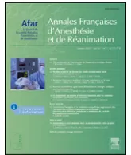

## RECOMMANDATIONS FORMALISÉES D'EXPERTS

# Prévention de la maladie thromboembolique veineuse postopératoire. Actualisation 2011. Texte court

## French Society of Anaesthesia and Intensive Care. Guidelines on perioperative venous thromboembolism prophylaxis. Update 2011. Short text

C.-M. Samamaa,\*, B. Gafsoub, T. Jeandela, S. Laportec, A. Steibd, E. Marrete,  
P. Albaladejof, P. Mismettic, N. Rosenchera

a Service d'anesthésie-réanimation, groupe hospitalier Cochin – Broca – Hôtel-Dieu, 1, place du Parvis-de-Notre-Dame, 75181 Paris cedex 04, France

b Service d'anesthésie-réanimation, hôpital Avicenne, Bobigny, 125, rue de Stalingrad, 93006 Bobigny cedex, France

c Service de pharmacologie clinique, hôpital Bellevue, CHU de Saint-Étienne, 29, boulevard Pasteur, 42055 Saint-Étienne cedex 2, France

d Département d'anesthésie-réanimation, hôpitaux universitaires de Strasbourg, 1, place de l'Hôpital, 67091 Strasbourg cedex, France

e Département d'anesthésie-réanimation, groupe hospitalier Saint-Antoine – Tenon – Trousseau, 4, rue de la Chine, 75020 Paris, France

f Pôle d'anesthésie-réanimation, département d'anesthésie-réanimation, CHU de Grenoble, BP 217, 38043 Grenoble cedex 09, France

Disponible sur Internet le 21 novembre 2011

**Mots clés :** Thrombose veineuse ; Embolie pulmonaire ; Chirurgie ; Hémorragies ; Anticoagulants ; Héparines ; Fondaparinux ; Dabigatran ; Rivaroxaban ; Apixaban

**Keywords:** Deep vein thrombosis; Pulmonary embolism; Surgery; Bleeding; Anticoagulant agents; Heparin; Fondaparinux; Dabigatran; Rivaroxaban; Apixaban

### I. GROUPES DE LECTURE

Groupe d'intérêt en hémostase périopératoire (GIHP)

Groupe d'étude sur l'hémostase et la thrombose (GEHT) de la Société française d'hématologie

Comité des référentiels de la Sfar

Conseil d'administration de la Sfar

Au total, près de 80 médecins ont relu ce document et proposé des modifications qui ont toutes été examinées et discutées par le groupe de travail.

### 2. FACTEURS DE RISQUE DE MALADIE THROMBOEMBOLIQUE VEINEUSE

Les recommandations concernant le type et la durée de la thromboprophylaxie pharmacologique s'appliquent à un groupe de patients sur la base d'une chirurgie.

Lorsque le risque de maladie thromboembolique veineuse (MTEV) lié à la chirurgie est élevé, la recommandation de prévenir la MTEV s'applique quels que soient les facteurs de risque de MTEV liés aux antécédents ou aux comorbidités du patient. Il s'agit d'une stratégie systématique, facile à diffuser sous la forme d'une procédure.

Lorsqu'une chirurgie est associée à un risque faible, si le patient présente un ou plusieurs facteurs de risque de MTEV, c'est une stratégie personnalisée qui s'applique.

Les situations qui augmentent significativement le risque thrombotique, indépendamment de la chirurgie, comprennent :

\* Auteur correspondant.

Adresse e-mail : marc.samama@htd.afhp.fr (C.M. Samama).<table border="1">
<thead>
<tr>
<th>Type de chirurgie</th>
<th>Thromboses veineuses profondes (TVP) totales phlébographiques (j7–j14) (%)</th>
<th>ETEV cliniques (%)</th>
<th>Niveau de risque</th>
</tr>
</thead>
<tbody>
<tr>
<td>Prothèse totale de hanche</td>
<td>50–60</td>
<td>3–5</td>
<td>Élevé</td>
</tr>
<tr>
<td>Prothèse totale de genou</td>
<td>50–60</td>
<td>2–3</td>
<td>Élevé</td>
</tr>
<tr>
<td>Fracture de hanche</td>
<td>50–60</td>
<td>4–6</td>
<td>Élevé</td>
</tr>
<tr>
<td>Polytraumatisme Sévère</td>
<td>50–70</td>
<td>–</td>
<td>Élevé</td>
</tr>
<tr>
<td>Traumatologie plateau tibial et fracture fémur</td>
<td>30–40</td>
<td>1</td>
<td>Élevé</td>
</tr>
<tr>
<td>Ligamentoplastie, rotule, fracture tibia, cheville tendon d'Achille, plâtre</td>
<td>10–20</td>
<td>1</td>
<td>Modéré</td>
</tr>
<tr>
<td>Arthroscopie simple, ménisectomie chirurgie du pied, ablation de matériel d'ostéosynthèse</td>
<td>0–5</td>
<td>&lt; 1</td>
<td>Faible</td>
</tr>
</tbody>
</table>

les antécédents d'évènement thromboembolique veineux (ETEV), la thrombophilie familiale majeure, le cancer, la chimiothérapie, l'insuffisance cardiaque ou respiratoire, l'hormonothérapie, la contraception orale, les accidents vasculaires cérébraux avec déficit neurologique, le postpartum, l'âge, l'obésité, l'alitement prolongé.

L'insuffisance rénale, en particulier sévère est un facteur de risque d'ETEV et de saignement postopératoire.

### 3. ORTHOPÉDIE ET TRAUMATOLOGIE

L'incidence des ETEV sans prophylaxie par type de chirurgie est synthétisée ci-dessous.

#### 3.1. Chirurgie orthopédique majeure : prothèse totale de hanche (PTH), prothèse totale du genou (PTG)

Après chirurgie orthopédique majeure, le risque thromboembolique est élevé et justifie une prescription systématique de mesures prophylactiques (1+).

Le risque d'ETEV est accru chez les patients opérés de chirurgie orthopédique majeure ayant :

- • un antécédent de MTEV ;
- • un antécédent de pathologie cardiovasculaire ou respiratoire ;
- • un âge supérieur à 85 ans.

Toute complication médicale postopératoire justifie un réexamen de la thromboprophylaxie médicamenteuse et, éventuellement, une extension de sa durée.

Bien que l'héparine non fractionnée (HNF) et les anti-coagulants oraux (AVK) réduisent d'environ 50 % le risque d'ETEV par rapport à l'absence de prophylaxie, quel que soit le type de chirurgie, ils sont moins efficaces que les héparines de bas poids moléculaire (HBPM). L'HNF à dose fixe et/ou ajustée et les AVK ne sont pas recommandés en première intention (1–).

En l'absence de données suffisantes, « l'aspirine » sans autre mesure prophylactique (pharmacologique ou mécanique) n'est pas recommandée en thromboprophylaxie (1–).

Les HBPM à dose prophylactique élevée, le fondaparinux, le dabigatran, le rivaroxaban et l'apixaban constituent cinq moyens prophylactiques de première intention (1+).

Les HBPM à dose prophylactique élevée représentent le traitement de référence (1+).

Le fondaparinux, anti-Xa indirect, à la dose sous-cutanée de 2,5 mg/j est supérieur aux HBPM en termes d'efficacité sur les ETEV majeurs. Cependant, il existe une incidence plus élevée d'hémorragies majeures sous fondaparinux par rapport aux HBPM, suggérant de ne pas utiliser le fondaparinux à cette dose chez les patients à risque hémorragique accru (2–).

Le dabigatran, anti-IIa direct oral, à la dose de 220 mg/j ou 150 mg/j est non inférieur aux HBPM en termes d'efficacité sur les ETEV majeurs. L'incidence des hémorragies majeures apparaît plus faible avec la dose de 150 mg/j sans que ce soit significatif. Pour les patients âgés de plus de 75 ans et les patients insuffisants rénaux modérés, la dose de 150 mg/j est suggérée (2+). En cas de risque thromboembolique surajouté (risque lié au patient, en dehors de l'âge élevé), nous suggérons de ne pas utiliser le dabigatran à la dose de 150 mg/j (2–).

Le rivaroxaban, anti-Xa direct oral, à la dose de 10 mg/j est supérieur aux HBPM en termes d'efficacité sur les ETEV majeurs et symptomatiques avec une tendance à l'augmentation du risque hémorragique. En cas de risque thromboembolique surajouté (risque lié au patient), nous suggérons d'utiliser le rivaroxaban (2+). En cas de risque hémorragique élevé (risque lié au patient), nous suggérons de ne pas utiliser le rivaroxaban (2–).

L'apixaban, anti-Xa direct oral, à la posologie de 5 mg/jour (2,5 mg × 2/j) est supérieur aux HBPM sur les ETEV majeurs, sans réduction des événements symptomatiques. L'incidence des hémorragies n'est pas différente de celle observée avec les HBPM. En conséquence, en cas de risque thromboembolique surajouté (risque lié au patient), nous suggérons d'utiliser l'apixaban (2+).

Les moyens prophylactiques mécaniques, notamment la compression pneumatique intermittente (CPI), réduisent le risque TE postopératoire en orthopédie. En l'absence de comparaison directe avec les autres moyens prophylactiques, nous recommandons de ne pas les utiliser seuls en première intention (1–). Les moyens mécaniques représentent une alternative et ils sont recommandés en cas de risque hémorragique contre-indiquant un traitement antithrombotique pharmacologique (1+). Ils peuvent également être associés à un traitement antithrombotique pharmacologique (2+). Lorsque ces moyens sont prescrits, ils doivent être impérativement surveillés afin de s'assurer de l'observance thérapeutique ; les bas de contention doivent être parfaitement adaptés à l'anatomie des patients afin d'assurer leur rapport bénéfice/risque (2+).

Le risque thromboembolique et le risque hémorragique sous HBPM ne semblent pas modifiés par une administration préopératoire (12 heures avant la chirurgie) ou postopératoire (12 heures après la chirurgie) alors qu'une administration périopératoire (comprise entre deux heures avant et six heures après la chirurgie) s'accompagne d'un surcroît de risque hémorragique. Compte tenu du recours fréquent à des techniques d'anesthésie locorégionale, l'administrationpréopératoire devrait être évitée. Un début de prophylaxie « postopératoire » avec les HBPM est préférable (2+).

Avec le fondaparinux, la première injection avant la huitième heure postopératoire augmente le risque hémorragique. La première injection de fondaparinux ne doit pas être faite avant, au minimum, huit heures postopératoire et peut être réalisée jusqu'à 18 heures, au maximum, en postopératoire (1+).

Le dabigatran doit être débuté entre une à quatre heures en postopératoire avec la moitié de la dose journalière le jour de l'intervention (75 mg en cas d'insuffisance rénale modérée et/ou de poids corporel inférieur à 50 kg et/ou d'âge supérieur à 75 ans, 110 mg dans tous les autres cas) (1+).

Le rivaroxaban doit être débuté six à huit heures en postopératoire à la dose de 10 mg/j (1+).

L'apixaban doit être débuté 12 à 24 heures en postopératoire à la dose de 2,5 mg matin et soir (1+).

Une prophylaxie prolongée par HBPM, fondaparinux, dabigatran, rivaroxaban ou apixaban jusqu'au 35e jour postopératoire réduit le risque d'ETEVT majoré après PTH sans augmentation du risque hémorragique majeur. Il est recommandé de prescrire une thromboprophylaxie médicamenteuse jusqu'au 35e jour postopératoire après PTH (1+).

Une prophylaxie par HBPM, fondaparinux, dabigatran, rivaroxaban ou apixaban jusqu'au 14e jour postopératoire après PTG est recommandée (1+).

Une prophylaxie prolongée par HBPM jusqu'au 35e jour postopératoire après PTG peut encore réduire le risque thromboembolique majeur.

Il est donc suggéré de prescrire une thromboprophylaxie médicamenteuse jusqu'au 35e jour postopératoire après PTG (2+).

Que ce soit pour la PTH ou la PTG, la réalisation d'un écho-Doppler veineux systématique avant la sortie n'est pas recommandée (1–).

### 3.2. Chirurgie orthopédique majeure : fracture de hanche (FH)

Le risque d'ETEVT est augmenté chez les patients présentant une FH opérée et les facteurs de risque suivants :

- • un antécédent de MTEVT ;
- • une durée d'intervention plus de deux heures ;
- • des varices ou un syndrome post-phlébitique ;
- • un délai entre la FH et la chirurgie plus de 48 heures.

Toute complication médicale postopératoire justifie un réexamen de la thromboprophylaxie médicamenteuse et éventuellement une extension de sa durée.

Bien que l'HNF et les AVK réduisent d'environ 40 % le risque d'ETEVT par rapport à l'absence de prophylaxie, l'HNF est moins efficace que les HBPM. L'HNF à dose fixe et/ou ajustée ou les AVK ne sont pas recommandés en première intention (1–). Compte tenu en plus du risque hémorragique associé à ces traitements, nous suggérons que cette recommandation s'applique également en cas d'insuffisance rénale (2+).

Aucune donnée spécifique, suffisamment convaincante n'est disponible sur l'aspirine dans la FH. L'aspirine sans autre mesure

prophylactique (pharmacologique ou mécanique) n'est pas recommandée en thromboprophylaxie (1–).

Les HBPM et le fondaparinux représentent deux moyens prophylactiques de première intention (1+).

Le dabigatran, le rivaroxaban et l'apixaban n'ont pas d'indication dans la FH.

Les HBPM réduisent le risque d'ETEVT par rapport à l'HNF, avec une tendance à la réduction du risque d'hématomes de paroi.

Le fondaparinux, à la dose de 2,5 mg/j est plus efficace que les HBPM sur le risque de TVP asymptomatiques (distales et proximales) au prix d'une augmentation du risque hémorragique majeur. En cas de facteurs de risque hémorragique associés (notamment en cas d'insuffisance rénale modérée), nous suggérons d'utiliser plutôt une HBPM (2+).

Le début de la prophylaxie par HBPM doit se faire dès l'arrivée du patient, si l'intervention est prévue plus de 12 h après l'arrivée (1+).

Avec le fondaparinux, la première injection avant la huitième heure postopératoire augmente le risque hémorragique. La première injection de fondaparinux ne doit pas être faite avant, au minimum, huit heures postopératoire et peut être réalisée jusqu'à 18 heures, au maximum, en postopératoire (1+).

En cas de chirurgie différée, le fondaparinux ne pouvant être administré en préopératoire, une administration préopératoire d'HBPM est recommandée, le délai entre la dernière injection d'HBPM et la chirurgie devant être supérieur à 12 heures (1+).

Une prophylaxie par fondaparinux jusqu'au 35e jour postopératoire réduit le risque thromboembolique après FH sans augmentation du risque hémorragique majeur.

Il est recommandé de prescrire une prophylaxie médicamenteuse jusqu'au 35e jour postopératoire en cas de FH (1+).

La réalisation d'un écho-Doppler veineux systématique avant la sortie n'est pas recommandée (1–).

### 3.3. Traumatologie : fracture du fémur et du plateau tibial

Les HBPM réduisent le risque d'ETEVT avec un risque hémorragique considéré comme acceptable par rapport à l'HNF chez le traumatisé sévère. Les HBPM représentent le traitement de référence (1+).

Par analogie au patient polytraumatisé, les mêmes recommandations peuvent être suggérées pour les fractures articulaires du genou (2+).

La compression pneumatique intermittente réduit le risque TE sans augmentation du risque hémorragique. En cas de risque hémorragique accru, les moyens mécaniques et notamment la compression pneumatique intermittente (si applicable) sont recommandés (1+).

### 3.4. Ligamentoplastie, fracture rotule, tibia, cheville, tendon d'Achille, plâtre

Les HBPM réduisent le risque d'ETEVT asymptomatique sans augmentation significative du risque hémorragique majeur dans ces situations. Compte tenu du risque TE modéré, laprescription d'HBPM est recommandée (1+). Toutefois, une prophylaxie prolongée pendant l'immobilisation est suggérée jusqu'à l'appui plantaire (2–).

### 3.5. Arthroscopie simple, ménisectomie, chirurgie du pied, ablation de matériel d'ostéosynthèse

Compte tenu du risque TE faible, il est suggéré de ne pas faire de thromboprophylaxie pharmacologique (2–).

Si le patient présente un ou plusieurs facteurs de risque TE surajoutés, une thromboprophylaxie par HBPM peut être envisagée (2+).

Dans ce cas, la durée de la prophylaxie ne devrait pas dépasser dix jours (2+).

La thromboprophylaxie par HBPM doit être débutée en postopératoire sauf en cas de chirurgie retardée ou différée (2+).

## 4. POLYTRAUMATOLOGIE

Le polytraumatisme sévère représente une pathologie à risque thromboembolique élevé pour laquelle il convient de mettre en œuvre une thromboprophylaxie médicamenteuse (1+).

Il est suggéré d'utiliser une thromboprophylaxie mécanique en cas de contre-indication aux anticoagulants (2+).

Il est recommandé de ne pas utiliser de faibles doses d'HNF (1–).

Il est suggéré de débuter la thromboprophylaxie dans les 36 heures suivant l'admission et de la poursuivre en l'absence d'évènement hémorragique (2+).

En cas de risque d'ETEV majeur surajouté, il est suggéré, en cas de contre-indication aux HBPM et aux moyens mécaniques, d'utiliser en dernier recours une interruption partielle de la veine cave inférieure par filtre cave (2+). Dans cette situation, il est suggéré d'utiliser un filtre cave temporaire (2+) et le cas échéant, il est recommandé de prévoir d'emblée le retrait du filtre à distance du traumatisme (1+).

## 5. CHIRURGIE PLASTIQUE ET ESTHÉTIQUE

L'incidence des ETEV sans prophylaxie par type de chirurgie est synthétisée ci-dessous.

<table border="1">
<thead>
<tr>
<th>Type de chirurgie</th>
<th>TVP (%)</th>
<th>Embolie pulmonaire (EP) (%)</th>
<th>Niveau de risque</th>
</tr>
</thead>
<tbody>
<tr>
<td>Abdominoplastie</td>
<td>1,1</td>
<td>0,9</td>
<td>Élevé</td>
</tr>
<tr>
<td>Lipoaspiration</td>
<td>0,03 à 0,6</td>
<td>0,01 à 1,1</td>
<td>Modéré</td>
</tr>
<tr>
<td>Dermolipectomie</td>
<td>0,15</td>
<td>0,05</td>
<td>Modéré</td>
</tr>
<tr>
<td>Chirurgie mammaire reconstructrice</td>
<td>ND</td>
<td>1,8</td>
<td>Modéré</td>
</tr>
<tr>
<td>Chirurgie mammaire esthétique (réduction ou prothèse)</td>
<td>0,01 à 0,03</td>
<td>ND</td>
<td>Faible</td>
</tr>
<tr>
<td>Lifting</td>
<td>0,04 à 0,35</td>
<td>0,1 à 0,14</td>
<td>Faible</td>
</tr>
</tbody>
</table>

ND : non documenté

Une thromboprophylaxie médicamenteuse n'est pas recommandée pour un lifting (1–).

Il est suggéré d'appliquer une prophylaxie mécanique (bas antithrombose et/ou CPI), en cas de lifting (2+).

Il est suggéré d'utiliser une prophylaxie médicamenteuse par HBPM dans les dermolipectomies ou les lipoaspirations, y compris chez des patients à risque de saignement postopératoire (2+).

Il est suggéré qu'une prophylaxie mécanique (bas anti thrombose et/ou CPI) soit mise en œuvre systématiquement (2+).

Une thromboprophylaxie par HBPM à dose prophylactique élevée est recommandée en association à une prophylaxie mécanique en postopératoire d'abdominoplastie, (1+).

Il est recommandé de mettre en place des bas de contention dès l'arrivée au bloc en préopératoire d'abdominoplastie (1+).

Il est recommandé de poursuivre la thromboprophylaxie pendant sept à dix jours (1+).

## 6. CHIRURGIE BARIATRIQUE

La chirurgie bariatrique est une chirurgie à risque thromboembolique élevé pour laquelle nous recommandons une thromboprophylaxie médicamenteuse (1+).

Il est suggéré d'utiliser une HBPM (2+).

Il est suggéré d'augmenter les doses journalières sans dépasser 10 000 UI anti-Xa/j (2+).

Il est suggéré de prescrire l'HBPM en deux injections sous-cutanées par jour (2+).

Aucune étude ne permet d'établir des recommandations pour le début (pré- ou postopératoire) ou pour la durée optimale de la prophylaxie. Par analogie avec la chirurgie digestive, nous recommandons une durée minimale de dix jours en postopératoire (2+).

Il est suggéré d'associer la compression pneumatique intermittente (CPI) à la prophylaxie médicamenteuse (2+).

Il n'est pas recommandé d'utiliser des techniques d'interruption partielle de la veine cave inférieure dans ce cadre (1–).

## 7. CHIRURGIE DIGESTIVE

<table border="1">
<thead>
<tr>
<th>Risque chirurgical</th>
<th>Risque lié au patient</th>
<th>Recommandations</th>
</tr>
</thead>
<tbody>
<tr>
<td><i>Faible</i> Varices</td>
<td>–</td>
<td>Bas de contention Pas de mesure particulière</td>
</tr>
<tr>
<td>Chirurgie abdominale non majeure : appendice, vésicule non inflammatoire, proctologie, chirurgie pariétale</td>
<td>+</td>
<td>HBPM doses modérées (2000 à 3000 UI aXa)</td>
</tr>
<tr>
<td><i>Modéré</i> Dissection étendue et/ou hémorragique</td>
<td>–</td>
<td>HBPM doses modérées</td>
</tr>
</tbody>
</table>(Suite)

<table border="1">
<thead>
<tr>
<th>Risque chirurgical</th>
<th>Risque lié au patient</th>
<th>Recommandations</th>
</tr>
</thead>
<tbody>
<tr>
<td>Durée opératoire anormalement prolongée</td>
<td>+</td>
<td>HBPM doses élevées (4000 à 5000 UI aXa) Fondaparinux 2,5 mg/j</td>
</tr>
<tr>
<td>Urgences</td>
<td></td>
<td></td>
</tr>
<tr>
<td>Élevé</td>
<td></td>
<td></td>
</tr>
<tr>
<td>Chirurgie abdominale majeure : foie, pancréas, côlon, maladie inflammatoire ou cancéreuse du tractus digestif</td>
<td></td>
<td>HBPM doses élevées Fondaparinux 2,5 mg/j Avec bas de contention associés</td>
</tr>
</tbody>
</table>

Il est recommandé de réaliser une thromboprophylaxie par HBPM à dose élevée (AMM) ou fondaparinux à la dose de 2,5 mg/j après chirurgie abdominale carcinologique (I+).

Il est recommandé de prolonger la durée de la thromboprophylaxie pendant 1 mois après une chirurgie majeure abdomino-pelvienne (I+).

Disponible en ligne sur  
**SciVerse ScienceDirect**  
[www.sciencedirect.com](http://www.sciencedirect.com)

Elsevier Masson France  
**EM|consulte**  
[www.em-consulte.com](http://www.em-consulte.com)

## Erratum

Erratum à « Prévention de la maladie thromboembolique veineuse postopératoire. Actualisation 2011. Texte court »  
[Ann Fr Anesth Reanim 2011;30(12):947–51]

*Erratum to “French Society of Anaesthesia and Intensive Care. Guidelines on perioperative venous thromboembolism prophylaxis. Update 2011. Short text”*  
[Ann Fr Anesth Reanim 2011;30(12):947–51]

C.-M. Samamaa,\*, B. Gafsoub, T. Jeandela, S. Laportec, A. Steibd, E. Marrete, P. Albaladejof,  
P. Mismettic, N. Rosenchera

a Service d'anesthésie-réanimation, groupe hospitalier Cochin-Broca Hôtel-Dieu, 1, place du Parvis-de-Notre-Dame, 75181 Paris cedex 04, France

b Service d'anesthésie-réanimation, hôpital Avicenne, Bobigny, 125, rue de Stalingrad, 93006 Bobigny cedex, France

c Service de pharmacologie clinique, hôpital Bellevue, CHU de Saint-Étienne, 29, boulevard Pasteur, 42055 Saint-Étienne cedex 2, France

d Département d'anesthésie-réanimation, CHU, hôpitaux universitaires de Strasbourg, 1, place de l'Hôpital, 67091 Strasbourg cedex, France

e Département d'anesthésie-réanimation, groupe hospitalier Saint-Antoine-Tenon-Trousseau, 4, rue de la Chine, 75020 Paris, France

f Pôle d'anesthésie-réanimation, CHU de Grenoble, BP 217, 38043 Grenoble cedex 09, France

Une erreur s'est glissée dans le volume 30, numéro 12/2011 des *Annales françaises d'anesthésie-réanimation*.

Dans la rubrique Recommandations formalisées d'experts, pages 949–950, dans le paragraphe 3.4. Ligamentoplastie, fracture rotule, tibia, cheville, tendon d'Achille, plâtre, il fallait lire :

Les HBPM réduisent le risque d'ETEV asymptomatique sans augmentation significative du risque hémorragique majeur dans ces situations. Compte tenu du risque TE modéré, la prescription d'HBPM est recommandée (1+). Toutefois, une prophylaxie prolongée pendant l'immobilisation est suggérée jusqu'à l'appui plantaire (2+).

Nous prions nos lecteurs de nous excuser de cette erreur.

DOI de l'article original: [10.1016/j.annfar.2011.10.008](https://doi.org/10.1016/j.annfar.2011.10.008)

\* Auteur correspondant.

Adresse e-mail : [marc.samama@htd.aphp.fr](mailto:marc.samama@htd.aphp.fr) (C.-M. Samama).