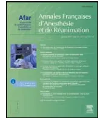

Disponible en ligne sur  
 ScienceDirect  
 www.sciencedirect.com

Elsevier Masson France  
 EMconsulte  
 www.em-consulte.com

Recommandations formalisées d'experts

## Prévention du risque allergique peranesthésique. Texte court

### *Reducing the risk of anaphylaxis during anaesthesia. Short text*

Société française d'anesthésie et réanimation (Sfar)a,\*, Société française d'allergologie (SFA)b

a 74, rue Raynouard, 75016 Paris, France

b Institut Pasteur, 28, rue du Dr-Roux, 75724 Paris cedex 15, France

Le travail de réactualisation des RPC « prévention du risque allergique peranesthésique » est le résultat d'une collaboration entre des experts de la Société française d'anesthésie et réanimation (Sfar) et ceux de la Société française d'allergologie (SFA). Les recommandations réactualisées avaient été élaborées en 2001 à l'initiative de la Sfar et de la Société française d'allergologie et d'immunologie (SFAIC devenue SFA) et publiées en 2002.

Les supports bibliographiques parus dans les dix dernières années ont été extraits à partir de trois bases de données : la base Medline, la base Pascal et la base Embase. Des bibliographies personnelles des experts ont été ajoutées et des bibliographies dérivées des références des articles retenus ont également été prises pour références.

La réactualisation des recommandations a été réalisée selon un schéma en six questions posées aux experts, pour répondre aux interrogations les plus fréquentes relatives à la prévention du risque allergique peranesthésique :

- • Question 1. Quelle est la réalité du risque d'hypersensibilité allergique en anesthésie ?
- • Classification. Incidence. Aspects cliniques (immédiats et retardés). Morbidité–mortalité. Substances responsables.
- • Question 2. Mécanismes de la sensibilisation et de l'hypersensibilité immédiate aux anesthésiques – Physiopathologie du choc.
- • Question 3. Conduite du bilan diagnostique de la réaction d'hypersensibilité immédiate.
- • Question 4. Facteurs favorisant une réaction d'hypersensibilité et place du bilan allergologique préanesthésique
- • Question 5. Prévention primaire et secondaire. Prémédication et techniques anesthésiques – préparation des patients.
- • Question 6. Traitement des réactions d'hypersensibilité immédiates et, en particulier, du choc anaphylactique survenant en cours d'anesthésie.

Les niveaux de preuve et la force des recommandations retenus ont été établis à partir de la méthode GRADE, modifiés et agréés par le comité des référentiels de la Sfar.

Les niveaux de preuve retenus à partir des études publiées dans les revues avec comités de lecture sont :

- • un niveau de preuve élevé :
  - ◦ l'essai randomisé contrôlé,
  - ◦ le méta-analyse ;
- • un niveau de preuve bas :
  - ◦ l'étude « tout ou rien »,
  - ◦ les études contrôlées de validation de tests diagnostiques,
  - ◦ les études prospectives de cohortes parallèles, études « exposés–non exposés » prospectives, études cas-témoins ;
- • un niveau de preuve très bas :
  - ◦ autre type d'étude.

Selon ces critères, la méthode de classement du niveau global de preuve retenue est :

- • NP1 = une preuve globale forte (les recherches futures ont peu de chances de modifier la confiance que l'on peut avoir en l'estimation de l'effet ou du risque) :
  - ◦ une ou plusieurs méta-analyses concordantes, classées haut niveau,
  - ◦ au moins une étude classée « haut niveau » dont les résultats sont non contradictoires avec les autres études de « haut niveau » ou de « bas niveau »,
  - ◦ au moins deux études classées « bas niveau », non contradictoires, démontrant un risque relatif supérieur à 2 ou inférieur à 0,5 ;
- • NP2 = une preuve globale modérée (il est possible que les recherches futures modifient l'effet ou le risque estimé et la confiance que l'on peut avoir dans cette estimation) :
  - ◦ deux études « bas niveau » ou plus, non contradictoires, mais avec risque relatif < 2 ou > 0,5 dans toutes ces études, ou dans toutes sauf une étude ;
- • NP3 = une preuve globale faible (il est probable que les recherches futures modifient l'effet ou le risque estimé et la confiance que l'on peut avoir dans cette estimation) :
  - ◦ plusieurs études de « bas niveau », dont certaines contradictoires, mais avec une majorité se dégageant pour un effet favorable ou défavorable ;

\* Auteur correspondant.

Adresse e-mail : jmmalinovsky@chu-reims.fr (Société française d'anesthésie et réanimation (Sfar)).- • NP4 = une preuve globale très faible (toute estimation de l'effet de l'intervention thérapeutique ou préventive, ou toute estimation du risque est incertaine) :
  - ◦ études de « haut niveau » contradictoires,
  - ◦ uniquement des études de « très bas niveau », cohérentes entre elles ou non.

#### Comité d'organisation

Président : Pr Jean Marc Malinovsky (Reims) [jmmalinovsky@chu-reims.fr](mailto:jmmalinovsky@chu-reims.fr).

Chargés de projet :

- • Pr Christophe BAILLARD (Bobigny) ;
- • Dr Dragos RADU (Paris).

Membres :

- • Pr Francis BONNET (Paris) ;
- • Pr Pascal DEMOLY (Montpellier) ;
- • Pr Jean-Louis GUEANT (Nancy) ;
- • Dr François LAVAUD (Reims) ;
- • Pr Francisque LEYNADIER (Paris) ;
- • Pr Dan LONGROIS (Paris) ;
- • Pr Jean MARTY (Paris) ;
- • Pr Paul Michel MERTES (Nancy) ;
- • Pr Denise Anne MONERET-VAUTRIN (Nancy) ;
- • Pr Marc SAMAMA (Paris) ;
- • Pr Daniel VERVLOËT (Marseille).

#### Groups de travail

Président : Pr Paul Michel MERTES (Nancy).

Membres :

- • Dr Nissen Abuaf, Paris ;
- • Dr Bassam Al Nasser, Beauvais ;
- • Dr Isabelle Aimone-Gastin, Nancy ;
- • Pr Yves Auroy, Clamart ;
- • Dr Étienne Beaudoin, Épinal ;
- • Dr Yves Benoît, Lyon ;
- • Pr Frédéric Berard, Lyon ;
- • Dr Marie Bruyère, Clamart ;
- • Pr Isabelle Constant, Paris ;
- • Dr Fanny Codreanu, Luxembourg ;
- • Pr Bertrand Debaene, Poitiers ;
- • Me Germain Decroix, Paris La Défense ;
- • Pr Gilles Dhonneur, Bondy ;
- • Dr Martine Drouet, Angers ;
- • Dr Isabelle Durand Zaleski, Crêteil ;
- • Dr Sophie Orlowski-Fremont, Nancy ;
- • Pr Jacques Fuscirdi, Tours ;
- • Dr Marie-Laure Germain, Reims ;
- • Dr Laurence Guilloux, Lyon ;
- • Pr Gisèle Kanny, Nancy ;
- • Dr Chantal Karila, Paris ;
- • Dr Dominique Laroche, Caen ;
- • Pr Corinne Lejus, Nantes ;
- • Dr Marie-Madeleine Lucas, Rennes ;
- • Pr Antoine Magnan, Nantes ;
- • Pr Frédéric Mercier, Clamart ;
- • Dr Claudie Mouton-Faivre, Nancy ;
- • Pr Benoît Plaud, Paris ;
- • Pr Claude Ponvert, Paris ;
- • Dr Jean Sainte-Laudy, Limoges ;
- • Pr Benoît Vallet, Lille.

#### Groupe de lecture.

- • Dr Michel Abbal, Toulouse ;
- • Dr Béatrice Benabes, Amiens ;
- • Pr Laurent Beydon, Angers ;
- • Dr Françoise Bienvenu, Pierre-Bénite ;
- • Dr Joelle Birnbaum allergologue, Marseille ;
- • Dr Marie-Caroline Bonnet-Boyer, Montpellier ;
- • Dr Maryline Bordes, Bordeaux ;
- • Dr Marie Fazia Boughenou, Paris ;
- • Dr Aness Bouhamida, Alger ;
- • Dr Michel Bouvier, Lyon ;
- • Dr Sylvia Caboni, Viale Marconi, Italie ;
- • Dr Suzanne Carme, Albi ;
- • Dr Philippe Carre, Tours ;
- • Pr Sylvie Chollet-Martin, Paris ;
- • Mme Nathalie Commun, Nancy ;
- • Pr Antoine Coquerel, Caen ;
- • Dr Christian Cottineau, Angers ;
- • Dr Yvonne Delaval, Rennes ;
- • Pr Alain Didier, Toulouse ;
- • Pr Bertrand Dureuil, Rouen ;
- • Dr Rolande Dubost-Ferrenq, Pierre-Bénite ;
- • Dr Jacques Dubost, Pierre-Bénite ;
- • Dr Nathalie Diot-Junique, Lyon ;
- • Dr Olivier Eve, Lyon ;
- • Dr Alain Facon, Lille ;
- • Dr Christine Fessenmeyer, Le Kremlin-Bicêtre ;
- • Dr Régis Fuzier, Toulouse ;
- • Dr Marc Gentili, Saint-Grégoire ;
- • Dr Jacques Gayraud, Tarbes ;
- • Dr Dominique Giamarchi, Montauban ;
- • Dr Olivier Giraud, Lyon ;
- • Dr Stéphane Guez, Bordeaux ;
- • Dr Marie-Thérèse Guinnepain, Suresnes ;
- • Dr Claude Jacquot, Grenoble ;
- • Dr Marie-Alix Kimmoun-Regnier, Nancy ;
- • Dr Anne-Marie Korinek, Paris ;
- • Dr Jérôme Laurent, Paris ;
- • Pr Marie-Claire Laxenaire, Nancy ;
- • Dr Luisa Lombardelli, Parme, Italie ;
- • Dr Nathalie Louvier, Dijon ;
- • Dr Philippe Mahiou, Échirolles ;
- • Pr Pierre Maurette, Bordeaux ;
- • Dr Yannick Meunier, Rouen ;
- • Dr Christine Mullet, Lyon ;
- • Dr Catherine Neukirch, Paris ;
- • Pr Jean-François Nicolas, Lyon ;
- • Dr Gisèle Occelli, Nice ;
- • Pr Michel Ollagnier, Saint-Étienne ;
- • Dr Sophie Orlowski-Fremont, Nancy ;
- • Dr Isabelle Orsel, CHU Limoges ;
- • Pr Yves Pacheco, Pierre-Bénite ;
- • Dr Mélanie Perquin, Amiens ;
- • Dr Jean-Marie Renaudin, Épinal ;
- • Dr Françoise Rochefort-Morel, Rennes ;
- • Dr Philippe Scherer, Chalon-sur-Saône ;
- • Pr Michel Schmitt, Nancy ;
- • Dr Jacqueline Seraphin Jean-Charles, Dijon ;
- • Dr Rodolphe Stenger, Strasbourg ;
- • Dr Jocelyne Valfrey, Strasbourg ;
- • Dr Véronique Suars, Mont-Godinne, Belgique ;
- • Dr Marion Verdaguer, Poitiers ;
- • Dr François Wessel, Nantes ;## Définitions

**1. Réaction allergique :** réaction immunologique pathologique lors d'un contact renouvelé avec un antigène survenant chez un individu sensibilisé. La période de sensibilisation préalable est silencieuse et prend au minimum dix jours. L'allergie ou hypersensibilité allergique est liée à la production d'anticorps spécifiques IgE spécifiques (hypersensibilité allergique immédiate) ou de cellules sensibilisées, les lymphocytes T (hypersensibilité allergique retardée).

**2. Réactions d'hypersensibilité :** les réactions d'hypersensibilité immédiate peuvent être allergiques (habituellement liée à la présence d'IgE spécifiques, parfois d'IgG) ou non allergiques (anciennement réactions anaphylactoides, le plus souvent par histaminolibération non spécifique). Les réactions d'hypersensibilité retardée allergiques surviennent après un intervalle libre excédant une à deux heures et sont le plus souvent d'expression cutanée.

**3. Anaphylaxie ou réaction anaphylactique :** terme réservé à une réaction grave d'hypersensibilité immédiate allergique ou non allergique.

**4. Atopie :** susceptibilité anormale d'un organisme à synthétiser des IgE spécifiques contre des antigènes naturels de l'environnement introduits par voies naturelles (asthme allergique aux pollens, allergie alimentaire, allergie au latex).

**5. Sfar :** Société française d'anesthésie et de réanimation, 74, rue Raynouard, 75016 Paris. Site web : [www.sfar.org](http://www.sfar.org).

**6. SFA :** Société française d'allergologie, Institut Pasteur, 28, rue du Docteur-Roux, 75724 Paris cedex 15. Site web : [www.lesallergies.fr](http://www.lesallergies.fr).

## 1. Quelle est la réalité du risque d'hypersensibilité allergique en anesthésie ? Classification. Incidence. Aspects cliniques (immédiats et retardés). Morbidité–mortalité. Substances responsables

1.1. Parmi les réactions d'hypersensibilité immédiates survenant en situation d'anesthésie, environ 60 % sont IgE-dépendantes (réaction d'hypersensibilité immédiate allergique) (NP2).

1.2. Plus de 7000 cas de réactions d'hypersensibilité immédiates IgE-dépendantes peranesthésiques ont été publiés ces 25 dernières années (NP2).

1.3. La majorité des cas provient de France, d'Australie, de Nouvelle-Zélande et, plus récemment de Scandinavie, grâce à l'organisation mise en place par ces pays pour le diagnostic des réactions, et à la stratégie de communication orale et écrite qu'ils entretiennent dans le monde médical.

1.4. L'exploration et la déclaration en pharmacovigilance ou en matériovigilance des réactions d'hypersensibilité doivent être systématiques. La constitution de réseaux de consultations spécialisées, d'observatoires et de registres doit être encouragée.

1.5. La mortalité des réactions d'hypersensibilité immédiates peranesthésiques varie de 3 à 9 % selon les pays (NP2). La morbidité la plus sévère s'exprime par des séquelles anoxiques cérébrales plus ou moins graves. Son incidence n'est pas précisément connue.

1.6. L'incidence des réactions d'hypersensibilité immédiates allergiques peranesthésiques varie selon les pays de 1/10 000 à 1/20 000 anesthésies (NP2). Elle a été évaluée en France, en 1996, à 1/13 000 anesthésies générales et locorégionales, toutes substances responsables confondues. L'incidence de l'anaphylaxie aux curares varie selon les pays. Elle a été estimée à 1/6 500 anesthésies ayant comporté un curare en France, et à 1/5200 en Norvège (NP2).

1.7. Les substances responsables des réactions allergiques immédiates survenues en cours d'anesthésie ont été identifiées à partir des cas d'anaphylaxie publiés depuis 1980 dans la littérature de langues anglaise et française. Les curares représentent 62,6 %

d'entre elles, le latex 13,8 %, les hypnotiques 7,2 %, les antibiotiques 6 %, les substitués du plasma 3,2 %, les morphiniques 2,4 % (NP2). L'allergie aux anesthésiques locaux apparaît exceptionnelle compte tenu de la fréquence d'utilisation des anesthésiques locaux. Aucune réaction anaphylactique n'a été publiée avec les anesthésiques halogénés (NP2). D'autres substances peuvent induire une anaphylaxie en cours d'anesthésie : aprotinine, chlorhexidine, protamine, papaïne, héparine, bleu patenté ou de méthylène.

1.8. Tous les curares peuvent être à l'origine d'une réaction d'hypersensibilité immédiate. Les réactions peuvent survenir dès la première administration. Le curare le plus fréquemment impliqué dans les réactions immédiates allergiques est le suxaméthonium (NP2). Une sensibilisation croisée entre différents curares est possible.

1.9. Les manifestations cliniques sont décrites suivant quatre grades de gravité croissante (adapté de la classification de Ring et Messmer) (Tableau 1).

1.10. Les manifestations cliniques sont souvent plus graves et plus durables en cas de réaction d'hypersensibilité immédiate allergique qu'en cas de réaction d'hypersensibilité immédiate non allergique (NP2). Les signes cliniques ne sont pas toujours au complet, et peuvent prendre des masques trompeurs. L'absence de signes cutanéomuqueux n'exclut pas le diagnostic d'anaphylaxie (NP2). La symptomatologie est de survenue immédiate après l'injection des médicaments de l'induction anesthésique mais peut être de survenue tardive (jusqu'à plus d'une heure) si le latex ou les colorants sont responsables.

1.11. Les substances potentiellement responsables de choc anaphylactique chez l'enfant sont les mêmes que chez l'adulte, mais l'allergène le plus fréquemment en cause est le latex, en particulier chez l'enfant multiopéré et porteur de spina bifida, ce qui justifie la mise en place d'une stratégie de prévention primaire de la sensibilisation au latex. (NP1).

1.12. Les réactions d'hypersensibilité non immédiates impliquant les produits de l'anesthésie sont peu fréquentes. Elles sont principalement décrites avec les anesthésiques locaux (NP2), les antibiotiques, les antiseptiques, les héparines et les produits de contraste iodés ou gadolinés (NP2).

## 2. Mécanismes de la sensibilisation et de l'hypersensibilité immédiate aux anesthésiques – physiopathologie du choc

2.1. La réaction d'hypersensibilité immédiate allergique est un cas particulier de la réaction inflammatoire spécifique d'un allergène reconnu par les effecteurs du système immunitaire du patient allergique. La présentation antigénique va déterminer l'orientation de la réponse vers la différenciation d'effecteurs de l'allergie (lymphocytes TCD4+ Th1 ou Th2, lymphocytes TCD8+ cytotoxiques, lymphocytes B producteurs d'IgE). Le phénomène de tolérance serait la conséquence de la différenciation des lymphocytes en lymphocytes T régulateurs (NP2).

2.2. La réaction d'hypersensibilité allergique immédiate résulte d'une activation des lymphocytes Th2. La réaction d'hypersensibilité allergique non immédiate est associée à une activation de

**Tableau 1**

Score de gravité des manifestations cliniques au cours des réactions d'hypersensibilité immédiates.

<table border="1">
<tbody>
<tr>
<td>I</td>
<td>Signes cutanéomuqueux généralisés : érythème, urticaire, avec ou sans œdème</td>
</tr>
<tr>
<td>II</td>
<td>Atteinte multiviscérale modérée, avec signes cutanéomuqueux, hypotension artérielle (chute systolique &gt; 30 %) et tachycardie (&gt; 30 %), hyperréactivité bronchique (toux, difficulté ventilatoire)</td>
</tr>
<tr>
<td>III</td>
<td>Atteinte multiviscérale sévère menaçant la vie et imposant une thérapie spécifique = collapsus, tachycardie ou bradycardie, troubles du rythme cardiaque, bronchospasme ; les signes cutanés peuvent être absents ou n'apparaître qu'après la remontée tensionnelle.</td>
</tr>
<tr>
<td>IV</td>
<td>Arrêt circulatoire et/ou respiratoire</td>
</tr>
</tbody>
</table>lymphocytes de « profil Th1 », avec production d'IFN- $\gamma$  à l'origine des phénomènes de cytotoxicité (NP2).

2.3. L'hypersensibilité allergique immédiate est liée à la production d'immunoglobulines de type E (IgE). Les antigènes des médicaments sont rarement identifiés.

2.4. Pour les médicaments, une partie de la molécule, appelée épitope, est responsable de la réaction allergique. La molécule native ou un de ses métabolites peuvent jouer le rôle d'haptène et se lier à une protéine. Une partie de cet ensemble se lie à une molécule du complexe majeur d'histocompatibilité (MHC) au cours de sa digestion dans une cellule présentatrice de l'allergène. L'ensemble ainsi formé est reconnu de façon spécifique et déclenche la réaction allergique (NP2). Un autre mécanisme de sensibilisation, original et spécifique de l'allergie médicamenteuse, appelé « p-i concept », correspondrait à la liaison non covalente des haptènes avec les molécules du MHC ou avec le récepteur T (TCR) sans passage par la cellule présentatrice de l'antigène (NP3).

2.5. Manifestations cliniques de l'hypersensibilité immédiate

Les réactions d'hypersensibilité immédiates allergiques sont la conséquence de l'activation des mastocytes et basophiles sous l'action de l'allergène reconnu par les IgE fixées à la surface de ces cellules (NP2). Les médiateurs libérés sont l'histamine, les dérivés de l'acide arachidonique, le TNF alpha, et certaines enzymes (tryptase, notamment). Ils induisent une altération de la perméabilité capillaire (urticaire, œdème), une bronchoconstriction et une chute tensionnelle avec tachycardie, tous signes observés au cours du choc anaphylactique (NP1).

Les réactions d'hypersensibilité immédiates non allergiques (anciennement anaphylactoides) entraînent des manifestations de gravité moindre que les réactions d'hypersensibilité immédiate allergiques. Elles résultent d'une activation des basophiles et des mastocytes par des stimuli ne dépendant pas des IgE spécifiques.

2.5.3 La première phase du choc anaphylactique correspond au tableau d'un choc hyperkinétique, associant tachycardie et effondrement des résistances vasculaires systémiques par vasodilatation périphérique artériolaire provoquant une diminution du retour veineux et du débit cardiaque. Puis apparaît un tableau de choc hypovolémique hypokinétique, secondaire à l'extravasation plasmatique transcapillaire. Les effets des métabolites de l'acide arachidonique, par leurs actions sur le muscle lisse vasculaire et sur les plaquettes, majorent les effets circulatoires (NP2). Le retard au traitement ou une thérapeutique inadéquate peut aboutir à une anoxie tissulaire, puis à un syndrome de défaillance viscérale rendant le choc rapidement réfractaire.

La prise au long cours de  $\beta$ -bloquants est un facteur de gravité (NP1).

### 3. Conduite du bilan diagnostique de la réaction d'hypersensibilité immédiate

3.1. Tout patient présentant une réaction d'hypersensibilité immédiate au cours d'une anesthésie doit bénéficier d'une investigation immédiate et à distance pour déterminer le type de réaction (IgE-dépendante ou non), l'agent causal et rechercher, le cas échéant, une sensibilisation croisée.

3.2. L'anesthésiste-réanimateur doit :

- • s'assurer de la mise en œuvre des investigations, en partenariat avec une consultation d'allergoanesthésie (Annexe I) ;
- • informer le patient sur la nature de la réaction peranesthésique et sur la nécessité absolue de réaliser un bilan allergologique dans un centre d'allergoanesthésie. La remise d'un courrier détaillé et d'une carte d'allergie provisoire est recommandée (Annexe II) ;

- • déclarer l'accident au centre régional de pharmacovigilance si un médicament est suspecté, ou au responsable de la matériovigilance de l'établissement si le latex est suspecté.

3.3. Bilan biologique immédiat

Des examens biologiques immédiats utiles au diagnostic étiologique doivent être demandés en cas de réaction d'hypersensibilité par anesthésique.

3.3.1. La probabilité que la symptomatologie clinique soit liée à une réaction d'hypersensibilité immédiate est augmentée en présence d'une élévation des marqueurs que sont la tryptase sérique et l'histamine plasmatique (NP1), même si une concentration normale n'exclut pas totalement le diagnostic (NP3).

3.3.2. Dosage de la tryptase sérique.

3.3.2.1. L'augmentation franche de la concentration de tryptase sérique ( $> 25 \mu\text{g L}^{-1}$ ) est en faveur d'un mécanisme immunologique IgE-dépendant (NP2). Les concentrations sont normales ou peu augmentées dans les réactions cutanéoœmuqueuses (grade 1) et les réactions systémiques modérées (grade 2).

3.3.2.2. Les délais optimaux de prélèvement sont de 15 à 60 minutes pour les grades 1 et 2 ; 30 minutes à deux heures pour les grades 3 et 4. La positivité excède souvent six heures pour les grades de sévérité élevés (NP3).

3.3.2.3. Du fait de l'importante dispersion des valeurs normales d'un individu à l'autre, un échantillon à distance de la réaction est nécessaire pour interpréter les faibles augmentations (NP3).

3.3.2.4. Exceptionnellement des augmentations de concentration de tryptase basale, non liées à un accident allergique, peuvent être observées chez des patients ayant une mastocytose systémique ou une leucémie myéloïde aiguë (NP2).

3.3.3. Dosage de l'histamine plasmatique.

3.3.3.1. La mise en évidence d'une concentration d'histamine augmentée dans le plasma peut être due à un mécanisme d'hypersensibilité immédiate allergique ou non allergique activant exclusivement les basophiles.

3.3.3.2. Le pic d'histamine est observé dès la première minute qui suit la réaction. Le pic est d'autant plus élevé que la réaction est grave. La demi-vie d'élimination est ensuite de 15 à 20 minutes (NP2).

3.3.3.3. Le dosage du taux plasmatique d'histamine doit être effectué le plus précocement possible après le début de la réaction, surtout en cas de réaction peu sévère. Pour les réactions cutanéoœmuqueuses isolées (grade 1), le délai idéal se situe moins de 15 minutes après la réaction, pour les réactions de grade 2, avant 30 minutes, et pour les réactions plus sévères, avant deux heures.

3.3.3.4. La lyse spontanée ou provoquée des basophiles dans le tube prélevé provoque des faux-positifs. Il est possible de conserver le sang total une nuit à  $4^\circ\text{C}$ , ou deux heures à température ambiante. Après centrifugation, le plasma doit être aspiré délicatement pour éviter toute contamination par des basophiles (NP2), puis congelé à  $-20^\circ\text{C}$ .

3.3.3.5. Il ne faut pas réaliser de dosage de l'histamine plasmatique dans les situations cliniques qui sont associées à des faux-négatifs : les femmes enceintes, à partir du deuxième semestre de gestation (synthèse placentaire de diamine oxydase), et les patients recevant de l'héparine (augmentation de diamine oxydase, proportionnelle à la dose d'héparine reçue).

3.3.3.6. Associer le dosage d'histamine à celui de la tryptase dans les réactions modérées augmente la performance diagnostique de ces dosages.

3.3.4. Leucotriènes urinaires.

Ce dosage est possible, mais son utilité reste à évaluer dans le diagnostic des réactions peranesthésiques.

3.4. Les tests sérologiques.

3.4.1. Le dosage des immunoglobulines E.3.4.1.1. Un taux d'IgE totales n'a aucune pertinence diagnostique.

3.4.1.2. La recherche des IgE spécifiques dans le sérum du patient concerne principalement les ions ammonium quaternaire (curares), le thiopental, le latex, les  $\beta$ -lactamines et la chlorhexidine. Il est possible de rechercher ces IgE antimédicaments dans le cadre d'un bilan d'une réaction d'hypersensibilité immédiate, ou pour interpréter des tests cutanés négatifs en présence de signes cliniques évocateurs de réactions d'hypersensibilité immédiate (NP2).

3.4.1.3. On peut rechercher les IgE anti-ammoniums quaternaires au cours immédiat de la réaction (voire immédiatement après la survenue d'un choc à l'induction de l'anesthésie si la responsabilité du curare est suspectée) ou lors du bilan d'allergoanesthésie réalisé à distance. Ce dosage ne se substitue pas à la réalisation des tests cutanés. La présence d'IgE anti-ammonium quaternaire est détectable plusieurs années après une réaction d'hypersensibilité immédiate à un curare (NP1).

3.4.1.4. Il faut utiliser les techniques offrant la meilleure sensibilité, soit actuellement le SAQ-RIA ou le PAPP-C-RIA (NP2). En cas de test positif, il est recommandé de réaliser un test d'inhibition spécifique avec le curare qui a été administré pendant l'anesthésie. Les performances diagnostiques du test ImmunoCap c260® (IgE spécifiques des ammoniums quaternaires) seraient proches de celles du SAQ-RIA et du PAPP-C-RIA.

3.4.1.5. Les techniques commerciales permettant de rechercher et doser les IgE spécifiques du latex ont une excellente sensibilité (NP2).

3.4.1.6. Seuls les dosages d'IgE spécifiques à un nombre limité d'antibiotiques sont disponibles (pénicilloyl G et V, amoxicilloyl, ampicilloyl et céfacrol). Il ne faut pas rechercher les IgE spécifiques des  $\beta$ -lactamines à titre systématique. Compte tenu de la faible sensibilité de ces tests, seul le médecin allergologue en charge du bilan est habilité à demander et interpréter ces dosages. Ces dosages peuvent aider à l'interprétation du bilan allergologique, notamment lorsque les tests cutanés sont négatifs alors que les signes cliniques sont évocateurs de réaction d'hypersensibilité immédiate à ces médicaments (NP2).

### 3.5. Les modalités de prélèvement.

3.5.1. Les dosages d'histamine nécessitent un prélèvement sanguin de 5 mL sur tube EDTA, et pour la tryptase sur tube sec ou EDTA. Si l'on choisit de prélever le sang pour doser la tryptase sur un tube EDTA, le même tube peut servir à doser la tryptase et l'histamine. Le dosage des IgE se fait sur tube sec de 7 mL. Les tubes doivent être transmis au laboratoire local dans les deux heures. En cas d'impossibilité, ils peuvent être conservés au réfrigérateur à +4 °C pendant 12 heures au maximum. Après centrifugation, plasma et sérum doivent être congelés à -20 °C en plusieurs aliquotes. Le plasma doit être recueilli à distance de la couche des leucocytes (NP2).

3.5.2. En cas de réaction sévère, il faut prélever du sang pour le dosage de la tryptase, même si le délai optimal est dépassé (car la positivité de la tryptase peut excéder six heures) (NP2).

3.5.3. En cas de réaction après injection d'un curare, il est possible de doser les IgE spécifiques des ions ammonium quaternaire sans attendre que soient effectués les tests cutanés (NP2).

3.5.4. En cas de décès du patient, les prélèvements sanguins pour le dosage de la tryptase et pour la recherche des IgE spécifiques (en lien avec les allergènes suspectés) doivent être pratiqués avant l'arrêt de la réanimation plutôt qu'en post-mortem (NP4). La réalisation du prélèvement au niveau fémoral est recommandée (NP3).

3.5.5. Du fait de la gravité potentielle de la situation et de la demi-vie plasmatique courte de certains des médiateurs, il est conseillé de disposer, au bloc opératoire, d'un sachet contenant les tubes à prélèvement, le protocole de recueil, et la fiche de collection des données cliniques (Annexe I).

3.5.6. Il faut prélever les échantillons sanguins pour le dosage de l'histamine, de la tryptase et des IgE (trois échantillons sanguins) selon les délais et les modalités suivantes (Tableau 2).

### 3.6. Les tests cutanés.

En l'état actuel des connaissances les tests cutanés (prick-tests/PT et intradermoréactions/IDR) sont la référence pour le diagnostic des allergies IgE-dépendantes. Le médecin allergologue qui réalisera les tests doit être rompu aux techniques diagnostiques de l'allergie médicamenteuse.

3.6.1. Afin de permettre la reconstitution des médiateurs de l'allergie dans les basophiles et mastocytes, les tests cutanés doivent être effectués quatre à six semaines après la réaction d'hypersensibilité immédiate peranesthésique (NP3).

En cas de nécessité, ils peuvent être réalisés plus précocement. Cela accroît le risque de résultats faussement négatifs et seuls les résultats positifs seront pris en compte (NP4). Ce bilan précoce ne doit pas se substituer au bilan réalisé après un délai de quatre à six semaines.

3.6.2. Pour réaliser l'enquête étiologique il faut avoir les suivants.

3.6.2.1. Une formation, une expérience et une mise à jour régulière des connaissances en allergoanesthésie de la part de l'allergologue et de l'anesthésiste qui réalisent et interprètent les investigations.

3.6.2.2. Un approvisionnement en produits nécessaires à la réalisation des tests cutanés et un stockage conforme aux bonnes règles pharmaceutiques (en acceptant une utilisation hors AMM) et aux règles d'hygiène et d'asepsie. Il est recommandé de tester les médicaments dilués extemporanément.

3.6.2.3. Un environnement permettant la réanimation rapide des patients.

3.6.3. Le diagnostic d'une réaction d'hypersensibilité immédiate repose sur l'association des signes cliniques, le dosage des médiateurs et la réalisation d'un bilan allergologique à distance (tests cutanés, tests de laboratoire et éventuellement tests de provocation).

3.6.4. Les tests cutanés sont pratiqués et ne peuvent être interprétés qu'en fonction des renseignements cliniques chronologiques et détaillés fournis par l'anesthésiste (Annexe I), idéalement accompagnés d'une copie de la feuille d'anesthésie et de la feuille de salle de surveillance postinterventionnelle, ainsi que du résultat des dosages de tryptase et d'histamine pratiqués au cours de la réaction.

3.6.5. Pour réaliser des tests cutanés il faut :

- • obtenir le consentement éclairé du patient,

**Tableau 2**

Modes et temps de prélèvements sanguins pour les dosages d'histamine, de tryptase et d'IgE anti-ammonium quaternaire.

<table border="1">
<thead>
<tr>
<th>Dosages</th>
<th>Tube</th>
<th>Prélèvement &lt; 30 min</th>
<th>Prélèvement 1 à 2 h</th>
<th>Prélèvement &gt; 24 h</th>
</tr>
</thead>
<tbody>
<tr>
<td>Histamine</td>
<td>EDTA</td>
<td>+</td>
<td>(+)</td>
<td></td>
</tr>
<tr>
<td>Tryptase</td>
<td>EDTA/sec</td>
<td>+</td>
<td>+</td>
<td>+</td>
</tr>
<tr>
<td>IgE anti-AQ</td>
<td>Sec</td>
<td>+</td>
<td>(+)</td>
<td>(+)</td>
</tr>
</tbody>
</table>

+ : recommandé ; (+) : si non réalisé au moment de la réaction.**Tableau 3**

Concentrations normalement non réactives des agents anesthésiques.

<table border="1">
<thead>
<tr>
<th colspan="3">Solutions commerciales</th>
<th colspan="2">Prick-tests</th>
<th colspan="2">Tests intradermiques</th>
</tr>
<tr>
<th>DCI</th>
<th>Nom commercial</th>
<th>C (mg mL-1)</th>
<th>Dilution</th>
<th>CM (mg mL-1)</th>
<th>Dilution</th>
<th>CM (µg mL-1)</th>
</tr>
</thead>
<tbody>
<tr>
<td>Atracurium</td>
<td>Tracrium®</td>
<td>10</td>
<td>1/10</td>
<td>1</td>
<td>1/1000</td>
<td>10</td>
</tr>
<tr>
<td>Cis-atracurium</td>
<td>Nimbex®</td>
<td>2</td>
<td>Non dilué</td>
<td>2</td>
<td>1/100</td>
<td>20</td>
</tr>
<tr>
<td>Mivacurium</td>
<td>Mivacron®</td>
<td>2</td>
<td>1/10</td>
<td>0,2</td>
<td>1/1000</td>
<td>2</td>
</tr>
<tr>
<td>Pancuronium</td>
<td>Pavulon®</td>
<td>2</td>
<td>Non dilué</td>
<td>2</td>
<td>1/10</td>
<td>200</td>
</tr>
<tr>
<td>Rocuronium</td>
<td>Esmeron®</td>
<td>10</td>
<td>Non dilué</td>
<td>10</td>
<td>1/200</td>
<td>50</td>
</tr>
<tr>
<td>Suxaméthonium</td>
<td>Célocurine-klorid®</td>
<td>50</td>
<td>1/5</td>
<td>10</td>
<td>1/500</td>
<td>100</td>
</tr>
<tr>
<td>Vécuronium</td>
<td>Norcuron</td>
<td>4</td>
<td>Non dilué</td>
<td>4</td>
<td>1/10</td>
<td>400</td>
</tr>
<tr>
<td>Étomidate</td>
<td>Hypnomidate®, Étomidate®, Lipuro®</td>
<td>2</td>
<td>Non dilué</td>
<td>2</td>
<td>1/10</td>
<td>200</td>
</tr>
<tr>
<td>Midazolam</td>
<td>Hypnovel®</td>
<td>5</td>
<td>Non dilué</td>
<td>5</td>
<td>1/10</td>
<td>400</td>
</tr>
<tr>
<td>Propofol</td>
<td>Diprivan®</td>
<td>10</td>
<td>Non dilué</td>
<td>10</td>
<td>1/10</td>
<td>1000</td>
</tr>
<tr>
<td>Thiopental</td>
<td>Nesdonal®</td>
<td>25</td>
<td>Non dilué</td>
<td>25</td>
<td>1/100</td>
<td>250</td>
</tr>
<tr>
<td>Kétamine</td>
<td>Ketalar®</td>
<td>100</td>
<td>1/10</td>
<td>10</td>
<td>1/100</td>
<td>1000</td>
</tr>
<tr>
<td>Alfentanil</td>
<td>Rapifen®</td>
<td>0,5</td>
<td>Non dilué</td>
<td>0,5</td>
<td>1/10</td>
<td>50</td>
</tr>
<tr>
<td>Fentanyl</td>
<td>Fentanyl®</td>
<td>0,05</td>
<td>Non dilué</td>
<td>0,05</td>
<td>1/10</td>
<td>5</td>
</tr>
<tr>
<td>Morphine</td>
<td>Morphine®</td>
<td>10</td>
<td>1/10</td>
<td>1</td>
<td>1/1000</td>
<td>10</td>
</tr>
<tr>
<td>Rémifentanil</td>
<td>Ultiva®</td>
<td>0,05</td>
<td>Non dilué</td>
<td>0,05</td>
<td>1/10</td>
<td>5</td>
</tr>
<tr>
<td>Sufentanil</td>
<td>Sufentanyl®</td>
<td>0,005</td>
<td>Non dilué</td>
<td>0,005</td>
<td>1/10</td>
<td>0,5</td>
</tr>
<tr>
<td>Bupivacaïne</td>
<td>Marcaïne®</td>
<td>2,5</td>
<td>Non dilué</td>
<td>2,5</td>
<td>1/10</td>
<td>250</td>
</tr>
<tr>
<td>Lidocaïne</td>
<td>Xylocaïne®</td>
<td>10</td>
<td>Non dilué</td>
<td>10</td>
<td>1/10</td>
<td>1000</td>
</tr>
<tr>
<td>Mépipavacaïne</td>
<td>Carbocaïne®</td>
<td>10</td>
<td>Non dilué</td>
<td>10</td>
<td>1/10</td>
<td>1000</td>
</tr>
<tr>
<td>Ropivacaïne</td>
<td>Naropéine®</td>
<td>2</td>
<td>Non dilué</td>
<td>2</td>
<td>1/10</td>
<td>200</td>
</tr>
</tbody>
</table>

DCI : dénomination commune internationale ; C : concentration ; CM : concentration maximale.

- • arrêter quelques jours auparavant les médicaments connus pour inhiber la réactivité cutanée (par exemples les antihistaminiques et les psychotropes) (NP2).

3.6.6. La grossesse, le jeune âge, ou un traitement par bêtabloquants (sauf en ce qui concerne les  $\beta$ -lactamines), corticoïdes oraux, ou inhibiteur de l'enzyme de conversion ne constituent pas une contre-indication à la réalisation des tests cutanés (NP3).

3.6.7. Il est recommandé de réaliser les tests cutanés avec les médicaments du protocole anesthésique, le latex et les autres médicaments ou produits administrés en période péri-anesthésique. Le choix des médicaments à tester se fera par le binôme médecin allergologue-médecin anesthésiste lors de la consultation d'allergoanesthésie.

3.6.8. La réalisation des tests cutanés.

3.6.8.1. Pour la plupart des médicaments, les tests cutanés (PT et IDR) sont les examens de référence pour le diagnostic des réactions d'hypersensibilité immédiate allergiques (Tableaux 3 et 4) (NP1). Quand ils ne sont pas disponibles, d'autres tests allergologiques doivent être réalisés (NP2).

3.6.8.2. Il est recommandé de faire la recherche d'une anaphylaxie au latex par prick-tests (NP2).

4.6.8.3. La recherche d'une hypersensibilité immédiate aux médicaments anesthésiques est réalisée par PT et/ou IDR, en utilisant les solutions commerciales pures ou diluées de manière extemporanée dans du sérum physiologique ou phénolé.

3.6.8.4. La valeur prédictive diagnostique des PT est inférieure à celle des IDR (NP4).

3.6.8.5. Le résultat des PT guide le choix de la première concentration testée en IDR. Ainsi quand les PT sont négatifs, la réalisation des IDR commence à une dilution au 1/1000e de la solution mère pour les curares, et au 1/10 000e pour la morphine. Si l'IDR est négative, la concentration suivante, 10 fois plus concentrée, est utilisée en respectant un intervalle de 20 minutes entre chaque test. Les concentrations maximales à ne pas dépasser pour éviter les faux positifs figurent dans les Tableaux 3 et 4 (NP1). En cas de réaction de grade IV, le médicament soupçonné sera testé à partir du 1/100e de la solution mère dès le prick-test.

3.6.8.7. L'interprétation des tests cutanés nécessite une vérification préalable de la réactivité normale de la peau par un test témoin négatif (PT et IDR avec le même volume de solvant) et un test témoin positif (PT avec du phosphate de codéine à 9 % et/ou avec de l'histamine à 10 mg·mL-1), induisant un œdème de diamètre égal ou supérieur à 3 mm dans les 20 minutes (NP2).

3.6.8.8. Le site de réalisation des tests cutanés (dos, bras ou avant-bras) est indifférent à condition que l'interprétation du résultat tienne compte de la réactivité normale de la peau au site de réalisation du test et de la taille de la papule d'injection intradermique du produit à tester (NP2).

3.6.8.9. Le critère de positivité d'un PT est l'apparition après 20 minutes d'un œdème de diamètre supérieur de 3 mm à celui obtenu pour le témoin négatif ou de diamètre égal ou supérieur à la

**Tableau 4**

Concentrations normalement non réactives des antiseptiques et colorants.

<table border="1">
<thead>
<tr>
<th>DCI</th>
<th></th>
<th colspan="2">Prick-tests</th>
<th colspan="2">Tests intradermiques</th>
</tr>
<tr>
<th></th>
<th>C (mg mL-1)</th>
<th>Dilution</th>
<th>CM (mg mL-1)</th>
<th>Dilution</th>
<th>CM (µg mL-1)</th>
</tr>
</thead>
<tbody>
<tr>
<td colspan="6"><i>Antiseptiques</i></td>
</tr>
<tr>
<td>Chlorhexidine aqueuse non colorée</td>
<td>0,5</td>
<td>Non dilué</td>
<td>0,5</td>
<td>1/10</td>
<td>50</td>
</tr>
<tr>
<td>Povidone iodée aqueuse</td>
<td>100</td>
<td>Non dilué</td>
<td>10</td>
<td>1/10</td>
<td>10 000</td>
</tr>
<tr>
<td colspan="6"><i>Colorants</i></td>
</tr>
<tr>
<td>Bleu patenté</td>
<td>25</td>
<td>Non dilué</td>
<td>25</td>
<td>1/10</td>
<td>2500</td>
</tr>
<tr>
<td>Bleu de méthylène (chlorure de méthylthionine)</td>
<td>10</td>
<td>Non dilué</td>
<td>10</td>
<td>1/100</td>
<td>100</td>
</tr>
</tbody>
</table>

Pour les tests intradermiques aux colorants risque de tatouage persistant plusieurs mois. DCI : dénomination commerciale internationale ; C : concentration ; CM : concentration maximale.moitié du diamètre de l'œdème obtenu avec le témoin positif (NP2).

3.6.8.10. Il faut réaliser les IDR en injectant dans le derme un volume de 0,03 à 0,05 mL de la solution commerciale diluée, afin d'obtenir une papule d'injection (PI) ayant au maximum 4 mm de diamètre. Le critère de positivité de l'IDR est l'apparition après 20 minutes d'une papule érythémateuse et souvent prurigineuse, appelée papule obtenue (PO), dont le diamètre sera au moins égal au double de celui de la PI (NP2).

3.6.8.11. Il faut rechercher une sensibilisation croisée avec les autres curares en cas de positivité du PT ou de l'IDR avec un curare. La recherche d'une sensibilisation croisée doit être réalisée avec tous les autres curares commercialisés, en tenant compte des concentrations maximales à ne pas dépasser (Tableau 3) (NP2).

3.6.8.12. Il est recommandé de rechercher une allergie croisée avec les nouveaux curares commercialisés en cas de réaction anaphylactique avec un curare lors d'une anesthésie antérieure prouvée par la positivité des tests cutanés (NP3). La concentration maximale à ne pas dépasser avec le nouveau curare (ou tout nouveau médicament anesthésique introduit sur le marché) doit, au préalable, avoir été établie chez des sujets témoins.

3.6.8.13. En cas de réaction d'hypersensibilité survenant plus de 24 heures après l'anesthésie, il est recommandé de réaliser des tests epicutanés (patch tests) à lecture retardée ( $\geq 48$  h), notamment en cas de symptôme cutané à type d'eczéma. Les allergènes concernés sont les antibiotiques, les produits de contraste iodés et les allergènes de contact (métaux, caoutchouc, colorants, anti-septiques) (NP3).

3.6.8.14. Il faut exclure des comptes rendus des bilans allergologiques le terme « douteux » pour qualifier le résultat d'un test cutané. La réponse ne peut être que binaire en termes de « positivité » ou de « négativité ». Si nécessaire, il faut refaire le test à distance (NP4).

3.6.8.15. La performance des tests cutanés peut diminuer au cours du temps, selon les médicaments testés. Elle est prolongée avec les curares, mais décroît avec les antibiotiques (NP2).

### 3.7. Les tests cellulaires.

3.7.1. Les tests cellulaires actuellement disponibles sont le test d'histaminolibération, le test d'activation des basophiles par cytométrie en flux, et le test de libération des leucotriènes leucocytaires.

3.7.2. Il n'a pas été démontré que l'un de ces tests était franchement supérieur aux deux autres, et, de ce fait, ces tests peuvent être prescrits en fonction de l'expertise du laboratoire.

3.7.3. Il est possible de réaliser ces tests biologiques en complément des tests cutanés qu'ils ne remplacent pas. Ces tests sont inutiles si le diagnostic est obtenu avec les TC et la biologie « standard ».

3.7.4. En cas de réaction  $\geq$  grade II et si les tests cutanés sont négatifs à tous les produits suspectés, on peut prescrire un test cellulaire.

3.7.5. Lorsque les tests cutanés sont difficilement interprétables (dermographisme, sujet très âgé ou très jeune, atopiques avec lésions cutanées étendues ou prise de médicaments ayant un effet antihistaminiques), les tests cellulaires peuvent être réalisés.

3.7.6. En cas de réaction d'hypersensibilité immédiate allergique à un curare, les tests cellulaires peuvent confirmer le choix d'un curare pour lequel les tests cutanés ont été négatifs.

3.7.7. Pour le diagnostic de l'hypersensibilité aux AINS, il est possible de réaliser un test de cytométrie en flux ou de libération de leucotriènes.

### 3.8. Les tests d'introduction réaliste.

3.8.1. Les tests de réintroduction ont des indications restreintes. En cas d'histoire clinique compatible avec une réaction d'hypersensibilité immédiate, ces tests peuvent être effectués avec les médicaments pour lesquels les tests cutanés sont négatifs

(anesthésiques locaux, antibiotiques ou exceptionnellement au latex) ou si les tests cutanés ne sont pas validés (AINS) ou impossibles à réaliser.

3.8.2. Quand l'allergène n'est pas disponible sous sa forme réactive adéquate (dérivés métaboliques du médicament), seuls les tests réalistes de provocation permettent de porter le diagnostic. C'est notamment le cas des pénicillines lorsque les tests cutanés sont négatifs, des antibiotiques autres que les pénicillines et des anti-inflammatoires non stéroïdiens (NP2).

3.8.3. Ils sont réalisés au moins 1 mois après la réaction d'hypersensibilité, en utilisant le médicament et la voie d'administration utilisés lors de la réaction. Il faut les réaliser sous haute surveillance, uniquement dans certains centres spécialisés associés à un secteur de soins intensifs ou de réanimation (NP1).

3.8.4. L'information du patient sur le déroulement de ces tests et sur leurs risques est indispensable pour obtenir son consentement éclairé. La remise d'un document d'information est souhaitable.

3.8.5. Un rapport bénéfice risque favorable est un préalable à la réalisation de ces tests (NP3).

### 3.8.6. Réintroduction des anesthésiques locaux.

Il faut injecter de 0,5 à 1 mL de la solution d'anesthésique local non diluée et non-adrénaline par voie sous-cutanée. Le test est considéré comme négatif si aucune réaction d'hypersensibilité immédiate ne survient pendant les 30 minutes suivant l'injection. Chez la parturiente, il faut réaliser ce test en salle de naissances, 30 minutes avant la réalisation de la technique d'anesthésie périmédullaire, en ayant prévenu l'équipe obstétricale (NP4).

En urgence, ce test de réintroduction peut être réalisé si la négativité des tests cutanés n'a pas été vérifiée avant l'accouchement, et si l'anamnèse n'est pas en faveur d'une réaction sévère.

Cependant, la réalisation anticipée des tests cutanés par l'allergologue est à privilégier.

3.8.7. Tests de provocation avec le latex : faire porter un gant en latex naturel pendant 15 minutes (vérifier que ce gant est riche en protéines et non poudré). Le test est considéré comme négatif si aucun signe d'hypersensibilité immédiate ne survient pendant les 30 minutes suivant le port du gant. En cas de bronchospasme lors de la réaction initiale, on peut envisager de réaliser un test de provocation bronchique avec un gant poudré en s'entourant de toutes les précautions pour traiter le bronchospasme qui peut être sévère (NP3).

### 3.9. Les résultats de l'enquête allergologique.

3.9.1. Le diagnostic positif d'hypersensibilité immédiate allergique repose sur la positivité des tests cutanés, les résultats des examens biologiques et la cohérence des résultats avec la clinique et le protocole d'anesthésie.

3.9.2. Une collaboration étroite entre allergologue et anesthésiste apparaît idéale dans le cadre d'une consultation d'allergologie.

3.9.3. Le compte rendu rédigé par l'allergologue doit être adressé à l'anesthésiste-réanimateur prescripteur, et doit figurer dans le dossier médical du patient. Le double doit être adressé par l'allergologue au centre régional de pharmacovigilance, accompagné du descriptif clinique de l'accident (Annexe I), ainsi qu'au médecin traitant. Enfin, un double du compte rendu et une « carte d'allergie » doivent également être remis au patient.

3.9.4. Les conclusions – lettre détaillée et carte d'allergie définitive (Annexe III) – sont transmises au patient à la fin de la consultation d'allergoanesthésie. Les conseils en matière de technique et d'indication anesthésique ne peuvent émaner que d'anesthésistes-réanimateurs.

3.9.5. Le patient doit être encouragé à porter ce document écrit, ainsi que sa « carte d'allergie » (Annexe III), à proximité de ses papiers d'identité. Le port de bracelets ou médailles mérite d'être encouragé.3.9.6. En cas de difficulté d'interprétation du bilan allergologique et des conséquences induites par cette difficulté sur la conduite anesthésique ultérieure, le recours à un groupe régional ou local d'allergologues et d'anesthésistes-réanimateurs référents ayant une formation et une mise à jour régulière des connaissances en allergoanesthésie apparaît souhaitable. Leur liste devrait être aisément disponible pour les praticiens qui en manifestent le besoin (site web de la Sfar et de la SFA, avec lien entre les deux sites).

3.10. Il est souhaitable de suivre régulièrement l'évolution du nombre de réactions d'hypersensibilité.

3.10.1. En colligeant les données des centres référents et des centres régionaux de pharmacovigilance.

3.10.2. En les situant dans le cadre de la mortalité et de la morbidité liées à l'anesthésie, notamment à partir d'enquêtes de la Sfar ou du GERAP.

#### 4. Facteurs favorisant une réaction d'hypersensibilité et place du bilan allergologique préanesthésique

4.1. Patients à risque de réaction d'hypersensibilité.

4.1.1. Patients dont le diagnostic d'allergie à un des médicaments ou produits susceptibles d'être administrés pour l'anesthésie a été établi par un bilan allergologique préalable.

4.1.2. Patients ayant manifesté des signes cliniques évocateurs d'une allergie lors d'une précédente anesthésie.

4.1.3. Patients ayant présenté des manifestations cliniques d'allergie lors d'une exposition au latex (NP2), quelles que soient les circonstances d'exposition.

4.1.4. Enfants multiopérés, notamment pour spina bifida ou myélooméningocèle, en raison de la fréquence importante de la sensibilisation au latex (NP1) et de l'incidence élevée de réactions d'hypersensibilité immédiate au latex chez ces patients (NP1).

4.1.5. Patients ayant présenté des manifestations cliniques à l'ingestion d'avocat, kiwi, banane, châtaigne, sarrasin, etc., ou lors d'exposition au *Ficus benjamina* en raison de la fréquence élevée de sensibilisation croisée entre ces aliments ou plantes et le latex (NP2).

4.2. Bilan allergologique préanesthésique.

4.2.1. Les facteurs de risque allergique doivent être recherchés de manière systématique avant toute anesthésie (exemple : [Annexe IV](#)).

4.2.2. Dans la population générale, il n'y a pas lieu de pratiquer avant une anesthésie un dépistage systématique d'une sensibilisation au(x) médicament(s) et/ou produit(s) utilisé(s) en anesthésie. Ceci est justifié par l'absence de connaissances suffisantes sur les valeurs prédictives positive et négative des tests cutanés allergologiques et des examens biologiques dans la population générale. En effet, tout comme une valeur faussement négative, une valeur faussement positive peut avoir des conséquences néfastes en matière d'anesthésie en induisant un changement de technique non nécessairement adapté. De ce fait, le rapport bénéfice/risque d'une telle pratique est inconnu.

4.2.3. Chez les patients atopiques ou allergiques à un médicament non utilisé dans le cadre de l'anesthésie, il n'y a pas lieu de pratiquer des investigations à la recherche d'une sensibilisation aux médicaments anesthésiques ou autres produits utilisés pendant l'anesthésie.

4.2.4. Chez les patients à risque définis précédemment (§ 4.1.), il faut proposer des investigations allergologiques à la recherche d'une sensibilisation allergique avant toute anesthésie. Si les tests sont réalisés plus de 6 mois après la réaction, le risque de faux négatif existe.

4.2.4.1. Investigations chez les patients définis au § 4.1.1.

- • conserver les conclusions du bilan allergologique antérieur ;

- • en cas d'allergie aux curares, tester les curares nouvellement commercialisés.

4.2.4.2. Investigations à pratiquer chez les patients définis au § 4.1.2.

Suivant les circonstances de l'intervention, la conduite à tenir est expliquée.

4.2.4.2.1. En situation réglée, l'anesthésiste-réanimateur doit rechercher le protocole anesthésique suspect d'être à l'origine de la réaction pour le transmettre à l'allergologue qui réalisera les tests :

- • protocole inconnu : tester tous les curares et le latex (tests cutanés  $\pm$  IgE spécifiques) ;
- • protocole identifié : tester les médicaments du protocole ancien et le latex (tests cutanés  $\pm$  IgE spécifiques). S'il s'agit d'anesthésiques locaux, effectuer un test de réintroduction après s'être assuré que les tests cutanés sont négatifs.

4.2.4.2.2. En situation d'urgence, le principe de précaution fera exclure le latex de l'environnement du patient, utiliser une anesthésie locorégionale ou une anesthésie générale en évitant les curares et les médicaments histaminolibérateurs (NP4).

4.2.4.3. Investigations chez les patients définis aux § 4.1.3. à 4.1.5.

Pricks au latex  $\pm$  IgE spécifiques du latex.

4.3. Situations particulières et demande de bilan allergologique.

4.3.1. En cas de réaction évoquant une hypersensibilité immédiate à un AINS non sélectif.

4.3.1.1. Si l'intervention n'est pas urgente, il faut faire un bilan allergologique en milieu hospitalier avec des tests d'introduction réalistes.

4.3.1.2. En cas d'urgence, il ne faut pas administrer d'AINS anti-COX-1. En revanche, les anti-COX-2 sont utilisables (célécoxib et paracétamol). Il est possible d'administrer du paracétamol, mais il faut réduire la posologie (effet anti-COX-1 du paracétamol à fortes doses) (NP2).

4.3.2. En cas de suspicion d'hypersensibilité au paracétamol.

En cas d'intervention non urgente, il faut réaliser un bilan en milieu hospitalier spécialisé avec des tests d'introduction réalistes.

4.3.3. Si le patient signale une réaction à la morphine ou à la codéine.

Il ne faut pas réinjecter de morphine ou de codéine, mais tous les autres morphiniques sont utilisables.

4.3.4. En cas d'allergie alimentaire à l'œuf ou au soja.

Un seul cas d'hypersensibilité au propofol chez un sujet allergique à l'œuf ayant été rapporté dans la littérature, l'utilisation de propofol est possible chez les sujets allergiques à l'œuf. De même, la présence d'huile purifiée de soja dans l'excipient du propofol ne doit pas faire contrindiquer ce dernier chez les patients atteints d'allergie alimentaire au soja (NP4).

4.3.5. En cas d'allergie aux fruits de mer ou au poisson.

L'allergène en cause n'étant pas l'iode, les médicaments et badigeons iodés ne sont pas contre-indiqués (NP3).

4.3.6. En cas d'allergie documentée à la protamine.

Celle-ci doit être contrindiquée. Un cas de réaction anaphylactique à la protamine chez un sujet allergique au poisson a été rapporté, mais une récente revue de la littérature ne justifie pas son éviction en cas d'allergie au poisson (NP2).

#### 5. Prévention primaire et secondaire. Prémédication et technique anesthésique – Préparation des patients

5.1. Prévention primaire.

5.1.1. La prévention primaire d'une sensibilisation correspond à la non-exposition au médicament ou au matériau.5.1.2. La prévention primaire est impossible pour les agents anesthésiques, mais est réalisable avec certains matériaux comme le latex. L'administration des différents types d'anesthésiques doit être raisonnée. En particulier, l'administration des curares doit être réalisée selon les indications de la curarisation en anesthésie (NP4).

5.1.3. Il faut éviter l'exposition des patients au latex pour diminuer le risque de les sensibiliser vis-à-vis du latex. La décision institutionnelle de travailler en ambiance « latex-free » est une prévention primaire efficace (NP1).

## 5.2. Prévention secondaire.

5.2.1. La meilleure prévention secondaire correspond à la non-administration du médicament auquel un sujet est sensibilisé. Il faut déterminer l'allergène responsable d'une réaction d'hypersensibilité immédiate pour éviter une réaction d'hypersensibilité immédiate lors d'une utilisation ultérieure du médicament (NP2).

5.2.2. Les facteurs de risque de sensibilisation au latex sont : un terrain atopique, les sujets en contact répété par exposition professionnelle ou non avec le latex, les malformations urinaires (spina bifida, vessie neurologique, etc.), et les malformations justifiant de multiples interventions. Ces patients présentent un risque plus élevé que les autres de présenter une réaction d'hypersensibilité allergique au latex.

5.2.3. Les patients sensibilisés au latex doivent être inscrits en première position sur le programme opératoire, dans un environnement exempt de latex. Il faut notifier la sensibilisation du patient au latex pendant son séjour hospitalier (service d'hospitalisation, bloc opératoire, SSPI) (NP3) (Annexe V).

5.2.4. On peut utiliser un questionnaire préopératoire pour dépister la sensibilisation au latex, lors de la consultation préanesthésique. Cette mesure pourrait permettre de réduire l'incidence des réactions au latex (NP4).

5.2.5. En cas de suspicion de sensibilisation au latex, il faut adresser le patient en consultation d'allergologie en préopératoire (NP3).

5.2.6. Il faut établir des listes, régulièrement remises à jour, des matériels contenant du latex dans chaque service d'anesthésie-réanimation, en collaboration avec la pharmacie (NP3).

5.2.7. Il ne faut pas faire de recherche systématique pré-anesthésique d'une sensibilisation, en dehors des patients appartenant à un groupe à risque (NP2).

5.2.8. Il faut adresser en consultation d'allergologie, avant une anesthésie, les patients présentant un risque de faire une réaction allergique avec les médicaments et matériaux utilisables pendant la période périopératoire. Ces patients sont :

- • ceux ayant fait une réaction inexplicquée à un allergène non identifié lors d'une anesthésie antérieure ;
- • les sujets allergiques connus à une classe de médicaments qui sera utilisée pendant la période anesthésique, et les sujets à risque d'allergie au latex.

5.2.9. Il ne faut pas utiliser la méthode de la dose-test par voie intraveineuse pour détecter les sujets sensibilisés aux médicaments anesthésiques (NP4).

## 5.3. Prémédication

5.3.1. Aucune prémédication n'est efficace pour prévenir une réaction d'hypersensibilité immédiate allergique.

5.3.2. Pour diminuer les effets de la fixation de l'histamine sur ses récepteurs, il est possible d'administrer au préalable un antihistaminique. L'utilisation de médicaments antagonistes des récepteurs à l'histamine a permis de diminuer l'incidence et l'intensité des réactions d'hypersensibilité immédiate non allergiques (NP2).

5.3.3. L'association d'un anti-H1 à un anti-H2 n'a pas montré de supériorité à un anti-H1 seul pour prévenir les effets périphériques de l'histamine (NP3).

5.3.4. Il n'existe pas de preuve de l'efficacité, en administration unique, de la prémédication par corticoïdes pour la prévention d'une réaction d'hypersensibilité immédiate (NP4). Chez l'asthmatique prenant ce type de traitement au long cours, les corticoïdes diminuent l'incidence de l'hyperréactivité bronchique lors d'une anesthésie (NP3).

5.4. L'anesthésie des patients allergiques ou susceptibles de l'être.

5.4.1. Il est recommandé d'administrer l'antibioprophylaxie préopératoire au bloc opératoire chez un patient monitoré et éveillé, avant l'induction anesthésique. Dans ce cas, l'imputabilité de l'antibiotique est plus facile à déterminer. La réanimation d'un patient n'ayant pas reçu de médicaments agissant sur le système cardiovasculaire est plus facile (NP4).

5.4.2. Le choix de la technique anesthésique se fera en fonction du sujet et du type d'actes à pratiquer. En urgence, en l'absence de bilan allergologique, il faut privilégier les techniques d'anesthésie locorégionales et les techniques d'anesthésie générale évitant les curares et les médicaments histaminolibérateurs, et réaliser l'intervention en environnement sans latex. (NP3).

5.4.3. Le choix des agents anesthésiques sera fait en fonction des données anamnétiques et des résultats des bilans allergologiques éventuellement réalisés (NP2).

5.4.3.1. Parmi les hypnotiques, les halogénés n'ont jamais été incriminés dans les réactions d'hypersensibilité immédiate. L'allergie au propofol et aux benzodiazépines est exceptionnelle.

5.4.3.2. Les réactions d'hypersensibilité aux opiacés sont essentiellement décrites avec la morphine et la codéine. Il s'agit le plus souvent d'une réaction d'hypersensibilité immédiate non allergique.

5.4.3.3. Tous les curares peuvent induire des réactions d'hypersensibilité immédiates allergiques. Le choix du curare se fera en fonction de l'indication de la curarisation et des résultats des tests cutanés (NP3).

5.4.3.4. Chez un sujet ayant présenté une réaction d'hypersensibilité immédiate allergique à un curare, il faut rechercher systématiquement une sensibilité croisée avec les autres curares disponibles, à l'aide de tests cutanés, afin de pouvoir proposer un curare pour les interventions ultérieures (NP3).

## 6. Traitement des réactions d'hypersensibilité immédiate et, en particulier, du choc anaphylactique survenant en cours d'anesthésie

6.1. Les recommandations pour le traitement des réactions d'hypersensibilité immédiate survenant durant l'anesthésie ne doivent pas être conçues comme un schéma rigide. Ce traitement doit être adapté à la gravité clinique, aux antécédents du patient, aux traitements en cours et à la réponse au traitement d'urgence. Il sous-entend le monitoring nécessaire à toute anesthésie (NP4).

6.2. Les mesures générales sont à appliquer dans tous les cas (NP4) :

6.2.1. Arrêt de l'administration du produit suspecté.

6.2.2. Information de l'équipe chirurgicale (en fonction de la situation : abstinence, simplification, accélération, ou arrêt du geste chirurgical).

6.2.3. Administration d'oxygène pur (NP4).

6.3. Dans les réactions de grade I, les mesures décrites au paragraphe 6.2 sont généralement suffisantes.

Certaines recommandations internationales préconisent l'administration d'antihistaminiques H1 (diphenhydramine) à la posologie de 25 à 50 mg soit 0,5–1 mg kg-1 par voie intraveineuse) associés à des antihistaminiques H2 (ranitidine 50 mg à diluer et à injecter en cinq minutes). Ce médicament n'étant pas commercialisé en France, il peut être remplacé par l'administration dedexchlorphéniramine à la posologie de 5 mg par voie intraveineuse éventuellement renouvelable une fois.

6.4. Dans les cas plus sévères (grade II ou III) (NP3) :

6.4.1. Oxygénation. Contrôle rapide des voies aériennes.

6.4.2. Adrénaline par voie intraveineuse par bolus à doses titrées. La dose initiale dépend de la sévérité de l'hypotension (10 à 20  $\mu\text{g}$  pour les grades II ; 100 à 200  $\mu\text{g}$  pour les grades III), et doit être répétée toutes les 1 à 2 minutes jusqu'à restauration d'une pression artérielle suffisante (PAM = 60 mm Hg). En cas d'efficacité insuffisante, les doses doivent être augmentées de façon rapidement croissante. Une perfusion intraveineuse à la dose de 0,05 à 0,1  $\mu\text{g kg}^{-1} \text{ min}^{-1}$  peut éviter d'avoir à répéter les bolus d'adrénaline. En l'absence de voie veineuse efficace, la voie intramusculaire peut être utilisée (0,3 à 0,5 mg), à répéter après cinq à dix minutes, en fonction des effets hémodynamiques. Dans les mêmes circonstances, la voie intratrachéale peut être utilisée chez le patient intubé, en sachant que seul un tiers de la dose parvient dans la circulation systémique.

6.4.3. Demande d'aide de personnel compétent.

6.4.4. Surélévation des membres inférieurs.

6.4.5. Remplissage vasculaire rapide par cristalloïdes isotoniques. Les colloïdes sont substitués aux cristalloïdes lorsque le volume de ces derniers dépasse 30 ml  $\text{kg}^{-1}$ , en évitant les produits suspectés d'être à l'origine de l'accident.

6.4.6. En cas de bronchospasme sans hypotension artérielle, il faut administrer des agonistes  $\beta 2$ -adrénergiques inhalés, type salbutamol, avec chambre d'inhalation. En cas de résistance ou de forme d'emblée sévère, on peut utiliser la voie intraveineuse : salbutamol en bolus de 100 à 200  $\mu\text{g}$ , suivi d'une perfusion continue (5 à 25  $\mu\text{g min}^{-1}$ ). Les formes les plus graves peuvent relever de la perfusion continue d'adrénaline.

6.4.7. Chez les patients traités par  $\beta$ -bloquants, il peut être nécessaire d'augmenter rapidement les doses d'adrénaline : le premier bolus est de 100  $\mu\text{g}$ , suivi, en cas d'inefficacité, par 1 mg, voire 5 mg, à une ou deux minutes d'intervalle. En cas d'inefficacité, le glucagon peut être proposé (1 à 2 mg par voie intraveineuse, à renouveler toutes les cinq minutes). Une perfusion continue de glucagon peut être utilisée (5–15  $\mu\text{g min}^{-1}$  ou 0,3–1 mg  $\text{h}^{-1}$ ).

6.4.8. En cas d'hypotension réfractaire à de fortes doses d'adrénaline, divers autres médicaments vasoconstricteurs ont été proposés, notamment la noradrénaline (à partir de 0,1  $\mu\text{g kg}^{-1} \text{ min}^{-1}$ ) ou les autres  $\alpha$ -agonistes, ou la terlipressine à la dose de 2 mg en bolus (La vasopressine n'étant pas commercialisée en France).

6.5. En cas d'arrêt cardiaque (grade IV) (NP4) :

- • massage cardiaque ;
- • adrénaline : bolus de 1 mg toutes les une à deux minutes ;
- • mesures habituelles de réanimation d'une inefficacité cardio-circulatoire.

6.6. En seconde intention dans les formes graves (NP4) :

- • les corticoïdes peuvent atténuer les manifestations tardives du choc : hémisuccinate d'hydrocortisone, à raison de 200 mg par voie intraveineuse toutes les six heures ;
- • une surveillance intensive doit être assurée durant au moins 24 heures, en raison du risque d'instabilité tensionnelle.

6.7. Particularités chez la femme enceinte :

6.7.1. La réanimation fœtale passe par la restauration de l'état hémodynamique maternel. Il n'y a pas de modifications dans l'algorithme de la prise en charge de l'arrêt cardiaque concernant les traitements médicamenteux, l'intubation et la défibrillation.

6.7.2. Le traitement des réactions de grade I ne présente pas de particularités. Les agonistes  $\beta 2$ -adrénergiques, les antihistaminiques H1 et H2 ainsi que les corticostéroïdes peuvent être utilisés.

6.7.3. Les particularités de la réanimation du choc anaphylactique s'appliquent à la femme enceinte (NP3) :

6.7.3.1. Oxygénation maternelle précoce et prise en charge des voies aériennes en tenant compte des modifications anatomiques et physiologiques respiratoires liées à l'état de grossesse.

6.7.3.2. Positionner la patiente en décubitus latéral gauche (15°) ou déplacer l'utérus manuellement sur la gauche pour lever la compression aortocave.

6.7.3.3. Envisager l'extraction fœtale dès la 25 SA par césarienne après cinq minutes d'inefficacité circulatoire malgré une réanimation bien conduite pour améliorer la réanimation maternelle (lever de la compression aortocave et manœuvres de réanimation plus faciles).

6.7.4. Il faut utiliser l'adrénaline en cas de choc anaphylactique chez la femme enceinte, selon les mêmes modalités (séquence, voie d'administration, doses) qu'en dehors de la grossesse (NP3).

6.7.5. Il est possible d'utiliser les solutés de type hydroxyéthylamidon pour le remplissage vasculaire de la femme enceinte (NP3).

6.8. Particularités chez l'enfant.

6.8.1. Les principes du traitement des réactions anaphylactiques chez l'enfant sont identiques à ceux décrits chez l'adulte. Les seules particularités portent sur les posologies des agents médicamenteux.

6.8.2. En cas d'arrêt circulatoire (grade IV), la posologie des bolus d'adrénaline recommandée est habituellement de 10  $\mu\text{g kg}^{-1}$  (NP1). Les bolus itératifs peuvent être relayés, comme chez l'adulte, par une perfusion continue débutée à 0,1  $\mu\text{g kg}^{-1} \text{ min}^{-1}$ .

6.8.3. Pour les réactions anaphylactiques de grade 2 et 3, en l'absence de données concernant la dose d'adrénaline à administrer, il est recommandé d'adapter les doses à la réponse hémodynamique en réalisant une titration jusqu'à restauration d'un niveau normal de pression artérielle en fonction de l'âge (NP4). Une dose de 1  $\mu\text{g kg}^{-1}$  peut être suffisante, des doses plus élevées peuvent s'avérer nécessaires (5 à 10  $\mu\text{g kg}^{-1}$ ).

6.8.4. Une pression artérielle systolique < 70 mm Hg entre 1 et 12 mois, 70 plus deux fois l'âge (en années) entre un et dix ans, et 90 mm Hg au-delà de dix ans, traduit une hypotension.

6.8.5. Le remplissage vasculaire est réalisé avec des cristalloïdes, à raison de 20 ml  $\text{kg}^{-1}$  puis de colloïdes (10 ml  $\text{kg}^{-1}$ ). Une dose cumulée de 60 ml  $\text{kg}^{-1}$  peut être nécessaire.

6.8.6. Les corticoïdes peuvent être utilisés en deuxième intention, comme chez l'adulte. Chez les enfants astmatiques présentant un choc anaphylactique, l'administration précoce de corticoïdes est bénéfique comme chez l'adulte. Il n'y a pas d'élément dans la littérature sur lequel faire reposer le choix de la dose optimale dans le choc anaphylactique. Les doses habituellement préconisées, par analogie avec l'état de mal astmatique, sont de 1 à 2 mg  $\text{kg}^{-1}$  de méthylprednisolone (Solumédrol®) ou d'Hydrocortisone®, à raison de 200 mg au-delà de 12 ans, 100 mg entre six et 12 ans, 50 mg entre six mois et six ans, et 25 mg en dessous de six mois (NP4).

6.8.7. Dans les chocs avec signes respiratoires prédominants, les posologies préconisées de salbutamol sont de 50  $\mu\text{g kg}^{-1}$  (maximum 1000 à 1500  $\mu\text{g}$ ), soit 4 à 15 bouffées d'équivalent salbutamol), à renouveler toutes les 10 à 15 minutes (NP4). L'administration intraveineuse est une alternative efficace dans l'asthme aigu grave (NP4). Les posologies préconisées sont de 5  $\mu\text{g kg}^{-1}$  (en 5 minutes), suivies d'une perfusion continue de 0,1 à 0,3  $\mu\text{g kg}^{-1} \text{ min}^{-1}$ . Cependant, ces doses semblent insuffi-santes en pratique, et des doses de  $0,5$  à  $2 \mu\text{g kg}^{-1} \text{ min}^{-1}$  peuvent être administrées selon la réponse du patient. Il ne semble pas utile d'augmenter les doses au-delà de  $5 \mu\text{g kg}^{-1} \text{ min}^{-1}$  (NP4).

6.8.8. En cas de traitement par  $\beta$ -bloquant et de choc réfractaire à l'adrénaline, du glucagon peut être utilisé à la dose de  $20$ – $30 \mu\text{g kg}^{-1}$ , sans dépasser  $1 \text{ mg}$  par voie veineuse sur cinq minutes, relayée par une administration continue ( $5$ – $15 \mu\text{g min}^{-1}$ ) selon le niveau de pression artérielle.

6.8.9. Les données disponibles dans la littérature quant à l'utilisation de la vasopressine chez l'enfant ne permettent pas de proposer son utilisation.

#### **Annexe A. Matériel complémentaire**

Le matériel complémentaire accompagnant la version en ligne de cet article est disponible sur [doi:10.1016/j.annfar.2010.12.002](https://doi.org/10.1016/j.annfar.2010.12.002).