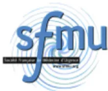
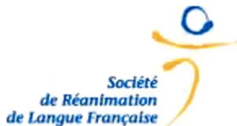

## RECOMMANDATIONS FORMALISÉES D'EXPERTS

# Transport intrahospitalier des patients à risque vital (nouveau-né exclu)★

J.-P. Quenota,\*,1,3, C. Milésib,1,3, A. Cravoisyc,1,3, G. Capellierd,2, O. Mimose,2, O. Fourcadef,2, P.-Y. Gueugniaudg,2, le groupe d'experts4

a Service de réanimation médicale, CHU Borage-Central-Gabriel, 14, rue Paul-Gaffarel, 21079 Dijon, France

b Service de réanimation pédiatrique, CHU Lapeyronie, 371, avenue du Doyen-Gaston-Giraud, 34295 Montpellier, France

c Service de réanimation médicale, hôpital Central, 29, avenue du Maréchal-de-Lattre-de-Tassigny, 54035 Nancy, France

d Service de réanimation médicale, hôpital Jean-Minjoz, 3, boulevard Fleming, 25000 Besançon, France

e Service d'anesthésie-réanimation, CHU de la Milétie, 2, rue de la Milétie, 86021 Poitiers, France

f Pôle anesthésie-réanimation, hôpital Purpan, pavillon urgences et réanimation, place du Docteur-Baylac, 31059 Toulouse, France

g Service aide médicale urgente, hospices civils, 162, avenue Lacassagne, 69003 Lyon, France

Disponible sur Internet le 17 novembre 2011

**Mots clés :** Thrombose veineuse ; Embolie pulmonaire ; Chirurgie, hémorragies ; Anticoagulants ; Héparines ; Fondaparinux ; Dabigatran ; Rivaroxaban ; Apixaban

DOI of original article: 10.1016/j.annfar.2011.10.009.

★ Sous l'égide de la société de réanimation de langue française (SRLF), de la Société française d'anesthésie et de réanimation (Sfar) et de la Société française de médecine d'urgence (SFMU). Ces textes argumentaires des experts seront publiés sur le site de la Sfar (<http://www.sfar.org/>). Ce texte fait l'objet d'une publication multiple en vue d'une diffusion la plus large possible.

\* Auteur correspondant.

Adresse e-mail : [jean-pierre.quenot@chu-dijon.fr](mailto:jean-pierre.quenot@chu-dijon.fr) (J.-P. Quenot).

1 Présidents du comité d'organisation.

2 Coordinateur d'experts.

3 Comité d'organisation pour la Commission des Référentiels et de l'Évaluation de la SRLF : M. Monchi, C. Bétonnière, K. Chaoui, A. Cravoisy, D. Da Silva, M. Djibré, F. Fieux, D. Hurel, V. Lemiale, O. Lesieur, M. Lesny, P. Meyer, C. Milesi, B. Misset, D. Orlikowski, D. Osman, J.P. Quenot, L. Soufir, T. Van der Linden, I. Verheyde.

4 Groupes d'experts : Dr Claude Gervais (Nîmes), Pr Jean-Christophe M Richard (Rouen), Me Christelle Ledroit (Angers), Dr Lionel Nace (Nancy), Dr Julien Naud (Bordeaux), Mr Stéphane Legoff (Paris), Mr Kamel Touabi (Paris), Dr Alexandre Ouattara (Bordeaux), Pr Thomas Geeraerts (Toulouse), Dr François Templier (Garches), Dr Karim Tazarourte (Melun), Pr Eric Roupie (Caen), Dr Agnès Ricard-Hibon (Paris), Dr Céline Farges (Paris).

## I. ABRÉVIATIONS UTILISÉES

<table>
<tr>
<td>BAVU</td>
<td>ballon autoremplisseur à valves unidirectionnelles</td>
</tr>
<tr>
<td>CEC</td>
<td>circulation extracorporelle</td>
</tr>
<tr>
<td>CPAP</td>
<td>ventilation en pression positive continue</td>
</tr>
<tr>
<td>ECH</td>
<td>filtre échangeur de chaleur et d'humidité</td>
</tr>
<tr>
<td>EI</td>
<td>événement indésirable</td>
</tr>
<tr>
<td>EIG</td>
<td>événement indésirable grave</td>
</tr>
<tr>
<td>EPR</td>
<td>événement porteur de risque</td>
</tr>
<tr>
<td>EtCO2</td>
<td>end tidal CO2</td>
</tr>
<tr>
<td>I/E</td>
<td>temps inspiratoire/temps expiratoire</td>
</tr>
<tr>
<td>PEP</td>
<td>pression expiratoire positive</td>
</tr>
<tr>
<td>PPC</td>
<td>pression de perfusion cérébrale</td>
</tr>
<tr>
<td>SDRA</td>
<td>syndrome de détresse respiratoire aiguë</td>
</tr>
<tr>
<td>Smur</td>
<td>service mobile d'urgence et de réanimation</td>
</tr>
<tr>
<td>TIH</td>
<td>transport intrahospitalier</td>
</tr>
</table><table>
<tr>
<td>VAC</td>
<td>ventilation assistée contrôlée</td>
</tr>
<tr>
<td>VC</td>
<td>ventilation contrôlée</td>
</tr>
<tr>
<td>VNI</td>
<td>ventilation non invasive</td>
</tr>
<tr>
<td>VS-AI-PEP</td>
<td>ventilation spontanée avec aide inspiratoire et pression expiratoire positive</td>
</tr>
</table>

## 2. INTRODUCTION ET PRÉSENTATION DE LA MÉTHODOLOGIE DES RECOMMANDATIONS D'EXPERTS DE LA SOCIÉTÉ DE RÉANIMATION DE LANGUE FRANÇAISE

Ces recommandations sont le résultat du travail d'un groupe d'experts réunis par la Société de réanimation de langue française (SRLF). Les experts ont élaboré des textes d'argumentaires pour chacun des cinq champs d'application qui avaient été définis par le comité d'organisation. Les recommandations pédiatriques ont été insérées dans les champs avec les recommandations adultes. Ces recommandations d'experts sont une contribution au référentiel risque de notre spécialité et au programme d'amélioration de la qualité élaboré par nos organismes agréés. Les recommandations ont été faites le plus souvent à partir d'études observationnelles prospectives et rétrospectives et de consensus internationaux. Les propositions de recommandations ont été présentées et discutées une à une, chaque expert (ou sous groupe d'experts) devant justifier le fond et la forme des propositions qui le concernent, l'un et l'autre pouvant être modifiés selon les remarques apportées. Les recommandations ont été dans un second temps soumises à une cotation de l'ensemble des experts. Le but n'était pas d'aboutir obligatoirement à un avis unique et convergent des experts sur l'ensemble des propositions, mais de dégager clairement les points de concordances, base des recommandations, et les points de discorde ou d'indécision, base d'éventuels travaux ultérieurs. Chaque recommandation a été cotée par chacun des experts selon la méthodologie dérivée de la RAND/UCLA, à deux tours de cotation après élimination des valeurs extrêmes (experts déviants). Chaque expert a coté à l'aide d'une échelle graduée de 1 à 9 (1 signifie l'existence d'un « désaccord complet » ou d'une « absence totale de preuve » ou d'une « contre-indication formelle » et 9 celle d'un « accord complet » ou d'une « preuve formelle » ou d'une « indication formelle »). Trois zones ont ainsi été définies en fonction de la place de la médiane : la zone (1–3) correspond à la zone de « désaccord » ; la zone (4–6) correspond à la zone « d'indécision » ; la zone (7–9) correspond à la zone « d'accord ». L'accord, le désaccord ou l'indécision est dit « fort » si l'intervalle de la médiane est situé à l'intérieur d'une des trois zones (1–3), (4–6) ou (7–9). L'accord, le désaccord ou l'indécision est dit « faible » si l'intervalle de médiane empiète sur une borne (intervalle [1–4] ou intervalle [6–8] par exemple). La méthodologie choisie pour élaborer ce référentiel s'est inspirée de GRADE (<http://www.gradeworkinggroup.org//links.htm>). L'originalité de la méthode GRADE tient en particulier aux éléments suivants : la seule caractérisation du type d'étude (essai randomisé ou non par exemple) ne suffit pas à attribuer un niveau de preuve à l'étude ;

la prise en compte de la balance bénéfices-risques est réelle ; enfin, la formulation des recommandations : « il faut faire ou il ne faut pas faire (il est recommandé ou il n'est pas recommandé), il faut probablement faire ou ne pas faire (il est possible de faire ou il est possible de ne pas faire) » a, des implications claires pour les utilisateurs.

## 3. CHAMP I : ÉPIDÉMIOLOGIE DES ÉVÉNEMENTS INDÉSIRABLES LIES AUX PATIENTS ET À L'ENVIRONNEMENT : TAXONOMIE GÉNÉRALE

1) Les patients à risque vital, hospitalisés ou non en réanimation, nécessitent fréquemment un TIH pour une procédure diagnostique, thérapeutique ou pour une admission dans une unité de soins spécialisée. « Accord fort »

2) Les patients à risque vital regroupent l'ensemble des patients présentant au moins une défaillance ou menace de défaillance vitale. « Accord fort »

3) Il faut standardiser les définitions concernant les événements indésirables (EI) et leur évitabilité au cours du TIH. « Accord fort »

4) Les EI sont classés selon leur gravité en deux catégories : les EI graves (EIG) et les événements porteurs de risque (EPR). « Accord fort »

5) Un EIG est une complication directement liée aux soins, pouvant entraîner un risque vital, une prolongation de séjour, la nécessité de gestes invasifs et des séquelles invalidantes. « Accord fort »

6) Les EPR sont définis par le décret sur l'accréditation des médecins exerçant dans les spécialités à risque. Ils regroupent tous les EI à l'exclusion des EIG, c'est-à-dire les EI patients mineurs et les dysfonctions du matériel et/ou de l'organisation des soins. « Accord fort »

7) Des incidents sans gravité surviennent régulièrement lors du transport, il est donc nécessaire de définir précisément ce que sont les EIG et les EPR les plus fréquents afin de pouvoir mettre en place des procédures de surveillance et des mesures correctrices. « Accord fort »

8) Les EI survenant pendant le transport et nécessitant une intervention thérapeutique et résolutive après doivent être considérés comme des EPR. « Accord fort »

9) Les EI survenant pendant le transport nécessitant une intervention thérapeutique qui ne permet pas de corriger l'anomalie selon l'objectif fixé par le clinicien doivent être considérés comme des EIG. « Accord fort »

10) Un EPR compliqué d'une auto-extubation et/ou d'un arrêt cardiaque est un EIG. « Accord fort »

11) Une désaturation nécessitant une augmentation de  $\text{FIO}_2$  ou un autre réglage du ventilateur est un EPR. Elle doit être considérée comme un EIG dès lors qu'elle n'est pas corrigée et qu'elle reste en dessous de l'objectif fixé par le clinicien. « Accord fort »

12) Une baisse de la pression artérielle nécessitant un geste thérapeutique est un EPR. C'est un EIG dès lors que le traitement ne permet pas d'obtenir l'objectif fixé par le clinicien. « Accord fort »13) Un état d'agitation ou une désadaptation du respirateur nécessitant un geste thérapeutique est un EPR. C'est un EIG dès lors qu'il n'est pas corrigé par la mesure thérapeutique. « Accord fort »

14) Un problème lié au ventilateur qui nécessite une modification de réglage, une ventilation au BAVU ou un changement de matériel est un EPR. « Accord fort »

15) Un problème lié au ventilateur qui se complique d'un événement clinique est un EIG. « Accord fort »

16) Les arrachements de matériels (cathéters, drain, pression intracrânienne, ...) sont des EPR quand ils n'ont pas de conséquence clinique directe, ils doivent être considérés comme des EIG dès lors qu'ils sont compliqués. « Accord fort »

17) Un El survenant lors du TIH doit être considéré comme inévitable lorsque l'ensemble de la procédure a été réalisé conformément à l'état de l'art. « Accord fort »

18) Les procédures de sécurisation (*safety practices* des auteurs anglo-saxons) sont des procédures de soins et/ou des procédures structurelles/organisationnelles qui préviennent, diminuent la fréquence de survenue ou atténuent les conséquences des erreurs et des El survenant lors du TIH. « Accord fort »

19) Il faut faire un signalement des El pouvant survenir pendant le TIH qui devront ensuite être analysés. « Accord fort »

#### 4. CHAMP 2 : MATÉRIELS, MONITORAGE ET MAINTENANCE

1) Le choix de l'équipement doit prendre en compte son encombrement et son autonomie. « Accord fort »

2) Il faut vérifier toutes les connexions entre les divers matériels de monitoring (par exemple, capteurs de pression invasive) avant le TIH. « Accord fort »

3) Le monitoring minimum durant un TIH comprend la surveillance de la fréquence cardiaque électrocardioscopique, de l'oxymétrie de pouls et de la pression artérielle non invasive. « Accord fort »

4) Chez le patient non ventilé, la fréquence ventilatoire doit être surveillée à intervalle régulier, au mieux de façon monitorée. « Accord fort »

5) Le monitoring de l' $\text{EtCO}_2$  est recommandé pour les patients ayant une souffrance neurologique et pour ceux nécessitant un contrôle strict de la  $\text{PaCO}_2$ . « Accord fort »

6) Les principaux paramètres monitorés doivent être couplés à des alarmes dont le réglage doit être adapté à chaque patient. « Accord fort »

7) Il faut un matériel dédié au TIH et identifié au niveau d'une structure de soins, d'un service ou d'un pôle. « Accord fort »

8) Le ventilateur de transport doit disposer d'alarmes sonores et visuelles sur les principaux paramètres ventilatoires monitorés. « Accord fort »

9) Pour tous les patients ventilés lors d'un transport qui va durer ou chez ceux particulièrement à risque, il faut pouvoir disposer immédiatement d'un système d'aspiration au mieux

sous la forme d'un appareil électrique autonome portable. « Accord fort »

10) Il faut adapter l'autonomie en électricité et en gaz médicaux des appareils utilisés en fonction de la durée du TIH et de leur consommation, qui peut varier suivant l'usage et en surveiller l'autonomie restante. « Accord fort »

11) Les moyens de monitoring doivent être adaptés au type de transport, à la sévérité du patient et aux thérapeutiques utilisées selon une procédure écrite. « Accord fort »

12) La ventilation manuelle au ballon autogonflable lors d'un TIH doit être évitée et n'être utilisée qu'en cas de panne du ventilateur (y compris chez l'enfant). « Accord fort »

13) Le réglage des consignes machine du ventilateur de transport doit permettre les mêmes paramètres de ventilation, y compris les modes de ventilation non-invasifs. « Accord fort »

14) Tout patient ventilé lors d'un TIH doit pouvoir être repris à tout moment, en ventilation au ballon sur sa prothèse endotrachéale ou au masque. « Accord fort »

15) Les performances réelles du ventilateur de transport utilisé doivent être connues de l'utilisateur.

Il en existe trois catégories : « Accord fort » :

- • ventilateur basique ou de secours (mode VC, PEP, monitoring réduit) ;
- • ventilateur intermédiaire (mode VAC, PEP, réglage du débit ou I/E, spirométrie expiratoire) réglage de la  $\text{FiO}_2$  100 % / mélange air-oxygène ;
- • ventilateur haute performance (modes volumétriques, barométriques dont VS-AI-PEP, large plage de réglage de la  $\text{FiO}_2$ , réglage du débit d'insufflation, triggers performants, spirométrie expiratoire, au mieux, compensation de la compliance du circuit et mode VNI).

16) La performance, le monitoring et les alarmes du ventilateur doivent être adaptés à la pathologie du patient : « Accord fort »

- • patient très hypoxémique (par exemple, SDRA) : ventilateur haute performance ;
- • patient nécessitant un contrôle strict de la  $\text{PaCO}_2$  : ventilateur intermédiaire ou haute performance ;
- • patients déclenchant le ventilateur (modes assistés) : ventilateur intermédiaire ou haute performance ;
- • patients en VNI : ventilateur avec option VNI performante.

17) Le mode d'alimentation électrique et de recharge du ventilateur doit être compatible avec son utilisation à tout moment et doit avoir une autonomie électrique suffisante pour réaliser le TIH. « Accord fort »

18) Le ventilateur utilisé doit disposer d'une alarme de défaut d'alimentation en gaz, en électricité et d'une alarme de panne de ventilateur. « Accord fort »

19) L'interface du ventilateur de transport ne doit pas permettre de dérèglages accidentels des consignes machine. « Accord fort »

20) À performances comparables : « Accord fort »

- • le ventilateur ayant l'interface utilisateur la plus simple à utiliser doit être privilégié ;
- • le ventilateur ayant le circuit patient le plus simple doit être privilégié.21) Afin de vérifier la bonne tolérance de la ventilation délivrée par le ventilateur de transport et la stabilité du malade, le ventilateur de transport doit être branché sur le patient cinq à dix minutes avant le départ réel de la chambre, sur les gaz muraux et l'alimentation du secteur. « Accord fort »

22) Le ventilateur de transport doit être stocké dans un endroit accessible connu des utilisateurs avec ses accessoires : circuit complet avec ECH et raccord annelé, tuyau d'alimentation en gaz médicaux. « Accord fort »

23) Le circuit utilisé doit être en accord avec les recommandations du fabricant. « Accord fort »

24) Lorsque le ventilateur le nécessite, il doit être étalonné en fonction du type de circuit utilisé. « Accord fort »

25) Pour assurer une bonne humidification des voies aériennes du patient et une protection du ventilateur, un filtre antibactérien et ECH doit être systématiquement mis en place entre le raccord annelé et le circuit patient. « Accord fort »

26) Le réglage des consignes machine et des alarmes du ventilateur de transport doivent faire l'objet d'une prescription écrite. « Accord fort »

27) Le monitoring de la ventilation par le ventilateur de transport doit comporter au minimum la surveillance de la pression d'insufflation avec affichage de la pression de pic ainsi que la spirométrie expiratoire. « Accord fort »

28) Une auto-extubation doit pouvoir être identifiée immédiatement par le monitoring de la capnographie et/ou de la spirométrie expiratoire. « Accord fort »

29) L'analyse de la phase expiratoire du capnogramme peut être une aide à l'identification de certaines complications de la ventilation au cours du transport. « Accord fort »

30) En mode VS-AI-PEP invasive ou non, le ventilateur de transport doit avoir les caractéristiques générales requises (performances, monitoring) pour garantir la qualité de ventilation. « Accord fort »

31) Certains ventilateurs de transport proposent des modes pouvant évoquer la VS-AI-PEP mais qui en réalité n'en sont pas. Il ne faut pas les utiliser. « Accord fort »

32) En mode CPAP, les systèmes à débit libre indépendants des ventilateurs doivent être utilisés en tenant compte de leur consommation d'oxygène importante, ce mode n'étant pas assez performant sur les ventilateurs de transport. « Accord fort »

33) Un dispositif de mesure invasive et continue de la pression artérielle doit être utilisé lors du TIH si le patient est traité par des agents vaso-actifs et/ou en cas d'instabilité hémodynamique et s'il bénéficie déjà d'un tel monitoring dans son unité d'hospitalisation. « Accord fort »

34) Le monitoring de la pression veineuse centrale n'est pas recommandé lors du TIH. « Accord fort »

35) Un stimulateur – défibrillateur doit être facilement accessible au cours du transport. Au mieux, il s'intègre dans un moniteur multiparamétrique. « Accord fort »

36) Si le patient est dépendant d'un pacemaker externe, les seuils de celui-ci doivent être impérativement vérifiés et adaptés ainsi que l'état de la batterie. Un pacemaker externe de rechange doit être impérativement disponible pendant le transport. « Accord fort »

37) En présence d'électrodes de stimulation péricardiques temporaires, un stimulateur de transport doit être impérativement connecté. « Accord fort »

38) Le remplacement dans les meilleurs délais d'un matériel indisponible (maintenance, panne) doit être organisé selon une procédure écrite. « Accord fort »

39) Les matériels utilisés pour le TIH doivent faire l'objet d'une procédure de contrôle régulière et tracée (*check list*). « Accord fort »

40) Après utilisation, le ventilateur doit être nettoyé et désinfecté selon une procédure écrite et tracée. « Accord fort »

41) Lors d'un TIH pédiatrique, un jeu complet de matériel et de médicaments de réanimation pédiatrique doit accompagner l'enfant, notamment un ballon autogonflable, un masque facial et du matériel d'intubation adaptés à l'âge de l'enfant ainsi que du matériel de cathétérisme intra-osseux. « Accord fort »

42) Le monitoring de l' $\text{EtCO}_2$  est recommandé lors du transport en cas de ventilation manuelle d'un enfant intubé pour prévenir le risque d'hyperventilation. « Accord fort »

43) Pour les enfants de moins de 15 kg, il est nécessaire d'avoir un ventilateur pouvant délivrer des volumes courants faibles, assurer des fréquences élevées et permettre le maintien d'une pression positive de fin d'expiration. « Accord fort »

44) La taille et la conformité des tuyaux du circuit doivent être adaptées à l'âge et au poids de l'enfant pour réduire au maximum le volume compressible (petits tuyaux pour des poids inférieurs à 15 kg). « Accord fort »

## 5. CHAMP 3 : PRÉPARATION DU MALADE AVANT TRANSPORT

1) Il faut faire une évaluation précise de l'état clinique du patient avant le départ pour un TIH et évaluer le bénéfice/risque du transport. Ces éléments doivent être colligés dans le dossier médical du patient. « Accord fort »

2) Il faut vérifier l'absence de contre-indication aux examens complémentaires. « Accord fort »

3) Le patient doit être porteur d'un bracelet d'identification. « Accord fort »

4) Il faut au minimum un abord veineux perméable et, si nécessaire, une voie d'abord supplémentaire spécifiquement dédiée aux amines et identifiée. Les voies d'abords (centrales ou périphériques) doivent être propres et solidement fixées. « Accord fort »

5) Les pousse-seringues électriques doivent être identifiés et la quantité des thérapeutiques adaptées à la durée du TIH. Les cordons d'alimentation électrique doivent être présents durant le transport.

Les pousse-seringues électriques doivent être rebranchés sur secteur dès que possible (ainsi que tout le matériel électrique). « Accord fort »

6) Chez les patients nécessitant un contrôle strict de la  $\text{PaCO}_2$ , un prélèvement artériel devra être réalisé avant le TIH afin de mesurer le gradient  $\text{PaCO}_2$  et  $\text{EtCO}_2$ . « Accord fort »

7) Le monitoring de la PPC doit être poursuivi au cours du transport chez les patients neurologiques. « Accord fort »8) La position optimale du patient en réanimation doit être poursuivie pendant le TIH. « Accord fort »

9) Il faut anticiper, évaluer et traiter les douleurs pouvant être induites par le TIH et/ou les soins qui seront réalisés. « Accord fort »

10) Il faut poursuivre la sédation et/ou l'analgésie durant le transport. Elle peut être modifiée le cas échéant. « Accord fort »

11) La mobilisation du patient curarisé doit faire l'objet de précautions particulières. « Accord fort »

12) Le matériel d'intubation complet (comprendant un mandrin d'Eschmann) doit être disponible immédiatement. « Accord fort »

13) À chaque mobilisation du patient, la vérification de la bonne position des dispositifs invasifs doivent être effectuées. « Accord fort »

14) Un BAVU avec masque adapté, réservoir d'oxygène, prolongateur d'O2 et filtre de rechange doivent accompagner le patient. « Accord fort »

15) Il faut prévenir l'hypothermie pendant le TIH notamment chez l'enfant ou la température devra être monitorée. « Accord fort »

16) Le matériel à usage unique doit être privilégié. « Accord fort »

17) La pression du ballonnet du dispositif intratrachéal doit être vérifiée avant et au retour du TIH. « accord fort »

18) Un sac d'intervention d'urgence doit accompagner le patient. « Accord fort »

## 6. CHAMP 4 : SOIGNANTS : RESSOURCES HUMAINES ET FORMATION

1) Une formation initiale et régulière est obligatoire pour l'ensemble des personnels assurant les TIH à la fois sur le fonctionnement et la surveillance des matériels utilisés (ventilateur, moniteur multiparamétrique, défibrillateur...). « Accord fort »

2) Il faut une formation au transport pédiatrique, initiale et régulière, du personnel médical et paramédical assurant les TIH des enfants de moins de 15 kg. « Accord fort »

3) La formation des personnels en charge des TIH peut se faire sous la forme d'une simulation d'un transport. « Accord fort »

4) L'appréciation du risque et les modalités liées au TIH sont sous la responsabilité du médecin senior en charge du patient. « Accord fort »

5) L'équipe de TIH d'un patient à risque vital doit être composée au minimum d'un médecin expérimenté et d'une personne formée au TIH. « Accord fort »

6) Une procédure d'appel à l'aide pour un renfort médical et/ou infirmier doit être disponible et connue de tous en cas de problème lors du TIH. « Accord fort »

7) Un perfusionniste ou équivalent qualifié doit faire partie de l'équipe de TIH lorsque le patient est sous CEC. « Accord fort »

8) Si le TIH est confié à l'équipe médicale du Smur, celle-ci doit bénéficier d'une transmission complète et précise sur l'état du patient par le médecin en charge du patient et d'un compte rendu écrit. « Accord fort »

## 7. CHAMP 5 : ORGANISATION (PLANIFICATION), ARCHITECTURE ET TRAÇABILITÉ

1) L'horaire, le lieu de rendez-vous ainsi que la durée d'immobilisation du patient doivent être précisés et vérifiés avant le TIH. « Accord fort »

2) Le nom du médecin et les moyens techniques à disposition sur le lieu d'accueil du patient doivent être connus. « Accord fort »

3) Avant de partir pour un TIH, il faut s'assurer de la connaissance du circuit emprunté et de l'accessibilité des couloirs et ascenseurs en privilégiant le chemin le plus court et le plus sécurisé. « Accord fort »

4) Le service d'accueil est prévenu de l'arrivée imminente du patient. « Accord fort »

5) La traçabilité des paramètres monitorés lors du TIH doivent faire l'objet d'un recueil spécifique sur une feuille de surveillance qui sera ensuite intégrée au dossier du patient. « Accord fort »

6) Une traçabilité imprimable des données du monitoring au cours du TIH est souhaitable. « Accord fort »

7) Si le médecin qui accueille le patient est compétent pour en assurer sa surveillance, l'équipe de TIH lui transmettra toutes les informations nécessaires. « Accord fort »

8) En l'absence d'un médecin compétent pour la surveillance du patient sur le lieu d'accueil, l'équipe du TIH en conservera la charge. « Accord fort »

9) L'organisation du TIH doit faire l'objet d'une procédure institutionnelle. « Accord fort »

10) Le TIH doit être un acte valorisé en termes d'activité. « Accord fort »

## Remerciement

À Mme Nathalie Herman (Direction qualité risque au CHU de Dijon) pour la relecture attentive de ce document.