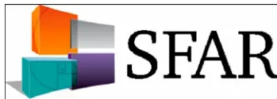

## RECOMMANDATIONS FORMALISÉES D'EXPERTS

# Échographie en anesthésie locorégionale

## Locoregional anaesthesia and echography

H. Bouaziz\*, F. Aubrun, A.A. Belbachir, P. Cuvillon, E. Eisenberg, D. Jochum, C. Aveline, P. Biboulet, M. Binhas, S. Bloc, G. Boccara, M. Carles, O. Choquet, L. Delaunay, J.-P. Estebe, R. Fuzier, E. Gaertner, A. Gnaho, K. Nouette-Gaulain, E. Nouvellon, J. Ripart, V. Tubert

*pour la Société française d'anesthésie et de réanimation*

Disponible sur Internet le 17 août 2011

### I. INTRODUCTION

L'introduction de l'échographie dans la pratique de l'anesthésie locorégionale (ALR) est un évènement récent qui suppose une formation préalable et l'acquisition d'un matériel spécifique que ne possèdent pas tous les médecins anesthésistes-réanimateurs.

La publication de ce référentiel ne signifie pas que le non-recours à l'échographie constitue pour autant une mauvaise pratique médicale, la neurostimulation reste une technique de repérage validée.

### 2. RÈGLES GÉNÉRALES, APPRENTISSAGE ET PROCÉDURE DE RÉALISATION

La compréhension des bases physiques des ultrasons et des réglages de l'échographe « est recommandée » pour l'exécution des blocs périphériques sous échographie avec assurance et sécurité. « Il est recommandé » d'avoir des connaissances anatomiques et de sonoanatomie pour identifier les structures concernées : muscles, vaisseaux, nerfs, tendons, fascias, os, plèvre. . .

\* Auteur correspondant.

Adresse e-mail : h.bouaziz@chu-nancy.fr (H. Bouaziz).

Un entraînement préalable « est recommandé » pour l'acquisition de la sonoanatomie (mannequin) et la visualisation de l'aiguille jusqu'à sa cible (fantômes et/ou pièces anatomiques). La compréhension des techniques de guidage de l'aiguille « dans le plan » et « en dehors du plan » est un prérequis pour la sécurité et le succès de l'exécution d'une ALR. En raison de la variabilité interindividuelle dans la rapidité d'acquisition de la technique, « il est recommandé » de suivre sa propre courbe d'apprentissage.

Des moyens complémentaires « sont recommandés » pour la réalisation du bloc : la neurostimulation et/ou l'hydro-localisation et/ou l'hydrodissection et/ou le déplacement des tissus avec les mouvements de l'aiguille. En cas de difficulté de visualisation de la sonoanatomie, « il est recommandé » d'associer la neurostimulation à l'échoguidage.

### 3. MATÉRIEL ET ASPECT TECHNIQUE

« Il est recommandé » de disposer de sondes de fréquence et de forme adaptée à l'anesthésie réalisée. « Il est recommandé » d'utiliser la fréquence la plus élevée possible pour privilégier la résolution spatiale et améliorer la précision de l'image. Le choix de la sonde est fonction du type de bloc et de la profondeur de la cible. « Il est recommandé » d'utiliser les différentes fonctions proposées par l'échographe et d'adapter leurs réglages à l'image native et à la profondeur de la cible :gains général et étagé, profondeur étudiée, nombre et position des focales, imagerie multi-incidence, mode Doppler... « Il est recommandé » de réaliser, avant le geste anesthésique, une visualisation large et dynamique des éléments anatomiques en recherchant précisément les structures cibles et adjacentes en s'aidant des fonctionnalités disponibles sur l'échographe. Le respect de cette procédure permet de planifier la trajectoire de l'aiguille, de déterminer le plan de visualisation du nerf (petit et/ou grand axe) et la technique de progression de l'aiguille. « Il est probablement recommandé » de visualiser les nerfs cibles en « petit axe » pour les blocs superficiels et profonds. Le choix d'approche de l'aiguille dans le plan ou en dehors du plan est indépendant de la profondeur de la cible. Il est recommandé d'utiliser des aiguilles dédiées à l'ALR. « Il est recommandé » que soient mis en évidence et corrigés les mouvements intempestifs de la sonde, de suivre la progression de l'extrémité de l'aiguille et de visualiser la distribution de l'anesthésique local.

#### 4. RÈGLES TECHNIQUES DE SÉCURITÉ

Afin de limiter le risque d'injection intraneurale, « il est probablement recommandé » d'aborder le nerf tangentiellement et de vérifier avant l'injection, par de petites mobilisations de l'aiguille, que son extrémité n'est pas solidaire du nerf. « Il est recommandé » d'interrompre l'injection de la solution anesthésique en l'absence de visualisation en temps réel de la diffusion de l'anesthésique local et/ou en cas de douleur, de paresthésie, de résistance à l'injection, ou de gonflement du nerf. « Il est recommandé » de retirer l'aiguille en cas d'injection intraneurale, car il est impossible de faire la preuve de l'innocuité d'une telle injection malgré son caractère souvent indolore.

#### 5. BLOCS DES MEMBRES ET DU TRONC

Le référentiel sur l'échographie en ALR complète les recommandations pour la pratique clinique de 2002 sur les blocs périphériques des membres chez l'adulte et celles de 2006 sur les blocs périmédullaires (<http://www.sfar.org>).

Aux membres supérieur (interscalénique, périclaviculaire, axillaire), inférieur (fémoral, poplité) et au niveau du tronc, l'échographie peut permettre de visualiser (totalement ou partiellement) les structures nerveuses et leurs rapports

(variations anatomiques comprises) avec les structures vasculaires, musculotendineuses (et fascia), péritonéales ou pleurales. Au creux axillaire, l'échographie permet de visualiser l'artère axillaire, le tendon du grand dorsal et les nerfs (médian, musculocutané, radial, ulnaire), et de limiter la durée de repérage liée aux variations anatomiques. L'échographie pour la réalisation d'un bloc supraclaviculaire est possible et permet d'obtenir un taux de succès équivalent au bloc supraclaviculaire par neurostimulation. Pour le bloc du nerf fémoral et le bloc iliofascial, l'échographie permet de visualiser l'artère fémorale commune et ses branches, le fascia iliaque et le nerf fémoral. Il est possible de bloquer le nerf sciatique, à partir de la région subglutéale, tout le long de son trajet sous échoguidage.

L'échoguidage « est probablement recommandé » pour les blocs interscalénique, supraclaviculaire, axillaire, fémoral, poplité, distaux et de paroi, car elle peut réduire l'incidence des ponctions vasculaires accidentelles, le nombre de redirections d'aiguilles et la dose d'anesthésique local par rapport aux autres techniques de repérage.

Par voie glutéale, l'abord du nerf sciatique sous échographie « est possible mais techniquement plus difficile » (profondeur de ponction), incitant à privilégier probablement un abord subglutéal.

Pour les blocs d'espace (paroi abdominale, iliofascial), l'échographie « est probablement recommandée » car elle permet d'administrer l'anesthésique local plus précisément qu'avec les autres techniques. Pour les blocs périmédullaires, l'échographie constitue « probablement » une aide à la procédure en permettant de visualiser les structures périmédullaires, de déterminer le niveau de ponction et la profondeur de l'espace péridural.

L'échographie est « probablement recommandée » pour optimiser le positionnement du cathéter périnerveux.

#### 6. CONDITIONS DE RÉALISATION, HYGIÈNE

Il est « probablement recommandé » de réaliser un bloc échoguidé chez un patient éveillé, calme et coopérant. Toutefois, dans des situations où le rapport bénéfice–risque est favorable et justifié, il est possible de réaliser un bloc chez un patient sous anesthésie (générale ou régionale) ou sédation. Dans ce cas, l'échographie apporte « probablement » une sécurité supplémentaire.

**Tableau I**

Classement des dispositifs médicaux et niveaux de traitement requis.

<table border="1">
<thead>
<tr>
<th rowspan="2">Destination du matériel</th>
<th rowspan="2">Classement du matériel</th>
<th colspan="2">Niveau de</th>
</tr>
<tr>
<th>Risque infectieux</th>
<th>Traitement requis</th>
</tr>
</thead>
<tbody>
<tr>
<td>Introduction dans le système vasculaire ou dans une cavité ou tissu stérile quelle que soit la voie d'abord</td>
<td>Critique</td>
<td>Haut risque</td>
<td>Stérilisation ou usage unique stérile à défaut Désinfection de haut niveau</td>
</tr>
<tr>
<td>En contact avec une muqueuse, ou la peau lésée superficiellement</td>
<td>Semi-critique</td>
<td>Risque médian</td>
<td>Désinfection de niveau intermédiaire</td>
</tr>
<tr>
<td>En contact avec la peau intacte du patient ou sans contact avec le patient</td>
<td>Non critique</td>
<td>Risque bas</td>
<td>Désinfection de bas niveau</td>
</tr>
</tbody>
</table>En raison du risque de transmission croisée et de la nécessité d'un environnement stérile requis en ALR, « il est recommandé » de respecter les mesures d'asepsie pour la sonde d'échographie. « Il est recommandé » avant chaque procédure que les sondes et les câbles soient essuyés, nettoyés, désinfectés. L'ensemble de l'appareil doit être nettoyé régulièrement. « Il est recommandé » d'utiliser une gaine de protection stérile à usage unique dédiée et adaptée, et du gel stérile unidose lors de l'usage d'une sonde d'échographie. « Il est recommandé », en l'absence de perforation ou de déchirure

lors du retrait de la protection, que la désinfection de la sonde entre chaque patient soit au minimum celle correspondant à une désinfection de bas niveau. « Il est recommandé », en cas de rupture de la gaine ou de souillure de la sonde, que la désinfection soit de niveau plus élevé (Tableau I). « Il est recommandé » à la fin du programme opératoire de nettoyer la sonde avec un détergent, de la rincer, de la sécher et de la ranger dans un endroit propre. « Il est recommandé » de faire valider les différentes procédures de nettoyage et de désinfection par le CLIN et/ou le service d'hygiène.