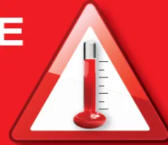
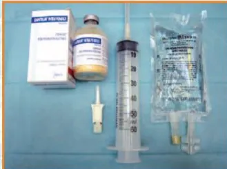
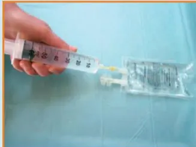
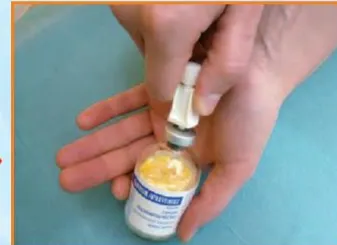
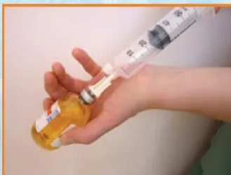
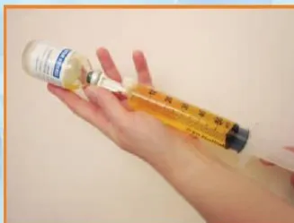
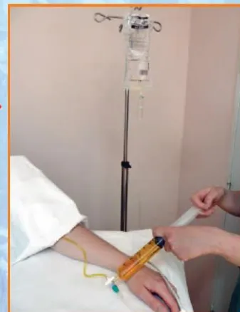
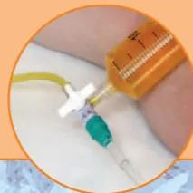

**Recommandations d'Experts  
pour le Risque d'HYPERTHERMIE MALIGNE en Anesthésie Réanimation  
SFAR - CRC 12 septembre 2013**

**Groupe de travail**

**Pr Renée KRIVOSIC-HORBER**, Centre HM et Anesthésie-Réanimation CHRU LILLE  
**Pr Yves NIVOCHÉ**, Centre HM et Anesthésie-Réanimation Hôpital Robert Debré PARIS  
**Pr Joël LUNARDI**, Centre de Biologie Moléculaire CHU de GRENOBLE  
**Pr Jean-François PAYEN**, Centre HM et Anesthésie-Réanimation CHU GRENOBLE  
**Dr Anne-Frédérique DALMAS**, Centre HM et Anesthésie-Réanimation LILLE  
**Madame Nicole MONNIER**, Centre de Biologie Moléculaire CHU de GRENOBLE  
**Dr Julien FAURE**, Centre de Biologie Moléculaire CHU de GRENOBLE  
**Dr Thierry GIRARD**, Centre HM et Anesthésie-Réanimation BALE SUISSE  
**Dr Alexandre MOERMAN**, Génétique Médicale CHRU de LILLE  
**Pr Benoît VALLET**, Anesthésie-Réanimation CHRU LILLE

L'Hyperthermie Maligne (HM) est définie comme une réponse anormale aux agents anesthésiques halogénés et/ou au curare dépolarisant chez des personnes présentant une anomalie génétique affectant le muscle strié squelettique.

## **1/ Dépistage des patients à risque en consultation**

Il est recommandé de dépister les patients HM en consultation d'anesthésie selon l'arbre décisionnel de la figure 1.

Pour tout patient à risque sur la notion d'antécédent HM de l'anesthésie personnel ou familial non encore exploré, il est recommandé que l'anesthésiste contacte l'un des centres experts HM\* afin de préciser le risque HM par les investigations nécessaires.

Lors de situations hors anesthésie répertoriées comme étant à risque HM : myopathies congénitales à cores et apparentées associées au gène RYR1, élévation chronique inexplicquée des CPK, hyperthermie grave d'effort ou rhabdomyolyse grave d'effort, il est recommandé que l'évaluation du risque HM chez le patient et les membres de sa famille ainsi que la décision d'investigations complémentaires fassent l'objet d'une réflexion pluridisciplinaire associant anesthésiste expert HM, généticien, neurologue et le patient lui-même (avis d'expert).

Les antécédents de syndrome malin des neuroleptiques ne constituent pas une situation à risque d'HM anesthésique [Adnet P, Lestavel P, Krivosic-Horber R. Neuroleptic malignant syndrome. Br J Anaesth. 2000 Jul;85(1):129-35]**Figure 1 : Dépistage du risque HM en consultation d'anesthésie**

IVCT: In Vitro Contracture Test; HMS: HM sensible (IVCT positif); HMN: HM négatif (IVCT négatif)

```
graph TD
    A[Antécédent HM anesthésique] --> B[Oui]
    A --> C[Non]
    B --> D[Personnel]
    B --> E[Familial  
Lien de parenté?]
    D --> F[Document HM ?]
    E --> F
    F --> G[Pas de document HM]
    F --> H[IVCT négatif =  
HMN]
    F --> I[IVCT positif  
ou présence de mutation HM =  
HMS]
    G --> J[Sujet à risque HM]
    H --> K[Pas de  
risque HM]
    I --> L[précautions  
anesthésiques  
HM]
    J --> M[Urgence :  
précautions  
anesthésiques HM]
    J --> N[Programmée:  
contacter un centre  
expert HM]
```

The flowchart illustrates the screening process for High Myotonia (HM) risk during an anesthesia consultation. It begins with the question 'Antécédent HM anesthésique' (Anesthetic HM history). If 'Non' (No), the patient is not at risk. If 'Oui' (Yes), it branches into 'Personnel' (Staff) or 'Familial Lien de parenté?' (Family relationship?). Both lead to 'Document HM ?' (HM document?). If no document exists, the patient is 'Sujet à risque HM' (Subject to HM risk). If a document exists, it leads to either 'IVCT négatif = HMN' (Negative IVCT = HMN), resulting in 'Pas de risque HM' (No HM risk), or 'IVCT positif ou présence de mutation HM = HMS' (Positive IVCT or presence of HM mutation = HMS), leading to 'précautions anesthésiques HM' (Anesthetic precautions). The 'Sujet à risque HM' branch further divides into 'Urgence : précautions anesthésiques HM' (Urgency: anesthetic precautions) and 'Programmée: contacter un centre expert HM' (Scheduled: contact an expert center).

## **2/ Comment préciser le diagnostic de sensibilité HM**

Chez les patients à risque, il est recommandé de préciser le diagnostic de sensibilité HM par « In Vitro Contracture Tests (IVCT) » sur biopsie musculaire ou analyse génétique de l'ADN extrait du sang périphérique.

### **- La biopsie musculaire**

Le test de référence consiste à reproduire l'exposition pharmacologique aux agents déclenchants selon le protocole du Groupe Européen de l'HM (EMHG), sur des fragments de muscle fraîchement prélevés : ce sont les tests de contracture à l'halothane et à la caféine appelés « In Vitro Contracture Tests : IVCT ». Les IVCT sont indiqués en première intention ou après un résultat négatif de l'analyse génétique. En effet, la sensibilité des IVCT est supérieure (99%) à celle de l'analyse de l'ADN extrait de sang périphérique (50%).

### **- L'analyse génétique :**

Toute analyse génétique fait l'objet d'un encadrement juridique en France (décret d'application 2000-570) qui impose une consultation de conseil génétique au patient et lerecueil de son consentement écrit pour l'analyse génétique à des fins médicales dont les résultats sont remis au médecin prescripteur.

Deux situations différentes sont à considérer :

### **1- Diagnostic de la sensibilité HM par recherche de mutation dans le gène *RYR1* :**

Une telle recherche ne peut être initiée que sur indication clinique claire : crise HM documentée chez le patient (proband) ou un apparenté si le sang du proband n'est pas disponible. Si une mutation reconnue causale de sensibilité HM est trouvée, l'individu doit être considéré à risque de développer une crise HM en cas d'exposition aux anesthésiques déclenchants (HMS). En revanche, l'absence de mutation reconnue pathogène n'exclut pas le risque de sensibilité HM. La détection de variations génétiques de *RYR1* ayant un impact inconnu n'est pas rare et il revient au laboratoire de génétique moléculaire d'émettre un avis documenté sur le variant (analyse de la bibliographie et des bases de données). Tout individu porteur d'un variant de *RYR1* potentiellement associé à l'HM doit être considéré comme à risque HM jusqu'à preuve du contraire.

### **2-Test prédictif en cas de mutation familiale identifiée :**

Lorsqu'une mutation *RYR1* validée pour l'HM a été trouvée chez un patient ayant fait une crise documentée ou ayant des tests IVCT positifs (HMS), elle peut être recherchée en tant que prédictive de risque HM chez les apparentés. Les apparentés porteurs de la mutation doivent être considérés comme HMS. Les apparentés non porteurs de la mutation ne peuvent être considérés sans risque HM, car ils peuvent être porteurs d'une autre anomalie susceptible d'entraîner un risque HM. La réalisation de tests IVCT peut être discutée pour éliminer tout risque supplémentaire.

L'analyse génétique prédictive n'est pas recommandée chez les mineurs sauf en cas de bénéfice individuel direct.

### ***Remarques***

Les mécanismes génétiques de la sensibilité HM sont principalement liés à des variations pathogènes (mutations) dans le gène *RYR1* (codant le canal  $\text{Ca}^{2+}$  du réticulum sarcoplasmique sensible à la ryanodine) et, beaucoup plus rarement, dans le gène *CACNA1S* (codant le canal  $\text{Ca}^{2+}$  voltage dépendant sensible à la dihydropyridine). Le criblage du gène *RYR1* peut être effectué sur ADN extrait de sang périphérique soit sur des régions ciblées soit sur la totalité des exons. Alternativement, la recherche de mutations peut être effectuée sur la totalité du transcript *RYR1* à partir d'un fragment de muscle.

Les explorations de *RYR1* montrent de très nombreuses variations qui impliquent le remplacement d'un acide aminé par un autre (faux sens), événement dont les conséquences moléculaires sont difficilement prévisibles, même avec l'aide de logiciels dédiés à la prédiction de la pathogénicité de variants génétiques. Le groupe européen de l'hyperthermie maligne (EMHG) a en conséquence émis des recommandations sur l'interprétation des variants de *RYR1* (site [www.emhg.org/genetics/](http://www.emhg.org/genetics/)). Une liste de mutations reconnues responsables d'HM est disponible sur ce site web.

## **3/ Réaliser une anesthésie chez le patient à risque HM**Il est recommandé de respecter trois principes absolus :

- - a) exclure les agents anesthésiques volatils halogénés, quels qu'ils soient, ainsi que le curare dépolarisant (suxaméthonium) ;
- - b) disposer d'un monitoring de la capnographie et de la température centrale ;
- - c) vérifier le protocole d'accès au dantrolène injectable.

#### **Remarque**

L'hospitalisation ambulatoire est possible. La programmation est souhaitable en premier tour pour éviter les vapeurs d'anesthésique volatil dans le bloc opératoire. La préparation du respirateur dépend du modèle. La purge par un flux de 10 l/min de gaz en circuit ouvert varie entre 10 et 50 min selon le type de respirateur, pour tenir compte des possibilités d'absorption des halogénés dans les circuits internes complexes [TW. Kim. Anesthesiology. 2011, 114:205-12]. Les évaporateurs sont enlevés pour éviter une erreur de manipulation. Le risque HM sera introduit dans la check list. La prophylaxie par le dantrolène per os ou IV n'a pas d'indication actuelle.

La technique anesthésique peut utiliser tous les anesthésiques locaux (y compris avec vasoconstricteurs), tous les hypnotiques intraveineux, tranquillisants, morphiniques, curares non dépolarisants et le protoxyde d'azote.

La surveillance en SSPI doit porter sur la couleur des urines et la température corporelle.

Il n'a pas été publié de survenue de crise HM prouvée en respectant ces règles.

Un dosage de CPK préopératoire et postopératoire précoce peut être informatif pour le suivi du patient.

#### **4/ Diagnostic et traitement de l'HM, protocole de stockage du dantrolène : affiche HM**

Il est recommandé de disposer dans tous les lieux où sont réalisées des anesthésies générales d'une affiche décrivant le diagnostic et le traitement de la crise HM ainsi que des informations claires et précises sur l'accès immédiat au stock de dantrolène et la procédure de préparation pour injection intra veineuse (ci-dessous).# HYPERTHERMIE MALIGNE



**RISQUE VITAL**

**● Agents déclenchants :**

Sévorane (sévoflurane), Forène (isoflurane), Suprane (desflurane), Fluothane (halothane), Ethrane (enflurane), Célocurine (suxaméthonium)

**● Signes évocateurs d'hyperthermie maligne (HM) :**

Spasme des masséters  
Tachypnée  
Rigidité  
Hyperthermie

Marbrures  
Sueurs

**Hypercapnie (↑ PETCO<sub>2</sub>)**  
Tachycardie, arythmies

Acidose respiratoire  
puis mixte  
Urines rouges (myoglobinurie)  
➔ **CPK post-opératoire**

## SUGGESTIONS THÉRAPEUTIQUES EN CAS D'HYPERTHERMIE MALIGNE

<table border="1">
<tr>
<td><b>1</b><br/>ARRETER LES AGENTS ANESTHESIQUES VOLATILS</td>
<td><b>2</b><br/>HYPERVENTILER AVEC OXYGENE 100 % en circuit ouvert (2 à 3 fois la ventilation du patient). Relais par des anesthésiques non déclenchants : propofol, morphiniques.</td>
<td><b>3</b><br/>Demander du renfort<br/>Monitorer PETCO<sub>2</sub> et température centrale.<br/>Gaz du sang artériel et veineux.</td>
</tr>
<tr>
<td><b>4</b><br/><b>DANTROLENE injectable.</b> Flacons de 20 mg de poudre à diluer avec 60 ml d'eau stérile. <b>Injecter 2,5 mg/kg intra-veineux direct, le plus vite possible.</b><br/>Maintenir le patient en ventilation contrôlée pendant la durée de l'effet myorelaxant du dantrolène (1/2 vie estimée à 10 heures).</td>
<td><b>5</b><br/>La réponse au dantrolène doit apparaître dans les minutes qui suivent l'injection : régression des symptômes : rigidité, hyperthermie, hypercapnie. Sinon, répéter jusqu'à 10 mg/kg par dose de 1mg/kg et par 10 min au mieux sur un cathéter central. La dépression myocardique provoquée par le dantrolène reste modérée. Ne pas associer bloqueurs calciques et dantrolène.</td>
<td><b>6</b><br/>Le refroidissement par moyens physiques, justifié en cas d'hyperthermie importante, doit être arrêté dès que la température centrale est inférieure à 38 °C.</td>
</tr>
<tr>
<td><b>7</b><br/>Surveiller : diurèse, température centrale, kaliémie, pH et gaz du sang artériel, coagulation, CPK.</td>
<td><b>8</b><br/>En cas d'hyperkaliémie, traiter par perfusion de glucose-insuline.</td>
<td><b>9</b><br/>En cas d'acidose métabolique traiter par injection IV de bicarbonate de sodium 1 mM/kg.</td>
</tr>
<tr>
<td><b>10</b><br/>Provoquer une diurèse supérieure à 1 ml/kg/h (sonde vésicale) par remplissage et réhydratation. Chaque flacon de 20 mg de dantrolène contient 3 g de Mannitol.</td>
<td><b>11</b><br/><b>APRÈS LA CRISE</b><br/>Surveillance obligatoire en réanimation pendant au moins 24 heures car la crise d'HM peut récidiver.</td>
<td><b>12</b><br/>Transport avec dantrolène en perfusion contrôlée : 1 mg/kg toutes les 4 h en fonction de l'évolution des signes HM.</td>
</tr>
<tr>
<td><b>13</b><br/>Surveiller les taux de CPK et de Potassium dans le sang et de myoglobine dans le sang et les urines pendant 48 heures au moins. Un dosage de CPK à 12 h et à 24 h qui reste normal est un argument important de diagnostic différentiel.</td>
<td><b>14</b><br/>Remettre à la famille un document écrit l'informant du diagnostic. Prendre contact avec un centre de référence HM.</td>
<td><b>15</b><br/>En cas d'évolution défavorable, faire une prise de sang de 10 ml sur EDTA et sur Héparine Lithium pour préparation d'ADN en vue de recherche génétique ainsi qu'une biopsie musculaire en vue d'examen microscopique.</td>
</tr>
</table>

**ATTENTION !**

**Ce protocole peut ne pas convenir à tous les patients et doit être modifié en fonction de cas particuliers**## RECONSTITUTION DU DANTROLÈNE

**Stock Urgence Dantrolène conformément à la Circulaire de 1999 relative au traitement de la crise d'hyperthermie maligne peranesthésique (DGS/SQ2/DH/99/631) : 18 Flacons de 20 mg de Dantrolène IV, 18 Poches 100 ml eau distillée ppi, 18 Seringues 60 ml, 18 Aiguilles 19 G, 18 trocarts avec prise d'air (type CODAN).**

**Le Dantrolène doit être dissout dans l'eau distillée (eppi).**

Le Dantrolène dilué doit être conservé à température ambiante protégé de la lumière et doit être utilisé dans les 6 heures.

**36 flacons de 20 mg peuvent être nécessaires au traitement de la crise HM**



1 - Matériel nécessaire



2 - Prélever 60 ml d'eau ppi



3 - Insérer le trocart



4 - Injecter 60 ml d'eau ppi



5 - Secouer vigoureusement



6 - Injecter

La dose recommandée initiale est 2,5 mg/kg chez l'adulte et l'enfant. Injecter, le plus rapidement possible, les seringues par un robinet à trois voies sur une ligne de perfusion dédiée de sérum salé à 0,9%.



**Localisation du stock Urgence Dantrolène :**

**Numéro d'appel de la Pharmacie pour kits Dantrolène supplémentaires :**## **5/ A faire après la crise**

**Il est recommandé, lorsqu'une crise HM a été suspectée, de colliger les documents en faveur du diagnostic de crise HM et d'informer le patient et sa famille.**

- a) Le dosage des CPK entre 12 heures et 24 heures et jusqu'à normalisation du taux est essentiel. En effet, un taux de CPK normal est un élément important contre le diagnostic de crise HM. Un taux qui reste élevé après plusieurs jours, doit faire rechercher une myopathie.

- b) Information du patient et de sa famille :

- Remise d'un document relatant le protocole anesthésique et les signes faisant évoquer le diagnostic d'HM

- Remise d'un document informant sur les conséquences du diagnostic évoqué de crise HM : précautions anesthésiques, risque familial basé sur la transmission autosomique dominante.

- c) Prise de contact avec un centre expert HM pour décider de la démarche diagnostique permettant de confirmer ou d'écarter le diagnostic de la crise HM

## **Références**

Dépret T, Krivosic-Horber R. **Hyperthermie maligne: nouveautés diagnostiques et cliniques.** Ann Fr Anesth Reanim, 2001, 20:838-52

Y. Nivoche, B. Bruneau, S. Dahmani . **Quoi de neuf en hyperthermie maligne en 2012?** Ann Fr Anesth Reanim 2013, 32:43-47

## **\*Centres Français de diagnostic HM**

**Centre HM LILLE : CHU de Lille**

**Conseil, consultation anesthésie et centre de tests IVCT :**

Dr Anne-Frédérique DALMAS

Pr Renée KRIVOSIC-HORBER

Unité de diagnostic et de recherche sur l'hyperthermie maligne

*Pôle d'Anesthésie-Réanimation*

*Centre des Maladies Rares Neuromusculaires*

Hôpital Roger Salengro, CS 70001, 59037 LILLE cedex

Tel : 03 20 44.40.74 (secrétariat)

Fax : 03.20.44.65.64

[renee.krivosic@chru-lille.fr](mailto:renee.krivosic@chru-lille.fr)

[anne-frederique.dalmas@chru.lille.fr](mailto:anne-frederique.dalmas@chru.lille.fr)

Génétique médicale : Dr Alexandre MOERMAN

Pôle Biologie Pathologie Génétique

[alexandre.moerman@chru-lille.fr](mailto:alexandre.moerman@chru-lille.fr)**Centre HM PARIS : Hôpital Robert Debré**

Conseil et consultation anesthésie : Pr Yves NIVOCHÉ, Dr Béatrice BRUNEAU

Centre francilien de diagnostic de l'hyperthermie de l'anesthésie :

Pr Yves NIVOCHÉ

Tél : 01.40.03.21.82

Courriel : [Ynivoche.debre@invivo.edu](mailto:Ynivoche.debre@invivo.edu) ; [yves.nivoche@rdb.aphp.fr](mailto:yves.nivoche@rdb.aphp.fr)

Dr Béatrice BRUNEAU

Tél : 01.40.03.22.82

Courriel : [beatrice.bruneau@rdb.aphp.fr](mailto:beatrice.bruneau@rdb.aphp.fr)

Secrétariat du service d'anesthésie réanimation - Hôpital Robert DEBRE, 75935 PARIS cedex 19.

Tél : 01.40.03.22.68 ; Fax : 01.40.03.22.37

**Centre HM GRENOBLE : CHU de Grenoble**

Conseil et consultation anesthésie : Pr Jean-François PAYEN

Secrétariat : LAFRANCESCHINA Stéphanie <[slafranceschina@chu-grenoble.fr](mailto:slafranceschina@chu-grenoble.fr)>.

Tel: 04 76 76 56 30

Fax: 04 76 76 51 83.

Diagnostic génétique de l'HM : Dr Julien FAURE, Mme Nicole MONNIER, Dr Nathalie ROUX-BUISSON

[JFaure1@chu-grenoble.fr](mailto:JFaure1@chu-grenoble.fr)

[nmonnier@chu-grenoble.fr](mailto:nmonnier@chu-grenoble.fr)

[nroux-buisson@chu-grenoble.fr](mailto:nroux-buisson@chu-grenoble.fr)

Tel : 04 76 76 55 73.

Fax : 04 76 76 56 64

**Centre HM Marseille : Hôpital de la Timone**

Conseil et tests IVCT : Dr Catherine FOUTRIER MORELLO, Mme Corinne MARIE DIT MOISSON

faculté de médecine de la Timone

Service Mme Monique BERNARD, CRMBM URM 7339 CNRS, 27 boulevard Jean Moulin, 13385 MARSEILLE cedex 5

tel et fax : 04 91 25 50 90

[catherine.morello@univ-amu.fr](mailto:catherine.morello@univ-amu.fr)

Génétique médicale : Dr Karine NGUYEN

Hôpital d'enfants de la Timone, Service Pr Nicole PHILIP, 13385 MARSEILLE cedex 5

Tel 04 91 38 67 34

Fax 04 91 38 46 04

[karinesen.nguyenphong@ap-hm.fr](mailto:karinesen.nguyenphong@ap-hm.fr)

Centre HM : CHRU de Lille

Centre HM : Hôpital Robert Debré, Paris

Centre HM : CHU de Grenoble

Centre HM : Hôpital de la Timone, Marseille

- ● Conseil et Consultation Anesthésie
- ● Test diagnostique de contracture in vitro (IVCT)
- ● Diagnostic génétique