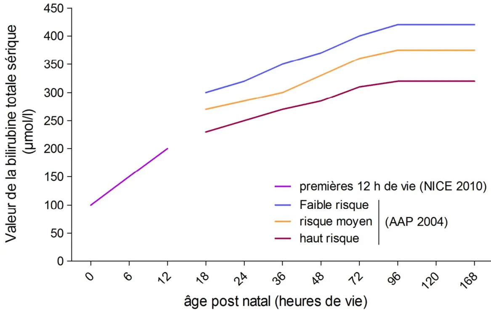

**RECOMMANDATION DE BONNE PRATIQUE**

# Transfusion de globules rouges homologues : produits, indications alternatives

Méthode Recommandations pour la pratique clinique

**RECOMMANDATIONS**

**Novembre 2014**Les recommandations de bonne pratique (RBP) sont définies dans le champ de la santé comme des propositions développées méthodiquement pour aider le praticien et le patient à rechercher les soins les plus appropriés dans des circonstances cliniques données.

Les RBP sont des synthèses rigoureuses de l'état de l'art et des données de la science à un temps donné, décrites dans l'argumentaire scientifique. Elles ne sauraient dispenser le professionnel de santé de faire preuve de discernement dans sa prise en charge du patient qui doit être celle qu'il estime la plus appropriée, en fonction de ses propres constatations et des préférences du patient.

Cette recommandation de bonne pratique a été élaborée selon la méthode résumée dans l'argumentaire scientifique et décrite dans le guide méthodologique de la HAS disponible sur son site : [Élaboration de recommandations de bonne pratique – Méthode Recommandations pour la pratique clinique.](#)

Les objectifs de cette recommandation, la population et les professionnels concernés par sa mise en œuvre sont brièvement présentés en dernière page (fiche descriptive) et détaillés dans l'argumentaire scientifique. Ce dernier ainsi que la synthèse de la recommandation sont téléchargeables sur [www.has-sante.fr](http://www.has-sante.fr).

<table border="1"><thead><tr><th colspan="2"><b>Grade des recommandations</b></th></tr></thead><tbody><tr><td><b>A</b></td><td><b>Preuve scientifique établie</b> Fondée sur des études de fort niveau de preuve (niveau de preuve 1) : essais comparatifs randomisés de forte puissance et sans biais majeur ou méta-analyse d'essais comparatifs randomisés, analyse de décision basée sur des études bien menées.</td></tr><tr><td><b>B</b></td><td><b>Présomption scientifique</b> Fondée sur une présomption scientifique fournie par des études de niveau intermédiaire de preuve (niveau de preuve 2), comme des essais comparatifs randomisés de faible puissance, des études comparatives non randomisées bien menées, des études de cohorte.</td></tr><tr><td><b>C</b></td><td><b>Faible niveau de preuve</b> Fondée sur des études de moindre niveau de preuve, comme des études cas-témoins (niveau de preuve 3), des études rétrospectives, des séries de cas, des études comparatives comportant des biais importants (niveau de preuve 4).</td></tr><tr><td><b>AE</b></td><td><b>Accord d'experts</b> En l'absence d'études, les recommandations sont fondées sur un accord entre experts du groupe de travail, après consultation du groupe de lecture. L'absence de gradation ne signifie pas que les recommandations ne sont pas pertinentes et utiles. Elle doit, en revanche, inciter à engager des études complémentaires.</td></tr></tbody></table>

L'argumentaire scientifique de cette recommandation est téléchargeable sur [www.has-sante.fr](http://www.has-sante.fr)

**Haute Autorité de santé**

Service communication – information

2, avenue du Stade de France – F 93218 Saint-Denis La Plaine Cedex

Tél. : +33 (0)1 55 93 70 00 – Fax : +33 (0)1 55 93 74 00# Sommaire

<table><tr><td>Abréviations et acronymes .....</td><td>6</td></tr><tr><td>Préambule .....</td><td>8</td></tr><tr><td><b>PARTIE 1 : PRODUITS ET EXAMENS IMMUNO-HÉMATOLOGIQUES.....</b></td><td><b>10</b></td></tr><tr><td><b>1. Différents types de concentrés de globules rouges (CGR) .....</b></td><td><b>10</b></td></tr><tr><td>1.1 Caractéristiques réglementaires communes à tous les CGR .....</td><td>10</td></tr><tr><td>1.2 Données succinctes des contrôles qualité réalisés sur les CGR .....</td><td>11</td></tr><tr><td><b>2 Transformations applicables aux CGR .....</b></td><td><b>11</b></td></tr><tr><td>2.1 Irradiation.....</td><td>12</td></tr><tr><td>2.2 Préparation pédiatrique .....</td><td>13</td></tr><tr><td>2.3 Déplasmatisation .....</td><td>13</td></tr><tr><td>2.4 Réduction de volume.....</td><td>14</td></tr><tr><td>2.5 Cryoconservation.....</td><td>14</td></tr><tr><td>2.6 Sang reconstitué.....</td><td>16</td></tr><tr><td><b>3. Qualifications applicables aux produits érythrocytaires .....</b></td><td><b>17</b></td></tr><tr><td>3.1 Phénotypé RH-KEL1 (antigènes RH2, RH3, RH4, RH5 et KEL1).....</td><td>17</td></tr><tr><td>3.2 Phénotype étendu (autres antigènes de groupes sanguins) .....</td><td>17</td></tr><tr><td>3.3 Compatibilisé .....</td><td>18</td></tr><tr><td>3.4 CMV négatif .....</td><td>18</td></tr><tr><td><b>4. Indications d'examens immuno-hématologiques à réaliser en vue d'une transfusion .....</b></td><td><b>20</b></td></tr><tr><td>4.1 Groupes sanguins ABO-RH1 et phénotype RH-KEL1 .....</td><td>20</td></tr><tr><td>4.2 Recherche d'anticorps antiérythrocytes irréguliers (RAI) .....</td><td>21</td></tr><tr><td>4.3 Phénotype étendu .....</td><td>21</td></tr><tr><td>4.4 Épreuve directe de compatibilité .....</td><td>21</td></tr><tr><td>4.5 Test direct à l'antiglobuline .....</td><td>22</td></tr><tr><td>4.6 Autres examens.....</td><td>22</td></tr><tr><td><b>PARTIE 2 : ANESTHÉSIE, RÉANIMATION, CHIRURGIE, URGENCE.....</b></td><td><b>23</b></td></tr><tr><td><b>5 Anémie aiguë .....</b></td><td><b>23</b></td></tr><tr><td>5.1 Indications, modalités et seuil transfusionnel en anesthésie .....</td><td>23</td></tr><tr><td>5.2 Indications, modalités et seuil transfusionnel en réanimation.....</td><td>24</td></tr><tr><td>5.3 Durée de conservation des globules rouges.....</td><td>25</td></tr><tr><td><b>6. Niveaux d'urgence.....</b></td><td><b>26</b></td></tr><tr><td><b>7. Transfusions de globules rouges homologues dans les situations d'urgence .....</b></td><td><b>27</b></td></tr><tr><td><b>8. Techniques alternatives possibles à la transfusion sanguine et indications.....</b></td><td><b>29</b></td></tr><tr><td>8.1 Fer en anesthésie-réanimation.....</td><td>29</td></tr><tr><td>8.2 EPO en anesthésie-réanimation .....</td><td>29</td></tr><tr><td>8.3 Acide tranexamique en anesthésie-réanimation.....</td><td>29</td></tr></table><table><tr><td>8.4</td><td>rFVIIIa en anesthésie-réanimation .....</td><td>30</td></tr><tr><td>8.5</td><td>Retransfusion périopératoire des épanchements sanguins.....</td><td>30</td></tr><tr><td>8.6</td><td>Transfusion autologue programmée (TAP).....</td><td>31</td></tr><tr><td colspan="2"><b>PARTIE 3 : HÉMATOLOGIE, ONCOLOGIE.....</b></td><td><b>32</b></td></tr><tr><td><b>9.</b></td><td><b>Hémoglobinopathies .....</b></td><td><b>33</b></td></tr><tr><td>9.1</td><td>Adultes drépanocytaires.....</td><td>33</td></tr><tr><td>9.2</td><td>Enfants drépanocytaires.....</td><td>35</td></tr><tr><td>9.3</td><td>Thalassémie .....</td><td>37</td></tr><tr><td><b>10.</b></td><td><b>Leucémies aiguës de l'adulte et greffes de cellules souches hématopoïétiques .....</b></td><td><b>38</b></td></tr><tr><td><b>11.</b></td><td><b>Tumeurs solides et hémopathies malignes chroniques (myéloïdes ou lymphoïdes) de l'adulte.....</b></td><td><b>39</b></td></tr><tr><td><b>12.</b></td><td><b>Insuffisance médullaire par myélodysplasies, par hémopathies myéloïdes, par aplasies médullaires.....</b></td><td><b>40</b></td></tr><tr><td><b>13.</b></td><td><b>Anémies carentielles .....</b></td><td><b>41</b></td></tr><tr><td>13.1</td><td>Carence en fer .....</td><td>41</td></tr><tr><td>13.2</td><td>Carence en folates .....</td><td>41</td></tr><tr><td>13.3</td><td>Carence en vitamine B12 .....</td><td>41</td></tr><tr><td><b>14.</b></td><td><b>Anémies hémolytiques auto-immunes.....</b></td><td><b>42</b></td></tr><tr><td><b>15.</b></td><td><b>Gériatrie (âge &gt; 80 ans) .....</b></td><td><b>43</b></td></tr><tr><td><b>16.</b></td><td><b>Autres situations d'anémie : microangiopathies thrombotiques, hémolyse mécanique sur valve.....</b></td><td><b>45</b></td></tr><tr><td>16.1</td><td>Microangiopathies thrombotiques .....</td><td>45</td></tr><tr><td>16.2</td><td>Hémolyse mécanique sur valve .....</td><td>45</td></tr><tr><td colspan="2"><b>PARTIE 4 : NÉONATOLOGIE.....</b></td><td><b>46</b></td></tr><tr><td><b>17.</b></td><td><b>Différents types de concentrés de globules rouges utilisables en néonatologie .....</b></td><td><b>46</b></td></tr><tr><td>17.1</td><td>Types de concentrés destinés aux transfusions à la période périnatale .....</td><td>46</td></tr><tr><td>17.2</td><td>Différents types de dons de concentrés de globules rouges .....</td><td>51</td></tr><tr><td><b>18.</b></td><td><b>Indications et modalités de transfusion chez le nouveau-né .....</b></td><td><b>53</b></td></tr><tr><td>18.1</td><td>Seuils transfusionnels chez le nouveau-né à terme et le nourrisson .....</td><td>53</td></tr><tr><td>18.2</td><td>Particularités du nouveau-né prématuré d'âge gestationnel &lt; 32 SA et pesant &lt; 1 500 g à la naissance.....</td><td>53</td></tr><tr><td>18.3</td><td>Modalités des transfusions chez le nouveau-né .....</td><td>54</td></tr><tr><td><b>19.</b></td><td><b>Exsanguino-transfusion chez le nouveau-né .....</b></td><td><b>56</b></td></tr><tr><td>19.1</td><td>Indications de l'exsanguino-transfusion .....</td><td>56</td></tr><tr><td>19.2</td><td>Modalités de l'exsanguino-transfusion .....</td><td>57</td></tr><tr><td><b>20.</b></td><td><b>Techniques alternatives possibles à la transfusion sanguine et indications.....</b></td><td><b>59</b></td></tr><tr><td>20.1</td><td>Période néonatale .....</td><td>59</td></tr><tr><td>20.2</td><td>Exsanguino-transfusion (EST) pour traiter l'ictère néonatal .....</td><td>60</td></tr></table><table><tr><td>Annexe 1. Syndromes drépanocytaires majeurs de l'adulte - extrait du PNDS - janvier 2010 .....</td><td>61</td></tr><tr><td>Annexe 2. Syndromes drépanocytaires majeurs de l'enfant et de l'adolescent - extrait du PNDS - janvier 2010 .....</td><td>62</td></tr><tr><td>Annexe 3. Valeurs seuils de la bilirubine totale indiquant l'exsanguino-transfusion chez le nouveau-né à terme .....</td><td>63</td></tr><tr><td>Annexe 4. Valeurs seuils de la bilirubine totale indiquant l'exsanguino-transfusion chez le nouveau-né prématuré de moins de 35 semaines d'aménorrhée .....</td><td>64</td></tr><tr><td>Participants .....</td><td>65</td></tr><tr><td>Remerciements .....</td><td>68</td></tr><tr><td>Fiche descriptive .....</td><td>69</td></tr></table>## Abréviations et acronymes

**Afssaps** : cf. ANSM

**AMM** : autorisation de mise sur le marché

**ANSM** : Agence nationale de sécurité du médicament et des produits de santé (anciennement Afssaps)

**BNSPR** : Banque nationale de sang de phénotype rare

**CD52** : antigène CAMPATH-1. Synonymes : A19B7, MB7, CLS1, B7-Ag, AI463198, CE5

**CGR** : concentré de globules rouges

**CMV** : cytomégalovirus

**CNRGS** : Centre national de référence pour les groupes sanguins

**CPDA-1** : citrate, phosphate, dextrose, adénine -1 (milieu de conservation)

**CTSA** : Centre de transfusion sanguine des armées

**CVO** : crise vaso-occlusive

**DGS** : Direction générale de la santé

**DHOS** : Direction de l'hospitalisation et de l'organisation des soins

**ECMO** : *Extra-Corporeal Membrane Oxygenation*

**ECUN** : entérocolite ulcéro-nécrosante

**EFS** : Établissement français du sang

**EPO** : érythropoïétine

**ES** : établissement de santé

**ETS** : établissement de transfusion sanguine

**FiO2** : fraction inspirée en oxygène du mélange gazeux que respire la personne

**FY** : système de groupe sanguin Duffy

**GVH** : *Graft Versus Host Disease* (= maladie du greffon contre l'hôte)

**HAS** : Haute Autorité de santé

**Hb** : hémoglobine

**HbS** : hémoglobine S

**HLA**. *Human Leukocyte Antigens*

**IgA** : immunoglobuline A

**IRM** : imagerie par résonance magnétique

**JK** : système de groupe sanguin Kidd

**KEL** : système de groupe sanguin Kell

**LE** : système de groupe sanguin Lewis

**MNS** : système de groupe sanguin MNSs

**NFS** : numération formule sanguine

**NICE** : *National Institute for health and Care Excellence***O2** : oxygène

**PNDS** : protocole national de diagnostic et de soins

**PSL** : produit sanguin labile

**RAI** : recherche d'anticorps anti érythrocytes irréguliers

**RFVIIa** : facteur VII recombinant activé

**RH** : système de groupe sanguin Rhésus

**RHuEPO** : érythropoïétine humaine recombinante

**SA** : semaine d'aménorrhée

**SaO2** : saturation en O2 du sang artériel

**TaO2** : transport artériel de l'oxygène aux tissus

**SAG-M** : saline, adénine, glucose, mannitol (milieu de conservation)

**STA** ; syndrome thoracique aigu

**T** : type de polyagglutinabilité des globules rouges

**TAP** : transfusion autologue programmée

**TDA** : test direct à l'antiglobuline. Synonymes : test de Coombs direct, TCD

**VIH** : virus de l'immunodéficience humaine## Préambule

### Contexte d'élaboration de la recommandation de bonne pratique

Cette recommandation de bonne pratique sur le thème « Transfusion de globules rouges homologues : produits, indications, alternatives » a été inscrite au programme de travail 2012 de la Haute Autorité de santé (HAS, service des bonnes pratiques professionnelles) à la demande de la Direction générale de la santé (sous-direction politique des pratiques et des produits de santé – Bureau Éléments et produits du corps humain PP4). L'Établissement français du sang est associé à cette demande en tant qu'opérateur civil unique français pour la collecte, la qualification, la préparation et la distribution des produits sanguins labiles (PSL). Il était demandé à la HAS d'actualiser les recommandations de l'Afssaps de 2002 intitulées « Transfusions de globules rouges homologues : produits, indications, alternatives ». En effet les différents procédés de préparation des PSL dont les globules rouges en matière de sécurité sanitaire comme immunologique ne sont pas toujours connus des prescripteurs et il devient nécessaire d'actualiser ces recommandations du fait de l'évolution de thérapeutiques médico-chirurgicales et des nouveaux produits sanguins.

### Objectifs de la recommandation

L'objectif est d'actualiser les recommandations de l'Afssaps de 2002 intitulées « Transfusions de globules rouges homologues : produits, indications, alternatives ».

Il s'agit d'aider les professionnels dans le cadre de leur prescription et dans le suivi des malades transfusés et d'harmoniser les pratiques professionnelles.

Les recommandations devront :

- • clarifier les champs de prescription de transfusion et de conseil transfusionnel ;
- • proposer des stratégies ciblées en fonction des populations de malades ;
- • proposer des alternatives à la transfusion sanguine.

Cette recommandation vise à répondre, concernant les concentrés de globules rouges et les examens immuno-hématologiques, aux questions suivantes :

- • Quels sont les différents types de concentrés de globules rouges (CGR) ?
- • Quelles sont les transformations applicables aux produits érythrocytaires ?
- • Quelles sont les qualifications applicables aux produits érythrocytaires ?
- • Quelles sont les évolutions des propriétés des produits érythrocytaires en fonction de leur durée de conservation ?
- • Quelles sont les indications d'examens à réaliser en vue d'une transfusion ?

Cette recommandation vise à répondre, dans le domaine l'anesthésie-réanimation, aux questions suivantes :

- • Quelles sont les indications et les modalités de transfusion en cas d'anémie aiguë ?
- • Quels sont les produits transfusés en cas d'urgence ?
- • Quel est le choix des groupes sanguins des CGR en cas de transfusion en urgence vitale immédiate en l'absence de connaissance du groupe sanguin du patient ?
- • Quelles sont les techniques alternatives possibles à la transfusion sanguine et quelles en sont les indications ?

Cette recommandation vise à répondre, dans le domaine de l'hématologie et de l'oncologie, aux questions suivantes :- • Quelles sont les indications et les modalités de transfusion de globules rouges au cours des hémoglobinopathies ?
- • Quelles sont les indications et les modalités de transfusion de globules rouges au cours des leucémies aiguës de l'adulte et des greffes de cellules souches hématopoïétiques ?
- • Quelles sont les indications et les modalités de transfusion de globules rouges au cours des tumeurs solides et des hématopathies malignes chroniques (myéloïdes ou lymphoïdes) de l'adulte au cours de chimiothérapies ?
- • Quelles sont les indications et les modalités de transfusion de globules rouges au cours de l'insuffisance médullaire par myélodysplasies, par hématopathies myéloïdes, par aplasies médullaires ?
- • Quelles sont les indications et les modalités de transfusion de globules rouges au cours des anémies carentielles ?
- • Quelles sont les indications et les modalités de transfusion de globules rouges au cours des anémies hémolytiques auto-immunes ?
- • Quelles sont les indications et les modalités de transfusion de globules rouges en gériatrie (âge > 80 ans) ?
- • Quelles sont les indications et les modalités de transfusion de globules rouges dans les autres situations d'anémie : autres hémolyses (microangiopathies thrombotiques, hémolyse mécanique sur valve), autres situations ?

Cette recommandation vise à répondre, dans le domaine de la néonatologie, aux questions suivantes :

- • Quels sont les différents types de concentrés de globules rouges utilisables en néonatologie ?
- • Quelles sont les indications et les modalités de transfusion chez le nouveau-né ?
- • Quelles sont les indications et les modalités d'exsanguino-transfusion chez le nouveau-né ?
- • Quelles sont les techniques alternatives possibles à la transfusion sanguine et quelles en sont les indications ?

### **Patients concernés**

Toutes les personnes pouvant bénéficier d'une transfusion de globules rouges.

### **Professionnels concernés**

Ensemble des prescripteurs potentiels de globules rouges, médecins et professionnels exerçant dans le cadre des établissements de soins publics ou privés. Acteurs du conseil transfusionnel organisé par les structures de délivrance des produits sanguins labiles.## **PARTIE 1 : PRODUITS ET EXAMENS IMMUNO-HÉMATOLOGIQUES**

### **1. Différents types de concentrés de globules rouges (CGR)**

Les CGR à usage clinique peuvent être préparés à partir de don de sang total ou à partir de prélèvement d'aphérèse.

Dans les deux cas, les CGR font systématiquement l'objet d'une déleucocytation.

En règle générale, les CGR font également l'objet d'une deuxième transformation : l'addition d'une solution supplémentaire de conservation en phase liquide. En France, cette solution est composée de chlorure de sodium, d'adénine, de glucose et de mannitol : solution SAG-Mannitol (SAG-M).

Beaucoup plus rarement, pour certaines situations de néonatologie, cette deuxième transformation n'est pas réalisée, et les CGR sont en solution anticoagulante et de conservation composée de citrate, phosphate et dextrose (CPDA-1).

Par souci de simplification, le terme « CGR » mentionné dans ce texte concerne les CGR déleucocytés en solution SAG-M. Lorsque les CGR en solution CPDA-1 sont concernés, la mention explicite de la suspension en CPDA-1 est indiquée.

La préparation des CGR est réalisée à partir du sang total dans un délai après le prélèvement le plus souvent compris entre 2 heures et 24 heures, le sang total étant maintenu avant séparation à une température comprise entre 18 °C et 24 °C. Plus rarement, les CGR peuvent être préparés au-delà de 24 heures et au plus tard 72 heures après le prélèvement, la conservation du sang total devant alors se situer entre 2 °C et 10 °C.

À partir d'un prélèvement d'aphérèse, la préparation de CGR peut être réalisée par deux méthodes :

- • érythraphérèse simple : le prélèvement d'aphérèse est entièrement conçu pour le recueil exclusif de globules rouges permettant de préparer deux CGR. En pratique, ce mode de préparation est exceptionnellement utilisé en France ;
- • érythraphérèse combinée : dans ce cas, le CGR est préparé à partir de globules rouges prélevés par aphérèse, un ou deux autres constituants sanguins (plasma et/ou plaquettes) ayant également été prélevés chez le donneur dans l'objectif de préparer au moins deux produits.

#### **1.1 Caractéristiques réglementaires communes à tous les CGR**

Dans les caractéristiques des PSL, deux types de CGR homologues sont identifiés : le CGR « unité adulte », et le CGR « unité enfant ». Par souci de clarté et de simplification, et dans la mesure où une très grande majorité des CGR utilisés en France sont des CGR « unité adulte » avec ajout d'une solution supplémentaire de conservation, seuls ces derniers sont décrits dans cette recommandation. Les détails relatifs aux CGR « unité enfant » et aux CGR conservés en solution CPDA-1 peuvent être consultés dans l'argumentaire correspondant aux recommandations.

Dénomination abrégée (cf. supra) : CGR.

Les caractéristiques communes à tous les CGR sont :- • hématocrite compris entre 50 % et 70 % ;
- • taux d'hémolyse dans le produit mesuré à la fin de la durée de conservation inférieur à 0,8 % de la quantité d'hémoglobine totale ;
- • température du produit maintenue entre + 2 °C et + 6 °C pendant la durée de conservation.

La durée de conservation maximale avant délivrance est de 42 jours à compter de la fin du prélèvement dans le cas de l'utilisation de la solution SAG - mannitol.

En cas d'ouverture intentionnelle de la poche, lors de la préparation ou pendant la conservation, le concentré de globules rouges unité adulte peut être conservé au maximum 24 heures.

La transfusion d'un CGR délivré est à débuter impérativement dans les 6 heures suivant l'arrivée dans le service clinique, si le transport a été réalisé selon les bonnes pratiques. Dans le cas contraire, ce délai débute à l'heure de la délivrance.

## 1.2 Données succinctes des contrôles qualité réalisés sur les CGR

### ▶ Hématocrite

Il est réglementairement compris entre 50 % et 70 %. Il est (moyenne  $\pm$  écart-type) de  $59,2 \pm 3,1$  % dans les données actuelles de contrôle de qualité de l'EFS.

### ▶ Contenu en hémoglobine

Il est réglementairement au minimum de 40 g. Il est (moyenne  $\pm$  écart-type) de  $55,1 \pm 7,4$  g dans les données actuelles de contrôle de qualité de l'EFS.

### ▶ Volume

Il n'y a pas de limite inférieure fixée réglementairement. Le volume est mentionné sur l'étiquette du CGR. Il est (moyenne  $\pm$  écart-type) de  $284 \pm 28$  ml dans les données actuelles de contrôle de qualité de l'EFS.

### ▶ Contenu en leucocytes

Il est réglementairement inférieur à un million de leucocytes par CGR dans au moins 97 % de la production avec un degré de confiance de 95 %.

Le contenu médian est de  $0,05 \cdot 10^6$  leucocytes par CGR, et les contrôles réalisés permettent d'assurer avec un degré de confiance de 95 % que plus de 99 % de la production contient effectivement moins d'un million de leucocytes résiduels.

## 2 Transformations applicables aux CGR

Certaines indications de transformations applicables aux CGR sont spécifiques à la période néonatale et ces transformations sont décrites dans le chapitre 17.

Une « transformation » est une opération complémentaire du processus de préparation initiale appliquée à un CGR permettant d'obtenir un ou plusieurs autres CGR dont les caractéristiques ont été modifiées en quantité (quantité d'hémoglobine, volume, protéines plasmatiques) ou en qualité (déplasmatisation, irradiation, etc.). Les diverses transformations sont généralement cumulables.

La plupart des transformations conduisent à une perte d'une partie du principe actif des CGR, le contenu en hémoglobine. De surcroît, les lésions de stockage peuvent s'accélérer après transformation, entraînant une réduction de la durée de conservation du produit avant utilisation.

Toutes les transformations sont réalisées par l'EFS ou le CTSA, et requièrent du temps pour être réalisées.Pour toutes ces raisons, il est important de connaître les indications des transformations et leur délai d'obtention, afin de les prescrire à bon escient.

Les transformations des CGR sont listées dans l'ordre de fréquence de leur réalisation.

## 2.1 Irradiation

Dénomination abrégée : CGR irradié

### ► Définition et description

L'irradiation consiste à exposer un CGR à une source de rayonnement ionisant. La dose reçue mesurable en chaque point de la zone d'irradiation doit être comprise entre 25 et 45 grays.

En raison des lésions induites et notamment une libération de potassium, le délai d'utilisation après irradiation doit être le plus court possible, notamment en néonatologie.

### ► Prescription

<table border="1"><tr><td style="background-color: #ADD8E6; text-align: center; vertical-align: middle;"><b>AE</b></td><td>L'indication de la transformation « irradiation » est notifiée par le prescripteur à chaque prescription. Lors de la première prescription, le motif précis de l'indication est porté à la connaissance de la structure de délivrance pour qu'elle puisse inscrire, dans sa base de données, le protocole transfusionnel propre au patient. Le patient en est informé et reçoit un document mentionnant cette indication et sa durée si elle est programmée.</td></tr></table>

### ► Indications

Voir également la partie 4 « Néonatologie ».

<table border="1"><tr><td style="background-color: #FFFF00; text-align: center; vertical-align: middle;"><b>B</b></td><td>
Il est recommandé de prescrire la transformation « irradiation » des CGR dans les situations suivantes :
<ul style="list-style-type: none;"><li>• patients porteurs d'un déficit immunitaire congénital cellulaire ;</li><li>• transfusion de CGR issus d'un don dirigé intrafamilial, quel que soit le degré de parenté entre donneur et receveur (obligation réglementaire) ;</li><li>• avant (7 jours) ou pendant un prélèvement de cellules souches hématopoïétiques (autologues ou allogéniques), médullaires ou sanguines ;</li><li>• patients traités par greffe de cellules souches hématopoïétiques autologues, dès le début du conditionnement et pendant au moins 3 mois après autogreffe (1 an après conditionnement avec irradiation corporelle totale) ;</li><li>• patients traités par greffe de cellules souches hématopoïétiques allogéniques, dès le début du conditionnement et pendant au moins 1 an après la greffe ; au-delà de 1 an, l'indication peut être discutée en fonction de l'état clinique et du degré d'immunosuppression ; en cas de réaction du greffon contre l'hôte chronique ou de poursuite d'un traitement immunosuppresseur l'indication sera maintenue indéfiniment.</li></ul></td></tr></table><table border="1"><tr><td style="background-color: #f08080; text-align: center; vertical-align: middle;"><b>C</b></td><td>
Il est recommandé de prescrire la transformation « irradiation » des CGR dans les situations suivantes :
<ul><li>• patients traités par analogues des purines et pyrimidines (fludarabine, pentostatine, cladribine, clofarabine, etc.), jusqu'à 1 an après l'arrêt du traitement ;</li><li>• patients traités de façon répétée par sérum antilymphocytaire (pour aplasie médullaire par exemple) ou par anti-CD52 ou par anticorps monoclonaux ayant pour cible les lymphocytes T ;</li><li>• immunosuppression T profonde hors VIH.</li></ul></td></tr></table>

## 2.2 Préparation pédiatrique

Dénomination abrégée : CGR pédiatrique.

La préparation pédiatrique a pour objectif de fournir des CGR adaptés aux receveurs de faible volume sanguin.

De surcroît, la préparation pédiatrique permet de préparer plusieurs CGR transformés issus du même don qui pourront être utilisés soit séparément, soit dans le cadre d'un programme dédié à un enfant. Dans ce cas, les CGR transformés peuvent être utilisés jusqu'à la date de péremption, qui est de 42 jours pour les CGR en solution supplémentaire de conservation SAG-mannitol.

### ► Définition et description

La préparation pédiatrique consiste à diviser aseptiquement un CGR en plusieurs unités pédiatriques :

- • le volume minimal est de 50 ml ;
- • le contenu en hémoglobine est défini en référence au CGR d'origine ;
- • les caractéristiques relatives à l'aspect, à l'hématocrite et au taux d'hémolyse sont identiques à celles du CGR d'origine.

La préparation pédiatrique n'étant pas réalisable par tous les sites, elle peut nécessiter un délai d'obtention.

### ► Indications

Voir également la partie 4 « Néonatologie ».

<table border="1"><tr><td style="background-color: #add8e6; text-align: center; vertical-align: middle;"><b>AE</b></td><td>
Il est recommandé de prescrire la transformation « préparation pédiatrique » de CGR en cas de transfusion de CGR chez l'enfant de moins de 10 kg, hors contexte nécessitant des volumes supérieurs.
</td></tr></table>

## 2.3 Déplasmatisation

Dénomination abrégée : CGR déplasmatisé.

L'objectif de la déplasmatisation est de réduire au maximum la quantité de protéines plasmatiques dans le CGR.

La durée de réalisation de cette transformation est de l'ordre de 2 heures. Elle n'est réalisable quepar certains sites de l'EFS et du CTSA, ce qui peut ajouter un délai supplémentaire pour la disponibilité du CGR transformé. Elle s'accompagne d'une perte d'environ 10 % des globules rouges.

La péremption du CGR déplasmatisé est soit de 24 heures soit de 10 jours après la déplasmatisation, en fonction des conditions techniques de réalisation.

### ► Définition et description

La déplasmatisation consiste à éliminer aseptiquement la majeure partie du plasma d'un CGR. Elle comporte une ou plusieurs étapes de lavage avec une remise en suspension des éléments cellulaires dans une solution injectable. La solution de suspension doit préserver les qualités fonctionnelles des cellules.

La quantité résiduelle totale de protéines extracellulaires, sans tenir compte de l'albumine éventuellement apportée par la solution de remise en suspension, est inférieure ou égale à 0,5 g.

Le contenu minimal en hémoglobine est supérieur ou égal à 35 g.

### ► Prescription

<table border="1">
<tr>
<td style="background-color: #ADD8E6;"><b>AE</b></td>
<td>La décision de transfuser un patient en CGR déplasmatisé est prise par le médecin référent du patient après avis du responsable du conseil transfusionnel. Elle débouche sur un protocole transfusionnel propre au patient qui peut être réévalué. Le patient en est informé et reçoit un document mentionnant cette indication.</td>
</tr>
</table>

### ► Indications

Voir également la partie 4 « Néonatologie ».

<table border="1">
<tr>
<td style="background-color: #FF69B4;"><b>C</b></td>
<td>

Il est recommandé de prescrire la transformation « déplasmatisation » de CGR dans les situations suivantes :

<ul>
<li>• déficit en IgA sériques avec présence d'anticorps anti-IgA dans le plasma du receveur ;</li>
<li>• antécédents de réactions transfusionnelles anaphylactiques majeures, ayant mis en jeu le pronostic vital (effet indésirable receveur de grade de sévérité 3 de la classification de l'hémovigilance).</li>
</ul>
</td>
</tr>
</table>

<table border="1">
<tr>
<td style="background-color: #ADD8E6;"><b>AE</b></td>
<td>Il est recommandé de prescrire la transformation « déplasmatisation » de CGR en cas d'antécédents d'effets indésirables receveurs allergiques de grade de sévérité inférieur, dès lors qu'ils sont répétés et deviennent un obstacle à la transfusion.</td>
</tr>
</table>

## 2.4 Réduction de volume

Cette transformation n'a pas d'indication en dehors du contexte périnatal.

Voir la description et les indications dans la partie 4 « Néonatologie ».

## 2.5 Cryoconservation

Dénomination abrégée : CGR cryoconservé.L'objectif de la conservation sous forme congelée de CGR est de conserver à long terme des CGR ayant des groupes sanguins rares, ou des associations phénotypiques rares.

Cette transformation s'accompagne d'une perte d'au moins 10 % des globules rouges. Elle requiert un délai de réalisation de la décongélation de l'ordre de 2 heures et demie. Elle n'est réalisable que par quelques sites en France, ce qui ajoute un délai supplémentaire d'acheminement pour en disposer.

### ► Définition et description

La cryoconservation consiste à congeler, conserver et décongeler aseptiquement un CGR en présence d'un cryoprotecteur, le glycérol. Après décongélation, l'élimination du glycérol est nécessaire. Elle est réalisée par centrifugations et lavages.

Après décongélation et élimination du cryoprotecteur le contenu minimal en hémoglobine est supérieur ou égal à 35 g.

### ► Particularités organisationnelles

Le délai de mise à disposition d'un CGR décongelé est long, pour des raisons techniques et organisationnelles :

- • techniquement, la décongélation d'un CGR dure un peu plus de 2 heures ;
- • les CGR cryoconservés proviennent soit des régions pour répondre à des besoins spécifiques de patients porteurs d'une immunisation complexe, soit de la Banque nationale de sang de phénotype rare (BNSPR), qui a pour mission de conserver congelés ce type de CGR. Lorsque la situation clinique justifie le recours au CGR de phénotype rare, la prescription est relayée, par le site référent de l'EFS ou du CTSA, au CNRGS et à la BNSPR, qui participent à la décision transfusionnelle. Le CNRGS peut être amené à contrôler la compatibilité au laboratoire des CGR délivrés. Le délai d'obtention d'un CGR de phénotype rare décongelé, malgré tous les efforts pour agir au plus vite, est le plus souvent supérieur à une demi-journée.

### ► Prescription

<table border="1">
<tr>
<td style="background-color: #ADD8E6; text-align: center; vertical-align: middle;">AE</td>
<td>La décision de faire appel à la transformation « CGR cryoconservé » est prise par le site de délivrance de l'EFS ou du CTSA. En cas de patient ayant un groupe sanguin rare, la décision sera gérée en partenariat avec la Banque nationale de sang de phénotype rare (BNSPR) et le Centre national de référence pour les groupes sanguins (CNRGS).</td>
</tr>
</table>

### ► Indications

<table border="1">
<tr>
<td style="background-color: #FFFF00; text-align: center; vertical-align: middle;">B</td>
<td>

Il est recommandé de prescrire la transformation « CGR cryoconservé » dans les situations suivantes :

<ul>
<li>• les patients ayant un groupe sanguin rare, notamment ceux dont les globules rouges sont dépourvus d'un antigène de fréquence élevée dit « antigène public », et plus particulièrement lorsque ces patients ont développé un anticorps antipublic correspondant ;</li>
<li>• les patients ayant développé une association de plusieurs anticorps dirigés contre des antigènes de groupe sanguin de fréquences équilibrées, de telle sorte que la proportion de CGR compatibles dans la population est très faible.</li>
</ul>
</td>
</tr>
</table>## 2.6 Sang reconstitué

Cette transformation n'a pas d'indication en dehors du contexte périnatal.

Voir la description et les indications dans la partie 4 « Néonatologie ».### 3. Qualifications applicables aux produits érythrocytaires

Une « qualification » est une opération consistant soit à affecter une spécificité complémentaire au CGR, soit à sélectionner pour le receveur le CGR le plus adéquat possible. Elle ne modifie ni le contenu ni la date de péremption du produit.

Les transformations et les qualifications liées au don sont associables entre elles. Transformations et qualifications sont cumulables.

Les qualifications applicables aux CGR sont listées dans l'ordre de fréquence de leur réalisation.

#### 3.1 Phénotypé RH-KEL1 (antigènes RH2, RH3, RH4, RH5 et KEL1)

La qualification « phénotypé » s'applique aux CGR et aux produits issus de leurs transformations pour lesquels une ou plusieurs déterminations d'antigènes de systèmes de groupes sanguins ont été effectuées en plus du groupe ABO et de l'antigène RH1.

En France, le phénotype RH-KEL1 (antigènes RH2, RH3, RH4, RH5 et KEL1) est connu pour tous les CGR. Un CGR respecte un protocole « phénotypé RH-KEL1 » lorsqu'il est antigéno-compatible avec le receveur, c'est-à-dire qu'il ne possède pas parmi les antigènes RH2, RH3, RH4, RH5 et KEL1 un antigène absent chez le receveur.

##### ► Indications

Voir également la partie 4 « Néonatologie ».

<table border="1">
<tr>
<td style="background-color: yellow; text-align: center; vertical-align: middle;"><b>B</b></td>
<td>Il est recommandé de prescrire la qualification « phénotypé RH-KEL1 », avec pour objectif de prévenir la survenue d'un accident hémolytique, pour les patients ayant développé un ou des allo-anticorps antiérythrocytaires contre au moins l'un des antigènes suivants : RH2, RH3, RH4, RH5 et KEL1.</td>
</tr>
</table>

<table border="1">
<tr>
<td style="background-color: #ADD8E6; text-align: center; vertical-align: middle;"><b>AE</b></td>
<td>

Il est recommandé de prescrire la qualification « phénotypé RH-KEL1 » dans les situations suivantes, avec pour objectif de prévenir l'apparition d'allo-anticorps :

<ul style="list-style-type: none;">
<li>• femmes, de la naissance jusqu'à la fin de la période procréatrice ;</li>
<li>• patients atteints d'hémoglobinopathies ;</li>
<li>• patients atteints d'affections chroniques dont la survie prolongée est conditionnée par des transfusions itératives de CGR comme dans les myélodysplasies ;</li>
<li>• patients présentant un groupe sanguin rare.</li>
</ul>
</td>
</tr>
</table>

#### 3.2 Phénotype étendu (autres antigènes de groupes sanguins)

Cette qualification s'applique lorsque au moins un antigène différent des antigènes RH2, RH3, RH4, RH5 et KEL1 est concerné parmi les autres systèmes de groupe sanguin (FY, JK, MNS, LE, etc.), et qu'il est antigéno-compatible avec le receveur.

##### ► Indications

Voir également la partie 4 « Néonatologie ».<table border="1"><tr><td style="background-color: yellow;"><b>B</b></td><td>Il est recommandé de prescrire la qualification « phénotype étendu », afin de prévenir la survenue d'un accident hémolytique, chez les patients ayant développé un ou des allo-anticorps antiérythrocytaires présentant un risque transfusionnel contre au moins un antigène de groupe sanguin du globule rouge dans des systèmes de groupes sanguins autres que RH et KEL1.</td></tr></table>

<table border="1"><tr><td style="background-color: lightblue;"><b>AE</b></td><td>Il est souhaitable dans ce cas de respecter également le phénotype RH-KEL1 (antigènes RH2, RH3, RH4, RH5 et KEL1) à titre préventif.</td></tr></table>

Chez les patients atteints d'hémoglobinopathies, drépanocytose ou thalassémie, non allo-immunisés, la prescription de la qualification « phénotype étendu », en vue de prévenir l'apparition d'allo-anticorps contre les antigènes des systèmes FY, JK et MNS, ne peut pas faire l'objet d'une recommandation, cela en raison de la constatation actuelle d'une différence de répartition des phénotypes érythrocytaires entre la population de ces patients et celle des donneurs de sang.

### 3.3 Compatibilisé

Voir également la partie 4 « Néonatologie ».

La qualification « compatibilisé » s'applique aux CGR pour lesquels une épreuve directe de compatibilité au laboratoire entre le sérum ou le plasma du receveur et les globules rouges du CGR a été réalisée.

La qualification « compatibilisé » ne peut être acquise que si le CGR est effectivement compatible. La durée maximale de validité de la qualification « compatibilisé » est la même que celle de la RAI.

#### ► Indications

Pour rappel, la qualification « compatibilisé » est une obligation réglementaire en cas de transfusion chez un patient ayant une RAI positive ou un antécédent de RAI positive.

<table border="1"><tr><td style="background-color: lightblue;"><b>AE</b></td><td>Il est recommandé de prescrire la qualification « compatibilisé » en cas de transfusion d'un sujet porteur de drépanocytose.</td></tr></table>

### 3.4 CMV négatif

Voir également la partie 4 « Néonatologie ».

La qualification cytomegalovirus (CMV) négatif s'applique aux PSL cellulaires homologues à finalité thérapeutique directe et aux produits issus de leurs transformations provenant de donneurs chez qui les résultats de la recherche d'anticorps anticytomegalovirus sont négatifs au moment du prélèvement.

La déleucocytation, généralisée en France pour tous les PSL, assure une prévention de la transmission du CMV par transfusion pour tous les patients (y compris les patients considérés àrisque de faire une infection grave). Aucune étude ne montre une supériorité de l'adjonction de la qualification « CMV négatif » sur la déleucocytation telle qu'elle est pratiquée actuellement en France.

**AE**

Il n'y a pas lieu de prescrire la qualification « CMV négatif » pour les CGR quels que soient le terrain, l'âge ou la pathologie du patient.## 4. Indications d'examens immuno-hématologiques à réaliser en vue d'une transfusion

Ces recommandations ne traitent pas de la gestion des situations d'urgence, qui font l'objet d'un chapitre particulier, ni de la prescription des analyses IH dans un contexte autre que transfusionnel, tel que la grossesse ou la périnatalité.

### 4.1 Groupes sanguins ABO-RH1 et phénotype RH-KEL1

Les deux examens groupes sanguins ABO-RH1 et phénotype RH-KEL1 doivent être réalisés chacun deux fois de façon indépendante pour que leurs résultats soient considérés comme valides (obligation réglementaire) et permettent la délivrance de CGR dans les meilleures conditions.

#### ► Absence d'antécédents transfusionnels connus

##### Contexte médical

<table border="1"><tr><td style="background-color: #ADD8E6;"><b>AE</b></td><td>La prescription des examens groupes sanguins ABO-RH1 et phénotype RH-KEL1 est faite dès lors que l'indication d'une transfusion est posée ou que le diagnostic est associé à une probabilité élevée de nécessité de transfusion, et ce en l'absence de déterminations antérieures, valides et disponibles.</td></tr></table>

##### Contexte pré-interventionnel

<table border="1"><tr><td style="background-color: #ADD8E6;"><b>AE</b></td><td>
Il n'est pas recommandé de prescrire les examens groupes sanguins ABO-RH1 et phénotype RH-KEL1 en cas d'intervention à risque de transfusion ou de saignement nul à faible.

Il est recommandé de prescrire les examens groupes sanguins ABO-RH1 et phénotype RH-KEL1 en cas d'intervention à risque de transfusion intermédiaire ou élevé ou de saignement important, et ce en l'absence de déterminations antérieures, valides et disponibles.

Il est recommandé, lorsque la <i>check-list</i> « Sécurité au bloc opératoire » mentionne un risque de saignement important, de vérifier la présence des résultats des examens groupes sanguins ABO-RH1 et phénotype RH-KEL1.
</td></tr></table>

#### ► Antécédents de transfusion connus (contexte médical et pré-interventionnel)

<table border="1"><tr><td style="background-color: #ADD8E6;"><b>AE</b></td><td>Il est recommandé d'utiliser les résultats antérieurs de groupes sanguins ABO-RH1 et phénotype RH-KEL1 après avoir vérifié la concordance stricte des informations d'identité du patient figurant sur les résultats et sur les données d'admission.</td></tr></table>

<table border="1"><tr><td style="background-color: #ADD8E6;"><b>AE</b></td><td>Il est recommandé, chez les patients transfusés régulièrement, de surveiller la ferritinémie.</td></tr></table>## 4.2 Recherche d'anticorps antiérythrocytes irréguliers (RAI)

Chez un patient ayant des antécédents de transfusion, de grossesse ou de transplantation dans les 6 mois précédents, le délai maximal de validité de la RAI est de 3 jours (72 h) (obligation réglementaire).

Ce délai de validité est prolongé à 21 jours lorsque le résultat de la RAI est négatif et en l'absence d'antécédents de transfusion, de grossesse ou de transplantation dans les 6 mois précédents. Dans ce cas, la prescription de CGR doit mentionner la prolongation de validité (obligation réglementaire).

<table border="1"><tr><td style="background-color: #ADD8E6;"><b>AE</b></td><td>
Il est recommandé que le formulaire de prescription de CGR comporte la mention de la prolongation du délai de validité de la RAI à 21 jours afin de faciliter l'obligation réglementaire précitée.

Dans certains cas d'épisodes transfusionnels récents, notamment en cas de suspicion d'inefficacité transfusionnelle, la sécurisation passe par un délai de RAI le plus proche possible de la transfusion.
</td></tr></table>

Suite à un épisode transfusionnel, une RAI doit être réalisée dans un délai de 1 à 3 mois (obligation réglementaire).

## 4.3 Phénotype étendu

<table border="1"><tr><td style="background-color: #ADD8E6;"><b>AE</b></td><td>
Il est recommandé de prescrire l'examen phénotype étendu dans les situations suivantes :
<ul><li>• à titre systématique, et comprenant alors au moins la détermination des antigènes FY1, FY2, JK1, JK2, MNS3 et MNS4 chez les patients dont le diagnostic impose des transfusions itératives, notamment hémoglobinopathies, hémopathies malignes, myélodysplasies ;</li><li>• à la demande, chez les patients porteurs d'un anticorps dirigé contre un antigène de groupe sanguin autre que RH1 à 5 et KEL1, pour confirmer la spécificité et la nature allo-immune de l'anticorps.</li></ul></td></tr></table>

## 4.4 Épreuve directe de compatibilité

Chez les patients ayant une RAI positive ou un antécédent de RAI positive, en cas de prescription de CGR, une épreuve directe de compatibilité doit être réalisée (obligation réglementaire). Il est souhaité que cette obligation puisse évoluer vers une limitation aux seuls patients ayant une RAI prétransfusionnelle positive.

<table border="1"><tr><td style="background-color: #ADD8E6;"><b>AE</b></td><td>Il est recommandé de prescrire l'examen épreuve directe de compatibilité chez les patients drépanocytaires.</td></tr></table>## 4.5 Test direct à l'antiglobuline

<table border="1"><tr><td style="background-color: #ADD8E6;"><b>AE</b></td><td>Il est recommandé de prescrire un test direct à l'antiglobuline en cas de suspicion d'incompatibilité transfusionnelle érythrocytaire ou de maladie hémolytique du nouveau-né.</td></tr></table>

## 4.6 Autres examens

<table border="1"><tr><td style="background-color: #ADD8E6;"><b>AE</b></td><td>
Les examens concernés sont les suivants :
<ul style="list-style-type: none;"><li>• épreuve d'élution d'anticorps à partir de globules rouges ;</li><li>• épreuve d'absorption d'anticorps sur des globules rouges ;</li><li>• fixation-élution ;</li><li>• génotypage érythrocytaire.</li></ul>
La prescription de ces examens spécialisés relève généralement du biologiste, dans le cadre de la résolution de cas complexes :
<ul style="list-style-type: none;"><li>• d'identification d'antigènes de groupes sanguins ;</li><li>• d'identification d'anticorps dirigés contre des antigènes de groupes sanguins ;</li><li>• de suspicion d'incompatibilité transfusionnelle érythrocytaire, notamment chez des patients ayant des antécédents transfusionnels récents ;</li><li>• de maladie hémolytique du nouveau-né.</li></ul></td></tr></table>## PARTIE 2 : ANESTHÉSIE, RÉANIMATION, CHIRURGIE, URGENCE

Toute transfusion doit être réalisée dans un environnement permettant la surveillance du patient conformément à la circulaire DGS/DHOS/Afssaps n° 03/582 du 15 décembre 2003 :

- « - L'acte transfusionnel est réalisé par les médecins ou, sur prescription médicale, par les sages-femmes, ou par les infirmiers(e)s à condition qu'un médecin puisse intervenir à tout moment.
- - La surveillance infirmière est particulièrement attentive au moins pendant les 15 premières minutes. »

L'acte transfusionnel doit être organisé en conséquence. La traçabilité du CGR est réalisée dès le début de l'administration. Tout effet indésirable lié ou susceptible d'être lié à la transfusion doit être notifié à un correspondant d'hémovigilance.

### 5 Anémie aiguë

La notion de seuil transfusionnel correspond à la valeur de la concentration d'hémoglobine en dessous de laquelle il est recommandé de ne pas descendre.

Elle a ses limites car d'autres facteurs doivent être pris en compte :

- • la cinétique du saignement ;
- • le degré de correction de la volémie ;
- • la tolérance clinique de l'anémie (signes d'insuffisance coronarienne, d'insuffisance cardiaque, tachycardie, hypotension, dyspnée, confusion mentale, etc.).

#### 5.1 Indications, modalités et seuil transfusionnel en anesthésie

La nécessité de transfuser des CGR repose sur le besoin d'augmenter le transport artériel de l'O2 aux tissus.

Rappel physiologique :

$$\dot{T}aO_2 = \dot{Q} \times CaO_2 \approx \dot{Q} \times SaO_2 \times [Hb] \times 1,39$$

<table border="1">
<tr>
<td style="background-color: yellow;"><b>B</b></td>
<td>Le seuil critique (<math>\dot{T}aO_2</math> crit) chez l'homme anesthésié est de l'ordre de 5 mlO2/kg/min.</td>
</tr>
</table>

<table border="1">
<tr>
<td style="background-color: lightblue;"><b>AE</b></td>
<td>Pour conserver une marge de sécurité suffisante, le seuil de sécurité du transport artériel de l'oxygène aux tissus (<math>\dot{T}aO_2</math> crit) recommandé chez l'adulte est situé à 10 mlO2/kg/min. Il découle de ces données physiologiques que la tolérance à l'anémie aiguë est fonction des possibilités d'augmentation du débit cardiaque, ce qui explique d'une part que la correction de l'hypovolémie soit la première urgence, d'autre part que le seuil transfusionnel soit plus élevé chez les personnes atteintes d'insuffisance cardiaque. L'augmentation de la <math>\dot{V}O_2</math> (fièvre, agitation...) réduit la tolérance à l'anémie.</td>
</tr>
</table>

<table border="1">
<tr>
<td style="background-color: yellow;"><b>B</b></td>
<td>Les seuils transfusionnels suivants d'hémoglobine au cours de la période périopératoire sont recommandés :
      <ul style="list-style-type: none;">
<li>• 7 g/dl chez les personnes sans antécédents particuliers ;</li>
</ul>
</td>
</tr>
</table>- • 10 g/dl chez les personnes ne tolérant pas cliniquement les concentrations d'hémoglobine inférieures ou atteintes d'insuffisance coronarienne aiguë ou d'insuffisance cardiaque avérée ou bêta-bloquées.

**AE**

Il est recommandé, au cours de la période périopératoire, de privilégier un seuil transfusionnel de 8-9 g/dl chez les personnes ayant des antécédents cardio-vasculaires.

## 5.2 Indications, modalités et seuil transfusionnel en réanimation

### ► Prise en charge en réanimation

**B**

Le seuil transfusionnel de 7 g/dl est recommandé en l'absence d'insuffisance coronarienne aiguë, y compris chez les patients ayant une cardiopathie chronique équilibrée.

En présence d'une insuffisance coronarienne aiguë, le seuil transfusionnel est alors de 10 g/dl d'Hb.

### ► Cas particulier du seuil transfusionnel chez le patient traumatisé

La stratégie transfusionnelle chez le patient traumatisé, hors traumatisme crânien, relève des mêmes seuils transfusionnels recommandés chez le patient de réanimation. Une stratégie de transfusion cherchant à maintenir une Hb entre 7 et 9 g/dl doit être privilégiée. La cinétique du saignement et son degré de gravité doivent être bien sûr évalués.

**B**

Hors traumatisme crânien et hors transfusion massive, le seuil transfusionnel recommandé est de 7 g/dl en l'absence de mauvaise tolérance clinique.

### ► Cas particulier de la transfusion massive

Dans ce cas particulier, il est recommandé d'associer les CGR à du plasma thérapeutique et des concentrés de plaquettes.

En dehors du cadre de la transfusion massive, il n'est pas recommandé d'associer la prescription de plasma thérapeutique à celle de CGR.

### ► Cas particulier de la neuroréanimation

Aucune recommandation n'a pu être émise étant donné l'insuffisance des données et des résultats contradictoires sur les seuils de transfusions en neuroréanimation.### ► Cas particulier de la prise en charge des hémorragies digestives

Le même seuil est proposé dans le cadre de la transfusion de CGR pour hémorragie digestive dans le cas d'une bonne tolérance clinique et en l'absence de signe de choc.

**B**

Le seuil transfusionnel recommandé est de 7g/dl dans le cadre d'une hémorragie digestive.

### 5.3 Durée de conservation des globules rouges

Les données disponibles ne permettent pas de formuler des recommandations concernant l'âge des CGR.## 6. Niveaux d'urgence

La définition des trois niveaux d'urgence transfusionnelle est celle qui résulte des recommandations de l'Afssaps de 2002.

Urgence vitale immédiate (UVI) : obtention des CGR la plus rapide possible, délivrance sans délai.

Urgence vitale (UV) : obtention des CGR en moins de 30 minutes.

Urgence relative (UR) : obtention des CGR dans un délai de 2 à 3 heures.

**AE**

Le délai d'obtention des CGR prime sur celui des résultats d'examens immunohématologiques.## 7. Transfusions de globules rouges homologues dans les situations d'urgence

Tout établissement de santé doit disposer d'une procédure d'urgence vitale qui lui est propre.

<table border="1"><tr><td><b>AE</b></td><td>Il est recommandé que cette procédure soit discutée avec la structure de délivrance. La procédure d'urgence vitale décrit les circuits, les modalités d'acheminement, la structure de délivrance concernée et, s'il s'agit d'un dépôt d'urgence, le nombre de CGR immédiatement disponibles et le temps nécessaire à l'obtention de CGR et autres PSL supplémentaires.</td></tr></table>

<table border="1"><tr><td><b>AE</b></td><td>En l'absence de résultats de groupe ABO disponibles ou dans toute situation où le lien entre le patient et ses examens n'est pas certain, il est recommandé de transfuser des CGR de groupe O.</td></tr></table>

<table border="1"><tr><td><b>AE</b></td><td>En l'absence de toute donnée IH, les CGR délivrés seront O RH :1 KEL :-1 sauf pour la femme de la naissance jusqu'à la fin de la période procréatrice, pour laquelle les CGR O RH :-1 KEL :-1 sont recommandés en première intention et dans les limites de leur disponibilité. Avec le résultat disponible d'une seule détermination de groupe ABO-RH1 et phénotype RH-KEL1, les CGR délivrés sont de groupe O et compatibles avec le phénotype RH-KEL1 du patient, si ces CGR sont disponibles dans les délais. Si les documents de groupage sont communiqués sans que le lien d'identité avec le patient ait pu être totalement fiabilisé, leurs résultats sont utilisés pour la sélection de CGR de groupe O compatibles avec le phénotype RH-KEL1 du patient si ces CGR sont disponibles dans les délais.</td></tr></table>

<table border="1"><tr><td><b>AE</b></td><td>Il est recommandé de communiquer les données d'identité les plus complètes possible et à défaut au moins le sexe et l'âge, accompagnées de tous les éléments disponibles (document de groupage même ancien, photocopie...) afin d'intégrer ces données dans la décision de sélection des CGR ou de pouvoir retrouver le patient, s'il figure déjà dans le fichier de la structure de délivrance pour sélectionner le CGR en fonction de l'historique disponible.</td></tr></table>

<table border="1"><tr><td><b>AE</b></td><td>Chez la femme dont le groupe Rhésus est connu et est RH :1, si son phénotype RH4 est négatif ou inconnu, il n'est pas recommandé de transfuser des CGR RH :-1 de la naissance jusqu'à la fin de la période procréatrice.</td></tr><tr><td><b>AE</b></td><td>En cas de transfusion massive, la disponibilité des CGR prime sur la compatibilité dans les systèmes de groupes sanguins hors système ABO.</td></tr></table>## 8. Techniques alternatives possibles à la transfusion sanguine et indications

### 8.1 Fer en anesthésie-réanimation

<table border="1"><tr><td><b>B</b></td><td>L'utilisation du fer est recommandée chez les patients en anesthésie uniquement en présence d'une carence martiale.</td></tr></table>

<table border="1"><tr><td><b>C</b></td><td>L'utilisation systématique du fer n'est pas recommandée chez les patients en réanimation.</td></tr></table>

### 8.2 EPO en anesthésie-réanimation

<table border="1"><tr><td><b>B</b></td><td>L'utilisation d'EPO n'est pas recommandée en réanimation.</td></tr></table>

<table border="1"><tr><td><b>A</b></td><td>L'utilisation de l'EPO est recommandée en préopératoire de la chirurgie orthopédique hémorragique chez les patients modérément anémiques. L'utilisation devra être réservée aux patients ayant une anémie modérée (par exemple Hb : 10 à 13 g/dl), et chez lesquels on s'attend à des pertes de sang modérées (900 à 1 800 ml).</td></tr></table>

<table border="1"><tr><td><b>B</b></td><td>L'utilisation d'EPO dans le cadre péri-opératoire de la chirurgie colorectale carcinologique n'est pas recommandée, en raison de l'insuffisance de données sur la preuve de son efficacité.</td></tr></table>

### 8.3 Acide tranexamique en anesthésie-réanimation

<table border="1"><tr><td><b>B</b></td><td>Il est recommandé d'utiliser l'acide tranexamique dans le cadre périopératoire en chirurgie hémorragique chez les patients ne présentant pas de contre-indication à ce produit.</td></tr></table>

Les contre-indications à l'utilisation de l'acide tranexamique sont les antécédents de maladie thromboembolique veineuse et artérielle et les antécédents de crise convulsive. Ces contre-indications sont relatives. La dose sera à adapter en cas d'insuffisance rénale.

<table border="1"><tr><td><b>A</b></td><td>Il est recommandé d'utiliser l'acide tranexamique dans les 3 premières heures de la prise en charge d'un polytraumatisme, à la dose suivante : 1 gramme en intraveineuse lente de 10 minutes suivie de l'administration de 1 gramme sur 8 heures.</td></tr></table>### ► Acide tranexamique et hémorragie du *post-partum*

Aucune recommandation n'a pu être émise étant donné l'insuffisance des données sur la balance bénéfice/risque de l'acide tranexamique dans le cadre de l'hémorragie du *post-partum*.

## 8.4 rFVIIa en anesthésie-réanimation

### ► Utilisation du facteur VII recombinant activé (rFVIIa) en anesthésie

<table border="1"><tr><td style="background-color: #e0ffe0;"><b>A</b></td><td>L'administration systématique du facteur VIIa recombinant n'est pas recommandée.</td></tr></table>

### ► rFVIIa en réanimation

<table border="1"><tr><td style="background-color: #ffffe0;"><b>B</b></td><td>L'administration systématique du facteur VIIa recombinant n'est pas recommandée en traumatologie.</td></tr></table>

Aucune recommandation n'a pu être émise sur l'utilisation du facteur VIIa recombinant dans le cadre de l'hémorragie du *post-partum* étant donné l'insuffisance des données sur la preuve de l'efficacité de ce facteur.

## 8.5 Retransfusion périopératoire des épanchements sanguins

### ► Récupération de sang per-opératoire

<table border="1"><tr><td style="background-color: #e0f0ff;"><b>AE</b></td><td>
La récupération de sang peropératoire trouve ses meilleures indications en chirurgie cardiaque et vasculaire.

Il n'est pas recommandé d'utiliser la technique de récupération de sang périopératoire en cas de champ opératoire infecté et en cas d'utilisation de colles biologiques.

Il est recommandé que les volumes de produits sanguins non lavés administrés par voie intraveineuse ne dépassent pas 1 000 ml par patient adulte. La retransfusion de volumes supérieurs nécessite un lavage.
</td></tr></table>

### ► Récupération de sang post-opératoire

<table border="1"><tr><td style="background-color: #e0f0ff;"><b>AE</b></td><td>
La récupération de sang post-opératoire trouve ses meilleures indications en arthroplastie prothétique de genou et en récupération des hémothorax.

Il est recommandé que la période de recueil de sang soit limitée aux 6 premières heures postopératoires.
</td></tr></table>La technique de récupération de sang post-opératoire n'est pas recommandée en cas d'infection, locale ou générale, et en cas d'insuffisance rénale.

## 8.6 Transfusion autologue programmée (TAP)

**AE**

Il n'est pas recommandé de proposer au patient une transfusion autologue programmée en dehors des cas particuliers suivants : groupe sanguin rare, patient polyimmunisé.## PARTIE 3 : HÉMATOLOGIE, ONCOLOGIE

Toute transfusion doit être réalisée dans un environnement permettant la surveillance du patient conformément à la circulaire DGS/DHOS/Afssaps n° 03/582 du 15 décembre 2003.

« - L'acte transfusionnel est réalisé par les médecins ou, sur prescription médicale, par les sages-femmes, ou par les infirmiers(e)s à condition qu'un médecin puisse intervenir à tout moment.

- La surveillance infirmière est particulièrement attentive au moins pendant les 15 premières minutes. »

L'acte transfusionnel doit être organisé en conséquence. La traçabilité du CGR est réalisée dès le début de l'administration. Tout effet indésirable lié ou susceptible d'être lié à la transfusion doit être notifié à un correspondant d'hémovigilance.

La notion de seuil transfusionnel correspond à la valeur du taux d'hémoglobine en dessous de laquelle il est recommandé de ne pas descendre. Elle a ses limites car d'autres facteurs doivent être pris en compte :

- • la tolérance clinique de l'anémie (signes d'insuffisance coronarienne, d'insuffisance cardiaque, tachycardie, hypotension, dyspnée) ;
- • la cinétique de l'installation de l'anémie.## 9. Hémoglobinopathies

### 9.1 Adultes drépanocytaires

#### ► Indications et modalités de transfusion

Les actes transfusionnels pour les malades drépanocytaires sont soit des transfusions simples pour augmenter le transport d'oxygène, soit des échanges érythrocytaires pour diminuer le taux d'HbS.

<table border="1">
<tr>
<td style="background-color: #ADD8E6; vertical-align: middle; text-align: center;"><b>AE</b></td>
<td>

Il n'est pas recommandé d'utiliser de seuil systématique en raison de la diversité des complications associées à la drépanocytose et de la tolérance individuelle.

Les transfusions simples sont indiquées dans les cas d'anémie mal tolérée, notamment syndrome thoracique aigu avec anémie, érythroblastopénie et aggravation aiguë de l'anémie.

Il n'est pas recommandé de dépasser le taux d'hémoglobine basal du patient à 1 ou 2 g/dl près en cas d'indication de transfusion simple.

Les échanges transfusionnels sont indiqués dans les situations d'urgence suivantes : accident vasculaire cérébral, syndrome thoracique aigu d'emblée sévère ou résistant au traitement, défaillance multiviscérale. Les autres indications (priapisme, crises douloureuses, infections, etc.) se discutent après échec du traitement médicamenteux.

Les échanges transfusionnels itératifs sont indiqués en cas de vasculopathie cérébrale et de défaillance organique chronique (cardiaque, rénale, et autres). L'objectif est d'obtenir un pourcentage d'HbS inférieur à 30 %.

Des programmes d'échanges transfusionnels temporaires peuvent être indiqués en cas de grossesse, d'intervention chirurgicale hémorragique ou de crises drépanocytaires non contrôlées.

Il n'est pas recommandé de mettre en œuvre des transfusions simples ou des échanges transfusionnels dans les cas suivants :

<ul style="list-style-type: none;">
<li>• anémie chronique stable : la plupart des patients drépanocytaires ont une anémie chronique asymptomatique (Hb habituellement entre 7 et 9 g/dl) et n'ont pas besoin de transfusion sanguine pour améliorer le transport d'oxygène ;</li>
<li>• crises douloureuses non compliquées ;</li>
<li>• infections non compliquées ;</li>
<li>• petite chirurgie ne nécessitant pas d'anesthésie générale prolongée ;</li>
<li>• traitement médical de l'ostéonécrose aseptique de la hanche ou de l'épaule.</li>
</ul>
</td>
</tr>
</table>

#### ► Information EFS

<table border="1">
<tr>
<td style="background-color: #ADD8E6; vertical-align: middle; text-align: center;"><b>AE</b></td>
<td>

Il est recommandé que le médecin prescrivant une transfusion à un malade drépanocytaire informe l'ETS du diagnostic de son patient et que le médecin spécifie le cas échéant les différentes régions dans lesquelles le patient a été suivi.

</td>
</tr>
</table>Il est recommandé, avant toute transfusion d'un patient drépanocytaire, d'interroger le fichier receveur des ETS des régions dans lesquelles le patient a été suivi.

### ► Les différentes stratégies de transfusion chez les patients drépanocytaires

AE

En cas d'intervention chirurgicale nécessitant une anesthésie durant plus d'1 heure ou comportant un risque d'hypoxie, un acte transfusionnel est recommandé.

### ► Examens biologiques avant transfusion de CGR

AE

Il est recommandé avant la première transfusion de pratiquer un phénotypage étendu dans les systèmes Kidd (JK1, JK2), Duffy (FY1, FY2), MNSs (3,4).

Il est recommandé d'utiliser les techniques de biologie moléculaire en cas de difficultés techniques de phénotypage dues à une transfusion récente.

Il est recommandé avant toute transfusion de pratiquer outre la RAI une épreuve directe de compatibilité au laboratoire, même si la RAI est négative.

Il est recommandé d'utiliser des CGR phénotypés au minimum dans les systèmes « RH et KEL1.

Chez les sujets drépanocytaires transfusés, la surveillance régulière de la RAI est un élément essentiel du suivi. Le dosage tous les 6 mois de la ferritine est recommandé.

### ► Techniques de prévention de la surcharge en fer

AE

Il est recommandé, chez les patients transfusés régulièrement, de surveiller la ferritinémie.

AE

Il est recommandé, chez les patients transfusés régulièrement, de débuter la chélation du fer quand la concentration hépatique en fer, déterminée par l'IRM hépatique, atteint 7 mg/g de foie sec (normale : 1 à 2 mg/g de foie sec). À défaut de mesure de cette concentration, la chélation est recommandée lorsque le cumul des transfusions sur quelques années atteint 120 ml/kg de concentrés érythrocytaires ou lorsque le taux de ferritine est supérieur à 1 000 ng/ml et a été confirmé.

### ► Techniques alternatives possibles à la transfusion sanguine et indications

AE

Une alternative au support transfusionnel est possible selon les modalités détaillées dans l'annexe 1.L'allogreffe de cellules souches hématopoïétiques, seul traitement curatif de la drépanocytose, est réservée aux formes les plus graves de drépanocytose en raison de complications post-greffe.

L'indication de l'allogreffe de cellules souches hématopoïétiques peut être proposée notamment dans les cas suivants :

- • existence d'une vasculopathie cérébrale symptomatique ou non ;
- • échec d'un traitement par hydroxycarbamide, défini par la récidive d'un syndrome thoracique aigu ou de complication vaso-occlusive, malgré une bonne observance du traitement.

## 9.2 Enfants drépanocytaires

### ► Indications et modalités de transfusion

Les transfusions simples sont indiquées dans les cas d'anémies mal tolérées, notamment érythroblastopénie avec aggravation aiguë de l'anémie, séquestration splénique aiguë, aggravation de l'hémolyse dans un épisode douloureux ou fébrile. Les transfusions simples sont aussi proposées en cas de syndrome thoracique aigu.

En cas d'indication de transfusion simple, Il n'est pas recommandé de dépasser le taux d'hémoglobine basal du patient à 1 ou 2 g/dl près.

Les échanges transfusionnels sont recommandés dans les situations d'urgence suivantes : accident vasculaire cérébral, syndrome thoracique aigu d'emblée sévère ou résistant au traitement, défaillance multiviscérale.

**AE**

D'autres indications méritent discussion après échec du traitement médicamenteux, telles que les crises douloureuses répétées et les infections récidivantes.

Un programme d'échanges transfusionnels réguliers est recommandé dans :

- • la prévention primaire de l'accident vasculaire cérébral ischémique à partir des données du Doppler transcrânien ;
- • la prévention secondaire des accidents vasculaires cérébraux ;
- • le syndrome thoracique aigu récidivant.

Les échanges se discutent également après échec de l'hydroxycarbamide dans les cas d'insuffisance rénale chronique, douleurs chroniques, insuffisance cardiaque chronique.

En fonction des indications, l'objectif du taux d'HbS à maintenir se situe entre 30 % et 50%.

Il n'est pas possible d'émettre de recommandation sur l'indication des échanges transfusionnels dans le traitement du priapisme## ► Examens biologiques avant transfusion de CGR

<table border="1"><tr><td style="background-color: #ADD8E6; vertical-align: middle; text-align: center;"><b>AE</b></td><td>
Il est recommandé :
<ul><li>• avant la première transfusion de pratiquer un phénotypage étendu dans les systèmes Kidd (JK1, JK2), Duffy (FY1, FY2), MNSs (3,4) ;</li><li>• en cas de difficultés techniques de phénotypage dues à une transfusion récente, d'utiliser les techniques de biologie moléculaire ;</li><li>• avant toute transfusion de pratiquer outre la RAI une épreuve directe de compatibilité au laboratoire, même si la RAI est négative ;</li><li>• d'utiliser des CGR phénotypés au minimum dans les systèmes RH et KE11.</li></ul>
La surveillance régulière de la RAI est un élément essentiel du suivi des patients.
</td></tr></table>

## ► Techniques de prévention de la surcharge en fer

<table border="1"><tr><td style="background-color: #ADD8E6; vertical-align: middle; text-align: center;"><b>AE</b></td><td>Il est recommandé, chez les patients transfusés régulièrement, de surveiller la ferritinémie.</td></tr></table>

<table border="1"><tr><td style="background-color: #ADD8E6; vertical-align: middle; text-align: center;"><b>AE</b></td><td>
Il est recommandé de débuter la chélation du fer quand :
<ul><li>• la concentration hépatique en fer atteint 7 mg/g de foie sec (normale : 1 à 2 mg/g de foie sec).</li></ul>
À défaut de mesure de cette concentration, la chélation est indiquée lorsque le cumul des transfusions atteint 100 ml/kg de concentrés érythrocytaires ou que le taux de ferritine est supérieur à 1 000 ng/ml, confirmé à plusieurs reprises.
</td></tr></table>

## ► Techniques alternatives possibles à la transfusion sanguine et indications

<table border="1"><tr><td style="background-color: #ADD8E6; vertical-align: middle; text-align: center;"><b>AE</b></td><td>
Une alternative au support transfusionnel est possible selon les modalités détaillées dans l'annexe 2.

L'allogreffe de cellules souches hématopoïétiques, seul traitement curatif de la drépanocytose, est réservée aux formes les plus graves de drépanocytose en raison des complications post-greffe.

L'indication de l'allogreffe de cellules souches hématopoïétiques peut être proposée notamment dans les cas suivants :
<ul><li>• existence d'une vasculopathie cérébrale symptomatique ou non ;</li><li>• échec d'un traitement par hydroxycarbamide, défini par la récidive d'un syndrome</li></ul></td></tr></table><table border="1"><tr><td></td><td>
thoracique aigu ou de complication vaso-occlusive, malgré une bonne observance du traitement.

L'allogreffe des cellules souches hématopoïétiques a de meilleurs résultats chez l'enfant que chez l'adulte, ce qui permet des indications moins restrictives.

La recherche d'un donneur HLA compatible est recommandée. Il est possible de proposer une cryopréservation des sangs placentaires de la fratrie à venir.
</td></tr></table>

## 9.3 Thalassémie

### ► Indications et modalités de transfusion

Les recommandations de prise en charge des patients thalassémiques majeurs font l'objet d'un PNDS.

Pour les patients présentant une thalassémie intermédiaire la transfusion peut être envisagée en prévention primaire ou secondaire des complications suivantes : maladies thrombotiques ou cérébro-vasculaires, hypertension pulmonaire avec ou sans défaillance cardiaque, pseudotumeur extramédullaire hématopoïétique, ulcères de jambe.

### ► Examens biologiques avant transfusion de CGR

<table border="1"><tr><td>AE</td><td>
Il est recommandé de pratiquer un phénotypage étendu dans les systèmes Kidd (JK1, JK2), Duffy (FY1, FY2), MNSs (3,4) avant la première transfusion.

Il est recommandé d'utiliser les techniques de biologie moléculaire en cas de difficultés techniques de phénotypage dues à une transfusion récente.

La surveillance régulière de la RAI est un élément essentiel du suivi de ces patients.

Il est recommandé d'utiliser des CGR phénotypés au minimum dans les systèmes RH et KEL1.
</td></tr></table>

### ► Techniques de prévention de la surcharge en fer

<table border="1"><tr><td>AE</td><td>
Il est recommandé chez les patients transfusés régulièrement de surveiller la ferritinémie et la concentration intra-hépatique en fer à l'IRM pour éventuellement mettre en œuvre une chélation et en surveiller les effets.
</td></tr></table>

### ► Techniques alternatives à la transfusion sanguine et indications

<table border="1"><tr><td>AE</td><td>
L'allogreffe de cellules souches hématopoïétiques est le seul traitement curatif de la thalassémie. La recherche d'un donneur HLA compatible est recommandée chez l'enfant thalassémique majeur. Il est possible de proposer une cryopréservation des sangs placentaires de la fratrie.

Il est recommandé de mettre en œuvre, pour les thalassémies intermédiaires, un traitement
</td></tr></table>par hydroxyurée, sans dépasser la dose journalière de 20 mg/kg/J.

## 10. Leucémies aiguës de l'adulte et greffes de cellules souches hématopoïétiques

**AE**

Un seuil de 8 g/dl est recommandé chez le patient atteint de leucémie aiguë ou traité par greffe de cellules souches hématopoïétiques.

Ce seuil peut être augmenté, en cas de pathologie cardio-vasculaire associée ou de mauvaise tolérance clinique, sans dépasser 10 g/dl.

**AE**

Il est recommandé d'utiliser des CGR phénotypés RH-KEL1 chez le patient atteint de leucémie aiguë ou traité par greffe de cellules souches hématopoïétiques.

L'irradiation n'est indiquée qu'en cas de greffe de cellules souches hématopoïétiques ou de traitements induisant une immunodépression profonde.## 11. Tumeurs solides et hématopathies malignes chroniques (myéloïdes ou lymphoïdes) de l'adulte

<table border="1"><tr><td style="background-color: #ADD8E6; text-align: center; vertical-align: middle;"><b>AE</b></td><td>
Un seuil de 8 g/dl est recommandé chez le sujet atteint d'hématopathie maligne ou de tumeur solide.

Ce seuil peut être augmenté, en cas de pathologie cardio-vasculaire associée ou de mauvaise tolérance clinique, sans dépasser 10 g/dl.
</td></tr></table>

<table border="1"><tr><td style="background-color: #ADD8E6; text-align: center; vertical-align: middle;"><b>AE</b></td><td>
Les médicaments dérivés de l'EPO sont recommandés pour le traitement de l'anémie inférieure à 10 g/dl chez le sujet atteint d'hématopathie maligne non myéloïde ou de tumeur solide. Il n'est pas recommandé de dépasser un taux de 12 g/dl.

La balance bénéfice/risque du traitement par EPO doit prendre en compte la nature de la tumeur et la chimiothérapie utilisée, comme c'est le cas dans le myélome traité par lénalidomide en raison de la majoration du risque de thrombose.
</td></tr></table>## 12. Insuffisance médullaire par myélodysplasies, par hémopathies myéloïdes, par aplasies médullaires

<table border="1"><tr><td><b>C</b></td><td>La prévention de la surcharge martiale par les chélateurs est recommandée chez les patients atteints de myélodysplasie transfusés au long cours après prise en compte des comorbidités associées et du pronostic global.</td></tr><tr><td><b>AE</b></td><td>La prévention de la surcharge martiale par les chélateurs est recommandée pour les patients transfusés au long cours atteints d'hémopathies myéloïdes autres que les myélodysplasies après prise en compte des comorbidités associées et du pronostic global, ainsi que pour les patients atteints d'aplasie médullaire.</td></tr><tr><td><b>AE</b></td><td>Il est recommandé de discuter la chélation en fer au-delà de la transfusion de 20 CGR ou d'une ferritinémie supérieure à 1 000 ng/ml.</td></tr></table>

<table border="1"><tr><td><b>AE</b></td><td>
Un seuil de 8 g/dl est recommandé chez le sujet adulte atteint de myélodysplasie, d'hémopathies myéloïdes autres que les myélodysplasies, ainsi que pour les patients atteints d'aplasie médullaire.

Ce seuil peut être augmenté, en cas de pathologie cardio-vasculaire associée ou de mauvaise tolérance clinique, sans dépasser 10 g/dl.
</td></tr></table>

<table border="1"><tr><td><b>AE</b></td><td>Il est recommandé de développer la recherche sur le traitement, par les agents stimulants de l'érythropoïèse, de l'anémie des sujets adultes atteints d'hémopathies myéloïdes, ainsi que pour les patients atteints d'aplasie médullaire.</td></tr></table>## 13. Anémies carentielles

Les anémies carentielles représentent la première cause des anémies. Elles sont d'installation progressive, ce qui explique leur habituelle bonne tolérance clinique, et elles ne nécessitent que très rarement une transfusion.

### 13.1 Carence en fer

<table border="1"><tr><td style="background-color: #e0ffe0;"><b>A</b></td><td>Une supplémentation par du fer par voie orale est recommandée en dehors des situations d'urgence.</td></tr></table>

<table border="1"><tr><td style="background-color: #e0f0ff;"><b>AE</b></td><td>
En cas de mauvaise tolérance digestive, il est recommandé de prescrire le fer oral au cours des repas.

L'administration de fer par voie intraveineuse pratiquée en milieu hospitalier est recommandée en cas d'intolérance du fer par voie orale ou d'inefficacité, prouvée ou probable, comme c'est le cas notamment dans les maladies inflammatoires du tube digestif.
</td></tr></table>

### 13.2 Carence en folates

<table border="1"><tr><td style="background-color: #e0ffe0;"><b>A</b></td><td>
La correction de la carence en folates repose sur l'apport de folates par voie orale, associé à un contrôle par hémogramme de son efficacité.

L'administration de folates par voie parentérale est recommandée en cas d'impossibilité ou d'inefficacité de l'administration par voie orale.
</td></tr></table>

### 13.3 Carence en vitamine B12

<table border="1"><tr><td style="background-color: #e0ffe0;"><b>A</b></td><td>
La correction de la carence en vitamine B12 repose sur l'administration de cette vitamine.

Il est recommandé de l'administrer par voie orale sous couvert d'un dosage sanguin.

L'administration par voie parentérale (intramusculaire ou sous-cutanée profonde) est recommandée, à la phase initiale en particulier quand il s'agit d'éviter une transfusion ou lorsqu'il existe des signes neurologiques.
</td></tr></table>## 14. Anémies hémolytiques auto-immunes

L'indication de la transfusion au cours des anémies hémolytiques auto-immunes doit être pesée en fonction de la possibilité que l'autoanticorps soit responsable d'une durée de vie raccourcie, voire très raccourcie, des globules rouges transfusés et de la difficulté à en assurer la compatibilité. L'indication doit être réfléchie en tenant compte de la sévérité de l'anémie, de son retentissement et de la rapidité de son installation. À aucun moment la transfusion ne devra être écartée lorsqu'elle est cliniquement justifiée, même si les produits sont incompatibles au laboratoire, le risque de la non-transfusion étant souvent plus important que celui de la transfusion.

<table border="1"><tr><td style="background-color: #ADD8E6; vertical-align: middle; text-align: center;"><b>AE</b></td><td>
Il n'est pas recommandé de transfuser en fonction d'un seuil. Il est recommandé de transfuser en cas de mauvaise tolérance clinique.

Si le degré d'urgence de la transfusion permet d'attendre la réalisation des examens (4 à 6 h minimum), la transfusion devra toujours respecter les allo-anticorps éventuellement présents. En l'absence d'allo-anticorps détectables, il pourra être discuté de respecter un autoanticorps, en particulier anti-RH, si celui-ci a une spécificité allotypique identifiée (anti-RH1 par exemple) lorsque la transfusion reste compatible avec le phénotype du malade. En l'absence de spécificité identifiée d'un allo et/ou de l'auto anticorps, une transfusion phénocompatible RH-KEL1 est justifiée.

Si le degré d'urgence de la transfusion ne permet pas d'attendre la réalisation des examens (4 à 6 h minimum), il est recommandé d'utiliser des CGR phénocompatibles dans les systèmes RH-KEL1 et si possible FY, JK, MNS3 et MNS4.

En cas de maladie des agglutinines froides, le CGR transfusé doit être réchauffé et il est recommandé qu'une procédure décrive où et comment disposer du matériel de réchauffement.

Il est recommandé de renforcer la surveillance clinique initiale et de contrôler ultérieurement l'efficacité de la transfusion.
</td></tr></table>## 15. Gériatrie (âge > 80 ans)

Un âge supérieur à 80 ans n'est pas une contre-indication à la transfusion : les indications sont les mêmes qu'en population générale. Le risque de surcharge volémique est accru

<table border="1">
<tr>
<td style="background-color: #ADD8E6; vertical-align: middle; text-align: center;"><b>AE</b></td>
<td>

Les seuils suivants sont recommandés :

<ul style="list-style-type: none;">
<li>• 7 g/dl en l'absence d'insuffisance cardiaque ou coronarienne et de mauvaise tolérance clinique ;</li>
<li>• 8 g/dl chez les patients insuffisants cardiaques ou coronariens,</li>
<li>• 10 g/dl en cas de mauvaise tolérance clinique.</li>
</ul>
</td>
</tr>
</table>

### ► Modalités de transfusion et de surveillance

Avant toute transfusion, il est recommandé de s'assurer de la qualité de la voie d'abord veineuse. Le CGR est transfusé lentement, à une vitesse inférieure à 5 ml/min pendant les 15 premières minutes, puis la vitesse est adaptée à la tolérance clinique. La durée moyenne de transfusion se situe autour de 2 heures.

<table border="1">
<tr>
<td style="background-color: #ADD8E6; vertical-align: middle; text-align: center;"><b>AE</b></td>
<td>

La transfusion en protocole « phénotypé RH-KEL1 » n'est pas recommandée sauf si des transfusions répétées sont prévues, comme c'est le cas pour les syndromes myélodysplasiques.

Il est recommandé de ne prescrire qu'un seul CGR à la fois lorsque la tolérance du patient à la transfusion n'est pas connue. Le taux d'hémoglobine est alors contrôlé avant toute nouvelle prescription de CGR pour discuter une éventuelle nouvelle transfusion.

Il n'est pas recommandé d'associer préventivement un diurétique à la transfusion.

Il est recommandé de surveiller, outre les paramètres habituels (fréquence cardiaque, pression artérielle, température), la fréquence respiratoire et, si possible, la saturation en oxygène, pendant la transfusion à intervalles réguliers de 15 à 30 minutes, et jusqu'à 1 à 2 heures après la transfusion.

En cas de transfusion en hôpital de jour, il est recommandé que l'autorisation de sortie soit délivrée par un médecin, après information du patient et de son entourage des symptômes d'alerte de l'œdème aigu du poumon (dyspnée, toux, douleur thoracique...).

</td>
</tr>
</table>

### ► Prévention de l'œdème aigu du poumon

La survenue des œdèmes aigus du poumon fait partie des effets indésirables transfusionnels, qui peuvent être prévenus ou limités par une surveillance soignante étroite.Les patients à risque élevé peuvent être dépistés en amont de la transfusion, en particulier les patients de plus de 80 ans, ceux présentant une hypertension artérielle, une altération de la fonction systolique ou diastolique du ventricule gauche, une valvulopathie sévère, une fibrillation atriale rapide, une surcharge hydro-sodée, une insuffisance rénale chronique sévère ou un syndrome infectieux récent.

Il n'y a aucune preuve d'efficacité de l'injection systématique de diurétiques de l'anse en prévention de l'œdème aigu du poumon avant, pendant ou après une transfusion. Cette pratique peut d'ailleurs occasionner des effets indésirables, comme l'hypotension, l'insuffisance rénale aiguë ou une hypokaliémie. Elle n'est donc pas recommandée en pratique.

<table border="1"><tr><td><b>AE</b></td><td>Il n'est pas recommandé d'associer préventivement un diurétique à la transfusion.</td></tr></table>

#### ► **Traitement de l'œdème aigu du poumon**

<table border="1"><tr><td><b>AE</b></td><td>Le traitement de l'œdème aigu du poumon post-transfusionnel par surcharge est celui habituellement recommandé, associant de l'oxygène en cas d'hypoxie, des diurétiques de l'anse, des dérivés nitrés si la pression artérielle le permet.</td></tr></table>## 16. Autres situations d'anémie : microangiopathies thrombotiques, hémolyse mécanique sur valve

### 16.1 Microangiopathies thrombotiques

**AE**

Il est recommandé de maintenir un seuil d'hémoglobine à 8 g/dl en cas de transfusions de CGR dans les microangiopathies thrombotiques.

### 16.2 Hémolyse mécanique sur valve

L'hémolyse mécanique après implantation d'une valve est une complication possible. Elle est souvent associée à une fuite, sans qu'un parallélisme réel puisse être fait entre l'importance de cette fuite et le degré d'hémolyse. L'anémie induite nécessite la transfusion de CGR en cas de mauvaise tolérance clinique. En l'état actuel des connaissances, aucune recommandation ne peut être émise sur un seuil transfusionnel.## PARTIE 4 : NÉONATOLOGIE

Toute transfusion doit être réalisée dans un environnement permettant la surveillance du patient conformément à la circulaire DGS/DHOS/Afssaps n° 03/582 du 15 décembre 2003 :

- « - L'acte transfusionnel est réalisé par les médecins ou, sur prescription médicale, par les sages-femmes, ou par les infirmiers(e)s à condition qu'un médecin puisse intervenir à tout moment.
- - La surveillance infirmière est particulièrement attentive au moins pendant les 15 premières minutes. »

L'acte transfusionnel doit être organisé en conséquence. La traçabilité du CGR est réalisée dès le début de l'administration. Tout effet indésirable lié ou susceptible d'être lié à la transfusion doit être notifié à un correspondant d'hémovigilance.

Les indications et les modalités de la transfusion fœtale ne seront pas développées ici. Cependant, les particularités des CGR à délivrer pour la réalisation de cette pratique seront abordées.

Différentes dénominations vont être utilisées pour définir l'âge de l'enfant né prématuré.

L'âge gestationnel correspond au terme de naissance de l'enfant exprimé en semaines d'aménorrhée (SA).

L'âge postmenstruel correspond au terme de naissance de l'enfant auquel sont ajoutées les semaines de vie de l'enfant (âge postnatal). Ainsi, un enfant né au terme de 28 SA et ayant 4 semaines de vie aurait un âge postmenstruel de 32 semaines. L'âge postmenstruel s'utilise jusqu'à la date théorique du terme de l'enfant soit 40 semaines d'aménorrhée.

L'âge corrigé correspond au délai écoulé depuis la date théorique du terme. Il peut être exprimé en semaines, mois ou années. Ainsi un enfant né à 32 semaines d'aménorrhée âgé de 4 mois d'âge civil aurait un âge corrigé de 2 mois (âge corrigé = âge civil - (40 SA - âge gestationnel)).

## 17. Différents types de concentrés de globules rouges utilisables en néonatologie

### 17.1 Types de concentrés destinés aux transfusions à la période périnatale

Les particularités liées au fœtus et au nouveau-né sont :

- • l'interconnexion des circulations sanguines de la mère et du fœtus au travers du placenta ;
- • le petit volume sanguin et corporel du fœtus et du nouveau-né exposant à la surcharge volumique faisant adapter la vitesse de transfusion ainsi qu'au risque d'hypothermie en cas de transfusion rapide ;
- • l'exposition à l'hyperkaliémie, l'hypoglycémie et aux troubles métaboliques induits par les solutions de conservation et anticoagulantes et la conservation des concentrés de globules rouges (CGR). Il faut aussi prendre en considération la fonction rénale et hépatique du nouveau-né ;
- • le développement incomplet du système immunitaire chez le fœtus et le nouveau-né.

Deux situations nosologiques sont à distinguer concernant les transfusions à la période périnatale :

- • la transfusion de faible volume ( $\leq 20$  ml/kg sur 3-4 heures ou avec un débit de perfusion  $\leq 5$  ml/kg/h) concernant le nouveau-né quel que soit son terme de naissance ;- • la transfusion massive (> 80 ml/kg par 24 heures, ou  $\geq 25$  ml/kg ou débit de perfusion > 5ml/kg/h), la transfusion fœtale, l'exsanguino-transfusion.

#### ▶ **Durée de conservation des CGR**

Les durées maximales de conservation des CGR utilisables chez le nouveau-né varient en fonction :

- • de l'âge et du poids de l'enfant le jour de la transfusion ;
- • du volume transfusé et du type de transfusion ;
- • de la sévérité de l'état clinique de l'enfant.

<table border="1"><tr><td style="background-color: #f8d7da;"><b>C</b></td><td>Chez le nouveau-né de plus de 32 semaines d'âge postmenstruel et pesant plus de 1 500 grammes le jour de la transfusion, stable sur le plan cardio-respiratoire, pour une transfusion de CGR d'un volume <math>\leq 20</math> ml/kg et à un débit réglé <math>\leq 5</math> ml/kg/h, les CGR SAG-mannitol peuvent être utilisés pendant toute leur durée réglementaire de conservation, c'est-à-dire inférieure ou égale à 42 jours.</td></tr></table>

<table border="1"><tr><td style="background-color: #cce5ff;"><b>AE</b></td><td>
Chez le nouveau-né d'âge postmenstruel inférieur ou égal à 32 semaines ou pesant moins de 1 500 grammes le jour de la transfusion ou bénéficiant d'un protocole « don unique », pour une transfusion de CGR d'un volume <math>\leq 20</math> ml/kg et à un débit réglé <math>\leq 5</math> ml/kg/h, la durée de conservation maximale recommandée du CGR SAG-M est de 28 jours.

Chez le nouveau-né et le nourrisson instables sur le plan cardio-respiratoire, pour une transfusion de CGR d'un volume <math>\leq 20</math> ml/kg et à un débit réglé <math>\leq 5</math> ml/kg/h, il est recommandé d'utiliser des CGR SAG-M conservés depuis une durée inférieure ou égale à 14 jours.
</td></tr></table>

<table border="1"><tr><td style="background-color: #f8d7da;"><b>C</b></td><td>Lors de transfusions de CGR de volume supérieur à 20 ml/kg ou de plus de 80 ml/kg/24 h ou à un débit supérieur à 5 ml/kg/h chez le nouveau-né, il est recommandé d'utiliser des CGR conservés depuis une durée inférieure ou égale à 5 jours en raison du risque d'hyperkaliémie symptomatique.</td></tr></table>

<table border="1"><tr><td style="background-color: #cce5ff;"><b>AE</b></td><td>Lors d'une transfusion fœtale, il est recommandé de transfuser des CGR conservés depuis une durée inférieure ou égale à 5 jours.</td></tr></table>

<table border="1"><tr><td style="background-color: #cce5ff;"><b>AE</b></td><td>Lors d'une exsanguino-transfusion chez le nouveau-né, il est recommandé de transfuser des CGR conservés depuis une durée inférieure ou égale à 5 jours.</td></tr></table>

#### ▶ **Transformation « réduction de volume »**

Dénomination abrégée : CGR réduit de volume

La réduction de volume est obtenue par centrifugation d'un CGR déleucocyté. Elle aboutit à uneaugmentation de l'hématocrite du CGR  $\geq 70\%$ . Il s'agit, cependant, d'une mesure nécessitant du temps supplémentaire avant la délivrance.

Le contenu en hémoglobine et les caractéristiques relatives à l'aspect et au taux d'hémolyse sont identiques à ceux du produit d'origine.

L'hématocrite minimal est de 70 %.

Les intérêts de la réduction de volume à la période périnatale sont :

- • d'éliminer une partie de la solution de conservation et du potassium extracellulaire du CGR potentiellement toxiques pour les transfusions de gros volume ;
- • d'éviter la surcharge volémique liée à la transfusion.

**C**

Il est recommandé de transfuser un CGR réduit de volume lors d'une transfusion fœtale en dehors du contexte de l'urgence.

Il est à noter qu'en pratique, le fait de ne pas réaliser la transformation « ajout d'une solution de conservation » et de conserver le CGR dans la solution anticoagulante et de conservation initiale (CPDA-1) répond le plus souvent à l'exigence d'un hématocrite  $> 70\%$ , et représente donc une alternative possible à la réduction de volume.

#### ► Transformation « irradiation par rayonnements ionisants »

L'irradiation est indiquée pour prévenir la réaction du greffon contre l'hôte (GVH) en inactivant les lymphocytes résiduels du CGR. La GVH induite par la transfusion peut se manifester par différents signes tels qu'une hyperthermie, un rash érythémateux, des troubles digestifs avec entérocolite et hépatite, une aplasie médullaire avec leucopénie survenant dans un délai variable en post-transfusion. Dans la mesure du possible, l'irradiation du CGR doit être extemporanée.

**AE**

Il n'est pas recommandé de prescrire la transformation « irradiation » du CGR pour les transfusions de volume  $\leq 20\text{ ml/kg}$  et à un débit de perfusion  $\leq 5\text{ ml/kg/h}$  chez le nouveau-né d'âge postmenstruel supérieur à 32 semaines ou de plus de 1 500 grammes le jour de la transfusion.

Les indications recommandées de la transformation irradiation des CGR sont les suivantes en périnatalité :

- • les transfusions fœtales et toutes transfusions survenant par la suite jusqu'à 6 mois corrigé de l'enfant (soit délai entre la date de la transfusion de CGR ultérieure au terme et la date théorique du terme de l'enfant  $\leq 6$  mois) ;
- • les exsanguino-transfusions ;
- • les transfusions massives, c'est-à-dire de volume  $> 20\text{ ml/kg}$  ou  $> 80\text{ ml/kg/24 h}$  ou à un débit de perfusion  $> 5\text{ ml/kg/h}$  ;
- • les déficits immunitaires cellulaires congénitaux, avérés ou suspectés ;
- • le don dirigé d'un donneur apparenté en raison du risque d'haplo-identité HLA entre le donneur et le receveur.

Il n'est pas possible de produire des recommandations en termes d'indications d'irradiation chez le nouveau-né de moins de 32 semaines postmenstruel ou de poids inférieur à 1 500 grammes rece-vant des transfusions de volume inférieur ou égal à 20 ml/kg.

<table border="1">
<tr>
<td style="background-color: #f8d7da;"><b>C</b></td>
<td>Dans le cadre de transfusion fœtale, compte tenu du risque d'hyperkaliémie symptomatique, il est recommandé de transfuser dans les 24 heures suivant l'irradiation du CGR.</td>
</tr>
</table>

<table border="1">
<tr>
<td style="background-color: #cce5ff;"><b>AE</b></td>
<td>Dans le cadre d'exsanguino-transfusion et de transfusion massive, compte tenu du risque d'hyperkaliémie symptomatique, il est recommandé, de transfuser dans les 48 heures suivant l'irradiation du CGR. En cas d'impossibilité, l'indication de l'irradiation mérite d'être reconsidérée.</td>
</tr>
</table>

<table border="1">
<tr>
<td style="background-color: #cce5ff;"><b>AE</b></td>
<td>En cas d'urgence, il n'est pas recommandé de prescrire de CGR irradiés de façon à ne pas retarder la transfusion.</td>
</tr>
</table>

#### ▶ Transformation « préparation pédiatrique » et pratique du don dédié

La transformation pédiatrique correspond à la division aseptique d'un CGR déleucocyté en plusieurs unités permettant plusieurs transfusions de faible volume. Un CGR transformé en préparation pédiatrique peut être utilisé pour plusieurs receveurs. La transformation « préparation pédiatrique » peut être largement demandée pour des transfusions de faible volume (< 50 ml), évitant ainsi la délivrance d'un CGR complet.

Le don dédié correspond à un CGR divisé en préparations pédiatriques conservées pour un unique receveur. Cette pratique est intéressante, en dehors du contexte de l'urgence, pour les nouveau-nés prématurés requérant  $\geq 2$  transfusions de faible volume (volume  $\leq 20$  ml/kg à  $\leq 5$  ml/kg/h) à la période néonatale, permettant la réduction de l'exposition du nouveau-né à de multiples donneurs. Cette pratique concerne essentiellement les nouveau-nés d'âge gestationnel égal ou inférieur à 28 semaines d'aménorrhée et pesant moins de 1 000 grammes à la naissance.

<table border="1">
<tr>
<td style="background-color: #cce5ff;"><b>AE</b></td>
<td>Le don dédié, ou protocole donneur unique, n'est recommandé que chez les nouveau-nés prématurés pour lesquels sont prévues des transfusions de CGR de moins de 20 ml/kg répétées, dans un délai n'excédant pas 28 jours.</td>
</tr>
</table>

#### ▶ Reconstitution du sang total

Elle consiste à réaliser de manière aseptique un mélange de CGR soit avec de l'albumine à une concentration proche de la concentration physiologique, soit avec du plasma frais décongelé. Compte tenu de leur emploi dans le cadre de la transfusion massive, la durée de conservation des CGR avant reconstitution ne doit pas excéder 5 jours. La reconstitution n'est autorisée que si elle est réalisée par un ETS. La durée de conservation du sang total reconstitué est de 6 heures. Elle est utilisée pour l'exsanguino-transfusion et pour la réalisation de circulation extracorporelle.

Une alternative acceptable consiste en l'administration concomitante sur la même voie d'abord des produits non reconstitués.

<table border="1">
<tr>
<td style="background-color: #cce5ff;"><b>AE</b></td>
<td>Les indications de la reconstitution du sang total sont les techniques de circulation</td>
</tr>
</table>extracorporelle et les échanges transfusionnels dont l'exsanguino-transfusion.

### ► Transformation « déplasmatisation »

La déplasmatisation est la soustraction de la majeure partie du plasma résiduel du CGR afin d'obtenir une quantité résiduelle en protéines plasmatiques  $\leq 0,5$  g.

La déplasmatisation rend impossible la préparation pédiatrique par la suite.

AE

Dans les cas exceptionnels d'indication de transfusion de CGR de la mère immunisée contre les globules rouges de l'enfant, il est recommandé de transfuser des CGR déplasmatisés de façon à éliminer les anticorps potentiellement dangereux.

Il n'est pas recommandé de transfuser des CGR déplasmatisés dans le cas d'une entérococolite avec polyagglutinabilité T.

### ► Qualification « phénotypé »

Il est recommandé de prescrire la qualification « phénotypé » dans les situations suivantes :

Chez le nouveau-né de sexe féminin (prescription de la qualification « phénotype RHKEL1 ») ;

B

Chez le fœtus et le nouveau-né, en présence d'anticorps anti-érythrocytaires d'origine maternelle :

- • contre au moins l'un des antigènes suivants : RH1, RH2, RH3, RH4, RH5 et KEL1 : prescription de la qualification « phénotype RH-KEL1 » ;
- • contre au moins un antigène du globule rouge autre que ceux mentionnés précédemment : prescription de la qualification « phénotype étendu ».

### ► Qualification « compatibilisé »

En cas d'allo-immunisation fœto-maternelle (RAI positive), le CGR à transfuser à l'enfant devra être compatible avec le sérum ou le plasma de la mère. L'épreuve directe de compatibilité sera réalisée avec le sérum ou le plasma de la mère et si indisponible, avec le sérum ou le plasma de l'enfant.

### ► Organisation de la recherche d'anticorps antiérythrocytes (RAI) à la période néonatale

L'enfant ne produit pas d'anticorps antiérythrocytaires irréguliers avant 4 mois d'âge civil. Les seuls anticorps pouvant être présents chez lui sont d'origine maternelle, par passage transplacentaire *in utero*. Ainsi, avant la première transfusion chez l'enfant de moins de 4 mois, il est recommandé de réaliser la recherche d'anticorps antiérythrocytaires (RAI) avant la première transfusion chez la mère, dans la mesure du possible, sinon chez l'enfant.En cas de RAI positive, le test de compatibilité sera réalisé avec le sérum ou le plasma de la mère et si indisponible, avec le sérum ou le plasma de l'enfant.

<table border="1"><tr><td style="background-color: #f8d7da; text-align: center; vertical-align: middle;"><b>C</b></td><td>
Il est recommandé de disposer d'un résultat de recherche d'anticorps anti-érythrocytaires préalablement à la première prescription d'une transfusion de CGR chez un nouveau-né.

Cette recherche est réalisée préférentiellement chez la mère sur un prélèvement effectué entre 72 heures avant l'accouchement et 4 mois <i>post-partum</i>.

Le résultat de cette recherche est valide, que l'enfant ait été transfusé ou non, jusqu'à ses 4 mois d'âge civil et ce quel que soit le nombre de transfusions.

À défaut, la recherche est réalisée chez l'enfant. Sa durée de validité est également de 4 mois, que l'enfant ait été transfusé ou non, et ce quel que soit le nombre de transfusions.

Il est recommandé d'associer avant la première transfusion un test direct à l'antiglobuline (TDA) à la détermination de groupe chez l'enfant de moins de 4 mois d'âge civil.

Au-delà des 4 mois d'âge civil de l'enfant, il est recommandé d'effectuer une RAI comme chez l'adulte pour les transfusions ultérieures. En cas de RAI positive, l'épreuve de compatibilité sera réalisée avec le sérum ou le plasma de l'enfant.
</td></tr></table>

#### ► Qualification « CMV négatif »

Les sources de contamination du fœtus ou du nouveau-né peuvent être maternelles (séroconversion en cours de grossesse, alimentation avec du lait maternel cru) ou nosocomiales (contamination dans l'unité de néonatologie), ou secondaires à la transfusion de produits sanguins labiles.

Les CGR CMV négatif sont utilisés pour la transfusion fœtale et chez les nouveau-nés avant la 32e semaine d'âge corrigé ou de moins de 1 500 grammes.

Actuellement, compte tenu du niveau de déleucocytation en France, il n'y a pas d'argument pour que la séronégativité pour le CMV du CGR leucodéplété réduise le risque de transmission de CMV par rapport à la leucodéplétion seule.

<table border="1"><tr><td style="background-color: #d1ecf1; text-align: center; vertical-align: middle;"><b>AE</b></td><td>Il n'y a pas lieu de prescrire la qualification « CMV négatif » pour les CGR quels que soient le terrain, l'âge gestationnel ou la pathologie de l'enfant.</td></tr></table>

## 17.2 Différents types de dons de concentrés de globules rouges

#### ► Don dirigé

Le don dirigé correspond à une transfusion de CGR provenant d'un donneur apparenté au receveur au premier ou second degré. Cette pratique est éthiquement discutable et expose à la transmission de maladies infectieuses transmissibles. Le don dirigé n'est plus autorisé en France de-puis 1993. Cependant, il peut s'agir d'un recours nécessaire en cas de groupes sanguins exceptionnels ou d'immunisations antiérythrocytaires hautement complexes, avec situation d'impasse transfusionnelle avérée et confirmée par le Centre national de référence pour les groupes sanguins.

D'autre part, l'haplo-identité HLA entre le donneur et le receveur nécessite l'irradiation des CGR.

La présence d'une allo-immunisation complexe entre la mère et son enfant, qui peut être une indication du don dirigé en l'absence de CGR homologues compatibles disponibles, impose la déplasmatisation en plus de l'irradiation.

<table border="1"><tr><td style="background-color: #ADD8E6;"><b>AE</b></td><td>Le don dirigé n'est indiqué qu'en cas de nécessité thérapeutique absolue du fait d'une immunisation érythrocytaire complexe en particulier en présence de groupes sanguins rares.</td></tr></table>## 18. Indications et modalités de transfusion chez le nouveau-né

### 18.1 Seuils transfusionnels chez le nouveau-né à terme et le nourrisson

La notion de seuil transfusionnel correspond à la valeur du taux d'hémoglobine en dessous duquel il est recommandé de ne pas descendre. Elle a ses limites car d'autres facteurs doivent être pris en compte :

- • la tolérance clinique de l'anémie ;
- • la cinétique de l'installation de l'anémie.

Les indications transfusionnelles ne reposent pas que sur la seule notion de seuil.

Cependant, les seuils transfusionnels suivants, obtenus à partir d'un prélèvement veineux ou artériel, sont généralement recommandés chez le nouveau-né d'âge gestationnel  $\geq 32$  semaines d'aménorrhée ou pesant plus de 1 500 g à la naissance et chez le nourrisson.

<table border="1">
<tbody>
<tr>
<td style="background-color: #ADD8E6;"><b>AE</b></td>
<td>
<ul>
<li>• Chez les enfants présentant une cardiopathie congénitale cyanogène : 12 g/dl.</li>
<li>• Chez les enfants non stabilisés en réanimation, sous ECMO ou en post-opératoire aigu de chirurgie cardiaque : 10 g/dl.</li>
<li>• Chez les enfants ayant une anémie sans signe clinique associé à un taux de réticulocytes <math>&lt; 100</math> G/l : 7 g/dl.</li>
</ul>
</td>
</tr>
<tr>
<td style="background-color: #FFFFE0;"><b>B</b></td>
<td>
<ul>
<li>• Chez les enfants stabilisés en réanimation ne souffrant pas de cardiopathie ou stabilisés en post-op d'une correction chirurgicale d'une cardiopathie non cyanogène : 8 g/dl.</li>
</ul>
</td>
</tr>
</tbody>
</table>

### 18.2 Particularités du nouveau-né prématuré d'âge gestationnel $< 32$ SA et pesant $< 1\ 500$ g à la naissance

La prise en charge en réanimation, associée à une déficience temporaire de l'érythropoïèse, aboutit à une anémie sévère pouvant compromettre l'oxygénation tissulaire d'un organisme vulnérable en croissance. Par ailleurs, la transfusion de CGR peut s'accompagner de complications spécifiques au nouveau-né prématuré pouvant compromettre son devenir à long terme voire son pronostic vital.

Les transfusions de CGR chez les nouveau-nés prématurés ont été associées à la survenue d'hémorragies intraventriculaires et d'entéocolites ulcéro-nécrosantes (ECUN), ainsi qu'à une augmentation de la mortalité néonatale.

L'application d'un protocole avec des seuils transfusionnels est largement employée dans les unités de soins intensifs néonataux à travers le monde.

**C**

La mise en place d'un protocole transfusionnel est recommandée dans les unités prenant en charge des nouveau-nés prématurés.<table border="1">
<tr>
<td style="background-color: yellow; text-align: center; vertical-align: middle;"><b>B</b></td>
<td>

Les indications transfusionnelles ne reposent pas que sur la seule notion de seuil. Cependant, les seuils transfusionnels suivants, obtenus à partir d'un prélèvement veineux ou artériel, sont généralement recommandés chez les nouveau-nés :

<ul style="list-style-type: none;">
<li>• avant le 7e jour de vie :
            <ul style="list-style-type: none;">
<li>○ 11 g/dl d'hémoglobine si le nouveau-né est en ventilation assistée ou avec un support ventilatoire (ventilation non invasive, pression positive continue nasale, lunettes à haut débit) avec une <math>FiO_2 \geq 30\%</math>,</li>
<li>○ 10 g/dl d'hémoglobine si le nouveau-né est en ventilation spontanée ou nécessite un support ventilatoire (ventilation non invasive, pression positive continue nasale, lunettes à haut débit) avec une <math>FiO_2 &lt; 30\%</math></li>
</ul>
</li>
<li>• après le 7e jour de vie :
            <ul style="list-style-type: none;">
<li>○ 10 g/dl d'hémoglobine si le nouveau-né est en ventilation assistée ou avec un support ventilatoire (ventilation non invasive, pression positive continue nasale, lunettes à haut débit) avec une <math>FiO_2 \geq 30\%</math>,</li>
<li>○ 8 g/dl d'hémoglobine si le nouveau-né est en ventilation spontanée avec oxygénodépendance ou avec un support ventilatoire (ventilation non invasive, pression positive continue nasale, lunettes à haut débit) avec une <math>FiO_2 &lt; 30\%</math>,</li>
<li>○ 7 g/dl d'hémoglobine avec un taux de réticulocytes <math>&lt; 100\text{ G/l}</math> chez un enfant asymptomatique en ventilation spontanée.</li>
</ul>
</li>
</ul>
</td>
</tr>
</table>

### 18.3 Modalités des transfusions chez le nouveau-né

#### ► Volume de CGR à transfuser chez le nouveau-né

<table border="1">
<tr>
<td style="background-color: lightblue; text-align: center; vertical-align: middle;"><b>AE</b></td>
<td>

En l'absence de saignement actif, le débit de transfusion recommandé est de 5 ml/kg/h, quel que soit le terme de naissance de l'enfant.

Compte tenu des seuils proposés avec les objectifs transfusionnels, un volume de transfusion de 20 ml/kg est le plus souvent adapté chez le nouveau-né d'âge postmenstruel supérieur à 32 semaines d'aménorrhée ou pesant plus de 1 500 grammes le jour de la transfusion.

Chez l'enfant de moins de 32 semaines d'âge postmenstruel ou ayant un poids inférieur ou égal à 1 500 grammes le jour de la transfusion, un volume de transfusion de 15 ml/kg est préférable pour des raisons de tolérance.

</td>
</tr>
</table>

#### ► Autres mesures associées à la transfusion de CGR : arrêt de l'alimentation entérale, diurétiques

<table border="1">
<tr>
<td style="background-color: pink; text-align: center; vertical-align: middle;"><b>C</b></td>
<td>

Par mesure de précaution, la suspension de l'alimentation entérale pendant la transfusion est recommandée chez le nouveau-né prématuré de moins de 32 semaines d'âge postmenstruel et ayant un poids inférieur ou égal à 1 500 grammes le jour de la transfusion.

</td>
</tr>
</table>**B**

La prescription préventive de furosémide en pré ou post-transfusionnel n'est pas recommandée.## 19. Exsanguino-transfusion chez le nouveau-né

### 19.1 Indications de l'exsanguino-transfusion

► **Indications de recours à l'exsanguino-transfusion en cas d'hyperbilirubinémie néonatale**

<table border="1">
<tr>
<td style="background-color: #FFC0CB; text-align: center; vertical-align: middle;"><b>C</b></td>
<td>

Il est recommandé d'envisager l'exsanguino-transfusion lorsque :

<ul>
<li>• l'étiologie de l'hyperbilirubinémie est une allo-immunisation notamment dans le système RH ou KEL. Dans ce contexte, la sévérité précoce de l'hyperbilirubinémie associée à un pronostic neurosensoriel défavorable doit faire envisager la possibilité d'une exsanguino-transfusion dans des délais rapides après la naissance.</li>
<li>• la valeur de bilirubine totale sérique est à moins de 50 <math>\mu\text{mol/l}</math> des seuils établis ;</li>
<li>• une augmentation supérieure à 8,5 <math>\mu\text{mol/l/h}</math> de la bilirubine totale perdure malgré un traitement optimal par photothérapie intensive ;</li>
<li>• la présence de signes cliniques évocateurs d'encéphalopathie hyperbilirubinémique aiguë est observée.</li>
</ul>
</td>
</tr>
</table>

► **Valeurs seuils de la bilirubine totale indiquant l'exsanguino-transfusion chez le nouveau-né à terme**

<table border="1">
<tr>
<td style="background-color: #ADD8E6; text-align: center; vertical-align: middle;"><b>AE</b></td>
<td>

Chez le nouveau-né avec un terme de plus de 35 semaines d'aménorrhée, il est recommandé d'utiliser les valeurs seuils de bilirubine totale sérique établies par les recommandations de l'AAP de 2004 (site Internet : <a href="http://www.bilitool.org">www.bilitool.org</a>) et britanniques de 2010 (site Internet : <a href="http://www.nice.org.uk">www.nice.org.uk</a>) pour poser l'indication de l'exsanguino-transfusion.

</td>
</tr>
</table>

► **Valeurs seuils de la bilirubine totale indiquant l'exsanguino-transfusion chez le nouveau-né prématuré de moins de 35 semaines d'aménorrhée**

<table border="1">
<tr>
<td style="background-color: #ADD8E6; text-align: center; vertical-align: middle;"><b>AE</b></td>
<td>

Il est recommandé d'envisager l'exsanguino-transfusion chez le nouveau-né prématuré pour des valeurs de bilirubinémie totale plus basses que chez le nouveau-né à terme et ce d'autant que la prématurité est sévère, l'âge postnatal est faible et qu'il existe des morbidités associées.

Il est recommandé d'utiliser les valeurs seuils de bilirubine totale sérique proposées par les recommandations britanniques de 2010 pour poser l'indication de l'exsanguino-transfusion chez le nouveau-né prématuré né avant 35 semaines d'aménorrhée (site Internet : <a href="http://www.nice.org.uk">www.nice.org.uk</a>, mot clé : neonatal jaundice).

</td>
</tr>
</table>## 19.2 Modalités de l'exsanguino-transfusion

AE

Les modalités de réalisation de l'exsanguino-transfusion comprennent :

1) L'information des parents sur les risques et bénéfices de la procédure.

2) Un bilan étiologique à réaliser avant le début de l'exsanguino-transfusion :

- groupe ABO-RH:1 et phénotype RH-KEL1, et éventuellement phénotype étendu selon la nature de l'allo-immunisation (2 déterminations), RAI, test direct à l'antiglobuline ;

- NFS-plaquettes, réticulocytes ;

- bilirubinémie totale et conjugée ;

- Ionogramme sanguin, calcémie, protidémie, glycémie, gaz du sang.

En cas d'absence de diagnostic, bilan complémentaire : frottis sanguin, dosage de glucose-6-phosphate-déshydrogénase, Pyruvate-kinase, électrophorèse de l'hémoglobine et buvard si non fait et origine ethnique compatible avec un diagnostic de drépanocytose.

3) Les caractéristiques des produits sanguins labiles :

A) pour le CGR :

- CGR de groupe O,

- CGR SAG-mannitol ou CPDA-1 conservés depuis 5 jours au maximum,

- CGR irradié depuis moins de 48 heures et si possible juste avant la délivrance,

- CGR compatibilisé si contexte d'allo-immunisation materno-fœtale.

La réduction de volume du CGR pour obtenir un hématocrite > 70 % peut être envisagée pour permettre d'apporter plus de plasma frais congelé lors de la reconstitution ;

B) pour le plasma frais décongelé :

- plasma frais de groupe AB

- plasma frais décongelé préférentiellement dans la structure de délivrance, mais qui peut être décongelé dans l'unité de soins selon un protocole visé par le site transfusionnel.

Préciser sur la prescription que l'indication est l'hyperbilirubinémie.

Le choix du plasma frais doit tenir compte des longueurs d'onde du matériel utilisé en photothérapie (interaction entre l'Amotosalen et les rayonnements de longueur d'onde < 425 nm) ;

C) reconstitution :

- soit à l'ETS ou délivrance des produits non reconstitués dans les services de soins

- volume de plasma à ajouter au CGR pour obtenir un hématocrite final de 45 %.

4) La voie d'abord de choix est la voie veineuse ombilicale avec utilisation d'un cathéter monovoie de bon calibre (5 French au minimum, 8 French chez le nouveau-né à terme).

5) La technique d'échange repose sur des retraits et des apports de sang reconstitué successifs n'excédant pas plus de 5 ml/kg par échange. Plus l'échange est lent, plus l'élimination de la bilirubine est efficace. La durée de la procédure doit être de 1 heure 30 à 2 heures. Le volume total à échanger est de 140 (nouveau-né à terme) à 160 ml/kg (nouveau-né prématuré) soit 2 masses sanguines.

6) Monitoring continu des fonctions cardio-respiratoires et de la température de l'enfant<table border="1"><tr><td style="background-color: #ADD8E6;"></td><td>
lors de la procédure et suspension de l'alimentation entérale jusqu'à 6 heures après l'échange.

7) Dosage de la calcémie, protidémie, glycémie, gaz du sang, NFS-plaquettes et ionogramme sanguin à mi-échange. Au terme de la procédure, même bilan qu'à mi-échange avec dosage de la bilirubinémie qui sera également à doser 6 à 8 heures après la fin de l'échange (compte tenu du rebond post-échange de la bilirubinémie lié à la libération de la bilirubine intracellulaire).

8) Reprise de la photothérapie intensive continue dès la fin de l'échange.
</td></tr></table>

<table border="1"><tr><td style="background-color: #ADD8E6; vertical-align: middle;"><b>AE</b></td><td>
Il est recommandé d'échanger entre 140 et 160 ml/kg, soit 2 masses sanguines. Il y a cependant lieu de tenir compte du nombre de CGR nécessaires pour atteindre le volume cible.

Il est recommandé que chaque phase d'échange n'excède pas 5 ml/kg.

L'hématocrite final recommandé pour l'exsanguino-transfusion en fin de reconstitution est de 45 %.
</td></tr></table>## 20. Techniques alternatives possibles à la transfusion sanguine et indications

### 20.1 Période néonatale

#### ► Clampage retardé du cordon ombilical chez le nouveau-né prématuré et à terme

<table border="1"><tr><td style="background-color: #e0ffe0; text-align: center; vertical-align: middle;"><b>A</b></td><td>Le clampage retardé du cordon d'au moins 30 secondes chez le nouveau-né prématuré et d'au moins 1 minute chez le nouveau-né à terme est recommandé dans la mesure où il ne retarde pas la prise en charge d'une urgence vitale. Il n'est pas utile de mettre l'enfant au-dessous du niveau du placenta pour optimiser la manœuvre.</td></tr></table>

#### ► Réduction des prélèvements sanguins

Un des mécanismes de l'anémie du prématuré repose sur les prélèvements sanguins nombreux notamment les premières semaines de vie. La réduction des prélèvements sanguins est par conséquent un enjeu de la réduction des besoins transfusionnels.

<table border="1"><tr><td style="background-color: #ffffe0; text-align: center; vertical-align: middle;"><b>B</b></td><td>Il est recommandé de quantifier régulièrement les spoliations sanguines liées aux prélèvements chez le nouveau-né prématuré et de discuter la juste prescription des examens biologiques sanguins.</td></tr></table>

#### ► Érythropoïétine recombinante humaine (RHuEPO)

L'anémie du prématuré s'associe à un bas niveau plasmatique d'EPO. Ainsi, la motivation théorique de l'emploi d'EPO recombinante humaine chez le prématuré est la prévention et le traitement de l'anémie. En pratique, le principal objectif du traitement par RHuEPO chez le nouveau-né prématuré est de réduire voire d'annuler les besoins de transfusions et le nombre de donneurs différents.

Compte tenu des modifications des pratiques transfusionnelles et du développement des méthodes alternatives (clampage tardif du cordon ombilical) ainsi que des questionnements sur les bénéfices/risques de l'EPO, le groupe de travail n'émet pas de recommandations sur cette pratique qui mérite d'être réévaluée.

#### ► Supplémentation en fer

Les facteurs de risque associés à la carence martiale chez le nouveau-né et le nourrisson sont la prématurité, le faible poids de naissance (inférieur à 2 500 grammes), l'hypertension et le diabète maternels en cours de grossesse, l'allaitement maternel exclusif et le traitement par stimulateurs de l'érythropoïèse.<table border="1"><tr><td style="background-color: #f8c8dc;"><b>C</b></td><td>
La supplémentation en fer par voie entérale est recommandée chez le nouveau-né né après 32 semaines d'aménorrhée et pesant moins de 2 500 grammes à la naissance, notamment en cas de naissance prématurée et d'allaitement maternel exclusif. La dose recommandée est de 2 mg/kg/j de 6 semaines à 6 mois de vie.

Concernant le nouveau-né de moins de 32 semaines d'aménorrhée de terme de naissance, le début de la supplémentation en fer par voie entérale est recommandé dès la deuxième semaine de vie et dès que l'alimentation entérale est de plus de 100 ml/kg/j. La supplémentation en fer est recommandée à la dose de 2 à 3 mg/kg/j jusqu'à l'âge corrigé de 6 mois voire 1 an selon le régime alimentaire de l'enfant.
</td></tr></table>

<table border="1"><tr><td style="background-color: #cfe2f3;"><b>AE</b></td><td>
Il est recommandé de suspendre la supplémentation martiale pendant 15 jours après la réalisation d'une transfusion de CGR.
</td></tr></table>

## 20.2 Exsanguino-transfusion (EST) pour traiter l'ictère néonatal

### ▶ Immunoglobulines polyvalentes

<table border="1"><tr><td style="background-color: #cfe2f3;"><b>AE</b></td><td>
Le rapport bénéfice/risque des traitements par immunoglobulines polyvalentes par voie intraveineuse pour la prévention de l'exsanguino-transfusion ne permet pas de les recommander dans cette indication.
</td></tr></table>## **Annexe 1. Syndromes drépanocytaires majeurs de l'adulte - extrait du PNDS - janvier 2010**

L'hydroxycarbamide ou hydroxyurée a prouvé son efficacité à réduire la fréquence et la sévérité des crises douloureuses chez l'enfant et l'adulte ainsi que les récidives de syndrome thoracique aigu chez les adultes.

La spécialité Siklos® a une AMM pour les formes dosées à 100 et 1 000 mg dans la prévention des crises vaso-occlusives douloureuses récurrentes, y compris celle du syndrome thoracique aigu, chez l'adulte, l'adolescent et l'enfant de plus de 2 ans souffrant de drépanocytose symptomatique. Elle est inscrite sur la liste des spécialités remboursables en ville et est agréée aux collectivités dans cette indication.

Il existe une autre spécialité à base d'hydroxycarbamide commercialisée en France dans des indications de syndromes myéloprolifératifs (Hydréa®). Cette spécialité ne dispose pas d'une AMM dans la prévention des crises vaso-occlusives douloureuses récurrentes de la drépanocytose.

Avant de poser l'indication d'un traitement par hydroxycarbamide, il faut analyser la sémiologie des crises et rechercher une cause curable d'aggravation ou de déclenchement des crises telle que : hypoxie nocturne, acidose métabolique, foyer infectieux, difficultés psychosociales, règles hygiéno-diététiques mal suivies, etc.

Les indications concernent les patients porteurs d'une drépanocytose homozygote SS ou d'une forme hétérozygote composite S $\beta$ othalassémie avec un des deux critères suivants :

- • trois hospitalisations dans l'année pour CVO ;
- • STA grave ou récidive d'un STA.

L'existence d'une anémie chronique profonde peut également justifier un traitement par hydroxycarbamide (hors AMM, non validé par l'Afssaps) après avoir éliminé une cause curable d'aggravation et dans le cas où l'anémie est symptomatique ou associée à une atteinte viscérale notamment rénale ou cardiaque.

La gravité potentielle des effets secondaires de l'hydroxycarbamide fait réserver ce traitement aux patients présentant une expression clinique de la maladie moyenne à sévère. Il n'existe pas actuellement de score objectif validé de sévérité. Il faut tenir compte du retentissement fonctionnel et social de la maladie. La décision d'un traitement par hydroxycarbamide doit être discutée avec le centre de référence ou de compétence.

L'hydroxycarbamide n'est qu'exceptionnellement indiquée chez les patients porteurs d'une forme hétérozygote composite SC ou S $\beta$ +thalassémie. Leurs symptômes sont souvent en rapport avec une hyperviscosité en raison d'une concentration basale élevée en hémoglobine. Cette hyperviscosité pourrait être aggravée par l'hydroxycarbamide qui induit fréquemment une augmentation de l'hémoglobine chez les patients drépanocytaires.

Chez les hommes, la réalisation d'un spermogramme ainsi qu'une cryopréservation de gamètes doivent être systématiquement proposées avant le début du traitement. Chez les femmes, une contraception fiable est proposée.## **Annexe 2. Syndromes drépanocytaires majeurs de l'enfant et de l'adolescent - extrait du PNDS - janvier 2010**

### **Hydroxycarbamide**

L'hydroxycarbamide ou hydroxyurée a prouvé son efficacité à réduire la fréquence et la sévérité des crises douloureuses chez l'enfant et l'adulte ainsi que les récidives de syndrome thoracique aigu chez les adultes.

La spécialité Siklos® a une AMM pour les formes dosées à 100 et 1 000 mg dans la prévention des crises vaso-occlusives douloureuses récurrentes, y compris celle du syndrome thoracique aigu, chez l'adulte, l'adolescent et l'enfant de plus de 2 ans souffrant de drépanocytose symptomatique. Elle est inscrite sur la liste des spécialités remboursables en ville et est agréée aux collectivités dans cette indication.

Il existe une autre spécialité à base d'hydroxycarbamide commercialisée en France dans des indications de syndromes myéloprolifératifs (Hydréa®). Cette spécialité ne dispose pas d'une AMM dans la prévention des crises vaso-occlusives douloureuses récurrentes de la drépanocytose.

Les indications consensuelles en France sont la survenue de plus de trois crises vaso-occlusives hospitalisées par an et/ou de plus de deux syndromes thoraciques aigus. On propose aussi ce traitement aux patients souffrant d'une anémie sévère (Hb < 6 g/dl ou < 7 g/dl avec mauvaise tolérance clinique ou fonctionnelle).

La prescription initiale doit être faite par un médecin expérimenté dans le traitement de la drépanocytose, après contrôle de l'hémogramme et des fonctions hépatiques et rénales. La posologie initiale est de 15 mg/kg/j. La dose habituelle est de 15 à 30 mg/kg/j. L'augmentation de la posologie dans cette fourchette de doses est systématique pour les uns, mais à n'envisager qu'en cas d'absence de réponse clinique à la dose inférieure pour les autres.

Après toute modification de dose, la tolérance hématologique doit être contrôlée (hémogramme tous les 15 jours, puis tous les 2 mois quand la dose est stabilisée). En cas de myélotoxicité (neutrophiles < 2000/mm3, plaquettes < 80 000/mm3, diminution du taux d'Hb > 20 % de sa valeur initiale, réticulocytes < 80 000/mm3 si Hb < 9 g/dl), le traitement doit être arrêté puis, après normalisation de la numération, repris à une dose inférieure. En cas de non-réponse (absence de diminution des crises douloureuses, récidive de syndrome thoracique aigu), la posologie peut être exceptionnellement augmentée jusqu'à 35 mg/kg/j, sous réserve d'une surveillance hématologique rigoureuse.

Si aucune amélioration clinique n'est observée après 6 à 9 mois de traitement à la dose maximale, on peut conclure à un échec de traitement.

Il est recommandé d'informer les patients sur le risque d'azoospermie, sur la nécessité d'une contraception pour les femmes en âge de procréer ainsi que sur les incertitudes à long terme, notamment sur le risque d'oncogénèse.**Annexe 3. Valeurs seuils de la bilirubine totale indiquant l'exsanguino-transfusion chez le nouveau-né à terme**

Le graphique illustre les valeurs seuils de la bilirubine totale sérique (en  $\mu\text{mol/l}$ ) en fonction de l'âge postnatal (en heures de vie) pour les premières 12 heures de vie (NICE 2010) et les risques faible, moyen et haut (AAP 2004).

Les données sont les suivantes :

<table border="1"><thead><tr><th>Âge postnatal (heures de vie)</th><th>premières 12 h de vie (NICE 2010) (<math>\mu\text{mol/l}</math>)</th><th>Faible risque (AAP 2004) (<math>\mu\text{mol/l}</math>)</th><th>risque moyen (AAP 2004) (<math>\mu\text{mol/l}</math>)</th><th>haut risque (AAP 2004) (<math>\mu\text{mol/l}</math>)</th></tr></thead><tbody><tr><td>0</td><td>100</td><td>-</td><td>-</td><td>-</td></tr><tr><td>6</td><td>150</td><td>-</td><td>-</td><td>-</td></tr><tr><td>12</td><td>200</td><td>-</td><td>-</td><td>-</td></tr><tr><td>18</td><td>-</td><td>300</td><td>270</td><td>230</td></tr><tr><td>24</td><td>-</td><td>320</td><td>285</td><td>250</td></tr><tr><td>36</td><td>-</td><td>350</td><td>300</td><td>270</td></tr><tr><td>48</td><td>-</td><td>370</td><td>330</td><td>285</td></tr><tr><td>72</td><td>-</td><td>400</td><td>360</td><td>310</td></tr><tr><td>96</td><td>-</td><td>420</td><td>375</td><td>320</td></tr><tr><td>120</td><td>-</td><td>420</td><td>375</td><td>320</td></tr><tr><td>168</td><td>-</td><td>420</td><td>375</td><td>320</td></tr></tbody></table>#### Annexe 4. Valeurs seuils de la bilirubine totale indiquant l'exsanguino-transfusion chez le nouveau-né prématuré de moins de 35 semaines d'aménorrhée

Le tableau suivant n'est donné qu'à titre indicatif à partir des propositions de Maisels

<table border="1">
<thead>
<tr>
<th data-bbox="86 181 468 238">
<ul>
<li>• Âge gestationnel (semaines d'aménorrhée + jours)</li>
</ul>
</th>
<th data-bbox="473 181 850 238">
<ul>
<li>• Valeurs seuils de bilirubinémie totale en <math>\mu\text{mol/l}</math> indiquant la réalisation d'une exsanguino-transfusion</li>
</ul>
</th>
</tr>
</thead>
<tbody>
<tr>
<td data-bbox="86 243 468 271">
<ul>
<li>• &lt; 28 + 0</li>
</ul>
</td>
<td data-bbox="473 243 850 271">
<ul>
<li>• 188-240</li>
</ul>
</td>
</tr>
<tr>
<td data-bbox="86 276 468 304">
<ul>
<li>• 28 + 0-29 + 6</li>
</ul>
</td>
<td data-bbox="473 276 850 304">
<ul>
<li>• 205-240</li>
</ul>
</td>
</tr>
<tr>
<td data-bbox="86 309 468 337">
<ul>
<li>• 30 + 0-31 + 6</li>
</ul>
</td>
<td data-bbox="473 309 850 337">
<ul>
<li>• 220-275</li>
</ul>
</td>
</tr>
<tr>
<td data-bbox="86 342 468 370">
<ul>
<li>• 32 + 0-33 + 6</li>
</ul>
</td>
<td data-bbox="473 342 850 370">
<ul>
<li>• 255-310</li>
</ul>
</td>
</tr>
<tr>
<td data-bbox="86 375 468 403">
<ul>
<li>• 34 + 0-34 + 6</li>
</ul>
</td>
<td data-bbox="473 375 850 403">
<ul>
<li>• 290-325</li>
</ul>
</td>
</tr>
</tbody>
</table>

\*Maisels. An approach to the management of hyperbilirubinemia in the preterm infant less than 35 weeks of gestation. J Perinatol; 32; (9): 660-4.## Participants

Les déclarations d'intérêts des experts ayant participé à l'une ou plusieurs réunions de travail sont consultables sur le site de la HAS ([www.has-sante.fr](http://www.has-sante.fr)).

### Organismes professionnels et associations de patients et d'usagers

Les organismes professionnels et associations de patients et d'usagers suivants ont été sollicités pour l'élaboration de cette recommandation de bonne pratique :

<table><tr><td>Association des anesthésistes-réanimateurs pédiatriques d'expression française*</td><td>Société française de médecine périnatale</td></tr><tr><td>Collège de la médecine générale</td><td>Société française de néphrologie</td></tr><tr><td>Société française d'anesthésie et de réanimation*</td><td>Société française de transfusion sanguine*</td></tr><tr><td>Société française du cancer</td><td>Société française de vigilance et de thérapeutique de transfusionnelle*</td></tr><tr><td>Société française de chirurgie orthopédique et traumatologique</td><td>Société de réanimation de langue française*</td></tr><tr><td>Société française d'hémaphérèse</td><td>Société française de gériatrie et de gérontologie*</td></tr><tr><td>Société française d'hématologie*</td><td>Société nationale française de gastroentérologie*</td></tr><tr><td>Société française d'hématologie et d'immunologie pédiatrique*</td><td>Conférence nationale des coordonnateurs régionaux d'hémovigilance*</td></tr><tr><td>Société française de néonatologie*</td><td>Fédération française pour le don de sang bénévole*</td></tr><tr><td>Société française de pédiatrie</td><td>Fédération des malades drépanocytaires et thalassémiques*</td></tr></table>

(\*) Cet organisme a proposé un ou plusieurs experts pour ce projet.

### Groupe de travail

Pr André Lienhart, anesthésiste-réanimateur, Paris - président du groupe de travail

Pr Sylvain Ausset, anesthésiste-réanimateur, Clamart - chargé de projet

Dr Géraldine Favrais, néonatologue, Tours - chargée de projet

Dr Helmi M'Kada, hématologue-biologiste, Basse-Terre, Guadeloupe - chargé de projet

Dr Sébastien Tanaka, anesthésiste-réanimateur, Le Kremlin-Bicêtre - chargé de projet

M. Alexandre Pitard, Saint-Denis - chef de projet HAS

Mme Yolande Adjibi, usager, Marseille

Pr Frédéric Galactéros, génétique médicale, Créteil

Dr Georges Andreu, représentant INTS, Paris

Pr Frédéric Garban, onco-hématologue, Grenoble

M. Laurent Aoustin, ANSM, Saint-Denis

Pr Corinne Lejus, anesthésiste-réanimateur, Nantes

Pr Yves Auroy, anesthésiste-réanimateur, Paris

M. Michel Monsellier, président association de donneurs de sang, Paris

Pr Philippe Bierling, représentant EFS, La Plaine Saint-Denis

Dr Sophie Moulias, gériatre, Boulogne

Dr Rémi Courbil, représentant EFS, La Plaine Saint-Denis

Dr Stéphane Nahon, gastro-entérologue, Montfermeil

Dr Luc Darnige, hématologue biologiste, Paris

Pr Patrick Pladys, néonatologue, Rennes

Pr Associé Marianne de Montalembert, pédiatrie générale, Paris

Mme Élodie Pouchol, ANSM, Saint-Denis

Dr Anne François, représentante EFS, La Plaine Saint-Denis

Dr Philippe Renaudier, coordonnateur régional d'hémovigilance, Nancy

Pr Élie Saliba, néonatologue, Tours

Dr Bénédicte Wibaut, hématologue, Lille## Groupe de lecture

Dr Nathalie Aladjidi, hématologie pédiatrique, Bordeaux

Dr Marie-Christine Andre-Botte, EFS, Vandœuvre-lès-Nancy

Pr Karim Asehnoune, anesthésiste-réanimateur, Nantes

Dr Marianne Asso-Bonnet, EFS Ivry

Dr Jean-Francois Audouard, médecin généraliste, Saint-Marcel-lès-Sauzet

Pr Yannick Aujard, néonatologiste, Paris

Dr Dora Bachir, hématologue, Créteil

M. Stéphane Begue, responsable national contrôle qualité et évaluation PSL - EFS, Lyon

Pr Sadek Beloucif, anesthésiste-réanimateur, Bobigny

Dr Christophe Besiers, directeur ETS, Guadeloupe

Dr Martine Besse-Moreau, hémobilogiste-transfusion, Limoges

M. Thibaut Bocquet, responsable des plateaux de préparation des PSL - EFS, Paris

Pr Jacques Boddaert, gériatre, Paris

Dr Marie-Pierre Bonnet, anesthésiste-réanimateur, Paris

Dr Claire Boulat, transfusion - néonatologie et pédiatrie, Créteil

Dr Françoise Boyer, hématologue, Angers

Pr Gilles Cambonie, néonatologiste, Montpellier

Dr Monique Carlier, anesthésiste-réanimateur, Châlons-en-Champagne

Pr Charlotte Casper, néonatologiste, Toulouse

Pr Jean-Pierre Cazenave, hématologue, Strasbourg

Dr Jean-Louis Chabernaud, réanimateur néonatal, Paris

Pr Pascal Chastagner, hématologie pédiatrique, Nancy

Dr Patricia Chavarin, directeur ETS - EFS, Saint-Étienne

Pr Jacques Chiaroni, transfusion – immuno-hématologie, Marseille

Pr Paul Coppo, hématologue, Paris

Dr Philippe Cuvillon, anesthésiste-réanimateur, Nîmes

Pr Éric Deconinck, hématologue, Besançon

Dr Martine Delhoume, hémobilogiste, Limoges

M. Dominique Dernis, directeur production - EFS, Lille

Pr Pierre Diemunsch, anesthésiste-réanimateur, Strasbourg

Dr Rachid Djoudi, transfusion-hémobilogiste - EFS, Paris

Dr Éric Ducher, responsable de l'hémovigilance, Clermont-Ferrand

Dr Anne-Sophie Ducloy-Bouthors, réanimation en gynécologie-obstétrique, Lille

Dr Patrick Fabrigli, directeur ETS – EFS, Clermont-Ferrand

Dr Pierre Fialon, hématologue, Bordeaux

Dr Anne Garrigues, médecin généraliste, Boulogne

Dr Sébastien Gette, anesthésiste-réanimateur, Metz-Thionville

Dr Isabelle Glorieux, néonatologiste, Toulouse

Dr Sylvie Gross, hémobilogiste-transfusion, Nancy

Pr Jean-Luc Hanouz, anesthésiste-réanimateur, Caen

Dr Michel Jeanne, directeur adjoint ETS – EFS, Bordeaux

M. Karim Abdelmadjid Khadem, représentant d'usagers, Lyon

Dr Julia Klaren, EFS, Paris

Pr Marc Laffon, anesthésiste-réanimateur, Tours

Dr Bruno Lartigue, médecin interniste, Reims

Pr Sigismond Lasocki, anesthésiste-réanimateur, Angers

Dr Bernard Lassale, hémobilogiste-transfusion, Marseille

Dr Claudine Lathuille, biologie médicale, Grenoble

Pr Gilles Lebuffe, anesthésiste-réanimateur, Lille

Pr Jean-Jacques Lehot, anesthésiste-réanimateur, Lyon

Dr Emmanuel Lopez, néonatologiste, Tours

Dr Françoise Maire, directrice ETS – EFS Guadeloupe-Guyane.

Dr Guillaume Marcotte, anesthésiste-réanimateur, Lyon

Dr Christophe Martinaud, hémobilogiste, ClamartDr Salima Martinez, hémobiologiste, Toulouse  
Dr Fatiha Mekhloufi, hémobiologiste, Orléans  
Pr Mauricette Michallet, hématologue, Lyon  
Pr Marc Michel, médecin interniste, Créteil  
Pr Serge Molliex, anesthésiste-réanimateur, Saint-Étienne  
Dr Pierre Montcharmont, immunologie plaquettaire – EFS, Lyon  
Pr Yves Nivoche, anesthésiste-réanimateur, Paris  
Pr. Gilles Oriaguet, anesthésiste-réanimateur, Paris  
Pr Alexandre Ouattara, anesthésiste-réanimateur Bordeaux  
Pr Yves Ozier, anesthésiste-réanimateur, Brest  
Pr Éric Pautas, gériatre, Paris  
Dr Jean-François Perrier, anesthésiste-réanimateur, Nancy  
Dr Pierre-Yves Petit, anesthésiste-réanimateur, Lyon  
Dr Thierry Peyrard, biologie médicale, Paris  
Dr David Plancade, anesthésiste-réanimateur, Metz  
Dr Thomas Prebet, hématologue adultes, Marseille  
Dr Jean-Yves Py, EFS, Orléans  
Pr Jean-François Quaranta, hémobiologiste, correspondant d'hémovigilance, Nice

Dr Éric Resch, directeur de la distribution – EFS, Lille  
Dr Pascale Richard, directeur ETS – EFS, Martinique  
Pr Christian Rose, hématologie adultes, Lille  
Dr Francis Roubinet, directeur EFS Pyrénées méditerranée, Toulouse  
Dr Hubert Rousselot, gériatre, Nancy  
Pr Marc Samama, anesthésiste-réanimateur, Paris  
Dr Marianne Sandlarz, coordonnateur régional hémovigilance, Lille  
Dr Michel Sfez, médecin anesthésiste-réanimateur et gestionnaire de risques, Paris  
Dr Isabelle Thuret, hématologie pédiatrique, Marseille (#)  
Dr Xavier Tinard, directeur adjoint – EFS Lorraine-Champagne  
Dr Fabienne Toutain, médecine de l'enfant et de l'adolescent, Rennes  
Dr Michel Trichet, anesthésiste-réanimateur, La Roche-sur-Yon  
Dr Catherine Trophilme, INTS, Paris  
Pr Jean-Luc Wautier, hématologue, Paris  
Pr Éric Wodey, anesthésiste-réanimateur, Rennes  
Dr Patrick-Georges Yavordios, anesthésiste-réanimateur, Bourg-en-Bresse

(#) Expert en désaccord avec la version définitive de la recommandation de bonne pratique.## Remerciements

La HAS tient à remercier l'ensemble des participants cités ci-dessus.## Fiche descriptive

<table border="1">
<thead>
<tr>
<th data-bbox="86 131 318 166">Titre</th>
<th data-bbox="318 131 951 166">Transfusion de globules rouges homologues : produits, indications, alternatives</th>
</tr>
</thead>
<tbody>
<tr>
<td data-bbox="86 166 318 191"><b>Méthode de travail</b></td>
<td data-bbox="318 166 951 191">Recommandations pour la pratique clinique (RPC)</td>
</tr>
<tr>
<td data-bbox="86 191 318 264"><b>Objectifs</b></td>
<td data-bbox="318 191 951 264">L'objectif est d'actualiser les recommandations de l'Afssaps de 2002 intitulées « Transfusions de globules rouges homologues : produits, indications, alternatives » et d'aider les professionnels dans le cadre de leur prescription et dans le suivi des malades transfusés.</td>
</tr>
<tr>
<td data-bbox="86 264 318 299"><b>Patients ou usagers concernés</b></td>
<td data-bbox="318 264 951 299">Tous les patients bénéficiant d'une transfusion de globules rouges.</td>
</tr>
<tr>
<td data-bbox="86 299 318 372"><b>Professionnels concernés</b></td>
<td data-bbox="318 299 951 372">Ces recommandations s'adresseront à l'ensemble des prescripteurs potentiels de globules rouges et à tous les médecins exerçant dans le cadre des établissements de soins publics ou privés. Elles s'adresseront également aux acteurs du conseil transfusionnel organisé par les structures de délivrance des produits sanguins labiles.</td>
</tr>
<tr>
<td data-bbox="86 372 318 397"><b>Demandeur</b></td>
<td data-bbox="318 372 951 397">Direction générale de la santé – Établissement français du sang</td>
</tr>
<tr>
<td data-bbox="86 397 318 422"><b>Promoteur</b></td>
<td data-bbox="318 397 951 422">Haute Autorité de santé (HAS), service des bonnes pratiques professionnelles.</td>
</tr>
<tr>
<td data-bbox="86 422 318 447"><b>Financement</b></td>
<td data-bbox="318 422 951 447">Fonds publics</td>
</tr>
<tr>
<td data-bbox="86 447 318 492"><b>Pilotage du projet</b></td>
<td data-bbox="318 447 951 492">Coordination : Alexandre Pitard, chef de projet, service des bonnes pratiques professionnelles de la HAS (chef de service : Michel Laurence) Secrétariat : Jessica Layouni</td>
</tr>
<tr>
<td data-bbox="86 492 318 542"><b>Recherche documentaire</b></td>
<td data-bbox="318 492 951 542">Stratégie de recherche décrite en annexe 2 des argumentaires Réalisée par Virginie Henry et Marie Georget avec l'aide de Renée Cardoso (chef du service communication – information : Frédérique Pagès)</td>
</tr>
<tr>
<td data-bbox="86 542 318 774"><b>Auteurs des argumentaires</b></td>
<td data-bbox="318 542 951 774">

Néonatologie : Dr Géraldine Favrais, praticien hospitalier, service de médecine et de soins intensifs néonataux – CHU de Tours.

Anesthésie, réanimation, chirurgie, urgence : Pr Sylvain Ausset, anesthésiste-réanimateur, professeur agrégé du Val-de-Grâce - Dr Sébastien Tanaka, anesthésiste-réanimateur, chef de clinique assistant, département d'anesthésie-réanimation, CHU Bicêtre et université Paris-Sud.

Hématologie-oncologie : Dr Helmi M'kada, praticien hospitalier, service de biologie clinique, centre hospitalier de la Basse-Terre, Guadeloupe - Pr Philippe Bierling, EFS, La Plaine Saint-Denis - Dr Anne François, EFS, La Plaine Saint-Denis - Dr Luc Darnige, hématologue, Paris - Pr Frédéric Garban, onco-hématologue, Grenoble - Dr Sophie Moulias, gériatre, Boulogne - Dr Stéphane Nahon, gastro-entérologue, Montfermeil.

Produits et examens immuno-hématologiques : Dr Georges Andreu, INTS, Paris - Dr Anne François, EFS, La Plaine Saint-Denis.

</td>
</tr>
<tr>
<td data-bbox="86 774 318 824"><b>Participants</b></td>
<td data-bbox="318 774 951 824">Organismes professionnels et associations de patients et d'usagers, groupe de travail (président : Pr André Lienhart, médecin anesthésiste-réanimateur, professeur des universités), groupe de lecture : cf. liste des participants</td>
</tr>
<tr>
<td data-bbox="86 824 318 911"><b>Conflits d'intérêts</b></td>
<td data-bbox="318 824 951 911">Les membres du groupe de travail ont communiqué leurs déclarations publiques d'intérêts à la HAS, consultables sur <a href="http://www.has-sante.fr">www.has-sante.fr</a>. Elles ont été analysées selon la grille d'analyse du guide des déclarations d'intérêts et de gestion des conflits d'intérêts de la HAS. Les intérêts déclarés par les membres du groupe de travail ont été considérés comme étant compatibles avec leur participation à ce travail.</td>
</tr>
</tbody>
</table><table border="1"><thead><tr><th data-bbox="85 84 318 118">Titre</th><th data-bbox="318 84 942 118">Transfusion de globules rouges homologues : produits, indications, alternatives</th></tr></thead><tbody><tr><td data-bbox="85 118 318 152"><b>Validation</b></td><td data-bbox="318 118 942 152">Avis de la Commission des recommandations de bonne pratique du 23 septembre 2014. Adoption par le Collège de la HAS en novembre 2014</td></tr><tr><td data-bbox="85 152 318 203"><b>Actualisation</b></td><td data-bbox="318 152 942 203">L'actualisation de la recommandation sera envisagée en fonction des données publiées dans la littérature scientifique ou des modifications de pratique significatives survenues depuis sa publication.</td></tr><tr><td data-bbox="85 203 318 238"><b>Documents d'accompagnement</b></td><td data-bbox="318 203 942 238">Argumentaires scientifiques et synthèses de la recommandation de bonne pratique, téléchargeables sur <a href="http://www.has-sante.fr">www.has-sante.fr</a></td></tr></tbody></table>

~N° ISBN : 978-2-11-139052-2The logo for HAS (Haute Autorité de Santé) is centered on the page. It consists of the letters 'H', 'A', and 'S' in a white, serif font. The 'A' is stylized with a long, sweeping stroke that extends from the top of the 'H' to the bottom of the 'S', creating a continuous, wave-like form.

"Toutes les publications de la HAS sont téléchargeables sur"  
[www.has-sante.fr](http://www.has-sante.fr)