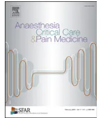

Formalized expert recommendations

## Chest trauma: First 48 hours management

Pierre Bouzata, Mathieu Rauxb, Jean Stéphane Davidc, Karim Tazarourted, Michel Galinskie, Thibault Desmetref, Delphine Garrigueg, Laurent Ducrosh, Pierre Micheleti,\*, Expert's group, Marc Freyszj, Dominique Savaryj, Fatima Rayeh-Pelardyj, Christian Laplacej, Raphaëlle Duponqj, Valérie Monnin Baresj, Xavier Benoît D'Journonj, Guillaume Boddaertj, Mathieu Boutonnetj, Sébastien Pierrej, Marc Léonej, Didier Honnartj, Mathieu Biaisj, Fanny Vardonj

a Grenoble Alpes trauma centre, pôle anesthésie-réanimation, CHU de Grenoble, Inserm U1216, institut des neurosciences de Grenoble, université Grenoble Alpes, 38700 La Tronche, France

b SSPI – accueil des polytraumatisés, hôpital universitaire Pitié-Salpêtrière – Charles-Foix, 75013 Paris, France

c Service d'anesthésie-réanimation, centre hospitalier Lyon Sud, faculté de médecine Lyon Est, université Lyon 1 Claude-Bernard, 69310 Pierre-Bénite, France

d Service des urgences, pôle URMARS, groupement hospitalier Édouard-Herriot, hospices civils de Lyon, université Claude-Bernard Lyon 1, 69003 Lyon, France

e Pôle urgences adultes – Samu, hôpital Pellegrin, CHU de Bordeaux, 33000 Bordeaux, France

f Urgences/Samu CHRU de Besançon, université de Bourgogne Franche Comté, UMR 6249 CNRS/UFC, 25030 Besançon, France

g Pôle de l'urgence, CHU de Lille, 59000 Lille, France

h Service de réanimation polyvalente, pôle anesthésiologie, réanimation, hôpital Sainte-Musse, 83000 Toulon, France

i Services des urgences adultes, hôpital de la Timone, UMR MD2 - Aix Marseille université, 13005 Marseille, France

j France

### ARTICLE INFO

**Article history:**

Available online 16 January 2017

**Keywords:**

Chest Trauma  
Intensive Care  
Severity Criteria  
Ventilation  
Analgesia  
Blunt Chest Trauma  
Penetrating Chest Trauma

### ABSTRACT

Chest trauma remains an issue for health services for both severe and apparently mild trauma management. Severe chest trauma is associated with high mortality and is considered liable for 25% of mortality in multiple traumas. Moreover, mild trauma is also associated with significant morbidity especially in patients with preexisting conditions. Thus, whatever the severity, a fast-acting strategy must be organized. At this time, there are no guidelines available from scientific societies. These expert recommendations aim to establish guidelines for chest trauma management in both prehospital and in hospital settings, for the first 48 hours. The "Société française d'anesthésie réanimation" and the "Société française de médecine d'urgence" worked together on the 7 following questions: (1) criteria defining severity and for appropriate hospital referral; (2) diagnosis strategy in both pre- and in-hospital settings; (3) indications and guidelines for ventilatory support; (4) management of analgesia; (5) indications and guidelines for chest tube placement; (6) surgical and endovascular repair indications in blunt chest trauma; (7) definition, medical and surgical specificity of penetrating chest trauma. For each question, prespecified "crucial" (and sometimes also "important") outcomes were identified by the panel of experts because it mattered for patients. We rated evidence across studies for these specific clinical outcomes. After a systematic GradeRS approach, we defined 60 recommendations. Each recommendation has been evaluated by all the experts according to the DELPHI method.

© 2017 Société française d'anesthésie et de réanimation (Sfar). Published by Elsevier Masson SAS. All rights reserved.

## 1. Introduction

### 1.1. Background

Compared to other traumatic injuries, chest trauma is characterized by life threatening conditions explained initially by the complexity of thoracic lesions and related respiratory failure, secondarily by consequences of hypoxemia and inflammatory reaction on other organ functions. These lesions

\* Corresponding author. Services des urgences adultes, hôpital de la Timone, UMR MD2 - Aix Marseille université, 264, rue Saint Pierre, 13385 Marseille cedex 05, France.

E-mail address: pierre.michelet@ap-hm.fr (P. Michelet).association require rapid and efficient patient management, which associates severity evaluation, treatment of hypoxia, pain and accountable injuries as well as appropriate orientation. An important literature exists on chest trauma, but high quality and prospective randomized clinical trials, meta-analysis are still scarce. However, there is a major need for recommendations on the complex field of chest trauma management to answer physicians expectations.

### 1.2. Rational

Guidelines on chest trauma needs the participation of all specialties involved in its management: emergency physicians both out of hospital and in hospital settings, anesthesiologists, intensivists, radiologists, and surgeons. Therefore, these clinical practice guidelines initiated jointly from the French society of anesthesiology and intensive care (*Société française d'anesthésie et de réanimation* [Sfar]) and the French society of emergency medicine (*Société française de médecine d'urgence* [SFMU]) who associated the French society of thoracic and cardiovascular surgery (*Société française de chirurgie thoracique et cardiovasculaire*) and the French society of radiology (*Société française de radiologie*) to the writing. Chest trauma involves chest wall, lungs, heart, vessels and diaphragm injuries. These guidelines focused on the first 48 hours, involved obvious or potential severe trauma but did not include heart and diaphragm injuries.

### 1.3. Question definition

The panel of experts defined seven questions because of their high clinical relevance in chest trauma management in both out-of-hospital and in-hospital setting. Several sub-questions have been defined due to the extent of issues. Each question has been evaluated by the panel of experts according to the DELPHI method: from 1 (I completely disagree) to 9 (I completely agree); after each round of judgment extreme values were eliminated and median value was calculated. Strong agreement was determined when variations were between three predefined zones [1–3], [4–6] or [7–9], this last interval being the final and weak agreement when intervals exceeded such zone. The process has been stopped after two rounds and achievement of consensus.

## 2. Methodology

### 2.1. The Grade® method

The Grade® method was used to establish these guidelines. Following quantitative analysis of the literature, this method can be used to separately determine the quality of evidence, i.e. estimation of the level of confidence of the analysis of the effect of a quantitative intervention, and the grade of recommendation. Quality of evidence was classified into four categories:

- • high: future research will very probably not change the level of confidence in the estimate of the effect;
- • moderate: future research will probably change the level of confidence in the estimate of the effect and could modify the estimate of the effect itself;
- • low: future research will very probably have an impact on the level of confidence in the estimate of the effect and will probably modify the estimate of the effect itself;
- • very low: the estimate of the effect is very uncertain.

Analysis of the quality of evidence was performed for each study and a global level of evidence was then defined for a particular question and a particular criterion.

The final formulation of the recommendations is always binary, either positive or negative and either strong or weak:

- • strong: the experts recommend to do or not to do (Grade 1+ or 1-);
- • weak: the experts suggest to do or not to do (Grade 2+ or 2-).

The strength of recommendation was determined according to key factors, validated by the experts after a vote, using the Delphi method:

- • estimate of the effect;
- • the global level of evidence: the higher the level of evidence, the more likely the recommendation will be strong;
- • the balance between desirable and adverse effects: the more favorable this balance, the more likely the recommendation will be strong;
- • values and preferences: the recommendation is more likely to be weak in the case of uncertainty or marked variability; these values and preferences must ideally be determined directly with the people concerned (patient, doctor, decision-maker);
- • costs: the higher the costs or the use of resources, the more likely the recommendation will be weak.

### 2.2. Experts' advice

In case no data is found on a particular question or prespecified outcome are not available, recommendations cannot be established. Only experts' advice will be issued.

### 2.3. Bibliography analysis

There is a large but inhomogeneous literature addressing chest trauma. Only a few questions in these guidelines benefit from meta-analysis or controlled randomized trials. However, because of their clinical relevance, lesser quality trials have also been included. Most of these papers have been published in the last 10 years but we did not fix a limit date for these first guidelines in order to include all the potentially relevant publications. Most of these papers regarded chest trauma but some questions (i.e. analgesia in chest trauma) were not addressed specifically. For such questions, we examined specific literature not directly regarding chest trauma but with relevant conclusions for these guidelines. The question 7 focused on specificity of penetrating trauma. The experts have considered penetrating trauma management to be similar to closed trauma in both pre-hospital and in-hospital setting most of the time, however, probably leading more often to surgical procedures.

## 3. Recommendations

### 3.1. Question 1. Criteria for severity assessment and pre-hospital triage

#### 3.1.1. 1.a. What are the potential criteria of gravity for thoracic trauma?

Recommendation 1a: the experts recommend considering the following conditions as severity criteria: age > 65 years old, previous cardiopulmonary diseases, coagulation diseases or acquired coagulation disorders (anticoagulant or antiplatelet treatments), high velocity trauma and penetrating trauma (Grade 1+).Rational: previous status of cardio- or bronchopulmonary diseases (COPD, chronic respiratory failure, heart failure, coronary diseases) and/or an age > 65 years old, increase the mortality risk by 2 or 3 when a thoracic trauma happens ( $RR = 1.98$ ,  $IC_{95}$  [1.86–2.11]) [1]. Penetrating injury increases mortality risk by 2.6 ( $IC_{95}$  [2.42–2.85]) [2].

### 3.1.2. 1.b. What are the gravity criteria in thoracic trauma?

Recommendation 1b: the experts recommend to consider as severity criteria in chest trauma, more than 2 ribs fracture especially for patients more than 65-year-old, respiratory distress with respiratory rate > 25 c/min or hypoxemia (pulse-oximetry < 90% on air or < 95% with oxygen); circulatory failure (systolic arterial pressure [SAP] < 110 mmHg, or more than 30% decrease in SAP) (Grade 1+).

The experts suggest using MGAP score in pre-hospital setting to triage the patient without initial gravity criteria (Grade 2+).

Rational: in the first stage of a chest trauma, initial vital signs can be falsely reassuring. A pulse-oximetry < 90% under high flow oxygen is a dynamic severity criterion; PAS < 110 mmHg or 30% below usual value is associated with circulatory failure and must trigger urgent therapeutic intervention upon hospital admission [4]. Clinical criteria in the MGAP score can improve the triage of low mortality risk patients [5].

### 3.1.3. 1.c. How must patients with severity criteria in pre-hospital setting be managed and orientated?

Recommendation 1c: we recommend transport by mobile medical team for patient with criteria of severe chest trauma. Triage to trauma center level 1 is mandatory (Grade 1+).

The experts suggest that all patients with previous cardio-pulmonary conditions and/or severity criteria would benefit from phone call or telemedicine advice by an expert. These patients must be monitored during 24 hours. We suggest establishing a protocol between regional hospitals and the level 1 trauma center to organize patient management (expert advice).

Rational: direct admission of patients suffering from severe chest trauma in level 1 trauma centers, significantly reduces the mortality ( $OR\ 0.88$ ,  $IC_{95}$  [0.6–0.88]) [6–8]. Conversely, for such patients, previous admission in a level 3 trauma center significantly increases mortality ( $OR\ 2.70$ ,  $IC_{95}$  [1.31–5.6]) [8].

## 3.2. Question 2. Diagnostic strategy at the early phase of severe thoracic trauma

### 3.2.1. 2.a. Diagnostic approach in patients with hemodynamic and/or respiratory instability

Recommendation 2a: beyond the clinical examination, the experts suggest that thoracic ultrasonography may be implemented in the Focused assessment sonography for trauma (FAST) to diagnose pleural effusion, pneumothorax or pericardial effusion. The ultrasonography should be performed by an experienced physician and should not delay the global pre-hospital management of the patient (Grade 2+).

From hospital admission, the experts recommend thoracic ultrasonography combined with FAST and chest X-ray (Grade 1+).

Rational: thoracic ultrasonography was found superior to chest X-ray for the diagnosis of pleural effusion and/or pneumothorax in patients with severe trauma. The sensitivity and the specificity of this technique to diagnose pneumothorax was 78.6% ( $IC_{95}$  [68.1–98.1]) and 98.4% ( $IC_{95}$  [97.3–99.5]) [10], respectively. Nevertheless, chest X-ray remains mandatory as an initial imaging technique in patients with persistent instability [11]. Regarding the pre-hospital setting, evidences for ultrasonography are scarce and mainly rely upon studies dealing with FAST. However, thoracic ultrasonography is feasible in the pre-hospital setting and may be reliable to assess post-trauma pericardial effusion [12].

### 3.2.2. 2.b. Diagnostic approach in stable patients

Recommendation 2b: for patients with a suspicion of severe thoracic trauma, the experts recommend the use of contrast-enhanced thoracic computed tomodensitometry (CT) scan. This strategy integrates into a comprehensive assessment of post-trauma injuries with whole body CT scan after severe trauma (Grade 1+).

The experts suggest using thoracic ultrasonography to diagnose isolated parietal injuries of the chest wall rather than chest X-ray, provided that patients do not have criteria for a suspicion of severe trauma (Grade 2+).

The experts recommend the use of contrast-enhanced thoracic CT scan in case of thoracic injury suspected by the clinical examination, the thoracic ultrasonography, and/or the chest X-ray (Grade 1+).

Rational: contrast-enhanced thoracic CT scan is the gold standard to comprehensively assess post-trauma injuries [13]. In the context of severe trauma, thoracic CT scan is part of the whole body CT scan since whole body imaging was associated with a 25% ( $IC_{95}$  [14–37]) decrease in the observed mortality compared to the predicted one by the trauma and injury severity score (TRISS) and 13% by the revised injury severity classification (RISC) [14].

In stable patients, thoracic ultrasonography can diagnose chest wall's fracture (sternum, ribs) with a higher accuracy than chest X-ray. This technique also allows to diagnose pleural effusion and pneumothorax that could be missed by standard chest X-ray [15,16]. Chest X-ray is futile in non-comatose patients with a normal clinical examination [17,18].

## 3.3. Question 3. What are the indications for mechanical ventilation? How to perform mechanical ventilation?

### 3.3.1. 3.a. Can non-invasive mechanical ventilation (NIV) be performed in patient with torso trauma?

Recommendation 3.a.1: unless contra-indicated, experts recommend performing NIV in hypoxemic in-hospital torso trauma patients, after CT-scan was performed and chest tube inserted when indicated. Pressure support ventilation with positive end expiratory pressure (PEEP) must be used to perform NIV. NIV should be performed in monitored patients (Grade 1+).

Rational: five studies [19–23] and one meta-analysis [24] assessed the beneficial effect of NIV on morbidity and mortality in hypoxemic patients with torso trauma. In those hypoxemic patients (defined as having  $PaO_2/FiO_2 < 200\text{ mmHg}$ ), NIV reduced the need for intubation ( $OR\ 0.32$ ,  $IC_{95}$  [0.12–0.86]). NIV reduced the occurrence of pneumonia ( $OR\ 0.34$ ,  $IC_{95}$  [0.2–0.58]), thus subsequently reduced hospital length of stay by 4 days. NIV reduced mortality ( $OR\ 0.26$ ,  $IC_{95}$  [0.09–0.71]).Recommendation 3.a.2: without clinical or biological improvement within an hour, crush induction, intubation, mechanical ventilation and sedation must be performed (Grade 1+).

Rational: Antonelli et al. [25] reported that  $PaO_2/FiO_2 < 146$  mmHg more than an hour after NIV initiation was independently associated with intubation (OR 2.51,  $IC_{95}$  [1.45–4.35]) in a prospective multicentre study that included 25% of patients suffering trauma. Due to the risk of aspiration, crush induction should be performed.

### 3.3.2. 3.b. How should mechanical ventilation be performed in intubated patients with torso trauma?

Recommendation 3.b.1: experts recommend tidal volume being set between 6 and 8 mL per kg of ideal body weight, due to lung inhomogeneity in torso trauma. Plateau pressure should be maintained below 30 cmH2O (Grade 1+).

Rational: numerous studies reported the benefit of reducing tidal volume upon mortality in patients with acute respiratory distress syndrome (mortality reduced by 20 to 40%) [27–33]. Trauma patients lungs are not healthy lungs, since torso trauma acted as a first hit on the lung. Experts believe mechanical ventilation acts as a second hit. Although those studies included a limited number of trauma patients, experts do consider these conclusions are valid for torso trauma patients.

Recommendation 3.b.2: in hypoxemic patient with torso trauma, PEEP should be set so that to maintain  $FiO_2 < 60\%$  and  $SpO_2 > 92\%$ , pending hemodynamic and ventilatory tolerance. PEEP value should be no less than 5 cmH2O (Grade 2+).

Rational: several randomized controlled trials reported protective ventilation (including PEEP above 5 cmH2O) reduced mortality in patients with acute respiratory distress syndrome [28–33]. Briel et al. reported in a meta-analysis (that included Alveoly [34], Lobs [30] and Express [35]), that increasing PEEP was associated with in-hospital mortality reduction (OR 0.90,  $IC_{95}$  [0.81–1.00]), ICU-related mortality (OR 0.85,  $IC_{95}$  [0.76–0.95]) and increased from 7 to 12 days without mechanical ventilation during the first 4 weeks in hypoxemic patients [36]. High levels of PEEP (defined as above 10 cmH2O) did not affect pneumothorax nor vasopressor use. Of note, these three studies included a limited number of trauma patients (6%). Experts do consider those conclusions remain valid in hypoxemic torso trauma patients.

## 3.4. Question 4. What pain relief management should be used in chest trauma?

### 3.4.1. 4.a. What are the modalities and goals of pain relief in the out-of-hospital setting?

Recommendation 4.a.1: in case of chest trauma, relieving pain is an emergency. The experts suggest systematic evaluation of pain intensity using a numerical rating scale (NRS) as the first line strategy, or otherwise, using a simplified verbal rating scale (VRS). Pain intensity should be measured at rest, but also during cough and deep inspiration (Grade 2+).

Rational: there is no out-of-hospital studies demonstrating the utility of emergency pain relief in chest trauma. However, several studies have demonstrated that adequate pain control has a benefit on ventilation, as well as on the risk of pulmonary complications [37–40]. The risk-benefit ratio is therefore largely in favour of this recommendation. Furthermore, previous expert recommendations for sedation and analgesia in emergency medicine published in 2010 stated that pain control should be achieved as early as possible [41]. The numerical rating scale (NRS) has been validated for use in the emergency department [42]. It is strongly correlated with the results obtained using a visual analogic scale (VAS) and can be used in 96% of patients in this context [43].

Recommendation 4.a.2: in the presence of intense pain, morphine titration is recommended. The objective is pain relief defined by  $NRS \leq 3$  or Verbal rating scale (VRS)  $< 2$ . (Grade 1+).

Rational: it has been demonstrated that morphine is effective for acute pain relief. There is a moderate positive correlation between the dose of morphine required to achieve pain relief, and the initial pain intensity in the immediate post-operative period [44]. Moreover, the dose of morphine required to achieve pain relief varies widely from one patient to another, conforming the necessity of morphine titration [44]. In the emergency department, the analgesic efficacy of adequately performed morphine titration has previously been demonstrated by Lvovschi et al. [45] in 82% of the 621 patients treated for severe pain. The importance of morphine titration protocols has been emphasized in the 2010 expert recommendations for sedation and analgesia in emergency medicine [41].

Recommendation 4.a.3: the experts recommend the use of ketamine for patient mobilization if morphine titration is not sufficient (expert advice).

If painful therapy is mandatory, it should be performed with adequate sedation and analgesia (expert advice).

Rational: in the emergency medicine setting, 3 molecules have been tested, namely midazolam, propofol and ketamine. The utility of ketamine for procedural sedation and analgesia (PSA) has been demonstrated, and it enables adequate sedation with a high rate of patient satisfaction [46,47]. Compared to propofol, ketamine is associated with less apnea or hypoxemia, depending on the studies [48]. Midazolam is associated with apnea or hypoxia and delayed recovery.

### 3.4.2. 4.b. What are the modalities and goals of pain relief in the in-hospital setting?

#### 3.4.2.1. 4.b.1 Evaluation.

Recommendation 4.b.1: the experts suggest pain assessment both at rest and during physical effort i.e. cough and deep inspiration using numerical or verbal scales (NRS or VRS). The experts suggest that the target level should be an NRS score of 3 or less, or a VRS score of 2 or less (Grade 2+).

Rational: self-reporting pain intensity by the patient allows more appropriate and less subjective treatment of the pain than evaluation by health care providers [49]. The NRS is simple andeasy to use, and similar to the VRS [50]. Evaluation should be performed at rest and during an effort that mobilize the thoracic cage (particularly coughing and respiratory physiotherapy).

#### 3.4.2.2. 4.b.2 Locoregional anaesthesia.

Recommendation 4.b.2: the experts recommend locoregional anaesthesia (LRA) for patients with severity criteria or with remaining pain after 12 hours of appropriate treatment (Grade 1+).

The experts recommend epidural analgesia for complex (multilevel) or bilateral injuries. This procedure should be performed by an anaesthesiologist (Grade 1+).

The experts suggest paravertebral block use (compared to epidural analgesia) for unilateral rib fractures. The experts suggest echographic guidance catheter insertion (Grade 2+).

Rational: patients with rib injuries are at risk of developing complications, particularly respiratory complications, through lack of coughing because of the pain. These complications are related to the number of rib fractures. Similarly, elderly subjects are at high risk of developing respiratory complications [51]. The utility of locoregional analgesia has been established for a long time. In 2004, Bulger et al. [37] showed in a prospective, randomized, controlled study that epidural analgesia was superior to intravenous opioids in terms of risk of pneumonia (OR 6 IC95 [1–35],  $P = 0.05$ ). Similarly, Moon et al. [38] showed a 45% increase in tidal volume from day 1 to day 3 after thoracic trauma in the group receiving epidural analgesia, whereas tidal volume increased by 56% over baseline by day 3 in patients receiving systemic opioids. The interest in epidural analgesia in chest trauma care is justified by data from the field of thoracic surgery, in which such treatment has long been established to be superior to systemic analgesia in terms of efficiency, complications (less sedation, nausea and vomiting) and respiratory complications [37,52,53]. A recent meta-analysis reported that paravertebral block was superior to epidural analgesia for adverse effects such as arterial hypotension (OR 0.11, IC95 [0.05–0.25],  $P < 0.001$ ), and presented less failure of the procedure (OR 0.51, IC95 [0.30–0.86],  $P = 0.01$ ) [54]. However, paravertebral block can only be proposed for unilateral and limited rib fractures [55].

#### 3.4.2.3. 4.b.3 Systemic analgesia.

Recommendation 4.b.3: the experts recommend the use of multimodal analgesia (pending there is no contra-indications), favouring morphine patient-controlled analgesia (PCA). This technique can represent an appropriate complement to paravertebral block (Grade 1+).

The experts suggest that PCA should not be used for systemic morphine administration in association with epidural analgesia (Grade 2–).

Rational: systemic analgesia is an important component of pain relief treatment in chest trauma, after considering other extrathoracic injuries. While steps 1 and 2 analgesics of the World health organization can be administered alone or in combination in the framework of multimodal analgesia, morphine remains the opioid of choice for the treatment of severe acute pain. After effective titration, patient-controlled morphine analgesia (PCA) can be considered. This technique is frequently used for postoperative pain control after thoracic surgery [56,57], and can be considered for the management of chest trauma pain. It requires regular monitoring to detect potential side effects

[58]. PCA adequately complements the effects of loco-regional anaesthetic techniques such as paravertebral block. However, it is not recommended in association with epidural analgesia, since opioids are also frequently used in this latter technique.

#### 3.5. Question 5: indications and guidelines for chest tube placement

##### 3.5.1. 5.a What are the indications for emergency decompression pre-hospital and in-hospital?

Recommendation 5.a: the experts recommend emergency decompression in case of acute respiratory or hemodynamic distress with a strong suspicion of tension pneumothorax (Grade 1+).

The experts suggest thoracostomy by the axillary approach in case of cardiac arrest and/or failure of needle aspiration procedure (Grade 2+).

Rational: in case of cardiac arrest secondary to chest trauma, pleural decompression must be performed immediately in the early phase of management, in case of suspected tension pneumothorax. Immediate pleural decompression is also mandatory in case of immediate life threatening conditions (i.e. hemodynamic instability and/or respiratory distress) associated with compressive pneumothorax, haemothorax or haemopneumothorax [59–61]. Apart from these specific situations, and in the absence of a confirmed diagnosis, close monitoring of the patient is required until appropriate imaging exams can be performed to confirm and characterise the pneumothorax (location, size, isolated or not) [62,63].

##### 3.5.2. 5.b When should a chest tube be inserted?

Recommendation 5.b: the experts recommend insertion of a chest tube without delay in case of complete pneumothorax, and in case of any liquid or air effusion that leads to respiratory and/or hemodynamic consequences (Grade 1+).

The experts suggest that a hemothorax estimated more than 500 mL (as assessed by echography and/or and/or X-ray and/or CT scan) should be drained (Grade 2+).

In case of minor pneumothorax, unilateral and without clinical consequences, drainage is not systematic. In these situations, the experts suggest clinical observation, with repeated chest X-ray at 12 hours. If invasive mechanical ventilation is required, the experts suggest that chest drainage should not be systematic. In case of bilateral minor pneumothorax, the experts suggest that chest drainage should not be systematic, but rather discussed on a case-by-case basis depending on the nature of the associated injuries, need for surgical procedure, need for mechanical ventilation (expert advice).

Rational: in the pre-hospital setting, the indications for thoracic decompression (needle aspiration, chest drainage or even thoracostomy) are limited to compressive effusions (pneumothorax and/or hemothorax) with immediate life threatening. In-hospital, the indication for chest tube insertion depends on the respiratory and/or hemodynamic status, the nature of pleural effusion (gas, blood or both) and whether it is uni- or bilateral [62,64–66]. When surgical procedure and/or mechanical ventilation are required, the indication for chest drainage of pneumothorax should be debated on a case-by-case basis. Indeed, there are no definitive conclusions for pleural effusion increased and/or clinical consequences when minor effusion are not drained systematically [67,69].The diagnosis of pleural effusion is usually based on standard chest X-ray. False-negative cases are possible in case of moderate or anterior effusion, a phenomenon generally termed as occult pneumothorax. Several classifications are available to quantify the size of the effusion. The presence of a rim of 2 cm or less at the apex is generally classified as small pneumothorax. Chest ultrasound can confirm the diagnosis but the gold standard technique is thoracic CT scan that allows volume quantification and location of the pneumothorax. In case of small or occult pneumothorax without clinical consequences, clinical observation appears as the best option, in the absence of any formal proof in the literature that chest drain insertion or needle aspiration is beneficial [67–69].

### 3.5.3. 5.c What are the modalities of chest drain insertion?

#### 3.5.3.1. 5.c.1 Location.

Recommendation 5.c.1: the experts suggest chest drainage or decompression to be performed at the 4th or 5th intercostal space on the midaxillary line, rather than by the anterior approach. The experts suggest the use of atraumatic thoracic soft-tipped drains, and suggest avoiding the use of a trocar and/or sharp tip (Grade 2+).

Rational: a prospective study of 122 chest tubes placed in 75 patients, reported drain malposition in 30%. The use of a trocar was found to be a predictive factor of malposition, as compared to digital thoracotomy, although no other type of drain was compared. The chest drains were inserted on the midaxillary line in more than 90% of cases, and this approach was not associated with more malposition [70]. Although the anterior approach (2–3rd intercostal space) for chest drain insertion could be associated with fewer malposition compared with axillary (lateral) approach, most of physician use the latest approach [71,72]. Consequently, in regard to clinical practice and absence of definitive literature conclusion's the axillary (lateral) approach should be proposed.

#### 3.5.3.2. 5.c.2 Type of chest drain.

Recommendation 5.c.2: the experts suggest to use small bore drains (18 to 24 F) to drain isolated pneumothorax. In case of hemothorax, the experts suggest the use of large bore (28 to 36 F) drains. The use of small bore "pigtail" catheters is considered by the experts to be an alternative for the drainage of isolated pneumothorax without associated blood effusion (Grade 2+).

Rational: to drain an isolated pneumothorax, drainage using catheter with the Seldinger technique appears to be sufficient. Indeed, one study compared the efficacy of such catheters (5F) with larger bore chest tubes (14 or 20F) for the drainage of spontaneous or iatrogenic pneumothorax and found similar efficacy [73]. However, the drainage duration ( $3.3 \pm 1.9$  vs  $4.6 \pm 2.6$  days,  $P < 0.01$ ) and hospital length of stay were significantly shorter in patients treated with catheters.

In the presence of hemothorax, use of larger bore drains is necessary to avoid residual hemothorax, which is associated with a higher incidence of early complications, such as empyema, or late complications such as atelectasis and fibrosis [74]. Smaller drains (10 to 14F) have been shown to be as effective as standard, larger bore drains (20 to 28F) for the drainage of spontaneous pneumothorax [75]. Conversely, for traumatic hemothorax,

specifically in the acute phase, existent literature is not sufficient to recommend the use of small drains to ensure a correct and safe drainage [76].

#### 3.5.3.3. 5.c.3 Antibiotic prophylaxis.

Recommendation 5.c.3: the experts do not suggest the use of antibiotic prophylaxis before chest drain insertion in case of blunt chest trauma (Grade 2–).

Rational: a recent meta-analysis of 11 studies found that the administration of antibiotic prophylaxis to patients with thoracic injuries requiring chest drains had a beneficial effect on the risk of infectious complications, particularly empyema. The majority of patients included had a penetrating injury mechanism (69.4%). Subgroup analysis found that in patients with penetrating chest injuries antibiotic prophylaxis reduced the risk of infection after tube thoracostomy (OR 0.28, IC95 [0.14–0.57]), whereas there was no effect of antibiotic prophylaxis in the subgroup with blunt trauma [77]. An older meta-analysis of 5 studies also found a positive effect of antibiotic prophylaxis on the risk of empyema and pneumonia in patients with isolated chest trauma requiring chest drain insertion. However, the studies again included both penetrating and blunt trauma injuries. In addition, the duration of antibiotic therapy exceeded the simple injection of antibiotic prophylaxis, with treatment durations from 24 h to more than 24 h [78].

### 3.6. Question 6. Indications for open surgery and endovascular repair in blunt thoracic trauma

#### 3.6.1. 6.a Endovascular repair in the management of blunt thoracic vascular injuries?

##### 3.6.1.1. 6.a.1 Blunt thoracic artery injury (BTAI).

Recommendation 6.a.1: the experts recommend endovascular treatment of blunt thoracic artery injury (BTAI) as first-line therapy (Grade 1+).

In the absence of complete rupture, the management of other immediately life-threatening injuries should take precedence over endovascular repair. The management and repair of minimal thoracic artery injuries limited to medio-intimal rupture should be determined on a case-by-case basis (experts advice).

Rational: traumatic thoracic artery rupture should be managed through endovascular repair as first-line therapy [79]. Although no randomized controlled trials are available, studies show advantages of endovascular repair over both open repair and non-intervention in terms of mortality (9% versus 19% and 46%) [78]. Moreover, endovascular procedure represents a less invasive procedure that carries significantly lower risks of blood loss, paraplegia, renal failure, systemic and prosthetic infection and a comparable risk of stroke [78]. Aside from grade IV thoracic artery rupture, which requires immediate repair, endovascular repair should be performed within 24 h in the absence of other immediately life-threatening injuries requiring interventions that should take precedence. Minimal thoracic artery injuries limited to medio-intimal rupture (grade I rupture) do not require mandatory intervention as most heal over time and should be managed according to clinical observation and radiologic evolution determined by repeat CT-scan.### 3.6.1.2. 6.a.2 Blunt traumatic axillary and subclavian arterial injury.

Recommendation 6.a.2: the experts suggest endovascular treatment of blunt traumatic axillary and subclavian arterial injury as an alternative to surgical repair (Grade 2+).

Rational: endovascular repair of traumatic rupture of axillary or subclavian arteries remains poorly documented. A comprehensive review of the literature published in 2012 summarizes these cases and reports an overall success rate of 96.9% [81]. Although no randomized trials have compared endovascular and open repair in the management of these arterial injuries, case reports and series suggest that procedure duration is shorter and blood loss is decreased with endovascular repair. No death and only one case of neurological deficit following endovascular repair have been reported. Endovascular repair seems an interesting alternative to open repair in the management of blunt traumatic axillary and subclavian arterial injuries.

### 3.6.2. 6.b Surgical salvage procedures

#### 3.6.2.1. 6.b.1 Resuscitative thoracotomy (emergency department thoracotomy)..

Recommendation 6.b.1: the experts do not recommend resuscitative thoracotomy in the prehospital management of blunt thoracic trauma (Grade 1–).

The experts do not suggest resuscitative thoracotomy (emergency department thoracotomy, emergency bedside thoracotomy) in the trauma center/emergency department management of blunt thoracic trauma in:

- • cardiac arrests with more than 10 minutes of cardiopulmonary resuscitation without return of spontaneous circulation, or;
- • initial asystole in the absence of tamponade (Grade 2–).

Rational: the survival of patients requiring resuscitative thoracotomy (emergency department thoracotomy or EDT) is 8.8% in penetrating thoracic trauma versus only 1.4% in blunt thoracic trauma in a cohort of over 4600 patients [82]. EDT in the management of blunt thoracic trauma was specifically assessed by Morikawa et al. [84]: overall survival was 3% with most survivors in a neurovegetative coma. Literature analysis suggests that EDT appears futile when cardiopulmonary resuscitation (CPR) has been performed for more than 10 minutes without return of spontaneous circulation (ROSC) and/or in the case of initial asystole without tamponade [84–86].

#### 3.6.2.2. 6.b.2 Thoracotomy for control of bleeding.

Recommendation 6.b.2: the experts suggest urgent thoracotomy in an operating room of the trauma center/emergency department to control bleeding (expert advice):

- • in case of hemodynamic instability and active intrathoracic bleeding collected through the chest tube drainage in the absence of other cause(s) of bleeding;
- • in case of hemodynamic instability and:
  - ◦ evacuation of over 1500 mL through the chest tube and more than 200 mL/h blood loss through the chest tube over the first hour, or,

- ◦ more than 200 mL/h blood loss through the chest tube over 3 consecutive hours regardless of the volume initially evacuated.

Rational: thoracotomy for control of bleeding means emergency thoracotomy in the operating room setting for the management of intrathoracic bleeding, and does not mean resuscitative/bedside/emergency department thoracotomy [87]. Thoracotomy for control of bleeding in blunt thoracic trauma should be considered for hemodynamically unstable patients with active/persistent bleeding. Active/persistent intrathoracic bleeding is defined by the quantity and rate of blood loss after chest tube placement. US recommendations advocate the thoracotomy to manage intrathoracic blood loss of over 1500 mL upon tube thoracostomy or more than 200 mL/h blood loss through the chest tube over 3 consecutive hours [88]. Indeed, mortality increases linearly with the amount and rate of blood loss through the chest tube [89]. However, these indications must be adapted to specific injuries and mechanisms, particularly in case of penetrating compared to blunt thoracic trauma [90].

#### 3.6.2.3. 6.b.3 Video-assisted thoracoscopic surgery (VATS).

Recommendation 6.b.3: the experts recommend video-assisted thoracoscopic surgery (VATS) for residual haemothorax despite correct chest tube placement in the pleural space (Grade 1+).

Rational: two small sample-size randomized trials have shown the superiority of VATS as compared to redux tube thoracostomy for residual haemothorax in blunt thoracic trauma [91,92]. Meyer and Cobanoglu both compared VATS to redux tube thoracostomy [93,94]. Patients in the VATS group had a shorter duration of thoracostomy, shorter hospital length-of-stay, and reduced healthcare costs while redux thoracostomy led to a high failure rate with 40% secondary open thoracotomy rate. The advantages of VATS seem related to the time window of the procedure, maximal benefits being within a timeframe of 48 h to 5 days following trauma [92–94].

#### 3.6.2.4. 6.b.4 Surgical rib fracture fixation.

Recommendation 6.b.4: the experts recommend surgical rib fracture fixation for flail chest requiring mechanical ventilation in case of failure of mechanical ventilation weaning within the first 36 h (Grade 1+).

The experts suggest that displaced or complex rib fractures be considered for fixation through expert consult (expert advice).

Rational: three randomized prospective studies and one meta-analysis compared non-interventional and surgical management of flail chest [95–98]. In the study of Tanaka et al. comparing surgical fixation versus mechanical ventilation (MV), all included patients were ventilated for 5 days prior to randomization and presented at least 6 rib fractures. Results were significantly in favor of surgical fixation in terms of ventilator-free days, ICU length-of-stay and ventilator-acquired pneumonia rate. Likewise, rates of return to active employment at 6 months and overall healthcare costs were also in favor of surgical fixation. In the prospective randomized study of Granetzny et al. [96], comparing surgical fixation versus external stabilization, results were significantly infavor of surgical fixation in terms of ventilator-free days, ICU length-of-stay and ventilator-acquired pneumonia rate. Surgical fixation was considered in patients with failed weaning from ventilation within 36 h following admission. Finally, the main results of the meta-analysis of Slobogean et al. [97] and from the study of Marasco et al. [98] are in favor of early surgical rib fixation, particularly on the outcomes of ventilator-free days and the incidence of pneumonia. Aside from mechanically ventilated patients, other indications for surgical rib fixation are: painful or invalidating flail chest, major chest wall deformation, chest wall defects, risk of lung parenchymal injury by a rib fragment, symptomatic costal pseudarthrosis, open rib fractures, and peroperative fractures.

### 3.7. Question 7: medical and surgical specificities of a penetrating chest trauma

#### 3.7.1. 7.a. What are the criteria for patient triage directly to a specialised facility?

Recommendation 7.a: the experts suggest triage to a specialised facility for all patients presenting with a penetrating injury to the chest, or the cardiac box, with haemodynamic instability or after stabilisation (Grade 1+).

The experts suggest triage to the closest surgical facility for all patients who cannot tolerate transport to the specialized facility because of haemodynamic instability. For patients in a stable condition, the experts suggest transfer to a specialised facility if severe chest injury is observed on the CT scan (Grade 2+).

Rational: it is actually commonly admitted that the triage of trauma patients to a trauma centre is associated with an improved outcome, especially for patients with shock and/or coma [99–101]. There are many reports focussing on penetrating chest trauma but the vast majority of them are retrospective and from the same hospital. For example, it has been shown in a cohort of 908 patients that pre-hospital time was inversely associated with survival [103]. In a recent and another retrospective study, Mollberg et al. [102] investigated whether a thoracic surgeon may improve the outcome of patients presenting with a penetrating chest injury. The study cohort included 1569 such patients admitted from 2003 to 2011, among whom 413 required a surgical procedure. The 222 patients who survived surgery had 18% mortality at hospital discharge. Multivariate analysis showed that the involvement of a thoracic surgeon during surgery was independently associated with a survival improvement (OR 4.70, IC95 [1.29–17.13]).

#### 3.7.2. 7.b. When to perform a thoracotomy at hospital admission?

Recommendation 7.b: the experts suggest performing resuscitative thoracotomy in case of major circulatory distress and cardiac arrest, after a compressive pneumothorax has been eliminated, and if resuscitation manoeuvres have failed (Grade 2+). Resuscitative thoracotomy is probably not useful in case of cardiac arrest with cardiopulmonary resuscitation lasting more than 15 min without signs of life but also in case of asystole without tamponade (Grade 2–).

Rational: a resuscitative thoracotomy is typically performed in order to resuscitate a person who has been severely injured. During the procedure, it is possible to remove a tamponade, repair a cardiac or vascular wound, perform a pulmonary hilar

cross-clamping in case of bronchovenous air embolism, and start a bimanual internal massage of the heart. The outcome will depend on the anatomical localisation of the injury, the associated injuries, the nature of the weapon used (stab vs. firearm) and the presence of a sign of life such as electrical activity, spontaneous ventilation, or pupil reactivity. However, there is no randomized study demonstrating the usefulness of the resuscitative thoracotomy but 2 meta-analyses of observational data have been published [82,104]. In the first one, 4620 resuscitative thoracotomies were included from 24 cohorts published between 1974 and 1998 [82]. Overall survival was better if signs of life were observed at admission (11.5% IC95 [9.6–13.4]) vs. 2.6% (IC95 [1.4–3.8]) and after a penetrating trauma (8.8% IC95 [7.8–9.8]) than after a blunt trauma (1.4% IC95 [0.7–2.1]). Following a penetrating trauma, survival was better after a stab wound than after a gunshot wound (16.8% IC95 [14.4–19.1] vs. 4.3% IC95 [3.3–5.5]); among chest injuries, survival was better in cases of predominantly cardiac than thoracic wounds (19.4 IC95 [17.0–21.8] vs. 10.7% IC95 [9.1–12.3]) [82]. The second meta-analysis, that included 4482 resuscitative thoracotomies, confirmed the aforementioned results after a penetrating trauma; overall survival rate was 11.2% IC95 [10.3–12.1]) and when the cardiac area was injured survival was 31.1% IC95 [28.4–33.8] [104]. Recently, in 2 small prospective studies, that included respectively 56 and 62 patients, the authors tried to better define the indications and limits of the resuscitative thoracotomy [85,86]. In these studies, in case of penetrating trauma, resuscitative thoracotomy was considered futile if pre-hospital cardiopulmonary resuscitation lasted more than 15 minutes without signs of life but also in case of asystole without tamponade because, as in such situations no patient survived.

#### 3.7.3. 7.c. How to explore an injury to the cardiac area?

Recommendation: the experts suggest performing a left anterolateral thoracotomy, a sternotomy, or a clamshell thoracotomy in urgent situations particularly when a haemodynamic instability and/or tamponade are observed (Grade 2+).

The experts suggest monitoring haemodynamically-stable patients without pericardial or pleural effusion, after a CT scan has been done (Grade 2+).

Rational: the cardiac box is restricted by the nipple lines laterally, sternal notch superiorly and xiphoid process inferiorly. Many articles have been published on the management of cardiac box injury. However, the vast majority of them are retrospective and/or originated from one single centre. To our knowledge, no randomized study has been published. The diagnosis of pericardial effusion may be performed by ultrasound examination (FAST). For example, in a cohort of 261 patients, for the diagnosis of pericardial effusion, Rozycki et al. reported sensitivity of 100% IC95 [88.1–100], specificity of 97% IC95 [93.9–98.8], positive predictive value of 81% IC95 [64–92%] and negative predictive value of 100% IC95 [98–100%] [105]. However, it may be difficult to differentiate between a pericardial effusion and a left pleural effusion, such as described in 2 studies reported by Ball et al. [106] and by Meyer et al. [107]. In a retrospective study involving 228 patients with a cardiac wound, Ball et al. [106] described 5 cases of false negative, all associated with a left pleural effusion. Similarly, in a prospective study including 105 patients, Meyer et al. reported 4 cases of false negative, all presenting with a left pleural effusion. In this study, sensitivity was decreased and reported to be only 56% IC95 [21.2–86.3] [107]. This phenomenon may be in relation to the pleural effusion itself that limits the possibility of visualizing the pericardial content, but also in case of a large gap to the pericardium with the haemopericardium thatshed to the pleura. The authors nevertheless conclude that in the absence of pleural effusion, FAST examination remains very accurate to make the diagnosis of pericardial effusion. When diagnosis is established, reported data strongly support urgent surgery in case of pericardial effusion but without recommendations concerning the surgical approach (pericardial window versus thoracotomy or sternotomy).

#### 3.7.4. 7.d. Antibiotic prophylaxis after chest penetrating injury

Recommendation 7.d: the experts suggest administration of antibiotic prophylaxis to patients with penetrating chest injury (Grade 2+). For example, amoxicillin and clavulanic acid combination, or clindamycine and aminoside combination in case of allergy to penicillin, for 24–48 hours.

Rational: see section 5.C.3.

#### Disclosure of interest

The authors declare that they have no competing interest.

#### References

1. [1] Battle CE, Hutchings H, Evans PA. Risk factors that predict mortality in patients with blunt chest wall trauma: a systematic review and meta-analysis. *Injury* 2012;43:8–17.
2. [2] Ottochian M, Salim A, DuBose J, Teixeira PG, Chan LS, Margulies DR. Does age matter? The relationship between age and mortality in penetrating trauma. *Injury* 2009;40:354–7.
3. [3] Hasler RM, Nüesch E, Jüni P, Bouamra O, Exadaktylos AK, Lecky F. Systolic blood pressure below 110 mmHg is associated with increased mortality in penetrating major trauma patients: multicentre cohort study. *Resuscitation* 2012;83:476–81.
4. [4] Raux M, Sartorius D, Le Manach Y, David JS, Riou B, Vivien B. What do prehospital trauma scores predict besides mortality? *J Trauma* 2011;71:754–9.
5. [5] Sartorius D, Le Manach Y, David JS, Rancurel E, Smail N, Thicoïpé M, et al. Mechanism, glasgow coma scale, age, and arterial pressure (MGAP): a new simple prehospital triage score to predict mortality in trauma patients. *Crit Care Med* 2010;38:831–7.
6. [6] MacKenzie EJ, Rivara FD, Jurkovich GJ, Nathens AB, Frey KP, Egleston BL, et al. A national evaluation on the effect on trauma-center care mortality. *N Engl J Med* 2006;354:366–78.
7. [7] Yeguiayan JM, Garrigue D, Binquet C, Jacquot C, Duranteau J, Martin C, et al. Medical pre-hospital management reduces mortality in severe blunt trauma: a prospective epidemiological study. *Crit Care* 2011;15:R34.
8. [8] Garwe T, Cowan LD, Neas BR, Sacra JC, Albrecht RM. Directness of transport of major trauma patients to a level I trauma center: a propensity-adjusted survival analysis of the impact on short-term mortality. *J Trauma* 2011;70:1118–27.
9. [9] Hyacinthe AC, Broux C, Francony G, Genty C, Bouzat P, Jacquot C, et al. Diagnostic accuracy of ultrasonography in the acute assessment of common thoracic lesions after trauma. *Chest* 2012;141:1177–83.
10. [10] Alrajab S, Youssef AM, Akkus NI, Caldito G. Pleural ultrasonography versus chest radiography for the diagnosis of pneumothorax: review of the literature and meta-analysis. *Crit Care* 2013;17:R208.
11. [11] Peytel E, Menegaux F, Cluzel P, Langeron O, Coriat P, Riou B. Initial imaging of severe blunt trauma. *Intensive Care Med* 2001;27:1756–61.
12. [12] Jørgensen H, Jensen CH, Dirks J. Does prehospital ultrasound improve treatment of the trauma patient? A systematic review. *Eur J Emerg Med* 2010;17:249–53.
13. [13] Scaglione M, Pinto A, Pedrosa I, Sparano A, Romano L. Multi-detector row computed tomography and blunt chest trauma. *Eur J Radiol* 2008;65:377–88.
14. [14] Huber-Wagner S, Lefering R, Qwick LM, Körner M, Kay MV, Pfeifer KJ, et al. Effect of whole-body CT during trauma resuscitation on survival: a retrospective, multicentre study. *Lancet* 2009;373:1455–61.
15. [15] Brooks A, Davies B, Smethurst M, Connolly J. Emergency ultrasound in the acute assessment of haemothorax. *Emerg Med J* 2004;21:44–6.
16. [16] Ma OJ, Mateer JR. Trauma ultrasound examination versus chest radiography in the detection of hemothorax. *Ann Emerg Med* 1997;29:312–5.
17. [17] Bokhari F, Brakenridge S, Nagy K, Roberts R, Smith R, Joseph K, et al. Prospective evaluation of the sensitivity of physical examination in chest trauma. *J Trauma* 2003;54:1255–6.
18. [18] Rainer TH, Griffith JF, Lam E, Lam PK, Metreweli C. Comparison of thoracic ultrasound, clinical acumen, and radiography in patients with minor chest injury. *J Trauma* 2004;56:1211–3.

1. [19] Antonelli M, Conti G, Rocco M, Bufi M, De Blasi RA, Vivino G, et al. A comparison of noninvasive positive-pressure ventilation and conventional mechanical ventilation in patients with acute respiratory failure. *N Engl J Med* 1998;339:429–35.
2. [20] Bolliger CT, Van Eeden SF. Treatment of multiple rib fractures. Randomized controlled trial comparing ventilatory with nonventilatory management. *Chest* 1990;97:943–8.
3. [21] Gunduz M. A comparative study of continuous positive airway pressure (CPAP) and intermittent positive pressure ventilation (IPPV) in patients with flap chest. *Emerg Med J* 2005;22:325–9.
4. [22] Hernandez G, Fernandez R, Lopez-Reina P, Cuena R, Pedrosa A, Ortiz R, et al. Non-invasive ventilation reduces intubation in chest trauma-related hypoxemia: a randomized clinical trial. *Chest* 2010;137:74–80.
5. [23] Ferrer M. Noninvasive ventilation in severe hypoxemic respiratory failure: a randomized clinical trial. *Am J Respir Crit Care Med* 2003;168:1438–44.
6. [24] Duggal A, Perez P, Golan E, Tremblay L, Sinuff J. The safety and efficacy of noninvasive ventilation in patients with blunt chest trauma: a systematic review. *Crit Care* 2013;17:R142.
7. [25] Antonelli M, Conti G, Moro ML, Esquinas A, Gonzalez-Diaz G, Confalonieri M, et al. Predictors of failure of noninvasive positive pressure ventilation in patients with acute hypoxemic respiratory failure: a multi-center study. *Intensive Care Med* 2001;27:1718–28.
8. [27] Schultz MJ, Haitisma JJ, Slutsky AS, Gajic O. What tidal volumes should be used in patients without acute lung injury? *Anesthesiology* 2007;106:1226–31.
9. [28] Villar J, Kacmarek RM, Pérez-Méndez L, Aguirre-Jaime A. A high positive end-expiratory pressure, low tidal volume ventilatory strategy improves outcome in persistent acute respiratory distress syndrome: a randomized, controlled trial. *Crit Care Med* 2006;34:1311–8.
10. [29] The ARDS network. Ventilation with lower tidal volumes as compared with traditional tidal volumes for acute lung injury and the acute respiratory distress syndrome. The acute respiratory distress syndrome network. *New Engl J Med* 2000;342(18):1301–8.
11. [30] Amato MB, Barbas CS, Medeiros DM, Magaldi RB, Schettino GP, Lorenzi-Filho G, et al. Effect of a protective-ventilation strategy on mortality in the acute respiratory distress syndrome. *N Engl J Med* 1998;338:347–54.
12. [31] Meade MO, Cook DJ, Guyatt GH, Slutsky AS, Arabi YM, Cooper DJ, et al. Ventilation strategy using low tidal volumes, recruitment maneuvers, and high positive end-expiratory pressure for acute lung injury and acute respiratory distress syndrome: a randomized controlled trial. *JAMA* 2008;299:637–45.
13. [32] Stewart TE, Meade MO, Cook DJ, Granton JT, Hodder RV, Lapinsky SE, et al. Evaluation of a ventilation strategy to prevent barotrauma in patients at high risk for acute respiratory distress syndrome. *N Engl J Med* 1998;338:355–61.
14. [33] Brochard L, Roudot-Thoraval F, Roupie E, Delclaux C, Chastre J, Fernandez-Mondéjar E, et al. Tidal volume reduction for prevention of ventilator-induced lung injury in acute respiratory distress syndrome. *Am J Respir Crit Care Med* 1998;158:1831–8.
15. [34] Brower RG, Lanken PN, MacIntyre N, Matthay MA, Morris A, Ancukiewicz M, et al. Higher versus lower positive end-expiratory pressures in patients with the acute respiratory distress syndrome. *N Engl J Med* 2004;351:327–36.
16. [35] Mercat A, Richard J-CM, Vielle B, Jaber S, Osman D, Diehl JL, et al. Positive end-expiratory pressure setting in adults with acute lung injury and acute respiratory distress syndrome: a randomized controlled trial. *JAMA* 2008;299:646–55.
17. [36] Briel M, Meade M, Mercat A, Brower RG, Talmor D, Walter SD, et al. Higher vs lower positive end-expiratory pressure in patients with acute lung injury and acute respiratory distress syndrome: systematic review and meta-analysis. *JAMA* 2010;303:865–73.
18. [37] Bulger EM, Edwards T, Klotz P, Jurkovich GJ. Epidural analgesia improves outcome after multiple rib fractures. *Surgery* 2004;136:426–30.
19. [38] Moon MR, Luchette FA, Gibson SW, Crews J, Sudarshan G, Hurst JM, et al. Prospective randomised comparison of epidural versus parenteral opioid analgesia in thoracic trauma. *Ann Surg* 1999;229:684–91.
20. [39] Mackersie RC, Karagianes TG, Hoyt DB, Davis JW. Prospective evaluation of epidural and intravenous administration of fentanyl for pain control and restoration of ventilatory function following multiple rib fractures. *J Trauma* 1991;31:443–9.
21. [40] Ullman DA, Fortune JB, Greenhouse BB, Wimpy RE, Kenedy TM. The treatment of patients with multiple rib fractures using continuous thoracic epidural narcotic infusion. *Reg Anesth* 1989;14:43–7.
22. [41] Vivien B, Adnet F, Bounes V, Cheron G, Combes X, David JS, et al. Recommandations formalisées d'experts 2010 : sédation et analgésie en structure d'urgence (réactualisation de la conférence d'experts de la SFAR de 1999). *Ann Fr Med Urg* 2011;1:57–71.
23. [42] Berthier F, Potel G, Leconte P, Touze MD, Baron D. Comparative study of methods of measuring acute pain intensity in an ED. *Am J Emerg Med* 1998;16:132–6.
24. [43] Bijur PE, Latimer CT, Gallagher EJ. Validation of a verbally administered numerical rating scale of acute pain for use in the emergency department. *Acad Emerg Med* 2003;10:390–2.
25. [44] Aubrun F, Langeron O, Quesnel C, Coriat P, Riou B. Relationships between measurement of pain using visual analog score and morphine requirements during postoperative intravenous titration. *Anesthesiology* 2003;98:1415–21.
26. [45] Lvovshi V, Aubrun F, Bonnet P, Bouchara A, Bendahou M, Humbert B, et al. Intravenous morphine titration to treat severe pain in ED. *Am J Emerg Med* 2008;26:676–82.[46] Sih K, Campbell SG, Magee K, Zed PJ. Ketamine in adult emergency medicine: controversies and recent advances. *Ann Pharmacother* 2011;45:1525–34.

[47] Vardy JM, Dignon N, Mukherjee N, Sami DM, Balachandran G, Taylor S. Audit of the safety and effectiveness of ketamine for procedural sedation in the emergency department. *Emerg Med J* 2008;25:579–82.

[48] Miner JR, Gray RO, Bahr J, Patel R, McGill JW. Randomized clinical trial of propofol versus ketamine for procedural sedation in the emergency department. *Acad Emerg Med* 2010;17:604–11.

[49] Benhamou D. Évaluation de la douleur postopératoire. *Ann Fr Anesth Reanim* 1998;17:555–72.

[50] Gagliese L, Weizblit N, Ellis W, Chan VW. The measurement of postoperative pain: a comparison of intensity scales in younger and older surgical patients. *Pain* 2005;117:412–20.

[51] Kieninger AN, Bair HA, Bendick PJ, Howells GA. Epidural versus intravenous pain control in elderly patients with rib fractures. *Am J Surg* 2005;89:327–30.

[52] Joshi GP, Bonnet F, Shah R, Wilkinson RC, Camu F, Fischer B, et al. A systematic review of randomized trials evaluating regional techniques for post thoracotomy analgesia. *Anesth Analg* 2008;107:1026–40.

[53] Behera BK, Puri GD, Ghai B. Patient-controlled epidural analgesia with fentanyl and bupivacaine provides better analgesia than intravenous morphine patient-controlled analgesia for early thoracotomy pain. *J Postgrad Med* 2008;54:86–90.

[54] Ding X, Jin S, Niu X, Ren H, Fu S, Li Q. A comparison of the analgesia efficacy and side effects of paravertebral compared with epidural blockade for thoracotomy: an updated meta-analysis. *Plos One* 2014;9(5.).

[55] Karmakar MK. Thoracic paravertebral block. *Anesthesiology* 2001;95:771–80.

[56] Kavanagh BP, Katz J, Sandler AN. Pain control after thoracic surgery. A review of current techniques. *Anesthesiology* 1994;81:737–59.

[57] Mazerolles M, Leballé F, Duterque D, Rougé P. Anesthésie et réanimation en chirurgie thoracopulmonaire. In: conférences d'actualisation. Congrès annuel de la SFAR 2003. Éditions scientifiques et médicales, Elsevier SAS et Sfar. p. 29–36, 271–90.

[58] Hoydt DB, Simons RK, Winchell RJ, Cushman J, Hollingsworth-Fridlung P, Holbrook T, et al. A risk analysis of pulmonary complications following major trauma. *J Trauma* 1993;35:524–31.

[59] Barton ED, Epperson M, Hoyt DB, Fortlage D, Rosen P. Prehospital needle aspiration and tube thoracostomy in trauma victims: a 6-year experience with aeromedical crews. *J Emerg Med* 1995;13:155–63.

[60] Aylwin CJ, Brohi K, Davies GD, Walsh MS. Pre-hospital and in-hospital thoracostomy: indications and complications. *Ann R Coll Surg Engl* 2008;90:54–7.

[61] Massarutti D, Trillò G, Berlot G, Tomasini A, Bacer B, D'Orlando L, et al. Simple thoracostomy in prehospital trauma management is safe and effective: a 2-year experience by helicopter emergency medical crews. *Eur J Emerg Med* 2006;13:276–80.

[62] Coats TJ, Wilson AW, Xeropotamous N. Pre-hospital management of patients with severe thoracic injury. *Injury* 1995;26:581–5.

[63] Cullinane DC, Morris Jr JA, Bass JG, Rutherford EJ. Needle thoracostomy may not be indicated in the trauma patient. *Injury* 2001;32:749–52.

[64] Parlak M, Uil SM, van den Berg JW. A prospective, randomised trial of pneumothorax therapy: manual aspiration versus conventional chest tube drainage. *Respir Med* 2012;106:1600–5.

[65] Fitzgerald M, Mackenzie CF, Marasco S, Hoyle R, Kossmann T. Pleural decompression and drainage during trauma reception and resuscitation. *Injury* 2008;39:9–20.

[66] Waydhas C, Sauerland S. Pre-hospital pleural decompression and chest tube placement after blunt trauma: a systematic review. *Resuscitation* 2007;72:11–25.

[67] Enderson BL, Abdalla R, Frame SB, Casey MT, Gould H, Maull KI. Tube thoracostomy for occult pneumothorax: a prospective randomized study of its use. *J Trauma* 1993;35:726–9.

[68] Brasel KJ, Stafford RE, Weigelt JA, Tenquist JE, Borgstrom DC. Treatment of occult pneumothoraces from blunt trauma. *J Trauma* 1999;46:987–90.

[69] Ouellet JF, Trottier V, Kmet L, Rizoli S, Laupland K, Ball CG, et al. The OPTICC trial: a multi-institutional study of occult pneumothoraces in critical care. *Am J Surg* 2009;197:581–6.

[70] Remerand F, Luce V, Badachi Y, Lu Q, Bouhemad B, Rouby JJ. Incidence of chest tube malposition in the critically ill: a prospective computed tomography study. *Anesthesiology* 2007;106:1112–9.

[71] Huber-Wagner S, Körner M, Ehrt A, Kay MV, Pfeifer KJ, Mutschler W, et al. Emergency chest tube placement in trauma care—which approach is preferable? *Resuscitation* 2007;72:226–33.

[72] Remerand F, Bazin Y, Gage J, Laffon M, Fuscicardi J. A survey of percutaneous chest drainage practice in French university surgical ICU's. *Ann Fr Anesth Reanim* 2014;33:67–72.

[73] Contou D, Razazi K, Katsahian S, Maitre B, Mekontso-Dessap A, Brun-Buisson C, et al. Small-bore catheter versus chest tube drainage for pneumothorax. *Am J Emerg Med* 2012;30:1407–13.

[74] Karmy-Jones R, Holevar M, Sullivan RJ, Fleisig A, Jurkovich GJ. Residual hemothorax after chest tube placement correlates with increased risk of empyema following traumatic injury. *Can Respir J* 2008;15:255–8.

[75] Tsai WK, Chen W, Lee JC, Cheng WE, Chen CH, Hsu WH, et al. Pigtail catheters vs large-bore chest tubes for management of secondary spontaneous pneumothoraces in adults. *Am J Emerg Med* 2006;24:795–800.

[76] Kulvatunyou N, Joseph B, Friese RS, Green D, Gries L, O'Keefe T, et al. Fourteen French pigtail catheters placed by surgeons to drain blood on trauma patients: is 14-Fr too small? *J Trauma Acute Care Surg* 2012;73:1423–7.

[77] Bosman A, de Jong MB, Debeij J, van den Broek PJ, Schipper IB. Systematic review and meta-analysis of antibiotic prophylaxis to prevent infections from chest drains in blunt and penetrating thoracic injuries. *Br J Surg* 2012;99:506–13.

[78] Sanabria A, Valdovieso E, Gomez G, Echeverry G. World Prophylactic antibiotics in chest trauma: a meta-analysis of high-quality studies. *J Surg* 2006;30:1843–7.

[79] Lee WA, et al. Endovascular repair of traumatic thoracic aortic injury: clinical practice guidelines of the society for vascular surgery. *J Vasc Surg* 2011;53:187–92.

[80] DuBose JJ, Rajani R, Gilani R, Arthurs ZA, Morrison JJ, Clouse WD, et al. Endovascular management of axillo-subclavian arterial injury: a review of published experience. *Injury* 2012;43:1785–92.

[81] Rhee PM, Acosta J, Bridgeman A, Wang D, Jordan M, Rich N. Survival after emergency department thoracotomy: review of published data from the past 25 years. *J Am Coll Surg* 2000;190:288–98.

[82] Seamon MJ, Chovanes J, Fox N, Green R, Manis G, Tsiotsias G, et al. The use of emergency department thoracotomy for traumatic cardiopulmonary arrest. *Injury* 2012;43:1355–61.

[83] Moore EE, Knudson MM, Burlew CC, Inaba K, Dicker RA, Biffl WL, et al. Defining the limits of resuscitative emergency department thoracotomy: a contemporary Western trauma association perspective. *J Trauma* 2011;70:334–9.

[84] Powell DW, Moore EE, Cothren CC, Ciesla DJ, Burch JM, Moore JB, et al. Is emergency department resuscitative thoracotomy futile care for the critically injured patient requiring prehospital cardiopulmonary resuscitation? *J Am Coll Surg* 2004;199:211–5.

[85] Arigon JP, Boddart G, Grand B, N'Gabou UD, Pons F. Traitement chirurgical des traumastimes thoraciques. In: *EMC Pneumologie*. Paris: Elsevier Masson SAS; 2011 [6-000-p60].

[86] American college of surgeons-subcommittee on trauma. Advanced trauma life support program for doctors, 7th ed., Chicago, IL: American College of Surgeons; 2004.

[87] Hoth JJ, Scott MJ, Bullock TK, Stassen NA, Franklin GA, Richardson JD. Thoracostomy for blunt trauma: traditional indications may not apply. *Am J Surg* 2003;69:1108–11.

[88] Karmy-Jones R, Jurkovich GJ, Nathens AB, Shatz DV, Brundage S, Wall Jr MJ, et al. Timing of urgent thoracostomy for hemorrhage after trauma: a multi-center study. *Arch Surg* 2001;136:513–8.

[89] Meyer DM, Jessen ME, Wait MA, Estrera AS. Early evacuation of traumatic retained hemothoraces using thoracoscopy: a prospective, randomized trial. *Ann Thorac Surg* 1997;64:1396–400.

[90] Cobanoğlu U, Sayır F, Morgan D. Should videothoracoscopic surgery be the first choice in isolated traumatic hemothorax? A prospective randomized controlled study. *Ulus Travma Acil Cerrahi Derg* 2011;17:117–22.

[91] Smith JW, Franklin GA, Harbrecht BG, Richardson JD. Early VATS for blunt chest trauma: a management technique underutilized by acute care surgeons. *J Trauma* 2011;71:102–5.

[92] Fabbrucci P, Nocentini L, Secci S, Manzoli D, Bruscino A, Fedi M, et al. Video-assisted thoracoscopy in the early diagnosis and management of post-traumatic pneumothorax and hemothorax. *Surg Endosc* 2008;22:1227–31.

[93] Tanaka H, Yukioka T, Yamaguti Y, Shimizu S, Goto H, Matsuda H, et al. Surgical stabilization of internal pneumatic stabilization? A prospective randomized study of management of severe flail chest patients. *J Trauma* 2002;52:727–32.

[94] Granetzny A, Abd El-Aal M, Emam E, Shalaby A, Boseila A. Surgical versus conservative treatment of flail chest. Evaluation of the pulmonary status. *Interact Cardiovasc Thorac Surg* 2005;4:583–7.

[95] Slobogean GP, MacPherson CA, Sun T, Pelletier ME, Hameed SM. Surgical fixation vs nonoperative management of flail chest: a meta-analysis. *J Am Coll Surg* 2013;216(2). 302–11.e1.

[96] Marasco SF, Davies AR, Cooper J, Varma D, Bennett V, Nevill R, et al. Prospective randomized controlled trial of operative rib fixation in traumatic flail chest. *J Am Coll Surg* 2013;216:924–32.

[97] Nathens AB, Jurkovich GJ, Maier RV, Grossman DC, MacEnzie EJ, Moore M, et al. Relationship between trauma center volume and outcomes. *JAMA* 2001;285:1164–71.

[98] MacKenzie EJ, Rivara FP, Jurkovich GJ, Nathens AB, Frey KP, Eggleston BL, et al. A national evaluation of the effect of trauma-center care on mortality. *N Engl J Med* 2006;354:366–78.

[99] Demetriades D, Martin M, Salim A, Rhee P, Brown C, Doucet J, et al. Relationship between American college of surgeons trauma center designation and mortality in patients with severe trauma. *J Am Coll Surg* 2006;202:212–5.

[100] Mollberg NM, Tabachnik D, Farjah F, Lin FJ, Vafa A, Abdelhady K, et al. Utilization of cardiothoracic surgeons for operative penetrating thoracic trauma and its impact on clinical outcomes. *Ann Thorac Surg* 2013;96:445–50.

[101] Swaroop M, Straus DC, Agubuzu O, Esposito TJ, Schermer CR, Crandall ML. Pre-hospital transport times and survival for hypotensive patients with penetrating thoracic trauma. *J Emerg Trauma Shock* 2013;6(1):16–20.- [104] Working group, Ad Hoc subcommittee on outcomes, American college of surgeons – committee on trauma. Practice management guidelines for emergency department thoracotomy. *J Am Coll Surg* 2001;193:303–9.
- [105] Rozycki GS, Feliciano DV, Ochsner MG, Knudson MM, Hoyt DB, Davis F, et al. The role of ultrasound with possible penetrating cardiac wounds: a prospective multicenter study. *J Trauma* 1999;46:543–51.
- [106] Ball CG, Williams BH, Wyrzykowski AD, Nicholas JM, Rozycki GS, Feliciano DV. A caveat to the performance of pericardial ultrasound in patients with penetrating cardiac wounds. *J Trauma* 2009;67:1123–4.
- [107] Meyer DM, Jessen ME, Grayburn PA. Use of echocardiography to detect occult cardiac injury after penetrating trauma: a prospective study. *J Trauma* 1995;39:902–7.