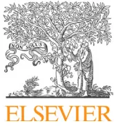

GuidelinesGuidelines for management of intra-abdominal infections

Philippe Montraversa,\*, Hervé Dupontb, Marc Leonec, Jean-Michel Constantind, Paul-Michel Mertese, and the Société française d'anesthésie et de réanimation (Sfar), Société de réanimation de langue française (SRLF), Pierre-Francois Laterref, Benoit Missetg, Société de pathologie infectieuse de langue française (SPILF), Jean-Pierre Bruh, Rémy Gauziti, Albert Sottoj, Association française de chirurgie (AFC), Cecile Brigandk, Antoine Hamyl, Société française de chirurgie digestive (SFCD), Jean-Jacques Tuechm

a Département d'anesthésie-réanimation, CHU Bichat-Claude-Bernard, AP-HP, université Paris VII Sorbonne Cité, 46, rue Henri-Huchard, 75018 Paris, France

b Pôle anesthésie-réanimation, CHU d'Amiens, 80054 Amiens, France

c Département d'anesthésie-réanimation, CHU Nord, 13915 Marseille, France

d Service d'anesthésie-réanimation, CHU Estaing, 63003 Clermont-Ferrand, France

e Service d'anesthésie-réanimation, CHU de Strasbourg, Nouvel Hopital Civil, BP 426, 67091 Strasbourg, France

f Service de soins intensifs, cliniques universitaires Saint-Luc, Bruxelles, Belgium

g Réanimation polyvalente, hôpital Saint-Joseph, 75014 Paris, France

h Service des maladies infectieuses, centre hospitalier de la région d'Annecy, 74374 Pringy, France

i Réanimation thoracique Ollier, CHU Cochin, 27, rue du Faubourg-Saint-Jacques, 75014 Paris, France

j Service des maladies infectieuses et tropicales, CHRU de Nîmes, Nîmes, France

k Service de chirurgie générale et digestive, hôpital Hautepierre, CHU de Strasbourg, Strasbourg, France

l Service de chirurgie viscérale, CHU d'Angers, Angers, France

m Service de chirurgie générale et digestive, CHU Charles-Nicolle, Rouen, France

ARTICLE INFOArticle history:

Available online 24 April 2015

ABSTRACT

Intra-abdominal infections are one of the most common gastrointestinal emergencies and a leading cause of septic shock. A consensus conference on the management of community-acquired peritonitis was published in 2000. A new consensus as well as new guidelines for less common situations such as peritonitis in paediatrics and healthcare-associated infections had become necessary. The objectives of these Clinical Practice Guidelines (CPGs) were therefore to define the medical and surgical management of community-acquired intra-abdominal infections, define the specificities of intra-abdominal infections in children and describe the management of healthcare-associated infections. The literature review was divided into six main themes: diagnostic approach, infection source control, microbiological data, paediatric specificities, medical treatment of peritonitis, and management of complications. The GRADE® methodology was applied to determine the level of evidence and the strength of recommendations. After summarising the work of the experts and application of the GRADE® method, 62 recommendations were formally defined by the organisation committee. Recommendations were then submitted to and amended by a review committee. After 2 rounds of Delphi scoring and various amendments, a strong agreement was obtained for 44 (100%) recommendations. The CPGs for peritonitis are therefore based on a consensus between the various disciplines involved in the management of these patients concerning a number of themes such as: diagnostic strategy and the place of imaging; time to management; the place of microbiological specimens; targets of empirical anti-infective therapy; duration of anti-infective therapy. The CPGs also specified the value and the place of certain practices such as: the place of laparoscopy; the indications for image-guided percutaneous drainage; indications for the treatment of enterococci and fungi. The CPGs also confirmed the futility of certain practices such as: the use

\* Corresponding author.

E-mail address: philippe.montravers@bch.aphp.fr (P. Montravers).of diagnostic biomarkers; systematic relaparotomies; prolonged anti-infective therapy, especially in children.

© 2015 Société française d'anesthésie et de réanimation (Sfar). Published by Elsevier Masson SAS. All rights reserved.

## 1. Work group leaders

J.M. Constantin, Clermont-Ferrand  
 P.F. Laterre, Brussels  
 R. Gauzit, Paris  
 K. Asehnounne, Nantes  
 C. Paugam, Clichy  
 P.F. Perrigault, Montpellier

L. Ribeiro Parenti, Paris (Surgeon)  
 B. Veber, Rouen (Anaesthetist-Intensive Care Physician)  
 T. Yzet, Amiens (Radiologist)

## 2. Work groups

Experts representing their learned society are designated by the society's acronym. Invited experts are designated by their specialty.

### Diagnosis of intra-abdominal infection

J.M. Constantin, Clermont-Ferrand (Sfar)  
 J. Cazejust, Paris (Radiologist)  
 E. Grégoire, Marseille (Surgeon)  
 M. Leone, Marseille (Sfar)  
 T. Lescot, Paris (Anaesthetist-Intensive Care Physician)  
 J. Morel, Saint-Étienne (Anaesthetist-Intensive Care Physician)  
 A. Sotto, Nîmes (SPILF)  
 J.J. Tuech, Rouen (AFCD)

### Infection source control

P.F. Laterre, Brussels (SRLF)  
 C. Brigand, Strasbourg (AFC)  
 S. Lasocki, Angers (Anaesthetist-Intensive Care Physician)  
 G. Plantefeve, Argenteuil (Intensive Care Physician)  
 C. Tassin, Lyon (Anaesthetist-Intensive Care Physician)

### Contribution of microbiology

R. Gauzit, Paris (SPILF)  
 P. Augustin, Paris (Anaesthetist-Intensive Care Physician)  
 A. Friggeri Pierre-Bénite (Anaesthetist-Intensive Care Physician)  
 C. Hennequin, Paris (Mycologist)  
 Y. Pean, Paris (Microbiologist)  
 A. Roquilly, Nantes (Anaesthetist-Intensive Care Physician)  
 P. Seguin, Rennes (Anaesthetist-Intensive Care Physician)

### Specificities of paediatric intra-abdominal infections

K. Asehnounne, Nantes (Anaesthetist-Intensive Care Physician)  
 C. Daurel, Caen (Microbiologist)  
 R. Dumont, Nantes (Anaesthetist-Intensive Care Physician)  
 C. Jeudy, Angers (Anaesthetist-Intensive Care Physician)  
 S. Irtant, Paris (Surgeon)

### Medical treatment of intra-abdominal infections

C. Paugam, Clichy (Anaesthetist-Intensive Care Physician)  
 J.P. Bru, Annecy (SPILF)  
 C. Dahyot, Poitiers (Anaesthetist-Intensive Care Physician)  
 L. Dubreuil, Lille (Microbiologist)  
 G. Dufour, Paris (Anaesthetist-Intensive Care Physician)  
 B. Jung, Montpellier (Anaesthetist-Intensive Care Physician)  
 J. Pottecher, Strasbourg (Anaesthetist-Intensive Care Physician)

### Complications of intra-abdominal infections

P.F. Perrigault, Montpellier (Anaesthetist-Intensive Care Physician)  
 A. Hamy, Angers (AFC)  
 N. Kermarrec, Antony (Anaesthetist-Intensive Care Physician)  
 Y. Launay, Rennes (Anaesthetist-Intensive Care Physician)  
 B. Misset, Paris (SRLF)

## 3. Review committee

K. Asehnounne, Nantes (Anaesthetist-Intensive Care Physician), P. Augustin, Paris (Anaesthetist-Intensive Care Physician), C. Brigand, Strasbourg (AFC), J.P. Bru, Annecy (SPILF), J.M. Constantin, Clermont-Ferrand (Sfar), C. Dahyot, Poitiers (Anaesthetist-Intensive Care Physician), C. Daurel, Caen (Microbiologist), L. Dubreuil, Lille (Microbiologist), G. Dufour, Paris (Anaesthetist-Intensive Care Physician), R. Dumont, Nantes (Anaesthetist-Intensive Care Physician), H. Dupont, Amiens (Sfar), A. Friggeri, Pierre-Bénite (Anaesthetist-Intensive Care Physician), R. Gauzit, Paris (SPILF), A. Hamy, Angers (AFC), C. Hennequin, Paris (Mycologist), C. Jeudy, Angers (Anaesthetist-Intensive Care Physician), B. Jung, Montpellier (Anaesthetist-Intensive Care Physician), N. Kermarrec, Antony (Anaesthetist-Intensive Care Physician), Y. Launay, Rennes (Anaesthetist-Intensive Care Physician), S. Lasocki, Angers (Anaesthetist-Intensive Care Physician), P.F. Laterre, Brussels (SRLF), M. Leone, Marseille (Sfar), T. Lescot, Paris (Anaesthetist-Intensive Care Physician), B. Misset, Paris (SRLF), P.M. Mertes, Nancy (Sfar), P. Montravers, Paris (Sfar), J. Morel, St Etienne (Anaesthetist-Intensive Care Physician), C. Paugam, Clichy (Anaesthetist-Intensive Care Physician), Y. Pean, Paris (Microbiologist), P.F. Perrigault, Montpellier (Anaesthetist-Intensive Care Physician), G. Plantefeve, Argenteuil (Intensive Care Physician), J. Pottecher, Strasbourg (Anaesthetist-Intensive Care Physician), L. Ribeiro Parenti, Paris (Surgeon), A. Roquilly, Nantes (Anaesthetist-Intensive Care Physician), P. Seguin, Rennes (Anaesthetist-Intensive Care Physician), A. Sotto, Nîmes (SPILF), J.J. Tuech, Rouen (AFCD), B. Veber, Rouen (Anaesthetist-Intensive Care Physician).

## 4. Introduction

### 4.1. Background

The first French consensus conference on the management of community-acquired peritonitis was published in 2000. The conclusions of this consensus conference needed to be updated in the light of the abundant literature, a number of international guidelines that fail to take into account all of the factors specific to France, changing practices and surgical techniques, the growth of bacterial resistance and the availability of new molecules in the therapeutic armamentarium. Revision of these clinical practice guidelines was therefore conducted jointly by the *Société française d'anesthésie et de réanimation* (Sfar), the learned society that initiated the first consensus conference, the *Société de réanimation de langue française* (SRLF), the *Société de pathologie infectieuse de langue française* (SPIF), the *Association française de chirurgie* and the *Société française de chirurgie digestive* (SFCD).

These updated guidelines had to address the management of community-acquired peritonitis, one of the most common gastro-intestinal emergencies, but also had to propose guidelines for less common infections, for which prescribers often feel at a loss, which is why the present guidelines are divided into three main topics: the management of community-acquired infection, intra-abdominal infections in children and healthcare-associated infections.#### 4.2. Objectives of the CPGs

The objectives of these Clinical Practice Guidelines (CPGs) are to:

- • define the medical and surgical management of community-acquired intra-abdominal infections;
- • define the specificities of management of intra-abdominal infections in children;
- • describe the medical and surgical management of healthcare-associated intra-abdominal infections.

#### 4.3. Definitions

This subject is so vast that it would be impossible to comprehensively address all forms of gastrointestinal infectious disease. These updated guidelines exclusively concern peritonitis requiring surgical management and do not concern so-called primary infections complicating cirrhosis, or focal infections such as biliary tract infections, isolated hepatic abscess or sigmoid diverticulitis infections.

Common sense elements constituting the basis for good quality medicine were not analysed. The experts highlighted several essential points with which all practitioners must be familiar and which do not correspond to conventional updated guidelines:

- • the source of infection must be systematically and urgently eradicated by complete peritoneal toilet regardless of the surgical technique performed (laparotomy or laparoscopy);
- • initiation of anti-infective therapy must never be delayed until peritoneal fluid microbiological samples have been obtained;
- • regardless of the situation (community-acquired or nosocomial peritonitis), samples must not be taken from close succion drains and drainage systems because their results are uninterpretable;
- • regardless of the results of microbiological samples in community-acquired or nosocomial peritonitis, the antibiotic spectrum must cover anaerobic bacteria.

In accordance with current guidelines on severe sepsis and septic shock, the experts defined a serious form of peritonitis as the presence of at least two of the following clinical manifestations in the absence of another cause:

- • hypotension attributed to sepsis;
- • serum lactic acid higher than the laboratory's normal values;
- • Diuresis < 0.5 mL/kg/h for more than 2 hours despite appropriate IV fluid therapy;
- •  $PaO_2/FiO_2$  ratio < 250 mmHg in the absence of pneumonia;
- • serum creatinine > 2 mg/dL (176.8  $\mu$ mol/L);
- • serum bilirubin > 2 mg/dL (34.2  $\mu$ mol/L);
- • thrombocytopenia < 100,000/ $mm^3$ .

Very few data are available in the literature concerning intra-abdominal infections in critically ill patients requiring intensive care management, which left the experts with the choice between two solutions: either to propose no guidelines due to the absence of evidence or to propose guidelines based on other guidelines or by extrapolation with other similar situations. The experts chose this second option in order to provide guidance for prescribing physicians. Consequently, all recommendations concerning the management of patients in shock are based on the guidelines of the SFAR consensus conference on this subject.

All of the literature published since 1999, the date of the first consensus conference, and that published prior to 1999 and considered to be relevant by the experts was analysed. Many of the topics discussed in these guidelines are based on limited scientific

evidence, for example intra-abdominal infections in children for which recommendations are extrapolated from the results obtained in adults. Recommendations concerning anti-infective therapy are also based on only a limited number of studies. No study has evaluated the effects of antifungal therapy in peritonitis and only a few publications have reported the dosage of anti-infective agents and the results of pharmacokinetic studies in these infectious sites. The recommended durations of treatment are currently based on expert opinion until the results of ongoing studies have been published. These various elements, reflecting a low level of scientific evidence, account for the large number of cautious recommendations. Each question was addressed independently of the others, leading to the writing of recommendations validated by the GRADE® method. The reader is therefore advised to refer to the literature review tables presented as appendix on the web site ([http://www.sfar.org/\\_docs/articles/ClassementdestudesRFEintraabdo-versionfinale.xls](http://www.sfar.org/_docs/articles/ClassementdestudesRFEintraabdo-versionfinale.xls)).

#### 4.4. Methodology

The GRADE® method was used to establish these guidelines. Following quantitative analysis of the literature, this method can be used to separately determine the quality of evidence, i.e. estimation of the level of confidence of the analysis of the effect of a quantitative intervention, and the grade of recommendation. Quality of evidence was classified into four categories:

- • high: future research will very probably not change the level of confidence in the estimate of the effect;
- • moderate: future research will probably change the level of confidence in the estimate of the effect and could modify the estimate of the effect itself;
- • low: future research will very probably have an impact on the level of confidence in the estimate of the effect and will probably modify the estimate of the effect itself;
- • very low: the estimate of the effect is very uncertain.

Analysis of the quality of evidence was performed for each study and a global level of evidence was then defined for a particular question and a particular criterion.

The final formulation of the recommendations is always binary, either positive or negative and either strong or weak:

- • strong: It must be done or must not be done (GRADE 1+ or 1-);
- • weak: It can be either done or not done (GRADE 2+ or 2-).

The strength of recommendation was determined according to key factors, validated by the experts after a vote, using the Delphi method:

- • estimate of the effect;
- • the global level of evidence: the higher the level of evidence, the more likely the recommendation will be strong;
- • the balance between desirable and adverse effects: the more favourable this balance, the more likely the recommendation will be strong;
- • values and preferences: the recommendation is more likely to be weak in the case of uncertainty or marked variability; these values and preferences must ideally be determined directly with the people concerned (patient, doctor, decision-maker);
- • costs: the higher the costs or the use of resources, the more likely the recommendation will be weak.

Management of intra-abdominal infections was analysed according to 5 themes: preoperative diagnosis, infection source control, information provided by microbiology, medical treatmentof intra-abdominal infections, complications of intra-abdominal infections. Elements specific to community-acquired infections and postoperative infections were identified for each theme. Paediatric infections were analysed specifically. A total of 40 experts participated in 6 work groups.

Only articles published after 1999 were included in the analysis. When only a small number or even no articles were published during the period considered, the search period was able to be extended until 1990.

The methodology of the published studies on intra-abdominal infections is generally subject to criticism. The experts were therefore faced with three situations:

- • for some questions, several methodologically satisfactory studies and/or meta-analyses were available, allowing complete application of the GRADE® method and formulation of recommendations. Only several recommendations were based on a meta-analysis;
- • when a meta-analysis was not available to allow the experts to answer the question, qualitative analysis according to the GRADE® method was possible and a systematic review was performed. A limited number of recommendations were based on quantitative analysis due to the poor quality of the published data and the limited information available;
- • finally, in certain fields, the absence of any recent studies did not allow the formulation of any recommendations.

Overall, for a large part of this work, the GRADE® method did not appear to be applicable and only expert opinions could be proposed.

After summarising the work of the experts and application of the GRADE® method, 62 recommendations were initially formulated by the guidelines committee.

All recommendations were submitted to a review committee for Delphi scoring. The review committee was composed of 38 anaesthetists-intensive care physicians, surgeons, infectious disease specialists, microbiologists, and mycologists who had already participated in a work group, as well as several other reviewers. After 2 rounds of Delphi scoring and various amendments, 18 recommendations were abandoned or reformulated. A strong agreement was obtained for 44 (100%) recommendations, corresponding to the guidelines presented below. Ten recommendations were considered to be strong (Grade 1 positive or negative) and 25 were considered to be weak (Grade 2 positive or negative), while the GRADE® method could not be applied to 9 recommendations, which therefore correspond to expert opinions.

## 5. Recommendations for community-acquired intra-abdominal infections

Although many clinical trials have been devoted to the management of community-acquired intra-abdominal infections, they were very often purely observational and are unable to answer all of the questions raised. Clinical practices associated with a high-level of agreement of the experts are often based on common sense or usual practice and cannot be readily justified by randomized clinical trials.

Only limited French and European data are available concerning the epidemiology of bacterial resistance in community-acquired intra-abdominal infections. The specificity of the epidemiology of bacterial resistance in this setting does not allow clinical practice guidelines to be extrapolated from those proposed in other settings, such as urinary tract infections. The epidemiology of bacterial resistance also differs between community-acquired infections and healthcare-associated infections, leading to specific conclusions and recommendations. First-line use of carbapenems is strongly discouraged due to the risk of emergence of resistance.

No studies have been published on several topics since the first guidelines published in 2000. These guidelines therefore cannot be updated. The guidelines committee consequently decided to maintain these important recommendations unchanged.

An example of such a recommendation concerns the duration of anti-infective therapy for perforated gastric or duodenal ulcer operated within 24 hours after the diagnosis. The recommended duration of antibiotic therapy is 24 hours.

Similarly, in penetrating abdominal wounds with opening of the gastrointestinal tract and iatrogenic perforations below transverse mesocolon, 24 hours of antibiotic therapy is recommended when surgery is performed within 12 hours after the injury.

### 5.1. How can the diagnosis of IAI be established?

Place of imaging in the diagnosis of peritonitis

**R1 – Imaging is probably not required in the case of suspected peritonitis due to organ perforation in a critically ill patient (according to the definition indicated in the introduction) if it delays the surgical procedure.**

(Expert opinion) STRONG agreement

Rationale: The studies that demonstrated the value of imaging examinations focused on appendicitis. Patients with suspected intra-abdominal infection due to organ perforation often present with typical clinical features comprising rapid onset of abdominal pain and gastrointestinal signs (anorexia, nausea, vomiting, constipation) with or without signs of peritoneal inflammation (guarding, rigidity) and systemic signs (fever, tachycardia, and/or tachypnoea). Physical examination and clinical history are usually sufficient to establish a limited number of differential diagnoses and to determine the degree of severity of the disease. These findings guide the immediate decisions concerning rehydration/resuscitation, complementary diagnostic procedures, and the need for curative antibiotic therapy and emergency surgery. The timing and the nature of the percutaneous or surgical procedure are defined on the basis of these decisions. When the infection is poorly tolerated, an imaging examination would only be useful when it is immediately available and in order to guide the surgical procedure.

**R2 – When peritonitis due to perforated gastroduodenal ulcer is suspected, the indication for surgery can be based on clinical history and the presence of pneumoperitoneum on a plain abdominal X-ray.**

(Expert opinion) STRONG agreement.

Rationale: The studies that demonstrated the value of imaging examinations focused on appendicitis. The presence of clinical features suggestive of perforated gastroduodenal ulcer associated with the presence of pneumoperitoneum on a plain abdominal X-ray film is sufficient to constitute a formal indication for immediate surgery. Complementary imaging examinations would only be useful when they are immediately available and in order to guide the surgical procedure.

### 5.2. How can infection source control be ensured? When should the patient be treated?

**R3 – A patient with suspected peritonitis due to organ perforation must be operated as rapidly as possible, especially in the presence of septic shock.**

(Grade 1+) STRONG agreement**Rationale:** Most of the available guidelines emphasize the need for immediate surgery once the diagnosis has been established. No prospective study has validated this approach. Retrospective studies have demonstrated an association between delayed surgery and excess mortality, including on multivariate analysis for the majority of these studies [1–5]. Patients with peritonitis complicated by septic shock (about 40% of all intra-abdominal infections [IAI]) present an excess mortality and morbidity compared to patients without shock [6–8]. It seems reasonable to propose resuscitation prior to surgery (IV fluid therapy, conditioning, etc.) without delaying surgery after achieving haemodynamic stabilization of shock, as recommended by the SFAR consensus conference on the management of septic shock [9].

### 5.3. What are the indications for laparoscopy?

**R4 – Laparoscopy should probably not be used for the treatment of peritonitis due to perforated peptic ulcer in a patient presenting more than one of the following risk factors: state of shock on admission, ASA score III–IV, and presence of symptoms for more than 24 hours.**

(Grade 2–) STRONG agreement

**Rationale:** The Boey score attributes one point to the following risk factors: shock on admission, ASA score III–IV, symptoms present for more than 24 hours. In a meta-analysis combining 56 publications and 2784 patients, the authors concluded that laparoscopy was a safe procedure in patients with a Boey score of 0 or 1 [10]. According to these authors, laparoscopy is contraindicated in patients with a Boey score of 2 or 3 due to the very high morbidity and mortality [10].

**R5 – Laparoscopy should not be performed in the case of purulent peritonitis due to diverticulosis (Hinchey IV) or generalized peritonitis.**

(Grade 1–) STRONG agreement

**Rationale:** No randomized prospective study has compared laparoscopy and laparotomy in perforated sigmoid diverticulitis. Eleven studies comprising a total of 276 cases of Hinchey II (pelvic abscess < 4 cm away from the colon) and Hinchey III peritonitis (purulent) treated by laparoscopic lavage and drainage reported a morbidity rate of 10.5%. Laparoscopy is not recommended in purulent peritonitis (Hinchey IV) [11] due to a 7-day reoperation rate of 37% [12–15].

### 5.4. What is the place of image-guided percutaneous drainage?

**R6 – In the absence of haemodynamic instability (defined as the need for more than 0.1 µg/kg/min of epinephrine or norepinephrine), the decision to perform first-line image-guided percutaneous drainage for the management of intra-abdominal abscess in the absence of clinical or radiological signs of perforation and to allow microbiological examination of peritoneal fluid samples should probably be based on a multidisciplinary discussion.**

(Grade 2+) STRONG agreement.

**Rationale:** The use of interventional radiology for the management of IAI must be based on multidisciplinary collaboration (intensive care physician, surgeon and radiologist). The global efficacy of drainage of intra-abdominal collections is

reported to be 70 to 90% [16,17]. Few studies have compared surgery to drainage of infected intra-abdominal collections [18]. Lower mortality was reported in the group treated by image-guided percutaneous drainage vs. surgery [18]. Good indications are liver abscess (high-risk of rupture), diverticular abscess, postoperative abscess or abscess complicating Crohn's disease. Indications to be discussed case by case are superinfection of a fluid collection following acute pancreatitis, appendicular and splenic abscesses, and cholecystitis. Free effusions and collections with a large gastrointestinal fistula (anastomotic leak) are poor indications. The indication for image-guided percutaneous drainage may need to be revised in the presence of severe sepsis with multiple organ failure.

**R7 – Drainage should be checked by CT scan in the presence of signs of deterioration.**

(Grade 1+) STRONG agreement

**Rationale:** The global efficacy of drainage of intra-abdominal collections is reported to be 70 to 90% [16,17]. In a series of 956 cases of drainage, Gervais et al. [19] reported 45 abscesses requiring a second drainage procedure (4.9% of cases). These authors recommended surveillance of drainage several times a day, with CT scan on removal of the drain and in the case of an unusual course [19]. Drain obstructions and fistulas are the most common causes of failure [19,20].

### 5.5. What is the place of relaparotomies?

**R8 – When surgical treatment is considered to be satisfactory (source control, lavage), relaparotomies should not be systematically planned.**

(Grade 1–) STRONG agreement

**Rationale:** The surgical strategy of systematic (or planned) relaparotomy consists of reoperating patients every 24 to 48 hours until the intraoperative findings conclude on the absence of persistent sepsis. Retrospective [21–23] or non-randomized studies [24] presented multiple biases and reported discordant results. A multicentre randomized prospective study in adults showed a prolonged intensive care and hospital stay with no survival benefit and no reduction of the number of major complications with systematic relaparotomies [25].

### 5.6. How should microbiology results be interpreted? When and how should microbiological samples be obtained?

**R9 – Peritoneal fluid samples are probably necessary in community-acquired IAI in order to identify the microorganisms and determine their susceptibility to anti-infective agents.**

(Grade 2+) STRONG agreement

**Rationale:** When the patient has not received any antibiotics during the previous 3 months [26], the microorganisms most likely responsible can be easily predicted (*Escherichia coli*, *Klebsiella* spp. *Bacteroides* sp, *Clostridium* sp, *Peptostreptococcus* sp, *Streptococcus* sp). Microbiological cultures of surgical samples (fluid or pus) and blood cultures and antibiotic susceptibility testing are optional. When the patient has recently received antibiotics (last 3 months) for at least 2 days, peritoneal fluid and pus samples and blood cultures arejustified [26]. However, there is no formal evidence that all of the bacteria isolated need to be taken into account in the anti-infective therapy. Except in the case of critically ill patients with septic shock, the need to subsequently adapt empirical antibiotic therapy has also not been formally demonstrated.

Epidemiological and community microbiological surveillance is recommended. Individual sampling is necessary in a context of emergence of high-level penicillinase-producing or ESBL-producing *E. coli* strains [7,26–28]. A single sample is sufficient in the case of a free peritoneal effusion, but multiple samples must be taken in the case of multiple peritoneal abscesses.

**R10 – Blood cultures and direct examination of peritoneal fluid looking for yeasts must be performed in septic shock and/or immunodepressed patients with community-acquired IAI.**

(Grade 1+) STRONG agreement

Rationale: Patients with peritonitis complicated by septic shock (about 40% of all intra-abdominal infections [IAI]) present an excess mortality and morbidity compared to patients without shock [6–8]. No published studies have formally demonstrated the need to perform blood cultures and direct examination of peritoneal fluid. Variable blood culture rates are reported, up to 22% of cases for Gauzit et al. [27]. Dupont reported an excess mortality when direct examination of peritoneal fluid was positive for yeasts [29]. In the presence of septic shock or severe sepsis, inappropriate anti-infective therapy (not covering all of the microorganisms isolated) is regularly associated with increased morbidity and mortality [30] as well as increased costs [31]. It seems reasonable to propose microbiological and mycological documentation without delaying empirical anti-infective therapy, as recommended by the SFAR consensus conference on the management of septic shock [9].

community-acquired peritonitis in adults in France is about 55 to 70% [7,26–28]. However, 90 to 100% of these AMC-resistant *Enterobacteriaceae* remain susceptible to aminoglycosides, third-generation cephalosporins, and fluoroquinolones [7,28]. In France, the prevalence of extended-spectrum beta-lactamase-producing *Enterobacteriaceae* (ESBL-E) in samples from adults with community-acquired peritonitis is low and these organisms must not be taken into account in empirical antibiotic therapy, except in the case of particular local or regional epidemiological conditions. These ecological conditions can rapidly change. At the present time, a risk of bacteria that are difficult to treat is observed in Asia and in the Indian subcontinent [32]. In Europe, patients from Eastern Mediterranean countries are potential sources of ESBL-E or even carbapenemase-producing strains [33].

**R13 – In view of the changing susceptibility profiles of *Bacteroides* spp., clindamycin and cefoxitin must not be used as empirical therapy in community-acquired IAI.**

(Grade 1–) STRONG agreement

Rationale: More than 50% of *Bacteroides fragilis* strains have become resistant to cefoxitin, cefotetan (cephalosporin generally reserved for prophylaxis) and clindamycin. These agents can no longer be recommended for empirical therapy. The susceptibility of anaerobes to penicillins + inhibitors (amoxicillin/clavulanic acid, ticarcillin/clavulanic acid, piperacillin/tazobactam), carbapenems (ertapenem, imipenem, meropenem) and nitroimidazoles (metronidazole) is preserved [7].

5.7. How should empirical antibiotic therapy be targeted?

**R11 – Empirical antibiotic therapy protocols for community-acquired IAI must be established on the basis of regular analysis of national and regional microbiological data in order to quantify and monitor the course of microbial resistance in the community.**

(Grade 1+) STRONG agreement

Rationale: In view of the potential difficulty of selecting appropriate anti-infective therapy, local and regional antibiotic therapy protocols must be established on the basis of the community origin, patient characteristics (comorbidities), clinical severity, presence of documented beta-lactam allergy and by taking local bacterial resistance data into account [7,26–28]. These protocols must be elaborated by multidisciplinary teams (anaesthetists-intensive care physicians, microbiologists, surgeons, infectious disease specialists and pharmacists).

**R12 – *E. coli* strains resistant to third-generation-cephalosporins should probably not be taken into account in community-acquired infections with no signs of severity, except for particular local or regional epidemiological conditions (> 10% resistance of strains) or when the patient has spent time in geographical zones with a high prevalence of MDR bacteria.**

(Grade 2–) STRONG agreement

Rationale: The percentage susceptibility to amoxicillin/clavulanic acid (AMC) of *Enterobacteriaceae* isolated from

5.8. Should yeasts be taken into account in anti-infective therapy?

**R14 – Empirical therapy active against *Candida* should not be initiated in community-acquired IAI in the absence of signs of severity.**

(Grade 1–) STRONG agreement

Rationale: The data of the literature show that it is unnecessary to institute empirical antifungal therapy for community-acquired peritonitis in the absence of signs of severity, except in immunodepressed patients, transplant recipients or patients with an inflammatory disease [34–36].

**R15 – Antifungal therapy should probably be initiated in severe peritonitis (community-acquired or postoperative), in the presence of at least 3 of the following criteria: haemodynamic failure, female gender, upper gastrointestinal surgery, antibiotic therapy for more than 48 hours.**

(Grade 2+) STRONG agreement

Rationale: In severe peritonitis, the presence of yeasts is a factor of poor prognosis [8]. The presence of yeasts on direct examination of peritoneal fluid indicates the presence of a large inoculum and is associated with excess mortality [29]. Clinical features suggestive of yeast infection are haemodynamic failure, upper gastrointestinal perforation, female gender and antibiotic therapy during the previous 48 hours [37]. When 3 of these 4 criteria are present, the probability of isolating *Candida* in peritoneal fluid is 71%. No prospective study has formally validated the rationale for antifungal therapy. Nevertheless, in view of the clinical severity, it appears reasonable to initiate empirical antifungal therapy in this setting.### 5.9. Should enterococci be taken into account in anti-infective therapy?

**R16 – Enterococci should probably not be taken into account in empirical antibiotic therapy for community-acquired IAI with no signs of severity.**

(Grade 2–) STRONG agreement

Rationale: Enterococci are isolated in 5 to 20% of cases of community-acquired peritonitis. Their pathogenicity remains controversial, but they could be responsible for excess morbidity (higher rate of extraperitoneal postoperative infectious complications and intraperitoneal abscess formation), while their impact on mortality remains hypothetical [4,7,27,38–40]. There is no formal evidence to justify taking enterococci into account in the choice of empirical antibiotic therapy, except in targeted populations such as elderly or immunodepressed subjects [39,40].

### 5.10. Which empirical anti-infective therapy should be proposed and in which patients?

**R17 – One of the following antibiotic regimens should probably be used as first-line therapy: (1) amoxicillin/clavulanic acid + gentamicin; (2) cefotaxime or ceftriaxone + metronidazole.**

(Grade 2+) STRONG agreement

Rationale: First-line empirical therapy for IAI with no signs of severity must target *Enterobacteriaceae* and anaerobic bacteria. *Enterobacteriaceae* isolated from cases of community-acquired peritonitis in adults in France are susceptible to amoxicillin/clavulanic acid (AMC) in > 75% of naturally susceptible strains [7,26]. AMC-resistant *Enterobacteriaceae* remain susceptible to aminoglycosides and third-generation cephalosporins in 90 to 100% of cases [7]. In France, the prevalence of extended-spectrum beta-lactamase-producing *Enterobacteriaceae* (ESBL-E) in samples from community-acquired peritonitis in adults is low and these organisms must not be taken into account in empirical antibiotic therapy, except in the case of particular local or regional epidemiological conditions. Fluoroquinolones are not recommended as first-line therapy due to a higher rate of resistance [7].

**R18 – A combination of levofloxacin + gentamicin + metronidazole or, in the absence of any other treatment option, tigecycline should probably be used in community-acquired infections in patients with documented beta-lactam allergy.**

(Expert opinion) STRONG agreement

Rationale: First-line empirical therapy for IAI with no signs of severity must target *Enterobacteriaceae* and anaerobic bacteria. Only limited data on this subject are available in the literature. Most guidelines indicate several possible treatment options, but the general impression is that, in the absence of good quality publications in this field, an alternative must be proposed to avoid leaving the clinician with no treatment options. No clinical trial supports the use of these agents in patients with beta-lactam allergy. A combination of fluoroquinolones (ciprofloxacin, levofloxacin or moxifloxacin) and gentamicin can be used to treat resistant *Enterobacteriaceae* [41–44]. The addition of a nitroimidazole (metronidazole) is essential to target anaerobic bacteria, except when moxifloxacin is used to target these bacteria.

Tigecycline is an alternative in the absence of any other options. This agent is active against *Enterobacteriaceae* including ESBL-producing strains but not against Proteae (*Proteus* sp. and *Morganella* sp.) or *Pseudomonas* [45–48]. It probably has a place in moderately severe community-acquired infections.

**R19 – In severe IAI, empirical antibiotic therapy must be adapted to the suspected organisms.**

(Grade 1+) STRONG agreement

Rationale: Patients with peritonitis complicated by septic shock (about 40% of all intra-abdominal infections [IAI]) present an excess mortality and morbidity compared to patients without shock [6,8]. In the presence of septic shock or severe sepsis, inappropriate anti-infective therapy (not covering all of the microorganisms isolated) is regularly associated with increased morbidity and mortality [30,49] as well as increased costs [31,50]. A poorer survival rate is reported in case of delayed adaptation of empirical therapy to the results of antibiotic susceptibility testing [51].

**R20 – Piperacillin/tazobactam plus or minus gentamicin should probably be used in critically ill patients with community-acquired IAI.**

(Grade 2+) STRONG agreement

Rationale: In the presence of septic shock or severe sepsis, inappropriate anti-infective therapy (not covering all of the microorganisms isolated) is regularly associated with increased morbidity and mortality [30,49,52]. The percentage susceptibility to amoxicillin/clavulanic acid (AMC) of *Enterobacteriaceae* isolated from adults with community-acquired peritonitis in France is > 75% of naturally susceptible strains, while 96 to 100% of strains are susceptible to piperacillin-tazobactam [7]. Combination antibiotic therapy is justified to extend the spectrum of activity in order to minimize the risk of therapeutic impasse (for example resistance of *E. coli* to amoxicillin/clavulanic acid). No study has specifically evaluated peritonitis associated with septic shock. Only one good quality study focusing on severe community-acquired intra-abdominal infections with severe sepsis failed to demonstrate any benefit of combination antibiotic therapy [53]. In the presence of septic shock, the addition of an aminoglycoside could ensure a broader spectrum of action.

**R21 – When it is decided to prescribe empirical antifungal therapy in a critically ill patient with community-acquired or healthcare-associated IAI, an echinocandin should probably be used.**

(Expert opinion) STRONG agreement

Rationale: The empirical antibiotic therapy strategy is based on identification of the species, local and regional epidemiology, history of recent treatment (3 months) with an azole antibiotic, clinical severity and known possible colonization. An echinocandin should be preferred in a critically ill patient, recent exposure to azole antibiotics (3 months) and the presence of risk factors for *C. glabrata* or *C. krusei* infection. First-line fluconazole therapy remains indicated in the other cases [54]. However, no study has specifically evaluated the efficacy of antifungal therapy in intra-abdominal infections.

**R22 – In a patient treated for community-acquired or healthcare-associated IAI, antibiotic and antifungal therapy should probably be de-escalated after reception of the microbiology and mycology identification and susceptibility testing results (to adapt treatment in order to obtain the narrowest therapeutic spectrum).**(Grade 2+) STRONG agreement

Rationale: Three retrospective, single-centre, observational studies have described de-escalation practices [55–57]. These studies included between 60 and 216 patients, 10 to 38% of whom presented peritonitis. The observed de-escalation rate was 34 to 45%. In multivariate analysis, the presence of peritonitis was associated with a lower de-escalation rate, while appropriate empirical antibiotic therapy was associated with a higher de-escalation rate. Although de-escalation appears to be reasonable when empirical therapy was adapted to the microbiological culture results and when the patient presents a favourable clinical course, this strategy is based on only a few methodologically weak studies and should be evaluated by multicentre randomized prospective trials.

#### 5.11. For how long should anti-infective therapy be administered?

**R23 – Antibiotic therapy should probably be administered for 2 to 3 days in localized community-acquired IAI.**

(Grade 2+) STRONG agreement

Rationale: The great majority of guidelines concerning the duration of antibiotic therapy are based on studies with low levels of evidence and expert opinions. In mild-to-moderate community-acquired peritonitis, there are many arguments in favour of brief antibiotic therapy (< 5 days). This duration must be adapted to the degree of contamination observed intraoperatively and optimal surgical infection source control must be ensured. Most of the studies supporting these guidelines are now old and comprised a large proportion of appendicular infections [58]. However, these findings were supported by a randomized trial published in 2007 that concluded that a shorter duration of ertapenem (3 days) was as effective as treatment for  $\geq 5$  days in mild-to-moderate community-acquired peritonitis [59].

**R24 – Antibiotic therapy should probably be administered for 5 to 7 days in generalized community-acquired IAI.**

(Grade 2+) STRONG agreement

Rationale: The optimal duration of treatment for serious community-acquired peritonitis has not been established and is only based on expert opinions. This duration probably depends on the patient's comorbidities, the severity of organ failures, the time to return of bowel movements and the quality of the surgical procedure. Prospective studies need to be conducted on this subject. Return of bowel movements, return to apyrexia, lowering of the leukocyte count and correction of organ failures are criteria classically used to evaluate the efficacy of treatment [59–61].

## 6. Recommendations for paediatric intra-abdominal infections

Very few clinical studies, often consisting of poor quality observational studies, have been published in the literature and cannot be used as a basis for clear and definitive diagnostic or therapeutic clinical practice guidelines.

There are no radiological or laboratory diagnostic features specific to children.

The data of the literature are insufficient to recommend one particular antibiotic therapy rather than another. Nevertheless, empirical therapy must comprise an antibiotic active on Gram-negative bacilli and anaerobic bacteria, such as the amoxicillin/clavulanic acid or piperacillin/tazobactam combinations. The choice of empirical therapy may be guided by the local

bacterial ecology of *E. coli* (resistance to amoxicillin/clavulanic acid). The ototoxicity of aminoglycosides in children must be kept in mind. Carbapenems should not be used as first-line empirical therapy due to the risk of emergence of resistance, especially ertapenem due to its lack of efficacy on *Pseudomonas aeruginosa* and enterococci.

**R25 – Non-irradiating imaging examinations should be preferred in children.**

(Grade 1+) STRONG agreement

Rationale: Studies that have tried to identify diagnostic criteria predictive of IAI failed to identify any such criteria [62,63]. A combination of clinical, laboratory (nonspecific inflammatory syndrome) and radiological arguments can guide the clinician's diagnosis and operative indications. Clinical assessment and ultrasound nevertheless play an important role in the management of IAI and the irradiation of CT scan should be avoided as far as possible.

**R26 – *P. aeruginosa* should probably be taken into account in the presence of criteria of severity (organ failure, comorbidities) or treatment failure.**

(Grade 2+) STRONG agreement

Rationale: Several studies have reported a higher incidence of *P. aeruginosa*, between 5 and 20%, in children, while this microorganism is less common in adults (except in the case of nosocomial peritonitis) [64–68]. Although the pathogenicity of this microorganism has never been formally demonstrated, and although, in the majority of cases, it is isolated in combination with other microorganisms, it nevertheless appears important to take *P. aeruginosa* into account in 2 situations: when the child has been exposed to antibiotics during the 3 months prior to surgery, and in the case of an unfavourable course after 72 hours of well conducted antibiotic therapy.

**R27 – The duration of antibiotic therapy should probably not be longer than that recommended in adults.**

(Grade 2–) STRONG agreement

Rationale: Recommended treatment durations in children are at least 3 to 5 days longer than those recommended in adults with no evidence-based justification. The shortest recommended treatment duration for perforated appendicitis is 48 hours in adults [60] and 5 days in children [61,69]. In most studies, children with perforated appendicitis are treated for 10 days. A French clinical practice survey of peritonitis (98.5% of appendicular peritonitis, 76% of which were localized) revealed a mean duration of antibiotic therapy of 14 days, including 7 days of oral antibiotics at home [64].

## 7. Recommendations for healthcare-associated intra-abdominal infections (nosocomial and postoperative)

The literature on healthcare-associated infections is predominantly devoted to postoperative peritonitis and is very often based on observational studies. Many questions remain totally unexplored. Clinical practice guidelines, for which a strong agreement was reached by the experts, are often based on extrapolation from management practices in other diseases such as septic shock.

French data concerning the epidemiology of bacterial resistance are based on studies published by several teams over the lastfifteen years. The epidemiology of healthcare-associated infections differs from that of community-acquired infections, resulting in specific conclusions and guidelines. No guidelines can be established for persistent and/or recurrent multi-operated infections (often described as tertiary peritonitis) due to the very limited data available in the literature.

7.1. How can the diagnosis of healthcare-associated IAI be established?

**R28 – A diagnosis of IAI should probably be considered in the case of development or deterioration of organ dysfunction during the days following abdominal surgery.**

(Grade 2+) STRONG agreement

Rationale: There is little doubt about the diagnosis of IAI in the presence of clinical signs such as severe shock, incisional hernia, or purulent or purulent discharge from the laparotomy wound or in the drains. Apart from these extreme situations, the diagnosis of IAI and the decision to perform relaparotomy are based on the team's experience and a combination of clinical, laboratory and radiological criteria, which, taken separately, do not have any positive predictive value for reoperation.

Van Ruler et al. failed to identify a score predictive of persistent intra-abdominal infection (SOFA, APACHE II, Mannheim Peritonitis Index or MODS) [70], while Paugam-Burtz et al. [71] proposed longitudinal daily monitoring of the SOFA score, which provided a fairly good prediction of persistent infection.

**R29 – Relaparotomy should probably be considered on the fourth or fifth day after the index operation in the absence of any signs of clinical or laboratory improvement.**

(Grade 2+) STRONG agreement

Rationale: In the study by Van Ruler et al. [25] devoted to planned or on-demand relaparotomies for persistent infection, the decision to reoperate was based on either deterioration of the MODS score (Multiple Organ Dysfunction Score) by more than 4 points or absence of improvement of this score during the 48 hours following index surgery, or demonstration of a collection inaccessible to percutaneous drainage. According to Paugam-Burtz et al. [71], this 48-hour interval was indicative of persistent intra-abdominal infection. This > 48-hour interval was also reported to be a risk factor of mortality in the studies by Koperna [72] and Mulier [22].

**R30 – Relaparotomy should be considered in the presence of postoperative signs of severity after abdominal surgery with no other obvious cause.**

(Grade 2+) STRONG agreement

Rationale: The essential challenge of the relaparotomy strategy is to accurately identify patients requiring relaparotomy without delaying reoperation [72,73]. The need for relaparotomy is obvious in certain clinical settings. Apart from these extreme situations, the decision to perform relaparotomy is based on a combination of clinical, laboratory and radiological criteria, which, taken separately, do not have any positive predictive value for reoperation and the team's experience. It has been demonstrated that when the decision to perform relaparotomy was taken jointly by surgeons and intensive care physicians, a surgically accessible cause was identified in 83% of cases [73]. When the indication for relaparotomy remained doubtful, imaging (CT and ultrasound) was contributive in only 50% of cases.

**R31 – In the case of postoperative abscess, the benefit-risk balance of image-guided percutaneous drainage versus relaparotomy should be assessed by a multidisciplinary team and first-line diagnostic image-guided fine-needle aspiration should probably be proposed for microbiological examination of intra-abdominal collections and when there is a doubt about the diagnosis.**

(Grade 2+) STRONG agreement

Rationale: The global efficacy of percutaneous drainage of intra-abdominal collections is about 70 to 90% of cases [16]. Few studies have compared surgery to percutaneous drainage of infected intra-abdominal collections. These studies were retrospective with heterogeneous inclusion and success criteria [18]. Decreased mortality was reported in the group treated by image-guided percutaneous drainage vs surgery [18]. Image-guided percutaneous drainage should generally be decided on the basis of a multidisciplinary discussion (intensive care physician, surgeon and radiologist). However, not all abdominopelvic collections are abscesses. Diagnostic fine-needle aspiration can be performed for bacteriological examination of small collections (less than 3 cm), or when there is a doubt about the nature of the collection. The indication for image-guided percutaneous drainage may need to be revised in the presence of severe sepsis with multiple organ failure. The main contraindications are severe clotting disorders and the absence of anatomical access. Infected haematomas and secondarily infected necrotic tumours classically do not constitute good indications for percutaneous drainage because of the frequent obstruction of drain orifices (clots, necrotic debris) and the risk of life-long palliative drainage for infected tumours. Finally, the presence of an abscess does not exclude the presence of adjacent peritonitis or anastomotic leak [74,75]. According to various series, the size of the collection (< 5 cm) [76] and the presence of a fistula (intestinal or biliary) [20] are risk factors for failure of drainage.

**R32 – Contrast-enhanced computed tomography of the abdomen and pelvis should probably be performed when postoperative peritonitis is suspected in a stable patient. Opacification of the gastrointestinal tract should be considered.**

(Grade 2+) STRONG agreement

Rationale: Computed tomography is often considered to be the reference examination for the detection of postoperative collections and abscesses [77]. It is very reliable after the fifth postoperative day and, whenever possible, should be contrast-enhanced to facilitate visualization of collections. When an anastomotic fistula is suspected, gastrointestinal opacification with a water-soluble contrast agent is essential [78]. The reported sensitivity of this examination in abdominal infectious emergencies is 73 to 94% depending on the disease and its specificity is higher than 95% [79]. The diagnostic value of various radiological examinations was compared in a series of postoperative peritonitis [80]: an accurate prediction was provided by computed tomography in 97.2% of cases, contrast-enhanced radiological examinations in 66.2% of cases and ultrasound examinations in 44.3% of cases [80]. Not all abdominopelvic collections are abscesses. Fine-needle aspiration of the collection is necessary in doubtful cases and allows bacteriological examination.**R33 – In the absence of clinical or laboratory improvement 4 to 5 days after the index surgery, noncontributive computed tomography cannot exclude persistent intra-abdominal infection.**

(Expert opinion) STRONG agreement

Rationale: The essential challenge of management is to accurately identify patients requiring relaparotomy without delaying reoperation. The decision to perform relaparotomy is based on a combination of clinical, laboratory and radiological criteria which, taken separately, do not have any positive predictive value for reoperation, as well as the team's experience [73,77,81].

Computed tomography is often considered to be the reference examination for the detection of postoperative collections and abscesses [77]. It is very reliable after the fifth postoperative day and, whenever possible, should be contrast-enhanced to facilitate visualization of collections. In case when a post-operative complication is suspected during the early postoperative course (first three days), the decision to perform relaparotomy can be taken without imaging in a context of unexplained clinical deterioration [81]. After the third day, the decision to perform relaparotomy must be validated by imaging, primarily computed tomography. However, a "normal" or noncontributive CT examination cannot exclude a diagnosis of persistent intra-abdominal infection.

**R34 – Biomarkers should probably not be used for the diagnosis of persistent intra-abdominal infection.**

(Grade 2–) STRONG agreement

Rationale: Only five studies directly concerned evaluation of a biomarker following the management of secondary peritonitis [82–86] between 2004 and 2009. Three studies evaluated procalcitonin [84–87], one study evaluated C-Reactive Protein [83,87] and one study evaluated s-TREM 1 [82]. Two retrospective studies assessed the predictive value of the biomarker for the development of repeated or persistent peritoneal infection [82,84], and three other studies assessed the predictive value of the biomarker in other complications such as multiple organ failure [85] and mortality [83] or postoperative morbidity [86]. All of these studies, presenting methodological limitations and based on small sample sizes, failed to demonstrate the discriminant value of the biomarker evaluated. Finally, no study has assessed the value of a biomarker to adjust the duration of antibiotic therapy.

## 7.2. When and how should microbiological specimens be obtained?

**R35 – First-line image-guided diagnostic fine-needle aspiration should probably be proposed for microbiological examination of intra-abdominal collections in a context of healthcare-associated infections and when there is a doubt about the diagnosis.**

(Expert opinion) STRONG agreement

Rationale: Ultrasound and computed tomography imaging allow the diagnosis of collections and effusions, visualize the site of the collection and adjacent anatomical structures and can distinguish simple collections from complex collections. However, imaging is unable to predict the nature of the collection or the presence of superinfection. Not all abdominopelvic collections are abscesses. Diagnostic fine-needle aspiration can be performed for microbiological (bacterial and fungal) examination of small collections (less than 3 cm), or when there is a doubt about the nature of the collection.

**R36 – Blood cultures and peritoneal fluid samples must be taken in healthcare-associated IAI for bacterial and fungal identification and antibiotic susceptibility testing.**

(Expert opinion) STRONG agreement

Rationale: No study has ever specifically assessed the value of microbiological examination in healthcare-associated IAI. Antibiotic susceptibility testing is recommended to adapt empirical antibiotic therapy. Inappropriate empirical therapy is common [88–90] and has been reported by some authors to be a risk factor for excess morbidity and mortality [88]. Direct examination of samples after Gram stain cannot predict the results of culture and only provides information likely to modify the patient's management when yeasts are demonstrated [29].

**R37 – Direct examination of peritoneal fluid looking for yeasts should probably be performed in healthcare-associated IAI.**

(Grade 2+) STRONG agreement

Rationale: Direct examination of samples after Gram stain cannot predict the results of culture and only provides information likely to modify the patient's management when yeasts are demonstrated [29]. Direct examination cannot reliably determine the pathogenic nature of yeasts, but a positive examination suggests local proliferation in favour of active infection. The morphological appearance of the fungus (budding, filamentous, etc.) is not clinically relevant. In a study comprising 83 cases of peritonitis admitted to intensive care with cultures of intraoperative samples positive for Candida, the authors reported excess mortality (OR = 4.7; 95% CI 1.2–19.7;  $P = 0.002$ ) when yeasts were detected on direct examination [29]. These findings argue in favour of empirical antifungal therapy based on direct examination.

## 7.3. How should empirical antibiotic therapy be targeted?

**R38 – A first episode of healthcare-associated IAI is associated with a high-risk of multi-drug resistant bacteria in the following settings: antibiotic therapy during the 3 months preceding hospitalisation and/or > 2 days preceding the first infectious episode and/or an interval > 5 days between the index operation and reoperation.**

(Grade 1+) STRONG agreement

Rationale: Only limited data are available concerning predictive factors for intra-abdominal infection (IAI) due to multi-drug resistant (MDR) bacteria. Previous antibiotic therapy (for more than 48 hours during the previous 2 weeks [26]) or during the previous 3 months [90] and length of hospital stay or reoperation interval greater than 5 days [26,90] have been identified as independent risk factors for MDR IAI. In a study based on 100 cases of postoperative peritonitis, 41 episodes were due to at least one MDR strain [91]. The presence of antibiotic therapy for at least 24 hours between the index operation and reoperation for POP were also the major risk factor for MDR infection [91]. These studies showed that the presence of resistant *Enterobacteriaceae* is influenced by previous antibiotic therapy. However, the practical implications of these results remain limited, as these risk factors are neither very sensitive nor very specific [92].**R39 – In patients known to be infected by 3GC-resistant *Enterobacteriaceae*, ampicillin- and/or vancomycin-resistant enterococci or methicillin-resistant *Staphylococcus aureus* (MRSA), these strains should probably be taken into account in the empirical antibiotic therapy for healthcare-associated peritonitis.**

(Grade 2+) STRONG agreement

Rationale: In the case of severe infection or septic shock, inappropriate empirical anti-infective therapy (not covering all of the microorganisms isolated) is regularly associated with poorer survival [88,93]. In healthcare-associated peritonitis, empirical antibiotic therapy must be defined as a function data of local microbial epidemiology. The most difficult microorganisms to treat are usually 3GC-resistant *Enterobacteriaceae*, ampicillin- and/or vancomycin-resistant enterococci and methicillin-resistant *S. aureus* [26,88–91]. Dual antibiotic therapy is justified to extend the spectrum of activity in order to minimize the risk of therapeutic impasse [91]. Only limited data are available concerning the frequency of and risk factors for isolation of ampicillin-resistant *Enterococcus faecium* in IAI [7,94,95]. The presence of these bacteria would justify empirical administration of glycopeptides, particularly in patients with septic shock or severe sepsis. Glycopeptide-resistant *E. faecium* in IAI has essentially been observed, to date, in epidemic settings and/or in a context of known colonization. Empirical coverage is only recommended in the case of VRE colonization and septic shock or severe sepsis related to IAI. The frequency of methicillin-resistant *S. aureus* (MRSA) intra-abdominal infection is low. Nasal and/or skin colonization is a risk factor for postoperative IAI due to the same bacteria [92].

#### 7.4. Should enterococci be taken into account in anti-infective therapy?

**R40 – Empirical antibiotic therapy active against ampicillin-resistant enterococcus (vancomycin or even tigecycline) should probably be prescribed in patients with nosocomial peritonitis presenting risk factors for IAI due to these bacteria (hepatobiliary disease, liver transplant, ongoing antibiotic therapy).**

(Grade 2+) STRONG agreement

Rationale: Healthcare-associated infections are associated with a high incidence of enterococci, which are isolated in about 30 to 40% of cases [7,8,39,92,96]. The presence of enterococci in peritoneal fluid is associated with increased morbidity [3,27,39,95,96] and mortality [3,7,8,39,94], especially due to the expression of virulence factors by most strains of enterococci [94]. This excess morbidity and mortality has been contested by some authors in patients with no signs of organ failure [40]. Some risk factors for enterococcal IAI have been identified: immunodepression, previous antibiotic therapy with cephalosporins or broad-spectrum beta-lactam antibiotics [39,92]. The presence of these risk factors must be taken into account in the choice of empirical antibiotic therapy. In patients in septic shock or severe sepsis, empirical antibiotic therapy must cover enterococci. The majority of the available therapeutic data concern vancomycin [7,91]. Several studies have reported the use of tigecycline [45–47].

#### 7.5. Should yeasts be taken into account in anti-infective therapy?

**R41 – Empirical antifungal therapy (echinocandins in the case of serious infection) should probably be initiated in healthcare-associated IAI when a yeast is detected on direct examination. Antifungal therapy (echinocandins in the case of serious infection or fluconazole-resistant strains) should probably be initiated in all cases of healthcare-associated IAI in which peritoneal fluid culture (apart from closed suction drains and drainage systems, etc.) is positive for yeasts.**

(Grade 2+) STRONG agreement

Rationale: No prospective study has confirmed the need for empirical antifungal therapy. The presence of yeasts on direct examination of peritoneal fluid was a risk factor for mortality in a cohort study of patients admitted to intensive care for severe peritonitis [29]. Isolation of yeasts from peritoneal fluid in postoperative peritonitis has been associated with excess mortality [8]. This excess mortality was also observed in a case-control study of patients matched for age, site of infection and IGS II score [35]. On the basis on these findings, empirical antifungal therapy should probably be initiated in patients with healthcare-associated IAI and septic shock or severe sepsis. Antifungal therapy must target *Candida* spp. (*albicans* or non-*albicans*) by means of an echinocandin or fluconazole [54]. Antifungal therapy can be stopped in the absence of yeast on peritoneal fluid culture and antifungal susceptibility testing guides the definitive treatment. Echinocandins are proposed as empirical therapy for severe forms and as definitive treatment for severe forms and in the presence of fluconazole-resistant strains (*C. glabrata* and *C. krusei*). The optimal duration of definitive treatment has not been established.

#### 7.6. What empirical anti-infective therapy should be prescribed and in which patients?

**R42 – A combination of piperacillin/tazobactam + amikacin (optional in the absence of signs of severity) should probably be used as empirical antibiotic therapy for a first episode of healthcare-associated IAI in the absence of any risk factors for MDR infection. In the presence of at least two of the six criteria defined below, the patient is at high-risk of MDR infection and a broad-spectrum carbapenem (imipenem or meropenem) + amikacin (optional in the absence of signs of severity) should probably be used. In patients with septic shock, only 1 of the six criteria defined below is sufficient to justify a combination of broad-spectrum carbapenem + amikacin. The following six criteria are risk factors for MDR infection: (1) Treatment with a 3rd generation cephalosporin or fluoroquinolone (including a single dose) during the previous 3 months; (2) Isolation of extended-spectrum beta-lactamase-producing *Enterobacteriaceae* or ceftazidime-resistant *P. aeruginosa* on a sample obtained during the previous 3 months, regardless of the site; (3) Hospitalisation in a foreign country during the previous 12 months; (4) Patient living in a nursing home or long-stay care AND with an indwelling catheter and/or gastrostomy; (5) Failure of broad-spectrum antibiotic therapy****with a 3rd generation cephalosporin or fluoroquinolone or piperacillin-tazobactam; (6) Early recurrence (< 2 weeks) of an infection treated by piperacillin-tazobactam for at least 3 days.**

(Grade 2+) STRONG agreement

Rationale: Empirical antibiotic therapy must be defined as a function of local epidemiological data and previous antibiotic treatments. Bacterial resistance varies from one study to another (15 to 47%, at the time of the first infectious episode) [7,26,90–92] and increases over time with the number of reoperations (75% at the time of the third reoperation according to Seguin et al. [90]), with an increased risk of isolating ESBL-producing *Enterobacteriaceae*, cephalosporinase-overproducing/derepressed *Enterobacteriaceae*, multi-drug resistant non-fermenting Gram-negative bacilli, methicillin-resistant *S. aureus* or amoxicillin-resistant *E. faecium*. Multi-drug resistant bacteria requiring broad-spectrum antibiotic therapy are isolated in 20 to 40% of cases, depending on the definitions used. Gram-negative bacteria generally remain susceptible to carbapenems, while ESBL-producing bacteria are constantly susceptible to aminoglycosides (50–60%) [7]. In a study on 100 cases of postoperative peritonitis, Augustin et al. showed that combinations of amikacin with piperacillin/tazobactam or imipenem were the most effective regimens to target the bacteria isolated from peritoneal samples in patients who had received broad-spectrum antibiotic therapy between the index surgery and reoperation [91].

**R43 – One of the following combinations should probably be used in patients with healthcare-associated infections and documented beta-lactam allergy: (1) ciprofloxacin + amikacin + metronidazole + vancomycin; (2) aztreonam + amikacin + vancomycin + metronidazole; (3) when no other treatment options are available, tigecycline + ciprofloxacin.**

(Expert opinion) STRONG agreement

Rationale: Only limited data are available on this subject in the literature and no clinical trial supports the published guidelines in the case of beta-lactam allergy.

The ciprofloxacin–amikacin–vancomycin–metronidazole combination targets all bacteria encountered in intra-abdominal infections. Fluoroquinolones, which are routinely banned due to the risk of selection of resistant mutants, can be proposed in patients with a documented history of serious allergy to beta-lactam antibiotics contraindicating the use of these agents [41,44].

Aztreonam can be used in the case of beta-lactam allergy, but, as it fails to cover streptococci and staphylococci, it must be combined with an antibiotic active on Gram positive cocci and obligate anaerobes. The aztreonam–amikacin–vancomycin–metronidazole combination covers all bacteria encountered in intra-abdominal infections and has the advantage of combining three narrow spectrum antibiotics. The activity of aztreonam on *Enterobacteriaceae* is at least equal to that of ceftazidime on *Enterobacteriaceae* and *P. aeruginosa*. Combinations including aztreonam may be ineffective in the case of ESBL-producing strains.

Tigecycline is active on *E. coli* and ESBL+ *Klebsiella* spp., but is insufficiently active against the *Protea* group of *Enterobacteriaceae* and *P. aeruginosa* [45–47].

Rationale: The duration of antibiotic therapy has not been extensively evaluated. Seguin et al. [26], in a series of patients with community-acquired and nosocomial peritonitis, reported a duration of treatment of  $15 \pm 8$  days in patients with MDR infection and  $10 \pm 4$  days in patients without MDR infection. In a recent study, Augustin et al. reported a duration of treatment of  $10 \pm 4$  to  $12 \pm 6$  days according to whether empirical therapy was appropriate or inappropriate [91]. MDR strains were mainly isolated from patients who had received broad-spectrum antibiotics in the interval between the two operations [90,91].

## Appendix A. Supplementary data

Supplementary data (Figs. 1–3) associated with this article can be found, in the online version, at [doi:10.1016/j.accpm.2015.03.005](https://doi.org/10.1016/j.accpm.2015.03.005).

## References

1. McGillicuddy EA, Schuster KM, Davis KA, Longo WE. Factors predicting morbidity and mortality in emergency colorectal procedures in elderly patients. *Arch Surg* 2009;144:1157–62.
2. Pisanu A, Reccia I, Deplano D, Porru F, Ucceddu A. Factors predicting in-hospital mortality of patients with diffuse peritonitis from perforated colonic diverticulitis. *Ann Ital Chir* 2012;83:319–24.
3. Sotto A, Lefrant JY, Fabbro-Peray P, Muller L, Tafuri J, Navarro F, et al. Evaluation of antimicrobial therapy management of 120 consecutive patients with secondary peritonitis. *J Antimicrob Chemother* 2002;50:569–76.
4. Theunissen C, Cherifi S, Karmali R. Management and outcome of high-risk peritonitis: a retrospective survey 2005–2009. *Int J Infect Dis* 2011;15:e769–73.
5. Torer N, Yorganci K, Elker D, Sayek I. Prognostic factors of the mortality of postoperative intraabdominal infections. *Infection* 2010;38:255–60.
6. Kang CI, Chung DR, Ko KS, Peck KR, Song JH. Risk factors for mortality and impact of broad-spectrum cephalosporin resistance on outcome in bacteremic intra-abdominal infections caused by Gram-negative bacilli. *Scand J Infect Dis* 2011;43:202–8.
7. Montravers P, Lepape A, Dubreuil L, Gauzit R, Pean Y, Benchimol D, et al. Clinical and microbiological profiles of community-acquired and nosocomial intra-abdominal infections: results of the French prospective, observational EBIA study. *J Antimicrob Chemother* 2009;63:785–94.
8. Riche FC, Dray X, Laisne MJ, Mateo J, Raskine L, Sanson-Le Pors MJ, et al. Factors associated with septic shock and mortality in generalized peritonitis: comparison between community-acquired and postoperative peritonitis. *Crit Care* 2009;13:R99.
9. Société française d'anesthésie et de réanimation. Prise en charge hémodynamique du sepsis sévère (nouveau-né exclus). 2005 pln: Conférence de consensus commune organisée par la Sfar; 2005, <http://www.sfar.org/t/spip.php?article289>.
10. Bertleff MJ, Lange JF. Laparoscopic correction of perforated peptic ulcer: first choice?. A review of literature. *Surg Endosc* 2010;24:1231–9.
11. Sauerland S, Agresta F, Bergamaschi R, Borzellino G, Budzynski A, Champault G, et al. Laparoscopy for abdominal emergencies: evidence-based guidelines of the European Association for Endoscopic Surgery. *Surg Endosc* 2006;20:14–29.
12. Bretagnol F, Pautrat K, Mor C, Benchellal Z, Hutten N, de Calan L. Emergency laparoscopic management of perforated sigmoid diverticulitis: a promising alternative to more radical procedures. *J Am Coll Surg* 2008;206(4):654–7.
13. Mazza D, Chio F, Khoury-Helou A. [Conservative laparoscopic treatment of diverticular peritonitis]. *J Chir* 2009;146:265–9.
14. Myers E, Hurley M, O'Sullivan GC, Kavanagh D, Wilson I, Winter DC. Laparoscopic peritoneal lavage for generalized peritonitis due to perforated diverticulitis. *Br J Surg* 2008;95:97–101.
15. Taylor CJ, Layani L, Ghush MA, White SI. Perforated diverticulitis managed by laparoscopic lavage. *ANZ J Surg* 2006;76:962–5.
16. Akinci D, Akhan O, Ozmen MN, Karabulut N, Ozkan O, Cil BE, et al. Percutaneous drainage of 300 intraperitoneal abscesses with long-term follow-up. *Cardiovasc Intervent Radiol* 2005;28:744–50.
17. Cinat ME, Wilson SE, Din AM. Determinants for successful percutaneous image-guided drainage of intra-abdominal abscess. *Arch Surg* 2002;137:845–9.
18. Politano AD, Hranjec T, Rosenberger LH, Sawyer RG, Tache Leon CA. Differences in morbidity and mortality with percutaneous versus open surgical drainage of postoperative intra-abdominal infections: a review of 686 cases. *Am Surg* 2011;77:862–7.
19. Gervais DA, Ho CH, O'Neill MJ, Arellano RS, Hahn PF, Mueller PR. Recurrent abdominal and pelvic abscesses: incidence, results of repeated percutaneous

### 7.7. What is the optimal duration of anti-infective therapy?

**R44 – Antibiotic therapy for postoperative or nosocomial IAI should probably be administered for 5 to 15 days.**

(Expert opinion) STRONG agreementdrainage, and underlying causes in 956 drainages. *AJR Am J Roentgenol* 2004;182:463–6.

[20] Kim YJ, Han JK, Lee JM, Kim SH, Lee KH, Park SH, et al. Percutaneous drainage of postoperative abdominal abscess with limited accessibility: preexisting surgical drains as alternative access route. *Radiology* 2006;239:591–8.

[21] Lamme B, Boermeester MA, Belt EJ, van Till JW, Gouma DJ, Obertop H. Mortality and morbidity of planned relaparotomy versus relaparotomy on demand for secondary peritonitis. *Br J Surg* 2004;91:1046–54.

[22] Mulier S, Penninckx F, Verwaest C, Filez L, Aerts R, Fieuws S, et al. Factors affecting mortality in generalized postoperative peritonitis: multivariate analysis in 96 patients. *World J Surg* 2003;27:379–84.

[23] Penninckx F, Kerremans R, Filez L, Ferdinande P, Schets M, Lauwers P. Planned relaparotomies for advanced, established peritonitis from colonic origin. *Acta Chir Belg* 1990;90:269–74.

[24] Rakic M, Popovic D, Rakic M, Druzijanic N, Lojpur M, Hall BA, et al. Comparison of on-demand vs. planned relaparotomy for treatment of severe intra-abdominal infections. *Croat Med J* 2005;46:957–63.

[25] van Ruler O, Mahler CW, Boer KR, Reuland EA, Gooszen HG, Opmeer BC, et al. Comparison of on-demand vs. planned relaparotomy strategy in patients with severe peritonitis: a randomized trial. *JAMA* 2007;298:865–72.

[26] Seguin P, Laviolle B, Chanavaz C, Donnio PY, Gautier-Lerestif AL, Campion JP, et al. Factors associated with multidrug-resistant bacteria in secondary peritonitis: impact on antibiotic therapy. *Clin Microbiol Infect* 2006;12:980–5.

[27] Gauzit R, Pean Y, Barth X, Mistretta F, Lalaude O. Epidemiology, management, and prognosis of secondary non-postoperative peritonitis: a French prospective multicenter study. *Surg Infect* 2009;10:119–27.

[28] Hawser S, Hoban D, Bouchillon S, Badal R, Carmeli Y, Hawkey P. Antimicrobial susceptibility of intra-abdominal gram-negative bacilli from Europe: SMART Europe 2008. *Eur J Clin Microbiol Infect Dis* 2011;30:173–9.

[29] Dupont H, Paugam-Burtz C, Muller-Serieys C, Fierobe L, Chosidow D, Marmuse JP, et al. Predictive factors of mortality due to polymicrobial peritonitis with *Candida* isolation in peritoneal fluid in critically ill patients. *Arch Surg* 2002;137:1341–6 [discussion 1347].

[30] Krobot K, Yin D, Zhang Q, Sen S, Altendorf-Hofmann A, Scheele J, et al. Effect of inappropriate initial empiric antibiotic therapy on outcome of patients with community-acquired intra-abdominal infections requiring surgery. *Eur J Clin Microbiol Infect Dis* 2004;23:682–7.

[31] Sturkenboom MC, Goettsch WG, Picelli G, in't Veld B, Yin DD, de Jong RB, et al. Inappropriate initial treatment of secondary intra-abdominal infections leads to increased risk of clinical failure and costs. *Br J Clin Pharmacol* 2005;60:438–43.

[32] Hsueh PR, Badal RE, Hawser SP, Hoban DJ, Bouchillon SK, Ni Y, et al. Epidemiology and antimicrobial susceptibility profiles of aerobic and facultative Gram-negative bacilli isolated from patients with intra-abdominal infections in the Asia-Pacific region: 2008 results from SMART (Study for Monitoring Antimicrobial Resistance Trends). *Int J Antimicrob Agents* 2010;36:408–14.

[33] European Centre for Disease Prevention and Control. Antimicrobial resistance interactive database (EARS-Net). [http://www.ecdc.europa.eu/en/healthtopics/antimicrobial\\_resistance/database/Pages/database.aspx](http://www.ecdc.europa.eu/en/healthtopics/antimicrobial_resistance/database/Pages/database.aspx); accessed September 20th 2014.

[34] Lee SC, Fung CP, Chen HY, Li CT, Jwo SC, Hung YB, et al. *Candida* peritonitis due to peptic ulcer perforation: incidence rate, risk factors, prognosis and susceptibility to fluconazole and amphotericin B. *Diagn Microbiol Infect Dis* 2002;44:23–7.

[35] Montravers P, Dupont H, Gauzit R, Veber B, Auboyer C, Blin P, et al. *Candida* as a risk factor for mortality in peritonitis. *Crit Care Med* 2006;34:646–52.

[36] Shan YS, Hsu HP, Hsieh YH, Sy ED, Lee JC, Lin PW. Significance of intraoperative peritoneal culture of fungus in perforated peptic ulcer. *Br J Surg* 2003;90:1215–9.

[37] Dupont H, Bourichon A, Paugam-Burtz C, Mantz J, Desmonts JM. Can yeast isolation in peritoneal fluid be predicted in intensive care unit patients with peritonitis? *Crit Care Med* 2003;31:752–7.

[38] Cercenado E, Torroba L, Canton R, Martinez-Martinez L, Chaves F, Garcia-Rodriguez JA, et al. Multicenter study evaluating the role of enterococci in secondary bacterial peritonitis. *J Clin Microbiol* 2010;48:456–9.

[39] Dupont H, Friggeri A, Touzeau J, Airapetian N, Tinturier F, Lobjoie E, et al. Enterococci increase the morbidity and mortality associated with severe intra-abdominal infections in elderly patients hospitalized in the intensive care unit. *J Antimicrob Chemother* 2011;66:2379–85.

[40] Kaffarnik MF, Urban M, Hopt UT, Utzolino S. Impact of enterococcus on immunocompetent and immunosuppressed patients with perforation of the small or large bowel. *Technol Health Care* 2012;20:37–48.

[41] Cohn SM, Lipsett PA, Buchman TG, Cheadle WG, Milsom JW, O'Marro S, et al. Comparison of intravenous/oral ciprofloxacin plus metronidazole versus piperacillin/tazobactam in the treatment of complicated intra-abdominal infections. *Ann Surg* 2000;232:254–62.

[42] Malangoni MA, Song J, Herrington J, Choudhri S, Pertel P. Randomized controlled trial of moxifloxacin compared with piperacillin-tazobactam and amoxicillin-clavulanate for the treatment of complicated intra-abdominal infections. *Ann Surg* 2006;244:204–11.

[43] Solomkin J, Zhao YP, Ma EL, Chen MJ, Hampel B. Moxifloxacin is non-inferior to combination therapy with ceftriaxone plus metronidazole in patients with community-origin complicated intra-abdominal infections. *Int J Antimicrob Agents* 2009;34:439–45.

[44] Wacha H, Warren B, Bassaris H, Nikolaidis P. Comparison of sequential intravenous/oral ciprofloxacin plus metronidazole with intravenous ceftriaxone plus metronidazole for treatment of complicated intra-abdominal infections. *Surg Infect* 2006;7:341–54.

[45] Babinchak T, Ellis-Grosse E, Dartois N, Rose GM, Loh E. The efficacy and safety of tigecycline for the treatment of complicated intra-abdominal infections: analysis of pooled clinical trial data. *Clin Infect Dis* 2005;41(Suppl. 5):S354–67.

[46] Chen Z, Wu J, Zhang Y, Wei J, Leng X, Bi J, et al. Efficacy and safety of tigecycline monotherapy vs. imipenem/cilastatin in Chinese patients with complicated intra-abdominal infections: a randomized controlled trial. *BMC Infect Dis* 2010;10:217.

[47] Qvist N, Warren B, Leister-Tebbe H, Zito ET, Pedersen R, McGovern PC, et al. Efficacy of tigecycline versus ceftriaxone plus metronidazole for the treatment of complicated intra-abdominal infections: results from a randomized, controlled trial. *Surg Infect* 2012;13:102–9.

[48] Towfigh S, Pasternak J, Poirier A, Leister H, Babinchak T. A multicentre, open-label, randomized comparative study of tigecycline versus ceftriaxone sodium plus metronidazole for the treatment of hospitalized subjects with complicated intra-abdominal infections. *Clin Microbiol Infect* 2010;16:1274–81.

[49] Paul M, Shani V, Muchtar E, Kariv G, Robenshtok E, Leibovici L. Systematic review and meta-analysis of the efficacy of appropriate empiric antibiotic therapy for sepsis. *Antimicrob Agents Chemother* 2010;54:4851–63.

[50] Cattan P, Yin DD, Sarfati E, Lyu R, De Zelicourt M, Fagnani F. Cost of care for inpatients with community-acquired intra-abdominal infections. *Eur J Clin Microbiol Infect Dis* 2002;21:787–93.

[51] Mosdell DM, Morris DM, Voltura A, Pitcher DE, Twiest MW, Milne RL, et al. Antibiotic treatment for surgical peritonitis. *Ann Surg* 1991;214:543–9.

[52] Edelsberg J, Berger A, Schell S, Mallick R, Kuznik A, Oster G. Economic consequences of failure of initial antibiotic therapy in hospitalized adults with complicated intra-abdominal infections. *Surg Infect* 2008;9:335–47.

[53] Dupont H, Carbon C, Carlet J. Monotherapy with a broad-spectrum beta-lactam is as effective as its combination with an aminoglycoside in treatment of severe generalized peritonitis: a multicenter randomized controlled trial. The Severe Generalized Peritonitis Study Group. *Antimicrob Agents Chemother* 2000;44:2028–33.

[54] Montravers P, Mira JP, Gangneux JP, Leroy O, Lortholary O. A multicentre study of antifungal strategies and outcome of *Candida* spp. peritonitis in intensive-care units. *Clin Microb Infect* 2011;17:1061–7.

[55] De Waele JJ, Ravvys M, Depuydt P, Blot SI, Decruyenaere J, Vogelaers D. De-escalation after empirical meropenem treatment in the intensive care unit: fiction or reality? *J Crit Care* 2010;25:641–6.

[56] Heenen S, Jacobs F, Vincent JL. Antibiotic strategies in severe nosocomial sepsis: why do we not de-escalate more often? *Crit Care Med* 2012;40:1404–9.

[57] Morel J, Casoetto J, Jospe R, Aubert G, Terrana R, Dumont A, et al. De-escalation as part of a global strategy of empiric antibiotic therapy management. A retrospective study in a medico-surgical intensive care unit. *Crit Care* 2010;14:R225.

[58] Schein M, Assalia A, Bachus H. Minimal antibiotic therapy after emergency abdominal surgery: a prospective study. *Br J Surg* 1994;81:989–91.

[59] Basoli A, Chirletti P, Cirino E, D'Ovidio NG, Doglietto GB, Giglio D, et al. A prospective, double-blind, multicenter, randomized trial comparing ertapenem 3 vs.  $\geq 5$  days in community-acquired intraabdominal infection. *J Gastrointest Surg* 2008;12:592–600.

[60] Société française d'anesthésie et de réanimation. Prise en charge des péritonites communautaires. *Ann Fr Anesth Reanim* 2000;20(Suppl 2):350s–67s.

[61] Solomkin JS, Mazuski JE, Bradley JS, Rodvold KA, Goldstein EJ, Baron EJ, et al. Diagnosis and management of complicated intra-abdominal infection in adults and children: guidelines by the Surgical Infection Society and the Infectious Diseases Society of America. *Clin Infect Dis* 2010;50:133–64.

[62] Beltran MA, Almonacid J, Vicencio A, Gutierrez J, Cruces KS, Cumsille MA. Predictive value of white blood cell count and C-reactive protein in children with appendicitis. *J Pediatr Surg* 2007;42:1208–14.

[63] Kwan KY, Nager AL. Diagnosing pediatric appendicitis: usefulness of laboratory markers. *Am J Emerg Med* 2010;28:1009–15.

[64] Dumont R, Cinotti R, Lejus C, Caillon J, Boutoille D, Roquilly A, et al. The microbiology of community-acquired peritonitis in children. *Pediatr Infect Dis J* 2011;30:131–5.

[65] Guillet-Caruba C, Cheikhelard A, Guillet M, Bille E, Descamps P, Yin L, et al. Bacteriological epidemiology and empirical treatment of pediatric complicated appendicitis. *Diagn Microbiol Infect Dis* 2011;69:376–81.

[66] Lin WJ, Lo WT, Chu CC, Chu ML, Wang CC. Bacteriology and antibiotic susceptibility of community-acquired intra-abdominal infection in children. *J Microbiol Immunol Infect* 2006;39:249–54.

[67] Rice HE, Brown RL, Gollin G, Caty MG, Gilbert J, Skinner MA, et al. Results of a pilot trial comparing prolonged intravenous antibiotics with sequential intravenous/oral antibiotics for children with perforated appendicitis. *Arch Surg* 2001;136:1391–5.

[68] Schmitt F, Clermidi P, Dorsi M, Cocquerelle V, Gomes CF, Becmeur F. Bacterial studies of complicated appendicitis over a 20-year period and their impact on empirical antibiotic treatment. *J Pediatr Surg* 2012;47:2055–62.

[69] Feigin RD, Cherry J, Demmler G, Kaplan S. *Textbook of pediatric infectious diseases*. Saunders; 2004.

[70] van Ruler O, Kiewiet JJ, Boer KR, Lamme B, Gouma DJ, Boermeester MA, et al. Failure of available scoring systems to predict ongoing infection in patients with abdominal sepsis after their initial emergency laparotomy. *BMC Surg* 2011;11:38.[71] Paugam-Burtz C, Dupont H, Marmuse JP, Chosidow D, Malek L, Desmonts JM, et al. Daily organ-system failure for diagnosis of persistent intra-abdominal sepsis after postoperative peritonitis. *Intensive Care Med* 2002;28:594–8.

[72] Koperna T, Schulz F. Relaparotomy in peritonitis: prognosis and treatment of patients with persisting intraabdominal infection. *World J Surg* 2000;24:32–7.

[73] Hutchins RR, Gunning MP, Lucas DN, Allen-Mersh TG, Soni NC. Relaparotomy for suspected intraperitoneal sepsis after abdominal surgery. *World J Surg* 2004;28:137–41.

[74] Ayerza HA. Abcès abdominaux. À propos de 530 cas. *Chirurgie* 1994;120:551–5 [discussion 554–5].

[75] McLean TR, Simmons K, Svensson LG. Management of postoperative intra-abdominal abscesses by routine percutaneous drainage. *Surg Gynecol Obstet* 1993;176:167–71.

[76] Benoist S, Panis Y, Pannegon V, Soyer P, Watrin T, Boudiaf M, et al. Can failure of percutaneous drainage of postoperative abdominal abscesses be predicted? *Am J Surg* 2002;184:148–53.

[77] Brivet FG, Smadja C, Hilbert U, Vons C, Jacobs F, Gordji-Therani H, et al. Usefulness of abdominal CT scan in severe peritoneal sepsis linked to primary peritonitis. *Scand J Infect Dis* 2005;37:76–8.

[78] Crema MD, Richarme D, Azizi L, Hoeffel CC, Tubiana JM, Arrive L. Pouchography, CT, and MRI features of ileal J pouch-anal anastomosis. *AJR Am J Roentgenol* 2006;187:W594–603.

[79] van Randen A, Lameris W, van Es HW, van Heesewijk HP, van Ramshorst B, Ten Hove W, et al. A comparison of the accuracy of ultrasound and computed tomography in common diagnoses causing acute abdominal pain. *Eur Radiol* 2011;21:1535–45.

[80] Bader FG, Schroder M, Kujath P, Muhl E, Bruch HP, Eckmann C. Diffuse postoperative peritonitis: value of diagnostic parameters and impact of early indication for relaparotomy. *Eur J Med Res* 2009;14:491–6.

[81] Werner P, Favier E, Langonnet F, Belghiti J. La tomodensitométrie et le drainage percutané modifient les indications de réintervention après chirurgie digestive. *Ann Fr Anesth Reanim* 1990;9:261–4.

[82] Determinmann RM, van Till JW, van Ruler O, van Veen SQ, Schultz MJ, Boermeester MA. sTREM-1 is a potential useful biomarker for exclusion of ongoing infection in patients with secondary peritonitis. *Cytokine* 2009;46:36–42.

[83] Mulari K, Leppaniemi A. Severe secondary peritonitis following gastrointestinal tract perforation. *Scand J Surg* 2004;93:204–8.

[84] Novotny AR, Emmanuel K, Hueser N, Knebel C, Kriner M, Ulm K, et al. Procalcitonin ratio indicates successful surgical treatment of abdominal sepsis. *Surgery* 2009;145:20–6.

[85] Rau BM, Frigerio I, Buchler MW, Wegscheider K, Bassi C, Puolakkainen PA, et al. Evaluation of procalcitonin for predicting septic multiorgan failure and overall prognosis in secondary peritonitis: a prospective, international multicenter study. *Arch Surg* 2007;142:134–42.

[86] Schneider CP, Seyboth C, Vilsmaier M, Kuchenhoff H, Hofner B, Jauch KW, et al. Prognostic factors in critically ill patients suffering from secondary peritonitis: a retrospective, observational, survival time analysis. *World J Surg* 2009;33:34–43.

[87] Paugam-Burtz C, Mantz J, Dupont H, Dehoux M. Procalcitonin levels and sequential organ failure assessment scores in secondary peritonitis. *Arch Surg* 2007;142:803 [author reply 803–4].

[88] Montravers P, Gauzit R, Muller C, Marmuse JP, Fichelle A, Desmonts JM. Emergence of antibiotic-resistant bacteria in cases of peritonitis after intraabdominal surgery affects the efficacy of empirical antimicrobial therapy. *Clin Infect Dis* 1996;23:486–94.

[89] Roehrborn A, Thomas L, Potreck O, Ebener C, Ohmann C, Goretzki PE, et al. The microbiology of postoperative peritonitis. *Clin Infect Dis* 2001;33:1513–9.

[90] Seguin P, Fedun Y, Laviolle B, Nessler N, Donnio PY, Malledant Y. Risk factors for multidrug-resistant bacteria in patients with postoperative peritonitis requiring intensive care. *J Antimicrob Chemother* 2010;65:342–6.

[91] Augustin P, Kermarrec N, Muller-Serieys C, Lasocki S, Chosidow D, Marmuse JP, et al. Risk factors for multidrug resistant bacteria and optimization of empirical antibiotic therapy in postoperative peritonitis. *Crit Care* 2010;14:R20.

[92] Swenson BR, Metzger R, Hedrick TL, McElearney ST, Evans HL, Smith RL, et al. Choosing antibiotics for intra-abdominal infections: what do we mean by “high-risk”? *Surg Infect* 2009;10:29–39.

[93] Kumar A, Roberts D, Wood KE, Light B, Parrillo JE, Sharma S, et al. Duration of hypotension before initiation of effective antimicrobial therapy is the critical determinant of survival in human septic shock. *Crit Care Med* 2006;34:1589–96.

[94] Dupont H, Vael C, Muller-Serieys C, Chosidow D, Mantz J, Marmuse JP, et al. Prospective evaluation of virulence factors of enterococci isolated from patients with peritonitis: impact on outcome. *Diagn Microbiol Infect Dis* 2008;60:247–53.

[95] Seguin P, Brianchon C, Launey Y, Laviolle B, Nessler N, Donnio PY, et al. Are enterococci playing a role in postoperative peritonitis in critically ill patients? *Eur J Clin Microbiol Infect Dis* 2012;31:1479–85.

[96] Sitges-Serra A, Lopez MJ, Girvent M, Almirall S, Sancho JJ. Postoperative enterococcal infection after treatment of complicated intra-abdominal sepsis. *Br J Surg* 2002;89:361–7.