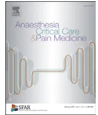

Guidelines

## Eye protection in anaesthesia and intensive care☆

French Society for Anaesthesia and Intensive Care (SFAR), French Ophthalmology Society (SFO), French-speaking Intensive Care Society (SRLF), Hawa Keitaa,\*, Jean-Michel Devysb, Jacques Ripartc, Marie Frostd, Isabelle Cochereaue, Frédérique Boutinf, Claude Guéring, Dominique Fletcherh, Vincent Compèrei

a Department of anaesthesia, AP-HP, CHU Louis-Mourier, 178, rue des Renouillers, 92700 Colombes, France

b Department of anaesthesia and intensive care, fondation Adolphe-Rotschild, 29, rue Manin, 75019 Paris, France

c Department of anaesthesia, pain and intensive care, GHU Caremeau, place du Pr-Debré, 30029 Nîmes cedex 09, France

d Department of anaesthesia, hôpital Michallon, BP 217, 38043 Grenoble cedex 9, France

e Fondation Adolphe-Rotschild, 29, rue Manin, 75019 Paris, France

f Department of anaesthesia and critical care III, CHU de Bordeaux, groupe hospitalier Pellegrin, place Amélie-Raba-Leon, 33000 Bordeaux, France

g Department of intensive care, hôpital de la Croix-Rousse, 103, grande rue de la Croix-Rousse, 69317 Lyon cedex 04, France

h Department of anaesthesia and intensive care, hôpital Ambroise-Paré, 9, avenue Charles-de-Gaulle, 92104 Boulogne-Billancourt, France

i Department of anaesthesia and intensive Care, CHU de Rouen, 1, rue de Germont, 76031 Rouen, France

### SFAR expert coordinators

Hawa Keita-Meyer, Louis Mourier University Hospital, Paris Public Hospitals Health Service.

### Organising committee

Dominique Fletcher, Raymond Poincaré Hospital, Paris Public Hospitals Health Service.

Vincent Compère, Charles Nicolle University Hospital, Rouen.

### Associated societies

#### SFAR

Bassam Al Nasser, Anaesthetist-Intensive Care Physician, Le Parc Clinic, Beauvais.

Catherine Bigotto, Nurse Anaesthetist, Bordeaux University Hospitals.

Cécile Bordenave, Senior Health Manager, Anaesthesia and Intensive Care Sector, Bordeaux University Hospitals.

Frédérique Boutin, Anaesthetist-Intensive Care Physician, Pellegrin Hospital, Bordeaux University Hospitals.

Jean-Michel Devys, Anaesthetist-Intensive Care Physician, Adolphe de Rothschild Ophthalmology Foundation, Paris.

Marie Frost, Anaesthetist-Intensive Care Physician, Nord University Hospital, Grenoble.

Marc Gentili, Anaesthetist-Intensive Care Physician, Saint-Grégoire Private Hospital.

Sophie Hamada, Anaesthetist-Intensive Care Physician, Bicêtre University Hospital, Paris Public Hospitals Health Service.

Serge Molliex, Anaesthetist-Intensive Care Physician, Bellevue Hospital, Saint-Étienne.

Habiba Moussa, Senior Health Manager, Strasbourg University Hospitals.

Jacques Ripart, Anaesthetist-Intensive Care Physician, Nîmes University Hospital.

#### SFO

Isabelle Cochereau, Adolphe de Rothschild Ophthalmology Foundation, Paris.

#### SRLF

Claude Guérin, Intensive Care Physician, Croix Rousse Hospital, Lyon.

### Working groups

#### Prevention of corneal injuries in Anaesthesia

Bassam Al Nasser (Beauvais).  
Frédérique Boutin (Bordeaux).  
Marc Gentili (Saint Grégoire).  
Hawa Keita-Meyer (Colombes).  
Habiba Moussa (Strasbourg).

#### Prevention of corneal injuries in Intensive Care

Catherine Bigotto (Bordeaux).  
Cécile Bordenave (Bordeaux).  
Jean-Michel Devys (Paris).  
Claude Guérin (Lyon).  
Isabelle Cochereau (Paris).

#### Prevention of retinal injuries due central retinal artery occlusion (CRAO) and acute ischaemic optic neuropathies (AION)

Marie Frost (Grenoble).  
Sophie Hamada (Bicêtre).  
Jacques Ripart (Nîmes).  
Serge Molliex (Saint Etienne).

DOI of original article: <http://dx.doi.org/10.1016/j.anrea.2016.05.002>

☆ Text approved by the SFAR Executive Council (14/03/2016).

\* Corresponding author.

E-mail address: [hawa.keita@aphp.fr](mailto:hawa.keita@aphp.fr) (H. Keita).## Review group

*Clinical Standards Committee:* Dominique Fletcher, Lionel Velly, Julien Amour, Sylvain Ausset, Gérald Chanques, Vincent Compere, Fabien Espitalier, Marc Garnier, Etienne Gayat, Philippe Cuvillon, Jean-Marc Malinovsky, Bertrand Rozec, Benoît Tavernier.

*SFAR Executive Council:* Claude Ecoffey, Francis Bonnet, Xavier Capdevila, Hervé Bouaziz, Pierre Albaladejo, Laurent Delaunay, Marie-Laure Citanova Pansard, Bassam Al Nasser, Christian-Michel Arnaud, Marc Beaussier, Marie-Paule Chariot, Jean-Michel Constantin, Marc Gentili, Alain Delbos, Jean-Marc Dumeix, Jean-Pierre Estebe, Olivier Langeron, Luc Mercadal, Jacques Ripart, Marc Samama, Jean-Christian Sleth, Benoît Tavernier, Eric Viel, Paul Zetlaoui.

## 1. Introduction

Any prolonged loss of consciousness due to sedation on a background of anaesthesia or intensive care may result in eye complications which may go unnoticed as the patient cannot express his/her reduced vision or pain.

Malocclusion of the eyelids causes surface injuries (keratopaties and ulcers) which are the most common. These are usually minor and resolve quickly as a result of reflex or maintained eyelid occlusion, but are occasionally complicated by superinfection or corneal perforation. They manifest by a red eye and can be detected by the care teams.

Vascular accidents are characterised only by a painless decrease of the vision. Compression of the eyeball may cause occlusion of the central retinal artery, which is only expressed by a reduced vision. This is usually unilateral and cannot be detected immediately by the patient if he/she is sedated or because of compensation from the other eye when the patient wakes up. In contrast, ischaemic optic neuropathy is often bilateral.

All of these eye injuries may result in permanent reduction in vision, which is occasionally bilateral and severe. They can be identified in conscious patients by the presence of pain, eye redness and reduced vision. It is the job of the care teams to detect these injuries in the unconscious patient.

## 2. Working group

The working group used the GRADE® registration method to develop its recommendations. After a quantitative analysis of the literature, this method enables to assess separately the quality of evidence i.e. an estimate of the trust that can be placed in the analysis of the quantitative effect of the intervention. It also enables a level of recommendation to be issued. The quality of evidence is divided into four categories:

- • high: future research is very unlikely to change the trust in the estimate of the effect;
- • moderate: future research probably will change the trust in the estimated effect and may change the estimate of the effect itself;
- • low: future research is very likely to have an impact on the confidence in the estimate of the effect and probably will change the estimate of the effect itself;
- • very low: the estimate of the effect is extremely uncertain.

The quality of evidence is analysed for each study and an overall level of evidence is defined for a given question and criterion.

The final guidelines are always defined as either positive or negative and either strong or weak.

- • strong: this must be done or must not be done (GRADE 1+ or 1–);
- • weak: this probably must be done or not be done (GRADE 2+ or 2–).

The strength of the guidelines is established depending on key factors, and it is confirmed by the experts after a vote using the Delphi and GRADE Grid method.

Estimation of effect:

- • the overall level of trust: the higher the level of trust, the strongest the guidelines;
- • the balance between desirable and undesirable effects: the guidelines are more likely to be strong as this balance increases;
- • the values and preferences: the guidelines are probably more likely to be weak if uncertainties or great variability exists; these values and preferences must ideally be obtained directly from the people concerned (patient, doctor, decision-maker);
- • costs: the guidelines are more likely to be weak with increasing cost or use of resources;
- • in order to issue a recommendation, at least 50% of the participants have to have an opinion and less than 20% must prefer the opposite proposal;
- • in order to issue a strong recommendation, at least 70% of the participants must be in agreement.

Overall, the evidence in the literature about eye protection is methodologically weak. The experts were faced with three situations:

- • for some questions, the existence of several studies and/or meta-analyses of good methodological quality, the GRADE® method applied in its entirety and allowed guidelines to be issued;
- • if the experts did not have a meta-analysis to answer the question, a qualitative analysis following the GRADE® method could be used and a systematic review was carried out;
- • finally, in some areas, no recommendations could be made because of a lack of recent studies.

After summarising the work carried out by the experts and applying the GRADE method, 10 recommendations were formally issued by the organising committee. Among these recommendations, 1 is strong (Grade 1+), 2 are weak (Grade 2+/-) and for 9 of them, the GRADE® method could not be applied and these were expert opinions. An expert opinion was only approved in the event of a strong agreement from more than 70% of the experts.

All of the recommendations were then submitted to a review group for Delphi scoring. After 1 scoring cycle and various amendments, strong agreement was reached for all of the recommendations.

## 3. Prevention of corneal injuries in anaesthesia

**R1.1 In order to prevent corneal injuries in general anaesthesia, systematic eyelid occlusion using adhesive strips alone is recommended**

### (GRADE 1+) STRONG agreement

**Discussion:** A literature review including 7 randomised controlled trials [1–7] and 1 historical series [8] has compared different methods of preventing corneal injuries during general anaesthesia (GA) [9]. This review reports that eyelid occlusion with adhesive strips alone is superior or equivalent to other methods (ointments, lubricants containing an aqueous methylcellulose solution or viscous gel, protective spectacles, insertion of hydrophilic contact lenses, suturing the eyelids together, dressings containing a “Geliperm®” hydrogel or “Tegaderm®” or “Opsite®” bio-occlusive dressings) [1,3,5–7] and is associated with fewer adverse effect [6,7]. Compared to occlusion with adhesive strips, simple manual closure of the eye is associated with a higher incidence of corneal injuries(10% of corneal injuries found in a series of 300 “eyes” in which 90% belong to the manual closure group compared to 6.6% in the group occluded with adhesive strips) [4].

**R1.2 Apart from a rapid induction sequence, eyelid occlusion is recommended as soon as the ciliary reflex is lost and before tracheal intubation, in order to reduce the risk of traumatic injuries to the cornea**

**(Expert opinion)**

**Discussion:** It is suggested in a literature review that corneal injuries may occur following direct trauma to an unprotected eye, caused by various objects used by care workers, such as watches, badges, stethoscopes or the laryngoscope during intubation [9].

**R1.3 It is recommended that complete occlusion of the eye be obtained by apposing the upper and lower eyelids together and regularly checking the effectiveness of this occlusion**

**(Expert opinion)**

**Discussion:** In a before/after cohort, mandatory training about the need to correctly occlude the eyelids and confirm the effectiveness of this occlusion, reduced the incidence of corneal injuries by a factor of three [11].

**R1.4 For at-risk surgery (head and neck surgery, ventral or lateral position procedures) it is probably recommended that lubricants containing an aqueous solution without preservative in a single dose form such as methylcellulose or viscous gel be used in combination with eyelid occlusion using adhesive strips. An alternative is to use transparent, lubricant-free bio-occlusives**

**(Expert opinion)**

**R1.5 It is recommended to not use oil-based ointments not be used for high-risk surgery**

**(Expert opinion)**

**Discussion:** Procedures performed in the ventral or lateral position and head and neck surgery are risk factors for corneal injuries. The duration of anaesthesia is not an independent risk factor [10]. Use of methylcellulose as a lubricant produces fewer adverse effects than paraffin-based ointments [2,3,6,7].

**R1.5 Development of a training program and prevention protocol in care facilities is probably recommended in order to reduce the incidence of corneal injuries under general anaesthesia**

**(GRADE 2 + ) STRONG agreement**

**Discussion:** Setting up a training program with a prevention protocol in care facilities helps to reduce the incidence of corneal injuries [11].

#### 4. Prevention of corneal injuries in intensive care

**R2.1 In at risk patients (intubated and ventilated, sedated or with a low level of awareness), screening for corneal injuries should probably be carried out using a fluorescein test**

**(Expert opinion)**

**Discussion:** Protection of the cornea depends on its moisturisation, which itself depends on eyelid closure, blinking and the quality of the aqueous film present on the cornea. These 3 protective components are regularly reduced in intensive care patients. Exposure-related corneal injuries in intensive care are therefore seen in 8.6% to 60% depending on the study [12–16].

Several cohort studies appear to indicate that the peak incidence of corneal injuries occurs during the first week after admission to intensive care and that the patients at greatest risk of developing these are those who are intubated and ventilated, sedated or those at a low level of awareness with eyelid malocclusion [17,18].

The aim of all the studies was to assess the severity of corneal injuries in intensive care using an ophthalmoscope producing a cobalt blue light combined with the application of a drop of fluorescein. The majority of corneal injuries involve punctiform damage, invisible to the naked eye. These injuries can however progress to corneal ulceration with visual complications. The sensitivity of screening for keratopathies by trained intensive care physicians is described as being close to that obtained by ophthalmologists [19].

**R2.2 In intubated and ventilated intensive care patients, an aqueous gel or humidity chambers should probably be used instead of artificial tears**

**(GRADE 2 + ) STRONG agreement**

**Discussion:** A meta-analysis including 7 prospective, randomised studies sought to assess the comparative efficacy of humidity chambers, aqueous gels and artificial tears in intensive care patients [20]. These studies compared the incidence of corneal injuries which were screened using an ophthalmoscope depending on the treatments, between patients ( $n = 343$ ) or between eyes ( $n = 701$ ). The use of a humidity chamber reduced the incidence of injuries compared to lubrication of the eye alone (RR: 0.27; 95% CI: 0.11–0.67;  $P = 0.005$ ) although there was significant statistical variability ( $P = 0.001$ ,  $I^2 = 73\%$ ). The sub-group analysis showed a reduction in risk associated with the use of a humidity chamber compared to artificial tears (RR: 0.13; 95% CI: 0.05–0.35;  $P < 0.0001$ ). Conversely, the humidity chamber was not superior to application of a gel (RR: 0.81; 95% CI: 0.51–1.29;  $P = 0.36$ ). There aren't enough data assessing eyelid occlusion whether or not combined with corneal lubrication.

#### 5. Prevention of retinal injuries due to central retinal artery occlusion (CRAO) or acute ischaemic optic neuropathies (AION)

**R3.1 In order to avoid direct compression of the eyeball and CRAO in spinal surgery carried out in the ventral decubitus position and particularly when surgery is long, it is probably recommended that appropriate headrests be used guaranteeing no direct compression of the eyeball (with the head in the neutral position using a direct bone point application headrest such as a Mayfield or specially cut cushion to control the eyeballs without contact and without manipulating the patient)**

**(Expert opinion)**

**R3.2 It is probably recommended that absence of any extrinsic compression of the eyeball during the procedure be checked.**

**(Expert opinion)**

**Discussion:** The main postural circumstances in which ocular compression occurs are procedures where the patient is in the ventral or lateral position. These compressions usuallyfollow mobilisation of the head during the procedure and, less commonly, are due to incorrect initial positioning. It is recommended that practitioners be vigilant about the position of the head throughout the procedure [21,22]. Lee *et al.*, in the register of peroperative visual loss, found significant differences between CRAO ( $n = 10$ ) and AION ( $n = 83$ ), evidence pleading in favour of direct compression [21,22]. All of the CRAO were unilateral, none of them occurred while using a Mayfield head clamp, and 7 cases out of 10 (70%) showed external features of external trauma to the eyeball. Direct compression of the eyeball is prevented using suitable headrests or rigid helmets, and their fixing on the bones need to be repeatedly checked whilst in position. If the helmets themselves move, this may cause direct compression of the eyeball [22]. The “horseshoe” headrests can also contribute to ocular compression and CRAO if they move [1]. Specific cushions equipped with a mirror remain to be assessed. The use of headrests applied directly on to the bone ensures that no ocular contact occurs and it is also recommended. [21,23]. All people involved in the procedure must ensure that no mechanical compression occurs.

**R3.3 In long surgery with the patient in the ventral decubitus position, it is probably recommended that a slight forward tilt be preferred to the Trendelenburg position to reduce intraocular pressure**

**(Expert opinion)**

**Discussion:** The ventral decubitus position probably increases the risk of compression by increasing intraocular pressure. This increase in ocular pressure is even greater when the ventral decubitus position is combined with a Trendelenburg position [24–28]. Risk increases if the position is accentuated and maintained for a long period of time. A 10% forward tilt helps reduce this risk [26,28]. According to current information in the literature, it was not possible to identify other risk factors for retinal injuries due to CRAO.

**R3.4 In long haemorrhagic, spinal surgery, in order to prevent AION it is probably recommended that hypotension, severe anaemia and hypovolaemia be reduced particularly when patients are at risk (obese, male, hypertensive and vascular risk factors)**

**(Expert opinion)**

**Discussion:** The optic nerve is more sensitive than the brain to episodes of hypotension, anaemia or hypovolaemia. It has been shown in various experimental combinations of hypotension, euvolaemic anaemia or hypovolaemia in animals that the optic nerve does not have the same degree of autoregulation allowing it to adjust its blood flow to maintain oxygen transport with similar effectiveness to the autoregulation of cerebral blood flow [29]. In healthy volunteers, 2/10 of the volunteers did not have sufficient autoregulation to adjust the blood flow to the head of the optic nerve in response to changes in perfusion pressure (variation in intraocular pressure) [30]. The surgery causing this complication most frequently is extensive spinal surgery. This frequently involves a combination of the factors found traditionally, i.e. a context of bleeding, prolonged hypotension, massive transfusion, excessive crystalloid vascular filling and/or a low percentage of colloids in filling solutions (causing tissue oedema and therefore raising tissue pressure in the optic nerve) and anaemia [23,31–36]. This set of conditions contributes to ischaemia/hypoxia of the optic nerve. This was present in 82% of cases in the *American Society of Anaesthesiology* loss of vision register. Many patients were in good health (ASA 1) but had at least one vascular risk factor in 82% of cases (hypertension, diabetes, coronary artery disease, cerebrovascular disease, dyslipidaemia and/or obesity). Subclinical microvascular damage may therefore explain the large variation in interindividual susceptibility, making this disease somewhat arbitrary and apparently unpredictable. The clearly confirmed independent risk factors, in the case of spinal surgery, were being a male, obesity, use of a Wilson frame (abdominal compression), a long procedure and a low percentage of colloid in the vascular filling solutions [37]. Screening for at risk patients would appear to be desirable if it enables the people at risk to be targeted specifically. The confirmed patient-related risk factors however are only obesity and male sex. Hypertension, smoking and atheroma have only been suggested. These complications may occur with no apparent risk factors in more straightforward surgery [38–40].

**Disclosure of interest**

The authors declare that they have no competing interest.## Appendix A. Tabulated summary—Prevention of corneal injuries in anaesthesia

Primary criterion: diagnosis of corneal injuries with the fluorescein tests.

Secondary criteria: conjunctival hyperaemia, pain, photophobia.

<table border="1">
<thead>
<tr>
<th>Study (references)</th>
<th>Type of study</th>
<th>Subject</th>
<th>Primary objective/ Hypothesis</th>
<th>Number of studies</th>
<th>Number of patients</th>
<th>Level of evidence</th>
<th>Justification for readjustment of the number of patients</th>
<th>Incidence of the event and result of the comparison <math>n</math> (%) vs <math>N</math> (%), <math>P</math></th>
</tr>
</thead>
<tbody>
<tr>
<td>Batra et al., <i>Anesthesia and analgesia</i> 1977</td>
<td>Randomised controlled</td>
<td>Corneal injury identified by the fluorescein test</td>
<td>To assess the incidence of corneal injuries under GA/reduction in incidence by ocular protection using adhesive strips or Vaseline gauze?</td>
<td>1</td>
<td>100 patients without occlusion 100 patients with eye protection including 75 with occlusion using adhesive strips and 25 with Vaseline gauze</td>
<td>II</td>
<td>No numbers calculation</td>
<td>Corneal injury identified by fluorescein in 44% of patients without eye protection and to 0% in patients with ocular eye protection (occlusion with adhesive strips or Vaseline gauze). No <math>P</math> value calculated</td>
</tr>
<tr>
<td>Grover et al., <i>Canadian Journal of Anaesthesia</i> 1998</td>
<td>Randomised controlled</td>
<td>Corneal injury identified by the fluorescein test</td>
<td>To compare the efficacy of adhesives strips and ointments for eye protection under GA</td>
<td>1</td>
<td>150 patients (i.e. 300 eyes) divided into 3 groups each of 50: group C (control = no protection); group S (= adhesive strips; group O = ointment)</td>
<td>II</td>
<td>No numbers calculation</td>
<td>The overall incidence of corneal injuries was 10% (30/300 eyes). This complication occurred in 90% of cases in group C, 6.6% of cases in group S and 3.3% of cases in group O. <math>P</math> value not calculated. Patient position also changed the incidence. The incidence of corneal injury when the patient was in the dorsal decubitus position was 9.7% compared to 19.2% in the right lateral decubitus position and 3.8% in the left lateral decubitus position. In each case the affected eye was the eye tilted laterally. <math>P</math> value not calculated</td>
</tr>
<tr>
<td>Ganidagli et al., <i>European Journal of Anaesthesiology</i> 2004</td>
<td>Randomised controlled Single blind</td>
<td>Corneal injury identified by the fluorescein test Conjunctival hyperaemia</td>
<td>To compare the efficacy of 4 ways of eye protection under GA to prevent corneal injury</td>
<td>1</td>
<td>200 patients divided into 4 groups of 50 patients: group 1 (hypoallergenic adhesive strips); group 2 (paraffin-based ointment); group 3 (viscous gel); group 4 (artificial tears with methylcellulose)</td>
<td>II</td>
<td>No numbers calculation</td>
<td>The overall incidence of corneal injuries at H12 was 9% (18/200). There was no significant difference between the 4 groups: Group 1 = 10%; Group 2 = 8%; Group 3 = 12%; Group 4 = 6% No significant difference in size or the injury or intensity of fluorescein staining between the 4 groups The number of patients with conjunctival hyperaemia at H12 (16%) and at H24 (12%) was significantly greater in group 3 compared to the other groups (<math>P &lt; 0.05</math>) More patients had visual disturbance in the post-operative recovery room in group 4 (42%) compared to the other groups (<math>P &lt; 0.05</math>) Photophobia was significantly more common in group 2 (26%) compared to the other groups (<math>P &lt; 0.01</math>)</td>
</tr>
<tr>
<td>Schmidt et al., <i>Acta Ophthalmologica</i> 1981</td>
<td>Randomised controlled Double blind</td>
<td>Corneal injury identified by the fluorescein test/Rose Bengal test Conjunctival injuries</td>
<td>To compare the efficacy of a lubricant containing 4% methylcellulose to a paraffin-based ointment for eye protection under GA for surgery &lt; 90 min</td>
<td>1</td>
<td>47 patients randomised to receive a 4% methylcellulose lubricant into one eye (group A) and the paraffin-based ointment into the other eye (group B)</td>
<td>III</td>
<td>No numbers calculation No statistical analysis</td>
<td>The incidence of corneal injuries was 2.1% (<math>n = 1</math>) in the whole population (<math>n = 47</math>) with a single case in group B Overall, 66% (<math>n = 31</math>) of the patients had subjective complaints. The most common complaint was a sensation of the eyelids being stuck to each other (42.5%, <math>n = 20</math>). This complaint was reported in 75% of cases in patients in group A Objective signs of conjunctivitis (redness, oedema etc.) were present overall in 55.3% cases (26/47). The most common sign was conjunctival "staining" in 69% (<math>n = 18</math>). This occurred in 55.5% of cases in group B compared to 28% in group A</td>
</tr>
</tbody>
</table>Appendix A (Continued)

<table border="1">
<thead>
<tr>
<th>Study (references)</th>
<th>Type of study</th>
<th>Subject</th>
<th>Primary objective/ Hypothesis</th>
<th>Number of studies</th>
<th>Number of patients</th>
<th>Level of evidence</th>
<th>Justification for readjustment of the number of patients</th>
<th>Incidence of the event and result of the comparison <i>n (%) vs N (%), P</i></th>
</tr>
</thead>
<tbody>
<tr>
<td>Orlin et al., <i>Anesthesia and Analgesia</i> 1989</td>
<td>Observational</td>
<td>Corneal injury identified by the fluorescein test/Rose Bengal test</td>
<td>To compare the efficacy of adhesive strip closure versus adhesive strip plus Vaseline</td>
<td>1</td>
<td>76 patients (152 eyes) Each patient acting as his/her own control</td>
<td>III</td>
<td>No numbers calculation No statistical analysis</td>
<td>1 patient with a minor conjunctival injury in the eye not receiving vaseline No other injuries seen</td>
</tr>
<tr>
<td>Boggild-Madsen et al., <i>Canadian Anaesthetists' Society journal</i> 1981</td>
<td>Cohort study Each patient acting as his/her own control</td>
<td>Conjunctival injury (hyperaemia, oedema) Visual disturbance</td>
<td>To compare an ointment containing methylcellulose (M) and paraffin (P) for eye protection under GA when halothane was or was not used for periods of <math>\geq 90</math> min</td>
<td>1</td>
<td>120 patients: 108 patients received the M ointment into one eye and the P ointment into the other eye; 5 patients received the M ointment into both eyes; 7 patients received the P ointment into both eyes</td>
<td>III</td>
<td>No numbers calculation No statistical analysis</td>
<td>During halothane GA, the use of the M ointment compared to the P ointment showed: a lower incidence of conjunctival oedema (5.5% vs 52%, for M and P respectively); a lower incidence of conjunctival hyperaemia (3.7% vs 22%, for M and P respectively); and less post-operative visual disturbance (1.8% vs 11%, for M and P respectively) No <i>P</i> value calculated</td>
</tr>
<tr>
<td>Siffring et al., <i>Anesthesiology</i> 1987</td>
<td>Randomised</td>
<td>Corneal injury identified by the fluorescein test and UV lamp Visual disturbance</td>
<td>To compare the efficacy of 4 ways of eye protection under GA to prevent a corneal injuries in surgery lasting 30 to 180 minutes</td>
<td>1</td>
<td>127 patients divided into 4 groups: group A (artificial tears + adhesive strips); group B (lubricant ointment + adhesive strips); group C (methylcellulose ointment + adhesive strips); group D (adhesive strips only)</td>
<td>II</td>
<td>No numbers calculation</td>
<td>No corneal injuries in the 4 groups. Visual disturbance present in 75% and 55% of patients in group A and B respectively compared to 1 patient in group C and 0 in group D No <i>P</i> value calculated</td>
</tr>
<tr>
<td>Lavery et al., <i>Eur Urol Suppl</i> 2010</td>
<td>Prospective, comparative study over 2 periods</td>
<td>Corneal injury identified by the fluorescein test</td>
<td>To compare the efficacy of an occlusion with a transparent bio-occlusive dressing to reduce the incidence of corneal injuries under GA</td>
<td>1</td>
<td>2 periods: Period 1, <i>n</i> = 214 patients with eye protection with artificial tears + adhesive strips Period 2, <i>n</i> = 814 patients with eye protection using the transparent bio-occlusive dressing</td>
<td>III</td>
<td>No numbers calculation</td>
<td>Incidence of corneal injuries significantly lower in period 2 with the transparent bio-adhesive dressing: 0 (0%) vs 5 (2.3%), respectively for the periods 2 and 1, <i>P</i> &lt; 0.001 Mean length of surgery 117 min vs 116 min (<i>P</i> = NS) for periods 1 and 2 respectively</td>
</tr>
<tr>
<td>Yu et al., <i>Acta anaesthesiologica Taiwanica</i> 2010</td>
<td>Retrospective study 2006–2008</td>
<td>Ocular complications</td>
<td>Retrospective analysis of ocular complications occurring in a cohort of patients undergoing surgery under GA and risk factors (RF)</td>
<td>1</td>
<td>Retrospective record from a database of anaesthetic complications between 2006 and 2008 75,120 cases included</td>
<td>IV</td>
<td></td>
<td>Ocular complications in 17 patients i.e. 0.023% including 10 corneal injuries Risk factors for ocular complications: patients undergoing surgery in the ventral position (OR = 10.8; 95% confidence interval (CI) 2.4–48.8) or lateral position (OR = 7.1; 95% CI 1.2–43.2) or undergoing head or neck surgery (OR = 9.3; 95% CI 2.3–38.0) with peroperative hypotension (OR = 8.7; 95% CI 2.4–31.8) or peroperative anaemia (OR = 5.3; 95% CI 1.8–15.4). Duration of anaesthesia was not an independent risk factor OR per hour = 0.9; 95% CI 0.8–1.7)</td>
</tr>
</tbody>
</table>**Appendix A (Continued)**

<table border="1">
<thead>
<tr>
<th>Study (references)</th>
<th>Type of study</th>
<th>Subject</th>
<th>Primary objective/ Hypothesis</th>
<th>Number of studies</th>
<th>Number of patients</th>
<th>Level of evidence</th>
<th>Justification for readjustment of the number of patients</th>
<th>Incidence of the event and result of the comparison n (%) vs N (%), P</th>
</tr>
</thead>
<tbody>
<tr>
<td><i>Martin et al., Anesthesiology 2009</i></td>
<td>Comparative study over 2 periods</td>
<td>Corneal injury identified by the fluorescein test/Bengal rose test</td>
<td>To assess the incidence of corneal injuries under GA/identify risk factors</td>
<td>1</td>
<td>2 periods: Period 1 (6 months), identification of development of all corneal injuries and email notification to the anaesthetists involved in the patient's care Period 2 (10 months), awareness and training programme for anaesthetic teams on factors which may contribute to corneal injuries and on the ways of preventing these In addition, case control study to identify RF for corneal injuries: 117 cases vs 234 controls</td>
<td>III</td>
<td></td>
<td>Significantly lower incidence of corneal lesions after introducing the education programme: 1.51/1,000 vs 0.79/1,000 (P = 0,008) Independent RF identified: longer duration of anaesthesia (OR = 1.2; CI95% 1.1–1.3 by 30 min); higher ASA classes (OR 0.5; CI95% 0.3–0.3 for ASA 3–4 vs 1–2); management with an student nurse assistant anaesthetist (OR 2.6; 95% CI 1.3–5.0)</td>
</tr>
</tbody>
</table>

**Tabulated summary–prevention of corneal injuries in anaesthesia (continued).**

<table border="1">
<thead>
<tr>
<th colspan="8">Quality assessment</th>
<th colspan="2">Number of patients</th>
<th colspan="2">Effect</th>
<th rowspan="2">Quality</th>
</tr>
<tr>
<th>Number of studies</th>
<th>Type of study</th>
<th>Plan of study</th>
<th>Heterogeneity</th>
<th>Indirect data</th>
<th>Imprecision</th>
<th>Publication bias</th>
<th>Procedure</th>
<th>Control</th>
<th>RR (95% CI)</th>
<th>WMD</th>
</tr>
</thead>
<tbody>
<tr>
<td>Corneal injuries under general anaesthesia: prevention by eyelid occlusion using adhesive strips alone 2</td>
<td>Randomised controlled</td>
<td>High risk of bias</td>
<td>High</td>
<td>No</td>
<td>High</td>
<td>No</td>
<td>125</td>
<td>150</td>
<td>50% reduction</td>
<td>–</td>
<td>Weak</td>
</tr>
<tr>
<td></td>
<td><i>Batra YK. Anesth &amp; Analg 1977</i> <i>Grover VK. Can J Anaesth 1998</i></td>
<td></td>
<td></td>
<td></td>
<td></td>
<td></td>
<td></td>
<td></td>
<td></td>
<td></td>
<td></td>
</tr>
<tr>
<td>Corneal injuries under general anaesthesia: prevention by a training programme and a protocol 1</td>
<td>Prospective comparative over 2 periods</td>
<td>High risk of bias</td>
<td>High</td>
<td>No</td>
<td>High</td>
<td>No</td>
<td>113,162</td>
<td>84,796</td>
<td>53% reduction</td>
<td>–</td>
<td>Very weak</td>
</tr>
<tr>
<td></td>
<td><i>Martin DP</i> <i>Anesthesiology 2009</i></td>
<td></td>
<td></td>
<td></td>
<td></td>
<td></td>
<td></td>
<td></td>
<td></td>
<td></td>
<td></td>
</tr>
</tbody>
</table>

**Tabulated summary–prevention of corneal injuries in intensive care.**

<table border="1">
<thead>
<tr>
<th colspan="7">Quality assessment</th>
<th colspan="2">Number of patients</th>
<th colspan="2">Effect</th>
<th rowspan="2">Quality</th>
</tr>
<tr>
<th>Number of studies</th>
<th>Type of study</th>
<th>Plan of study</th>
<th>Heterogeneity</th>
<th>Indirect data</th>
<th>Imprecision</th>
<th>Publication bias</th>
<th>Procedure</th>
<th>Control</th>
<th>RR (95% CI)</th>
<th>WMD</th>
</tr>
</thead>
<tbody>
<tr>
<td>Corneal injuries in intensive care: prevention in at risk patients: moist chamber versus lubrication or drops 7</td>
<td>Meta-analyse</td>
<td>High</td>
<td>No</td>
<td>No</td>
<td>No</td>
<td></td>
<td>351</td>
<td>347</td>
<td>RR = 0.27</td>
<td>–</td>
<td>Moderate</td>
</tr>
<tr>
<td></td>
<td><i>Zhou Y. Cornea 2014</i></td>
<td></td>
<td></td>
<td></td>
<td></td>
<td></td>
<td></td>
<td></td>
<td></td>
<td></td>
<td></td>
</tr>
</tbody>
</table>## References

1. [1] Batra YK, Bali IM. Corneal abrasions during general anesthesia. *Anesth Analg* 1977;56(3):363–5.
2. [2] Boggild-Madsen NB, Bundgaard-Nielsen P, Hammer U, et al. Comparison of eye protection with methylcellulose and paraffin ointments during general anaesthesia. *Can Anaesth Soc J* 1981;28:575–8.
3. [3] Ganidagli S, Cengi M, Becerik C, et al. Eye protection during general anaesthesia: comparison of four different methods. *Eur J Anaesth* 2004;21:665–7.
4. [4] Grover VK, Kumar KV, Sharma S, et al. Comparison of methods of eye protection under general anaesthesia. *Can J Anaesth* 1998;45:575–7.
5. [5] Orlin SE, Kurata FK, Krupin T, et al. Ocular lubricants and corneal injury during anesthesia. *Anesth Analg* 1989;69:384–5.
6. [6] Schmidt P, Boggild-Madsen NB. Protection of the eyes with ophthalmic ointments during general anaesthesia. *Acta ophthalmol* 1981;59:422–7.
7. [7] Siffring PA, Poulton TJ. Prevention of ophthalmic complications during general anesthesia. *Anesthesiology* 1987;66:569–70.
8. [8] Lavery HJ, Samadi DB, Gainsburg DM. Preventing ocular injuries during robotic prostatectomy: A simple technique (Abstract of poster presentation at the 25th Annual Congress of The European Association of Urology in Barcelona, April 2010). *Eur Urol Suppl* 2010;9:257.
9. [9] Grixti A, Sadri M, Watts MT. Corneal protection during general anesthesia for nonocular surgery. *Ocular Surf* 2013;11:109–18.
10. [10] Yu HD, Chou AH, Yang MW, et al. An analysis of perioperative eye injuries after nonocular surgery. *Acta Anaesthesiol Taiwan* 2010;48:122–9.
11. [11] Martin DP, Weingarten TN, Gunn PW, et al. Performance improvement system and postoperative corneal injuries: incidence and risk factors. *Anesthesiology* 2009;111:320–6.
12. [12] Germano EM, Mello MJ, Sena DF, et al. Incidence and risk factors of corneal epithelial defects in mechanically ventilated children. *Crit Care Med* 2009;37:1097–100.
13. [13] Hernandez EV, Mannis MJ. Superficial keratopathy in intensive care unit patients. *Am J Ophthalmol* 1997;124:212–6.
14. [14] Imanaka H, Taenaka N, Nakamura J, et al. Ocular surface disorders in the critically ill. *Anesth Analg* 1997;85:343–6.
15. [15] Jammal H, Khader Y, Shihadeh W, et al. Exposure keratopathy in sedated and ventilated patients. *J Crit Care* 2012;27:537–41.
16. [16] Mercieca F, Suresh P, Morton A, et al. Ocular surface disease in intensive care unit patients. *Eye* 1999;13:231–6.
17. [17] Kuruvilla S, Peter J, David S, et al. Incidence and risk factor evaluation of exposure keratopathy in critically ill patients: a cohort study. *J Crit Care* 2015;30:400–4.
18. [18] Werli-Alvarenga A, Ercole FF, Botoni FA, et al. Corneal injuries: incidence and risk factors in the Intensive Care Unit. *Rev Lat Am Enferm* 2011;19:1088–95.
19. [19] McHugh J, Alexander P, Kalhoro A, et al. Screening for ocular surface disease in the intensive care unit. *Eye* 2008;22:1465–8.
20. [20] Zhou Y, Liu J, Cui Y, et al. Moisture chamber versus lubrication for corneal protection in critically ill patients: a meta-analysis. *Cornea* 2014;33:1179–85.
21. [21] Practice advisory for perioperative visual loss associated with spine surgery: an updated report by the American society of anesthesiologists task force on perioperative visual loss. *Anesthesiology* 2012;116:274–85.
22. [22] Roth S, Tung A, Ksiazek S. Visual loss in a prone-positioned spine surgery patient with the head on a foam headrest and goggles covering the eyes: an old complication with a new mechanism. *Anesth Analg* 2007;104:1185–7.
23. [23] Lee LA, Roth S, Posner KL, Cheney FW, Caplan RA, Newman NJ, et al. The American Society of Anesthesiologists Postoperative Visual Loss Registry: analysis of 93 spine surgery cases with postoperative visual loss. *Anesthesiology* 2006;105:652–9.
24. [24] Agah M, Ghasemi M, Roodneshin F, Radpay B, Moradian S. Prone position in percutaneous nephrolithotomy and postoperative visual loss. *Urol J* 2011;8:191–6.
25. [25] Awad H, Santili S, Ohr M, et al. The effects of steep Trendelenburg positioning on intraocular pressure during robotic radical prostatectomy. *Anesth Analg* 2009;109:473–8.
26. [26] Carey TW, Shaw KA, Weber ML, DeVine JG. Effect of the degree of reverse Trendelenburg position on intraocular pressure during prone spine surgery: a randomized controlled trial. *Spine J* 2014;14:2118–26.
27. [27] Hunt K, Bajekal R, Calder I, Meacher R, Eliahou J, Acheson JF. Changes in intraocular pressure in anesthetized prone patients. *J Neurosurg Anesthesiol* 2004;16:287–90.
28. [28] Ozcan MS, Praetel C, Bhatti MT, Gravenstein N, Mahla ME, Seubert CN. The effect of body inclination during prone positioning on intraocular pressure in awake volunteers: a comparison of two operating tables. *Anesth Analg* 2004;99:1152–8.
29. [29] Lee LA, Deem S, Glenny RW. Effects of anemia and hypotension on porcine optic nerve blood flow and oxygen delivery. *Anesthesiology* 2008;108:864–72.
30. [30] Pillunat LE, Anderson DR, Knighton RW, Joos KM, Feuer WJ. Autoregulation of human optic nerve head circulation in response to increased intraocular pressure. *Exp Eye Res* 1997;64:737–44.
31. [31] Baig MN, Lubow M, Iimmosoete P, Bergese SD, Hamdy EA, Mendel E. Vision loss after spine surgery: review of the literature and recommendations. *Neurosurg Focus* 2007;23:15.
32. [32] Farag E, Abd-Elsayed AA, Dalton JE, Nada E, Parker BM. Postoperative vision loss after spine surgery: a single-institution case-control comparison. *Ochsner J* 2014;14:179–83.
33. [33] Kara-Junior N, Espindola RF, Valverde Filho J, Rosa CP, Ottoboni A, Silva ED. Ocular risk management in patients undergoing general anesthesia: an analysis of 39,431 surgeries. *Clinics* 2015;70:541–53.
34. [34] Myers MA, Hamilton SR, Bogosian AJ, Smith CH, Wagner TA. Visual loss as a complication of spine surgery. A review of 37 cases. *Spine* 1997;22:1325–9.
35. [35] Patil CG, Lad EM, Lad SP, Ho C, Boakye M. Visual loss after spine surgery: a population-based study. *Spine* 2008;33:1491–6.
36. [36] Li A, Veeravagu A, Bhatti I, Ratlif I. Perspective on postoperative visual loss following lumbar spine surgery: a review of risk factors by diagnosis. *World Neurosurg* 2015;84:2010–21.
37. [37] The Postoperative Visual Loss Study Group. Risk Factors Associated with Ischemic Optic Neuropathy after Spinal Fusion Surgery. *Anesthesiology* 2012;116:15–24.
38. [38] Geis AB, Höfert A, Silvanus MT, Bornfeld N, Peters J. Bilateral blindness due to ischemic optic nerve neuropathy after abdominal surgery. *AA Case Rep* 2015;5:57–60.
39. [39] Janarek G, Colechá JR. Visual loss after hip and shoulder arthroplasty, two case reports. *Rev Esp Anestesiol Reanim* 2015;62:285–8.
40. [40] Weber ED, Colyer MH, Lesser RL, Subramanian PS. Posterior ischemic optic neuropathy after minimally invasive prostatectomy. *J Neuro-Ophthalmol* 2007;27:285–7.