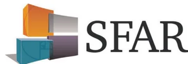

## Intubation difficile et extubation en anesthésie chez l'adulte<sup>\*</sup>

Olivier Langeron<sup>1</sup>, Jean-Louis Bourgain<sup>2</sup>, Daniel Francon<sup>3</sup>, Julien Amour<sup>4</sup>, Christophe Baillard<sup>5</sup>, Gaëlle Bouroche<sup>6</sup>, Madeleine Chollet-Rivier<sup>7</sup>, François Lenfant<sup>8</sup>, Benoît Plaud<sup>9</sup>, Patrick Schoettker<sup>7</sup>, Dominique Fletcher<sup>10</sup>, Lionel Velly<sup>11</sup>, Karine Nouette-Gaulain<sup>12</sup>

Disponible sur internet le :  
 26 octobre 2017

1. 1. UPMC-Paris VI, faculté de médecine Pierre-et-Marie-Curie, hôpital universitaire Pitié-Salpêtrière, département d'anesthésie-réanimation, 47, boulevard de l'Hôpital, 75651 Paris cedex 13, France
2. 2. Institut Gustave-Roussy, service d'anesthésie, rue Édouard-Vaillant, 94800 Villejuif, France
3. 3. Institut Paoli-Calmette, service d'anesthésie-réanimation, 232, boulevard Sainte-Marguerite, 130009 Marseille, France
4. 4. Hôpital Pitié-Salpêtrière, institut de cardiologie, département de réanimation chirurgicale cardiovasculaire et thoracique, 47-83, boulevard de l'Hôpital, 75013 Paris, France
5. 5. AP-HP, hôpital Avicenne, département d'anesthésie-réanimation, 125, route de Stalingrad, 93009 Bobigny, France
6. 6. Hospices civils de Lyon, centre Léon-Bérard, servie d'anesthésie-réanimation, 69002 Lyon, France
7. 7. CHUV, université de Lausanne, département d'anesthésie, Lausanne, Suisse
8. 8. Centre hospitalier Pierre-Nouveau, service d'anesthésie, 15, avenue des Broussailles, 06400 Cannes, France
9. 9. Assistance publique-Hôpitaux de Paris 1, université Paris-Diderot, hôpital Saint-Louis, service d'anesthésie, réanimation chirurgicale, avenue Claude-Vellefaux, 75475 Paris cedex 10, France
10. 10. AP-HP, hôpital Raymond-Poincaré, service d'anesthésie, 104, boulevard Raymond-Poincaré, 92380 Garches, France
11. 11. Assistance publique-Hôpitaux de Marseille, hôpital de la Timone, service d'anesthésie-réanimation, 13000 Marseille, France
12. 12. Centre hospitalier universitaire de Bordeaux, centre hospitalier Xavier-Michelet, université de Bordeaux, hôpital des Enfants, hôpital Tripode, laboratoire maladies rares : génétique et métabolisme (MRGM), service d'anesthésie-réanimation III, Inserm U 12-11, place Amélie-Raba-Léon, 33076 Bordeaux cedex, France

### Correspondance :

**Karine Nouette-Gaulain**, Centre hospitalier universitaire de Bordeaux, centre hospitalier Xavier-Michelet, université de Bordeaux, hôpital des Enfants, hôpital Tripode, laboratoire maladies rares : génétique et métabolisme (MRGM), service d'anesthésie-réanimation III, Inserm U 12-11, place Amélie-Raba-Léon, 33076 Bordeaux cedex, France.  
[karine.nouette-gaulain@u-bordeaux.fr](mailto:karine.nouette-gaulain@u-bordeaux.fr)

### Difficult intubation and extubation in anaesthesia in the adult patient



<sup>\*</sup> Actualisation de la Conférence d'experts. Intubation difficile (2006). Texte validé par le Conseil d'administration de la SFAR (29/06/2017). 2017 Société française d'anesthésie et de réanimation.## Organisateurs et coordonnateur d'experts SFAR

Karine Nouette-Gaulain et Olivier Langeron.

## Comité d'organisation

Julien Amour, Dominique Fletcher et Lionel Velly.

## Groupe d'experts de la SFAR (ordre alphabétique)

Julien Amour (Paris), Christophe Baillard (Paris), Gaëlle Bouroche (Lyon), Jean-Louis Bourgain (Villejuif), Madeleine Chollet-Rivier (Lausanne), Dominique Fletcher (Paris), Daniel Francon (Marseille), Olivier Langeron (Paris), François Lenfant (Cannes), Karine Nouette-Gaulain (Bordeaux), Benoît Plaud (Paris), Patrick Schoettker (Lausanne), Lionel Velly (Marseille).

## Groupes de travail

### Quelles techniques de préoxygenation et d'oxygénation apnéiques faut-il utiliser pour éviter la désaturation en oxygène lors des manœuvres d'intubation ?

Christophe Baillard (Paris), Olivier Langeron (Paris).

### Faut-il utiliser des vidéolaryngoscopes plutôt que la laryngoscopie standard avec ou sans long mandrin pour faciliter l'exposition trachéale lors de l'intubation difficile prévue hors fibroscopie ?

Daniel Francon (Marseille), Karine Nouette-Gaulain (Bordeaux), Patrick Schoettker (Lausanne).

### Faut-il utiliser l'AIVOC/AINOC plutôt que la sédation par bolus pour la réalisation du contrôle des voies aériennes en cas de difficulté suspectée ou avérée chez un patient en respiration spontanée ?

Gaëlle Bouroche (Lyon), Karine Nouette-Gaulain (Bordeaux).

### Faut-il curariser un patient avec des critères d'intubation difficile dont la ventilation au masque facial s'avère potentiellement difficile ?

Jean-Louis Bourgain (Villejuif), Benoît Plaud (Paris).

### Chez le patient chirurgical, quels critères permettent d'anticiper les difficultés d'extubation trachéale ?

Jean-Louis Bourgain (Villejuif), Daniel Francon (Marseille), François Lenfant (Cannes).

### Stratégies et algorithmes pour le contrôle des voies aériennes difficiles (avec la remontée des informations émanant des 5 questions précédentes)

Olivier Langeron (Paris), Madeleine Chollet-Rivier (Lausanne).

## Groupe de lecture

### Comité des référentiels cliniques de la SFAR

Dominique Fletcher (président), Lionel Velly (secrétaire), Julien Amour, Gérald Chanques, Vincent Compère, Philippe Cuvillon,

Fabien Espitalier, Marc Garnier, Étienne Gayat, Hervé Quintard, Bertrand Rozec, Emmanuel Weiss.

## Conseil d'administration de la SFAR

Francis Bonnet (président), Bassam Al Nasser, Pierre Albaladejo, Christian-Michel Arnaud, Marc Beaussier, Hervé Bouaziz, Julien Cabaton, Xavier Capdevila, Marie-Paule Chariot, Marie-Laure Cittanova Pansard, Jean-Michel Constantin, Laurent Delaunay, Alain Delbos, Claude Ecoffey, Jean-Pierre Estebe, Marc Gentili, Olivier Langeron, Pierre Lanot, Marc Leone, Luc Mercadal, Jean-Christian Sleth, Benoît Tavernier, Eric Viel, Paul Zetlaoui.

## Introduction

L'intubation et l'extubation trachéales sont des actes indissociables et courants de la pratique de l'anesthésie-réanimation, mais pour autant elles ne peuvent ni ne doivent être banalisées. Dans un certain nombre de cas, l'intubation et/ou l'extubation trachéales sont difficiles et représentent toujours une cause importante de la morbidité-mortalité en anesthésie-réanimation. La Société française d'anesthésie-réanimation (SFAR) avait diffusé en 2006 une conférence d'experts « intubation difficile » (CE/ID), détaillant largement l'évaluation et la gestion du risque liées à l'intubation difficile et la prévention de l'hypoxémie essentiellement per-procédure. Depuis lors, de nouvelles techniques et connaissances sont disponibles, comme les vidéolaryngoscopes par exemple, et peuvent conduire à modifier les pratiques.

## Objectif

Ces recommandations formalisées sont le résultat du travail d'un groupe d'experts réunis par la Société française d'anesthésie et de réanimation (SFAR) afin de réactualiser la Conférence d'experts/intubation difficile de 2006.

Les axes forts de cette réactualisation concernent :

- • la préoxygenation et la nécessité de rappeler des bonnes pratiques adaptées à des techniques nouvelles comme l'oxygène à haut débit nasal ;
- • le positionnement des vidéolaryngoscopes dans la prise en charge d'une intubation trachéale difficile prévue ou non en fonction de la difficulté prévisible de la ventilation au masque facial ;
- • la profondeur de l'anesthésie et la myorelaxation afin de faciliter la ventilation au masque facial et l'intubation trachéale sous couvert de la mise en place de techniques d'oxygénation ;
- • la synthèse pour la prise en charge d'une intubation difficile prévue ou non avec des algorithmes envisageant :
  - ◦ l'évaluation de la difficulté de la ventilation au masque facial,
  - ◦ la prise en charge d'une intubation trachéale difficile prévue sans difficulté de ventilation au masque et le positionnement des vidéolaryngoscopes,
  - ◦ la prise en charge d'une intubation trachéale difficile prévue avec une difficulté de ventilation au masque et le rappel des techniques d'oxygénation,- ◦ la prise en charge d'une intubation trachéale difficile imprévue avec ou non une difficulté de ventilation au masque,
- ◦ enfin la conduite à tenir pour l'extubation trachéale en fonction de la stratification du risque d'échec d'extubation pour sécuriser l'acte et adopter une stratégie préventive d'échec de façon rigoureuse et multimodale.

## Méthodologie

### Recherche bibliographique

Les données de la littérature ont été sélectionnées à partir des bases de données PubMed et Cochrane sur les 10 ans suivant la CE/ID 2006. Pour chaque question retenue, si au moins une méta-analyse était disponible, la recherche bibliographique était effectuée, à partir de la méta-analyse, sur les publications postérieures à celle-ci.

### Méthode d'élaboration des recommandations

Dans un premier temps, le comité d'organisation a défini les questions à traiter avec les coordonnateurs et le comité des référentiels cliniques de la SFAR. Il a ensuite désigné les experts en charge de chacune d'entre elles. Les questions ont été formulées selon un format PICO (Patients Intervention Comparison Outcome). L'analyse de la littérature et la formulation des recommandations ont ensuite été conduites selon la méthodologie GRADE (Grade of Recommendation Assessment, Development and Evaluation). Cette méthode permet, après une analyse quantitative de la littérature de déterminer séparément la qualité des preuves, c'est-à-dire une estimation de la confiance que l'on peut avoir dans l'analyse de l'effet de l'intervention quantitative et, d'autre part, un niveau de recommandation. La qualité des preuves est répartie en quatre catégories :

- • haute : les recherches futures ne changeront très probablement pas la confiance dans l'estimation de l'effet ;
- • modérée : les recherches futures changeront probablement la confiance dans l'estimation de l'effet et pourraient modifier l'estimation de l'effet lui-même ;
- • basse : les recherches futures auront très probablement un impact sur la confiance dans l'estimation de l'effet et modifieront probablement l'estimation de l'effet lui-même ;
- • très basse : l'estimation de l'effet est très incertaine.

L'analyse de la qualité des preuves est réalisée pour chaque étude puis un niveau global de preuve est défini pour une question et un critère donnés.

La formulation finale des recommandations sera toujours binaire soit positive, soit négative et soit forte, soit faible :

- • forte : il faut faire ou ne pas faire (GRADE 1+ ou 1-);
- • faible : il faut probablement faire ou ne pas faire (GRADE 2+ ou 2-).

La force de la recommandation est déterminée en fonction de quatre facteurs clés et validée par les experts après un vote, en utilisant la méthode GRADE Grid.

- • estimation de l'effet ;

- • le niveau global de preuve : plus il est élevé, plus probablement la recommandation sera forte ;
- • la balance entre effets désirables et indésirables : plus celle-ci est favorable, plus probablement la recommandation sera forte ;
- • les valeurs et les préférences : en cas d'incertitude ou de grande variabilité, plus probablement la recommandation sera faible ; ces valeurs et préférences doivent être obtenues au mieux directement auprès des personnes concernées (patient, médecin, décisionnaire).

Pour délivrer une recommandation sur un critère, au moins 50 % des experts devaient exprimer une opinion qui allait globalement dans la même direction, tandis que moins de 20 % d'entre eux exprimaient une opinion contraire. Pour qu'une recommandation soit forte, au moins 70 % des participants devaient avoir une opinion qui allait globalement dans la même direction. En l'absence d'accord fort, les recommandations étaient reformulées et, de nouveau, soumises à cotation dans l'objectif d'obtenir un meilleur consensus.

Après synthèse du travail des experts et application de la méthode GRADE, 13 recommandations ont été formalisées ainsi que des algorithmes de synthèse pour la conduite à tenir vis-à-vis d'une intubation trachéale difficile prévue ou non en fonction de la possibilité ou non d'une ventilation au masque facial difficile, ainsi que pour l'extubation trachéale. La totalité des recommandations a été soumise au groupe d'experts. Après deux tours de cotations et divers amendements, un accord fort a été obtenu pour 99 % des recommandations. Parmi ces recommandations, cinq ont un niveau de preuve élevé (Grade 1±), 8 ont un niveau de preuve faible (Grade 2±).

## Pourquoi faut-il éviter la désaturation en oxygène lors des manœuvres de contrôle des voies aériennes, et quelles techniques de préoxygenation et d'oxygénéation apnéeique faut-il utiliser pour la prévenir ?

R1.1 – Il faut prévenir systématiquement la désaturation artérielle en oxygène lors des manœuvres d'intubation trachéale ou d'insertion de dispositif supraglottique en raison des conséquences en termes de morbidité et de mortalité lors de sa survenue.

(Grade 1+) Accord FORT.

Argumentaire : La préoxygenation avant la réalisation d'une intubation trachéale (IT) ou l'insertion d'un dispositif supraglottique (DSG) permet d'augmenter les réserves en oxygène des patients afin de prévenir ou de différer uneéventuelle désaturation artérielle en oxygène pendant l'apnée. Chez l'adulte sain, le délai entre le début de l'apnée et la survenue d'une désaturation artérielle en oxygène ( $SpO_2 \leq 90\%$ ) est limité à 1 à 2 minutes si le patient a respiré en air ambiant avant l'induction et peut être prolongé à 6-8 min avec une préoxygenation en 100 % d'oxygène inhalé [1]. Ce délai de survenue de désaturation artérielle en oxygène est un meilleur reflet des réserves en oxygène que la  $PaO_2$  et de par sa pertinence clinique, il représente le critère principal des études sur la préoxygenation. La préoxygenation réalisée avant l'induction anesthésique permet ainsi d'augmenter le délai de survenue d'une désaturation lors de l'apnée et des manœuvres pour contrôler les voies aériennes. L'incidence de la survenue d'une hypoxémie lors de la réalisation d'une induction anesthésique est toujours une cause importante de morbidité anesthésique [2,3]. Ainsi à l'issue du quatrième audit national (NAP4) réalisé au Royaume-Uni, l'IT difficile ou l'échec d'IT représentaient 39 % des incidents liés au contrôle des voies aériennes [2]. Or une difficulté du contrôle des voies aériennes est fréquemment associée à une désaturation artérielle en oxygène [4]. En augmentant les réserves en oxygène et en prolongeant la durée de la tolérance à l'apnée, la préoxygenation permet de prévenir une hypoxémie lors de l'induction de l'anesthésie avec une  $PaO_2$  plus élevée qu'en l'absence de préoxygenation [5]. A contrario, l'absence de préoxygenation même chez des patients ASA I peut entraîner une désaturation artérielle en oxygène ( $SpO_2 < 90\%$ ) dans 30 à 60 % des cas [6].

R1.2 – Afin de prévenir une désaturation artérielle lors des manœuvres d'intubation trachéale ou d'insertion de dispositif supraglottique, il faut réaliser systématiquement une procédure de préoxygenation (3 min/8 inspirations profondes), y compris dans le cadre de l'urgence.

(Grade 1+) Accord FORT.

Argumentaire : L'efficacité et/ou la difficulté de la préoxygenation dépendent des conditions techniques de préoxygenation au masque facial avec absence ou présence de fuites [7-9], et peuvent être aussi liées à la présence de facteurs de risque de ventilation au masque difficile [10]. En cas de fuite au masque facial, des  $SpO_2 < 85\%$  ont été observées chez des patients ASA I ou II [7,8]. Il est admis que lorsque la fraction d'oxygène télé-expiratoire ( $FeO_2$ ) est supérieure à 90 %, la préoxygenation est considérée comme efficace. La diminution de la capacité

résiduelle fonctionnelle (CRF) chez l'obèse et la femme enceinte dès le 2<sup>e</sup> trimestre entraîne une réduction du temps de dénitrogénéation et de préoxygenation mais en diminuant le volume pulmonaire des réserves d'oxygène, le délai de survenue d'une désaturation artérielle en oxygène est raccourci, exposant ainsi à un risque accru de désaturation en oxygène en relation avec cette diminution de la CRF elle-même reliée à la prise de poids [11-14]. Lors du travail de la parturiente, le délai de désaturation artérielle en oxygène ( $SpO_2 < 90\%$ ) est significativement plus court que chez la femme enceinte au cours de la grossesse, avec respectivement une  $SpO_2 < 90\%$  survenant en moyenne à 98 secondes contre 292 secondes, et ce en relation avec l'augmentation de la consommation d'oxygène pendant le travail [15]. La CRF diminue à partir du second trimestre. Cette diminution de CRF est aggravée par le décubitus dorsal. Le passage en position semi-assise avec la tête surélevée à 30° permet une augmentation significative de la CRF, avec un gain moyen estimé à 188 mL, par rapport au décubitus dorsal [16]. En revanche, si la CRF augmente chez la femme enceinte avec la position proclive, le bénéfice sur l'augmentation du délai de survenue d'une désaturation artérielle en oxygène n'a pas été démontré [14]. En revanche chez le patient obèse, des essais contrôlés ont démontré le bénéfice de la position assise [17] ou de la tête surélevée à 25° [18] lors de la préoxygenation par comparaison avec la position en décubitus dorsal. L'allongement du délai de survenue d'une désaturation artérielle en oxygène ( $SpO_2 < 90-92\%$ ) est de 30 % en moyenne, permettant une tolérance à l'apnée au-delà de 3,5 minutes en position proclive contre 2,5 minutes en décubitus dorsal [17,18]. De la même façon, il a été démontré qu'une position proclive de 20° prolongeait de façon significative le délai de survenue d'une désaturation artérielle en oxygène ( $SpO_2 < 95\%$ ) en dehors de la grossesse et de l'obésité [19]. Ainsi, la préoxygenation en position proclive est particulièrement recommandée chez le patient obèse, son bénéfice sur l'allongement du délai de survenue d'une désaturation artérielle en oxygène chez la femme enceinte reste à démontrer même si l'augmentation de la CRF avec la position proclive semble être un élément intéressant pour augmenter l'efficacité de la préoxygenation en pareille situation. Enfin, une position proclive même modérée (20°) apporte un bénéfice sur le délai de désaturation au sein de la population générale. La préoxygenation repose sur plusieurs techniques bien codifiées. Deux techniques se distinguent plus particulièrement :

- • la ventilation spontanée en oxygène pur pendant un temps allant de 2 à 5 minutes dans un circuit filtre avec un débit de gaz frais de 5 L/min ;

- • la ventilation spontanée avec des manœuvres de capacité vitale, 4 à 8, réalisées en oxygène pur pendant un laps de temps court, 30 et 60 secondes, respectivement. Cette dernière technique impose que le débit inspiratoire du circuit soit égal ou supérieur à celui du patient, grâce à l'utilisation de la valve bypass du circuit [9,20].

Les études princeps contrôlées sur le sujet montrent la supériorité de la ventilation spontanée en oxygène pur pendant 3 minutes et de la manœuvre réalisant 8 capacités vitales en 60 secondes par rapport à celle où 4 capacités vitales sont effectuées en 30 secondes [9,20-22]. L'augmentation du débit inspiratoire d'oxygène (jusqu'à 20 L/min) lors de la manœuvre des 4 capacités vitales en 30 secondes n'améliore pas les performances de cette procédure [20,21]. De plus, les manœuvres de capacité vitale en oxygène pur nécessitent une excellente coopération du patient par rapport à la ventilation spontanée, d'autant que leurs performances sont améliorées si ces manœuvres de capacité vitale sont débutées par une expiration forcée permettant une meilleure dénitrogénéation pulmonaire [9,23]. Dans le cadre de l'urgence, il est capital de rappeler que depuis la description de l'induction en séquence rapide (ISR), la préoxygenation est un des principaux éléments la constituant [24]. Pour l'urgence obstétricale, les manœuvres de capacité vitale ne représentent pas une réelle alternative dans la mesure où la technique de préoxygenation en ventilation spontanée peut être « écourtée » à 2 minutes en raison d'une diminution de la CRF [13]. De même, l'utilisation de la ventilation non invasive (VNI) en aide inspiratoire avec ou sans PEEP permet en urgence de raccourcir le délai de préoxygenation avec comme objectif une  $FeO_2 > 90\%$  [25]. Malgré une procédure de préoxygenation, seulement 20 % des patients en détresse vitale nécessitant une IT répondent de façon significative à cette procédure avec l'utilisation d'un ballon et d'un masque facial [26]. Ainsi, chez le patient hypoxémique nécessitant une IT, l'utilisation de technique de VNI en aide inspiratoire a démontré son intérêt pour prévenir la survenue d'épisodes de désaturation pendant l'IT [27]. Concernant l'oxygène à haut débit nasal (OHDN), les résultats sont plus partagés avec une étude avant/après positive [28], et un essai randomisé ne mettant pas de différence entre l'OHDN et l'administration d'oxygène de façon conventionnelle par masque facial [29]. La ventilation non invasive en aide inspiratoire, comme technique de préoxygenation par rapport à une préoxygenation conventionnelle pendant 5 minutes, a par ailleurs démontré son intérêt pour prévenir la survenue d'épisodes de désaturation pendant l'IT chez le patient obèse [30].

R1.3 – Dans certains cas, il faut probablement utiliser des techniques d'oxygénéation apnée avec des techniques spécifiques pour prévenir une désaturation artérielle en oxygène. (Grade 2+) Accord FORT.

Argumentaire : L'oxygénéation apnée pendant les manœuvres d'IT, en complément de la préoxygenation obligatoire, est une technique potentiellement intéressante dans certains cas pour prévenir une désaturation artérielle en oxygène en particulier chez le sujet à risque de désaturation artérielle rapide comme l'obèse ou le patient en détresse vitale, mais aussi comme aide en cas d'IT difficile, voire en technique de sauvetage en cas d'IT difficile imprévue. Les techniques d'oxygénéation apnée regroupent essentiellement l'insufflation nasopharyngée à l'aide d'une canule d'oxygène avec un débit de 5 L/min ou d'oxygène nasal à haut débit (OHDN). Chez le sujet obèse, ces deux techniques permettent de prolonger le délai de désaturation artérielle en oxygène, avec un doublement (significatif) de ce temps lors d'un essai contrôlé comparant l'insufflation nasopharyngée à aucune technique d'oxygénéation apnée après préoxygenation conventionnelle dans les 2 cas [31], et avec la prévention de la survenue d'une désaturation artérielle en oxygène sous OHDN, dans une étude ouverte observationnelle, avec un temps d'apnée médian de 14 minutes [32]. Dans cette même étude, des patients chez qui une IT difficile était anticipée ont pu être pris en charge pour le contrôle des voies aériennes sans la survenue d'une  $SpO_2 < 90\%$  [32]. En revanche, l'OHDN avec un faible débit à 15 L/min n'a pu démontrer le bénéfice sur la prévention d'une désaturation artérielle en oxygène chez des patients en détresse vitale nécessitant une IT en réanimation [33].

### **Faut-il utiliser des vidéolaryngoscopes plutôt que la laryngoscopie standard avec ou sans long mandrin pour obtenir un meilleur taux de succès d'intubation après le premier essai lors de l'intubation difficile prévue hors fibroscopie ?**

#### **Prérequis**

Un vidéolaryngoscope ne doit pas être utilisé si un des cas suivants est rencontré :

- • une ouverture de bouche du patient  $< 2,5\text{ cm}$  ;
- • un rachis cervical fixé en flexion ;
- • une tumeur des voies aérodigestives supérieures avec stridor.

Il est nécessaire de s'assurer de la possibilité d'introduire un vidéolaryngoscope dans la bouche avant d'endormir un patient.Une désaturation < 95 % impose l'arrêt des manœuvres d'intubation au profit de celles permettant une oxygénation. En cas de risque avéré d'hypoxémie, le vidéolaryngoscope ne peut pas se substituer à un dispositif supra glottique.

R2.1 – Dans le cadre d'une chirurgie programmée, il faut utiliser en première intention les vidéolaryngoscopes chez les patients avec une ventilation au masque possible et au moins deux critères d'intubation difficile.

(Grade 1+) Accord FORT.

Argumentaire : Chez des patients avec au moins deux facteurs prédictifs d'intubation difficile (notamment un score de Mallampati III ou IV), les vidéolaryngoscopes améliorèrent la vision glottique et le taux de succès d'intubation de la trachée à la première tentative, comparativement à la lame de Macintosh [34-40]. Chez ces patients, les vidéolaryngoscopes permettent d'améliorer la vision de la glotte, le score d'intubation difficile et d'augmenter le taux de succès d'intubation de la trachée dès la première tentative. La performance des vidéolaryngoscopes dépend du type de dispositif, de l'expertise de l'opérateur et du terrain. Aujourd'hui, il est classique de décrire les dispositifs avec et sans gouttière, avec des caractéristiques propres, dont la maniabilité. Les vidéolaryngoscopes doivent être utilisés chez les patients avec des critères d'intubation difficile par des praticiens entraînés à l'utilisation de ces dispositifs [41]. L'utilisation des vidéolaryngoscopes chez les patients ayant au moins un critère d'intubation difficile pourrait probablement permettre l'apprentissage et le maintien de l'expertise du praticien. Dans la plupart des études comparant laryngoscopie directe et vidéolaryngoscopie, les patients avec au moins deux critères d'intubation difficile bénéficient d'une administration de curare [34,36-38]. Les manœuvres laryngées externes pour améliorer l'exposition glottique sont facilitées par le vidéolaryngoscope avec écran : leur effet est directement visible par l'aide qui peut ajuster son geste [35]. Dans le cas de l'utilisation d'un vidéolaryngoscope sans gouttière latérale, le recours à un guide préformé peut être utile pour diriger la sonde. En cas de rachis cervical pathologique, une méta-analyse a montré un taux de succès d'intubation plus élevé, une meilleure vision de la glotte et un taux de complication plus bas avec un Airtraq<sup>TM</sup> qu'avec un laryngoscope équipé d'une lame Macintosh classique [42]. Chez l'obèse [(IMC) > 30 kg/m<sup>2</sup>], les vidéolaryngoscopes permettent de mieux visualiser la glotte, d'améliorer le taux de succès d'intubation [40,43]. De plus, une diminution du risque de désaturation SpO<sub>2</sub> < 92 % a été décrite pour ces malades [40].

Dans le cas d'une induction à séquence rapide pour estomac plein, les données de la littérature ne permettent pas de formuler de recommandation concernant l'utilisation des vidéolaryngoscopes.

Pas de recommandation.

Argumentaire : La durée nécessaire pour une intubation trachéale avec un vidéolaryngoscope peut être plus courte, identique ou plus longue qu'avec un laryngoscope équipé d'une lame de Macintosh [38,42,44,45]. Ce paramètre étant aléatoire et dépendant de nombreux facteurs (type de dispositif, de l'expertise de l'opérateur et du terrain), les vidéolaryngoscopes ne peuvent pas à l'heure actuelle être proposés systématiquement en première intention dans la prise en charge des patients à risque de régurgitation et d'inhalation. La manœuvre de Sellick pourrait altérer la vision glottique sous vidéolaryngoscope et le taux de réussite de l'intubation chez un patient avec un estomac plein [46,47].

Prérequis

Chez le patient avec une intubation difficile non prévue, une à deux laryngoscopies par un praticien expert sont effectuées en première intention, en utilisant tous les moyens d'optimisation possibles (repositionnement de la tête du patient, long mandrin béquillé type Eschmann, appui laryngé externe BURP) pour visualiser la glotte et parvenir à intuber la trachée.

Le mandrin béquillé fait partie de la première étape de la stratégie d'optimisation de la gestion des voies aériennes en cas d'intubation difficile non prévue.

R2.2 – Si une intubation difficile n'est pas prévue, il faut probablement utiliser les vidéolaryngoscopes en seconde intention chez les patients avec un stade de Cormack et Lehane III ou plus, si la ventilation au masque est possible.

(Grade 2+) Accord FORT.

Argumentaire : Les vidéolaryngoscopes réduisent l'incidence des scores de Cormack et Lehane III et IV observés initialement par laryngoscopie directe chez le patient avec une intubation difficile non prévue [48,49]. Dans ces situations, le risque d'échec d'intubation avec la technique de vidéolaryngoscopie est faible chez le praticien expérimenté. Dans une étude rétrospective non randomisée multicentrique (7 centres) entre 2004 et 2013,

comptant 1427 échecs de laryngoscopie directe avec une lame Macintosh, la vidéolaryngoscopie a été rapportée comme la méthode de secours la plus utilisée en première intention par les anesthésistes. Dans ce cas, le taux de succès d'intubation de la trachée est plus important comparé aux autres dispositifs utilisés dans le même contexte [50]. Le recours à des vidéolaryngoscopes peut être associé à des traumatismes des voies aériennes supérieures ou du larynx en particulier quand un guide pour la sonde d'intubation est utilisé lors de la vidéolaryngoscopie [41].

**Prérequis**

En cas d'intubation impossible, la fibroscopie reste la méthode de référence. Les tumeurs de la base de langue sont des indications privilégiées de fibroscopie. En cas de stridor associé à une détresse respiratoire, une trachéotomie première doit être envisagée en première intention.

Le taux d'échec de la fibroscopie n'est pas nul et les indications de cette technique diminuent avec l'arrivée des vidéolaryngoscopes [51].

L'intubation avec un fibroscope, comme la vidéolaryngoscopie, est une technique opérateur dépendant, qui nécessite un apprentissage spécifique [52].

En cas d'échec d'intubation avec fibroscope, les vidéolaryngoscopes ont probablement une place chez les patients avec une ouverture de bouche suffisante (> 2,5 cm) seuls ou en association.

Quelle que soit la technique choisie pour contrôler les VAS en cas d'intubation et de ventilation au masque difficiles, le patient bénéficiant d'une sédation doit garder une respiration spontanée efficace.

R2.3 – Il faut probablement utiliser les vidéolaryngoscopes en technique alternative à l'utilisation du fibroscope chez les patients en ventilation spontanée, avec des critères d'intubation prévue difficile ou impossible et de ventilation au masque difficile. (Grade 2+) Accord faible.

Argumentaire : Peu d'études sont disponibles sur ce sujet. Il est possible de réaliser une intubation orale ou nasale sous vidéolaryngoscopie en ventilation spontanée avec des opérateurs entraînés avec une technique de sédation associant anesthésie topique et AIVOC rémifentanil comparable à celle recommandée pour la fibro-intubation. Dans ce cas-là, l'oxygénation avec ou

sans OHDN doit être envisagée. L'intubation sous vidéolaryngoscopes pour une intubation prévue difficile est une technique alternative acceptable à la fibro-intubation pour l'intubation naso- ou oro-trachéale avec une vision de la sonde possible pendant la progression entre les cordes vocales [52-54]. La plupart des études ont été réalisées hors pathologie tumorale avec des larynx normaux et par des opérateurs expérimentés pour des ouvertures buccales supérieures ou égales à 2,5 cm.

**Faut-il utiliser l'AIVOC/AINOC plutôt que la sédation par bolus pour la réalisation du contrôle des voies aériennes en cas de difficulté suspectée ou avérée chez un patient en respiration spontanée ?**

Pas de recommandation.

Argumentaire : La CE/ID de 2006 précise déjà que l'utilisation du propofol ou du rémifentanil en AIVOC s'accompagne d'un risque faible de désaturation, améliore les conditions d'intubation pour l'opérateur et le confort du patient [55]. Le rémifentanil permet une meilleure coopération du patient [56-58]. Les données récentes de la littérature ne permettent pas de formuler une nouvelle proposition.

**Quelle anesthésie effectuer chez un patient avec des critères d'intubation difficile dont la ventilation au masque facial s'avère potentiellement difficile ?**

**Prérequis**

Il est indispensable de s'assurer de la disponibilité des techniques d'oxygénation avant d'envisager une anesthésie générale.

R4.1 – Il faut maintenir un niveau d'anesthésie profond afin d'optimiser les conditions de ventilation au masque et d'intubation en utilisant des agents rapidement réversibles. (Grade 1+) Accord FORT.

Argumentaire : Le choix ou non du maintien de la ventilation spontanée doit tenir compte de la possibilité de ventiler aumasque ou d'utiliser les techniques d'oxygénation alternatives. La profondeur de l'anesthésie [59] doit être suffisante pour optimiser les conditions de ventilation au masque et d'intubation. L'action des agents anesthésiques doit être rapidement réversible pour permettre le retour de la ventilation spontanée en cas d'échec. Le propofol [60,61] et le sévoflurane [62] sont les hypnotiques de choix. L'adjonction d'un morphinique de durée d'action courte améliore les conditions d'intubation, mais expose à un risque de prolongation de l'apnée [63].

R4.2 – En cas d'intubation difficile prévue, il faut probablement utiliser un curare afin d'améliorer les conditions de ventilation au masque et d'intubation, en utilisant un curare d'action courte ou rapidement inactivée sous couvert du monitoring systématique de la curarisation.

(Grade 2+) Accord FORT.

Argumentaire : L'utilisation d'un curare améliore les conditions de ventilation au masque [64-66] et d'intubation [67,68]. En cas d'intubation difficile prévue, il est recommandé d'utiliser un curare afin d'augmenter les chances de réussite [69]. Le niveau de curarisation doit être évalué de façon quantitative à l'aide d'un moniteur de la curarisation. Tester la ventilation au masque avant l'injection de curare est une pratique qui ne repose sur aucune donnée publiée. Bien au contraire, l'administration d'un curare en cas d'obstruction des voies aériennes supérieures au cours de l'anesthésie est proposée comme un standard chez l'adulte [70], y compris dans les situations où une trachéotomie de sauvetage est décidée [71].

Le curare d'action courte ou rapidement inactivée permet d'envisager le retour à une ventilation spontanée efficace (fréquence respiratoire entre 10 et 25 par minute, capnogramme satisfaisant) en cas d'échec de contrôle des voies aériennes.

Deux curares répondent à ces critères :

- • la succinylcholine à la dose de 1 mg/kg (poids réel) ;
- • le rocuronium à la dose de 0,6 mg/kg ou 1,0 mg/kg en cas d'induction séquence rapide. Il peut être inactivé même en cas de bloc profond par du sugammadex à la dose de 8 à 16 mg/kg [72-74] selon la dose de rocuronium administrée et le délai entre injection de rocuronium et de sugammadex.

En cas d'utilisation du rocuronium pour une intubation difficile prévue, la dose nécessaire de sugammadex doit être immédiatement disponible.

## Chez le patient chirurgical, quels critères permettent d'anticiper les difficultés d'extubation trachéale en période postopératoire ?

### Prérequis

L'extubation trachéale d'un patient doit être réalisée quand la réversibilité des médicaments de l'anesthésie est suffisante et que les paramètres physiologiques sont stables et satisfaisants. Les conditions de sécurité pour extuber la trachée d'un patient sont :

- • le TOF quantitatif est > 90 % [75]. L'absence d'un signal fiable (défaut de calibration, mouvements du patient, capteur défectueux... [76]) doit faire poser la question de l'antagonisation systématique ;
- • la respiration spontanée régulière assurant des échanges gazeux satisfaisants ;
- • les conditions hémodynamiques satisfaisantes ;
- • le patient éveillé (ouverture des yeux/réponse aux ordres/sans agitation) sauf si décision d'extuber un patient sous anesthésie (pour éviter la toux par exemple) ;
- • l'absence de risque immédiat de complication chirurgicale.

Ces critères peuvent faire l'objet d'une check-list ; la dernière condition est discutée avec les opérateurs dans le cadre de la check-list HAS. La littérature ne précise pas le seuil de température centrale à partir duquel il est déconseillé d'extuber un patient.

R5.1 – Il faut probablement adapter la prise en charge aux facteurs de risque d'échec d'extubation car la réintubation est source d'une surmorbidité et de surmortalité.

(Grade 2+) Accord FORT.

Argumentaire : Les problèmes liés à l'extubation (sonde d'intubation ou dispositif supraglottique) ont des conséquences graves avec un taux de séquelles important comme l'atteste l'étude des dossiers des patients ayant fait l'objet d'une plainte aux États-Unis [77] ou au Royaume-Uni [78]. L'utilisation d'un algorithme dédié permet de limiter l'incidence de ces complications [79]. Les procédures de réintubation et la gestion des échecs d'extubation sont mal connues de la communauté médicale. Pourtant, la CE/ID de 2006 a défini les critères d'extubation et proposé de gérer les situations à risque en appliquant un algorithme d'extubation incluant des critères d'extubation difficile [79]. Dans une enquête prospective sur les incidents en relation avec la gestion des voies aériennes, trente-huit incidents sont survenus après l'extubation en find'intervention (20 en salle d'opération, deux pendant le transport et 1Xhuit en SSPI) [2]. Quatre facteurs étiologiques étaient rapportés : le laryngospasme, la morsure du tube à l'origine d'une anoxie ou d'un œdème à pression négative, le caillot obstructif et l'œdème cervical après position de Trendelenburg prolongée. Seize cas sur trente-huit sont survenus dans un contexte de chirurgie ORL. Ce type d'enquête s'est focalisé sur les voies aériennes sans tenir compte du contexte médical (insuffisance respiratoire ou cardiaque en particulier). Les études épidémiologiques sur la réintubation postopératoire font ressortir ces facteurs médicaux qui apparaissent prépondérants : les réserves cardiorespiratoires limitées ne permettent pas de passer l'étape de l'extubation.

R5.2 – Il faut probablement rechercher des facteurs de risque d'échec avant extubation.

(Grade 2 + ) Accord FORT.

Argumentaire : L'épidémiologie des réintubations postopératoires reconnaît comme facteurs de risque :

- • la curarisation résiduelle [80] ;
- • des facteurs humains évitables (inexpérience, absence de procédures...);
- • des facteurs médicaux qui limitent des réserves de l'organisme (cardiaque ou respiratoire) ;
- • l'obstruction des voies aériennes [81].

Des études récentes ont quantifié les facteurs de risque [82-84]. Elles sont monocentriques et plusieurs facteurs de risque dépendent fortement de la patientèle de chacun des établissements et du type de chirurgie pratiquée. Globalement, les facteurs de risque généraux sont dominés par l'insuffisance cardiaque et/ou la BPCO. La dénutrition joue également un rôle. L'existence d'une intubation difficile préalable n'est pas notée dans ces études, mais doit être prise en compte.

La liste des chirurgies à risque inclue :

- • la chirurgie lourde : chirurgie vasculaire, transplantation, neurochirurgie, chirurgie thoracique, chirurgie cardiaque ;
- • la chirurgie tête et cou : voies aériennes, chirurgie cervico-faciale ;
- • la chirurgie de longue durée (> 4 heures) en position déclinée avec remplissage vasculaire sans monitoring et sonde de diamètre important (sonde d'intubation à ballonnet de taille > 7,5 mm).

Le risque d'obstruction des VAS est à prendre en compte. Le test de fuite n'est pas reconnu comme fiable en anesthésie, contrairement aux recommandations en réanimation.

R5.3 – Il faut probablement extuber un patient en suivant une stratégie rigoureuse.

(Grade 2+) Accord FORT.

Argumentaire : Une technique rigoureuse pour extuber un patient consiste à [85] :

- • utiliser un algorithme permettant d'identifier les situations à risque (algorithme extubation) ;
- • extuber en position demi-assise (obèses/SAOS) ou décubitus latéral si doute sur la vacuité gastrique ;
- • dégonfler le ballonnet à l'aide d'une seringue [86] ;
- • aspirer dans la bouche en évitant les aspirations endotrachéales pendant le retrait de la sonde proprement dit ;
- • aspirer dans la bouche en évitant les aspirations endotrachéales qui exposent aux atélectasies (pas de publication dans le contexte) ;
- • prévenir les morsures de la sonde d'intubation ou du masque laryngé, avant l'extubation, y compris pendant le transport de salle d'opération en SSPI [87] ;
- • administrer une  $FiO_2 = 1$  et retirer le tube en pression positive, en fin d'inspiration pour limiter le risque d'atélectasies. Une ventilation protectrice permet de prévenir la formation des atélectasies après chirurgie abdominale et thoracique [88], cela n'est pas démontré en chirurgie cardiaque [89]. En revanche, une manœuvre de recrutement effectuée 30 minutes avant l'extubation suivie d'une CPAP n'améliore pas l'oxygénation après extubation [90] ;
- • oxygéner et contrôler immédiatement la reprise d'une ventilation spontanée de qualité après l'extubation, en particulier par le capnographe. La présence de deux professionnels de santé, avec un médecin anesthésiste disponible sans délai, évite les incidents graves lors de l'extubation : décès et coma ou arrêt cardiaque [91].

R5.4 – Il faut probablement prendre des mesures préventives en présence de facteurs de risque de difficultés d'extubation.

(Grade 2+) Accord FORT.

Argumentaire : Les mesures préventives sont :

- • organiser un leadership permettant de dérouler l'algorithme de façon coordonnée et rapide ;
- • n'envisager l'extubation que si le matériel d'oxygénation et/ou de réintubation est disponible et en présence de deux personnes dont un médecin anesthésiste réanimateur [91] ;
- • bien peser l'indication de l'extubation et d'adopter avec les opérateurs une attitude consensuelle (item N° 9 de la check-list HAS bien souvent insuffisamment renseignée [92]) :- ◦ extubation différée pour s'assurer qu'elle est réalisable (test de fuite non validé dans le contexte de l'anesthésie, validé en réanimation, visualisation glottique) : monitoring jusqu'à l'extubation ( $SpO_2$ , capnographe, spirométrie, monitoring neuromusculaire),
- ◦ trachéotomie : cette indication dépend du risque d'obstruction des voies aériennes et des réserves cardiorespiratoires du patient. Cette décision est donc partagée entre le chirurgien et le médecin anesthésiste réanimateur, en particulier en chirurgie cervico-faciale,
- ◦ extubation sur guide échangeur creux ou matériel dédié (kit d'extubation trachéale) qui ont montré leur efficacité pour des réintubations survenant dans les 10 heures après la chirurgie [90]. Cette technique peut se compliquer de lésions traumatiques et la présence de ce guide ne doit pas excéder 24 heures. Cette technique reconnaît des échecs de l'ordre de 7 à 14 % [93,94]. Ces échecs surviennent surtout avec des guides de petits diamètres ; la réintubation est facilitée par la laryngoscopie, classique ou vidéo-laryngoscope [95]. L'oxygénation à travers le guide

peut être dangereuse surtout si elle utilise la jet ventilation en mode manuel sans respecter des règles simples, petits volumes courants, fréquence respiratoire basse, optimisation de l'expiration visant à prévenir le risque de barotraumatisme ; elle ne doit être recommandée qu'en cas d'extrême urgence [96]. Ceci a été encore souligné plus récemment [97] ;

- • déterminer un lieu de surveillance adapté au risque : réanimation, unité de soins continus ou service de chirurgie si le risque est estimé faible ;
- • transmettre de façon écrite le risque et la conduite à tenir [92] ;
- • considérer le risque d'inhalation post-extubation très rare en postopératoire [3] ;
- • maintenir l'oxygénation :
  - ◦ en position assise,
  - ◦ sous oxygénéothérapie,
  - ◦ voire sous VNI.

Le patient doit être informé, ultérieurement et de façon écrite, des circonstances et des raisons des difficultés d'extubation rencontrées.

Algorithme extubation.

Accord FORT.


```

graph TD
    Start([Critères d'extubation présents et minimisation du risque d'inhalation  
Patient éveillé en position assise, décurarisation complète, vidange de l'estomac, stabilité hémodynamique])
    
    Start --> Chirurgie[CHIRURGIE À RISQUE]
    Start --> Actions[ACTIONS]
    
    Chirurgie --> Locaux[FACTEURS LOCAUX  
Chirurgie cervico-faciale  
Œdème cervical  
Modifications anatomiques des VAS  
Risque de reprise chirurgicale  
Position proclive prolongée  
Intubation traumatique  
SAOS]
    Chirurgie --> Generaux[FACTEURS GÉNÉRAUX  
BPCO  
Insuffisance cardiaque]
    
    Locaux <--> Generaux
    
    Locaux --> Guide[Guide Échangeur  
Trachéotomie ou ML  
Report de l'extubation  
VNI si SAOS]
    Generaux --> Oxygene[Oxygénéthérapie  
ONHD  
CPAP/VNI  
Optimisation médicale]
    
    Guide <--> Oxygene
    
    Guide --> Reanim[Réanimation/soins continus/hospitalisation conventionnelle  
Fixer une durée de la surveillance: dégradation retardée]
    Oxygene --> Reanim
    
    Actions --> Eval[Révaluer les facteurs de risque d'échec locaux et /ou généraux d'extubation]
    Eval --> Decision[Décision d'extuber (leadership+++)  
Prudence si association de facteurs locaux et généraux]
    Decision --> Transport[Gestion du transport  
Surveillance adaptée]
  
```Algorithme extubation.

Accord FORT.


### LEADERSHIP DE LA PROCÉDURE

*Considérer : le risque d'inhalation postextubation,  
l'hyper-réactivité bronchique des VAS*

Deux professionnels de santé avec un médecin anesthésiste-réanimateur  
disponible sans délai

Matériel d'oxygénation prêt à l'usage

### CONSENSUS DANS L'ÉQUIPE D'ANESTHÉSIE

CONCERTATION AVEC L'OPÉRATEUR

Choix  
d'extuber

Choix de ne  
pas extuber

Extubation simple ou sur guide creux  
Extubation différée sans sédation en  
SSPI ou réanimation

Maintien de l'anesthésie  
Trachéotomie

Maintien de l'oxygénation,  
en position assise,  
sous oxygène, voire sous VNI

Fixer un lieu de surveillance  
adapté au risque

Transmettre  
de façon écrite  
le risque et  
la conduite à tenir

## **Faut-il s'appuyer sur des arbres décisionnels et des stratégies (algorithmes) pour optimiser la prise en charge d'une difficulté prévue ou non lors du contrôle des voies aériennes ? (avec la remontée des informations émanant des cinq questions précédentes)**

R6.1 – Il faut s'appuyer sur des arbres décisionnels ou algorithmes pour optimiser la gestion d'un contrôle difficile des voies aériennes.

(Grade 1+) Accord FORT.

Argumentaire : Les difficultés liées au contrôle des voies aériennes représentent toujours des facteurs de risque majeurs de morbidité et de mortalité en relation avec l'anesthésie [2,3,77]. Dans l'optique de réduire ce risque, des référentiels et recommandations des sociétés savantes ont été établis concernant la prise en charge d'une difficulté du contrôle des voies aériennes en particulier pour la prédiction d'une telle difficulté, mais aussi et surtout pour optimiser la gestion de ce risque lors de l'induction anesthésique avec l'élaboration d'arbres décisionnels ou algorithmes [98-102]. Les algorithmes préétablis représentent un outil pédagogique et pratique permettant d'envisager une gestion optimale des voies aériennes supérieures au bloc opératoire en apportant des propositions de réponses concrètes en particulier sur les techniques et dispositifs de contrôle des voies aériennes [98-102]. La priorité absolue de ces recommandations est le maintien de l'oxygénation du patient en toutes circonstances. Ce point n'a pas évolué au cours du temps et demeure l'objectif ultime de ces algorithmes quelle que soit la provenance ou la période d'élaboration de la recommandation [98-102]. La prévention de ces risques repose sur leur prédiction lors de l'évaluation préopératoire à la fois pour une difficulté de ventilation au masque facial et d'intubation trachéale. Cette évaluation préopératoire s'intègre pleinement dans la gestion anticipée d'une difficulté de contrôle des voies aériennes au bloc opératoire. La prédiction d'une difficulté du contrôle des voies aériennes peut être affinée par des modèles sophistiqués tenant compte de l'interaction et surtout de la dysharmonie des signes prédictifs d'intubation difficile pour un individu donné permettant de diminuer l'incertitude [103]. Enfin, une meilleure prédiction d'un risque ne repose plus sur une dichotomie binaire oui/non, mais doit introduire une notion de risque intermédiaire ou zone « grise » [103]. Cette zone grise, dite d'incertitude, ne permet pas de classer correctement un individu dans un risque avéré ou nul, ni d'adopter une stratégie définitive adaptée au risque du patient. Elle oblige à prendre des options stratégiques

par anticipation notamment à l'aide d'algorithmes. Pour formaliser cette stratégie du contrôle des voies aériennes, des algorithmes d'aide à la décision ont été établis lors des recommandations faites par différentes sociétés savantes [98-102]. Cette réflexion collective de susciter une réflexion personnelle ou au sein d'une unité de soins afin d'anticiper sur une situation critique ou pouvant le devenir. L'élaboration d'algorithmes prédéfinis avec la mise en jeu successive de différents dispositifs pour le contrôle de voies aériennes difficiles a permis dans la pratique clinique de démontrer l'efficacité de dispositifs non pas exclusifs l'un de l'autre, mais complémentaires, en assurant dans tous les cas l'oxygénation du patient et dans la majorité des cas l'intubation trachéale des patients avec plusieurs lignes successives de traitements : long mandrin béquillé, vidéolaryngoscope et masque laryngé pour l'intubation difficile [104]. Les algorithmes s'articulent d'abord autour de l'oxygénation du patient et des moyens mis en œuvre pour y parvenir, avec en premier lieu la possibilité ou non d'obtenir une ventilation au masque facial efficace, et comme 2<sup>e</sup> élément de mise en situation la difficulté prévue ou non d'intubation trachéale [98]. Des suggestions de techniques appropriées sont proposées en fonction de ces deux éléments de mise en situation. Dans les algorithmes, les différentes composantes du contrôle des voies aériennes sont prises en compte : le patient (difficulté d'oxygénation et/ou d'intubation trachéale), l'opérateur (expertise pour un panel de techniques et raisonnement par étapes) ainsi que les différentes techniques d'oxygénation et d'intubation trachéale. Le dernier élément, et non le moindre, devant être pris en compte est l'anesthésie notamment sa profondeur et sa qualité avec respectivement pour critères principaux de jugement : le maintien de la ventilation spontanée ou la possibilité d'apnée, l'approfondissement de l'anesthésie et/ou le maintien d'une profondeur adéquate pour ne pas rendre une ventilation au masque et/ou une intubation trachéale difficiles. De même, accepter à temps l'échec d'une intubation trachéale (en se limitant à 2 tentatives) et l'appel à l'aide de renfort (aide technique et/ou celle d'un anesthésiste senior) doivent être la règle devant la survenue de toute situation imprévue d'oxygénation et/ou d'intubation trachéale difficiles [100]. Enfin, il n'apparaît pas souhaitable d'envisager la pratique d'une laryngoscopie pour évaluer la difficulté du contrôle des voies aériennes lorsque la difficulté est prévue ou prévisible, car cette procédure n'est pas fiable en raison d'une profondeur d'anesthésie minimale le plus souvent et peut conduire à une situation critique, voire extrême d'intubation trachéale et d'oxygénation difficiles. Cesalgorithmes ne peuvent envisager de façon exhaustive toutes les difficultés, prévisibles ou non, rencontrées lors du contrôle des voies aériennes. Cette réflexion en amont permet de mieux appréhender la difficulté lorsque celle-ci survient, et s'inscrit clairement dans une démarche de maîtrise du risque, limitant la place à l'improvisation hasardeuse.

L'expertise de chaque professionnel devra s'exprimer pour rattacher une situation clinique donnée à l'algorithme correspondant. Le dénominateur commun et intemporel de ces recommandations est le maintien de l'oxygénation du patient avec la suggestion de techniques pour y parvenir en fonction du contexte clinique.

Algorithme intubation difficile prévue.

Accord FORT.


```

graph TD
    A([INTUBATION DIFFICILE (ID)  
PREVUE  
Orientation stratégique]) --> B[Évaluer la difficulté prévisible de la VENTILATION AU MASQUE FACIAL]
    B --> C[PRÉVOIR LE MAINTIEN DE L'OXYGÉNATION  
(Masque laryngé ou masque laryngé pour l'intubation utilisables? Abord trachéal possible?  
Repérage échographique préalable ?)]
    C --> D[CHOIX DES TECHNIQUES D'ANESTHÉSIE  
(apnée ou ventilation spontanée ?)]
    
```

Algorithme intubation avec ventilation efficace prévue.  
Accord FORT.

```

graph TD
    Start([INTUBATION  
Ventilation au masque efficace]) --> Apnee{Apnée possible}
    Start --> Ventilation{Ventilation spontanée}
    
    Apnee --> ID1[Un critère ID :  
LARYNGOSCOPE]
    Apnee --> ID2[Au moins Deux critères ID :  
VIDEOLARYNGOSCOPE]
    ID1 --> ID2
    
    ID2 --> ID2_Details["Dans tous les cas :  
Deux essais au maximum  
Exposition glottique optimisée  
Possibilité long mandrin béquillé"]
    
    ID2_Details --> Reveil1([Réveil])
    ID2_Details --> Intubation1([Intubation])
    
    ID2 -- Échec --> MASQUE[MASQUE LARYNGÉ  
POUR L'INTUBATION]
    
    Ventilation --> MASQUE
    Ventilation --> FIBRO[FIBROSCOPE]
    
    MASQUE --> Reveil2([Réveil])
    MASQUE --> Intubation2([Intubation])
    
    FIBRO --> Reveil3([Réveil])
    FIBRO --> Abord["Abord trachéal si réveil  
impossible"]
    
    FIBRO -- Échec --> Reveil3
    FIBRO -- Échec --> Abord
  
```Algorithme oxygénation avec ventilation au masque inefficace et échec intubation.  
 Accord FORT.

```

    graph TD
        Start([OXYGENATION  
Ventilation au masque inefficace  
Échec intubation]) --> Step1[MASQUE LARYNGÉ POUR L'INTUBATION DSG*]
        Step1 --> Intubation1([Intubation])
        Step1 --> Reveil1([Réveil])
        Step1 --> Echec1([Échec  
Contre Indication])
        Echec1 --> Step2[O2 TRANSTRACHÉAL]
        Step2 --> Succes([Succès])
        Step2 --> Echec2([Échec])
        Succes --> Reveil2([Réveil])
        Succes --> Echec3([Échec])
        Echec3 --> Step3[AUTRES TECHNIQUES D'INTUBATION]
        Step3 --> Intubation2([Intubation])
        Echec2 --> Step4[CRICOTHYROÏDOTOMIE TRACHEOTOMIE]
        Echec1 --> Step4
        Echec3 --> Step4
        Echec4([Échec]) --> Reveil3([Réveil])
    
```

**OXYGENATION**  
 Ventilation au masque inefficace  
 Échec intubation

**= Appel à l'aide dans tous les cas + leadership**

**MASQUE LARYNGÉ POUR L'INTUBATION DSG\***

Intubation  
 Réveil  
 Échec  
 Contre Indication

**O<sub>2</sub> TRANSTRACHÉAL**

Succès  
 Échec

Réveil  
 Échec

**AUTRES TECHNIQUES D'INTUBATION**

Intubation  
 Échec

**CRICOTHYROÏDOTOMIE TRACHEOTOMIE**

**\* DSG = dispositif supra-glottique**Algorithme intubation difficile non prévue.  
Accord FORT.

The flowchart, titled 'Algorithme intubation difficile non prévue. Accord FORT.', is developed by SFAR (Société Française d'Anesthésie et de Réanimation). It starts with an oval labeled 'INTUBATION DIFFICILE IMPREVUE'. An arrow leads to a diamond decision box: 'Ventilation Masque Facial'. To the right of this diamond, a red box lists: '= Appel à l'aide dans tous les cas + Chariot + Maintien anesthésie + Leadership'. From the 'Ventilation Masque Facial' diamond, two arrows branch out: 'Efficace' leads to a box containing 'Un critère ID : LARYNGOSCOPE' and 'Au moins Deux critères ID : VIDEOLARYNGOSCOPE'. Below this box, it specifies 'Dans tous les cas : Deux essais au maximum, Exposition glottique optimisée, Possibilité long mandrin béquillé'. An arrow from this box leads to an oval 'Intubation'. The 'Efficace' path also leads to a grey oval 'Échec', which then leads to a box 'MASQUE LARYNGÉ POUR L'INTUBATION'. From this box, an arrow leads to a diamond decision box: 'Ventilation masque larynge pour l'intubation'. From this diamond, two arrows branch out: 'Efficace' leads to a box 'Algorithme de l'INTUBATION', and 'Inefficace' leads to a box 'Algorithme de l'OXYGENATION'.

## Références

1. [1] Tanoubi I, Drolet P, Donati F. Optimizing preoxygenation in adults. Can J Anaesth 2009;56:449-66.
2. [2] Cook TM, Woodall N, Frerk C. Fourth National Audit Project. Major complications of airway management in the UK: results of the Fourth National Audit Project of the Royal College of Anaesthetists and the Difficult Airway Society. Part 1: anaesthesia. Br J Anaesth 2011;106:617-31.
3. [3] Auroy Y, Benhamou D, Péquignot F, Bovet M, Jouglia E, Lienhart A. Mortality related to anaesthesia in France: analysis of deaths related to airway complications. Anaesthesia 2009;64:366-70.
4. [4] Rose DK, Cohen MM. The airway: problems and predictions in 18,500 patients. Can J Anaesth 1994;41:372-83.
5. [5] Gold MI, Muravchick S. Arterial oxygenation during laryngoscopy and intubation. Anesth Analg 1981;60:316-8.
6. [6] Thorpe CM, Gauntlett IS. Arterial oxygen saturation during induction of anaesthesia. Anaesthesia 1990;45:1012-5.
7. [7] Drummond GB, Park GR. Arterial oxygen saturation before intubation of the trachea. An assessment of oxygenation techniques. Br J Anaesth 1984;56:987-93.
8. [8] McGowan P, Skinner A. Preoxygenation - the importance of a good face mask seal. Br J Anaesth 1995;75:777-8.
9. [9] McCrory JW, Matthews JN. Comparison of four methods of preoxygenation. Br J Anaesth 1990;64:571-6.
10. [10] Baillard C, Depret F, Levy V, Boubaya M, Beloucif S. Incidence and prediction of inadequate preoxygenation before induction of anaesthesia. Ann Fr Anesth Reanim 2014;33:e55-8.
11. [11] Salome CM, King GG, Berend N. Physiology of obesity and effects on lung function. J Appl Physiol 2010;108:206-11.
12. [12] Berthoud MC, Peacock JE, Reilly CS. Effectiveness of preoxygenation in morbidly obese patients. Br J Anaesth 1991;67:464-6.
13. [13] Russell GN, Smith CL, Snowdon SL, Bryson TH. Pre-oxygenation and the parturient patient. Anaesthesia 1987;42:346-51.
14. [14] Baraka AS, Hanna MT, Jabbour SI, Nawfal MF, Sibai AA, Yazbeck VG, et al. Preoxygenation of pregnant and non-pregnant women in the head-up versus supine position. Anesth Analg 1992;75:757-9.
15. [15] McClelland SH, Bogod DG, Hardman JG. Preoxygenation and apnoea in pregnancy: changes during labour and with obstetric morbidity in a computational simulation. Anaesthesia 2009;64:371-7.
16. [16] Hignett R, Fernando R, McGlennan A, McDonald S, Stewart A, Columb M, et al. A randomized crossover study to determine the effect of a 30° head-up versus a supine position on the functional residualcapacity of term parturients. *Anesth Analg* 2011;113:1098-102.

[17] Altermatt FR, Muñoz HR, Delfino AE, Cortinez LI. Pre-oxygenation in the obese patient: effects of position on tolerance to apnoea. *Br J Anaesth* 2005;95:706-9.

[18] Dixon BJ, Dixon JB, Carden JR, Burn AJ, Schachter LM, Playfair JM, et al. Preoxygenation is more effective in the 25 degrees head-up position than in the supine position in severely obese patients: a randomized controlled study. *Anesthesiology* 2005;102:1110-5.

[19] Lane S, Saunders D, Schofield A, Padmanabhan R, Hildreth A, Laws D. A prospective, randomised controlled trial comparing the efficacy of pre-oxygenation in the 20° head-up vs supine position. *Anaesthesia* 2005;60:1064-7.

[20] Nimmagadda U, Chiravuri SD, Salem MR, Joseph NJ, Wafai Y, Crystal GJ, et al. Pre-oxygenation with tidal volume and deep breathing techniques: the impact of duration of breathing and fresh gas flow. *Anesth Analg* 2001;92:1337-41.

[21] Baraka AS, Taha SK, Aouad MT, El-Khatib MF, Kawkabani NI. Preoxygenation. Comparison of maximal breathing and tidal volume breathing techniques. *Anesthesiology* 1999;91:603-5.

[22] Pandit JJ, Duncan T, Robbins PA. Total oxygen uptake with two maximal breathing techniques and the tidal volume breathing technique. A physiologic study of preoxygenation. *Anesthesiology* 2003;99:841-6.

[23] Baraka AS, Taha SK, El-Khatib MF, Massouh FM, Jabbour DG, Alameddine MM. Oxygenation using tidal volume breathing after maximal exhalation. *Anesth Analg* 2003;97:1533-5.

[24] SnowRG, Nunn JF. Induction of anaesthesia in the foot-down position for patients with a full stomach. *Br J Anaesth* 1959;31:493-7.

[25] Hanouz JL, Lammens S, Tasle M, Lesage A, Gérard JL, Plaud B. Preoxygenation by spontaneous breathing or noninvasive positive pressure ventilation with and without positive end-expiratory pressure: a randomised controlled trial. *Eur J Anaesthesiol* 2015;32:881-7.

[26] Mort TC. Preoxygenation in critically ill patients requiring emergency tracheal intubation. *Crit Care Med* 2005;33:2672-5.

[27] Baillard C, Fosse JP, Sebbane M, Chanques G, Vincent F, Courouble P, et al. Non-invasive ventilation improves preoxygenation before intubation of hypoxic patients. *Am J Respir Crit Care Med* 2006;174:171-7.

[28] Miguel-Montanes R, Hajage D, Messika J, Bertrand F, Gaudry S, Rafat C, et al. Use of high-flow nasal cannula oxygen therapy to prevent desaturation during tracheal intubation of intensive care patients with mild-to-moderate hypoxemia. *Crit Care Med* 2015;43:574-83.

[29] Vourc'h M, Asfar P, Volteau C, Bachoumas K, Clavieras N, Egreteau P-Y, et al. High-flow nasal cannula oxygen during endotracheal intubation in hypoxemic patients: a randomized controlled clinical trial. *Intensive Care Med* 2015;41:1538-48.

[30] Delay JM, Sebbane M, Jung B, Nocca D, Verzilli D, Pouzeratte Yet al. The effectiveness of noninvasive positive pressure ventilation to enhance preoxygenation in morbidly obese patients: a randomized controlled study. *Anesth Analg* 2008;107:1707-13.

[31] Baraka AS, Taha SK, Siddik-Sayyid SM, Kanazi GE, El-Khatib MF, Dagher CM, et al. Supplementation of pre-oxygenation in morbidly obese patients using nasopharyngeal oxygen insufflation. *Anaesthesia* 2007;62:769-73.

[32] Patel A, Nouraei SA. Transnasal humidified rapid-insufflation ventilatory exchange (THRIVE): a physiological method of increasing apnoea time in patients with difficult airways. *Anaesthesia* 2015;70:323-9.

[33] Semler MW, Janz DR, Lentz RJ, Matthews DT, Norman BC, Assad TR, et al. Randomized trial of apneic oxygenation during endotracheal intubation of the critically ill. *Am J Respir Crit Care Med* 2016;193:273-80.

[34] Malik MA, Subramaniam R, Maharaj CH, Harte BH, Laffey JG. Randomized controlled trial of the Pentax AWS, Glidescope, and Macintosh laryngoscopes in predicted difficult intubation. *Br J Anaesth* 2009;103:761-8.

[35] Jungbauer A, Schumann M, Brunkhorst V, Borgers A, Groeben H. Expected difficult tracheal intubation: a prospective comparison of direct laryngoscopy and video laryngoscopy in 200 patients. *Br J Anaesth* 2009;102:546-50.

[36] Aziz MF, Dillman D, Fu R, Brambrink AM. Comparative effectiveness of the C-MAC video laryngoscope versus direct laryngoscopy in the setting of the predicted difficult airway. *Anesthesiology* 2012;116:629-36.

[37] Aziz MF, Abrons RO, Cattano D, Bayman EO, Swanson DE, Hagberg CA, et al. First-attempt intubation success of video laryngoscopy in patients with anticipated difficult direct laryngoscopy: a multicenter randomized controlled trial comparing the C-MAC D-blade versus the GlideScope in a mixed provider and diverse patient population. *Anesth Analg* 2016;122:740-50.

[38] Taylor AM, Peck M, Launcelott S, Hung OR, Law JA, MacQuarrie K, et al. The McGrath(R) Series 5 videolaryngoscope vs the Macintosh laryngoscope: a randomised, controlled trial in patients with a simulated difficult airway. *Anaesthesia* 2013;68:142-7.

[39] Maharaj CH, Costello JF, Harte BH, Laffey JG. Evaluation of the Airtraq and Macintosh laryngoscopes in patients at increased risk for difficult tracheal intubation. *Anaesthesia* 2008;63:182-8.

[40] Ndoko SK, Amathieu R, Tual L, Polliand C, Kamoun W, El Housseini L, et al. Tracheal intubation of morbidly obese patients: a randomized trial comparing performance of Macintosh and Airtraq laryngoscopes. *Br J Anaesth* 2008;100:263-8.

[41] Lewis SR, Butler AR, Parker J, Cook TM, Smith AF. Videolaryngoscopy versus direct laryngoscopy for adult patients requiring tracheal intubation. *Cochrane Database Syst Rev* 2016;11:CD011136.

[42] Suppan L, Tramer MR, Niquille M, Grosgrin O, Marti C. Alternative intubation techniques vs Macintosh laryngoscopy in patients with cervical spine immobilization: systematic review and meta-analysis of randomized controlled trials. *Br J Anaesth* 2016;116:27-36.

[43] Ranieri Jr D, Filho SM, Batista S, do Nascimento Jr P. Comparison of Macintosh and Airtraq laryngoscopes in obese patients placed in the ramped position. *Anaesthesia* 2012;67:980-5.

[44] Foulds LT, McGuire BE, Shippey BJ. A randomized cross-over trial comparing the McGrath ((R)) Series 5 videolaryngoscope with the Macintosh laryngoscope in patients with cervical spine immobilisation. *Anaesthesia* 2016;71:437-42.

[45] Wallace CD, Foulds LT, McLeod GA, Younger RA, McGuire BE. A comparison of the ease of tracheal intubation using a McGrath MAC((R)) laryngoscope and a standard Macintosh laryngoscope. *Anaesthesia* 2015;70:1281-5.

[46] Asai T. Videolaryngoscopes: do they have role during rapid-sequence induction of anaesthesia? *Br J Anaesth* 2016;116:317-9.

[47] Dupanovic M, Pichoff A. Use of the GlideScope to prevent pulmonary aspiration on induction of general anaesthesia. *J Clin Anesth* 2008;20:561-2.

[48] Asai T, Liu EH, Matsumoto S, Hirabayashi Y, Seo N, Suzuki A, et al. Use of the Pentax-AWS in 293 patients with difficult airways. *Anesthesiology* 2009;110:898-904.

[49] Piepho T, Fortmueller K, Heid FM, Schmidt-mann I, Werner C, Noppens RR. Performance of the C-MAC video laryngoscope in patients after a limited glottic view using Macintosh laryngoscopy. *Anaesthesia* 2011;66:1101-5.

[50] Aziz MF, Brambrink AM, Healy DW, Willett AW, Shanks A, Tremper T, et al. Success of intubation rescue techniques after failed direct laryngoscopy in adults: a retrospective comparative analysis from the multicenter perioperative outcomes group. *Anesthesiology* 2016;125:656-66.

[51] Moore AR, Schriker T, Court O. Awake videolaryngoscopy-assisted tracheal intubation of the morbidly obese. *Anaesthesia* 2012;67:232-5.

[52] Kramer A, Muller D, Pfortner R, Mohr C, Groeben H. Fiberoptic vs videolaryngoscopic (C-MAC((R)) D-BLADE) nasal awake intubation under local anaesthesia. *Anaesthesia* 2015;70:400-6.

[53] Rosenstock CV, Thogersen B, Afshari A, Christensen AL, Eriksen C, Gatke MR. Awake fiberoptic or awake video laryngoscopic tracheal intubation in patients with anticipated

difficult airway management: a randomized clinical trial. *Anesthesiology* 2012;116:1210-6.

- [54] McGuire BE. Use of the McGrath video laryngoscope in awake patients. *Anaesthesia* 2009;64:912-4.
- [55] Szark F, Francon D, Combes X, Hervé Y, Marciniak B, Cros A-M. Intubation difficile : quelles techniques d'anesthésie ? Place en fonction du contexte. *Ann Fr Anesth Reanim* 2008;27:26-32.
- [56] Lallo A, Billard V, Bourgain JL. A comparison of propofol and remifentanil target-controlled infusions to facilitate fiberoptic nasotracheal intubation. *Anesth Analg* 2009;108:852-7.
- [57] Liu HH, Zhou T, Wei JQ, Ma WH. Comparison between remifentanil and dexmedetomidine for sedation during modified awake fiberoptic intubation. *Exp Ther Med* 2015;9:1259-64.
- [58] Rai MR, Parry TM, Dombrovskis A, Warner OJ. Remifentanil target-controlled infusion vs propofol target-controlled infusion for conscious sedation for awake fiberoptic intubation: a double-blinded randomized controlled trial. *Br J Anaesth* 2008;100:125-30.
- [59] Lieutaud T, Billard V, Khalaf H, Debaene B. Muscle relaxation and increasing doses of propofol improve intubating conditions. *Can J Anaesth* 2003;50:121-6.
- [60] Erhan E, Ugur G, Alper I, Gunusen I, Ozyar B. Tracheal intubation without muscle relaxants: remifentanil or alfentanil in combination with propofol. *Eur J Anaesthesiol* 2003;20:37-43.
- [61] Stevens JB, Walker SC, Fontenot JP. The clinical neuromuscular pharmacology of cisatracurium versus vecuronium during outpatient anesthesia. *Anesth Analg* 1997;85:1278-83.
- [62] Cros AM, Chopin F, Lopez C, Kays C. [Anesthesia induction with sevoflurane in adult patients with predictive signs of difficult intubation]. *Ann Fr Anesth Reanim* 2002;21:249-55.
- [63] Nathan N, Vandroux D, Benhaim M, Marquet P, Preux PM, Feiss P. Low alfentanil target-concentrations improve hemodynamic and intubating conditions during induction with sevoflurane. *Can J Anaesth* 2004;51:382-7.
- [64] Warters RD, Szabo TA, Spinale FG, DeSantis SM, Reves JG. The effect of neuromuscular blockade on mask ventilation. *Anaesthesia* 2011;66:163-7.
- [65] Kheterpal S, Healy D, Aziz MF, Shanks AM, Freundlich RE, Linton F, et al. Incidence, predictors, and outcome of difficult mask ventilation combined with difficult laryngoscopy: a report from the multicenter perioperative outcomes group. *Anesthesiology* 2013;119:1360-9.
- [66] Broomhead RH, Marks RJ, Ayton P. Confirmation of the ability to ventilate by facemask before administration of neuromuscular blocker: a non-instrumental piece of information? *Br J Anaesth* 2010;104:313-7.
- [67] Combes X, Andriamifidy L, Dufresne E, Suen P, Sauvat S, Scherrer E, et al. Comparison of two induction regimens using or not using muscle relaxant: impact on postoperative upper airway discomfort. *Br J Anaesth* 2007;99:276-81.
- [68] Mencke T, Echternach M, Kleinschmidt S, Lux P, Barth V, Plinkert PK, et al. Laryngeal morbidity and quality of tracheal intubation: a randomized controlled trial. *Anesthesiology* 2003;98:1049-56.
- [69] Rosenstock CV, Norskov AK, Wetterslev J, Lundstrom LH. Emergency surgical airway management in Denmark: a cohort study of 452,461 patients registered in the Danish Anaesthesia Database. *Br J Anaesth* 2016;117(Suppl. 1):i75-82.
- [70] Naguib M, Brewer L, LaPierre C, Kopman AF, Johnson KB. The myth of rescue reversal in "can't intubate, can't ventilate" scenarios. *Anesth Analg* 2016;123:82-92.
- [71] Bouroche G, Bourgain JL. Preoxygenation and general anesthesia: a review. *Minerva Anestesiol* 2015;81:910-20.
- [72] Lee C, Jahr JS, Candiotti KA, Warriner B, Zornow MH, Naguib M. Reversal of profound neuromuscular block by sugammadex administered three minutes after rocuronium: a comparison with spontaneous recovery from succinylcholine. *Anesthesiology* 2009;110:1020-5.
- [73] Naguib M. Sugammadex: another milestone in clinical neuromuscular pharmacology. *Anesth Analg* 2007;104:575-81.
- [74] Sorensen MK, Bretlau C, Gatke MR, Sorensen AM, Rasmussen LS. Rapid sequence induction and intubation with rocuronium-sugammadex compared with succinylcholine: a randomized trial. *Br J Anaesth* 2012;108:682-9.
- [75] Murphy GS, Szokol JW, Marymont JH, et al. Intraoperative acceleromyographic monitoring reduces the risk of residual neuromuscular blockade and adverse respiratory events in the postanesthesia care unit. *Anesthesiology* 2008;109:389-98.
- [76] Motamed C, Bourgain JL, D'Hollander A. Survey of muscle relaxant effects management with a kinemyographic-based data archiving system: a retrospective quantitative and contextual quality control approach. *J Clin Monit Comput* 2013;27:669-76.
- [77] Peterson GN, Domino KB, Caplan RA, Posner KL, Lee LA, Cheney FW. Management of the difficult airway: a closed claims analysis. *Anesthesiology* 2005;103:33-9.
- [78] Cook TM. Litigation in anaesthesia: areas of high clinical risk and the National Audit Projects. *Br J Anaesth* 2012;109:1005-6.
- [79] Francon D, Jaber S, Pean D, Bally B, Marciniak B. [Difficult extubation: extubation criteria and management of risk situations: question 6. Société française d'anesthésie et de réanimation]. *Ann Fr Anesth Reanim* 2008;27:46-53.
- [80] Chinachoti T, Poopipatpab S, Buranatrevedhya S, Taratarnkoolwatana K, Werawataganon T, Jantorn P. The Thai Anesthesia Incident Monitoring Study (Thai AIMS) of post-anesthetic reintubation: an analysis of 184 incident reports. *J Med Assoc Thai* 2008;91:1706-13.
- [81] Lee PJ, MacLennan A, Naughton NN, O'Reilly M. An analysis of reintubations from a quality assurance database of 152,000 cases. *J Clin Anesth* 2003;15:575-81.
- [82] Brueckmann B, Villa-Uribe JL, Bateman BT, Grosse-Sundrup M, Hess DR, Schlett CL, et al. Development and validation of a score for prediction of postoperative respiratory complications. *Anesthesiology* 2013;118:1276-85.
- [83] Lin HT, Ting PC, Chang WY, Yang MW, Chang CJ, Chou AH. Predictive risk index and prognosis of postoperative reintubation after planned extubation during general anesthesia: a single-center retrospective case-controlled study in Taiwan from 2005 to 2009. *Acta Anaesthesiol* 2013;51:3-9.
- [84] Rujirojindakul P, Geater AF, McNeil EB, Vasinanukorn P, Prathep S, Asim W, et al. Risk factors for reintubation in the post-anaesthetic care unit: a case-control study. *Br J Anaesth* 2012;109:636-42.
- [85] Popat M, Mitchell V, Dravid R, et al. Difficult Airway Society Guidelines for the management of tracheal extubation. *Anaesthesia* 2012;67:318-40.
- [86] Kamata M, Hakim M, Tobias JD. Residual volume in the cuff of the endotracheal tube when the pilot balloon is torn off instead of deflated using a syringe. *Int J Pediatr Otorhinolaryngol* 2016;86:15-8.
- [87] Devys JM, Balleau C, Jayr C, Bourgain JL. Biting the laryngeal mask: an unusual cause of negative pressure pulmonary edema. *Can J Anaesth* 2000;47:176-8.
- [88] Futier E, Constantin JM, Paugam-Burtz C, et al. A trial of intraoperative low-tidal-volume ventilation in abdominal surgery. *N Engl J Med* 2013;369:428-37.
- [89] Michiels G, Marchal V, Ledoux D, Damas P. Measuring end expiratory lung volume after cardiac surgery. *Acta Anaesthesiol Belg* 2012;63:115-20.
- [90] Lumb AB, Greenhill SJ, Simpson MP, Stewart J. Lung recruitment and positive airway pressure before extubation does not improve oxygenation in the post-anaesthesia care unit: a randomized clinical trial. *Br J Anaesth* 2010;104:643-7.
- [91] Arbous MS, Meursing AE, Van Kleef JW, et al. Impact of anesthesia management characteristics on severe morbidity and mortality. *Anesthesiology* 2005;102:257-68.
- [92] Fourcade A, Blache JL, Grenier C, et al. Barriers to staff adoption of a surgical safety checklist. *BMJ Qual Saf* 2012;21:191-7.
- [93] Mort TC. Continuous airway access for the difficult extubation: the efficacy of the airway exchange catheter. *Anesth Analg* 2007;105:1357-62.
- [94] McLean S, Lanam CR, Benedict W, et al. Airway exchange failure and complications with the use of the Cook Airway ExchangeCatheter(R): a single center cohort study of 1177 patients. *Anesth Analg* 2013;117:1325-7.

[95] Mort TC. Tracheal tube exchange: feasibility of continuous glottic viewing with advanced laryngoscopy assistance. *Anesth Analg* 2009;108:1228-31.

[96] Baraka AS. Tension pneumothorax complicating jet ventilation via a cook airway exchange catheter. *Anesthesiology* 1999;91:557-8.

[97] Duggan LV, Law JA, Murphy MF. Brief review: Supplementing oxygen through an airway exchange catheter: efficacy, complications, and recommendations. *Can J Anaesth* 2011;58:560-8.

[98] Langeron O, Bourgain JL, Laccoureye O, Legras A, Oriaguet G. Stratégies et algorithmes de prise en charge d'une difficulté de contrôle des voies aériennes : question 5. *Ann Fr Anesth Reanim* 2008;27:41-5.

[99] Apfelbaum JL, Hagberg CA, Caplan RA, Blitt CD, Connis RT, Nickinovich DG, et al. Practice guidelines for management of the difficult airway: an updated report by the American Society of Anesthesiologists Task Force on Management of the Difficult Airway. *Anesthesiology* 2013;118:251-70.

[100] Law JA, Broemling N, Cooper RM, Drolet P, Duggan LV, Griesdale DE, et al. The difficult airway with recommendations for management - part 2 - the anticipated difficult airway. *Can J Anaesth* 2013;60:1119-38.

[101] Frerk C, Mitchell VS, McNarry AF, Mendonca C, Bhagrath R, Patel A, et al. Difficult Airway Society 2015 guidelines for management of unanticipated difficult intubation in adults. *Br J Anaesth* 2015;115:827-48.

[102] Petrini F, Accorsi A, Adrario E, Agro F, Amicucci G, Antonelli M, et al. Gruppo di Studio SIAARTI "Vie Aeree Difficili"; IRC e SARNePi; Task Force. Recommendations for airway control and difficult airway management. *Minerva Anestesiol* 2005;71:617-57.

[103] Langeron O, Cuvillon P, Ibanez-Esteve C, Lenfant F, Riou B, Le Manach Y. Prediction of difficult tracheal intubation: time for a paradigm change. *Anesthesiology* 2012;117:1223-33.

[104] Amathieu R, Combes X, Abdi W, Housseini LE, Rezzoug A, Dinca A, et al. An algorithm for difficult airway management, modified for modern optical devices (Airtraq laryngoscope; LMA CTrach<sup>TM</sup>): a 2-year prospective validation in patients for elective abdominal, gynecologic, and thyroid surgery. *Anesthesiology* 2011;114:25-33.