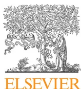
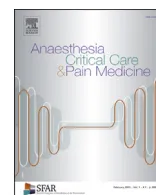

GuidelinesHospital-acquired pneumonia in ICU<sup>☆</sup>


Marc Leone<sup>a,\*</sup>, Lila Bouadma<sup>b</sup>, Bélaïd Bouhemad<sup>c</sup>, Olivier Brissaud<sup>d</sup>, Stéphane Dauger<sup>e</sup>,  
 Sébastien Gibot<sup>f</sup>, Sami Hraiech<sup>g</sup>, Boris Jung<sup>h,i</sup>, Eric Kipnis<sup>j,k</sup>, Yoann Launey<sup>l</sup>,  
 Charles-Edouard Luyt<sup>m</sup>, Dimitri Margetis<sup>n</sup>, Fabrice Michel<sup>o</sup>, Djamel Mokart<sup>p</sup>,  
 Philippe Montravers<sup>q</sup>, Antoine Monsel<sup>r</sup>, Saad Nseir<sup>s</sup>, Jérôme Pugin<sup>t</sup>, Antoine Roquilly<sup>u</sup>,  
 Lionel Velly<sup>v</sup>, Jean-Ralph Zahar<sup>w,x</sup>, Rémi Bruyère<sup>y</sup>, Gérald Chanques<sup>v,z,aa</sup>

<sup>a</sup>Service d'anesthésie réanimation, hôpital Nord, Aix-Marseille université, AP-HM, 13015 Marseille, France

<sup>b</sup>Service de réanimation médicale, hôpital Bichat-Claude-Bernard, 46, rue Henri-Huchard, 75018 Paris, France

<sup>c</sup>Service d'anesthésie réanimation, CHU de Dijon, BP 77908, 21709 Dijon cedex, France

<sup>d</sup>Unité de réanimation pédiatrique, hôpital Pellegrin-Enfants, université Bordeaux II, CHU Pellegrin, place Amélie-Raba-Léon, 33076 Bordeaux, France

<sup>e</sup>Inserm U1141, PICU, Robert-Debré University Hospital, Paris Diderot-Paris 7 University, Assistance publique-hôpitaux de Paris, 48, boulevard Sérurier, 75019 Paris, France

<sup>f</sup>Service de réanimation médicale, hôpital Central, 29, avenue de Lattre-de-Tassigny, 54035 Nancy cedex, France

<sup>g</sup>Service de réanimation des détresses respiratoires et des infections sévères, hôpital Nord, Assistance publique-hôpitaux de Marseille, 13015 Marseille, France

<sup>h</sup>Department of Anaesthesia and Intensive Care, Montpellier University Saint-Eloi Hospital, 34000 Montpellier, France

<sup>i</sup>Inserm U1046, CNRS UMR 9214, PhyMedExp, University of Montpellier, 34000 Montpellier, France

<sup>j</sup>Surgical Critical Care Unit, Department of Anesthesiology and Critical Care, CHU de Lille, 59000 Lille, France

<sup>k</sup>EA 7366, Host-pathogen translational research, université de Lille, 59000 Lille, France

<sup>l</sup>Department of Anesthesia and Critical Care Medicine, Rennes University Hospital, 35000 Rennes, France

<sup>m</sup>Institut de cardiologie, service de réanimation médicale, groupe hospitalier Pitié-Salpêtrière, université Paris 6-Pierre et Marie Curie, Assistance publique-hôpitaux de Paris, 75000 Paris, France

<sup>n</sup>Service de réanimation médicale, hôpital Saint-Antoine, Assistance publique-hôpitaux de Paris, 184, rue du faubourg Saint-Antoine, 75012 Paris, France

<sup>o</sup>Anesthesia and Intensive Care Unit, Timone Children's Hospital, Assistance publique-hôpitaux de Marseille, 13005 Marseille, France

<sup>p</sup>Intensive Care Unit, Paoli-Calmettes Institute, 232, boulevard de Sainte-Marguerite, 13009 Marseille, France

<sup>q</sup>Département d'anesthésie-réanimation, université Paris VII Sorbonne Cité, CHU Bichat-Claude-Bernard, AP-HP, 46, rue Henri-Huchard, 75018 Paris, France

<sup>r</sup>Department of Anesthesiology and Critical Care, University Pierre and Marie Curie, 75000 Paris, France

<sup>s</sup>Department of Intensive Care Medicine, Critical Care Center, CHU of Lille, 59000 Lille, France

<sup>t</sup>Hôpitaux universitaires de Genève, 27230 Geneva, GE, Switzerland

<sup>u</sup>Anaesthesia Intensive Care Unit, centre hospitalier universitaire, 44000 Nantes, France

<sup>v</sup>Département d'anesthésie réanimation, hôpital de la Timone, 13000 Marseille, France

<sup>w</sup>Unité de contrôle et de prévention, du risque infectieux, département de microbiologie clinique, groupe hospitalier Paris Seine Saint-Denis, CHU Avicenne, AP-HP, 125, rue de Stalingrad, 93000 Bobigny, France

<sup>x</sup>Infection Control Unit, IAME, UMR 1137, université Paris 13, Sorbonne Paris Cité, 75000 Paris, France

<sup>y</sup>Service de réanimation, centre hospitalier de Bourg en Bresse, 900, route de Paris, 01000 Bourg-en-Bresse, France

<sup>z</sup>Département d'anesthésie réanimation, hôpital Saint-Eloi, CHU de Montpellier, 80, avenue Augustin-Fliche, 34295 Montpellier cedex 5, France

<sup>aa</sup>Inserm U1046, CNRS UMR 9214, PhyMedExp, université de Montpellier, 34295 Montpellier cedex 5, France

ARTICLE INFOArticle history:

Available online 15 November 2017

ABSTRACT

The French Society of Anesthesia and Intensive Care Medicine and the French Society of Intensive Care edited guidelines focused on hospital-acquired pneumonia (HAP) in intensive care unit (ICU). The goal of 16 French-speaking experts was to produce a framework enabling an easier decision-making process for intensivists. The guidelines were related to 3 specific areas related to HAP (prevention, diagnosis and treatment) in 4 identified patient populations (COPD, neutropenia, postoperative and pediatric). The literature analysis and the formulation of the guidelines were conducted according to the Grade of Recommendation Assessment, Development and Evaluation methodology. An extensive literature research over the last 10 years was conducted based on publications indexed in PubMed<sup>TM</sup> and Cochrane<sup>TM</sup> databases. HAP should be prevented by a standardized multimodal approach and the use of

<sup>☆</sup> Common guideline SFAR – SRLF of the French Society of Anaesthesia and Intensive Care Medicine, French Intensive Care Society, in collaboration with: ADARPEF and GFRUP, Association of French-speaking Anaesthetists and Intensivists, French-speaking Group of Intensive Care and Paediatric emergencies.

<sup>\*</sup> Corresponding author. Service d'anesthésie et de réanimation, hôpital Nord, chemin des Bourrely, 13015 Marseille, France.  
 E-mail address: marc.leone@ap-hm.fr (M. Leone).selective digestive decontamination in units where multidrug-resistant bacteria prevalence was below 20%. Diagnosis relies on clinical assessment and microbiological findings. Monotherapy, in the absence of risk factors for multidrug-resistant bacteria, non-fermenting Gram negative bacilli and/or increased mortality (septic shock, organ failure), is strongly recommended. After microbiological documentation, it is recommended to reduce the spectrum and to prefer monotherapy for the antibiotic therapy of HAP, including for non-fermenting Gram-negative bacilli.

© 2017 The Authors. Published by Elsevier Masson SAS on behalf of Société française d'anesthésie et de réanimation (Sfar). This is an open access article under the CC BY license (<http://creativecommons.org/licenses/by/4.0/>).

### Expert coordinators

SFAR: Marc Leone, service d'anesthésie réanimation, hôpital Nord, Aix-Marseille université, AP-HM, 13015 Marseille, France  
SRLF: Lila Bouadma, Service de réanimation médicale, hôpital Bichat-Claude Bernard, 46, rue Henri-Huchard, 75018 Paris, France

### Organisers

SFAR: Gérald Chanques, département d'anesthésie réanimation, hôpital Saint-Eloi, CHU de Montpellier, 80, avenue Augustin-Fliche, 34295 Montpellier cedex 5, France; Inserm U1046, CNRS UMR 9214, PhyMedExp, université de Montpellier, 34295 Montpellier cedex 5, France

Lionel Velly, département d'anesthésie réanimation, hôpital de la Timone, 13000 Marseille, France

SRLF: Rémi Bruyère, service de réanimation, centre hospitalier de Bourg-en-Bresse, 900, route de Paris, 01000 Bourg-en-Bresse, France

SFAR experts panel: Belaid Bouhemad, Eric Kipnis, Djamel Mokart, Philippe Montravers, Antoine Monsel, Antoine Roquilly  
Belaid Bouhemad: service d'anesthésie réanimation, CHU de Dijon, Dijon, France, BP 77908, 21709 Dijon cedex, France

Eric Kipnis: service d'anesthésie réanimation, CHU de Lille, Lille, France; Recherche Translationnelle Relations Hôte-Pathogènes, EA 7366, université de Lille, Lille, France

Djamel Mokart: Service réanimation, Institut Paoli-Calmettes, 232, boulevard de Sainte-Marguerite, 13009, Marseille, France

Philippe Montravers: département d'anesthésie-réanimation, CHU Bichat-Claude-Bernard, AP-HP, université Paris VII Sorbonne Cité, 46, rue Henri-Huchard, 75018 Paris, France

Antoine Monsel: service d'anesthésie réanimation, université Pierre and Maris Curie, Paris, France

Antoine Roquilly: service d'anesthésie réanimation, centre hospitalier universitaire, Nantes, France

SRLF experts panel: Sébastien Gibot, Sami Hraiech, Boris Jung, Charles-Edouard Luyt, Saad Nseir, Jérôme Pugin, Jean-Ralph Zahar  
Sébastien Gibot: service de réanimation médicale, hôpital Central, 29, avenue de Lattre-de-Tassigny, 54035 Nancy cedex, France

Sami Hraiech: hôpital Nord, réanimation des détresses respiratoires et des infections sévères, Assistance publique-hôpitaux de Marseille, 13015, Marseille, France

Boris Jung: service d'anesthésie réanimation, hôpital universitaire Saint-Eloi Montpellier, Montpellier, France; Inserm U1046, CNRS UMR 9214, PhyMedExp, université de Montpellier, Montpellier, France

Charles-Edouard Luyt: service de réanimation médicale, institut de cardiologie, université Paris 6-Pierre et Marie Curie, groupe hospitalier Pitié-Salpêtrière, Assistance publique-hôpitaux de Paris, Paris, France

Saad Nseir: service d'anesthésie réanimation, Critical Care Center, CHU of Lille, Lille, France

Jérôme Pugin: hôpitaux universitaires de Genève, 27230, Geneva, GE, Switzerland

Jean-Ralph Zahar: unité de contrôle et de prévention du risque infectieux, département de microbiologie clinique, groupe hospitalier Paris Seine Saint-Denis, CHU Avicenne, AP-HP, 125, rue de

Stalingrad, 9300, Bobigny; Infection Control Unit, IAME, UMR 1137, Université Paris 13, Sorbonne Paris Cité, Paris, France

Pediatric experts panel (ADARPEF and GFRUP): Olivier Brissaud, Stéphane Dauger, Fabrice Michel

Olivier Brissaud: unité de réanimation pédiatrique, hôpital Pellegrin-Enfants, université Bordeaux II, CHU Pellegrin, place Amélie-Raba-Léon, 33076 Bordeaux, France

Stéphane Dauger: Inserm U1141, PICU, Robert-Debré University Hospital, Paris Diderot-Paris 7 University 48, boulevard Sérurier, Assistance publique-hôpitaux de Paris, 75019, France

Fabrice Michel: service d'anesthésie réanimation, hôpital pour enfants La Timone, Assistance publique-hôpitaux de Marseille, Marseille, France

Bibliographic experts: Yoann Launey, Dimitri Margetis

Yoann Launey: service d'anesthésie réanimation, hôpital universitaire de Rennes, Rennes, France

Dimitri Margetis: service de réanimation médicale, hôpital Saint-Antoine, Assistance publique-hôpitaux de Paris, 184, rue du faubourg Saint-Antoine, 75012, Paris, France

### Reviewer panels

SFAR Guidelines committee: Dominique Fletcher (President), Lionel Velly (Secretary), Julien Amour, Sylvain Ausset, Gérald Chanques, Vincent Compere, Fabien Espitalier, Marc Garnier, Etienne Gayat, Philippe Cuvillon, Jean-Marc. Malinovski, Bertrand Rozec

SRLF Guidelines and evaluation committee: Max Guillot (Secretary), Naïke Bigé, Laetitia Bodet-Contentin, Rémi Bruyère, Henri Faure, Erwan L'Her, Eric Mariotte, Virginie Maxime, Chirine Mossadegh, Vincent Peigne, Fabienne Plouvier, Elie Zogheib

Guidelines reviewed and endorsed by the SFAR (29/06/2017) and SRLF boards (08/06/2017).

## 1. Introduction

Hospital-acquired pneumonia (HAP) is the most common infection in the intensive care unit (ICU). This infection encompasses two different entities: pneumonia associated with mechanical ventilation (ventilator-associated pneumonia or VAP) and severe pneumonia developed during the hospital stay. The incidence of VAP ranges from 1.9 to 3.8 per 1000 days of mechanical ventilation in the US and exceeds 18 per 1000 days of mechanical ventilation in Europe [1].

Nosocomial pneumonia is the most common infection in ICU, when considering the timing of these infections. Non-ventilator HAP occurs in patients admitted to the hospital for at least 48 hours and VAP is defined as occurring more than 48 hours after the initiation of mechanical ventilation. Accurate data on their epidemiology are limited by the lack of standardised diagnostic criteria. In the US, the incidence of non-ventilator-HAP was 1.6%, representing a rate of 3.63 per 1000 patient-days [2], while the definition of VAP is not altered by considering time after admission to the hospital and the incidence remain as mentioned above [1].

In the ICU, HAP is associated with an approximate mortality rate of 20% [3]. However, the mortality attributable to HAP isestimated between 5 and 13% [3]. The attributable mortality is probably higher in some specific populations such as patients with chronic obstructive pulmonary disease (COPD) [1]. In other populations such as trauma patients, HAP seems to have only a minor effect on mortality [1]. Even though the direct impact of this infection on mortality remains debated, it is nonetheless associated with increased morbidity through increased duration of mechanical ventilation (or decrease in ventilator-free days) and increased ICU and hospital length-of-stay [1]. As a result, HAP is also responsible for an overuse of healthcare resources (ventilation, ICU and hospital beds and resources). Finally, it is associated with increased costs related to hospital stay [4].

To date, the French Society of Anaesthesia and Intensive Care Medicine (SFAR) and the French Society of Intensive Care (SRLF) have not proposed guidelines focused on HAP. Sixteen French-speaking experts were selected by an organising committee, itself appointed by the guideline committees of each participating society, following approval by their respective boards. Two independent bibliographic experts analysed the literature of the past 10 years in the field using pre-defined keywords.

Recent American and European guidelines have been published ([http://www.id society.org/Guidelines/Patient\\_Care/IDSA\\_Practice\\_Guidelines/Infections\\_by\\_Organ\\_System/Lower/Upper\\_Respiratory/Hospital-Acquired\\_\\_\\_Ventilator\\_-\\_Associated\\_Pneumonia\\_\(HAP/VAP\)/](http://www.id society.org/Guidelines/Patient_Care/IDSA_Practice_Guidelines/Infections_by_Organ_System/Lower/Upper_Respiratory/Hospital-Acquired___Ventilator_-_Associated_Pneumonia_(HAP/VAP)/)). However, both the SFAR and SRLF wished to share their own interpretation encompassing data from recently available publications. The boards of both societies designated an organising committee, which appointed a panel of sixteen French-speaking experts. Two members of the panel oversaw a literature search using pre-defined keywords limited to the past decade.

## 2. Guidelines goals

The goal of these experts' guidelines is to generate a framework enabling an easier decision-making process for intensivists. The group worked to produce a minimal number of guidelines in order to highlight the key points to focus on in each area. When in doubt, published data prevailed over expert opinion. The basic rules of universal medical good practices – hygiene, antibiotic therapy, comprehensive care – were considered as known and excluded from the scope of the guidelines.

## 3. Definitions

The criteria to diagnose pneumonia are shown in Table 1. In clinical practice, HAP is suspected when a patient presents with fever, impaired oxygenation and suppurative secretions.

Non-ventilator HAP occurs after 48 h of hospital stay and VAP occurs after 48 h of mechanical ventilation [5]. By definition, neither is present nor incubating at hospital admission nor at the onset of mechanical ventilation. The onset of either HAP or VAP relative to hospital admission discriminates early pneumonia

**Table 1**  
Criteria for defining pneumonia.

<table border="1">
<tbody>
<tr>
<td>Radiological signs</td>
</tr>
<tr>
<td>Two successive chest radiographs showing new or progressive lung infiltrates</td>
</tr>
<tr>
<td>In the absence of medical history of underlying heart or lung disease, a single chest radiograph is enough</td>
</tr>
<tr>
<td>And at least one of the following signs</td>
</tr>
<tr>
<td>Body temperature &gt; 38,3°C without any other cause</td>
</tr>
<tr>
<td>Leukocytes &lt; 4000/mm<sup>3</sup> or ≥ 12000/mm<sup>3</sup></td>
</tr>
<tr>
<td>And at least two of the following signs</td>
</tr>
<tr>
<td>Purulent sputum</td>
</tr>
<tr>
<td>Cough or dyspnea</td>
</tr>
<tr>
<td>Declining oxygenation or increased oxygen-requirement or need for respiratory assistance</td>
</tr>
</tbody>
</table>

(< 5 days) from late pneumonia (≥ 5 days). Microbiologically confirmed HAP was defined as the definitive identification of a microorganism isolated from respiratory samples or in blood cultures in a patient with suspected pulmonary infection.

## 4. Microbiological confirmation

The pathogens usually responsible for HAP are Enterobacteriaceae, *Staphylococcus aureus*, *Pseudomonas aeruginosa* and *Acinetobacter baumannii* [1]. The infection is polymicrobial in 30% of cases. In early pneumonia, the most frequently identified pathogens are methicillin susceptible *S. aureus*, *Streptococcus pneumonia* and *Haemophilus influenza* [1].

Microbiological confirmation is a crucial step in the diagnosis of HAP. Routinely, it is based on the qualitative or quantitative cultures of respiratory samples. A pathogen is isolated from these samples and identified in about 70% of suspected cases [1]. Other biological tests can be carried out to support the microbiological diagnosis such as blood cultures and antigenuria. Molecular biology techniques applied to routine microbiology are still being assessed and outside of the scope of these guidelines.

## 5. Method

### 5.1. General organisation

These guidelines are the result of the work provided by a panel of experts, brought together by the SFAR and the SRLF. Each expert was required to file a conflict-of-interest disclosure prior to participation in establishing the guidelines. The stated mission was to produce guidelines in three specific areas related to HAP: prevention, diagnosis and treatment as well as the specificities pertaining to different identified patient populations (COPD, neutropenia, postoperative and pediatric).

The schedule of the group was defined upstream (Table 2). First, the organisation committee and the guideline coordinators defined the questions to be addressed by the panelists. It then appointed experts in charge of each question. The questions were formulated according to the Patients, Intervention Comparison Outcome (PICO) format following a first meeting of the expert panel. The literature analysis and the formulation of the guidelines were then conducted according to the Grade of Recommendation Assessment, Development and Evaluation (GRADE) methodology. A level-of-evidence was defined for each reference cited according to the type of study. This level-of-evidence could be re-evaluated taking into account the methodological quality of the study. Overall “strong” level-of-evidence resulted in formulating a “strong” recommendation (“we recommend...” or “we recommend not...”; GRADE 1+ or 1–). Overall moderate, weak or very weak level-of-evidence resulted in formulating an “optional” recommendation (“we suggest...”, “we suggest not...”; GRADE 2+ or 2–). In the absence of supporting literature, a question could be addressed by a recommendation under the form of an expert opinion (“the experts suggest that...”). Recommendation proposals were presented to the entire panel and discussed one-by-one. The goal was not to obtain consensus on all the proposals, but to

**Table 2**  
Guideline timeline.

<table border="1">
<tbody>
<tr>
<td>December 5th 2016</td>
<td>Start-up meeting</td>
</tr>
<tr>
<td>March 6th 2017</td>
<td>Vote: first round</td>
</tr>
<tr>
<td>March 13th 2017</td>
<td>Post-vote deliberation meeting</td>
</tr>
<tr>
<td>April 1st 2017</td>
<td>Vote: second round</td>
</tr>
<tr>
<td>April 16th 2017</td>
<td>Amendment of two guidelines</td>
</tr>
<tr>
<td>April 28th 2017</td>
<td>Vote of the two amended guidelines</td>
</tr>
<tr>
<td>May 10th 2017</td>
<td>Guideline finalisation meeting</td>
</tr>
</tbody>
</table>identify points of agreement and disagreement or indecision. Each recommendation was then evaluated by each expert rated using a scale from 1 (complete disagreement) to 9 (complete agreement). Collective rating was established according to a GRADE grid methodology. To validate a recommendation on a criterion, at least 50% of experts had to have concordant opinions, while less than 20% of them had to have discordant opinion. For a recommendation to be strong, at least 70% of participants had to have concordant opinions. Without strong agreement, recommendations were rephrased and resubmitted to reach a consensus.

### 5.2. Areas of guidelines

Three areas related to HAP were: prevention, diagnosis and treatment with population-specific considerations. Four relevant specific populations were considered in the guidelines analyses (COPD, neutropenia, postoperative and pediatric). An extensive literature research over the last 10 years was conducted based on publications indexed in PubMed<sup>TM</sup> and Cochrane<sup>TM</sup> databases. To be considered for analysis, publications had to be written in English or in French. It was decided ahead of the analysis to limit the number of expert opinions and to not produce recommendations that are not supported by literature. The analysis was focused on recent data, according to decreasing hierarchical prioritisation of data from meta-analyses of randomised controlled trials (RCTs) or individual RCTs to observational studies. Study sample size and the relevance of the research were considered at the level of each study.

### 5.3. Synthesis of results

The expert panel analyses and application of the GRADE method led to 15 guidelines (and two specific guidelines for the pediatric population) and four care protocols. Among the 15 formalised guidelines for adults, three have a high level-of-evidence (GRADE 1+/–) and 11 a low level-of-evidence (GRADE 2+/–). For one recommendation, the GRADE method could not be applied, resulting an expert opinion. Both paediatric guidelines had a weak level-of-evidence (GRADE 2). The four care protocols, provided only as an indication, are based on expert opinions but were submitted to the same rating and agreement process as the guidelines. After two rounds of rating and one amendment, a strong agreement was reached for all guidelines and protocols.

#### First area, PREVENTION:

##### Which HAP prevention approaches decrease morbidity and mortality in ICU patients?

#### R1.1 – We recommend using a standardised multimodal HAP prevention approach in order to decrease ICU patient morbidity.

##### GRADE 1+, STRONG AGREEMENT

##### Evidence summary and rationale for the recommendation:

The implementation of standardised protocols is associated with a decrease in ICU morbidity [6–10]. In before/after studies, the implementation of a multimodal prevention strategy and the adherence to a standardised multimodal approach are associated with a decrease in HAP [11] and in the duration of mechanical ventilation, provided that an early weaning strategy is part of the approach [12]. Experts suggest increasing prevention measures, and applying costly measures to patients with a high risk of HAP and death, such as COPD patients [13] or immunosuppressed patients.

#### R1.1 Paediatrics – We suggest using a standardised multimodal approach aiming at preventing HAP in order to decrease pediatric ICU patient morbidity.

##### GRADE 2+, STRONG AGREEMENT

##### Evidence summary and rationale for the recommendation:

Eight monocentric before/after or cohort studies suggest that implementing and applying standardised HAP prevention protocols in pediatric ICU patients are of interest in order to reduce the occurrence of HAP and associated morbidity [14–21].

#### R1.2 – In units where multidrug-resistant bacteria prevalence is low (< 20%), we suggest applying routine selective digestive decontamination using a topical antiseptic administered enterally and a maximal 5-day course of systemic prophylactic antibiotic to decrease mortality.

##### GRADE 2+, STRONG AGREEMENT

##### Evidence summary and rationale for the recommendation:

Meta-analyses of RCTs comparing selective digestive decontamination (SDD) to standard care show a significant decrease in hospitality mortality, lengths of mechanical ventilation and HAP incidence in ICU patients [22]. In a sub-group analysis from a multicentre trial, the effect of SDD on mortality decrease was similar in medical and surgical patients [23]. In the sub-group analysis of a meta-analysis of RCTs on pneumonia prevention strategies, the effect of SDD on the decrease in mortality was only observed for strategies including a topical antiseptic administered enterally and systemic prophylactic antibiotic use [24]. The effect of SDD on the decrease in mortality was greater in patients with high overall mortality, demonstrating greater efficiency in the more critically ill [24]. In the sub-group analysis of a large multicenter trial, SDD was associated with a decrease in the acquisition of multidrug resistant bacteria [25]. No link between SDD and the development of bacterial resistance in ICU patients was shown in a meta-analysis or in a randomised-controlled trial comparing SDD to standard care [26]. It is probably best to limit the duration of systemic antibiotic therapy in SDD protocols to a maximum of 5 days, because prolonged antibiotic therapy may lead to the emergence of multidrug-resistant bacteria [27].

The major studies that have demonstrated the efficiency of SDD were conducted in environments where the prevalence of multiresistant bacteria was low [25]. It is therefore recommended to follow the effects of this prevention strategy on the local bacterial ecology on a regular basis. Consequently, we cannot recommend such a strategy in units where the prevalence of multiresistant bacteria is high.

#### R1.3 – Within a standardised multimodal HAP prevention approach, we suggest combining some of the following methods to decrease ICU patient morbidity:

- • promote the use of non-invasive ventilation to avoid tracheal intubation (mainly in post-operative digestive surgery patients and in patients with COPD);
- • favor orotracheal over nasotracheal intubation when required;
- • limit dose and duration of sedatives and analgesics (promote their use guided by sedation/pain/agitation scales, and/or daily interruptions);
- • initiate early enteral feeding (within the first 48 hours of ICU admission);
- • regularly verify endotracheal tube cuff pressure;
- • perform sub-glottic suction (every 6 to 8 hours) using an appropriate endotracheal tube.**GRADE 2+, STRONG AGREEMENT****Evidence summary and rationale for the recommendation:**

Within multimodal HAP prevention approaches, methods with an effect on patient morbidity should be favored, in particular those with an effect on length of mechanical ventilation (ventilator-free days), ICU and hospital lengths-of-stay and use of antibiotics.

For each of the methods proposed above, a significant decrease in the risk of HAP and/or in the length of mechanical ventilation and/or in ICU/hospital length-of-stay were reported in:

- • a meta-analysis of RCTs comparing non-invasive and invasive ventilation [28], a RCT including patients in postoperative digestive surgery patients of [29] and two meta-analyses focused on weaning from mechanical ventilation in patients with COPD [30,31];
- • two before/after studies on the implementation of a sedation protocol titrated by nurses [32,33];
- • three meta-analyses of RCTs comparing early enteral feeding (initiated before 48 h) to late feeding [34–36];
- • RCTs comparing continuous to discontinuous monitoring of tracheal intubation tube cuff pressures [37–39];
- • two meta-analyses comparing sub-glottic suction to standard care [40,41]. Tracheal intubation tubes with sub-glottic suction may also have a positive cost-benefit ratio;
- • a randomised study comparing nasotracheal versus orotracheal intubation [42].

**R1.4 – Within a standardised multimodal HAP prevention approach, we suggest not using the following methods to decrease ICU patient morbidity:**

- • systematic early (< day 7) tracheotomy (except for specific indications);
- • anti-ulcer prophylaxis (except for specific indications);
- • post-pyloric enteral feeding (except for specific indications);
- • administration of probiotics and/or synbiotics;
- • early systematic change of the humidifier filter (except for specific manufacturer recommendations);
- • use of closed suctioning systems for endotracheal secretions;
- • use of antiseptic-coated intubation tubes or with tubes an “optimised” cuff shape;
- • selective oro-pharyngeal decontamination (SOD) with povidone-iodine;
- • use of prophylactic nebulised antibiotics;
- • daily skin decontamination using antiseptics.

**GRADE 2–, STRONG AGREEMENT****Evidence summary and rationale for the recommendation:**

Although some of the abovementioned strategies have been associated with significant decrease in the risk of HAP, no reduction in morbidity (length of mechanical ventilation or ICU/

hospital length-of-stay) or in mortality was demonstrated with the use of these strategies individually. However, it is possible that their combined use in prevention bundles may have some beneficial effect on patient morbidity. However, there is lack of available data in the literature to support this hypothesis. Experts do not take position against these HAP prevention techniques, but their first line use is not recommended, either because of cost or potential adverse effects.

Thus, no beneficial impact in terms of HAP was found for the following:

- • early tracheotomy (before day-5 following ICU admission) compared to late tracheotomy (after day-14) apart from specific indications [43,44];
- • the use of oro-pharyngeal decontamination using povidone-iodine (and potential toxic effects) [45];
- • anti-ulcer prophylaxis use (apart from specific indication) compared to none [46];
- • post-pyloric enteral compared to gastric enteral feeding [47];
- • enteral administration of probiotics or synbiotics [48–50];
- • enclosed tracheal suction systems compared to conventional open tracheal suctioning [51];
- • endotracheal intubation tubes lined/coated or incorporating silver or antiseptics compared to standard tubes [52] and conical-shaped cuffs compared to standard cuffs [53];
- • nebulised prophylactic antibiotics during invasive ventilation [24];
- • systematic change of heat and moisture exchangers [54,55];
- • routine antiseptic baths for ICU patients [56,57].

**R1.5 – In weaning of COPD patients from ventilation, we suggest using non-invasive ventilation to reduce length of invasive mechanical ventilation, incidence of HAP, morbidity and mortality.****GRADE 2+, STRONG AGREEMENT****Evidence summary and rationale for the recommendation:**

Invasive mechanical ventilation is the most important risk factor for VAP. Several studies have analysed the role of non-invasive ventilation (NIV) within the process of weaning from mechanical ventilation. Their goals were the reduction of the length of invasive mechanical ventilation and in VAP incidence. Two meta-analyses [30,31] assessed the impact of NIV, as a means of rapid weaning from invasive mechanical ventilation, on the incidence of VAP.

In the first meta-analysis (9 studies, 632 patients with COPD), NIV reduces the risks of mortality (risk ratio [RR]: 0.36; confidence interval [CI] at 95% [0.24–0.56];  $I^2 = 0\%$ ), mechanical ventilation weaning failure (RR: 0.52; CI 95% [0.36–0.74];  $I^2 = 0\%$ ) and VAP (RR: 0.22; CI 95% [0.13–0.37];  $I^2 = 3\%$ ) [30].

The second meta-analysis included 17 studies (959 patients with COPD). It found a significant decrease in risk of mortality (RR: 0.27; CI 95% [0.17–0.42];  $I^2 = 0\%$ ), mechanical ventilation weaning failure (RR: 0.25; CI 95% [0.14–0.45];  $I^2 = 0\%$ ) and VAP (RR: 0.18; CI 95% [0.12–0.27];  $I^2 = 0\%$ ) [31]. However, this meta-analysis had several issues:

- • several studies included in this meta-analysis were not randomised;- • number of patients included in most of the studies was under 50;
- • definition of VAP was not the same in every study.

## Second area, DIAGNOSIS:

### What methods to diagnose HAP should be used to decrease ICU patient morbidity and mortality?

#### R2.1 – We suggest not using the clinical scores (CPIS, modified CPIS) for diagnosing HAP.

##### GRADE 2–, STRONG AGREEMENT

##### Evidence summary and rationale for the recommendation:

The performance of the clinical pulmonary infection score (CPIS) in the diagnosis of pneumonia depends on the comparator. Its sensibility and specificity vary from 60 to 80% compared to microbiological samples obtained by bronchoalveolar lavage [58–61]. The diagnostic performances are low when the comparator is based on histology and pathology of post-mortem lung biopsies in autopsy series [62]. The performance of the CPIS depends on the pre-test probability of pneumonia [63]. Nevertheless, CPIS variation over time may be useful in pneumonia resolution [64] and antibiotic de-escalation [65,66]. Initial CPIS at HAP onset has little value in predicting patient outcomes, as compared to severity scores [67].

#### R2.2 – We suggest collecting microbiological airway samples, regardless of type, before initiation of or any change in antibiotic therapy.

##### GRADE 2+, STRONG AGREEMENT

##### Evidence summary and rationale for the recommendation:

A meta-analysis comparing different airway samples (endotracheal aspirates, protected specimen brush and bronchoalveolar lavage) and microbiological culture methods (quantitative or not) found no significant effect on patient outcomes (28-day mortality, ventilator-free days, or length-of-stay) nor antibiotic treatment [68]. Therefore, both sampling and culture methods are left to the discretion of clinicians according to strategic choices at the unit, department or institutional levels. There are little data specifically addressing the effect of sampling and culture methods on antibiotic consumption or antibiotic-free days. One study found an approximate increase of 2 antibiotic-free days with invasive compared to non-invasive airway sampling [69]. In the absence of any true gold standard, using post-mortem histology and pathology findings upon autopsy as gold-standard surrogates suggests a slightly greater diagnostic performance of quantitative cultures, regardless of airway sample type. Indeed, in the various autopsy case series summarised in the 2016 IDSA/ATS guidelines [70] and in a dedicated meta-analysis [71]: (a) quantitative culture, regardless of airway sample type had a diagnostic odds-ratio (DOR) > 1, i.e. could establish a diagnosis in the presence of pneumonia, albeit with a high variation in DOR ranging from close to 1 to much higher, whereas (b) semi- or non-quantitative cultures had a low DOR, sometimes < 1, i.e. a high probability of establishing a diagnosis in the absence of pneumonia, and (c) all positive likelihood ratios (LR+) were low, close to 0.5, i.e. even in the case of high prevalence there would be a low post-test probability (40–50%) of establishing a diagnosis compared to pre-test suspected diagnosis regardless of culture method and thresholds. Therefore, there may be an advantage to quantitative cultures in establishing the diagnosis and there may be an advantage to invasive sampling in increasing antibiotic-free days. While obtaining airway samples should not delay initiation of antibiotic treatment in severe

cases and/or acute respiratory distress syndrome (c.f. R3.1) and it remains essential to guiding and/or de-escalating antibiotic therapy when microbiological identification is achieved (c.f. R3.6).

In onco-hematology patients admitted to the ICU for respiratory distress, lack of an established diagnosis is significantly associated with increased mortality [72]. However, in these patients the diagnosis is most often HAP, in two-thirds of the cases [73]. In a randomised trial, 119 onco-hematology patients admitted to the ICU for respiratory distress, among which 31% were neutropenic, invasive lower respiratory tract sampling (BAL) compared to non-invasive sampling was not associated with increased risk of intubation nor increased mortality, neither was there any difference in diagnostic yield between sampling methods, around 80% [74].

#### R2.2 Paediatrics – We suggest collecting microbiological airway samples, regardless of type, before initiation of or any change in antibiotic therapy.

##### GRADE 2+, STRONG AGREEMENT

##### Evidence summary and rationale for the recommendation:

Labenne et al. compared protected distal brush and blind bronchoalveolar lavage samples for VAP diagnosis [75]. Of the 103 patients, 29 were diagnosed with VAP. The combination of brushing with culture of the blind bronchoalveolar lavage sample and a bacteriological index (BI) resulted in a sensitivity (Se) of 90% and a specificity (Sp) of 88% for VAP diagnosis. Gauvin et al. compared several types of microbiological samples and qualitative or quantitative culture methods for VAP diagnosis, using the 1988 CDC VAP diagnosis criteria [76]. The best performing method for the diagnosis of VAP was the bacteriological index, BI > 5 (Se 78%, Sp 86%, positive predictive value, PPV of 70%, and negative predictive value, NPV of 90%) but the number of VAP was low. Sachdev et al. prospectively found in 30 patients a superiority of protected distal samples compared to endotracheal aspirates to diagnose HAP [77]. The same authors confirmed the excellent reproducibility of protected distal samples in 34 children with VAP, both for the cellular analysis and bacteriological diagnosis [78]. From 335 samples obtained prospectively in 61 children, Willson et al. reported the lack of usefulness of tracheal samples for VAP diagnosis, suggesting that the distinction between colonisation and infection is challenging [79].

To summarise, since endotracheal tube and upper airway colonisation occur rapidly following intubation, the use of protected distal samples may provide superior specificity to endotracheal aspirates. In the absence of any demonstrated impact on outcomes, the choice of airway sampling and culture methods depends on the environment, institutional and departmental strategic choices, taking into account the appropriate threshold of the chosen method when paired with quantitative cultures.

#### R2.3 – We suggest not measuring plasma or alveolar levels of procalsitonin or soluble TREM-1 to diagnose HAP.

##### GRADE 2–, STRONG AGREEMENT

##### Evidence summary and rationale for the recommendation:

Eight studies have assessed the contribution of measuring procalsitonin (PCT) plasma concentrations to the diagnosis of HAP, on their own or in combination with clinical criteria [80–87]. A total of 589 patients were included for a pneumonia prevalence of 55% and the following test characteristics: Se = 54% (48–59%), Sp = 67% (51–73%), PPV = 67% and NPV = 54%. The positive likelihood ratio (LR+) was 1.65 and negative likelihood ratio (LR–) 0.68. These performances are insufficient to contribute to the diagnosis decision process. Diagnostic test thresholds varied, ranging from 0.15 to 3.9 ng/mL.Seven studies assessed the contribution of alveolar concentrations of the soluble form of the Triggering Receptor Expressed on Myeloid cells-1 (sTREM-1) to the diagnosis of HAP [87–93]. A total of 317 patients were included for a prevalence of 48%. The sTREM-1 test characteristics were: Se = 83% (76–89%) and the Sp = 77% (69–83%), resulting in a PPV of 77% and a NPV of 83%, a LR+ of 3.56 and LR– of 0.22. Even if these performances seem interesting, mainly for the exclusion of the diagnosis, the diagnostic thresholds varied widely, ranging from 5 to 900 pg./Mr. This could be explained by different and non-standardised dosage techniques, excluding the possibility of using this test in clinical practice at the moment.

It is surprising to observe the low number of patients included in these biomarker studies (PCT or sTREM-1), contributing to their poor robustness.

### Third area, TREATMENT:

#### What therapeutic options for HAP should be used to decrease ICU patient morbidity and mortality?

**R3.1 – We suggest immediately collecting samples and initiating antibiotic treatment taking into consideration risk factors for multidrug resistant bacteria in patients with suspected HAP and haemodynamic or respiratory compromise (shock or acute respiratory distress syndrome) or frailty such as immunosuppression.**

#### GRADE 2+, STRONG AGREEMENT

##### Evidence summary and rationale for the recommendation:

The urgent need for antibiotics in septic shock does not fall within the scope of these guidelines. Clinicians should consult current guidelines on the management of septic shock. The immunosuppressed patients receive specific treatment.

In HAP, no RCT has compared a strategy based on early empirical antibiotic therapy to definitive antibiotic therapy after pathogen isolation, identification and susceptibility testing on patient outcomes, with stratification on pre-test diagnosis probability and clinical severity. However, several observational studies and a meta-analysis have shown that inappropriate initial antibiotic therapy, i.e. ineffective according to susceptibility testing of the causal pathogen, was associated with worse outcomes (length of mechanical ventilation, length-of-stay and mortality), suggesting that the appropriate empirical antibiotic therapy is associated with improved outcomes [94–99].

**R3.2 – We recommend treating HAP in mechanically-ventilated immunocompetent patients empirically by a monotherapy, in the absence of risk factors for multidrug-resistant bacteria, non-fermenting Gram negative bacilli and/or increased mortality (septic shock, organ failure).**

#### GRADE 1+, STRONG AGREEMENT

##### Evidence summary and rationale for the recommendation:

We identified three RCTs published over the last ten years [100–102] and a meta-analysis [103] of these three studies (including a prior study [104]) including 1163 patients. They compared monotherapy vs. combined therapy. All studies reported on the impact of combined therapy on mortality. Only two reported on clinical cure and the incidence of adverse effects [100,104]. No difference between monotherapy and combined therapy was found in terms of mortality (odds ratio [OR]: 0.97; IC 95% [0.73–1.30]), clinical cure (OR: 0.88; IC 95% [0.56–1.36]), ICU length-on-stay (OR: 0.65; IC 95% [0.07–1.23]), or adverse effects (OR: 0.93; IC 95% [0.68–1.26]). The moderate methodological quality mainly comes from the inaccuracy of the results and/or the heterogeneity of studies included in the meta-analysis. We decided to grade this recommendation as strong in spite of a moderate overall methodological quality

because of: a convergence of published studies towards the absence of benefit of combined therapy, the high relevance of the endpoints studied in the studies, and data demonstrating adverse effects of combined therapy in terms of increased toxicity, emergence of resistance and cost [105,106]. However, several elements issues remain:

- • the methodological quality of analysed trials in the meta-analysis ranges from moderate (mortality, ICU length-of-stay, adverse effects) to very low (clinical cure);
- • the number and size of studies are limited. In fact, if the mortality analysis is based on four studies ( $n = 1163$ ), the other judgment criteria are analysed using two studies ( $n = 350$  for clinical recovery;  $n = 921$  for adverse effects;  $n = 813$  for ICU length-of-stay);
- • observational studies and a few controlled studies have suggested that in the presence of multidrug-resistant bacteria [102] or non-fermenting Gram-negative bacilli [107–110], the risk of an inappropriate empirical antibiotic therapy is higher, resulting in higher mortality, and ICU or hospital length-of-stay.

Empirical combined therapy increases the rate of appropriate empirical antibiotic therapy in VAP caused by multidrug-resistant bacteria [102,109]. It is therefore important to systematically screen for risk factors to develop an infection or to the carrying of multidrug-resistant (MDR) bacteria or non-fermenting Gram-negative bacilli, mainly *Pseudomonas aeruginosa*.

The established risk factors for *Pseudomonas aeruginosa* pneumonia are COPD, bronchiectasis and cystic fibrosis. The risk factors associated with MDR bacteria airway colonisation and HAP are [70]:

- • antibiotic therapy in the previous 90 days;
- • a hospital stay of more than 5 days prior to suspected HAP;
- • renal replacement therapy requirement during HAP;
- • septic shock;
- • ARDS.

In the presence of at least one of these risk factors, combined empirical therapy is indicated. However, after pathogen identification and susceptibility testing, no study has shown that pursuing combined therapy remains beneficial in VAs, including VAP due to *Pseudomonas aeruginosa* [70,103,111].

- • Finally, for a given patient, a predictable mortality rate above 25% probably remains an indication for combined empirical antibiotic therapy. In a meta-analysis including observational and randomised studies, a benefit to combined therapy is found in terms of mortality (31% vs. 41%; hazard ratio: 0.71; IC 95% [0.57–0.89]) in patients with sepsis due to lung infection [112]. These results have to be taken cautiously since they depend on the spectrum of the primary antibiotic; combination therapy yielded no advantage when the primary antibiotic was itself a broad-spectrum antibiotic. This meta-analysis also showed that combined therapy in patientswith low expected mortality rate (< 10%) tends to have deleterious consequences. The recommendation is therefore quite limited since it only applies to immunocompetent patients, without any risk factor for multi-drug-resistant bacteria, and at low risk of mortality. In the presence of one or several of such risk factors, empirical combined therapy is probably indicated before pathogen identification and susceptibility testing results are available.

### **R3.3 – The experts suggest not systematically directing empirical antibiotic therapy against methicillin-resistant *Staphylococcus aureus* in the treatment of HAP.**

#### **EXPERTS OPINION, STRONG AGREEMENT**

##### **Evidence summary and rationale for the recommendation:**

A study randomising patients treated empirically with an antibiotic regimen including or not an antibiotic active against methicillin-resistant *Staphylococcus aureus* (MRSA) did not show any difference between the two strategies in terms of length-of-stay and mortality [113]. An observational and prospective study found a decrease in mortality in patients who had received an empirical antibiotic therapy including vancomycin [114]. The prevalence of MRSA VAP (15%) supports this result. The literature suggests that inappropriate empirical antibiotic therapy plays a major part in the mortality of patients with MRSA HAP [115]. However, a study found an increase in ICU length-of-stay in patients with MRSA HAP, independently from the adequacy of the empirical treatment [116]. The adequacy of the empirical antibiotic therapy is a critical factor for survival and the length-of-stay [113,117]. A randomized controlled study highlighted an increase in MRSA emergence in patients treated empirically with vancomycin [113]. This encourages highly selecting patients to be treated empirically with an antibiotic directed against MRSA.

In conclusion, only one study conducted in an environment in which the prevalence of MRSA was high (15% of VAP episodes) showed an association between the empirical use of an antibiotic against MRSA and an improvement in HAP outcomes. There is therefore no rationale for the systematic empirical use of an antibiotic against MRSA in France, the prevalence being lower than 3% [118]. However, the consideration of the local ecology is important. Some risk factors encourage including an antibiotic active against MRSA in the empirical antibiotic therapy of HAP, without the possibility to establish an exhaustive list (experts' opinion):

- • high local prevalence of MRSA;
- • recent colonisation by MRSA;
- • chronic skin lesions;
- • chronic renal replacement therapy.

### **R3.4 – We suggest reducing the spectrum and preferring monotherapy for the antibiotic therapy of HAP after microbiological documentation, including for non-fermenting Gram-negative bacilli.**

#### **GRADE 2+, STRONG AGREEMENT**

##### **Evidence summary and rationale for the recommendation:**

Both reducing the spectrum and preferring a monotherapy for the antibiotic therapy of HAP after documentation are encompassed by the term “de-escalation”. De-escalation is possible as soon as the microbiological results are obtained. Nine studies and a meta-analysis address this question. A meta-analysis by Silva et al. did not draw conclusions regard-

ing safety and efficacy of de-escalation [119]. Two randomized open controlled studies compared mortality in a “de-escalation” compared to a “control” group [113,120]. These two studies did not find any significant difference in overall mortality between the two strategies.

Kim et al. found an increase in mortality in the de-escalation group for MRSA documented VAP. Seven observational studies have also compared the de-escalation to the maintenance of the initial antibiotic regimen in terms of mortality. In three prospective studies [114,121,122] and a retrospective study [123], mortality decreased in the de-escalation group. Finally, three retrospective studies [124–127] did not find any mortality difference between the two strategies. The ICU length-of-stay was prolonged (non-inferiority not obtained) in the de-escalation group of a randomised study [120]. On the contrary, a prospective observational study found an association between a shorter ICU length-of-stay and de-escalation [122].

The risk of relapse associated with de-escalation remained unchanged in two observational studies [126,127] and increased in one randomised [120] and one retrospective study [124]. In a randomised study, de-escalation was associated with an increase in the duration of antibiotic treatment, even though less active antibiotics against *Pseudomonas aeruginosa* were used in the de-escalation group [120]. However, it is important to note that in this study, VAP represented 48% of included patients [120]. A sub-group analysis on the 56 VAPs did not find differences in these outcomes.

In summary, no data allows to confirm that a de-escalation strategy is associated with increased mortality. It is impossible to conclude concerning the risk of increased length-of-stay, antibiotic consumption and infectious relapse. However, in a strategy of antibiotic stewardship, preservation of large spectrum antibiotics, and preventing the emergence of multidrug-resistant bacteria, and in the absence of proven deleterious effects on survival, de-escalation strategy seems reasonable.

### **R3.5 – We recommend not prolonging for more than 7 days the antibiotic treatment for HAP, including for non-fermenting Gram-negative bacilli, apart from specific situations (immunosuppression, empyema, necrotising or abscessed pneumonia).**

#### **GRADE 1–, STRONG AGREEMENT**

##### **Evidence summary and rationale for the recommendation:**

There are two meta-analyses comparing treatment durations of 8 days or less to 9 days or more [128,129]. Data are only available in the area of VAP. The first of these meta-analyses relies on six RCTs, including a meeting summary, which was not reported here [130–134]. This meta-analysis included 508 patients. Mortality (28-day, ICU and hospital), length-of-stay and of mechanical ventilation did not change according to treatment duration. Patients in the short-course group had a mean increase in antibiotic-free days at day 28 of 4.02 days; IC 95% = 2.26 to 5.78 days), and a decrease in secondary infectious episodes due to multidrug-resistant bacteria. However, this meta-analysis highlighted a trend towards an increase of the number of relapses and a significant increase in the number of pneumonia relapses in patients with a non-fermenting Gram-negative bacillus infection. The weight of a single multicenter study was essential to explain this result [130]. The increase in relapses was not associated with increased mortality. The second meta-analysis found similar results based on three randomised studies including 883 patients [130,132,133]. However, the increased risk of relapses for VAP linked to non-fermenting Gram-negative bacilli was not confirmed. No medico-economic study compared the costs and efficacy of shorter and longer antibiotic courses.

In summary, there is no benefit to prolonged courses of antibiotic therapy (longer than 7 days) for VAP. A shorter course reduces the exposure to antibiotics and infectious relapses to multidrug-resistant bacteria, albeit with a potential risk of relapse of VAP associated with non-fermenting Gram-negative bacilli. The studies excluded immunosuppressed patients (Human Immunodeficiency Virus, neutropenia, immunosuppressants, corticosteroids > 0.5 mg/kg/d for more than a month, cystic fibrosis) and situations known to require prolonged antibiotic therapy such as empyema, necrotising or abscessed pneumonia [131; 133, 135]. A shorter antibiotic course has yet to be evaluated in these specific patient populations or situations and this recommendation may therefore not be applied to them.

**R3.6 – We suggest administering nebulised colimycin (sodium colistimethate) and/or aminoglycosides in documented HAP due multidrug-resistant Gram-negative bacilli documented pneumonia established as sensitive to colimycin and/or aminoglycoside, when no other antibiotics can be used (based on the results of susceptibility testing).**

**GRADE 2+, STRONG AGREEMENT**

**Evidence summary and rationale for the recommendation:**

Among the studies published over the last 10 years, four RCTs [135–138] (with a low to moderate methodological quality) out of seven [135–141] concluded to the favorable impact of nebulised antibiotics in terms of clinical [135,138] and microbiological [136–138] cure in VAP. Following these results, three meta-analyses [70,142,143] (with a very low to moderate methodological quality) concluded to a benefit of nebulised antibiotics for clinical cure (RR: 1.29 CI 95% [1.13–1.47]) [70]; (RR: 1.57; CI 95% [1.14–2.15]) (143); (RR: 1.23; CI 95% [1.05–1.43]) (144)). Only one meta-analysis concluded to the superiority of nebulised antibiotics in terms of microbiological response [142]. Two positive studies (in terms of clinical and microbiological cure for the first [138] and microbiological cure for the second [136]) were not included in the meta-analyses. No meta-analysis has demonstrated a favorable effect of nebulised antibiotics on mortality. However, Valachis et al. found a benefit on sepsis-induced mortality (RR: 0.58; CI 95% [0.34–0.96]; very weak methodological quality).

The benefits in terms of decrease in the emergence of multidrug-resistant bacteria were shown in five studies [136–139,144], of which four were randomised and controlled [136–139]. The decrease in the emergence of multidrug-resistant bacteria during treatment was significant in three studies [136–138]. The effect on the decrease in the emergence of multidrug-resistant bacteria is to be taken into account according to the epidemiological context. In spite of three favorable meta-analyses, it is important to note that:

- • the investigation area is limited to VAP due to Gram-negative bacilli, mainly Enterobacteriaceae or non-fermenting Gram-negative bacilli, implying a treatment with amikacin and/or colimycin treatment. In fact, six of the seven randomised and controlled studies tested the administration of nebulised aminoglycosides. The pathogens responsible for VAP were mainly [137,138] or exclusively [135,136,139–141] Gram-negative bacilli. Three of these seven studies specifically tested the efficacy of nebulised antibiotics in VAP caused by *Pseudomonas* spp. and *Acinetobacter* spp [135,139,141];
- • there is a heterogeneity among the controlled studies included in the three meta-analyses concerning the modalities of nebulisation, dosing of nebulised antibiotics, concomitant systemic antibiotics, and non-consensual composite criteria for clinical and/or microbiological cure;
- • the meta-analysis of Valachis et al. included seven observational studies and one randomised controlled study, leading to an assessment of its level of

methodological quality, varying from weak to very weak, according to the studied judgment criteria [142];

- • the literature does not support the superiority of an empirical combined therapy containing either of the two antibiotics administered by nebulisation;
- • deleterious effects of nebulised antibiotics have been described, mainly in the most hypoxemic patients [145].

In terms of microbiological eradication of multidrug-resistant Gram-negative bacilli, nebulised antibiotics have proven superior in two controlled studies [137,138] and non-inferior in one observational [144] and one controlled study [141]. In this context, a meta-analysis including six randomized controlled studies and five observational studies concluded to a therapeutic benefit of nebulised compared to systemic antibiotics on mortality (RR: 0.64; CI 95% [0.44–0.94]). A decrease in the risk of nephrotoxicity was also observed using nebulisation (RR: –0.33; CI 95% [–0.54, –0.12]). Consequently, despite the weak methodological quality of this meta-analysis, due to heterogeneity and given:

- • studies assessing the eradication kinetics of bacteria causing VAPs [136–139,144] and PK/PD parameters [136,140] have shown rapid bactericidal effect, through the high colimycin and/or aminoglycoside concentrations obtained at the alveolar level, with nebulised antibiotics [146–148];
- • experimental data showing that pulmonary penetration of aminoglycosides and colimycin is null or very weak following systemic administration [149–151], the benefit-risk balance of nebulised antibiotics is probably favorable for documented VAP due to multidrug-resistant Gram-negative bacilli that are susceptible to colimycin and/or aminoglycosides. The specifics of the equipment used (vibrating plate or ultrasonic nebulization chambers, position of the nebulisation chamber in the ventilation circuit, specific formulations of nebulised antibiotics) and the specific modalities of mechanical ventilation during nebulisation require prior training of teams, in order to reproduce the conditions described in the positive studies.

**R3.7 – We recommend not administering statins as adjuvant treatment for HAP.**

**GRADE 1–, STRONG AGREEMENT**

**Evidence summary and rationale for the recommendation:**

Five randomised controlled studies [152–156] included in a meta-analysis ( $n = 867$ ) [157]) and one observational study ( $n = 349$ ) [158] were analysed. Among these studies, three controlled studies included patients with HAP outside the ICU [153,154,156], two controlled studies [152,155] and an observational study [158] included patients admitted to the ICU and requiring mechanical ventilation [155,158] or not [152]. Papazian et al. [155] and Bruyère et al. [158] included patients with sepsis from all causes, in whom pneumonia represented approximately 50% of patients. No benefits in terms of mortality, ICU or hospital length-of-stay, and in length of mechanical ventilation were demonstrated with statins. Given the overall high methodological quality (high in the controlled studies [152–156] and in the meta-analysis [157]), the importance of the tested judgment criteria, the relative diversity of population (outside ICU, ICU, mechanically-venti-lated or not) and the varied therapeutic regimens (atorvastatin or simvastatin, low or high dose), we obtain a strong recommendation covering a large application range. The sub-group of 27 observational studies of the meta-analysis is the only one to suggest a beneficial effect of statins on mortality [157]. High heterogeneity, publication bias and the limits to the formats of observational studies published over several decades limit the relevance of this result. This effect was therefore not retained as open to interpretation by the experts. Finally, it is important to note the high tolerance of the treatment by statins, regardless of molecule or dose, without any increase in the risk of rhabdomyolysis or hepatic cytolysis.

We did not identify any studies published on the eventual role of corticosteroids administered for HAP in ICU patients. The only study published that has tested anti-lipopolysaccharide monoclonal antibodies as an adjuvant treatment is a posteriori analysis [159] of a previous study of the Phase IIA [160] comparing 17 patients in treatment and 17 patients using placebos. The post-hoc characteristic, the small study sample size, added to the heterogeneous demographic characteristics between groups, and the non-crucial judgment criteria (clinical resolution of pneumonia), do not allow concluding to an effect of this type of treatment. No recommendation was formulated on the adjuvant administration of these adjuvant treatments for HAP in adult ICU patients.

#### Disclosure of interest

Sébastien Gibot: Inotrem S.A; Eric Kipnis: Astellas; LFB; Pfizer; Marc Leone: MSD; Basilea; Charles-Edouard Luyt: Bayer Healthcare; Thermo Fisher BRAHMS; MSD; Biomerieux; Djamel Mokart: Gilead; Basilea; MSD; Philippe Montravers: Pfizer; MSD; Basilea; AstraZeneca; Bayer; Menari; Parexel; CubistSaad Nseir: Medtronic; Cielmedical; Bayer; Jérôme Pugin: Bayer; part of the scientific committee for the Amikacin Inhale study; Jean-Ralph Zahar: MSD; Bard.

The remaining authors declare that they have no competing interest.

#### Appendix A

##### Protocol 1 suggested by experts: Multimodal healthcare associated pneumonia prevention protocol (EXPERTS' OPINION)

##### Multimodal healthcare associated pneumonias prevention protocol

##### 1 – Favour non-invasive ventilation (NIV) (mainly following digestive surgery and for COPD patients)

##### When invasive ventilation is required:

##### 2 – Apply\* a selective digestive decontamination protocol with prophylactic systemic antibiotic treatment < 5 days

\*If the prevalence of multiresistant bacteria is low (< 20%).

##### 3 – Associate some of the following methods (1st line):

- • favour the use of NIV to prevent intubation;
- • limit dose and duration of sedatives and analgesics associated with mechanical ventilation;
- • initiate early enteral feeding;
- • regularly verify endotracheal tube cuff pressures;
- • perform sub-glottic suction (/6-8 hours) using an appropriate endotracheal tube;
- • favour the orotracheal route for intubation.

NB: The association of head of bed elevation < 30° and/or oropharyngeal decontamination with 0.12 or 0.2% chlorhexidine

could be proposed in association to these measures, despite low efficiency, because they do not cost much and are well-tolerated.

##### 4 – Avoid using the following methods:

- • systematic early tracheotomy (apart from specific indications);
- • anti-ulcer prophylaxis (apart from specific indications);
- • post-pyloric enteral feeding (apart from specific indications);
- • probiotics;
- • systematic early changing of humidifier filters (apart from a recommendation from the manufacturer);
- • closed endotracheal suction systems;
- • the use of intubation tubes lined/coated or incorporating silver or antiseptics, or with an “optimised” cuff shape;
- • oropharyngeal decontamination using povidone-iodine;
- • prophylactic nebulized antibiotics;
- • daily skin decontamination using antiseptics.

##### Protocol 2 suggested by experts: Selective digestive decontamination (EXPERTS' OPINION)

##### Oro-pharyngeal application (× 4/day, until tracheal extubation) of a paste or gel containing

- • polymyxin E (2%);
- • tobramycin (2%);
- • amphotericin B (2%).

+

##### Administration (× 4/day, until tracheal extubation) through a nasogastric tube of 10ml of a suspension containing

- • 100 mg polymyxin E;
- • 80 mg tobramycin;
- • 500 mg amphotericin B.

+

##### Intravenous administration of a prophylactic antibiotic treatment during 48 to 72 hours for patients who do not require curative antibiotic therapy

- • cefazolin 1 g × 3/d\*;
- • In case of allergy to cephalosporins:
  - ◦ ofloxacin 200 mg × 2/d\*;
  - ◦ ciprofloxacin 400 mg × 2/d\*.

(\*dosages in the absence of renal failure, provided for information purposes only)

##### Preparation for selective digestive decontamination (provided for information purposes only)

<table border="1">
<thead>
<tr>
<th></th>
<th>Oral gel<br/>(jar 125 mL)</th>
<th>Suspension<br/>(bottles 15 mL)</th>
</tr>
</thead>
<tbody>
<tr>
<td>Polymyxin E</td>
<td>4 g</td>
<td>1 g</td>
</tr>
<tr>
<td>Gentamicin</td>
<td>4 g</td>
<td>0.8 g</td>
</tr>
<tr>
<td>Amphotericin B</td>
<td>4 g</td>
<td>5 g</td>
</tr>
<tr>
<td>Sterile water</td>
<td>134 mL</td>
<td>100 mL</td>
</tr>
<tr>
<td>Methylcarboxycellulose</td>
<td>6 g</td>
<td></td>
</tr>
<tr>
<td>Methylparahydroxybenzoate</td>
<td>0.3 g</td>
<td></td>
</tr>
<tr>
<td>Propylene glycol</td>
<td>50 mL</td>
<td></td>
</tr>
<tr>
<td>Menthol alcohol</td>
<td>6 mL</td>
<td></td>
</tr>
</tbody>
</table>### Protocol 3: suggested diagnostic procedure (EXPERT'S OPINION)

```

graph TD
    Start["? 48h  
from admission to healthcare facility  
or exposure to invasive ventilation (intubation)"]
    Suspected["Clinically suspected = new onset or worsening of the following:  
  
• fever ( ? 38,3°C)  
• purulent or modified sputum  
• leukocytosis (?12000/mm³) or leukopenia (? 4000/mm³)  
• decline in oxygenation or increased oxygen-requirement  
• focal abnormal lung auscultation  
  
• sepsis or septic shock and no other source of infection"]
    CXR{"Chest radiograph(s)*"}
    Infiltrate["New or worsening  
lung infiltrate(s)  
= radiological diagnosis"]
    Samples["obtain airway samples and initiate empiric treatment"]
    Sampling{"Airway sampling  
(invasive or non)  
+  
sample culture"}
    Negative["Negative"]
    Positive["Positive (non-quantitative culture)  
? sample-type threshold (quantitative culture)  
= microbiological diagnosis"]
    Adapt1["Adapt / de-escalate treatment  
based on pathogen identification"]
    Susceptibility{"susceptibility-testing  
= antibiogram"}
    Adapt2["Adapt / de-escalate treatment  
based on susceptibility"]
    End["End empiric treatment"]

    Start --> Suspected
    Suspected --> CXR
    CXR --> Infiltrate
    CXR --> Differentials["Differentials  
• atelectasis  
• selective intubation  
• pleural effusion  
Complicated forms  
• lung abscesses  
• empyema"]
    Infiltrate --> Samples
    Samples --> Sampling
    Sampling --> Negative
    Sampling --> Positive
    Negative --> End
    Positive --> Adapt1
    Adapt1 --> Susceptibility
    Susceptibility --> Adapt2
  
```

**? 48h**  
from admission to healthcare facility  
or exposure to invasive ventilation (intubation)

**Clinically suspected** = new onset or worsening of the following:

- • fever ( ? 38,3°C)
- • purulent or modified sputum
- • leukocytosis (?12000/mm<sup>3</sup>) or leukopenia (? 4000/mm<sup>3</sup>)
- • decline in oxygenation or increased oxygen-requirement
- • focal abnormal lung auscultation
- • **sepsis or septic shock** and no other source of infection

**Differentials**

- • atelectasis
- • selective intubation
- • pleural effusion

**Complicated forms**

- • lung abscesses
- • empyema

**Chest radiograph(s)\***

**New or worsening lung infiltrate(s) = radiological diagnosis**

obtain airway samples and initiate empiric treatment

**Airway sampling (invasive or non) + sample culture**

**Negative**

**End empiric treatment**

**Positive (non-quantitative culture) ? sample-type threshold (quantitative culture) = microbiological diagnosis**

Adapt / de-escalate treatment based on pathogen identification

**susceptibility-testing = antibiogram**

Adapt / de-escalate treatment based on susceptibility

\*N.B.: In case of radiographic doubt, it is possible to search for infiltrates using non-contrast thoracic computed tomography or consolidation using ultrasound.**Protocol 4 suggested by experts: treatment options (EXPERTS' OPINIONS)**

<table border="1">
<thead>
<tr>
<th>Nosological framework</th>
<th>Therapeutic class</th>
<th>Antimicrobials</th>
<th>Dosing regimen<sup>a</sup></th>
</tr>
</thead>
<tbody>
<tr>
<td>Early pneumonia &lt; 5 days</td>
<td>β-lactam, inactive against <i>P. aeruginosa</i></td>
<td>Amoxicillin/clavulanic acid</td>
<td>3 to 6 g/d</td>
</tr>
<tr>
<td>Absence of septic shock</td>
<td></td>
<td>3rd gen. cephalosporin, cefotaxime</td>
<td>3 to 6 g/d</td>
</tr>
<tr>
<td>Absence of MDR bacteria risk factors</td>
<td></td>
<td>In case of allergy to β-lactam: levofloxacin</td>
<td>500 mg × 2/d</td>
</tr>
<tr>
<td>Early pneumonia &lt; 5 days</td>
<td>β-lactam, inactive against <i>P. aeruginosa</i></td>
<td>Amoxicillin/clavulanic acid</td>
<td>3 to 6 g/d</td>
</tr>
<tr>
<td>Presence of septic shock</td>
<td></td>
<td>3rd gen. cephalosporin, cefotaxime</td>
<td>3 to 6 g/day</td>
</tr>
<tr>
<td>Absence of MDR bacteria risk factors</td>
<td>+ Aminoglycoside<sup>b</sup> or + Fluoroquinolone</td>
<td>Example: gentamicin or<br/>Example: ofloxacin<br/>In case of allergy to β-lactam: Levofloxacin + Gentamicin</td>
<td>8 mg/kg/d<br/>200 mg × 2/d<br/>500 mg × 2/d<br/>8 mg/kg/d</td>
</tr>
<tr>
<td>Late pneumonia ≥ 5 days or presence of other risk factors for nonfermenting Gram-negative bacilli<sup>e</sup></td>
<td>β-lactam, ACTIVE against <i>P. aeruginosa</i></td>
<td>Ceftazidime or</td>
<td>3 to 6 g/d</td>
</tr>
<tr>
<td></td>
<td></td>
<td>Cefepime or</td>
<td>4 to 6 g/d</td>
</tr>
<tr>
<td></td>
<td></td>
<td>Piperacillin-tazobactam or in case of ESBL<sup>c</sup></td>
<td>16 g/d</td>
</tr>
<tr>
<td></td>
<td></td>
<td>Imipenem-cilastatine or</td>
<td>3 g/d</td>
</tr>
<tr>
<td></td>
<td>+</td>
<td>Meropenem +</td>
<td>3 to 6 g/d</td>
</tr>
<tr>
<td></td>
<td>Aminoglycoside<sup>b</sup> or</td>
<td>Amikacin<sup>d</sup> or</td>
<td>30 mg/kg/d</td>
</tr>
<tr>
<td></td>
<td>Fluoroquinolone</td>
<td>Ciprofloxacin</td>
<td>400 mg × 3/d</td>
</tr>
<tr>
<td></td>
<td></td>
<td>In case of allergy to β-lactam Aztreonam +</td>
<td>3 to 6 g/d</td>
</tr>
<tr>
<td>Any presentation, presence of MRSA risk factors<sup>f</sup></td>
<td>Add agent active against MRSA</td>
<td>Clindamycin<br/>Vancomycin or<br/>Linezolid</td>
<td>600 mg × 3 to 4/d<br/>15 mg/kg loading followed by 30 to 40 mg/kg/d continuous<br/>600 mg × 2/d</td>
</tr>
</tbody>
</table>

<sup>a</sup> Doses are given for information purposes only in patients with normal renal function and standard weight.

<sup>b</sup> Favour the use of aminoglycosides over fluoroquinolones to limit emergence of MDR bacteria.

<sup>c</sup> According to the guidelines' criteria "Reduce de use of antibiotics in intensive care unit".

<sup>d</sup> Favour the use of amikacin over gentamicin due to enhanced efficacy against non-fermenting Gram-negative bacilli.

<sup>e</sup> Risk factors for non-fermenting Gram-negative bacilli: antibiotic therapy in the previous 90 days, prior hospital stay of more than 5 days, renal replacement therapy requirement during pneumonia, septic shock, acute respiratory distress syndrome.

<sup>f</sup> Methicillin-resistant *Staphylococcus aureus* (MRSA) risk factors: high local prevalence of MRSA, recent colonisation by MRSA, chronic skin lesions, chronic renal replacement therapy.

**References**

1. Koulenti D, Tsigou E, Rello J. Nosocomial pneumonia in 27 ICUs in Europe: perspectives from the EU-VAP/CAP study. *Eur J Clin Microbiol Infect Dis* 2016.
2. Giuliano KK, Baker D, Quinn B. The epidemiology of non-ventilator hospital-acquired pneumonia in the United States. *Am J Infect Control* 2017 [pii: S0196-6553(17)31056-8].
3. Melsen WG, Rovers MM, Groenwold RH, Bergmans DC, Camus C, Bauer TT, et al. Attributable mortality of ventilator-associated pneumonia: a meta-analysis of individual patient data from randomised prevention studies. *Lancet Infect Dis* 2013;13(8):665–71.
4. Branch-Elliman W, Wright SB, Howell MD. Determining the ideal strategy for ventilator-associated pneumonia prevention. Cost-benefit analysis. *Am J Respir Crit Care Med* 2015;192(1):57–63.[5] Niederman MS. Hospital-acquired pneumonia, health care-associated pneumonia, ventilator-associated pneumonia, and ventilator-associated tracheobronchitis: definitions and challenges in trial design. *Clin Infect Dis* 2010;51(Suppl 1):S12–7.

[6] Zwarenstein M, Goldman J, Reeves S. Interprofessional collaboration: effects of practice-based interventions on professional practice and healthcare outcomes. *Cochrane Database Syst Rev* 2009;(3):CD000072.

[7] Ferrer R, Artigas A, Levy MM, Blanco J, González-Díaz G, Garnacho-Montero J, et al., Edusepsis Study Group. Improvement in process of care and outcome after a multicenter severe sepsis educational program in Spain. *JAMA* 2008;299(19):2294–303.

[8] Klompas M, Li L, Kleinman K, Szumita PM, Massaro AF. Associations between ventilator bundle components and outcomes. *JAMA Intern Med* 2016;176(9):1277–83.

[9] Leisman DE, Doerfler ME, Ward MF, Masick KD, Wie BJ, Gribben JL, et al. Survival Benefit and cost savings from compliance with a simplified 3-hour sepsis bundle in a series of prospective, multisite, observational cohorts. *Crit Care Med* 2017;45(3):395–406.

[10] Lilly CM, Cody S, Zhao H, Landry K, Baker SP, McIlwaine J, et al., University of Massachusetts Memorial Critical Care Operations Group. Hospital mortality, length of stay, and preventable complications among critically ill patients before and after tele-ICU reengineering of critical care processes. *JAMA* 2011;305(21):2175–83.

[11] Bouadma L, Deslandes E, Lolom I, Le Corre B, Mourvillier B, Regnier B, et al. Long-term impact of a multifaceted prevention program on ventilator-associated pneumonia in a medical ICU. *Clin Infect Dis* 2010;51(10):1115–22.

[12] Roquilly A, Cinotti R, Jaber S, Vourc'h M, Pengam F, Mahe PJ, et al. Implementation of an evidence-based extubation readiness bundle in 499 brain-injured patients. A before–after evaluation of a quality improvement project. *Am J Respir Crit Care Med* 2013;188(8):958–66.

[13] Nseir S, Di Pompeo C, Soubrier S, Cavestri B, Jozefowicz E, Saulnier F, et al. Impact of ventilator-associated pneumonia on outcome in patients with COPD. *Chest* 2005;128(3):1650–6.

[14] Bigham MT, Amato R, Bondurant P, Fridriksson J, Krawczeski CD, Raake J, et al. Ventilator-associated pneumonia in the pediatric ICU: characterizing the problem and implementing a sustainable solution. *J Pediatr* 2009;154(4):582–7.

[15] Cheema AA, Scott AM, Shambaugh KJ, Shaffer-Hartman JN, Dechert RE, Hieber SM, et al. Rebound in ventilator-associated pneumonia rates during a prevention checklist washout period. *BMJ Qual Saf* 2011;20(9):811–7.

[16] Morinec J, Iacoboni J, McNett M. Risk factors and interventions for ventilator-associated pneumonia in pediatric patients. *J Pediatr Nurs* 2012;27(5):435–42.

[17] Brierley J, Highe L, Hines S, Dixon G. Reducing VAP by instituting a care bundle using improvement methodology in a UK pediatric ICU. *Eur J Pediatr* 2012;171(2):323–30.

[18] Rosenthal VD, Rodríguez-Calderón ME, Rodríguez-Ferrer M, Singhal T, Pawar M, Sobreyra-Oropeza M, et al. Findings of the International Nosocomial Infection Control Consortium (INICC). Part II: Impact of a multidimensional strategy to reduce ventilator-associated pneumonia in neonatal ICUs in 10 developing countries. *Infect Control Hosp Epidemiol* 2012;33(7):704–10.

[19] Gupta A, Kapil A, Kabra SK, Lodha R, Sood S, Dhawan B, et al. Assessing the impact of an educational intervention on ventilator-associated pneumonia in a pediatric critical care unit. *Am J Infect Control* 2014;42(2):111–5.

[20] De Cristofano A, Peuchot V, Canepari A, Franco V, Perez A, Eulmesekian P. Implementation of a ventilator-associated pneumonia prevention bundle in a single PICU. *Pediatr Crit Care Med* 2016;17(5):451–6.

[21] Peña-López Y, Pujol M, Campins M, González-Antelo A, Rodrigo JÁ, Balcells J, et al. Implementing a care bundle approach reduces ventilator-associated pneumonia and delays ventilator-associated tracheobronchitis in children: differences according to endotracheal or tracheostomy devices. *Int J Infect Dis* 2016;52:43–8.

[22] Liberati A, D'Amico R, Pifferi S, Torri V, Brazzi L, Parmelli E. Antibiotic prophylaxis to reduce respiratory tract infections and mortality in adults receiving intensive care. *Cochrane Database Syst Rev* 2009;4:CD000022.

[23] Melsen WG, de Smet AM, Kluytmans JA, Bonten MJ, Dutch SOD-SDD Trials' Group. Selective decontamination of the oral and digestive tract in surgical versus non-surgical patients in intensive care in a cluster-randomized trial. *Br J Surg* 2012;99(2):232–7.

[24] Roquilly A, Marret E, Abraham E, Asehnoun K. Pneumonia prevention to decrease mortality in ICU: a systematic review and meta-analysis. *Clin Infect Dis* 2015;60(1):64–75.

[25] de Smet AM, Kluytmans JA, Cooper BS, Mascini EM, Benus RF, van der Werf TS, et al. Decontamination of the digestive tract and oropharynx in ICU patients. *N Engl J Med* 2009;360(1):20–31.

[26] Daneman N, Sarwar S, Fowler RA, Cuthbertson BH, SuDDICU Canadian Study Group. Effect of selective decontamination on antimicrobial resistance in ICUs: a systematic review and meta-analysis. *Lancet Infect Dis* 2013;13(4):328–41.

[27] Roquilly A, Feuillet F, Seguin P, Lasocki S, Cinotti R, Launey Y, et al., ATLANREA group. Empiric antimicrobial therapy for ventilator-associated pneumonia after brain injury. *Eur Respir J* 2016;47(4):1219–28.

[28] Cabrini L, Landoni G, Oriani A, Plumari VP, Nobile L, Greco M, et al. Noninvasive ventilation and survival in acute care settings: a comprehensive systematic review and metaanalysis of randomized controlled trials. *Crit Care Med* 2015;43(4):880–8.

[29] Jaber S, Lescot T, Futier E, Paugam-Burtz C, Seguin P, Ferrandiere M, et al., NIVAS Study Group. Effect of noninvasive ventilation on tracheal reintubation among patients with hypoxemic respiratory failure following abdominal surgery: a randomized clinical trial. *JAMA* 2016;315(13):1345–53.

[30] Burns KE, Meade MO, Premji A, Adhikari NK. Noninvasive ventilation as a weaning strategy for mechanical ventilation in adults with respiratory failure: a Cochrane systematic review. *CMAJ* 2014;186(3):E112–22.

[31] Peng L, Ren PW, Liu XT, Zhang C, Zuo HX, Kang DY, et al. Use of noninvasive ventilation at the pulmonary infection control window for acute respiratory failure in AECOPD patients: A systematic review and meta-analysis based on GRADE approach. *Medicine (Baltimore)* 2016;95(24):e3880.

[32] Quenot JP, Ladoire S, Devoucoux F, Doise JM, Cailliet R, Cunin N, et al. Effect of a nurse-implemented sedation protocol on the incidence of ventilator-associated pneumonia. *Crit Care Med* 2007;35(9):2031–6.

[33] De Jonghe B, Bastuji-Garin S, Fangio P, Lacherade JC, Jabot J, Appéré-De Vecchi C, et al. Sedation algorithm in critically ill patients without acute brain injury. *Crit Care Med* 2005;33(1):120–7.

[34] Marik PE, Zaloga GP. Early enteral nutrition in acutely ill patients: a systematic review. *Crit Care Med* 2001;29(12):2264–70.

[35] Doig GS, Heighes PT, Simpson F, Sweetman EA, Davies AR. Early enteral nutrition, provided within 24 h of injury or ICU admission, significantly reduces mortality in critically ill patients: a meta-analysis of randomised controlled trials. *Intensive Care Med* 2009;35(12):2018–27.

[36] Reintam Blaser A, Starkopf J, Alhazzani W, Berger MM, Casaer MP, Deane AM, et al., ESICM Working Group on Gastrointestinal Function. Early enteral nutrition in critically ill patients: ESICM clinical practice guidelines. *Intensive Care Med* 2017;43(3):380–98.

[37] Lorente L, Lecuona M, Jiménez A, Lorenzo L, Roca I, Cabrera J, et al. Continuous endotracheal tube cuff pressure control system protects against ventilator-associated pneumonia. *Crit Care* 2014;18(2):R77.

[38] Valencia M, Ferrer M, Farre R, Navajas D, Badia JR, Nicolas JM, et al. Automatic control of tracheal tube cuff pressure in ventilated patients in semirecumbent position: a randomized trial. *Crit Care Med* 2007;35(6):1543–9.

[39] Nseir S, Zerimech F, Fournier C, Lubret R, Ramon P, Durocher A, et al. Continuous control of tracheal cuff pressure and microaspiration of gastric contents in critically ill patients. *Am J Respir Crit Care Med* 2011;184(9):1041–7.

[40] Caroff DA, Li L, Muscedere J, Klompas M. Subglottic secretion drainage and objective outcomes: a systematic review and meta-analysis. *Crit Care Med* 2016;44(4):830–40.

[41] Muscedere J, Rewa O, McKechnie K, Jiang X, Laporta D, Heyland DK. Subglottic secretion drainage for the prevention of ventilator-associated pneumonia: a systematic review and meta-analysis. *Crit Care Med* 2011;39(8):1985–91.

[42] Holzapfel L, Chastang C, Demingon G, Bohe J, Piralla B, Coupry A. A randomized study assessing the systematic search for maxillary sinusitis in nasotracheally mechanically ventilated patients. Influence of nosocomial maxillary sinusitis on the occurrence of ventilator-associated pneumonia. *Am J Respir Crit Care Med* 1999;159(3):695–701.

[43] Siempos II, Ntaidou TK, Filippidis FT, Choi AM. Effect of early versus late or no tracheostomy on mortality and pneumonia of critically ill patients receiving mechanical ventilation: a systematic review and meta-analysis. *Lancet Respir Med* 2015;3(2):150–8.

[44] Young D, Harrison DA, Cuthbertson BH, Rowan K. TracMan Collaborators. Effect of early vs late tracheostomy placement on survival in patients receiving mechanical ventilation: the TracMan randomized trial. *JAMA* 2013;309(20):2121–9.

[45] Seguin P, Laviolle B, Dahyot-Fizelier C, Dumont R, Veber B, Gergaud S, et al. Study of Povidone Iodine to reduce pulmonary infection in head trauma and cerebral hemorrhage patients (SPIRIT) ICU Study Group; AtlanRéa Group. Effect of oropharyngeal povidone-iodine preventive oral care on ventilator-associated pneumonia in severely brain-injured or cerebral hemorrhage patients: a multicenter randomized controlled trial. *Crit Care Med* 2014;42(1):1–8.

[46] Krag M, Perner A, Wetterslev J, Wise MP, Hylander Møller M. Stress ulcer prophylaxis versus placebo or no prophylaxis in critically ill patients. A systematic review of randomised clinical trials with meta-analysis and trial sequential analysis. *Intensive Care Med* 2014;40(1):11–22.

[47] Alkhawaja S, Martin C, Butler RJ, Gwadry-Sridhar F. Post-pyloric versus gastric tube feeding for preventing pneumonia and improving nutritional outcomes in critically ill adults. *Cochrane Database Syst Rev* 2015;8:CD008875.

[48] Manzanares W, Lemieux M, Langlois PL, Wischmeyer PE. Probiotic and synbiotic therapy in critical illness: a systematic review and meta-analysis. *Crit Care* 2016;19:262.

[49] Bo L, Li J, Tao T, Bai Y, Ye X, Hotchkiss RS, et al. Probiotics for preventing ventilator-associated pneumonia. *Cochrane Database Syst Rev* 2014;10:CD009066.

[50] Wang J, Liu KX, Ariani F, Tao LL, Zhang J, Qu JM. Probiotics for preventing ventilator-associated pneumonia: a systematic review and meta-analysis of high-quality randomized controlled trials. *PLoS One* 2013;8(12):e83934.

[51] Siempos II, Vardakas KZ, Falagas ME. Closed tracheal suction systems for prevention of ventilator-associated pneumonia. *Br J Anaesth* 2008;100(3):299–306.

[52] Tokmaji G, Vermeulen H, Müller MC, Kwakman PH, Schultz MJ, Zaat SA. Silver-coated endotracheal tubes for prevention of ventilator-associated pneumonia in critically ill patients. *Cochrane Database Syst Rev* 2015;8:CD009201.[53] Philippart F, Gaudry S, Quinquis L, Lau N, Ouanes I, Touati S, et al., TOP-Cuff Study Group. Randomized intubation with polyurethane or conical cuffs to prevent pneumonia in ventilated patients. *Am J Respir Crit Care Med* 2015;191(6):637–45.

[54] Kelly M, Gillies D, Todd DA, Lockwood C. Heated humidification versus heat and moisture exchangers for ventilated adults and children. *Cochrane Database Syst Rev* 2010;(4):CD004711.

[55] Menegueti MG, Auxiliadora-Martins M, Nunes AA. Effectiveness of heat and moisture exchangers in preventing ventilator-associated pneumonia in critically ill patients: a meta-analysis. *BMC Anesthesiol* 2014;14:115.

[56] Noto MJ, Domenico HJ, Byrne DW, Talbot T, Rice TW, Bernard GR, et al. Chlorhexidine bathing and health care-associated infections: a randomized clinical trial. *JAMA* 2015;313(4):369–78.

[57] Swan JT, Ashton CM, Bui LN, Pham VP, Shirkey BA, Blackshear JE, et al. Effect of chlorhexidine bathing every other day on prevention of hospital-acquired infections in the surgical ICU: a single-center, randomized controlled trial. *Crit Care Med* 2016;44(10):1822–32.

[58] Pugin J, Auckenthaler R, Mili N, Janssens JP, Lew PD, Suter PM. Diagnosis of ventilator-associated pneumonia by bacteriologic analysis of bronchoscopic and nonbronchoscopic “blind” bronchoalveolar lavage fluid. *Am Rev Respir Dis* 1991;143(5 Pt 1):1121–9.

[59] Papazian L, Thomas P, Garbe L, Guignon I, Thirion X, Charrel J, et al. Bronchoscopic or blind sampling techniques for the diagnosis of ventilator-associated pneumonia. *Am J Respir Crit Care Med* 1995;152(6 Pt 1):1982–91.

[60] Fartoukh M, Maitre B, Honoré S, Cerf C, Zahar JR, Brun-Buisson C. Diagnosing pneumonia during mechanical ventilation: the clinical pulmonary infection score revisited. *Am J Respir Crit Care Med* 2003;168(2):173–9.

[61] Schurink CA, Van Nieuwenhoven CA, Jacobs JA, Rozenberg-Arskla M, Joore HC, Buskens E, et al. Clinical pulmonary infection score for ventilator-associated pneumonia: accuracy and inter-observer variability. *Intensive Care Med* 2004;30(2):217–24.

[62] Fäbregas N, Ewig S, Torres A, El-Ebiary M, Ramirez J, de La Bellacasa JP, et al. Clinical diagnosis of ventilator associated pneumonia revisited: comparative validation using immediate post-mortem lung biopsies. *Thorax* 1999;54(10):867–73.

[63] Lauzier F, Ruest A, Cook D, Dodek P, Albert M, Shorr AF, et al., Canadian Critical Care Trials Group. The value of pretest probability and modified clinical pulmonary infection score to diagnose ventilator-associated pneumonia. *J Crit Care* 2008;23(1):50–7.

[64] Luna CM, Blanzaco D, Niederman MS, Matarucco W, Baredes NC, Desmery P, et al. Resolution of ventilator-associated pneumonia: prospective evaluation of the clinical pulmonary infection score as an early clinical predictor of outcome. *Crit Care Med* 2003;31(3):676–82.

[65] Singh N, Rogers P, Atwood CW, Wagener MM, Yu VL. Short-course empiric antibiotic therapy for patients with pulmonary infiltrates in the intensive care unit. A proposed solution for indiscriminate antibiotic prescription. *Am J Respir Crit Care Med* 2000;162(2 Pt 1):505–11.

[66] Luyt CE, Chastre J, Fagon JY. Value of the clinical pulmonary infection score for the identification and management of ventilator-associated pneumonia. *Intensive Care Med* 2004;30(5):844–52.

[67] Larsson J, Itenov TS, Bestle MH. Risk prediction models for mortality in patients with ventilator-associated pneumonia: A systematic review and meta-analysis. *J Crit Care* 2017;37:112–8.

[68] Berton DC, Kalil AC, Teixeira PJ. Quantitative versus qualitative cultures of respiratory secretions for clinical outcomes in patients with ventilator-associated pneumonia. *Cochrane Database Syst Rev* 2014;(10):CD006482.

[69] Fagon JY, Chastre J, Wolff M, Gervais C, Parer-Aubas S, Stéphan F, et al. Invasive and noninvasive strategies for management of suspected ventilator-associated pneumonia. A randomized trial. *Ann Intern Med* 2000;132(8):621–30.

[70] Kalil AC, Metersky ML, Klomppas M, Muscedere J, Sweeney DA, Palmer LB, et al. Executive summary: management of adults with hospital-acquired and ventilator-associated pneumonia: 2016 clinical practice guidelines by the Infectious Diseases Society of America and the American Thoracic Society. *Clin Infect Dis* 2016;63(5):575–82.

[71] Klomppas M. Does this patient have ventilator-associated pneumonia? *JAMA* 2007;297(14):1583–93.

[72] Contejean A, Lemiale V, Resche-Rigon M, Mokart D, Pène F, Kouatchet A, et al. Increased mortality in hematological malignancy patients with acute respiratory failure from undetermined etiology: a Groupe de Recherche en Réanimation Respiratoire en Onco-Hématologique (Grrr-OH) study. *Ann Intensive Care* 2016;6(1):102.

[73] Azoulay E, Mokart D, Rabbat A, Pene F, Kouatchet A, Bruneel F, et al. Diagnostic bronchoscopy in hematology and oncology patients with acute respiratory failure: prospective multicenter data. *Crit Care Med* 2008;36(1):100–7.

[74] Azoulay E, Mokart D, Lambert J, Lemiale V, Rabbat A, Kouatchet A, et al. Diagnostic strategy for hematology and oncology patients with acute respiratory failure: randomized controlled trial. *Am J Respir Crit Care Med* 2010;182(8):1038–46.

[75] Labenne M, Poyart C, Rambaud C, Goldfarb B, Pron B, Jouvet P, et al. Blind protected specimen brush and bronchoalveolar lavage in ventilated children. *Crit Care Med* 1999;27(11):2537–43.

[76] Gauvin F, Dassa C, Chaïbou M, Proulx F, Farrell CA, Lacroix J. Ventilator-associated pneumonia in intubated children: comparison of different diagnostic methods. *Pediatr Crit Care Med* 2003;4(4):437–43.

[77] Sachdev A, Chugh K, Sethi M, Gupta D, Wattal C, Menon G. Diagnosis of ventilator-associated pneumonia in children in resource-limited setting: a comparative study of bronchoscopic and nonbronchoscopic methods. *Pediatr Crit Care Med* 2010;11(2):258–66.

[78] Sachdev A, Chugh K, Raghunathan V, Gupta D, Wattal C, Menon GR. Diagnosis of bacterial ventilator-associated pneumonia in children: reproducibility of blind bronchial sampling. *Pediatr Crit Care Med* 2013;14(1):e1–7.

[79] Willson DF, Conaway M, Kelly R, Hendley JO. The lack of specificity of tracheal aspirates in the diagnosis of pulmonary infection in intubated children. *Pediatr Crit Care Med* 2014;15(4):299–305.

[80] Ramirez P, Garcia MA, Ferrer M, Aznar J, Valencia M, Sahuquillo JM, et al. Sequential measurements of procalcitonin levels in diagnosing ventilator-associated pneumonia. *Eur Respir J* 2008;31(2):356–62.

[81] Luyt CE, Combes A, Reynaud C, Hekimian G, Nieszkowska A, Tonnellier M, et al. Usefulness of procalcitonin for the diagnosis of ventilator-associated pneumonia. *Intensive Care Med* 2008;34(8):1434–40.

[82] Charles PE, Kus E, Aho S, Prin S, Doise JM, Olsson NO, et al. Serum procalcitonin for the early recognition of nosocomial infection in the critically ill patients: a preliminary report. *BMC Infect Dis* 2009;9:49.

[83] Jung B, Embriaco N, Roux F, Forel JM, Demory D, Allardet-Servent J, et al. Microbiological data, but not procalcitonin improve the accuracy of the clinical pulmonary infection score. *Intensive Care Med* 2010;36(5):790–8.

[84] Dallas J, Brown SM, Hock K, Scott MG, Skrupky LP, Boyle WA, et al. Diagnostic utility of plasma procalcitonin for nosocomial pneumonia in the ICU setting. *Respir Care* 2011;56(4):412–9.

[85] Su LX, Meng K, Zhang X, Wang HJ, Yan P, Jia YH, et al. Diagnosing ventilator-associated pneumonia in critically ill patients with sepsis. *Am J Crit Care* 2012;21(6):e110–9.

[86] Habib SF, Mukhtar AM, Abdelreheem HM, Khorshied MM, El Sayed R, Hafez MH, et al. Diagnostic values of CD64 C-reactive protein and procalcitonin in ventilator-associated pneumonia in adult trauma patients: a pilot study. *Clin Chem Lab Med* 2016;54(5):889–95.

[87] Gibot S, Cravoisy A, Dupays R, Barraud D, Nace L, Levy B, et al. Combined measurement of procalcitonin and soluble TREM-1 in the diagnosis of nosocomial sepsis. *Scand J Infect Dis* 2007;39(6–7):604–8.

[88] Gibot S, Cravoisy A, Levy B, Bene MC, Faure G, Bollaert PE. Soluble triggering receptor expressed on myeloid cells and the diagnosis of pneumonia. *N Engl J Med* 2004;350(5):451–8.

[89] Determann RM, Millo JL, Gibot S, Korevaar JC, Vroom MB, van der Poll T, et al. Serial changes in soluble triggering receptor expressed on myeloid cells in the lung during development of ventilator-associated pneumonia. *Intensive Care Med* 2005;31(11):1495–500.

[90] Horonenko G, Hoyt JC, Robbins RA, Singarajah CU, Umar A, Pattengill J, et al. Soluble triggering receptor expressed on myeloid cell-1 is increased in patients with ventilator-associated pneumonia: a preliminary report. *Chest* 2007;132(1):58–63.

[91] Anand NJ, Zuick S, Klesney-Tait J, Kollef MH. Diagnostic implications of soluble triggering receptor expressed on myeloid cells-1 in BAL fluid of patients with pulmonary infiltrates in the ICU. *Chest* 2009;135(3):641–7.

[92] Palazzo SJ, Simpson TA, Simmons JM, Schnapp LM. Soluble triggering receptor expressed on myeloid cells-1 (sTREM-1) as a diagnostic marker of ventilator-associated pneumonia. *Respir Care* 2012;57(12):2052–8.

[93] Ramirez P, Kot P, Marti V, Gomez MD, Martinez R, Saiz V, et al. Diagnostic implications of soluble triggering receptor expressed on myeloid cells-1 in patients with acute respiratory distress syndrome and abdominal diseases: a preliminary observational study. *Crit Care* 2011;15(1):R50.

[94] Dupont H, Mentec H, Sollet JP, Bleichner G. Impact of appropriateness of initial antibiotic therapy on the outcome of ventilator-associated pneumonia. *Intensive Care Med* 2001;27(2):355–62.

[95] Teixeira PJ, Seligman R, Hertz FT, Cruz DB, Fachel JM. Inadequate treatment of ventilator-associated pneumonia: risk factors and impact on outcomes. *J Hosp Infect* 2007;65(4):361–7.

[96] Leone M, Garcin F, Bouvenot J, Boyadjev I, Visintini P, Albanèse J, et al. Ventilator-associated pneumonia: breaking the vicious circle of antibiotic overuse. *Crit Care Med* 2007;35(2):379–85.

[97] Leroy O, d'Escrivain T, Devos P, Dubreuil L, Kipnis E, Georges H. Hospital-acquired pneumonia in critically ill patients: factors associated with episodes due to imipenem-resistant organisms. *Infection* 2005;33(3):129–35.

[98] Muscedere JG, Shorr AF, Jiang X, Day A, Heyland DK, Canadian Critical Care Trials Group. The adequacy of timely empiric antibiotic therapy for ventilator-associated pneumonia: an important determinant of outcome. *J Crit Care* 2012;27(3):322 [e7–e14].

[99] Kuti EL, Patel AA, Coleman CI. Impact of inappropriate antibiotic therapy on mortality in patients with ventilator-associated pneumonia and blood stream infection: a meta-analysis. *J Crit Care* 2008;23(1):91–100.

[100] Awad SS, Rodriguez AH, Chuang YC, Marjanek Z, Pareigis AJ, Reis G, et al. A phase 3 randomized double-blind comparison of ceftobiprole medocarbil versus ceftazidime plus linezolid for the treatment of hospital-acquired pneumonia. *Clin Infect Dis* 2014;59(1):51–61.

[101] Damas P, Garweg C, Monchi M, Nys M, Canivet JL, Ledoux D, et al. Combination therapy versus monotherapy: a randomised pilot study on the evolution of inflammatory parameters after ventilator associated pneumonia [ISRCTN31976779]. *Crit Care* 2006;10(2):R52.

[102] Heyland DK, Dodek P, Muscedere J, Day A, Cook D, Canadian Critical Care Trials Group. Randomized trial of combination versus monotherapy for theempiric treatment of suspected ventilator-associated pneumonia. Crit Care Med 2008;36(3):737–44.

[103] Arthur LE, Kizor RS, Selim AG, van Driel ML, Seoane L. Antibiotics for ventilator-associated pneumonia. Cochrane Database Syst Rev 2016;10:CD004267.

[104] Alvarez Lerma F, Serious Infection Study Group. Efficacy of meropenem as monotherapy in the treatment of ventilator-associated pneumonia. J Chemother 2001;13(1):70–81.

[105] Paul M, Shani V, Muchtar E, Kariv G, Robenshtok E, Leibovici L. Systematic review and meta-analysis of the efficacy of appropriate empiric antibiotic therapy for sepsis. Antimicrob Agents Chemother 2010;54(11):4851–63.

[106] Swanson JM, Wells DL. Empirical antibiotic therapy for ventilator-associated pneumonia. Antibiotics (Basel) 2013;2(3):339–51.

[107] Garnacho-Montero J, Sa-Borges M, Sole-Violan J, Barcenilla F, Escoresca-Ortega A, Ochoa M, et al. Optimal management therapy for *Pseudomonas aeruginosa* ventilator-associated pneumonia: an observational, multicenter study comparing monotherapy with combination antibiotic therapy. Crit Care Med 2007;35(8):1888–95.

[108] Park SY, Park HJ, Moon SM, Park KH, Chong YP, Kim MN, et al. Impact of adequate empirical combination therapy on mortality from bacteremic *Pseudomonas aeruginosa* pneumonia. BMC Infect Dis 2012;12:308.

[109] Deconinck L, Meybeck A, Patz P, Van Grunderbeek N, Boussekey N, Chiche A, et al. Impact of combination therapy and early de-escalation on outcome of ventilator-associated pneumonia caused by *Pseudomonas aeruginosa*. Infect Dis (Lond) 2017;49(5):396–404.

[110] Fernández-Barat L, Ferrer M, De Rosa F, Gabarrús A, Esperatti M, Terraneo S, et al. ICU-acquired pneumonia due to *Pseudomonas aeruginosa* with and without multidrug resistance. J Infect 2017;74(2):142–52.

[111] Vardakas KZ, Tansarli GS, Bliziotis IA, Falagas ME.  $\beta$ -Lactam plus aminoglycoside or fluoroquinolone combination versus  $\beta$ -lactam monotherapy for *Pseudomonas aeruginosa* infections: a meta-analysis. Int J Antimicrob Agents 2013;41(4):301–10.

[112] Kumar A, Safdar N, Kethireddy S, Chateau D. A survival benefit of combination antibiotic therapy for serious infections associated with sepsis and septic shock is contingent only on the risk of death: a meta-analytic/meta-regression study. Crit Care Med 2010;38(8):1651–64.

[113] Kim JW, Chung J, Choi SH, Jang HJ, Hong SB, Lim CM, et al. Early use of imipenem/cilastatin and vancomycin followed by de-escalation versus conventional antimicrobials without de-escalation for patients with hospital-acquired pneumonia in a medical ICU: a randomized clinical trial. Crit Care Med 2012;16(1):R28.

[114] Kollef MH, Morrow LE, Niederman MS, Leeper KV, Anzueto A, Benz-Scott L, et al. Clinical characteristics and treatment patterns among patients with ventilator-associated pneumonia. Chest 2006;129(5):1210–8.

[115] Athanassa Z, Siempos II, Falagas ME. Impact of methicillin resistance on mortality in *Staphylococcus aureus* VAP: a systematic review. Eur Respir J 2008;31(3):625–32.

[116] Shorr AF, Combes A, Kollef MH, Chastre J. Methicillin-resistant *Staphylococcus aureus* prolongs ICU stay in ventilator-associated pneumonia, despite initially appropriate antibiotic therapy. Crit Care Med 2006;34(3):700–6.

[117] Rello J, Uldemolins M, Lisboa T, Koulenti D, Mañez R, Martin-Loeches I, et al., EU-VAP/CAP Study Group. Determinants of prescription and choice of empirical therapy for hospital-acquired and ventilator-associated pneumonia. Eur Respir J 2011;37(6):1332–9.

[118] Santé publique France. Surveillance des infections nosocomiales en réanimation adulte, Réseau REA-Raisin, France. Résultats 2015. Saint-Maurice: Santé publique France; 2017. p. 66.

[119] Silva BN, Andriolo RB, Atallah AN, Salomão R. De-escalation of antimicrobial treatment for adults with sepsis, severe sepsis or septic shock. Cochrane Database Syst Rev 2013;3:CD007934.

[120] Leone M, Bechis C, Baumstarck K, Lefrant JY, Albanèse J, Jaber S, et al., AZUREA Network Investigators. De-escalation versus continuation of empirical antimicrobial treatment in severe sepsis: a multicenter non-blinded randomized non-inferiority trial. Intensive Care Med 2014;40(10):1399–408.

[121] Garnacho-Montero J, Gutiérrez-Pizarra A, Escoresca-Ortega A, Corcia-Palomo Y, Fernández-Delgado E, Herrera-Melero I, et al. De-escalation of empirical therapy is associated with lower mortality in patients with severe sepsis and septic shock. Intensive Care Med 2014;40(1):32–40.

[122] Giantsou E, Liritzopoulos N, Efraididou E, Panopoulou M, Alepopoulou E, Kartali-Ktenidou S, et al. De-escalation therapy rates are significantly higher by bronchoalveolar lavage than by tracheal aspirate. Intensive Care Med 2007;33(9):1533–40.

[123] Joung MK, Lee JA, Moon SY, Cheong HS, Joo EJ, Ha YE, et al. Impact of de-escalation therapy on clinical outcomes for ICU-acquired pneumonia. Crit Care 2011;15(2):R79.

[124] Morel J, Casoetto J, Jospé R, Aubert G, Terrana R, Dumont A, et al. De-escalation as part of a global strategy of empiric antibiotic therapy management. A retrospective study in a medico-surgical ICU. Crit Care 2010;14(6):R225.

[125] Khasawneh FA, Karim A, Mahmood T, Ahmed S, Jaffri SF, Mehmood M. Safety and feasibility of antibiotic de-escalation in bacteremic pneumonia. Infect Drug Resist 2014;7:177–82.

[126] Eachempati SR, Hydo LJ, Shou J, Barie PS. Does de-escalation of antibiotic therapy for ventilator-associated pneumonia affect the likelihood of recurrent pneumonia or mortality in critically ill surgical patients? J Trauma 2009;66(5):1343–8.

[127] Joffe AR, Muscedere J, Marshall JC, Su Y, Heyland DK, Canadian Critical Care Trials Group. The safety of targeted antibiotic therapy for ventilator-associated pneumonia: a multicenter observational study. J Crit Care 2008;23(1):82–90.

[128] Pugh R, Grant C, Cooke RP, Dempsey G. Short-course versus prolonged-course antibiotic therapy for hospital-acquired pneumonia in critically ill adults. Cochrane Database Syst Rev 2015;8:CD007577.

[129] Dimopoulos G, Poulakou G, Pneumatikos IA, Armaganidis A, Kollef MH, Matthaiou DK. Short- vs. long-duration antibiotic regimens for ventilator-associated pneumonia: a systematic review and meta-analysis. Chest 2013;144(6):1759–67.

[130] Chastre J, Wolff M, Fagon JY, Chevret S, Thomas F, Wermert D, et al., PneumA Trial Group. Comparison of 8 vs. 15 days of antibiotic therapy for ventilator-associated pneumonia in adults: a randomized trial. JAMA 2003;290(19):2588–98.

[131] Kollef MH, Chastre J, Clavel M, Restrepo MI, Michiels B, Kaniga K, et al. A randomized trial of 7-day doripenem versus 10-day imipenem-cilastatin for ventilator-associated pneumonia. Crit Care 2012;16(6):R218.

[132] Capellier G, Mockly H, Charpentier C, Annane D, Blasco G, Desmette T, et al. Early-onset ventilator-associated pneumonia in adults randomized clinical trial: comparison of 8 versus 15 days of antibiotic treatment. PLoS One 2012;7(8):e41290.

[133] Fekih Hassen M, Ayed S, Ben Sik Ali H, Gharbi R, Marghli S, Elatrous S. [Duration of antibiotic therapy for ventilator-associated pneumonia: comparison of 7 and 10 days. A pilot study]. Ann Fr Anesth Reanim 2009;28(1):16–23.

[134] Singh N, Rogers P, Atwood CW, Wagener MM, Yu VL. Short-course empiric antibiotic therapy for patients with pulmonary infiltrates in the ICU. A proposed solution for indiscriminate antibiotic prescription. Am J Respir Crit Care Med 2000;162(2 Pt 1):505–11.

[135] Hallal A, Cohn SM, Namias N, Habib F, Baracco G, Manning RJ, et al. Aerosolized tobramycin in the treatment of ventilator-associated pneumonia: a pilot study. Surg Infect (Larchmt) 2007;8(1):73–82.

[136] Kollef MH, Ricard JD, Roux D, Francois B, Ischaki E, Rozgonyi Z, et al. A randomized trial of the amikacin fosfomycin inhalation system for the adjunctive therapy of Gram-negative ventilator-associated pneumonia: IASIS Trial. Chest 2016 [pii: S0012-3692(16)62463-7].

[137] Palmer LB, Smaldone GC. Reduction of bacterial resistance with inhaled antibiotics in the ICU. Am J Respir Crit Care Med 2014;189(10):1225–33.

[138] Palmer LB, Smaldone GC, Chen JJ, Baram D, Duan T, Monteforte M, et al. Aerosolized antibiotics and ventilator-associated tracheobronchitis in the ICU. Crit Care Med 2008;36(7):2008–13.

[139] Lu Q, Yang J, Liu Z, Gutierrez C, Aymard G, Rouby JJ. Nebulized Antibiotics Study Group. Nebulized ceftazidime and amikacin in ventilator-associated pneumonia caused by *Pseudomonas aeruginosa*. Am J Respir Crit Care Med 2011;184(1):106–15.

[140] Niederman MS, Chastre J, Corkery K, Fink JB, Luyt CE, García MS. BAY41-6551 achieves bactericidal tracheal aspirate amikacin concentrations in mechanically ventilated patients with Gram-negative pneumonia. Intensive Care Med 2012;38(2):263–71.

[141] Rattanaumpawan P, Lorsaithitham J, Ungprasert P, Angkasekwinai N, Thamlikitkul V. Randomized controlled trial of nebulized colistimethate sodium as adjunctive therapy of ventilator-associated pneumonia caused by Gram-negative bacteria. J Antimicrob Chemother 2010;65(12):2645–9.

[142] Valachis A, Samonis G, Kofteridis DP. The role of aerosolized colistin in the treatment of ventilator-associated pneumonia: a systematic review and metaanalysis. Crit Care Med 2015;43(3):527–33.

[143] Zampieri FG, Nassar Jr AP, Gusmao-Flores D, Taniguchi LU, Torres A, Ranzani OT. Nebulized antibiotics for ventilator-associated pneumonia: a systematic review and meta-analysis. Crit Care 2015;19:150.

[144] Lu Q, Luo R, Bodin L, Yang J, Zahr N, Aubry A, et al., Nebulized Antibiotics Study Group. Efficacy of high-dose nebulized colistin in ventilator-associated pneumonia caused by multidrug-resistant *Pseudomonas aeruginosa* and *Acinetobacter baumannii*. Anesthesiology 2012;117(6):1335–47.

[145] Solé-Lleonart C, Rouby JJ, Blot S, Poulakou G, Chastre J, Palmer LB, et al. Nebulization of antinfective agents in invasively mechanically ventilated adults: a systematic review and meta-analysis. Anesthesiology 2017;126(5):890–908.

[146] Boselli E, Breilh D, Djabarouti S, Guillaume C, Rimmelé T, Gordien JB, et al. Reliability of mini-bronchoalveolar lavage for the measurement of epithelial lining fluid concentrations of tobramycin in critically ill patients. Intensive Care Med 2007;33(9):1519–23.

[147] Carcas AJ, García-Satué JL, Zapater P, Frías-Iniesta J. Tobramycin penetration into epithelial lining fluid of patients with pneumonia. Clin Pharmacol Ther 1999;65(3):245–50.

[148] Luyt CE, Clavel M, Guntupalli K, Johannigman J, Kennedy JL, Wood C, et al. Pharmacokinetics and lung delivery of PDDS-aerosolized amikacin (NKTR-061) in intubated and mechanically ventilated patients with nosocomial pneumonia. Crit Care 2009;13(6):R200.

[149] Goldstein I, Wallet F, Nicolas-Robin A, Ferrari F, Marquette CH, Rouby JJ. Lung deposition and efficiency of nebulized amikacin during *Escherichia coli* pneumonia in ventilated piglets. Am J Respir Crit Care Med 2002;166(10):1375–81.

[150] Goldstein I, Wallet F, Robert J, Becquemain MH, Marquette CH, Rouby JJ. Lung tissue concentrations of nebulized amikacin during mechanical ventilation in piglets with healthy lungs. Am J Respir Crit Care Med 2002;165(2):171–5.- [151] Lu Q, Girardi C, Zhang M, Bouhemad B, Louchahi K, Petitjean O, et al. Nebulized and intravenous colistin in experimental pneumonia caused by *Pseudomonas aeruginosa*. *Intensive Care Med* 2010;36(7):1147–55.
- [152] Kruger P, Bailey M, Bellomo R, Cooper DJ, Harward M, Higgins A, et al., ANZ-STATInS Investigators – ANZICS Clinical Trials Group. A multicenter randomized trial of atorvastatin therapy in intensive care patients with severe sepsis. *Am J Respir Crit Care Med* 2013;187(7):743–50.
- [153] Kruger PS, Harward ML, Jones MA, Joyce CJ, Kostner KM, Roberts MS, et al. Continuation of statin therapy in patients with presumed infection: a randomized controlled trial. *Am J Respir Crit Care Med* 2011;183(6):774–81.
- [154] Novack V, Eisinger M, Frenkel A, Terblanche M, Adhikari NK, Douvdevani A, et al. The effects of statin therapy on inflammatory cytokines in patients with bacterial infections: a randomized double-blind placebo controlled clinical trial. *Intensive Care Med* 2009;35(7):1255–60.
- [155] Papazian L, Roch A, Charles PE, Penot-Ragon C, Perrin G, Roulier P, et al., STATIN-VAP Study Group. Effect of statin therapy on mortality in patients with ventilator-associated pneumonia: a randomized clinical trial. *JAMA* 2013;310(16):1692–700.
- [156] Patel JM, Snaith C, Thickett DR, Linhartova L, Melody T, Hawkey P, et al. Randomized double-blind placebo-controlled trial of 40 mg/day of atorvastatin in reducing the severity of sepsis in ward patients (ASEPSIS Trial). *Crit Care* 2012;16(6):R231.
- [157] Wan YD, Sun TW, Kan QC, Guan FX, Zhang SG. Effect of statin therapy on mortality from infection and sepsis: a meta-analysis of randomized and observational studies. *Crit Care* 2014;18(2):R71.
- [158] Bruyere R, Vigneron C, Prin S, Pechinot A, Quenot JP, Aho S, et al. Impact of prior statin therapy on the outcome of patients with suspected ventilator-associated pneumonia: an observational study. *Crit Care* 2014;18(2):R83.
- [159] Que YA, Lazar H, Wolff M, François B, Laterre PF, Mercier E, et al. Assessment of panobacumab as adjunctive immunotherapy for the treatment of nosocomial *Pseudomonas aeruginosa* pneumonia. *Eur J Clin Microbiol Infect Dis* 2014;33(10):1861–7.
- [160] Lu Q, Rouby JJ, Laterre PF, Eggimann P, Dugard A, Giamarellos-Bourboulis EJ, et al. Pharmacokinetics and safety of panobacumab: specific adjunctive immunotherapy in critical patients with nosocomial *Pseudomonas aeruginosa* O11 pneumonia. *J Antimicrob Chemother* 2011;66(5):1110–6.