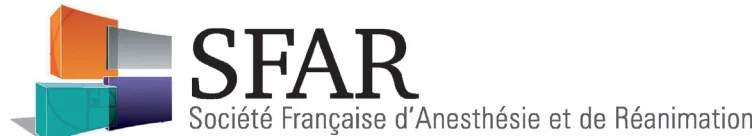
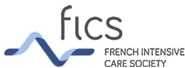
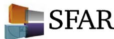

GuidelinesTracheotomy in the intensive care unit: Guidelines from a French expert panel<sup>☆</sup>

Jean-Louis Trouillet<sup>a</sup>, Olivier Collange<sup>b,c</sup>, Fouad Belafia<sup>d</sup>, François Blot<sup>e</sup>, Gilles Capellier<sup>f,g</sup>, Eric Cesareo<sup>h,i</sup>, Jean-Michel Constantin<sup>j,k</sup>, Alexandre Demoule<sup>l,m</sup>, Jean-Luc Diehl<sup>n,o</sup>, Pierre-Grégoire Guinot<sup>p,q</sup>, Franck Jegoux<sup>r</sup>, Erwan L'Her<sup>s,t</sup>, Charles-Edouard Luyt<sup>a,u</sup>, Yazine Mahjoub<sup>v</sup>, Julien Mayaux<sup>l,m</sup>, Hervé Quintard<sup>w,x</sup>, François Ravat<sup>y</sup>, Sébastien Vergez<sup>z</sup>, Julien Amour<sup>aa</sup>, Max Quillot<sup>c,ab,\*</sup>, For the French Intensive Care Society, Max Quillot For the French Society of Anaesthesia and Intensive Care, Olivier Collange

<sup>a</sup>Service de réanimation, groupe hospitalier Pitié-Salpêtrière, Assistance publique-Hôpitaux de Paris, Paris, France

<sup>b</sup>Hôpitaux universitaires de Strasbourg, Nouvel Hôpital Civil, pôle d'anesthésie-réanimation chirurgicale, SAMU, SMURNHC, 1, place de l'Hôpital, 67000 Strasbourg, France

<sup>c</sup>EA 3072, FMTS université de Strasbourg, Strasbourg, France

<sup>d</sup>Inserm, U1046, intensive care unit and department of anesthesiology, research unit, university of Montpellier, Saint-Éloi hospital, Montpellier school of medicine, Montpellier, France

<sup>e</sup>Medical-surgical intensive care unit Gustave-Roussy, Cancer Campus, Villejuif, France

<sup>f</sup>EA3920, université de Franche-Comté, CHRU de Besançon, 25000 Besançon, France

<sup>g</sup>Australian and New Zealand intensive care research centre, department of epidemiology and preventive medicine, Monash University Clayton, Australia

<sup>h</sup>SAMU de Lyon and department of emergency medicine, Hospices Civils de Lyon, Edouard-Herriot hospital, Lyon, France

<sup>i</sup>Lyon Sud, school of medicine, university Lyon 1, Oullins, France

<sup>j</sup>Department of preoperative medicine university hospital of Clermont-Ferrand, Clermont-Ferrand, France

<sup>k</sup>EA-7281, R2D2, Auvergne University Clermont-Ferrand, France

<sup>l</sup>Inserm, UMR S1158 neurophysiologie respiratoire expérimentale et clinique

<sup>m</sup>AP-HP, groupe hospitalier Pitié-Salpêtrière Charles-Foix, service de pneumologie et réanimation médicale du département, R3S, Sorbonne Université Paris, France

<sup>n</sup>Medical ICU, Georges-Pompidou hospital, AP-HP, Paris, France

<sup>o</sup>Inserm UMR-S1140 Paris Descartes University and Sorbonne Paris Cité, Paris, France

<sup>p</sup>Anaesthesiology and critical care department, Amiens University Hospital, place Victor-Pauchet, 80054 Amiens, France

<sup>q</sup>Inserm, U1088, Jules-Verne University of Picardy, 80054 Amiens, France

<sup>r</sup>Service ORL et chirurgie cervico-maxillofaciale, CHU de Pontchaillou, rue H.-Le-Guilloux, 35033 Rennes cedex 9, France

<sup>s</sup>CeSim/LaTIM Inserm, UMR 1101, université de Bretagne Occidentale, rue Camille-Desmoulins, 29200 Brest cedex, France

<sup>t</sup>Médecine intensive et réanimation CHRU de Brest, boulevard Tanguy-Prigent, 29200 Brest cedex, France

<sup>u</sup>Inserm, UMR-S-1166, UPMC, université Paris 06, ICAN, institute of cardiometabolism and nutrition sorbonne universités, Paris, France

<sup>v</sup>Department of anesthesia and intensive care, Amiens-Picardie, university Hospital, Amiens, France

<sup>w</sup>Réanimation médico-chirurgicale, hôpital Pasteur 2, CHU de Nice, 30, voie Romaine, 06000 Nice, France

<sup>x</sup>CNRS, UMR 7275, IPMC, Sophia Antipolis Valbonne, France

<sup>y</sup>Centre des brûlés, centre hospitalier St-Joseph et St-Luc, 20, quai Claude-Bernard, 69007 Lyon, France

<sup>z</sup>ORL chirurgie cervicofaciale, CHU de Toulouse, Rangueil-Larrey, 24, chemin de Pouvoirville, 31059 Toulouse cedex 9, France

<sup>aa</sup>Département d'anesthésie et de réanimation chirurgicale, institut de cardiologie, groupe hospitalier Pitié-Salpêtrière, 47–83, boulevard de l'Hôpital, 75013 Paris, France

<sup>ab</sup>Hôpitaux universitaires de Strasbourg, hôpital de Haute-pierre, réanimation médicale, avenue Molière, 67200 Strasbourg, France




<sup>☆</sup> This article is being published jointly in *Anaesthesia Critical Care & Pain Medicine* and *Annals of Intensive Care*. The manuscript validated by the board of the SRLF (12/13/2016) and the SFAR (12/15/2016).

**Abbreviations:** ALS, amyotrophic lateral sclerosis; GRADE, grading of recommendations assessment, development, and evaluation; PICO, patient intervention comparison outcome; SFAR, Société française d'anesthésie réanimation; SFMU, Société française de médecine d'urgence; SFORL, Société française d'otorhinolaryngologie; SRLF, Société de réanimation de langue française.

\* Corresponding author. EA 3072, FMTS université de Strasbourg, Strasbourg, France.

E-mail addresses: [olivier.collange@chru-strasbourg.fr](mailto:olivier.collange@chru-strasbourg.fr) (O. Collange), [max.guillot@chru-strasbourg.fr](mailto:max.guillot@chru-strasbourg.fr) (M. Quillot).ARTICLE INFOArticle history:

Available online 17 March 2018

ABSTRACT

Tracheotomy is widely used in intensive care units, albeit with great disparities between medical teams in terms of frequency and modality. Indications and techniques are, however, associated with variable levels of evidence based on inhomogeneous or even contradictory literature. Our aim was to conduct a systematic analysis of the published data in order to provide guidelines. We present herein recommendations for the use of tracheotomy in adult critically ill patients developed using the grading of recommendations assessment, development and evaluation (GRADE) method. These guidelines were conducted by a group of experts from the French Intensive Care Society (Société de réanimation de langue française) and the French Society of Anesthesia and Intensive Care Medicine (Société française d'anesthésie réanimation) with the participation of the French Emergency Medicine Association (Société française de médecine d'urgence), the French Society of Otorhinolaryngology. Sixteen experts and two coordinators agreed to consider questions concerning tracheotomy and its practical implementation. Five topics were defined: indications and contraindications for tracheotomy in intensive care, tracheotomy techniques in intensive care, modalities of tracheotomy in intensive care, management of patients undergoing tracheotomy in intensive care, and decannulation in intensive care. The summary made by the experts and the application of GRADE methodology led to the drawing up of 8 formal guidelines, 10 recommendations, and 3 treatment protocols. Among the 8 formal guidelines, 2 have a high level of proof (Grade 1  $\pm$ ) and 6 a low level of proof (Grade 2  $\pm$ ). For the 10 recommendations, GRADE methodology was not applicable and instead 10 expert opinions were produced.

© 2018 The Author(s). Published by Elsevier Masson SAS on behalf of Société française d'anesthésie et de réanimation (Sfar). This is an open access article under the CC BY license (<http://creativecommons.org/licenses/by/4.0/>).

For the Société de réanimation de langue française (SRLF) and the Société française d'anesthésie et de réanimation (SFAR) in collaboration with the Société française de médecine d'urgence (SFMU) and the Société française d'oto-rhino-laryngologie (SFORL).

## 1. Background

Tracheotomy is a procedure commonly used in intensive care, albeit with great disparities between medical teams in terms of frequency (5–54%) and modality (surgical or percutaneous) [1,2]. Although tracheotomy has a long history, its utility, indications, duration, and techniques are the subject of debate [3,4]. Also, the real or potential advantages of tracheotomy need to be weighed against its risks, which are rare but sometimes serious. The advantages are a reduction in pharyngolaryngeal lesions, lower risk of sinusitis, reduced sedation requirements, easier buccopharyngeal hygiene, improved patient comfort with easier communication, facilitated care by nursing personnel, maintenance of swallowing, possible glottic closure, simpler reinsertion in cases of accidental decannulation, and easier weaning from mechanical ventilation [5]. In some studies, early use of tracheotomy was associated with decreased incidence of ventilator-acquired pneumonia, reduced duration of mechanical ventilation and of intensive care, and so of costs, and decreased hospital mortality [6,7]. However, several recent randomized trials found no evidence of these benefits [8–11]. The most frequent complications can be qualified as minor (for example, minor stomal bleeding). Rare and life-threatening complications, such as lesions of the brachiocephalic artery trunk, have been reported.

Among the controversies surrounding tracheotomy in intensive care, the greatest is probably that of its indication. Tracheotomy is most often considered in cases of failed extubation and of prolonged mechanical ventilation. Three remarks are relevant here. First, there is currently no consensus regarding the contribution of failed extubation (one, two, three attempts? In what conditions?) and of prolonged mechanical ventilation. Second, it may be worthwhile preventing failure of extubation

and not adding the deleterious effects of prolonged intubation to those of tracheotomy. The intensivist should predict the failure of extubation and the duration of ventilation so as to perform tracheotomy without delay [5], but prediction of the duration of ventilation is an inexact “science” [12,13]. Third, the duration of mechanical ventilation and the success of extubation depend on intensive care management as a whole (notably the appropriate treatment of an infection, the water–sodium balance and acid–base balance, nutrition, and sedation). In particular, a sedation protocol is essential.

The most recent SRLF guidelines concerning the surgical approach to the trachea of ventilated patients in intensive care date back to 1998 [14]. There are no recent international guidelines and national guidelines are rare [15,16]. In the absence of clearly defined and unquestionable criteria, tracheotomy is most often decided solely by the medical team in charge of the patient. In the last ten or so years, the medical literature has been enriched by new clinical data, often compiled in the form of meta-analyses [17–19]. It was against this backdrop that the Société de réanimation de langue française (SRLF) and the Société française d'anesthésie et de réanimation (SFAR) decided to draw up the present guidelines entitled “Tracheotomy in the Intensive Care Unit”. The aim of these guidelines is to define the indications, contraindications, modalities, and monitoring of tracheotomy in light of the current literature data.

## 2. Methods

These guidelines were prepared by a working group of experts from the SRLF and the SFAR. The organizing committee, together with the coordinators, first defined the questions to be addressed and then designated the experts in charge of each question. The questions were formulated according to the patient intervention comparison outcome (PICO) format. Grade of recommendation assessment, development and evaluation (GRADE) methodology was used to analyze the literature and formulate guidelines. A level of proof was defined for each bibliographical reference cited, as a function of the type of study. This level of proof could be reviewed in light of the methodological quality of the study. An overall levelof proof was determined for each endpoint, taking into account the level of proof of each reference, the between-study consistency of the results, the direct or indirect nature of the proof, and cost analysis. A “strong” overall level of proof enabled formulation of a “strong” guideline (must be done, must not be done... GRADE 1 + or 1 –). A “moderate”, “weak”, or “very weak” overall level of proof led to the writing of an “optional” guideline (should probably be done or should probably not be done... GRADE 2 + or 2 –). When the literature was inexistent, the question could be the subject of a guideline in the form of an expert opinion (the experts suggest...). The proposed guidelines were presented and discussed one by one. The aim was not necessarily to reach a single, unanimous opinion of all the experts for each proposal, but to derive points of agreement or disagreement and of indecision. Each expert then reviewed every guideline and rated it using a scale from 1 (complete disagreement) to 9 (complete agreement). The collective rating was done using a GRADE grid. To validate a guideline on a criterion, at least 50% of the experts had to be in broad agreement, while < 20% of them expressed the opposite opinion. For a guideline to be strong, at least 70% of the experts had to be in broad agreement. In the absence of strong agreement, the guidelines were reformulated and again rated, with a view to reaching a consensus.

### 3. Topics of the guidelines: summary of the results

Because of the specificity of emergency airway management (in emergency medicine or intensive care, and in particular in patients with cervicofacial trauma or burns), we did not include it in our literature analysis or in the guidelines. We shall, therefore, address tracheotomy only in the setting of planned tracheotomy in adults in intensive care.

Five topics were defined: indications and contraindications for tracheotomy in intensive care, tracheotomy techniques in intensive care, modalities of tracheotomy in intensive care, management of patients undergoing tracheotomy in intensive care, and decannulation in intensive care. An extensive search of the bibliography from recent years was performed using PubMed and the Cochrane database. To be selected for the analysis, articles had to be written in English or in French.

The summary made by the experts and the application of GRADE methodology led to the drawing up of 8 formal guidelines, 10 recommendations, and 3 treatment protocols. Among the 8 formal guidelines, 2 have a high level of proof (Grade 1 ±) and 6 a low level of proof (Grade 2 ±). For the 10 recommendations, GRADE methodology was not applicable and instead 10 expert opinions were produced. After 2 rounds of rating and various amendments, strong agreement was obtained for all the guidelines and protocols.

### 4. Indications and contraindications for tracheotomy in intensive care

**R1.1–The experts suggest that tracheotomy be proposed in cases of prolonged weaning from mechanical ventilation and of acquired and potentially reversible neuromuscular disorder.**

Expert opinion  
Rationale:

- • the term neuromuscular refers to acquired and potentially reversible cerebrospinal, motor, and muscle disorders (e.g., Guillain–Barré syndrome, intensive care

unit acquired muscle weakness, myasthenia, lupus myelitis). No study has provided formal evidence that tracheotomy improves the prognosis for survival of patients with these types of disorders. In this indication, no randomized study has evaluated the specific usefulness of early compared with late tracheotomy. Nevertheless, studies, often retrospective, suggest that late tracheotomy raises the risk of ventilator-associated pneumonia [20]. Tracheotomy can be proposed when weaning from mechanical ventilation is prolonged: weaning lasting more than 7 days after the first spontaneous breathing trial [21];

- • in the case of Guillain–Barré syndrome, tracheotomy should only be considered if weaning from invasive mechanical ventilation is not achieved after completion of immunotherapy (intravenous immunoglobulins or plasma exchange). At the end of immunotherapy, deficit in plantar flexion associated with sciatic nerve block was found to be an early predictor of prolonged (> 15 days) invasive mechanical ventilation in 100% of cases [22]. Alone, deficit in plantar flexion at the end of immunotherapy had a positive predictive value of 82% for prolonged mechanical ventilation.

**R1.2–The experts suggest that the indication for tracheotomy in patients with chronic respiratory failure should be the subject of multidisciplinary discussion.**

Expert opinion  
Rationale:

- • the usefulness of intermittent mechanical ventilation in the management of patients with chronic respiratory failure is beyond the scope of these recommendations. When intermittent mechanical ventilation is indicated, a randomized study does not seem necessary before recommending first-line noninvasive ventilation rather than tracheotomy;
- • life-threatening decompensation of chronic respiratory failure is generally managed in intensive care. In this setting, certain forms of chronic respiratory failure, notably those resulting from neurological disorders, can be managed using tracheotomy to enable mechanical ventilation and to simplify upper airway management. A 2016 meta-analysis including data from a randomized trial and 25 observational studies suggests that intermittent mechanical ventilation can improve the quality of life of patients with chronic respiratory failure [23]. The meta-analysis considered together patients receiving intermittent noninvasive mechanical ventilation and tracheotomized patients. More specifically, several studies have looked into the usefulness of tracheotomy in amyotrophic lateral sclerosis (ALS). In a 2011 study, an Italian team found that of 60 ALS patients who underwent tracheotomy, 44 (70%) left hospital completely dependent on mechanical ventilation, 17 (28%) were partiallydependent, and a single patient was completely weaned from mechanical ventilation. At 1-year follow-up, 13 (22%) patients were still alive and had a quality of life deemed similar to that of ALS patients who did not have a tracheotomy [24];

- • in this type of situation, the patient and his or her family must be informed that tracheotomy does not alter the prognosis of the causal disease. The usefulness of tracheotomy in improving patient comfort and management following a stay in intensive care must be accurately evaluated, in particular with the patient and the medical team. Facilitation of upper airway management does not necessarily lead to improved comfort; tracheotomy can unduly prolong suffering associated with the underlying illness. In a context of chronic respiratory failure, these ethical considerations must be carefully thought through and discussed with the patient and his or her family before performing a tracheotomy.

**R1.3–Tracheotomy in intensive care should not be performed before the fourth day of mechanical ventilation.**

GRADE 1+, Strong agreement

Rationale:

- • the question of the timing of tracheotomy in intensive care is hard to analyze, because:
  - ◦ it is necessary beforehand to demonstrate the usefulness of tracheotomy (independently of its timing),
  - ◦ most studies comparing early and late tracheotomy include non-tracheotomized patients in the “late” group:
- • several good-quality prospective studies relate to “objective” criteria (mortality, incidence of ventilator-associated lung injury, duration of mechanical ventilation and of stay in intensive care). Early tracheotomy (in general before the fourth day of mechanical ventilation) is not associated with decreases in mortality, the incidence of ventilator-associated lung injury, or the duration of mechanical ventilation [8–11,25,26]. It does seem to reduce the consumption of hypnotic drugs. Improvement in comfort is not proven, and is insufficiently studied, but seems likely when tracheotomy is done early;
- • lastly, early tracheotomy in burn patients with cervicofacial involvement and in patients with cervicofacial trauma more properly comes under the heading of emergency tracheotomy and is not within the scope of these guidelines.

**R1.4–The experts suggest that tracheotomy (percutaneous or surgical) should not be performed in intensive care in situations at high risk of complications.**

Expert opinion

Rationale:

- • the potentially serious complications are hemorrhage, hypoxemia, and neurological deterioration. Most studies have excluded patients at risk of these complications [6,9,10,25]. Tracheotomy should not, therefore, be performed in intensive care in the following situations:
  - ◦ hemodynamic instability,
  - ◦ intracranial hypertension (intracranial pressure > 15 mmHg),
  - ◦ severe hypoxemia:  $PaO_2/FiO_2 < 100$  mmHg, with positive expiratory pressure > 10 cmH<sub>2</sub>O,
  - ◦ uncorrected bleeding disorders (platelets < 50,000/mm<sup>3</sup> and/or international normalized ratio > 1.5 and/or partial thromboplastin time > 2 normal),
  - ◦ refusal by the patient and/or family,
  - ◦ Patient is dying or active treatment is being withdrawn.

**5. Tracheotomy techniques in intensive care**

**R2.1–Percutaneous tracheotomy is the standard method in intensive care patients.**

GRADE 1+, STRONG agreement

Rationale:

- • several randomized studies have compared the impact of the technique of tracheotomy (percutaneous or surgical) on the incidence of complications (short-, medium-, and long-term), mortality, and cost [27–36]. The great heterogeneity of endpoints (immediate or delayed, minor or major complications) complicates comparison of studies. To date, neither of the two techniques (percutaneous or surgical) has proven superior in terms of mortality or incidence of major complications (respiratory distress, hemorrhagic shock, tracheal stenosis) [37]. A 2014 meta-analysis including 14 randomized studies suggests that the percutaneous technique is associated with a shorter operative time and a decreased incidence of stoma infection and inflammation [37]. The incidence of other complications does not seem to differ between the two tracheotomy techniques [37]. These results, plus the spread and availability of this technique in intensive care units, mean that percutaneous tracheotomy should whenever possible be preferred to surgical technique;- • whatever the technique used, prior training is needed to perform tracheotomy, which must be done by physicians able to manage any complications or accidents quickly.

***R2.2–The experts suggest that medical and surgical teams should discuss and decide upon the tracheotomy technique to be used when there is a risk of complications.***

Expert opinion

Rationale:

- • percutaneous tracheotomy can be made difficult, even impossible, by the patient's condition. For instance, an unstable cervical spine, an anterior cervical infection, a neck that has been treated (surgery or radiotherapy), difficulty in identifying anatomical landmarks (e.g., obesity, short neck, thyroid hypertrophy), or stiffness of the cervical spine are relative contraindications to percutaneous tracheotomy and prompt instead use of surgical tracheotomy [27]. It is nevertheless difficult to draw up formal guidelines. Indeed, at-risk situations are conventionally exclusion criteria for prospective studies. Observational studies have yielded contradictory results on which technique to prefer in cases of morbid obesity, spinal fracture, or a history of tracheotomy [35,38–53]. A single randomized prospective study has compared surgical tracheotomy with modified percutaneous tracheotomy or so-called mini-surgical percutaneous dilatational tracheotomy (surgical tracheal access followed by a percutaneous procedure) in at-risk situations (anatomical difficulties, coagulation disorders, hypoxemia, hemodynamic instability). This study found no difference between the two techniques in terms of complications [52];
- • such situations should therefore prompt discussions between the medical and surgical teams to decide on what benefit tracheotomy provides and which technique is the most suitable. Percutaneous tracheotomy in these situations can be envisioned by an experienced team with access to the technical means to improve the usual procedure: fiberoptic bronchoscopy, cervical Doppler ultrasound, surgical approach to the tracheal rings, tracheotomy equipment adapted to the anatomical problem (e.g., special tracheotomy kits for obese patients).

***R2.3–Percutaneous dilatational tracheotomy should probably be preferred as the standard method in intensive care patients.***

GRADE 2+, STRONG agreement

Rationale:

- • several randomized studies have compared the six techniques of percutaneous tracheotomy: multiple dilator,

guide wire dilating forceps, single dilator, rotating dilation, balloon dilation and translaryngeal tracheotomy. These comparisons have in general been made two-by-two with as principal endpoints the duration of the procedure, failure rate defined by a switch to an alternative technique, the rate of major complications, and the rate of minor complications. These techniques are relatively equivalent, with the exception of translaryngeal tracheotomy, which seems to be associated with a higher rate of failure and of complications, notably major [54,55]. The single dilator technique is associated with a lower failure rate than rotating dilation [56] and a lower rate of minor complications than balloon dilation or dilation with guide wire dilating forceps [57–59]. When the single dilator technique is compared with all the others, it seems to be associated with a higher success rate (corollary of its more widespread use) [60], but also with a higher rate of minor complications (notably minor bleeding and tracheal ring fractures) [60].

## 6. Conditions necessary for tracheotomy in intensive care

***R3.1–Fiberoptic bronchoscopy should probably be performed before and during percutaneous tracheotomy.***

GRADE 2+, STRONG agreement

Rationale:

- • fiberoptic bronchoscopy before tracheotomy is advantageous because it helps locate the point of incision, by transillumination and palpation, and helps position the endotracheal tube correctly, below the vocal cords. Fibrosopy directly visualizes all stages of the procedure (incision, placement of the guide wire and of the dilator, dilation) and the position of the tracheotomy tube [61]. Fibrosopy must be available during the tracheotomy and the clinician must be trained;
- • three non-randomized studies seem to suggest that fiberoptic bronchoscopy could be non-significantly associated with more complications [62–64], but they are subject to substantial methodological bias and their results seem difficult to interpret;
- • a single randomized trial in 60 patients has shown that fiberoptic bronchoscopy is associated with a 47% (95% CI 23–64%) decrease in early complications of percutaneous tracheotomy in intensive care [65]. The main complications observed were accidental extubation, perforation of the cuff of the endotracheal tube, and hemorrhage. In addition, the number of incisions needed for tracheotomy was statistically smaller in the fiberoptic bronchoscopy group;
- • in summary, the only randomized study performed found that there are fewer complications of percutaneous tracheotomy when fiberoptic bronchoscopy is used.**R3.2–A laryngeal mask airway should probably not be used during percutaneous tracheotomy in intensive care.**

GRADE 2–, Strong agreement

Rationale:

- • several randomized studies have compared two procedures for extubation of the endotracheal tube from the trachea while maintaining invasive mechanical ventilation: extubation followed by placement of a laryngeal mask airway or withdrawal of the endotracheal tube until the cuff is at the level of the vocal cords. A 2014 meta-analysis of 8 randomized controlled trials of the usefulness of placement of a laryngeal mask airway [66] showed that these trials examined four main outcomes: mortality (one study), the proportion of patients with one or more serious adverse events (seven studies), duration of the procedure (six studies), and failure of the procedure requiring a switch to any other procedure (seven studies). For each of these outcomes, the quality of the proof was considered low. Use of a laryngeal mask airway is not associated with decreases in mortality, complication rate, or failure related to the procedure, but does shorten the length of the procedure by an average of 1.46 (1.01–1.92) minutes. A single randomized controlled study conducted after this meta-analysis [67] found that more patients needed conversion to another procedure and had more clinically significant complications with a laryngeal mask airway.

**R3.3–Cervical ultrasound should probably be performed with percutaneous tracheotomy in intensive care.**

GRADE 2+, STRONG agreement

Rationale:

- • ultrasound visualizes the trachea and the tracheal rings, thus optimizing positioning of point of incision while avoiding injury to blood vessels and/or the thyroid [68]. Four open randomized studies in a total of 560 patients have tested the usefulness of Doppler ultrasound in preventing complications of percutaneous tracheotomy [69–72]. Of 275 patients who underwent ultrasound-guided localization before tracheotomy, 40 (14.5%) presented a complication during or after the procedure. In the absence of Doppler ultrasound, 74 (26%) of the 285 patients presented at least one complication during or after the procedure, i.e., a 44% (95% CI 21–60) decrease in the risk of complications. The risk of puncturing a blood vessel is reduced by localization beforehand. The success of the procedure at the first attempt is significantly greater with Doppler ultrasound: 94.9% (168/177) versus 90.4% (160/177). There is, however, great heterogeneity between these studies, as the randomization procedure is not always well described [70,71] and the definition of complications is not uniform;

- • the strength of the recommendation (2 +) is related to the as-yet infrequent use of ultrasound with tracheotomy and to the quality of the randomized trials;
- • in conclusion, Doppler ultrasound increases the success rate of tracheotomy and reduces its immediate complications, provided the clinician masters the technique.

**R3.4–The experts suggest that antibiotic prophylaxis should not be prescribed for tracheotomy.**

Expert opinion

Rationale:

- • because it opens the trachea, percutaneous tracheotomy can be considered as clean-contaminated surgery. The rate of infection of the operative site ranges between 0 and 33% depending on the study. Most studies comparing percutaneous tracheotomy and surgical tracheotomy indicate a higher rate of infection of the operative site for the surgical procedure. The infection rate for percutaneous tracheotomy is generally between 0 and 4%. In a retrospective study in 297 patients who underwent percutaneous tracheotomy, Hagiya et al. [73] reported a significantly lower rate of infection at the tracheotomy site in patients on antibiotic therapy: 2.36 versus 7.25% ( $P = 0.002$ ). In contrast, there is no randomized study that has assessed the usefulness of antibiotic prophylaxis for tracheotomy. The quality of evidence is therefore very poor. The 2010 SFAR update concerning antibiotic prophylaxis in surgery and interventional medicine advises against antibiotic prophylaxis for tracheotomy (whether surgical or percutaneous is not specified) [74].

**R3.5–The experts suggest that a standardized procedure be implemented in intensive care units that perform percutaneous tracheotomy.**

Expert opinion

Rationale:

- • percutaneous tracheotomy in intensive care is an invasive procedure, which can lead to potentially serious complications [75] and for which there are contraindications. The learning curve for percutaneous tracheotomy is on average more than 80 consecutive procedures by the same team and with the same technique [76]. In addition, rules should be observed to optimize safety [75]. Intensive care units should define a standard procedure for percutaneous tracheotomy, which could indicate the following points: medical and paramedical personnel required, necessary pre-surgery laboratory tests and radiography, equipmentrequired for airway management, equipment needed for the procedure (notably, the role of Doppler ultrasound and fiberoptic bronchoscopy), position of the patient, method of ventilation, type of analgesia, ways of checking the position of the tracheotomy tube at the end of the procedure, and then the modalities for monitoring the intensive care patient following surgery (Figs. 1 and 2).

## 7. Tracheotomy monitoring and maintenance in intensive care

**R4.1–The experts suggest that intensive care units should have a tracheotomy management protocol.**

Expert opinion

Rationale:

- • the numerous secondary complications of tracheotomy include skin infection, granuloma, secondary bleeding

### Equipment and supplies required:

- ○ Bronchial endoscope (with video if possible).
- ○ Percutaneous tracheotomy kit.
- ○ Reintubation equipment.
- ○ Ultrasound machine (for departments with the expertise).
- ○ Monitoring (hemodynamic and ventilatory).
- ○ Coagulation tests (if findings abnormal, correction made).
- • Personnel required:
  - ○ 2 physicians (1 for surgery + 1 for fiberoptic bronchoscopy).
  - ○ A least 1 paramedic to help perform the procedure.
- • Preparation:
  - ○ Patient intubated and ventilated in volume controlled mode, with  $FiO_2 = 1$ .
  - ○ General anesthesia with neuromuscular block.
  - ○ Hyperextension of the head, using a pillow under the shoulders to extend the neck.
  - ○ Skin preparation of the surgical field.
- • Conditions (key points):
  - ○ Location of the planned point of incision by palpation and transillumination (ultrasound can be an additional aid in departments with the expertise). The point of incision should ideally be between the 1<sup>st</sup> and 2<sup>nd</sup> tracheal rings.
  - ○ Visually guided withdrawal of the endotracheal tube and its immobilization below the glottis, with the cuff inflated.
  - ○ Compensation for loss of ventilation when needed, throughout the procedure if necessary.
  - ○ Direct visualization of tracheal puncture.
  - ○ Continuation of the procedure using the chosen technique under direct visualization.
  - ○ Placement of the tracheotomy tube under direct visualization.
- • After cannulation:
  - ○ Connection of the tracheotomy tube to the ventilator and adjustment of ventilation.
  - ○ Maintenance and securing of the tracheotomy tube by a device adapted to the condition of the patient's skin.
  - ○ Endoscopic check that the tracheotomy tube is in the right position. Bronchial hygiene therapy if necessary.

Writing of a tracheotomy report.

Fig. 1. Proposal for a protocol associated with guideline 3.5 (Expert opinion).```

graph TD
    A[PERCUTANEOUS TRACHEOTOMY] --> B[PREPARATION]
    B --> B1[conditioning]
    B1 --> B1a[reliable infusion line / BP / SpO2 / PetCO2 / compatible coagulation]
    B --> B2[general anesthesia]
    B2 --> B2a[neuromuscular block]
    B --> B3[mouth hygiene]
    B --> B4[gastric emptying]
    B --> B5[possibility of surgical technique]
    A --> C[SET UP]
    C --> C1[hyperextension of the head]
    C1 --> C1a[dorsal decubitus + pillow]
    A --> D[VENTILATION]
    D --> D1[volumetric controlled mode]
    D1 --> D1a[adjust during the procedure]
    D --> D2[FIO2 100%]
    D --> D3[via endotracheal tube]
    D --> D4[PetCO2]
    A --> E[INCISION]
    E --> E1[fiberoptic bronchoscopy (positioning + continuous visual guidance)]
    E --> E2[guidance if intubation difficult]
    E --> E3[positioning]
    E3 --> E3a[palpation]
    E3 --> E3b[endoscopic transillumination]
    E3 --> E3c[ultrasound ?]
    E --> E4[1st - 2nd tracheal ring]
    E4 --> E4a[median incision]
    A --> F[CANNULATION]
    F --> F1[adapted model]
    F --> F2[cautious insertion]
    F --> F3[careful securing]
    F3 --> F3a[as a function of state of skin]
    F --> F4[position check]
    F4 --> F4a[capnogram]
    F4 --> F4b[auscultation]
    F4 --> F4c[fiberoptic bronchoscopy]
  
```

The diagram is a flowchart titled "PERCUTANEOUS TRACHEOTOMY" in a large blue box at the top. It branches into five main sections: "PREPARATION", "SET UP", "VENTILATION", "INCISION", and "CANNULATION". Each section contains specific steps and sub-steps, some of which are further detailed in smaller boxes. For example, "PREPARATION" includes "conditioning" (reliable infusion line / BP / SpO2 / PetCO2 / compatible coagulation), "general anesthesia" (neuromuscular block), "mouth hygiene", "gastric emptying", and "possibility of surgical technique". "SET UP" includes "hyperextension of the head" (dorsal decubitus + pillow). "VENTILATION" includes "volumetric controlled mode" (adjust during the procedure), "FIO2 100%", "via endotracheal tube", and "PetCO2". "INCISION" includes "fiberoptic bronchoscopy (positioning + continuous visual guidance)", "guidance if intubation difficult", "positioning" (palpation, endoscopic transillumination, ultrasound ?), and "1st - 2nd tracheal ring" (median incision). "CANNULATION" includes "adapted model", "cautious insertion", "careful securing" (as a function of state of skin), and "position check" (capnogram, auscultation, fiberoptic bronchoscopy).

Fig. 2. Proposal for a protocol associated with guideline 3.5 (expert opinion).

from the stoma, tracheal stenosis, tracheomalacia, and erosion of blood vessels (brachiocephalic vein, brachiocephalic artery) [15,77,78]. There is no prospective study comparing different kinds of local care, such as antisepsis, type of dressing, or way of securing. Prospective randomized studies comparing surgical and percutaneous techniques, and different types of percutaneous techniques, do not specify the protocol.

Studies evaluating practices for tracheotomy follow-up in intensive care reveal large disparities, absence of formalization, and lack of guidelines for follow-up during or after intensive care [79,80]. Use of a standard care protocol reduced local lesions [81]. Based on limited data or expert opinions, monitoring is recommended to ensure that cuff pressure does not exceed 30 cmH<sub>2</sub>O [77,78,82]. Too low a pressure could lead toinhalation of oropharyngeal secretions [15]. Increased cuff pressure favors ischemia of the tracheal mucosa, which is a source of tracheal stenosis. A check every 8 h is proposed;

- • local infection and gastroesophageal reflux damage the cartilage of the tracheal rings, potentially leading to chondritis, tracheal stenosis, and tracheomalacia [83]. By analogy with work done on endotracheal intubation, it is recommended to use tubes fitted with a suction catheter that opens above the cuff, for regular aspiration of retained secretions from the subglottic space;
- • special attention should be paid to securing the tracheotomy tube, maintenance of a corrugated tube, and prevention of repeated local trauma caused by the moving and weight of the tubes (avoid pulling the tracheotomy tube). There are no specific data on local care (antisepsis, products, frequency). A single study found no difference in bacterial contamination or local infection between the application of compresses or soft dressings [84]. Few studies specify the performance and type of local care (4–6 applications of isotonic saline, for example, in Lagambina et al.) [77,85];
- • the experts consider it useful to check the position of the tracheotomy tube (chest X-ray, ease of tracheal suction, absence of dyspnea) and, if necessary, to use fiberoptic bronchoscopy to look for injury or stenosis, without specifying the frequency or timing;
- • to meet intensive care safety requirements, management of the tracheotomized patient should include and specify the following: monitoring of the tracheotomy stoma, monitoring of ventilation parameters, specific local care, care of the tracheotomy tube, nature and frequency of the care provided (Fig. 3).

#### **R4.2–The experts recommend airway humidification in patients with a tracheotomy in intensive care.**

Expert opinion

Rationale:

- • there are no data on airway humidification in patients with a tracheotomy in intensive care. Lack of airway humidification can lead to obstruction of the tracheotomy tube in patients who need oxygen therapy in intensive care [86]. The UK 2014 guidelines suggest that humidification be envisioned for all patients undergoing tracheotomy. Airway humidification should be adapted in particular to the ventilatory support and to the amount of bronchial secretion [86];
- • no study has determined which airway humidification technique should be preferred in mechanically ventilated patients undergoing tracheotomy in intensive care. Only two studies have evaluated the effect on the incidence of ventilator-associated lung injury of different humidification systems (heated humidifiers or heat and moisture exchangers) in patients undergoing tracheotomy. Their results are discordant. The first

study of 185 patients in each group and only 11 tracheotomized patients [87] found no benefit of airway humidification with any particular system. The second study, in a comparison of only 15 and 16 tracheotomized patients, showed a significant decrease in the incidence of ventilator-associated lung injury in the group with a heated humidifier [88].

#### **R4.3–The experts suggest that tracheotomy tubes should not be routinely changed in intensive care.**

Expert opinion

Rationale:

- • no literature study has examined the frequency of tracheotomy tube changes and the incidence of lung disease. A single prospective study in a long-stay hospital for ventilated patients with a tracheotomy showed a reduction in the incidence of granulation tissue when tubes were changed every two weeks [89]. A nonrandomized prospective study in a center for mechanical ventilation weaning showed that a change of tracheotomy tubes before the seventh day after tracheotomy was associated with faster resumption of nutrition and speech. The authors ascribed this effect to a reduction in tracheotomy tube size [90]. They reported no complication associated with the change of tracheotomy tube;
- • in intensive care, in a practice survey in the USA, 80% of tracheotomy tubes were changed routinely, but with substantial variability [91]. A Dutch practice survey observed that 60% of departments never change the tracheotomy tube [92];
- • the guidelines of the Belgian Society of Pneumology and the Belgian Association for Cardiothoracic surgery [15] proposes tracheotomy tube changes only if there is a specific indication. The British Intensive Care Society [86] advocates changing a tracheotomy tube without an inner cannula every 7–14 days and a tracheotomy tube with an inner cannula every 30 days. Tube change should be performed no less than 4 days after surgical tracheotomy, and 7–10 days after percutaneous tracheotomy. Subsequently, the frequency of tube change must be adapted to the individual patient's condition [86];
- • The European Directive [93] advocates changing medical devices every 30 days. One study shows a structural alteration of the wall of 58% of tracheotomy tubes after 30 days of use [94]. A tracheotomy tube change early in intensive care is associated with risks (tube displacement and respiratory arrest) [15];
- • in summary, tracheotomy tube change must be guided by clinical considerations and should be envisaged, in particular, in cases of suspected local infection, bleeding, or to reduce the caliber of the tracheotomy tube and to facilitate the patient's speech.### Immediate post-tracheotomy care:

- - Personnel trained in management of tracheotomy.
- - Verification of the position (landmarks), with one end of the tracheotomy tube 4 to 6 cm from the carina in the tracheal lumen, securing of tube (skin sutures, ties, or Velcro), avoiding overly tight or loose fitting (movement limited to 1 finger width).
- - Check airway access: easy tracheal suction, monitoring of  $P_{et}CO_2$ , peak pressure (comparison with pre-tracheotomy values), absence of subcutaneous emphysema in the cervical or thoracic region, verification of hemodynamic stability and of the absence of heart rhythm disorders, check the position of the tube (chest X-ray).
- - Check the cuff pressure according to the guidelines applicable to airway access ( $P < 30 \text{ cmH}_2\text{O}$ ; 25–35 depending on the team).
- - Have in the room or close at hand equipment for reintubation and tracheotomy, in case of early accidental dislodgement.

### Care on days 0–4:

- - Monitoring for hemorrhagic signs (apparent at scar site or on tracheal suction) every 3 hours postoperatively.
- - Examination of the scar and checking for signs of local infection.
- - Dressing changed with physiological saline 3 times every 24 hours (to avoid accumulation of secretions and moisture at the stoma).
- - Tracheal suction according to usual practice (defined frequency or on request), but measuring the maximum depth (down to the carina, up one centimeter and note the distance).
- - Airway humidification (heated humidifier, if necessary). Care of the inner cannula with cuffed tube.
- - Raise the head by  $30^\circ$ , in the median position, and be careful to preserve the axis of the head and trunk during mobilization and changes of position.
- - Check that the respirator tube is not pressing on the tracheotomy stoma.

### Subsequent care:

- - Change the fixation every day or more often if oozing (hemorrhage or pus).
- - Check the scar every day.
- - Cleansing with isotonic saline.

Fig. 3. Proposed care protocol associated with guideline 4.1 (expert opinion).

## 8. Tracheotomy decannulation

**R5.1–The experts suggest that a multidisciplinary decannulation protocol should be available in intensive care units.**

Experts opinion

**R5.2–The tracheotomy tube cuff should probably be deflated when the patient is breathing spontaneously.**

GRADE 2+, STRONG Agreement

Rationale:

- • numerous observational and before/after studies conclude that use of a weaning protocol shortens weaning time and reduces the decannulation failure rate and the complication rate [95–104]. In a controlled, randomized, single-center trial in 195 patients, cuff deflation once the patient was disconnected from the ventilator reduced failure of decannulation, shortened weaning from mechanical ventilation, and decreased tracheostomy-related complications [105];
- • this consensual multidisciplinary protocol, which was written and is applied routinely by all members of the intensive care team who use tracheotomy, should at least define the following (Fig. 4): prior neurological examination and pharyngolaryngeal examinations,**Prerequisite:**

Weaning from mechanical ventilation 24/24 hours in cases of previous neurological disease.

**Conditions of examination:**

- • Cuff deflated.
- • Prior aspiration of secretions.
- • Seated position >70°.
- • No anesthesia so as not to generate swallowing difficulties.
- • Nasal endoscopy to the cuff.

```

graph TD
    A[Secretions  
Salivary stasis, occult inhalation] -->|NO| B[Spontaneous swallowing  
< 1 / minute, no white film]
    A -->|YES, no decannulation| E[ ]
    B -->|NO| C[Laryngeal sensitivity / Cough  
Anesthesia, unproductive cough]
    B -->|YES, no decannulation| E
    C -->|NO| D[Consistent bolus  
(paste)  
Occult inhalation of bolus]
    C -->|YES, no decannulation| E
    D -->|NO| F[Liquid bolus  
Occult inhalation without triggering of swallowing]
    D -->|YES, no decannulation| E
    F -->|NO| G[Decannulation]
    F -->|YES, no decannulation| E
  
```

The flowchart outlines the steps for decannulation. It starts with 'Secretions' (Salivary stasis, occult inhalation). If 'NO', it proceeds to 'Spontaneous swallowing' (< 1 / minute, no white film). If 'NO' here, it goes to 'Laryngeal sensitivity / Cough' (Anesthesia, unproductive cough). If 'NO' here, it goes to 'Consistent bolus' (paste) (Occult inhalation of bolus). If 'NO' here, it goes to 'Liquid bolus' (Occult inhalation without triggering of swallowing). If 'NO' here, it proceeds to 'Decannulation'. If 'YES' at any of the first five steps, the process is 'no decannulation'.

**Fig. 4.** Proposed endoscopic protocol associated with guideline 5.1 (Expert opinion): (According to Warnecke et al. *Crit Care Med* 2013 [106]).

medical and paramedical personnel involved in decannulation, equipment needed for decannulation, immediate and subsequent monitoring of decannulation, and type and location of equipment required in cases of respiratory distress following decannulation.

**R5.3-A pharyngolaryngeal examination should probably be performed at or following decannulation.**

GRADE 2+, STRONG Agreement  
Rationale:

- • few prospective controlled studies consider the pharyngolaryngeal examination required during or following decannulation of intensive care patients or whether or not routine fiberoptic bronchoscopy is needed. A prospective observational study by practitioners blinded to each other's decisions [106] shows the benefit of routine laryngotracheal endoscopy by the intensivist at decannulation, in comparison with routine clinical assessment of swallowing, possibly completed by the Evans blue dye test. Among the 100 neurological

patients in the cohort, endoscopic evaluation allowed successful decannulation in 27 patients for whom clinical assessment had predicted failure of weaning. The recannulation rate was 1.9%. Pharyngolaryngeal examination on decannulation comprises sequential assessments of salivary stasis and silent inhalation, spontaneous swallowing, and laryngeal sensitivity, before considering a swallowing test using paste and then liquid. No patient who passed these three assessments had difficulty swallowing in the tests with paste and liquid. Other prospective, observational, but non-comparative studies confirm [107,108]:

- ◦ a higher incidence of swallowing dysfunction in tracheotomized patients ventilated for a prolonged period,
- ◦ a longer intensive care stay and increased risk of inhalation and of pharyngolaryngeal lesions when tracheotomy is prolonged or decannulation is delayed.

**Authors' contributions**

J.L.T. and O.C. proposed the elaboration of this recommendation and manuscript in agreement with the "Société de réanimation de langue française" and "Société française d'anesthésie et de réanimation"; J.A. and M.G. wrote the methodology section and gave the final version with the final presentation. F.B., F.B., E.C., J.-L.D., F.J. contributed to elaborate recommendations and write the rationale of "Indications and contraindications for tracheotomy in intensive care." A.D. and F.J. contributed to elaborate recommendations and to write the rationale of "Tracheotomy techniques in intensive care." C.E.L., Y.M., P.-G.G., F.R. contributed to elaborate recommendations and to write the rationale of Conditions necessary for tracheotomy in intensive care. G.C., H.Q., J.M. contributed to elaborate recommendations and to write the rationale of "Tracheotomy monitoring and maintenance in intensive care." J.-M.C., E.L., S.V. contributed to elaborate recommendations and to write the rationale of "Tracheotomy decannulation." All authors provide references. J.L.T., O.C., J.A. and M.G. drafted the manuscript. All authors read and approved the final manuscript.

**Availability of data and materials**

Not applicable.

**Consent to participate**

Not applicable.

**Consent for publication**

Not applicable.

**Ethical approval**

Not applicable.## Funding

This work was financially supported by the Société de réanimation de langue française (SRLF) and the Société française d'anesthésie et de réanimation (SFAR).

SRLF Benchmark and Assessment Commission

L. Donetti (Secretary), M. Alves, O. Brissaud, R. Bruyère, V. Das, L. De Saint Blanquat, M. Guillot, E. L'Her, E. Mariotte, C. Mathien, C. Mossadegh, V. Peigne, F. Plouvier, D. Schnell.

SFAR Clinical Benchmark Committee

D. Fletcher (President), L. Velly (Secretary), J. Amour, S. Ausset, G. Chanques, V. Compere, F. Espitalier, M. Garnier, E. Gayat, P. Cuvillon, J.-M. Malinovski, B. Rozec.

## Disclosure of interest

The authors declare that they have no competing interest.

## Acknowledgments

Not applicable

## References

1. Blot F, Melot C. Commission d'épidémiologie et de recherche clinique. Indications, timing, and techniques of tracheostomy in 152 French ICUs. *Chest* 2005;127(4):1347–52.
2. Freeman BD, Kennedy C, Coopersmith CM, Buchman TG. Examination of non-clinical factors affecting tracheostomy practice in an academic surgical intensive care unit. *Crit Care Med* 2009;37(12):3070–8.
3. Freeman BD, Morris PE. Tracheostomy practice in adults with acute respiratory failure. *Crit Care Med* 2012;40(10):2890–6.
4. Banfi P, Robert D. Early tracheostomy or prolonged translaryngeal intubation in the ICU: a long running story. *Respir Care* 2013;58(11):1995–6.
5. Durbin CG. Tracheostomy: why, when, and how? *Respir Care* 2010;55(8):1056–68.
6. Rumbak MJ, Newton M, Truncale T, Schwartz SW, Adams JW, Hazard PB. A prospective, randomized, study comparing early percutaneous dilatational tracheostomy to prolonged translaryngeal intubation (delayed tracheostomy) in critically ill medical patients. *Crit Care Med* 2004;32(8):1689–94.
7. Hyde GA, Savage SA, Zarzaur BL, Hart-Hyde JE, Schaefer CB, Croce MA, et al. Early tracheostomy in trauma patients saves time and money. *Injury* 2015;46(1):110–4.
8. Blot F, Similowski T, Trouillet J-L, Chardon P, Korach J-M, Costa M-A, et al. Early tracheostomy versus prolonged endotracheal intubation in unselected severely ill ICU patients. *Intensive Care Med* 2008;34(10):1779–87.
9. Terragni PP, Antonelli M, Fumagalli R, Faggiano C, Berardino M, Pallavicini FB, et al. Early vs. late tracheostomy for prevention of pneumonia in mechanically ventilated adult ICU patients: a randomized controlled trial. *JAMA* 2010;303(15):1483–9.
10. Trouillet J-L, Luyt C-E, Guiguet M, Ouattara A, Vaissier E, Makri R, et al. Early percutaneous tracheostomy versus prolonged intubation of mechanically ventilated patients after cardiac surgery: a randomized trial. *Ann Intern Med* 2011;154(6):373–83.
11. Young D, Harrison DA, Cuthbertson BH, Rowan K, TracMan Collaborators. Effect of early vs. late tracheostomy placement on survival in patients receiving mechanical ventilation: the TracMan randomized trial. *JAMA* 2013;309(20):2121–9.
12. Figueroa-Casas JB, Connery SM, Montoya R, Dwivedi AK, Lee S. Accuracy of early prediction of duration of mechanical ventilation by intensivists. *Ann Am Thorac Soc* 2014;11(2):182–5.
13. Thille AW, Boissier F, Ben Ghezala H, Razazi K, Mekontso-Dessap A, Brun-Buisson C. Risk factors for and prediction by caregivers of extubation failure in ICU patients: a prospective study. *Crit Care Med* 2015;43(3):613–20.
14. Chastre J, Bedock B, Clair B, Gehanno P, Lacaze T, Lesieur O, et al. Quel abord trachéal pour la ventilation mécanique des malades de réanimation? (à l'exclusion du nouveau-né) 18<sup>e</sup> conférence de consensus en réanimation et médecine d'urgence. *Réanim Urgences* 1998;7:435–42.
15. De Leyn P, Bedert L, Delcroix M, Depuydt P, Lauwers G, Sokolov Y, et al. Tracheostomy: clinical review and guidelines. *Eur J Cardiothorac Surg* 2007;32(3):412–21.
16. Madsen KR, Guldager H, Rewers M, Weber S-O, Købke-Jacobsen K, Jensen R, et al. Guidelines for percutaneous dilatational tracheostomy (PDT) from the Danish Society of Intensive Care Medicine (DSIT) and the Danish Society of Anesthesiology and Intensive Care Medicine (DASAIM). *Dan Med Bull* 2011;58(12):C4358.
17. Siempos II, Ntaidou TK, Filippidis FT, Choi AMK. Effect of early versus late or no tracheostomy on mortality and pneumonia of critically ill patients receiving mechanical ventilation: a systematic review and meta-analysis. *Lancet Respir Med* 2015;3(2):150–8.
18. Brass P, Hellmich M, Ladra A, Ladra J, Wrzosek A. Percutaneous techniques versus surgical techniques for tracheostomy. *Cochrane Database Syst Rev* 2016;7:CD008045.
19. Andriolo BNG, Andriolo RB, Saconato H, Atallah AN, Valente O. Early versus late tracheostomy for critically ill patients. *Cochrane Database Syst Rev* 2015;1:CD007271.
20. Ali MI, Fernández-Pérez ER, Pendem S, Brown DR, Wijdicks EFM, Gajic O. Mechanical ventilation in patients with Guillain-Barré syndrome. *Respir Care* 2006;51(12):1403–7.
21. Béduneau G, Pham T, Schortgen F, Piquilloud L, Zogheib E, Jonas M, et al. Epidemiology of weaning outcome according to a new definition. The WIND study. *Am J Respir Crit Care Med* 2017;195(6):772–83.
22. Fourrier F, Robriquet L, Hurtevent J-F, Spagnolo S. A simple functional marker to predict the need for prolonged mechanical ventilation in patients with Guillain-Barré syndrome. *Crit Care* 2011;15(1):R65.
23. MacIntyre EJ, Asadi L, McKim DA, Bagshaw SM. Clinical outcomes associated with home mechanical ventilation: a systematic review. *Can Respir J* 2016;2016:6547180.
24. Vianello A, Arcaro G, Palmieri A, Ermani M, Braccioni F, Gallan F, et al. Survival and quality of life after tracheostomy for acute respiratory failure in patients with amyotrophic lateral sclerosis. *J Crit Care* 2011;26(3):329 [e7–e14].
25. Díaz-Prieto A, Mateu A, Gorriz M, Ortiga B, Truchero C, Sampietro N, et al. A randomized clinical trial for the timing of tracheotomy in critically ill patients: factors precluding inclusion in a single center study. *Crit Care* 2014;18(5):585.
26. Rodriguez JL, Steinberg SM, Luchetti FA, Gibbons KJ, Taheri PA, Flint LM. Early tracheostomy for primary airway management in the surgical critical care setting. *Surgery* 1990;108(4):655–9.
27. Antonelli M, Michetti V, Di Palma A, Conti G, Pennisi MA, Arcangeli A, et al. Percutaneous translaryngeal versus surgical tracheostomy: a randomized trial with 1-yr double-blind follow-up. *Crit Care Med* 2005;33(5):1015–20.
28. Freeman BD, Isabella K, Cobb JP, Boyle WA, Schmieg RE, Kollef MH, et al. A prospective, randomized study comparing percutaneous with surgical tracheostomy in critically ill patients. *Crit Care Med* 2001;29(5):926–30.
29. Friedman Y, Fildes J, Mizock B, Samuel J, Patel S, Appavu S, et al. Comparison of percutaneous and surgical tracheostomies. *Chest* 1996;110(2):480–5.
30. Gysin C, Dulguerov P, Guyot JP, Perneger TV, Abajo B, Chevrolet JC. Percutaneous versus surgical tracheostomy: a double-blind randomized trial. *Ann Surg* 1999;230(5):708–14.
31. Heikkinen M, Aarnio P, Hannukainen J. Percutaneous dilatational tracheostomy or conventional surgical tracheostomy? *Crit Care Med* 2000;28(5):1399–402.
32. Holdgaard HO, Pedersen J, Jensen RH, Outzen KE, Midtgaard T, Johansen LV, et al. Percutaneous dilatational tracheostomy versus conventional surgical tracheostomy. A clinical randomised study. *Acta Anaesthesiol Scand* 1998;42(5):545–50.
33. Melloni G, Muttini S, Gallioli G, Carretta A, Cozzi S, Gemma M, et al. Surgical tracheostomy versus percutaneous dilatational tracheostomy. A prospective randomized study with long-term follow-up. *J Cardiovasc Surg (Torino)* 2002;43(1):113–21.
34. Silvester W, Goldsmith D, Uchino S, Bellomo R, Knight S, Seevanayagam S, et al. Percutaneous versus surgical tracheostomy: a randomized controlled study with long-term follow-up. *Crit Care Med* 2006;34(8):2145–52.
35. Tabaee A, Geng E, Lin J, Kakoullis S, McDonald B, Rodriguez H, et al. Impact of neck length on the safety of percutaneous and surgical tracheostomy: a prospective, randomized study. *Laryngoscope* 2005;115(9):1685–90.
36. Sustić A, Krstulović B, Eskinja N, Zelić M, Ledić D, Turina D. Surgical tracheostomy versus percutaneous dilatational tracheostomy in patients with anterior cervical spine fixation: preliminary report. *Spine* 2002;27(17):1942–5 (discussion 1945).
37. Putensen C, Theuerkauf N, Guenther U, Vargas M, Pelosi P. Percutaneous and surgical tracheostomy in critically ill adult patients: a meta-analysis. *Crit Care Lond Engl* 2014;18(6):544.
38. Blankenship DR, Gourin CG, Davis WB, Blanchard AR, Seybt MW, Terris DJ. Percutaneous tracheostomy: don't beat them, join them. *Laryngoscope* 2004;114(9):1517–21.
39. Blankenship DR, Kulbersh BD, Gourin CG, Blanchard AR, Terris DJ. High-risk tracheostomy: exploring the limits of the percutaneous tracheostomy. *Laryngoscope* 2005;115(6):987–9.
40. Deppe A-C, Kuhn E, Scherner M, Slottosch I, Liakopoulos O, Langebartels G, et al. Coagulation disorders do not increase the risk for bleeding during percutaneous dilatational tracheostomy. *Thorac Cardiovasc Surg* 2013;61(3):234–9.
41. Kluge S, Baumann HJ, Nierhaus A, Kröger N, Meyer A, Kreymann G. Safety of percutaneous dilatational tracheostomy in hematopoietic stem cell transplantation recipients requiring long-term mechanical ventilation. *J Crit Care* 2008;23(3):394–8.
42. Kluge S, Meyer A, Kühnelt P, Baumann HJ, Kreymann G. Percutaneous tracheostomy is safe in patients with severe thrombocytopenia. *Chest* 2004;126(2):547–51.
43. Pandian V, Gilstrap DL, Mirski MA, Haut ER, Haider AH, Efron DT, et al. Predictors of short-term mortality in patients undergoing percutaneous dilatational tracheostomy. *J Crit Care* 2012;27(4):420 [e9–e15].[44] Pandian V, Vaswani RS, Mirski MA, Haut E, Gupta S, Bhatti NI. Safety of percutaneous dilational tracheostomy in coagulopathic patients. *Ear Nose Throat J* 2010;89(8):387–95.

[45] Byhahn C, Lischke V, Meininger D, Halbig S, Westphal K. Perioperative complications during percutaneous tracheostomy in obese patients. *Anaesthesia* 2005;60(1):12–5.

[46] Kost KM. Endoscopic percutaneous dilational tracheotomy: a prospective evaluation of 500 consecutive cases. *Laryngoscope* 2005;115(10 Pt 2):1–30.

[47] Ben Nun A, Altman E, Best LA. Extended indications for percutaneous tracheostomy. *Ann Thorac Surg* 2005;80(4):1276–9.

[48] Ben Nun A, Orlovsky M, Best LA. Percutaneous tracheostomy in patients with cervical spine fractures—feasible and safe. *Interact CardioVasc Thorac Surg* 2006;5(4):427–9.

[49] Muhammad JK, Major E, Patton DW. Evaluating the neck for percutaneous dilational tracheostomy. *J Cranio-Maxillofac Surg* 2000;28(6):336–42.

[50] Muhammad JK, Major E, Wood A, Patton DW. Percutaneous dilational tracheostomy: haemorrhagic complications and the vascular anatomy of the anterior neck. A review based on 497 cases. *Int J Oral Maxillofac Surg* 2000;29(3):217–22.

[51] Mayberry JC, Wu IC, Goldman RK, Chesnut RM. Cervical spine clearance and neck extension during percutaneous tracheostomy in trauma patients. *Crit Care Med* 2000;28(10):3436–40.

[52] Hashemian SM-R, Digaleh H, Massih Daneshvari Hospital Group. A prospective randomized study comparing mini-surgical percutaneous dilational tracheostomy with surgical and classical percutaneous tracheostomy: a new method beyond contraindications. *Medicine (Baltimore)* 2015;94(47):e2015.

[53] Higgins KM, Punthakee X. Meta-analysis comparison of open versus percutaneous tracheostomy. *Laryngoscope* 2007;117(3):447–54.

[54] Cabrini L, Landoni G, Greco M, Costagliola R, Monti G, Colombo S, et al. Single dilator vs. guide wire dilating forceps tracheostomy: a meta-analysis of randomised trials. *Acta Anaesthesiol Scand* 2014;58(2):135–42.

[55] Cantais E, Kaiser E, Le-Goff Y, Palmier B. Percutaneous tracheostomy: prospective comparison of the translaryngeal technique versus the forceps-dilational technique in 100 critically ill adults. *Crit Care Med* 2002;30(4):815–9.

[56] Byhahn C, Westphal K, Meininger D, Gürke B, Kessler P, Lischke V. Single-dilator percutaneous tracheostomy: a comparison of PercuTwist and Ciaglia Blue Rhino techniques. *Intensive Care Med* 2002;28(9):1262–6.

[57] Cianchi G, Zagli G, Bonizzoli M, Batacchi S, Cammelli R, Biondi S, et al. Comparison between single-step and balloon dilational tracheostomy in intensive care unit: a single-centre, randomized controlled study. *Br J Anaesth* 2010;104(6):728–32.

[58] Ambesh SP, Pandey CK, Srivastava S, Agarwal A, Singh DK. Percutaneous tracheostomy with single dilatation technique: a prospective, randomized comparison of Ciaglia Blue Rhino versus Griggs' guidewire dilating forceps. *Anesth Analg* 2002;95(6):1739–45.

[59] Anón JM, Escuela MP, Gómez V, Moreno A, López J, Díaz R, et al. Percutaneous tracheostomy: Ciaglia Blue Rhino versus Griggs' guide wire dilating forceps. A prospective randomized trial. *Acta Anaesthesiol Scand* 2004;48(4):451–6.

[60] Sanabria A. Which percutaneous tracheostomy method is better? A systematic review. *Respir Care* 2014;59(11):1660–70.

[61] Terragni P, Faggiano C, Martin EL, Ranieri VM. Tracheostomy in mechanical ventilation. *Semin Respir Crit Care Med* 2014;35(4):482–91.

[62] Abdulla S, Conrad A, Vielhaber S, Eckhardt R, Abdulla W. Should a percutaneous dilational tracheostomy be guided with a bronchoscope? *B-ENT* 2013;9(3):227–34.

[63] Jackson LSM, Davis JW, Kaups KL, Sue LP, Wolfe MM, Bilello JF, et al. Percutaneous tracheostomy: to bronch or not to bronch—that is the question. *J Trauma* 2011;71(6):1553–6.

[64] Berrouschot J, Oeken J, Steiniger L, Schneider D. Perioperative complications of percutaneous dilational tracheostomy. *Laryngoscope* 1997;107(11 Pt 1):1538–44.

[65] Saritas A, Saritas PU, Kurnaz MM, Beyaz SG, Ergonenc T. The role of fiberoptic bronchoscopy monitoring during percutaneous dilational tracheostomy and its routine use into tracheotomy practice. *JPMA J Pak Med Assoc* 2016;66(1):83–9.

[66] Strametz R, Pachler C, Kramer JF, Byhahn C, Siebenhofer A, Weberschock T. Laryngeal mask airway versus endotracheal tube for percutaneous dilational tracheostomy in critically ill adult patients. *Cochrane Database Syst Rev* 2014;(6):CD009901.

[67] Price GC, McLellan S, Paterson RL, Hay A. A prospective randomised controlled trial of the LMA Supreme vs. cuffed tracheal tube as the airway device during percutaneous tracheostomy. *Anaesthesia* 2014;69(7):757–63.

[68] Alansari M, Alotair H, Al Aseri Z, Elhoseny MA. Use of ultrasound guidance to improve the safety of percutaneous dilational tracheostomy: a literature review. *Crit Care* 2015;19:229.

[69] Rudas M, Seppelt I, Herkes R, Hislop R, Rajbhandari D, Weisbrodt L. Traditional landmark versus ultrasound guided tracheal puncture during percutaneous dilational tracheostomy in adult intensive care patients: a randomised controlled trial. *Crit Care* 2014;18(5):514.

[70] Yavuz M, Yilmaz M, Göya C, Alimoglu E, Kabaalioglu A. Advantages of US in percutaneous dilational tracheostomy: randomized controlled trial and review of the literature. *Radiology* 2014;273(3):927–36.

[71] Ravi PR, Vijay MN. Real time ultrasound-guided percutaneous tracheostomy: is it a better option than bronchoscopic guided percutaneous tracheostomy? *Med J Armed Forces India* 2015;71(2):158–64.

[72] Gobatto ALN, Besen BAMP, Tierno PFGMM, Mendes PV, Cadamuro F, Joelsons D, et al. Ultrasound-guided percutaneous dilational tracheostomy versus bronchoscopy-guided percutaneous dilational tracheostomy in critically ill patients (TRACHUS): a randomized noninferiority controlled trial. *Intensive Care Med* 2016;42(3):342–51.

[73] Hagiya H, Naito H, Hagioka S, Okahara S, Morimoto N, Kusano N, et al. Effects of antibiotics administration on the incidence of wound infection in percutaneous.

[74] Société française d'anesthésie et de réanimation. Antibioprophylaxie en chirurgie et médecine interventionnelle (patients adultes). Actualisation 2010. *Ann Fr Anesth Reanim* 2011;30(2):168–90.

[75] Ravat F, Pommier C, Dorne R. Percutaneous tracheostomy. *Ann Francaises Anesth Reanim* 2001;20(3):260–81.

[76] Massick DD, Powell DM, Price PD, Chang SL, Squires G, Forrest LA, et al. Quantification of the learning curve for percutaneous dilational tracheostomy. *Laryngoscope* 2000;110(2 Pt 1):222–8.

[77] Lagambina S, Nuccio P, Weinhouse GL. Tracheostomy care: a clinician's guide. *Hosp Pract* 2011;39(3):161–7.

[78] Cipriano A, Mao ML, Hon HH, Vazquez D, Stawicki SP, Sharpe RP, et al. An overview of complications associated with open and percutaneous tracheostomy procedures. *Int J Crit Illn Inj Sci* 2015;5(3):179–88.

[79] Mondrup F, Skjelsager K, Madsen KR. Inadequate follow-up after tracheostomy and intensive care. *Dan Med J* 2012;59(8):A4481.

[80] Vargas M, Sutherasan Y, Antonelli M, Brunetti I, Corcione A, Laffey JG, et al. Tracheostomy procedures in the intensive care unit: an international survey. *Crit Care* 2015;19:291.

[81] Lippert D, Hoffman MR, Dang P, McMurray JS, Heatley D, Kille T. Care of pediatric tracheostomy in the immediate postoperative period and timing of first tube change. *Int J Pediatr Otorhinolaryngol* 2014;78(12):2281–5.

[82] Leigh JM, Maynard JP. Pressure on the tracheal mucosa from cuffed tubes. *Br Med J* 1979;1(6172):1173–4.

[83] Sasaki CT, Horiuchi M, Koss N. Tracheostomy-related subglottic stenosis: bacteriologic pathogenesis. *Laryngoscope* 1979;89(6 Pt 1):857–65.

[84] Ahmadi Negad M, Lashkarizadeh MR, Ghahreman M, Shabani M, Mokhtare M, Ahmadipour M. Efficacy of dressing with absorbent foam versus dressing with gauze in prevention of tracheostomy site infection. *Tanaffos* 2014;13(2):13–9.

[85] Morris LL, Whitmer A, McIntosh E. Tracheostomy care and complications in the intensive care unit. *Crit Care Nurse* 2013;33(5):18–30.

[86] Bodenham A, Bell D, Bonner S, Branch F, Dawson D, Morgan P, et al. Standards for the care of adult patients with a temporary tracheostomy; Standards and Guidelines. *Intensive Care Society* 2014.

[87] Lacherade J-C, Auburtin M, Cerf C, Van de Louw A, Soufir L, Rebufat Y, et al. Impact of humidification systems on ventilator-associated pneumonia: a randomized multicenter trial. *Am J Respir Crit Care Med* 2005;172(10):1276–82.

[88] Lorente L, Lecuona M, Jiménez A, Mora ML, Sierra A. Ventilator-associated pneumonia using a heated humidifier or a heat and moisture exchanger: a randomized controlled trial [ISRCTN88724583]. *Crit Care Lond Engl* 2006;10(4):R116.

[89] Yaremchuk K. Regular tracheostomy tube changes to prevent formation of granulation tissue. *Laryngoscope* 2003;113(1):1–10.

[90] Fisher DF, Kondili D, Williams J, Hess DR, Bittner EA, Schmidt UH. Tracheostomy tube change before day 7 is associated with earlier use of speaking valve and earlier oral intake. *Respir Care* 2013;58(2):257–63.

[91] Tabaei A, Lando T, Rickert S, Stewart MG, Kuhel WI. Practice patterns, safety, and rationale for tracheostomy tube changes: a survey of otolaryngology training programs. *Laryngoscope* 2007;117(4):573–6.

[92] Veelo DP, Schultz MJ, Phoa KYN, Dongelmans DA, Binnekade JM, Spronk PE. Management of tracheostomy: a survey of Dutch intensive care units. *Respir Care* 2008;53(12):1709–15.

[93] Conseil des communautés européennes. Directive 93/42/CEE du Conseil, du 14 juin 1993 relative aux dispositifs médicaux; 1993.

[94] Backman S, Björling G, Johansson U-B, Lysdahl M, Markström A, Schedin U, et al. Material wear of polymeric tracheostomy tubes: a six-month study. *Laryngoscope* 2009;119(4):657–64.

[95] Choate K, Barbetti J, Currey J. Tracheostomy decannulation failure rate following critical illness: a prospective descriptive study. *Aust Crit Care* 2009;22(1):8–15.

[96] Frank U, Mäder M, Sticher H. Dysphagic patients with tracheotomies: a multidisciplinary approach to treatment and decannulation management. *Dysphagia* 2007;22(1):20–9.

[97] Cohen O, Tzelnick S, Lahav Y, Stavi D, Shoffel-Havakuk H, Hain M, et al. Feasibility of a single-stage tracheostomy decannulation protocol with endoscopy in adult patients. *Laryngoscope* 2016;126(9):2057–62.

[98] Pandian V, Miller CR, Schiavi AJ, Yarmus L, Contractor A, Haut ER, et al. Utilization of a standardized tracheostomy capping and decannulation protocol to improve patient safety. *Laryngoscope* 2014;124(8):1794–800.

[99] Ceriana P, Carlucci A, Navalesi P, Rampulla C, Delmastro M, Piaggi G, et al. Weaning from tracheotomy in long-term mechanically ventilated patients: feasibility of a decisional flowchart and clinical outcome. *Intensive Care Med* 2003;29(5):845–8.

[100] Suiter DM, McCullough GH, Powell PW. Effects of cuff deflation and one-way tracheostomy speaking valve placement on swallow physiology. *Dysphagia* 2003;18(4):284–92.- [101] Pryor LN, Ward EC, Cornwell PL, O'Connor SN, Chapman MJ. Clinical indicators associated with successful tracheostomy cuff deflation. *Aust Crit Care* 2016;29(3):132–7.
- [102] Santus P, Gramegna A, Radovanovic D, Raccanelli R, Valenti V, Rabbiosi D, et al. A systematic review on tracheostomy decannulation: a proposal of a quantitative semiquantitative clinical score. *BMC Pulm Med* 2014;14:201.
- [103] Rumbak MJ, Graves AE, Scott MP, Sporn GK, Walsh FW, Anderson WM, et al. Tracheostomy tube occlusion protocol predicts significant tracheal obstruction to air flow in patients requiring prolonged mechanical ventilation. *Crit Care Med* 1997;25(3):413–7.
- [104] de Zanata IL, Santos RS, Hirata GC. Tracheal decannulation protocol in patients affected by traumatic brain injury. *Int Arch Otorhinolaryngol* 2014;18(2):108–14.
- [105] Hernandez G, Pedrosa A, Ortiz R, Accuaroni MDMC, Cuena R, Collado CV, et al. The effects of increasing effective airway diameter on weaning from mechanical ventilation in tracheostomized patients: a randomized controlled trial. *Intensive Care Med* 2013;39(6):1063–70.
- [106] Warnecke T, Suntrup S, Teismann IK, Hamacher C, Oelenberg S, Dziewas R. Standardized endoscopic swallowing evaluation for tracheostomy decannulation in critically ill neurologic patients. *Crit Care Med* 2013;41(7):1728–32.
- [107] Romero CM, Marambio A, Larrondo J, Walker K, Lira M-T, Tobar E, et al. Swallowing dysfunction in nonneurologic critically ill patients who require percutaneous dilatational tracheostomy. *Chest* 2010;137(6):1278–82.
- [108] Rodrigues LB, Nunes TA. Importance of flexible bronchoscopy in decannulation of tracheostomy patients. *Rev Col Bras Cir* 2015;42(2):75–80.