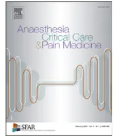

Guidelines

## Antibioprophylaxis in surgery and interventional medicine (adult patients). Update 2017☆☆☆☆

C. Martini, C. Auboyera, M. Boissonb, H. Dupontc, R. Gauzitd, M. Kitzise, M. Leonef,\*, A. Lepapeg, O. Mimozb, P. Montraversh, J.L. Pourriatd, Steering committee of the French Society of Anaesthesia and Intensive Care Medicine (SFAR) responsible for the establishment of the guidelines

a Anaesthesia and intensive care, hôpital Nord, 42055 Saint-Étienne, France

b Anaesthesia and intensive care, CHU La Milétie, 86021 Poitiers, France

c Anaesthesia and intensive care, CHU Amiens, Picardie, 80054 Amiens, France

d Anaesthesia and intensive care, Hôtel-Dieu, 75181 Paris, France

e Vascular surgery, hôpital de Vanves, 92170 Vanves, France

f Anaesthesia and intensive care, hôpital Nord, 13015 Marseille, France

g Anaesthesia and intensive care, CHU Lyon Sud, 69495 Lyon, France

h Anaesthesia and intensive care, CHU Bichat-Claude Bernard, 75877 Paris, France

i Anaesthesia and intensive Care, North university hospital, 13015 Marseille, France

ARTICLE INFOArticle history:

Available online 2 March 2019

Keywords:

Antibiotic prophylaxis  
Perioperative antibiotics  
Surgery  
Interventional radiology  
Postoperative infection

ABSTRACT

Infection is a risk for any intervention. In surgery, for example, pathogenic bacteria are found in more than 90% of operative wounds during closure. This exists whatever the surgical technique and whatever the environment (the laminar flow does not entirely eliminate this risk). These bacteria are few in number but can proliferate. They find in the operative wound a favourable environment (haematoma, ischaemia, modification of oxido-reduction potential...) and the intervention induces anomalies of the immune defences. In the case of the installation of foreign material, the risk is increased. The objective of antibiotic prophylaxis (ABP) is to prevent bacterial growth in order to reduce the risk of infection at the site of the intervention. The preoperative consultation represents a privileged moment to decide on the prescription of a ABP. It is possible to define the type of intervention planned, the associated risk of infection (and therefore the necessity or not of ABP), the time of prescription before surgery and any allergic antecedents which may modify the choice of the selected antibiotic molecule.

© 2019 The Author(s). Published by Elsevier Masson SAS on behalf of Société française d'anesthésie et de réanimation (Sfar). This is an open access article under the CC BY license (<http://creativecommons.org/licenses/by/4.0/>).

Experts' coordinator

C. Martin

Bibliography experts

C. Gakuba  
R. Bernard

Working groups

Société française de chirurgie orthopédique et traumatologique (SOFLOT) : Emmanuel de Thomasson, Franck Fitoussi, Société française de neurochirurgie (SFN) : Cédric Barrey, Société française

\* Validated by the SFAR Council on June 21st, 2018.

\*\* With the collaboration of the following societies: Société française de chirurgie orthopédique et traumatologique, Société française de neurochirurgie, Société française et francophone de chirurgie de l'obésité, Société française de stomatologie chirurgie maxillo-faciale et chirurgie orale, Société française d'hygiène hospitalière, Société française d'hygiène hospitalière, Société de chirurgie vasculaire et endovasculaire, Société de pathologie infectieuse de langue française, Société de chirurgie thoracique et cardiovasculaire de langue française, Association française d'urologie, Fédération française de chirurgie viscérale et digestive, Société française d'ophtalmologie, Collège national des gynécologues et obstétriciens français, Société française de radiologie, Société française de chirurgie plastique reconstructrice et esthétique, Société française oto-rhino-laryngologie et de la chirurgie de la face et du cou.

\* Corresponding author.

E-mail address: [Marc.LEONE@ap-hm.fr](mailto:Marc.LEONE@ap-hm.fr) (M. Leone).et francophone de chirurgie de l'obésité et des maladies métaboliques (SOFFCOMM) : Lionel Rebibo, Société française de stomatologie chirurgie maxillo-faciale et chirurgie orale (SFSCMFCO) : Laurent Guyot, Société française d'hygiène hospitalière (SF2H) : Anne-Marie Rogues, Olivia Keita-Perse, Société de chirurgie vasculaire et endovasculaire (SCVE) : Xavier Berard, Société de pathologie infectieuse de langue française (SPILF) : Eric Bonnet, Société de chirurgie thoracique et cardiovasculaire de langue française (SFCTCV) : Dominique Grisoli et Marco Alifano, Association française d'urologie (AFU) : Jean-Dominique Doublet, Fédération française de chirurgie viscérale et digestive (FCVD) : Frédéric Borie, Société française d'ophtalmologie (SFO) : Gilles Renard, Collège national des gynécologues et obstétriciens français (CNGOF) : Philippe Judlin, Société française de radiologie (SFR) : Vincent Vidal, Société française de chirurgie plastique reconstructrice et esthétique (SOFCPRE) : Jean-Pierre Reynaud, Jean-Louis Grolleau, Société française oto-rhino-laryngologie et de la chirurgie de la face et du cou (SFORL) : Béatrix Barry.

## 1. Preamble

Infection is a risk for any intervention. In surgery, for example, pathogenic bacteria are found in more than 90% of operative wounds during closure. This exists whatever the surgical technique and whatever the environment (the laminar flow does not entirely eliminate this risk). They find in the operative wound a favourable environment (haematoma, ischaemia, modification of oxidoreduction potential...) and the intervention induces anomalies of the immune system. In the case of the installation of foreign material, the risk is increased. The objective of antibiotic prophylaxis (ABP) is to prevent bacterial growth in order to reduce the risk of infection at the site of the intervention. The preoperative consultation represents a privileged moment to decide on the prescription of a ABP. It is possible to define the type of intervention planned, the associated risk of infection (and therefore the necessity or not of ABP), the time of prescription before surgery and any allergic antecedents which may modify the choice of the selected antibiotic molecule.

Since 1992, the SFAR has established and regularly updated recommendations for the prescription of ABP in surgery and interventional medicine for adult patients. The latest recommendations were established in 2010 and are being updated based on literature data published since then.

An exhaustive bibliographic search of the relevant articles was carried out on the available databases:

- • the French-based health assessment (<http://bfes.anaes.fr/HTML/index.html>);
- • the National Guideline Clearinghouse American ([Http://www.guidelines.gov](http://www.guidelines.gov));
- • the Lemanissier library in France (<http://www.bmlweb.org/consensus.html>);
- • the Cochrane Library (<http://www.cochrane.org/index0.htm>);
- • the PUBMED database (<http://www.pubmed.org>).

The keywords used were: antiopiophylaxis, antibiotic prophylaxis, surgery, interventional radiology, postoperative infection, antibiotic prophylaxis, perioperative antibiotics, surgery, interventional radiology, postoperative infection.

## 2. Methodology

### 2.1. General introduction to the GRADE method

The working method used for the preparation of these recommendations is the GRADE® method. After a quantitative

analysis of the literature, this method allows the quality of the evidence to be determined separately, and therefore an estimate of the confidence, which can be obtained from the quantitative analysis, and a level of recommendation are obtained. The quality of evidence is divided into four categories:

- • high: future research will most likely not change the confidence in the estimate of the effect;
- • moderate: future research will likely change the confidence in the estimate of the effect and may alter the estimate of the effect itself;
- • low: future research will most likely have an impact on the confidence in the estimate of the effect and will likely change the estimate of the effect itself;
- • very low: the estimate of the effect is very uncertain;

The quality of evidence analysis is performed for each judgment criterion and then an overall level of proof is defined based on the quality of the evidence of the critical criteria.

The final formulation of the recommendations is always binary: either positive or negative and either strong or weak:

- • strong: we recommend/we do not recommend (GRADE 1+ or 1–);
- • low: we suggest/we do not suggest (GRADE 2+ or 2–).

The strength of the recommendation is determined according to four key factors and validated by the experts after a vote, using the GRADE Grid method:

- • estimate of the effect;
- • the overall level of evidence: the higher the level of evidence, the more likely the recommendation;
- • the balance between desirable and undesirable effects: the more favourable the balance, the stronger the recommendation;
- • values and preferences: in case of uncertainty or great variability, the more likely the recommendation will be low; these values and preferences must be obtained as best as possible from the persons concerned (patient, doctor, decision-maker);
- • costs: the higher the costs or the resource utilisation, the more lower the recommendation.
- • to make a recommendation, at least 50% of the participants have to have an opinion and less than 20% must prefer the opposite proposition;
- • to make a strong recommendation at least 70% of the participants must agree;
- • if the experts do not have studies dealing specifically with the topic, or if there are no data on the main criteria, no recommendation will be issued. Expert advice may be given while clearly differentiating it from the recommendations.

## 3. Recommendations fields

The update of recommendations for the practice of antibiotic prophylaxis in surgery and interventional medicine (adult patients) is divided into 4 questions followed by recommendations in the form of tables framing the practice of prescribers.

1. 1. Which surgeries of the classes of Alteimeier must have antibiotic prophylaxis?
2. 2. What are the principles for the choice of antibiotics used?
3. 3. What is the time of prescription?
4. 4. What is the duration of the antibiotic prescription?#### 4. Question 1: Which Altemeier classes of surgeries must have an antibiotic prophylaxis?

R1 - We recommend using antibiotic prophylaxis in certain surgeries considered “clean” (See the tables below for the relevant surgeries) and all surgeries considered “clean-contaminated”  
(Grade 1+) Strong Agreement

##### 4.1. Rationale

Altemeier classes are clean surgery, clean-contaminated, contaminated, infected. ABP applies to certain interventions “clean” and all “clean-contaminated” [1–4]. For interventions considered “contaminated” and “infected”, infection is already in place and needs curative antibiotics, which have different rules, particularly in terms of prescription time [5,6].

#### 5. Question 2: What are the principles of choice of antibiotics used?

R2 - We recommend that the antibiotic include in its spectrum of activity the main bacteria involved in the surgical site infection.  
(Grade 1+) Strong Agreement

##### 5.1. Rationale

Antibiotic prophylaxis (ABP) must apply to defined bacterial targets, recognised as the most frequently involved. The protocol of ABP must include a molecule including in its spectrum bacterial targets. Methodologically acceptable work must have validated its activity, its local diffusion and its tolerance in this indication. It is essential to select molecules with a narrow spectrum of activity and which are approved in this indication [7–10].

Each team must determine in a written protocol which practitioner is responsible for prescribing and monitoring the ABP. This may be the anaesthesiologist, the surgeon, the gastroenterologist, the radiologist... In France, ABP is practically always managed by the anaesthesiologist. However, there is a shared responsibility with the operators. The protocol should clearly determine who does what in the field [11,12].

The initial (or loading) dose of antibiotic is usually twice the usual dose. This applies to a weight of 100 kg (the pharmacokinetic data can be assured of getting sufficient tissue concentrations of antibiotic. In obese patients (patients over 100 kg and body mass index > 35 kg/m2), even during non-bariatric surgery, the beta-lactams doses should be double those recommended for non-obese patients. For vancomycin and gentamicin see table for bariatric surgery. Re-injections are performed during the surgical period, every two half-lives of the antibiotic, at a dose that is similar to or half the initial dose. For example for cefazolin, with a half-life of 2 hours, reinjection is necessary only if the intervention lasts more than 4 hours.

ABP protocols are locally established after agreement between surgeons, anaesthesiologists, specialists in infectious diseases, microbiologists and pharmacists. They are the subjects of an economic analysis in relation to other possible choices. Their effectiveness is regularly reviewed by an oversight of surgical site infection rates and microorganisms responsible in surgical

patients or not. Regular evaluation of professional practices (EPP) is highly recommended (see Collège Français des anesthésistes-réanimateurs [www.cfar.org](http://www.cfar.org)) [13,14].

Systematic rotation with other molecules equally valid for the same indication may be considered. Thus, in each institution or surgical wards, an ABP policy must be established, i.e. a list of interventions grouped according to whether or not they are subject to ABP with, for each group, the molecule chosen and its alternative in case of allergy. In the same WARD, it is recommended to distinctly choose the molecules used in ABP and curative antibiotic therapy. The selected protocols must be written, co-signed by the anaesthesiologists and the operators.

These protocols must be available and may be displayed in pre-anaesthetic consultation rooms, intervention rooms, post-intervention surveillance rooms and care units.

Patients with particular infectious risk.

Many factors are considered possibly or probably related to the occurrence of surgical site infection. Their presence is not, however, the justification for prescribing ABP in situations where this is not recommended. Only studies with a high level of evidence on these patients would, if positive, allow the prescription of ABP in the presence of a given risk factor.

Subjects potentially colonised by nosocomial bacterial flora and early re-intervention for non-infectious cause.

This concerns hospitalised subjects in the three previous months in units with high risk of acquiring this type of flora: Intensive care units, nursing home or rehabilitation centres, travel abroad in the year before. The risk of colonisation by multi-resistant Enterobacteriaceae or methicillin-resistant *Staphylococcus aureus* then exists.

Patients undergoing early reoperation for a non-infectious cause.

For these patients, screening colonisation by multiresistant bacteria can be recommended. The usual choice of ABP can be modified by using, alone or in combination, antibiotic molecules normally used in curative treatment (3rd generation cephalosporins, systemic quinolones, aminoglycosides and vancomycin).

In all cases:

- • derogations from the usual protocols must remain exceptional. The potential benefit to the patient should be assessed against the risk for the community: emergence of bacterial resistances, cost;
- • the potential infectious risk should be clearly identified;
- • prescription must be short, limited to the operating period.

Patients who received radiotherapy, chemotherapy or corticosteroids, patients with diabetes, elderly patients, obese or anorexic.

Although these patients are at high risk of surgical site infection, they will have infections due to “bacteria targets” covered by the usual ABP. No modification of the protocols is justified in these patients.

Transplants (see [www.agence-biomedecine.fr](http://www.agence-biomedecine.fr) Biomedicine Agency - Recommendations Organ Transplant Infection Prevention graft).

The prevention of opportunistic infections linked to immunosuppression (viral, fungal and parasitic) is beyond the scope of the guidelines. With regard to prevention of infection of the surgical site, two situations can be summarised:

- • outpatient: postoperative infection caused by community bacteria. ABP is chosen according to the grafted organ;
- • patient potentially colonised by nosocomial flora: ABP is adapted according to the local ecology and includes molecules usually reserved for the treatments of the declared infections;
- • in all cases, the period of limitation remains limited; single dose or, at most, prescription up to 48 hours [15,16].## 6. Question 3: What is the time of prescribing?

R3 - We recommend starting antibiotic prophylaxis (ABP) before surgery within a period of about 30 minutes. When using vancomycin, we recommend infusion be started early enough to be completed 30 minutes before the procedure.  
(Grade 1+) Strong Agreement

### 6.1. Rationale

The optimal time of prescription has generated a very important debate in recent years especially for gynaecological surgery [17–45]. ABP must always precede the operation within approximately 30 minutes [9,17,18,45]. This is a fundamental point. The injection of the anaesthetic drugs should be separated by 5 to 10 minutes from that of ABP, so that, in the event of an allergic reaction, it is possible to determine what drug is responsible for what.

## 7. Question 4: What is the duration of the prescription?

R4 - We suggest prescription be limited to the operative period, sometimes 24 hours, exceptionally 48 hours and never beyond.  
(Grade 2) Strong Agreement

### 7.1. Rationale

ABP should be brief, limited to the operative period, sometimes 24 hours and exceptionally to 48 hours and never beyond [46–66]. The presence of drainage of the surgical site does not allow transgressing these recommendations. There is no reason to prescribe reinjection during removal of drains, probes or catheters [67–89]. The outpatient nature of surgery does not change the protocols usually used.

#### Not to be forgotten

The prescription of ABP is an integral part of the preoperative consultation. The anaesthesiologist and surgeon have all the necessary elements to make the best decision: planned intervention, patient history (allergies, infectious etc.), and ecology of the surgical wards. Efficiency of ABP is proven for many interventions, but its prescription must obey certain rules,

established from the data of numerous studies on the subject. ABP protocols must be re-evaluated on a regular basis. It takes into account new scientific data, the evolution of interventional techniques and bacterial resistance profiles.

- • The antibiotics used must be effective against the main bacteria responsible for post-operative infection.
- • It must be started before the procedure (within 30 minutes), so that the antibiotic is present before bacterial contamination occurs.
- • The duration of prescription should be brief, to minimise the ecological risk of resistant organisms to any antibiotic. A single preoperative injection has proven effective for many interventions and prescription beyond 48 hours is prohibited in all cases.
- • Effective tissue concentrations must be maintained throughout the procedure. Coverage of prolonged surgery is achieved either by using an antibiotic with a long half-life, or with intraoperative reinjection.
- • With equal efficiency, the practitioner must opt for the cheapest product.

#### Important note for prescribers

The proposed recommendations may not cover all clinical situations. Some procedures have not been scientifically evaluated as irrigation or topical antibiotics intraoperatively. Future publications will specify further what to do in these unclear situations.

In the absence of specific recommendations for a given situation, practitioners can, by assessing the risk/benefit ratio, prescribe ABP, and try to get similar conditions or techniques.

In Tables 1–16 are presented the recommendations from the expert in the different types of surgeries.

#### R5. Antibiotic prophylaxis in neurosurgery (Expert opinion)

### 7.2. Rationale

Without antibiotic prophylaxis (ABP) in neurosurgery craniotomy with and without implantation of foreign material, the risk of infection is 1 to 5%. This risk is on average 10%, when a

**Table 1**  
Neurosurgery.

<table border="1">
<thead>
<tr>
<th>Surgery</th>
<th>Product</th>
<th>Initial dose</th>
<th>Re-injection and duration</th>
</tr>
</thead>
<tbody>
<tr>
<td>CSF shunt</td>
<td>Cefazolin</td>
<td>2g IV slow</td>
<td>Single dose (if duration &gt; 4h reinject 1g)</td>
</tr>
<tr>
<td></td>
<td>Allergy: vancomycina</td>
<td>30 mg/kg/120 min</td>
<td>Single dose</td>
</tr>
<tr>
<td>External CSF shunt</td>
<td>No ABP</td>
<td></td>
<td></td>
</tr>
<tr>
<td>Craniotomy</td>
<td>Cefazolin</td>
<td>2g IV slow</td>
<td>Single dose (if duration &gt; 4h reinject 1g)</td>
</tr>
<tr>
<td></td>
<td>Allergy: vancomycina</td>
<td>30 mg/kg/120 min</td>
<td>Single dose</td>
</tr>
<tr>
<td>Neurosurgery transsphenoidal routes and trans-labyrinthine</td>
<td>Cefazolin</td>
<td>2g IV slow</td>
<td>Single dose (if duration &gt; 4h reinject 1g)</td>
</tr>
<tr>
<td></td>
<td>Allergy: vancomycina</td>
<td>30 mg/kg/120 min</td>
<td>Single dose</td>
</tr>
<tr>
<td>Spine surgery with implantation of prosthetic material</td>
<td>Cefazolin</td>
<td>2g IV slow</td>
<td>Single dose (if duration &gt; 4h reinject 1g)</td>
</tr>
<tr>
<td></td>
<td>Allergy: vancomycina</td>
<td>30 mg/kg/120 min</td>
<td>Single dose</td>
</tr>
<tr>
<td>Cranio-cerebral wounds</td>
<td>Peni A + IBb</td>
<td>2g IV slow</td>
<td>2 g every 8 hours 48h maximum</td>
</tr>
<tr>
<td></td>
<td>Allergy: vancomycina</td>
<td>30 mg/kg/120 min</td>
<td>30 mg/kg/day 48h maximum</td>
</tr>
<tr>
<td>Fracture of skull base with rhinorrhoea</td>
<td>No ABP</td>
<td></td>
<td></td>
</tr>
</tbody>
</table>

a Indications of vancomycin: allergy to beta-lactams; suspected or proven colonisation by methicillin-resistant staphylococcus, reoperation in a patient hospitalised in a unit with an ecology including methicillin-resistant *Staphylococcus aureus*, previous antibiotic therapy. The injection lasts 120 minutes and must end at the latest at the beginning of the intervention and the best 30 minutes before.

b Aminopenicillin + beta-lactamase inhibitor.**Table 2**  
Ophthalmology.

<table border="1">
<thead>
<tr>
<th>Surgery</th>
<th>Product</th>
<th>Initial dose</th>
<th>Dosage and duration</th>
</tr>
</thead>
<tbody>
<tr>
<td>Open eye surgery other than cataracts with risk factors (see above)</td>
<td>Levofloxacin oral</td>
<td>500 mg</td>
<td>1 tab 12 hours before +</td>
</tr>
<tr>
<td>Cataracta</td>
<td>Intracameral injection cefuroximea</td>
<td>1 mg in 0.1 mL</td>
<td>1 tab 2 to 4 hours before At the end of the procedure</td>
</tr>
<tr>
<td>Open eye trauma</td>
<td>Levofloxacin</td>
<td>500 mg</td>
<td>500 mg IV on day 1 +</td>
</tr>
<tr>
<td>Lacrimal ducts wounds</td>
<td>Peni A + IBb</td>
<td>2g</td>
<td>500 mg orally on day 2</td>
</tr>
<tr>
<td>Puncture of the anterior chamber</td>
<td>No ABP</td>
<td></td>
<td>Reinjection of 1g if &gt; 2 h</td>
</tr>
<tr>
<td>Subretinal fluid puncture</td>
<td>No ABP</td>
<td></td>
<td></td>
</tr>
<tr>
<td>Closed globe surgery</td>
<td>No ABP</td>
<td></td>
<td></td>
</tr>
<tr>
<td>Intravitreal injections</td>
<td>No ABP</td>
<td></td>
<td></td>
</tr>
</tbody>
</table>

a For cataract surgery with and without risk factors, a single injection into the anterior chamber of cefuroxime (1 mg) is approved since 2014.

b Aminopenicillin + beta-lactamase inhibitor.

**Table 3**  
Cardiac surgery.

<table border="1">
<thead>
<tr>
<th>Surgery</th>
<th>Product</th>
<th>Initial dose</th>
<th>Re-injection and duration</th>
</tr>
</thead>
<tbody>
<tr>
<td>Cardiac surgery</td>
<td>Cefazolin</td>
<td>2g IV + 1g in priming</td>
<td>1g at the 4th hour intraoperatively</td>
</tr>
<tr>
<td></td>
<td>Cefamandole or cefuroxime</td>
<td>1.5g IV + 0.75g priming</td>
<td>1 reinjection 0.75g every 2 hours intraoperatively</td>
</tr>
<tr>
<td></td>
<td>Allergy: vancomycina</td>
<td>30 mg/kg/120 min</td>
<td>Single dose</td>
</tr>
<tr>
<td>Pacemaker</td>
<td>See above heart surgery</td>
<td>See above heart surgery</td>
<td>Single dose</td>
</tr>
<tr>
<td>Endovascular procedure</td>
<td>See above heart surgery</td>
<td>See above heart surgery</td>
<td>Single dose</td>
</tr>
<tr>
<td>Pericardial drainage</td>
<td>No ABP</td>
<td></td>
<td></td>
</tr>
<tr>
<td>Coronary dilatation</td>
<td>No ABP</td>
<td></td>
<td></td>
</tr>
<tr>
<td>+/- stent</td>
<td></td>
<td></td>
<td></td>
</tr>
<tr>
<td>ECMO...</td>
<td>No ABP</td>
<td></td>
<td></td>
</tr>
</tbody>
</table>

a Indications of vancomycin: allergy to beta-lactams; suspected or proven colonisation by methicillin-resistant staphylococcus, reoperation in a patient hospitalised in a unit with an ecology including methicillin-resistant *Staphylococcus aureus*, previous antibiotic therapy. The injection lasts 120 minutes and must end at the latest at the beginning of the intervention and the best 30 minutes before.

**Table 4**  
Vascular surgery.

<table border="1">
<thead>
<tr>
<th>Surgery</th>
<th>Product</th>
<th>Initial dose</th>
<th>Re-injections and duration</th>
</tr>
</thead>
<tbody>
<tr>
<td>Surgery of the aorta, arteries of the lower limbs, supra-aortic trunks</td>
<td>Cefazolin</td>
<td>2g IV slow</td>
<td>Single dose (if time &gt; 4 h, reinject 1g)</td>
</tr>
<tr>
<td></td>
<td>Cefamandole or cefuroxime</td>
<td>1.5g IV slow</td>
<td>Single dose (if duration &gt; 2 h, reinject 0.75g)</td>
</tr>
<tr>
<td>Arterial endoprosthesis. Carotid surgery with patch</td>
<td>Allergy: vancomycina</td>
<td>30 mg/kg/120 min</td>
<td>Single dose</td>
</tr>
<tr>
<td>Expansion with or without stent</td>
<td>See above</td>
<td></td>
<td>Single dose</td>
</tr>
<tr>
<td></td>
<td>Aortic surgery</td>
<td>Aortic surgery</td>
<td></td>
</tr>
<tr>
<td>Carotid surgery without patch</td>
<td>No ABP</td>
<td>No ABP</td>
<td></td>
</tr>
<tr>
<td>Limb amputation</td>
<td>Peni A + IBb</td>
<td>2g IV slow</td>
<td>1g/6 hours for a period of 48 hours</td>
</tr>
<tr>
<td></td>
<td>Allergy: clindamycin + gentamicin</td>
<td>900 mg IV slow</td>
<td>600 mg/6 hours for 48 hours</td>
</tr>
<tr>
<td></td>
<td></td>
<td>5 mg/kg/d</td>
<td>Reinject 5 mg/kg at hour 24</td>
</tr>
<tr>
<td>Vein surgery</td>
<td>No ABP</td>
<td></td>
<td></td>
</tr>
</tbody>
</table>

a Indications of vancomycin: allergy to beta-lactams, suspected or proven colonisation by methicillin-resistant staphylococcus, reoperation in a patient hospitalised in a unit with an ecology including methicillin-resistant *Staphylococcus aureus*, previous antibiotic therapy. The injection lasts 120 minutes and must end at the latest at the beginning of the intervention and the best 30 minutes before.

b Aminopenicillin + beta-lactamase inhibitor.

cerebrospinal fluid shunt (CSF) is present. Infection can be localised at the surgical site or extended to the brain or ventricles. The decrease in the risk of infection by antibiotic prophylaxis is unquestionable in the presence of a craniotomy and very likely during the installation of a CSF shunt valve. In spinal surgery, a meta-analysis recommends the use of an ABP but does not specify whether it applies to surgeries with implementation or not of material.

Target bacteria: Enterobacteriaceae (especially after craniotomies), staphylococci (*S. aureus* and *S. epidermidis*), anaerobic bacteria flora (especially after cranio-cerebral wound) (Table 1).

R6. Antibiotic prophylaxis in ophthalmic surgery  
(Expert opinion)

### 7.3. Rationale

The major risk of infection of eye surgery is represented by endophthalmitis whose consequences can lead to the loss of the eye.

For cataract surgery (800,000 patients/year in France), the risk of postoperative endophthalmitis, in the absence of antibiotic prophylaxis, is 2 to 3/1000. Following the recommendations of the AFSSAPS published in 2011, the vast majority of surgeons use systematically intracameral injection of 1 mg of cefuroxime after surgery. In exceptional cases of allergy to cefuroxime, the recommendations are the same as for other intraocular surgeries, adding as a risk factor extracapsular extraction and secondary implantation.

For other surgeries, antibiotic prophylaxis is recommended only in the presence of the following risk factors:**Table 5**  
Orthopaedic surgery.

<table border="1">
<thead>
<tr>
<th>Surgical act</th>
<th>Product</th>
<th>Initial dose</th>
<th>Re-injection and duration</th>
</tr>
</thead>
<tbody>
<tr>
<td rowspan="4">Joint prosthesis (upper limb, lower limb)</td>
<td>Cefazolin</td>
<td>2g IV slow</td>
<td>1g if duration &gt; 4 h Limited to the operative period (24 hours max)</td>
</tr>
<tr>
<td>Cefamandole</td>
<td>1.5g IV slow</td>
<td>0.75g if duration &gt; 2 h Limited to the operative period (24 hours max)</td>
</tr>
<tr>
<td>Cefuroxime</td>
<td>1.5g IV slow</td>
<td>0.75g if duration &gt; 2 h Limited to the operative period (24 hours max)</td>
</tr>
<tr>
<td>Allergy: clindamycine or vancomycin</td>
<td>900 mg IV slow 30 mg/kg/120 min</td>
<td>Limited to the operative period (24 hours max)</td>
</tr>
<tr>
<td>Foreign material (resorbable or not, cement, bone graft...) and whatever the technique (percutaneous, videoscopy...)</td>
<td>Cefazolin</td>
<td>2g IV slow</td>
<td>1g if duration &gt; 4 h</td>
</tr>
<tr>
<td>Joint surgery arthrotoomy</td>
<td>Allergy: clindamycin or vancomycin</td>
<td>900 mg IV slow 30 mg/kg/120 min</td>
<td>Single dose</td>
</tr>
<tr>
<td>Arthroscopy without implant (with or without meniscectomy) extra-articular soft tissue surgery without implant</td>
<td>No ABP</td>
<td></td>
<td></td>
</tr>
<tr>
<td rowspan="2">Spine surgery with implantation of prosthetic material</td>
<td>Cefazolin</td>
<td>2g IV slow</td>
<td>Single dose (if duration &gt; 4h reinject 1g)</td>
</tr>
<tr>
<td>Allergy: vancomycina</td>
<td>30 mg/kg/120 min</td>
<td>Single dose</td>
</tr>
</tbody>
</table>

a Indications of vancomycin: allergy to beta-lactams, suspected or proven colonisation by methicillin-resistant staphylococcus, reoperation in a patient hospitalised in a unit with an ecology including methicillin-resistant *Staphylococcus aureus*, previous antibiotic therapy. The injection lasts 120 minutes and must end at the latest at the beginning of the intervention and the best 30 minutes before.

**Table 6**  
Trauma.

<table border="1">
<thead>
<tr>
<th>Surgical act</th>
<th>Product</th>
<th>Dosage</th>
<th>Reinjection and duration</th>
</tr>
</thead>
<tbody>
<tr>
<td>Closed fracture requiring isolated extrafocal osteosynthesis</td>
<td>No ABP</td>
<td></td>
<td></td>
</tr>
<tr>
<td>Closed fracture requiring intrafocal osteosynthesis</td>
<td>Cefazolin</td>
<td>2g slow IV</td>
<td>1g if duration &gt; 4 h Limited to the operative period (24 hours max)</td>
</tr>
<tr>
<td>Open fracture stage I Cauchoir</td>
<td></td>
<td></td>
<td></td>
</tr>
<tr>
<td>Soft tissue wound non-contused, with or without lesion of artery, nerve, tendon</td>
<td>Cefamandole</td>
<td>1.5g slow IV</td>
<td>0.75g if duration &gt; 2 h Limited to the operative period (24 hours max)</td>
</tr>
<tr>
<td>Articular wound</td>
<td>Cefuroxime</td>
<td>1.5g slow IV</td>
<td>0.75g if duration &gt; 2 h Limited to the operative period (24 hours max)</td>
</tr>
<tr>
<td rowspan="4">Open fracture stage II and III Cauchoir</td>
<td>Allergy: clindamycin + gentamicin</td>
<td>900 mg slow IV 5 mg/kg/d</td>
<td>600 mg if duration &gt; 4 h</td>
</tr>
<tr>
<td>Peni A+IBa</td>
<td>2g IV slow</td>
<td>1g if duration &gt; 2 h 48 h maximum</td>
</tr>
<tr>
<td>Allergy: clindamycin</td>
<td>900 mg IV slow</td>
<td>600 mg if duration &gt; 4 h 48 h maximum</td>
</tr>
<tr>
<td>+ gentamicin</td>
<td>5 mg/kg/d</td>
<td>48 h maximum</td>
</tr>
</tbody>
</table>

a Aminopenicillin + beta-lactamase inhibitor.

- • diabetes, intraocular implantation of a device other than during cataract;
- • special cases: history of endophthalmitis, monophthalmic patient.

Topical antibiotic prophylaxis is a prescription of the ophthalmologist. It is not within the competence field of anaesthetists.

Target bacteria: staphylococci, streptococci, *H. influenzae*, enterobacteria (Table 2).

R7. Antibiotic prophylaxis in cardiac surgery  
(Expert opinion)

#### 7.4. Rationale

Cardiac surgery is a clean surgery (class 1 Altemeier). Extracorporeal circulation, duration of response and the complexity of procedures may increase the risk of infection. The usefulness of antibiotic prophylaxis has been clearly demonstrated. Its prescription beyond the operative period is not recommended. The use of local antibiotics is not recommended.

Target bacteria: *S. aureus*, *S. epidermidis*, some Gram-negative bacteria (Table 3).

R8. Antibiotic prophylaxis in vascular surgery  
(Expert opinion)

Vascular surgery is a clean surgery (class 1 Altemeier) but some procedures can be classified as clean-contaminated if distal trophic disorder or even dirty for amputations of infected gangrene. The effectiveness of antibiotic prophylaxis has been clearly demonstrated in this type of surgery. Antibiotic prophylaxis should be practiced even if antibiotic therapy is given before surgery to treat a distal trophic disorder. The use of prostheses soaked in antibiotics is always associated with IV antiopiophylaxis. Antibiotic prophylaxis should be made regardless of the surgical approach (laparoscopic or open).

Target bacteria: *S. aureus*, *S. epidermidis*, gram-negative bacilli (Table 4).

R9. Antibiotic prophylaxis in orthopaedic surgery  
(Expert Opinion)

#### 7.5. Rationale

The incidence of postoperative infection in prosthetic joint surgery without ABP is 3 to 5%. The ABP can reduce this rate to less than 1%.**Table 7**  
Thoracic surgery.

<table border="1">
<thead>
<tr>
<th>Surgery</th>
<th>Product</th>
<th>Initial dose</th>
<th>Re-injection and duration</th>
</tr>
</thead>
<tbody>
<tr>
<td>Pulmonary resection (including video-assisted surgery)</td>
<td>Peni A + IBa or cefamandole or cefuroxime or cefazoline Allergy: clindamycine + gentamicin</td>
<td>2g IV slow 1.5g IV slow 1.5g IV slow 2g IV slow 900 mg IV slow 5 mg/kg/d</td>
<td>Single dose (if duration &gt; 2h reinject 1g) Single dose (if duration &gt; 2h reinject 0.75g) Single dose (if duration &gt; 2h reinject 0.75g) Single dose (if time &gt; 4h reinject 1g) Single dose (if duration &gt; for 4h, inject 600 mg) Single dose</td>
</tr>
<tr>
<td>Mediastinal surgery Surgery for pneumothorax Decortication (uninfected patient) Isolated parietal resection</td>
<td>Cefamandole or cefuroxime or cefazoline Allergy: clindamycine + gentamicin</td>
<td>1.5g IV slow 1.5g IV slow 2g IV slow 900 mg IV slow 5 mg/kg/d</td>
<td>Single dose (if duration &gt; 2h reinject 0.75g) Single dose (if duration &gt; 2h reinject 0.75g) Single dose (if time &gt; 4h reinject 1g) Single dose (if time &gt; 4h inject 600 mg) Single dose</td>
</tr>
<tr>
<td>Mediastinoscopy, videothoracoscopy Tracheostomy Thoracic drainage</td>
<td>No ABP No ABP No ABP</td>
<td></td>
<td></td>
</tr>
</tbody>
</table>

a Aminopenicillin + inhibitor of beta-lactamases.

**Table 8**  
ENT.

<table border="1">
<thead>
<tr>
<th>Surgery</th>
<th>Product</th>
<th>Initial dose</th>
<th>Re-injection and duration</th>
</tr>
</thead>
<tbody>
<tr>
<td>Rhinologic surgery with placement of a graft or reoperation</td>
<td>Cefazolin</td>
<td>2g IV slow</td>
<td>Single dose</td>
</tr>
<tr>
<td rowspan="3">Neck Surgery with oropharyngeal opening. Surgery of the salivary glands with access through the oropharyngeal cavity</td>
<td>Peni A + IBa</td>
<td>2g IV slow</td>
<td>Single dose</td>
</tr>
<tr>
<td>Peni A + IBa</td>
<td>2g IV slow</td>
<td>Re-injection of 1g every 2h during intraoperative then 1g every 6 hours for 24 hours</td>
</tr>
<tr>
<td>Allergy: clindamycin + gentamicin</td>
<td>900 mg IV slow 5 mg/kg/d</td>
<td>Re-injection of 600 mg if duration &gt; 4h and then 600 mg/6 hours for 24 hours Single dose</td>
</tr>
<tr>
<td>Stapes surgery, middle ear Alveolar surgery</td>
<td>No ABP Prevention of endocarditis (see endocarditis prophylaxis)</td>
<td></td>
<td></td>
</tr>
<tr>
<td>Salivary glands surgery without access by the oropharyngeal cavity</td>
<td>No ABP</td>
<td></td>
<td></td>
</tr>
<tr>
<td>Cervicotomy</td>
<td>No ABP</td>
<td></td>
<td></td>
</tr>
<tr>
<td>Lymphadenectomy</td>
<td>No ABP</td>
<td></td>
<td></td>
</tr>
<tr>
<td>Velopalatin surgery</td>
<td>No ABP</td>
<td></td>
<td></td>
</tr>
<tr>
<td>Tonsillectomy</td>
<td>No ABP</td>
<td></td>
<td></td>
</tr>
</tbody>
</table>

a Aminopenicillin + beta-lactamase inhibitor.

**Table 9**  
Maxillo facial surgery.

<table border="1">
<thead>
<tr>
<th>Surgery</th>
<th>Product</th>
<th>Initial dose</th>
<th>Re-injection and duration</th>
</tr>
</thead>
<tbody>
<tr>
<td rowspan="2">Maxillofacial surgery with oropharyngeal opening. Surgery of the salivary glands with access through the oropharyngeal cavity</td>
<td>Peni A + IBa</td>
<td>2g IV slow</td>
<td>Re-injection of 1g every 2h during intraoperative then 1g every 6 hours for 24 hours</td>
</tr>
<tr>
<td>Allergy: clindamycin + gentamicin</td>
<td>900 mg IV slow 5 mg/kg/day</td>
<td>Re-injection of 600 mg if duration &gt; 4h and then 600 mg/6 hours for 24 hours Single dose</td>
</tr>
<tr>
<td>Alveolar surgery</td>
<td>Prevention of endocarditis (see endocarditis prophylaxis)</td>
<td></td>
<td></td>
</tr>
<tr>
<td>Salivary glands surgery without access by the oropharyngeal cavity</td>
<td>No ABP</td>
<td></td>
<td></td>
</tr>
<tr>
<td>Cervicotomy</td>
<td>No ABP</td>
<td></td>
<td></td>
</tr>
<tr>
<td>Lymphadenectomy</td>
<td>No ABP</td>
<td></td>
<td></td>
</tr>
<tr>
<td>Velopalatin surgery</td>
<td>No ABP</td>
<td></td>
<td></td>
</tr>
<tr>
<td>Tooth extraction in non-septic environment</td>
<td>Prevention of endocarditis (see endocarditis prophylaxis)</td>
<td></td>
<td></td>
</tr>
</tbody>
</table>

a Aminopenicillin + beta-lactamase inhibitor.**Table 10**  
Digestive surgery.

<table border="1">
<thead>
<tr>
<th>Surgery</th>
<th>Product</th>
<th>Initial dose</th>
<th>Re-injection and duration</th>
</tr>
</thead>
<tbody>
<tr>
<td>Oesophageal Surgery (without coloplasty)</td>
<td>Cefazolin</td>
<td>2g IV slow</td>
<td>Single dose (if duration &gt; 4 pm reinject 1g)</td>
</tr>
<tr>
<td>Gastroduodenal surgery (including endoscopic gastrostomy and duodenopancreatectomy)</td>
<td></td>
<td></td>
<td></td>
</tr>
<tr>
<td>Pancreatic surgery</td>
<td></td>
<td></td>
<td></td>
</tr>
<tr>
<td>Liver surgery</td>
<td>Cefuroxime or Cefamandole</td>
<td>1.5g IV slow</td>
<td>Single dose (if duration &gt; 2h reinject 0.75g)</td>
</tr>
<tr>
<td></td>
<td>Allergy: gentamicin + clindamycin</td>
<td>5 mg/kg/d 900 mg IV slow</td>
<td>Single dose Single dose (if duration &gt; for 4h, inject 600 mg)</td>
</tr>
<tr>
<td>Biliary tract surgery (the biliary prosthesis patients are excluded from recommendations)</td>
<td>Cefazolin</td>
<td>2g IV slow</td>
<td>Single dose (if duration &gt; 4h, reinject 1g)</td>
</tr>
<tr>
<td></td>
<td>Cefuroxime or Cefamandole</td>
<td>1.5g IV slow</td>
<td>Single dose (if duration &gt; 2h, reinject 0.75g)</td>
</tr>
<tr>
<td></td>
<td>Allergy: gentamicin + clindamycin</td>
<td>5mg/kg/d 900 mg IV slow</td>
<td>Single dose Single dose (if duration &gt; 4h, inject 600 mg)</td>
</tr>
<tr>
<td>Gallbladder surgery laparoscopically without risk factorsa</td>
<td>No ABP</td>
<td></td>
<td></td>
</tr>
<tr>
<td>Colonic and intestinal surgery</td>
<td>Cefoxitin + metronidazole</td>
<td>2g IV Slow</td>
<td>Single dose (if duration &gt; 2h reinject 1g)</td>
</tr>
<tr>
<td></td>
<td></td>
<td>1g infusion</td>
<td>Single dose</td>
</tr>
<tr>
<td></td>
<td>Allergy: imidazolé + gentamicine</td>
<td>1g (infusion)</td>
<td>Single dose</td>
</tr>
<tr>
<td>Anal surgery</td>
<td>Imidazole</td>
<td>5 mg/kg/d</td>
<td>Single dose</td>
</tr>
<tr>
<td>Hernia without prosthetic plate</td>
<td>No ABP</td>
<td>1g (infusion)</td>
<td>Single dose</td>
</tr>
<tr>
<td>Hernia with establishment of a prosthetic plate</td>
<td>Cefazolin</td>
<td>2g IV slow</td>
<td>Single dose (if duration &gt; 4h, reinject 1g)</td>
</tr>
<tr>
<td></td>
<td>Cefuroxime or Cefamandole</td>
<td>1.5g IV slow</td>
<td>Single dose (if duration &gt; 2h, reinject 0.75g)</td>
</tr>
<tr>
<td></td>
<td>Allergy: gentamicin + clindamycin</td>
<td>5 mg/kg/day 900 mg IV slow</td>
<td>Single dose Single dose (if duration &gt; for 4h, inject 600 mg)</td>
</tr>
<tr>
<td>Eventration</td>
<td>Cefazolin</td>
<td>2g IV slow</td>
<td>Single dose (if duration &gt; 4h, reinject 1g)</td>
</tr>
<tr>
<td></td>
<td>Cefuroxime or Cefamandole</td>
<td>1.5g IV slow</td>
<td>Single dose (if duration &gt; 2h, reinject 0.75g)</td>
</tr>
<tr>
<td></td>
<td>Allergy: gentamicin + clindamycin</td>
<td>5 mg/kg/d 900 mg IV slow</td>
<td>Single dose Single dose (if duration &gt; for 4h, inject 600 mg)</td>
</tr>
<tr>
<td>Abdomen wounds</td>
<td>See colorectal surgery</td>
<td>See colorectal surgery</td>
<td>See colorectal surgery</td>
</tr>
<tr>
<td>Prolaps (any surgical approach)</td>
<td>Peni A + IBb</td>
<td>2g IV slow</td>
<td>Single dose. 1g if duration &gt; 2h</td>
</tr>
<tr>
<td></td>
<td>Allergy: gentamicin + metronidazole</td>
<td>5 mg/kg/d 1g</td>
<td>Single dose Single dose</td>
</tr>
</tbody>
</table>

a Laparoscopic cholecystectomy without risk factors: absence of recent cholecystitis, no conversion to laparotomy (on the event of conversion to ABP), no pregnancy, no immune suppression, no exploration of bile duct intraoperatively. If risk factors refer to the "biliary tract surgery".

b Aminopenicillin + beta-lactamase inhibitor.

For the primary arthroplasty the use of cement impregnated with antibiotic must be associated with IV antibiotic.

Secondary arthroplasty during the same hospitalisation for non-infectious cause (haematoma, dislocation...) requires ABP different of the initial ABP. Methicillin-resistant *S. aureus* should probably be considered.

Late re-intervention (within one year after surgery) for mechanical causes in an ambulatory patient does not require modification of the initial ABP.

Target bacteria: *S. aureus*, *S. epidermidis*, *Propionibacterium*, *Streptococcus spp*, *E. coli*, *K. pneumoniae* (Table 5)

R10. Antibiotic prophylaxis in traumatology  
(Expert opinion)

## 7.6. Rationale

The frequency of postoperative infections in trauma surgery is higher than for elective surgery regardless of the stage of severity.

Target bacteria: *S. aureus*, *S. epidermidis*, *Propionibacterium*, *Streptococcus spp*, *E. coli*, *E. cloacae*, *K. pneumoniae*, *Bacillus cereus*, anaerobic telluric (Table 6).

R11. Antibiotic prophylaxis in thoracic surgery  
(Expert opinion)

## 7.7. Rationale

Non-cardiac thoracic surgery may be a clean surgery (class 1 Altemeier) (mediastinal surgery, VATS) or clean contaminated surgery (class 2) in case of opening of bronchi or trachea. Despite the complexity of situations, the utility of ABP is no longer contested today as shown by the number of validated scientific studies.

Target bacteria: *Staphylococcus*, *S. pneumoniae*, *H. influenzae*, Gram-negative bacteria (Table 7).

R12. Antibiotic prophylaxis ENT surgery  
(Expert opinion)**Table 11**  
Urology.

<table border="1">
<thead>
<tr>
<th>Surgery</th>
<th>Product</th>
<th>Initial dose</th>
<th>Re-injection and duration</th>
</tr>
</thead>
<tbody>
<tr>
<td><b>Prostate surgery</b></td>
<td></td>
<td></td>
<td></td>
</tr>
<tr>
<td>Endoscopic resection of the prostate, cervical-prostatic incision prostatectomy</td>
<td>Cefazolin Cefamandole or cefuroxime Allergy: gentamicin</td>
<td>2g IV slow 1.5g IV slow 5 mg/kg</td>
<td>Single dose (if duration &gt; 4h reinject 1 g) Single dose (if duration &gt; 2h, reinject 0.75 g) Single dose</td>
</tr>
<tr>
<td>Radical prostatectomy</td>
<td>No ABP</td>
<td></td>
<td></td>
</tr>
<tr>
<td>Prostate biopsy</td>
<td>Ofloxacin orally Allergy: ceftriaxone</td>
<td>Single dose 400 mg (1 hour prior to biopsy) 1g</td>
<td>Single dose Single dose</td>
</tr>
<tr>
<td><b>Kidney surgery, adrenal and urinary tract</b></td>
<td></td>
<td></td>
<td></td>
</tr>
<tr>
<td>Endoscopic treatment of the renal and ureteral ithiasis; ureteroscopy, percutaneous nephrolithotomy, nephrostomy, JJ probe mounted or ureteral</td>
<td>Cefazolin Cefamandole and cefuroxime Allergy: gentamicin</td>
<td>2g IV slow 1.5g IV slow 5 mg/kg/day</td>
<td>Single dose (if duration &gt; 4h reinject 1 g) Single dose (if duration &gt; 2h, reinject 0.75 g) Single dose</td>
</tr>
<tr>
<td>Nephrectomy and other upper tract surgery</td>
<td>No ABP</td>
<td></td>
<td></td>
</tr>
<tr>
<td>Adrenalectomy</td>
<td>No ABP</td>
<td></td>
<td></td>
</tr>
<tr>
<td>Extracorporeal lithotripsy</td>
<td>No ABP</td>
<td></td>
<td></td>
</tr>
<tr>
<td><b>Bladder surgery</b></td>
<td></td>
<td></td>
<td></td>
</tr>
<tr>
<td>Transurethral resection of the bladder</td>
<td>Cefazolin Cefamandole and cefuroxime Allergy: gentamicin</td>
<td>2g IV slow 1.5g IV slow 5 mg/kg</td>
<td>Single dose (if duration &gt; 4 pm reinject 1g) Single dose (if duration &gt; 2h reinject 0.75g) Single dose</td>
</tr>
<tr>
<td>Cystectomy (Bricker, bladder replacement)</td>
<td>PENI A + IBa Allergy: gentamicin + metronidazole</td>
<td>2g IV slow 5 mg/kg 1 g infusion</td>
<td>Single dose (if duration &gt; 2h reinject 1g) Single dose Single dose</td>
</tr>
<tr>
<td><b>Surgery of the urethra</b></td>
<td></td>
<td></td>
<td></td>
</tr>
<tr>
<td>Urethroplasty, urethrotomy</td>
<td>Cefazolin Cefamandole and cefuroxime Allergy: gentamicine</td>
<td>2g IV slow 1.5g IV slow 5 mg/kg</td>
<td>Single dose Single dose Single dose</td>
</tr>
<tr>
<td>Artificial sphincter</td>
<td>Cefoxitin or amoxicillin + clavulanic acid Allergy: gentamicin + metronidazole</td>
<td>2g IV slow 5 mg/kg 1g infusion</td>
<td>Single dose</td>
</tr>
<tr>
<td>Urethral support (TOT, TVT)</td>
<td>PENI A + IBa Allergy: gentamicin + metronidazole</td>
<td>2g IV slow 5 mg/kg 1g infusion</td>
<td>Single dose</td>
</tr>
<tr>
<td><b>Male genital system</b></td>
<td></td>
<td></td>
<td></td>
</tr>
<tr>
<td>Scrotal surgery or rod (not replacement)</td>
<td>No ABP</td>
<td></td>
<td></td>
</tr>
<tr>
<td>Penile prosthesis or testicular</td>
<td>Cefazolin Allergy: vancomycinb</td>
<td>2g IV slow 30 mg/kg/120 min</td>
<td>Single dose (if duration &gt; 2h, inject 1 g) Single dose</td>
</tr>
<tr>
<td><b>Female genital system</b></td>
<td></td>
<td></td>
<td></td>
</tr>
<tr>
<td>Treatment of prolapse (any surgical approach)</td>
<td>PENI A + IBa Allergy: metronidazole + Gentamicine</td>
<td>2g IV slow 1g 5 mg/kg/d</td>
<td>Single dose (reinject 1g if &gt; 2h) Single dose Single dose</td>
</tr>
<tr>
<td>Diagnostic investigations, bladder fibroscopy, urodynamic evaluation, ureteroscopic diagnostic</td>
<td>No ABP</td>
<td></td>
<td></td>
</tr>
</tbody>
</table>

a Indications of vancomycin: allergy to beta-lactams; suspected or proven colonisation by methicillin-resistant staphylococcus, reoperation in a patient hospitalised in a unit with an ecology including methicillin-resistant *Staphylococcus aureus*, previous antibiotic therapy. The injection lasts 120 minutes and must end at the latest at the beginning of the intervention and the best 30 minutes before.

b Aminopenicillin + beta-lactamase inhibitor.

## 7.8. Rationale

In ENT surgery with oropharyngeal opening (primarily neoplastic surgery) the risk of infection is high (about 30% of patients). Many studies have clearly demonstrated the value of ABP in this type of surgery. The duration of the ABP should not exceed 24 hours as evidenced by the methodologically correct studies. Beyond this period, it is a curative antibiotic therapy. The presence of drainage is not an argument for extending the duration of the ABP.

Target bacteria: *Streptococcus*, anaerobic bacteria, *S. aureus*, *K. pneumoniae*, *E. coli* (Table 8).

R13. Antibiotic prophylaxis in dentistry and maxillofacial surgery (Expert opinion)

## 7.9. Rationale

In stomatology and maxillofacial surgery with oropharyngeal opening (primarily neoplastic surgery) the risk of infection is high (about 30% of patients). Many studies have clearly demonstrated the value of ABP in this type of surgery. The duration of ABP should not exceed 48 hours as evidenced by the methodologically correct studies. Beyond this period, it is a curative antibiotic therapy. The presence of drainage is not an argument for extending the duration of the ABP.

Target bacteria: *Streptococcus*, anaerobic bacteria, *S. aureus*, *K. pneumoniae*, *E. coli* (Table 9)

R14. Antibiotic prophylaxis in gastrointestinal surgery (Expert opinion)**Table 12**

Gynecology obstetrics.

<table border="1">
<thead>
<tr>
<th>Surgery</th>
<th>Product</th>
<th>Initial dose</th>
<th>Re-injection and duration</th>
</tr>
</thead>
<tbody>
<tr>
<td>Hysterectomy (high or low road)</td>
<td>Cefazolin</td>
<td>2g IV slow</td>
<td>Single dose (if duration &gt; 4 h, inject 1 g)</td>
</tr>
<tr>
<td>Coeliosurgery</td>
<td>Cefamandole</td>
<td>1.5g IV slow</td>
<td>Single dose (if duration &gt; 2 h, reinject 0.75 g)</td>
</tr>
<tr>
<td></td>
<td>Cefuroxime</td>
<td>1.5g IV slow</td>
<td>Single dose (if duration &gt; 2 h, reinject 0.75 g)</td>
</tr>
<tr>
<td></td>
<td>Allergy: clindamycin + gentamicin</td>
<td>900 mg IV slow</td>
<td>Single dose</td>
</tr>
<tr>
<td></td>
<td></td>
<td>5 mg/kg/day</td>
<td>Single dose</td>
</tr>
<tr>
<td>Laparoscopy diagnostic or exploratory without vaginal incision or digestive</td>
<td>No ABP</td>
<td></td>
<td></td>
</tr>
<tr>
<td>Hysteroscopy hysterosalpingography</td>
<td>No ABP</td>
<td></td>
<td></td>
</tr>
<tr>
<td>Endometrial biopsy</td>
<td>No ABP</td>
<td></td>
<td></td>
</tr>
<tr>
<td>In vitro fertilisation</td>
<td>No ABP</td>
<td></td>
<td></td>
</tr>
<tr>
<td>Laying of an intrauterine device</td>
<td>No ABP</td>
<td></td>
<td></td>
</tr>
<tr>
<td>Abortion</td>
<td>No ABP</td>
<td></td>
<td></td>
</tr>
<tr>
<td>Caesarean section</td>
<td>Cefazolin</td>
<td>2g IV</td>
<td>Single dose</td>
</tr>
<tr>
<td></td>
<td>Cefamandole</td>
<td>1.5g IV</td>
<td>The addition of IV azithromycin to conventional antibiotic prophylaxis significantly reduces surgical site infections. The IV formulation is only available in France in 2016 for temporary authorization procedure but if it is marketed in the future the antibiotic protocols should be modified with prescribing this drug</td>
</tr>
<tr>
<td></td>
<td>Cefuroxime</td>
<td>1.5g IV</td>
<td></td>
</tr>
<tr>
<td></td>
<td>Allergy: clindamycin</td>
<td>900 mg IV slow</td>
<td></td>
</tr>
<tr>
<td>Mastectomy</td>
<td>Cefazolin</td>
<td>2g IV</td>
<td>Single dose (1g if duration &gt; 4 hours)</td>
</tr>
<tr>
<td>Reconstruction and/or mammoplasty</td>
<td>Cefamandole</td>
<td>1.5g IV</td>
<td>Single dose (0.75g if duration &gt; 2h)</td>
</tr>
<tr>
<td></td>
<td>Cefuroxime</td>
<td>1.5g IV</td>
<td>Single dose (0.75g if duration &gt; 2h)</td>
</tr>
<tr>
<td></td>
<td>Allergy: clindamycin + gentamicin</td>
<td>900 mg IV slow</td>
<td>Single dose. 600 mg if time &gt; 4h</td>
</tr>
<tr>
<td></td>
<td></td>
<td>5 mg/kg/d</td>
<td>Single dose</td>
</tr>
<tr>
<td>Simple breast lumpectomy</td>
<td>No ABP</td>
<td></td>
<td></td>
</tr>
<tr>
<td>Prolaps (all surgical approaches; only in case of implementation of prosthetic material: promontofixation, implant placement or strip...)</td>
<td>Peni A + IBa</td>
<td>2g IV slow</td>
<td>Single dose. 1g if duration &gt; 2h</td>
</tr>
<tr>
<td></td>
<td>Allergy: gentamicin + metronidazole</td>
<td>5 mg/kg/d</td>
<td>Single dose</td>
</tr>
<tr>
<td></td>
<td></td>
<td>1g</td>
<td>Single dose</td>
</tr>
</tbody>
</table>

a Aminopenicillin + beta-lactamase inhibitor.**Table 13**

Interventional surgery.

<table border="1">
<thead>
<tr>
<th>Act</th>
<th>Product</th>
<th>Initial dose</th>
<th>Reinjection and duration</th>
</tr>
</thead>
<tbody>
<tr>
<td>Embolization of uterine fibroids</td>
<td>No ABP</td>
<td></td>
<td></td>
</tr>
<tr>
<td>Trans-jugular intrahepatic portosystemic shunt</td>
<td>No ABP</td>
<td></td>
<td></td>
</tr>
<tr>
<td>Biliary drainage for malignant or benign obstruction or calculi</td>
<td>Cure</td>
<td></td>
<td></td>
</tr>
<tr>
<td>Nephrostomy</td>
<td>No ABP</td>
<td></td>
<td></td>
</tr>
<tr>
<td>Endoscopic gastrostomy, sclerosis of oesophageal varicose veins</td>
<td>Peni A + IBa</td>
<td>2g IV slow</td>
<td>Single dose</td>
</tr>
<tr>
<td></td>
<td>Allergy: clindamycin + gentamicin</td>
<td>900 mg IV slow</td>
<td>Single dose</td>
</tr>
<tr>
<td></td>
<td></td>
<td>5 mg/kg/d</td>
<td>Single dose</td>
</tr>
<tr>
<td>Puncture under endoscopic ultrasonography (except trans-colorectal puncture)</td>
<td>No ABP</td>
<td></td>
<td></td>
</tr>
<tr>
<td>Endoscopic dilatation, digestive prosthesis, laser, argon plasma coagulation</td>
<td>No ABP</td>
<td></td>
<td></td>
</tr>
<tr>
<td>Chemoembolization</td>
<td>No ABP</td>
<td></td>
<td></td>
</tr>
<tr>
<td>Radio frequency</td>
<td>No ABP</td>
<td></td>
<td></td>
</tr>
<tr>
<td>Catheter and implantable chamber</td>
<td>No ABP</td>
<td></td>
<td></td>
</tr>
<tr>
<td>Angiography, Angioplasty</td>
<td>No ABP</td>
<td></td>
<td></td>
</tr>
<tr>
<td>Stent</td>
<td>Cefazolin</td>
<td>2g IV slow</td>
<td>Single dose (if duration &gt; 4h, reinject 1g)</td>
</tr>
<tr>
<td>Stent (excluding intra-coronary)</td>
<td>Cefamandole and cefuroxime</td>
<td>1.5g IV slow</td>
<td>Single dose (if duration &gt; 2h, reinject 0.75g)</td>
</tr>
<tr>
<td></td>
<td>Allergy: vancomycinb</td>
<td>30 mg/kg/120 min</td>
<td>Single dose</td>
</tr>
</tbody>
</table>

a Indications of vancomycin: allergy to beta-lactams; suspected or proven colonisation by methicillin-resistant staphylococcus, reoperation in a patient hospitalised in a unit with an ecology including methicillin-resistant *Staphylococcus aureus*, previous antibiotic therapy. The injection lasts 120 minutes and must end at the latest at the beginning of the intervention and the best 30 minutes before.

b Aminopenicillin + beta-lactamase inhibitor.

### 7.10. Rationale

The surgery of the digestive tract and/or its appendices is either a clean surgery (class 1 Altemeier) without opening of the digestive tract, or more often a clean-contaminated surgery (class 2 of Altemeier) when the gut is open.

Laparoscopic surgery follows the same principles as traditional surgery. Conversion to laparotomy is always possible and infectious complications are then identical.

For hernia surgery with placement of prosthesis, antibiotic prophylaxis is recommended.

In colorectal surgery, an oral antibiotic given the day before surgery is associated with IV antibiotic prescribed prior to surgery.

In biliary surgery, biliary prosthesis patients were excluded from the recommendations in the absence of acceptable data.

Target bacteria: *E. coli* and other Enterobacteriaceae, *S. aureus* methicillin-susceptible anaerobic bacteria (submesocolic surgery) (Table 10).**Table 14**  
Bariatric surgery.

<table border="1">
<thead>
<tr>
<th>Surgery</th>
<th>Product</th>
<th>Initial dose</th>
<th>Re-injection and duration</th>
</tr>
</thead>
<tbody>
<tr>
<td rowspan="4">Gastric band</td>
<td>Cefazolin</td>
<td>4g (30 min infusion)</td>
<td>Single dose (if duration &gt; 4h, inject 2g)</td>
</tr>
<tr>
<td>Cefuroxime</td>
<td>3g (30 min infusion)</td>
<td>Single dose (if duration &gt; 2h, inject 1.5g)</td>
</tr>
<tr>
<td>or Cefamandole</td>
<td></td>
<td></td>
</tr>
<tr>
<td>Allergy: vancomycina</td>
<td>30 mg/kg/120 min minimuma/ (dose based on actual weight)</td>
<td>Single dose</td>
</tr>
<tr>
<td rowspan="2">Performing a gastric bypass or "sleeve" gastrectomy</td>
<td>Cefoxitin</td>
<td>4g (30 min infusion)</td>
<td>Single dose (if duration &gt; 2h, reinject 2g)</td>
</tr>
<tr>
<td>Allergy: clindamycin + gentamicin</td>
<td>2100 mg slow IV 5 mg/kg/db</td>
<td>Single dose</td>
</tr>
<tr>
<td rowspan="4">Abdominoplasty (dermolipectomy)</td>
<td>Cefazolin</td>
<td>4g (30 min infusion)b</td>
<td>Single dose (if duration &gt; 4h, reinject 2g)</td>
</tr>
<tr>
<td>Cefuroxime</td>
<td>3g (30 min infusion)b</td>
<td>Single dose (if duration &gt; 2h, inject 1.5g)</td>
</tr>
<tr>
<td>or Cefamandole</td>
<td>2100 mg IV slow 5 mg/kg/day (dose based on actual weight)</td>
<td>Single dose</td>
</tr>
<tr>
<td>Allergy: clindamycin + gentamicin</td>
<td></td>
<td>Single dose</td>
</tr>
</tbody>
</table>

a Indications of vancomycin: allergy to beta-lactams, suspected or proven colonisation by methicillin-resistant staphylococcus, reoperation in a patient hospitalised in a unit with an ecology including methicillin-resistant *Staphylococcus aureus*, previous antibiotic therapy. The injection is done at 1000mg/hour maximum and must end at the latest at the beginning of the intervention and at best 30 minutes before. Maximum dose is 4g.

b Dose calculated on the actual weight.

**Table 15**  
Plastic and reconstructive surgery.

<table border="1">
<thead>
<tr>
<th colspan="4">Plastic and reconstructive surgery</th>
</tr>
<tr>
<th>Surgery</th>
<th>Product</th>
<th>Initial dose</th>
<th>Re-injection and duration</th>
</tr>
</thead>
<tbody>
<tr>
<td rowspan="3">Plastic and reconstructive surgery: class 1 Altemeier</td>
<td>No ABP in the absence of implant</td>
<td></td>
<td></td>
</tr>
<tr>
<td>Cefazolin</td>
<td>2g IV slow</td>
<td>Single dose (if duration &gt; 4h reinject 1g)</td>
</tr>
<tr>
<td>Allergy: clindamycin</td>
<td>900 mg</td>
<td>Single dose (if duration &gt; 4h, inject 600 mg)</td>
</tr>
<tr>
<td rowspan="3">Plastic and reconstructive surgery: class 2 Altemeier</td>
<td>Cefazolin</td>
<td>2g IV slow</td>
<td>Single dose (if duration &gt; 2h reinject 1g)</td>
</tr>
<tr>
<td>Allergy: clindamycin</td>
<td>900 mg IV slow</td>
<td>Single dose (if duration &gt; 4h, inject 600 mg)</td>
</tr>
</tbody>
</table>

**Table 16**  
Prophylaxis of endocarditis.

<table border="1">
<thead>
<tr>
<th colspan="4">Antibiotics (30–60 min prior to the procedure)</th>
</tr>
<tr>
<th>Situation</th>
<th>Antibiotic</th>
<th>Adults</th>
<th>Children</th>
</tr>
</thead>
<tbody>
<tr>
<td>No allergy to beta-lactams</td>
<td>Amoxicillin or ampicillin</td>
<td>2g oral or IV</td>
<td>50 mg/kg orally or IV</td>
</tr>
<tr>
<td>Allergy to beta-lactams</td>
<td>Clindamycin</td>
<td>600 mg orally or IV</td>
<td>20 mg/kg orally or IV</td>
</tr>
</tbody>
</table>

**R15. Antibiotic prophylaxis in urological surgery (Sterile urine)  
(Expert opinion)**

**7.11. Rationale**

Fluoroquinolones have no place for ABP in urological surgery (except the prostate biopsy).

Target bacteria: Enterobacteriaceae (*Escherichia coli*, *Klebsiella*, *Proteus mirabilis*...), *Enterococcus*, *Staphylococcus* (*S. epidermidis* above) (Table 11).

**R16. Antibiotic prophylaxis in gynaecological surgery and obstetrics  
(Expert opinion)**

**7.12. Rationale**

For hysterectomies by vaginal or abdominal route (and by extension laparoscopic), the effectiveness of antibiotic prophylaxis and modalities (single dose before induction) are well documented. For simple intrauterine procedures (endometrial biopsy,

insertion of an intrauterine device, curettage, in vitro fertilisation...), the very low risk of infection (<1%) and/or the absence of compelling evidence for its effectiveness do not justify a systematic antibiotic prophylaxis. The risk of infection after scheduled or emergency caesarean section is high and the administration of an antibiotic prophylaxis reduces by half the risk. We recommend injecting an antibiotic 30 min before incision and not after clamping the umbilical cord.

Target bacteria: *Staphylococcus aureus* and intestinal flora in case of skin incision, and/or vaginal flora (aerobic and anaerobic polymicrobial flora) if incision of the uterus or vagina (Table 12).

**R17. Antibiotic prophylaxis in radiology and interventional medicine  
(Expert opinion)**

**7.13. Rationale**

Prescription of ABP is common when performing an act of interventional radiology. However, the level of scientific evidence is very low. If for a given individual prescription of ABP is considered, the risk/benefit ratio should be weighted (Table 13).R18. Antibiotic prophylaxis for bariatric surgery and obese patients (BMI > 35)  
(Expert opinion)

#### 7.14. Rationale

Morbid obesity is a risk factor for surgical site infection. Antibiotic prophylaxis appears justified whether the gut is open or not, and whatever the surgical approach.

Higher antibiotic doses should be considered.

The usual dosages for prophylactic antibiotics are calculated for patients weighing less than 100 kg. For individuals of small size, it is not reasonable to target only abnormal BMI to prescribe high doses such as those presented in the table below. For these patients, if the weight is less than 100 kg, the usual dose is sufficient to ensure the pharmacokinetic objectives of prophylaxis.

Target bacteria: staphylococci, streptococci, gram-negative aerobic and anaerobic (Table 14).

R19. Antibiotic prophylaxis in plastic and reconstructive surgery  
(Expert opinion)

#### 7.15. Rationale

According to surveys of practice, practice is often distant recommendations. The trend is the extensive use of antibiotics. The reasons are probably the functional nature of the surgery and legal issues.

In the absence of methodologically correct studies, the following is proposed (Table 15).

### 8. Prophylaxis of infective endocarditis

The recommendations are extracted from the document published by the European Society of Cardiology (European Heart Journal doi: 10.1093/eurheartj/ehp 285 pp 1–45). These recommendations are supported by the French Society of Cardiology.

The interventions with a risk of bacteraemia that can lead to endocarditis are those of the dental sphere involving manipulations of the gingiva or the periapical region of the teeth, as well as perforation of the oral mucosa. Prophylaxis is prescribed to patients described in the first table to the exclusion of all others. Glycopeptides are not recommended.

For all other interventions (respiratory, gastrointestinal, genitourinary, dermatological or musculoskeletal surgery) prophylaxis of endocarditis is not recommended.

The European Society of Cardiology is well aware that the new 2009 recommendations vary widely from very ancient practices. These recommendations are based on the opinion of experts and the physician makes the final decision after discussion with the patient.

#### 8.1. Target bacteria: oral streptococci

Heart disease at high risk of endocarditis for which prophylaxis is recommended. Antibiotic prophylaxis should be considered for these heart diseases.

Prosthetic valve or prosthetic material used for valve repair.  
History of infective endocarditis.  
Congenital heart disease:

- • cyanogen non-operated, or a residual leak, or implementation of a surgical bypass.
- • congenital heart disease with prosthetic repair surgically or percutaneously placed, up to 6 months after the establishment
- • with a residual leakage site of implantation of a prosthetic material, surgically placing or percutaneously.

Recommendations for prophylaxis in high-risk patients, depending on the type of procedure

Bronchoscopy, laryngoscopy, nasal or tracheal intubation: no prophylaxis.

Gastroscopy, colonoscopy, cystoscopy, and transesophageal echocardiography: no prophylaxis.

Skin and soft tissue: no prophylaxis.

Dental surgery: gingival intervention or peri-apical region of the tooth, or perforation of the oral mucosa (Table 16).

#### Disclosure of interest

M. Leone: MSD, Basilea.

P. Montravers: Astellas, Astra-Zeneca, Basilea, Bayer, Cubist, Menarini, MSD, Parexel, Pfizer, Tetrphase, and The Medicines Company unrelated to the submitted work.

The remaining authors declare that they have no competing interest.

#### References

1. [1] Burke JF. The effective period of preventive antibiotic action in experimental incisions and dermal lesions. *Surgery* 1961;50:161–8.
2. [2] Culver DH, Horan TC, Gaynes RP. Surgical wound infection rates by wound class, operative procedures, and patient risk index. *Am J Med* 1991;91:S152–7.
3. [3] Martin C, Pourriat JL. Quality of peri-antibiotic administration by French anesthetists. *J Hosp Inf* 1998;40:47–53.
4. [4] Classen DC, Evans RS, Pestornick SL, et al. The timing of prophylactic administration of antibiotics and the risk of surgical-wound infection. *N Engl J Med* 1992;326:281–6.
5. [5] Van Kasteren MEE, Manniën J, Ott, et al. Antibiotic prophylaxis and the risk of surgical hip arthroplasty total site following infections: timely administration is the most significant factor. *Clin Infect Dis* 2007;44:921–7.
6. [6] Bratzler DW, Hunt DR. The surgical infection prevention and ongoing care improvement projects: national initiatives to improve outcomes for patients having surgery. *Clin Infect Dis* 2006;43:322–30.
7. [7] Finkelstein R, Rabino G, Mashiach T, et al. Effect of preoperative antibiotic prophylaxis on surgical site infections complicating cardiac surgery. *Infect Control Hosp Epidemiol* 2014;35:69–74.
8. [8] Hübner Diana M, Diana M, Zanetti M, et al. Surgical site infections in colon surgery: the patient, the procedure, the hospital, and the surgeon. *Arch Surg* 2011;146:1240–5.
9. [9] Ho VP, Barie PS, Stein SL, et al. Antibiotic regimen and the timing of prophylaxis are important for reducing surgical site infection after elective abdominal colorectal surgery. *Surg Infect* 2011;12:255–60.
10. [10] Lamont RF, Sobel JD, Kusanovic JP, et al. Current debate on the use of antibiotic prophylaxis for caesarean section. *BJOG Int J Gynaecol Obstet* 2011;118:193–201.
11. [11] Manecksha RP, Nason GJ, Cullen IM, et al. Prospective study of antibiotic prophylaxis for prostate biopsy > 1100 men. *Sci World J* 2012;2012:650–858.
12. [12] Sehgal R, Berg A, Figueroa R, et al. Risk factors for surgical site infections after colorectal resection in diabetic patients. *J Am Coll Surg* 2011;212:29–34.
13. [13] Nelson RL, Glenny AM, Song F. Antimicrobial prophylaxis for colorectal surgery. *Cochrane Database Syst Rev* 2009;CD001181.
14. [14] Wong A, Lee S, Nathan NS, et al. Postoperative prophylactic antibiotic use following ventral hernia repair with placement of surgical drugs reduces the postoperative surgical-site infection rate. *Plast Reconstr Surg* 2016;137:285–94.
15. [15] Alkatheri AM, Albekairy AM, Alharbi S, et al. Investigation of the efficacy of antibacterial prophylaxis in renal transplant recipients. *The Journal of Infection in Developing Countries* 2014;8:1244–51.
16. [16] Orlando G, Manzia TM, Sorge R, et al. One-shot versus multidose perioperative antibiotic prophylaxis after kidney transplantation: a randomized, controlled clinical trial. *Surgery* 2015;157:104–10.
17. [17] Cartmill C, Lingard L, Regehr G, et al. Timing of surgical antibiotic prophylaxis administration: complexities of analysis. *BMC Med Res Methodol* 2009;9:43.
18. [18] Hawn MT, Richman JS, Vick CC, et al. Timing of surgical antibiotic prophylaxis and the risk of surgical site infection. *JAMA Surg* 2013;148:649–57.
19. [19] Koch CG, Li L, Hixson E, et al. Is it time to refine? An exploration and simulation of optimal antibiotic timing in general surgery. *J Am Coll Surg* 2013;217:628–35.[20] Zaidi N, Tariq M, Breslin D. Perioperative use of antibiotics in elective surgical patients: timing of administration. *J Perioper Pract* 2009;19:225–7.

[21] Koch CG, Nowicki ER, Rajeswaran J, Gordon SM, Sabik JF, Blackstone EH. When the timing is right: antibiotic timing and infection after cardiac surgery. *J Thorac Cardiovasc Surg* 2012;144 [931–7.e4].

[22] Murray MT, Krishnamurthy G, Corda R, et al. Surgical infections and bloodstream infections in infants after cardiac surgery. *J Thorac Cardiovasc Surg* 2014;148:259–65.

[23] Hübner M, Diana M, Zanetti G, Eisenring MC, Demartines N, Troillet N. Surgical Site Infection in colon surgery: the patient, the procedure, the hospital, and the sucker. *Arch Surg* 2011;146:1240–5.

[24] Wu WT, Tai FC, Wang PC, Tsai ML. Surgical site infection and timing of prophylactic antibiotics for appendectomy. *Surg Infect* 2014;15:781–5.

[25] Junker T, Mujagic E, Hoffmann H, et al. Prevention and control of surgical site infections: review of the Basel Cohort Study. *Swiss Med Wkly* 2012;142: w13616.

[26] Kittur ND, McMullen KM, Russo AJ, Ruhl L, Kay HH, Warren DK. Long-term effect of infections. *Obstet Gynecol* 2012;120:246–51.

[27] Kalaranjini S, Veena P, Rani R. Comparison of administration of single dose ceftriaxone for elective caesarean section before skin incision and after cord clamping in preventing postoperative infectious morbidity. *Arch Gynecol Obstet* 2013;288:1263–8.

[28] Jørgensen JS, Hyldig N, Weber T, Lamont RF. Timing of antibiotic prophylaxis for caesarean section. *BJOG Int J Gynaecol Obstet* 2013;120:778.

[29] Francis C, Mumford M, Strand ML, Moore ES, Strand EA. Timing of prophylactic antibiotic at cesarean section: a double-blinded, randomized trial. *J Perinatol* 2013;33:759–62.

[30] Yildirim G, Gungorduk K, Guven HZ, et al. When should we perform prophylactic antibiotics in elective cesarean cases? *Arch Gynecol Obstet* 2009;280:13–8.

[31] Mackeen AD, Packard RE, Ota E, Berghella V, Baxter JK. Timing of intravenous prophylactic antibiotics for preventing postpartum infectious morbidity in women undergoing cesarean delivery. *Cochrane Database Syst Rev* 2014;CD009516.

[32] Zhang C, Zhang L, Liu X, et al. Timing of antibiotic prophylaxis in elective caesarean delivery: a multi-center randomized controlled trial and meta-analysis. *PLoS One* 2015;10:e0129434.

[33] Baaqel H, Baaqel R. Timing of administration of prophylactic antibiotics for caesarean section: a systematic review and meta-analysis. *BJOG Int J Gynaecol Obstet* 2013;120:661–9.

[34] Macones GA, Cleary KL, Parry S, et al. The timing of antibiotics at cesarean: a randomized controlled trial. *Am J Perinatol* 2012;29:273–6.

[35] Shrestha B, Marhattha R, Giri A, Jaisi S, Maskey U. Surgical site wound infection in relation to antibiotic prophylaxis given before skin incision and after cord clamping during cesarean delivery. *Nepal Med Coll J NMCJ* 2014;16:148–51.

[36] Osman B, Abbas A, Ahmed MA, Abubaker MS, Adam I. Prophylactic ceftriaxone for elective cesarean delivery at Soba Hospital, Sudan. *BMC Res Notes* 2013;6:57.

[37] Passingham L, Carle C, Wiggan S. Should prophylactic antibiotics during caesarean section be given before or after cord clamping? *Br J Hosp Med Lond Engl* 2011;72:118.

[38] Sun J, Ding M, Liu J, et al. Prophylactic administration of cefazolin prior to skin incision versus antibiotics at cord clamping in preventing postcesarean infectious morbidity: a systematic review and meta-analysis of randomized controlled trials. *Obstet Gynecol Invest* 2013;75:175–8.

[39] Brown J, Thompson M, Sinnya S, et al. Pre-incision antibiotic prophylaxis reduces the incidence of post-caesarean surgical site infection. *J Hosp Infect* 2013;83:68–70.

[40] Bhattacharjee N, Saha SP, Patra KK, Mitra U, Ghoshroy SC. Optimal timing of prophylactic antibiotic for cesarean delivery: a randomized comparative study. *J Obstet Gynaecol Res* 2013;39:1560–8.

[41] Owens SM, Brozanski BS, Meyn LA, Wiesendorf HC. Antimicrobial prophylaxis for cesarean delivery before skin incision. *Obstet Gynecol* 2009;114:573–9.

[42] Kandil M, Sanad Z, Gaber W. Antibiotic prophylaxis at elective cesarean section: a randomized controlled trial in a low resource setting. *J Matern Fetal Neonatal Med* 2014;27:588–91.

[43] Witt A, Döner M, Petricevic L, et al. Antibiotic prophylaxis before surgery vs after cord clamping in elective cesarean delivery: a double-blind, prospective, randomized, placebo-controlled trial. *Arch Surg* 2011;146:1404–9.

[44] Dlamini LD, Sekikubo M, Tumukunde J, et al. Antibiotic prophylaxis for caesarean section at a Ugandan hospital: a randomized clinical trial evaluating the effect of administration on the incidence of postoperative infections. *BMC Pregnancy Childbirth* 2015;15:91.

[45] Manecksha RP, Nason GJ, Cullen IM, et al. Prospective study of antibiotic prophylaxis for prostate biopsy > 1100 men. *Sci World J* 2012;2012 [650,858].

[46] Paul M, Porat E, Raz A, et al. Duration of antibiotic prophylaxis for cardiac surgery: prospective observational study. *J Infect* 2009;58:291–8.

[47] Gupta A, Hote MP, Choudhury M, Kapil A, Bisoi AK. Comparison of 48 h and 72 h of prophylactic antibiotic therapy in adult cardiac surgery: a randomized double blind controlled trial. *J Antimicrob Chemother* 2010;65:1036–41.

[48] Sun TB, Chao SF, Chang BS, Chen TY, Gao PY, Shyr MH. Quality improvements of antimicrobial prophylaxis in coronary artery bypass grafting. *J Surg Res* 2011;167:329–35.

[49] Mertz D, Johnstone J, Loeb M. Does duration of perioperative antibiotic prophylaxis matter in cardiac surgery? A systematic review and meta-analysis. *Ann Surg* 2011;254:48–54.

[50] Lin MH, Pan SC, Wang JL, et al. Prospective randomized study of efficacy of 1-day versus 3-day antibiotic prophylaxis for preventing surgical site infection after coronary artery bypass graft. *J Med Assoc Formos Taiwan Yi Zhi* 2011;110:619–26.

[51] Lador A, Nasir H, Mansur N, et al. Antibiotic prophylaxis in cardiac surgery: systematic review and meta-analysis. *J Antimicrob Chemother* 2012;67: 541–550.

[52] Álvarez P, Fuentes C, García N, Modesto V. Assessment of the duration of the antibiotic prophylaxis in pediatric postoperative heart surgery patients. *Pediatr Cardiol* 2012;33:735–8.

[53] Hamouda K, Oezkur M, Sinha B, et al. Different duration strategies of perioperative antibiotic prophylaxis in adult patients undergoing cardiac surgery: an observational study. *J Cardiothorac Surg* 2015;10:25.

[54] Oxman DA, Issa NC, Marty FM, et al. Postoperative antibacterial prophylaxis for the prevention of infectious complications associated with thoracotomy in patients undergoing elective general thoracic surgery: a double-blind, placebo-controlled, randomized trial. *JAMA Surg* 2013;148:440–6.

[55] Suzuki T, Sadahiro S, Maeda Y, Tanaka A, Okada K, Kamijo A. Optimal duration of prophylactic antibiotic administration for elective colon cancer surgery: A randomized, clinical trial. *Surgery* 2011;149:171–8.

[56] Lohsiriwat V, Lohsiriwat D. Antibiotic prophylaxis and incisional surgical site infection following colorectal cancer surgery: an analysis of 330 cases. *J Med Assoc Thai* 2009;92:12–6.

[57] Ishikawa K, Kusumi T, Hosokawa M, Nishida Y, Sumikawa S, Furukawa H. Incisional surgical site infection after elective open surgery for colorectal cancer. *Int J Surg Oncol* 2014;2014 [419,712].

[58] Ahn BK, Lee KH. Single-dose antibiotic prophylaxis is effective enough in colorectal surgery. *ANZ J Surg* 2013;83:641–5.

[59] Hagihara M, Suwa M, Ito Y, et al. Preventing surgical-site infections after colorectal surgery. *J Infect Chemother* 2012;18:83–9.

[60] Hirokawa F, Hayashi M, Miyamoto Y, et al. Evaluation of postoperative antibiotic prophylaxis after liver resection: a randomized controlled trial. *Am J Surg* 2013;206:8–15.

[61] Haga N, Ishida H, Ishiguro T, et al. A prospective randomized study to assess the optimal duration of intravenous antimicrobial prophylaxis in elective gastric cancer surgery. *Int Surg* 2012;97:169–76.

[62] Wang F, Chen XZ, Liu J, et al. Short-term versus long-term administration of single prophylactic antibiotic in elective gastric tumor surgery. *Hepatogastroenterology* 2012;59:1784–8.

[63] Rafiq MS, Khan MM, Khan A, Jan H. Evaluation of postoperative antibiotics after non-perforated appendectomy. *J Pak Med Assoc* 2015;65:815–7.

[64] Lyimo FM, Massinde AN, Kidenya BR, Konje ET, Mshana SE. Single dose of gentamicin in combination with metronidazole versus multiple doses for prevention of post-caesarean infection at Bugando Medical Center in Mwanza, Tanzania: a randomized, equivalence, controlled trial. *BMC Pregnancy Childbirth* 2013;13:123.

[65] Westen EHMN, Kolk PR, van Velzen CL, et al. Single-dose compared with multiple day antibiotic prophylaxis for cesarean section in low-resource settings, randomized controlled, noninferiority trial. *Acta Obstet Gynecol Scand* 2015;94:43–9.

[66] Ijarotimi AO, Badejoko OO, Ijarotimi O, Loto OM, Orji EO, Fasubaa OB. Comparison of short versus long term antibiotic prophylaxis in elective caesarean section at the Obafemi Awolowo University Teaching Hospitals Complex, Ile-Ife, Nigeria. *Niger Postgrad Med J* 2013;20:325–30.

[67] Shakya A, Sharma J. Comparison of single versus multiple doses of antibiotic prophylaxis in post-reducing elective caesarean section infectious morbidity. *Kathmandu Univ Med J KUMJ* 2010;8:179–84.

[68] Alkatheri AM, Albekairy AM, Alharbi S, et al. Investigation of the effectiveness of antibacterial prophylaxis in renal transplant recipients. *The Journal of Infection in Developing Countries* 2014;8:1244–51.

[69] Orlando G, Manzia TM, Sorge R, et al. One-shot versus multidose perioperative antibiotic prophylaxis after kidney transplantation: a randomized, controlled clinical trial. *Surgery* 2015;157:104–10.

[70] Wojciechowski D, Chandran S. Effect of ciprofloxacin combined with trimethoprim sulfamethoxazole-prophylaxis on the incidence of urinary tract infections after kidney transplant. *Transplantation* 2013;96:400–5.

[71] Seyrek M, Binbay M, Yuruk E, et al. Perioperative prophylaxis for percutaneous nephrolithotomy: randomized study concerning the drug and dosage. *J Endourol* 2012;26:1431–6.

[72] Matsumoto M, Shigemura K, Yamamichi F, et al. Prophylactic antibiotic administration for prevention of surgical website infection in urological laparoscopic surgeries. *Kobe J Med Sci* 2011;57:E137–44.

[73] Calvert JK, Holt SK, Mossanen M, et al. Use and outcomes of extended antibiotic prophylaxis in urological cancer surgery. *J Urol* 2014;192:425–9.

[74] Swartz M, Ching C, Gill B, et al. Risk of infection after-midurethral synthetic sling surgery: postoperative antibiotics are necessary? *Urology* 2010;75:1305–8.

[75] Schenck M, Luetzke A, Ruebben H, Schneider T. [Perioperative antibiotic prophylaxis in radical retropubic prostatectomy: a randomized pilot study of perioperative and postoperative administration]. *Aktuelle Urol* 2011;42: 38–45.

[76] Chiang BJ, Pu YS, Chung SD, et al. Quinolone prophylaxis in transrectal ultrasound guided prostate biopsy: an eight-year single center experience. *Sci World J* 2013;2013:452107.

[77] Briffaux R, Coloby P, Bruyere F, et al. One randomized preoperative dose contre 3-day antibiotic prophylaxis for transrectal ultrasonography-guided prostate biopsy. *BJU Int* 2009;103:1069–73 [1073 Discussion].[78] Briffaux R, Merlet B, Normand G, et al. [Short or long schemes of antibiotic prophylaxis for prostate biopsy. A multicenter prospective randomized study]. *Prog Urol* 2009;19:39–46.

[79] Agbugui OJ, Obarisiagbon EO, Osaigbovo EO, OSiMe CO, Akumabor PN. Antibiotic prophylaxis for transrectal prostate biopsy: a comparison of one-day and five-day regimen. *Niger Postgrad Med J* 2014;21:213–7.

[80] Adibi M, Hornberger B, Bhat D, Raj G, Roehrborn CG, Lotan Y. Reduction in hospital admission rates due to post-biopsy prostate infection after augmenting standard antibiotic prophylaxis. *J Urol* 2013;189:535–40.

[81] Akduman B, Akduman D, Tokgöz H, et al. Long-term fluoroquinolone use before the prostate biopsy may increase the risk of sepsis caused by resistant microorganisms. *Urology* 2011;78:250–5.

[82] Bulut V, Şahin AF, Balaban Y, Altok M, Divrik RT, Zorlu F. The efficacy of duration of prophylactic antibiotics in transrectal ultrasound guided prostate biopsy. *Int Braz J Urol* 2015;41:906–10.

[83] Heidari Bateni Z, Shahrokh H, Salimi H, Safari H, Tabatabai M, Saedi D. Single-dose versus multiple-dose ciprofloxacin plus metronidazole prophylaxis in transrectal ultrasound-guided biopsy of the prostate: a randomized controlled trial. *Acta Med Iran* 2014;52:664–70.

[84] Kehinde EO, Al-Maghrebi M, Sheikh M, Anim JT. Combined ciprofloxacin and amikacin prophylaxis in the prevention of transrectal ultrasound septicemia after-guided biopsy of the prostate. *J Urol* 2013;189:911–5.

[85] Ong ü No S, Aslan G, Avkan-Oguz V. The effectiveness of single-dose fosfomycin have antimicrobial prophylaxis for transrectal ultrasound patients undergoing-guided biopsy of the prostate. *Urol Int* 2012;89:439–444.

[86] Yasuda M, Nakane K, Yamada Y, et al. Clinical effectiveness and safety of tazobactam/piperacillin 4.5 g for the prevention of febrile infectious complication after-prostate biopsy. *J Infect Chemother* 2014;20:631–4.

[87] Zaytoun OM, Anil T, Moussa AS, Jianbo L, Fareed K, Jones JS. Morbidity of prostate biopsy after-simplified versus complex preparation protocols: assessment of risk factors. *Urology* 2011;77:910–4.

[88] Andy UU, Harvie HS, Ackenbom MF, Arya LA. Single vs. multi-dose antibiotic prophylaxis for pelvic organ prolapse surgery with graft/mesh. *Eur J Obstet Gynecol Reprod Biol* 2014;181:37–40.

[89] Chiara S, Chiumello D, Nicolini R, et al. Extension of antibiotic prophylaxis after-clean and clean-contaminated surgery and surgical website infection. *Minerva Anestesiol* 2010;76:413–9.