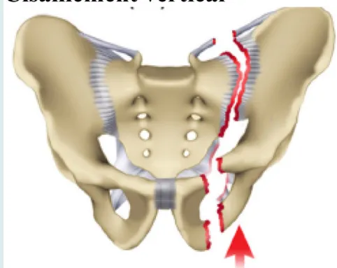

## Prise en charge des traumatisés pelviens graves à la phase précoce (24 premières heures)☆,☆☆

Pascal Incagnoli, Alain Puidupin, Sylvain Ausset, Jean-Paul Beregi, Jacques Bessereau, Xavier Bobbia, Julien Brun, Élodie Brunel, Clément Buléon, Jacques Choukroun, Xavier Combes, Jean Stéphane David, François-Régis Desfemme, Delphine Garrigue, Jean Luc Hanouz, Éric Kipnis, Isabelle Plénier, Frédéric Rongieras, Benoît Vivien

Disponible sur internet le :  
30 avril 2019

Hospices civils de Lyon, CHU Lyon Sud, service d'anesthésie-réanimation,  
165, chemin du Grand-Revoyet, 69495 Pierre-Bénite cedex, France

### Correspondance :

**Pascal Incagnoli**, Hospices civils de Lyon, CHU Lyon Sud, service d'anesthésie-réanimation, 165, chemin du Grand-Revoyet, 69495 Pierre-Bénite cedex, France.  
[pascal.incagnoli@chu-lyon.fr](mailto:pascal.incagnoli@chu-lyon.fr)

### Mots-clés

Traumatisme pelvien  
Milieu préhospitalier  
Critères de gravité  
Réseau de traumatologie  
Embolisation artérielle

### Résumé

Les fractures du bassin représentent 5 % de l'ensemble des fractures en traumatologie, 30 % de ces fractures sont isolées. Elles sont présentes chez 10 à 20 % des patients traumatisés graves et il existe une corrélation étroite entre la présence d'une fracture du bassin et l'augmentation du score de gravité du traumatisme. La mortalité élevée des traumatismes pelviens de l'ordre de 8 à 15 % est à la fois liée à la gravité des lésions hémorragiques pelviennes mais également aux lésions extra-pelviennes associées qu'elles soient crâniennes, thoraciques ou abdominales. Quelle que soit la gravité du traumatisme pelvien, il est essentiel qu'une stratégie diagnostique et thérapeutique soit adoptée afin de ne pas retarder la prise en charge des patients les plus graves. À ce jour, il n'existe en France aucune recommandation issue du travail d'analyse d'une société savante. L'objectif de cette recommandation formalisée d'experts a donc été d'établir des recommandations pour la prise en charge extrahospitalière et intrahospitalière durant les 24 premières heures suivant le traumatisme grave du bassin. La Société Française d'Anesthésie et de Réanimation (SFAR) et la Société Française de Médecine d'Urgence (SFMU) se sont associées et ont collaboré avec la Société Française de Radiologie (SFR), le Service de Santé des Armées (SSA), l'Association Française d'Urologie (AFU), la Société Française de Chirurgie Orthopédique et Traumatologique (SOCFCOT) et la Société Française de Chirurgie Digestive (SFCD) pour étudier deux grandes problématiques de la prise en charge des traumatismes pelviens graves : la problématique de la prise en charge préhospitalière comportant en particulier les modalités de l'immobilisation

☆ Texte validé par le Conseil d'administration de la SFMU et de la SFAR (29/06/17).

☆☆ Texte publié en anglais dans ACCPM. Pour citation, merci de citer : Early management of severe pelvic injury (first 2 hours). Anaesth Crit Care Pain Med 2018 Dec 21. pii: S2352-5568 (18)30567-8. <https://doi.org/10.1016/j.accpm.2018.12.003> [Epub ahead of print].**Keywords**

Pelvic trauma  
 Prehospital setting  
 Severity criteria  
 Trauma network  
 Arterial embolisation

pelvienne, ainsi que la problématique de la prise en charge intrahospitalière en termes diagnostique et thérapeutique, avec un chapitre concernant les particularités de la prise en charge d'un traumatisme pelvien ouvert.

**Résumé de vulgarisation** > Les traumatismes du bassin sont graves et touchent surtout l'adulte jeune au cours d'accidents de la voie publique et de chutes de grande hauteur. Ils surviennent principalement dans un contexte de traumatisme à haute énergie avec dans deux cas sur trois des lésions associées (lésions thoraciques, crâniennes, digestives, squelettiques) qu'il convient de rechercher systématiquement. Malgré une prise en charge médicale précoce, la mortalité reste élevée. La prise en charge préhospitalière et intrahospitalière est complexe et nécessite, pour être optimale, la coordination de nombreux acteurs (urgentistes, anesthésistes-réanimateurs, radiologues, chirurgiens). C'est dans le but de mieux définir cette prise en charge que la SFAR et la SFMU se sont associées, avec la participation de la SFR, du SSA, de l'AFU, de la SOFCOT et de la SFC pour proposer des recommandations pour l'ensemble des médecins amenés à prendre en charge les patients présentant ce type de traumatisme.

**Summary**

**Management of unstable patients with pelvic fracture (First 24 hours)**

**Objective** > Pelvic fractures represent 5% of all traumatic fractures and 30% are isolated pelvic fractures. Pelvic fractures are found in 10 to 20% of severe trauma patients and their presence is highly correlated to increasing trauma severity scores. The high mortality of pelvic trauma, about 8 to 15% is related to actively bleeding pelvic injuries and/or associated injuries to the head, abdomen or chest. Regardless of the severity of pelvic trauma, diagnosis and treatment must proceed according to a strategy that does not delay the management of the most severely injured patients. To date, in France, there are no guidelines issued by healthcare authorities or professional societies that address this subject.

**Design** > A consensus committee of 22 experts from the French Society of Anesthesiology and Intensive Care Medicine (Société Française d'Anesthésie et de Réanimation; SFAR) and the French Society of Emergency Medicine (Société Française de Médecine d'Urgence; SFMU) in collaboration with the French Society of Radiology (Société Française de Radiologie; SFR), French Defence Health Service (Service de Santé des Armées; SSA), French Association of Urology (Association Française d'Urologie; AFU), the French Society of Orthopedic and Trauma Surgery (Société Française de Chirurgie Orthopédique et Traumatologique; SOFCOT), and the French Society of Digestive Surgery (Société Française de Chirurgie Digestive; SFCD) was convened. A formal conflict-of-interest (COI) policy was developed at the onset of the process and enforced throughout. The entire guidelines process was conducted independent of any industry funding. The authors were advised to follow the principles of the Grading of Recommendations Assessment, Development and Evaluation (GRADE) system to guide assessment of quality of evidence. The potential drawbacks of making strong recommendations in the presence of low-quality evidence were emphasized.

**Methods** > Population, intervention, comparison, and outcomes (PICO) questions were reviewed and updated as needed, and evidence profiles were generated. The analysis of the literature and the recommendations were then conducted according to the GRADE® methodology.

**Results** > The SFAR Guideline panel provided 22 statements on the prehospital and hospital management of the unstable patient with pelvic fracture. After three rounds of discussion and various amendments, a strong agreement was reached for 100% of recommendations. Of these recommendations, 11 have a high level of evidence (Grade 1±), 11 have a low level of evidence (Grade 2±).

**Conclusions** > Substantial agreement exists among experts regarding many strong recommendations for the management of the unstable patient with pelvic fracture.## RFE commune SFMU-SFAR

En collaboration avec les AFU, SFCO, SFR, SOFCOT, SSA  
Association Française d'Urologie  
Société Française de Chirurgie Digestive  
Société Française de Radiologie  
Société Française de Chirurgie Orthopédique et Traumatologique  
Service de Santé des Armées

## Coordonnateurs d'experts

SFMU : Alain Puidupin. Direction centrale du service de santé des armées, 60, boulevard du Général-Marcel-Valin, 75509 Paris cedex 15, France.

SFAR : Pascal Incagnoli. Hospices civils de Lyon, CHU Lyon Sud, service d'anesthésie-réanimation, 165, chemin du Grand-Revoyet, 69495 Pierre-Bénite cedex, France.

## Organisateurs

SFMU : Olivier Ganansia, service d'accueil des urgences, groupe hospitalier Paris Saint-Joseph, 185, rue Raymond-Losserand 75014 Paris, France.

SFAR : Sylvain Ausset, école du Val-de-Grâce, chaire d'anesthésie, réanimation et médecine d'urgence, 1, place Alphonse-Laveran 75005 Paris, France.

## Groupe d'experts (ordre alphabétique)

Jean-Paul Beregi (SFR), Jacques Bessereau (SFMU), Xavier Bobbia (SFMU), Julien Brun (SFAR), Élodie Brunel (SFAR), Clément Buléon (SFAR), Jacques Choukroun (SFMU), Xavier Combes (SFMU), Jean Stéphane David (SFAR), François-Régis Desfemmes (AFU-SSA), Delphine Garrigue (SFMU), Jean Luc Hanouz (SFAR), Éric Kipnis (SFAR), Isabelle Plénier (SFCO), Frédéric Rongieras (SOFCOT-SSA), Benoît Vivien (SFMU).

## Référents bibliographiques

SFAR : Yvonic Boué (Grenoble), Guillaume Zamparini (Caen).

SFMU : Nicolas Cazes (Marseille).

## Groupe de lecture

Commission des référentiels SFMU : Ganansia Olivier, Claret Pierre Geraud, Miroux Patrick, Cesareo Éric, Dahan Benjamin, Desclefs Jean-Philippe, Douay Benedicte, Duchenne Jonathan, Gloaguen Aurelie, Lefort Hugues, Martinez Mikael, Rerbal Djamil, Rothmann Christophe, Segal Nicolas, Valdenaire Guillaume, Vaux Julien, Zanker Caroline.

Comité des référentiels cliniques de la SFAR : Dominique Fletcher, Lionel Velly, Julien Amour, Sylvain Ausset, Gérald Chanques, Vincent Compere, Fabien Espitalier, Marc Garnier, Étienne Gayat, Philippe Cuvillon, Jean-Marc Malinovski, Bertrand Rozec.

## Préambule

Les fractures du pelvis sont observées chez 10 % des patients traumatisés graves pris en charge dans un centre de traumatologie de niveau 1. Leur gravité est liée, d'une part, aux lésions extra-pelviennes associées et, d'autre part, à la gravité des lésions hémorragiques pelviennes. La gestion préhospitalière et intrahospitalière d'un traumatisme grave du pelvis nécessite d'appliquer des stratégies organisationnelles et thérapeutiques claires dans le but de contrôler au plus vite un saignement pelvien. Cette stratégie nécessite une prise en charge globale allant de la mise en place d'un réseau régional de soin clairement identifié à une prise en charge multidisciplinaire parfaitement maîtrisée au sein de chaque établissement. La prise en charge préhospitalière est le maillon indispensable entre les deux. Chaque étape doit être soigneusement réfléchie avec l'obsession de ne pas retarder le contrôle du saignement. Si un référentiel français a été récemment publié sur la prise en charge du choc hémorragique dans un contexte traumatique, aucun référentiel n'existe actuellement pour accompagner les praticiens devant s'occuper de patients atteints de lésions graves du pelvis. La littérature est certes abondante, mais reste hétérogène en qualité, avec de nombreuses publications qui ont d'importantes faiblesses méthodologiques. Il n'existe que très peu de méta-analyses pouvant apporter des réponses claires sur le sujet. Plusieurs points sont discutés dans la littérature, comme la place de la contention pelvienne à la phase préhospitalière, la stratégie des examens d'imagerie, ou encore la place respective de la chirurgie d'urgence par rapport à la radiologie interventionnelle d'hémostase. La réalisation de ces recommandations formalisées d'experts est nécessaire pour définir des stratégies claires pour l'ensemble des acteurs impliqués dans la chaîne de prise en charge des traumatisés graves du pelvis.

## Rationnel de la RFE

Il n'existe à ce jour aucune recommandation concernant la prise en charge spécifique du traumatisme pelvien grave établie selon une méthodologie clairement définie et soutenue par l'expertise de sociétés savantes. Par ailleurs, la prise en charge du traumatisme du bassin implique, comme pour d'autres types de traumatismes, une prise en charge multidisciplinaire (urgentistes, anesthésistes-réanimateurs, radiologues, chirurgiens) qui commence dès la phase préhospitalière, capitale, puisqu'elle conditionne l'orientation du patient, et une phase intra-hospitalière de prise en charge diagnostique et thérapeutique. Afin de répondre aux questions que peuvent se poser les praticiens amenés à prendre en charge cette traumatologie spécifique, cette RFE a associé la SFAR et la SFMU avec une proche collaboration de la SFR et du SSA.Le traumatisme pelvien pouvant être de niveau de gravité variable, nous avons défini le périmètre de la RFE de la manière suivante :

- • nous avons étudié uniquement les traumatismes pelviens graves après les avoir définis ;
- • nous avons volontairement écarté le traitement du choc hémorragique qui a fait l'objet très récemment d'une recommandation formalisée d'experts (<http://www.sfar.org/recommandations-sur-la-reanimation-du-choc-hemorragique/>) ;
- • nous avons volontairement limité les recommandations aux 24 premières heures de la prise en charge.

## Méthodologie

### Introduction générale sur la méthode GRADE

La méthode de travail utilisée pour l'élaboration de ces recommandations est la méthode GRADE®. Cette méthode permet, après une analyse quantitative de la littérature, de déterminer séparément la qualité des preuves, et donc de donner une estimation de la confiance que l'on peut avoir de l'analyse quantitative, ainsi qu'un niveau de recommandation. La qualité des preuves est répartie en quatre catégories :

- • haute : les recherches futures ne changeront très probablement pas la confiance dans l'estimation de l'effet ;
- • modérée : les recherches futures changeront probablement la confiance dans l'estimation de l'effet et pourraient modifier l'estimation de l'effet lui-même ;
- • basse : les recherches futures auront très probablement un impact sur la confiance dans l'estimation de l'effet et modifieront probablement l'estimation de l'effet lui-même ;
- • très basse : l'estimation de l'effet est très incertaine.

L'analyse de la qualité des preuves est réalisée pour chaque critère de jugement, puis un niveau global de preuve est défini à partir de la qualité des preuves des critères cruciaux.

La formulation finale des recommandations est toujours binaire : soit positive, soit négative, et soit forte soit faible :

- • forte : il est recommandé de faire ou de ne pas faire (GRADE 1+ ou 1-);
- • faible : il est probablement recommandé de faire ou de ne pas faire (GRADE 2+ ou 2-).

La force de la recommandation est déterminée en fonction de quatre facteurs clés et validée par les experts après un vote, en utilisant la méthode GRADE Grid :

- • estimation de l'effet ;
- • le niveau global de preuve : plus il est élevé, plus probablement la recommandation sera forte ;
- • la balance entre effets désirables et indésirables : plus celle-ci est favorable, plus probablement la recommandation sera forte ;
- • les valeurs et les préférences : en cas d'incertitude ou de grande variabilité, plus probablement la recommandation sera faible ; ces valeurs et préférences doivent être obtenues au

mieux auprès des personnes concernées (patient, médecin, décisionnaire) ;

- • coûts : plus les coûts ou l'utilisation des ressources sont élevés, plus probablement la recommandation sera faible ;
- • pour faire une recommandation, au moins 50 % des participants ont une opinion et moins de 20 % préfèrent la proposition contraire ;
- • pour faire une recommandation forte, au moins 70 % des participants sont d'accord ;
- • si les experts ne disposent pas d'études traitant précisément du sujet, ou si aucune donnée sur les critères principaux n'existe, aucune recommandation ne sera émise. Un avis d'experts pourra être donné tout en le différenciant clairement des recommandations.

## Résultats

### Champs des recommandations

La prise en charge des traumatismes pelviens graves a été répartie en deux grands thèmes déclinés en plusieurs questions :

- • premier thème : prise en charge préhospitalière ;
- • deuxième thème : prise en charge hospitalière.

### Recommandations

Après synthèse du travail des experts et application de la méthode GRADE®, 22 recommandations ont été formalisées par le comité d'organisation. Cinq recommandations concernent la prise en charge préhospitalière et 17 concernent la prise en charge intrahospitalière. Parmi les 22 recommandations, 11 sont fortes (Grade 1±) et 11 sont faibles (Grade 2±). La totalité des recommandations a été soumise à une cotation type Delphi par les experts. Pour 9 questions posées, la méthode Grade ne pouvait pas s'appliquer, du fait d'une littérature insuffisante, et les réponses ne pouvaient être qu'un « avis d'expert ». Ces questions n'ont pas été retenues pour la rédaction de ce document. Elles pourront faire l'objet d'une réactualisation en fonction de l'évolution de la littérature.

### Prise en charge préhospitalière

#### Quels signes cliniques évoquent dès la phase préhospitalière de la prise en charge un traumatisme du bassin ?

**R1.1** – Il est recommandé de considérer la douleur spontanée du pelvis chez un patient conscient comme un signe évocateur de fracture du bassin. Lorsque le patient est inconscient ou choqué, il doit être considéré systématiquement comme suspect d'un traumatisme pelvien.

(GRADE 1+) ACCORD FORT**Argumentaire**

La pertinence de l'examen clinique du bassin en préhospitalier est souvent prise en défaut et n'a pas d'impact prouvé sur le devenir du patient. Il existe de nombreuses études qui souvent mêlent traumatismes pelviens et traumatismes extra-pelviens, les patients inclus ayant très souvent des scores de Glasgow supérieurs à 13. Une seule méta-analyse [1] est disponible, qui inclut 5235 patients dans 12 études prospectives ou rétrospectives, et comporte au total 441 patients présentant une fracture du bassin. Sur les 441 patients, seules 3 fractures du bassin n'ont pas été détectées par un examen clinique attentif du patient. Malgré la disparité de la qualité méthodologique des études, les auteurs concluent que l'examen clinique, lorsqu'il est réalisé chez des patients conscients non choqués par des équipes entraînées, permet de détecter avec une sensibilité proche de 100 % une fracture du bassin.

**Quels sont les critères cliniques de gravité d'un traumatisme pelvien grave en préhospitalier ?**

**R1.2** – Il est probablement recommandé de considérer comme critères cliniques de gravité d'un traumatisme pelvien : un traumatisme pelvien ouvert, l'association avec une autre lésion traumatique grave, ou des signes cliniques de gravité d'hémorragie.

(GRADE 2+) ACCORD FORT

**Argumentaire**

Les traumatismes les plus fréquemment mis en cause sont les chutes de grande hauteur, les accidents de la voie publique impliquant les deux roues, et des traumatismes de plus faible énergie cinétique chez certaines populations à risque, en particulier chez les sujets de plus de 65 ans. Les critères de gravité pour le triage des patients traumatisés ont été proposés en 2002 lors du congrès de Vittel par Riou et al. [2]. Un seul de ces critères (clinique, cinétique, lésion anatomique, terrain particulier) suffit à caractériser la gravité a priori du traumatisme. La mortalité des patients victimes d'un traumatisme pelvien grave augmente lorsqu'elle est associée à un traumatisme crânien grave ( $OR = 4,57$  IC95 % [1,95-10,73]) [3,4], à un traumatisme thoracique ( $OR = 2,8$  IC95 % [1,3-6,1]) [5,6] ou à un traumatisme abdominal sévère ( $OR = 5,54$ , IC95 % [1,61-18,37]) [7,8]. De même, la présence d'un choc hémorragique multiplie, selon les études, par 3 à 5 la mortalité des patients traumatisés pelviens [4,8-13]. Le caractère ouvert du traumatisme du bassin, seul critère pelvien spécifique retrouvé dans la littérature, est associé à une augmentation de la mortalité par un facteur 3 à 4 [14-17]. Il est également admis que la mortalité augmente, pour un traumatisme équivalent, chez les personnes âgées de plus de 65 ans [18].

**Quelles sont les indications et les modalités de l'immobilisation pelvienne en préhospitalier ?**

**R1.3** – Il est recommandé de mettre en place le plus tôt possible une contention externe du bassin chez tout patient suspect d'un traumatisme pelvien grave.

(GRADE 1+) ACCORD FORT

**R1.4** – Il est probablement recommandé d'utiliser comme contention externe du bassin une ceinture pelvienne, sans qu'un type particulier ne soit recommandé (à l'exclusion de draps noués). Pour avoir une efficacité comparable au C-clamp chirurgical elle doit être positionnée à hauteur des grands trochanters.

(GRADE 2+) ACCORD FORT

**Argumentaire**

L'immobilisation externe des bassins traumatisés est préconisée par de nombreuses recommandations anglo-saxonnes, malgré l'absence ou le peu de preuve d'efficacité dans des essais cliniques de bonne qualité méthodologique. Il n'existe actuellement aucun essai randomisé contrôlé, mais seulement des études rétrospectives et des cas cliniques. Les deux revues de la littérature disponibles mettent en évidence qu'une contention par ceinture pelvienne réduirait les besoins transfusionnels, ainsi que les durées de séjour en réanimation et à l'hôpital. Ces résultats ne sont pas retrouvés en cas d'utilisation de draps noués [19]. L'impact de la contention pelvienne sur la mortalité n'est actuellement pas identifié. Les études analysées sont toutes de faibles niveaux de preuve [20,21]. Parmi les études disponibles, certaines sont contradictoires, et la contention semble aggraver certains types de fractures (B2-B3) et entraîner des lésions cutanées (surtout dans les populations masculines, maigres ou âgées) [22,23].

**Quelle doit être l'orientation initiale d'un patient victime d'un traumatisme pelvien grave ?**

**R1.5** – Il est recommandé de transférer par transport médicalisé tous les patients présentant un traumatisme pelvien grave vers un centre de référence disposant d'un plateau technique spécialisé en première intention.

(GRADE 1+) ACCORD FORT

**Argumentaire**

En France, la mise en place des réseaux de soins dédiés à la traumatologie grave se poursuit sur l'ensemble du territoire. Le réseau de soins va de la prise en charge préhospitalière médicalisée jusqu'à l'admission dans un établissement de soins identifié comme Trauma centre. La médicalisation préhospitalière permet une réduction de la mortalité de 30 % pour les traumatismes graves, quelle que soit la nature du traumatisme [24], et l'utilisation de l'hélicoptère médicalisé a montré une augmentation de la survie de 15 % pour les traumatisés graves aussi bien en Europe qu'en Amérique du Nord [25]. Les réseaux de soins en traumatologie ont fait la preuve de leur efficacité dans les pays anglo-saxons, en termes de diminution de la mortalité, d'amélioration de la qualité des soins et de diminution des décès évitables [26-30]. L'admission dans un Trauma Centre permet une diminution de 20 % pour l'ensemble des traumatisés et de 30 % pour les plus graves [28]. Une réduction de 8 % de la mortalité des accidents de la route a été observée aux États-Unis grâce à la mise en place d'un réseau de traumatologie grave [31]. Une amélioration globale de 15 % de la mortalité grâce à la mise en place des réseaux de soins en traumatologie a pu être également démontrée dans une méta-analyse regroupant 14 études d'évaluation de l'efficacité de ces réseaux aux États-Unis [32]. Le transfert rapide des traumatisés graves (non spécifiquement traumatisés du bassin) vers un centre de recours améliore la survie par rapport à une prise en charge en centre de proximité [33]. Les données spécifiques aux traumatismes du bassin sont peu nombreuses [34], mais la stratégie de prise en charge et d'orientation est la même que pour n'importe quel autre traumatisme grave. Récemment, une étude française a permis de montrer que dans le cadre d'un réseau régional de traumatologie, l'orientation des patients les plus gravement atteints par un traumatisme pelvien vers le centre de référence en traumatologie permettait d'observer une diminution de la mortalité observée par rapport à la mortalité prédite [35].

**Prise en charge hospitalière**

**Faut-il faire une radiographie de bassin de face à l'arrivée d'un patient suspect d'un traumatisme pelvien grave ?**

R2.1 – Il est probablement recommandé de réaliser une radiographie de bassin de face dès l'admission si le patient est instable sur le plan hémodynamique ou nécessite des thérapeutiques urgentes pour contrôler les fonctions vitales.

**(GRADE 2+) ACCORD FORT**

R2.2 – Il n'est probablement pas recommandé de réaliser une radiographie de bassin de face en dehors d'une instabilité hémodynamique à l'arrivée en salle d'accueil des détresses vitales, la réalisation rapide d'une tomodensitométrie thoraco-abdomino-pelvienne avec injection de produit de contraste pour bilan vasculaire et osseux complet du pelvis étant alors préférée.

**(GRADE 2–) ACCORD FORT**

**Argumentaire**

Dans le cas de patients instables sur le plan hémodynamique malgré la réanimation préhospitalière, l'urgence est au contrôle de l'hémorragie. Il faut diagnostiquer avec certitude l'origine du saignement en l'absence d'une tomodensitométrie. La radiographie de bassin, tout comme la radiographie de thorax, l'échographie pleuropulmonaire et l'échographie abdominale, sont les seuls éléments dont nous disposons en salle de décochage ou au lit du patient afin de décider d'une stratégie thérapeutique urgente, qui peut être une chirurgie d'hémostase ou une artériographie-embolisation. Dans l'étude de Peytel et al. [36], pour les patients instables sur le plan hémodynamique, une décision d'intervention thérapeutique urgente (drainage thoracique ou thoracotomie d'hémostase, embolisation du bassin, laparotomie d'hémostase) basée sur la seule imagerie initiale était jugée appropriée dans 98 % des cas (IC95 % : 97-99). Lorsque le traumatisme pelvien est la seule lésion expliquant le choc hémorragique (eFAST échographie négative, absence d'épanchement pleural liquide), alors l'artériographie a une forte probabilité de montrer un saignement artériel actif, et l'orientation du patient doit être le scanner pour une tomodensitométrie thoraco-abdomino-pelvienne pour authentifier l'ensemble des lésions, puis la salle d'artériographie pour embolisation. Dans de très rares cas d'extrême gravité, le patient pourra être directement orienté vers l'artériographie-embolisation. Lorsque le traumatisme pelvien est associé à un hémopéritoine, la décision est plus difficile à prendre. Dans ce contexte, il semblerait que le foyer hémorragique soit le plus souvent abdominal (70 % des cas) lorsque la fracture pelvienne est stable, alors que le foyer hémorragique serait le plus souvent pelvien lorsque la fracture pelvienne est instable (56 % des cas) [37], mais la certitude diagnostique n'est pas acquise. D'autres éléments doivent être pris en compte, comme l'abondance de l'hémopéritoine, un hémopéritoine massif orientant vers une lésion intra-abdominale dont la thérapeutique est chirurgicale. En cas de décision d'artériographie pour embolisation pelvienne, l'embolisation d'un foyer abdominal (foie, rate, rein) est toujours possible. La valeur informative de la radiographie de bassin n'existe qu'en prenant en compte l'ensemble desdonnées cliniques à l'arrivée du patient, en particulier la stabilité hémodynamique et l'existence d'autres foyers hémorragiques (thorax, abdomen). En l'absence d'instabilité hémodynamique, la radiographie de bassin est peu pertinente dans la prise en charge initiale du patient. L'absence de lésions osseuses visible sur la radiographie du bassin de face à une bonne spécificité pour prédire l'absence de saignement nécessitant une artériographie-embolisation, mais ne permet pas d'exclure l'absence de fracture, la tomodensitométrie étant l'examen de référence pour diagnostiquer les lésions osseuses du bassin.

### Faut-il faire une eFAST échographie (*Extended Focus Assessment with Sonography for Trauma*) chez un patient victime d'un traumatisme pelvien grave ?

**R2.3** – Il est probablement recommandé de réaliser une eFAST échographie chez tous les patients présentant un traumatisme sévère lors de la prise en charge d'un patient suspect d'un traumatisme grave du bassin.

(GRADE 2+) ACCORD FORT

#### Argumentaire

L'intérêt de la eFAST échographie dans les traumatismes graves du bassin est double : elle permet, d'une part, de diagnostiquer les fractures pelviennes en *open book* par la mesure centimétrique de la symphyse pubienne (l'anneau pelvien est ouvert lorsque la mesure de la symphyse pelvienne est supérieure à 25 mm) [38] et, d'autre part, elle permet de diagnostiquer les lésions associées pouvant participer à l'instabilité hémodynamique. La performance de la eFAST échographie permet d'imputer la responsabilité du saignement et représente donc une aide au diagnostic et à l'orientation thérapeutique, notamment en cas d'association lésionnelle avec un traumatisme abdominal grave. Ruchholtz [39] retrouve une VPP de la FAST échographie égale à 97 % : sur 31 patients présentant une association lésionnelle bassin-abdomen, l'existence d'un hémopéritoine en FAST échographie a permis la réalisation de 30 laparotomies d'hémostase justifiées. Une autre étude [40] rapporte l'importance d'évaluer la quantité de l'hémopéritoine afin d'améliorer le taux de laparotomies appropriées : en cas d'hémopéritoine abondant (défini par 3 sites positifs) le pourcentage de laparotomie hémostatique est de 61 % versus 26 % en cas d'hémopéritoine modéré (2 sites atteints). La valeur prédictive négative de la FAST échographie est également un argument important dans la prise en charge des traumatismes graves du bassin : Verbeek [41] retrouve une VPN de la FAST échographie chez les patients choqués de 97 %. Enfin, il faut savoir que la performance de la FAST échographie peut être diminuée par la suffusion d'un hémopéritoine [39] ou l'existence d'une rupture vésicale intrapéritonéale.

### Faut-il faire une tomodensitométrie thoraco-abdomino-pelvienne avec injection avant de réaliser une artériographie avec embolisation chez un patient victime d'un traumatisme pelvien grave ?

**R2.4** – Il est recommandé de réaliser une tomodensitométrie thoraco-abdomino-pelvienne avec injection de produit de contraste avant la réalisation d'une artériographie à visée thérapeutique chez un patient victime d'un traumatisme pelvien grave si son état hémodynamique le permet.

(GRADE 1+) ACCORD FORT

#### Argumentaire

L'accès à l'imagerie est prioritaire pour les patients présentant un traumatisme pelvien grave afin d'obtenir un bilan lésionnel le plus complet possible, en particulier concernant les lésions abdomino-pelviennes et/ou thoraciques qui pourraient être associées. L'examen tomodensitométrique permet de réaliser le bilan complet des lésions, d'identifier la présence d'une éventuelle hémorragie et de discuter la prise en charge entre traitement médical par radiologie interventionnelle ou par chirurgie. La réalisation de cet examen doit être la plus rapide possible pour ne pas retarder la prise en charge globale du patient et permettre d'évaluer dans les meilleurs délais l'ensemble des lésions afin d'orienter la conduite à tenir. La présence d'une extravasation de produit de contraste permet d'orienter vers le site à emboliser et l'artère à cathétériser. En l'absence de saignement actif visible en tomodensitométrie et en cas de patient instable sur le plan hémodynamique présentant une lésion isolée du bassin, l'artériographie reste indiquée à la recherche du saignement pour réaliser une embolisation sélective. Dans la dernière publication de Hallinan et al., 51 patients présentant un traumatisme abdominal et/ou du bassin bénéficient d'une tomodensitométrie avec injection de produit de contraste, puis d'une angiographie. La sensibilité, la spécificité, les valeurs prédictives positives et négatives de la tomodensitométrie injectée, comparée à l'artériographie étaient respectivement de 93,9 %, 77,8 %, 88,6 % et 87,5 % [42-49].

### Faut-il réaliser une opacification de l'urètre et de la vessie chez un patient traumatisé pelvien grave ?

**R2.5** – Il n'est probablement pas recommandé de réaliser à titre systématique une imagerie dédiée pour le bas appareil urinaire (opacification de l'urètre et de la vessie) chez un patient traumatisé pelvien grave.

(GRADE 2–) ACCORD FORT**R2.6** – Il est probablement recommandé de réaliser une opacification rétrograde de l'urètre et de la vessie, couplée idéalement à une TDM pelvienne chez un patient traumatisé pelvien grave présentant des symptômes évocateurs de traumatisme de la vessie (impossibilité d'uriner, hématurie, empâtement sus-pubien douloureux, vessie sur le trajet d'une plaie pénétrante), en particulier avant tout sondage chez l'homme.

(GRADE 2+) ACCORD FORT

### Argumentaire

Les traumatismes de vessie et de l'urètre postérieur chez l'homme sont classiques en cas de traumatismes pelviens graves. En traumatologie civile, les lésions vésicales sont liées à une fracture du bassin dans 60 à 90 % des cas, et les lésions de l'urètre postérieur dans 75 % des cas [50-52]. Les lésions vésicales sont retrouvées dans 3,5 % des cas de fracture du bassin [53], les plaies extrapéritonéales étant plus fréquentes que les plaies intrapéritonéales. Un traumatisme à vessie pleine — tout particulièrement chez un patient alcoolisé — est un facteur de risque de lésion vésicale et notamment de plaie intrapéritonéale de vessie [51]. Les lésions de l'urètre postérieur sont retrouvées dans 4 à 19 % des cas de fracture du bassin [54] ; les fractures instables du bassin, notamment associant atteinte bilatérale des branches ischiopubiennes et disjonction sacroiliaque, sont les plus à risque de traumatisme de l'urètre postérieur [55,56]. Des lésions associées de l'urètre et de la vessie sont décrites dans 4 à 15 % des cas dans ce contexte [54]. Les traumatismes de l'urètre pelvien et les traumatismes de l'urètre chez la femme sont en revanche exceptionnels [54]. Pour ces raisons épidémiologiques, il n'y a pas d'indication systématique à une imagerie dédiée pour le bas appareil urinaire. Ces lésions de l'appareil urinaire n'engagent jamais le pronostic vital à la phase aiguë, de ce fait leur réparation n'est jamais impérative en urgence. Leur diagnostic est néanmoins indispensable pour permettre un drainage précoce et adapté (et pour les plaies intrapéritonéales de vessie, une suture chirurgicale précoce), ce qui limitera le risque de complication et de séquelle urinaire. La TDM avec injection est l'imagerie de référence chez le patient victime d'un traumatisme pelvien grave, stable hémodynamiquement ; le passage tardif fera le bilan urétéral mais peut passer à côté de certaines lésions vésicales, en particulier les ruptures intrapéritonéales, et d'autant plus si un drainage vésical est déjà en place, de surcroît non clampé [53]. Cet examen ne permet pas d'analyser l'urètre. Une imagerie spécifique du bas appareil urinaire par opacification rétrograde de l'urètre et de la vessie permettra — en cas de signe d'appel clinique — le

diagnostic des traumatismes de l'urètre et un bilan vésical exhaustif. L'exploration recommandée chez l'homme est l'urérocystographie rétrograde. Elle est réalisée par voie urétrale rétrograde à l'aide d'une sonde introduite au niveau de l'urètre antérieur en gonflant le ballonnet à 1 ou 2 mL seulement : elle permet d'explorer dans le même temps l'urètre postérieur et le réservoir vésical (remplissage possible jusqu'à 350 mL) à la recherche d'une extravasation de produit de contraste. Couplée à la tomodensitométrie (cystoTDM), elle est l'examen de référence pour le diagnostic d'une plaie de vessie [54,57]. Elle permet d'analyser la vessie au mieux. L'urérocystographie rétrograde classique sur table radiologique ou d'opération avec clichés de profil lors du remplissage pour visualiser la filière urétrale, et de face et de profil pour la vessie reste pertinente chez l'homme, tout particulièrement si la tomodensitométrie n'est pas accessible ou si le patient est instable hémodynamiquement. L'exploration endoscopique rétrograde est également une option intéressante si le plateau technique le permet, avec la possibilité en cas de solution de continuité urétrale de tenter un réalignment sur guide dans le même temps. Elle est par ailleurs recommandée chez la femme en cas de suspicion de traumatisme de l'urètre [52,54,58] car pour des raisons anatomiques de brièveté de l'urètre, toute opacification rétrograde est compromise.

### Quels sont les critères anatomoradiologiques permettant de définir un traumatisme pelvien comme grave ?

**R2.7** – Il est probablement recommandé de considérer comme critères anatomoradiologiques de traumatisme pelvien grave :

- • Une fracture du pelvis instable selon les classifications de *Young-Burgess* et de *Tile* (Appendices A et Bannexes 1 et 2), en particulier les fractures dites « *open book* » et les ruptures de l'anneau pelvien avec atteinte postérieure.
- • L'existence d'une extravasation de produit de contraste au temps artériel observée sur une angioscanographie ou une tomodensitométrie.

(GRADE 2+) ACCORD FORT

### Argumentaire

Les fractures instables de la classification de *Tile* (type C) [59] (*annexe 2*) et les ruptures de l'anneau avec atteinte des structures postérieure sont significativement plus souvent associées aux lésions vasculaires hémorragiques chez les traumatisés pelviens [58] et nécessitent des transfusions plus importantes que les autres types de fractures [60,61]. Les fractures instables de la classification de *Young* et *Burgess* [62] (*annexe 1*) (typesAPC2, APC3, LC2, LC3, VS et combinées) ont une mortalité significativement plus élevée que les fractures stables (11,5 % versus 7,5 %,  $p < 0,05$ ) et nécessitent d'être significativement plus transfusées [63,64]. L'extravasation de produit de contraste lors de la réalisation de la tomodensitométrie pelvienne prédit un saignement artériel avec une sensibilité variant, selon les études, de 82 à 89 % et une spécificité de 75 à 100 % [65,66].

### Quel est le délai optimal pour effectuer le geste d'hémostase d'une hémorragie secondaire à un traumatisme pelvien grave ?

**R2.8** – Il est recommandé de réaliser un geste d'hémostase le plus rapidement possible en cas d'hémorragie active en lien avec un traumatisme pelvien grave. Dans le contexte d'un traumatisme pelvien grave, le geste d'hémostase peut être une artériographie avec embolisation ou un tamponnement chirurgical pelvien pré-péritonéal de sauvetage réalisé par une équipe entraînée.

(GRADE 1+) ACCORD FORT

**R2.9** – Il est recommandé que le délai entre l'admission hospitalière et le geste d'hémostase ne dépasse pas 60 minutes, quelle que soit la technique utilisée.

(GRADE 1+) ACCORD FORT

### Argumentaire

L'hémostase d'une hémorragie pelvienne peut être réalisée par la fermeture mécanique du bassin (sangle, fixateur externe), par la réalisation d'une artériographie avec embolisation, ou par la mise en place d'un tamponnement chirurgical pelvien pré-péritonéal de sauvetage. Quelle que soit la méthode choisie, différents travaux indiquent que le facteur le plus important est la rapidité d'obtention de l'hémostase. Ainsi, dans un travail récent randomisé, il n'a pas été observé de différence de survie entre le tamponnement chirurgical pelvien pré-péritonéal et l'embolisation [67]. Lorsque l'embolisation a été choisie, le délai de réalisation de l'embolisation apparaît comme un facteur de risque indépendant de mortalité : plus celui-ci est long, plus la mortalité est importante [68]. Ainsi, le temps pour la réalisation de l'embolisation apparaît comme lié de manière indépendante à la mortalité, avec une mortalité qui passe de 16 à 64 % si le délai est supérieur à 60 minutes [69]. Il a été estimé que pour

chaque tranche de 3 minutes perdue, la mortalité augmente de 1 % [70].

### Quel type d'embolisation faut-il réaliser chez le patient présentant un traumatisme grave du pelvis ?

**R2.10** – Les experts recommandent de réaliser une embolisation non sélective par un abord fémoral commun chez les patients instables, chez les patients stables présentant de nombreuses cibles identifiées en TDM ou à l'angiographie et en cas d'échec de l'embolisation sélective.

(GRADE 1+) ACCORD FORT

### Argumentaire

L'acte d'embolisation doit être réalisé dans une salle d'angiographie vasculaire possédant au mieux un arceau vasculaire avec table couplée, les modes de soustraction numérisée, de *road map*, de comparaison d'images, et une cadence d'images en graphie de 3 à 6 images par seconde [71-76]. L'opérateur doit être entraîné aux actes d'embolisation et connaître les différents matériels d'embolisation ainsi que de cathétérisme (cathéter 4F ou micro-cathéters). L'abord sera choisi en fonction des possibilités d'accès en fémoral [76-78]. Si le délabrement pelvien est trop important, un abord huméral est recommandé. Dans le cas contraire c'est l'abord fémoral qui est privilégié, il peut être uni ou bilatéral. Le premier temps de la procédure comprend une aortographie globale de face ; à partir du cathéter mis en place au niveau de l'aorte sous rénale, elle permet de réaliser une cartographie artérielle du saignement. Le second temps consiste à cathétériser sélectivement les artères iliaques internes, parfois les iliaques externes et les lombaires en raison de la collatéralité entre ces territoires. Le signe angiographique de saignement le plus communément observé est une extravasation de produit de contraste de contour irrégulier localisé sur de petites artérioles. Parfois un faux anévrysme traumatique ou une fistule artérioveineuse témoignent de la lésion vasculaire traumatique, un arrêt brutal d'une artère témoigne d'une lésion artérielle sous-jacente spontanément occluse par un vasospasme. Le choix du matériel et la technique d'embolisation sont en fonction des données angiographiques, de l'anatomie vasculaire et de l'état hémodynamique du patient [71,77-80]. L'embolisation se fait chaque fois que possible au moyen de matériel temporaire. Une embolisation non sélective par une occlusion bilatérale des troncs des artères iliaques internes est indiquée pour le patient instable et les cibles multiples bilatérales [81]. Une embolisation non sélective par occlusion unilatérale d'un tronc d'une artère iliaque est indiquée pour les cibles multiplesunilatérales ou l'échec de l'embolisation sélective [81]. Une embolisation sélective est indiquée chez les patients stables avec une ou quelques cible(s) identifiée(s) au scanner ou à l'angiographie. L'embolisation est réalisée avec la contention en place si celle-ci est présente (compression pelvienne, ballon d'occlusion intra-aortique). Une fois l'embolisation terminée, une décompression prudente est réalisée pour vérification angiographique et complément d'embolisation si besoin [77,78]. L'introducteur à valve anti-retour peut être laissé en place 24 h pour permettre une nouvelle embolisation en cas de récidive hémorragique. Dans le cas où un cathétérisme artériel n'aurait pas pu être préalablement mis en place, il permettra également une surveillance continue de la pression artérielle.

### Faut-il réaliser une artériographie de contrôle systématique chez un patient victime d'un traumatisme pelvien grave qui a bénéficié d'une embolisation à la phase initiale ?

R2.11 – Il n'est probablement pas recommandé de réaliser un contrôle artériographique systématique chez tous les patients ayant bénéficié d'une artério-embolisation à la phase initiale de prise en charge d'un traumatisme pelvien grave.

(GRADE 2–) ACCORD FORT

#### Argumentaire

Un contrôle artériographique est indiqué uniquement en cas de doute sur une récidive hémorragique, et de préférence après examen par tomodensitométrie [82,83]. Ce dernier permet de confirmer la récidive ou de localiser un autre saignement suite au traumatisme. La récidive est liée à la présence de collatérales et d'anastomoses nombreuses dans le pelvis. Cela justifie pour certains une embolisation bilatérale de principe, même si la fracture est unilatérale. La récidive peut être également liée à la réouverture de vaisseaux qui étaient spasmes du fait de l'hypodébit. Après rétablissement de la volémie et de l'hémodynamique, ces artères s'ouvrent et entraînent une fuite vasculaire qui n'a pas pu être traitée par une embolisation dite « au fil de l'eau ». Un complément d'embolisation est donc nécessaire. Si l'état du malade le nécessite, un contrôle tomodensitométrique peut être préconisé. Il n'est pas recommandé dans la littérature de réaliser un contrôle systématique dans les 72 heures de l'embolisation ; une tomodensitométrie quelques heures après une tomodensitométrie injectée où l'embolisation peut être réalisée en cas de suspicion de lésion vésicale ou urétérale [84,85]. La réalisation d'une tomodensitométrie sans injection permet de constater la diffusion ou non du produit de contraste iodé en dehors des cavités naturelles.

### Faut-il proposer un tamponnement chirurgical pelvien chez un patient victime d'un traumatisme pelvien grave ?

R2.12 – Il est probablement recommandé d'avoir recours à un tamponnement pelvien pré-péritonéal chirurgical en association avec une fixation externe du bassin en cas d'instabilité hémodynamique majeure rendant impossible :

- • le transfert du patient au scanner et/ou en embolisation ;
- • la réalisation d'une artériographie-embolisation dans un délai de 60 minutes à partir du diagnostic.

(GRADE 2+) ACCORD FORT

#### Argumentaire

En cas d'instabilité hémodynamique majeure qui rend impossible le transfert au scanner et la réalisation de l'embolisation dans le temps de 60 minutes depuis le diagnostic, le tamponnement pelvien pré-péritonéal est une technique complémentaire qui vise à obtenir une hémostase temporaire jusqu'à l'hémostase définitive chez un patient traumatisé pelvien grave en choc hémorragique non contrôlé. Sa réalisation facile et rapide nécessite néanmoins une formation chirurgicale et une discussion multidisciplinaire. Lorsqu'elle est maîtrisée, cette technique a une action hémostatique significative [86], et dans de petites séries de patients elle a permis une stabilisation hémodynamique permettant le transfert en salle d'angiographie pour embolisation. Cette technique n'a pas vocation à se substituer à l'embolisation, même si parfois elle semble suffisante pour contrôler l'hémorragie [87]. Un bilan lésionnel complet doit suivre l'application de cette technique. Pour obtenir de meilleurs résultats, il est recommandé d'associer une fixation externe du bassin (ceinture pelvienne, fixateur externe ou C-Clamp).

### Quand faut-il proposer une fixation chirurgicale externe du pelvis chez un patient victime d'un traumatisme pelvien grave ?

R2.13 – Il est recommandé de réaliser une fixation externe précoce du bassin chez les patients présentant un traumatisme pelvien grave avec instabilité hémodynamique pour limiter l'expansion de l'hématome pelvien. La fixation externe peut être réalisée par un Clamp de Ganz ou un fixateur externe antérieur.

(GRADE 1+) ACCORD FORT**R2.14** – Il est recommandé d'utiliser un clamp de Ganz pour les fractures Tile C essentiellement, après traction lourde du membre ascensionné (15 % du poids corporel). Il peut être placé en salle d'urgence par des opérateurs entraînés.

(GRADE 1+) ACCORD FORT

**R2.15** – Il est recommandé d'utiliser un fixateur externe pour stabiliser les bassins dans les fractures Tile C et pour les refermer dans les fractures Tile B1 et B3. Il doit être placé en antéro-inferieur de façon à permettre la réalisation d'une laparotomie.

(GRADE 1+) ACCORD FORT

### Argumentaire

La fixation externe du bassin est mise en place soit d'emblée, soit peut-être mise en relais d'un dispositif externe de stabilisation du bassin [88]. Elle peut être également réalisée après une embolisation en cas de persistance d'une instabilité hémodynamique rapportée à un saignement veineux, la séquence de prise en charge dépendant de l'expérience des équipes et de leur disponibilité. Dans tous les cas, la fermeture de l'anneau pelvien permet de limiter l'expansion de l'hématome pelvien [89]. La mise en place d'un clamp de Ganz est possible en salle de déchoquage [90,91]. Elle nécessite un opérateur entraîné. Le clamp de Ganz permet de refermer les structures postérieures et est indiqué principalement dans les lésions de type Tile C après réduction par traction du membre ascensionné (15 % du poids corporel). Le clamp de Ganz permet la réalisation secondaire d'une embolisation, d'une laparotomie ou d'un *packing* pelvien [92]. La fixation externe est indiquée dans les fractures Tile B1 afin de refermer l'anneau pelvien. Elle est réalisée d'emblée ou en relais d'une contention externe. Un fixateur externe peut être placé également dans les fractures Tile B3. Dans les fractures Tile C, il doit être associé à une traction du membre homolatéral à l'hémi-bassin ascensionné afin de contrôler l'instabilité verticale. La fixation antérieure est réalisée en salle de bloc opératoire avec une fixation dans les crêtes iliaques antérieures ou dans le toit du cotyle avec un montage en cadre trapézoïdal. Le montage doit permettre l'accès vasculaire en cas d'embolisation secondaire, de *packing* rétopéritonéal et de laparotomie [93,94]. La fixation définitive est réalisée sur un patient stabilisé dans les jours suivant le traumatisme. Elle comporte des temps différents en fonction du type lésionnel : fixation postérieure puis fixation antérieure par divers moyens d'ostéosynthèse adaptés au type d'instabilité du bassin et à la

localisation des fractures de l'anneau pelvien [95]. Les fractures ouvertes de l'anneau pelvien ont un pronostic plus péjoratif et peuvent nécessiter un traitement définitif par un fixateur externe avec un risque plus élevé de mauvais résultats fonctionnels [96,97].

### Quelles sont les particularités de la prise en charge en cas de traumatisme pelvien grave ouvert ?

**R2.16** – Il est probablement recommandé d'assurer la prise en charge des traumatismes pelviens graves ouverts dans les centres de référence car les lésions pelviennes ouvertes sont rares, leur prise en charge est complexe et fait appel à des équipes multidisciplinaires.

(GRADE 2+) ACCORD FORT

**R2.17** – Il est recommandé de considérer comme objectifs initiaux de la prise en charge des traumatismes pelviens graves ouverts le contrôle de l'hémorragie et de la contamination périnéale.

(GRADE 1+) ACCORD FORT

### Argumentaire

Les traumatismes pelviens ouverts sont rarement observés. Ainsi, sur un collectif de 3053 fractures du bassin, seulement 52 étaient ouvertes, soit 1,7 % [98]. Elles sont cependant d'un pronostic redoutable puisque selon les séries la mortalité peut dépasser 50 % [99,100]. Le pronostic est initialement conditionné par le contrôle de l'hémorragie et secondairement par celui de l'infection [101]. Il existe souvent des séquelles fonctionnelles importantes. Leur prise en charge va répondre à 4 priorités qui sont :

- • le contrôle de l'hémorragie ;
- • le lavage et le parage des lésions des tissus mous ;
- • l'identification et le traitement des lésions associées, qu'elles soient pelviennes ou extra-pelviennes ;
- • le traitement de la fracture du bassin [102].

Le diagnostic de la fracture ouverte de bassin est avant tout clinique. L'examen tomodensitométrique permettra le diagnostic exhaustif des lésions pelviennes, y compris osseuses. La séquence tardive, réalisée lorsque l'état hémodynamique le permet, analyse l'excrétion du produit de contraste iodé afin de faire le diagnostic des lésions urinaires suspectées. Il permettra également le diagnostic d'éventuelles lésions associées extra-pelviennes. Une rectosigmoïdoscopie sera également réalisée afin d'écarte une lésion digestive. Le traitement de ceslésions est souvent compliqué et va faire appel à des techniques chirurgicales et de radiologie interventionnelle. Ces traumatismes associent des lésions osseuses, viscérales, génitales et parfois vasculaires qui rendent complexe leur prise en charge et imposent un travail multidisciplinaire. Le traitement de l'hémorragie doit être réalisé en priorité car ces hémorragies sont souvent importantes et difficiles à contrôler compte tenu de leur localisation. Les gestes chirurgicaux sont complexes, comportant souvent, en plus du lavage et des parages des plaies, la réalisation d'une colostomie de décharge, la mise en place d'un fixateur externe de bassin, et, dans certains cas exceptionnels, une hémipelvectomie est nécessaire [103,104]. L'artéiographie peut être utilisée en complément

de la chirurgie pour permettre l'hémostase des lésions. Compte tenu de la sévérité des lésions, de multiples reprises chirurgicales seront souvent nécessaires pour laver, parer, exciser les tissus dévitalisés afin de contrôler le développement d'un processus infectieux, redoutable dans ce contexte. Compte tenu de la complexité de ces lésions, de leur rareté, de la nécessité d'équipes multidisciplinaires, ces lésions doivent être prises en charge dans des centres expérimentés.

**Déclaration de liens d'intérêts :** les auteurs déclarent ne pas avoir de liens d'intérêts.

**ANNEXE 1**

**Classification de Young-Burgess [20]**

Compression antérieure-postérieure

**Compression antérieure-postérieure**

Compression latérale

**Compression latérale**

Cisaillement vertical

**Cisaillement vertical**

ANNEXE 2

**Classification de Tile [17]**

Fracture tile a : stable ; fracture tile b : instable dans le plan horizontal ; fracture tile c : instable dans le plan horizontal et dans le plan vertical.

**Références**

<table border="0">
<tr>
<td style="vertical-align: top; width: 33%;">

[1] Sauerland S, Bouillon B, Rixen D, Raum MR, Koy T, Neugebauer EA. The reliability of clinical examination in detecting pelvic fractures in blunt trauma patients: a meta-analysis. <i>Arch Orthop Trauma Surg</i> 2004;124:123-8.

[2] Riou B, Thicoipé M, Atain-Kouadio P, et al. Comment évaluer la gravité ? In: Samu de France, editor. <i>Actualités en réanimation pré-hospitalière : la traumatisé grave</i>. Paris: SFEM Editions; 2002. p. 115-28.

[3] Ooi CK, Goh HK, Tay SY, Phua DH. Patients with pelvic fracture: what factors are associated with mortality? <i>Int J Emerg Med</i> 2010;3:299-304.

</td>
<td style="vertical-align: top; width: 33%;">

[4] Giannoudis PV, Grotz MR, Tzioupis C, Dinopoulos H, Wells GE, Bouamra O, et al. Prevalence of pelvic fractures, associated injuries, and mortality: the United Kingdom perspective. <i>J Trauma</i> 2007;63:875-83.

[5] Gabbe BJ, De Steiger R, Esser M, Bucknill A, Russ MK, Cameron P. Predictors of mortality following severe pelvic ring fracture: results of a population-based study. <i>Injury</i> 2001;42:985-91.

[6] Gustavo Parreira J, Coimbra R, Rasslan S, Oliveira a, Fregoneze M, Mercadante M. The role of associated injuries on outcome of blunt trauma patients sustaining pelvic fractures. <i>Injury</i> 2000;31:677-82.

</td>
<td style="vertical-align: top; width: 33%;">

[7] Ustundag M, Aldemir M, Orak M, Guloglu C. Predictors of mortality in blunt multi-trauma patients: a retrospective review. <i>J Emerg Med</i> 2010;17:471-6.

[8] Palmcrantz J, Hardcastle TC, Naidoo SR, Muckart DJ, Ahlm K, Eriksson A. Pelvic fractures at a new level 1 trauma centre: who dies from pelvic trauma? The Inkosi Albert Luthuli Central Hospital experience. <i>Orthop Surg</i> 2012;4:216-21.

[9] Sathy AK, Starr AJ, Smith WR, Elliott A, Agudelo J, Reinert CM, et al. The effect of pelvic fracture on mortality after trauma: an analysis of 63,000 trauma patients. <i>J Bone Joint Surg Am</i> 2009;91:2803-10.

</td>
</tr>
</table>

- [10] Starr AJ, Griffin DR, Reinert CM, Frawley WH, Walker J, Whitlock SN, et al. Pelvic ring disruptions: prediction of associated injuries, transfusion requirement, pelvic angiography, complications, and mortality. *J Orthop Trauma* 2002;16:553-61.
- [11] Arroyo W, Nelson KJ, Belmont PJ, Bader JO, Schoenfeld AJ. Pelvic trauma: what are the predictors of mortality and cardiac, venous thrombo-embolic and infectious complications following injury? *Injury* 2013;44:1745-9.
- [12] Toth L, King KL, McGrath B, Balogh ZJ. Factors associated with pelvic fracture-related arterial bleeding during trauma resuscitation: a prospective clinical study. *J Orthop Trauma* 2014;28:489-96.
- [13] Blackmore CC, Cummings P, Jurkovich GJ, Linnau KF, Hoffer EK, Rivara FP. Predicting major hemorrhage in patients with pelvic fracture. *J Trauma* 2006;61:346-52.
- [14] Sartorius D, Le Manach Y, David J-S, Rancurel E, Smail N, Thicoipé M, et al. Mechanism, glasgow coma scale, age, and arterial pressure (MGAP): a new simple prehospital triage score to predict mortality in trauma patients. *Crit Care Med* 2010;38:831-7.
- [15] Yoshihara H, Yoneoka D. Demographic epidemiology of unstable pelvic fracture in the United States from 2000 to 2009: trends and in-hospital mortality. *J Trauma Acute Care Surg* 2014;76:380-5.
- [16] Poole GV, Ward EF. Causes of mortality in patients with pelvic fractures. *Orthopedics* 1994;17:691-6.
- [17] Fox MA, Mangiante EC, Fabian TC, Voeller GR, Kudsk KA. Pelvic fractures: an analysis of factors affecting prehospital triage and patient outcome. *South Med J* 1990;83:785-8.
- [18] Ricard-Hibon A, Duchateau F-X, Vivien B. Out-of-hospital management of elderly patients for trauma injury. *Ann Fr Anesth Reanim* 2012;31:e7-10.
- [19] Pizanis A, Pohlemann T, Burkhardt M, Aghayev E, Holstein JH. Emergency stabilization of the pelvic ring: clinical comparison between three different techniques. *Injury* 2013;44:1760-4.
- [20] Spanjersberg WR, Knops SP, Schep NWL, Van Lieshout EMM. Effectiveness and complications of pelvic circumferential compression devices with unstable pelvic fractures: a systematic review of the literature. *Injury* 2009;40:1031-5.
- [21] Stewart M. Pelvic circumferential compression devices for haemorrhage control: panacea or myth? *Emerg Med J* 2013;30:425-6.
- [22] Jowett AJL, Bowyer GW. Pressure characteristics of pelvic binders. *Injury* 2007;38:118-21.
- [23] Knops SP, Van Lieshout EMM, Spanjersberg WR, Patka P, Schipper IB. Randomised clinical trial comparing pressure characteristics of pelvic circumferential compression devices in healthy volunteers. *Injury* 2001;42:1020-6.
- [24] Botker MT, Bakke SA, Christensen EF. A systematic review of controlled studies: do physicians increase survival with prehospital treatment? *Scand J Trauma Resusc Emerg Med* 2009;17:2.
- [25] Galvagno SM, Haut ER, Zafar SN, Millin MG, Efron DT, Koenig GJ. Association between helicopter vs ground emergency medical services and survival for adults with major trauma. *JAMA* 2012;307:1602-10.
- [26] Esposito TJ, Sanddal TL, Reynolds SA, Sanddal ND. Effect of a voluntary trauma system on preventable death and inappropriate care in a rural state. *J Trauma* 2003;54:663-9.
- [27] Demetriades D, Martin M, Salim A, Rhee P, Brown C, Chan L. The effect of trauma center designation and trauma volume on outcome in specific severe injuries. *Ann Surg* 2005;242:512-7.
- [28] MacKenzie EJ, Rivara FP, Jurkovich GJ, Nathens AB, Frey KP, Egleston BL, et al. A national evaluation of the effect of trauma-center care on mortality. *N Engl J Med* 2006;354:366-7.
- [29] Marx WH, Simon R, O'Neill P, Shapiro MJ, Cooper AC, Farrell LS, et al. The relationship between annual hospital volume of trauma patients and in-hospital mortality in New York State. *J Trauma* 2011;71:339-45.
- [30] Nathens AB, Jurkovich GJ, Maier RV, Grossman DC, MacKenzie EJ, Moore M, et al. Relationship between trauma center volume and outcomes. *JAMA* 2001;285:1164-71.
- [31] Nathens AB, Jurkovich GJ, Cummings P, Rivara FP, Maier RV. The effect of organized system of trauma care on motor vehicle crash mortality. *JAMA* 2000;283:1990-4.
- [32] Celso B, Tepas J, Langland-Orban B, Pracht E, Papa L, Lottenberg L, et al. A systematic review and méta-analysis comparing outcome of severely injured patients treated in trauma centers following the establishment of trauma systems. *J Trauma* 2006;60:371-8.
- [33] Garwe T, Cowan LD, Neas B, Cathey T, Danford BC, Greenawalt P. Survival benefit of transfer to tertiary trauma centers for major trauma patients initially presenting to nontertiary trauma centers. *Acad Emerg Med* 2010;17:1223-32.
- [34] Morshed S, Knops S, Jurkovich GJ, Wang J, MacKenzie E, Rivara FP. The impact of trauma-center care on mortality and function following pelvic ring and acetabular injuries. *J Bone Joint Surg Am* 2015;97:265-72.
- [35] Bouzat P, Broux C, Ageron FX, Gros I, Levrat A, Thouret JM, et al. Impact of a trauma network on mortality in patient with sévère pelvic trauma. *Ann Fr Anesth Reanim* 2013;32:827-32.
- [36] Peytel E, Menegaux F, Cluzel P, Langeron O, Coriat P, Riou B. Initial imaging assessment of severe blunt trauma. *Intensive Care Med* 2001;27:1756-61.
- [37] Eastridge BJ, Starr A, Minei JP, O'Keefe GE, Scalea TM. The importance of fracture pattern in guiding therapeutic decision-making in patients with hemorrhagic shock and pelvic ring disruptions. *J Trauma* 2002;53:446-50.
- [38] Bauman M, Marinaro J, Tawil I, Crandall C, Rosenbaum L, Paul I. Ultrasonic determination of pubic symphyseal widening in trauma: the FAST-PS study. *J Emerg Med* 2011;40:528-33.
- [39] Ruchholtz S, Waydhas C, Lewan U, Pehle B, Taeger G, Kühne C, et al. Free abdominal fluid on US in instable pelvic ring fracture is laparotomy always necessary. *J Trauma* 2004;57:278-85.
- [40] Charbit J, Millet I, Martinez O, Roustan JP, Merigeaud S, Taourel P, et al. Does the size of the hemoperitoneum help to discriminate the bleeding source and guide therapeutic decisions in blunt trauma patients with pelvic ring fracture? *Trauma Acute Care Surg* 2012;73:117-25.
- [41] Verbeek DO, Zijlstra IA, van der Leij C, Ponsen KJ, van Delden OM, Goslings JC. The utility of FAST for initial abdominal screening of major pelvic fracture patients. *World J Surg* 2014;38:1719-25.
- [42] Anderson SW, Soto JA, Lucey BC, Burke PA, Hirsch EF, Rhea JT. Blunt trauma feasibility and clinical utility of pelvic CT angiography performed with 64 CT. *Radiology* 2008;246:410-9.
- [43] Cerva Jr DS, Mirvis SE, Shanmuganathan K, Kelly IM, Pais SO. Detection of bleeding in patient with major pelvic fractures. *AJR Am J Roentgenol* 1996;166:131-5.
- [44] Pereira SJ, O'Brien DP, Luchette FA, Choe KA, Lim E, Davis JrK, et al. Dynamic helical CT scan accurately detects hemorrhage in patients with pelvic fracture. *Surgery* 2000;128:678-85.
- [45] Domagen JB, Tötterman A, Roise O, Sandvik L, Klow NE. Efficacy of plain radiography and computer tomography in localizing the site of pelvic arterial bleeding in trauma patients. *Acta Radiol* 2010;51:107-16.
- [46] Pinto A, Niola R, Tortora G, Ponticello G, Russo G, Di Nuzzo L, et al. Role of multi-detector row CT in assessing the source of arterial haemorrhage in patients with pelvic vascular trauma. Comparison with angiography. *Radiol Med* 2010;115:648-67.
- [47] Brasel KJ, Pham K, Yang H, Christensen R, Weigelt JA. Signification of contrast extravasation in patients with pelvic fracture. *J Trauma* 2007;62:1149-52.
- [48] Hallinan JT, Tan CH, Pua U. The role of multidetector computed tomography versus digital subtraction angiography in triaging care and management in abdominopelvic trauma. *Singapore Med J* 2016;57(9):497. <http://dx.doi.org/10.11622/smedi.2015179>.
- [49] Lerardi AM, Duka E, Lucchina N, Floridi C, De Martino A, Donat D, et al. The role of interventional radiology in abdominopelvic trauma. *Br J Radiol* 2016;5:20150866.
- [50] Figler BD, Hoffler CE, Reisman W, Carney KJ, Moore T, Feliciano D, et al. Multidisciplinary update on pelvic fracture associated bladder and urethral injuries. *Injury* 2012;43:1242-9.[51] Gomez RG, Ceballos L, Coburn M, Corriere JN, Dixon CM, Lobel B, et al. Consensus statement on bladder injuries. *BJU Int* 2004;94:27-32.

[52] Chapple C, Barbagli G, Jordan G, Mundy AR, Rodrigues-Netto N, Pansadoro V, et al. Consensus statement on urethral trauma. *BJU Int* 2004;93:1195-202.

[53] Bjurlin MA, Fantus RJ, Mellett MM, Goble SM. Genitourinary injuries in pelvic fracture morbidity and mortality using the National Trauma Data Bank. *J Trauma* 2009;67:1033-9.

[54] Lumen N, Kuehhas FE, Djakovic N, Kitrey ND, Serafetinidis E, Sharma DM, et al. Review of the current management of lower urinary tract injuries by the EAU Trauma Guidelines Panel. *Eur Urol* 2015;67:925-9.

[55] Koraitim MM, Marzouk ME, Atta MA, Orabi SS. Risk factors and mechanism of urethral injury in pelvic fractures. *Br J Urol* 1996;77:876-80.

[56] Basta AM, Blackmore CC, Wessells H. Predicting urethral injury from pelvic fracture patterns in male patients with blunt trauma. *J Urol* 2007;177:571-5.

[57] Quagliano PV, Delair SM, Malhotra AK. Diagnosis of blunt bladder injury: a prospective comparative study of computed tomography cystography and conventional retrograde cystography. *J Trauma* 2006;61:410-21.

[58] Kielb SJ, Voeltz ZL, Wolf JS. Evaluation and management of traumatic posterior urethral disruption with flexible cystourethroscopy. *J Trauma* 2001;50:36-40.

[59] Pennal GF, Tile M, Waddell JP, Garside H. Pelvic disruption: assessment and classification. *Clin Orthop Relat Res* 1980;151:12-21.

[60] Ruatti S, Guillot S, Brun J, Thony F, Bouzat P, Payen JF, et al. Which pelvic ring fractures are potentially lethal? *Injury* 2015;46:1059-63.

[61] Osterhoff G, Scheyerer MJ, Fritz Y, Bouaicha S, Wanner GA, Simmen HP, et al. Comparing the predictive value of the pelvic ring injury classification systems by Tile and by Young and Burgess. *Injury* 2014;45:742-7.

[62] Young JW, Burgess AR, Brumback RJ, Poka A. Pelvic fractures: value of plain radiography in early assessment and management. *Radiology* 1986;160:445-51.

[63] Manson T, O'Toole RV, Whitney A, Duggan B, Sciadini M, Nascone J. Young-Burgess. Classification of pelvic ring fractures: does it predict mortality, transfusion requirements, and non-orthopaedic injuries? *J Orthop Trauma* 2010;603-9.

[64] Verbeek DOF, Zijlstra IJ, van der Leij C, Ponsen KJ, van Delden OM, Goslings JC. Management of pelvic ring fracture patients with a pelvic "blush" on early computed tomography. *J Trauma Acute Care Surg* 2014;76:374-9.

[65] Fu CY, Wang SY, Liao CH, Kang SC, Hsu YP, Lin BC, et al. Computed tomography angiography provides limited benefit in the evaluation of patients with pelvic fractures. *Am J Emerg Med* 2014;32:1220-4.

[66] Mohseni S, Talving P, Kobayashi L, Lam L, Inaba K, Branco BC, et al. The diagnostic accuracy of 64-slice computed tomography in detecting clinically significant arterial bleeding after pelvic fractures. *Am Surg* 2011;77:1176-82.

[67] Li Q, Dong J, Yang Y, Wang G, Wang Y, Liu P, et al. Retroperitoneal packing or angioembolization for haemorrhage control of pelvic fractures-Quasi-randomized clinical trial of 56 haemodynamically unstable patients with Injury Severity Score  $\geq 33$ . *Injury* 2016;47:395-401.

[68] Howell GM, Peitzman AB, Nirula R, Rosengart MR, Alarcon LH, Billiar TR, et al. Delay to therapeutic interventional radiology postinjury: time is of the essence. *J Trauma* 2010;68:1296-300.

[69] Shinsuke T, Shigenobu M, Hideyuki M, Makoto S, Hideya N, Hiroshi I. Time to pelvic embolization for hemodynamically unstable pelvic fractures may affect the survival for delays up to 60 min. *Injury* 2014;45:738-41.

[70] Clarke JR, Trooskin SZ, Doshi PJ, Greenwald L, Mode CJ. Time to laparotomy for intra-abdominal bleeding from trauma does affect survival for delays up to 90 minutes. *J Trauma* 2002;52:420-5.

[71] Fu CY, Wang YC, Wu SC, Chen RJ, Hsieh CH, Huang JC, et al. Angioembolization provides benefits in patients concomitant unstable pelvic fracture and unstable hemodynamics. *Am J Emerg Med* 2012;30:207-2013.

[72] Niola R, Pinto A, Sparano A, Ignarra R, Romano L, Maglione F. Arterial bleeding in pelvic trauma priorities in angiographic embolization. *Curr Probl Diagn Radiol* 2012;41:93-101.

[73] Costantini TW, Bosarge PL, Fortlage D, Bansal V, Coimbra R. Arterial embolization for pelvic fractures after blunt trauma: are we all talk. *Am J Surg* 2010;200:752-7.

[74] Brun J, Guillot S, Bouzat P, Broux C, Thony F, Genty C, et al. Detecting active pelvic arterial haemorrhage on admission following serious pelvic fracture in multiple trauma patients. *Injury* 2014;45:101-6.

[75] Tanizaki S, Maeda S, Hayashi H, Matano H, Ishida H, Yoshikawa J, et al. Early embolization without external fixation in pelvic trauma. *Am J Emerg Med* 2012;30:342-6.

[76] Teo LT, Punamiya S, Chai CY, Go KT, Yeo YT, Wong D, et al. Emergency angio-embolisation in the operating theatre for trauma patients using the C-Arm digital subtraction angiography. *Injury* 2012;43:1492-6.

[77] Cherry RA, Goodspeed DC, Lynch FC, Delgado J, Reid SJ. Intraoperative angioembolization in management of pelvic-fracture related hemodynamic instability. *J Trauma Manag Outcomes* 2011;13:5-6.

[78] Shapiro M, McDonald AA, Knight D, Johannigam JA, Cuscheri J. The role of repeat angiography in management of pelvic fractures. *J Trauma* 2005;58:227-31.

[79] Lopez PP. Unstable pelvic fracture the use of angiography in controlling arterial hemorrhage. *J Trauma* 2007;62:S30-1.

[80] Hagiwara A, Murata A, Matsuda T, Shimazaki S. Usefulness of transcatheter arterial embolization for patients with blunt polytrauma showing transient response to fluid resuscitation. *J Trauma* 2004;57:271-6.

[81] Velmahos GC, Chahwan S, Hanks SE, Murray JA, Berne TV, Asensio J, et al. Angiographic embolization of bilateral internal iliac arteries to control life-threatening hemorrhage after blunt trauma to the pelvis. *Am Surg* 2000;66:858-62.

[82] Chabrot P, Boyer L. Embolisation. Société française d'imagerie cardiaque et vasculaire. Springer; 2012.

[83] Pilleul F, De Queiros M, Durieux M, Milot L, Monneuse O, Floccard B, et al. Radiological management of vascular lesions secondary to pelvic injuries. *J Radiol* 2007;88:639-46.

[84] Gross JA, Lehnert BE, Linnau KF, Voelzke BB, Sandstrom CK. Imaging of urinary system. *Trauma Radiol Clin North Am* 2015;53:773-88.

[85] Berko NS, Dym RJ. Computed tomographic imaging of renal and ureteral emergencies. *Curr Probl Diagn Radiol* 2015;44:207-20.

[86] Cothren CC, Osborn PM, Moore EE, Morgan SJ, Johnson JL, Smith WR. Preperitoneal pelvic packing for hemodynamically unstable pelvic fractures: a paradigm shift. *J Trauma* 2007;62:834-42.

[87] Osborn PM, Smith WR, Moore EE, Cothren CC, Morgan SJ, Williams AE, et al. Direct retroperitoneal pelvic packing versus pelvic angiography: a comparison of two management protocols for haemodynamically unstable pelvic fracture. *Injury* 2009;40:54-60.

[88] Martin AC, Magnotti LJ, Savage SA, Wood GW. Emergent pelvic fixation in patients with exsanguinating pelvic fractures. *J Am Coll Surg* 2007;204:935-42.

[89] Moss MC, Bircher MD. Volume changes within the true pelvis during disruption of the pelvic ring — Where does the haemorrhage go? *Injury* 1996;27(Suppl. 1) [S-A21].

[90] Ganz R, Krushell RJ, Jakob RP, Kuffer J. The antishock pelvic clamp. *Clin Orthop Relat Res* 1991;267:71-8.

[91] Pohlemann T, Braune C, Gansslen A, Hüfner T, Partenheimer A. Pelvic emergency clamps: anatomic landmarks for safe primary application. *J Orthop Trauma* 2004;18:102-5.

[92] Tonetti J. Management of recent unstable fractures of the pelvic ring. An update Conference supported by the Club Bassin Cotyle (Pelvis-Acetabulum Club). *Orthop Traumatol Surg Res* 2013;99:577-86.

[93] Bircher M. Indications and techniques of external fixation of the injured pelvis. *Injury* 1996;27:3-19.

[94] Slätis P, Karaharju EO. External fixation of the pelvic girdle with a trapezoid compression frame. *Injury* 1975;7:53-6.

[95] Katsoulis E, Giannoudis PV. Impact of timing of pelvic fixation on functional outcome. *Injury* 2006;37:1133-42.

- [96] Halawi MJ. Pelvic ring injuries: surgical management and long-term outcomes. *J Clin Orthop Trauma* 2016;7:1–6.
- [97] Trikha V, Gupta H. Current management of pelvic fractures. *J Clin Orthop Trauma* 2011;2: 12–8.
- [98] Black EA, Lawson CM, Smith S, Daley BJ. Open pelvic fractures: the university of Tennessee Medical Center at Knoxville, experience over ten years. *Iowa Orthop J* 2011;31:193–8.
- [99] Cannada LK, Taylor RM, Reddix R, Mullis B, Moghadamian E, Erickson M, et al. The Jones-Powell classification of open pelvic fractures: a multicenter study evaluation of mortality rates. *J Trauma Acute Care Surg* 2013;74: 901–6.
- [100] Sinnott R, Rhodes M, Brader A. Open pelvic fracture: an injury for trauma centers. *Am J Surg* 1992;163(3):283–7.
- [101] Dong JL, Zhou DS. Management and outcome of open pelvic fractures: a retrospective study. *Injury* 2011;42(10):1003–7.
- [102] Scalea TM, Burgess AR. Pelvic fractures, in trauma. 5th ed. New York: McGraw Hill ed.; 2004p. 779–807.
- [103] Ramasamy A, Evan S, Kendrew JM, Cooper J. The open blast pelvis: the significant burden of management. *J Bone Joint Surg Br* 2012;94 (6):829–35.
- [104] Govaert G, Siriwardhane M, Malisano L, Schuetz M. Prevention of pelvic sepsis in major open pelviperineal injury. *Injury* 2012;43:533–6.