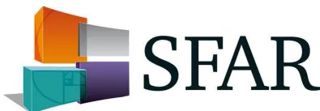
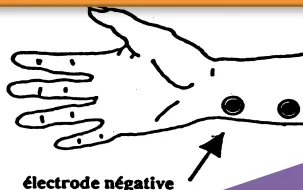

# Recommandations Formalisées d'Experts

The logo for the Société Française d'Anesthésie et de Réanimation (SFAR). It features a stylized graphic on the left consisting of three overlapping, semi-transparent squares in orange, grey, and teal. To the right of the graphic, the acronym 'SFAR' is written in a large, bold, dark blue serif font.

Actualisation de recommandations

## Curarisation et décurarisation en anesthésie

**Muscle relaxants and reversal in anaesthesia. Guidelines from the French Society of Anaesthesia & Intensive Care Medicine**

2018

Société Française d'Anesthésie et de Réanimation

**Auteurs :** Christophe Baillard, Jean-Louis Bourgain, Gaëlle Bouroche, Bertrand Debaene, Laetitia Desplanque, Jean-Michel Devys, Thomas Fuchs-Buder, Gilles Lebuffe, Claude Meistelman, Cyrus Motamed, Benoît Plaud, Julien Raft, Frédérique Servin, Didier Sirieix, Karem Slim, Franck Verdonk.## RESUME

**Objectif.** Mettre à jour le référentiel français sur l'utilisation des curares en anesthésie qui datait de 1999.

**Conception.** Un comité de consensus de seize experts a été constitué. Une politique de déclaration et de suivi des liens d'intérêts a été appliquée et respectée durant tout le processus de réalisation du référentiel. De même, celui-ci n'a bénéficié d'aucun financement provenant d'une entreprise commercialisant un produit de santé (médicament ou dispositif médical). Le comité de consensus devait respecter et suivre la méthode Grade® (*Grading of Recommendations Assessment, Development and Evaluation*) pour évaluer la qualité des données factuelles sur lesquelles étaient fondées les recommandations. Les inconvénients potentiels de faire des recommandations fortes en présence de données factuelles de mauvaise qualité ou insuffisantes ont été soulignés. Peu de recommandations ont été non graduées.

**Méthodes.** Le comité a étudié huit questions : 1) En l'absence de critère de ventilation au masque difficile doit-on vérifier la possibilité de ventiler au masque facial avant l'injection du curare ? Faut-il curariser les patients pour faciliter la ventilation au masque facial ? 2) Faut-il curariser les patients pour faciliter l'intubation de la trachée ? 3) Faut-il curariser les patients pour la mise en place et la gestion des complications des dispositifs supra glottiques ? 4) Faut-il monitorer les patients lors de la curarisation pour le contrôle des voies aériennes ? 5) Faut-il curariser les patients pour faciliter les procédures interventionnelles et pour quelles procédures ? 6) Faut-il monitorer les patients lors de la curarisation en peropératoire ? 7) Quelles stratégies de prévention et de traitement de la curarisation résiduelle ? 8) Quelles indications et précautions d'emploi des curares et des décurarisants dans les populations spéciales (enfant, surcharge pondérale, maladies neuromusculaires, électroconvulsivothérapie, insuffisance rénale, hépatique, sujet âgé ? Chaque question a été formulée selon un format Pico (*Patients Intervention Comparison Outcome*) puis les profils de preuve ont été produits. L'analyse de la littérature et les recommandations ont été formulées selon la méthodologie GRADE®.

**Résultats.** Le travail de synthèse des experts et l'application de la méthode GRADE ont abouti à trente recommandations. Parmi les recommandations formalisées, 11 ont un niveau de preuve élevé (GRADE 1+/-) et 21 un niveau de preuve faible (GRADE 2+/-). Pour deux recommandations, la méthode GRADE ne pouvait pas s'appliquer, aboutissant à un avis d'experts. Après deux tours de cotation et un amendement, un accord fort a été obtenu pour l'ensemble des recommandations.

**Conclusion.** Un accord important existait parmi les experts sur des recommandations fortes dans le but de d'améliorer les pratiques pour l'usage des curares en anesthésie. La Sfar recommande l'usage d'un dispositif de monitoring de la curarisation au cours d'une anesthésie générale.## ABSTRACT

**Objective.** To provide an update to French guidelines about « Muscle relaxants and reversal in anaesthesia 1999».

**Design.** A consensus committee of sixteen experts was convened. A formal conflict-of-interest (COI) policy was developed at the onset of the process and enforced throughout. The entire guidelines process was conducted independently of any industrial funding (*i.e.* pharmaceutical, medical devices). The authors were advised to follow the rules of the Grading of Recommendations Assessment, Development and Evaluation (GRADE®) system to guide assessment of quality of evidence. The potential drawbacks of making strong recommendations in the presence of low-quality evidence were emphasized. Some recommendations were ungraded.

**Methods.** The panel focused on eight questions: 1) In the absence of difficult mask ventilation criteria is it necessary to verify the possibility to ventilate via the face mask before muscle relaxant injection? Is it necessary to use muscle relaxants to facilitate face mask ventilation? 2) Is it necessary to use muscle relaxants to facilitate tracheal intubation? 3) Is it necessary to use muscle relaxants to facilitate supra-glottic devices implementation and for management of complications of thereof? 4) Is it necessary to monitor neuromuscular blockade when using muscle relaxants for airway management (*i.e.* tracheal intubation or supra-glottic devices)? 5) Is it necessary to use muscle relaxants to facilitate interventional procedures and for which? 6) Is it necessary to monitor neuromuscular blockade when using muscle relaxants during interventional procedures? 7) What are the strategies for preventing and treating residual neuromuscular blockade? 8) What are the indications and precautions for use of both muscle relaxants and reversal agents in special populations (*e.g.* paediatric, overweight, neuromuscular diseases, electroconvulsive therapy, renal or hepatic failure, elderly)?

Population, intervention, comparison, and outcomes (PICO) questions were reviewed and updated as needed, and evidence profiles were generated. The analysis of the literature and the recommendations were then conducted according to the GRADE® methodology.

**Results.** The SFAR Guideline panel provided thirty statements on muscle relaxants and reversal agents in anaesthesia. After two rounds of discussion and various amendments, a strong agreement was reached for 100% of recommendations. Of these recommendations, 11 have a high level of evidence (Grade 1 +/-), 21 have a low level of evidence (Grade 2 +/-). No recommendation was provided for two questions.

**Conclusions.** Substantial agreement exists among experts regarding many strong recommendations for the best care management of patients receiving muscle relaxants and reversal agents during anaesthesia. The French society of Anesthesia and Intensive Care recommends the use of neuromuscular monitoring device during anesthesia## **Organisateurs et coordonnateur d'experts SFAR :**

Christophe Baillard, Bertrand Debaene, Benoît Plaud\*

## **Comité d'organisation :**

Dominique Fletcher et Lionel Velly

## **Groupe d'experts de la SFAR (ordre alphabétique) :**

Christophe Baillard, Jean-Louis Bourgain, Gaëlle Bouroche, Bertrand Debaene, Jean-Michel Devys, Thomas Fuchs-Buder, Gilles Lebuffe, Claude Meistelman, Cyrus Motamed, Benoît Plaud, Julien Raft, Frédérique Servin, Didier Sirieix, Karem Slim.

## **Groupes de travail :**

**En l'absence de critère de ventilation au masque difficile doit-on vérifier la possibilité de ventiler au masque facial avant l'injection du curare ? Faut-il curariser les patients pour faciliter la ventilation au masque facial ?**

Jean-Louis Bourgain, Gaëlle Bouroche, Benoît Plaud

**Faut-il curariser les patients pour faciliter l'intubation de la trachée ?**

Bertrand Debaene, Jean-Michel Devys, Thomas Fuchs-Buder

**Faut-il curariser les patients pour la mise en place et la gestion des complications des dispositifs supra glottiques ?**

Jean-Louis Bourgain, Gaëlle Bouroche

**Faut-il monitorer les patients lors de la curarisation pour le contrôle des voies aériennes ?**

Christophe Baillard

**Faut-il curariser les patients pour faciliter les procédures interventionnelles et pour quelles procédures ?**

Claude Meistelman, Karem Slim

**Faut-il monitorer les patients lors de la curarisation en peropératoire ?**

Claude Meistelman, Cyrus Motamed

**Quelles stratégies de prévention et de traitement de la curarisation résiduelle ?**

Christophe Baillard, Bertrand Debaene, Julien Raft, Didier Sirieix

**Quelles indications et précautions d'emploi des curares et des décurarisants dans les populations spéciales ?**

Gilles Lebuffe, Jean-Michel Devys, Frédérique Servin, Benoît Plaud**Chargés de bibliographie :**

Laetitia Desplanque, Franck Verdonk

**\*Auteur pour correspondance :**

Benoît Plaud. Service d'anesthésie, réanimation chirurgicale. Hôpital Saint-Louis 1, avenue Claude Vellefaux 75475 Paris cedex 10. [benoit.plaud@aphp.fr](mailto:benoit.plaud@aphp.fr)

**Groupe de Lecture :**

*Comité des Référentiels clinique de la SFAR* : Lionel Velly (Président), Marc Garnier (Secrétaire), Julien Amour, Alice Blet, Gérald Chanques, Vincent Compère, Philippe Cuvillon, Fabien Espitalier, Etienne Gayat, Hervé Quintard, Bertrand Rozec, Emmanuel Weiss

*Conseil d'Administration de la SFAR* : Xavier Capdevila, Hervé Bouaziz, Laurent Delaunay, Pierre Albaladejo, Jean-Michel Constantin, Marie-Laure Cittanova Pansard, Marc Léone, Bassam Al Nasser, Valérie Billard, Francis Bonnet, Julien Cabaton, Marie-Paule Chariot, Isabelle Constant, Alain Delbos, Claude Ecoffey, Jean-Pierre Estèbe, Marc Gentili, Olivier Langeron, Pierre Lanot, Luc Mercadal, Karine Nouette-Gaulain, Jean-Christian Sleth, Eric Viel, Paul Zetlaoui

Texte validé par le Conseil d'Administration de la SFAR le 21 juin 2018**Liens d'intérêts des experts SFAR au cours des cinq années précédant la date de validation par le CA de la Sfar.**

- ● Christophe Baillard. Conférencier rémunéré à titre personnel pour le compte de MSD<sup>TM</sup> France. Aucun lien familial ou financier avec une entreprise commercialisant un produit de santé (médicament et/ou dispositif médical).
- ● Jean-Louis Bourgain. Pas de lien d'intérêts en rapport avec le thème de la présente RFE.
- ● Gaëlle Bouroche. Pas de lien d'intérêts en rapport avec le thème de la présente RFE.
- ● Laetitia Desplanque. Pas de lien d'intérêts en rapport avec le thème de la présente RFE.
- ● Jean-Michel Devys. Pas de lien d'intérêts en rapport avec le thème de la présente RFE.
- ● Bertrand Debaene. Consultant, conférencier rémunéré à titre personnel pour le compte de MSD<sup>TM</sup> France. Aucun lien familial ou financier avec une entreprise commercialisant un produit de santé (médicament et/ou dispositif médical).
- ● Thomas Fuchs-Buder. Consultant, conférencier rémunéré à titre personnel pour le compte de MSD<sup>TM</sup> France. Aucun lien familial ou financier avec une entreprise commercialisant un produit de santé (médicament et/ou dispositif médical).
- ● Gilles Lebuffle. Consultant, conférencier rémunéré à titre personnel pour le compte de MSD<sup>TM</sup> France. Aucun lien familial ou financier avec une entreprise commercialisant un produit de santé (médicament et/ou dispositif médical).
- ● Benoît Plaud. Consultant, conférencier rémunéré à titre personnel pour le compte de MSD<sup>TM</sup> France. Aucun lien familial ou financier avec une entreprise commercialisant un produit de santé (médicament et/ou dispositif médical).
- ● Cyrus Motamed. Pas de lien d'intérêts en rapport avec le thème de la présente RFE.
- ● Claude Meistelman. Consultant, conférencier rémunéré à titre personnel pour le compte de MSD<sup>TM</sup> France. Aucun lien familial ou financier avec une entreprise commercialisant un produit de santé (médicament et/ou dispositif médical).
- ● Julien Raft. Conférencier rémunéré à titre personnel pour le compte de MSD<sup>TM</sup> France. Aucun lien familial ou financier avec une entreprise commercialisant un produit de santé (médicament et/ou dispositif médical).
- ● Frédérique Servin. Pas de lien d'intérêts en rapport avec le thème de la présente RFE.
- ● Karem Slim. Conférencier rémunéré à titre personnel pour le compte de MSD<sup>TM</sup> France. Aucun lien familial ou financier avec une entreprise commercialisant un produit de santé (médicament et/ou dispositif médical).
- ● Didier Sirieix. Consultant, conférencier rémunéré à titre personnel pour le compte de MSD<sup>TM</sup> France. Aucun lien familial ou financier avec une entreprise commercialisant un produit de santé (médicament et/ou dispositif médical).
- ● Franck Verdonk. Pas de lien d'intérêts en rapport avec le thème de la présente RFE.## Introduction

La conférence de consensus (CC) sur « *les indications de la curarisation en anesthésie* » a été conduite en 1999 et publiée en 2000 [1]. Elle précisait les conditions d'utilisation des curares pour l'intubation de la trachée, le geste opératoire, leurs effets secondaires et les règles de sécurité lors de la curarisation peropératoire et de la décurarisation. Les populations cibles étaient l'adulte et l'enfant. La curarisation était également abordée dans d'autres CC ou conférences d'experts (CE), notamment dans le contrôle des voies aériennes : « *Prise en charge des voies aériennes en anesthésie adulte, à l'exception de l'intubation difficile* » [2], « *Intubation difficile* » [3], « *Sédation, analgésie en pré hospitalier* » [4], « *Sédation, analgésie en réanimation* » [5].

Ces référentiels argumentaient les effets positifs de la curarisation sur les conditions d'intubation pour l'opérateur et pour le patient, chez l'adulte en particulier.

Plusieurs éléments sont intervenus depuis cette première CC sur « *les indications de la curarisation en anesthésie* ».

- ● La possibilité d'injecter un curare non dépolarisant avec ou sans vérification préalable de la capacité à ventiler efficacement au masque.
- ● Les effets positifs de la curarisation sur les conditions d'intubation pour l'opérateur et le patient, incluant la pédiatrie et l'électro-convulsivothérapie.
- ● Le développement d'alternatives à l'intubation pour le contrôle des voies aériennes comme les dispositifs supra-glottiques.
- ● L'essor de la chirurgie par laparoscopie, avec ou sans assistance robotique.
- ● Les données épidémiologiques régulièrement actualisées sur le risque allergique aux curares, qui ont fait l'objet d'une révision de la Recommandation formalisée d'expert sur la « *Prévention du risque allergique per anesthésique* » [6].
- ● Les données récentes sur les précautions d'utilisation de la succinylcholine motivant la modification du résumé des caractéristiques du produit (RCP) par l'Agence nationale de sécurité du médicament et des produits de santé (ANSM).
- ● L'arrêt de la commercialisation de certains curares (pancuronium, vécuronium) et la mise à disposition du *cis*-atracurium.
- ● L'épidémiologie sur la morbidité, la mortalité des pratiques non-conformes dans l'induction en séquence rapide (anesthésie, urgences et pré-hospitalier).
- ● L'impact positif du monitoring de la curarisation sur la gestion de la curarisation, la détection de la curarisation résiduelle et la décurarisation pharmacologique, la faible performance des tests cliniques de décurarisation, l'actualisation régulière au niveau international des données sur la fréquence de la curarisation résiduelle avec ou sans décurarisation pharmacologique et les conséquences de celle-ci retrouvant une association à un sur risque de morbidité grave au cours immédiat d'un acte d'anesthésie.
- ● Le développement de nouvelles méthodes de monitoring objectif de la curarisation pour une utilisation en routine clinique.
- ● La révision des effets de la néostigmine, notamment en matière de délai d'injection par rapport au niveau de décurarisation, le délai d'action maximale, la possibilité deréduire la dose dans certains cas et les premières données d'utilisation du sugammadex, agent décurarisant spécifique des curares stéroïdiens.

- • En termes de balance bénéfice-risque de l'utilisation des curares, les experts rappellent que toutes les études s'étant intéressées aux accidents allergiques peropératoires en France depuis plus de trente ans vont toutes dans le même sens. Les agents curarisants ont été mis en cause dans plus de la moitié de ces accidents [7,8]. Parmi ces agents curarisants, le rocuronium et la succinylcholine sont plus fréquemment mis en cause que les autres curares. Dans l'étude de Mertes et coll. [9] sur les 373 cas d'allergie documentée aux curares, le rocuronium est notifié dans 16 cas et la succinylcholine dans 226 cas. En tenant compte des parts de marché, le rocuronium est responsable de 4,6 % des accidents allergiques aux curares alors qu'il ne représente que 1,1 % des parts de marché. Concernant la succinylcholine, pour une part de marché de 12,2 %, elle est responsable de 60,6 % des accidents allergiques aux curares. À titre de comparaison, l'atracurium est responsable 19,6 % des accidents allergiques aux curares pour une part de marché de 45,2 %. Toujours en tenant compte des parts de marché, la fréquence de l'anaphylaxie due au rocuronium a été estimée à 8,0 / 100 000 administration, celle liée au vécuronium à 2,8 / 100 000 et celle de l'atracurium à 4,0 / 100 000. Celle de la succinylcholine n'a pas pu être déterminée [10,11]. Plus récemment, la fréquence de l'anaphylaxie due à l'atracurium a été estimée à 1 / 22 451 administrations. Celle liée à la succinylcholine à 1/2 080 et celle liée au rocuronium à de1/2 499 [12]. Ces données ont été confirmées par la pharmacovigilance française (données non publiées mais retranscrites avec l'accord de l'Agence Nationale de Sécurité des Médicaments). Parmi les 1 624 cas analysés, seuls ceux pour lesquels la tryptase et les tests cutanés étaient positifs ont été retenus, soit 680 cas. La succinylcholine avait un taux de notification de 7,05 / 100 000 administrations et le rocuronium avait un taux de 4,15 / 100 000. Les autres curares avaient des taux de notification compris entre 0,17 / 100 000 et 0,36 / 100 000. Deux groupes distincts étaient confirmés : la succinylcholine et le rocuronium avec des taux de notification plus élevés et les autres curares avec des taux de notification plus faibles.## 1. Méthodologie

### 1.1. Recherche bibliographique et critères de sélection.

La recherche bibliographique a porté sur les publications référencées dans Medline® et Cochrane database® sans limitation de date. La sélection a privilégié les essais contrôlés, les méta-analyses, les revues systématiques et les études de cohortes. Une analyse spécifique de la littérature pédiatrique a été réalisée.

### 1.2. Population et comparaisons

Les populations étudiées concernent l'adulte, l'enfant ainsi que les populations spéciales telles que le patient en surcharge pondérale, le patient avec dysfonction rénale, hépatique ainsi que les patients porteurs de maladies neuromusculaires. Toutes ces situations sont traitées séparément.

### 1.3. Méthode GRADE

Chaque question a été formulée selon un format PICO (Patients Intervention Comparaison Outcome). La méthode de travail utilisée pour l'élaboration des recommandations est la méthode GRADE®. Cette méthode permet, après une analyse quantitative de la littérature de déterminer séparément la qualité des preuves, c'est-à-dire une estimation de la confiance que l'on peut avoir dans l'analyse de l'effet de l'intervention quantitative et d'autre part un niveau de recommandation. La qualité des preuves est répartie en quatre catégories :

- ● Haute : les recherches futures ne changeront très probablement pas la confiance dans l'estimation de l'effet ;
- ● Modérée : les recherches futures changeront probablement la confiance dans l'estimation de l'effet et pourraient modifier l'estimation de l'effet lui-même ;
- ● Basse : les recherches futures auront très probablement un impact sur la confiance dans l'estimation de l'effet et modifieront probablement l'estimation de l'effet lui-même ;
- ● Très basse : l'estimation de l'effet est très incertaine.

L'analyse de la qualité des preuves est réalisée pour chaque étude, puis un niveau global de preuve est défini pour une question et un critère donnés. La formulation finale des recommandations sera toujours binaire soit positive soit négative et soit forte soit faible :

- ● Forte : Il faut faire ou ne pas faire (GRADE 1+ ou 1-);
- ● Faible : Il faut probablement faire ou ne pas faire (GRADE 2+ ou 2-).

La force de la recommandation est déterminée en fonction de facteurs clés, validée par les experts après un vote, en utilisant la méthode Delphi et GRADE Grid :

- ● Estimation de l'effet ;
- ● Le niveau global de preuve : plus il est élevé, plus probablement la recommandation sera forte ;
- ● La balance entre effets désirables et indésirables : plus celle-ci est favorable, plus probablement la recommandation sera forte ;- ● Les valeurs et les préférences : en cas d'incertitudes ou de grande variabilité, plus probablement la recommandation sera faible ; ces valeurs et préférences doivent être obtenues au mieux directement auprès des personnes concernées (patient, médecin, décisionnaire) ;
- ● Coûts : plus les coûts ou l'utilisation des ressources sont élevés, plus probablement la recommandation sera faible.

Pour faire une recommandation, au moins 50 % des participants ont une opinion et moins de 20 % préfèrent la proposition contraire. Pour faire une recommandation forte, au moins 70% des participants sont d'accord. Dans certains cas il a été impossible de proposer une recommandation

Si les experts ne disposaient pas de données de la littérature permettant de proposer une recommandation, il était possible de proposer un avis d'expert validé si au moins 70% des experts étaient d'accord avec la proposition.

Le travail de synthèse des experts et l'application de la méthode GRADE ont abouti à trente recommandations. Parmi les recommandations formalisées, 11 ont un niveau de preuve élevé (GRADE 1+/-) et 21 un niveau de preuve faible (GRADE 2+/-). Pour deux recommandations, la méthode GRADE ne pouvait pas s'appliquer, aboutissant à un avis d'experts. Après deux tours de cotation et un amendement, un accord fort a été obtenu pour l'ensemble des recommandations.

Ces RFE se substituent aux recommandations précédentes émanant de la Sfar, sur un même champ d'application. La Sfar incite tous les anesthésistes-réanimateurs à se conformer à ces RFE pour assurer une qualité des soins dispensés aux patients. Cependant, dans l'application de ces recommandations, chaque praticien doit exercer son jugement, prenant en compte son expertise et les spécificités de son établissement, pour déterminer la méthode d'intervention la mieux adaptée à l'état du patient dont il a la charge.## Références

- [1] Indication de la curarisation en anesthésie. *Ann Fr Anesth Reanim* 2000;19:fi 34-37
- [2] Debaene B, Bruder N, Chollet-Rivier M. Agents d'induction : agents intraveineux, agents halogénés, morphiniques et curares ; monitoring. *Ann Fr Anesth Réanim* 2003;22:53s–9s
- [3] Langeron O, Bourgain JL, Francon D, Amour J, Baillard C, Bouroche G, M, et al. Recommandations formalisées d'experts. Intubation difficile et extubation en anesthésie chez l'adulte 2017. *Anesth Reanim* 2018;3 :552-71
- [4] Vivien B, Adnet F, Bounes V, Chéron G, Combes X, David JS, et al. Recommandations formalisées d'experts. Sédation et analgésie en structure d'urgence. Réactualisation 2010 de la Conférence d'experts de la Sfar de 1999. *Ann Fr Anesth Reanim* 2012;31:391-404
- [5] Sauder P, Andreoletti M, Cambonie G, Capellier G, Feissel M, Gall O, et al. Sédation-analgésie en réanimation (nouveauté exclue). *Ann Fr Anesth Reanim* 2008;27:541-51
- [6] Gueguen T, Coevoet V, Mougeot M, Pierron A, Blanquart D, Voicu M, et al. Prévention du risque allergique peranesthésique. Texte court. *Ann Fr Anesth Reanim* 2011;30:212-22
- [7] Tran DTT, Newton EK, Mount VAH, Lee JS, Welles GA, Perry JJ. Rocuronium versus succinylcholine for rapid sequence induction. *Cochrane database of systematic review* 2015, Issue 10. Art. No.: CD002788. [Doi:10.1002/14651858.CD002788.pub3](https://doi.org/10.1002/14651858.CD002788.pub3)
- [8] Dong SW, Mertes PM, Petitpain N, Hasdenteufel F, Malinovsky JM. Hyersensitivity reactions during anesthesia. Results from the ninth French survey (2005-2007). *Minerva Anestesiol* 2012;78:868-78
- [9] Mertes PM, Alla F, Tréchat P, Auroy Y, Jouglia E;Groupe d'Etudes des Réactions Anaphylactoides Peranesthésiques. Anaphylaxis during anesthesia in France: an 8-year national survey. *J Allergy Clin Immunol*. 2011;128:366-73
- [10] Harboe T, Gutormsen AB, Irgens A, Dybendal T, Florvaag E. Anaphylaxis during anesthesia in Norway. *Anesthesiology* 2005;102:897-903
- [11] Sadleir PHM, Clarke RC, Bunning DL, Platt PR. Anaphylaxis to neuromuscular blocking drugs:incidence and cross-reactivity in western Australia from 2002 to 2011. *Br J Anaesth* 2013;110:981-7
- [12] Reddy JI, Cooke PJ, van Schalkwyk JM, Hannam JA, Fitzharris P, Mitchell SJ. Anaphylaxis is more common with rocuronium and succinylcholine than with atracurium. *Anesthesiology* 2015;122:39-45**Question 1. En l'absence de critère de ventilation au masque difficile doit-on vérifier la possibilité de ventiler au masque facial avant l'administration d'un curare ? Faut-il administrer un curare pour faciliter la ventilation au masque facial ?**

Jean-Louis Bourgain, Gaëlle Buroche, Benoît Plaud

PICO : Le P est défini comme « patients adultes ayant reçu des curares pour une chirurgie réglée avec une intubation trachéale » ; I comme : curares (type de curare : succinylcholine, atracurium, vécuronium et rocuronium) ; C comme : pas de curares et O : critère d'évaluation : mesure de paramètres mécaniques respiratoires (Vt pression d'insufflation). Pour la question « Faut-il curariser les patients pour faciliter la ventilation au masque facial ? » le O critère d'évaluation a été : échelle de qualité de la ventilation au masque facial.

<table border="1"><tr><td><b>R1.1 – Il n'est probablement pas recommandé de tester la possibilité de ventiler au masque avant d'administrer un curare.</b></td></tr><tr><td style="text-align: right;"><b>(Grade 2-) Accord FORT</b></td></tr><tr><td><b>R1.2 – Il est probablement recommandé d'administrer un curare pour faciliter la ventilation au masque facial.</b></td></tr><tr><td style="text-align: right;"><b>(Grade 2+) Accord FORT</b></td></tr><tr><td><p><b>Argumentaire :</b> La sécurité est apportée par l'utilisation de méthodes d'oxygénation immédiatement disponibles avant l'apparition de la désaturation (<math>SpO_2 &lt; 95\%</math>).</p><p>Quel que soit le protocole d'induction avec ou sans curare, la marge de sécurité entre la durée d'apnée et les réserves en <math>O_2</math> est faible. Cette situation est d'autant plus fréquente que l'index de masse corporelle est élevé ou la consommation d'<math>O_2</math> élevée. Tester la ventilation au masque avant l'injection d'un curare augmente la durée d'induction en ajoutant le délai d'action du curare à celui des autres agents.</p><p>Tester la qualité de la ventilation au masque avant d'injecter un curare est proposé avec en arrière-pensée 1. qu'une injection de curare peut allonger la durée d'apnée et favoriser la survenue d'une désaturation par impossibilité de ventiler au masque 2. Qu'il faut à tout moment pouvoir réveiller le patient si la situation l'exige.</p><p>La situation d'avoir à réveiller un patient pour intubation impossible est extrêmement rare et peu documentée : deux cas sur 100 intubations difficiles parmi 11257 intubations [1] et neuf cas parmi 698 patients avec intubation et ventilation au masque difficiles [2]. La reprise rapide d'une ventilation spontanée après induction n'empêche pas l'apparition d'une désaturation artérielle en <math>O_2</math> [3] et ceci justifie de maintenir élevé les stocks en <math>O_2</math> à tout moment.</p><p>La curarisation n'augmente pas forcément la durée d'apnée et le risque de désaturation. Après thiopental et succinylcholine sur le volontaire sain, quatre sujets sur douze présentent une baisse de la saturation en oxygène en dessous de 80% avant la levée de la curarisation. Sur vingt-quatre volontaires sains, l'injection de 2mg/kg de propofol et de 1,5 ou 2 µg/kg de rémifentanil a entraîné une désaturation profonde chez cinq sujets (quatre dans le groupe 2µg/kg et un dans le groupe 1,5 µg/kg) [4]. Passer d'une dose de rémifentanil de 1 à 2 µg/kg augmente la durée d'apnée de façon substantielle (270 à 487 s) alors qu'environ 10% des patients ont des conditions d'intubation jugées inacceptables [5]. Utiliser une dose de rémifentanil de 4 µg/kg procure des conditions d'intubation</p></td></tr></table>comparables à celle observée après succinylcholine au prix d'une majoration de l'hypotension artérielle et d'un allongement de la durée d'apnée (12,8 versus 6,0 min) [6]. Toutes les publications rapportent l'utilisation de propofol entre 2 et 2,5 mg/kg. Le retour à la conscience jugée sur la réponse aux ordres simples et l'index bi-spectral (BIS) est de 529 s (écart-type 176 s) après injection de propofol 2mg/kg [7]. Le réveil ne signifie pas pour autant que les effets du propofol sur les muscles laryngés ont disparu. Ils sont mesurables pour des concentrations aussi faibles que 0,7 µg/ml [8]. La durée d'action de la succinylcholine a été évaluée entre sept et huit minutes en utilisant l'électromyographie laryngée et diaphragmatique [9] et environ douze minutes en utilisant l'accélérométrie [10], avec une variabilité importante dans les deux cas. La réduction des doses de succinylcholine ne permet pas de raccourcir ce temps d'apnée de façon significative [11]. L'utilisation du sugammadex après rocuronium procure un délai de réveil plus rapide et plus constant que la succinylcholine [10], à condition d'avoir à disposition immédiate le nombre d'ampoules de sugammadex nécessaire [12]. L'injection de sugammadex après rocuronium donne de meilleurs résultats que la succinylcholine en termes de valeur moyenne (4,7min) et de variabilité individuelle [10]. La décurarisation par le sugammadex peut être inefficace et conduire à une situation imposant un abord trachéal en urgence [13].

La curarisation altère-t-elle la ventilation au masque chez les patients sans critère de ventilation au masque difficile et/ou d'intubation difficile ?

L'administration de curare améliore le relâchement musculaire surtout lors de l'utilisation de doses élevées de sufentanil [14] ou de rémifentanil [15] ou de faibles doses d'hypnotique [16].

Cinq études ont porté sur l'effet de l'injection d'un curare sur la mécanique respiratoire, toutes utilisant des critères différents. Deux d'entre elles ont inclus un faible nombre de patients (30 et 32 respectivement) et rapportent des résultats non significatifs [17] ou partiellement significatifs en faveur de la succinylcholine [18]. La variabilité interindividuelle de la réponse au curare est importante, laissant penser que certains patients sont déjà complètement relâchés avant la paralysie. Dans deux études (125 patients dont certains sont obèses [19] et 210 patients [20]), l'amélioration de la ventilation après curarisation est significative, même si une altération a pu être notée chez 19% d'entre eux [20]. Une amélioration de la ventilation au masque a pu également être mise en évidence sur des critères objectifs après injection de rocuronium [21].

Chez les patients avec critères de ventilation au masque difficile et/ou d'intubation difficile. À partir d'une base de données de quatre établissements regroupant 492 239 anesthésies générales, l'association difficulté de ventilation au masque et difficulté d'intubation a été notée pour 698 patients (0,4%) [2]. L'amélioration de la ventilation au masque après curarisation est notée pour dix-neuf patients, sans aucune aggravation. Dans une série prospective de 12 225 patients avec critères d'intubation difficile, l'amélioration de la ventilation après injection de curare est notée pour cinquante-six cas sur quatre-vingt-dix cas de ventilation au masque difficile (sans altération pour les autres) [22].## Références

- [1] Combes X, Le Roux B, Suen P, et al. Unanticipated difficult airway in anesthetized patients: prospective validation of a management algorithm. *Anesthesiology* 2004;100:1146-50
- [2] Kheterpal S, Healy D, Aziz MF, et al. Incidence, predictors, and outcome of difficult mask ventilation combined with difficult laryngoscopy: a report from the multicenter perioperative outcomes group. *Anesthesiology* 2013;119:1360-9
- [3] Heier T, Feiner JR, Lin J, et al. Hemoglobin desaturation after succinylcholine-induced apnea: a study of the recovery of spontaneous ventilation in healthy volunteers. *Anesthesiology* 2001;94:754-9
- [4] Stefanutto TB, Feiner J, Krombach J, et al. Hemoglobin desaturation after propofol/remifentanil-induced apnea: a study of the recovery of spontaneous ventilation in healthy volunteers. *Anesth Analg* 2012;114:980-6
- [5] Woods A, Grant S, Davidson A. Duration of apnoea with two different intubating doses of remifentanil. *Eur J Anaesthesiol* 1999;16:634-7
- [6] McNeil IA, Culbert B, Russell I. Comparison of intubating conditions following propofol and succinylcholine with propofol and remifentanil 2 micrograms kg-1 or 4 micrograms kg-1. *Br J Anaesth* 2000;85:623-5
- [7] Flaishon R, Windsor A, Sigl J, Sebel PS. Recovery of consciousness after thiopental or propofol. Bispectral index and isolated forearm technique. *Anesthesiology* 1997;86:613-9
- [8] Nieuwenhuijs D, Sartor E, Teppema LJ, et al. Respiratory sites of action of propofol: absence of depression of peripheral chemoreflex loop by low-dose propofol. *Anesthesiology* 2001;95:889-95
- [9] Dhonneur G, Kirov K, Slavov V, Duvaldestin P. Effects of an intubating dose of succinylcholine and rocuronium on the larynx and diaphragm: an electromyographic study in humans. *Anesthesiology* 1999;90:951-5
- [10] Sorensen MK, Bretlau C, Gatke MR, et al. Rapid sequence induction and intubation with rocuronium-sugammadex compared with succinylcholine: a randomized trial. *Br J Anaesth* 2012;108:682-9
- [11] Naguib M, Samarkandi AH, Abdullah K, et al. Succinylcholine dosage and apnea-induced hemoglobin desaturation in patients. *Anesthesiology* 2005;102:35-40
- [12] Bisschops MM, Holleman C, Huitink JM. Can sugammadex save a patient in a simulated 'cannot intubate, cannot ventilate' situation? *Anaesthesia* 2010;65:936-41
- [13] Kyle BC, Gaylard D, Riley RH. A persistent 'can't intubate, can't oxygenate' crisis despite rocuronium reversal with sugammadex. *Anaesth Intensive Care* 2012;40:344-6
- [14] Bennett JA, Abrams JT, Van Riper DF, Horrow JC. Difficult or impossible ventilation after sufentanil-induced anesthesia is caused primarily by vocal cord closure. *Anesthesiology* 1997;87:1070-4
- [15] Nakada J, Nishira M, Hosoda R, et al. Priming with rocuronium or vecuronium prevents remifentanil-mediated muscle rigidity and difficult ventilation. *J Anesth* 2009;23:323-8
- [16] Andel H, Klune G, Andel D, et al. Propofol without muscle relaxants for conventional or fiberoptic nasotracheal intubation: a dose-finding study. *Anesth Analg* 2000;91:458-61
- [17] Goodwin MW, Pandit JJ, Hames K, et al. The effect of neuromuscular blockade on the efficiency of mask ventilation of the lungs. *Anaesthesia* 2003;58:60-3
- [18] Ikeda A, Isono S, Sato Y, et al. Effects of muscle relaxants on mask ventilation in anesthetized persons with normal upper airway anatomy. *Anesthesiology* 2012;117:487-93
- [19] Sachdeva R, Kannan TR, Mendonca C, Patteril M. Evaluation of changes in tidal volume during mask ventilation following administration of neuromuscular blocking drugs. *Anaesthesia* 2014;69:826-31
- [20] Joffe AM, Ramaiah R, Donahue E, et al. Ventilation by mask before and after the administration of neuromuscular blockade: a pragmatic non-inferiority trial. *BMC Anaesthesiol* 2015;15:134
- [21] Warters RD, Szabo TA, Spinale FG, et al. The effect of neuromuscular blockade on mask ventilation. *Anaesthesia* 2011;66:163-7
- [22] Amathieu R, Combes X, Abdi W, et al. An Algorithm for Difficult Airway Management, Modified for Modern Optical Devices (Airtraq Laryngoscope; LMA CTrach): A 2-Year Prospective Validation in Patients for Elective Abdominal, Gynecologic, and Thyroid Surgery. *Anesthesiology* 2011;114:25-33## Question 2. Faut-il administrer un curare pour faciliter l'intubation de la trachée ?

Bertrand Debaene, Jean-Michel Devys, Thomas Fuchs-Buder

PICO : le P est défini comme « patients adultes ayant reçu des curares pour une chirurgie réglée ayant une intubation trachéale » ; I comme : curares (type de curare : succinylcholine, atracurium, *cis*-atracurium, mivacurium, pancuronium, rapacuronium, vécuronium et rocuronium) ; C comme : pas de curares et O : critères d'évaluation sont différenciés en positif : conditions d'intubation, évaluées soit par les critères de Cormack & Lehane [1,2] ou ceux des « Good Clinical research Practice (GCRP) in pharmacodynamic studies of neuromuscular blocking agents » [3] et négatif : gêne des voies respiratoires supérieures : mal de gorge (sore throat), voix rauque (hoarseness), lésions des cordes vocales (vocal cords injuries), lésions pharyngées, dentaires, complications graves : perforation trachéale, intubation œsophagienne, pneumopathie d'inhalation, réaction allergique.

### R2.1 – Il est recommandé d'administrer un curare pour faciliter l'intubation de la trachée.

**(Grade 1+) Accord FORT**

**Argumentaire :** Depuis la conférence de consensus de 1999 plusieurs études se sont intéressées à la question si la curarisation facilite l'intubation oro-trachéale. Pour y répondre trente-deux études randomisées et contrôlées, une étude de cohorte et une revue systématique ont été considérées [4-36]. Les curares actuellement disponibles en France, par ordre d'ancienneté, sont la succinylcholine, l'atracurium, le rocuronium, le mivacurium et le *cis*-atracurium. Les études avec des doses de curare inférieures à une dose active 95% à l'adducteur du pouce ( $DA_{95}$ ) n'ont pas été prises en compte. Si plusieurs doses du même curare ont été utilisées par étude, la dose la plus proche de deux fois la  $DA_{95}$  a été retenue. Si l'étude propose plusieurs types de protocole sans curare, une seconde analyse prenant en compte uniquement le meilleur protocole a été réalisée. C'est ainsi que des données de 1 247 patients ayant reçu du curare et 1 422 qui n'ont pas reçu du curare (analyse du meilleur protocole : 1 092 patients) ont été analysé soit un total de 2 669 patients (analyse du meilleur protocole 2 339 patients). Sans curare, 350 patients (analyse du meilleur protocole : 283 patients) ont des mauvaises conditions d'intubation. Ceci correspond à un taux de 24,6% (analyse meilleur protocole : 25,9%). Avec curare, 51 patients (4,1%) ont des mauvaises conditions d'intubation. La cohorte comporte sur 103 784 patients, dont 28 201 patients ont été intubés sans curare et 75 583 avec. Sans curare, le taux de mauvaises conditions d'intubation était de 6,7% et utilisant un curare, il est descendu à 4,5%. Cette étude a identifié l'intubation sans curare comme facteur de risque indépendant pour l'intubation difficile. En conséquence, ces données soutiennent le concept que, comparé avec un protocole sans curare, l'utilisation de curare facilite l'intubation de la trachée

#### Références :

- [1] Cormack RS, Lehane J. Difficult tracheal intubation in obstetrics Anaesthesia 1984;39:1105-11-8
- [2] Yentis SM, Lee DJ. Evaluation of an improved scoring system for the grading of direct laryngoscopy. Anaesthesia 1998;11:1041-4
- [3] Fuchs-Buder T, Claudius C, Skovgaard LT, Eriksson LI, Mirakhur RK, Viby-Mogensen J. Good clinical research practice in pharmacodynamic studies of neuromuscular blocking agents II: the Stockholm revision. Acta Anaesthesiol Scand 2007;7:789-808[4] Alexander R, Olufolabi AJ, Booth J, El-Moalem HE, Glass PS. Dosing study of remifentanil and propofol for tracheal intubation without the use of muscle relaxants. *Anaesthesia* 1999;11:1037-40

[5] Barclay K, Eggers K, Asai T. Low-dose rocuronium improves conditions for tracheal intubation after induction of anaesthesia with propofol and alfentanil. *Br J Anaesth* 1997;78:92-4

[6] Beck GN, Masterson GR, Richards J, Bunting P. Comparison of intubation following propofol and alfentanil with intubation following thiopentone and suxamethonium. *Anaesthesia* 1993;48:876-80

[7] Bouvet L, Stoian A, Jacquot-Laperrière S, Allaouchiche B, Chassard D, Boselli E. Laryngeal injuries and intubating conditions with or without muscular relaxation: an equivalence study. *Can J Anaesth* 2008;55:674-84

[8] Combes X, Andriamifidy L, Dufresne E, Suen P, Sauvat S, Scherrer E, et al. Comparison of two induction regimens using or not using muscle relaxant: impact on postoperative upper airway discomfort. *Br J Anaesth* 2007;99:276-81

[9] Dominici L, Gondret R, Dubos S, Crevot O, Delingé P. Intubation in otorhinolaryngologic surgery: Propofol versus propofol-suxamethonium. *Ann Fr Anesth Réanim* 1990;9:110-4

[10] Gulhas N, Topal S, Erdogan Kayhan G, Yucel A, Begec Z, Yologlu S, et al. Remifentanil without muscle relaxants for intubation in microlaryngoscopy: a double blind randomised clinical trial. *Eur Rev Med Pharmacol Sci* 2013;17:1967-73

[11] Hanna SF, Ahmad F, Pappas AL, Mikat-Stevens M, Jellish WS, Kleinman B, et al. The effect of propofol/remifentanil rapid-induction technique without muscle relaxants on intraocular pressure. *J Clin Anesth* 2010;22:437-42

[12] Harsten A, Gillberg L. Intubating conditions provided by propofol and alfentanil--acceptable, but not ideal. *Acta Anaesthesiol Scand* 1997;41:985-7

[13] Iamaroon A, Pitimana-aree S, Prechawai C, Anusit J, Somcharoen K, Chaiyaroj O. Endotracheal intubation with thiopental/succinylcholine or sevoflurane-nitrous oxide anesthesia in adults: a comparative study. *Anesth Analg* 2001;92:523-8

[14] Iseesele T, Amadasun F, Edomwonyi N. Comparison of intubating conditions with propofol suxamethonium versus propofol-lidocaine. *J West Afr Coll Surg* 2012;2:51-67

[15] Jiao J, Huang S, Chen Y, Liu H, Xie Y. Comparison of intubation conditions and apnea time after anesthesia induction with propofol/alfentanil combined with or without small doses of succinylcholine. *Int J Clin Exp Med* 2014;7:393-99

[16] Kahwaji R, Bevan DR, Bikhazi G, Shanks CA, Fragen RJ, Dyck JB, et al. Dose-ranging study in younger adult and elderly patients of ORG 9487, a new, rapid-onset, short-duration muscle relaxant. *Anesth Analg* 1997;84:1011-8

[17] Kirkegaard-Nielsen H, Caldwell JE, Berry PD. Rapid tracheal intubation with rocuronium: a probability approach to determining dose. *Anesthesiology* 1999;91:131-6

[18] Kopman AF, Klewicka MM, Neuman GG. Reexamined: the recommended endotracheal intubating dose for nondepolarizing neuromuscular blockers of rapid onset. *Anesth Analg* 2001;93:954-9

[19] Lieutaud T, Billard V, Khalaf H, Debaene B. Muscle relaxation and increasing doses of propofol improve intubating conditions. *Can J Anaesth* 2003;50:121-6

[20] Lowry DW, Carroll MT, Mirakhur RK, Hayes A, Hughes D, O'Hare R. Comparison of sevoflurane and propofol with rocuronium for modified rapid-sequence induction of anaesthesia. *Anaesthesia* 1999;54:247-52

[21] McNeil IA, Culbert B, Russell I. Comparison of intubating conditions following propofol and succinylcholine with propofol and remifentanil 2 micrograms kg<sup>-1</sup> or 4 micrograms kg<sup>-1</sup>. *Br J Anaesth* 2000;85:623-5

[22] Mencke T, Echternach M, Kleinschmidt S, Barth V, Plinkert PK, Fuchs-Buder T. Laryngeal morbidity and quality of tracheal intubation: a randomized controlled trial. *Anesthesiology* 2003;98:1049-56.

[23] Mencke T, Jacobs RM, Machmueller S, Sauer M, Heidecke C, Kallert A, et al. Intubating conditions and side effects of propofol, remifentanil and sevoflurane compared with propofol, remifentanil and rocuronium: a randomised, prospective, clinical trial *BMC Anesthesiol* 2014;14:39

[24] Naguib M, Samarkandi A, Riad W, Alharby SW. Optimal dose of succinylcholine revisited. *Anesthesiology* 2003;99:1045-9

[25] Naguib M, Samarkandi AH, El-Din ME, Abdullah K, Khaled M, Alharby SW. The dose of succinylcholine required for excellent endotracheal intubating conditions. *Anesth Analg* 2006;102:151-5

[26] Nimmo SM, McCann N, Broome IJ, Robb HM. Effectiveness and sequelae of very low-dose suxamethonium for nasal intubation. *Br J Anaesth* 1995;74:31-4

[27] Pang L, Zhuang YY, Dong S, Ma HC, Ma HS, Wang YF. Intubation without muscle relaxation for suspension laryngoscopy: a randomized, controlled study. *Niger J Clin Pract* 2014;17:456-61

[28] Pino RM, Ali HH, Denman WT, Barrett PS, Schwartz A. A comparison of the intubation conditions between mivacurium and rocuronium during balanced anesthesia *Anesthesiology* 1998;88:673-8

[29] Rousseau JM, Lemardeley P, Giraud D, Lemarié J, Ladagnous JF, Barriot P, et al. Endotracheal intubation under propofol with or without vécuronium. *Ann Fr Anesth Réanim* 1995;14:261-4

[30] Scheller MS, Zornow MH, Saidman LJ. Tracheal intubation without the use of muscle relaxants: a technique using propofol and varying doses of alfentanil. *Anesth Analg* 1992;75:788-93

[31] Schlaich N, Mertzlufft F, Soltész S, Fuchs-Buder T. Remifentanil and propofol without muscle relaxants or with different doses of rocuronium for tracheal intubation in outpatient anaesthesia. *Acta Anaesthesiol Scand* 2000;44:720-6

[32] Sivalingam P, Kandasamy R, Dhakshinamoorthi P, Madhavan G. Tracheal intubation without muscle relaxant--a technique using sevoflurane vital capacity induction and alfentanil. *Anaesth Intensive Care* 2001;29:383-7[33] Stevens JB, Vescovo MV, Harris KC, Walker SC, Hickey R. Tracheal intubation using alfentanil and no muscle relaxant: is the choice of hypnotic important? *Anesth Analg* 1997;84:1222-6

[34] Striebel HW, Hözl M, Rieger A, Brummer G. Endotracheal intubation with propofol and fentanyl. *Anaesthesist* 1995;44:809-17

[35] Lundstrøm LH, Møller AM, Rosenstock C, Astrup G, Gätke MR, Wetterslev J. Avoidance of neuromuscular blocking agents may increase the risk of difficult tracheal intubation: a cohort study of 103,812 consecutive adult patients recorded in the Danish Anaesthesia Database. *Br J Anaesth* 2009;103:283-90

[36] Lundstrøm LH, Duez CHV, Nørskov AK, Rosenstock CV, Thomsen JL, Møller AM, et al. Effects of avoidance or use of neuromuscular blocking agents on outcomes in tracheal intubation: a Cochrane systematic review. *Br J Anaesth* 2018;120:1381-93

## R2.2 – Il est recommandé d’administrer un curare pour réduire les traumatismes du pharynx et/ou du larynx.

**(Grade 1+) Accord FORT**

**Argumentaire :** La qualité de l’intubation peut avoir des conséquences cliniques pour le patient. Mencke et coll. [1] ont établi le lien entre qualité d’intubation et complications postopératoires telles que des lésions des cordes vocales ou la voix rauque. Six études contrôlées et randomisées avec 746 patients (analyse meilleur protocole : 694 patients) ont pu être considérées [1-6]. Selon ces études, 90 patients (analyse du meilleur protocole : 65 patients) ont eu des traumatismes pharyngés et/ou laryngés. Ceci correspond à un taux de 22,6% (analyse du meilleur protocole : 18,7%). En utilisant un protocole avec curare, cette incidence a pu être réduite à 9,7%. Cette réduction des lésions pharyngées et/ou laryngées peut être observée dans l’ensemble des six études analysées. L’absence de curare pour faciliter l’intubation augmente le risque de lésions ou de gêne des voies respiratoires supérieures. Un taux de traumatismes pharyngés et/ou laryngés de près de 10% malgré de bonnes conditions d’intubation peut surprendre. Néanmoins, plusieurs facteurs autres que les conditions d’intubation peuvent être à l’origine de ces complications. Les plus importants sont certainement la taille de la sonde d’intubation et les conditions d’extubation.

### Références :

[1] Mencke T, Echternach M, Kleinschmidt S, Barth V, Plinkert PK, Fuchs-Buder T. Laryngeal morbidity and quality of tracheal intubation: a randomized controlled trial. *Anesthesiology* 2003;98:1049-56

[2] Bouvet L, Stoian A, Jacquot-Laperrière S, Allaouchiche B, Chassard D, Boselli E. Laryngeal injuries and intubating conditions with or without muscular relaxation: an equivalence study. *Can J Anaesth* 2008;55:674-84

[3] Combes X, Andriamifidy L, Dufresne E, Suen P, Sauvat S, Scherrer E, et al. Comparison of two induction regimens using or not using muscle relaxant: impact on postoperative upper airway discomfort. *Br J Anaesth* 2007;99:276-81

[4] Gulhas N, Topal S, Erdogan Kayhan G, Yucel A, Begec Z, Yologlu S, et al. Remifentanil without muscle relaxants for intubation in microlaryngoscopy: a double blind randomised clinical trial. *Eur Rev Med Pharmacol Sci* 2013;17:1967-73

[5] Mencke T, Jacobs RM, Machmueller S, Sauer M, Heidecke C, Kallert A, et al. Intubating conditions and side effects of propofol, remifentanil and sevoflurane compared with propofol, remifentanil and rocuronium: a randomised, prospective, clinical trial. *BMC Anesthesiol* 2014;14:39

[6] Sivalingam P, Kandasamy R, Dhakshinamoorthi P, Madhavan G. Tracheal intubation without muscle relaxant--a technique using sevoflurane vital capacity induction and alfentanil. *Anaesth Intensive Care* 2001;29:383-7**R2.3 – Il est probablement recommandé d’administrer un curare à délai d’action court pour l’induction en séquence rapide.**

**(Grade 2+) Accord FORT**

**Argumentaire :** L’induction en séquence rapide, quelle qu’en soit l’indication, consiste à réduire au minimum le délai entre la perte de conscience et la mise en place correcte de la sonde d’intubation afin d’éviter la ventilation en pression positive au masque facial et prévenir le risque d’inhalation. Pour atteindre cet objectif, les agents hypnotiques et les éventuels agents morphiniques associés ayant le délai d’installation de l’effet le plus court sont privilégiés. Lorsque la curarisation facilitant l’intubation trachéale y est associée, les curares utilisés doivent répondre à la même exigence c’est-à-dire produire une curarisation dans le délai le plus court possible. La succinylcholine est traditionnellement utilisée dans cette indication car elle possède le délai d’installation le plus court et la durée d’action la plus courte de tous les curares. Elle présente de nombreux effets secondaires parfois graves. Le rocuronium étant le curare non dépolarisant ayant le délai d’installation le plus court a été proposé comme une alternative à la succinylcholine. Une méta-analyse récente de la Cochrane Library a analysé et comparé les conditions d’intubation obtenues après l’administration de la succinylcholine et du rocuronium [1]. Cinquante articles (essais contrôlés et randomisés ou essais cliniques contrôlés) incluant 4 151 patients ont été analysés. La succinylcholine procure d’excellentes conditions d’intubation plus fréquemment que le rocuronium (RR = 0,86; intervalle de confiance à 95% 0,81-0,92;  $I^2 = 72\%$ ). Dans une analyse en sous-groupe comparant la succinylcholine à la dose de 1 mg/kg avec le rocuronium à une dose supérieure à 0,9 mg/kg, la supériorité de la succinylcholine n’est pas retrouvée. Cependant, l’hétérogénéité retrouvée entre les différentes études justifie une classification GRADE 2.

**Références :**

[1] Tran DTT, Newton EK, Mount VAH, Lee JS, Welles GA, Perry JJ. Rocuronium versus succinylcholine for rapid sequence induction. Cochrane database of systematic review 2015, Issue 10. Art. No.: CD002788.### Question 3. Faut-il administrer un curare pour la mise en place et la gestion des complications des dispositifs supra glottiques ?

Jean-Louis Bourgain, Gaëlle Bouroche

PICO : Le P est défini comme « patients adultes ayant reçu des curares pour une chirurgie réglée ayant un dispositif supraglottique » ; I comme : curares (type de curare : succinylcholine, atracurium, vécuronium et rocuronium) ; C comme : pas de curares ou avant – après et O : critère d'évaluation : mesure de paramètres mécaniques respiratoires ( $V_t$  pression d'insufflation) et taux de réussite de la pose du masque laryngé ou restauration de la perméabilité des voies aériennes.

#### R3.1 – Il n'est probablement pas recommandé d'administrer systématiquement un curare pour faciliter la pose d'un dispositif supra-glottique.

**(Grade 2-) Accord FORT**

**Argumentaire :** Sans curare, le taux de succès est élevé et les conditions de ventilation le plus souvent satisfaisantes [1,2]. Il est probablement utile de s'aider de la curarisation lors de la pose d'un dispositif supra glottique, lorsque les doses d'agents hypnotiques et morphiniques utilisées pour l'induction sont faibles [3,4]. Les protocoles d'anesthésie qui excluent le propofol comme agent d'induction ont un taux élevé de problèmes dont l'incidence diminue avec la curarisation [5,6]. Dans aucune publication, il n'a été rapporté d'effets néfastes de la curarisation sur la qualité de la ventilation. Le niveau global de preuves données par la littérature reste faible du fait de l'hétérogénéité des protocoles d'anesthésie utilisés et des critères de jugement.

#### Références :

- [1] Chen B, Tan L, Zhang L, Shang Y. Is muscle relaxant necessary in patients undergoing laparoscopic gynecological surgery with a ProSeal LMATM? J Clin Anesth 2013;25:32–5
- [2] Gong Y-H, Yi J, Zhang Q, Xu L. Effect of low dose rocuronium in preventing ventilation leak for flexible laryngeal mask airway during radical mastectomy. Int J Clin Exp Med 2015;8:13616–21
- [3] Aghamohammadi D, Eydi M, Hosseinzadeh H, Amiri Rahimi M, Golzari SE. Assessment of mini-dose succinylcholine effect on facilitating laryngeal mask airway insertion. J Cardiovasc Thorac Res 2013;5:17–21
- [4] Fujiwara A, Komasawa N, Nishihara I, Miyazaki S, Tatsumi S, Nishimura W, et al. Muscle relaxant effects on insertion efficacy of the laryngeal mask ProSeal(®) in anesthetized patients: a prospective randomized controlled trial. J Anesth 2015;29:580–4
- [5] Kong M, Li B, Tian Y. Laryngeal mask airway without muscle relaxant in femoral head replacement in elderly patients. Exp Ther Med 2016;11:65–8
- [6] Yoshino A, Hashimoto Y, Hirashima J, Hakoda T, Yamada R, Uchiyama M. Low-dose succinylcholine facilitates laryngeal mask airway insertion during thiopental anaesthesia. Br J Anaesth 1999;83:279–83

#### R3.2 – Il est probablement recommandé d'administrer un curare en cas d'obstruction des voies aériennes liée à un dispositif supra glottique.

**(Grade 2+) Accord FORT**

**Argumentaire :** En cas d'obstruction des voies aériennes supérieures, l'administration d'un curare est proposée au même titre que le changement de taille ou l'ajustement de la position [1]. Deux entités cliniques doivent être distinguées : la fermeture glottique qui réalise une obstruction incomplète ou facilement réversible et le laryngospasme quiimplique une fermeture glottique complète invincible par les moyens de ventilation habituels [2]. Il est fortement recommandé de curariser lors d'un laryngospasme même si l'injection de propofol (0,25 à 0,8 mg/kg) est efficace dans la majorité des cas (77% des cas) [3]. En l'absence de curare, le relâchement musculaire sous anesthésie générale n'est pas toujours complet ; les morphiniques ont tendance à augmenter le tonus musculaire [4]. En cas de fermeture glottique non liée à un laryngospasme, l'administration d'un curare est utile après avoir assuré une profondeur d'anesthésie suffisante. L'agent de choix est la succinylcholine qui est efficace dans tous les cas [5]. De plus, sa vitesse d'action est rapide et les muscles laryngés y sont particulièrement sensibles [6]. La voie intraveineuse est le plus souvent utilisée (1 mg/kg) et la voie intramusculaire voire sublinguale a été proposée (4 mg/kg) [7,8]. Chez l'enfant de moins de 3 ans, il est d'usage d'y associer de l'atropine 0,02 mg/kg pour éviter la bradycardie voire l'arrêt cardiaque [5]. Il est essentiel de connaître les effets indésirables de la succinylcholine et d'en respecter les contre-indications [7,9]. Il est possible qu'une même efficacité puisse être obtenue par un curare non dépolarisant car de faibles concentrations de curare sont nécessaires pour relâcher les muscles laryngés [9]. Une faible dose est suffisante pour obtenir l'ouverture glottique si la profondeur de l'anesthésie est adéquate (rocuronium ou atracurium 0,1 à 0,2 mg/kg) [4,10]. Dans tous les cas, la réduction des complications liées à l'obstruction des voies aériennes supérieures est optimisée lorsqu'elle s'intègre dans une démarche de qualité. La disponibilité immédiate de la succinylcholine et de l'atropine, en particulier dans les blocs de pédiatrie, est essentielle car, associée à la curarisation pour l'intubation, elle réduit de moitié environ l'incidence des arrêts cardiaques et des accidents sévères d'obstruction des voies aériennes [11].

#### Références :

- [1] Saito T, Liu W, Chew STH, Ti LK. Incidence of and risk factors for difficult ventilation via a supraglottic airway device in a population of 14,480 patients from South-East Asia. *Anaesthesia* 2015;70:1079–83
- [2] Sasaki CT, Leder SB, Acton LM, Maune S. Comparison of the glottic closure reflex in traditional “open” versus endoscopic laser supraglottic laryngectomy. *Ann Otol Rhinol Laryngol* 2006;115:93–6
- [3] Afshan G, Chohan U, Qamar-UI-Hoda M, Kamal RS. Is there a role of a small dose of propofol in the treatment of laryngeal spasm? *Paediatr Anaesth* 2002;12:625–8
- [4] Nakada J, Nishira M, Hosoda R, Funaki K, Takahashi S, Matsura T, et al. Priming with rocuronium or vecuronium prevents remifentanil-mediated muscle rigidity and difficult ventilation. *J Anesth* 2009;23:323–8
- [5] Al-alami AA, Zestos MM, Baraka AS. Pediatric laryngospasm: prevention and treatment. *Curr Opin Anaesthesiol* 2009;22:388–95
- [6] Meistelman C, Plaud B, Donati F. Neuromuscular effects of succinylcholine on the vocal cords and adductor pollicis muscles. *Anesth Analg* 1991;73:278–82
- [7] Seah TG, Chin NM. Severe laryngospasm without intravenous access--a case report and literature review of the non-intravenous routes of administration of suxamethonium. *Singapore Med J* 1998;39:328–30
- [8] Warner DO. Intramuscular succinylcholine and laryngospasm. *Anesthesiology* 2001;95:1039–40
- [9] Rawicz M, Brandom BW, Wolf A. The place of suxamethonium in pediatric anesthesia. *Paediatr Anaesth* 2009;19:561–70
- [10] Ghimouz A, Lentschener C, Goater P, Borne M, Esteve M. Adducted vocal cords relieved by neuromuscular blocking drug: a cause of impaired mechanical ventilation when using a laryngeal mask airway: two photographically documented cases. *J Clin Anesth* 2014;26:668–70
- [11] Spaeth JP, Kreeger R, Varughese AM, Wittkugel E. Interventions designed using quality improvement methods reduce the incidence of serious airway events and airway cardiac arrests during pediatric anesthesia. *Paediatr Anaesth* 2016;26:164–72#### Question 4. Faut-il monitorer la curarisation pour le contrôle des voies aériennes ?

Christophe Baillard

PICO : P est défini comme « patients adultes ayant reçu des curares non dépolarisant pour une chirurgie réglée ayant une intubation trachéale » ; I comme : curares (type de curare : atracurium et rocuronium) ; C comme : pas de monitoring et O : critère d'évaluation des conditions d'intubation, évaluées soit par les critères de Cormack & Lehane ou ceux des « Good Clinical research Practice (GCRP) in pharmacodynamic studies of neuromuscular blocking agents.

**PAS DE RECOMMANDATION : Les données de la littérature sont insuffisantes pour établir une recommandation sur l'utilisation d'un monitoring instrumental de la curarisation lors de l'intubation de la trachée.**

**Argumentaire :** Aucune étude ne permet de proposer une recommandation concernant la pertinence du monitoring neuromusculaire pour l'intubation, comparé à un délai fixe après l'injection de rocuronium ou d'atracurium.

**R4.1 Les experts suggèrent que si un monitoring instrumental de la curarisation est utilisé, le muscle sourcilier soit le site utilisé du fait de sa sensibilité aux curares et de sa cinétique de curarisation comparables à celles des muscles laryngés.**

#### **Avis d'experts**

**Argumentaire :** Les conditions d'intubation sont moins bonnes lorsque l'orbiculaire de l'œil est utilisé pour décider du moment pour réaliser l'intubation oro-trachéale comparées au muscle sourcilier ou au muscle adducteur du pouce [1,2]. De mauvaises conditions d'intubation ne sont retrouvées que dans le groupe des patients avec monitoring à l'orbiculaire de l'œil. La cinétique de curarisation du muscle sourcilier est globalement superposable à celle des muscles adducteurs laryngés alors que celle de l'orbiculaire de l'œil correspond beaucoup plus à celle des muscles plus sensibles aux curares [3]. Avec les mêmes conditions d'intubation, le monitoring au sourcilier permet de réduire le délai pour réaliser l'intubation oro-trachéale comparé à l'adducteur du pouce [4,5]. Ces deux articles identifient l'orbiculaire de l'œil en lieu et place du sourcilier. En fait, c'est bien le sourcilier qui était évalué. Avec l'atracurium ou le rocuronium administré à dose adaptée pour l'intubation trachéale, le fait d'attendre systématiquement le délai d'action moyen avant de débuter la laryngoscopie permet l'obtention des conditions optimales d'intubation.

#### **Références :**

- [1] Plaud B, Debaene B, Donati F. The corrugator supercilii, not the orbicularis oculi, reflects rocuronium neuromuscular blockade at the laryngeal adductor muscles. Anesthesiology 2001;95:96-101
- [2] Lee HJ, Kim KS, Jeong JS, Cheong MA, Shim JC. Comparison of the adductor pollicis, orbicularis oculi, and corrugator supercilii as indicators of adequacy of muscle relaxation for tracheal intubation. Br J Anaesth 2009;102:869-74[3] Lee HJ, Kim KS, Jeong JS, Shim JC, Oh YN. Comparison of four facial muscles, orbicularis oculi, corrugator supercilii, masseter or mylohyoid, as best predictor of good conditions for intubation: a randomised blinded trial. *Eur J Anaesthesiol* 2013;30:556-62

[4] Debaene B, Beaussier M, Meistelman C, Donati F, Lienhart A. Monitoring the onset of neuromuscular block at the orbicularis oculi can predict good intubating conditions during atracurium-induced neuromuscular block. *Anesth Analg* 1995;80:360-3

[5] Le Corre F, Plaud B, Benhamou E, Debaene B. Visual estimation of onset time at the orbicularis oculi after five muscle relaxants: application to clinical monitoring of tracheal intubation. *Anesth Analg* 1999;89:1305-10## Question 5. Faut-il administrer un curare pour faciliter les procédures interventionnelles et lesquelles ?

Claude Meistelman, Karem Slim

PICO : le P est défini comme « patients adultes ayant reçu des curares pour permettre un acte de chirurgie réglée » ; I comme : curares ; C comme : pas de curares ou niveau de bloc neuromusculaire modéré et O : critère d'évaluation : score de qualité du champ opératoire, pression d'insufflation en laparoscopie

**R5.1 – Il est recommandé d'administrer un curare pour faciliter l'acte opératoire en chirurgie abdominale par laparotomie ou par laparoscopie.**

**(Grade 1+) Accord FORT**

**R5.2 – Il est probablement recommandé d'administrer un curare pour faciliter l'acte opératoire en chirurgie ORL sous laser.**

**(Grade 2+) Accord FORT**

**Argumentaire :** La majorité des articles publiés sur ce thème concernait la chirurgie abdominale. Trois études concernant respectivement la chirurgie prostatique par laparotomie [1] ainsi que les cholécystectomies et les hystérectomies par laparoscopie comportant un groupe contrôle placebo ou recevant une faible dose de curare ont mis en évidence l'amélioration des conditions chirurgicales lors d'une curarisation peropératoire [2,3]. Dans le cadre de la chirurgie par laparoscopie, la curarisation peut sembler utile au moment de la création du pneumopéritoine (dans le cadre de la prévention des accidents iatrogènes de trocarts), afin d'augmenter l'espace de travail et au moment de la fermeture aponévrotique des orifices de trocarts. En chirurgie abdominale, la curarisation profonde améliore les conditions opératoires, en permettant une exposition adéquate que ce soit en laparotomie ou encore plus en laparoscopie [4,5,6]. Concernant la chirurgie laryngée, les résultats sont en faveur de la curarisation profonde avec une différence statistiquement significative sur l'exposition du champ opératoire (évalué par le chirurgien), les mouvements peropératoires des cordes vocales et la sécheresse buccale postopératoire ; mais sans différences pour les événements indésirables postopératoires [7,8].

### Références :

- [1] King M, Sujirattanawimol N, Danielson DR, Hall BA, Schroeder DR, Warner DO. Requirements for muscle relaxants during radical retropubic prostatectomy. *Anesthesiology* 2000;93:1392-7.
- [2] Dubois PE, Putz L, Jamart J, Marotta ML, Gourdin M, Donnez O. Deep neuromuscular block improves surgical conditions during laparoscopic hysterectomy: a randomised controlled trial. *Eur J Anaesthesiol* 2014;31:430-6.
- [3] Blobner M, Frick CG, Stauble RB, Feussner H, Schaller SJ, Unterbuchner C, et al. Neuromuscular blockade improves surgical conditions (NISCO). *Surg Endosc*. 2015;29:627-36
- [4] Staehr-Rye AK, Rasmussen LS, Rosenberg J, Juul P, Lindekaer AL, Riber C, et al. Surgical space conditions during low-pressure laparoscopic cholecystectomy with deep versus moderate neuromuscular blockade: a randomized clinical study. *Anesth Analg* 2014;119:1084-92
- [5] Martini CH, Boon M, Bevers RF, Aarts LP, Dahan A. Evaluation of surgical conditions during laparoscopic surgery in patients with moderate vs deep neuromuscular block. *Br J Anaesth* 2014;112:498-505
- [6] Madsen MV, Gatke MR, Springborg HH, Rosenberg J, Lund J, Istre O. Optimising abdominal space with deep neuromuscular blockade in gynaecologic laparoscopy--a randomised, blinded crossover study. *Acta Anaesthesiol Scand* 2015;59:441-7
- [7] Kim HJ, Lee K, Park WK, Lee BR, Joo HM, Koh YW, et al. Deep neuromuscular block improves the surgical conditions for laryngeal microsurgery. *Br J Anaesth* 2015;115:867-72
- [8] Huh H, Park SJ, Lim HH, et al. Optimal anesthetic regimen for ambulatory laser microlaryngeal surgery. *Laryngoscope* 2017;127:1135-9**PAS DE RECOMMANDATION : Les données de la littérature sont insuffisantes pour établir une recommandation sur le niveau de bloc neuromusculaire à atteindre (modéré *versus* profond) en chirurgie abdominale par laparotomie ou par laparoscopie.**

**Argumentaire :** Quelques études ont montré un effet bénéfique de la curarisation profonde sur les conditions opératoires du point de vue chirurgical. La différence absolue pour de bonnes ou excellentes conditions opératoires entre bloc profond et bloc modéré est de 25%, c'est à dire que dans ces études, un patient sur quatre bénéficierait du bloc profond sur le plan des conditions opératoires [1,2,3]. La question posée par cette différence est : quels sont les patients qui en bénéficieront ? Cette question n'a pas de réponse dans la littérature pour l'instant. Les études en chirurgie non-abdominale ont concerné la chirurgie rachidienne sans montrer de bénéfice d'une curarisation profonde par rapport à un bloc modéré [4,5]. Cependant, aucun essai n'a montré de différence entre bloc profond et bloc modéré en termes d'évènements chirurgicaux indésirables peropératoires ou de morbidité spécifique liée à une mauvaise exposition. Néanmoins, cette absence de différence doit être interprétée avec précaution car les essais avaient tous un faible effectif (n=24-102) ce qui ne permet pas de mettre en évidence une éventuelle différence significative. Il n'est donc pas possible d'émettre de recommandation quant au niveau de profondeur de la curarisation sur une éventuelle réduction de la morbidité chirurgicale per et postopératoire. Les experts n'ont trouvé que peu d'études centrées sur la réduction de la pression du pneumopéritoine en fonction de la profondeur de la curarisation : modérée (1 à 2 réponses au train de quatre à l'adducteur du pouce) ou profonde (5 réponses maximum au compte post-tétanique à l'adducteur du pouce). L'essai randomisé de Madsen et coll. de faible effectif (n=14) a montré que le bloc profond augmentait la distance entre l'ombilic et le promontoire de 0,3 cm. Cette différence n'est pas cliniquement significative et l'étude n'a pas évalué le risque lié à l'insertion du premier trocar [6]. Trois études prospectives randomisées ont été retenues. Une première étude randomisée sur 67 patients a pu mettre en évidence une baisse des pressions d'insufflation pour les curarisations les plus profondes. Ses résultats restent d'interprétation difficile car les auteurs ont comparé deux niveaux de bloc profond en monitorant le muscle sourcilier sans qu'il n'y ait de groupe présentant un bloc modéré c'est-à-dire 1 à 2 réponses au train de quatre à l'adducteur du pouce [1]. Dans une autre étude prospective ayant inclus 61 patients, les pressions d'insufflation intraabdominale nécessaires pour avoir des conditions chirurgicales satisfaisantes lors de la chirurgie colorectale, étaient significativement plus basses dans le groupe curarisation profonde (9 mmHg) que dans le groupe curarisation modéré (12 mmHg,  $p<0,001$ ) [2]. La troisième étude prospective portant sur 62 patients ayant subi une cholécystectomie avec une pression d'insufflation initialement fixée à 8 mmHg. Les résultats montraient qu'il avait fallu augmenter la pression d'insufflation à 12 mmHg dans 34% des cas dans le groupe curarisation modérée versus 12% dans le groupe bloc profond ( $p<0,05$ ) [3]. Une dernière étude prospective ouverte a démontré qu'une curarisation profonde permettait une baisse de 25% des pressions d'insufflation par rapport à l'absence de curarisation [7].

**Références :**- [1] Yoo YC, Kim NY, Shin S, Choi YD, Hong JH, Kim CY, et al. The intraocular pressure under deep versus moderate neuromuscular blockade during low-pressure robot assisted laparoscopic radical prostatectomy in a randomized trial. *PloS one* 2015;10:e0135412
- [2] Kim MH, Lee KY, Lee KY, Min BS, Yoo YC. Maintaining optimal surgical conditions with low insufflation pressures is possible with deep neuromuscular blockade during laparoscopic colorectal surgery: a prospective, randomized, double-blind, parallel-group clinical trial. *Medicine* 2016;95:e2920
- [3] Koo BW, Oh AY, Seo KS, Han JW, Han HS, Yoon YS. Randomized clinical trial of moderate versus deep neuromuscular block for low-pressure pneumoperitoneum during laparoscopic cholecystectomy. *World J Surg* 2016;40:2898-903
- [4] Li YL, Liu YL, Xu CM, Lv XH, Wan ZH. The effects of neuromuscular blockade on operating conditions during general anesthesia for spinal surgery. *J Neurosurg Anesthesiol* 2014;26:45-9
- [5] Gille O, Obeid I, Degrise C, Guerin P, Skalli W, Vital JM. The use of curare during anesthesia to prevent iatrogenic muscle damage caused by lumbar spinal surgery through a posterior approach. *Spine* 2007;32:402-5
- [6] Madsen MV, Gatke MR, Springborg HH, Rosenberg J, Lund J, Istre O. Optimising abdominal space with deep neuromuscular blockade in gynaecologic laparoscopy--a randomised, blinded crossover study. *Acta Anaesthesiol Scand* 2015;59:441-7
- [7] Van Wijk RM, Watts RW, Ledowski T, Trochsler M, Moran JL, Arenas GW. Deep neuromuscular block reduces intra-abdominal pressure requirements during laparoscopic cholecystectomy: a prospective observational study. *Acta Anaesthesiol Scand* 2015;59:434-40## Question 6. Faut-il monitorer la curarisation en peropératoire ?

Claude Meistelman, Cyrus Motamed

PICO : « monitoring de la curarisation, peropératoire ». Population : tout patient bénéficiant d'une anesthésie générale ; intervention : injection d'un curare en peropératoire « monitoring de la curarisation, peropératoire ». Population : tout patient bénéficiant d'une anesthésie générale ; intervention : injection d'un curare en peropératoire. Outcome : niveau de bloc neuromusculaire

<table border="1"><tr><td><b>R6.1 – Il est recommandé de monitorer la curarisation en peropératoire.</b></td></tr><tr><td style="text-align: right;"><b>(Grade 1+) Accord FORT</b></td></tr><tr><td><b>R6.2 – Il est probablement recommandé d'utiliser la stimulation par train de quatre du nerf ulnaire à l'adducteur du pouce pour monitorer la curarisation peropératoire.</b></td></tr><tr><td style="text-align: right;"><b>(Grade 2+) Accord FORT</b></td></tr><tr><td><b>Argumentaire 6.1 – 6.2 :</b> La Société Française d'Anesthésie et Réanimation recommande un monitoring en peropératoire de la curarisation et de la décurarisation pour les patients sous anesthésie générale ayant reçu des curares. Cette recommandation s'applique en salle d'intervention et en salle de surveillance post-interventionnelle. Le monitoring de la curarisation par simple neurostimulateur est plus précis que l'appréciation clinique simple [1]. Il est recommandé d'utiliser la stimulation du nerf ulnaire au poignet avec estimation visuelle ou tactile de la contraction de l'adducteur du pouce compte tenu la facilité d'accès mais aussi de l'éventuelle possibilité de quantification de la réponse musculaire de ce muscle [2]. La stimulation peropératoire de référence reste l'évaluation de la réponse de l'adducteur du pouce après stimulation par train de quatre. La présence d'une à deux réponses au train de quatre à l'adducteur du pouce témoigne d'une récupération d'environ 10% de la force musculaire initiale [1]. Quand une curarisation profonde des muscles les plus résistants de l'organisme (diaphragme, muscles de la paroi abdominale) est indiquée, il est recommandé d'attendre la disparition des quatre réponses au train de quatre à l'adducteur du pouce et de monitorer en utilisant une stimulation par PTC (<i>post-tetanic count</i>) ou CPT (compte post-tétanique) [3,4]. Dans ce cas, la présence d'une à cinq réponses à l'adducteur du pouce témoigne d'une paralysie complète des muscles abdominaux [3]. La stimulation du nerf facial par train de quatre et estimation visuelle de la réponse au muscle sourcilier est une alternative au CPT. Le profil de curarisation du muscle sourcilier est comparable à celui des muscles les plus résistants de l'organisme comme les muscles adducteurs laryngés ou le diaphragme. Le monitoring du muscle orbiculaire de l'œil après stimulation du nerf facial permet d'avoir des informations comparables à celles obtenues à l'adducteur du pouce [5]. Ceci peut être utile en l'absence d'accès en per opératoire aux membres supérieurs. En fin d'intervention, il est recommandé de basculer dès que possible sur un monitoring de l'adducteur du pouce pour quantifier la décurarisation [6]. Le monitoring instrumental par accéléromyographie de l'adducteur du pouce est plus précis que la simple estimation visuelle ou tactile des contractions musculaires [2].</td></tr><tr><td><b>Références :</b></td></tr></table>- [1] Bhananker SM, Treggiari MM, Sellers BA, Cain KC, Ramaiah R, Thilen SR. Comparison of train-of-four count by anesthesia providers versus TOF-Watch(R) SX: a prospective cohort study. *Can J Anaesth* 2015;62:1089-96
- [2] Larsen PB, Gätke MR, Fredensborg BB, Berg H, Engbaek J, Viby-Mogensen J. Acceleromyography of the orbicularis oculi muscle II: comparing the orbicularis oculi and adductor pollicis muscles. *Acta Anaesthesiol Scand* 2002;46:1131-6
- [3] Dhonneur G1, Kirov K, Motamed C, Amathieu R, Kamoun W, Slavov V, Ndoko SK. Post-tetanic count at adductor pollicis is a better indicator of early diaphragmatic recovery than train-of-four count at corrugator supercilii. *Br J Anaesth* 2007;99:376-9
- [4] Kim HJ, Lee K, Park WK, Lee BR, Joo HM, Koh YW, et al. Deep neuromuscular block improves the surgical conditions for laryngeal microsurgery. *Br J Anaesth* 2015;115:867-72
- [5] Plaud B., Debaene B, Donati F. The corrugator supercilii, not the orbicularis oculi, reflects rocuronium neuromuscular blockade at the laryngeal adductor muscles. *Anesthesiology* 2001;95:96-101
- [6] Thilen SR, Hansen BE, Ramaiah R, Kent CD, Treggiari MM, Bhananker SM. Intraoperative neuromuscular monitoring site and residual paralysis. *Anesthesiology* 2012;1175:964-72## Question 7. Quelles stratégies de diagnostic et de traitement de la curarisation résiduelle ?

Bertrand Debaene, Claude Meistelman, Julien Raft, Didier Sirieix

Pour la question 7.1, le P est défini comme « patients adultes ayant reçu des curares » ; I : curares ; C : test clinique curarisation résiduelle, monitoring de la curarisation ou absence, sensibilité musculaire à la curarisation et O : curarisation résiduelle : incidence ; complications liées à la curarisation résiduelle ».

Pour les questions 7.2 à 7.7, le P est défini comme « patients adultes ayant reçu des curares » ; Intervention : « néostigmine, sugammadex », C : « agent décurarisant ou pas », O : « monitoring quantitatif de la curarisation, récupération du bloc musculaire ».

**R7.1 – Il est probablement recommandé d'utiliser un monitoring quantitatif de la curarisation à l'adducteur du pouce pour le diagnostic de la curarisation résiduelle et d'obtenir un rapport entre la quatrième et la première réponse au train de quatre (rapport T4/T1) supérieur ou égal à 0,9 à l'adducteur du pouce pour éliminer formellement le diagnostic de curarisation résiduelle.**

**(Grade 2+) Accord FORT**

**Argumentaire :** Aucun test clinique n'est suffisamment sensible pour dépister une curarisation résiduelle [1]. La mesure qualitative du rapport entre la 4<sup>ème</sup> et la 1<sup>ère</sup> réponse au train de quatre (T4/T1) supérieur ou égal à 0,9 est requise pour éliminer formellement le diagnostic de curarisation résiduelle [2]. Tous les muscles n'ont pas la même sensibilité aux effets des curares. Le monitoring doit être effectué sur un muscle de sensibilité élevée aux curares, dont la cinétique de décurarisation est lente. L'adducteur du pouce par stimulation du nerf ulnaire est donc recommandé [3]. Seul le monitoring instrumental quantitatif utilisant la mesure du rapport T4/T1 à l'adducteur du pouce avec une stimulation supramaximale, permet d'évaluer une curarisation résiduelle [4, 5]. Les conséquences de la curarisation résiduelle en l'absence de traitement curatif sont une morbi mortalité supérieure dans les 24 premières heures postopératoires [6], un risque plus important d'événements critiques respiratoires en salle de surveillance post interventionnelle (SSPI) [7,8], un risque plus important de pneumopathie postopératoire [9,10], un risque plus important de dysfonction des muscles pharyngés [11] et une prolongation de la durée en SSPI [12].

### Références :

- [1] Murphy GS, Szokol JW, Marymont JH, Franklin M, Avram MJ, Vender JS. Residual paralysis at the time of tracheal extubation. *Anesth Analg* 2005;100:1840-5
- [2] Murphy GS, Szokol JW, Avram MJ, Greenberg SB, Shear T, Vender JS, et al. Postoperative residual neuromuscular blockade is associated with impaired clinical recovery. *Anesth Analg* 2013;117:133-41
- [3] Thilen SR, Hansen BE, Ramaiah R, Kent CD, Treggiari MM, Bhananker SM. Intraoperative neuromuscular monitoring site and residual paralysis. *Anesthesiology* 2012;117:964-72
- [4] Suzuki T, Fukano N, Kitajima O, Saeki S, Ogawa S. Normalization of acceleromyographic train-of-four ratio by baseline value for detecting residual neuromuscular block. *Br J Anaesth* 2006;96:44-7
- [5] Capron F, Fortier LP, Racine S, Donati F. Tactile fade detection with hand or wrist stimulation using train-of-four, double-burst stimulation, 50-hertz tetanus, 100-hertz tetanus, and acceleromyography. *Anesth Analg* 2006;102:1578-84
- [6] Arbous MS, Meursing AE, van Kleef JW, de Lange JJ, Spoormans HH, Touw P, et al. Impact of anesthesia management characteristics on severe morbidity and mortality. *Anesthesiology* 2005;102:257-68- [7] Murphy GS, Szokol JW, Marymont JH, Greenberg SB, Avram MJ, Vender JS. Residual neuromuscular blockade and critical respiratory events in the postanesthesia care unit. *Anesth Analg* 2008;107:130-7
- [8] Grosse-Sundrup M, Henneman JP, Sandberg WS, Bateman BT, Uribe JV, Nguyen NT, et al. Intermediate acting non-depolarizing neuromuscular blocking agents and risk of postoperative respiratory complications:prospective propensity score matched cohort study. *BMJ* 2012;345:e6329
- [9] Bulka CM, Terekhov MA, Martin BJ, Dmochowski RR, Hayes RM, Ehrenfeld JM. Nondepolarizing Neuromuscular Blocking Agents, Reversal, and Risk of Postoperative Pneumonia. *Anesthesiology* 2016;125:647-55
- [10] Ledowski T, Falke L, Johnston F, Gillies E, Greenaway M, De Mel A, et al. Retrospective investigation of postoperative outcome after reversal of residual neuromuscular blockade:sugammadex, neostigmine or no reversal. *Eur J Anaesthesiol* 2014;31:423-9
- [11] Eikermann M, Vogt FM, Herbstreit F, Vahid-Dastgerdi M, Zenge MO, Ochterbeck C, et al. The predisposition to inspiratory upper airway collapse during partial neuromuscular blockade. *Am J Respir Crit Care Med* 2007;175:9-15
- [12] Butterly A, Bittner EA, George E, Sandberg WS, Eikermann M, Schmidt U. Postoperative residual curarization from intermediate-acting neuromuscular blocking agents delays recovery room discharge. *Br J Anaesth* 2010;105:304-9**R7.2 – Il est recommandé après l'administration d'un curare non dépolarisant d'attendre une décurarisation spontanée égale à quatre réponses musculaires à l'adducteur du pouce après une stimulation en train de quatre au nerf ulnaire avant d'injecter de la néostigmine.**

**(Grade 1+) Accord FORT**

**Argumentaire :** La néostigmine étant un inhibiteur réversible de l'acétylcholinestérase, elle provoque une augmentation de la concentration d'acétylcholine dans la fente synaptique. Ainsi, de par la loi d'action de masse, les curares non dépolarisants, antagonistes de l'acétylcholine pour les récepteurs nicotiniques post-synaptiques, peuvent quitter ces récepteurs si deux conditions sont réunies : 1) la concentration de l'acétylcholine soit suffisamment élevée et 2) la concentration des curares non dépolarisants soit suffisamment diminuée. La concentration des curares non dépolarisants étant responsable du degré du bloc neuromusculaire, celui-ci doit avoir atteint spontanément une certaine valeur pour permettre la décurarisation efficace induite par la néostigmine. Par décurarisation efficace, on entend l'obtention d'un rapport du train de quatre supérieur ou égal à 90 %.

Le degré du bloc neuromusculaire optimal avant d'administrer la néostigmine a été précisé dans deux études. Dans la première étude prospective et randomisée [1], soixante-trois patients ont été répartis en quatre groupes en fonction du nombre de réponses tactiles de l'adducteur du pouce à une stimulation en train de quatre avant l'administration de 70 µg/kg de néostigmine : une, deux, trois ou quatre réponses. La curarisation était provoquée par du *cis*-atracurium. Le délai pour obtenir un rapport du train de quatre égal à 90 % était (min, médiane et valeurs extrêmes) de 22,2 (13,9-44,0), 20,2 (6,5-70,5), 17,1 (8,3-46,2) et 16,5 (6,5-143,3) lorsque la néostigmine était administrée à une, 2, 3 et 4 réponses de l'adducteur du pouce respectivement (non significatif). Vingt minutes après l'administration de la néostigmine, un rapport du train de quatre égal à 90 % était obtenu chez cinq des quatorze patients du groupe un ; six des seize patients du groupe deux, dix des seize patients du groupe trois et onze des quinze patients du groupe quatre. Ainsi le degré du bloc avant la décurarisation doit avoir spontanément récupéré au moins quatre réponses cliniques au train de quatre. La seconde étude, de méthodologie comparable, a analysé le délai d'obtention du rapport du train de quatre supérieur à 90 % après administration de rocuronium [2]. Cent soixante patients ont été étudiés en huit groupes de vingt selon le nombre de réponses de l'adducteur du pouce au train de quatre (une, deux, trois et quatre réponses) et selon l'agent d'entretien de l'anesthésie (propofol ou sévoflurane). La néostigmine était administrée à la dose de 70 µg/kg. Le délai pour obtenir rapport du train de quatre supérieur à 90 % était (min, médiane et valeurs extrêmes) dans les groupes propofol : 8,6 (4,7-18,9), 7,5 (3,4-11,2), 5,4 (1,6-8,6) et 4,7 (1,3-7,2) dans les groupes un, deux, trois et quatre respectivement ( $p < 0,05$  entre groupe quatre et groupes un et deux) ; dans les groupes sévoflurane : 26,6 (8,8-75,8), 22,6 (8,3-57,4), 15,6 (7,3-43,9) et 9,7 (5,1-26,4) dans les groupes un, deux, trois et quatre ( $p < 0,05$  entre groupe quatre et groupes un et deux). Tous ces délais étaient significativement plus courts lorsque l'anesthésie était entretenue par du propofol par rapport à un entretien par le sévoflurane ( $p < 0,0001$ ). Dix minutes après l'administration de la néostigmine injectée après avoir obtenu quatre réponses de l'adducteur du pouce après une stimulation en train de quatre,tous les patients anesthésiés par le propofol avaient un rapport du train de quatre supérieur à 90 % contre seulement 11/20 patients (55%) lorsque l'anesthésie était maintenue par le sévoflurane. Ainsi, sous propofol, la néostigmine 70 µg/kg administrée à quatre réponses tactiles de l'adducteur du pouce à une stimulation en train de quatre provoque une décurarisation complète en moins de dix minutes. Par contre, sous sévoflurane, la décurarisation n'est pas achevée en dix minutes chez tous les patients. L'ensemble de ces résultats suggère que quatre réponses au train de quatre est le minimum à obtenir avant d'administrer de la néostigmine, ce qui correspond à un rapport du train de quatre mesuré égal à au moins 20%.

#### Références :

- [1] Kirkegaard H, Heier T, Caldwell J. Efficacy of tactile-guided reversal from cisatracurium induced neuromuscular block. *Anesthesiology* 2002;96:45-50
- [2] Kim KS, Cheong MA, Lee HJ, Lee JM. Tactile assessment for the reversibility of rocuronium-induced neuromuscular blockade during propofol or sevoflurane. *Anesth Analg* 2004;99:1080-5

**R7.3 – Il est recommandé d'administrer la néostigmine sous couvert d'un monitoring de la curarisation à l'adducteur du pouce, d'administrer une dose comprise entre 40 et 50 µg/kg adaptée à la masse idéale, de ne pas augmenter la dose au-delà et de ne pas l'administrer en l'absence de bloc résiduel.**

**(Grade 1+) Accord FORT**

**Argumentaire :** La relation dose réponse de la néostigmine administrée lors d'un bloc profond, défini par le rapport T1/T0 égal à 1 %, et lors d'un bloc plus superficiel, défini par un rapport T1/T0 égal à 10 %, a été établie après curarisation par l'atracurium (T1 est la valeur de la contraction de la première réponse au train de quatre et T0 la valeur de la première réponse au train de quatre avant curarisation) [1]. La dose de néostigmine nécessaire pour obtenir un rapport du train de quatre supérieur à 70%, 10 minutes après la décurarisation réalisée à T1/T0 égal à 10 % (bloc modéré) était de  $50 \pm 7$  µg/kg (moyenne  $\pm$  ET) et de  $49 \pm 6$  à T1/T0 égal à 1% (bloc profond) (non significatif). Il apparaît que la dose de néostigmine, dans les conditions de l'étude, est donc de l'ordre de 40 à 50 µg/kg. Ces résultats ont été confirmés au cours de l'administration de rocuronium [2].

*Y-a-t-il un intérêt à augmenter la dose de néostigmine ?*

Trois doses de néostigmine (20, 40 et 80 µg/kg) ont été administrées après randomisation à vingt-sept patients adultes lorsque le bloc induit par de l'atracurium avait spontanément récupéré une valeur du rapport T1/T0 entre 5 à 10 % [3]. Le délai pour obtenir un rapport du train de quatre supérieur à 70 % était (min, médiane et valeurs extrêmes) 11,3 (9,3-15,7), 8,3 (4,1-13,3) et 5,2 (3,0-14,0) après 20, 40 et 80 µg/kg de néostigmine respectivement ( $p < 0,04$  entre la dose de 20 µg/kg et les deux autres doses). Ces résultats suggèrent qu'il n'est pas nécessaire d'augmenter la dose de néostigmine du fait de l'apparition d'un effet plafond.

Plus récemment, les effets respiratoires de la néostigmine administrée en l'absence de bloc résiduel ont été démontrés. Chez dix volontaires sains partiellement curarisés par durocuronium, 30 µg/kg de néostigmine étaient administrés lorsque le rapport du train de quatre avait spontanément atteint 100 % [4]. L'objectif principal de cette étude était d'évaluer les effets de la néostigmine sur la perméabilité des voies aériennes supérieures et l'activité électromyographique du muscle génio-glosse (dilatateur du larynx). Les volontaires étaient étudiés à quatre reprises : avant curarisation, lorsque le rapport du train de quatre était égal à 50 puis à 100 % et enfin après l'administration de la néostigmine. L'administration de la néostigmine lorsque que le rapport du train de quatre était égal à 100 % provoquait 1) une augmentation significative de la pression de fermeture des voies aériennes supérieures par rapport à avant curarisation ( $p < 0,002$ ) et lorsque le rapport du train de quatre était égal à 100 % mais avant l'injection de néostigmine ( $p < 0,02$ ) ;2) une réduction significative de l'activité EMG du génio-glosse en réponse à une augmentation de la pression négative des voies aériennes supérieures traduisant une altération de l'effet dilateur du muscle génio-glosse. Par contre aucune modification de la fréquence respiratoire, du rapport I/E, du volume courant et du rapport du train de quatre n'a été observée après l'injection de la néostigmine dans les conditions de l'étude. Ainsi, l'administration de la néostigmine après récupération complète du bloc (rapport du train de quatre égal à 100 %) diminue la perméabilité des VAS et réduit la capacité de dilatation du larynx.

#### Références :

- [1] Donati F, Smith CE, Bevan DR. Dose-response relationship for edrophonium and neostigmine as antagonists of moderate and profound atracurium blockade. *Anesth Analg* 1989;68:13-9
- [2] Abdulatif M, Mowafi H, Al-Ghamdi A, El-Sanabary M. Dose-response relationships for neostigmine antagonism of rocuronium-induced neuromuscular block in children and adults. *Br J Anaesth* 1996;77:10-5
- [3] Harper NJN, Wallace M, Hall IA. Optimum dose of neostigmine at two levels of atracurium-induced neuromuscular block. *Br J Anaesth* 1994;72:82-5
- [4] Fuchs-Buder T, Meistelman C, Alla F, Grandjean A, Wuthrich Y, Donati F. Antagonism of low degrees of atracurium-induced neuromuscular blockade :dose-effect relationship for neostigmine. *Anesthesiology* 2010;112:34-40

#### **R7.4 – Il est probablement recommandé de réduire la dose de néostigmine de moitié en cas de bloc résiduel très faible.**

**(Grade 2+) Accord FORT**

**Argumentaire :** La notion de réduction de la dose de néostigmine lorsque le bloc à décurariser est très superficiel a été plus récemment étudiée avec des résultats contradictoires. Les effets de trois doses de néostigmine (10, 20 et 30 µg/kg) ont été comparés à un placebo pour décurariser un bloc induit par de l'atracurium lorsque le rapport du train de quatre avait spontanément atteint 40 ou 60 % [1]. Cent vingt patients ont été randomisés en huit groupes de quinze. Le critère de jugement principal était le délai pour obtenir un rapport du train de quatre égal à 100 %. Lorsque le bloc était décurarisé avec un rapport du train de quatre égal à 40 %, ce délai était (min, médiane et valeurs extrêmes) : 19 (11-30), 11 (7-15), 9 (9-13) et 6 (4-11) après 0, 10, 20 et 30 µg/kg respectivement. Avec un rapport du train de quatre égal à 60 % avant la décurarisation, le délai était alors : 15 (8-20), 6 (4-16), 6 (4-14) et 5 (3-7) après 0, 10, 20 et 30 µg/kg respectivement. Ainsi, la dose de néostigmine pour obtenir un rapport du train de quatre égal à 100 % en moins de dix minutes était de  $25 \pm 11$  µg/kg et  $24 \pm 13$  µg/kg lorsque lanéostigmine était administrée lorsque le rapport du train de quatre avait atteint 40 et 60 % respectivement. Ces résultats confirment que la dose de néostigmine peut être réduite pour décurariser un bloc très superficiel. Dans une dernière étude, 3 doses de néostigmine (10, 20 et 40 µg/kg) ont été comparées à un placebo lors de la décurarisation d'un bloc induit par du *cis*-atracurium ou du rocuronium lorsque le bloc avait spontanément atteint un rapport du train de quatre égal à 50 % (soit un bloc très superficiel) [2]. Cent douze patients ont été inclus (avec quinze perdus de vue), soit douze patients par dose de néostigmine. Le critère de jugement principal était le délai entre l'injection de la néostigmine ou du placebo et l'obtention d'un rapport du train de quatre égal à 100 %. Après *cis*-atracurium, le délai pour atteindre un rapport du train de quatre égal à 100 % (min, médiane et valeurs extrêmes) était de 16,8 (7,8-29,5), 10,0 (5,0-14,2), 6,5 (4,5-12,6) et 4,3 (2,8-5,3) après 0, 10, 20 et 40 µg/kg de néostigmine respectivement. Après rocuronium, ce délai était de 17,5 (7,9-37,5), 6,1 (4,8-27,8), 6,6 (4,3-13,8) et 3,8 (1,5-6,5) après 0, 10, 20 et 40 µg/kg de néostigmine respectivement. Dix minutes après l'administration de la néostigmine, le pourcentage de patients ayant obtenu un rapport du train de quatre égal à 100 % était après *cis*-atracurium de 15, 50, 83 et 100 % (dose 0, 10, 20 et 40 µg/kg), après rocuronium de 17, 64, 83 et 100 % (dose 0, 10, 20 et 40 µg/kg). Ces résultats démontrent qu'il ne serait pas utile de réduire la dose de néostigmine et que la dose de choix resterait donc de 40 µg/kg. Cependant l'administration de la néostigmine à des doses trop élevées pour décurariser un bloc résiduel très superficiel n'est pas dénuée d'effets secondaires sur la transmission neuromusculaire. Dans une étude ayant inclus soixante patients, deux doses de néostigmine (20 ou 40 µg/kg) ont été administrées une, deux, trois ou quatre heures après l'injection d'une dose unique de vécuronium [3]. Chez les quarante patients ayant reçu 40 µg/kg de néostigmine, le rapport du train de quatre avait augmenté chez trente-deux et diminué chez huit d'entre eux. Ces patients avaient reçu la néostigmine plus de deux heures après le vécuronium et avaient tous un rapport du train de quatre supérieur à 90 % avant la décurarisation. La diminution du rapport du train de quatre a duré entre 17,4 et 52,6 minutes. Aucun effet de la dose de 20 µg/kg n'a été observé. La néostigmine 40 µg/kg administrée alors que le bloc induit par le vécuronium a spontanément récupéré (rapport du train de quatre supérieur à 90 %) peut altérer la transmission neuromusculaire et induire une fatigue au train de quatre.

#### Références :

- [1] Choi ES, Oh AY, Seo KS, Hwang JW, Ryu JH, Koo BW, Kim BG. Optimum dose of neostigmine to reverse shallow neuromuscular blockade with rocuronium and cisatracurium. *Anaesthesia* 2016;71:443-9
- [2] Caldwell JE. Reversal of residual neuromuscular block with neostigmine at one to four hours after a single intubating dose of vecuronium. *Anesth Analg* 1995;80:1168-74
- [3] Herbstreit F, Zigrahn D, Ochterbeck C, Petres J, Eikermann M. Neostigmine/glycopyrrolate administered after recovery from neuromuscular block increases upper airway collapsibility by decreasing genioglossus muscle activity in response to negative pharyngeal pressure. *Anesthesiology* 2010;113:1280-8**R7.5 – Il est recommandé de poursuivre le monitoring quantitatif de la curarisation après l'administration de la néostigmine jusqu'à l'obtention d'un rapport du train de quatre supérieur ou égal à 0,9.**

**(Grade 1+) Accord FORT**

**Argumentaire :** Le délai entre l'administration de la néostigmine et la décurarisation complète (c'est-à-dire l'obtention d'un rapport du train de quatre supérieur ou égal à 90 %) est d'autant plus long que le degré du bloc neuromusculaire au moment de la décurarisation est profond. Ce délai varie entre 10 et 30 minutes [1]. Il est donc nécessaire de contrôler après l'administration de la néostigmine, grâce au monitoring de la curarisation, la levée du bloc résiduel.

**Références :**

[1] Kirkegaard H, Heier T, Caldwell J. Efficacy of tactile-guided reversal from cisatracurium induced neuromuscular block. Anesthesiology 2002;96:45-50

**R7.6 – Il est recommandé d'ajuster la dose de sugammadex sur la masse idéale et en fonction du degré de bloc neuromusculaire induit par le rocuronium.**

**(Grade 1+) Accord FORT**

**R7.7 – Il est probablement recommandé de poursuivre le monitoring quantitatif de la curarisation après l'administration de sugammadex afin de détecter une recurarisation.**

**(Grade 2+) Accord FORT**

**Argumentaire 7.6 – 7.7 :** Le sugammadex est une gamma cyclodextrine capable d'encapsuler les seuls curares stéroïdiens (rocuronium et vécuronium). Une molécule de sugammadex ne permet une encapsulation que d'une seule molécule de curare. Ainsi plus la concentration du curare stéroïdien est importante, et donc plus le bloc est profond, plus la quantité de sugammadex à administrer pour décurariser le bloc neuromusculaire doit être élevée. Ce concept simple explique à lui seul que la dose de sugammadex ne peut être déterminée qu'après avoir quantifié le bloc neuromusculaire rendant indispensable le monitoring de la curarisation. La dose de sugammadex nécessaire pour la décurarisation a été déterminée pour quatre types de bloc :

1. 1. un bloc très modéré (rapport du train de quatre égal à 50 %) : une dose de sugammadex 0,22 mg/kg permet d'obtenir un rapport du train de quatre supérieur à 90 % en moins de cinq minutes chez 95 % des patients [1].
2. 2. un bloc modéré (réapparition de deux ou quatre réponses visuelles ou tactiles de l'adducteur du pouce à une stimulation en train de quatre) :
   - - Administré lors de l'apparition de quatre réponses au train de quatre, le sugammadex à la dose de 1 mg/kg décurarise le bloc neuromusculaire induit par le rocuronium en moins de cinq minutes. Une dose de 0,5 mg/kg est également efficace mais plus lentement (dix minutes) [2].- - Administré lors de l'apparition de deux réponses au train de quatre, le sugammadex à une dose au moins égale à 2,0 mg/kg réverse le bloc induit par du rocuronium en moins de cinq minutes [3,4].

1. 3. un bloc profond (une à deux réponses au compte post-tétanique) : pour décurariser un bloc profond induit par le rocuronium à la dose de 0,6 ou 1,2 mg/kg en moins de cinq minutes, une dose de sugammadex d'au moins 4 mg/kg est nécessaire [5].
2. 4. un bloc très profond : pour décurariser un bloc très profond (trois et quinze minutes après de fortes doses de rocuronium 1 ou 1,2 mg/kg) en moins de cinq minutes, une dose de sugammadex d'au moins 8 mg/kg est nécessaire [6,7,8].

L'administration d'une dose insuffisante de sugammadex peut être à l'origine d'un phénomène de recurarisation [9]. Ainsi, la dose de sugammadex doit être ajustée sur le degré du bloc au moment de la réversion. Le monitoring de la curarisation reste indispensable pour ajuster la dose de sugammadex et doit être poursuivi après l'administration du sugammadex pour détecter l'apparition éventuelle d'une recurarisation. L'efficacité du sugammadex est ralentie chez le patient âgé [10] et le patient insuffisant rénal sévère (clairance de la créatinine inférieure à 30 mL/min) [11] particulièrement en cas de décurarisation d'un bloc profond (compte post-tétanique entre un et trois).

#### Références :

1. [1] Schaller SJ, Fink H, Ulm K, Blobner M. Sugammadex and neostigmine dose-finding study for reversal of shallow residual neuromuscular block. *Anesthesiology* 2010;113:1054-60
2. [2] Pongracz A, Szatmari S, Nemes R, Fulesdi B, Tassonyi E. Reversal of neuromuscular blockade with sugammadex at the reappearance of four twitches to train-of-four stimulation. *Anesthesiology* 2013;119:10-2
3. [3] Sorgenfrei IF, Norrild K, Bo Larsen P, Stensballe J, Ostergaard D, Prins ME, Viby-Mogensen J. Reversal of rocuronium-induced neuromuscular block by the selective relaxant binding agent sugammadex. *Anesthesiology* 2006;104:667-74
4. [4] Suy K, Morias K, Cammu G, Hans P, Duijnhoven WGF, Heeringa M, Demeyer I. Effective reversal of moderate rocuronium- or vecuronium-induced neuromuscular block with sugammadex, a selective relaxant binding agent. *Anesthesiology* 2007;106:283-8
5. [5] Groudine SB, Soto R, Lien C, Drover D, Roberts K. A randomized, dose-finding, phase II study of the selective relaxant binding drug, sugammadex, capable of safely reversing profound rocuronium-induced neuromuscular block. *Anesth Analg* 2007;104:555-62
6. [6] Sparr HJ, Vermeyen KM, Beaufort AM, Rietbergen H, Proost JH, Saldien V, Velik-Salchner C, Wierda JMKH. Early reversal of profound rocuronium-induced neuromuscular blockade by sugammadex in a randomized multicenter study. *Anesthesiology* 2007;106:935-43
7. [7] Puhringer FK, Rex C, Sielenkamper AW, Claudius C, Larsen PB, Prins M, Eikermann M, Khuenl-Brady K. Reversal of profound, high-dose rocuronium-induced neuromuscular blockade by sugammadex at two different time points. *Anesthesiology* 2008;109:188-97
8. [8] de Boer HD, Driessen JJ, Marcus ME, Kerkkamp H, Heeringa M, Klimek M. Reversal of rocuronium-induced (1.2 mg/kg) profound neuromuscular block by sugammadex. A multicenter, dose-finding and safety study. *Anesthesiology* 2007;107:239-44
9. [9] Eleveld DJ, Kuizenga K, Proost JH, Wierda JMKH. A temporary decrease in twitch response during reversal of rocuronium-induced muscle relaxation with a small dose of sugammadex. *Anesth Analg* 2007;104:582-4
10. [10] Suzuki T, Kitajima O, Ueda K, Kondo Y, Kato J, Ogawa S. Reversibility of rocuronium-induced profound neuromuscular block with sugammadex in younger and older patients. *Br J Anaesth* 2011;106:823-6
11. [11] de Souza CM, Tardelli MA, Tedesco H, Garcia NN, Caparros MP, Alvarez-Gomez JA, de Oliveira Junior IS. Efficacy and safety of sugammadex in the reversal of deep neuromuscular blockade induced by rocuronium in patients with end-stage renal disease. *Eur J Anaesthesiol* 2015;32:681-6**Question 8. Quelles sont les indications et précautions d'emploi des curares et des agents décurarisants dans les populations spéciales ?**

Jean-Michel Devys, Gilles Lebuffe, Benoît Plaud, Frédérique Servin

***Patient pour l'électro convulsivothérapie***

PICO : le P est défini comme « patients adultes ayant reçu des curares pour une électro convulsivothérapie » ; I comme : curares (type de curare : succinylcholine, rocuronium) ; C comme : type de curares et O : critère d'évaluation : réduction des complications liées à la convulsion généralisée, durée d'action selon différents dosages.

<table border="1"><tr><td><b>R8.1 – Il est probablement recommandé d'administrer un curare à délai d'action court pour l'électro convulsivothérapie.</b></td></tr><tr><td style="text-align: right;"><b>(Grade 2+) Accord FORT</b></td></tr><tr><td><b>Argumentaire :</b> Le rationnel de l'utilisation des curares dans ce contexte est de prévenir les conséquences motrices de la convulsion généralisée telles que morsure de langue, chute, luxation, fracture. Le cahier des charges est celui d'un curare à délai d'action rapide, produisant un relâchement musculaire bref durant l'épisode de convulsion. Une revue systématique recommande l'utilisation de la succinylcholine en première intention [1]. En cas de contre-indication un curare non dépolarisant à délai d'action court peut être proposé [2]. La curarisation au cours des ECT est nécessaire. La succinylcholine reste le curare de référence dans l'immense majorité des cas. En cas de contre-indication formelle, l'association rocuronium-sugammadex a été proposée à partir de séries de cas [3,4].</td></tr><tr><td><b>Références :</b><br/>[1] Mirzakhani H, Welch CA, Eikermann M, Nozari A. Neuromuscular blocking agents for electroconvulsive therapy: a systematic review. Acta Anaesthesiol Scand 2012;56:3-16<br/>[2] Mirzakhani H, Guchelaar HJ, Welch CA, et al. Minimum effective doses of succinylcholine and rocuronium during electroconvulsive therapy: A Prospective, Randomized, Crossover Trial. Anesth Analg 2016;123:587-96<br/>[3] Chow TKF. Titration of electroconvulsive therapy: the use of rocuronium and sugammadex with adjunctive laryngeal mask Br J Anaesth 2012;108:882-3<br/>[4] Batistaki C, Kesidis K, Apostolaki S, Kostopanagiou G. Rocuronium antagonized by sugammadex for series of electroconvulsive therapy (ECT) in a patient with pseudocholinesterase deficiency. J ECT 2011;27:e47-8</td></tr></table>**Patient obèse :**

PICO: Population : Patient obèse massif ; Intervention : succinylcholine, sugammadex, néostigmine ; Comparateur : Sugammadex (posologies différentes), néostigmine ; Outcome : Temps pour obtenir une décurarisation complète définie par un rapport  $T4/T1 > 0,9$ ).

<table border="1"><tr><td><b>R8.2 – Il est probablement recommandé chez l'obèse massif (<math>IMC \geq 40 \text{ kg/m}^2</math>) d'administrer un curare à délai d'action court pour faciliter l'intubation de la trachée.</b></td></tr><tr><td style="text-align: right;"><b>(Grade 2+) Accord FORT</b></td></tr><tr><td><b>R8.3 – Il est probablement recommandé d'administrer la succinylcholine à la dose de 1 mg/kg adaptée sur la masse réelle de l'obèse.</b></td></tr><tr><td style="text-align: right;"><b>(Grade 2+) Accord FORT</b></td></tr><tr><td><b>Argumentaire :</b> La succinylcholine permet d'offrir des conditions d'intubation excellentes chez l'obèse lorsqu'elle est administrée à la posologie de 1 mg/kg adaptée sur la masse réelle du patient [1]. Cela permet d'obtenir un bloc maximal offrant des conditions d'intubation de qualité reproductible. La mise en place du laryngoscope est facilitée sans résistance, les cordes vocales sont ouvertes sans mouvement. L'utilisation de la succinylcholine avec des posologies adaptées sur la masse idéale ou la masse maigre peut être associée à de mauvaises conditions d'intubation se traduisant par une résistance à l'introduction du laryngoscope et à des mouvements diaphragmatiques et/ou des membres inférieurs lors du positionnement de la sonde d'intubation.</td></tr><tr><td><b>Références :</b></td></tr><tr><td>[1] Lemmens H, Brodsky JB. The dose of succinylcholine in morbid obesity. Anesth Analg 2006;102 :438-42</td></tr></table>

<table border="1"><tr><td><b>R8.4 – Les experts suggèrent d'administrer le curare non dépolarisant à une dose calculée sur la masse maigre du patient obèse.</b></td></tr><tr><td style="text-align: right;"><b>Avis d'expert</b></td></tr><tr><td><b>Argumentaire :</b> Les curares non dépolarisants et les agents décurarisants sont des agents hydrosolubles qui se distribuent dans la masse maigre et les volumes extracellulaires. En conséquence, en dehors de la succinylcholine, leur dose doit être calculée en fonction de la masse maigre, qui est augmentée chez l'obèse par rapport à un sujet de masse normale (formule de Janmahasatian [1] ).</td></tr><tr><td><b>Références :</b></td></tr><tr><td>[1] Janmahasatian S, Duffull SB, Ash S, Ward LC, Byrne NM, Green B. Quantification of lean bodyweight. Clin Pharmacokinet 2005;44 :1051-65</td></tr></table>**PAS DE RECOMMANDATION : Les données sont insuffisantes pour formuler des recommandations sur l'intérêt du bloc profond en chirurgie par laparoscopie chez l'obèse.**

**Argumentaire :** Dans le cadre de la chirurgie par laparoscopie, la curarisation permet par rapport à une stratégie sans agent myorelaxant d'améliorer la qualité de visibilité du champ opératoire, l'absence de mouvement anormal et d'augmenter la sécurité du geste chirurgical [1,2]. Le niveau de profondeur du bloc demeure une question non résolue. L'intérêt d'un bloc profond défini par un compte post-tétanique entre zéro et un comparé à un bloc modéré ou train de quatre à deux réponses n'est actuellement pas démontré. Une seule étude retrouve une réduction de la pression intra-abdominale avec de meilleures conditions opératoires chez des patients opérés d'une colectomie sous laparoscopie [3]. Une autre observait des conditions d'opérabilité marginalement meilleures à la limite de la significativité chez des patients opérés d'une cholécystectomie [4]. Ces études concernaient des patients en majorité non-obèses. Aucune n'a été réalisée chez l'obèse. Aucune conclusion ne peut donc être donnée sur l'intérêt du bloc profond en laparoscopie chez l'obèse.

**Références :**

- [1] Blobner M, Frick CG, Sräuble RB, Feussner H, Schaller SJ, Unterbuchner C, Lingg C, Geisler M, Fink H. Neuromuscular blockade improves surgical conditions (NISCO). *Surg Endosc* 2015;29:627-36
- [2] Van Wijk RM, Watts RW, Ledowski T, Trochsler M., Moran JL, Arenas GW. Deep neuromuscular block reduces intra-abdominal pressure requirements during laparoscopic cholecystectomy: a prospective observational study. *Acta Anaesth Scand* 2015;59:434-40
- [3] Kim MH, Lee KY, Lee KY, Min BS, Yoo YC. Maintaining optimal surgical conditions with low insufflation pressures is possible with deep neuromuscular blockade during laparoscopic colorectal surgery. *Medicine* 2016;95:e2920
- [4] Staehr-Rye AK, Rasmussen LS, Rosenberg J, Juul P, Lindekaer AL, Riber C, Gätke MR. Surgical space conditions during low-pressure laparoscopic cholecystectomy with deep versus moderate neuromuscular blockade: A randomized clinical study. *Anesth Analg* 2014;119:1084-92

**R8.5 – Il est probablement recommandé d'utiliser le sugammadex adapté à la masse idéale en cas d'utilisation de rocuronium chez l'obèse massif ( $IMC \geq 40 \text{ kg/m}^2$ ) compte tenu de l'allongement du délai de décurarisation et du risque de recurarisation avec la néostigmine.**

**(Grade 2+) Accord FORT**

**Argumentaire :** Avec les curares stéroïdiens, la néostigmine administrée sur la masse réelle à la dose 0,04 mg/kg en combinaison avec de l'atropine 0,02 mg/kg est associée à un délai de décurarisation plus long chez les obèses par rapport aux non obèses [1]. Le sugammadex permet une décurarisation plus rapide par rapport à la néostigmine [2]. Malgré une Autorisation de Mise sur le Marché mentionnant que la dose du sugammadex doit être adaptée sur la masse réelle, la levée d'un bloc partiel avec un train de quatre à deux réponses a été obtenue aussi rapidement avec une dose de 2 mg/kg calculée sur la masse idéale (taille en cm moins 110 chez la femme et taille en cm moins 100 chez l'homme) majorée de 40% [3]. En cas de bloc profond défini par l'absence de réponse au train de quatre, la posologie doit être augmentée à 4 mg/kg. Dans ce cas, l'adaptation de laposologie sur la masse idéale permet une levée du bloc neuromusculaire en un peu plus de quatre minutes [4].

#### Références:

- [1] Suzuki T, Masaki G, Ogawa S. Neostigmine-induced reversal of vecuronium in normal weight, overweight and obese female patients. *Br J Anaesth* 2006;97:160-3
- [2] Gaszynski T, Szewczyk T, Gaszynski W. Randomized comparison of sugammadex and neostigmine for reversal of rocuronium-induced muscle relaxation in morbidly obese undergoing general anaesthesia. *Br J Anaesth* 2012;108:236-9
- [3] Van Lancker P, Dillemans B, Bogaert T, Mulier JP, De Kock M, Haspeslagh M. Ideal versus corrected body weight for dosage of sugammadex in morbidly obese patients. *Anaesthesia* 2011;66:721-25
- [4] Loupec T, Frasca D, Rousseau N, Faure JP, Mimos O, Debaene B. Appropriate dosing of sugammadex to reverse deep rocuronium-induced blockade in morbidly obese patients. *Anaesthesia* 2016;71:265-72

### Enfant

**R8.6 – Hors situations relevant d'une indication à une induction à séquence rapide et à l'utilisation d'un curare dépolarisant, il est probablement recommandé d'utiliser un curare non dépolarisant pour améliorer les conditions d'intubation au cours de l'anesthésie générale par induction intraveineuse chez l'enfant.**

**(Grade 2+) Accord FORT**

**Argumentaire :** La conférence de consensus de la SFAR rédigée en 1999 ne recommandait pas l'utilisation de curare chez l'enfant que l'induction soit inhalatoire ou intraveineuse. De fait, l'absence d'utilisation de curare chez l'enfant est une pratique courante en France [1], et de nombreuses combinaisons hypnotique/morphinique ont été rapportées [2]. Cependant, dans le cadre de l'induction intraveineuse, une méta-analyse des études randomisées chez l'enfant rapporte une amélioration des conditions d'intubation quand un curare est utilisé [3-10]. De plus, les doses de morphinique ou d'hypnotique permettant l'intubation sans curare sont élevées et ont des effets hémodynamiques à ne pas négliger [6, 8, 11]. Ces résultats confortent celui d'une étude de cohorte française [12]. En référence à l'alerte de l'ANSM du 15/12/2017 (ansm.sante.fr) sur le suxamethonium, un curare dépolarisant ne doit pas être utilisé pour l'induction intraveineuse ne relevant pas d'une induction en séquence rapide. Lors de l'induction inhalatoire, la non-utilisation du curare chez l'enfant est très majoritaire en France (92%) [1]. Dans ce cadre, la durée d'exposition au sévoflurane, sa concentration, le ou les agents associés au sévoflurane (à type de morphinique et propofol) modifient la qualité des conditions d'intubation mais peuvent aussi retentir sur les paramètres hémodynamiques [2, 13-15]. Dans tous les cas, une profondeur d'anesthésie suffisante et l'obtention d'une apnée sont les conditions de la réussite de cette technique [16]. Cependant l'utilisation d'un curare lors d'une induction inhalatoire est envisageable, notamment chez le nourrisson, pour lequel une étude prospective randomisée ainsi qu'une étude d'assurance qualité de grande ampleur retrouvent un bénéfice à ajouter un curare sur les conditions d'intubation et les événements respiratoires [17,18]. Ces données autorisent l'utilisation de curare lors de l'induction inhalatoire chez l'enfant et plaident pour la réalisation d'études évaluant les circonstances pour lesquelles l'utilisation des curares pourrait être bénéfique. Ces bénéficesdoivent être considérés à l'aune d'un risque allergique faible et méconnu [19,20] et de la maîtrise, par l'anesthésiste, de la curarisation et de la décurarisation chez l'enfant.

## Références

1. [1] Constant I, Louvet N, Guye ML, Sabourdin N. Anesthésie générale chez l'enfant : quid des pratiques en 2010. Ann Fr Anesth Réanim 2012 ; 31 : 709-23
2. [2] Aouad MT, Yazbeck-Karam VG, Mallat CE et al. The effect of adjuvant drugs on the quality of tracheal intubation without muscle relaxant in children : a systematic review of randomized trials. Ped Anesth 2012; 22: 616-26
3. [3] Julien-Marsollier F, Michelet D, Bellon M, Horlin AL, Devys JM, Dahmani S. Muscle relaxation for tracheal intubation during paediatric anaesthesia. Eur J Anesth 2017;34:1-12
4. [4] Morgan JM, Barker I, Peacock JE, Eissa A. A comparison of intubating conditions in children following induction of anaesthesia with propofol and suxamethonium or propofol and remifentanil. Anaesthesia. 2007;62:135-9
5. [5] Blair JM, Hill DA, Wilson CM, Fee JP. Assessment of tracheal intubation in children after induction with propofol and different doses of remifentanil. Anaesthesia. 2004;59:27-33.
6. [6] Crawford MW, Hayes J, Tan JM. Dose-response of remifentanil for tracheal intubation in infants. Anesth Analg. 2005;100:1599-604.
7. [7] Steyn MP, Quinn AM, Gillespie JA, Miller DC, Best CJ, Morton NS. Tracheal intubation without neuromuscular block in children. Br J Anaesth. 1994;72:403-6.
8. [8] Klemola UM, Hiller A. Tracheal intubation after induction of anesthesia in children with propofol--remifentanil or propofol-rocuronium. Can J Anaesth. 2000;47:854-9.
9. [9] Annila P, Viitanen H, Reinikainen P, Baer G, Lindgren L. Induction characteristics of thiopentone/suxamethonium, propofol/alfentanil or halothane alone in children aged 1-3 years. Eur J Anaesthesiol. 1999;16:359-66.
10. [10] Gelberg J, Kongstad L, Werner O. Intubation conditions in young infants after propofol and remifentanil induction with and without low-dose rocuronium. Acta Anaesthesiol Scand. 2014;58:820-5
11. [11] Batra YK, AL Qattan AR, ALI SS et al. Assessment of tracheal intubating conditions in children using remifentanil and propofol without muscle relaxant. Ped Anesth 2004; 14: 452-6
12. [12] Simon L, Boucebci KJ, Oriaguett G, Aubineau JV, Devys JM, Dubousset AM. Survey of practice of tracheal intubation without muscle relaxant in paediatric patients. Ped Anesth 2002; 12: 36-42
13. [13] Lerman J, Houle TT, Matthews BT et al. Propofol for tracheal intubation in children anesthetized with sevoflurane: a dose-response study. Ped Anesth 2009; 129: 218-24
14. [14] Gera S, Dali JS, Sharma KR, Garg R, Arya M. Evaluation of intubating conditions in children after sevoflurane induction using Propofol or rocuronium bromide: a randomised prospective, double blind study. Acta Anaesth Belg 2015; 66: 25-30
15. [15] Politis GD, Stemland CJ, Balireddy RK et al. Propofol for pediatric tracheal intubation with deep anesthesia during sevoflurane induction: dosing according to elapsed time for two age groups. J Clin Anesth 2014; 26: 25-35
16. [16] Politis GD, Frankland MJ, James RL et al. Factors associated with successful tracheal intubation in children with sevoflurane and non muscle relaxant. Anesth Analg 2002; 95: 615-20
17. [17] Devys JM, Mourissoux G, Donnette FX, Plat R, Schauvliège F, Le Bigot P, Dureau P, Plaud B. Intubating conditions and adverse events during sevoflurane induction in infants. Br J Anaesth. 2011;106:225-9.
18. [18] Spaeth JP, Kreeger R, Varughese AM, Wittkugel E. Interventions designed using quality improvement methods reduce the incidence of serious airway events and airway cardiac arrests during pediatric anesthesia. Ped Anesth 2016; 26: 164-72
19. [19] Mertes PM, Alla F, Trechot P et al. Anaphylaxis during anesthesia in France : an 8-year national survey. J Allergy Clin Immunol 2011; 128: 366-73
20. [20] Dewachter P, Mouton-Fairvre C. Risque allergique en anesthésie pédiatrique. Ann Fr Anesth Reanim 2010 ; 29 : 215-26

**R8.7 – Dans l'induction en séquence rapide classique, il est recommandé d'utiliser un curare d'action rapide chez l'enfant.**

**(Grade 1+) Accord FORT**

**R8.8 – Dans l'induction en séquence rapide classique, Il est probablement recommandé d'utiliser chez l'enfant la succinylcholine en première intention pour l'induction en séquence rapide. En cas de contre-indication à la succinylcholine, il est probablement recommandé d'utiliser du rocuronium.****Argumentaire 8.7 et 8.8 :** Comme chez l'adulte, il est recommandé de limiter le temps entre la perte de conscience et la protection des voies aériennes supérieures par l'intubation [1,2]. Ce temps doit être court car la durée d'apnée sans hypoxémie est d'autant plus réduite que l'enfant est jeune [3]. L'utilisation de curare améliorant les conditions d'intubation, la technique d'intubation sans curare ou la technique d'induction inhalée ne sont pas recommandées. Concernant le choix du curare d'action rapide, la succinylcholine garde la préférence des experts. On rappelle les doses de succinylcholine en fonction de l'âge (<1 mois : 1,8 mg/kg, 1 mois < < 1 an : 2 mg/kg, 1 an < < 10 ans : 1,2 mg/kg, >10 ans : 1 mg/kg). Le rocuronium à une dose supérieure à 0,9 mg/kg [4], peut être une alternative à la succinylcholine, cependant le sugammadex n'a pas l'autorisation de mise sur le marché en pédiatrie en 2018 chez l'enfant de moins de deux ans. Ainsi, le choix entre succinylcholine et rocuronium reposera sur la durée de curarisation souhaitée, les difficultés prévisibles d'intubation et la présence et/ou le risque de méconnaître une myopathie sous-jacente. Le curare le plus souvent comparé à la succinylcholine dans la littérature est le rocuronium du fait de son pic d'action rapide et des conditions d'intubation qu'il procure [5]. La posologie est de 0,6 à 0,9 mg/kg [4]. Une étude rétrospective de cohorte n'a pas mis en évidence de différence pour l'incidence des complications entre la succinylcholine et les curares non dépolarisants en termes de risque respiratoire et de difficultés d'intubation [6]. Dans la dernière revue de la Cochrane qui évalue les conditions d'intubation du rocuronium et de la succinylcholine, la succinylcholine procure des conditions d'intubation équivalentes voire supérieures à celles obtenues avec le rocuronium malgré de nombreux biais dans les études [7]. Cette revue conclut donc à la poursuite de l'utilisation de la succinylcholine (d'autant plus que sa durée d'action est plus courte) et à l'utilisation du rocuronium seulement dans les cas de contre-indications à la succinylcholine [7,8]. Les contre-indications à la succinylcholine sont le risque d'hyperthermie maligne, les pathologies musculaires à risque de rhabdomyolyse, l'hyperkaliémie, l'allergie et les situations à risque d'hyperkaliémie [6]. Le sugammadex a montré son intérêt pour inverser les effets du rocuronium [9,10]. En effet, Won *et al.* a montré, dans une méta-analyse récente que le sugammadex permettait de raccourcir le temps moyen pour obtenir un ratio train-de-quatre  $\geq 0,9$  et un temps d'extubation comparé à la néostigmine ou au placebo [9]. Les conclusions des études quant au risque d'anaphylaxie sont contradictoires. L'étude de Reddy *et al.*, montre que le risque d'anaphylaxie est semblable entre la succinylcholine et le rocuronium [11]. Celle de Reitter *et al.*, retrouve un risque supérieur avec la succinylcholine dans les résultats annexes de l'étude [12]. Ce risque serait peut-être moindre avec l'atracurium et le *cis*-atracurium mais existe [11,13]. Par ailleurs, le risque anaphylactique avec le sugammadex ne semble pas négligeable [14,15].

**Références :**

- [1] Warner MA, Warner ME, Warner DO, Warner LO, Warner EJ. Perioperative pulmonary aspiration in infants and children. *Anesthesiology* 1999;90:66-71
- [2] Engelhardt T, Strachan L, Johnston G. Aspiration and regurgitation prophylaxis in paediatric anaesthesia. *Paediatr Anaesth* 2001;11:147-50- [3] Hardman JG, Wills JS. The development of hypoxaemia during apnoea in children: a computational modelling investigation. *Br J Anaesth* 2006;97:564-70
- [4] Cheng CA, Aun CS, Gin T. comparison of rocuronium and suxamethonium for rapid tracheal intubation in children. *Paediatr Anaesth* 2002;12:140-5
- [5] Klučka J, Štourač P, Štoudek R, Ťoukálková M, Harazim H, Kosinová M. Controversies in pediatric perioperative Airways. *Biomed Res Int* 2015;2015:368761
- [6] Gencorelli FJ Fields RG, Litman RS. Complications during rapid sequence induction of general anesthesia in children: a benchmark study. *Paediatr Anaesth* 2010;20:421-4
- [7] Tran DTT, Newton EK, Mount VAH, Lee JS, Mansour C, et al. Rocuronium versus succinylcholine for rapid sequence induction intubation: A Cochrane Systematic Review. *Anaesthesia* 2017;72:765-77
- [8] Rawicz M Brandom BW, Wolf A. Pro-con debate, The place of suxamethonium in pediatric anesthesia. *Paediatr Anaesth* 2009;19:561-70
- [9] Won YJ, Lim BG, Lee DK, Kim H, Kong MH, Lee IO. Sugammadex for reversal of rocuronium-induced neuromuscular blockade in pediatric patients: A systematic review and meta-analysis. *Medicine (Baltimore)*. 2016;95:e4678
- [10] Ammar AS, Mahmoud KM, Kasemy ZA. A comparison of sugammadex and neostigmine for reversal of rocuronium-induced neuromuscular blockade in children. *Acta Anaesthesiol Scand* 2017;61:374-80
- [11] Reddy JI Cooke PJ, van Schalkwyk JM, Hannam JA, Fitzharris P, Mitchell SJ. Anaphylaxis is more common with rocuronium and succinylcholine than with atracurium. *Anesthesiology* 2015;122:39-45
- [12] Reitter M, Petitpain N, Latarche C, Cottin J, Massy N, Demoly P, et al. French Network of Regional Pharmacovigilance Centres. Fatal anaphylaxis with neuromuscular blocking agents: a risk factor and management analysis. *Allergy* 2014;69:954-9
- [13] Dewachter P, Mouton-Faivre C. Anaphylaxis incidence with rocuronium, succinylcholine, and atracurium: how risk communication can influence behavior. *Anesthesiology* 2015;123:735-6
- [14] Mertes PM, Mouton-Faivre C. Anaphylaxis to neuromuscular-blocking drugs All neuromuscular-blocking drugs are not the same. *Anesthesiology* 2015;122:5-7
- [15] Takazawa T Mitsuhashi H, Mertes PM. Sugammadex and rocuronium-induced anaphylaxis. *J Anesth* 2016;30:290-7**PAS DE RECOMMANDATION** : Les données sont insuffisantes chez l'enfant pour formuler des recommandations concernant l'administration de curare pour faciliter la ventilation au masque facial, la mise en place et la gestion des complications des dispositifs supraglottiques, faciliter le geste chirurgical, l'intérêt du monitoring de la curarisation pour l'intubation de la trachée et en peropératoire, le diagnostic et le traitement de la curarisation résiduelle.

**Argumentaire** : En pédiatrie, la fréquence de la curarisation résiduelle est estimée à 28% chez les enfants ayant reçu un curare et justifie donc d'un monitoring [1]. Il n'existe pas d'étude évaluant la survenue d'événements indésirables selon qu'on applique une décurarisation ou pas. De la même façon, il n'existe pas d'étude comparant l'incidence de la curarisation résiduelle en fonction de l'âge ou d'une stratégie de monitoring de la curarisation.

**Référence :**

[1] Ledowski T, O'Dea B, Meyerkort L, Hegarty M, von Ungern-Sternberg BS. Postoperative residual neuromuscular paralysis at an Australian tertiary children's hospital. Anesthesiology Research and Practice. Volume 2015, Article ID 410248, 4 pages <http://dx.doi.org/10.1155/2015/410248>## Maladies neuromusculaires

PICO : Population : Patients atteints de maladies neuromusculaires ; Intervention : administration de curare, de différentes classes ; Comparaison : patient avec ou sans maladie neuromusculaire ; Outcome : niveau de bloc neuromusculaire, effets secondaires, curarisation résiduelle, agents décurarisants.

**R8.9 – Il n'est pas recommandé d'utiliser la succinylcholine en cas d'atteinte musculaire primitive (myopathies) ou de dérégulation haute du récepteur nicotinique à l'acétylcholine de la plaque motrice (déficit moteur chronique).**

**(Grade 1-) Accord FORT**

**Argumentaire :** Dans ces deux situations la succinylcholine est formellement contre-indiquée. Dans les atteintes musculaires pures (myopathie, myotonie) elle induit une contracture généralisée avec rhabdomyolyse [1]. Dans l'atteinte du récepteur nicotinique à l'acétylcholine (RnAch) de la plaque motrice par dérégulation haute (lésion chronique du moto neurone, brûlures étendues et profondes, séjour prolongée en réanimation), la succinylcholine peut entraîner une hyperkaliémie engageant le pronostic vital quelques jours après la constitution de la lésion neurologique et/ou musculaire et cela pour une durée prolongée [1,2,3].

### Références:

- [1] Gronert GA. Cardiac arrest after succinylcholine: mortality greater with rhabdomyolysis than receptor upregulation. *Anesthesiology* 2001;94:523-9
- [2] Blanié A, Ract C, Leblanc PE, Cheisson G, Huet O, Laplace C, et al. The limits of succinylcholine for critically ill patients. *Anesth Analg* 2012;115:873-9
- [3] Mégret F, Perrier V, Fleureau C, Germain A, Dewitte A, Rozé H, et al. Variation de kaliémie après une induction en séquence rapide avec la succinylcholine chez les patients de réanimation. *Ann Fr Anesth Reanim* 2012;31:788-92

**R8.10 – Il est probablement recommandé de monitorer la curarisation en cas d'administration de curare chez un patient atteint d'une maladie neuromusculaire.**

**(Grade 2+) Accord FORT**

**Argumentaire :** En cas de dérégulation basse du RnAch (myasthénie), les curares ne sont pas contre-indiqués mais il existe des modifications pharmacodynamiques importantes. Pour la succinylcholine une résistance (puissance diminuée et nécessité d'augmenter la dose unitaire pour atteindre un même objectif d'effet) est observée [1,2]. Pour les curares non dépolarisants il existe une augmentation de la sensibilité et un allongement de la durée d'action, réduisant les besoins peropératoires. Une réduction de 50 à 75% des doses usuelles est habituelle pour l'atracurium et le *cis*-atracurium [3,4]. La réduction des besoins est corrélée à la gravité de la myasthénie. L'utilisation d'un monitoring de la curarisation est recommandée pour éviter un surdosage. L'évaluation chez le myasthénique du rapport de train de quatre par EMG au niveau des muscles hypothénar de la main avant l'administration de curare permettrait de prédire la sensibilité aux curares non-dépolarisants. Si le rapport de train de quatre avant curarisation est inférieur à 0,9 lasensibilité au curare est plus importante et les doses injectées réduites par rapport à des sujets myasthéniques ayant un rapport supérieur à 0,9 [5]. En cas d'atteinte musculaire primitive, il existe une augmentation très importante de la sensibilité (réduction des besoins) au rocuronium. Une étude comparative a montré qu'après une dose de 0,6 mg/kg, le délai d'installation et de récupération étaient significativement plus long en cas de dystrophie musculaire de Duchenne par rapport à des témoins [6]. En cas de dérégulation haute du RnAch, la sensibilité aux curares non dépolarisants est diminuée impliquant des doses plus importantes pour observer le même effet [7]. Les petits effectifs des différentes études justifient une classification GRADE 2.

#### Références:

- [1] Baraka A, Tabboush Z. Neuromuscular response to succinylcholine-vecuronium sequence in three myasthenic patients undergoing thymectomy. *Anesth Analg* 1991;72:827-30
- [2] Eisenkraft JB, Book WJ, Mann SM, Papateas AE, Hubbard M. Resistance to succinylcholine in myasthenia gravis: a dose-response study. *Anesthesiology* 1988;69:760-3
- [3] Smith CE, Donati F, Bevan DR: Cumulative dose-response curves for atracurium in patients with myasthenia gravis. *Can. J. Anaesth* 1989;36:402-6
- [4] Baraka A, Siddik S, Kawkabani N. Cisatracurium in a myasthenic patient undergoing thymectomy. *Can. J Anaesth.* 1999;46:779-82
- [5] Mann R, Blobner M, Jelen-Esselborn S, Busley R, Werner C. Preanesthetic train-of-four fade predicts the atracurium requirement of myasthenia gravis patients. *Anesthesiology* 2000;93:346-50
- [6] Wick S, Muenster T, Schmidt J, Forst J, Schmitt HJ. Onset and duration of rocuronium-induced neuromuscular blockade in patients with Duchenne muscular dystrophy. *Anesthesiology* 2005;102:915-9
- [7] Laycock JR, Smith CE, Donati F, Bevan DR. Sensitivity of the adductor pollicis and diaphragm muscles to atracurium in a hemiplegic patient. *Anesthesiology* 1987;67:851-3

**R8.11 – Il est probablement recommandé d'administrer du sugammadex pour le traitement d'une curarisation résiduelle en cas d'administration de curare stéroïdien chez un patient atteint d'une maladie neuromusculaire.**

**(Grade 2+) Accord FORT**

**Argumentaire :** Les risques de la curarisation résiduelle sont majorés en cas de maladie neuromusculaire. Dans la myasthénie, la néostigmine peut interférer avec le traitement de fond. Dans l'atteinte musculaire primitive la néostigmine et l'atropine sont peu maniables du fait d'un assèchement des sécrétions (atropine), des troubles du rythme et de la conduction potentiels (les deux), des effets centraux (atropine), du délai d'action lent et des effets sur le potentiel d'action musculaire (néostigmine). Des séries de cas ont rapporté l'utilisation du sugammadex comme agent décurarisant du rocuronium dans le contexte de maladie neuromusculaire [1,2]. Les résultats sont comparables en termes d'efficacité et de délai d'action avec ce qui est observé sur des essais cliniques conduits chez le sujet indemne de maladie neuromusculaire (voir R-7.2). Les petits effectifs des différentes études justifient une classification GRADE 2.

#### Références :

- [1] de Boer HD, Shields MO, Booij LH. Reversal of neuromuscular blockade with sugammadex in patients with myasthenia gravis: a case series of 21 patients and review of the literature. *Eur J Anaesthesiol* 2014; 31:715-21
- [2] de Boer HD, van Esmond J, Booij LH, Driessen JJ. Reversal of rocuronium-induced profound neuromuscular block by sugammadex in Duchenne muscular dystrophy. *Paediatr Anaesth* 2009;19:1226-8## *Insuffisance rénale ou hépatique, sujet âgé*

**R8.12 - Il est probablement recommandé d'utiliser un curare de type benzylisoquinolines (atracurium/*cis*-atracurium) en cas d'insuffisance rénale ou hépatique.**

**(Grade 2+) Accord FORT**

**Argumentaire :** Dans cette situation, la cinétique d'action des curares à élimination rénale ou hépatique est modifiée, leur élimination est retardée. Ceci peut se traduire par une prolongation de l'action de ces curares, particulièrement en cas de réinjections ou de perfusion continue [1]. Par ailleurs, la variabilité interindividuelle de la réponse est accrue dans ces populations, rendant la maniabilité des agents plus difficile. Le rocuronium est principalement éliminé dans les urines et la bile [2]. Par voie de conséquence, sa clairance est réduite chez l'insuffisant rénal [3] ainsi que chez le cirrhotique où on observe une grande variabilité dans la durée d'action des réinjections successives. [4]. L'atracurium, qui est éliminé à peu près pour moitié par des réactions non organiques (réaction d'Hofmann et hydrolyse par des estérases) et pour moitié par métabolisme ou excrétion [5] a une pharmacocinétique et un profil d'action similaires chez les insuffisants rénaux et hépatiques et chez les sujets à fonctions rénale et hépatique normales [6,7]. Par contre, son métabolite actif, la laudanosine, s'accumule en cas d'insuffisance rénale sans toutefois atteindre des concentrations susceptibles de générer des effets indésirables même après une perfusion allant jusqu'à 72h [8]. Le *cis*-atracurium, un des dix constituants de l'atracurium, qui est très majoritairement éliminé par voie non enzymatique [9] a lui aussi une pharmacocinétique et un profil d'action similaires chez les insuffisants rénaux et hépatiques et chez les patients à fonctions rénale et hépatique normales [10]. Cet agent étant plus puissant que l'atracurium, les doses et par conséquent les quantités de laudanosine générées sont significativement moindres.

### **Références :**

- [1] Lepage JY, Malinge M, Cozian A, Pinaud M, Blanloeil Y, et al. Vecuronium and atracurium in patients with end-stage renal failure. A comparative study. *Br J Anaesth* 1987;59:1004-10
- [2] Proost JH, Eriksson LI, Mirakhur RK, Roest G, Wierda JM. Urinary, biliary and faecal excretion of rocuronium in humans. *Br J Anaesth* 2000;85:717-23
- [3] Staals LM, Snoeck MM, Driessen JJ, van Hamersvelt HW, Flockton EA, van den Heuvel MW, et al. Reduced clearance of rocuronium and sugammadex in patients with severe to end-stage renal failure: a pharmacokinetic study. *Br J Anaesth* 2010;104:31-9
- [4] Servin FS, Lavaut E, Kleef U, Desmonts JM. Repeated doses of rocuronium bromide administered to cirrhotic and control patients receiving isoflurane. A clinical and pharmacokinetic study. *Anesthesiology* 1996;84:1092-100
- [5] Fisher DM, Canfell PC, Fahey MR, Rosen JI, Rupp SM, Sheiner LB, et al. Elimination of atracurium in humans: contribution of Hofmann elimination and ester hydrolysis versus organ-based elimination. *Anesthesiology* 1986;65:6-12
- [6] Fahey MR, Rupp SM, Fisher DM, Miller RD, Sharma M, Canfell C, et al. The pharmacokinetics and pharmacodynamics of atracurium in patients with and without renal failure. *Anesthesiology* 1984;61:699-702
- [7] Parker, CJ, Hunter JM. Pharmacokinetics of atracurium and laudanosine in patients with hepatic cirrhosis. *Br J Anaesth* 1989;62:177-83
- [8] Parker CJ, Jones JE, Hunter JM. Disposition of infusions of atracurium and its metabolite, laudanosine, in patients in renal and respiratory failure in an ITU. *Br J Anaesth* 1988;61:531-40
- [9] Kisor DF, Schmith VD, Wargin WA, Lien CA, Ornstein E, Cook DR. Importance of the organ-independent elimination of cisatracurium. *Anesth Analg* 1996;83:1065-71
- [10] Eastwood NB, Boyd AH, Parker CJ, Hunter JM. Pharmacokinetics of 1R-cis 1'R-cis atracurium besylate (51W89) and plasma laudanosine concentrations in health and chronic renal failure. *Br J Anaesth* 1995;75:431-5**R8.13 – Il est recommandé de ne pas modifier la dose initiale en cas d'insuffisance rénale ou hépatique quel que soit le type de curare.**

**(Grade 1+) Accord FORT**

**Argumentaire :** Si la durée d'action d'une dose unique de rocuronium est prolongée en cas d'insuffisance rénale et chez le sujet âgé, le délai d'action n'est pas modifié [1]. Chez les patients cirrhotiques, l'efficacité de la dose initiale de rocuronium est réduite par l'augmentation du volume de distribution qui « dilue » le produit, générant de fait une concentration moindre [2]. Cependant, cet effet est particulièrement marqué aux doses faibles, et n'est plus cliniquement perceptible aux doses d'intubation [2]. On peut en dire de même avec l'atracurium [3] et le *cis*-atracurium [4] dans l'insuffisance rénale. Par conséquent pour obtenir une concentration efficace de curares lors de l'intubation, il est nécessaire et suffisant d'administrer la dose usuelle tant chez les insuffisants rénaux que chez les insuffisants hépatiques et les cirrhotiques.

**Références :**

- [1] Kocabas S, Yedicocuklu D, Askar FZ. The neuromuscular effects of 0.6 mg kg<sup>-1</sup> rocuronium in elderly and young adults with or without renal failure. Eur J Anaesthesiol 2008;25:940-6
- [2] Servin FS, Lavaut E, Kleef U, Desmonts JM. Repeated doses of rocuronium bromide administered to cirrhotic and control patients receiving isoflurane. A clinical and pharmacokinetic study. Anesthesiology 1996;84:1092-100
- [3] Gramstad L. Atracurium, vecuronium and pancuronium in end-stage renal failure. Dose-response properties and interactions with azathioprine. Br J Anaesth 1987;59:995-1003
- [4] De Wolf AM, Freeman JA, Scott VL, Tullock W, Smith DA, Kisor DF, et al. Pharmacokinetics and pharmacodynamics of cisatracurium in patients with end-stage liver disease undergoing liver transplantation. Br J Anaesth 1996;76:624-8

**R8.14 – En cas d'utilisation du sugammadex chez l'insuffisant rénal, il est probablement recommandé de l'utiliser aux doses habituelles.**

**(Grade 2+) Accord FORT**

**Argumentaire :** Le sugammadex est éliminé par le rein et s'accumule en cas d'insuffisance rénale [1]. Cependant, les travaux cliniques ont montré que l'efficacité du sugammadex était préservée en cas d'insuffisance rénale, aux mêmes doses que chez les sujets à fonction rénale normale, sans que soient observés de signes de recurarisation [2]. Le sugammadex est dialysable, ainsi que le complexe sugammadex – rocuronium [3].

**Références :**

- [1] Staals LM, Snoeck MM, Driessen JJ, van Hamersvelt HW, Flockton EA, van den Heuvel MW, et al. Reduced clearance of rocuronium and sugammadex in patients with severe to end-stage renal failure: a pharmacokinetic study. Br J Anaesth 2010;104:31-9
- [2] Staals LM, Snoeck MM, Driessen JJ, Flockton EA, Heeringa M, Hunter JM. Multicentre, parallel-group, comparative trial evaluating the efficacy and safety of sugammadex in patients with end-stage renal failure or normal renal function. Br J Anaesth 2008;101:492-7
- [3] Cammu G, Van Vlem B, van den Heuvel M, Stet L, el Galta R, Eloot S, et al. Dialysability of sugammadex and its complex with rocuronium in intensive care patients with severe renal impairment. Br J Anaesth 2012;109:382-90

**PAS DE RECOMMANDATION : Les données de la littérature sont insuffisantes pour établir une recommandation sur l'utilisation des curares chez le sujet âgé.**Mode opératoire de la  
décurarisation avec la  
**néostigmine**

Après un curare non dépolarisant : benzylisoquinoline ou stéroïdien

Evaluation visuelle, tactile du nombre de réponses après Td4  
à l'adducteur du pouce  
(N =0 à 4)



électrode négative

**N<4**

**N = 4**

Attendre et  
maintenir  
l'anesthésie

**néostigmine  
(0,04 mg/kg)  
+  
atropine  
(0,02 mg/kg)**

Efficacité (rapport de Td4  $\geq 0,9$ )  
en 10 à 20 min

Recontrôler plus tard le Td4```
graph TD
    Start([Mode opératoire de la décurarisation avec le sugammadex]) --> Req[Pré requis : uniquement avec le rocuronium]
    Req --> Decur[Décurarisation immédiate  
sugammadex 8 - 16 mg/kg  
Rapport de Td4 > 0,9  
en 3 - 5 min]
    Req --> Eval[Evaluation visuelle du nombre de réponses après Td4 à l'adducteur du pouce  
(N = 0 à 4)]
    Eval --> N0{N = 0}
    Eval --> N2{N ≥ 2}
    N0 --> TestCPT[Tester le CPT à l'AP]
    N2 --> Sug2[Sugammadex 2 mg/kg  
Efficacité (rapport de Td4 > 0,9)  
en 3 à 5 min]
    TestCPT --> CPT0{CPT = 0}
    TestCPT --> CPT12{CPT = 1 ou 2}
    CPT0 --> Attendre[Attendre et maintenir l'anesthésie]
    CPT12 --> Sug4[Sugammadex 4 mg/kg  
Efficacité (rapport de Td4 > 0,9)  
en 3 à 5 min]
    Attendre --> Recontr[Recontrôler le CPT plus tard]
    Sug4 --> Recontr
```

**Mode opératoire de la décurarisation avec le sugammadex**

**Pré requis : uniquement avec le rocuronium**

**Décurarisation immédiate  
sugammadex 8 - 16 mg/kg  
Rapport de Td4 > 0,9  
en 3 - 5 min**

**Evaluation visuelle du nombre de réponses après Td4 à l'adducteur du pouce  
(N = 0 à 4)**

**N = 0**

**N ≥ 2**

**Tester le CPT à l'AP**

**Sugammadex 2 mg/kg  
Efficacité (rapport de Td4 > 0,9)  
en 3 à 5 min**

**CPT = 0**

**CPT = 1 ou 2**

**Attendre et maintenir l'anesthésie**

**Sugammadex 4 mg/kg  
Efficacité (rapport de Td4 > 0,9)  
en 3 à 5 min**

**Recontrôler le CPT plus tard**

Td4 : stimulation par train-de-quatre  
AP : adducteur du pouce  
CPT : compte post-tétanique