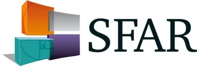

# Recommandations Formalisées d'Experts

## Prévention de l'hypothermie peropératoire accidentelle au bloc opératoire chez l'adulte

Prevention of inadvertent perioperative hypothermia in adults

2018

Société Française d'Anesthésie et de Réanimation

**Auteurs :** P. Alfonsi, F. Espitalier, MP. Bonnet, S. Bekka, L. Brocker, F. Garnier, M. Louis, I. Macquer, P. Pilloy, C. Hallynck, Y. Camus.

**Organisateurs et coordonateur d'experts SFAR :**

Pascal Alfonsi (Service d'Anesthésie Réanimation, Hôpital Saint Joseph, Paris).

**Comité d'organisation :**

Fabien Espitalier (Pôle Anesthésie Réanimations, Hôpital Trousseau, CHRU de Tours, Tours).

**Groupe d'experts SFAR (ordre alphabétique) :**

Pascal Alfonsi, Marie-Pierre Bonnet, Laurent Brocker, Yvon Camus, Fabien Espitalier, Fanny Garnier, Calliope Hallynck, Maelle Louis, Isabelle Macquer, Philippe Pilloy.

**Groupe de Lecture :**

*Comité des Référentiels clinique de la SFAR :* Lionel Velly (Président), Marc Garnier (Secrétaire), Julien Amour, Alice Blet, Gérald Chanques, Vincent Compère, Philippe Cuvillon, Fabien Espitalier, Etienne Gayat, Hervé Quintard, Bertrand Rozec, Emmanuel Weiss

*Conseil d'Administration de la SFAR :* Xavier Capdevila, Hervé Bouaziz, Laurent Delaunay, Pierre Albaladejo, Jean-Michel Constantin, Marie-Laure Citanova Pansard, Marc Léone, Bassam Al Nasser,Valérie Billard, Francis Bonnet, Julien Cabaton, Marie-Paule Chariot, Isabelle Constant, Alain Delbos, Claude Ecoffey, Jean-Pierre Estèbe, Marc Gentili, Olivier Langeron, Pierre Lanot, Luc Mercadal, Karine Nouette-Gaulain, Jean-Christian Sleth, Eric Viel, Paul Zetlaoui

Texte validé par le Comité des Référentiels Cliniques le 12/06/2018 et le Conseil d'Administration de la SFAR le 21/06/2018

**Auteur pour correspondance :** Pascal Alfonsi, Hôpital Saint Joseph, service d'anesthésie-réanimation, 185 rue Raymond Losserand, 75674 Paris cedex 14, France. Mail : [palfonsi@hpsj.fr](mailto:palfonsi@hpsj.fr)## **RESUME**

L'hypothermie accidentelle péri-opératoire est une complication classique de l'anesthésie qui favorise la survenue des infections, des saignements et des accidents cardiovasculaires péri-opératoires, et est responsable d'une surmortalité péri-opératoire. Bien que des moyens de prévention soient largement utilisés, elle reste très fréquente en France. Ce constat a amené un groupe d'experts à rédiger, sous l'égide de la Société Française d'Anesthésie et de Réanimation, plusieurs recommandations visant à améliorer la prévention de l'hypothermie accidentelle péri-opératoire. Les principales propositions des experts sont de maintenir une température corporelle centrale la plus proche possible de 36,5°C en utilisant les dispositifs de réchauffement de manière adaptée. Les techniques de réchauffement cutané actif sont recommandées avant et pendant l'anesthésie ainsi qu'en salle de surveillance post-interventionnelle. Il est également recommandé de réchauffer les fluides i.v., les produits sanguins labiles et les fluides chirurgicaux en complément ou en cas d'impossibilité de réchauffement cutané. Les experts suggèrent d'améliorer le dépistage de l'hypothermie péri-opératoire en généralisant le monitoring de la température centrale.

## **ABSTRACT**

Perioperative inadvertent hypothermia is a classic complication of anesthesia that promotes the occurrence of perioperative infections, bleeding and cardiovascular events. Data suggest that it also increases perioperative mortality. Although prevention methods are widely used, it remains very frequent in France. This observation led a group of experts, on the behalf of the Société Française d'Anesthésie et de Réanimation, to issue several recommendations aimed at improving the prevention of perioperative inadvertent hypothermia. The main proposals of the experts are to maintain a core body temperature as close as possible to 36.5°C by using warming devices in an appropriate manner. Active skin warming techniques are recommended before and during anesthesia and in the post-anesthetic care unit. Other recommended means that may be used in addition to or if skin warming is not possible are to warm i.v. fluids, blood products and surgical fluids. Experts suggest to improve screening for perioperative hypothermia by generalizing core temperature monitoring.## 1. PRÉAMBULE

### 1.1. Introduction

De longue date, il est connu que l'administration de médicaments d'anesthésie est responsable de l'installation d'une hypothermie chez les patients (1). Depuis la fin des années 1980, plusieurs études ont montré qu'une hypothermie peropératoire accidentelle pouvait être responsable de complications postopératoires (2-5), voire d'une surmortalité postopératoire (6,7).

De nombreux dispositifs ont été commercialisés pour maintenir la température centrale ( $T^{\circ}\text{C}$ ) des patients, dont certains avec une efficacité prouvée. L'objectif minimum de  $T^{\circ}\text{C}$  est classiquement fixé à  $36^{\circ}\text{C}$  dans la littérature. Lorsqu'une stratégie de réchauffement actif est mise en place, respectée et correctement appliquée, moins de 4% des patients ont une  $T^{\circ}\text{C} < 36^{\circ}\text{C}$  à l'arrivée en SSPI (8), ce qui démontre l'efficacité d'une telle stratégie. Il en découle que le réchauffement actif des patients pendant la chirurgie est actuellement recommandé comme un standard de soins par plusieurs sociétés savantes et institutions (9,10).

Cependant, une enquête multicentrique réalisée en 2015 en France et regroupant 893 patients opérés de chirurgie non cardiaque a montré que plus d'un patient sur 2 arrivait en SSPI avec une  $T^{\circ}\text{C}$  inférieure à  $36^{\circ}\text{C}$ , entraînant un allongement de la durée de séjour en SSPI (11,12). Ces résultats sont comparables avec ceux obtenus au début des années 80 avant l'invention de systèmes de réchauffement efficaces (13). Pourtant, dans l'enquête française (11,12), 9 patients sur 10 étaient activement réchauffés en peropératoire. Le principal facteur responsable de cette hypothermie était une utilisation impropre des moyens de réchauffement, associée à un démarrage « trop tardif » et à un arrêt « trop précoce » du réchauffement actif par rapport à l'anesthésie. De plus, le monitoring de la  $T^{\circ}\text{C}$  était effectué pour seulement 28% des patients au bloc opératoire et pour moins de 50% des patients en SSPI (11,12). Ce constat traduit une connaissance insuffisante des mécanismes responsables de la survenue de l'hypothermie accidentelle peropératoire par les anesthésistes et les infirmiers anesthésistes, ainsi que d'un usage incorrect des moyens de réchauffement et d'un déficit de diagnostic et de surveillance de cette hypothermie.

Jusqu'à présent il n'existait pas de recommandations françaises pour la prévention de l'hypothermie accidentelle péri-opératoire. Pour toutes les raisons évoquées précédemment, la formulation de recommandations par la Société Française d'Anesthésie Réanimation est apparue nécessaire afin d'améliorer la qualité des soins péri-opératoires concernant la prévention de l'hypothermie accidentelle chez les patients anesthésiés.

### 1.2. Thermorégulation : rappel physiologique et physiopathologie au cours de l'anesthésie

La  $T^{\circ}\text{C}$  correspond à la température régnant au sein des viscères. Chez l'être humain, la  $T^{\circ}\text{C}$  est régulée et maintenue à peu près constante indépendamment de la température ambiante afin d'optimiser les performances métaboliques cellulaires. Comme la température ambiante est le plus souvent inférieure à la  $T^{\circ}\text{C}$ , le maintien de la  $T^{\circ}\text{C}$  nécessite, d'une part, la mise en jeu de mécanismes homéostatiques protégeant notre organisme de pertes ou de gains caloriques excessifs et, d'autre part, la production de chaleur *via* le métabolisme oxydatif. Le déclenchement des réponses autonomes (vasoconstriction cutanée, frissons, sueurs) s'effectue lorsque des valeurs seuils de  $T^{\circ}\text{C}$  sont atteintes. Pour les phénomènes vaso-moteurs (vasoconstriction et sudation), une zone de tampon thermique constituée des phanères et des muscles est utilisée. La température dans cette zone varie entre environ  $30^{\circ}\text{C}$  et  $35^{\circ}\text{C}$  en fonction du débit sanguin cutané. La  $T^{\circ}\text{C}$  suit un rythme nycthémeral avec une élévation de la  $T^{\circ}\text{C}$  liée à une accumulation de chaleur pendant la période d'éveil. Cette chaleur en excès estéliminée pendant la phase de sommeil (réduction du métabolisme oxydatif). La T°C varie également sous l'influence de facteurs endogènes (hormonaux, glycémiques) et exogènes (effort physiques intenses).

Physiologiquement, le métabolisme oxydatif d'un adulte de 70 kg au repos produit environ 100 Watts chaque heure. Cette chaleur est éliminée quasi-intégralement par voie cutanée. L'anesthésie, générale ou neuro-axiale, va profondément altérer la thermorégulation et faciliter le développement d'une hypothermie par 2 mécanismes : la diminution du métabolisme oxydatif et, donc, une réduction de la production de chaleur ; et l'inhibition des réponses neurovégétatives, avec un abaissement des valeurs seuils de T°C des réponses thermorégulatrices au froid (vasoconstriction cutanée et frissons). L'exposition à un environnement froid (salle d'opération) va précipiter le développement d'une hypothermie accidentelle (14). Au total, et si aucun moyen de réchauffement n'est utilisé pendant l'anesthésie, la T°C peut chuter de 2 à 4°C.

Schématiquement, et en dehors de toute utilisation d'un moyen de réchauffement, l'installation de l'hypothermie peropératoire est la conséquence de 2 phénomènes : la redistribution interne de la chaleur et les pertes thermiques cutanées. Au cours de l'anesthésie, elle est schématiquement décrite en 3 phases :

1. 1) La 1ère phase, dite « rapide », pendant laquelle la T°C baisse de 0,5 à 1,5°C pendant les 60 premières minutes de l'anesthésie.
2. 2) La 2ème phase, dite « lente », après la 1ère heure d'anesthésie, pendant laquelle se produit une perte thermique de quelques dixièmes de °C par heure d'anesthésie.
3. 3) La 3ème phase, dite « en plateau », correspondant au déclenchement d'une vasoconstriction dans les muscles et les phanères. Au cours de cette phase la T°C est quasiment constante, alors que la température dans les territoires périphériques continue de baisser.

Le principal mécanisme responsable de l'hypothermie peropératoire est la redistribution interne. Celle-ci résulte de la suppression de la barrière physiologique entre le compartiment central et les tissus périphériques (phanères et muscles). Lors d'une anesthésie générale, l'inhibition centrale de la thermorégulation est majorée par l'effet vasodilatateur des médicaments d'anesthésie. Lors d'une anesthésie neuro-axiale, la redistribution interne est déclenchée par la sympatholyse provoquée par les anesthésiques locaux. Elle est majorée par le défaut d'informations thermiques en provenance des territoires bloqués. La redistribution interne représente 80% (anesthésie générale) et 89% (anesthésie neuroaxiale) de la baisse de la T°C lors de la 1ère phase (phase « rapide ») de l'hypothermie (15,16). Sur 3 heures d'anesthésie, la part de la redistribution interne représente encore respectivement 65% et 80% de la baisse de T°C. Le phénomène des pertes cutanées de chaleur est concomitant au phénomène précédent, mais est plus marqué au cours de la 2ème phase (phase « lente ») de l'hypothermie. Les pertes thermiques cutanées sont principalement provoquées par l'émission de radiations et sont significativement réduites dès que la peau est couverte. Au réveil de l'anesthésie, la dette thermique contractée pendant la période opératoire devra être restituée en rétablissant le gradient entre les 2 compartiments et en compensant les pertes cutanées.

### 1.3. Facteurs favorisant l'hypothermie péri-opératoire

Plusieurs facteurs ont été identifiés comme favorisant la survenue d'une hypothermie pendant la chirurgie (9,10). Certains facteurs sont liés aux patients : indice de masse corporel bas ; dénutrition ; score ASA > 1 ; conditions préexistantes altérant la thermorégulation (ex : diabète avec polyneuropathie, hypothyroïdie, consommation de médicaments sédatifs ou psychoactifs) ; hypothermie préexistante à la chirurgie. D'autres sont liés aux techniquesd'anesthésie ou de chirurgie et à l'environnement : type, étendue et durée de la chirurgie ; durée de l'anesthésie > 2 heures ; anesthésie générale et neuro-axiale combinées ; utilisation de grandes quantités de liquide d'irrigation non réchauffées ou administration de volumes importants de solutés intraveineux ou transfusion de culots globulaires non réchauffés. Enfin, certains agents pharmaceutiques administrés dans la phase préopératoire comme le midazolam (et par extension toutes les benzodiazépines et les médicaments altérant le système nerveux central) et les analgésiques (néfopam, tramadol, opioïdes) peuvent également être à l'origine d'une hypothermie. Dans l'enquête française de 2015, l'âge  $\geq 70$  ans ( $OR=1,38$  [IC95%: 1 à 1,92]), une durée d'anesthésie comprise entre 60 et 120 minutes ( $OR=1,96$  [IC95%: 1,03 à 3,74]) et une baisse de la  $T^{\circ}C > 0,5^{\circ}C$  entre les débuts de l'anesthésie et de la chirurgie ( $OR=2,2$  [IC95%: 1,36 à 3,56]) étaient retrouvés comme facteurs prédictifs d'une hypothermie ( $T^{\circ}C < 36^{\circ}C$ ) (11,12).

La température régnant au sein du bloc opératoire est souvent désignée comme responsable de l'hypothermie, alors qu'aucune étude publiée depuis la généralisation des moyens de réchauffement au bloc opératoire n'a montré un lien entre la température ambiante et la survenue d'une hypothermie peropératoire. Cependant, les recommandations britanniques (10) et allemandes (9) suggèrent qu'une température basse en salle d'opération est un facteur augmentant le risque de survenue d'hypothermie peropératoire. Ces recommandations proposent que la température de la salle d'opération soit au moins à  $19^{\circ}C$  jusqu'à la mise en place d'un réchauffement cutané actif (10), ou au moins à  $21^{\circ}C$  pour les adultes et à  $24^{\circ}C$  pour les enfants (9).

#### **1.4. Définition de la normothermie et de l'hypothermie péri-opératoire**

La détermination d'un seuil de  $T^{\circ}C$  à maintenir durant l'anesthésie afin de diminuer les complications liées à l'hypothermie est complexe. En effet, chez l'adulte sain, la  $T^{\circ}C$  varie au cours du nycthémère en fonction de l'activité physique, ainsi que sous l'influence de facteurs endogènes (hormonaux, glycémiques) et exogènes (effort physiques intenses). D'après Guyton (17), la normothermie physiologique correspond à une température comprise entre  $36^{\circ}C$  et  $37,5^{\circ}C$ . Cependant, les valeurs normales peuvent s'étaler sur plusieurs degrés Celsius ( $^{\circ}C$ ) chez un même individu et la  $T^{\circ}C$  varie de plusieurs dixièmes de  $^{\circ}C$  en fonction du site de mesure (18). Aussi, la normothermie est définie au mieux par la  $T^{\circ}C$  mesurée chez un adulte sain non anesthésié et en dehors de toute administration ou ingestion de médicaments pouvant altérer la thermorégulation. Par convention, la normothermie en péri-opératoire est définie comme une  $T^{\circ}C$  comprise entre  $36,5^{\circ}C$  et  $37,5^{\circ}C$  (9,10). L'enquête française de 2015 (11,12) a montré qu'au moment de l'induction de l'anesthésie la  $T^{\circ}C$  était en moyenne égale à  $36,6^{\circ}C$  [IC95% :  $36,2 - 36,9^{\circ}C$ ].

Ainsi, du fait du large éventail de valeurs physiologiques, la valeur seuil définissant la normothermie n'est pas clairement déterminée. A l'opposé, la sévérité de l'hypothermie est définie en 3 stades cliniques : légère si la  $T^{\circ}C$  est comprise entre  $35,9^{\circ}C$  et  $35,0^{\circ}C$  ; modérée si la  $T^{\circ}C$  est comprise entre  $34,9^{\circ}C$  et  $34,0^{\circ}C$  ; ou sévère si la  $T^{\circ}C$  est inférieure ou égale à  $33,9^{\circ}C$ . Pour cette raison, le seuil de l'hypothermie est fixé à  $36^{\circ}C$  dans la majorité des études explorant l'hypothermie péri-opératoire. C'est également la valeur cible proposée par les sociétés savantes ou les groupes d'experts ayant émis des recommandations sur la prise en charge de l'hypothermie peropératoire (9,10). En fait,  $36^{\circ}C$  est une valeur consensuelle qui ne repose sur aucune donnée physiologique ou clinique, mais qui a l'avantage de ne pas représenter une dette thermique importante pour la majorité des patients et d'être facilement atteignable en pratique clinique pour la majorité des professionnels. Or, dans toutes les études ayant mis en évidence les effets bénéfiques du réchauffement actif, la  $T^{\circ}C$  dans les groupes « réchauffés » étaient aux alentours de  $36,5^{\circ}C$  (2-5,7). D'autres études ont montré que plus la  $T^{\circ}C$  étaient proches de  $36,5^{\circ}C$  à la fin de l'intervention et moins les patients faisaient decomplications ou avaient de pertes sanguines en postopératoire par rapport aux patients ayant une T°C proche de 36°C (9,10).

### **1.5. Hypothermie péri-opératoire accidentelle : mesure peropératoire de la température**

En France, l'enquête nationale de 2015 (11,12) a montré que la T°C était mesurée chez seulement 28% des patients au bloc opératoire et chez 43% des patients admis en Salle de Surveillance Post-Interventionnelle (SSPI). Un tiers des patients la quittait avec une T°C < 36°C.

Deux décrets français précisent le cadre réglementaire concernant l'évaluation et le traitement de l'hypothermie dans un contexte anesthésique :

1) L'article D. 712-47 du décret n° 94-1050 du 5 décembre 1994 indique que chaque poste de surveillance installé en SSPI doit être doté des moyens nécessaires au retour à un équilibre thermique normal pour le patient (19).

2) L'article R. 4311-5 du décret n° 2004-802 du 29 juillet 2004 du code de la santé publique régissant la profession d'infirmière et les actes professionnels énonce clairement l'obligation de prendre en charge directement ou indirectement les mesures et surveillances de la température des patients (20).

Aucune étude n'a montré l'intérêt du monitoring de la température pendant la durée de l'anesthésie dans le but de diminuer les complications liées à l'hypothermie. Cependant, compte-tenu des complications potentiellement sévères de l'hypothermie, les recommandations britanniques ou allemandes incitent à mesurer en peropératoire la T°C afin d'identifier l'hypothermie et d'en diminuer la survenue et la durée. D'après les recommandations britanniques (10), la température centrale des patients doit être mesurée et notée dans les services d'hospitalisation ou aux urgences moins d'une heure avant l'entrée au bloc opératoire. Au bloc opératoire, la recommandation est de mesurer la T°C avant l'induction de l'anesthésie puis toutes les 30 minutes jusqu'à la fin de la chirurgie. Les recommandations allemandes (9) indiquent que la T°C doit être mesurée 1 à 2 heures avant l'entrée du patient en salle d'opération puis à son entrée en salle d'opération. Le monitoring continu est recommandé durant la période peropératoire. En cas de mesure intermittente, les mesures doivent être effectuées toutes les 15 minutes durant la période peropératoire.

Les thermomètres utilisables en peropératoire doivent fournir des mesures fiables et reproductibles de la T°C. Les 4 sites de mesure à privilégier sont l'artère pulmonaire, l'œsophage distal, le nasopharynx avec une sonde insérée de 10 à 20 cm au-delà des arcades dentaires, et la membrane tympanique (21). Ces sites sont interchangeables, la température ne variant que de quelques dixièmes de °C. La température peut être mesurée à d'autres sites moins invasifs, mais la valeur obtenue est moins représentative de la T°C. Différentes méta-analyses ont comparé la précision des dispositifs de mesure de la température, principalement hors du contexte péri-opératoire. Les résultats indiquent que les dispositifs de mesure externes (oral, tympanique, artériel tympanique, cutané) manquent de précisions comparativement aux dispositifs internes (rectal) (22,23). Parmi les dispositifs de mesure externes, la mesure sublinguale semble la plus fiable (24,25) en pré et peropératoire (26).

Les technologies permettant d'obtenir des mesures fiables et reproductibles sont les thermistances ou les thermocouples. Pour que la mesure puisse être faite, ces thermomètres nécessitent soit un contact avec le site de mesure, soit une insertion au niveau du site de mesure. L'infrarouge peut également être utilisé pour mesurer la T°C. Cependant, l'absence de contrôle visuel de la surface mesurée avec cette technique est à l'origine d'imprécisions. C'est le cas avec la mesure de la température tympanique à travers le conduit auditif où latempérature mesurée peut être celle du canal auditif externe et non de la membrane tympanique. Ceci amène à des variations de 1 à 2°C de la mesure de la température.

Différentes recommandations ont été publiées concernant la mesure de la T°C. A partir d'une étude de la *Medicines and Health Care Products Regulations Agency* (27), les recommandations britanniques (10) indiquent qu'il appartient aux utilisateurs de connaître les limites d'usage des différents dispositifs de mesure, d'en assurer la calibration et la maintenance. Les recommandations allemandes (9) soulignent que la mesure de la T°C est sujette à d'importantes erreurs en fonction du site de mesure et de la méthode de mesure employée. Le Gold-standard reste la mesure de la température avec un cathéter de Swan-Ganz. Dans tous les cas, le dépistage d'une hypothermie doit faire mettre en action des mesures correctrices.

### **1.6. Hypothermie peropératoire accidentelle : éventuels effets positifs**

Les répercussions positives de l'hypothermie peropératoire ont été évoquées dans trois situations : prévention de l'hyperthermie maligne, certaines situations neurochirurgicales ou en chirurgie cardio-vasculaire.

- • Hyperthermie maligne (HM) :

Une étude expérimentale chez le porc HMS (Hyperthermie Maligne Sensible) a montré que chez les animaux préalablement placés en hypothermie modérée, l'apparition des symptômes d'HM (augmentation majeure de la fraction expirée du CO2) après l'induction de l'anesthésie avec des agents déclenchant (halothane, succinylcholine) était retardée et les symptômes étaient moins sévères, voire absents. Cependant, la crise d'HM survenait chez tous les animaux quand la normothermie était restaurée. Chez tous les animaux HMS maintenus en normothermie en préopératoire, l'induction de l'anesthésie provoquait une crise d'HM typique (28). Cependant, la seule prévention efficace chez les patients connus comme HMS est de ne pas administrer des médicaments susceptibles de déclencher une crise d'hyperthermie maligne. Par ailleurs, l'incidence de l'hyperthermie maligne chez les patients non HMS est très faible (de 1/14000 à 1/100000). Aussi, les Recommandations d'Experts pour le Risque d'Hyperthermie Maligne en Anesthésie Réanimation (SFAR - CRC 12 septembre 2013) ne propose pas l'hypothermie comme technique de prévention de l'HM (29).

- • Hypothermie peropératoire et neurochirurgie :

Une méta-analyse (30) a évalué l'efficacité de l'effet neuro-protecteur de l'hypothermie modérée ou profonde par rapport au maintien de la normothermie chez des patients ayant une chirurgie intracrânienne. Entre novembre 2010 et mai 2014, 5 études randomisées regroupant 1219 patients ont été analysées. L'hypothermie provoquée (32,5°C – 35°C) n'apportait pas de bénéfices statistiquement significatifs sur la mortalité ou les séquelles neurologiques.

- • Hypothermie peropératoire et chirurgie cardiovasculaire :

Des accidents vasculaires cérébraux et des complications neuropsychiatriques sont fréquemment observés après chirurgie cardiaque avec ou sans circulation extracorporelle (CEC). L'instauration d'une hypothermie pourrait protéger le système nerveux central pendant les phases d'ischémie cérébrale. En revanche, ce choix expose à tous les effets indésirables de l'hypothermie, notamment l'augmentation du saignement chirurgical et des arythmies. Une méta-analyse regroupant 6731 patients inclus dans 44 essais randomisés menés dans 14 pays a rapporté qu'il n'y avait pas de différences en termes de mortalité et demorbidité entre les patients normothermes et les patients hypothermes, mais que les besoins transfusionnels étaient statistiquement plus importants chez les patients hypothermes (31). La conclusion de cette méta-analyse était que le maintien de la normothermie est sans danger en chirurgie cardiaque sous CEC et qu'elle permet une économie transfusionnelle.

#### Références :

1. 1- Pickering G. Regulation of body temperature in health and disease. Lancet 1958; 1: 1-9.
2. 2- Kurz A, Sessler DI, Lenhardt R. Perioperative normothermia to reduce the incidence of surgical-wound infection and shorten hospitalization. Study of Wound Infection and Temperature Group. N Engl J Med 1996; 334: 1209-15.
3. 3- Frank SM, Fleisher LA, Breslow MJ, Higgins MS, Olson KF, Kelly S, Beattie C. Perioperative maintenance of normothermia reduces the incidence of morbid cardiac events. A randomized clinical trial. JAMA 1997; 277: 1127-34.
4. 4- Elmore JR, Franklin DP, Youkey JR, Oren JW, Frey CM. Normothermia is productive during infrarenal aortic surgery. J Vasc Surg 1998; 28: 984-92.
5. 5- Rajagopalan S, Mascha E, Na J, Sessler DI. The effect of mild perioperative hypothermia on blood loss and transfusion requirement. Anesthesiology 2008; 108: 71-7.
6. 6- Kongsayreepong S, Chaibundit C, Chadpaibool J, Komoltri C, Suraseranivongse S, Suwannanonda P, Raksamanee EO, Noocharoen P, Silapadech A, Parakkamodom S, Pum-In C, Sojeoyya L. Predictor of core hypothermia and the surgical intensive care unit. Anesth Analg 2003; 96: 826-33.
7. 7- Scott AV, Stonemetz JL, Wasey JO, Johnson DJ, Rivers RJ, Koch CG, Frank SM. Compliance with surgical care improvement project for body temperature management (scip inf-10) is associated with improved clinical outcomes. Anesthesiology 2015; 123: 116-25.
8. 8- Burns SM, Piotrowski K, Caraffa G, Wojnakowski M. Incidence of postoperative hypothermia and the relationship to clinical variables. J Perianesth Nurs 2010; 25: 286-289.
9. 9- Torossian A, Brauer A, Höcker J, Bein B, Wulf H, Horn EP. Preventing inadvertent perioperative hypothermia. Dtsch Ärztebl Int 2015; 112: 166-72.
10. 10- NICE: Clinical-Practice-Guideline, the management of inadvertent perioperative hypothermia in adults. National Collaborating Centre for Nursing and Supportive Care commissioned by National Institute for Health and Clinical Excellence (NICE). <http://guidance.nice.org.uk/CG65>.
11. 11- Bekka SB, Aegerter P, Saidji NY, Alfonsi P. Enquête Hypothermie. Enquête sur la prévalence de l'hypothermie périopératoire en France, les facteurs de risque et les moyens de prévention. SFAR - Le Congrès Paris 2016 ; p. R-025.
12. 12- Bekka SB, Aegerter P, Saidji NY, Alfonsi P. Enquête Hypothermie. Enquête sur la prévalence de l'hypothermie périopératoire en France. Impact sur la SSPI. SFAR - Le Congrès Paris 2017; p. 616.
13. 13- Vaughan MS, Vaughan RW, Cork RC. Postoperative hypothermia in adults: relationship of age, anesthesia, and shivering to rewarming. Anesth Analg 1981; 60: 746-51.
14. 14- El-Gamal N, Elkassabany N, Frank SM, Amar R, Khabar HA, El-Rahmany HK, Okasha AS. Age-related thermoregulatory differences in a warm operating room environment (approximately 26 degrees C). Anesth Analg 2000; 90: 694-8.
15. 15- Matsukawa T, Sessler DI, Sessler AM, Schroeder M, Ozaki M, Kurz A, Cheng C. Heat flow and distribution during induction of general anesthesia. Anesthesiology 1995; 82: 662-73.
16. 16- Matsukawa T, Sessler DI, Christensen R, Ozaki M, Schroeder M. Heat flow and distribution during epidural anesthesia. Anesthesiology 1995; 83: 961-7.
17. 17- Guyton A and Hall J. Textbook of medical physiology, 11th Edition (2000). London: Saunders.
18. 18- Sund-Levander M, Forsberg C, Wahren LK. Normal oral, rectal, tympanic and axillary body temperature in adult men and women: a systematic literature review. Scand J Caring Sci 2002; 16: 122-8.
19. 19- Article D. 712-47 du décret no 94-1050 du 5 décembre 1994 relatif aux conditions techniques de fonctionnement des établissements de santé en ce qui concerne la pratique de l'anesthésie et modifiant le code de la santé publique (troisième partie : Décrets). Disponible sur : <https://www.legifrance.gouv.fr/affichTexte.do?cidTexte=JORFTEXT000000549818&categorieLien=id>. Consulté le 15.04.2018.
20. 20- Article R. 4311-5 du décret n° 2004-802 du 29 juillet 2004 relatif aux parties IV et V (dispositions réglementaires) du code de la santé publique et modifiant certaines dispositions de ce code. Disponible sur :<https://www.legifrance.gouv.fr/affichageTexte.do?cidTexte=JORFTEXT000000421679&categorieLien=id>. Consulté le 15.04.2018.

1. 21- Sessler I. Perioperative thermoregulation and heat balance. *Lancet* 2016; 387: 2655-64
2. 22- Niven DJ, Gaudet JE, Laupland KB, Mrklas KJ, Roberts DJ, Stelfox HT. Accuracy of peripheral thermometers for estimating temperature: a systematic review and meta-analysis. *Ann Intern Med*. 2015; 163: 768-77.
3. 23- Geijer H, Udumyan R, Lohse G, Nilsagård Y. Temperature measurements with a temporal scanner: systematic review and meta-analysis. *BMJ Open*. 2016; 6: e009509.
4. 24- Langham GE, Maheshwari A, Contrera K, You J, Mascha E, Sessler DI. Noninvasive temperature monitoring in postanesthesia care units. *Anesthesiology* 2009; 111: 90-6.
5. 25- Bernason S, Williams J, Proehl J, Brim C, Crowley M, Leviner S, Lindauer C, Naccarato M, Storer A. Emergency nursing resource: non-invasive temperature measurement in the emergency department. *J Emerg Nurs* 2012; 38: 523-30.
6. 26- Höcker J, Bein B, Böhm R, Steinfath M, Scholz J, Horn EP. Correlation, accuracy, precision and practicability of perioperative measurement of sublingual temperature in comparison with tympanic membrane temperature in awake and anaesthetised patients. *Eur J Anaesthesiol* 2012; 29: 70-4.
7. 27- MHRA 04144. Thermometer review: UK market survey 2005. Disponible sur: [http://www.cedar.wales.nhs.uk/sitesplus/documents/1091/MHRA\\_04144 Thermometer Review UK Market Survey 2005.pdf](http://www.cedar.wales.nhs.uk/sitesplus/documents/1091/MHRA_04144%20Thermometer%20Review%20UK%20Market%20Survey%202005.pdf). Consulté le 07.04.2017.
8. 28- Laizzo PA, Kehler CH, Carr RJ, Sessler DI, Belani KG. Prior hypothermia attenuates malignant hyperthermia in susceptible swine. *Anesth Analg* 1996; 82: 803-9.
9. 29- Recommandations d'experts pour le risque d'Hyperthermie maligne en Anesthésie Réanimation SFAR-CRC 12 septembre 2013. [http://sfar.org/wp-content/uploads/2015/10/2\\_SFAR\\_HyperthermieMaligne.pdf](http://sfar.org/wp-content/uploads/2015/10/2_SFAR_HyperthermieMaligne.pdf) (consulté en avril 2017).
10. 30- Galvin IM, Levy R, Boyd JG, Day AG, Wallace MC. Cooling for cerebral protection during brain surgery. *Cochrane Database Syst Rev* 2015 Jan 28; 1: CD006638.
11. 31- Ho KM, Tan JA. Benefits and risks of maintaining normothermia during cardiopulmonary bypass in adult cardiac surgery: a systematic review. *Cardiovasc Ther* 2011; 29: 260-79.## 2. OBJECTIFS DE LA RFE

Les objectifs de cette recommandation formalisée d'experts (RFE) sont de :

- • Définir une T°C-cible minimum à maintenir en peropératoire.
- • Définir les bénéfices et les risques de prévenir l'hypothermie peropératoire accidentelle.
- • Définir les temps péri-opératoire pendant lesquels le réchauffement du patient doit être mis en œuvre.
- • Définir les modalités du réchauffement au bloc opératoire et en SSPI en fonction des voies de transfert d'énergie (cutanées, fluides).
- • Proposer des stratégies de prévention de l'hypothermie peropératoire accidentelle et de monitoring de la température.

## 3. METHODOLOGIE

La méthode de travail utilisée pour l'élaboration des recommandations est la méthode GRADE. Cette méthode permet, après une analyse quantitative de la littérature, de déterminer séparément la qualité des preuves, c'est-à-dire une estimation de la confiance que l'on peut avoir dans l'analyse de l'effet de l'intervention quantitative et, d'autre part, un niveau de recommandation. La qualité des preuves est répartie en quatre catégories :

1. 1. haute : les recherches futures ne changeront très probablement pas la confiance dans l'estimation de l'effet ;
2. 2. modérée : les recherches futures changeront probablement la confiance dans l'estimation de l'effet et pourraient modifier l'estimation de l'effet lui-même ;
3. 3. basse : les recherches futures auront très probablement un impact sur la confiance dans l'estimation de l'effet et modifieront probablement l'estimation de l'effet lui-même ;
4. 4. très basse : l'estimation de l'effet est très incertaine. L'analyse de la qualité des preuves est réalisée pour chaque étude puis un niveau global de preuve est défini pour une question et un critère donné.

La formulation finale des recommandations sera toujours binaire soit positive, soit négative et soit forte, soit faible :

- • forte : il faut faire ou ne pas faire (GRADE 1+ ou 1-) ;
- • faible : il est possible de faire ou de ne pas faire (GRADE 2+ ou 2-).

La force de la recommandation est déterminée en fonction de quatre facteurs clés, validée par les experts après un vote, en utilisant la méthode Delphi :

1. 1. estimation de l'effet ;
2. 2. le niveau global de preuve : plus il est élevé, plus probablement la recommandation sera forte ;
3. 3. la balance entre effets désirables et indésirables : plus celle-ci est favorable, plus probablement la recommandation sera forte ;
4. 4. les valeurs et les préférences : en cas d'incertitudes ou de grande variabilité, plus probablement la recommandation sera faible ; ces valeurs et préférences doivent être obtenues au mieux directement auprès des personnes concernées (patient, médecin, décisionnaire) ;
5. 5. coûts : plus les coûts ou l'utilisation des ressources sont élevés, plus probablement la recommandation sera faible.Le groupe d'expert a choisi la réduction des risques d'au moins une des 3 complications postopératoires (infection du site opératoire, dommages myocardiques et saignement) comme critère principal d'estimation de l'effet :

1. 1. d'une valeur-cible pour la T°C
2. 2. du monitoring de la température
3. 3. d'une technique de réchauffement

En l'absence de données sur le critère principal, le paramètre était évalué en fonction de son effet sur la T°C par rapport à un groupe contrôle.

Après synthèse du travail des experts et application de la méthode GRADE, 14 recommandations ont été formalisées par le comité d'experts. La totalité des recommandations a été soumise au groupe d'experts. Après trois tours de cotations et divers amendements, un accord fort a été obtenu pour 93% des recommandations. Parmi ces recommandations, 5 ont un niveau de preuve élevé (Grade 1+/-), 7 ont un niveau de preuve faible (Grade 2 +/-) et 2 sont des avis d'experts.

La SFAR incite tous les anesthésistes-réanimateurs à se conformer à ces RFE pour assurer une qualité des soins dispensés aux patients. Cependant, dans l'application de ces recommandations, chaque praticien doit exercer son jugement, prenant en compte son expertise et les spécificités de son établissement, pour déterminer la méthode d'intervention la mieux adaptée à l'état du patient dont il a la charge.## 4. RECOMMANDATIONS

### Partie I : Hypothermie : conséquences et seuil

**Question 1 :** *Chez le patient anesthésié, l'hypothermie péri-opératoire, comparée à l'absence d'hypothermie péri-opératoire, favorise-t-elle la survenue de complications péri-opératoires infectieuses, cardio-vasculaires et hémorragiques ?*

**R1 – Il est recommandé de lutter contre l'hypothermie péri-opératoire afin de diminuer la survenue des complications infectieuses, cardio-vasculaires et hémorragiques chez le patient anesthésié.**

**Grade 1+, Accord FORT**

**Argumentaire :** Les études évaluant l'impact de l'hypothermie péri-opératoire sur les complications et la mortalité péri et post-opératoires sont nombreuses. Ces études ont exploré un large champ de complications. L'essai contrôlé randomisé (104 patients normothermes vs 96 hypothermes) de Kurz (1) a démontré l'impact de l'hypothermie peropératoire sur la survenue des infections de parois après chirurgie colorectale et l'augmentation de durée de séjour hospitalier qui en découlait. L'essai contrôlé randomisé (277 patients normothermes vs 139 hypothermes) de Melling (2) a également démontré une diminution des infections de parois pour le même type de chirurgie.

L'étude contrôlée randomisée de Franck (3) a mis en évidence la diminution du taux d'événements cardiologiques dans le groupe des patients normothermes. Elmore (4) a également montré cet effet dans une étude portant sur des patients à risque cardiovasculaire élevé opéré de l'aorte sous-rénale.

La méta-analyse menée par Rajagopalan (5) a démontré la liaison entre hypothermie, même modérée, perte sanguine, et nécessité de transfusion. Cette méta-analyse incluait 14 études (602 patients dans le groupe « normotherme », vs 617 patients dans le groupe « hypotherme ») pour l'analyse du critère de perte sanguine et 10 études (452 patients dans le groupe « normotherme », vs 443 patients dans le groupe « hypotherme ») pour l'analyse du critère de transfusion. La qualité de la preuve apportée par cette méta-analyse était bonne.

Enfin, l'étude rétrospective de Scott (6), portant sur 45304 patients, a démontré que la compliance à des objectifs de lutte contre l'hypothermie (44064 patients compliants vs 1240 patients non-compliants) permettait de diminuer la survenue de complications à types d'infections acquises à l'hôpital, d'événements cardio-vasculaires ischémiques et de mortalité pour les patients normothermes. La durée de séjour était également diminuée pour les patients normothermes.

Références :

1. 1- Kurz A, Sessler DI, Lenhardt R. Perioperative normothermia to reduce the incidence of surgical-wound infection and shorten hospitalization. Study of Wound Infection and Temperature Group. N Engl J Med 1996; 334(19): 1209-15.
2. 2- Melling AC, Ali B, Scott EM, Leaper DJ. Effects of preoperative warming on the incidence of wound infection after clean surgery: a randomised controlled trial. Lancet 2001; 358: 876-80.
3. 3- Frank SM, Fleisher LA, Breslow MJ, Higgins MS, Olson KF, Kelly S, Beattie C. Perioperative maintenance of normothermia reduces the incidence of morbid cardiac events. A randomized clinical trial. JAMA 1997; 277(14): 1127-34.
4. 4- Elmore JR, Franklin DP, Youkey JR, Oren JW, Frey CM. Normothermia is productive during infrarenal aortic surgery. J Vasc Surg 1998; 28(6): 984-92.
5. 5- Rajagopalan S, Mascha E, Na J, Sessler DI. The effect of mild perioperative hypothermia on blood loss and transfusion requirement: a meta-analysis. Anesthesiology 2008; 108(1): 71-7.
6. 6- Scott AV, Stonemetz JL, Wasey JO, Johnson DJ, Rivers RJ, Koch CG, Frank SM. Compliance with surgical care improvement project for body temperature management (scip inf-10) is associated with improved clinical outcomes. Anesthesiology 2015; 123: 116-25.**Question 2 :** *Chez le patient anesthésié, quel objectif de T°C faut-il maintenir pour limiter la survenue de complications péri-opératoires hémorragiques, infectieuses ou cardio-vasculaires ?*

**R2 – Il est probablement recommandé de maintenir une T°C ≥ 36,5°C afin de diminuer les complications hémorragiques chez le patient anesthésié.**

**Grade 2+, Accord FORT**

**Argumentaire :** Bien que leur objectif principal n'était pas de comparer l'impact d'une T°C ≥ 36,5°C à une T°C proche de 36°C, mais simplement la comparaison de l'efficacité d'une technique de réchauffement par rapport à une autre, plusieurs études randomisées ont cependant permis de comparer les volumes de pertes sanguines chez des patients « hypothermes » ayant une T°C proche de 36°C et chez des patients « normothermes » ayant une T°C à 36,5°C. Quatre études, incluant respectivement 150, 116, 59 et 59 patients (1-4), ont montré des pertes sanguines significativement plus faibles pour les patients « normothermes ».

Par ailleurs, dans la méta-analyse de Rajagopalan (5), qui a démontré l'influence négative de l'hypothermie modérée sur le volume de saignement périopératoire, la majorité des groupes « normotherme » avait une T°C ≥ 36,5°C. Ainsi, plus la T°C est proche des valeurs de la normothermie telle que définie par les recommandations britanniques NICE (6) et allemandes (7), et plus le risque d'hémorragies péri-opératoires liées à l'hypothermie semble diminuer.

Références :

1. 1- Winkler M, Akça O, Birkenberg B, Hetz H, Scheck T, Arkiliç CF, Kabon B, Marker E, Grübl A, Czepan R, Greher M, Goll V, Gottsauner-Wolf F, Kurz A, Sessler DI. Aggressive warming reduces blood loss during hip arthroplasty. *Anesth Analg* 2000; 91: 978-84.
2. 2- Chakladar A, Dixon MJ, Crook D, Harper CM. The effects of a resistive warming mastress during caesarean section : a randomised, controlled trial. *Int J Obstet Anesth* 2014; 24: 309-16.
3. 3- Persson K, Lundberg J. Perioperative hypothermia and postoperative opioid requirements. *Eur J Anaesthesiol* 2001; 18: 679-86.
4. 4- Hofer CK, Worn M, Tavakoli R, Sander L, Maloigne M, Klaghofer R, Zollinger A. Influence of body core temperature on blood loss and transfusion requirements during off-pump coronary artery bypass grafting : A comparison of 3 warming systems. *J Thorac Cardiovasc Surg* 2005; 129: 838-43.
5. 5- Rajagopalan S, Mascha E, Na J, Sessler DI. The effect of mild perioperative hypothermia on blood loss and transfusion requirement: a meta-analysis. *Anesthesiology* 2008; 108: 71-7.
6. 6- NICE: Clinical-Practice-Guideline, the management of inadvertent perioperative hypothermia in adults. National Collaborating Centre for Nursing and Supportive Care commissioned by National Institute for Health and Clinical Excellence (NICE). <http://guidance.nice.org.uk/CG65>
7. 7- Torossian A, Brauer A, Höcker J, Bein B, Wulf H, Horn EP. Preventing inadvertent perioperative hypothermia. *Dtsch Arztebl Int* 2015; 112: 166-72.## Partie II : Techniques de réchauffement

Différents moyens de lutte sont disponibles et utilisés lors des différents temps d'une anesthésie. Cette 2ème partie fera le point sur l'utilité de la lutte contre l'hypothermie à ces différents temps et sur l'efficacité des différentes techniques.

**Question 3 :** *Pour les patients anesthésiés, le réchauffement cutané actif, comparé à l'absence de réchauffement cutané actif, avant l'induction de l'anesthésie (pré-warming), permet-il de prévenir l'hypothermie ou de diminuer la fréquence des complications infectieuses, cardio-vasculaires et hémorragiques ?*

**R3 – Il est probablement recommandé d'effectuer un réchauffement cutané actif avant l'induction de l'anesthésie (pré-warming) pour prévenir l'hypothermie et/ou de diminuer la fréquence des complications infectieuses.**

**Grade 2+, Accord FORT**

**Argumentaire :** Une méta-analyse, deux revues de la littérature et 2 études ont été retenues pour l'élaboration de cette recommandation :

- - Dans la méta-analyse de Madrid (1), une analyse de sous-groupe a étudié l'effet du pré-warming : 16 essais contrôlés randomisés étaient inclus, mais les analyses statistiques n'ont été effectuées que pour 3 critères : complications infectieuses (1 essai), volume de saignement (2 essais) et nombre de transfusions (2 essais). 1 seul essai à faible risque de biais a montré une diminution de l'incidence des infections de parois (2). 2 essais n'ont pas montré d'influence du pré-warming sur la perte de sang péri-opératoire.
- - Dans la revue de la littérature de Brito Poveda (3), 13 des 14 essais contrôlés randomisés inclus montraient un meilleur maintien de la T°C dans le groupe pré-warming que dans le groupe contrôle. Ces 14 essais, d'un niveau de preuve faible, évaluaient tous une méthode active de réchauffement cutané pré-anesthésique.
- - La revue de la littérature de Connelly (4), portant sur 16 essais, a évalué les meilleures méthodes et la durée optimale de pré-warming pour maintenir la T°C pendant et après l'anesthésie. Aucun des essais inclus ne semble avoir été effectué en aveugle. 12 essais suggèrent que le pré-warming par couvertures à air pulsé aide au maintien de la T°C, et est plus efficace qu'un réchauffement cutané passif. La durée de pré-warming variait de 10 à 60 minutes.
- - 2 études récemment publiées (5,6) concluent également à l'efficacité du pré-warming pour maintenir la T°C. La première est une étude cas-témoins (30 patients dans chaque groupe) (5). La deuxième étude, rétrospective de type avant/après, a inclus plus de 3800 patients dans chaque groupe (6). Dans la première période les patients ne recevaient pas de pré-warming, mais un réchauffement actif était administré pendant la durée de l'anesthésie. Dans la 2ème période, un pré-warming par couverture à air pulsé était mis en place en plus du réchauffement actif per-anesthésie. En comparaison avec la 1ère période, la réduction du taux d'hypothermie était de 52 % en périopératoire et de 41 % en postopératoire au cours de la 2ème période.

Malgré une qualité méthodologique parfois faible, de nombreuses études semblent montrer que le pré-warming peut être efficace pour prévenir l'hypothermie et ses complications, principalement lorsque la technique choisie est un réchauffement à air pulsé et qu'elle est administrée plus de 10 minutes avant l'induction de l'anesthésie. Le maintien d'un réchauffement actif pendant l'induction de l'anesthésie est de rigueur pour conserver le bénéfice du réchauffement pré-anesthésie.

Références :

1- Madrid E, Urrutia G, Roqué i Figuls M, Pardo-Hernandez H, Campos JM, Paniagua P, Maestre L, Alonso-Coello P. Active body surface warming system for preventing complication caused by inadvertent perioperative hypothermia in adults (Review). Cochrane Database Syst Rev 2016; 4: CD009016.2- Melling AC, Ali B, Scott EM, Leaper DJ. Effects of preoperative warming on the incidence of wound infection after clean surgery: a randomised controlled trial. Lancet 2001; 358: 876-80.

3- Brito Poveda V, Clark AM, Galvao CM. A systematic review on the effectiveness of prewarming to prevent perioperative hypothermia. J Clin Nurs 2013; 22: 906-18.

4- Connelly L, Cramer E, DeMott Q, Piperno J, Coyne B, Winfield C, Swanberg M. The optimal time and method for surgical prewarming: a comprehensive review of the literature. J Perianesth Nurs. 2017; 32: 199-209.

5- Rosenkilde C, Vamosi M, Lauridsen JT, Hasfeldt D. Efficacy of prewarming with a self-warming blanket for the prevention of unintended perioperative hypothermia in patients undergoing hip or knee arthroplasty. J Perianesth Nurs. 2017; 32: 419-428.

6- Grote R, Wetz AJ, Bräuer A, Menzel M. Prewarming according to the AWMF S3 guidelines on preventing inadvertent perioperative hypothermia 2014 : Retrospective analysis of 7786 patients. Anaesthesist 2018; 67: 27-33.

**Question 4 :** *Pour les patients anesthésiés, le réchauffement cutané actif, comparé à l'absence de réchauffement cutané actif, pendant l'anesthésie, permet-il de prévenir l'hypothermie ou de diminuer les complications infectieuses, cardio-vasculaires et hémorragiques ?*

**R4 – Il est recommandé d'utiliser le réchauffement cutané actif pour diminuer les complications de l'hypothermie chez le patient anesthésié.**

**Grade 1+, Accord FORT**

**Argumentaire :** La méta-analyse de Madrid (1) a inclus 47 essais contrôlés randomisés comparant le réchauffement cutané actif à l'absence de réchauffement cutané actif pendant l'anesthésie : 3 essais (589 patients) ont permis de démontrer un effet protecteur du réchauffement cutané vis-à-vis de la survenue d'infections (risk ratio (RR) 0,36 ; 95% Intervalle de Confiance (IC) 0,20 à 0,66 ;  $p = 0,0008$  ;  $I^2 = 0\%$ ) ; 1 seul essai permis de répondre à la question des complications cardio-vasculaires. Cet essai a montré une réduction significative de la survenue d'événements électrocardiographiques postopératoires ou d'événements cardiaques morbides postopératoires (44 événements, 300 participants ; RR 0,37 ; 95% IC 0,19 à 0,71 ;  $p = 0,003$ ) ; enfin, 8 essais ont évalué le nombre de produits sanguins labiles transfusés. Les patients qui étaient réchauffés avaient un nombre de produits sanguins labiles transfusés significativement plus bas. 8 essais ont évalué le nombre de patients transfusés. Il n'y avait pas de différence entre les 2 groupes. 20 essais ont pu être utilisés pour comparer la quantité de sang perdu dans les 2 différents groupes. Ces essais mélangeaient tous les types de réchauffement cutané. Une hétérogénéité importante était présente. La conclusion était une diminution modérée mais statistiquement significative du saignement dans le groupe des patients avec réchauffement cutané actif (MD -46,17 ; 95% IC -82,74 à -9,59 ;  $p = 0,0001$ ). Si on s'intéresse spécifiquement aux patients réchauffés par couverture à air pulsé (18 essais contrôlées randomisées), le résultat est comparable (MD -50,77 ; 95% IC -88,43 à -13,10 ;  $p = 0,008$ ) ( $I^2 = 78\%$ ). En revanche, pour les autres types de réchauffement cutané actif, il n'y avait pas de différence significative (3 essais contrôlées randomisées).

La revue de Galvao (2) incluait 4 essais contrôlés randomisés qui comparaient les  $T^\circ C$  des patients soumis à un réchauffement cutané actif par air pulsé. 3 de ces 4 essais montraient des  $T^\circ C$  supérieures dans le groupe activement réchauffé. Ces études étaient de qualité méthodologique moyenne. Aucune analyse statistique n'était effectuée dans cette revue.

Références :

1- Madrid E, Urrutia G, Roqué i Figuls M, Pardo-Hernandez H, Campos JM, Paniagua P, Maestre L, Alonso-Coello P. Active body surface warming system for preventing complication caused by inadvertent perioperative hypothermia in adults (Review). Cochrane Database Syst Rev 2016; 4: CD009016.

2- Galvao CM, Marck PB, Sawada NO, Clark AM. A systematic review of the effectiveness of cutaneous warming systems to prevent hypothermia. J Clin Nurs 2009; 18: 627-36.**Question 5 :** Pour les patients anesthésiés, le réchauffement passif par isolation cutanée avec des vêtements ou couvertures réfléchissants en péri-anesthésie, en comparaison avec le réchauffement cutané actif, permet-il de prévenir l'hypothermie ou de diminuer les complications infectieuses, cardio-vasculaires et hémorragiques ?

**R5 – Il est probablement recommandé de privilégier le réchauffement cutané actif au réchauffement passif par l'isolation cutanée avec des vêtements ou couvertures réfléchissants pour maintenir la T°C chez le patient anesthésié.**

**Grade 2+, Accord FORT**

**Argumentaire :** La méta-analyse de Alderson (1) a comparé, pendant l'anesthésie, le réchauffement cutané actif au réchauffement cutané passif avec des vêtements ou couvertures réfléchissants (type couverture de survie) pour maintenir la T°C à 30, 60, 90, 120 minutes et à la fin de l'intervention (ou à l'arrivée en SSPI). Entre 3 et 6 essais contrôlés randomisés ont été utilisés pour répondre à la question à chaque temps, avec une hétérogénéité modérée à T30, 60, 90 et une hétérogénéité importante à 120 minutes et à la fin de la chirurgie. Il y avait à T 60, 90, 120 et à la fin de la chirurgie une différence significative de T°C en faveur du réchauffement cutané actif (1). Aucune différence n'a été détectée entre les 2 groupes pour les pertes sanguines, mais seuls 2 essais contrôlés randomisés étaient inclus, ne représentant que 41 patients dans le groupe isolation cutanée et 39 patients dans le groupe réchauffement cutané actif (1).

Cette même méta-analyse démontre que l'usage du réchauffement cutané passif par des vêtements ou couvertures réfléchissants en association avec le réchauffement cutané actif n'apporte pas de gain sur le maintien de la T°C chez le patient anesthésié.

Références :

1- Alderson P, Campbell G, Smith AF, Wartig S, Nicholson A, Lewis SR. Thermal insulation for preventing inadvertent perioperative hypothermia (Review). Cochrane Database Syst Rev 2014; 6: CD009908.

**Question 6 :** Pour les patients anesthésiés, le réchauffement des fluides intra-veineux (i.v.), comparé à l'absence de réchauffement des fluides i.v., permet-il de maintenir une T°C > 36°C et/ou de diminuer les complications infectieuses, cardio-vasculaires et hémorragiques ?

**R6 – Il est recommandé, lorsque que le volume administré est important, de réchauffer les fluides i.v. avec un matériel dédié, et toujours en association avec un réchauffement cutané actif, afin de limiter la chute de la T°C pour les patients anesthésiés.**

**Grade 1+, Accord FORT**

**Argumentaire :** Seule la variation de la T°C a été évaluée dans la méta-analyse de Campbell (1). Le réchauffement des fluides i.v. permettait de maintenir la T°C 0,5°C plus élevée que lors de l'absence de réchauffement à T 30, 60, 90, 120 min et à la fin de la chirurgie. La majorité des études incluses dans cette méta-analyse utilisait d'autres méthodes de réchauffement corporel en plus du réchauffement des fluides i.v. Aucune analyse de sous-groupe sur le volume de liquide perfusé ou sur la température d'administration des solutés n'a été menée.

La méta-analyse de Munday (2) s'intéressait au réchauffement péri-anesthésie des femmes césariées. 2 études, sur les 7 incluses dans cette méta-analyse, étaient poolées pour évaluer l'effet du réchauffement des fluides i.v. : la T°C était 0,3°C (0,11-0,49) plus élevée à l'arrivée en SSPI pour les femmes ayant reçu des solutés réchauffés.

En association à un autre mode de réchauffement, le réchauffement des fluides i.v. limite la chute de la T°C du patient anesthésié. Le volume, ainsi que la température du soluté administré sont des éléments clé de l'efficacité du réchauffement des solutés i.v. Cependant, les données publiées n'ont pas permis de fixer le volume seuil à partir duquel il est nécessaire de réchauffer les solutés. Les experts proposent de réchauffer les solutés i.v. lorsque les volumes perfusés sont inhabituellement importants, en association avec une méthode de réchauffement cutané actif.Références :

1. 1- Campbell G, Alderson P, Smith AF, Warttig S. Warming of intravenous and irrigation fluids for preventing inadvertent perioperative hypothermia. Cochrane Database Syst Rev 2015; (4): CD009891.
2. 2- Munday J, Hines S, Wallace K, Chang AM, Gibbons K, Yates P. A systematic review of the effectiveness of warming interventions for women undergoing cesarean section. Worldviews Evid Based Nurs 2014; 11(6): 383-93.

**Question 7 :** Pour les patients anesthésiés, le réchauffement des produits sanguins labiles, comparé à l'absence de réchauffement des produits sanguins labiles, permet-il de maintenir une  $T^{\circ}C > 36^{\circ}C$  et/ou de diminuer les complications infectieuses, cardio-vasculaires et hémorragiques ?

**R7 – Il est recommandé de réchauffer les produits sanguins labiles avec un matériel dédié pour les patients anesthésiés, et toujours en association avec un réchauffement cutané actif, afin de limiter la chute de la  $T^{\circ}C$  et les complications cardiaques liées à leur basse température.**

**Grade 1+, Accord FORT**

**Argumentaire :** Aucune méta-analyse n'a évalué ce risque de manière spécifique. Cependant, les produits sanguins labiles étant avant tout des fluides i.v., l'argumentaire de la Question 7 peut être repris pour répondre à la présente question. De plus, les guidelines allemandes (1) statuent que la perfusion d'importants volumes de produits sanguins froids abaissent la  $T^{\circ}C$  et que les solutés ou produits sanguins administrés au-delà de 500 mL doivent être réchauffés. Les guidelines britanniques NICE (2) sont similaires, indiquant que les produits sanguins doivent être réchauffés à  $37^{\circ}C$  à l'aide d'un dispositif dédié. Par ailleurs, une étude ancienne a démontré que le réchauffement des produits sanguins labiles réduisait la mortalité en cours de transfusion (3). Les concentrés de globules rouges étant conservés à une température de  $4^{\circ}C$ , l'administration rapide et/ou de grands volumes conduit à abaisser la  $T^{\circ}C$  en dessous de  $30^{\circ}C$ , ce qui peut induire à des arythmies et des arrêts cardiaques (3). Ainsi, le réchauffement des produits sanguins entre  $30^{\circ}C$  et  $36^{\circ}C$  avant leur administration a permis de réduire l'incidence des arrêts cardiaques de 58,3% à 6,8% lors des transfusions massives (3).

Références :

1. 1- Torossian A, Braüer A, Höcker J, Bein B, Wulf H, Horn EP. Preventing Inadvertent Perioperative Hypothermia. Dtsch Arztebl Int 2015; 112: 166-72.
2. 2- NICE: Clinical-Practice-Guideline, the management of inadvertent perioperative hypothermia in adults. National Collaborating Centre for Nursing and Supportive Care commissioned by National Institute for Health and Clinical Excellence (NICE). <http://guidance.nice.org.uk/CG65>.
3. 3- Boyan CP. Cold or warmed blood for massive transfusions. Ann Surg 1964; 160: 282-6.

**Question 8 :** Pour les patients anesthésiés, le réchauffement des fluides gazeux (gaz anesthésiques,  $CO_2$  pour cœlioscopie), comparé à l'absence de réchauffement des fluides gazeux (gaz anesthésiques,  $CO_2$  pour cœlioscopie), permet-il de maintenir une  $T^{\circ}C > 36^{\circ}C$  et/ou de diminuer les complications infectieuses, cardio-vasculaires et hémorragiques ?

**PAS DE RECOMMANDATION :** Les données de la littérature n'ont pas permis d'aboutir à un consensus des experts. Ainsi aucune recommandation n'a pu être rédigée concernant cette question.**Question 9 :** Pour les patients anesthésiés, le réchauffement des fluides d'irrigation chirurgicaux, comparé à l'absence de réchauffement des fluides d'irrigation chirurgicaux, permet-il de maintenir une  $T^{\circ}\text{C} > 36^{\circ}\text{C}$  et/ou de diminuer les complications infectieuses, cardio-vasculaires et hémorragiques ?

**R8 – Il est probablement recommandé de réchauffer les liquides d'irrigation chirurgicaux avant de les administrer dans le but de maintenir une  $T^{\circ}\text{C} > 36^{\circ}\text{C}$  pour les patients anesthésiés. Le réchauffement des liquides d'irrigation seul est cependant insuffisant pour maintenir la  $T^{\circ}\text{C}$  et doit être accompagné de techniques de réchauffement cutané actif.**

**Grade 2+, Accord faible**

**Argumentaire :**

**Maintien de la  $T^{\circ}\text{C} > 36^{\circ}\text{C}$  :**

Les données des méta-analyses de Jin (1) et de Steelman (2) montrent que le réchauffement des fluides d'irrigation permet de maintenir, de manière significative, une  $T^{\circ}\text{C} > 36^{\circ}\text{C}$  lorsqu'on le compare avec l'absence de réchauffement des fluides d'irrigation. Cependant, le niveau de preuve est faible et s'appuie sur 3 essais contrôlés randomisés de faible effectif avec une hétérogénéité importante dans la méta-analyse de Jin, et sur 4 essais contrôlés randomisés et 2 essais non randomisés, avec une hétérogénéité importante dans la méta-analyse de Steelman. De plus, un des essais, annoncé comme contrôlé randomisé, n'est actuellement pas publié et s'appuie sur les données personnelles d'un des auteurs.

**Réduction du saignement péri opératoire :**

Dans la méta-analyse de Jin (1), 3 essais contrôlés randomisés montrent une diminution statistiquement significative du saignement peropératoire dans le groupe des fluides d'irrigation réchauffés. Cependant la différence de saignement (15 mL) n'a qu'un intérêt clinique minimal et le niveau de preuve est faible. Dans la méta-analyse de Campbell (3) un seul essai contrôlé randomisé évalue les complications hémorragiques, sans différence entre les 2 groupes. Les preuves sont insuffisantes pour conclure à intérêt du réchauffement des liquides d'irrigation sur la prévention du risque hémorragique.

**Complications infectieuses ou cardio-vasculaires :**

Aucune des 3 méta-analyses (1-3) ne donne d'information à ce propos.

Références :

1. 1- Jin Y, Tian J, Sun M, Yang K. A systematic review of randomised controlled trials of the effects of warmed irrigation fluid on core body temperature during endoscopic surgeries. J Clin Nurs 2011; 20: 305-16.
2. 2- Steelman V, Chae S, Duff J, Anderson M, Zaidi A. Warming of irrigation fluids for prevention of perioperative hypothermia during arthroscopy: a systematic review and meta-analysis. Arthroscopy 2018; 34: 930-42.
3. 3- Campbell G, Alderson P, Smith AF, Warttig S. Warming of intravenous and irrigation fluids for preventing inadvertent perioperative hypothermia. Cochrane Database Syst Rev 2015; 4: CD009891.

**Question 10 :** Pour les patients anesthésiés, l'injection i.v. d'acides aminés, comparé à l'absence d'injection i.v. d'acides aminés, permet-elle de maintenir une  $T^{\circ}\text{C} > 36^{\circ}\text{C}$  et/ou de diminuer les complications infectieuses, cardio-vasculaires et hémorragiques ?

**R9 – Il n'est probablement pas recommandé d'utiliser les acides aminés i.v. pour limiter la chute de la  $T^{\circ}\text{C}$  et/ou de diminuer les complications hémorragiques des patients anesthésiés.**

**Grade 2-, Accord FORT**

**Argumentaire :**

**Maintien de la  $T^{\circ}\text{C} > 36^{\circ}\text{C}$  :**

3 méta-analyses (1-3) ont évalué l'effet de l'injection d'acides aminés sur la  $T^{\circ}\text{C}$  dans la période opératoire. Aucune de ces 3 méta-analyses n'a évalué le maintien d'une  $T^{\circ}\text{C} > 36^{\circ}\text{C}$ .

**Réduction de la diminution de la  $T^{\circ}\text{C}$  :**Les 3 méta-analyses ont évalué la différence de diminution de la T°C (T°C au début de la procédure et T°C à la fin de la procédure) entre le groupe recevant les aminoacides et le groupe ne recevant pas les aminoacides. La méta-analyse de Zhou (1) a inclus 10 essais contrôlés randomisés (225 patients dans le groupe contrôle et 237 patients dans le groupe aminoacides). Les patients du groupe aminoacides présentaient une chute de la T°C significativement moins importante que les patients du groupe témoin. L'hétérogénéité était très importante pour ce paramètre ( $I^2 = 91\%$ ) et la qualité des preuves était faible. La méta-analyse de Aoki (2) a inclus 14 études contrôlées randomisées (299 patients dans le groupe contrôle et 327 patients dans le groupe aminoacides). Sur les 14 essais, 8 étaient également inclus dans la méta-analyse de Zhou. Les patients du groupe aminoacides présentaient une chute de la T°C significativement moins importante que les patients du groupe témoin. L'hétérogénéité était très importante pour ce paramètre ( $I^2 = 87\%$ ) et la qualité des preuves était faible. La méta-analyse de Warttig (3) a inclus 6 essais contrôlés randomisés (118 patients dans le groupe contrôle et 131 patients dans le groupe aminoacides). Les patients du groupe aminoacides présentaient une chute de la T°C significativement moins importante que les patients du groupe témoin. L'hétérogénéité était nulle pour ce paramètre ( $I^2 = 0\%$ ) et la qualité des preuves était modérée. Sur les 6 essais inclus, 3 étaient également inclus dans la méta-analyse de Zhou et 3 dans la méta-analyse de Aoki. 2 essais étaient inclus dans les 3 méta-analyses.

**Complications hémorragiques :**

2 méta-analyses (1,2) ont évalué l'effet de l'injection d'aminoacides sur la perte sanguine dans la période opératoire. Aucune de ces méta-analyses n'a trouvé de différence entre le groupe contrôle et le groupe aminoacides.

**Complications infectieuse et complications cardio-vasculaires :**

Aucune des 3 méta-analyses n'a évalué ce type de complications.

**Au total** les 3 méta-analyses montrent que les aminoacides réduisent la déperdition thermique corporelle au cours d'une anesthésie. Cependant le niveau de preuve est faible à modéré, les effectifs sont petits et l'hétérogénéité souvent importante. Aucune de ces méta-analyses ne donne d'information sur les modes de réchauffement adjuvants utilisés dans les études incluses, ce qui représente un biais majeur. Aucune de ces méta-analyses ne s'est intéressée aux limitations et aux complications liées à l'administration des aminoacides. En conclusion, vu les biais importants, le manque d'information sur les effets adverses et la faiblesse du niveau de preuve, les experts ne peuvent pas recommander l'administration i.v. des aminoacides pour lutter contre l'hypothermie péri-opératoire.

Références :

1. 1- Zhou B, Wang G, Yang S, He X, Liu Y. The effects of amino acid infusions on core body temperature during the perioperative period: a systematic review. J Perianesth Nurs. 2014; 29: 491-500.
2. 2- Aoki Y, Aoshima Y, Atsumi K, Kaminaka R, Nakau R, Yanagida K, Kora M, Fujii S, Yokoyama J. Perioperative Amino Acid Infusion for Preventing Hypothermia and Improving Clinical Outcomes During Surgery Under General Anesthesia: A Systematic Review and Meta-analysis. Anesth Analg. 2017; 125: 793-802.
3. 3- Warttig S, Alderson P, Lewis SR, Smith AF. Intravenous nutrients for preventing inadvertent perioperative hypothermia in adults. Cochrane Database Syst Rev. 2016; 11: CD009906.**Question 11 :** Pour les patients anesthésiés, le réchauffement actif, en comparaison avec le réchauffement passif, est-il pourvoyeur d'infections ?

**R10 – Il est probablement recommandé d'utiliser les dispositifs de réchauffement actifs sans craindre une augmentation du risque infectieux attribuable à leur utilisation pour les patients anesthésiés.**

**Grade 2+, Accord FORT**

**Argumentaire :** 13 méta-analyses (1-13) ont évalué les différentes techniques de réchauffement (actif et passif) en per anesthésie pour prévenir l'hypothermie accidentelle. Aucune de ces méta-analyses n'a fait état d'un risque infectieux potentiel. Cependant, plusieurs études se sont intéressées au risque de contamination bactérienne du champ opératoire par les couvertures à air pulsé par contamination directe et envois de particules provenant du sol ou par perturbations de flux laminaires. Elles sont de faible niveau de preuve (14-23). Plusieurs de ces études ont été incluses dans la revue de la littérature effectuée par Haeberle (24). Cette revue s'est particulièrement intéressée au risque d'infection du site opératoire en chirurgie orthopédique pour les patients réchauffés par les dispositifs à air pulsé. 8 études (mais aucun essai contrôlé randomisé) ont été incluses. La grande hétérogénéité des ces études n'a pas permis aux auteurs de faire d'analyse statistique. Le faible niveau de preuve des 4 études laissant supposer une augmentation du risque infectieux, comparé à la réduction avérée du risque infectieux lors du maintien de la normothermie, a amené les auteurs à conclure à l'intérêt de l'usage des dispositifs à air pulsé dans la prévention de l'infection du site opératoire.

Concernant les réchauffeurs de perfusion, il n'existe que très peu de données publiées concernant le risque infectieux. Même si des communications entre le système de réchauffement (fluides non stériles à contre sens) et les perfusions administrées au patient ont été rapportées, aucune complication infectieuse n'a été observée (25, 26).

Références :

1. 1- Campbell G, Alderson P, Smith AF, Warttig S. Warming of intravenous and irrigation fluids for preventing inadvertent perioperative hypothermia. Cochrane Database Syst Rev 2015; (4): CD009891.
2. 2- Munday J, Hines S, Wallace K, Chang AM, Gibbons K, Yates P. A systematic review of the effectiveness of warming interventions for women undergoing cesarean section. Worldviews Evid Based Nurs 2014; 11(6): 383-93.
3. 3- Warttig S, Alderson P, Campbell G, Smith AF. Interventions for treating inadvertent postoperative hypothermia (Review). Cochrane Database Syst Rev 2014; 11: CD009892.
4. 4- Alderson P, Campbell G, Smith AF, Warttig S, Nicholson A, Lewis SR. Thermal insulation for preventing inadvertent perioperative hypothermia (Review). Cochrane Database Syst Rev 2014; 6: CD009908.
5. 5- Galvao CM, Marck PB, Sawada NO, Clark AM. A systematic review of the effectiveness of cutaneous warming systems to prevent hypothermia. J Clin Nurs 2009; 18: 627-36.
6. 6- Dean M, Ramsay R, Heriot A, Hiscock R, Lynch AC. Warmed, humidified CO2 insufflation benefits intraoperative core temperature during laparoscopic surgery: A meta-analysis. Asian J Endosc Surg 2017; 10: 128-36.
7. 7- Jin Y, Tian J, Sun M, Yang K. A systematic review of randomised controlled trials of the effects of warmed irrigation fluid on core body temperature during endoscopic surgeries. J Clin Nurs 2011; 20: 305-16.
8. 8- Madrid E, Urrutia G, Roqué i Figuls M, Pardo-Hernandez H, Campos JM, Paniagua P, Maestre L, Alonso-Coello P. Active body surface warming system for preventing complication caused by inadvertent perioperative hypothermia in adults (Review). Cochrane Database Syst Rev 2016; 4: CD009016.
9. 9- Nieh HC, SU SF. Meta-analysis: effectiveness of forced-air warming for prevention of perioperative hypothermia in surgical patients. J Adv Nurs 2016; 72: 2294-314.
10. 10- Brito Poveda V, Clark AM, Galvao CM. A systematic review on the effectiveness of prewarming to prevent perioperative hypothermia. J Clin Nurs 2012; 22: 906-18.
11. 11- Brito Poveda V, Martinez EZ, Galvao CM. Active cutaneous warming systems to prevent intraoperative hypothermia: a systematic review. Rev Latino-Am Enfermagem 2012; 20: 183-91.
12. 12- Roberson MC, Dieckmann LS, Rodriguez RE, Austin PN. A review of the evidence for active preoperative warming of adults undergoing general anesthesia. AANA Journal 2013; 81: 351-6.
13. 13- Birch DW, Dang JT, Switzer NJ, Manouchehri N, Shi X, Hadi G, Karmali S. Heated insufflation with or without humidification for laparoscopic abdominal surgery. Cochrane Database Syst Rev 2016; 10: CD007821.
14. 14- Wood AM, Moss C, Keenan A, Reed MR, Leaper DJ. Infection control hazards associated with the use of forced-air warming in operating theatres. J Hosp Infect 2014; 88: 132-40.
15. 15- Moretti B, Larocca AM, Napoli C, Martinelli D, Paolillo L, Cassano M, Notarnicola A, Moretti L, Pesce V. Active warming systems to maintain perioperative normothermia in hip replacement surgery: a therapeutic aid or a vector of infection? J Hosp Infect 2009; 73: 58-63.
16. 16- Albrecht M, Gauthier RL, Belani K, Litchy M, Leaper D. Forced-air warming blowers: An evaluation of filtration adequacy and airborne contamination emissions in the operating room. Am J Infect Control 2011; 39: 321-8.17- Legg AJ, Cannon T, Hamer AJ. Do forced air patient-warming devices disrupt unidirectional downward airflow? J Bone Joint Surg Br 2012; 94:254-6.

18- McGovern PD, Albrecht M, Belani KG, Nachtsheim C, Partington PF, Carluke I, Reed MR. Forced-air warming and ultra-clean ventilation do not mix: An investigation of theatre ventilation, patient warming and joint replacement infection in orthopaedics. J Bone Joint Surg Br 2011; 93: 1537-44.

19- Occhipinti LL, Hauptman JG, Greco JJ, Mehler SJ. Evaluation of bacterial contamination on surgical drapes following use of the Bair Hugger® forced air warming system. Can Vet J 2013; 54: 1157-9.

20- Dasari KB, Albrecht M, Harper M. Effect of forced-air warming on the performance of operating theatre laminar flow ventilation. Anaesthesia 2012; 67: 244-9.

21- Huang JKC, Shah EF, Vinodkumar N, Hegarty MA, Greatorex RA. The Bair Hugger patient warming system in prolonged vascular surgery: an infection risk? Crit Care 2003; 7: R13-6.

22- Avidan MS, Jones N, Ing R, Khoosal M, Lundgren C, Morrell DF. Convection warmers--not just hot air. Anaesthesia 1997; 52: 1073-6.

23- Baker N, King D, Smith EG. Infection control hazards of intraoperative forced air warming. J Hosp Infect 2002; 51: 153-4.

24- Haeberle HS, Navarro SM, Samuel LT, Khlopas A, Sultan AA, Sodhi N, Chughtai M, Mont MA, Ramkumar PN. No evidence of increased infection risk with forced-air warming devices: A systematic review. Surg Technol Int 2017; 31: 295-301.

25- Clarke PA, Thornton MJ. Failure of a water-bath design intravenous fluid warmer. Can J Anaesth 2009; 56: 876-7.

26- Wilson S, Szerb J. Failure of an iv fluid warming device. Can J Anaesth 2007; 54: 324-5.

**Question 12 :** Pour les patients anesthésiés, le réchauffement actif, en comparaison avec le réchauffement passif, est-il pourvoyeur de complications telles que brûlures ?

**R11 – Les experts suggèrent que les dispositifs de réchauffement actif peuvent être pourvoyeurs de complications à type de brûlure en cas d'usage inapproprié.**

**Avis d'experts**

**Argumentaire :** 13 méta-analyses (1-13) ont évalué les techniques de réchauffement (actif et passif) en per anesthésie pour prévenir l'hypothermie. La plupart d'entre elles n'a pas évalué les effets indésirables de ces techniques. Lorsque cela a été fait, il a été constaté que très peu d'études donnaient cette information. Aucune complication n'était signalée avec les réchauffeurs à air pulsé, les réchauffeurs de fluides i.v. ou d'irrigation, et les couvertures. Une seule étude a signalé 5 cas de brûlures pour des matelas chauffant avec circulation d'eau chaude (14). Cependant, des données de la littérature permettent d'observer les complications suivantes :

- • Brûlure :

Couvertures à air pulsé : les accidents rapportés dans la littérature sont le plus souvent dus à une mauvaise utilisation des dispositifs, à une installation inadéquate de la couverture ou du tuyau amenant l'air chaud au patient (15, 16). Ainsi, l'utilisation du générateur d'air chaud pulsé, non rattaché à un dispositif de dispersion du flux de chaleur spécifique (type couverture, sous couverture ou combinaison), est associée à des accidents graves (17, 19). L'installation de la couverture multi perforée permettant la dispersion d'air chaud doit être précautionneuse. Cette couverture ne doit pas être entravée par des sangles et il est recommandé de vérifier régulièrement la connexion entre cette couverture et le système de réchauffement durant l'intervention. Aucun objet ou instrument chirurgical ne doit être déposé sur cette couverture afin de ne pas perturber le flux d'air chaud (20, 21). Le réchauffement à température maximale doit être limité dans le temps et la température de réchauffement doit être abaissée dès que possible afin de limiter les accidents (20-22). Quand le réchauffeur est utilisé sur une partie du corps insensibilisée (anesthésie locorégionale, déficit neurologique sensitif), mal perfusée ou en pédiatrie, la surveillance de l'état cutané et de l'installation du dispositif par les soignants doit être accrue, et la température de réchauffement limitée (17, 18, 23).

**Le mésusage des couvertures à air pulsé peut conduire à des accidents graves. Dans tous les cas, la surveillance de l'état cutané et de l'installation du dispositif est nécessaire et doit être systématique afin d'éviter les brûlures.**

Dispositifs électriques à résistance : Les matelas ou couvertures électriques peuvent être sujets à dysfonctionnement avec une surchauffe généralisée ou localisée du matelas, responsable de brûlures (24-27).Dispositifs à eau chauffée : Les matelas chauffants à eau sont en contact rapproché avec la peau au niveau des points d'appui, déjà sujets à une hypoperfusion tissulaire par compression, pouvant mener à des escarres (28, 29).

Méthodes de réchauffement « artisanales » : Les méthodes de réchauffement à l'aide de solutés ou de draps chauffés ne sont pas homologuées pour le réchauffement externe des patients. Ils sont les premières causes de brûlures péri-opératoires et sont donc à proscrire (19,29).

- • Autres complications :

Couvertures à air pulsé : un cas d'obstruction de la sonde d'intubation orotrachéale après utilisation d'une couverture à air pulsé est rapporté. Il convient de monitorer les pressions d'insufflation lors de l'utilisation d'une sonde d'intubation en PVC afin de dépister son ramollissement et sa coudure (30).

Réchauffeurs de perfusion : Malgré des progrès techniques et le retrait progressif des dispositifs médicaux les plus à risque, un risque d'embolie gazeuse persiste lors de l'utilisation des réchauffeurs accélérateurs de perfusion (31-35).

Une surchauffe lors de la transfusion de produits de sanguins labiles peut être responsable d'une hémolyse majeure. Il ne paraît pas contre-indiqué de réchauffer les produits sanguins jusque 43-45°C, la proportion d'hémolyse étant négligeable même à ses températures (36).

#### Références :

1. 1- Campbell G, Alderson P, Smith AF, Warttig S. Warming of intravenous and irrigation fluids for preventing inadvertent perioperative hypothermia. *Cochrane Database Syst Rev* 2015; (4): CD009891.
2. 2- Munday J, Hines S, Wallace K, Chang AM, Gibbons K, Yates P. A systematic review of the effectiveness of warming interventions for women undergoing cesarean section. *Worldviews Evid Based Nurs* 2014; 11(6): 383-93.
3. 3- Warttig S, Alderson P, Campbell G, Smith AF. Interventions for treating inadvertent postoperative hypothermia (Review). *Cochrane Database Syst Rev* 2014; 11: CD009892.
4. 4- Alderson P, Campbell G, Smith AF, Warttig S, Nicholson A, Lewis SR. Thermal insulation for preventing inadvertent perioperative hypothermia (Review). *Cochrane Database Syst Rev* 2014; 6: CD009908.
5. 5- Galvao CM, Marck PB, Sawada NO, Clark AM. A systematic review of the effectiveness of cutaneous warming systems to prevent hypothermia. *J Clin Nurs* 2009; 18: 627-36.
6. 6- Dean M, Ramsay R, Heriot A, Hiscock R, Lynch AC. Warmed, humidified CO2 insufflation benefits intraoperative core temperature during laparoscopic surgery: A meta-analysis. *Asian J Endosc Surg* 2017; 10: 128-36.
7. 7- Jin Y, Tian J, Sun M, Yang K. A systematic review of randomised controlled trials of the effects of warmed irrigation fluid on core body temperature during endoscopic surgeries. *J Clin Nurs* 2011; 20: 305-16.
8. 8- Madrid E, Urrutia G, Roqué i Figuls M, Pardo-Hernandez H, Campos JM, Paniagua P, Maestre L, Alonso-Coello P. Active body surface warming system for preventing complication caused by inadvertent perioperative hypothermia in adults (Review). *Cochrane Database Syst Rev* 2016; 4: CD009016.
9. 9- Nieh HC, SU SF. Meta-analysis: effectiveness of forced-air warming for prevention of perioperative hypothermia in surgical patients. *J Adv Nurs* 2016; 72: 2294-314.
10. 10- Brito Poveda V, Clark AM, Galvao CM. A systematic review on the effectiveness of prewarming to prevent perioperative hypothermia. *J Clin Nurs* 2012; 22: 906-18.
11. 11- Brito Poveda V, Martinez EZ, Galvao CM. Active cutaneous warming systems to prevent intraoperative hypothermia: a systematic review. *Rev Latino-Am Enfermagem* 2012; 20: 183-91.
12. 12- Roberson MC, Dieckmann LS, Rodriguez RE, Austin PN. A review of the evidence for active preoperative warming of adults undergoing general anesthesia. *AANA Journal* 2013; 81: 351-6.
13. 13- Birch DW, Dang JT, Switzer NJ, Manouchehri N, Shi X, Hadi G, Karmali S. Heated insufflation with or without humidification for laparoscopic abdominal surgery. *Cochrane Database Syst Rev* 2016; 10: CD007821.
14. 14- Suraseranivongse S, Pongraweevan O, Kongmuang B, Tivirach W, Pornboonseram S. A custom-made forced-air warming mattress for heat loss prevention during vascular surgery: clinical evaluation. *Asian Biomedicine* 2009; 3: 299-307.
15. 15- Fessenmeyer C, Taleb A, Aidan K, Beloeil H, Benhamou D. Burn resulting from use of a forced air-warming device outside of the manufacturer guidelines. *Ann Fr Anesth Reanim* 2011; 30: 159-60.
16. 16- Marders J. FDA Encourages the reporting of medical device adverse events: free-hosing hazards. *APSF Newslett* 2002; 17: 42.
17. 17- Uzun G, Mutluoglu M, Evinc R, Ozdemir Y, Sen H. Severe burn injury associated with misuse of forced-air warming device. *J Anesth* 2010; 24: 980-1.
18. 18- Misusing forced-air hyperthermia units can burn patients. *Health Devices* 1999; 28: 229-301.
19. 19- Mehta SP, Posner KL, Domino KB. Burns from warming devices and heated materials: a closed claims update [abstract A1079]. In: *Anesthesiology* 2012: Scientific Abstract Guide. Park Ridge, IL: American Society of Anesthesiology; 2012: 131.
20. 20- Hansen EK, Apostolidou I, Layton H, Prielipp R. Thermal burn associated with intraoperative convective forced-air warming blanket (Bair Paws™ Flex Gown System). *A A Case Report* 2014; 3: 81-3.
21. 21- Stewart C, Harban F. Thermal injuries from the use of a forced-air warming device. *Paediatr Anaesth* 2012; 22: 414-5.
22. 22- Azzam FJ, Krock JL. Thermal burns in two infants associated with a forced air warming system. *Anesth Analg* 1995; 813: 661.
23. 23- Chung K, Lee S, Oh S-C, Choi J, Cho H-S. Thermal burn injury associated with a forced-air warming device. *Korean J Anesthesiol* 2012; 62: 391-2.24- Dewar DJ, Fraser JF, Choo KL, Kimble RM. Thermal injuries in three children caused by an electrical warming mattress. *Br J Anaesth* 2004; 93: 586-9.

25- Sadove RC, Furgasen TG. Major thermal burn as a result of intraoperative heating blanket use. *J. Burn Care Rehabil* 1992; 13: 43.

26- Camus Y, Delva E, Bossard AE, Chandon M, Lienhart A. Prevention of hypothermia by cutaneous warming with new electric blankets during abdominal surgery. *Br J Anaesth* 1997; 79: 796-7.

27- Dini GM, Ferreira LM. Burns due to heating pads. *Plast Reconstr Surg* 2007; 120: 2126-7.

28- Gali B, Findlay JY, Plevak DJ. Skin injury with the use of a water warming device. *Anesthesiology* 2003; 98: 1509-10.

29- Cheney FW, Posner KL, Caplan RA, Gild WM. Burns from warming devices in anesthesia. A closed claim analysis. *Anesthesiology* 1994; 80: 806-10.

30- Ayala JL, Coe A. Thermal softening of tracheal tubes: an unrecognized hazard of the Bair Hugger active patient warming system. *Br J Anaesth* 1997; 79: 543-5.

31- Adhikary GS, Massey SR. Massive air embolism: a case report. *J Clin Anesth* 1998; 10: 70-2.

32- Schnoor J, Macko S, Weber I, Rossaint R. The air elimination capabilities of pressure infusion devices and fluid-warmers. *Anaesthesia* 2004; 59: 817-21.

33- Eaton MP, Dhillon AK. Relative performance of the level 1 and ranger pressure infusion devices. *Anesth Analg* 2003; 97: 1074-7.

34- Mendenhall ML, Spain DA. Venous air embolism and pressure infusion devices. *J Trauma* 2007; 63: 246.

35- Zoremba N, Gruenewald C, Zoremba M, Rossaint R, Schaelte G. Air elimination capability in rapid infusion systems. *Anaesthesia* 2011; 66: 1031-1034.

36- Poder TG, Nonkani WG, Tsakeu Leponkouo E. Blood warming and hemolysis: a systematic review with meta-analysis. *Transfus Med Rev* 2015; 29: 172-180.

**Question 13 :** *Pour les patients anesthésiés, le réchauffement cutané actif, comparé à l'absence de réchauffement cutané actif, en salle de surveillance post-interventionnelle (SSPI), permet-il de traiter plus rapidement l'hypothermie ou de diminuer les complications infectieuses, cardio-vasculaires et hémorragiques ?*

**R12 – Il est recommandé, en cas d'hypothermie à l'arrivée en SSPI, d'utiliser un dispositif de réchauffement cutané actif pour atteindre la normothermie le plus rapidement possible.**

**Grade 1+, Accord FORT**

**R13 – Il est probablement recommandé de préférer les dispositifs utilisant l'air chaud pulsé aux dispositifs à circulation d'eau chaude pour atteindre la normothermie.**

**Grade 2+, Accord FORT**

**Argumentaire commun R13, R14 :** Une seule méta-analyse a traité du sujet (1). Elle a étudié les effets des différentes méthodes de réchauffement du patient adulte avec une hypothermie involontaire survenant en post-opératoire. Cette méta-analyse (1) a inclus 11 essais contrôlés randomisés, soit 699 patients. Les méthodes de réchauffement cutané actif étaient plus efficaces que les méthodes de réchauffement cutané passif pour rétablir la normothermie. Ainsi pour le réchauffement cutané actif, la normothermie était atteinte avec 32,13 minutes IC 95% (-42,55 à -21,71) de moins qu'avec le réchauffement cutané par couverture en coton préalablement chauffée, et avec 88,86 minutes, IC 95% (-123,49 à -54,23) de moins qu'avec le réchauffement cutané par couverture en coton non chauffée. Pour le réchauffement cutané actif, la méthode par air chaud pulsé était plus efficace que les méthodes par circulation d'eau chaude (-54,21 minutes IC 95% (-94,95 à -13,47)). Cependant le niveau de preuve est faible pour ce critère et repose seulement sur 2 études représentant 36 patients dans chaque bras. Pour le réchauffement cutané passif, il n'y avait pas de différence entre les techniques d'isolation thermique cutanée (type couverture de survie) et les couvertures en coton (-0,29 minutes, IC 95% (-25,47 à 24,89)). Aucune information à propos de la survenue de complications cardiovasculaires n'était disponible dans les études incluses dans la méta-analyse. Les informations sur les complications infectieuses ou hémorragiques n'étaient pas recherchées dans cette méta-analyse (1).

Références :

1- Warttig S, Alderson P, Campbell G, Smith AF. Interventions for treating inadvertent postoperative hypothermia (Review). *Cochrane Database Syst Rev* 2014; 11: CD009892.**R14 – Proposition de stratégie de prévention de l'hypothermie accidentelle péri-anesthésique**

**Avis d'experts**

The diagram is a vertical flowchart illustrating a strategy for preventing accidental peri-anesthetic hypothermia. It is divided into three main phases, each with its own set of steps and goals, indicated by color-coded boxes and a central vertical bar.

- **Phase 1: SERVICE (Yellow)**
  - **Step:** Lutte contre le refroidissement (Lack of cooling)
  - **Decision:** Mesure T°C au départ pour le bloc (Measure T°C at departure for the block)
  - **Condition:** T° salle d'opération: 20°C à l'accueil du patient et pendant l'induction de l'anesthésie (Operating room temperature: 20°C at patient arrival and during anesthesia induction)
  - **Goal:** Objectifs :
    - - Réchauffer
    - - Dépister une hypothermie
- **Phase 2: BLOC OPERATOIRE (Red)**
  - **Step:** Réchauffement cutané actif:
    - • avant l'induction de l'anesthésie (Pré Warming) (**Grade 2+**)
    - • pendant l'induction de l'anesthésie
  - **Decision:** Monitoring per anesthésique de la T°C (Monitoring of T°C by anesthesiologist)
  - **Step:** Réchauffement:
    - • Cutané actif (**Grade 1+**)
    - • Fluides i.v. (**Grade 1+**)
    - • Produits Sanguins Labiles (**Grade 1+**)
    - • Liquides d'irrigation (**Grade 2+**)
  - **Goal:** Objectifs :
    - - Réchauffer
    - - Maintenir la T°C à 36,5°C
    - - Ne pas passer sous le seuil de 36°C
- **Phase 3: SSPI (Orange)**
  - **Decision:** Mesure T°C arrivée SSPI (Measure T°C arrival SSPI)
  - **Step:** Réchauffement cutané actif (**Grade 1+**) par air chaud pulsé (**Grade 2+**)
  - **Decision:** Mesure T°C sortie SSPI (Measure T°C exit SSPI)
  - **Goal:** Objectif :
    - - Réchauffer
    - - T°C à 36,5°C