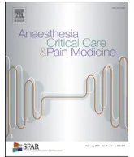

Experts' guidelines

# Management of antiplatelet therapy for non elective invasive procedures of bleeding complications: proposals from the French working group on perioperative haemostasis (GIHP), in collaboration with the French Society of Anaesthesia and Intensive Care Medicine (SFAR)

Godier Aa,\*, Garrigue Db, Lasne Dc, Fontana Pd, Bonhomme Fe, Collet JPf, de Maistre Eg, Ickx Bh, Gruel Yi, Mazighi Mj, Nguyen Pk, Vincentelli Al, Albaladejo Pm, Lecompte Td

aService d'anesthésie-réanimation, AP-HP, hôpital Européen George Pompidou, Paris et INSERM UMRS 1140, Faculté de Pharmacie, Université Paris Descartes, Paris, France

bCHU de Lille, Pôle d'Anesthésie-Réanimation, CHU Lille, Pôle de l'Urgence, Lille, France

cLaboratoire central d'hématologie, Hôpital Necker, AP-HP, Paris, France

dService d'angiologie et d'hémostase, Département de spécialités de médecine, Hôpitaux Universitaires de Genève, et Geneva Platelet Group, faculté de médecine – Université de Genève, Suisse

eDépartement d'anesthésiologie, de pharmacologie et de soins intensifs, Hôpitaux Universitaires de Genève, Suisse

fSorbonne Universités Paris 06 (UPMC), ACTION Study Group, INSERM UMR\_S 1166, Institut de Cardiologie, Département de Cardiologie, Hôpital Pitié-Salpêtrière (AP-HP), Paris, France

gService d'Hématologie Biologique – secteur Hémostase, Plateau technique de Biologie, CHU Dijon-Bourgogne, Dijon, France

hDépartement d'anesthésie-réanimation, Hôpital Erasme, Bruxelles, Belgique

iDépartement d'hématologie-hémostase, Hôpital Universitaire de Tours, Tours, France

jDépartement de neuroradiologie interventionnelle, Fondation Adolphe de Rothschild, Paris et INSERM U 1148, Hôpital Bichat, Paris, France

kService d'hématologie biologique, Pôle de biologie du CHU de Reims, France

lUniversité de Lille, INSERM U1011-EGID, Lille, France, Institut Pasteur de Lille, Lille, France, CHU Lille, Chirurgie cardiaque, Lille, France

mDépartement d'anesthésie-réanimation, et THEMAS, TIMC, UMR CNRS 5525, Université Grenoble-Alpes, Grenoble, France

ARTICLE INFO

Historique de l'article :

Available online 23 October 2018

Membres of the Groupe d'intérêt en hémostase périopératoire (GIHP) : P. Albaladejo (Anaesthesia and intensive care, Grenoble, France), S. Belisle (Anaesthesia, Montréal, Canada), N. Blais (Haematology-haemostasis, Montréal, Canada), F. Bonhomme (Anaesthesia and intensive care, Geneva, Switzerland), A. Borel-Derlon (Haematology-haemostasis, Caen, France),

ABSTRACT

The French Working Group on Perioperative Haemostasis (GIHP) and the French Study Group on Haemostasis and Thrombosis (GFHT) in collaboration with the French Society of Anaesthesia and Intensive Care Medicine (SFAR) drafted up-to-date proposals on the management of antiplatelet therapy for non-elective invasive procedures or bleeding complications. The proposals were discussed and validated by a vote; all proposals could be assigned with a high strength.

Emergency management of oral antiplatelet agents (APA) requires knowledge on their pharmacokinetic/pharmacodynamics parameters, evaluation of the degree of the alteration of haemostatic competence and the associated bleeding risk. Platelet function testing may be considered. When APA-induced bleeding risk may worsen the prognosis, measures should be taken to neutralise antiplatelet therapy by considering not only the efficacy of available means (which can be limited for prasugrel and even more for ticagrelor) but also the risks that these means expose the patient to. The measures include platelet transfusion at the appropriate dose and haemostatic agents (tranexamic acid; rFVIIa for ticagrelor). When possible, postponing non-elective invasive procedures at least for a few hours until the

\* Corresponding author: Service d'anesthésie-réanimation, AP-HP, hôpital Européen George Pompidou, Paris, INSERM UMRS 1140, Faculté de Pharmacie, Université Paris Descartes, Paris, France

E-mail address: [anne.godier@aphp.fr](mailto:anne.godier@aphp.fr) (A. Godier).J.Y. Borg (Haemostasis, Rouen, France), J.-L. Bosson (Vascular medicine, Grenoble, France), A. Cohen (Cardiology, Paris, France), J.-P. Collet (Cardiology, Paris, France), E. de Maistre (Haematology, Dijon, France), D. Faraoni (Anaesthesia and intensive care, Toronto, Canada), P. Fontana (Haemostasis, Geneva, Switzerland), D. Garrigue Huet (Anaesthesia and intensive care, Lille, France), A. Godier (Anaesthesia and intensive care, Paris, France), Y. Gruel (Haematology, Tours, France), J. Guay (Anaesthesia, Montréal, Canada), J.F. Hardy (Anaesthesia, Montréal, Canada), Y. Huet (Cardiology, Paris, France), B. Ickx (Anaesthesia and intensive care, Brussels, Belgium), S. Laporte (Pharmacology, Saint-Etienne, France), D. Lasne (Haematology, Paris, France), J.H. Levy (Anaesthesia and intensive care, Durham, USA), J. Llau (Anaesthesia, Valencia, Spain), G. Le Gal (Vascular medicine, Ottawa, Canada), T. Lecompte (Haematology, Geneva, Switzerland), S. Lessire (Anaesthesia, Namur, Belgium), D. Longrois (Anaesthesia and intensive care, Paris, France), S. Madi-Jebara (Anaesthesia, Beirut, Lebanon), E. Marret (Anaesthesia and intensive care, Paris, France), J.L. Mas (Neurologie, Paris), M. Mazighi (Neurology, Paris, France), G. Meyer (Pneumology, Paris, France), P. Mismetti (Clinical pharmacology, Saint-Etienne, France), P.E. Morange (Haematology, Marseille, France), S. Motte (Vascular pathology, Brussels, Belgium), F. Mullier (Haematology, Namur, Belgium), N. Nathan (Anaesthesia and intensive care, Limoges, France), P. Nguyen (Haematology, Reims, France), Y. Ozier (Anaesthesia and intensive care, Brest, France), G. Pernod (Vascular medicine, Grenoble, France), N. Rosencher (Anaesthesia and intensive care, Paris), S. Rouillet (Anaesthesia and intensive care, Bordeaux, France), P.M. Roy (Emergency medicine, Angers, France), C.M. Samama (Anaesthesia and intensive care, Paris, France), S. Schlumberger (Anaesthesia and intensive care, Suresnes, France), J.F. Schved (Haematology, Montpellier, France), P. Sié (Haematology, Toulouse, France), A. Steib (Anaesthesia and intensive care, Strasbourg, France), S. Susen (Haematology and transfusion, Lille, France), E. van Belle (Cardiology, Lille, France), P. van Der Linden (Anaesthesia and intensive care, Brussels, Belgium), A. Vincentelli (Heart surgery, Lille, France), et P. Zufferey (Anaesthesia and intensive care, Saint-Etienne, France).

**Keywords:** antiplatelet agents; surgery; invasive procedures; bleeding; thrombosis; platelet transfusion; rFVIIa; tranexamic acid

elimination of the active compound (which could compromise the effect of transfused platelets) or if possible a few days (reduction of the effect of APA) should be considered.

© 2018 The Authors. Published by Elsevier Masson SAS on behalf of Société française d'anesthésie et de réanimation (Sfar). This is an open access article under the CC BY license (<http://creativecommons.org/licenses/by/4.0/>).

## Introduction

Oral antiplatelet agents (APAs) are one of the pillars for treatment of atherosclerosis, particularly for the prevention of recurrence of acute atherothrombotic events.

Non-elective invasive procedures or bleeding events during antiplatelet therapy are frequent. Their management requires evaluation of the level of haemostatic competence linked to antiplatelet therapy and the bleeding risk they can induce. When this risk may worsen the prognosis, measures should be taken to neutralise (as defined below) antiplatelet therapy by considering not only the efficacy of available means but also the risks that these means expose the patient to. For non-elective invasive procedures, the possibility of postponing them for a few days or even a few hours until the elimination or sufficient reduction of the effect of APA or its active metabolite should be considered.

The management of APA-treated patients in emergency settings is poorly codified. The French Working Group on Perioperative Haemostasis (GIHP) and the French Study Group on Thrombosis and Haemostasis (GFHT) have worked together to draft proposals for the management of APA in case of non-elective invasive procedures or bleeding events. This work is a follow-up of the guidelines published in 2018 on the management of antiplatelet therapy in patients undergoing elective invasive procedures.

The different parts of this text were assigned to working groups consisting of members of the GIHP and/or the GFHT. Each group performed literature search via PubMed with the appropriate keywords. The research was completed by other members of the group according to their archives and manual research. Then each group drafted a text and made proposals based on data from the literature. Next, other groups read, debated and modified these proposals, which were then submitted for critical analysis by GFHT.**Table 1**  
Pharmacological properties of the principal oral APAs [2,3].

<table border="1">
<thead>
<tr>
<th>Antiplatelet agent</th>
<th>aspirin</th>
<th>clopidogrel</th>
<th>prasugrel</th>
<th>ticagrelor</th>
</tr>
</thead>
<tbody>
<tr>
<td>Class</td>
<td>NSAID</td>
<td>thienopyridine</td>
<td>thienopyridine</td>
<td>cyclo-pentyl-triazolopyrimidine</td>
</tr>
<tr>
<td>Mechanism of action</td>
<td>COX-1 irreversible inhibitor</td>
<td>ADP P2Y12 platelet receptor irreversible inhibitor</td>
<td>ADP P2Y12 platelet receptor irreversible inhibitor</td>
<td>ADP P2Y12 platelet receptor reversible inhibitor</td>
</tr>
<tr>
<td>Maintenance dose</td>
<td>75-300 mg qd</td>
<td>75 mg qd</td>
<td>10 mg qd</td>
<td>90 mg bid</td>
</tr>
<tr>
<td>Time of active compound peak concentration</td>
<td>15-40 min</td>
<td>30-60 min</td>
<td>30 min</td>
<td>1.5-3h</td>
</tr>
<tr>
<td>Half-life of the principal active compound (*)</td>
<td>15-20 min</td>
<td>30 min</td>
<td>3.7 h</td>
<td>ticagrelor: 6.7-9.1h 1st metabolite: 8.5-12.4h</td>
</tr>
</tbody>
</table>

NSAID: non steroidal antiinflammatory agent

(\*): See the text for the time intervals to be taken into account after administration of APA during which the transfused platelets can be inhibited, which would compromise the efficacy of platelet transfusion [4].

members and all the GIHP members. Finally, these proposals were validated by a vote ( $n = 38$ ) that determined the strength of each proposal. In order to retain a proposal on a criterion, at least 50% of the members had to agree (for a proposal to be considered as strongly accepted, the threshold was placed at 70%), whereas disagreement was when fewer than 20% of them agreed. In the absence of agreement, proposals were reformulated and submitted for a new vote with the aim to obtain larger agreement. These proposals were made in collaboration with the French Society of Anaesthesia and Intensive Care Medicine (SFAR).

### Antiplatelet agents

The four main oral APAs have two distinct molecular targets: aspirin inhibits the enzyme cyclooxygenase 1 (COX-1) and therefore thromboxane A2 synthesis, whereas clopidogrel, prasugrel (two thienopyridines), and ticagrelor inhibit one of the platelet receptors of adenosine diphosphate (ADP), the P2Y12 receptor (Table 1) [1]. Thromboxane A2 and ADP are platelet activators with specific receptors. They essentially come from platelets activated by sub-endothelial collagen exposed after a vascular injury and the first traces of thrombin. They make up amplification pathways of platelet activation and aggregation.

Under certain conditions (a combination of activators, high concentrations of strong activators, such as thrombin and collagen), platelet responses (in particular, aggregation) rely less or even not at all on neither the amplification system provided by thromboxane A2 nor that provided by ADP. Consequently, these responses are only partially (or not at all) inhibited by aspirin or by a P2Y12 inhibitor, even if it is potent, or by the association of both.

Inhibition of thromboxane A2 synthesis by aspirin and inhibition of the P2Y12 receptor by a thienopyridine (but not by ticagrelor) are irreversible, but in different ways, having an impact on management with platelet transfusion.

- Inhibition is almost total with aspirin whereas inhibition induced by thienopyridines is always partial (all the more since platelet activation by ADP also goes through another receptor – P2Y1; the inhibition of the P2Y12 receptor being partial).

- In the first situation, partial recovery of thromboxane A2 synthesis by a fraction of noninhibited, endogenous and new platelets or provided by transfusion can fully stimulate platelets in the vicinity, endogenous, older and irreversibly inhibited by aspirin, whereas in the second situation, only the fraction of the new platelets noninhibited by thienopyridines can be fully activated by ADP.

Finally, it is important to note that in order to stop bleeding, platelets must be recruited with the constitution of an aggregate

with sufficient volume to seal the breach within a reasonable time, which does not require that all of the platelets in circulation be fully functional.

### Role of platelet function tests

*What platelet function tests are available?*

Several platelet function tests (PFT, Table 2) are used to study APA effects. There are major differences among them – thus, they are not interchangeable [5]. In different studies that used several PFT, some PFT were associated with the occurrence of clinical events and others not, partly because PFT did not explore the same platelet function aspects. PFT can be classified according to their kind of approach: integrative or centred on the effect on the molecular target; and according to their ability to estimate the effect of treatment by aspirin or by ADP inhibitors or the association of both.

PFT have pre-analytical constraints that are more or less well defined and their analytical performances have not always been well evaluated. Certain PFT using whole blood can be influenced by parameters such as platelet count and haematocrit. It remains unknown whether these influences correctly reflect the role that these parameters play in primary haemostasis *in vivo*. Finally, exploration in flowing blood (and with relevant shear stress) can provide data markedly different from that obtained in a closed system with very low shear stress [6,7]. The only flow device that is clinically available is the Platelet Function Analyzer (PFA®, Siemens), which has very particular characteristics that separate it from reference devices based on blood flow that is parallel to the reactive surface.

The crucial question is the clinical significance of the tests. Evaluation of platelet functions is relevant if a clear objective has been defined and if the limits of each test are known as well as the complementarity of these approaches. What PFT have in common is the ability to document the degree of inhibition of the molecular target or overall function as well as the speed and extent of recuperation. Precise assessment of the degree of inhibition with antiplatelet therapy for most tests requires knowledge of baseline functioning, which is rarely the case in practice. However, observation of a certain level of platelet response can reasonably lead to consider that a return to full competence primary haemostasis has occurred – meaning that it cannot be differentiated from the competence of a subject not on antiplatelet therapy and whose haemostasis is intrinsically normal.

The absence of a detectable effect with a PFT centred on a molecular target of a drug is consistent with non-observance or**Table 2**Succinct description of the main platelet function tests used for *in vitro* evaluation of the effect of antiplatelet therapy

<table border="1">
<thead>
<tr>
<th>Test</th>
<th>Principle and interpretation</th>
</tr>
</thead>
<tbody>
<tr>
<td>Conventional aggregation, photometric</td>
<td>Changes in light transmission in platelet-rich plasma Activators: arachidonic acid for aspirin, ADP for P2Y12 inhibitors, or another activator (collagen, TRAP) that more or less uses activation amplification by both systems</td>
</tr>
<tr>
<td>Serum thromboxane B2</td>
<td>Coagulation of whole blood at 37 °C and measurement of thromboxane B2 (stable metabolite of thromboxane A2) in the serum obtained Close evaluation of the aspirin target (COX1) (but it can also be diminished by an NSAID other than aspirin, or poor blood coagulation)</td>
</tr>
<tr>
<td>VASP test (<i>vasodilator-stimulated phosphoprotein</i>)</td>
<td>ADP-induced inhibition via its interaction with the P2Y12 receptor, of the elevation of intraplatelet levels of cAMP (second messenger inhibiting platelet activation) induced by PGE1 (platelet activation inhibitor); then detection by the quantification of the degree of phosphorylation of the VASP protein by flow cytometry or ELISA Whole blood test that closely evaluates the target (the ADP P2Y12 receptor) of this receptor's inhibitors (but can be influenced by other factors)</td>
</tr>
<tr>
<td>VerifyNow®*</td>
<td>Automated measurement in whole blood of the consequence of the interaction between fibrinogen and activated GPIIb-IIIa complex (artificial microbeads covered with fibrinogen) Dedicated cartridges for the treatment by aspirin, P2Y12 (or anti-GPIIb-IIIa inhibitors)</td>
</tr>
<tr>
<td>Aggregation detected by changes in impedance</td>
<td>Whole blood (diluted), two devices: Multiplate® and ROTEM® Platelet</td>
</tr>
<tr>
<td>Multiplate®* (multiple electrode impedance platelet aggregometer)</td>
<td>Five channels with computer-assisted control Platelet activators to evaluate the effect of aspirin or that of P2Y12 inhibitors (arachidonic acid and ADP respectively)</td>
</tr>
<tr>
<td>ROTEM® Platelet*</td>
<td>New module of the ROTEM® device</td>
</tr>
<tr>
<td>PFA®**</td>
<td>Whole blood under flow, with (very) high shear stress</td>
</tr>
<tr>
<td>(Platelet Function Analyzer, 100, now 200)</td>
<td>Occlusion by a platelet plug of an orifice in a membrane soaked with collagen and ADP, or collagen and epinephrine Sensitive to aspirin with a collagen and epinephrine cartridge but not very sensitive to P2Y12 inhibitors. There is a sensitised cartridge dedicated to P2Y12 inhibitors (Innovance PFA P2Y®)</td>
</tr>
<tr>
<td>TEG® Platelet Mapping*</td>
<td>Gradual modification of the viscoelastic properties of whole blood along its coagulation and clot organisation (its mechanical properties). Sensitised evaluation of platelet involvement in maximal amplitude (**)</td>
</tr>
</tbody>
</table>

Some tests that have been used in certain studies but that are not widely available have not been included in this table.

It is important to note that activator concentrations can differ from one test to another.

(\*) Tests that can be used near the patient and with whole blood = POCT (Point Of Care Testing). PFA® is often located in haemostasis laboratories.(\*\*) Three conditions are used to determine maximal amplitude: (1) the reference: citrated blood with kaolin and recalcification; (2) the contribution of fibrin(ogen): heparinised blood with a mixture of reptilase and FXIIIa; (3) the contribution of platelets: by comparing the result obtained in the second condition with the addition of a platelet activator that corresponds to the APA being evaluated (arachidonic acid and ADP for aspirin and P2Y12 inhibitors respectively), with the fibrin component and with the reference, both conditions mentioned just above.

distant last intake, which therefore excludes the role of APA in case of a bleeding event, or in the bleeding risk. A PFT with a well-established haemostatic competence threshold would make it possible to individually determine the shortest time to reach this threshold and perform a procedure after discontinuation of the APA. It could also assess the gap at this threshold and therefore the bleeding risk, the prediction of platelet transfusion requirement and the way to perform transfusion (initial dose to obtain a proportion of transfused platelets in circulation required for haemostatic competence, and potential interest of a new transfusion to maintain this proportion). Unfortunately, there is little clinical information to document that desired haemostatic competence threshold. Moreover, non-detection by an integrative PFT, which is possible despite a certain effect on the target, cannot be considered as a guarantee of the absence of altered haemostatic competence. The practical limits of PFT also include their often-limited availability, their user-friendliness and their costs. Finally, since PFT are performed with fresh blood, quality control is difficult [8].

In the perioperative context, the studied tests are mostly Multiplate® and TEG Platelet Mapping® and to a lesser extent, VerifyNow®. The time required for a result with these POCT is 10 minutes or less except for viscoelastometry (30 minutes) – to which must be added the incompressible time preceding the analysis, which even without transport to the laboratory includes "rest" time for the platelets between sampling and testing, and preincubation to obtain an homogeneous temperature of 37 °C [9].

If a PFT is used outside of a laboratory (POCT), it must be performed:

- - in coordination with the haemostasis team and the local medical laboratory,

- - in agreement with existing regulations,
- - within a codified organisation of patient management including locally implemented transfusion algorithms.

Since clinical validation is currently insufficient, if a PFT is used, it is advisable that rigorous and multidisciplinary prospective observation of its use and clinical events be performed. Participation in clinical studies is encouraged.

*What is the value of PFT to predict bleeding before a non-elective invasive procedure when APA therapy has not been discontinued?*

The European Society of Anaesthesiology suggests preoperative platelet function testing in case of bleeding history to identify platelet function disorders, linked or not to APA [10]. The grade of the recommendation (grade 2B) however reflects the lack of solid data on the association between the degree of platelet dysfunction and the bleeding risk.

The first observational studies (with small cohorts) have suggested that the degree of platelet inhibition (if determined before-after) or residual functioning is associated with perioperative or spontaneous bleeding events in patients treated with thienopyridines for percutaneous coronary intervention, but this association was not confirmed by three studies with larger cohorts [11–13].

Studies dedicated specifically to perioperative bleeding risk have mostly been performed in cardiac surgery and the association between the degree of APA-induced platelet inhibition and bleeding was not consistently observed [5,14]. TEG® Platelet Mapping predicted excessive bleeding in two studies [15,16] but not in a third one that compared several tests and showed that only the VerifyNow® test predicted the bleeding risk [17]. Two smallobservational studies reported that Multiplate® could identify patients at risk of bleeding [18,19]. Agreement was modest between the results of aggregation measured by impedance changes (Multiplate®) and those obtained with the Platelet Mapping cartridge and the new viscoelastometric testing device TEG®6S [20].

In non-cardiac surgery, one study including 197 patients treated with clopidogrel until the last preoperative days, with or without aspirin, found an association between perioperative bleeding and platelet inhibition evaluated by photometric aggregation, whereas such an association was not found with the other tests used (VASP test, Multiplate® test and PFA-200 Innovance) [21].

A consensus on the PFT to use has not yet been obtained and the threshold values beyond which procedure-associated bleeding risk becomes worrisome remain to be defined (and probably to be adapted to the procedures). It would therefore appear premature to recommend platelet function testing to evaluate bleeding risk for any patient on APA therapy. In agreement with the European Society of Anaesthesiology, it is suggested that platelet function testing be performed preoperatively in order to identify a platelet dysfunction whatever the causes, APA and others, when it is suspected on a clinical basis, in teams trained in and accustomed to the use of the tests.

*What is the usefulness of the tests to adjust the duration of APA discontinuation time before a non-elective invasive procedure?*

When an invasive procedure can be postponed for a few days, the question is to determine whether it is possible to shorten the duration of APA discontinuation recommended for scheduled procedures [22]. The aim is to determine the shortest duration possible with an additional bleeding risk considered as acceptable.

While the vast majority of invasive procedures can be performed in patients on aspirin alone, DAPT associating aspirin and a P2Y12 inhibitor can significantly increase the risk of bleeding. In that case, discontinuation of P2Y12 inhibitors is recommended before procedures with moderate or high bleeding risk [10,22,23]. GIHP recommends the last intake of clopidogrel or ticagrelor at D-5, and D-7 for prasugrel [22].

There is a significant variability in the response to P2Y12 inhibitors evaluated with PFT, in particular for clopidogrel and to a lesser degree for prasugrel and ticagrelor [24,25]. Two opposing situations can occur: low platelet function alteration noted with partial recovery but deemed sufficient after a period of discontinuation that is shorter than that generally recommended since recovery can be accelerated (increase in platelet turnover in cardiovascular settings, with an increased proportion of young and very reactive platelets [26]); or on the contrary, a longer duration of discontinuation required to reach the same degree of recovery given a strong alteration (high sensitivity to antiplatelet therapy). There is some degree of variability in the speed of recovery after aspirin, essentially related to accelerated platelet turnover [27] while the inhibition obtained on the molecular target is always maximal except in case of poor compliance with treatment or interference by another NSAID. Shortening, if possible, the discontinuation of this type of APA according to the results of a PFT is therefore attractive [28–30].

Even if there is agreement on the existence of a relationship between the level of platelet function alteration and the risk of spontaneous haemorrhage after placement of a coronary stent [31], there have been few studies with specific interest in the level of platelet function alteration and associated peri-interventional bleeding risk. As already stated, the results of the tests are not interchangeable [32,33]. Moreover, the definitions of perioperative bleeding are very heterogeneous. The available data nevertheless

tends to show that the intensity of platelet function alteration is associated with an increased perioperative bleeding risk. A meta-analysis of 19 studies (totalling 14,046 patients) revealed that a short interval between the last intake of APA and surgery compared with a longer interval was associated with a doubling of reoperations owing to bleeding and an increase of 50% in mortality in patients undergoing coronary bypass surgery [34]. Patients on prasugrel in the TRITON-TIMI 38 study undergoing coronary bypass surgery had four times more major bleeding events than patients on clopidogrel [35] and the patients who had taken ticagrelor within 24 hours of coronary bypass surgery tended to have greater chest tube drainage than those treated with clopidogrel in the PLATO study [36].

It has been logically proposed that platelet function testing could be a better means to predict perioperative-bleeding risk than duration of APA discontinuation. A few observational studies support this concept. A first study used TEG® Platelet Mapping and reported that being in the upper tertile of platelet dysfunction measured with this test predicted transfusion requirements after coronary artery bypass surgery in a cohort of 99 patients [15]. In addition, another study with 180 patients reported that platelet function testing with the same test (TEG® Platelet Mapping) in order to decide the duration of clopidogrel discontinuation before coronary bypass surgery was associated with a mean discontinuation duration inferior to 50% compared with five-day discontinuation, without increased bleeding risk [37]. Lastly, a study with 90 patients receiving DAPT with ticagrelor undergoing coronary bypass surgery reported that the level of platelet function alteration measured by Multiplate® ADP test predicted the risk of bleeding complications [18]. Another study suggested that adjustment of the discontinuation duration before cardiac surgery, based on the results of the VerifyNow® test, was cost effective, particularly in shortening the duration of hospitalisation [38].

The European Society of Cardiology (ESC) and of the European Association for Cardio-Thoracic Surgery (EACTS) and the Society of Thoracic Surgeons have drafted a grade IIb recommendation on the interest of measuring the degree of platelet dysfunction to determine the time interval between last medication intake and cardiac surgery [39,40]. However, as noted above, the studies supporting these recommendations are not numerous. They dealt with small cohorts of patients treated with clopidogrel or ticagrelor, and not those treated with prasugrel. The most appropriate PFT in such cases has not been determined. Lastly, the type of surgery studied is almost always coronary bypass. The benefit of determining the discontinuation duration of the P2Y12 inhibitor based on PFT before another type of surgery, such as neurosurgery or urologic surgery, has never been assessed. Therefore, it would appear premature to recommend a generalised attitude. However, in case of expedited coronary artery bypass surgery, it is proposed that PFT be used to shorten the durations of APA discontinuation, in particular, those of P2Y12 inhibitors, for teams who have such tests available and are accustomed to using them.

*Are PFT useful to guide platelet transfusion when facing a haemorrhage?*

*Bleeding linked to an invasive procedure*

Regarding management of procedure-associated bleeding, a few studies restricted to cardiac surgery have attempted to rationalise platelet transfusion based on PFT associated with the implementation of a transfusion algorithm with varied and sometimes opposing results [41]. These studies did not all specifically concern the question of preprocedural antiplatelet therapy.

In cardiac surgery, the implementation of a transfusion algorithm (including a preoperative photometric platelet aggrega-tion test and a test with PFA-100®) reduced the quantity of transfused blood products, especially platelet concentrates, whether the patients were treated with clopidogrel or not [42]. This prospective study was one of the rare studies to specifically consider the aspect of antiplatelet therapy [42]. However, in a second study in cardiac surgery, this one retrospective, the implementation of another protocol using both viscoelastometric evaluation and the Multiplate® test was associated with a reduction in the transfusion of red blood cell and plasma units but also with an increase in platelet transfusion [43]. In a prospective study of the same group, the use of the two above-mentioned tests in a modified algorithm reduced patient exposure to allogenic blood products and platelet transfusion doses [44].

The authors of a systematic review with meta-analysis of 30 observational studies (3,044 patients) and nine randomised trials (1,057 patients) in cardiac surgery, which were not all centred on the question of preoperative antiplatelet therapy, concluded that incorporating PFT (often viscoelastometric tests) in a transfusion management algorithm is associated with a reduction in bleeding and transfusion requirement (red blood cells) [45]. However, it is not possible to favour one of the proposed transfusion algorithms that uses one or several of these tests. Moreover, the tests were essentially studied in cardiac surgery. A study performed in the context of intracerebral haemorrhage reported that patients considered by a PFT as being little affected by aspirin and not transfused, have the same evolution as patients who were not treated with aspirin [46]. Extrapolation of these results to other situations must be considered with caution. Overall, the real place of these algorithms and PFT to guide platelet transfusion remains to be validated whether be it in cardiac surgery or other types of surgery.

Moreover, several scores have been established to predict perioperative bleeding and transfusion requirements [47,48], but none includes PFT and no study on PFT has compared its results with the scores. At most, the scores include platelet count.

#### Non-periprocedural bleeding

In the case of non-periprocedural bleeding, a PFT may assess PAP impact on primary haemostasis, which could guide bleeding management. The absence of a detectable effect with a test centred on the molecular target of the APA suggests poor observance of treatment or distant last intake, which could justify not performing neutralisation since it would be deemed unnecessary. However, there are still doubts about the ability of certain POCT tests to detect subtle but clinically relevant platelet function alterations in the specific setting of bleeding.

#### Are PFT useful to guide postoperative antiplatelet therapy?

There is a rational basis for the postoperative evaluation of primary haemostasis: some procedures cause alterations in haemostasis that can predispose a patient to bleeding (such as cardiac surgery with extra-corporeal circulation) with significant inter-individual variability in the intensity of these alterations and in the speed of recovery. The postprocedural inflammatory phase also modifies haemostasis but in the other way (with prothrombotic effects) [49]. Similar phenomena can occur after an episode of severe haemorrhage. To our knowledge, no studies have assessed the use of PFT to guide resumption of APA therapy (time, dose, loading dose or not...). Their use cannot be proposed outside of research protocols.

### The role of platelet function testing: proposals

Preoperative platelet function testing is proposed to identify platelet dysfunctions, no matter the causes (APA or other), when

they are suspected on a clinical basis, in teams trained in and accustomed to the use of the tests.

In case of expedited coronary bypass surgery\*, platelet function testing is proposed to shorten the discontinuation duration of P2Y12 inhibitors in teams trained in and accustomed to the use of the tests.

If platelet function testing is used outside of a laboratory (Point of Care Testing), it is recommended to perform it:

- - in coordination with the haemostasis team within the framework of so-called delocalised biology,
- - in agreement with current regulations,
- - by including it in the management with local transfusion algorithms,
- - by personnel trained in and accustomed to the use of the tests.
- - (\*) definition in Section 3.

### What means can be used to neutralise the effect of APAs?

The dictionary definition of the word "neutralise" used here is to reduce, alleviate, or even cancel out the effect of something, prevent it from acting through a contrary action. Thus, the means that can neutralise APAs are those that can reduce the increase in bleeding risk that they induce. They include not only the means to restore platelet functions inhibited by APA, but also the means to more broadly improve primary haemostasis or even coagulation as the aim is to improve haemostasis to reduce bleeding. The antidote for ticagrelor, if made available, will be one of these means.

A distinction must be made between the effect of a means of neutralisation on PFT performed *in vitro* (and more rarely on bleeding time *in vivo*), and the clinical efficacy, addressed mainly in 4.2 and 5.

#### Does platelet transfusion neutralise the effect of APAs?

##### Platelet products and doses

Platelet concentrates (PC) are either collected from a single donor via apheresis or are produced by pooling platelet suspensions prepared from whole blood donations from several donors. PC have variable contents in platelets ( $1$  to  $4 \times 10^{11}$  platelets) [50], but this is variable depending on the country. In the international literature, the term "unit" often but not always means what can be obtained from a single donation of whole blood (around  $0.5 \times 10^{11}$  platelets). A PC generally corresponds to at least five or six such units. The term "platelet unit" is no longer used in France where the prescription must be based on the desired number of platelets. A transfusion of  $0.5 \times 10^{11}$  platelets (i.e. 50 G, or one unit as defined above) for 7 kg of body weight (BW), or  $0.7 \times 10^{11}$  platelets for 10 kg BW, will increase the platelet count by approximately 50 G/L.

The dose that is usually recommended for a platelet transfusion, whatever the indication, is  $0.5$  to  $0.7 \times 10^{11}$  platelets per 10 kg BW (i.e. one to 1.5 units) [50].

##### Platelet transfusion and neutralisation of APA

Platelet transfusion is often recommended to neutralise the effects of APA and the dose is  $0.5$  to  $0.7 \times 10^{11}$  for 10 kg BW [10,51,52]. The rationale for transfusion in this context is to provide platelets that have not been exposed to APAs (which can be called "noninhibited") and that can sufficiently restore primary haemostasis despite the presence in the circulating blood of patient platelets inhibited by APA(s), and therefore correct the APA-induced bleeding risk. Three situations can be distinguished: 1) irreversible platelet inhibitors, active metabolite still present inblood; 2) irreversible inhibitors, no more active metabolite in blood; 3) reversible inhibitor. In the first and last cases, the transfused platelets are inhibited when circulating in the patient's blood, which compromises the efficacy of the platelet transfusion.

The ability of platelet transfusion to correct the effects of aspirin evaluated *in vitro* by PFT has been well documented. *In vitro* supplementation by noninhibited platelets in a proportion of 30% to 40% restored platelet aggregation studied by light transmission and induced with arachidonic acid [53,54]. Preoperative transfusion of a mean dose of  $0.5\text{--}0.75 \times 10^{11}$  platelets (1 to 1.5 units) per 10 kg BW in patients on aspirin and requiring urgent neurosurgery corrected the platelet functions evaluated with VerifyNow® aspirin [55]. The time during which aspirin resides in the blood is brief when it is not a sustained-release formulation: half-life of around 20 minutes.

The effect of platelet transfusion to correct the effects of thienopyridines evaluated *in vitro* by PFT is less documented but higher doses of platelets than for aspirin would appear to be necessary. Correction of clopidogrel-induced platelet inhibition studied by light transmission aggregometry and induced with ADP is gradual with the increase in the proportion of noninhibited platelets – thus with the lengthening of time elapsed since last intake [56]. Correction is partial but significant when there are more than 40% noninhibited platelets. However, there are several arguments suggesting that the total correction of platelet dysfunction related to exposure to a thienopyridine, studied with such tools, is difficult to achieve, in contrast to aspirin. Neutralising prasugrel appears to require a greater proportion of platelets than for clopidogrel [57,58]. *In vitro* supplementation by 60% non-inhibited platelets only provides partial correction of the ADP-induced platelet aggregation inhibited by prasugrel [59,60]. The time elapsed between thienopyridine intake and transfusion is decisive. In fact, platelet transfusion is rendered ineffective by the active metabolite of prasugrel whose concentration is maximal for the first 2 hours and remains significant up to 6 hours after intake [59,61]. The half-life of the active metabolite of clopidogrel is reported to be shorter than that of prasugrel (Table 1), but in the absence of solid data and in order to reduce the risk of ineffective transfusion, duration of 6 hours can also be retained for clopidogrel.

Finally, platelet transfusion can probably not neutralise the effect of ticagrelor. This directly active APA and its first metabolite, which is also a platelet inhibitor, are present in plasma at high concentrations. Their effect is reversible but their half-lives are long: 7 hours for ticagrelor and 8.5 hours for its active metabolite [62,63]. Thus, ticagrelor present in plasma can inhibit platelets provided by transfusion [60,64,65] for up to 24 h after the last intake [66]. Such ineffectiveness of platelet transfusion has been observed with several models. *In vitro* or *in vivo* administration of noninhibited platelets did not restore ADP-induced platelet aggregation inhibited by ticagrelor [60,64]. ADP-induced platelet aggregation of samples from healthy volunteers was dramatically reduced even by a low (10%) proportion of plasma of patients treated with ticagrelor [61]. Likewise, transfusion of  $8.5 \times 10^{11}$  platelets (17 units) to a patient treated with aspirin and ticagrelor and requiring urgent neurosurgery increased platelet count but did not improve ADP-induced aggregation evaluated with VerifyNow® [65].

Finally, 52 patients were transfused (about  $3.5 \times 10^{11}$  platelets – 7 units) prior to coronary artery bypass surgery because they had been treated with aspirin and clopidogrel ( $n = 45$ ), prasugrel ( $n = 6$ ) or ticagrelor ( $n = 3$ ) and presented active bleeding. PFT did not reveal platelet function improvement after transfusion in patients treated with ticagrelor (or prasugrel) whereas the improvement was statistically significant in those treated with clopidogrel [57].

#### Does desmopressin neutralise the effect of APAs?

Although desmopressin (1-deamino-8-D-arginine vasopressin or DDAVP) is often mentioned among the therapeutic options for prevention or treatment of APA-associated bleeding (doses of 0.3 to 0.4  $\mu\text{g/kg}$ , perfused in 100 mL of saline solution for 30 min), its efficacy is very uncertain [67–69]. This synthetic drug acts by increasing the concentration of von Willebrand factor and factor VIII and is used for certain forms of von Willebrand disease and haemophilia A. Moreover, it could have direct effects on platelets, which are still incompletely characterised. [70]. Desmopressin is used for certain inherited [71] or acquired [72] platelet dysfunctions, but clinical demonstration of its efficacy has been inadequate. Studies with PFT suggest a certain efficacy on the platelet dysfunctions induced by APAs [73–75].

In cardiac surgery, a meta-analysis of 10 randomised trials suggests that desmopressin can reduce RBC transfusion, blood loss and more interestingly reoperations due to bleeding [76]. However, half of the trials included were undertaken more than 20 years ago and only six trials included patients treated with APAs ( $n = 284$  in all), mostly with aspirin, and none of the trials except for one concerned non-elective surgery. The percentage of patients transfused in the control groups was very heterogeneous. In a randomised trial including patients on dual antiplatelet therapy (DAPT) undergoing coronary artery bypass surgery, desmopressin was not associated with a reduction in blood loss, but the cohort was small [77]. The use of desmopressin with the most recent APAs has been disappointing. It did not reduce bleeding in rabbits treated with prasugrel [78] and its administration to 21 healthy volunteers treated with ticagrelor did not reduce the bleeding time and did not correct platelet functions [79].

Not only has the efficacy of desmopressin not been established, but also its safety has not been submitted to too much evaluation. It exerts a systemic vasodilator effect that induces arterial hypotension, reactive tachycardia and facial flush. It also exposes patients to oliguria, hypervolemia and hyponatremia. Rare cases of thromboembolic events following administration of desmopressin have led to recommending caution for patients at risk [80,81].

#### Does rFVIIa neutralise the effects of APAs?

Recombinant activated factor VII (rFVIIa) is an option proposed by the summary of product characteristics (SmPC) of ticagrelor in case of severe bleeding. In fact, rFVIIa accelerates thrombin generation and could consequently improve haemostasis when platelet functions are compromised. It is used during bleeding due to major inherited platelet function defects (e.g. Glanzmann's thrombasthenia) [82].

For P2Y12 inhibitors, there are *in vitro* studies and *in vivo* data from animal models and healthy volunteers. In platelet-rich plasma from healthy volunteers on aspirin-clopidogrel, rFVIIa still accelerated thrombin generation after platelet activation with arachidonic acid, ADP, collagen [83]. rFVIIa corrected all of the parameters of thrombin generation and a viscoelastometric test, both altered by prasugrel [84]. In healthy volunteers, rFVIIa reduced blood loss volume induced by punch biopsy compared with a placebo [85]. Data with ticagrelor are limited to one animal study: the injection of 1 mg/kg of rFVIIa in mice that had received ticagrelor reduced bleeding duration and blood loss after tail section [86]. The data in favour of rFVIIa support the propositions of SmPC [87] but are very preliminary. Moreover, for thienopyridines, the target of which (P2Y12) is shared with ticagrelor, no haemostatic effect of rFVIIa was observed. rFVIIa did not reduce bleeding in rabbits treated with clopidogrel [88] or by prasugrel, whereas it induced arterial thrombosis [78].The specific antidote for ticagrelor could combine efficacy and safety. This is a monoclonal antibody in advanced development [89].

#### *Tranexamic acid*

Although tranexamic acid probably has no direct effect on APA-induced platelet dysfunctions, it reduces surgical bleeding [90]. Thus, whether a patient is on APA or not, tranexamic acid is recommended in case of periprocedural or traumatic severe haemorrhages [10]. In case of traumatic haemorrhage, it must be administered within the first three hours following trauma [91].

### **Means to neutralise APAs: proposals**

The type of antiplatelet agent and the time of the last intake should be noted (in order to take the presence or not of circulating active metabolites into account).

In situations requiring neutralisation of aspirin, platelet transfusion is proposed. A dose of  $0.5$  to  $0.7 \times 10^{11}$  per  $10$  kg of body weight is proposed. With formulations of aspirin other than sustained-release ones, the active product will disappear from circulation in less than 2 hours (strong agreement).

In situations requiring neutralisation of clopidogrel or prasugrel, platelet transfusion is proposed. A higher dose than that used to neutralise aspirin is proposed. It could be at least double and higher for prasugrel than for clopidogrel. The efficacy of platelet transfusion can be reduced if the last intake of clopidogrel or prasugrel is less than 6 hours. It is proposed not to administer rFVIIa to neutralise clopidogrel or prasugrel (strong agreement).

In situations requiring neutralisation of ticagrelor and when the last intake was less than 24 hours, no specific treatment can be proposed because platelet transfusion at the doses used to neutralise other APAs will be ineffective. The clinical efficacy of higher doses of transfused platelets has not been evaluated. The clinical efficacy of rFVIIa, proposed in the SmPC for ticagrelor, has not been evaluated. When the last intake of ticagrelor is more than 24 hours, platelet transfusion could provide partial neutralisation (strong agreement).

It is proposed that tranexamic acid be administered owing to its ability to reduce bleeding whether the patient has received APA or not (strong agreement).

Administration of desmopressin to neutralise APAs is not proposed (strong agreement).

### **Management of patients on antiplatelet therapy facing non-elective invasive procedures**

Non-elective invasive procedures are subject to the NCEPOD classification (National Confidential Enquiry into Patient Outcome and Death), which defines the degree of urgency [92]. Three types of procedures can be distinguished:

Immediate procedures whose aim is to save a life, an organ, a limb. They are carried out within minutes of the decision to perform the procedure. They include, for example, ruptured aortic aneurysm, compartment syndrome, traumatic rupture of the spleen.

- Urgent procedures, indicated in cases of conditions that could threaten a life, organ, or limb. They are carried out within the hours that follow the decision to perform the procedure. They include, for example, peritonitis following perforated bowel, limb ischaemia, compound fracture.

- Expedited procedures for patients who are stable but require a procedure for a condition that does not immediately threaten a life, organ, or limb. They are carried out within the days that follow the

decision to perform the procedure. They include, for example, retinal detachment, tumour obstruction syndrome.

These invasive procedures involve diverse techniques including surgery but also punctures, biopsies, endoscopies, endovascular procedures... The vascular breach generated by these procedures has very different consequences on bleeding risk depending on the situation. The main question is to determine the non-elective invasive procedures for which an increased bleeding risk linked to antiplatelet therapy will significantly worsen the clinical prognosis. The next question is to determine if the bleeding risk can be reduced by a specific treatment including APA neutralisation or the potential postponing of the procedure. Finally, a balance between the benefit of this specific treatment and its associated risk must be found.

#### *Bleeding risk induced by antiplatelet therapy*

The bleeding risk induced by APAs, as monotherapy or DAPT, has been evaluated for various non-elective invasive procedures in a broad but yet incomplete manner. Several points should be noted.

Most procedures can be performed on patients on aspirin in monotherapy, generally doses of  $\leq 300$  mg/d, which does not significantly increase the periprocedural bleeding risk [93–95]. Various evaluations or classifications are available. The procedures that can be performed on patients on aspirin include cholecystectomy, appendectomy, intestinal resections, hip fracture surgery, dislocation reductions, pleural drainage [96,97]...

As for clopidogrel as monotherapy, there are no data showing an excess bleeding risk of clopidogrel versus aspirin. In a non-surgical setting, the CAPRIE trial compared the two APAs in monotherapy in 19,185 patients presenting recent ischaemic stroke, myocardial infarction, or symptomatic peripheral arterial disease. [98]. Severe bleeding complications were similar with clopidogrel and aspirin (1.38% vs. 1.55%). However, digestive bleeding was less frequent with clopidogrel (1.99% vs. 2.66%). Only one randomised trial in scheduled surgery has compared the pursuit of clopidogrel to its discontinuation prior to 43 general abdominal surgery procedures (hernioplasty, cholecystectomy) [99]. No cases of bleeding requiring transfusion or reoperation were reported. A meta-analysis of 11 studies comparing clopidogrel to controls before surgery (397 clopidogrel-treated patients) concluded that clopidogrel did not increase reoperations due to bleeding (RR: 1.84; 95% CI: 0.87–3.87;  $P = 0.11$ ) [100]. Few data are available for non-elective procedures. For hip fracture, a meta-analysis of 14 case-control studies did not show a significant increase in transfusions in clopidogrel-treated patients [101]. Moreover, in a study of patients treated with clopidogrel and operated for hip fracture, while transfusions were more numerous when the patients were operated within 48 hours of admission rather than after 5 days, complications and mortality at 3 months were reduced [102]. In a small series of renal transplantations, the patients treated with clopidogrel or ticlopidine did not present major bleeding complications compared with patients not treated with APAs [103]. Overall, the data suggest managing patients on clopidogrel as monotherapy in the same manner as those treated with aspirin as monotherapy – and in particular, operating without delay in cases of hip fracture.

DAPT increases bleeding risk and transfusion exposure in non-elective invasive procedures [100]. However, the increase in bleeding risk does not always appear to be clinically significant in procedures with moderate bleeding risk. For example, DAPT with aspirin-clopidogrel during laparoscopic appendectomy was associated with neither an increase in blood loss nor more frequent transfusion requirement compared with no APAs in matched patients [104]. On the contrary, an increase in bleeding risk isclinically significant in major surgery. Thus, in a series of 171 acute aortic dissections, bleeding was significantly more pronounced in patients receiving DAPT compared with those on aspirin alone [105]. Moreover, DAPT with ticagrelor increased intraoperative bleeding compared with DAPT with clopidogrel, underscoring that the increase in bleeding risk depends on the type of antiplatelet agents. However, in that series, while APAs increased transfusion requirements, they did not increase mortality. Finally, while the procedure-associated bleeding risk is increased by DAPT, it presents significant interindividual variability. Thus, not all of the patients on DAPT will require transfusion. Such variability suggests evaluating intraoperative bleeding and adapting treatment according to the intensity of bleeding.

For invasive procedures that cannot be performed in patients on APA therapy, the optimal duration of antiplatelet discontinuation to reduce the excess bleeding risk associated with APAs can be taken into account when possible (essentially for expedited procedures) [22]. It should be noted that recovery that is only partial (threshold not reached) would probably be associated with a reduction in bleeding risk. However, for different reasons, recovery in the first 24 hours is negligible (active compound still in the circulation; effect on the most mature megakaryocytes for APAs with irreversible action – therefore, the first platelets released by the hematopoietic bone marrow into the circulation are inhibited).

#### *Does neutralisation of APAs improve patient prognosis?*

There have been few evaluations of the clinical benefit of platelet transfusion in the context of non-elective invasive procedures. The available data essentially concerns neurosurgery. The most rigorous demonstration of the interest of platelet transfusion (but with a very particular product: frozen platelets, which are not commonly used in Europe) comes from a Chinese randomised trial that included 366 patients treated with aspirin and considered as responders to the treatment who required emergency craniotomy for haematoma removal [46]. Platelet transfusion reduced postoperative complications, disability and mortality compared with the patients who were not transfused. These data have led various international guidelines to recommend platelet transfusion for patients on APA therapy who present intracranial haemorrhage that requires neurosurgery [80,91].

A retrospective analysis of a cohort of 171 patients over 65 undergoing emergency neurosurgery for traumatic intracranial haemorrhage reported that the patients on aspirin had a prognosis that was comparable to that of patients not on APA therapy but had more platelet transfusions [106]. Above all, among the patients on aspirin, those who had platelet transfusion ( $n = 38$ , 44%) had perioperative bleeding and hospital mortality that was comparable to that of the patients who had not been transfused. However, treatment was heterogeneous, the response to aspirin was not evaluated preoperatively, the analysis was retrospective – limiting the significance of the results.

The results of standardised treatment with preoperative platelet transfusion (two PC from a German transfusion centre for a little over  $4 \times 10^{11}$  platelets) in 72 consecutive patients on APA therapy (DAPT  $n = 14$ ; aspirin  $n = 53$ , clopidogrel alone  $n = 5$ ) presenting intracranial haemorrhage requiring decompression neurosurgery were reported [107]. Recurrence of bleeding was observed in 26% of the patients and clopidogrel was one of the risk factors, suggesting that the dose of transfused platelets was insufficient to neutralise clopidogrel.

Very few data have been published for general surgery. The same team reported its experience with standardised treatment of patients on DAPT requiring non-elective surgery with bleeding risk [108]. The aim was to reduce the perioperative bleeding risk over a

short period in order to avoid increasing the thrombotic risk for a longer period of time in patients at high thrombotic risk. The protocol associated postponing the procedure for 12 to 24 hours after the last intake of APA when possible, transfusion of two PC ( $2.8 \pm 0.6 \times 10^{11}$  platelets per concentrate) 1 to 2 hours before surgery, and resumption of aspirin 6 to 9 hours and clopidogrel 24 to 48 hours after surgery. Fourteen patients were included. Only one patient developed prolonged bleeding after renal excision without the need for further transfusion. This management appears to be attractive but the very small cohort and the absence of a control group limit its generalisation.

There have been no clinical studies in the literature confirming the ineffectiveness (very probable) of platelet transfusion to reduce the risk of haemorrhage in patients on ticagrelor.

#### *Does neutralisation of APAs induce thrombotic risk?*

The periprocedural period is a period at risk for thrombotic events. Invasive procedures, irrespective of the continuation or the neutralisation of APAs, can induce a proinflammatory and procoagulant state that favours thrombotic phenomena. An increased risk of a major cardiac events has been shown following non-elective invasive procedures [109]. Intuitively, this risk is all the greater when the basal thrombotic risk of the patient is high, irrespective of the emergency situation, which includes, in particular, the first month following stent placement.

There have been few evaluations of the thrombotic risk of platelet transfusion. The transfusion of 72 consecutive patients on APA therapy who presented intracranial haemorrhage requiring decompression neurosurgery was accompanied by no acute coronary syndrome [107]. In a cohort of 14 patients on DAPT for coronary stent, platelet transfusion administered before surgery did not induce stent thrombosis [108]. One patient developed acute coronary syndrome four days after surgery whereas DAPT had been resumed. Three cases of stent thrombosis occurring 6 to 18 hours after platelet transfusion have been reported [110]. In the three cases, transfusion had been performed within 10 days following stent placement for acute coronary syndrome, in two cases to control bleeding for haemorrhages and in the third case before surgery.

#### **Management of APAs for non-elective invasive procedures: proposals (Fig. 1)**

It is proposed to separate non-elective invasive procedures into immediate procedures to be carried out within minutes of the decision to perform the procedure (for example: ruptured aortic aneurysm, compartment syndrome...); urgent procedures to be carried out within the hours that follow the decision to perform the procedure (for example: peritonitis, limb ischaemia...); expedited procedures to be carried out within the days that follow the decision to perform the procedure (for example: retinal detachment, tumour obstruction syndrome...) (strong agreement).

For invasive procedures that cannot be performed on patients on APA therapy, it is proposed that the optimal durations for discontinuation of APAs to reduce the excess bleeding risk linked to APAs be considered whenever it is possible (essentially expedited procedures). It is therefore proposed to discontinue them as follows (with D0 corresponding to the day of the procedure): last aspirin intake at D-3; last intake of clopidogrel and ticagrelor at D-5; last intake of prasugrel at D-7 (with the addition of two days for intracranial surgery whatever the APA) (strong agreement).

When it is impossible to respect these durations of discontinuation, the following are proposed:

In patients on aspirin or clopidogrel as monotherapy:Fig. 1.

- - to begin non-neurosurgical non-elective invasive procedures without neutralisation (strong agreement).
- - to neutralise antiplatelet therapy before urgent or immediate intracranial surgery (strong agreement).

In patients on dual antiplatelet therapy:

- - to begin non-neurosurgical non-elective invasive procedures without neutralisation. If intraprocedural bleeding is not controllable by the senior surgeon and is attributable to antiplatelet therapy, it is proposed that it be neutralised (strong agreement).
- - to neutralise antiplatelet therapy before urgent or immediate intracranial surgery (strong agreement).
- - to perform expedited procedures more than 24 hours after the last intake of prasugrel or ticagrelor (strong agreement).

In patients treated with P2Y12 inhibitor as monotherapy or associated with aspirin, it is recommended to not perform central neuraxial anaesthesia (spinal, epidural) (strong agreement).

### Management of bleeding associated with APAs

Bleeding complications associated with APAs form a heterogeneous group with variable characteristics: location and intensity of bleeding, type of antiplatelet therapy, date of last intake, patient thrombotic risk...

In all cases, etiological treatment of bleeding is essential, including haemostatic procedures, i.e. all mechanical means to control bleeding (surgery, endoscopy, embolization, tamponade...), associated with symptomatic treatment of haemorrhage, including vascular filling, vasopressors, red blood cell transfusion, measures taken to fight hypothermia, and early administration of tranexamic acid. This antifibrinolytic agent, inexpensive and safe, is recommended in cases of severe bleeding [10]. Assessed in large trials in traumatology or in cardiac surgery (for APA-treated patients), tranexamic acid was not associated with an increased thrombotic risk [111,112].

However, the occurrence of haemorrhage in APA-treated patients is a thrombotic risk factor. This excess risk of major cardiac events or myocardial infarction has been reported for perioperative [113] stented patients or not [114].

Four types of haemorrhage can be identified:

- **Intracranial haemorrhages:** they occur in 10% to 30% of the cases in patients on long-term antiplatelet therapy [115]. APAs worsen the prognosis of intracranial haemorrhages. The mortality of patients on DAPT is superior to that of those treated with aspirin as monotherapy [116], which is also superior to that of untreated patients [117]. Clopidogrel is also an independent risk factor of mortality [117]. Early transfusion of platelets has been proposed based on the hypothesis that neutralisation of APAs will reduce both risk and volume of haematoma expansion and thereby improve prognosis. In an observational study of patients presenting intracranial haemorrhage during treatment with aspirin confirmed by PFT, early platelet transfusion within 12 hours of symptom onset was associated with less haematoma expansion and a more limited disability at three months, compared with late platelet transfusion after the 12th hour [118]. A meta-analysis of studies evaluating platelet transfusion in patients on antiplatelet therapy concluded that transfusion reduced mortality [119]. However, the authors underscored the limits of this work that relied on three observational studies.

The benefit of platelet transfusion has been cast in doubt by the PATCH trial [120]: in 190 patients on aspirin as monotherapy and presenting supratentorial intracerebral haemorrhage with Glasgow Coma Scores  $\geq 8$  on admission and not requiring emergency neurosurgery, platelet transfusion induced an increase in mortality and dependence at three months compared with the control group. These results have called transfusion into question in this specific population. Likewise, negative results were obtained by analysis of a retrospective cohort of 97 patients on APA therapy and presenting non-traumatic intracerebral haemorrhage with 39 of the patients having received platelet transfusions [121]. In the unmatched cohort, the transfused patients had a higher risk of recourse to surgery, disability and death. After matching with a prognostic intracerebral haemorrhage score, transfusion was not a**Management of bleeding associated with antiplatelet agents (APA)**

The flowchart categorizes bleeding into four main groups: intracranial haemorrhage, haemorrhagic shock, severe bleeding, and non-severe bleeding. These are further divided into symptomatic and etiologic treatment.

- **Intracranial haemorrhage:**
  - **symptomatic:** neurosurgery?
    - yes: neutralise APAs
    - no: GCS > 8 → aspirin → do not neutralise aspirin; GCS ≤ 8 → other APA → no proposal discuss neutralisation
  - **etiologic:** dual antiplatelet therapy?
    - yes: neutralise APAs
    - no: no proposal, do not systematically neutralise APAs
- **Haemorrhagic shock:** dual antiplatelet therapy?
  - yes: neutralise APAs
  - no: no proposal, do not systematically neutralise APAs
- **Severe bleeding:** persistence of haemorrhage after failure of etiologic and symptomatic treatments?
  - yes: neutralise APAs
  - no: do not neutralise APAs
- **Non-severe bleeding:** do not neutralise APAs

<table border="1">
<thead>
<tr>
<th>APA</th>
<th>Proposed means to neutralise the effect of APAs</th>
</tr>
</thead>
<tbody>
<tr>
<td>aspirin</td>
<td>Platelet transfusion of a standard dose of 0.5 to 0.7x1011 per 10 kg of body weight</td>
</tr>
<tr>
<td>clopidogrel</td>
<td>Platelet transfusion: 2 x standard dose <i>Efficacy can be reduced if &lt;6h after the last intake of clopidogrel</i></td>
</tr>
<tr>
<td>prasugrel</td>
<td>Platelet transfusion: &gt; 2 x standard dose <i>Efficacy can be reduced if &lt;6h after the last intake of prasugrel</i></td>
</tr>
<tr>
<td>ticagrelor</td>
<td>Last intake &lt; 24 h: no proposal- Platelet transfusion ineffective; consider rFVIIa Last intake &gt;24h: Platelet transfusion for partial neutralisation</td>
</tr>
</tbody>
</table>

Fig. 2.

significant predictor for any poor outcome but was not associated with any improvement.

No study has evaluated the interest of transfusion in patients presenting intracerebral haemorrhage with altered consciousness or in cases of treatment by P2Y12 receptor inhibitors. In all such cases, antiplatelet therapy must be discontinued.

- **Haemorrhagic shock:** we usually consider that APAs, in particular DAPT and the new P2Y12 inhibitors, increase bleeding and that by neutralising APAs, platelet transfusion enables a return to the usual situation – that of haemorrhagic shock treatment in a patient not on APA. But the interest of platelet transfusion to neutralise APAs in this situation has not been evaluated. However, in patients not on APA therapy, early platelet transfusion is part of the recommended haemorrhagic shock treatment, particularly in protocols based on high ratios [91]. It would therefore appear to be reasonable to neutralise antiplatelet therapy, especially DAPT.

- **Other severe haemorrhages:** they correspond to the definition proposed in the HAS 2008 recommendations concerning haemorrhages while anticoagulation with a vitamin K antagonist (excluding intracranial haemorrhage and haemorrhagic shock): "Severe, or potentially severe bleeding is defined by the presence of at least one of the following criteria: externalised haemorrhage that is not controllable by the usual means; haemodynamic instability defined by systolic blood pressure < 90 mmHg or 40 mmHg lower than usual, or mean arterial pressure < 65 mmHg, or signs of shock; the need for an urgent haemostatic procedure: surgery, interventional radiology, endoscopy; the need for red blood cell transfusion; location threatening the vital or functional prognosis, for example: intracranial or intraspinal haemorrhage, intraocular or retroocular haemorrhage, haemothorax, haemoretroperitoneum, haemopericardium, deep muscular haematoma or compartment syndrome, acute gastrointestinal bleeding, haemarthrosis."

In these situations, the interest of APA neutralisation is open to debate since on one hand, general haemostatic measures can be enough to control the haemorrhage, and on the other hand, there persists uncertainty as to the efficacy of transfusion. In cases of

gastrointestinal bleeding, the most frequent location for haemorrhage associated with APAs, while it appears to be established that APAs favour the recurrence of bleeding [122], the benefit of platelet transfusion has not been well evaluated. The rare available data, essentially retrospective, did not demonstrate a benefit of transfusion in cases of gastrointestinal bleeding but they had major methodological limits [123,124]. Guidelines propose to transfuse platelets to help stop bleeding and to prevent its recurrence but platelet transfusion should probably only be performed in case of persistent haemorrhage after initial attempts to stop it [125].

- **Non-severe haemorrhages:** they are the most frequent and only require symptomatic treatment without neutralising or discontinuing antiplatelet therapy. Their management includes systematic re-evaluation of the indication for antiplatelet therapy as well.

### Management of bleeding associated with APAs: proposals (Fig. 2)

The benefit/risk ratio of antiplatelet therapy neutralisation must consider the type of haemorrhage, the mechanical means available to manage it, the features of the antiplatelet therapy including the type of APA, the time of the last intake of APA, and patient thrombotic risk.

In case of intracranial haemorrhage requiring urgent neurosurgery, preoperative neutralisation of antiplatelet therapy is proposed. In case of intracranial haemorrhage that does not require urgent neurosurgery, it is proposed to not transfuse platelets if the patient is on aspirin as monotherapy and presents a Glasgow Coma Score ≥ 8 on admission. In other cases, it is not possible to favour or not to neutralise antiplatelet therapy. It is proposed to discontinue antiplatelet therapy.

In case of haemorrhagic shock in patients on dual antiplatelet therapy, neutralisation is proposed.For other severe haemorrhages, neutralisation of antiplatelet therapy is proposed in case of persistence of haemorrhage after failure of etiological and symptomatic treatments.

For non-severe haemorrhages, symptomatic treatment is proposed, without neutralisation of antiplatelet therapy.

### Disclosure of interest

P. Collet: AstraZeneca Fees, Bayer, Bristol-Myers Squibb, Sanofi-Aventis, WebMD, Lead-Up, Medtronic and Research Fellowships of the French Federation of Cardiology, BMS and Pfizer. Mr. Mazighi: Counsel for Acticor. The other authors declare that they have no competing interest.

### References

1. [1] Patrono C, Morais J, Baigent C, Collet JP, Fitzgerald D, Halvorsen S, et al. Antiplatelet Agents for the Treatment and Prevention of Coronary Atherosclerosis. *Journal of the American College of Cardiology* 2017;70:1760–76.
2. [2] Nagelschmitz J, Blunck M, Kraetzschmar J, Ludwig M, Wensing G, Hohlfeld T. Pharmacokinetics and pharmacodynamics of acetylsalicylic acid after intravenous and oral administration to healthy volunteers. *Clin Pharmacol* 2014;6:51–9.
3. [3] Floyd CN, Passacquare G, Ferro A. Comparative pharmacokinetics and pharmacodynamics of platelet adenosine diphosphate receptor antagonists and their clinical implications. *Clinical Pharmacokinetics* 2012;51:429–42.
4. [4] Rossini R, Tarantini G, Musumeci G, Masiero G, Barbato E, Calabrò P, et al. A Multidisciplinary Approach on the Perioperative Antithrombotic Management of Patients With Coronary Stents Undergoing Surgery: Surgery After Stenting 2. *JACC Cardiovasc Interv* 2018;11:417–34.
5. [5] Larsen JB, Hvas A-M. Predictive Value of Whole Blood and Plasma Coagulation Tests for Intra- and Postoperative Bleeding Risk: A Systematic Review. *Semin Thromb Hemost* 2017;43:772–805.
6. [6] Jahn K, Suchodolski K, Schäfer A, Sahlmann B, Küster U, Echtermeyer F, et al. Effect of Clopidogrel on Thrombus Formation in an Ex Vivo Parallel Plate Flow Chamber Model Cannot Be Reversed by Addition of Platelet Concentrates or vWF Concentrate. *Anesth Analg* 2017;124:1091–8.
7. [7] Li R, Grosser T, Diamond SL. Microfluidic whole blood testing of platelet response to pharmacological agents. *Platelets* 2017;28:457–62. <http://dx.doi.org/10.1080/09537104.2016.1268254>.
8. [8] Prüller F, Roskopf K, Mangge H, Mahla E, von Lewinski D, Weiss EC, Riegler A, Enko D. Implementation of buffy-coat-derived pooled platelet concentrates for internal quality control of light transmission aggregometry: a proof of concept study. *J Thromb Haemost* 2017;15:2443–50.
9. [9] Le Quellec S, Bordet J-C, Negrier C, Dargaud Y. Comparison of current platelet functional tests for the assessment of aspirin and clopidogrel response. A review of the literature. *Thromb Haemost* 2016;116:638–50.
10. [10] Kozek-Langenecker SA, Ahmed AB, Afshari A, Albaladejo P, Aldecoa C, Barauskas G, et al. Management of severe perioperative bleeding: guidelines from the European Society of Anaesthesiology: First update 2016. *Eur J Anaesthesiol* 2017;34:332–95.
11. [11] Price MJ, Berger PB, Teirstein PS, Tanguay J-F, Angiolillo DJ, Spriggs D, et al. Standard- vs high-dose clopidogrel based on platelet function testing after percutaneous coronary intervention: the GRAVITAS randomized trial. *Jama* 2011;305:1097–105.
12. [12] Breet NJ, Van Werkum JW, Bouman HJ, Kelder JC, Ruven HJT, Bal ET, et al. Comparison of platelet function tests in predicting clinical outcome in patients undergoing coronary stent implantation. *Jama* 2010;303:754–62.
13. [13] Collet JP, Cuisset T, Rangé G, Cayla G, Elhadad S, Pouillot C, et al. Bedside Monitoring to Adjust Antiplatelet Therapy for Coronary Stenting. *N Engl J Med* 2012;367:2100–9.
14. [14] Hansson EC, Antiplatelet Therapy Jeppsson A. Platelet Function Testing, and Bleeding Complications in Cardiac Surgery Patients. *Semin Thromb Hemost* 2017;43:699–705.
15. [15] Kwak YL, Kim J-C, Choi Y-S, Yoo K-J, Song Y, Shim JK. Clopidogrel responsiveness regardless of the discontinuation date predicts increased blood loss and transfusion requirement after off-pump coronary artery bypass graft surgery. *J Am Coll Cardiol* 2010;56:1994–2002.
16. [16] Preisman S, Kogan A, Itzkovsky K, Leikin G, Raanani E. Modified thromboelastography evaluation of platelet dysfunction in patients undergoing coronary artery surgery. *Eur J Cardiothorac Surg* 2010;37:1367–74.
17. [17] Alström U, Granath F, Oldgren J, Ståhle E, Tydén H, Siegbahn A. Platelet inhibition assessed with VerifyNow, flow cytometry and Platelet Mapping in patients undergoing heart surgery. *Thrombosis Research* 2009;124:572–7.
18. [18] Malm CJ, Hansson EC, Åkesson J, Andersson M, Hesse C, Shams Hakimi C, et al. Preoperative platelet function predicts perioperative bleeding complications in ticagrelor-treated cardiac surgery patients: a prospective observational study. *Br J Anaesth* 2016;117:309–15.
19. [19] Ranucci M, Baryshnikova E, Soro G, Ballotta A, De Benedetti D, Conti D, et al. Multiple electrode whole-blood aggregometry and bleeding in cardiac surgery patients receiving thienopyridines. *Ann Thorac Surg* 2011;91:123–9.
20. [20] Kirmani BH, Johnson RI, Agarwal S. Platelet function testing in cardiac surgery: A comparative study of electrical impedance aggregometry and thromboelastography. *Platelets* 2017;28:550–4.
21. [21] Mahla E, Metzler H, Bornemann-Cimenti H, Prueller F, Raggam RB, Pregartner G, et al. Platelet Inhibition and Bleeding in Patients Undergoing Non-Cardiac Surgery-The BIANCA Observational Study. *Thromb Haemost* 2018.
22. [22] Godier A, Fontana P, Motte S, Steib A, Bonhomme F, Schlumberger S, et al. Management of antiplatelet therapy in patients undergoing elective invasive procedures: Proposals from the French Working Group on perioperative hemostasis (GIHP) and the French Study Group on thrombosis and hemostasis (GFHT). In collaboration with the French Society for Anesthesia and Intensive Care (SFAR). *Arch Cardiovasc Dis* 2018.
23. [23] Authors/Task Force Members, Windecker S, Kolh P, Alfonso F, Collet JP, Cremer J, et al. 2014 ESC/EACTS Guidelines on myocardial revascularization: The Task Force on Myocardial Revascularization of the European Society of Cardiology (ESC) and the European Association for Cardio-Thoracic Surgery (EACTS) Developed with the special contribution of the European Association of Percutaneous Cardiovascular Interventions (EAPCI). *Eur Heart J* 2014;35:2541–619.
24. [24] Hansson EC, Malm CJ, Hesse C, Hornestam B, Dellborg M, Rexius H, et al. Platelet function recovery after ticagrelor withdrawal in patients awaiting urgent coronary surgery. *Eur J Cardiothorac Surg* 2016;ezw373–5.
25. [25] Alexopoulos D, Stavrou K, Koniari I, Gkizas V, Perperis A, Kontoprias K, et al. Ticagrelor vs prasugrel one-month maintenance therapy: impact on platelet reactivity and bleeding events. *Thromb Haemost* 2014;112:551–7.
26. [26] Armstrong PC, Hoefler T, Knowles RB, Tucker AT, Hayman MA, Ferreira PM, et al. Newly Formed Reticulated Platelets Undermine Pharmacokinetically Short-Lived Antiplatelet Therapies. *Arterioscler Thromb Vasc Biol* 2017;37:949–56.
27. [27] Lordkipanidze M, HARRISON P. Aspirin twice a day keeps new COX-1 at bay. *J Thromb Haemost* 2012;10:1217–9.
28. [28] Mazzeffi MA, Lee K, Taylor B, Tanaka KA. Perioperative management and monitoring of antiplatelet agents: a focused review on aspirin and P2Y12 inhibitors. *Korean J Anesthesiol* 2017;70:379–89.
29. [29] Mahla E, Tantry US, Gurbel PA. Platelet Function Testing Before CABG is Recommended in the Guidelines: But Do We Have Enough Evidence? *J Interv Cardiol* 2015;28:233–5.
30. [30] Grove EL, Hossain R, Storey RF. Platelet function testing and prediction of procedural bleeding risk. *Thromb Haemost* 2013;109:817–24.
31. [31] Tantry US, Bonello L, Aradi D, Price MJ, Jeong Y-H, Angiolillo DJ, et al. Consensus and update on the definition of on-treatment platelet reactivity to adenosine diphosphate associated with ischemia and bleeding. *J Am Coll Cardiol* 2013;62:2261–73.
32. [32] Berger PB, Kirchner HL, Wagner ES, Ismail-Sayed I, Yahya S, Benoit C, et al. Does Preoperative Platelet Function Predict Bleeding in Patients Undergoing Off Pump Coronary Artery Bypass Surgery? *J Interv Cardiol* 2015;28:223–32.
33. [33] Vries MJA, Bouman HJ, Olie RH, Veenstra LF, Zwaveling S, Verhezen PWM, et al. Determinants of agreement between proposed therapeutic windows of platelet function tests in vulnerable patients. *Eur Heart J Cardiovasc Pharmacother* 2017;3:11–7.
34. [34] Morici N, Moja L, Rosato V, Oreglia JA, Sacco A, De Marco F, Bruschi G, Klugmann S, La Vecchia C, Savonitto S. Time from adenosine di-phosphate receptor antagonist discontinuation to coronary bypass surgery in patients with acute coronary syndrome: meta-analysis and meta-regression. *Int J Cardiol* 2013;168:1955–64.
35. [35] Wiviott SD, Braunwald E, McCabe CH, Montalescot G, Ruzyllo W, Gottlieb S, et al. Prasugrel versus clopidogrel in patients with acute coronary syndromes. *N Engl J Med* 2007;357:2001–15.
36. [36] Held C, Asenblad N, Bassand J-P, Becker RC, Cannon CP, Claes MJ, et al. Ticagrelor versus clopidogrel in patients with acute coronary syndromes undergoing coronary artery bypass surgery: results from the PLATO (Platelet Inhibition and Patient Outcomes) trial. *J Am Coll Cardiol* 2011;57:672–84.
37. [37] Mahla E, Suarez TA, Bliden KP, Rehak P, Metzler H, Sequeira AJ, et al. Platelet function measurement-based strategy to reduce bleeding and waiting time in clopidogrel-treated patients undergoing coronary artery bypass graft surgery: the timing based on platelet function strategy to reduce clopidogrel-associated bleeding related to CABG (TARGET-CABG) study. *Circ Cardiovasc Interv* 2012;5:261–9.
38. [38] Bobbitt J, Petro K, Martin M. Evaluating the effectiveness of pre-operative platelet inhibition testing to reduce costs and pre-operative length of stay. *Appl Nurs Res* 2018;39:241–3.
39. [39] Ferraris VA, Saha SP, Oestreich JH, Song HK, Rosengart T, Reece TB, et al. Update to The Society of Thoracic Surgeons Guideline on Use of Antiplatelet Drugs in Patients Having Cardiac and Noncardiac Operations. *Ann Thorac Surg* 2012;94:1761–81.
40. [40] Valgimigli M, Bueno H, Byrne RA, Collet JP, Costa F, Jeppsson A, et al. 2017 ESC focused update on dual antiplatelet therapy in coronary artery disease developed in collaboration with EACTS: The Task Force for dual antiplatelet therapy in coronary artery disease of the European Society of Cardiology (ESC) and of the European Association for Cardio-Thoracic Surgery (EACTS). *Eur Heart J* 2017.
41. [41] Bonhomme F. The role of point-of-care platelet function testing in guiding platelet transfusion. *Transfus Clin Biol* 2016;23:202–4.
42. [42] Chen L, Bracey AW, Radovanovic R, Cooper JR, Collard CD, Vaughn WK, et al. Clopidogrel and bleeding in patients undergoing elective coronary artery bypass grafting. *J Thorac Cardiovasc Surg* 2004;128:425–31.[43] Görlinger K, Dirkmann D, Hanke AA, Kamler M, Kottenberg E, Thielmann M, et al. First-line therapy with coagulation factor concentrates combined with point-of-care coagulation testing is associated with decreased allogeneic blood transfusion in cardiovascular surgery: a retrospective, single-center cohort study. *Anesthesiology* 2011;115:1179–91.

[44] Weber CF, Görlinger K, Meininger D, Herrmann E, Bingold T, Moritz A, et al. Point-of-care testing: a prospective, randomized clinical trial of efficacy in coagulopathic cardiac surgery patients. *Anesthesiology* 2012;117:531–47.

[45] Corredor C, Wasowicz M, Karkouti K, Sharma V. The role of point-of-care platelet function testing in predicting postoperative bleeding following cardiac surgery: a systematic review and meta-analysis. *Anaesthesia* 2015;70:715–31.

[46] Li X, Sun Z, Zhao W, Zhang J, Chen J, Li Y, et al. Effect of acetylsalicylic acid usage and platelet transfusion on postoperative hemorrhage and activities of daily living in patients with acute intracerebral hemorrhage. *J Neurosurg* 2013;118:94–103.

[47] Bartoszko J, Karkouti K. Can predicting transfusion in cardiac surgery help patients? *Br J Anaesth* 2017;119:350–2.

[48] Biancari F, Tauriainen T, Kinnunen E-M, Airaksinen J. External Validation of the WILL-BLEED Risk Score. *Thromb Haemost* 2018;118:433–4.

[49] Olechowski B, Khanna V, Mariathas M, Ashby A, Dalton RT, Nordon I, et al. Changes in platelet function with inflammation in patients undergoing vascular surgery. *Platelets* 2017;1–9.

[50] HAS, ANSM. Recommandation de bonne pratique: transfusion de plaquettes : produits, indications. *Has* 2015;1–50.

[51] ANSM. Bon usage des agents antiplaquettaires 2012;1–11.

[52] Rossaint R, Bouillon B, Cerny V, Coats TJ, Duranteau J, Fernández-Mondéjar E, et al. The European guideline on management of major bleeding and coagulopathy following trauma: fourth edition. *Crit Care* 2016;1–55.

[53] Li C, Hirsh J, Xie C, Johnston MA, Eikelboom JW. Reversal of the anti-platelet effects of aspirin and clopidogrel. *J Thromb Haemost* 2012;10:521–8.

[54] Hansson EC, Shams Hakimi C, Astrom-Olsson K, Hesse C, Wallen H, Dellborg M, et al. Effects of ex vivo platelet supplementation on platelet aggregability in blood samples from patients treated with acetylsalicylic acid, clopidogrel, or ticagrelor. *Br J Anaesth* 2014;112:570–5.

[55] Taylor G, Osinski D, Thevenin A, Devys J-M. Is platelet transfusion efficient to restore platelet reactivity in patients who are responders to aspirin and/or clopidogrel before emergency surgery? *J Trauma Acute Care Surg* 2013;74:1367–9.

[56] Vilahur G, Choi BG, Zafar MU, Viles-Gonzalez JF, Vorchheimer DA, Fuster V, et al. Normalization of platelet reactivity in clopidogrel-treated subjects. *J Thromb Haemost* 2007;5:82–90.

[57] O'Connor SA, Amour J, Mercadier A, Martin R, Kerneis M, Abtan J, et al. Efficacy of ex vivo autologous and in vivo platelet transfusion in the reversal of P2Y12 inhibition by clopidogrel, prasugrel, and ticagrelor: the APTITUDE study. *Circ Cardiovasc Interv* 2015;8:e002786–6.

[58] Schoener L, Jellinghaus S, Richter B, Pfluecke C, Ende G, Christoph M, et al. Reversal of the platelet inhibitory effect of the P2Y12 inhibitors clopidogrel, prasugrel, and ticagrelor in vitro: a new approach to an old issue. *Clin Res Cardiol* 2017;106:868–74.

[59] Zafar MU, Santos-Gallego C, Vorchheimer DA, Viles-Gonzalez JF, Elmariah S, Giannarelli C, et al. Platelet function normalization after a prasugrel loading-dose: time-dependent effect of platelet supplementation. *J Thromb Haemost* 2013;11:100–6.

[60] Bonhomme F, Bonvini R, Reny J-L, Poncet A, Fontana P. Impact of non-inhibited platelet supplementation on platelet reactivity in patients treated with prasugrel or ticagrelor for an acute coronary syndrome: An ex vivo study. *Platelets* 2015;26:324–30.

[61] Bertling A, Fender AC, Schüngel L, Rumpf M, Mergemeier K, Geißler G, et al. Reversibility of platelet P2Y12 inhibition by platelet supplementation: ex vivo and in vitro comparisons of prasugrel, clopidogrel and ticagrelor. *J Thromb Haemost* 2018.

[62] Dobesh PP, Oestreich JH. Ticagrelor: pharmacokinetics, pharmacodynamics, clinical efficacy, and safety. *Pharmacotherapy* 2014;34:1077–90.

[63] Ferri N, Corsini A, Bellosta S. Pharmacology of the New P2Y12 Receptor Inhibitors: Insights on Pharmacokinetic and Pharmacodynamic Properties. *Drugs* 2013;73:1681–709.

[64] Martin A-C, Berndt C, Calmette L, Philip I, Decouture B, Gaussem P, et al. The effectiveness of platelet supplementation for the reversal of ticagrelor-induced inhibition of platelet aggregation. *Eur J Anaesth* 2015;1.

[65] Godier A, Taylor G, Gaussem P. Inefficacy of Platelet Transfusion to Reverse Ticagrelor. *N Engl J Med* 2015;372:196–7.

[66] Zafar MU, Smith DA, Baber U, Sartori S, Chen K, Lam DW, et al. Impact of Timing on the Functional Recovery Achieved With Platelet Supplementation After Treatment With Ticagrelor. *Circ Cardiovasc Interv* 2017;10:e005120.

[67] Levi M, Eerenberg E, Kamphuisen PW. Bleeding risk and reversal strategies for old and new anticoagulants and antiplatelet agents. *J Thromb Haemost* 2011;9:1705–12.

[68] Ghadimi K, Levy JH, Welsby IJ. Perioperative management of the bleeding patient. *Br J Anaesth* 2016;117:iii18–iii30.

[69] Martin AC, Houssany-Pissot S, Zlotnik D, Taylor G, Godier A. [Management of the bleeding risk associated with antiplatelet agents]. *Rev Med Interne* 2017;38:467–73.

[70] Colucci G, Stutz M, Rochat S, Conte T, Pavicic M, Reusser M, et al. The effect of desmopressin on platelet function: a selective enhancement of procoagulant COAT platelets in patients with primary platelet function defects. *Blood* 2014;123:1905–16.

[71] Orsini S, Noris P, Bury L, Heller PG, Santoro C, Kadir RA, et al. Bleeding risk of surgery and its prevention in patients with inherited platelet disorders. *Haematologica* 2017;102:1192–203.

[72] Mannucci PM. Desmopressin (DDAVP) in the treatment of bleeding disorders: the first 20 years. *Blood* 1997;90:2515–21.

[73] Mannucci PM. Desmopressin: a nontransfusional form of treatment for congenital and acquired bleeding disorders. *Blood* 1988;72:1449–55.

[74] Reiter RA, Mayr F, Blazicek H, Galehr E, Jilma-Stohlawetz P, Domanoğlu H, et al. Desmopressin antagonizes the in vitro platelet dysfunction induced by GPIIb/IIIa inhibitors and aspirin. *Blood* 2003;102:4594–9.

[75] Ranucci M, Nano G, Pazzaglia A, Bianchi P, Casana R, Tealdi DG. Platelet mapping and desmopressin reversal of platelet inhibition during emergency carotid endarterectomy. *J Cardiothorac Vasc Anesth* 2007;21:851–4.

[76] Desborough MJR, Oakland KA, Landoni G, Crivellari M, Doree C, Estcourt LJ, et al. Desmopressin for treatment of platelet dysfunction and reversal of antiplatelet agents: a systematic review and meta-analysis of randomized controlled trials. *J Thromb Haemost* 2017;15:263–72.

[77] ALTUN G, HEMŞİNLİ D, PULATHAN Z, Civelek A. Emergency coronary bypass surgery in patients under the influence of dual antiplatelet therapy: effects of tranexamic acid and desmopressin acetate. *Turk J Med Sci* 2017;47.

[78] Bonhomme F, Lecompte T, Samama CM, Godier A, Fontana P. Evaluation of recombinant factor VIIa, tranexamic acid and desmopressin to reduce prasugrel-related bleeding: A randomised, placebo-controlled study in a rabbit model. *Eur J Anaesth* 2018;35:208–14.

[79] Teng R, Mitchell PD, Butler K. The effect of desmopressin on bleeding time and platelet aggregation in healthy volunteers administered ticagrelor. *J Clin Pharm Ther* 2014;39:186–91.

[80] Frontera JA, Lewin JJ, Rabinstein AA, Aisiku IP, Alexandrov AW, Cook AM, et al. Guideline for Reversal of Antithrombotics in Intracranial Hemorrhage: A Statement for Healthcare Professionals from the Neurocritical Care Society and Society of Critical Care Medicine. *Neurocrit Care* 2016;24:6–46.

[81] Leissinger C, Carcao M, Gill JC, Journycake J, Singleton T, Valentino L. Desmopressin (DDAVP) in the management of patients with congenital bleeding disorders. *Haemophilia* 2014;20:158–67.

[82] Godier A, Greinacher A, Faraoni D, Levy JH, Samama C-M. Use of factor concentrates for the management of perioperative bleeding: guidance from the SSC of the ISTH. *J Thromb Haemost* 2018;16:170–4.

[83] Altman RR, Scazzia AA, MMDL Herrera, Gonzalez CC. Recombinant factor VIIa reverses the inhibitory effect of aspirin or aspirin plus clopidogrel on in vitro thrombin generation. *J Thromb Haemost* 2006;4:2022–7.

[84] Mazzefi M, Szlam F, Jakubowski JA, Tanaka KA, Sugidachi A, Levy JH. In vitro effects of recombinant activated factor VII on thrombin generation and coagulation following inhibition of platelet procoagulant activity by prasugrel. *Thromb Res* 2013;132:106–11.

[85] Skolnick BE, Shenouda M, Khutoryansky NM, Pusateri AE, Gabriel D, Carr ME. Reversal of Clopidogrel-Induced Bleeding with rFVIIa in Healthy Subjects. *Anesth Analg* 2011;1.

[86] Pehrsson S, Hansson K, Neland K, Nylander S. Boosting the coagulation restores haemostasis in ticagrelor-treated mice. *Blood Coagul Fibrinolysis* 2016;27:913–9.

[87] EMEA. [http://www.ema.europa.eu/docs/en\\_GB/document\\_library/EPAR\\_-\\_Product\\_Information/human/001241/WC500100494.pdf](http://www.ema.europa.eu/docs/en_GB/document_library/EPAR_-_Product_Information/human/001241/WC500100494.pdf) n.d.

[88] Hindy-François C, Bachelot-Loza C, Le Bonniec B, Grelac F, Dizier B, Godier A, et al. Recombinant activated factor VII does not reduce bleeding in rabbits treated with aspirin and clopidogrel. *Thromb Haemost* 2010;104:823–30.

[89] Buchanan A, Newton P, Pehrsson S, Inghardt T, Antonsson T, Svensson P, et al. Structural and functional characterization of a specific antidote for ticagrelor. *Blood* 2015;125:3484–90.

[90] Ker K, Edwards P, Perel P, Shakur H, Roberts I. Effect of tranexamic acid on surgical bleeding: systematic review and cumulative meta-analysis. *BMJ* 2012;344:e3054–4.

[91] Duranteau J, Asehounne K, Pierre S, Ozier Y, Leone M, Lefrant J-Y, et al. Recommandations sur la réanimation du choc hémorragique. *Anesthésie & Réanimation* 2015;1:62–74.

[92] <http://www.ncepod.org.uk/classification.html>.

[93] Graham MM, Sessler DI, Parlow JL, Biccard BM, Guyatt G, Leslie K, et al. Aspirin in Patients With Previous Percutaneous Coronary Intervention Undergoing Noncardiac Surgery. *Ann Intern Med* 2018;168:237–44.

[94] Oscarsson A, Gupta A, Fredrikson M, Jarhult J, Nyström M, Pettersson E, et al. To continue or discontinue aspirin in the perioperative period: a randomized, controlled clinical trial. *British Journal of Anaesthesia* 2010;104:305–12.

[95] Mantz J, Samama C-M, Tubach F, Devereux PJ, Collet JP, Albaladejo P, et al. Impact of preoperative maintenance or interruption of aspirin on thrombotic and bleeding events after elective non-cardiac surgery: the multicentre, randomized, blinded, placebo-controlled, STRATAGEM trial. *British Journal of Anaesthesia* 2011;107:899–910.

[96] Rossini R, Musumeci G, Visconti LO, Bramucci E, Castiglioni B, De Servi S, et al. Perioperative management of antiplatelet therapy in patients with coronary stents undergoing cardiac and non-cardiac surgery: a consensus document from Italian cardiological, surgical and anaesthesiological societies. *EuroIntervention* 2014;10:38–46.

[97] D BJM, D BRM, D HAM, D NKM, D VPM, D QJM, et al. An acute care surgery dilemma: emergent laparoscopic cholecystectomy in patients on aspirin therapy. *The American Journal of Surgery* 2014;1–6.[98] CAPRIE Steering Committee. A randomised, blinded, trial of clopidogrel versus aspirin in patients at risk of ischaemic events (CAPRIE). CAPRIE Steering Committee. *The Lancet* 1996;348:1329–39.

[99] Chu EW, Chernoguz A, Divino CM. The evaluation of clopidogrel use in perioperative general surgery patients: a prospective randomized controlled trial. *Am J Surg* 2016;211:1019–25.

[100] Columbo JA, Lambour AJ, Sundling RA, Chauhan NB, Bessen SY, Linshaw DL, et al. A Meta-analysis of the Impact of Aspirin, Clopidogrel, and Dual Antiplatelet Therapy on Bleeding Complications in Noncardiac Surgery. *Ann Surg* 2018;267:1–10.

[101] Soo CGKM, Torre Della PK, Yolland TJ, Shatwell MA. Clopidogrel and hip fractures, is it safe? A systematic review and meta-analysis. *BMC Musculoskeletal Disorders* 2016;17:1–11.

[102] Zehir S, Zehir R, Sarak T. Early surgery is feasible in patients with hip fractures who are on clopidogrel therapy. *Acta Orthop Traumatol Turc* 2015;49:249–54.

[103] Benahmed A, Kianda M, Ghisdal L, Broeders N, Massart A, Lemy A, et al. Ticlopidine and clopidogrel, sometimes combined with aspirin, only minimally increase the surgical risk in renal transplantation: a case-control study. *Nephrol Dial Transplant* 2014;29:463–6.

[104] Pearcy C, Almahmoud K, Jackson T, Hartline C, Cahill A, Spence L, et al. Risky business? Investigating outcomes of patients undergoing urgent laparoscopic appendectomy on antithrombotic therapy. *Am J Surg* 2017;214:1012–5.

[105] Chemtob RA, Moeller-Soerensen H, Holmvang L, Olsen PS, Ravn HB. Outcome After Surgery for Acute Aortic Dissection\_ Influence of Preoperative Antiplatelet Therapy on Prognosis. *J Cardiothorac Vasc Anesth* 2016;1–6.

[106] Lee AT, Gagnidze A, Pan SR, Sookplung P, Nair B, Newman S-F, et al. Preoperative Low-Dose Aspirin Exposure and Outcomes After Emergency Neurosurgery for Traumatic Intracranial Hemorrhage in Elderly Patients. *Anesth Analg* 2017;125:514–20.

[107] Baschin M, Selleng S, Zeden JP, Westphal A, Kohlmann T, Schroeder HW, et al. Platelet transfusion to reverse antiplatelet therapy before decompressive surgery in patients with intracranial haemorrhage. *Vox Sang* 2017;112:535–41.

[108] Thiele T, Sümniç A, Hron G, Müller C, Althaus K, Schroeder HWS, et al. Platelet transfusion for reversal of dual antiplatelet therapy in patients requiring urgent surgery: a pilot study. *J Thromb Haemost* 2012;10:968–71.

[109] Albaladejo P, Marret E, Samama CM, Collet JP, Abhay K, Loutrel O, et al. Non-cardiac surgery in patients with coronary stents: the RECO study. *Heart* 2011;97:1566–72.

[110] Cornet AD, Klein LJ, Groeneveld ABJ. Coronary stent occlusion after platelet transfusion: a case series. *J Invasive Cardiol* 2007;19:E297–9.

[111] Myles PS, Smith JA, Forbes A, Silbert B, Jayarajah M, Painter T, et al. Tranexamic Acid in Patients Undergoing Coronary-Artery Surgery. *N Engl J Med* 2016.

[112] CRASH-2 trial collaborators, Shakur H, Roberts I, Bautista R, Caballero J, Coats T, et al. Effects of tranexamic acid on death, vascular occlusive events, and blood transfusion in trauma patients with significant haemorrhage (CRASH-2): a randomised, placebo-controlled trial. *Lancet* 2010;376:23–32.

[113] Mahmoud KD, Sanon S, Habermann EB, Lennon RJ, Thomsen KM, Wood DL, et al. Perioperative Cardiovascular Risk of Prior Coronary Stent Implantation Among Patients Undergoing Noncardiac Surgery. *J Am Coll Cardiol* 2016;67:1038–49.

[114] Mehran R, Baber U, Steg PG, Ariti C, Weisz G, Witzenbichler B, et al. Cessation of dual antiplatelet treatment and cardiac events after percutaneous coronary intervention (PARIS): 2 year results from a prospective observational study. *Lancet* 2013;382:1714–22.

[115] Jabes EA, Mulay SB, Stubbs JR. Reversing the Effects of Antiplatelet Agents in the Setting of Intracranial Hemorrhage. *J Intensive Care Med* 2014;30:3–7.

[116] Inohara T, Xian Y, Liang L, Matsouaka RA, Saver JL, Smith EE, et al. Association of Intracerebral Hemorrhage Among Patients Taking Non-Vitamin K Antagonist vs Vitamin K Antagonist Oral Anticoagulants With In-Hospital Mortality. *Jama* 2018;319:463–73.

[117] Kobayashi L, Barmparas G, Bosarge P, Brown CV, Bukur M, Carrick MM, et al. Novel oral anticoagulants and trauma: The results of a prospective American Association for the Surgery of Trauma Multi-Institutional Trial. *J Trauma Acute Care Surg* 2017;82:827–35.

[118] Naidech AM, Liebling SM, Rosenberg NF, Lindholm PF, Bernstein RA, Batjer HH, et al. Early Platelet Transfusion Improves Platelet Activity and May Improve Outcomes After Intracerebral Hemorrhage. *Neurocrit Care* 2011;16:82–7.

[119] Leong LB, David TKP. Is Platelet Transfusion Effective in Patients Taking Antiplatelet Agents Who Suffer an Intracranial Hemorrhage? *J Emerg Med* 2015;49:561–72.

[120] Baharoglu MI, Cordonnier C, Al-Shahi Salman R, de Gans K, Koopman MM, Brand A, et al. Platelet transfusion versus standard care after acute stroke due to spontaneous cerebral haemorrhage associated with antiplatelet therapy (PATCH): a randomised, open-label, phase 3 trial. *Lancet* 2016;387:2605–13.

[121] Arnone GD, Kumar P, Wonais MC, Esfahani DR, Campbell-Lee SA, Charbel FT, et al. Impact of Platelet Transfusion on Intracerebral Hemorrhage (ICH) in Patients on Antiplatelet Therapy - An Analysis Based on ICH Score. *World Neurosurgery* 2018.

[122] Oakland K, Desborough MJ, Murphy MF, Schachter M, Jairath V. Re-bleeding and Mortality After Lower Gastrointestinal Bleeding in Patients Taking Antiplatelets or Anti-coagulants. *Clin Gastroenterol Hepatol* 2017.

[123] Zakko L, Rustagi T, Douglas M, Laine L. No Benefit From Platelet Transfusion for Gastrointestinal Bleeding in Patients Taking Antiplatelet Agents. *Clin Gastroenterol Hepatol* 2016.

[124] ASGE Standards of Practice Committee, Acosta RD, Abraham NS, Chandrasekhar V, Chathadi KV, Early DS, et al. The management of antithrombotic agents for patients undergoing GI endoscopy. *Gastrointest Endosc* 2016;83:3–16.

[125] Makris M, Van Veen JJ, Tait CR, Mumford AD, Laffan M. British Committee for Standards in Haematology. Guideline on the management of bleeding in patients on antithrombotic agents. *Br J Haematol* 2013;160:35–46.