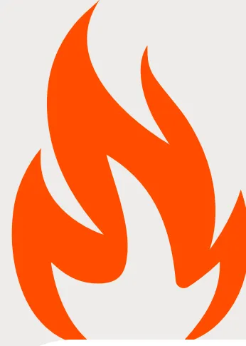
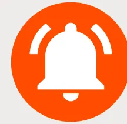
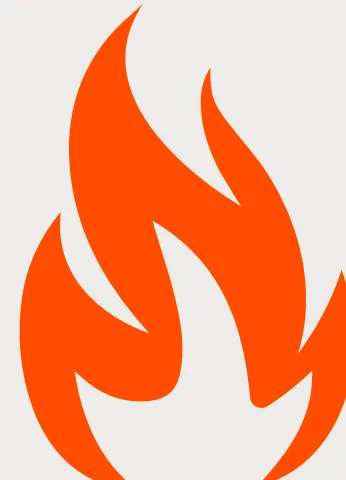
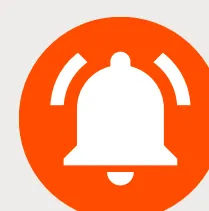
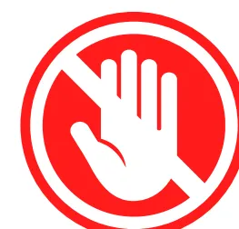
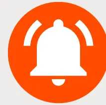

# RECOMMANDATIONS INCENDIES EN FRANCE

Fiche réflexe spécifique de médecine de catastrophe face à un feu de forêt destinée aux intervenants/bénévoles non sapeurs-pompiers.

## RÈGLE D'OR : ON NE S'AUTO-ENGAGE PAS SEUL

### Avant le départ

- • **Ne jamais intervenir seul**, rester en binôme avec surveillance mutuelle
- • Toujours connaître la zone refuge et la voie d'évacuation
- • Informer quelqu'un de sa localisation
- • Vérifier les moyens de communication. Attention aux défauts de couverture GSM (bornes relais détruites, coupures électriques)
- • Vérifier la météo (vent, température)

### Vêtements

- • Manches longues, pantalon long et chaussettes en **coton épais ou laine 100%**
- • Chaussures montantes en cuir à semelle épaisse
- • Gants de cuir non enduit
- • Casque (idéalement casque forestier; à défaut casque de chantier)
- • **Lunettes enveloppantes**
- • Tour de cou en coton, légèrement humidifié — ni sec ni détremapé
- • **Retirer** : lentilles de contact (à remplacer par des lunettes avec montures non métalliques), bijoux métalliques : bagues, colliers, boucles d'oreilles, piercing, montre métallique...

### Protection respiratoire

- • Attention : le port du masque peut être faussement rassurant et inciter à se rapprocher en prenant des risques. Se rappeler que les masques FFP1 et FFP2 sont inflammables.
- • Le port d'un masque se fait sur avis des professionnels pompiers

### Points spécifiques

- • Crème solaire SPF 50+, Baume pour les lèvres
- • Protection de la nuque
- • Lampe frontale
- • Batterie externe pour téléphone ou radio
- • Lingettes humides
- • Protection auditive si proximité des hélicoptères et avions bombardiers d'eau

*L'exposition volontaire à un incendie est à très haut risque de lésions sévères et ne doit être réalisée que en collaboration avec les services de secours professionnels. Les secours professionnels sont formés et équipés pour l'exposition à ce risque.*

# RECOMMANDATIONS INCENDIES EN FRANCE

Fiche réflexe spécifique de médecine de catastrophe face à un feu de forêt destinée aux intervenants/bénévoles non sapeurs-pompiers.

## RÈGLE D'OR : ON NE S'AUTO-ENGAGE PAS SEUL

### Au niveau du feu

#### Hydratation

- • Environ 0,5 à 1 Litre par heure mais jamais 1 Litre en une fois
- • Boisson avec électrolytes (type boisson pour sportifs d'endurance) pour compenser les pertes en sel
- • Sel = Sodium (chips, jambon sec, biscuits type TUC )
- • Viser une boisson à 400-600 mg de sodium/L, ou eau + aliments salés

#### Nutrition

##### **Toutes les 3 heures :**

- • Fruits secs ou fruits frais
- • Aliments salés
- • Glucides complexes: riz, blé, avoine ...
- • Barres énergétiques type sport d'endurance

- • **Pas d'alcool**
- • **Pas de repas gras.**

#### Repos

Toutes les heures, si température >38°C

- • 10 minutes en zone d'ombre (à l'abri d'un camion)

Après plusieurs heures :

- • Période prolongée en zone fraîche (sas de repos)
- • Recharger téléphone + batterie externe
- • Véhicule garé en marche avant, sortie dégagée, réservoir plein, clés sur soi

#### Protection des yeux

- • Lunettes fermées
- • Larmes artificielles sans conservateur: 1 goutte/oeil toutes les 2-4 heures
- • Lavage au sérum physiologique 2 fois/jour
- • Lavage face et yeux toutes les deux heures (lingettes humides ou eau)
- • Ne pas porter de lentilles de contact

*L'exposition volontaire à un incendie est à très haut risque de lésions sévères et ne doit être réalisée que en collaboration avec les services de secours professionnels. Les secours professionnels sont formés et équipés pour l'exposition à ce risque.*

# RECOMMANDATIONS INCENDIES EN FRANCE

**Fiche réflexe spécifique de médecine de catastrophe face à un feu de forêt destinée aux intervenants/bénévoles non sapeurs-pompiers.**

## **RÈGLE D'OR : ON NE S'AUTO-ENGAGE PAS SEUL**

### **Gestion de la chaleur**

- • Refroidissement actif pendant les pauses
- • Serviettes humides
- • Packs froids nuque/aisselles
- • Vêtements ouverts uniquement en zone sécurisée

### **Oxygène pendant les pauses : se fier aux symptômes d'auto-évaluation**

- • Si intoxication suspectée au CO = monoxyde de carbone
- • Si SpO2 basse ( Saturation en oxygène)
- • Si symptômes neurologiques: confusion, agitation, vertiges, nausées
- • Si gêne respiratoire, essoufflement

### **Cyanokit® : se fier aux symptômes d'auto-évaluation**

Les recommandations internationales ne préconisent pas un usage prophylactique. Le Cyanokit® est réservé :

- • Suspicion d'intoxication sévère aux cyanures
- • Fumées d'incendie en espace clos (bénévoles aidant les pompiers au niveau des maisons en feu)

### **Santé mentale**

- • Briefing/debriefing quotidien
- • Binôme obligatoire
- • Surveillance des signes de stress avec psychologue (au niveau zone de repos)
- • Suivi à quelques semaines si mission prolongée ou événement traumatique. consultation médicale à prévoir par la coordination.

### **Au retour à la maison ou espace dédié de repos**

- • Surveillance des brûlures des mains et des chevilles, souvent sous-estimées ;
- • Changement de vêtements contaminés par les fumées dès la fin de la journée ;
- • Déshabillage en extérieur en limitant contact et inhalation des vêtements, douche rapide après l'intervention afin de limiter l'exposition cutanée aux produits de combustion.

**Ce que cette fiche ne remplace pas** : Les consignes de la préfecture, du commandant des opérations de secours et des forces de l'ordre — qui priment en toutes circonstances et évoluent d'heure en heure. En cas de contradiction avec ce document, ce sont elles qui s'appliquent. Document à visée d'information. Rédigé le 27 juillet 2026.# AUTO-ÉVALUATION

- Ai-je bu ?
- Ai-je mangé ?
- Ai-je uriné ?
- Ai-je changé de masque si nécessaire ?
- Ai-je changé de vêtements humides ?
- Suis-je fatigué ?
- Ai-je mal à la tête ?
- Suis-je essoufflé ?
- Ai-je les yeux irrités ?
- Ai-je prévenu quelqu'un de ma localisation ?

The SFAR logo consists of three abstract shapes: a red teardrop-like shape at the top, a teal circle at the bottom, and the letters 'SFAR' in a dark blue sans-serif font to the right of the teal circle.

## Si apparition à tout moment

- • Céphalées (maux de tête importants et nouveaux)
- • Vertiges, nausées
- • Confusion (perte des idées claires, difficulté de se situer dans le temps et dans le lieu)
- • Faiblesse
- • Gêne respiratoire, essoufflement

**Alors RETRAIT IMMEDIAT de zone et repos en zone repos, avec traitements et oxygène.**

A white circle containing a red question mark.

## RECONNAÎTRE UNE INTOXICATION AU CO

Céphalées, nausées, vertiges, troubles visuels, confusion, asthénie brutale. Le tableau est superposable à un épuisement lié à la chaleur — le discriminant utile : plusieurs personnes du même groupe touchées simultanément, et amélioration franche en air libre. En cas de doute : sortir de la zone, oxygène, 15 / 112.

### Personnes à risque

Asthme, BPCO, insuffisance respiratoire chronique, coronaropathie, insuffisance cardiaque, grossesse : pas d'engagement en zone exposée aux fumées. Si engagement en base arrière : traitement de secours sur soi (bronchodilatateur de courte durée d'action, dérivé nitré), seuil de retrait très bas, FFP2 systématique.

### Symptômes différés

Toux sèche, oppression thoracique et irritation oculaire peuvent apparaître ou persister 24 à 72 h après l'exposition. Consulter en cas de dyspnée, de douleur thoracique, de malaise, ou d'expectoration noirâtre persistante. Rinçage abondant à l'eau claire des yeux, du visage et de la peau en cas de symptôme cutané ou oculaire.