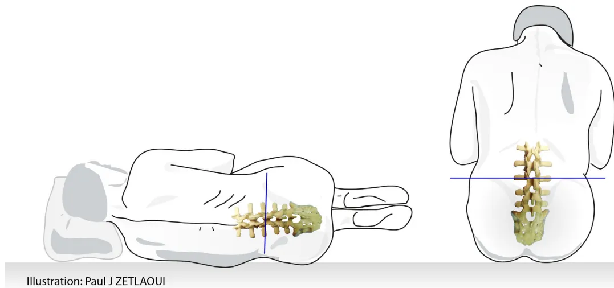

## Fiche mémo

# Prévention et prise en charge des effets indésirables pouvant survenir après une ponction lombaire

Juin 2019

La ponction lombaire (PL) est un acte diagnostique ou thérapeutique fréquent, invasif, réalisable par tout médecin. Elle est à risque d'événements indésirables, exceptionnellement graves, et d'échecs dont la majorité serait évitable. Pour cela, il est nécessaire que tout médecin connaisse l'anatomie, les contre-indications, la technique de PL, le matériel utilisable, les événements indésirables et leur prévention.

### Messages clés

- → La PL est un acte médical indispensable et très fréquent.
- → Le refus explicite ou présumé du patient et les contre-indications formelles doivent être pris en considération (hypertension intracrânienne, infections au point de ponction, thrombopénie sévère) avant toute PL.
- → Les complications graves sont exceptionnelles.
- → Le syndrome post-PL est l'effet indésirable le plus fréquent. S'il n'est habituellement pas grave, il est invalidant et engendre coûts personnel, social et financier.
- → Il est recommandé d'utiliser une aiguille atraumatique « à extrémité non tranchante », avec introducteur, quelle que soit l'indication de la ponction lombaire réalisée, et ce chez l'adulte comme en pédiatrie.
- → Il est recommandé aux médecins de se former à la pratique du geste de la PL, ainsi qu'à l'utilisation des aiguilles atraumatiques avec introducteur, et de se faire accompagner pour la réalisation des premières PL sur le patient, aussi souvent que nécessaire.
- → Le respect des règles de procédure et l'utilisation des aiguilles atraumatiques diminuent significativement l'incidence des effets indésirables et le recours au *blood-patch*.
- → Le *blood-patch* est le traitement le plus performant du syndrome post-PL, mais c'est un acte invasif qui peut être responsable de complications iatrogènes, exceptionnellement graves.
- → Le repos forcé au lit et l'hyperhydratation n'ont pas d'indication.
- → La PL et le *blood-patch* sont des gestes invasifs avec risque d'accident d'exposition au sang, les aiguilles doivent être collectées dans un conteneur prévu à cet effet.## Dans quels cas une ponction lombaire peut être réalisée

Les indications évoluent constamment avec le développement des connaissances et des techniques. Les indications suivantes sont donc listées à titre indicatif et de manière non exhaustive.

### → Indications diagnostiques :

- • suspicion d'infection du système nerveux central (bactérienne, virale, parasitaire) ;
- • survenue d'une céphalée brutale et/ou atypique (hémorragie méningée, thrombophlébite, dissection vasculaire, etc.) ;
- • suspicion d'une méningite carcinomateuse ou d'un syndrome paranéoplasique ;
- • bilan de maladies inflammatoires affectant le système nerveux central (sclérose en plaques, sarcoïdose, vascularite, encéphalite auto-immune, etc.) ;
- • bilan d'une neuropathie aiguë ou chronique (syndrome de Guillain-Barré, neuropathie périphérique, etc.) ;
- • maladies neurodégénératives (maladie d'Alzheimer, sclérose latérale amyotrophique, maladie à corps de Lewy, etc.) ;
- • mesure de pression du liquide cérébro-spinal (LCS) en cas de suspicion de troubles de la cinétique du LCS (hydrocéphalie à pression normale, hypertension intracrânienne idiopathique).

### → Indications thérapeutiques :

- • ponction lombaire évacuatrice : hydrocéphalie à pression normale, après interventions neurochirurgicales ;
- • rachianesthésie ;
- • recherche clinique.

## Dans quels cas une ponction lombaire ne doit pas être réalisée

Outre le refus explicite ou présumé du patient, les contre-indications formelles sont les suivantes.

- → Hypertension intracrânienne en raison du risque d'engagement cérébral (la normalité d'un examen neurologique minutieux permet de se passer de l'imagerie) :
  - • processus expansif intracrânien ;
  - • malformation d'Arnold-Chiari.

- → Infections au point de ponction.

- → Thrombopénie sévère : nombre de plaquettes inférieur à 50 G.L-1 (50 000/mm3 de sang).

Pour un certain nombre de pathologies (thrombopénie gestationnelle, purpura thrombopénique immunologique), une thrombopénie stable  $\geq 30$  G.L-1 peut être tolérée. À l'inverse, une thrombopénie évolutive non stabilisée nécessite l'évaluation pluridisciplinaire du rapport bénéfice/risque.

- → Troubles de la coagulation ou traitements modifiant l'hémostase.

La survenue d'un hématome périural ou sous-arachnoïdien après une PL est exceptionnelle, presque toujours liée à la présence d'un ou plusieurs facteurs de risque.

Ces facteurs sont : un traitement anticoagulant à dose thérapeutique ou antiplaquettaire (sauf aspirine et anti-inflammatoires non stéroïdiens [AINS]), un trouble congénital ou acquis de la coagulation ou de l'hémostase primaire, une ponction difficile, traumatique ou sur un rachis pathologique (spondylarthrite ankylosante, par exemple).

En cas d'urgence, l'antagonisation du traitement anticoagulant si elle est possible, ou la substitution du déficit en facteurs de la coagulation (hémophilie par exemple), si elle est nécessaire, doit être réalisée.## Modalités de réalisation de la ponction lombaire

La PL doit être réalisée dans le cadre d'une hospitalisation (la réalisation de la PL ne justifie pas, à elle seule, une hospitalisation de plus de 24 heures).

### Installation du patient

Le choix de la position assise ou allongée est laissé à l'appréciation du médecin et du patient.

Illustration: Paul J ZETLAOUI

### Détermination du point de ponction

Les niveaux corrects de ponction sont les espaces interépineux L3-L4, L4-L5 et L5-S1.

La détermination de l'espace interépineux à ponctionner est en pratique clinique plus difficile que classiquement décrit. Il est recommandé de ponctionner en dessous de la ligne horizontale tracée entre les crêtes iliaques.

En cas de difficulté, la PL peut être réalisée sous imagerie (radioscopie, échographie).

### Asepsie

**Les règles d'asepsie chirurgicale doivent être absolument respectées :**

- • pour le patient : désinfection cutanée en deux temps avec un antiseptique (antiseptique alcoolique) et utilisation d'un champ stérile ;
- • pour le médecin : désinfection des mains (solution hydro-alcoolique), masque facial, et gants stériles.

### Anesthésie locale

La pose d'un patch d'anesthésique local peut être proposée au patient en dehors de l'urgence (délai d'1 heure).

Dans les cas prévisibles de ponction difficile, une anesthésie locale peut être envisagée.

### Réalisation de la ponction

**Quelle que soit l'indication de la PL, la technique et les modalités de réalisation restent identiques.**

Il est recommandé de réaliser la ponction avec une aiguille atraumatique « à extrémité non tranchante », d'un diamètre maximal de 22 Gauge (code couleur noir). À noter que plus la Gauge est élevée, plus l'aiguille est fine, et inversement.

Il est indispensable d'utiliser l'introducteur fourni avec l'aiguille pour franchir la peau.

Il est recommandé aux médecins de se former à l'utilisation des aiguilles atraumatiques avec introducteur.

...## Modalités de réalisation de la ponction lombaire (suite)

### Réintroduction du mandrin

Il est recommandé de réintroduire complètement le mandrin dans l'aiguille avant de la retirer.

### Prélèvements

L'incidence des syndromes post-PL immédiats augmente pour un volume prélevé supérieur à 30 ml.

### Prévention des accidents d'exposition au sang

La PL est un geste invasif avec risque d'accident d'exposition au sang, les aiguilles doivent être collectées dans un conteneur à disposition et prévu à cet effet.

## Formation

La PL est un geste invasif nécessitant une bonne connaissance de l'anatomie, mais également de la pratique du geste.

Ainsi, la formation pratique à la PL par simulation est recommandée :

- • avant tout premier geste (ce type de formation a démontré son efficacité et est généralement assuré pendant les études médicales sur les plateformes de simulation universitaires) ;
- • pour tout médecin dans le cadre de la mise à jour des conditions de pratique de la PL ;
- • pour tout médecin ayant réalisé peu ou pas de PL ;
- • dans le cadre de l'accréditation des médecins et des équipes.

Après formation par simulation, il est recommandé que le médecin soit accompagné pour la réalisation des premières PL sur le patient aussi souvent que nécessaire.

## Effets indésirables de la ponction lombaire

La PL est parfois responsable d'effets indésirables : syndrome post-PL (syndrome d'hypotension intracrânienne), hématomes, infections, douleurs lombaires, voire paraplégie ou décès de manière très exceptionnelle.

### Syndrome post-PL

Le syndrome post-PL, secondaire à une fuite persistante de LCS, se caractérise par une céphalée orthostatique. Apparaissant habituellement dans les 2 à 4 jours après une PL (mais parfois plus tardive), elle est apyrétique, partiellement ou totalement soulagée par le décubitus dorsal.

La céphalée est classiquement bilatérale, occipitale, occipito-frontale ou diffuse, irradiant dans la nuque, le dos et parfois aux épaules.

...## Effets indésirables de la ponction lombaire (suite)

Parfois isolée, elle est habituellement accompagnée d'un cortège variable de signes cliniques, dont les plus fréquents sont :

- • nausées et vomissements ;
- • signes auditifs ou visuels : hypoacousie (rarement hyperacousie), diplopie par atteinte de la VIe paire. La photophobie fait partie du tableau clinique classique.

Un syndrome post-PL atypique, ou dont la symptomatologie se modifie, nécessite un avis spécialisé.

Il existe des cas exceptionnels de syndrome post-PL sans céphalée (ex. : vertiges ou troubles auditifs isolés).

L'incidence du syndrome post-PL peut être minorée par l'application de mesures simples. L'utilisation d'aiguilles atraumatiques permet de diminuer de manière significative l'incidence et l'intensité du syndrome post-PL (incidence inférieure à 10 % en cas d'utilisation d'aiguilles atraumatiques alors qu'elle peut aller jusqu'à 35 % en cas d'utilisation d'aiguilles traumatiques).

### Hématomes

Les hématomes sont très exceptionnels. Ils peuvent être périmédullaires ou intracrâniens. Ils sont favorisés par les troubles de la coagulation, les traitements modifiant l'hémostase et les ponctions multiples.

Quelle que soit la localisation, il s'agit d'une urgence diagnostique et thérapeutique qui nécessite une imagerie et un avis spécialisé.

### Infections

Exceptionnelles et liées au non-respect des règles d'asepsie, elles peuvent se manifester sous forme de méningite, d'abcès au point de ponction, de spondylodiscite, etc.

### Douleurs lombaires

Possibles après PL, elles sont habituellement banales.

## Signes d'alerte de complications graves

Après une PL, l'apparition de signes cliniques nouveaux doit conduire à une prise en charge diagnostique et thérapeutique en urgence.

Ces signes d'alerte sont les suivants :

- • fièvre ;
- • signe neurologique (syndrome complet ou incomplet de la queue-de-cheval, diplopie, déficit sensitif et/ou moteur, trouble de conscience, confusion, crise d'épilepsie, coma, etc.) ;
- • modification du caractère postural de la céphalée post-PL.

La baisse de l'acuité visuelle doit faire évoquer une autre étiologie car il s'agit d'une complication exceptionnelle.## Blood-patch

Le *blood-patch* consiste en l'injection de sang autologue (du patient lui-même) dans l'espace péridural pour colmater la brèche méningée.

Il s'agit du traitement le plus efficace en cas de non-guérison spontanée du syndrome post-PL dans les 48 à 72 heures.

Le *blood-patch* doit être envisagé après échec des traitements non invasifs et réalisé :

- • dans des conditions d'asepsie chirurgicale, par un médecin expérimenté ;
- • au cours d'une hospitalisation (la réalisation d'un *blood-patch* ne justifie pas, à elle seule, une hospitalisation de plus de 24 heures) ;
- • possiblement en hôpital de jour, en garantissant un temps de surveillance et de décubitus pour le patient d'au moins 2 heures.

En cas d'inefficacité immédiate ou de récidive à distance, un 2e *blood-patch* est possible ; mais pas de 3e *blood-patch* sans imagerie (imagerie par résonance magnétique [IRM] et avis spécialisé).

Le *blood-patch* est un geste invasif avec risque d'accident d'exposition au sang, les aiguilles doivent être collectées dans un conteneur à disposition et prévu à cet effet.

## Spécificités pédiatriques

Le syndrome post-PL existe chez l'enfant et doit faire l'objet d'une prévention. Le taux de succès de la PL chez l'enfant est lié à plusieurs facteurs tels que le positionnement de l'enfant, le choix de l'aiguille ou encore l'analgésie.

### Installation du nourrisson/de l'enfant

Chez le nourrisson, la position assise sans flexion de hanche et sans flexion de nuque permet de dégager le plus large espace intervertébral avec la meilleure tolérance hémodynamique.

Chez l'enfant, la position assise ou allongée peut être choisie, comme chez l'adulte.

### Choix de l'aiguille

Sont recommandées en première intention les aiguilles dites atraumatiques « à extrémité non tranchante », de 22 à 27 Gauge. Certaines s'utilisent sans introducteur (22, 24 et 25 Gauge) et d'autres avec introducteur (22, 25 et 27 Gauge).

Il est recommandé aux médecins de se former à l'utilisation des aiguilles atraumatiques avec introducteur.

L'utilisation des aiguilles dites traumatiques à biseau tranchant doit rester exceptionnelle.

### Angle de pénétration

L'angle de pénétration de l'aiguille permettant d'accéder le plus efficacement au LCS est compris entre 50° et 60°. Un repérage échographique (lorsqu'il est disponible) permet un taux de succès plus important.

### Analgésie

Le choix de l'analgésie est un point clé de la réussite du geste de la PL en pédiatrie. Sont à disposition :

- • la crème anesthésiante associant lidocaïne et prilocaine, à appliquer 1 heure avant (donc en dehors de l'urgence à réaliser la PL), quel que soit l'âge (sauf chez le prématuré d'âge post-conceptionnel inférieur à 37 semaines) ;
- • le sérum glucosé 30 % *per os* chez le nourrisson jusque 6 mois ;
- • l'inhalation d'un mélange équimolaire d'oxygène et de protoxyde d'azote, à tout âge ;
- • des traitements anxiolytiques et antalgiques en intra-rectal ou des morphiniques *per os*, pour une PL programmée ou des antécédents de vécu douloureux.

...## Spécificités pédiatriques (suite)

### Syndrome post-PL

La présentation clinique du syndrome post-PL chez l'enfant est identique à celle de l'adulte avec une incidence de 2 à 15 % selon les études.

Cependant, chez le nourrisson, le diagnostic reste difficile en l'absence de critère diagnostique spécifique.

### Prévention du syndrome post-PL

L'utilisation d'aiguilles atraumatiques chez l'enfant montre une diminution de l'incidence du syndrome post-PL mais elle doit faire l'objet de formations auprès des médecins.

En cas d'utilisation d'aiguilles traumatiques, les éléments suivants sont associés à un risque moins important de syndrome post-PL chez l'enfant :

- • une aiguille de petit diamètre (22 Gauge et plus) ;
- • la position du biseau parallèle à l'axe du rachis ;
- • la réintroduction du mandrin avant retrait de l'aiguille.

Il n'y a pas d'indication à l'alitement strict après la PL chez l'enfant.

### Prise en charge du syndrome post-PL chez l'enfant

En cas de syndrome post-PL avéré, le traitement conservateur est recommandé en première intention (antalgiques). Le repos au lit n'est pas obligatoire. L'efficacité de l'hyperhydratation n'est pas prouvée.

Comme chez l'adulte, le seul traitement ayant montré son efficacité en cas de syndrome post-PL persistant et/ou sévère est le *blood-patch* (les indications du *blood-patch* chez l'enfant restent rares).

The logo of the Haute Autorité de Santé (HAS) is centered at the bottom of the page. It consists of the letters 'HAS' in a bold, blue, sans-serif font. A red swoosh or underline is positioned beneath the 'A' and 'S', extending slightly to the left.