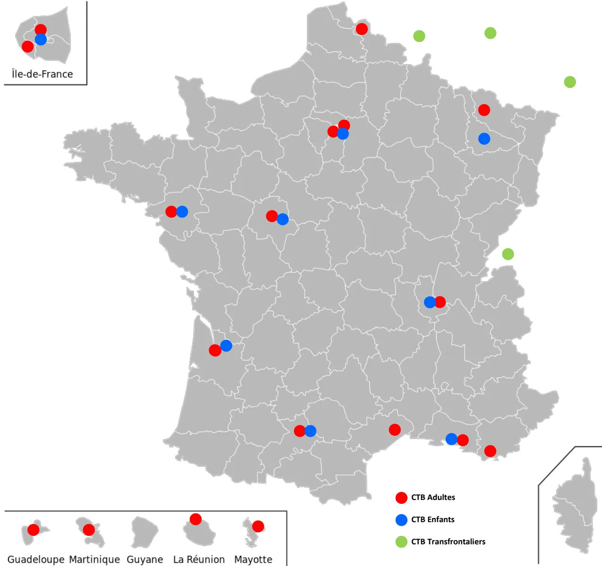

<table border="1">
<thead>
<tr>
<th colspan="4"><b>Centres de Traitement des Brûlés Adultes Métropole</b></th>
</tr>
</thead>
<tbody>
<tr>
<td><b>Bordeaux</b></td>
<td><b>CHU Bordeaux Pellegrin</b></td>
<td>Place Raba Léon 33000 BORDEAUX</td>
<td><b>05 56 79 54 62</b></td>
</tr>
<tr>
<td><b>Lille</b></td>
<td><b>CHU Lille Salengro</b></td>
<td>Boulevard du Pr Leclerc 59037 LILLE</td>
<td><b>03 20 44 42 78</b></td>
</tr>
<tr>
<td><b>Lyon</b></td>
<td><b>HCL Centre de Traitement des Brûlés de Lyon Pierre Colson</b></td>
<td>5 Place D'Arsonval 69003 LYON</td>
<td><b>04 72 11 75 98</b></td>
</tr>
<tr>
<td><b>Marseille</b></td>
<td><b>APHM Conception</b></td>
<td>147 Boulevard Baille 13005 MARSEILLE</td>
<td><b>04 91 43 58 18</b></td>
</tr>
<tr>
<td><b>Metz</b></td>
<td><b>CHR Metz-Thionville Mercy</b></td>
<td>1 Allée du Château 57085 METZ</td>
<td><b>03 87 55 31 45</b> <b>03 87 55 31 35</b></td>
</tr>
<tr>
<td><b>Montpellier</b></td>
<td><b>CHU Montpellier Lapeyronie</b></td>
<td>371 Avenue Doyen Gaston Giraud 37295 MONTPELLIER Cedex 5</td>
<td><b>04 67 33 84 36</b> <b>04 67 33 82 28</b></td>
</tr>
<tr>
<td rowspan="2"><b>Nantes</b></td>
<td><b>CHU Nantes PTMC</b></td>
<td>Boulevard Jean Monet 44000 NANTES</td>
<td><b>02 40 08 73 12</b></td>
</tr>
<tr>
<td><b>CHU Nantes Hôtel Dieu</b></td>
<td>Place Alexis Ricordeau 44093 NANTES</td>
<td><b>02 40 08 73 26</b></td>
</tr>
<tr>
<td rowspan="2"><b>Paris Ile de France</b></td>
<td><b>APHP Paris Saint Louis</b></td>
<td>1 Avenue Claude Vellefaux 75010 PARIS</td>
<td><b>01 42 49 90 94</b></td>
</tr>
<tr>
<td><b>HIA Percy</b></td>
<td>2 Rue du Lieutenant Raoul Batany 92140 CLAMART</td>
<td><b>01 41 46 69 10</b> <b>01 41 46 67 31</b></td>
</tr>
<tr>
<td><b>Toulon</b></td>
<td><b>HIA Toulon Sainte Anne</b></td>
<td>2 Boulevard Sainte Anne 83800 TOULON</td>
<td><b>04 83 16 23 75</b> <b>04 83 16 23 62</b></td>
</tr>
<tr>
<td><b>Toulouse</b></td>
<td><b>CHU Toulouse Rangueil</b></td>
<td>1 Avenue Jean Poulhes 31000 TOULOUSE</td>
<td><b>05 61 32 27 43</b></td>
</tr>
<tr>
<td><b>Tours</b></td>
<td><b>CHU Tours Trousseau</b></td>
<td>Avenue de la République 37170 CHAMBRAY les TOURS</td>
<td><b>02 47 47 81 34</b></td>
</tr>
<tr>
<th colspan="4"><b>Centres de Traitement des Brûlés Enfants Métropole</b></th>
</tr>
<tr>
<td><b>Bordeaux</b></td>
<td><b>CHU Bordeaux</b></td>
<td>voir adultes</td>
<td>voir adultes</td>
</tr>
<tr>
<td><b>Lyon</b></td>
<td><b>HCL Centre de Traitement des Brûlés de Lyon Pierre Colson</b></td>
<td>5 Place D'Arsonval 69003 LYON</td>
<td><b>04 72 11 75 98</b></td>
</tr>
<tr>
<td><b>Marseille</b></td>
<td><b>APHM La Timone</b></td>
<td>264 Rue Saint Pierre 13005 MARSEILLE</td>
<td><b>04 91 38 68 40</b></td>
</tr>
<tr>
<td><b>Nancy</b></td>
<td><b>CHRU Nancy Brabois Hôpital d'Enfants</b></td>
<td>Rue du Morvan 54511 VANDOEUVE les NANCY</td>
<td><b>03 83 15 46 99</b></td>
</tr>
<tr>
<td><b>Nantes</b></td>
<td><b>CHU Nantes PTMC Réa Pédiatrique</b></td>
<td>Boulevard Jean Monnet 44000 NANTES</td>
<td><b>02 40 08 73 12</b></td>
</tr>
<tr>
<td><b>Paris</b></td>
<td><b>APHP Trousseau</b></td>
<td>26 Avenue du Dr Arnold Netter 75012 PARIS</td>
<td><b>01 44 73 62 54</b></td>
</tr>
<tr>
<td><b>Toulouse</b></td>
<td><b>CHU Toulouse Purpan SMC1</b></td>
<td>330 Avenue de Grande Bretagne TSA 734 31059 TOULOUSE cedex 9</td>
<td><b>05 34 55 84 72</b></td>
</tr>
<tr>
<td><b>Tours</b></td>
<td><b>CHU Tours Clocheville</b></td>
<td>49 Boulevard Béranger 37000 TOURS</td>
<td><b>02 47 47 37 59</b></td>
</tr>
<tr>
<th colspan="4"><b>Centres de Traitement des Brûlés DOM TOM</b></th>
</tr>
<tr>
<td><b>Guadeloupe</b></td>
<td><b>CHU Pointe à Pitre</b></td>
<td>97110 POINTE A PITRE GUADELOUPE</td>
<td><b>05 90 89 11 34</b></td>
</tr>
<tr>
<td><b>Martinique</b></td>
<td><b>Hôpital Pierre Zobda-Quitman Martinique</b></td>
<td>BP 632 97261 FORT-DE-FRANCE MARTINIQUE</td>
<td><b>05 96 55 20 45</b></td>
</tr>
<tr>
<td><b>La Réunion</b></td>
<td><b>CHRU Félix Guyon</b></td>
<td>Allée des Topazes 97400 LA REUNION</td>
<td><b>02 62 90 57 74</b></td>
</tr>
<tr>
<td><b>Mayotte</b></td>
<td><b>CH Mayotte</b></td>
<td>Rue de l'Hôpital 97600 MAMOUZOU</td>
<td><b>02 69 61 80 00 (poste 5340)</b></td>
</tr>
<tr>
<th colspan="4"><b>Centres de Traitement des Brûlés Transfrontaliers</b></th>
</tr>
<tr>
<td><b>Allemagne</b></td>
<td><b>Ludwigshafen</b></td>
<td>Ludwig-Guttmann Strasse 13 67 071 LUDWIGSHAFEN</td>
<td><b>+49 621 681 1802368</b></td>
</tr>
<tr>
<td rowspan="2"><b>Belgique</b></td>
<td><b>Charleroi</b></td>
<td>IMTR, Rue de Villers 1 6280 LOVERVAL</td>
<td><b>+32 71 10 60 00</b></td>
</tr>
<tr>
<td><b>Liège</b></td>
<td>CHU Sart Tilman, Av Hippocrate 1, B35 4000 LIEGE</td>
<td><b>+32 4 366 72 94</b></td>
</tr>
<tr>
<td><b>Suisse</b></td>
<td><b>Lausanne</b></td>
<td>CHU Vaudois Rue du Bugnon 46 1011 LAUSANNE</td>
<td><b>+41 79 55 65 295 (jour)</b> <b>+41 79 55 65 030 (nuit)</b></td>
</tr>
</tbody>
</table>

*Annexe 1 : liste des Centres de Traitement des Brûlés français et transfrontaliers*

The map displays the distribution of burn treatment centers across France. Red dots represent centers for adults, blue dots represent centers for children, and green dots represent cross-border centers. The map includes insets for the Île-de-France region, the overseas departments (Guadeloupe, Martinique, Guyane, La Réunion, Mayotte), and the overseas territories (Guadeloupe, Martinique, Réunion, Mayotte).

**Legend:**

- CTB Adultes (Red dot)
- CTB Enfants (Blue dot)
- CTB Transfrontaliers (Green dot)

**Overseas Territories Legend:**

- Guadeloupe (Red dot)
- Martinique (Red dot)
- Guyane (Grey outline)
- La Réunion (Red dot)
- Mayotte (Red dot)