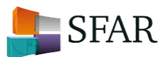
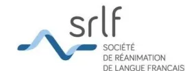

## Annexe 1 : Arbre diagnostique de l'anémie




```

graph TD
    Start["Hb < 13 g/dl Homme  
Hb < 12 g/dl Femme"]
    Start --> Retic1["Réticulocytes < 100 G/l  
non-régénératives"]
    Start --> Retic2["Réticulocytes > 100 G/l  
régénératives"]
    
    Retic1 --> VGM1["VGM < 80 fl  
microcytaires"]
    Retic1 --> VGM2["VGM 80-100  
normocytaire"]
    Retic1 --> VGM3["VGM > 100  
macrocytaire"]
    
    VGM1 --> BilanM["Bilan martial:  
- Ferritine < 100, TSAT < 20%  
- RetHe < 29 pg, % Hypo > 10%  
- Hepcidine* ↓"]
    BilanM -- oui --> CM["Carence Martiale"]
    BilanM -- non --> CM2["Anémie Inflammatoire  
Infection (parvovirus B19...)  
• Hémoglobinopathies,  
• saturnisme,  
• déficit B6..."]
    
    VGM2 --> Bilan2["Bilan :  
- Créatinine  
- CRP  
- Folate-B12#..."]
    Bilan2 --> CM2
    
    VGM3 --> Bilan3["Bilan :  
- TSH (±T4)  
- Folate – B12#"]
    Bilan3 --> CM3["Carence mixtes,  
• Insuffisance  
Rénale,  
• Endocrinopathies,  
• Myélodysplasies..."]
    Bilan3 --> CM4["Hypothyroïdie,  
Insuffisance rénale,  
Myélodysplasies,  
Médicaments..."]
    
    Retic2 --> BilanH["Bilan hémolyse  
- Schizocytes  
- Haptoglobine  
- LDH"]
    BilanH --> H["Hémolyse"]
    BilanH --> APH["Anémie post  
hémorragique..."]
    
    CM2 --> BC["Bilan complémentaire: myélogramme..."]
    CM3 --> BC
    CM4 --> BC
    
```

The flowchart starts with hemoglobin levels: Hb < 13 g/dl for men and Hb < 12 g/dl for women. It branches into two main categories based on reticulocyte count: non-regenerative (Reticulocytes < 100 G/l) and regenerative (Reticulocytes > 100 G/l). The non-regenerative branch further divides into microcytic (VGM < 80 fl), normocytic (VGM 80-100), and macrocytic (VGM > 100). Microcytic anemia leads to a martial blood test (ferritin, TSAT, RetHe, Hepcidine). If positive, it's iron deficiency; if negative, it leads to inflammatory anemia/infection (parvovirus B19) or other causes like hemoglobinopathies, saturnism, or B6 deficiency. Normocytic and macrocytic anemias lead to specific blood tests (creatinine, CRP, Folate-B12, TSH, Folate-B12) and lead to mixed deficiencies, renal insufficiency, endocrinopathies, myelodysplasias, hypothyroidism, renal insufficiency, myelodysplasias, or medications. The regenerative branch leads to a hemolysis blood test (schizocytes, haptoglobin, LDH), leading to hemolysis or post-hemorrhagic anemia. All specific diagnostic paths lead to a complementary blood test: myelogramme.

L'arbre diagnostique de l'anémie est donné ici à titre indicatif.

\* l'hepcidine n'est pas encore disponible en pratique courante.

# l'OMS définit la carence en folate comme un taux de folates sérique < 10 nmol/L (4.4 µg/L) ou un taux de folates érythrocytaires, qui reflète le statut à long terme et les réserves tissulaires, < 305 nmol/L (< 140 µg/L). Pour la carence en vitamine B12, un taux sérique < 150 pmol/L (< 203 ng/L) indique une carence, un taux supérieur ne l'élimine pas et il faut alors faire un dosage sanguin d'acide méthylmalonique (un taux > 271 nmol/L est en faveur de carence en vitamine B12).