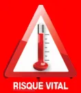
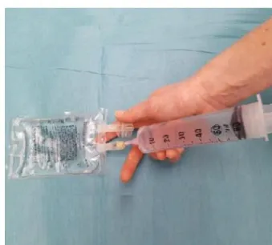
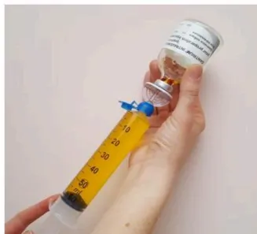
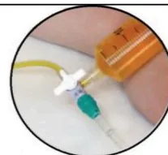

# Recommandations de Pratiques Professionnelles


Actualisation de recommandations

## Prise en charge de l'Hyperthermie Maligne

2019

Société Française d'Anesthésie et de Réanimation

*Ce document est une mise à jour des Recommandations d'Experts pour le risque d'HYPERTHERMIE MALIGNE en anesthésie-réanimation de septembre 2013.*

*Texte validé par le Comité des Référentiels Cliniques de la SFAR le 30/05/2018 et par le Conseil d'Administration de la SFAR le 21/06/2018.*

### **Auteurs et groupe d'Experts de la SFAR :**

Pr Renée KRIVOSIC-HORBER - Centre Hyperthermie Maligne - CHRU de LILLE  
Dr Anne-Frédérique DALMAS - Centre Hyperthermie Maligne - CHRU de LILLE  
Dr Béatrice BRUNEAU - Centre Hyperthermie Maligne – Hôpital Robert Debré (Paris)  
Dr Florence JULIEN-MASQUELIER - Centre Hyperthermie Maligne – Hôpital Robert Debré (Paris)

### **Organisation**

Dr Marc Garnier, Comité des Référentiels Cliniques de la SFAR

### **Auteur pour correspondance :**

Dr Anne-Frédérique DALMAS - Centre Hyperthermie Maligne - CHRU de LILLE (anne-frederique.dalmas@chru-lille.fr ; unite.hyperthermiemaligne@chru-lille.fr)

### **Groupe de Lecture :**

*Comité des Référentiels clinique de la SFAR :* Lionel Velly (Président), Marc Garnier (Secrétaire), Julien Amour, Alice Blet, Gérald Chanques, Vincent Compère, Philippe Cuvillon, Fabien Espitalier, Etienne Gayat, Hervé Quintard, Bertrand Rozec, Emmanuel Weiss## Définition

L'Hyperthermie Maligne (HM) est définie comme une réponse anormale aux agents anesthésiques halogénés et/ou au curare dépolarisant chez des personnes présentant une anomalie génétique affectant le muscle strié squelettique.

### **Question 1. Dépistage des patients à risque d'hyperthermie maligne en consultation d'anesthésie.**

**R1.1 Les experts suggèrent de dépister les patients à risque d'hyperthermie maligne en consultation d'anesthésie selon l'arbre décisionnel de la figure 1.**

**R1.2 Pour tout patient présentant une notion d'antécédent d'hyperthermie maligne au cours d'une précédente anesthésie (à titre personnel ou familial), non encore exploré, les experts suggèrent que l'anesthésiste contacte l'un des centres experts « Hyperthermie Maligne » (Cf. Annexe 1 en fin de document) afin de préciser le risque réel par des investigations appropriées.**

**R1.3 Les experts suggèrent qu'en dehors de l'anesthésie, l'évaluation du risque d'hyperthermie maligne chez les patients à risque et les membres de leur famille et la décision d'investigations complémentaires fassent l'objet d'une réflexion pluridisciplinaire associant anesthésiste, expert de l'hyperthermie maligne, généticien, neurologue et le patient lui-même.**

Sont considérés comme patients à risque d'hyperthermie maligne : les patients atteints de myopathies congénitales à cores et myopathies apparentées associées au gène RYR1, les sujets présentant une élévation chronique inexpliquée des CPK, une hyperthermie grave d'effort ou une rhabdomyolyse grave d'effort.

Les antécédents de syndrome malin des neuroleptiques ne constituent pas une situation à risque d'HM anesthésique (1).

#### **Référence**

1. Adnet P, Lestavel P, Krivoscic-Horber R. Neuroleptic malignant syndrome. *Br J Anaesth.* 2000 Jul;85(1):129-35```

graph TD
    A[Antécédent d'HM per-anesthésique] --> B[Oui]
    A --> C[Non]
    B --> D[Personnel]
    B --> E[Familial  
(lien de parenté ?)]
    D --> F[Document HM disponible ?]
    E --> F
    F --> G[Non]
    F --> H[Oui]
    G --> I[Considérer le patient à risque HM]
    I --> J[Chirurgie urgente]
    H --> K[IVCT négatif = HM négatif]
    H --> L[Non]
    K --> M[Pas de risque HM]
    L --> M
    M --> N[Chirurgie urgente]
    M --> O[Chirurgie programmée]
    O --> P[Contacter centre HM]
    P --> Q[Chirurgie programmée]
    J --> R[Précautions anesthésiques HM]
    R --> S[IVCT positif ou présence de mutation HM = HM sensible]
    S --> R
    S --> Q
  
```

**Figure 1 : Dépistage du risque d'hyperthermie maligne en consultation d'anesthésie**

HM : Hyperthermie Maligne ; IVCT : In Vitro Contracture Tests

\* patient à risque HM : myopathies congénitales à cores et myopathies apparentées associées au gène RYR1, les sujets présentant une élévation chronique inexplicquée des CPK, une hyperthermie grave d'effort ou une rhabdomyolyse grave d'effort## Question 2. Comment réaliser le diagnostic de Sensibilité à l'Hyperthermie Maligne ?

**R2.1 Les experts suggèrent de préciser le diagnostic de sensibilité à l'hyperthermie maligne chez les sujets à risque par des « In Vitro Contracture Tests» (IVCT) sur biopsie musculaire, ou par analyse génétique de l'ADN extrait du sang périphérique.**

**La biopsie musculaire.** Le test de référence consiste à reproduire l'exposition pharmacologique aux agents déclenchants selon le protocole du Groupe Européen de l'HM (EMHG), sur des fragments de muscle fraîchement prélevés : ce sont les tests de contracture à l'halothane et à la caféine appelés « In Vitro Contracture Tests ». Les IVCT sont indiqués en première intention ou après un résultat négatif de l'analyse génétique. En effet, la sensibilité des IVCT est supérieure (99%) à celle de l'analyse de l'ADN extrait de sang périphérique (50%).

**L'analyse génétique.** Toute analyse génétique fait l'objet d'un encadrement juridique en France (décret d'application 2000-570) qui impose une consultation de conseil génétique au patient et le recueil de son consentement écrit pour l'analyse génétique à des fins médicales dont les résultats sont remis au médecin prescripteur.

Les mécanismes génétiques de la sensibilité HM sont principalement liés à des variations pathogènes (mutations) dans le gène *RYR1* (codant le canal  $Ca^{2+}$  du réticulum sarcoplasmique sensible à la ryanodine) et, beaucoup plus rarement, dans le gène *CACNA1S* (codant le canal  $Ca^{2+}$  voltage dépendant sensible à la dihydropyridine). Le criblage du gène *RYR1* peut être effectué sur ADN extrait de sang périphérique soit sur des régions ciblées, soit sur la totalité des exons. La recherche de mutations peut également être effectuée sur la totalité du transcript *RYR1* à partir d'un fragment de muscle.

Les explorations de *RYR1* montrent de très nombreuses variations responsables du remplacement d'un acide aminé par un autre (mutations faux sens), événement dont les conséquences moléculaires sont difficilement prévisibles, même avec l'aide de logiciels dédiés à la prédiction de la pathogénicité de variants génétiques. Le groupe européen de l'hyperthermie maligne (EMHG) a en conséquence émis des recommandations sur l'interprétation des variants de *RYR1* (site [www.emhg.org/genetics/](http://www.emhg.org/genetics/)). Une liste de mutations reconnues responsables d'HM est disponible sur ce site web.

Deux situations différentes pour l'analyse génétique sont à considérer :

### **1- Diagnostic de la sensibilité à l'HM par recherche de mutation dans le gène *RYR1*.**

Une telle recherche ne peut être initiée que sur indication clinique claire : crise d'HM documentée chez le patient (propositus : personne ayant présenté une crise suspecte d'HM à l'origine de l'étude génétique) . Si une mutation reconnue causale de sensibilité à l'HM est trouvée chez le propositus, cette personne doit être considérée à risque de développer une crise d'HM en cas d'exposition aux anesthésiques déclenchants (statut HM Sensible ou HMS) et une enquête familiale doit être initiée. En revanche, l'absence de mutation reconnue pathogène n'exclut pas le risque de sensibilité à l'HM puisque la personne peut être porteuse d'une anomalie génétique non détectée par le screening habituel.

Si la personne qui consulte est apparentée au propositus et que le sang du propositus n'est pas disponible parce qu'il est décédé ou qu'il refuse le prélèvement, la recherche de mutation HM peut également être proposée. La présence d'une mutation causale HM le classe HMS avec les conséquences sur le risque anesthésique pour lui et l'initiation d'une enquête familiale. Un résultat négatif est peu informatif.

En cas de détection de variations génétiques de *RYR1* ayant un impact clinique encore inconnu, il revient au laboratoire de génétique moléculaire d'émettre un avis documenté sur le variant (analyse de la bibliographie et des bases de données). Tout individu porteur d'unvariant de *RYR1* potentiellement associé à l'HM doit être considéré comme à risque HM jusqu'à preuve du contraire.

## **2-Test prédictif en cas de mutation familiale identifiée.**

Lorsqu'une mutation *RYR1* validée pour l'HM a été trouvée chez un patient ayant fait une crise documentée ou ayant des tests IVCT positifs (sensibilité à l'HM), cette mutation peut être recherchée chez les apparentés, pour la prédiction du risque HM dans la famille du patient atteint. Les apparentés porteurs de la mutation doivent être considérés comme sensibles à l'HM. Les apparentés non porteurs de la mutation ne peuvent être considérés sans risque d'HM car ils peuvent être porteurs d'une autre anomalie susceptible d'entraîner un risque d'HM. Dans ce cas, la réalisation de tests IVCT peut être discutée pour éliminer tout risque supplémentaire.

L'analyse génétique prédictive n'est pas recommandée chez les mineurs sauf en cas de bénéfice individuel direct.

## **Question 3. Comment réaliser une anesthésie chez un patient à risque d'hyperthermie maligne ?**

**R3.1 Les experts suggèrent de respecter trois principes absolus pour la conduite de l'anesthésie chez le patient à risque d'hyperthermie maligne :**

1. **1. Exclure tous les agents anesthésiques volatils halogénés, quels qu'ils soient, ainsi que le curare dépolarisant (suxaméthonium, succinylcholine, Célocurine®).**
2. **2. Disposer d'un monitoring de la capnographie et de la température centrale.**
3. **3. Vérifier avant l'induction anesthésique la disponibilité du protocole (affiche diagnostic et traitement de la crise HM ; fiche de reconstitution du dantrolène) et le libre accès au dantrolène injectable (stock dédié ou pharmacie).**

L'hospitalisation ambulatoire est possible.

La programmation du patient en première position est souhaitable pour éviter les vapeurs d'anesthésique volatil dans le bloc opératoire. La préparation du respirateur dépend du modèle. La purge par un flux de 10 L/min de gaz en circuit ouvert doit être effectuée pendant une durée variant entre 10 et 50 min suivant le type de respirateur, pour tenir compte des possibilités d'absorption des halogénés dans les circuits internes complexes (1). Les évaporateurs sont enlevés pour éviter une erreur de manipulation. Le risque d'HM sera introduit dans la check-list.

La prophylaxie par dantrolène per os ou IV n'a pas d'indication actuellement.

La technique anesthésique peut utiliser tous les anesthésiques locaux (y compris avec vasoconstricteurs), tous les hypnotiques intraveineux, morphiniques, curares non dépolarisants et le protoxyde d'azote.

La surveillance en SSPI doit porter sur la couleur des urines et la température corporelle.

Il n'a pas été publié de survenue de crise HM prouvée en respectant ces règles.

Un dosage de CPK préopératoire et postopératoire précoce peut être informatif pour le suivi du patient.

### **Référence**

1. 1. Kim TW. *Anesthesiology*. 2011, 114:205-12## Question 4. Comment résumer le diagnostic et le traitement de l'HM ?

**R4.1. Les experts suggèrent de disposer dans tous les lieux où sont réalisées des anesthésies générales d'une affiche « résumé » décrivant le diagnostic et le traitement de la crise d'hyperthermie maligne (Cf. Proposition d'affiche en Annexe 2 en fin de document).**

**R4.2. Les experts suggèrent que l'affiche « résumé » sur la gestion de la crise d'hyperthermie maligne comporte des informations claires et précises sur l'accès immédiat au stock de dantrolène et sur la procédure de reconstitution pour injection intra veineuse (Cf. Proposition d'affiche en Annexe 2 en fin de document).**

## Question 5. Que faire après une crise d'hyperthermie maligne ?

**R5.1. Les experts suggèrent lorsqu'une crise d'hyperthermie maligne a été suspectée cliniquement, de colliger dans un document tous les éléments survenus en faveur du diagnostic de crise d'hyperthermie maligne.**

L'ensemble de ces éléments sera d'une grande importance pour le diagnostic de confirmation et la décision d'investigations complémentaires après discussion avec un centre expert. Il est donc capital de les colliger de façon exhaustive : feuille d'anesthésie, cinétique d'apparition des signes par rapport à l'administration des médicaments potentiellement déclenchants, relevé des paramètres de surveillance (température, capnographie, etc.), résultats biologiques (CPK, etc.).

**R5.2. Les experts suggèrent de réaliser un dosage des CPK 12 heures et 24 heures après la crise d'HM, répété jusqu'à normalisation en cas de positivité.**

Un taux de CPK normal est un élément important contre le diagnostic de crise d'hyperthermie maligne. Un taux qui reste élevé après plusieurs jours, doit faire rechercher une myopathie sous-jacente.

**R5.3. Les experts suggèrent de systématiquement informer le patient et sa famille de la suspicion clinique d'hyperthermie maligne et de lui remettre un document relatant le protocole anesthésique et les signes ayant fait évoquer le diagnostic, et un document informant sur les conséquences du diagnostic (précautions anesthésiques pour les anesthésies ultérieures, risque familial basé sur la transmission autosomique dominante).**

**R5.4. Les experts suggèrent de prendre contact le plus rapidement possible après la crise avec un centre expert de l'hyperthermie maligne pour confirmer ou infirmer le diagnostic de crise d'hyperthermie maligne et de réaliser des investigations à visée diagnostique de la sensibilité HM.**## Références

Dépret T, Krivoscic-Horber R. **Hyperthermie maligne: nouveautés diagnostiques et cliniques.** Ann Fr Anesth Reanim, 2001, 20:838-52.

Y. Nivoche, B. Bruneau, S. Dahmani. **Quoi de neuf en hyperthermie maligne en 2012?** Ann Fr Anesth Reanim 2013, 32:43-47.

Krivoscic-Horber R, Monnier N, Dalmas A-F. hyperthermie maligne. **Traité d'anesthésie et de réanimation. Ed Lavoisier.** 4ème édition. 23 ; 330-338.## Annexe 1. Liste des centres français de diagnostic de l'hyperthermie maligne

![Map of France showing the locations of four French centers for malignant hyperthermia diagnosis. The map is divided into regions. Four colored dots are placed on the map: a purple dot in the north (Lille), an orange dot in the north (Lille), a purple dot in the center (Paris), and a cluster of two dots (one purple, one teal) in the south (Grenoble). A legend in the bottom left corner identifies the colors: purple for 'Conseil et Consultation Anesthésie', orange for 'Test diagnostique de contracture in vitro (IVCT)', and teal for 'Diagnostic génétique'. Callout boxes identify the centers: 'Centre HM : CHRU de Lille' (north), 'Centre HM : Hôpital Robert Debré, Paris' (center), 'Centre HM : CHU de Grenoble' (south), and 'Centre HM : Hôpital de la Timone, Marseille' (south, near the teal dot). The SFAR logo is in the top left corner.](bc5ef5a3425b52505098489ea2b6cd4b_2_img.webp)

### Centre HM de Lille : CHRU de Lille

#### Conseil, consultation d'anesthésie et centre de tests IVCT :

Dr Anne-Frédérique DALMAS

Secrétariat : Sandra BENVENUTI

Unité de diagnostic et de recherche sur l'hyperthermie maligne

Pôle d'Anesthésie-Réanimation

Centre des Maladies Rares Neuromusculaires

Hôpital Roger Salengro.

Centre Hospitalier Régional Universitaire, 59037 LILLE Cedex

Tel : 03.20.44.62.68 ou 03.20.44.40.74 (secrétariat)

Fax : 03.20.44.65.64

[anne-frederique.dalmas@chru-lille.fr](mailto:anne-frederique.dalmas@chru-lille.fr)

[unite.hyperthermiemaligne@chru-lille.fr](mailto:unite.hyperthermiemaligne@chru-lille.fr)

#### Génétique médicale : Dr Alexandre MOERMAN

Pôle Biologie Pathologie Génétique

[alexandre.moerman@chru-lille.fr](mailto:alexandre.moerman@chru-lille.fr)

### Centre HM de Paris : Hôpital Robert Debré

#### Conseil et consultation d'anesthésie :

Dr Béatrice BRUNEAU

Dr Florence JULIEN-MARSOLLIER

Unité de Chirurgie Ambulatoire et du Centre d'Hyperthermie Maligne de l'AnesthésieDépartement d'Anesthésiologie et Réanimation  
Hôpital Robert Debré. 48 Boulevard Sérurier 75019, Paris  
Université Paris Diderot, PRES Sorbonne Paris Cité  
Tel secrétariat: 01.40.03.22.68  
Tel Dr B. BRUNEAU : 01.40.03.22.82  
Tel Dr F. JULIEN-MARSOLLIER : 01.85.55.27.14  
[beatrice.bruneau@rdb.aphp.fr](mailto:beatrice.bruneau@rdb.aphp.fr)  
[florence.julien-marsollier@aphp.fr](mailto:florence.julien-marsollier@aphp.fr)

**Centre HM de Grenoble : CHU de Grenoble**

**Conseil et consultation d'anesthésie :**

Pr Jean-François PAYEN  
Pôle Anesthésie-Réanimation  
CHU Grenoble, 38043 Grenoble Cedex 9  
Secrétariat : Lydie ONORATI  
[Ionorati@chu-grenoble.fr](mailto:Ionorati@chu-grenoble.fr)  
Tel: 04.76.76.56.30  
Fax: 04.76.76.51.83

**Diagnostic génétique de l'HM :**

Dr Julien FAURE,  
Dr Nathalie ROUX-BUISSON  
Laboratoire de Biochimie Génétique et Moléculaire  
Institut de Biologie et Pathologie R+2  
CS 10217  
38043 GRENOBLE CEDEX 9  
Tél. 04.76.76.55.73  
Fax : 04.76.76.56.64  
[JFaure1@chu-grenoble.fr](mailto:JFaure1@chu-grenoble.fr)  
[NRouxbuisson@chu-grenoble.fr](mailto:NRouxbuisson@chu-grenoble.fr)

**Centre HM de Marseille : Hôpital de la Timone**

**Conseil et tests IVCT :**

Dr Catherine FOUTRIER MORELLO,  
Mme Corinne MARIE DIT MOISSON  
Faculté de médecine de la Timone  
Service : Mme Monique BERNARD  
CRMBM URM 7339 CNRS, 27 boulevard Jean Moulin, 13385 MARSEILLE cedex 5  
Tél et fax : 04.91.25.50.90 ou 04.91.32.48.05  
[catherine.morello@univ-amu.fr](mailto:catherine.morello@univ-amu.fr)  
[corinne.marie-dit-moisson@univ-amu.fr](mailto:corinne.marie-dit-moisson@univ-amu.fr)

**Génétique médicale :**

Dr Karine NGUYEN  
Hôpital d'enfants de la Timone  
Service Pr Nicole PHILIP, 13385 MARSEILLE cedex 5  
Tél : 04.91.38.67.34  
Fax : 04.91.38.46.04  
[karinesen.nguyenphong@ap-hm.fr](mailto:karinesen.nguyenphong@ap-hm.fr)# HYPERTHERMIE MALIGNE



## Agents déclenchants :

SEVORANE® (Sévoflurane), SUPRANE® (Desflurane), FORENE® (Isoflurane), FLUOTHANE® (Halothane)  
PENTHROX® (méthoxyflurane), CELOCURINE® (Suxaméthonium, Succinylcholine)

## SIGNES ÉVOCATEURS D'HYPERTHERMIE MALIGNE (HM)

Spasme des masséters  
Hypercapnie ( $\uparrow$ EtCO<sub>2</sub>)  
Tachypnée  
Acidose respiratoire

Tachycardie, arythmies  
Rigidité  
Hyperthermie, sueurs  
Urines rouges (myoglobinurie)

Acidose mixte  
Élévation des CPK  
Marbrures  
Coagulation intravasculaire

## SUGGESTIONS THÉRAPEUTIQUES

1/

Arrêter les agents volatils halogénés.  
Hyperventiler en oxygène 100% (2 à 3 fois le volume minute utilisé avant la crise HM), en circuit ouvert.

2/

Demander du renfort.

3/

Relais par des anesthésiques non déclenchants : propofol, morphinique  
Monitorer l'EtCO<sub>2</sub> et la température centrale. Réaliser un gaz du sang artériel et veineux.

4 /

Dantrolène injectable  
Flacons de 20 mg de poudre à diluer avec 60 mL d'eau stérile (eppi).  
Injecter 2 à 3 mg/kg intraveineux direct, le plus vite possible (voir reconstitution du dantrolène au verso).  
Maintenir le patient en ventilation contrôlée pendant la durée de l'effet myorelaxant du dantrolène (½ vie estimée à 10 heures).

5/

La réponse au dantrolène doit apparaître dans les minutes qui suivent l'injection avec régression des symptômes : hypercapnie, rigidité, hyperthermie.  
Des doses supplémentaires de 1 mg/kg peuvent être nécessaires jusqu'à 10 mg/kg.  
Poser un cathéter veineux central si nécessité de doses répétées.  
La dépression myocardique induite par le dantrolène reste modérée.  
Ne pas associer bloqueurs calciques IV et dantrolène.

6/

Le refroidissement par moyens physiques est justifié en cas d'hyperthermie importante et doit être arrêté dès que la température centrale est inférieure à 38°C.

7/

Surveiller : diurèse, température centrale, kaliémie, pH, CPK, myoglobine, coagulation.

8/

En cas d'hyperkaliémie, traiter par perfusion de glucose-insuline.

9/

En cas d'acidose métabolique grave (pH <7,2) injection IV de bicarbonate de sodium.

10/

Provoquer une diurèse supérieure à 1 mL/kg/h (pose de sonde vésicale) par remplissage vasculaire.  
Chaque flacon de dantrolène contient 3 g de mannitol qui provoque une diurèse osmotique.

11/

Après la crise, surveiller le patient en réanimation pendant au moins 24 heures car recrudescence de la crise d'HM possible.

12/

Des doses supplémentaires de dantrolène IV en seringue électrique de 1mg/kg sur 4 heures sont recommandées avec réévaluation de l'évolution des signes d'HM.  
Arrêt du dantrolène après rémission clinique des signes d'HM.

13/

Surveillance des taux de CPK et de potassium dans le sang et les urines pendant au moins 48 heures. Un dosage de CPK à 12h et à 24h qui reste normal est un argument important de diagnostic différentiel.

14/

Remise d'un document écrit au patient et à sa famille informant du diagnostic.  
Prendre contact avec un centre de référence sur l'HM.

15/

En cas d'évolution défavorable, prélèvement sanguin de 10 mL sur tube EDTA en vue d'analyse génétique et prélèvement musculaire en vue d'examen anatomo-pathologique.# RECONSTITUTION DU DANTROLÈNE

**Stock Urgence Dantrolène conformément à la circulaire de 1999 relative au traitement de la crise d'hyperthermie maligne peranesthésique (DGS/SQ2/ DH/99/631)**  
**18 Flacons de 20 mg de Dantrolène IV présentés en kits contenant chacun :**  
**1 flacon de Dantrolène, 1 poche 100 mL d'eau stérile (eppi), 1 seringue 60 mL**  
**1 aiguille 19G, 1 dispositif de transfert pourvu d'un filtre à particules et une**  
**Prise d'air et filtre air (BBRAUN TD Minispike Filter V)**

Le Dantrolène doit être dissous dans de l'eau stérile (eau pour préparation injectable)  
Le Dantrolène dilué doit être conservé à température ambiante, protégé de la lumière et doit être utilisé dans les 6 heures.

**36 flacons de 20 mg peuvent être nécessaires au traitement de la crise d'HM**


1 - Matériel nécessaire



2 - Prélever 60 ml d'eau ppi


3 - Insérer le dispositif de transfert


4 - Injecter les 60 ml d'eau ppi



5 - Prélever les 60 ml de dantrolène dissous  
6 - Secouer si présence de particules


7 - Injecter

La dose recommandée initiale est 2,5 mg/kg chez l'adulte et l'enfant.  
Injecter les seringues par un robinet à trois voies sur une ligne de perfusion dédiée de sérum salé à 0,9% le plus rapidement possible.



Unité Hyperthermie Maligne  
CHRU LILLE 59037 France  
Tél : 03.20.44.62.68 ou 03.20.44.40.74  
[unite.hyperthermiemaligne@chru-lille.fr](mailto:unite.hyperthermiemaligne@chru-lille.fr)


Localisation du stock Urgence Dantrolène :

Numéro d'appel de la pharmacie pour kits Dantrolène complémentaires

Ce document est téléchargeable sur le site: [www.sfar.org](http://www.sfar.org)  
Mise à jour 2018.