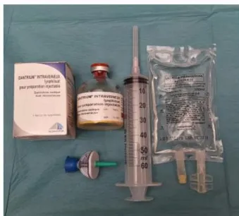
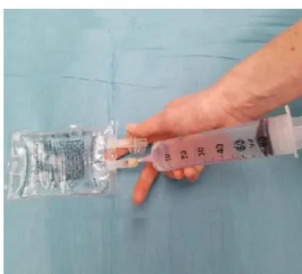
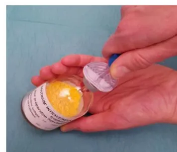
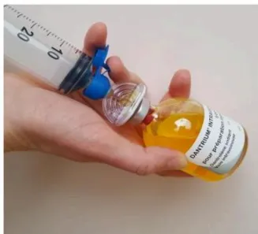
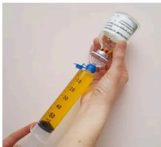
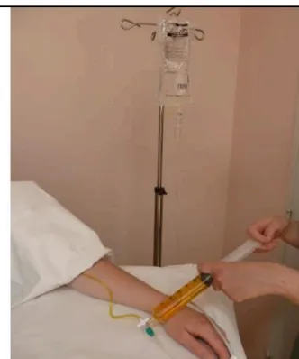

# HYPERTHERMIE MALIGNE

## Agents déclenchants :

SEVORANE® (Sévoflurane), SUPRANE® (Desflurane), FORENE® (Isoflurane), FLUOTHANE® (Halothane)  
PENTHROX® (méthoxyflurane), CELOCURINE® (Suxaméthonium, Succinylcholine)

## SIGNES ÉVOCATEURS D'HYPERTHERMIE MALIGNE (HM)

Spasme des masséters  
Hypercapnie ( $\uparrow$ EtCO2)  
Tachypnée  
Acidose respiratoire

Tachycardie, arythmies  
Rigidité  
Hyperthermie, sueurs  
Urines rouges (myoglobinurie)

Acidose mixte  
Élévation des CPK  
Marbrures  
Coagulation intravasculaire

## SUGGESTIONS THÉRAPEUTIQUES

1/

Arrêter les agents volatils halogénés.  
Hyperventiler en oxygène 100% (2 à 3 fois le volume minute utilisé avant la crise HM), en circuit ouvert.

2/

Demander du renfort.

3/

Relais par des anesthésiques non déclenchants : propofol, morphinique  
Monitorer l'EtCO2 et la température centrale. Réaliser un gaz du sang artériel et veineux.

4 /

Dantrolène injectable  
Flacons de 20 mg de poudre à diluer avec 60 mL d'eau stérile (eppi).  
Injecter 2 à 3 mg/kg intraveineux direct, le plus vite possible (voir reconstitution du dantrolène au verso).  
Maintenir le patient en ventilation contrôlée pendant la durée de l'effet myorelaxant du dantrolène (½ vie estimée à 10 heures).

5/

La réponse au dantrolène doit apparaître dans les minutes qui suivent l'injection avec régression des symptômes : hypercapnie, rigidité, hyperthermie.  
Des doses supplémentaires de 1 mg/kg peuvent être nécessaires jusqu'à 10 mg/kg.  
Poser un cathéter veineux central si nécessité de doses répétées.  
La dépression myocardique induite par le dantrolène reste modérée.  
Ne pas associer bloqueurs calciques IV et dantrolène.

6/

Le refroidissement par moyens physiques est justifié en cas d'hyperthermie importante et doit être arrêté dès que la température centrale est inférieure à 38°C.

7/

Surveiller : diurèse, température centrale, kaliémie, pH, CPK, myoglobine, coagulation.

8/

En cas d'hyperkaliémie, traiter par perfusion de glucose-insuline.

9/

En cas d'acidose métabolique grave (pH <7,2) injection IV de bicarbonate de sodium.

10/

Provoquer une diurèse supérieure à 1 mL/kg/h (pose de sonde vésicale) par remplissage vasculaire.  
Chaque flacon de dantrolène contient 3 g de mannitol qui provoque une diurèse osmotique.

11/

Après la crise, surveiller le patient en réanimation pendant au moins 24 heures car recrudescence de la crise d'HM possible.

12/

Des doses supplémentaires de dantrolène IV en seringue électrique de 1mg/kg sur 4 heures sont recommandées avec réévaluation de l'évolution des signes d'HM.  
Arrêt du dantrolène après rémission clinique des signes d'HM.

13/

Surveillance des taux de CPK et de potassium dans le sang et les urines pendant au moins 48 heures. Un dosage de CPK à 12h et à 24h qui reste normal est un argument important de diagnostic différentiel.

14/

Remise d'un document écrit au patient et à sa famille informant du diagnostic.  
Prendre contact avec un centre de référence sur l'HM.

15/

En cas d'évolution défavorable, prélèvement sanguin de 10 mL sur tube EDTA en vue d'analyse génétique et prélèvement musculaire en vue d'examen anatomo-pathologique.# RECONSTITUTION DU DANTROLÈNE

**Stock Urgence Dantrolène conformément à la circulaire de 199 relative au traitement de la crise d'hyperthermie maligne peranesthésique (DGS/SQ2/ DH/99/631)**  
**18 Flacons de 20 mg de Dantrolène IV présentés en kits contenant chacun :**  
**1 flacon de dantrolène, 1 poche 100 mL d'eau stérile (eppi), 1 seringue 60 mL**  
**1 aiguille 19G, 1 dispositif de transfert pourvu d'un filtre à particules et une**  
**Prise d'air et filtre air (BBRAUN TD Minispike Filter V)**

Le Dantrolène doit être dissous dans de l'eau stérile (eau pour préparation injectable)  
Le Dantrolène dilué doit être conservé à température ambiante, protégé de la lumière et doit être utilisé dans les 6 heures.

**36 flacons de 20 mg peuvent être nécessaires au traitement de la crise d'HM**

1 - Matériel nécessaire

2 - Prélever 60 ml d'eau ppi

3 - Insérer le dispositif de transfert

4 - Injecter les 60 ml d'eau ppi

5 - Prélever les 60 ml de dantrolène dissous  
6 - Secouer si présence de particules

7 - Injecter

La dose recommandée initiale est 2,5 mg/kg chez l'adulte et l'enfant.  
Injecter les seringues par un robinet à trois voies sur une ligne de perfusion dédiée de sérum salé à 0,9% le plus rapidement possible.

Unité Hyperthermie Maligne  
CHRU LILLE 59037 France  
Tél : 03.20.44.62.68 ou 03.20.44.40.74  
[unite.hyperthermiemaligne@chru-lille.fr](mailto:unite.hyperthermiemaligne@chru-lille.fr)

Localisation du stock Urgence Dantrolène :

Numéro d'appel de la pharmacie pour kits Dantrolène complémentaires

Ce document est téléchargeable sur le site: [www.sfar.org](http://www.sfar.org)  
Mise à jour 2018.