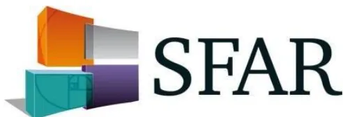

# Recommandations de Pratiques Professionnelles

Société Française d'Anesthésie et Réanimation

## Prise en charge du brûlé grave à la phase aiguë chez l'adulte et l'enfant

Management of acute burn injuries in adults and children

2019

en association avec les sociétés : SFB-SFMU-ADARPEF

Société Francophone de Brûlologie

Société Française de Médecine d'Urgence

Association des Anesthésistes Réanimateurs Pédiatriques d'Expression Française

Texte validé par le Comité des Référentiels Cliniques (15/05/2019) et le Conseil d'Administration de la SFAR (24/05/2019).

**Auteurs :** Matthieu Legrand, Damien Barraud, Isabelle Constant, Pauline Devauchelle, Nicolas Donat, Mathieu Fontaine, Laetitia Goffinet, Clément Hoffmann, Mathieu Jeanne, Jeanne Jonqueres, Thomas Leclerc, Hugues Lefort, Nicolas Louvet, Marie-Reine Losser, Célia Lucas, Olivier Pantet, Antoine Roquilly, Anne-Françoise Rousseau, Sabri Soussi, Sandrine Wiramus, Etienne Gayat, Alice Blet

**Auteur pour correspondance :** Matthieu LEGRAND, Département d'Anesthésie-Réanimation et Centre de Traitement des Brûlés, GH Saint-Louis - Lariboisière, APHP, Paris, France, Université de Paris mail : [matthieu.m.legrand@gmail.com](mailto:matthieu.m.legrand@gmail.com)

**Coordonnateurs d'experts :**

Matthieu Legrand (Paris) et Damien Barraud (Metz)

**Organisateurs :**

Alice Blet (Paris) et Etienne Gayat (Paris)

**Groupe d'experts (ordre alphabétique) :**

Damien Barraud (SFAR), Isabelle Constant (SFAR/ADARPEF), Pauline Devauchelle (SFAR), Nicolas Donat (SFAR), Mathieu Fontaine (SFB), Laetitia Goffinet (SFB), Clément Hoffmann (SFAR), Mathieu Jeanne (SFAR), Jeanne Jonqueres (SFAR), Thomas Leclerc (SFAR), Hugues Lefort (SFMU), Matthieu Legrand (SFAR), Marie-Reine Losser (SFAR), Nicolas Louvet (ADARPEF), Célia Lucas (SFAR), Olivier Pantet (SFAR), Antoine Roquilly (SFAR), Anne-Françoise Rousseau (SFAR), Sabri Soussi (SFAR), Sandrine Wiramus (SFB).### **Groupes de travail :**

- - *Régulation, admission en centre spécialisé, et télémédecine :*  
  Nicolas Donat (Clamart), Mathieu Fontaine (Lyon), Clément Hoffmann (Clamart), Thomas Leclerc (Clamart), Hugues Lefort (Metz).
- - *Réanimation hémodynamique :*  
  Pauline Devauchelle (Lille), Nicolas Donat (Clamart), Clément Hoffmann (Clamart), Jeanne Jonqueres (Lyon), Marie-Reine Losser (Nancy), Sabri Soussi (Paris).
- - *Voies aériennes et inhalation de fumées d'incendies :*  
  Damien Barraud (Metz), Pauline Devauchelle (Lille), Hugues Lefort (Metz), Matthieu Legrand (Paris), Marie-Reine Losser (Nancy), Olivier Pantet (Lausanne, Suisse), Sandrine Wiramus (Marseille).
- - *Anesthésie et analgésie :*  
  Mathieu Jeanne (Lille), Antoine Roquilly (Nantes).
- - *Traitement local :*  
  Damien Barraud (Metz), Mathieu Fontaine (Lyon), Laetitia Goffinet (Nancy), Jeanne Jonqueres (Lyon), Matthieu Legrand (Paris), Célia Lucas (Paris), Anne-Françoise Rousseau (Liège, Belgique).
- - *Traitements autres :*  
  Marie-Reine Losser (Nancy), Célia Lucas (Paris), Olivier Pantet (Lausanne, Suisse), Anne-Françoise Rousseau (Liège, Belgique).
- - *Recommandations pédiatriques :*  
  Nicolas Louvet (Paris), Isabelle Constant (Paris).
- - *Chargé de bibliographie :*  
  Boris Glavnik (Metz)

### **Groupe de Lecture :**

- - *Comité des Référentiels clinique de la SFAR :*  
  Lionel Velly (Président), Marc Garnier (Secrétaire), Julien Amour, Alice Blet, Gérald Chanques, Hélène Charbonneau, Vincent Compère, Philippe Cuvillon, Etienne Gayat, Catherine Huraux, Hervé Quintard, Emmanuel Weiss.
- - *Conseil d'Administration de la SFAR :*  
  Xavier Capdevila, Hervé Bouaziz, Laurent Delaunay, Pierre Albaladejo, Jean-Michel Constantin, Marie-Laure Cittanova Pansard, Marc Léone, Bassam Al Nasser, Hélène Beloeil, Valérie Billard, Francis Bonnet, Marie-Paule Chariot, Isabelle Constant, Alain Delbos, Claude Ecoffey, Jean-Pierre Estebe, Marc Gentili, Olivier Langeron, Pierre Lanot, Luc Mercadal, Frédéric Mercier, Karine Nouette-Gaulain, Eric Viel, Paul Zetlaoui.**Liens d'intérêts des experts SFAR au cours des cinq années précédant la date de validation par le CA de la SFAR.**

Mathieu Jeanne déclare avoir un lien direct ou indirect avec les industriels MDMS, LOOS, France.

Antoine Roquilly déclare être consultant pour les laboratoires MSD et bioMerieux.

**Liens d'intérêts des experts SFB au cours des cinq années précédant la date de validation par le CA de la SFB.**

Aucun

**Liens d'intérêts des experts SFMU au cours des cinq années précédant la date de validation par le CA de la SFMU.**

Hugues Lefort déclare avoir participé à un comité scientifique du laboratoire Ethypharm.

**Liens d'intérêts des experts ADARPEF au cours des cinq années précédant la date de validation par le CA de la ADARPEF.**

Aucun## **RESUME :**

**OBJECTIF :** Produire un cadre facilitant la prise de décision pour la prise en charge du brûlé à la phase aiguë, chez l'adulte et chez l'enfant.

**METHODOLOGIE :** Un comité de 20 experts a été constitué. Une politique de déclaration et de suivi des liens d'intérêts a été appliquée et respectée durant tout le processus de réalisation du référentiel. De même, celui-ci n'a bénéficié d'aucun financement provenant d'une entreprise commercialisant un produit de santé (médicament ou dispositif médical). Une liste de questions formulées selon le modèle PICO (Population, Intervention, Comparaison, et Outcomes) a été dressée par les experts, puis deux experts bibliographiques par champ ont analysé la littérature publiée depuis janvier 2000 sur le domaine en utilisant des mots-clés prédéfinis selon les recommandations PRISMA. La qualité des données de la littérature identifiées a été évaluée par la méthode GRADE®. Du fait de la très faible quantité d'études permettant de répondre avec la puissance nécessaire au critère de jugement majeur d'importance la plus élevée (i.e. la mortalité), il a été décidé, en amont de la rédaction des recommandations, d'adopter un format de Recommandations pour la Pratique Professionnelle (RPP) plutôt qu'un format de Recommandations Formalisées d'Experts (RFE).

**RESULTATS :** Le travail de synthèse des experts a abouti à 24 recommandations. Après deux tours de cotation et un amendement, un accord fort a été obtenu pour l'ensemble des recommandations et le protocole.

**CONCLUSION :** Un accord substantiel a été trouvé au sein d'une large cohorte d'experts de quatre sociétés savantes afin de formuler plusieurs recommandations visant à optimiser la prise en charge du brûlé à la phase aiguë chez l'adulte et l'enfant.

**MOTS-CLÉS :** Brûlure Grave, Réanimation, Recommandations.**ABSTRACT:**

**OBJECTIVE:** Generate guidelines supporting decision-making for severe and acute burn treatment, in adults and children.

**DESIGN:** A committee of 20 experts had the mission of producing guidelines covering six fields. A formal conflict-of-interest policy was developed at the onset of the process and enforced throughout. The entire guidelines process was conducted independent of any industry funding. A list of questions formulated according to the PICO model (Population, Intervention, Comparison, and Outcomes) was drawn up by the experts. Then, two bibliographic experts per field analysed the literature published since 2000 using predefined keywords according to PRISMA recommendations. The quality of the data identified from the literature was assessed using the GRADE® methodology. Due to the lack of powerful studies having used mortality as major judgement criteria, it was decided, before drafting the recommendations, to formulate the recommendations as expert opinions.

**RESULTS:** The SFAR guideline panel provided 24 statements dealing with the management of acute burn injuries in adults and children. After two rounds of rating and one amendment, strong agreement was reached for all the recommendations.

**CONCLUSIONS:** Substantial agreement exists among experts regarding many recommendations aiming to improve the management of acute burn injuries in adults and children.

**KEYWORDS:** Severe Burn, Intensive Care, Guidelines.## INTRODUCTION

La brûlure est une pathologie circonstancielle le plus souvent accidentelle, fréquente, et dans la très grande majorité des cas bénigne, relevant d'un simple traitement ambulatoire. En France, des formes plus graves sont à l'origine d'environ 10 000 séjours hospitaliers chaque année, dont la moitié nécessite le recours à un centre spécialisé (*Annexe 1*). Si ces formes les plus sévères sont grevées d'une mortalité relativement faible, force est de constater qu'elles sont responsables d'une morbidité très importante, avec des séquelles somatiques, psychiques et sociales lourdes, en conclusion de séjours hospitaliers, longs, coûteux, et mobilisant des moyens humains et financiers importants. L'incidence de la brûlure est quatre fois plus élevée chez l'enfant que chez l'adulte, avec environ 25% des séjours concernant des enfants de moins de 5 ans, le plus souvent brûlés par des liquides chauds.

Ces recommandations ont pour objectif de proposer une approche thérapeutique rationnelle de cette population de patients « brûlés graves », chez l'adulte, et chez l'enfant.

Il n'existe pas de définition officielle de la brûlure grave. Les experts proposent de distinguer le « brûlé grave à risque vital » et le « brûlé grave à risque fonctionnel ». Cette RPP comprend comme définition du brûlé grave à risque vital et/ou fonctionnel :

- – Chez l'adulte (*Annexe 2*) :
  - ○ Surface cutanée brûlée (SCB) > 20%, SCB du troisième degré > 5%, syndrome d'inhalation de fumées, localisation particulière profonde (face, mains, pieds, périnée), brûlure électrique haut voltage
  - ○ Ou SCB < 20% ET terrain particulier : âges >75 ans, comorbidités sévères, inhalation de fumées suspectée ou avérée, brûlure circulaire profonde, localisation particulière superficielle : face, mains, pieds, périnée, plis, SCB > 10%, SCB du troisième degré entre 3 et 5%, brûlure électrique bas voltage, brûlure chimique (acide fluorhydrique).
- – Chez l'enfant (*Annexe 2bis*) :
  - ○ SCB > 10%, SCB du troisième degré >5%, nourrisson < 1 an, comorbidités sévères, syndrome d'inhalation de fumées, localisation particulière profonde (face, mains, pieds, périnée, plis de flexion), brûlure circulaire, brûlure électrique ou chimique.

Nous proposons une catégorisation la plus opérationnelle possible, afin d'optimiser la première étape de prise en charge qu'est le triage, capitale eût égard au nombre contraint de lits de Centre de Traitement des Brûlés (CTB) à l'échelle du territoire (*Annexe 1*). Nous proposerons ensuite quelques principes simples, afin de maîtriser les principaux risques et enjeux de traitement de la phase aiguë, en l'occurrence les détresses hémodynamique et respiratoire, l'hypothermie, et la douleur.

La prise en charge du brûlé grave est pluridisciplinaire. Ces recommandations s'adressent à tous les acteurs amenés à prendre en charge un brûlé grave dans les 48 premières heures, à savoir les personnels des services d'urgence-SAMU-SMUR, les anesthésistes-réanimateurs et infirmiers anesthésistes, les intensivistes et personnels soignants de centres non spécialisés, les pédiatres, souvent en première ligne, ainsi que les chirurgiens, en règle générale impliqués plus tardivement, sauf escarrotomies ou excisions très précoces. De manière notable, ces recommandations ont été rédigées avec l'apport de spécialistes européens, ouvrant la perspective à des collaborations transfrontalières, indispensables en particulier en cas d'afflux massif de victimes brûlées dépassant les capacités nationales. Enfin, elles ne traitent que le champ des brûlures thermiques, et non celui des brûlures électriques ou encore chimiques, nécessitant également un avis spécialisé.

## Objectif des recommandations

L'objectif de ces Recommandations pour la Pratique Professionnelle (RPP) est de produire un cadre facilitant la prise de décision pour la prise en charge du brûlé à la phase aiguë. Le groupe s'est efforcé de produire un nombre minimal de recommandations afin de mettre en exergue les points forts à retenir dansles 6 champs prédéfinis. Les règles de base des bonnes pratiques médicales universelles en soins critiques étant considérées connues ont été exclues des recommandations.

## **CHAMPS DES RECOMMANDATIONS**

Les recommandations formulées concernent 6 champs :

- - Régulation, admission en centre spécialisé, et télémédecine
- - Réanimation hémodynamique
- - Voies aériennes et inhalation de fumées d'incendies
- - Anesthésie et analgésie
- - Traitement local
- - Traitement autres

## **METHODE**

Ces recommandations sont le résultat du travail d'un groupe d'experts réunis par la SFAR, la SFB, la SFMU et l'ADARPEF. Chaque expert a rempli une déclaration de conflits d'intérêts avant de débuter le travail d'analyse. Dans un premier temps, le comité d'organisation a défini les objectifs de ces recommandations et la méthodologie utilisée. Les différents champs d'application de ces RPP et les questions à traiter ont ensuite été défini par le comité d'organisation, puis modifiés et validé par les experts.

Les questions ont été formulées selon un format PICO (Patients – Intervention - Comparaison Outcome) chaque fois que possible. La population faisant l'objet de ces recommandations (le « P » du PICO) est pour l'ensemble des recommandations les patients de soins critiques, et n'est alors pas rappelée dans chaque recommandation.

L'analyse de la littérature a ensuite été conduite selon la méthodologie GRADE (Grade of Recommendation Assessment, Development and Evaluation). Du fait de la très faible quantité d'études répondant avec la puissance nécessaire au critère de jugement majeur d'importance la plus élevée (i.e. la mortalité) et de la faible qualité méthodologiques de ces études, il a été décidé, en amont de la rédaction des recommandations, d'adopter un format de Recommandations pour la Pratique Professionnelle (RPP) plutôt qu'un format de Recommandations Formalisées d'Experts (RFE). La méthodologie GRADE a toutefois été appliquée pour l'analyse de la littérature et la rédaction des tableaux récapitulatifs des données de la littérature. Un niveau de preuve a donc été défini pour chacune des références bibliographiques citées en fonction du type de l'étude. Ce niveau de preuve pouvait être ré-évalué en tenant compte de la qualité méthodologique de l'étude, de la cohérence des résultats entre les différentes études, du caractère direct ou non des preuves, de l'analyse de coût et de l'importance du bénéfice.

Les recommandations ont ensuite été rédigées en utilisant la terminologie des RPP de la SFAR « les experts suggèrent de faire » ou « les experts suggèrent de ne pas faire ». Les propositions de recommandations ont été présentées et discutées une à une. Le but n'était pas d'aboutir obligatoirement à un avis unique et convergent des experts sur l'ensemble des propositions, mais de dégager les points de concordance et les points de divergence ou d'indécision. Chaque recommandation a alors été évaluée par chacun des experts et soumise à une cotation individuelle à l'aide d'une échelle allant de 1 (désaccord complet) à 9 (accord complet). La cotation collective était établie selon une méthodologie GRADE grid. Pour valider une recommandation, au moins 70 % des experts devaient exprimer une opinion qui allait globalement dans la même direction, tandis que moins de 20 % d'entre eux exprimaient une opinion contraire. En l'absence de validation d'une ou de plusieurs recommandation(s), celle(s)-ci était(en)t reformulées et, de nouveau, soumises à cotation dans l'objectif d'aboutir à un consensus.## **SYNTHESE DES RESULTATS**

Le travail de synthèse des experts et l'application de la méthode GRADE ont abouti à 24 recommandations et un schéma récapitulatif. Après deux tours de cotation, un accord fort a été obtenu pour l'ensemble des recommandations et pour le schéma.

La SFAR, la SFB, la SFMU et l'ADARPEF incite les praticiens exerçant aux urgences et en unité de soins critiques à se conformer à ces RPP pour assurer une qualité des soins dispensés aux patients. Cependant, dans l'application de ces recommandations, chaque praticien doit exercer son jugement, prenant en compte son expertise et les spécificités de son établissement, pour déterminer la méthode d'intervention la mieux adaptée à l'état du patient dont il a la charge.## **CHAMP 1 : REGULATION, ADMISSION EN CENTRE SPÉCIALISÉ, ET TÉLÉMÉDECINE**

*Experts : Nicolas Donat (Clamart), Mathieu Fontaine (Lyon), Clément Hoffmann (Clamart), Thomas Leclerc (Clamart), Hugues Lefort (Metz)*

### **Question 1.1 : Faut-il utiliser une méthode standardisée d'évaluation de la surface cutanée brûlée ?**

**R1.1 – Les experts suggèrent d'utiliser la méthode standardisée de Lund et Browder (adulte ou pédiatrique) pour évaluer la surface cutanée brûlée.**

#### **Accord FORT**

**Argumentaire :** L'évaluation de la surface cutanée brûlée (SCB) a un impact direct sur le parcours clinique et son traitement initial. Cette évaluation est une des pierres angulaires de la définition du brûlé grave (*Annexe 2*), et guide la réanimation liquidienne des premières heures de la prise en charge. Seules les brûlures de deuxième et troisième degrés comptent pour l'évaluation de la SCB. Cinq études (N= 1944 patients) retrouvent des discordances importantes, sur ou sous-estimation de la SCB en fonction des méthodes utilisées [1–5]. Ces études sont toutes en faveur de l'utilisation des tables de Lund et Browder (*Annexe 3*) comparativement à d'autres méthodes, notamment la règle des 9 de Wallace, ayant tendance à surévaluer les lésions, et non adaptée à la pédiatrie [6]. En pratique, particulièrement en préhospitalier, cette méthode n'est pas toujours facile et doit être répétée au cours de la prise en charge initiale. L'évaluation peut être réalisée manuellement, ou facilitée par une application numérique de type E-burn® (*Annexe 3*) [7,8]. Cette évaluation précise et répétée de la surface brûlée au début du parcours de soin du patient permet d'éviter une régulation saturant les CTB (sur-triage), limite le sous-triage et sa morbid mortalité [9].

Chez l'enfant comme chez l'adulte, l'évaluation de la SCB conditionne d'une part son orientation vers un lieu de prise en charge spécialisé ou non, et d'autre part sa prise en charge initiale en termes d'apports hydroélectrolytiques dans les premières heures [2,3,5]. La surestimation de la surface brûlée est très fréquente, de 70 à 94% des cas selon les séries. Elle se traduit en général par un apport hydroélectrolytique plus important que ne le nécessiterait la surface brûlée, sans conséquence clinique objectivée. L'évaluation à l'aide des tables de Lund et Browder (version pédiatrique) est la méthode de référence [5,10]. Dans le cadre d'un nombre important de victimes par afflux massif ou saturant, l'évaluation approximative de la SCB par la règle des moitiés a été proposée [11]. L'usage de la main (paume + doigts) du patient est une alternative, équivalent à 1% de SCB, est pratique, simple à enseigner et à retenir pour les primo-intervenants. Elle permet de limiter la surévaluation de la SCB [12].

### **Question 1.2 : Une prise en charge spécialisée améliore-t-elle le pronostic vital ou fonctionnel des patients brûlés graves ?**

**R1.2.1 – Les experts suggèrent de requérir sans délai à un avis spécialisé en cas de brûlure grave, afin d'envisager une hospitalisation dans un Centre de Traitement des Brûlés.**

#### **Accord FORT**

**Argumentaire :** Les brûlures graves restent associées à une importante morbid mortalité à long terme [13,14]. La mortalité augmente principalement avec l'âge, la SCB totale, et l'existence d'une inhalation de fumées [15–17]. La prise en charge optimale des brûlés graves nécessite des ressources considérables avec une approche multidisciplinaire [18]. Dans des cohortes de traumatisés graves mais aussi d'autres populations de patients (réanimation neurochirurgicale, chirurgie cardio-thoracique, etc.), plusieurs études internationales ont suggéré le bénéfice de cetteapproche spécialisée, avec des équipes multidisciplinaires, dédiées et regroupées en un lieu unique : amélioration de la survie, réhabilitation facilitée, diminution des complications, des durées de séjour intra-hospitalières et des coûts [19–21]. Par analogie, les Centres de Traitement des Brûlés (CTB) ont été créés afin d'hospitaliser les brûlés graves au bon endroit et au bon moment (*Annexe 1*). En France comme ailleurs, malgré l'existence de critères d'hospitalisation en CTB (Société Française de Brûlologie), une majorité des patients brûlés sont encore pris en charge par une équipe non spécialisée [22–25]. Les experts s'accordent sur la nécessité de requérir sans délai à un avis spécialisé en cas de brûlure grave afin de guider le primo-intervenant dans la recherche des signes de gravité d'une brûlure et l'évaluation de la SCB, favoriser l'initiation précoce et appropriée du remplissage vasculaire et de l'analgésie, et enfin d'optimiser la régulation et l'orientation du patient. Un avis spécialisé est également requis pour certaines localisations anatomiques (face, mains, pieds, zones jonctionnelles, OGE, périnée) et/ou certaines situations particulières (hyperalgie, nécessité d'une prise en charge médico-sociale particulière ou d'une rééducation à long terme).

**R1.2.2 – Les experts suggèrent d'utiliser la télémédecine pour améliorer l'évaluation initiale du brûlé grave.**

**Accord FORT**

**Argumentaire :** La télémédecine permet d'améliorer l'évaluation de la SCB et de caractériser une brûlure grave en l'absence d'expert auprès du patient. L'évaluation d'une SCB et de sa gravité apparaît fiable, et permet une régulation du patient dans un parcours de soins le plus adapté, notamment en évitant le sur-triage et les hospitalisations inutiles, mais aussi le risque de sous-triage source de morbidité [26–29]. Elle trouve sa pleine légitimité pour les brûlures de gravité « intermédiaire » [30,31]. La télémédecine limite les transferts inappropriés et sa surmortalité démontrée [9]. Il est nécessaire de disposer d'un système interconnecté, synchrone ou non, qui permet le transfert, le traitement et l'archivage éventuel des images sans perte de temps et de chance pour le patient [32,33]. De tels systèmes doivent répondre aux exigences inhérentes à la pratique de la télémédecine, cadrée par des recommandations internationales [34].

**R1.2.3 – Si une indication à une hospitalisation en Centre de Traitement des Brûlés est retenue, les experts suggèrent de privilégier une admission directe en Centre de Traitement des Brûlés.**

**Accord FORT**

**Argumentaire :** Si une hospitalisation en CTB est requise, une admission directe est à privilégier. De très nombreux auteurs attribuent l'amélioration de la survie à la concentration des soins de brûlures, à la spécialisation des équipes dans les CTB, parfois même au volume de patients admis [35–39]. Des études, souvent rétrospectives, avec de faibles niveaux de preuve ont montré des résultats discordants quant à la survie [9,40,41]. En revanche, plusieurs études ont mis en évidence une diminution de la morbidité, même à long terme [42,43]. Plusieurs études cliniques randomisées prospectives (populations adultes) ont montré que l'excision chirurgicale et la greffe cutanée précoces permettaient de réduire significativement la morbidité et la durée de séjour intrahospitalière du brûlé grave [44]. Dans l'étude d'Ehrl et al, le délai d'excision et la durée de ventilation mécanique étaient plus courts en cas d'admission directe dans un CTB [9]. Pegg et al. ont aussi montré qu'une admission directe en CTB, à défaut secondaire mais précoce, permettait l'excision précoce et donc indirectement un gain sur la morbidité [15,45]. Par ailleurs, l'impact négatif de l'inhalation de fumées sur la mortalité croît de façon non linéaire avec le temps [16]. Toutefois, l'état clinique du patient à la phase toute initiale doit cependant faire considérer unephase de transition dans un établissement de proximité en cas d'instabilité hémodynamique ou respiratoire et d'un transport long vers un CTB (*Annexes 2 et 2bis*).

**R1.2.4 – Les experts suggèrent de réaliser une escarrotomie si la brûlure profonde induit une hyperpression compartimentale des membres ou du tronc compromettant la liberté des voies aériennes, la ventilation et/ou la fonction circulatoire ; idéalement dans un Centre de Traitement des Brûlés par un praticien expérimenté.**

**Accord FORT**

**Argumentaire :** Les brûlures circulaires au 3ème degré entraînent, par un mécanisme de constriction, une élévation de la pression à l'intérieur du compartiment anatomique concerné. Selon la topographie, cette hypertension se complique soit d'une ischémie aiguë de membre avec troubles neurologiques et nécrose d'aval, soit d'un syndrome du compartiment thoracique ou abdominal aux conséquences physiologiques multiples : diminution du débit cardiaque et de la compliance pulmonaire, hypoxie, hypercapnie, insuffisance rénale aiguë ou encore ischémie mésentérique [46,47]. L'escarrotomie (ou incision de décharge) est une procédure de décompression des tissus sous-cutanés en cas de brûlure circulaire au 3ème degré (parfois au 2ème degré profond) [48]. Aucune étude contrôlée randomisée évaluant le traitement des syndromes compartimentaux secondaires à la brûlure n'existe. Des études de cohorte (souvent rétrospectives, avec de petits effectifs) ainsi que des séries de cas ont décrit la faible fréquence de réalisation de cette procédure, son efficacité sur la baisse de la pression intra-compartimentale et son intérêt tant curatif que préventif pour le pronostic fonctionnel et réduire la morbidité [49–52]. Le délai de réalisation des incisions de décharge n'était généralement pas mentionné. Des experts internationaux se sont cependant accordés sur le fait qu'une escarrotomie était rarement indiquée immédiatement ; que la seule indication urgente était la compromission de la liberté des voies aériennes et/ou de la ventilation ; et qu'elle devait être réalisée au cours des 48 premières heures en cas d'hypertension intra-abdominale ou d'atteinte de la fonction circulatoire [50–56]. Cette procédure est à risque de complications, principalement hémorragiques et infectieuses [50,57]. Une escarrotomie mal réalisée est associée à une sur-morbidité [57–60]. Les experts recommandent de réaliser cette procédure dans un centre de traitement des brûlés, ou de recourir à un avis spécialisé en cas de brûlure circulaire profonde, avant de réaliser une escarrotomie si le transfert n'est pas rapidement possible.## **CHAMP 2 : REANIMATION HEMODYNAMIQUE**

Experts : Pauline Devauchelle (Lille), Nicolas Donat (Clamart), Clément Hoffmann (Clamart), Jeanne Jonqueres (Lyon), Thomas Leclerc (Clamart), Marie-Reine Losser (Nancy), Sabri Soussi (Paris)

**Question 2.1 : Faut-il administrer précocement un remplissage vasculaire dans la prise en charge initiale du brûlé grave ?**

<table border="1"><tr><td><b>R2.1.1 – Les experts suggèrent d’administrer 20 mL/kg d’une solution cristalloïde intraveineuse dans la première heure de prise en charge d’un brûlé avec une surface cutanée brûlée <math>\geq 20\%</math> chez l’adulte et <math>\geq 10\%</math> chez l’enfant.</b></td></tr><tr><td style="text-align: right;"><b>Accord FORT</b></td></tr><tr><td><b>R2.1.2 – Les experts suggèrent l’utilisation des solutions cristalloïdes balancées dans la prise en charge du brûlé grave.</b></td></tr><tr><td style="text-align: right;"><b>Accord FORT</b></td></tr><tr><td>
<b>Argumentaire :</b> La brûlure grave induit un état de choc hypovolémique précoce lié à l’inflammation, au syndrome de fuite capillaire et aux altérations de la microcirculation [61]. La gravité et la précocité de ce choc sont décrites depuis les années 1930 et la survenue d’accidents impliquant de multiples victimes [62,63]. Ces observations ont ensuite été confirmées sur des modèles animaux, à partir desquels ont été décrites les différentes formules de calcul des besoins initiaux en remplissage. Les équipes de Baxter et Asch observaient que la valeur minimale de débit cardiaque était obtenue dans les 4 premières heures après la brûlure chez l’animal [64,65]. La correction du bas débit cardiaque était obtenue plus rapidement en cas de remplissage vasculaire [65]. Dans des études observationnelles, un débit cardiaque bas a été associé à un plus mauvais pronostic [66–68]. Il a ainsi été suggéré la réalisation sans délai d’un bolus initial de 20 mL/kg dans la première heure après la brûlure grave, du fait du rôle majeur de l’administration précoce de cristalloïdes et de la difficulté à estimer finement la SCB dans les premières minutes. En cas d’échec ou d’impossibilité, le recours à la voie intra-osseuse est recommandé [69]. De ce fait, l’abord vasculaire doit être mis en place dans la période préhospitale le plus rapidement possible (de préférence en zone non brûlée). Une voie veineuse centrale fémorale est considérée en dernière intention [70].

Le Ringer Lactate et le soluté de Hartmann (i.e. solutés cristalloïdes balancés), caractérisés par une concentration en électrolytes proche de celle du plasma, en particulier pour les cations et anions fort (sodium et chlore) sont les principaux solutés de remplissage utilisés historiquement chez le brûlé grave. Actuellement, ils restent les solutés les plus utilisés pour le remplissage vasculaire des brûlés graves [68,71]. Il n’existe que très peu de données, même observationnelles, concernant les autres solutés balancés (i.e. Ringer acétate) [72,73]. Enfin, aucune étude randomisée n’est disponible comparant différents types de solutés, et comparant notamment le NaCl 0,9% et les solutés balancés chez les brûlés. Des données chez les patients de chirurgie majeure ou de réanimation polyvalente sont cependant disponibles. La perfusion de NaCl 0,9% est associée à un risque d’hyperchlémie et d’acidose métabolique. Un risque d’insuffisance rénale aiguë supérieur avec le NaCl 0,9% est aussi suggéré par des essais randomisés en réanimation et aux urgences [74,75]. Dans l’attente de plus de preuves dans d’autres études spécifiques chez les patients brûlés, il semble licite de proposer le Ringer lactate comme soluté balancé de première intention, du fait des grandes quantités de solutés administrés chez ces patients majorant le risque de complications métaboliques attribuées au NaCl 0,9% [74,76–79].

Les solutés hypertoniques sont très peu étudiés, et par manque de données il n’est pas possible actuellement de formuler une recommandation concernant ce type de soluté.
</td></tr></table>La précocité de la réanimation hydroélectrolytique chez l'enfant (dans les 2 heures suivant la brûlure) est associée dans une étude rétrospective à une réduction de la morbid mortalité [80].

**Question 2.2 : Faut-il guider la réanimation liquidienne du patient brûlé grave sur la surface cutanée brûlée ?**

**R2.2 – Les experts suggèrent d'utiliser une formule d'estimation du remplissage initial des brûlés intégrant au minimum le poids et la surface cutanée brûlée pour définir les apports initiaux (au-delà de la première heure) en solutés cristalloïdes.**

**Accord FORT**

**Argumentaire :** Le remplissage vasculaire est l'une des pierres angulaires de la prise en charge initiale du brûlé grave [62,81,82].

Depuis les publications historiques d'Evans, Baxter (formule Parkland), puis Pruitt (formule Brooke), les formules de prédiction des besoins en remplissage sont largement utilisées pour guider la réanimation hydro électrolytique des brûlés graves (*Annexe 4*) [64,83–85]. Malheureusement, ces études anciennes, observationnelles, n'ont jamais été rigoureusement validées. Ces formules fournissent une estimation des besoins initiaux en remplissage pour une période de 24 heures, estimés entre 2 et 4 ml/kg/%SCB de Ringer lactate selon les formules. Aucune formule n'a formellement montré sa supériorité par rapport aux autres sur des critères pronostiques. La règle des 10 est destinée à la phase préhospitale et aux premières heures de prise en charge avec un mode de calcul simplifié. Malgré un faible niveau de preuve (validation in silico), elle constitue une alternative aux formules classiques [86].

En raison des différences physiologiques entre adultes et enfants (rapport surface corporelle/poids plus élevé chez l'enfant), les règles de calcul des apports hydroélectrolytiques décrites chez l'adultes ne sont probablement pas applicables en pédiatrie. Les apports hydriques nécessaires sont plus élevés chez les enfants, comparativement aux adultes. Dans 2 études rétrospectives, ces besoins ont été mesurés à environ 6 ml/kg/%SCB [87,88]. Plusieurs règles spécifiques ont été décrites pour les 48 premières heures (Eagle, Cincinnati, Galveston, Parkland modifiée), cependant aucune évaluation formelle ni comparaison n'a été rapportée [89]. Toutes ces formules incluent la surface cutanée brûlée dans leurs calculs. Afin de prendre en compte ces spécificités pédiatriques (chez des enfants avec une SCB >10%) plusieurs centres utilisent la formule de Parkland modifiée (entre 3 et 4 ml/kg/%SCB), à laquelle sont ajoutés les besoins hydriques quotidiens évalués selon Holliday et Segar (règle des 4-2-1) [90,91]. Dans le sous-groupe des enfants présentant des brûlures entre 10 et 20 %SCB, 2 études rétrospectives semblent suggérer qu'une réduction de ces apports hydroélectrolytiques serait associée une diminution des durées d'hospitalisation et du recours à une greffe cutanée [92,93].

**Question 2.3 : Faut-il ajuster les volumes de remplissage vasculaire chez le brûlé grave ?**

**R2.3 – Les experts suggèrent d'ajuster dès que possible les volumes perfusés de réanimation liquidienne du brûlé grave au cours de la prise en charge en fonction des données de l'évaluation hémodynamique.**

**Accord FORT**

**Argumentaire :** Les formules de remplissage permettent d'obtenir une estimation indicative initiale des besoins en remplissage pour compenser les pertes hydriques et volémiques liées à la brûlure, mais sont imprécises. Les volumes d'administration des solutés nécessitent ainsi une adaptation àla réponse clinique et aux paramètres hémodynamique, permettant d'éviter les situations de remplissage insuffisant [80] ou excessif (« fluid creep ») [94], toutes deux responsables d'une augmentation de la morbidité [64,95,96].

L'adaptation des débits de remplissage vasculaire au débit urinaire horaire est la plus simple et la plus rapide à obtenir. La cible de diurèse optimale n'a cependant pas été formellement identifiée et se situe usuellement entre 0,5 et 1 mL/kg/h pour des brûlures thermiques de l'adulte. Des paramètres biologiques peuvent également utilisés en association au débit urinaire, comme le dosage du lactate artériel, ou un monitoring hémodynamique plus avancé (i.e. échocardiographie, monitoring du débit cardiaque, pression veineuse centrale), notamment chez les patients présentant une instabilité hémodynamique et/ou une oligurie persistante malgré la réanimation [97]. Enfin, des critères hémodynamiques de rétrocontrôle ont également été testés en comparaison ou en association avec la diurèse horaire [98]. Ces paramètres sont principalement le débit cardiaque, la variation de pression pulsée ou de précharge (VSTI), mais les cibles choisies et leur objectifs numériques restent à valider [99,100]. L'implémentation de ces paramètres au sein d'un algorithme décisionnel de titration du remplissage semble améliorer la réanimation des patients les plus complexes, avec une amélioration des paramètres hémodynamiques, mais pas de différence de survie démontrée [101]. La multiplication des objectifs peut toutefois être un écueil et devrait être réservée aux centres spécialisés [102]. L'outil informatique peut être une aide à la décision lors de la titration du remplissage initial afin de réduire le risque de surremplissage [103]. En cas d'hypotension réfractaire, l'utilisation de vasopresseur est possible dès la phase préhospitale. Si elle s'avère nécessaire, le choix d'une catécholamine doit être guidé par une évaluation hémodynamique dès que possible (échocardiographie ou outil de mesure du débit cardiaque) compte tenu des modifications importantes observées lors des premières heures de la brûlure grave [104]. La littérature disponible ne permet pas de recommander l'utilisation d'un algorithme particulier. Le niveau de preuve des différents protocoles proposé est faible (avis d'expert ou séries monocentriques), aucun algorithme n'ayant fait la preuve de sa supériorité aux autres sur des critères de mortalité. Le groupe des experts propose un protocole de prise en charge hémodynamique en *Annexe 4*, basé sur la connaissance de la physiopathologie de la brûlure grave, afin de guider les praticiens ayant à prendre en charge ces patients.

Chez l'enfant, les risques d'un excès ou d'un défaut de remplissage sont estimés être les mêmes que chez l'adulte. Dans une étude rétrospective, une balance hydrosodée positive au 3ème jour serait associée à une augmentation des durées de ventilation mécanique et de séjour [105]. Peu d'études se sont intéressées à définir des critères d'adaptation du remplissage. Les 2 principaux paramètres étudiés sont le débit urinaire et les paramètres hémodynamiques [106]. Pour le débit urinaire, des valeurs entre 0,5 et 1 mL/kg/h sont classiquement utilisées. Dans une étude rétrospective, chez des enfants avec une SCB >30%, le monitoring hémodynamique par thermodilution transpulmonaire était associé à une diminution des apports volémiques et une réduction de la morbidité [107]. Cependant, au vu de la grande hétérogénéité de ces études (en termes de modalité de remplissage ou de critères pronostiques), il est difficile de définir des cibles hémodynamiques généralisables. De même que chez l'adulte, un algorithme de réanimation liquidienne est proposé en *Annexe 4bis*.

#### Question 2.4 : Faut-il utiliser l'albumine dans la réanimation liquidienne du brûlé grave ?

**R2.4 – Les experts suggèrent d'utiliser l'administration d'albumine humaine chez les patients brûlés graves avec une surface cutanée brûlée supérieure à 30%, au-delà des 6 premières heures de prise en charge.**

**Accord FORT****Argumentaire :** Dans une étude internationale de pratiques récente, plus de 30% des répondants déclarent utiliser de façon fréquente ou systématique des colloïdes à la phase précoce de la brûlure grave, avec principalement de l'albumine humaine dans plus de 60% des cas [71,108].

Il est possible que l'administration de colloïdes permette la réduction des défaillances d'organes (œdème pulmonaire, insuffisance rénale aiguë, syndrome compartimental abdominal) [109,110]. L'albumine humaine peut aussi présenter une activité anti-inflammatoire et antioxydante [108].

Dans une méta-analyse récente, l'administration d'albumine dans les 24 premières heures chez des patients brûlés graves n'était pas associée à une amélioration de la survie. Néanmoins, après l'exclusion de deux études à haut risque de biais, l'administration d'albumine était associée à une réduction de la mortalité de manière significative (OR = 0,34 ; IC95% (0,19-0,58) ;  $p < 0,001$ ) [111].

Dans une autre méta-analyse, l'administration d'albumine dans les 24 premières heures chez des patients brûlés graves était associée à une réduction significative de la survenue de syndrome compartimental abdominal (SCA, groupe albumine=2,8% vs groupe contrôle=15,4% ( $p < 0,05$ ) ; OR=0,19 (IC95% 0,07-0,5)). Néanmoins, il n'y avait pas de différence significative concernant la mortalité, la survenue d'insuffisance rénale aiguë et de complications respiratoires entre les deux groupes [112]. Dans plusieurs études majoritairement observationnelles incluant des patients avec une SCB  $\geq 20$ -30%, l'administration d'albumine 5% était associée à une réduction du volume de remplissage par les cristalloïdes, ainsi qu'à une réduction de l'incidence de syndrome compartimental abdominal, de défaillances d'organes et de mortalité [112–116]. Dans une étude multicentrique contrôlée de faible effectif ( $n=42$ ), Cooper et al. n'ont pas pu mettre en évidence de différence significative entre le groupe Albumine 5% et le groupe contrôle en termes de défaillances d'organes [117].

Chez des patients non brûlés, en sepsis sévère ou choc septique, une étude multicentrique n'a pas montré pas de différence de mortalité entre le groupe ayant reçu de l'albumine à 20% (avec un objectif d'albuminémie  $> 30$  g/L) et le groupe contrôle. Les patients ayant reçu de l'albumine avaient cependant un bilan entrées/sorties plus faible, et une mortalité moindre dans le sous-groupe des patients en choc septique [118].

Du fait des volumes de cristalloïdes administrés très importants chez le brûlé et de l'iatrogénie associée, les experts suggèrent une posologie d'albumine suffisante pour maintenir une albuminémie  $> 30$  g/L chez le brûlé grave également (i.e. généralement entre 1 et 2 g/kg et par jour), avec pour objectif de diminuer les volumes de cristalloïdes à perfuser et la morbidité.

En pédiatrie, l'administration d'albumine a été empiriquement incluse dans certains protocoles de remplissage (Galveston et Cincinnati). Bien que toujours controversée, cette administration semble permettre une réduction des besoins hydriques. Chez l'enfant brûlé sur une surface corporelle supérieure à 15%, l'administration précoce (entre H8 et H12) d'albumine 5%, comparée à une administration tardive (H12) est associée à une diminution des apports en cristalloïdes, une diminution de l'incidence des surcharges hydrosodées et une diminution des durées de séjour [119]. Dans une étude rétrospective, en cas de besoins hydriques excessifs, l'apport d'albumine permettrait une normalisation du ratio apport liquide/débit urinaire [120].

**Les experts rappellent que l'agence européenne du médicament (EMA) et l'agence nationale de sécurité du médicament (ANSM) contre-indiquent l'utilisation des Hydroxyethylamidons (HEA) chez le brûlé grave.** ([ansm.sante.fr/S-informer/Informations-de-securite-Lettres-aux-professionnels-de-sante/Solutions-pour-perfusion-a-base-d-hydroxyethylamidon-HEA-nouvelles-mesures-visant-a-renforcer-les-restrictions-existantes-Lettre-aux-professionnels-de-sante](https://ansm.sante.fr/S-informer/Informations-de-securite-Lettres-aux-professionnels-de-sante/Solutions-pour-perfusion-a-base-d-hydroxyethylamidon-HEA-nouvelles-mesures-visant-a-renforcer-les-restrictions-existantes-Lettre-aux-professionnels-de-sante))### CHAMP 3 : VOIES AERIENNES ET INHALATION DE FUMÉES D'INCENDIES

Experts : Damien Barraud (Metz), Pauline Devauchelle (Lille), Hugues Lefort (Metz), Matthieu Legrand (Paris), Marie-Reine Losser (Nancy), Olivier Pantet (Lausanne, Suisse), Sandrine Wiramus (Marseille)

Question 3.1 : Faut-il intuber systématiquement les patients avec une brûlure du visage ?

<table border="1"><tr><td><b>R3.1.1 – Les experts suggèrent de ne pas intuber systématiquement un patient avec une brûlure du visage ou du cou.</b></td></tr><tr><td style="text-align: right;"><b>Accord FORT</b></td></tr><tr><td><b>R3.1.2 – Les experts suggèrent d'intuber les patients présentant l'association d'une brûlure intéressant la totalité du visage et de l'une des situations suivantes :</b><ul style="list-style-type: none;"><li><b>1) une brûlure profonde et circulaire du cou et/ou</b></li><li><b>2) des symptômes d'obstruction des voies aériennes débutants ou installés (i.e. modification de la voix, stridor, dyspnée laryngée) et/ou</b></li><li><b>3) une brûlure très étendue (i.e. surface cutanée brûlée <math>\geq 40\%</math>).</b></li></ul></td></tr><tr><td style="text-align: right;"><b>Accord FORT</b></td></tr><tr><td>
<b>Argumentaire :</b> La littérature s'intéressant aux critères d'intubation et à la morbi-mortalité relative à l'intubation et la ventilation mécanique chez le patient brûlé est pauvre. Il existe cependant un risque d'intubation excessive préhospitalière chez les patients brûlés. Toutes localisations confondues, Cai et al. retrouvaient une majoration des complications chez les patients intubés en préhospitalier plutôt qu'en centre de traitement des brûlés. La durée de ventilation était cependant plus courte, avec une médiane d'une heure [IQR 1,0 - 4,0] contre quatre heures [2,0 – 8,0] à l'instar des durées d'hospitalisations [121]. Ces résultats étaient similaires à d'autres travaux rapportant globalement une intubation inappropriée (excessive) de 40% des patients brûlés en préhospitalier, et dans un tiers des cas des extubations dans les 24 premières heures [122,123]. Trois fois sur quatre, les patients étaient intubés pour réaliser une protection des voies aériennes supérieure par crainte d'un obstacle.

Les critères d'intubation en préhospitalier sont mal définis. En dehors des indications non spécifiques au brûlé grave (i.e. détresse respiratoire sévère, troubles profonds de l'hématose, coma), les experts s'accordent cependant pour des critères d'intubations spécifiques à la brûlure graves que sont l'association d'une brûlure intéressant la totalité du visage et de l'une des situations suivante : 1) une brûlure profonde et circulaire du cou et/ou 2) des symptômes d'obstruction des voies aériennes débutants ou installés (i.e. modification de la voix, stridor, dyspnée laryngée) et/ou 3) une brûlure très étendue (i.e. SCB <math>\geq 40\%</math>). Une attention toute particulière sera portée aux patients exposés à des vapeurs ou à une inhalation de fumées d'incendies. Chez ces patients, la brûlure du visage ou du cou est associée au risque d'œdème de la glotte sans qu'elle n'expose au risque de détresse respiratoire [124,125]. Une procédure anticipée d'intubation difficile doit être systématiquement mise en œuvre si l'on envisage l'intubation d'un brûlé de la face ou du cou [126]. Chez les patients sans indication immédiate d'intubation oro-trachéale, la situation clinique devra être réévaluée régulièrement durant le transport préhospitalier, puis après l'admission hospitalière (<i>Annexe 5</i>).

Chez l'enfant, les indications et limitations de l'intubation relèvent des mêmes problématiques. En particulier, l'intubation trachéale n'est pas recommandée en l'absence de détresse respiratoire chez l'enfant brûlé par liquide chaud, même si cette brûlure atteint le visage et/ou le crâne et/ou le cou (<i>Annexe 5bis</i>).
</td></tr></table>**Question 3.2 : Faut-il réaliser systématiquement une fibroscopie bronchique en cas de suspicion d'inhalation de fumées d'incendie ?**

**R3.2 – Les experts suggèrent de ne pas réaliser de fibroscopie bronchique en cas de suspicion d'inhalation de fumées d'incendie en dehors de centres spécialisés, afin de ne pas retarder le transfert.**

**Accord FORT**

**Argumentaire :** Si l'inhalation de fumées peut être suspectée d'après l'anamnèse (incendie en milieu clos) et la présence de sueur sur le visage, une dysphonie, dyspnée, wheezing et/ou des expectorations noirâtres, la fibroscopie bronchique est généralement considérée comme l'examen de référence pour le diagnostic précoce du syndrome d'inhalation. La radiographie du thorax et la gazométrie sont, en effet, souvent peu contributives à la phase initiale [127]. L'indication urgente à l'intubation dépend toutefois avant tout de lésions plus proximales des voies aériennes. La fibroscopie ne devrait sûrement être pratiquée que chez des patients déjà intubés, au risque de voir se dégrader l'état clinique des patients non intubés. Sa réalisation ne devrait en aucun cas retarder un transfert vers un centre spécialisé, l'impact de sa réalisation sur le pronostic ou le traitement n'étant pas établi. Plusieurs échelles de gradation des lésions d'inhalation diagnostiquées par fibroscopie peuvent être utilisées [128–130]. La grande majorité des études disponibles montrent dans des proportions variables, une association entre la sévérité des lésions d'inhalation, la morbidité, la durée de séjour aux soins intensifs, la durée de ventilation mécanique et la sévérité de l'hypoxémie [128–140]. Concernant l'intérêt thérapeutique de la fibroscopie, aucune étude n'a examiné l'intérêt d'une toilette bronchique précoce, bien que cette pratique soit courante. Une étude rétrospective a montré que la réalisation systématique et itérative de fibroscopies en cours de séjour permettait une diminution de la durée de séjour et de la mortalité [141]. Ceci n'a pas été confirmé dans une étude randomisée de faible effectif, menée sur 33 patients [142]. L'inhalation de fumées est rare chez l'enfant (incidence 4,5% avant 12 ans), majoritairement brûlé par ébouillamment [143]. Néanmoins, lorsque est présente, elle augmente la mortalité (x3), ainsi que la morbidité, notamment respiratoire et infectieuse [144,145]. Cet effet délétère s'observe également dans le contexte de brûlures <10% de la SCT, avec un risque de décès 10 fois plus élevé [146]. Comme chez l'adulte, la fibroscopie est considérée comme le gold standard pour le diagnostic mais son impact sur le traitement ou le pronostic non établi [127]. Là encore, sa réalisation parfois compliquée chez le jeune enfant ne doit pas retarder la prise en charge réanimatoire.

**Question 3.3 : Faut-il systématiquement administrer de l'hydroxocobalamine en cas d'intoxication aux fumées d'incendie ?**

**R3.3.1 – Les experts suggèrent de ne pas administrer systématiquement d'hydroxocobalamine en cas d'inhalation de fumées d'incendie.**

**Accord FORT**

**R3.3.2 – Les experts suggèrent de réserver l'administration d'hydroxocobalamine aux cas d'inhalation de fumées d'incendies avec suspicion élevée d'intoxication majeure aux cyanures chez l'adulte ou d'intoxication modérée chez l'enfant.**

**Accord FORT****Argumentaire :** Une inhalation de fumées d'incendie peut s'accompagner d'une intoxication au cyanure, elle-même potentiellement létale par toxicité mitochondriale [147]. L'hydroxocobalamine est l'antidote du cyanure le plus largement disponible en France. Si des données expérimentales suggèrent une efficacité, notamment cardio-vasculaire, de l'administration d'hydroxocobalamine après intoxication au cyanure, les données dans le cadre d'une inhalation de fumées d'incendie sont rares et de très bas niveau de preuve [148,149]. Il n'existe pas d'essai contrôlé testant l'intérêt de l'utilisation de l'hydroxocobalamine dans cette indication, et la majorité des études observationnelles n'ont pas de groupe contrôle. Il n'existe ainsi pas de preuve d'amélioration de la survie avec l'administration d'hydroxocobalamine chez l'Homme avec des effets indésirables [150]. L'administration d'hydroxocobalamine doit certainement être réservée aux cas d'inhalation de fumées d'incendie avec suspicion d'intoxication grave au cyanure, tels l'arrêt cardiaque ou ventilatoire, l'état de choc, ou le coma. La concentration de lactate plasmatique a été corrélée à la concentration de cyanure plasmatique et permet probablement de guider les indications d'administration de l'hydroxocobalamine. Dans une étude de cohorte, une hyperlactatémie plasmatique supérieure à 8 mmol. L-1 était retrouvée chez 83% des patients avec une intoxication au cyanure [151]. La posologie recommandée chez l'adulte est de 5 grammes, et 10 g en cas d'arrêt cardiaque (*Annexe 5*).

Comparés aux adultes, les enfants, et ce d'autant qu'ils sont jeunes, présentent une ventilation alvéolaire par minute plus élevée, une masse corporelle plus faible et une relative immaturité métabolique qui contribuent à les rendre plus vulnérables à l'intoxication aux cyanures dans le contexte de l'inhalation de fumées [152,153]. Compte tenu de la gravité de cette intoxication, un comité d'experts pédiatriques européens a récemment établi des recommandations concernant l'administration préhospitalière et hospitalière d'hydroxocobalamine chez l'enfant brûlé et suspect d'inhalation de fumées. Ainsi l'administration d'hydroxocobalamine (70 mg.kg-1, maximum 5 g) est recommandée en préhospitaller dans le contexte d'inhalation de fumées, devant des signes d'intoxication modérée (score de Glasgow ou GCS  $\leq$  13, confusion, stridor, voix rauque, polypnée, dyspnée particules de suie dans les voies aériennes) à sévère (GCS  $\leq$  8, convulsions, coma, mydriase, troubles hémodynamique graves, collapsus, dépression respiratoire) [154].

**Question 3.4 : Faut-il réaliser systématiquement une séance de caisson hyperbare en cas de suspicion d'inhalation de fumées d'incendie ?**

**R3.4 – Les experts suggèrent de ne pas réaliser systématiquement une séance d'oxygénéothérapie hyperbare en cas de suspicion d'intoxication au monoxyde de carbone secondaire à une inhalation de fumées d'incendie.**

**Accord FORT**

**Argumentaire :** Les indications potentielles de réalisation d'une ou plusieurs séances d'oxygénéothérapie hyperbare (OHB) chez le brûlé grave sont d'une part l'intoxication au monoxyde de carbone (CO) suspectée ou avérée dans le cadre d'inhalation de fumées, afin de prévenir ou diminuer les séquelles neurologiques, et d'autre part l'amélioration potentielle de la cicatrisation des brûlures.

Concernant l'indication « intoxication au CO », une revue systématique du groupe Cochrane en 2011, portant sur six études, ne retrouvait pas de preuve suffisante d'un bénéfice de l'OHB sur les séquelles neurologiques retardées [155]. Aucune des études réalisées depuis lors n'est de méthodologie suffisante pour modifier cette conclusion. Le Comité Européen de Médecine Hyperbare (ECMH) préconisait malgré tout en 2016, classiquement et largement, l'OHB chez tout patient intoxiqué au CO à haut risque de séquelles neurologiques à moyen ou long terme, à savoirles patients présentant : une altération de l'état de conscience, des signes neurologiques, respiratoires, cardiaques ou psychologiques, une grossesse (Type 1, Grade B), et dans tous les cas sans tenir compte du taux de carboxyhémoglobine à l'admission [156]. Deux sociétés savantes internationales de Médecine d'urgence (l'American College of Emergency Physicians) et de Brûlologie (l'International Society for Burn Injuries) étaient en revanche plus modérées, en soulignant que les difficultés techniques de monitoring et de traitement rapprochés inhérentes à l'OHB contre-indiquaient le plus souvent cette technique chez le brûlé grave, volontiers instable à la phase initiale [52,157]. Ainsi, il convient probablement de discuter l'indication d'OHB au cas par cas, selon le terrain (enfant, grossesse), la gravité de l'intoxication, la gravité de la brûlure, la stabilité du patient, et la disponibilité d'un plateau technique dans des délais acceptables et avec une équipe spécialisée pour assurer les meilleures conditions de sécurité. Il n'existe pas d'étude ayant comparé l'oxygénéthérapie normobare (ONB) au placebo. Compte tenu de l'existence de bases physiologiques et pharmacologiques anciennes [158], l'ensemble des sociétés savantes s'accorde toutefois pour recommander l'ONB dans cette indication. Ainsi, il conviendra d'administrer sans délai, et pour une durée de 6 à 12 heures, de l'oxygène normobare au masque haute concentration ou en FiO2 100% à tout patient présentant une intoxication au CO suspectée ou confirmée secondaire à une inhalation de fumées d'incendie.

Concernant l'indication « brûlé grave », les limites méthodologiques sont semblables et les données encore plus parcellaires. L'ECMH en 2016 retenait également l'OHB précoce (dans les six premières heures) comme thérapeutique optionnelle des brûlures de 2ème degré intéressant plus de 20% de la surface corporelle totale, et ce d'autant plus que la localisation des brûlures comprenait le visage, le cou ou le périnée (Type 3, grade C), afin de diminuer l'extension en profondeur et améliorer la cicatrisation [156]. Les données scientifiques étayant cette recommandation sont anciennes, peu nombreuses et de mauvaise qualité méthodologique [159]. Aucune des trois sociétés savantes internationales de brûlologie (American Burn Association, European Burn Association, et ISBI) ne se positionne sur cette question. Les résultats d'études en cours permettront peut-être d'apporter des réponses supplémentaires (NCT00824551). Dans l'intervalle, l'indication d'OHB dans cette indication ne peut être retenue.

Concernant l'intoxication au CO chez l'enfant, l'administration immédiate de 100% d'oxygène est, comme chez l'adulte, recommandée dès les premiers secours pour toute personne présentant une suspicion d'intoxication au CO (Recommandation de type 1, preuve de niveau C) [156]. Il est recommandé de traiter par OHB tout enfant intoxiqué au CO présentant une altération de la conscience, des signes neurologiques, cardiaques, respiratoires ou psychologiques quel que soit la valeur de la carboxyhémoglobine à l'admission à l'hôpital (Type 1, Grade B) [156].## CHAMP 4 : ANESTHESIE ET ANALGESIE

Experts : Mathieu Jeanne (Lille), Antoine Roquilly (Nantes)

### R4.1 : Faut-il utiliser les traitements antalgiques en association pour contrôler la douleur chez le brûlé grave ?

<table border="1"><tr><td><b>R4.1.1 – Les experts suggèrent d'utiliser une analgésie multimodale en titrant les médicaments antalgiques sur des échelles validées d'évaluation du confort et de l'analgésie.</b></td></tr><tr><td style="text-align: right;"><b>Accord FORT</b></td></tr><tr><td><b>R4.1.2 – Les experts suggèrent d'utiliser la kétamine par voie intraveineuse en titration pour traiter les douleurs intenses induites par la brûlure, en association avec d'autres antalgiques.</b></td></tr><tr><td style="text-align: right;"><b>Accord FORT</b></td></tr><tr><td><b>R4.1.3 – Les experts suggèrent d'avoir recours à des techniques non-pharmacologiques en association avec les médicaments antalgiques au cours des pansements, lorsque la situation s'y prête chez le patient stable.</b></td></tr><tr><td style="text-align: right;"><b>Accord FORT</b></td></tr><tr><td>
<b>Argumentaire :</b> La douleur induite par la brûlure ou les soins des brûlés (i.e. pansements) est très souvent intense, difficile à traiter et à prendre en charge. Ces spécificités de la douleur du brûlé grave peuvent justifier une prise en charge dans un centre spécialisé pour cette seule indication. Dans ce sens, la rédaction et l'utilisation de protocoles locaux de prise en charge de la douleur et une évaluation régulière de la douleur sont à privilégier.

Les experts soulignent que le patient brûlé présente un syndrome inflammatoire, un hypermétabolisme et une fuite capillaire responsables d'hypovolémie. Les effets indésirables des médicaments analgésiques ou sédatifs peuvent être accrus chez le patient brûlé. Les experts soulignent la nécessité de titrer les médicaments administrés de façon à limiter les risques de sous et surdosage. Les experts s'accordent sur l'efficacité de la kétamine pour traiter la douleur induite par la brûlure, tout en permettant une épargne morphinique.

Les algorithmes des Recommandations Formalisées d'Experts de la SFAR et de la SFMU s'appliquent au patient brûlé grave [160,161].

Le manque de données de bonne qualité ne permet pas de recommander l'usage de la lidocaïne chez le patient brûlé [162].

Les techniques d'anesthésie-locorégionale sont utilisables chez le brûlé en cas de brûlures segmentaires intéressant un territoire nerveux [163].

Enfin, les traitements non-pharmacologiques comme le refroidissement des brûlures de surface limitée (cf 5.1), la couverture de la brûlure avec un corps gras (e.g. vaseline et pansement) peuvent contribuer à mieux contrôler la douleur. Les techniques de réalité virtuelle ou d'hypnose permettent de diminuer l'intensité de la douleur et l'anxiété des patients. Les conditions de prise en charge doivent être adaptées à l'utilisation de ces techniques, chez un patient sans détresse vitale [164].

La douleur procédurale (i.e. soins des brûlures, pansements) est intense mais de durée brève ; c'est pourquoi les traitements morphiniques puissants de courte durée d'action sont probablement à privilégier ainsi que la kétamine. Le protoxyde d'azote inhalé est un agent utile en l'absence d'accès intraveineux ou en complément d'analgésie. Les effets hémodynamiques des agonistes des récepteurs alpha-2 rendent leur utilisation délicate à la phase aiguë. Enfin, lorsqu'un pansement chirurgical est particulièrement douloureux, l'administration d'une anesthésie générale est une option efficace dans un centre spécialisé [165].
</td></tr></table>**Les experts soulignent que les algorithmes des Recommandations Formalisées d'Experts de la SFAR et de la SFMU concernant la sédation et l'analgésie s'appliquent au patient brûlé grave.**## CHAMP 5 : TRAITEMENT LOCAL

Experts : Damien Barraud (Metz), Mathieu Fontaine (Lyon), Laetitia Goffinet (Nancy), Jeanne Jonqueres (Lyon), Matthieu Legrand (Paris), Célia Lucas (Paris), Anne-Françoise Rousseau (Liège, Belgique)

### Question 5.1 : Faut-il refroidir systématiquement les brûlures graves ?

**R5.1.1 – Les experts suggèrent de refroidir les brûlures des patients avec une surface cutanée brûlée < 20% chez l'adulte et < 10% chez l'enfant, et en l'absence d'état de choc.**

#### Accord FORT

**Argumentaire :** Le refroidissement des brûlures a un intérêt pour limiter l'approfondissement. Wood et al. (n=2320 patients de plus de 16 ans) retrouve une diminution significative de recours à la greffe pour les durées de refroidissement inférieure à 40 minutes ( $p < 0,001$  pour un refroidissement de 20-39 min) [166]. De même, Harish et al. (n=4900 patients), SCB < 10%, montre qu'un refroidissement précoce à l'eau du robinet était associé à une réduction de l'évolutivité en profondeur de la brûlure, sans réduction significative du recours à la greffe cutanée [167]. Ces données cliniques viennent confirmer les résultats d'études expérimentales animales [168–170]. Le refroidissement des brûlures limite les douleurs [171].

Un refroidissement de 20 minutes est associé à une diminution de la durée d'hospitalisation, du risque d'admission en soins continus et de greffes pour les brûlures inférieures à 25% [166,167]. Dans l'étude de Wood et al., aucune association avec la mortalité n'est observée. La durée du refroidissement est de 20 minutes chez l'adulte avec un bénéfice persistant durant trois heures [166,172]. Le refroidissement est classiquement réalisé avec de l'eau à 15° mais d'autres techniques existent [173].

Trois études (n=1172 patients) ne retrouvent pas d'association entre la réalisation d'un refroidissement et la survenue d'une hypothermie [174–176]. Une étude portant sur 622 enfants montre que le refroidissement initial n'est pas associé au risque d'hypothermie pour les brûlures inférieures à 10% chez l'enfant [177]. Un refroidissement externe semble être réalisable sans risque d'hypothermie chez l'enfant pour les brûlures de moins de 15% [177,178]. La surveillance de la température est indispensable chez les patients brûlés. La limite de surface brûlée au-delà de laquelle la balance bénéfice/risque est en défaveur du refroidissement est mal connue mais les experts proposent 10-15% chez l'enfant et 20-25 % chez l'adulte en l'absence d'état de choc.

### Question 5.2 : Faut-il réaliser un pansement chez le patient brûlé grave à la phase initiale ?

**R5.2 – Les experts suggèrent de couvrir les zones brûlées dès la phase initiale dans l'objectif de limiter l'hypothermie et le risque de contamination microbienne jusqu'à l'obtention d'un avis spécialisé.**

#### Accord FORT

**Argumentaire :** La couverture des brûlures joue un rôle antalgique, protège la plaie d'une contamination externe et permet de limiter les déperditions thermiques.

La réalisation d'un pansement n'est nullement prioritaire, mais interviendra après une réanimation bien conduite. Si le patient ne peut être transféré vers un Centre de Traitement des Brûlés dans les heures suivant l'accident, il y aura lieu de réaliser un pansement plus complexe. Idéalement, l'équipe en charge du patient prendra avis auprès du CTB référent afin de définir l'attitude la plus adéquateen fonction de la situation clinique. Cette concertation permettra notamment de préciser si les phlyctènes doivent être mises à plat ou excisées, et de choisir le type de pansement le plus adapté. Le pansement devra être réalisé dans un environnement adapté en termes d'hygiène, et nécessitera le plus souvent une analgésie puissante voire une anesthésie générale. Un nettoyage mécanique des brûlures avec de l'eau de distribution, du liquide salé isotonique ou un antiseptique précède la pose du pansement [179,180]. De manière générale, le choix du type de pansement dépend notamment de la surface brûlée, de l'aspect local de la brûlure et de l'état général du patient, mais aussi des disponibilités locales (*Annexe 6*). Il y a peu d'évidence permettant d'établir la supériorité d'un pansement particulier. Il semble cependant que la sulfadiazine argentique soit associée à une cicatrisation moins bonne en cas d'utilisation prolongée sur des brûlures superficielles [181]. Un pansement antiseptique peut être opportun en cas de brûlure étendue ou contaminée. Les antibiotiques topiques ne devraient pas être utilisés en première intention : ils sont à réserver aux cas d'infection cutanée avérée.

Lors de la réalisation du pansement, notamment au niveau des membres, il faut éviter que les bandages provoquent un effet garrot. En cas de pansement circulaire, la surveillance de la perfusion distale est nécessaire. De manière générale, les pansements seront idéalement examinés et réévalués quotidiennement. Les dispositifs de refroidissement externes (exemple : compresses à base de gel d'eau) ne doivent pas être laissés en place de manière prolongée, sur une surface corporelle de plus de 20%, afin de ne pas augmenter le risque d'hypothermie. Ainsi, lorsque la brûlure est étendue, le patient ne devra pas être transporté vers l'hôpital avec ces dispositifs. Les brûlures peuvent être couvertes, dès la phase préhospitale, par un dispositif stérile : compresses, champs ou pansements-emballages non adhérents. La réalisation de ce type de pansement simple ne doit cependant pas retarder la suite de la prise en charge.

### Question 5.3 : Faut-il administrer systématiquement une antibioprophylaxie chez le patient brûlé grave ?

**R5.3 – Les experts suggèrent de ne pas administrer d'antibioprophylaxie systémique chez le patient brûlé en dehors de la période périopératoire.**

**Accord FORT**

**Argumentaire :** Les infections sont l'une des principales complications des brûlés graves, et une des principales causes de décès. La question de l'antibioprophylaxie chez le brûlé se pose pour l'antibioprophylaxie locale, l'antibioprophylaxie systémique pré- et périopératoire, ainsi que l'antibioprophylaxie systémique en dehors des périodes chirurgicales [182]. La question de l'antibioprophylaxie locale est abordée dans le chapitre sur les topiques et celle de l'antibioprophylaxie systémique préopératoire est en dehors du champ de cette RFE (i.e. la chirurgie d'excision-greffe étant très rarement réalisée et indiquée dans les 48 premières heures en dehors de centres spécialisés). L'intérêt de l'antibioprophylaxie systémique en dehors des périodes chirurgicales a très peu été étudiée et le niveau de preuve pour recommander son utilisation est bas [183]. Trois essais randomisés de faible effectif sont disponibles. Deux essais ne retrouvaient pas de diminution du risque infectieux associé à l'antibioprophylaxie [184]. Un des essais de petit effectif (n=40) suggère une diminution du risque de pneumonie dans le groupe antibioprophylaxie [183]. Une étude de cohorte sur base de données japonaise, suggère une diminution du risque de mortalité associée à l'antibioprophylaxie systémique dans le sous-groupe de patients brûlés avec ventilation mécanique [185]. Les patients brûlés graves sont cependant aussi une population à risque élevé de colonisation et d'infection à des bactéries multi-résistantes [186]. L'administration d'antibiotiqueprophylactique par voie systémique expose au risque de sélectionner des bactéries multirésistantes chez ces patients.## CHAMP 6 : TRAITEMENT AUTRES

Experts : Marie-reine Losser (Nancy), Célia Lucas (Paris), Olivier Pantet (Lausanne, Suisse), Anne-Françoise Rousseau (Liège, Belgique)

### R6.1 : Faut-il démarrer précocement la nutrition entérale chez le brûlé grave ?

**R6.1 – Les experts suggèrent de débuter un support nutritionnel dans les 12 heures suivant la brûlure, en privilégiant la voie orale ou entérale à la voie parentérale.**

#### Accord FORT

**Argumentaire :** L'instauration précoce d'une alimentation orale ou entérale (au cours des 6 à 12 premières heures) est associée à des bénéfices cliniques et biologiques, tels que l'atténuation de la réponse neuro-hormonale de stress et de la réponse hypermétabolique [187,188], une augmentation de la production des immunoglobulines [189], la réduction de l'incidence des ulcères de stress. En outre, cette stratégie permet de limiter le risque de déficit énergétique et protéique [190,191]. Les besoins énergétiques journaliers sont déterminés à l'aide de formules prédictives spécifiques au patient brûlé (Toronto chez l'adulte, Schofield chez l'enfant) [192–194] (Annexe 7). Les besoins protéiques se situent aux alentours de 1,5 à 2 g/kg/j chez l'adulte, et jusqu'à 3 g/kg/j chez l'enfant [195,196].

Une supplémentation en glutamine (ou alpha-cétoglutarate) doit probablement être administrée dès les premiers jours chez les patients sévèrement brûlés et semble être associée à une réduction des infections à bactériémies à gram-négatif, de la durée de séjour à l'hôpital et de la mortalité hospitalière [197,198]. Chez l'adulte comme chez l'enfant brûlé, il faut apporter précocement une supplémentation en micronutriments. Les principaux éléments-traces concernés sont le cuivre, le zinc et le sélénium. Les principales vitamines devant être supplémentées sont les vitamines B, C, D et E [199–206]. Les besoins en micronutriments sont élevés et ne sont pas couverts par une alimentation orale ou entérale. La littérature fournit des indications sur les doses à administrer [207,208].

### Question 6.2 : Faut-il administrer une thromboprophylaxie ?

**R6.2 – Les experts suggèrent d'administrer une thromboprophylaxie à la phase initiale chez le brûlé grave.**

#### Accord FORT

**Argumentaire :** Une hypercoagulabilité est fréquemment observée, qui s'explique par une élévation de la numération plaquettaire, du fibrinogène ainsi que des facteurs V et VIII, associés à une chute de l'antithrombine III (AT III) et des protéines C et S [209]. Il en résulte une incidence importante des thromboses veineuses profondes (TVP), de l'ordre de 0,9 à 5,9% dans les cohortes rétrospectives en l'absence de prophylaxie thromboembolique [210–213] et de 0,25% à 2,4% en présence d'une prophylaxie [214–218]. Dans la plus grande étude rétrospective disponible incluant 33637 patients, avec ou sans prophylaxie [219], l'incidence des événements thromboemboliques était de 0,61%. Cette incidence est plus importante encore dans les études prospectives lorsque les TVP sont systématiquement recherchées par échographie-Doppler, les résultats variant entre 6,1% et 23,2% dans une population mixte de patient exposés ou non à une prophylaxie [220–223]. Le risque augmente avec l'âge, la surface brûlée, la profondeur des brûlures, la présence d'un accès veineux central, notamment fémoral, la durée de la ventilation mécanique, ainsi que la nécessité d'une hospitalisation en soins intensifs et de transfusions multiples [219,222,223]. Un seul RCT a étéréalisé sur 96 patients brûlés et a démontré une supériorité de l'enoxaparine sur le placebo (0% vs 8%,  $p=0,021$ ) [224]. Les effets secondaires sont peu fréquents avec de rares saignements [214,224] et une incidence de la thrombopénie induite par l'héparine (TIH) estimée à 2,7% sous HNF et 0,1 à 0,2% sous HBPM [217,225]. Il est donc raisonnable de prescrire une thromboprophylaxie aux patients brûlés comme aux autres patients de réanimation [226]. Les doses à employer sont parfois supérieures aux doses usuelles, en raison du déficit en AT III [227], de l'augmentation du volume de distribution et d'une clairance augmentée. Pour cette raison, un dosage de l'activité anti-Xa est suggéré [228]. En cas de contre-indication, une thromboprophylaxie mécanique peut être utilisée en zone non brûlée.

En pédiatrie, la thromboprophylaxie est indiquée dès la puberté ou si un cathéter veineux central est en place.## BIBLIOGRAPHIE

- [1] Armstrong JR, Willand L, Gonzalez B, Sandhu J, Mosier MJ. Quantitative Analysis of Estimated Burn Size Accuracy for Transfer Patients. *Journal of Burn Care Research : Official Publication of the American Burn Association* 2017;38:e30–5.
- [2] Baartmans MGA, van Baar ME, Boxma H, Dokter J, Tibboel D, Nieuwenhuis MK. Accuracy of burn size assessment prior to arrival in Dutch burn centres and its consequences in children: a nationwide evaluation. *Injury* 2012;43:1451–6. doi:10.1016/j.injury.2011.06.027.
- [3] Collis N, Smith G, Fenton OM. Accuracy of burn size estimation and subsequent fluid resuscitation prior to arrival at the Yorkshire Regional Burns Unit. A three year retrospective study. *Burns* 1999;25:345–51.
- [4] Harish V, Raymond AP, Issler AC, Lajevardi SS, Chang L-Y, Maitz PKM, et al. Accuracy of burn size estimation in patients transferred to adult Burn Units in Sydney, Australia: an audit of 698 patients. *Burns* 2015;41:91–9. doi:10.1016/j.burns.2014.05.005.
- [5] Sadideen H, D'Asta F, Moiemen N, Wilson Y. Does Overestimation of Burn Size in Children Requiring Fluid Resuscitation Cause Any Harm?: *Journal of Burn Care & Research* 2017;38:e546–51. doi:10.1097/BCR.0000000000000382.
- [6] Wachtel TL, Berry CC, Wachtel EE, Frank HA. The inter-rater reliability of estimating the size of burns from various burn area chart drawings. *Burns* 2000;26:156–70.
- [7] Godwin Z, Tan J, Bockhold J, Ma J, Tran NK. Development and evaluation of a novel smart device-based application for burn assessment and management. *Burns* 2015;41:754–60. doi:10.1016/j.burns.2014.10.006.
- [8] Fontaine M, Ravat F, Latarjet J. The e-burn application - A simple mobile tool to assess TBSA of burn wounds. *Burns* 2018;44:237–8. doi:10.1016/j.burns.2017.09.020.
- [9] Ehrl D, Heidekrueger PI, Ninkovic M, Broer PN. Effect of primary admission to burn centers on the outcomes of severely burned patients. *Burns* 2018;44:524–30. doi:10.1016/j.burns.2018.01.002.
- [10] Goverman J, Bittner EA, Friedstat JS, Moore M, Nozari A, Ibrahim AE, et al. Discrepancy in Initial Pediatric Burn Estimates and Its Impact on Fluid Resuscitation. *J Burn Care Res* 2015;36:574–9. doi:10.1097/BCR.0000000000000185.
- [11] Jault P, Donat N, Leclerc T, Cirodte A, Davy A, Hoffmann C, et al. Les premières heures du brûlé grave. *Journal Européen Des Urgences et de Réanimation* 2012;24:138–46. doi:10.1016/j.jeurea.2012.09.003.
- [12] Hettiaratchy S, Papini R. Initial management of a major burn: II—assessment and resuscitation. *BMJ* 2004;329:101–3. doi:10.1136/bmj.329.7457.101.
- [13] Wolf SE, Rose JK, Desai MH, Mileski JP, Barrow RE, Herndon DN. Mortality determinants in massive pediatric burns. An analysis of 103 children with > or = 80% TBSA burns (> or = 70% full-thickness). *Ann Surg* 1997;225:554–65; discussion 565-569. doi:10.1097/00000658-199705000-00012.
- [14] Jackson PC, Hardwicke J, Bamford A, Nightingale P, Wilson Y, Papini R, et al. Revised Estimates of Mortality From the Birmingham Burn Centre, 2001–2010: A Continuing Analysis Over 65 Years. *Annals of Surgery* 2014;259:979–84. doi:10.1097/SLA.0b013e31829160ca.
- [15] Muller MJ, Pegg SP, Rule MR. Determinants of death following burn injury: Determinants of death following burn injury. *British Journal of Surgery* 2001;88:583–7. doi:10.1046/j.1365-2168.2001.01726.x.
- [16] Cassidy TJ, Edgar DW, Phillips M, Cameron P, Cleland H, Wood FM. Transfer time to a specialist burn service and influence on burn mortality in Australia and New Zealand: A multi-centre, hospital based retrospective cohort study. *Burns* 2015;41:735–41. doi:10.1016/j.burns.2015.01.016.
- [17] Jeschke MG, Pinto R, Kraft R, Nathens AB, Finnerty CC, Gamelli RL, et al. Morbidity and Survival Probability in Burn Patients in Modern Burn Care\*: *Critical Care Medicine* 2015;43:808–15. doi:10.1097/CCM.0000000000000790.
- [18] Al-Mousawi AM, Mecott-Rivera GA, Jeschke MG, Herndon DN. Burn Teams and Burn Centers: The Importance of a Comprehensive Team Approach to Burn Care. *Clinics in Plastic Surgery* 2009;36:547–54. doi:10.1016/j.cps.2009.05.015.[19] MacKenzie EJ, Rivara FP, Jurkovich GJ, Nathens AB, Frey KP, Egleston BL, et al. A national evaluation of the effect of trauma-center care on mortality. *N Engl J Med* 2006;354:366–78. doi:10.1056/NEJMsa052049.

[20] Mirski M, Chang C, Cowan R. Impact of a Neuroscience Intensive Care Unit on Neurosurgical Patient Outcomes and Cost of Care. *Journal of Neurosurgical Anesthesiology* 2001;13:83–92.

[21] Kim MM, Barnato AE, Angus DC, Fleisher LA, Fleisher LF, Kahn JM. The effect of multidisciplinary care teams on intensive care unit mortality. *Arch Intern Med* 2010;170:369–76. doi:10.1001/archinternmed.2009.521.

[22] Dupont A, Paget L, Pasquereau A, Rigou A, Thélot B. Les victimes de brûlures : hospitalisations selon le PMSI. France métropolitaine,. *Revue d’Épidémiologie et de Santé Publique*, 2016;64:S215. doi:10.1016/j.respe.2016.06.188.

[23] Klein MB, Nathens AB, Emerson D, Heimbach DM, Gibran NS. An Analysis of the Long-Distance Transport of Burn Patients to a Regional Burn Center: *Journal of Burn Care & Research* 2007;28:49–55. doi:10.1097/BCR.0b013e31802c894b.

[24] Hagstrom M, Wirth GA, Evans GRD, Ikeda CJ. A Review of Emergency Department Fluid Resuscitation of Burn Patients Transferred to a Regional, Verified Burn Center: *Annals of Plastic Surgery* 2003;51:173–6. doi:10.1097/01.SAP.0000058494.24203.99.

[25] Latifi N-A, Karimi H. Why burn patients are referred? *Burns* 2017;43:619–23. doi:10.1016/j.burns.2016.09.007.

[26] Blom L, Boissin C, Allorto N, Wallis L, Hasselberg M, Laflamme L. Accuracy of acute burns diagnosis made using smartphones and tablets: a questionnaire-based study among medical experts. *BMC Emergency Medicine* 2017;17. doi:10.1186/s12873-017-0151-4.

[27] McManus J, Salinas J, Morton M, Lappan C, Poropatch R. Teleconsultation program for deployed soldiers and healthcare professionals in remote and austere environments. *Prehosp Disaster Med* 2008;23:210–6; discussion 217.

[28] Warner PM, Coffee TL, Yowler CJ. Outpatient burn management. *Surg Clin North Am* 2014;94:879–92. doi:10.1016/j.suc.2014.05.009.

[29] Berkebile BL, Goldfarb IW, Slater H. Comparison of burn size estimates between prehospital reports and burn center evaluations. *J Burn Care Rehabil* 1986;7:411–2.

[30] Freiburg C, Igneri P, Sartorelli K, Rogers F. Effects of differences in percent total body surface area estimation on fluid resuscitation of transferred burn patients. *J Burn Care Res* 2007;28:42–8. doi:10.1097/BCR.0b013e31802c88b2.

[31] Wallace DL, Hussain A, Khan N, Wilson YT. A systematic review of the evidence for telemedicine in burn care: with a UK perspective. *Burns* 2012;38:465–80. doi:10.1016/j.burns.2011.09.024.

[32] Holt B, Faraklas I, Theurer L, Cochran A, Saffle JR. Telemedicine use among burn centers in the United States: a survey. *J Burn Care Res* 2012;33:157–62. doi:10.1097/BCR.0b013e31823d0b68.

[33] Boccaro D, Bekara F, Soussi S, Legrand M, Chaouat M, Mimoun M, et al. Ongoing Development and Evaluation of a Method of Telemedicine: Burn Care Management With a Smartphone. *J Burn Care Res* 2018;39:580–4. doi:10.1093/jbcr/irx022.

[34] Jung E-Y, Kang HW, Park I-H, Park DK. Proposal on the Establishment of Telemedicine Guidelines for Korea. *Healthcare Informatics Research* 2015;21:255. doi:10.4258/hir.2015.21.4.255.

[35] Sheridan RL. Burn care: results of technical and organizational progress. *JAMA* 2003;290:719–22. doi:10.1001/jama.290.6.719.

[36] Light TD, Latenser BA, Kealey GP, Wibbenmeyer LA, Rosenthal GE, Sarrazin MV. The Effect of Burn Center and Burn Center Volume on the Mortality of Burned Adults—An Analysis of the Data in the National Burn Repository: *Journal of Burn Care & Research* 2009;30:776–82. doi:10.1097/BCR.0b013e3181b47ed2.

[37] Kastenmeier A, Faraklas I, Cochran A, Pham TN, Young SR, Gibran NS, et al. The Evolution of Resource Utilization in Regional Burn Centers. *Journal of Burn Care & Research* 2010;31:130–6. doi:10.1097/bcr.0b013e3181cb8ca2.

[38] Holmes JH, Carter JE, Neff LP, Cairns BA, d’Agostino RB, Griffin LP, et al. The Effectiveness of Regionalized Burn Care: An Analysis of 6,873 Burn Admissions in North Carolina from 2000 to 2007. *Journal of the American College of Surgeons* 2011;212:487-493.e6. doi:10.1016/j.jamcollsurg.2010.12.044.[39] Hranjec T. Burn-Center Quality Improvement: Are Burn Outcomes Dependent On Admitting Facilities and Is There a Volume- Outcome “Sweet-Spot”? 2013;13.

[40] Win TS, Nizamoglu M, Maharaj R, Smailes S, El-Muttardi N, Dziewulski P. Relationship between multidisciplinary critical care and burn patients survival: A propensity-matched national cohort analysis. *Burns* 2018;44:57–64. doi:10.1016/j.burns.2017.11.003.

[41] Palmieri TL, London JA, O’Mara MS, Greenhalgh DG. Analysis of Admissions and Outcomes in Verified and Nonverified Burn Centers: *Journal of Burn Care & Research* 2008;29:208–12. doi:10.1097/BCR.0b013e31815f31b4.

[42] Gomez M, Tushinski M, Jeschke MG. Impact of Early Inpatient Rehabilitation on Adult Burn Survivors’ Functional Outcomes and Resource Utilization: *Journal of Burn Care & Research* 2017;38:e311–7. doi:10.1097/BCR.0000000000000377.

[43] Mason SA, Nathens AB, Byrne JP, Fowler RA, Karan Nicolas PJ, Moineddin R, et al. Burn center care reduces acute health care utilization after discharge: A population-based analysis of 1,895 survivors of major burn injury. *Surgery* 2017;162:891–900. doi:10.1016/j.surg.2017.05.018.

[44] Ong YS, Samuel M, Song C. Meta-analysis of early excision of burns. *Burns* 2006;32:145–50. doi:10.1016/j.burns.2005.09.005.

[45] Pegg SP. Burn epidemiology in the Brisbane and Queensland area. *Burns* 2005;31:S27–31. doi:10.1016/j.burns.2004.10.004.

[46] Ivy ME, Atweh NA, Palmer J, Possenti PP, Pineau M, D’Aiuto M. Intra-abdominal hypertension and abdominal compartment syndrome in burn patients. *J Trauma* 2000;49:387–91.

[47] Strang SG, Van Lieshout EMM, Breederveld RS, Van Waes OJF. A systematic review on intra-abdominal pressure in severely burned patients. *Burns* 2014;40:9–16. doi:10.1016/j.burns.2013.07.001.

[48] Blocker TG, Moyer CA. Delayed coverage of the burn wound and joint movement. In: Womack NA, ed. *On Burns*. Springfield, Illinois: Charles C. Thomas, 1953:172. n.d.

[49] Hobson KG, Young KM, Ciraulo A, Palmieri TL, Greenhalgh DG. Release of abdominal compartment syndrome improves survival in patients with burn injury. *J Trauma* 2002;53:1129–33; discussion 1133-1134. doi:10.1097/01.TA.0000034227.90946.6D.

[50] Orgill DP, Piccolo N. Escharotomy and Decompressive Therapies in Burns: *Journal of Burn Care & Research* 2009;30:759–68. doi:10.1097/BCR.0b013e3181b47cd3.

[51] de Barros MEPM, Coltro PS, Hetem CMC, Vilalva KH, Farina JA. Revisiting Escharotomy in Patients With Burns in Extremities. *J Burn Care Res* 2017;38:e691–8. doi:10.1097/BCR.0000000000000476.

[52] ISBI Practice Guidelines Committee, Ahuja RB, Gibran N, Greenhalgh D, Jeng J, Mackie D, et al. ISBI Practice Guidelines for Burn Care. *Burns* 2016;42:953–1021. doi:10.1016/j.burns.2016.05.013.

[53] European Practice Guideline for Burn Care 2017. <https://www.euroburn.org/documents/>.

[54] Joint Trauma System Clinical Practice Guidelines. *Burn Care* 2016. [https://jts.amedd.army.mil/assets/docs/cpgs/JTS\\_Clinical\\_Practice\\_Guidelines\\_\(CPGs\)/Burn\\_Care\\_11\\_May\\_2016\\_ID12.pdf](https://jts.amedd.army.mil/assets/docs/cpgs/JTS_Clinical_Practice_Guidelines_(CPGs)/Burn_Care_11_May_2016_ID12.pdf).

[55] New Zealand National Burn Service. Escharotomy Guidelines n.d. <http://www.nationalburnservice.co.nz/assets/Documents/Policies-and-guidelines/01d76a6e70/escharotomy-guidelines.pdf>.

[56] Darton A, NSW ACI. Clinical Practice Guidelines : escharotoy for burn patients. n.d. [https://www.aci.health.nsw.gov.au/\\_\\_data/assets/pdf\\_file/0003/162633/Escharotomy\\_CPG\\_new\\_format.pdf](https://www.aci.health.nsw.gov.au/__data/assets/pdf_file/0003/162633/Escharotomy_CPG_new_format.pdf).

[57] Pruitt BA, Dowling JA, Moncrief JA. Escharotomy in Early Burn Care. *Arch Surg* 1968;96:502–7. doi:10.1001/archsurg.1968.01330220018003.

[58] Brown RL, Greenhalgh DG, Kagan RJ, Warden GD. The adequacy of limb escharotomies-fasciotomies after referral to a major burn center. *J Trauma* 1994;37:916–20.

[59] Burd A, Noronha FV, Ahmed K, Chan JYW, Ayyappan T, Ying SY, et al. Decompression not escharotomy in acute burns. *Burns* 2006;32:284–92. doi:10.1016/j.burns.2005.11.017.

[60] Salisbury RE, Taylor JW, Levine NS. Evaluation of digital escharotomy in burned hands. *Plast Reconstr Surg* 1976;58:440–3.

[61] Alvarado R, Chung KK, Cancio LC, Wolf SE. Burn resuscitation. *Burns* 2009;35:4–14. doi:10.1016/j.burns.2008.03.008.[62] Arturson G. The los alfaques disaster: A boiling-liquid, expanding-vapour explosion. *Burns* 1981;7:233–51. doi:10.1016/0305-4179(81)90104-2.

[63] Moyer CA, Margraf HW, Monafo WW. Burn Shock and Extravascular Sodium Deficiency—Treatment With Ringer’s Solution With Lactate. *Arch Surg* 1965;90:799–811. doi:10.1001/archsurg.1965.01320120001001.

[64] Baxter CR, Shires T. Physiological response to crystalloid resuscitation of severe burns. *Ann N Y Acad Sci* 1968;150:874–94.

[65] Asch MJ, Feldman RJ, Walker HL, Foley FD, Popp RL, Mason AD, et al. Systemic and pulmonary hemodynamic changes accompanying thermal injury. *Ann Surg* 1973;178:218–21.

[66] Soussi S, Deniau B, Ferry A, Levé C, Benyamina M, Maurel V, et al. Low cardiac index and stroke volume on admission are associated with poor outcome in critically ill burn patients: a retrospective cohort study. *Ann Intensive Care* 2016;6:87. doi:10.1186/s13613-016-0192-y.

[67] Lorente JA, Ezpeleta A, Esteban A, Gordo F, de la Cal MA, Díaz C, et al. Systemic hemodynamics, gastric intramucosal PCO2 changes, and outcome in critically ill burn patients. *Crit Care Med* 2000;28:1728–35.

[68] Greenhalgh DG. Burn resuscitation: the results of the ISBI/ABA survey. *Burns* 2010;36:176–82. doi:10.1016/j.burns.2009.09.004.

[69] Soar J, Nolan JP, Böttiger BW, Perkins GD, Lott C, Carli P, et al. European Resuscitation Council Guidelines for Resuscitation 2015. *Resuscitation* 2015;95:100–47. doi:10.1016/j.resuscitation.2015.07.016.

[70] Marichy J, Vaudelin Th, Marin-Laflltche I, Gueugniaud P-Y, Couchard C. Transportation of burn patients. *Annals of Burns and Fire Disasters* 1989;2.

[71] Soussi S, Berger MM, Colpaert K, Dunser MW, Gutormsen AB, Juffermans NP, et al. Hemodynamic management of critically ill burn patients: an international survey. *Crit Care* 2018;22:194. doi:10.1186/s13054-018-2129-3.

[72] Gille J, Klezcewski B, Malcharek M, Raff T, Mogk M, Sablotzki A, et al. Safety of resuscitation with Ringer’s acetate solution in severe burn (VolTRAB)—an observational trial. *Burns* 2014;40:871–80. doi:10.1016/j.burns.2013.11.021.

[73] Aoki K, Yoshino A, Yoh K, Sekine K, Yamazaki M, Aikawa N. A comparison of Ringer’s lactate and acetate solutions and resuscitative effects on splanchnic dysoxia in patients with extensive burns. *Burns* 2010;36:1080–5. doi:10.1016/j.burns.2010.04.002.

[74] Semler MW, Self WH, Wanderer JP, Ehrenfeld JM, Wang L, Byrne DW, et al. Balanced Crystalloids versus Saline in Critically Ill Adults. *New England Journal of Medicine* 2018;378:829–39. doi:10.1056/NEJMoa1711584.

[75] Sen A, Keener CM, Sileanu FE, Foldes E, Clermont G, Murugan R, et al. Chloride Content of Fluids Used for Large-Volume Resuscitation Is Associated With Reduced Survival. *Crit Care Med* 2017;45:e146–53. doi:10.1097/CCM.0000000000002063.

[76] Yunos NM, Bellomo R, Hegarty C, Story D, Ho L, Bailey M. Association between a chloride-liberal vs chloride-restrictive intravenous fluid administration strategy and kidney injury in critically ill adults. *JAMA* 2012;308:1566–72. doi:10.1001/jama.2012.13356.

[77] Rochwerg B, Alhazzani W, Sindi A, Heels-Ansdell D, Thabane L, Fox-Robichaud A, et al. Fluid Resuscitation in Sepsis: A Systematic Review and Network Meta-analysis. *Annals of Internal Medicine* 2014;161:347. doi:10.7326/M14-0178.

[78] Soussi S, Ferry A, Chaussard M, Legrand M. Chloride toxicity in critically ill patients: What’s the evidence? *Anaesthesia Critical Care & Pain Medicine* 2017;36:125–30. doi:10.1016/j.accpm.2016.03.008.

[79] Raghunathan K, Shaw A, Nathanson B, Stürmer T, Brookhart A, Stefan MS, et al. Association Between the Choice of IV Crystalloid and In-Hospital Mortality Among Critically Ill Adults With Sepsis\*: *Critical Care Medicine* 2014;42:1585–91. doi:10.1097/CCM.0000000000000305.

[80] Barrow RE, Jeschke MG, Herndon DN. Early fluid resuscitation improves outcomes in severely burned children. *Resuscitation* 2000;45:91–6.

[81] Underhill FP. The significance of anhydremia in extensive superficial burns. *Journal of the American Medical Association* 1930;95:852–7. doi:10.1001/jama.1930.02720120020006.[82] Cope O, Moore FD. A Study of Capillary Permeability in Experimental Burns and Burn Shock Using Radioactive Dyes in Blood and Lymph. *J Clin Invest* 1944;23:241–57. doi:10.1172/JCI101487.

[83] Evans EI, Purnell OJ, Robinett PW, Batchelor A, Martin M. Fluid and electrolyte requirements in severe burns. *Ann Surg* 1952;135:804–17. doi:10.1097/00000658-195206000-00006.

[84] Arturson - 1981 - The los alfaques disaster A boiling-liquid, expan.pdf n.d.

[85] Pruitt BA Jr, Wolf SE. An historical perspective on advances in burn care over the past 100 years. *Clin Plast Surg* 2009;36:527–45. doi:10.1016/j.cps.2009.05.007.

[86] Chung KK, Salinas J, Renz EM, Alvarado RA, King BT, Barillo DJ, et al. Simple derivation of the initial fluid rate for the resuscitation of severely burned adult combat casualties: in silico validation of the rule of 10. *J Trauma* 2010;69 Suppl 1:S49-54. doi:10.1097/TA.0b013e3181e425f1.

[87] Graves TA, Cioffi WG, McManus WF, Mason AD, Pruitt BA. Fluid resuscitation of infants and children with massive thermal injury. *J Trauma* 1988;28:1656–9.

[88] Merrell SW, Saffle JR, Sullivan JJ, Navar PD, Kravitz M, Warden GD. Fluid resuscitation in thermally injured children. *Am J Surg* 1986;152:664–9.

[89] Romanowski KS, Palmieri TL. Pediatric burn resuscitation: past, present, and future. *Burns Trauma* 2017;5:26. doi:10.1186/s41038-017-0091-y.

[90] Walker TLJ, Rodriguez DU, Coy K, Hollén LI, Greenwood R, Young AER. Impact of reduced resuscitation fluid on outcomes of children with 10-20% body surface area scalds. *Burns* 2014;40:1581–6. doi:10.1016/j.burns.2014.02.013.

[91] Palmieri TL. Pediatric Burn Resuscitation. *Critical Care Clinics* 2016;32:547–59. doi:10.1016/j.ccc.2016.06.004.

[92] Walker SM, Franck LS, Fitzgerald M, Myles J, Stocks J, Marlow N. Long-term impact of neonatal intensive care and surgery on somatosensory perception in children born extremely preterm. *Pain* 2009;141:79–87. doi:10.1016/j.pain.2008.10.012.

[93] Hollén L, Coy K, Day A, Young A. Resuscitation using less fluid has no negative impact on hydration status in children with moderate sized scalds: a prospective single-centre UK study. *Burns* 2017;43:1499–505. doi:10.1016/j.burns.2017.04.011.

[94] Saffle JR. The Phenomenon of “Fluid Creep” in Acute Burn Resuscitation: *Journal of Burn Care & Research* 2007;28:382–95. doi:10.1097/BCR.0b013e318053D3A1.

[95] Pruitt BA. Fluid and electrolyte replacement in the burned patient. *Surg Clin North Am* 1978;58:1291–312.

[96] Kelly JF, McLaughlin DF, Oppenheimer JH, Simmons JW 2nd, Cancio LC, Wade CE, et al. A novel means to classify response to resuscitation in the severely burned: Derivation of the KMAC value. *Burns* 2013;39:1060–6. doi:10.1016/j.burns.2013.05.016.

[97] Sanchez M, Garcia-de-Lorenzo A, Herrero E, Lopez T, Galvan B, Asensio M, et al. A protocol for resuscitation of severe burn patients guided by transpulmonary thermodilution and lactate levels: a 3-year prospective cohort study. *Crit Care* 2013;17:R176. doi:10.1186/cc12855.

[98] Agarwal N, Petro J, Salisbury RE. Physiologic profile monitoring in burned patients. *The Journal of Trauma* 1983;23:577–83.

[99] Foldi V, Csontos C, Bogar L, Roth E, Lantos J. Effects of fluid resuscitation methods on burn trauma-induced oxidative stress. *J Burn Care Res* 2009;30:957–66. doi:10.1097/BCR.0b013e3181bfb75e.

[100] Paratz JD, Stockton K, Paratz ED, Blot S, Muller M, Lipman J, et al. Burn resuscitation--hourly urine output versus alternative endpoints: a systematic review. *Shock* 2014;42:295–306. doi:10.1097/SHK.0000000000000204.

[101] Csontos C, Foldi V, Fischer T, Bogar L. Arterial thermodilution in burn patients suggests a more rapid fluid administration during early resuscitation. *Acta Anaesthesiol Scand* 2008;52:742–9. doi:10.1111/j.1399-6576.2008.01658.x.

[102] Holm C, Mayr M, Tegeler J, Horbrand F, Henckel von Donnersmarck G, Muhlbauer W, et al. A clinical randomized study on the effects of invasive monitoring on burn shock resuscitation. *Burns* 2004;30:798–807. doi:10.1016/j.burns.2004.06.016.

[103] Salinas J, Chung KK, Mann EA, Cancio LC, Kramer GC, Serio-Melvin ML, et al. Computerized decision support system improves fluid resuscitation following severe burns: An original study. *Crit Care Med* 2011;39:2031–8. doi:10.1097/CCM.0b013e31821cb790.[104] Gueugniaud PY, Vilasco B, Pham E, Hirschauer C, Bouchard C, Fabreguette A, et al. [Severe burnt patients: hemodynamic state, oxygen transport and consumption, plasma cytokines]. *Annales Francaises d'anesthesie et de Reanimation* 1996;15:27–35.

[105] Nagpal A, Clingenpeel M-M, Thakkar RK, Fabia R, Lutmer J. Positive cumulative fluid balance at 72h is associated with adverse outcomes following acute pediatric thermal injury. *Burns* 2018;44:1308–16. doi:10.1016/j.burns.2018.01.018.

[106] Stutchfield C, Davies A, Young A. Fluid resuscitation in paediatric burns: how do we get it right? A systematic review of the evidence. *Arch Dis Child* 2018. doi:10.1136/archdischild-2017-314504.

[107] Kraft R, Herndon DN, Branski LK, Finnerty CC, Leonard KR, Jeschke MG. Optimized fluid management improves outcomes of pediatric burn patients. *J Surg Res* 2013;181:121–8. doi:10.1016/j.jss.2012.05.058.

[108] Soussi S, Depret F, Benyamina M, Legrand M. Early Hemodynamic Management of Critically Ill Burn Patients. *Anesthesiology* 2018;129:583–9. doi:10.1097/ALN.0000000000002314.

[109] Klein MB, Hayden D, Elson C, Nathens AB, Gamelli RL, Gibran NS, et al. The Association Between Fluid Administration and Outcome Following Major Burn. *Ann Surg* 2007;245:622–8. doi:10.1097/01.sla.0000252572.50684.49.

[110] Markell KW, Renz EM, White CE, Albrecht ME, Blackburne LH, Park MS, et al. Abdominal complications after severe burns. *J Am Coll Surg* 2009;208:940–7; discussion 947-949. doi:10.1016/j.jamcollsurg.2008.12.023.

[111] Eljaiek R, Heylbroeck C, Dubois M-J. Albumin administration for fluid resuscitation in burn patients: A systematic review and meta-analysis. *Burns* 2017;43:17–24. doi:10.1016/j.burns.2016.08.001.

[112] Navickis RJ, Greenhalgh DG, Wilkes MM. Albumin in Burn Shock Resuscitation: A Meta-Analysis of Controlled Clinical Studies. *J Burn Care Res* 2016;37:e268–78. doi:10.1097/BCR.0000000000000201.

[113] Lawrence A, Faraklas I, Watkins H, Allen A, Cochran A, Morris S, et al. Colloid administration normalizes resuscitation ratio and ameliorates “fluid creep.” *Journal of Burn Care & Research : Official Publication of the American Burn Association* 2010;31:40–7. doi:10.1097/BCR.0b013e3181cb8c72.

[114] Park SH, Hemmila MR, Wahl WL. Early albumin use improves mortality in difficult to resuscitate burn patients: *Journal of Trauma and Acute Care Surgery* 2012;73:1294–7. doi:10.1097/TA.0b013e31827019b1.

[115] Cochran A, Morris SE, Edelman LS, Saffle JR. Burn patient characteristics and outcomes following resuscitation with albumin. *Burns* 2007;33:25–30. doi:10.1016/j.burns.2006.10.005.

[116] Ennis JL, Chung KK, Renz EM, Barillo DJ, Albrecht MC, Jones JA, et al. Joint Theater Trauma System implementation of burn resuscitation guidelines improves outcomes in severely burned military casualties. *J Trauma* 2008;64:S146-151; discussion S151-152. doi:10.1097/TA.0b013e318160b44c.

[117] Cooper AB, Cohn SM, Zhang HS, Hanna K, Stewart TE, Slutsky AS, et al. Five percent albumin for adult burn shock resuscitation: lack of effect on daily multiple organ dysfunction score. *Transfusion* 2006;46:80–9. doi:10.1111/j.1537-2995.2005.00667.x.

[118] Caironi P, Tognoni G, Masson S, Fumagalli R, Pesenti A, Romero M, et al. Albumin replacement in patients with severe sepsis or septic shock. *N Engl J Med* 2014;370:1412–21. doi:10.1056/NEJMoa1305727.

[119] Müller Dittrich MH, Brunow de Carvalho W, Lopes Lavado E. Evaluation of the “Early” Use of Albumin in Children with Extensive Burns: A Randomized Controlled Trial\*. *Pediatric Critical Care Medicine* 2016;17:e280–6. doi:10.1097/PCC.0000000000000728.

[120] Faraklas I, Lam U, Cochran A, Stoddard G, Saffle J. Colloid normalizes resuscitation ratio in pediatric burns. *J Burn Care Res* 2011;32:91–7. doi:10.1097/BCR.0b013e318204b379.

[121] Cai AR, Hodgman EI, Kumar PB, Sehat AJ, Eastman AL, Wolf SE. Evaluating Pre Burn Center Intubation Practices: An Update. *J Burn Care Res* 2017;38:e23–9. doi:10.1097/BCR.0000000000000457.

[122] Eastman AL, Arnoldo BA, Hunt JL, Purdue GF. Pre-burn center management of the burned airway: do we know enough? *J Burn Care Res* 2010;31:701–5. doi:10.1097/BCR.0b013e3181eebe4f.

[123] Romanowski KS, Palmieri TL, Sen S, Greenhalgh DG. More Than One Third of Intubations in Patients Transferred to Burn Centers are Unnecessary: Proposed Guidelines for AppropriateIntubation of the Burn Patient. *J Burn Care Res* 2016;37:e409-414.  
doi:10.1097/BCR.0000000000000288.

[124] Madnani DD, Steele NP, de Vries E. Factors that predict the need for intubation in patients with smoke inhalation injury. *Ear Nose Throat J* 2006;85:278–80.

[125] Esnault P, Prunet B, Cotte J, Marsaa H, Prat N, Lacroix G, et al. Tracheal intubation difficulties in the setting of face and neck burns: myth or reality? *Am J Emerg Med* 2014;32:1174–8.  
doi:10.1016/j.ajem.2014.07.014.

[126] Conti BM, Fouché-Weber LY, Richards JE, Grissom T. Images in Anesthesiology: Video Laryngoscopy for Intubation after Smoke Inhalation. *Anesthesiology* 2017;127:709.  
doi:10.1097/ALN.00000000000001655.

[127] Deutsch CJ, Tan A, Smailes S, Dziewulski P. The diagnosis and management of inhalation injury: An evidence based approach. *Burns* 2018;44:1040–51. doi:10.1016/j.burns.2017.11.013.

[128] Chou SH, Lin S-D, Chuang H-Y, Cheng Y-J, Kao EL, Huang M-F. Fiber-optic bronchoscopic classification of inhalation injury: prediction of acute lung injury. *Surgical Endoscopy* 2004;18:1377–9.  
doi:10.1007/s00464-003-9234-2.

[129] Endorf FW, Gamelli RL. Inhalation Injury, Pulmonary Perturbations, and Fluid Resuscitation: *Journal of Burn Care & Research* 2007;28:80–3. doi:10.1097/BCR.0B013E31802C889F.

[130] Ikonomidis C, Lang F, Radu A, Berger MM. Standardizing the diagnosis of inhalation injury using a descriptive score based on mucosal injury criteria. *Burns* 2012;38:513–9.  
doi:10.1016/j.burns.2011.11.009.

[131] You K, Yang H-T, Kym D, Yoon J, HaejunYim, Cho Y-S, et al. Inhalation injury in burn patients: Establishing the link between diagnosis and prognosis. *Burns* 2014;40:1470–5.  
doi:10.1016/j.burns.2014.09.015.

[132] Ramon P, Wallaert B, Galizzia JP, Gesterman X, Voisin C. [Value of tracheobronchial endoscopy in facial burns]. *Rev Mal Respir* 1985;2:97–101.

[133] Masanès M-J, Legendre C, Lioret N, Saizy R, Lebeau B. Using Bronchoscopy and Biopsy to Diagnose Early Inhalation Injury. *Chest* 1995;107:1365–9. doi:10.1378/chest.107.5.1365.

[134] Hassan Z, Wong JK, Bush J, Bayat A, Dunn KW. Assessing the severity of inhalation injuries in adults. *Burns* 2010;36:212–6. doi:10.1016/j.burns.2009.06.205.

[135] Mosier MJ, Pham TN, Park DR, Simmons J, Klein MB, Gibran NS. Predictive Value of Bronchoscopy in Assessing the Severity of Inhalation Injury: *Journal of Burn Care & Research* 2012;33:65–73.  
doi:10.1097/BCR.0b013e318234d92f.

[136] Albright JM, Davis CS, Bird MD, Ramirez L, Kim H, Burnham EL, et al. The acute pulmonary inflammatory response to the graded severity of smoke inhalation injury\*: *Critical Care Medicine* 2012;40:1113–21. doi:10.1097/CCM.0b013e3182374a67.

[137] Bai C, Huang H, Yao X, Zhu S, Li B, Hang J, et al. Application of flexible bronchoscopy in inhalation lung injury. *Diagnostic Pathology* 2013;8. doi:10.1186/1746-1596-8-174.

[138] Ching JA, Ching Y-H, Shivers SC, Karlnoski RA, Payne WG, Smith DJ. An Analysis of Inhalation Injury Diagnostic Methods and Patient Outcomes: *Journal of Burn Care & Research* 2016;37:e27–32.  
doi:10.1097/BCR.0000000000000313.

[139] Spano S, Hanna S, Li Z, Wood D, Cartotto R. Does Bronchoscopic Evaluation of Inhalation Injury Severity Predict Outcome?: *Journal of Burn Care & Research* 2016;37:1–11.  
doi:10.1097/BCR.0000000000000320.

[140] Aung MT, Garner D, Pacquola M, Rosenblum S, McClure J, Cleland H, et al. The use of a simple three-level bronchoscopic assessment of inhalation injury to predict in-hospital mortality and duration of mechanical ventilation in patients with burns. *Anaesth Intensive Care* 2018;46:67–73.

[141] Carr JA, Phillips BD, Bowling WM. The Utility of Bronchoscopy After Inhalation Injury Complicated by Pneumonia in Burn Patients: Results From the National Burn Repository: *Journal of Burn Care & Research* 2009;PAP. doi:10.1097/BCR.0b013e3181bfb77b.

[142] Carr JA, Crowley N. Prophylactic sequential bronchoscopy after inhalation injury: results from a three-year prospective randomized trial. *European Journal of Trauma and Emergency Surgery* 2013;39:177–83. doi:10.1007/s00068-013-0254-x.[143] Thombs BD. Patient and Injury Characteristics, Mortality Risk, and Length of Stay Related to Child Abuse by Burning: Evidence from a National Sample of 15,802 Pediatric Admissions. *Annals of Surgery* 2008;247:519–23. doi:10.1097/SLA.0b013e31815b4480.

[144] Kraft R, Herndon DN, Al-Mousawi AM, Williams FN, Finnerty CC, Jeschke MG. Burn size and survival probability in paediatric patients in modern burn care: a prospective observational cohort study. *The Lancet* 2012;379:1013–21. doi:10.1016/S0140-6736(11)61345-7.

[145] Tan A, Smailes S, Friebe T, Magdum A, Frew Q, El-Muttardi N, et al. Smoke inhalation increases intensive care requirements and morbidity in paediatric burns. *Burns* 2016;42:1111–5. doi:10.1016/j.burns.2016.02.010.

[146] Travis TE, Moffatt LT, Jordan MH, Shupp JW. Factors Impacting the Likelihood of Death in Patients with Small TBSA Burns: *Journal of Burn Care & Research* 2015;36:203–12. doi:10.1097/BCR.0000000000000113.

[147] Walker PF, Buehner MF, Wood LA, Boyer NL, Driscoll IR, Lundy JB, et al. Diagnosis and management of inhalation injury: an updated review. *Critical Care* 2015;19. doi:10.1186/s13054-015-1077-4.

[148] Anseeuw K, Delvau N, Burillo-Putze G, De Iaco F, Geldner G, Holmström P, et al. Cyanide poisoning by fire smoke inhalation: a European expert consensus. *Eur J Emerg Med* 2013;20:2–9. doi:10.1097/MEJ.0b013e328357170b.

[149] Erdman AR. Is hydroxocobalamin safe and effective for smoke inhalation? Searching for guidance in the haze. *Ann Emerg Med* 2007;49:814–6. doi:10.1016/j.annemergmed.2007.03.006.

[150] for the PRONOBURN Study Group, Legrand M, Michel T, Daudon M, Benyamina M, Ferry A, et al. Risk of oxalate nephropathy with the use of cyanide antidote hydroxocobalamin in critically ill burn patients. *Intensive Care Medicine* 2016;42:1080–1. doi:10.1007/s00134-016-4252-4.

[151] Baud FJ, Haidar MK, Jouffroy R, Raphalen J-H, Lamhaut L, Carli P. Determinants of Lactic Acidosis in Acute Cyanide Poisonings. *Crit Care Med* 2018;46:e523–9. doi:10.1097/CCM.00000000000003075.

[152] Mintegi S, Azkunaga B, Prego J, Qureshi N, Dalziel SR, Arana-Arri E, et al. International Epidemiological Differences in Acute Poisonings in Pediatric Emergency Departments. *Pediatr Emerg Care* 2019;35:50–7. doi:10.1097/PEC.0000000000001031.

[153] Baud FJ, Barriot P, Toffis V, Riou B, Vicaut E, Lecarpentier Y, et al. Elevated blood cyanide concentrations in victims of smoke inhalation. *N Engl J Med* 1991;325:1761–6. doi:10.1056/NEJM199112193252502.

[154] Mintegi S, Clerigue N, Tipo V, Ponticiello E, Lonati D, Burillo-Putze G, et al. Pediatric cyanide poisoning by fire smoke inhalation: a European expert consensus. Toxicology Surveillance System of the Intoxications Working Group of the Spanish Society of Paediatric Emergencies. *Pediatr Emerg Care* 2013;29:1234–40. doi:10.1097/PEC.0b013e3182aa4ee1.

[155] Buckley NA, Juurlink DN, Isbister G, Bennett MH, Lavonas EJ. Hyperbaric oxygen for carbon monoxide poisoning. *Cochrane Database of Systematic Reviews* 2011. doi:10.1002/14651858.CD002041.pub3.

[156] Mathieu D, Marroni A, Kot J. Tenth European Consensus Conference on Hyperbaric Medicine: recommendations for accepted and non-accepted clinical indications and practice of hyperbaric oxygen treatment 2017;47:9.

[157] Wolf SJ, Lavonas EJ, Sloan EP, Jagoda AS. Clinical Policy: Critical Issues in the Management of Adult Patients Presenting to the Emergency Department with Acute Carbon Monoxide Poisoning. *Annals of Emergency Medicine* 2008;51:138–52. doi:10.1016/j.annemergmed.2007.10.012.

[158] Weaver LK, Howe S, Hopkins R, Chan KJ. Carboxyhemoglobin half-life in carbon monoxide-poisoned patients treated with 100% oxygen at atmospheric pressure. *Chest* 2000;117:801–8. doi:10.1378/chest.117.3.801.

[159] Villanueva E, Bennett MH, Wasiak J, Lehm JP. Hyperbaric oxygen therapy for thermal burns. *Cochrane Database of Systematic Reviews* 2004. doi:10.1002/14651858.CD004727.pub2.

[160] Sauder P, Andreoletti M, Cambonie G, Capellier G, Feissel M, Gall O, et al. [Sedation and analgesia in intensive care (with the exception of new-born babies). French Society of Anesthesia and Resuscitation. French-speaking Resuscitation Society]. *Ann Fr Anesth Reanim* 2008;27:541–51. doi:10.1016/j.annfar.2008.04.021.[161] Vivien B, Adnet F, Bounes V, Chéron G, Combes X, David J-S, et al. [Sedation and analgesia in emergency structure. Reactualization 2010 of the Conference of Experts of Sfar of 1999]. *Ann Fr Anesth Reanim* 2012;31:391–404. doi:10.1016/j.annfar.2012.02.006.

[162] Wasiak J, Mahar PD, McGuinness SK, Spinks A, Danilla S, Cleland H, et al. Intravenous lidocaine for the treatment of background or procedural burn pain. *Cochrane Database of Systematic Reviews* 2014. doi:10.1002/14651858.CD005622.pub4.

[163] Town CJ, Johnson J, Van Zundert A, Strand H. Exploring the Role of Regional Anesthesia in the Treatment of the Burn-injured Patient: A Narrative Review of Current Literature. *Clin J Pain* 2019;35:368–74. doi:10.1097/AJP.0000000000000680.

[164] Scheffler M, Koranyi S, Meissner W, Strauß B, Rosendahl J. Efficacy of non-pharmacological interventions for procedural pain relief in adults undergoing burn wound care: A systematic review and meta-analysis of randomized controlled trials. *Burns* 2018;44:1709–20. doi:10.1016/j.burns.2017.11.019.

[165] Patterson DR, Hofland HWC, Hoflund H, Espey K, Sharar S, Nursing Committee of the International Society for Burn Injuries. Pain management. *Burns* 2004;30:A10–15. doi:10.1016/j.burns.2004.08.004.

[166] Wood FM, Phillips M, Jovic T, Cassidy JT, Cameron P, Edgar DW, et al. Water First Aid Is Beneficial In Humans Post-Burn: Evidence from a Bi-National Cohort Study. *PLoS ONE* 2016;11:e0147259. doi:10.1371/journal.pone.0147259.

[167] Harish V, Tiwari N, Fisher OM, Li Z, Maitz PKM. First aid improves clinical outcomes in burn injuries: Evidence from a cohort study of 4918 patients. *Burns* 2019;45:433–9. doi:10.1016/j.burns.2018.09.024.

[168] Bartlett N, Yuan J, Holland AJA, Harvey JG, Martin HCO, La Hei ER, et al. Optimal duration of cooling for an acute scald contact burn injury in a porcine model. *J Burn Care Res* 2008;29:828–34. doi:10.1097/BCR.0b013e3181855c9a.

[169] Yuan J, Wu C, Holland AJA, Harvey JG, Martin HCO, La Hei ER, et al. Assessment of cooling on an acute scald burn injury in a porcine model. *J Burn Care Res* 2007;28:514–20. doi:10.1097/BCR.0B013E318053DB13.

[170] Cuttle L, Kempf M, Kravchuk O, Phillips GE, Mill J, Wang X-Q, et al. The optimal temperature of first aid treatment for partial thickness burn injuries. *Wound Repair Regen* 2008;16:626–34. doi:10.1111/j.1524-475X.2008.00413.x.

[171] Shulman AG. Ice water as primary treatment of burns. Simple method of emergency treatment of burns to alleviate pain, reduce sequelae, and hasten healing. *JAMA* 1960;173:1916–9.

[172] Rajan V, Bartlett N, Harvey JG, Martin HCO, La Hei ER, Arbuckle S, et al. Delayed cooling of an acute scald contact burn injury in a porcine model: is it worthwhile? *J Burn Care Res* 2009;30:729–34. doi:10.1097/BCR.0b013e3181ac059b.

[173] Venter THJ, Karpelowsky JS, Rode H. Cooling of the burn wound: the ideal temperature of the coolant. *Burns* 2007;33:917–22. doi:10.1016/j.burns.2006.10.408.

[174] Singer AJ, Taira BR, Jr HCT, McCormack JE, Shapiro M, Aydin A, et al. The Association Between Hypothermia, Prehospital Cooling, and Mortality in Burn Victims. *Academic Emergency Medicine* 2010;17:456–9. doi:10.1111/j.1553-2712.2010.00702.x.

[175] Steele JE, Atkins JL, Vizcaychipi MP. Factors at scene and in transfer related to the development of hypothermia in major burns. *Ann Burns Fire Disasters* 2016;29:103–7.

[176] Lönnecker S, Schoder V. [Hypothermia in patients with burn injuries: influence of prehospital treatment]. *Chirurg* 2001;72:164–7.

[177] Baartmans MGA, de Jong AEE, van Baar ME, Beerthuizen GIJM, van Loey NEE, Tibboel D, et al. Early management in children with burns: Cooling, wound care and pain management. *Burns* 2016;42:777–82. doi:10.1016/j.burns.2016.03.003.

[178] Cox SG, Martinez R, Glick A, Numanoglu A, Rode H. A review of community management of paediatric burns. *Burns* 2015;41:1805–10. doi:10.1016/j.burns.2015.05.024.

[179] Cooper DD, Seupaul RA. Is water effective for wound cleansing? *Ann Emerg Med* 2012;60:626–7. doi:10.1016/j.annemergmed.2012.06.011.

[180] Fernandez R, Griffiths R. Water for wound cleansing. *Cochrane Database Syst Rev* 2012:CD003861. doi:10.1002/14651858.CD003861.pub3.[181] Wasiak J, Cleland H, Campbell F. Dressings for superficial and partial thickness burns. Cochrane Database Syst Rev 2008;CD002106. doi:10.1002/14651858.CD002106.pub3.

[182] Azzopardi EA, Azzopardi E, Camilleri L, Villapalos J, Boyce DE, Dziewulski P, et al. Gram negative wound infection in hospitalised adult burn patients--systematic review and metanalysis-. PLoS ONE 2014;9:e95042. doi:10.1371/journal.pone.0095042.

[183] Avni T, Levcovich A, Ad-El DD, Leibovici L, Paul M. Prophylactic antibiotics for burns patients: systematic review and meta-analysis. BMJ 2010;340:c241. doi:10.1136/bmj.c241.

[184] Ramos G, Cornistein W, Cerino GT, Nacif G. Systemic antimicrobial prophylaxis in burn patients: systematic review. J Hosp Infect 2017;97:105–14. doi:10.1016/j.jhin.2017.06.015.

[185] Tagami T, Matsui H, Fushimi K, Yasunaga H. Prophylactic Antibiotics May Improve Outcome in Patients With Severe Burns Requiring Mechanical Ventilation: Propensity Score Analysis of a Japanese Nationwide Database. Clin Infect Dis 2016;62:60–6. doi:10.1093/cid/civ763.

[186] Magiorakos A-P, Srinivasan A, Carey RB, Carmeli Y, Falagas ME, Giske CG, et al. Multidrug-resistant, extensively drug-resistant and pandrug-resistant bacteria: an international expert proposal for interim standard definitions for acquired resistance. Clin Microbiol Infect 2012;18:268–81. doi:10.1111/j.1469-0691.2011.03570.x.

[187] Mochizuki H, Trocki O, Dominioni L, Brackett KA, Joffe SN, Alexander JW. Mechanism of prevention of postburn hypermetabolism and catabolism by early enteral feeding. Ann Surg 1984;200:297–310.

[188] Vicic VK, Radman M, Kovacic V. Early initiation of enteral nutrition improves outcomes in burn disease. Asia Pac J Clin Nutr 2013;22:543–7. doi:10.6133/apjcn.2013.22.4.13.

[189] Lam NN, Tien NG, Khoa CM. Early enteral feeding for burned patients—An effective method which should be encouraged in developing countries. Burns 2008;34:192–6. doi:10.1016/j.burns.2007.03.010.

[190] Chiarelli A, Enzi G, Casadei A, Baggio B, Valerio A, Mazzoleni F. Very early nutrition supplementation in burned patients. Am J Clin Nutr 1990;51:1035–9. doi:10.1093/ajcn/51.6.1035.

[191] Venter M, Rode H, Sive A, Visser M. Enteral resuscitation and early enteral feeding in children with major burns—Effect on McFarlane response to stress. Burns 2007;33:464–71. doi:10.1016/j.burns.2006.08.008.

[192] Allard JP, Pichard C, Hoshino E, Stechison S, Fareholm L, Peters WJ, et al. Validation of a new formula for calculating the energy requirements of burn patients. JPEN J Parenter Enteral Nutr 1990;14:115–8. doi:10.1177/0148607190014002115.

[193] Royall D, Fairholm L, Peters WJ, Jeejeebhoy KN, Allard JP. Continuous measurement of energy expenditure in ventilated burn patients: an analysis. Crit Care Med 1994;22:399–406.

[194] Suman OE, Mlcak RP, Chinkes DL, Herndon DN. Resting energy expenditure in severely burned children: analysis of agreement between indirect calorimetry and prediction equations using the Bland-Altman method. Burns 2006;32:335–42. doi:10.1016/j.burns.2005.10.023.

[195] Cynober L, Bargues L, Berger MM, Carsin H, Chioléro R, Garrel D, et al. Recommandations nutritionnelles chez le grand brûlé: Nutritional recommendations for severe burn victims. Nutrition Clinique et Métabolisme, 2005;Volume 19:Pages 166-194,. doi:10.1016/j.nupar.2005.07.001.

[196] Rodriguez NA, Jeschke MG, Williams FN, Kamolz L-P, Herndon DN. Nutrition in burns: Galveston contributions. JPEN J Parenter Enteral Nutr 2011;35:704–14. doi:10.1177/0148607111417446.

[197] Lin J-J, Chung X-J, Yang C-Y, Lau H-L. A meta-analysis of trials using the intention to treat principle for glutamine supplementation in critically ill patients with burn. Burns 2013;39:565–70. doi:10.1016/j.burns.2012.11.008.

[198] van Zanten ARH, Dhaliwal R, Garrel D, Heyland DK. Enteral glutamine supplementation in critically ill patients: a systematic review and meta-analysis. Crit Care 2015;19:294. doi:10.1186/s13054-015-1002-x.

[199] Falder S, Silla R, Phillips M, Rea S, Gurfinkel R, Baur E, et al. Thiamine supplementation increases serum thiamine and reduces pyruvate and lactate levels in burn patients. Burns 2010;36:261–9. doi:10.1016/j.burns.2009.04.012.

[200] Barbosa E, Faintuch J, Machado Moreira EA, Gonçalves da Silva VR, Lopes Pereira MJ, Martins Fagundes RL, et al. Supplementation of vitamin E, vitamin C, and zinc attenuates oxidative stress inburned children: a randomized, double-blind, placebo-controlled pilot study. *J Burn Care Res* 2009;30:859–66. doi:10.1097/BCR.0b013e3181b487a8.

[201] Mayes T, Gottschlich MM, Khoury J, Kagan RJ. Investigation of Bone Health Subsequent to Vitamin D Supplementation in Children Following Burn Injury. *Nutr Clin Pract* 2015;30:830–7. doi:10.1177/0884533615587720.

[202] Rousseau A-F, Foidart-Desalle M, Ledoux D, Remy C, Croisier J-L, Damas P, et al. Effects of cholecalciferol supplementation and optimized calcium intakes on vitamin D status, muscle strength and bone health: a one-year pilot randomized controlled trial in adults with severe burns. *Burns* 2015;41:317–25. doi:10.1016/j.burns.2014.07.005.

[203] Rousseau A-F, Damas P, Ledoux D, Lukas P, Carlisi A, Le Goff C, et al. Vitamin D status after a high dose of cholecalciferol in healthy and burn subjects. *Burns* 2015;41:1028–34. doi:10.1016/j.burns.2014.11.011.

[204] Rousseau A-F, Damas P, Ledoux D, Cavalier E. Effect of cholecalciferol recommended daily allowances on vitamin D status and fibroblast growth factor-23: an observational study in acute burn patients. *Burns* 2014;40:865–70. doi:10.1016/j.burns.2013.11.015.

[205] Klein GL, Herndon DN, Chen TC, Kulp G, Holick MF. Standard multivitamin supplementation does not improve vitamin D insufficiency after burns. *J Bone Miner Metab* 2009;27:502–6. doi:10.1007/s00774-009-0065-7.

[206] Klein GL, Chen TC, Holick MF, Langman CB, Price H, Celis MM, et al. Synthesis of vitamin D in skin after burns. *Lancet* 2004;363:291–2. doi:10.1016/S0140-6736(03)15388-3.

[207] Stucki P, Perez M-H, Cotting J, Shenkin A, Berger MM. Substitution of exudative trace element losses in burned children. *Crit Care* 2010;14:439. doi:10.1186/cc9198.

[208] Berger MM. Antioxidant micronutrients in major trauma and burns: evidence and practice. *Nutr Clin Pract* 2006;21:438–49. doi:10.1177/0115426506021005438.

[209] Sebastian R, Ghanem O, DiRoma F, Milner SM, Price LA. Pulmonary embolism in burns, is there an evidence based prophylactic recommendation? Case report and review of literature. *Burns* 2015;41:e4–7. doi:10.1016/j.burns.2014.06.018.

[210] Rue LW, Cioffi WG, Rush R, McManus W, Pruitt BA. Thromboembolic complications in thermally injured patients. *World J Surg* 1992;16:1151–5.

[211] Harrington DT, Mozingo DW, Cancio L, Bird P, Jordan B, Goodwin CW. Thermally Injured Patients Are at Significant Risk for Thromboembolic Complications: The Journal of Trauma: Injury, Infection, and Critical Care 2001;50:495–9. doi:10.1097/00005373-200103000-00014.

[212] Mullins F, Mian MAH, Jenkins D, Brandigi C, Shaver JR, Friedman B, et al. Thromboembolic Complications in Burn Patients and Associated Risk Factors: *Journal of Burn Care & Research* 2013;34:355–60. doi:10.1097/BCR.0b013e31827819a1.

[213] Alyafi T, Alkahtani M, Alturki N, Ashi M. The incidence of the deep veins thrombosis among adult and pediatric Saudi patients with burns. National Guard hospital between 2010-2015. *Archives of Clinical and Experimental Surgery (ACES)* 2019;8:1. doi:10.5455/aces.20180621121428.

[214] Fecher A., O’Mara M., Goldfarb I., Slater H, Garvin R, Birdas T., et al. Analysis of deep vein thrombosis in burn patients. *Burns* 2004;30:591–3. doi:10.1016/j.burns.2003.12.019.

[215] Bushwitz J, LeClaire A, He J, Mozingo D. Clinically Significant Venous Thromboembolic Complications in Burn Patients Receiving Unfractionated Heparin or Enoxaparin as Prophylaxis: *Journal of Burn Care & Research* 2011;32:578–82. doi:10.1097/BCR.0b013e31822dc3c7.

[216] Barret JP, Dziewulski PG. Complications of the hypercoagulable status in burn injury. *Burns* 2006;32:1005–8. doi:10.1016/j.burns.2006.02.018.

[217] Busche MN, Herold C, Krämer R, Knobloch K, Vogt PM, Rennekampff H-O. Evaluation of Prophylactic Anticoagulation, Deep Venous Thrombosis, and Heparin-Induced Thrombocytopenia in 21 Burn Centers in Germany, Austria, and Switzerland: *Annals of Plastic Surgery* 2011;67:17–24. doi:10.1097/SAP.0b013e31821bd4bc.

[218] Wahl WL, Brandt M-M. Potential Risk Factors for Deep Venous Thrombosis in Burn Patients: *Journal of Burn Care & Rehabilitation* 2001;22:128–31. doi:10.1097/00004630-200103000-00008.

[219] Pannucci CJ, Osborne NH, Wahl WL. Venous Thromboembolism in Thermally Injured Patients: Analysis of the National Burn Repository: *Journal of Burn Care & Research* 2011;32:6–12. doi:10.1097/BCR.0b013e318204b2ff.[220] Wahl WL, Brandt M, Ahrens KS, Zajkowski PJ, Proctor MC, Wakefield TW, et al. Venous Thrombosis Incidence in Burn Patients: Preliminary Results of a Prospective Study: 41. *Journal of Burn Care & Rehabilitation* 2001;22:S66. doi:10.1097/00004630-200103002-00041.

[221] Wait M, Hunt J, Purdue J. Duplex scanning of central vascular access sites in burn patients. *Ann Surg* 1990;211:499–503.

[222] Wibbenmeyer LA, Hoballah JJ, Amelon MJ, Chang PX, Loret de Mola RM, Lewis RD, et al. The Prevalence of Venous Thromboembolism of the Lower Extremity among Thermally Injured Patients Determined by Duplex Sonography: The *Journal of Trauma: Injury, Infection, and Critical Care* 2003;55:1162–7. doi:10.1097/01.TA.0000057149.42968.1D.

[223] Li Q, Ba T, Wang L-F, Chen Q, Li F, Xue Y. Stratification of venous thromboembolism risk in burn patients by Caprini score. *Burns* 2019;45:140–5. doi:10.1016/j.burns.2018.08.006.

[224] Ahuja RB, Bansal P, Pradhan GS, Subberwal M. An analysis of deep vein thrombosis in burn patients (Part 1): Comparison of D-dimer and Doppler ultrasound as screening tools. *Burns* 2016;42:1686–92. doi:10.1016/j.burns.2016.08.005.

[225] Hejl CG, Leclerc T, Bargues L, Samson T, Foissaud V. Incidence and features of heparin-induced thrombocytopenia (HIT) in burn patients: A retrospective study. *Thrombosis and Haemostasis* 2008;99:974–6. doi:10.1160/TH07-10-0625.

[226] Duranteau J, Taccone FS, Verhamme P, Ageno W. European guidelines on perioperative venous thromboembolism prophylaxis: Intensive care. *European Journal of Anaesthesiology* 2017:1. doi:10.1097/EJA.0000000000000707.

[227] Arevalo Velasco A, Del Campo Balsa T, Gomez Bajo G, Cuesta Garcia V, Garcia Muhoz S, Lopez Pastor A, et al. Hypercoagulation in burn patients-Efficacy of thromboembolic prophylaxis 1993;6:5.

[228] Lin H, Faraklas I, Cochran A, Saffle J. Enoxaparin and Antifactor Xa Levels in Acute Burn Patients: *Journal of Burn Care & Research* 2011;32:1–5. doi:10.1097/BCR.0b013e318204b346.