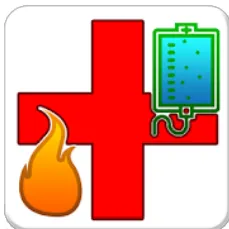
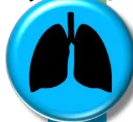
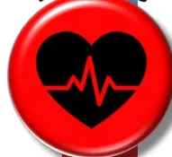
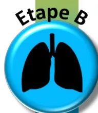
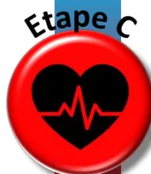
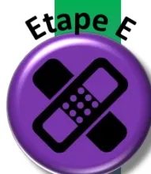

```

graph TD
    Start[Signes de gravité] --> GradeA[Grade A]
    GradeA --> GradeAList["Grade A  
Grand brûlé « + »  
• PAS < 90 mm Hg malgré la réanimation hémodynamique  
• Nécessité de transfusion préhospitale  
• Détresse respiratoire aiguë et/ou ventilation mécanique difficile avec une SpO2 < 90%"]
    GradeAList -- Oui --> Stabilisation[Stabilisation dans déchocage / réa de proximité]
    Stabilisation --> StabilisationText["Stabilisation dans déchocage / réa de proximité"]
    StabilisationText --> StabilisationText
    StabilisationText --> OrientationA["TELEMEDECINE  
+ TRANSFERT  
CTB"]
    GradeAList -- Non --> GradeB[Grade B]
    GradeB --> GradeBList["Grade B  
Brûlé grave  
• Surface cutanée brûlée (SCB) > 20%  
• SCB du troisième degré > 5%  
• Syndrome d'inhalation de fumées  
• Localisation à risque fonctionnel profonde : face, mains, pieds, périnée  
• Brûlure électrique haut voltage"]
    GradeBList -- Oui --> TraitementB[Traitement]
    TraitementB --> TraitementBText["Annexes 4 et 5"]
    TraitementBText --> TraitementBText
    TraitementBText --> OrientationB["TELEMEDECINE  
+ TRANSFERT  
CTB"]
    GradeBList -- Non --> GradeC[Grade C]
    GradeC --> GradeCList["Grade C  
Brûlé à risque de complications :  
• SCB < 20% MAIS  
• Terrain particulier : âge >75 ans, comorbidités sévères.  
• Inhalation de fumées suspectée ou avérée  
• Brûlure circulaire profonde  
• Localisation à risque fonctionnel superficielle : face, mains, pieds, périnée, plis.  
• SCB > 10%  
• SCB du troisième degré entre 3 et 5%  
• Brûlure électrique bas voltage, Brûlure chimique (acide fluorhydrique)"]
    GradeCList -- Oui --> TraitementC[Traitement]
    TraitementC --> TraitementCText["Annexe 6"]
    TraitementCText --> TraitementCText
    TraitementCText --> OrientationC["CTB  
SYSTEMATIQUE  
+ TELEMEDECINE"]
    GradeCList -- Non --> GradeD[Grade D]
    GradeD --> GradeDList["Grade D  
Brûlé non grave  
• Brûlure thermique SCB second degré < 10% et SCB troisième degré < 3%  
• Et absence de terrain particulier  
• Et absence de brûlure circulaire  
• Et absence de localisation à risque fonctionnel profonde : face, mains, pieds, périnée"]
    GradeDList -- Oui --> TraitementD[Traitement]
    TraitementD --> TraitementDText["Annexe 6"]
    TraitementDText --> TraitementDText
    TraitementDText --> OrientationD["SERVICE DE CHIRURGIE"]
    GradeDList -- Oui --> OrientationD
    OrientationD --> OrientationDText["SERVICE DE CHIRURGIE"]
    OrientationDText --> OrientationDText
    OrientationDText --> RetourD["RETOUR A DOMICILE  
+ Consultation dans un service agréé selon le contexte"]
    RetourD --> RetourDText["RETOUR A DOMICILE  
+ Consultation dans un service agréé selon le contexte"]
    RetourDText --> RetourDText
    RetourDText --> RetourDText
    
```

Annexe 2 : Catégorisation des Brûlures Graves et Orientation chez l'ADULTE

La Surface Cutanée Brûlée d'intérêt ne comprend que les brûlures du 2<sup>ème</sup> et du 3<sup>ème</sup> degré.

SCB : Surface Cutanée Brûlée. CTB : Centre de Traitement des Brûlés.**Signes de gravité**

**Grade A**

**Grand brûlé « + »**

- • Instabilité hémodynamique persistante malgré la réanimation
- • Nécessité de transfusion préhospitale
- • Détresse respiratoire aiguë et/ou ventilation mécanique difficile avec une SpO<sub>2</sub> < 90%

**Oui** → **Stabilisation** → **Stabilisation dans déchocage / réa de proximité** → **Orientation** → **TELEMEDECINE + TRANSFERT CTB**

**Non** → **Grade B**

**Grade B**

**Brûlé grave**

- • **Surface cutanée brûlée (SCB) > 10%**
- • SCB du troisième degré >5%
- • Nourrison < 1 an
- • Comorbidités sévères
- • Syndrome d'inhalation de fumées
- • Localisation à risque fonctionnel profonde : face, mains, pieds, périnée, plis de flexion
- • Brûlure circulaire
- • Brûlure électrique ou chimique

**Oui** → **Traitement** → **Annexes 4bis et 5bis** → **Orientation** → **TELEMEDECINE + TRANSFERT CTB**

**Non** → **Grade C**

**Grade C**

**Brûlé à faible risque de complications :**

- • SCB entre 5 et 10%
- • Et nourrison / enfant > 1 an

**Oui** → **Traitement** → **Annexe 6** → **Orientation ?** → **CTB SYSTEMATIQUE + TELEMEDECINE**

**Non** → **Grade D**

**Grade D**

**Brûlé non grave**

- • Brûlure thermique SCB second degré < 5%
- • Et nourrison / enfant > 1 an
- • Et absence de terrain particulier
- • Et absence de brûlure circulaire
- • Et absence de localisation à risque fonctionnel

**Oui** → **Traitement** → **Annexe 6** → **Orientation** → **SERVICE DE CHIRURGIE**

**Non** → **Orientation** → **RETOUR A DOMICILE** + Consultation dans un service agréé selon le contexte dans les 48 heures

*Annexe 2 : Catégorisation des Brûlures Graves et Orientation chez l'ENFANT*

*La Surface Cutanée Brûlée d'intérêt ne comprend que les brûlures du 2<sup>ème</sup> et du 3<sup>ème</sup> degré.*

*SCB : Surface Cutanée Brûlée. CTB : Centre de Traitement des Brûlés.*Table de Lund et Browder

Règle des 9 de Wallace


<table border="1">
<thead>
<tr>
<th></th>
<th>NN</th>
<th>1 an</th>
<th>5 ans</th>
<th>10 ans</th>
<th>15 ans</th>
<th>Adulte</th>
</tr>
</thead>
<tbody>
<tr>
<td>A</td>
<td>9 1/2</td>
<td>8 1/2</td>
<td>6 1/2</td>
<td>5 1/2</td>
<td>4 1/2</td>
<td>3 1/2</td>
</tr>
<tr>
<td>B</td>
<td>2 3/4</td>
<td>3 1/4</td>
<td>4</td>
<td>4 1/4</td>
<td>4 1/2</td>
<td>4 3/4</td>
</tr>
<tr>
<td>C</td>
<td>2 1/2</td>
<td>2 1/2</td>
<td>2 3/4</td>
<td>3</td>
<td>3 1/4</td>
<td>3 1/2</td>
</tr>
</tbody>
</table>

Application E-Burn CH Saint Luc Saint Joseph





*Annexe 3 : Echelles Standardisées d'Evaluation de la Surface Cutanée Brûlée. La table de Lund & Browder est utilisable chez l'adulte et l'enfant. L'échelle des 9 de Wallace ne s'applique que chez l'adulte. L'application E-Burn CH Saint Luc-Saint Joseph est disponible sur smartphone et téléchargeable à l'aide des QR Codes fournis pour Apple et Android. Dans tous les cas, la Surface Cutanée Brûlée d'intérêt ne comprend que les brûlures du 2<sup>ème</sup> et du 3<sup>ème</sup> degré.*## PHASE 1 : PREHOSPITALIERE ET HOSPITALIERE INITIALE

**DEBUTER *SANS DELAI* UNE REANIMATION LIQUIDIENNE INTRAVEINEUSE AVEC UNE FORMULE STANDARDISEE**

<table border="1">
<thead>
<tr>
<th></th>
<th>Proposition RFE</th>
<th>Alternative : « règle des 10 »</th>
</tr>
</thead>
<tbody>
<tr>
<td><b>H0 à H1</b></td>
<td>CRISTALLOIDE BALANCE : 20 ml / kg de poids</td>
<td rowspan="3">
                    Poids du patient &lt; 80 kg :<br/>(10 x % de SCB) ml / heure<br/><br/>
                    Poids du patient &gt; 80 kg :<br/>(idem + 100 ml / 10 kg de poids au-dessus de 80 kg) ml / heure
                </td>
</tr>
<tr>
<td><b>H0 à H8</b></td>
<td>CRISTALLOIDE BALANCE : 1 à 2 ml / kg de poids / % de SCB<br/>Débit horaire incluant les apports liquidiens préhospitaliers</td>
</tr>
<tr>
<td><b>H8 à H24</b></td>
<td>CRISTALLOIDE BALANCE : 1 à 2 ml / kg de poids / % de SCB</td>
</tr>
</tbody>
</table>

Exemple clinique : Patient de 75 kg brûlé sur 50% de la surface cutanée.

A la prise en charge préhospitalière, le patient sera perfusé et déshabillé. Le bolus initial est débuté par 20 ml/kg de Ringer Lactate en attendant d'avoir une estimation de la SCB, soit  $20 \times 75 = 1500$  mL la première heure.

Une fois le patient examiné et déshabillé (à l'arrivée dans un SAU par exemple), le débit de remplissage sera déterminé par la règle des 10 soit : Vitesse de remplissage (mL/h de Ringer Lactate) =  $10 \times 50 = 500$  mL/h.

A l'arrivée dans un CTB, la SCB est réévaluée précisément avec les tableaux de Lund et Browder. Les vitesses indicatives de remplissage seront calculées avec la formule locale (entre 2 et 4 mL/kg de Ringer Lactate) pour les 48 premières heures en intégrant les fluides déjà administrés.

Dès que possible, la réponse clinique au remplissage vasculaire devra être évaluée et guider l'adaptation des débits de remplissage.

## PHASE 2 : HOSPITALIERE : ADAPTER *SANS DELAI* LA REANIMATION LIQUIDIENNE INTRAVEINEUSE

Cette adaptation s'envisage le plus tôt possible, au moyen de critères cliniques et biologiques et du monitoring hémodynamique. Ces critères présentent tous des limites, et ne doivent pas être suivis aveuglément. Ils doivent plutôt être considérés comme des **SIGNES D'ALERTE**, à l'origine d'une réflexion basée sur la physiopathologie et l'intégration multiparamétrique des données recueillies.

L'objectif de la réanimation n'est pas de normaliser ces paramètres.

La « précharge-dépendance » est un phénomène physiologique.

La recherche d'une « précharge-indépendance » est non physiologique et à proscrire au cours des premières heures de la prise en charge.

```

graph TD
    Q1["Question 1 : le brûlé est-il stable avec le régime de remplissage choisi ?  
• Hémodynamique stable, PAM 65 mmHg  
• Diurèse 0,5 à 1 ml/kg/h  
• Lactate ou déficit en bases en diminution"]
    Q2["Question 2 : existe-t-il des arguments pour majorer le débit de réanimation liquideenne ?  
• Hématocrite en hausse ?  
• Arguments pour une hypovolémie ? (selon les outils disponibles)"]
    Q3["Question 3 : existe-t-il des arguments pour suspecter l'apparition d'une ?  
• VASOPLEGIE : PAD basse / Différentielle élevée ?  
• DYSFONCTION MYOCARDIQUE"]
    A1["Réduire le débit horaire d'hydratation de 20%"]
    A2["EPREUVE DE REMPLISSAGE « test »"]
    A3["Majorer le débit horaire d'hydratation de 20%  
Discuter l'introduction D'ALBUMINE  
(SCB > 30%, après la 6ème heure, 1 à 2 g/kg, qsp Albuminémie)"]
    A4["Discuter l'introduction de catécholamines  
• NORADRENALINE ? Eliminer un sepsis précoce  
• DOBUTAMINE ? Adrénaline ?"]

    Q1 -- OUI --> A1
    Q1 -- NON --> Q2
    Q2 -- OUI --> A2
    Q2 -- Si PAM < 65 mmHg --> A2
    Q2 -- Négative --> Q3
    A2 -- Positive --> A3
    Q3 -- OUI --> A4
    
```<table border="1">
<thead>
<tr>
<th data-bbox="52 85 301 128">Formule de Parkland modifiée</th>
<th data-bbox="301 85 611 128">Réanimation liquidienne H0 à H24</th>
<th data-bbox="611 85 968 128">Réanimation liquidienne H24 à H48</th>
</tr>
</thead>
<tbody>
<tr>
<td data-bbox="52 128 301 265" style="text-align: center;"><i>Débit horaire</i></td>
<td data-bbox="301 128 611 265">
<ul style="list-style-type: none;">
<li>• <b>3 mL x SCB (en %) x Poids (en kg) :</b>
<ul style="list-style-type: none;">
<li>- 50 % sur les premières 8 heures</li>
<li>- 50% sur les 16 heures suivantes</li>
</ul>
</li>
<li style="text-align: center;">+</li>
<li>• <b>Apports de base, avec débit horaire calculé sur la règle des '4-2-1' :</b>
<ul style="list-style-type: none;">
<li>- 4 mL/Kg pour les 10 premiers Kg, plus</li>
<li>- 2 mL/Kg pour les kilos entre 10 et 20 Kg, plus</li>
<li>- 1 mL/Kg pour les kilos &gt; 20 Kg.</li>
</ul>
</li>
</ul>
</td>
<td data-bbox="611 128 968 265">
<ul style="list-style-type: none;">
<li>• <b>1,5 mL x SCB (en %) x Poids (en kg) :</b>
<ul style="list-style-type: none;">
<li>- A répartir sur les 24 heures</li>
</ul>
</li>
<li style="text-align: center;">+</li>
<li>• <b>Apports de base, avec débit horaire calculé sur la règle des '4-2-1' :</b>
<ul style="list-style-type: none;">
<li>- 4 mL/Kg pour les 10 premiers Kg, plus</li>
<li>- 2 mL/Kg pour les kilos entre 10 et 20 Kg, plus</li>
<li>- 1 mL/Kg pour les kilos &gt; 20 Kg.</li>
</ul>
</li>
</ul>
</td>
</tr>
<tr>
<td data-bbox="52 265 301 353" style="text-align: center;"><i>Solutés à perfuser</i></td>
<td data-bbox="301 265 611 353">
<ul style="list-style-type: none;">
<li>• <b>Nourrisson (&lt; 1 an) :</b>
<ul style="list-style-type: none;">
<li>- 50 % : Ringer Lactate</li>
<li>- 50% : G5%</li>
</ul>
</li>
<li>• <b>Enfant &gt; 1 an :</b>
<ul style="list-style-type: none;">
<li>- 2/3 : Ringer Lactate</li>
<li>- 1/3 : G5%</li>
</ul>
</li>
</ul>
</td>
<td data-bbox="611 265 968 353"></td>
</tr>
<tr>
<td data-bbox="52 353 301 411" style="text-align: center;"><i>Surveillance et adaptation</i></td>
<td colspan="2" data-bbox="301 353 968 411">
<ul style="list-style-type: none;">
<li>• Paramètres hémodynamiques</li>
<li>• Diurèse horaire : entre 0,5 et 1,5 mL/Kg/h</li>
<li>• Densité urinaire : entre 1010 et 1020</li>
<li>• Natrémie, Glycémie, osmolarité</li>
</ul>
</td>
</tr>
</tbody>
</table>

Annexe 5bis : Réanimation hémodynamique du brûlé grave PEDIATRIQUE**Etape A**


**Contrôle et protection des voies aériennes**

- • Envisager l'intubation trachéale si :
  - Détresse respiratoire aiguë  Coma
  - Brûlure de la totalité du visage ET brûlure profonde et circulaire du cou
  - Brûlure de la totalité du visage ET symptômes d'obstruction des voies aériennes débutants ou installés (modifications de la voix, stridor, dyspnée laryngée)
  - Brûlure de la totalité du visage ET brûlure très étendue (SCB ≥ 40%)
- • Si l'indication d'intubation est retenue : INDUCTION EN SEQUENCE RAPIDE
  - Kétamine 2 à 3 mg/kg OU  Etomidate 0,2 à 0,3 mg/kg
  - +  Succinylcholine 1 mg/kg OU  Rocuronium 1,2 mg/kg

**LA SUCCINYLCHOLINE EST AUTORISEE DANS LES 48 PREMIERES DE LA BRÛLURE PAS DE FIBROSCOPIE BRONCHIQUE EN DEHORS D'UNE CENTRE DE TRAITEMENT DES BRÛLES**

**Etape B**



**Maintien de la ventilation et de l'oxygénation**

- • Hors inhalation de fumées :
  - Oxygénéthérapie objectif SpO<sub>2</sub> 92 – 96% (ONHD si besoin).
  - Ventilation protectrice FiO<sub>2</sub> objectif SpO<sub>2</sub> 92 – 96%.
- • Si inhalation de fumées d'incendie :
  - O<sub>2</sub> 15 l/min au MHC ou ONHD FiO<sub>2</sub> 1 pendant 6 à 12 heures.
  - Ventilation protectrice FiO<sub>2</sub> 1 pendant 6 à 12 heures, puis objectif SpO<sub>2</sub> 92 – 96%.

**PAS D'ANTIBIOTHERAPIE SYSTEMATIQUE EN CAS D'INHALATION DE FUMEEES**

**Etape C**



**Réanimation liquide (cf Annexe 5)**

- •  Voie Veineuse Périphérique x 2  Dispositif Intra Osseux  Voie Veineuse Centrale
- • Perfusion par un soluté **CRISTALLOÏDE BALANCE (ex : RINGER LACTATE)** au débit de :
  - **20 ml/kg durant la 1<sup>ère</sup> heure de prise en charge,**
  - **Puis 1 à 2 ml/kg/% SCB de H0 à H8, puis 1 à 2 ml/kg/% SCB de H8 à H24**
  - *Alternative : 10 ml x %SCB par heure (+ 100 ml/h/10 kg de poids au-dessus de > 80 kg).*
  - **Puis adaptation secondaire du débit aux données du monitoring.**
- • Noradrénaline IVSE si PA moyenne < 65 mmHg malgré remplissage bien conduit

**UN BRÛLE EST STABLE SAUF INTOXICATION AU CYANURE OU POLYTRAUMATISME ASSOCIES**

**UN BRÛLE N'EST PAS ANEMIQUE SAUF HEMORRAGIE OU HEMOLYSE ASSOCIEES**

**Etape D**


**Traitement des intoxications associées et analgésie**

- • Cyanure : Hydroxocobalamine CYANOKIT® (5g dans 200 ml de NaCl 0.9% sur 30 min, renouvelable 1 fois) en cas de suspicion d'intoxication MAJEURE au cyanure :
  - Arrêt cardiaque OU  Etat de choc OU  Coma, surtout si lactatémie > 10 mmol/l
- • Monoxyde de Carbone : intérêt du CO-testeur en préhospitalier.
  - Oxygénéthérapie normobare 6 à 12 h systématique.
  - Discuter OHB si grossesse, intoxication sévère, patient stable ET plateau technique disponible rapidement.
- • Analgésie IV en titration :  morphine  kétamine et sédation si nécessaire.

**UN BRÛLE EST CONSCIENT SAUF INTOXICATION (CO, médicaments) OU TRAUMATISME CRANIEN ASSOCIES**

**Etape E**


**Protection des zones lésées au SAU**

- Refroidissement des zones brûlées si **SCB < 20%** en l'absence de choc.
- Retrait des bijoux
- • Si évacuation rapide vers un CTB : NE PAS FAIRE DE PANSEMENT
  - ▪ Brûlure(s) :  Emballée(s) dans un/des **champ(s) stérile(s)**  Ne pas exciser les phlyctènes
  - **NE PAS REALISER D'ESCARROTOMIE**  **Surélever** le(s) membre(s) brûlé(s)
  - ▪ Brûlé :  Position ½ assis  **Réchauffement externe** (couverture de survie)
- • Si pas d'évacuation rapide possible, ou évacuation longue prévue, ou lésions très souillées : AVIS CTB pour
  - Couverture des brûlures (cf Annexe 6)
  - Discuter des escarrotomies.
- Sondage urinaire précoce si brûlure des organes génitaux externes
- Quick Test +/- VAT

**NE PAS APPLIQUER DE CREME OU POMMADE sauf si indiqué par le CTB référent**

**RECHAUFFER ET PREVENIR L'HYPOTHERMIE**

**PAS D'ANTIOPROPHYLAXIE SAUF LESION TRES SOUILLEE**

**Contrôle et protection des voies aériennes**

- • Envisager l'intubation trachéale si :
  - Détresse respiratoire aiguë  Etat de Choc  Coma
  - Brûlure de la totalité du visage ET brûlure très étendue (i.e SCB > 60%)
  - Brûlure de la totalité du visage ET brûlure profonde et circulaire du cou
  - Brûlures de la totalité du visage ET symptômes d'obstruction des voies aériennes débutants ou installés\*
  - Transport prolongé
- • Si l'indication d'intubation est retenue : INDUCTION EN SEQUENCE RAPIDE
  - Kétamine 2 à 3 mg/kg OU  Etomidate 0,2 à 0,3 mg/kg
  - +  Succinylcholine 1 mg/kg OU  Rocuronium 1,2 mg/kg

**LA SUCCINYLCHOLINE EST AUTORISEE DANS LES 48 PREMIERES DE LA BRÛLURE  
PAS DE FIBROSCOPIE BRONCHIQUE EN DEHORS D'UNE CENTRE DE TRAITEMENT DES BRÛLES**



**Maintien de la ventilation et de l'oxygénation**

- • Hors inhalation de fumées :
  - Oxygénéthérapie objectif SpO<sub>2</sub> 92 – 96% (ONHD si besoin).
  - Ventilation protectrice FiO<sub>2</sub> objectif SpO<sub>2</sub> 92 – 96%.
- • Si inhalation de fumées d'incendie :
  - O<sub>2</sub> 15 l/min au MHC ou ONHD FiO<sub>2</sub> 1 pendant 6 à 12 heures.
  - Ventilation protectrice FiO<sub>2</sub> 1 pendant 6 à 12 heures, puis objectif SpO<sub>2</sub> 92 – 96%.

**PAS D'ANTIBIOTHERAPIE SYSTEMATIQUE EN CAS D'INHALATION DE FUMÉES**



**Réanimation liquidienne (cf Annexe 5bis)**

- •  Voie Veineuse Périphérique x 2  Dispositif IntraOsseux  Voie Veineuse Centrale
- • Perfusion par un soluté **CRISTALLOÏDE BALANCE (ex : RINGER LACTATE)** selon la formule de Parkland Modifiée :
  - **1,5 ml/kg/% SCB de H0 à H8, puis 1,5 ml/kg/% SCB de H8 à H24 + apports de base**
  - *Si instabilité :* Eventuellement **20 ml/kg en bolus +/- Gélatines (HEA contre indiqués)**
- • Noradrénaline IVSE si instabilité hémodynamique malgré 3 expansions volémiques
  - < 1 an : Si PA moyenne < 45 mmHg
  - > 1 an : Si PA moyenne < 50 mmHg

**UN BRÛLE EST STABLE SAUF INTOXICATION AU CYANURE OU POLYTRAUMATISME ASSOCIES**

**UN BRÛLE N'EST PAS ANEMIQUE SAUF HEMORRAGIE OU HEMOLYSE ASSOCIEES**


**Traitement des intoxications associées et analgésie**

- • Cyanure : Hydroxocobalamine CYANOKIT® (70 mg/kg sans dépasser 5g sur 30 min, renouvelable une fois) en cas de suspicion d'intoxication au cyanure :
  - • Majeure :  Arrêt cardiaque OU  Etat de choc OU  Coma, surtout si lactatémie > 10 mmol/l
  - • Modérée :  GCS < 13, confusion OU  Dyspnée, polypnée OU  Stridor, voix rauque, suie dans les VAS
- • Monoxyde de Carbone : intérêt du CO-testeur en préhospitalier.
  - Oxygénéthérapie normobare 6 à 12 h systématique.
  - Discuter OHB si intoxication sévère, enfant stable, et plateau technique disponible rapidement.

**UN BRÛLE EST CONSCIENT SAUF INTOXICATION (CO, médicaments) OU TRAUMATISME CRANIEEN ASSOCIES**



**Protection des zones lésées au SAU**

- Refroidissement des zones brûlées si **SCB < 10%** en l'absence de choc.
- Retrait des bijoux
- • Si évacuation rapide vers un CTB : NE PAS FAIRE DE PANSEMENT
  - ▪ Brûlure(s) :  Emballée(s) dans un/des **champ(s) stérile(s)**  Ne pas exciser les phlyctènes
  - **NE PAS REALISER D'ESCARROTOMIE**  **Surélever** le(s) membre(s) brûlé(s)
  - ▪ Brûlé :  Position ½ assis  **Réchauffement externe** (couverture de survie)
- • Si pas d'évacuation rapide possible, ou évacuation longue prévue, ou lésions très souillées : AVIS CTB pour
  - Couverture des brûlures (cf. Annexe 6)
  - Discuter des escarrotomies.
- Sondage urinaire précoce si brûlure des organes génitaux externes
- Quick Test +/- VAT

**NE PAS APPLIQUER DE CREME OU POMMADE** sauf si indiqué par le CTB référent

**RECHAUFFER ET PREVENIR L'HYPOTHERMIE**

**PAS D'ANTIBIOPROPHYLAXIE SAUF LÉSION TRES SOUILLEE**La réalisation d'un pansement doit respecter les règles d'**hygiène et d'asepsie**, et se dérouler dans une ambiance thermique permettant de limiter les risques d'**hypothermie**. Une **analgesie**, voire **anesthésie** adéquate doit être assurée.

**ETAPE 1 : NETTOYAGE MECANIQUE**

- Nettoyer les zones brûlées avec de l'eau du robinet, du NaCl 0,9%, ou un antiseptique dilué (Chlorhexidine ou Povidone iodée scrub)
- Exciser les phlyctènes
- Sécher par tamponnement

**ETAPE 2 : COUVERTURE PAR PANSEMENT**

La couverture de brûlures étendues comprend en général l'application

- d'une interface
- de compresses stériles
- de bandes ou de filets de protections.

L'utilisation systématique de crèmes ou pommades avant l'interface est optionnelle.

Quoiqu'il en soit, la pose de l'interface ne doit pas être circulaire, ni le pansement trop compressif, afin **d'éviter une effet « garrot »**.

Le choix des différents matériels dépend principalement de l'étendue de la brûlure, de sa propreté, et d'habitudes de service.

EN PÉDIATRIE, les brûlures sont volontiers **laissées à l'air** après nettoyage, et les tuelles gras sont en règle proscrits.


**BRULURE PEU ETENDUE ET PROPRE**

Selon l'importance de l'Exsudat


- **Tulle Gras Neutre**  
  (ex : Jelonet®, Urgotul®...)
- **Hydrocolloïdes**  
  (ex : Duoderm®, Ialuset®, Comfeel®...)
- **Hydrofibres**  
  (ex : Aquacel®...)
- **Hydrocellulaires**  
  (ex : Mepilex®, Allevyn®, Biatain®...)
- **Alginate**  
  (ex : Algostéril®, Flaminal®...)


**BRULURE ETENDUE OU CONTAMINEE**

Utilisation d'un antiseptique

- **Pansement à base d'antiseptiques**  
  (Chlorhexidine, Povidone iodée...)
- **Pansement à base d'argent**  
  (Flammazine®, Flammacérium®, plaques d'hydrofibres argentiques, plaques d'hydrocellulaires argentiques...)

**PAS D'ANTIBIOTHERAPIE SYSTEMIQUE**

**PRENDRE CONTACT** avec un **CENTRE DE TRAITEMENT DES BRÛLES POUR CONSEIL** en cas de **DOUTE** OU de **BRÛLURE ÉTENDUE**

**TOUTE BRÛLURE DU 2EME OU DU 3EME DEGRÉ DOIT ÊTRE MÉDICALEMENT SURVEILLÉE ET ADRESSÉE A UN CHIRURGIEN SPÉCIALISÉ DANS LES 48 HEURES CHEZ L'ENFANT, et EN L'ABSENCE DE CICATRISATION APRES 10 JOURS.**

*Annexe 6 : Soins locaux de la brûlure. Phase de nettoyage. Phase de couverture.*<table border="1">
<thead>
<tr>
<th data-bbox="78 115 263 138">Age</th>
<th colspan="2" data-bbox="263 115 905 138">Besoins caloriques quotidiens</th>
</tr>
</thead>
<tbody>
<tr>
<td data-bbox="78 138 263 208"><b>Adulte : Formule de Toronto</b></td>
<td colspan="2" data-bbox="263 138 905 208">
<math display="block">- 4343 + (10,5 \times \% \text{ SCB}) + (0,23 \times \text{calories ingérées la veille}) + (0,84 \times \text{dépense énergétique de repos}) + (114 \times T^\circ \text{ corporelle})</math>
<math display="block">- (4,5 \times \text{nombre de jours post-brûlure})</math>
</td>
</tr>
<tr>
<td data-bbox="78 208 263 253"><b>3 à 10 ans : Formule de Schofield</b></td>
<td data-bbox="263 208 584 253">
<b>Fille : <math>(16,97 \times \text{poids kg}) + (1,618 \times \text{taille cm}) + 371,2</math></b>
</td>
<td data-bbox="584 208 905 253">
<b>Garçon : <math>(19,6 \times \text{poids kg}) + (1,033 \times \text{taille cm}) + 414,9</math></b>
</td>
</tr>
<tr>
<td data-bbox="78 253 263 298"><b>10 à 18 ans : Formule de Schofield</b></td>
<td data-bbox="263 253 584 298">
<b>Fille : <math>(8,365 \times \text{poids kg}) + (4,65 \times \text{taille cm}) + 200</math></b>
</td>
<td data-bbox="584 253 905 298">
<b>Garçon : <math>(16,25 \times \text{poids kg}) + (1,372 \times \text{taille cm}) + 515,5</math></b>
</td>
</tr>
</tbody>
</table>

Annexe 7 : Besoins nutritionnels caloriques quotidiens du brûlé grave à la phase aiguë. La dépense énergétique de repos se calcule à l'aide de la formule de Harris et Benedict. L'apport en vitamines et éléments-traces n'est pas une priorité des premières heures et les doses requises sont disponibles dans les RFE « Nutrition Artificielle en Réanimation » de la SFAR.