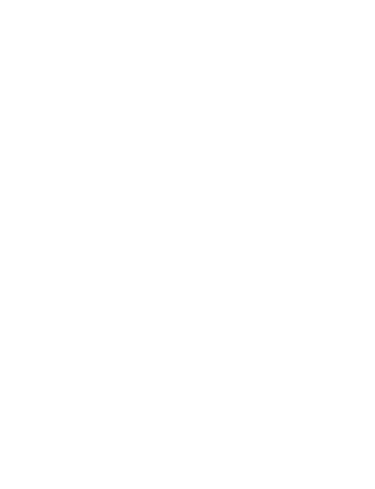

## EVALUATION DU RISQUE COVID-19 ET IMPACT SUR LA PRISE EN CHARGE EN ENDOSCOPIE DIGESTIVE

**Mai 2020**

### **A/ Introduction.**

La pandémie de COVID-19 liée au coronavirus (SARS-CoV-2) a rapidement entraîné une saturation de nos systèmes de soins, imposant une limitation importante de l'activité d'endoscopie digestive.

Après une stabilisation de la situation, il est actuellement envisagé, à partir du 11 mai 2020, la reprise progressive d'une activité dont le cadre et les modalités dépendront de l'évolution de l'épidémie sur le territoire dans les prochaines semaines.

Cette phase transitoire est assujettie à un double impératif :

- - permettre la réalisation d'examens ou d'interventions dont certaines ont déjà été reportées ;
- - limiter le risque de contamination des patients et des personnels soignants.

Si ce risque ne peut en aucun cas être nul, il peut en revanche être limité par un certain nombre de facteurs liés à l'organisation de l'activité et au screening des patients.

Certains ont déjà fait l'objet de recommandations de la SFED, consultables sur son site Internet (rubrique COVID-19) :

- - évaluer le rapport bénéfice/risque de la réalisation de l'intervention dans les conditions actuelles ;
- - assurer la protection des personnels (visière et FFP2) et des patients en salle d'endoscopie, mais également tout au long de leur parcours dans les structures de soins ;
- - favoriser et anticiper des circuits dédiés.

L'objet de cette recommandation SFED-SFAR est de fixer les modalités d'évaluation du risque infectieux à COVID-19 pour l'activité d'endoscopie digestive, à l'aide d'un questionnaire dédié et d'en déduire les algorithmes de prise en charge spécifiques dans le cadre de l'endoscopie, d'urgence ou programmée, **pour les deux prochains mois**. Ces recommandations, qui ont fait l'objet d'une discussion et d'une validation avec la SFAR, seront réévaluées régulièrement dans leurs modalités en fonction de l'évolution de la situation sanitaire et des connaissances.

### **B/ Questionnaire COVID-19 endoscopie (cf Annexe 1) pour une intervention programmée.**

Ce questionnaire sera à renseigner en consultation, par l'hépato-gastroentérologue ou le médecin prescripteur lors de la consultation initiale, puis l'anesthésiste et enfin en auto-questionnaire, par le patient la veille et le jour du geste endoscopique. Ce questionnaire comporte des symptômes digestifs car on sait qu'environ 10 % des patients ayant une infection par le COVID-19 ont des signes digestifs, le plus souvent à type de diarrhées. Les symptômes digestifs rapportés dans ce questionnaire sont ceux d'apparition récente, surtout s'ils sont associés à d'autres signes tels que la fièvre, la toux ou l'asthénie.## **1. Consultation initiale.**

Après avoir retenu l'indication d'un examen endoscopique, l'hépato-gastroentérologue ou le médecin prescripteur procède au questionnaire standardisé. Celui-ci a pour but d'évaluer le risque COVID-19 et d'envisager le cas échéant soit une programmation incluant le dépistage (RT-PCR), soit le report de l'examen le temps de guérison clinique.

## **2. Consultation d'anesthésie.**

Cette dernière doit être positionnée au regard du risque COVID et en tenant compte d'autres impératifs (gestion de l'arrêt des anticoagulants, *etc.*) au plus près de l'intervention. Conformément aux recommandations de la SFAR, le patient et/ou ses représentants légaux y seront informés, oralement et par écrit, des conditions particulières liées à la pandémie de COVID-19, notamment de l'évaluation du rapport bénéfice/risque lié à l'intervention et du circuit envisagé (COVID+ ou non-COVID) au regard de sa pathologie et son niveau de risque. Le traçage dans le dossier du patient de cette information est indispensable. Un modèle de lettre d'information pour un parcours de soins vous est proposé (cf. Annexe 2).

Tout au long du parcours et à chacune de ces étapes, en cas d'annulation ou de report de l'intervention, il est essentiel de garder le contact avec le patient, par son inscription sur une liste d'attente, afin de réévaluer les alternatives possibles et la faisabilité du geste à distance en fonction de l'évolution des conditions. Le praticien, l'équipe d'anesthésie ou la cellule de programmation doivent être informés de cette annulation et du processus de dépistage mis en place. Si cette annulation est du fait du patient, le report ou l'annulation par le patient de l'examen endoscopique doivent également être tracés dans le dossier médical.

## **3. Veille de l'examen.**

Le questionnaire devra à nouveau être renseigné par le patient. En cas de signes cliniques d'apparition récente, l'information sera préalablement donnée au patient de contacter l'unité d'endoscopie afin de prendre les mesures recommandées, à savoir un report de l'intervention et la réalisation d'un test de dépistage par RT-PCR. Cet auto-questionnaire devra être réalisé par le patient avant le début de l'éventuelle préparation colique.

## **4. Arrivée dans l'unité d'endoscopie.**

A nouveau, le risque doit être évalué le jour de l'examen. Le port du masque et le lavage des mains sont obligatoires pour tous les patients entrant dans l'unité d'endoscopie. Le recueil du questionnaire, sa validation et la prise de la température seront ensuite effectués par le personnel, avant son installation en salle d'attente afin de limiter les contacts. En cas de signes cliniques découverts lors de l'arrivée, il est recommandé d'isoler le patient et de l'envoyer dans un centre de dépistage du COVID-19 pour faire une RT-PCR le jour même.

## **C/ Interprétation des résultats du questionnaire COVID-19 endoscopie et du suivi pour une intervention programmée (cf. Algorithme 1).**

### **1. En cas d'intervention programmée chez un patient non suspect.**

Chez un patient ne présentant aucun signe clinique au terme des quatre phases d'évaluation et qui n'a présenté aucun contact étroit avec un patient COVID-19 suspect ou avéré dans les quinze jours précédents, l'intervention peut être réalisée selon les modalités de protection des personnes indiquées précédemment.En cas de coloscopie (qui n'est pas associée à une aérosolisation d'éventuelles particules virales chez un patient asymptomatique), il est recommandé, à l'issue de l'examen, de nettoyer les brancards ainsi que les éléments en contact proche avec le patient (processeur, clavier source ...). Les patients peuvent se succéder sans obligation de ventiler la salle.

En cas de gestes endoscopiques par voie haute (gastroscopie, entéroscopie, échoendoscopie, CPRE ...) qui sont considérés comme aérosolisants, et même s'il existe un risque minimal de faire une endoscopie à un patient asymptomatique qui serait porteur du SARS-CoV-2, il est recommandé, afin d'éviter une aérobiocontamination :

- - un bio-nettoyage initial du sol et des surfaces en cas de souillures provenant de la bouche ou de l'oro-pharynx ;
- - une ventilation de la salle. Il n'existe pas de recommandations précises concernant les salles d'endoscopie pour les examens à risque d'aérosolisation. Le Haut Conseil de la Santé Publique a rendu un avis en date du 17 mars 2020 relatif à la réduction du risque de transmission du SARS-CoV-2 par la ventilation et à la gestion des effluents des patients COVID-19. L'activité d'endoscopie relève dans cet avis des classes de risque 2 (ISO 8) et 3 (ISO 7). Le temps de renouvellement de l'air nécessaire est ainsi défini par la classe de risque. Il doit être calculé par les services techniques de votre établissement, en fonction des volumes, de la norme ISO recherchée et de la capacité des équipements (cf. Annexe 3) ;
- - il est inutile et déconseillé d'associer la ventilation à l'ouverture des fenêtres.

## **2. En cas d'intervention programmée chez un patient suspect.**

Le report doit être envisagé et un dépistage par RT-PCR prescrit. En cas de RT-PCR positive, un report d'au moins deux mois RT-PCR doit être envisagé. Même si le report généralement recommandé est d'un mois, la persistance de certains signes cliniques de manière prolongée (diarrhées) n'est pas rare. Ceci aurait pour conséquence d'entraîner pour un examen non urgent un nouveau report de l'intervention et de participer inutilement à la désorganisation des soins. En revanche, en cas d'examen considéré comme semi-urgent, notamment au regard d'une perte de chance potentielle liée au retard, l'examen pourrait être programmé plus précocement, dans un circuit COVID+.

## **D/ Interprétation des résultats du questionnaire COVID-19 endoscopie pour une intervention urgente (cf. Algorithme 2).**

### **1. En cas d'intervention urgente chez un patient non suspect.**

Pour une intervention urgente, le questionnaire devra être également renseigné avant le geste. Chez un patient ne présentant aucun signe clinique et sans contact étroit avec un patient COVID-19 suspect ou avéré dans les quinze jours précédents, l'intervention peut être réalisée selon les modalités précédemment définies.

### **2. En cas d'intervention urgente chez un patient suspect.**

En cas d'urgence, le patient est le plus souvent hospitalisé. Certains signes cliniques (fièvre par exemple) peuvent faire partie du tableau clinique de la pathologie (angiocholite ...). Une RT-PCR (+/- scanner thoracique en cas de signes pulmonaires) est recommandée mais son résultat ne doit pas faire changer le délai de réalisation du geste endoscopique qui sera réalisé selon les modalités d'un circuit COVID+ (endoscopie avec protection du personnel, circuit dédié, réveil en salle d'endoscopie, surveillance en salle d'endoscopie et remontée en chambre si absence d'hypoxémie, de polypnée ou de dyspnée).Annexe 1

**QUESTIONNAIRE COVID ENDOSCOPIE**

**Mr / Mme :**

**Date de naissance :**

**Numéro de dossier :**

**Date d'intervention programmée :**

<table border="1">
<thead>
<tr>
<th><b>Avez-vous actuellement ou avez-vous eu dans les jours précédents un ou plusieurs des symptômes suivants de façon <u>inhabituelle</u></b></th>
<th><b>Cs HGE</b></th>
<th><b>Cs MAR</b></th>
<th><b>Veille de l'examen</b></th>
<th><b>Jour de l'examen</b></th>
</tr>
</thead>
<tbody>
<tr>
<td><b>Date</b></td>
<td></td>
<td></td>
<td></td>
<td></td>
</tr>
<tr>
<td>Fièvre (mesurée <math>\geq 38^{\circ}\text{C}</math>)</td>
<td>OUI - NON</td>
<td>OUI - NON</td>
<td>OUI - NON</td>
<td>OUI - NON</td>
</tr>
<tr>
<td>Toux sèche</td>
<td>OUI - NON</td>
<td>OUI - NON</td>
<td>OUI - NON</td>
<td>OUI - NON</td>
</tr>
<tr>
<td>Dyspnée (ou fréquence respiratoire <math>\geq 20</math>)</td>
<td>OUI - NON</td>
<td>OUI - NON</td>
<td>OUI - NON</td>
<td>OUI - NON</td>
</tr>
<tr>
<td>Perte de l'odorat</td>
<td>OUI - NON</td>
<td>OUI - NON</td>
<td>OUI - NON</td>
<td>OUI - NON</td>
</tr>
<tr>
<td>Perte du goût</td>
<td>OUI - NON</td>
<td>OUI - NON</td>
<td>OUI - NON</td>
<td>OUI - NON</td>
</tr>
<tr>
<td>Douleur lors de la déglutition</td>
<td>OUI - NON</td>
<td>OUI - NON</td>
<td>OUI - NON</td>
<td>OUI - NON</td>
</tr>
<tr>
<td>Ecoulement par le nez</td>
<td>OUI - NON</td>
<td>OUI - NON</td>
<td>OUI - NON</td>
<td>OUI - NON</td>
</tr>
<tr>
<td>Douleur thoracique</td>
<td>OUI - NON</td>
<td>OUI - NON</td>
<td>OUI - NON</td>
<td>OUI - NON</td>
</tr>
<tr>
<td>Douleurs musculaires</td>
<td>OUI - NON</td>
<td>OUI - NON</td>
<td>OUI - NON</td>
<td>OUI - NON</td>
</tr>
<tr>
<td>Fatigue importante et inhabituelle</td>
<td>OUI - NON</td>
<td>OUI - NON</td>
<td>OUI - NON</td>
<td>OUI - NON</td>
</tr>
<tr>
<td>Confusion</td>
<td>OUI - NON</td>
<td>OUI - NON</td>
<td>OUI - NON</td>
<td>OUI - NON</td>
</tr>
<tr>
<td>Maux de têtes</td>
<td>OUI - NON</td>
<td>OUI - NON</td>
<td>OUI - NON</td>
<td>OUI - NON</td>
</tr>
<tr>
<td>Diarrhées inhabituelles</td>
<td>OUI - NON</td>
<td>OUI - NON</td>
<td>OUI - NON</td>
<td>OUI - NON</td>
</tr>
<tr>
<td>Nausées / vomissements inhabituels</td>
<td>OUI - NON</td>
<td>OUI - NON</td>
<td>OUI - NON</td>
<td>OUI - NON</td>
</tr>
<tr>
<td>Eruption cutanée ou engelures / crevasses aux doigts ou à la main</td>
<td>OUI - NON</td>
<td>OUI - NON</td>
<td>OUI - NON</td>
<td>OUI - NON</td>
</tr>
<tr>
<td>Avez-vous été en contact étroit (en face à face, à moins d'1 mètre et/ou pendant plus de 15 minutes, sans masque ni pour vous ni pour le contact) avec une personne atteinte de COVID de façon prouvée au cours des 15 derniers jours ?</td>
<td>OUI - NON</td>
<td>OUI - NON</td>
<td>OUI - NON</td>
<td>OUI - NON</td>
</tr>
</tbody>
</table>A completely blank white page with no visible content, text, or markings.## ALGORITHME 1

# ENDOSCOPIE PROGRAMMÉE

```
graph TD
    Q["Questionnaire standardisé  
- En consultation initiale  
- En consultation d'anesthésie  
- Par auto-questionnaire, la veille de l'examen  
- Le jour de l'intervention, à l'admission, avec prise de température par le personnel soignant"]
    Q --> S1["Patient suspect de Covid-19"]
    Q --> S2["Patient non suspect"]
    S1 --> B["PCR COVID-19  
sur écouvillon naso-pharyngé pré-opératoire  
Bilan biologique: NFS, CRP"]
    B -- "PCR +" --> R1["Report de l'endoscopie  
d'au moins deux mois à partir de l'apparition des symptômes dans circuit COVID+ (hors urgence, sinon circuit COVID+)"]
    B -- "PCR -" --> C1["Tableau clinique toujours évocateur ?  
Absence d'autre diagnostic infectieux ?  
Lymphopénie +/- éosinopénie +/- CRP élevée ?"]
    C1 -- "Oui" --> R1
    C1 -- "Non" --> C2["Infection Covid-19 peu probable  
Report de l'endoscopie jusqu'à disparition des symptômes"]
    S2 --> E1["Endoscopie"]
    E1 --> F1["Veille à 15 jours pour suivi du risque infectieux"]
```

## Algorithmme 2

# ENDOSCOPIE URGENTE

```
graph TD
    Q["Questionnaire standardisé  
- En consultation initiale  
- En consultation d'anesthésie  
- Par auto-questionnaire, la veille de l'examen  
- Le jour de l'intervention, à l'admission, avec prise de température par le personnel soignant"]
    Q --> S1["Patient fortement suspect de Covid-19"]
    Q --> S2["Patient non suspect"]
    S1 --> B["PCR COVID-19  
Ne pas attendre les résultats  
Discuter TDM thoracique si signes pulmonaires"]
    B --> C1["Endoscopie avec protection du personnel  
Circuit dédié  
Réveil en salle d'endoscopie  
Remontée en chambre si absence d'hypoxémie, polypnée, dyspnée"]
    S2 --> E1["Endoscopie"]
    E1 --> F1["Veille à 15 jours pour suivi du risque infectieux"]
```

**Circuit COVID+**## Annexe 2

### INFORMATION PATIENTS

Madame, Monsieur,

Vous allez bénéficier d'une endoscopie digestive dans notre établissement.

En cette période de pandémie, notre établissement veille à accueillir des patients dont le risque d'infection COVID est minimal.

Ainsi, depuis le début de la pandémie, nous avons pris des mesures très strictes destinées à dépister les patients infectés ou fortement suspects de l'être. Ces mesures, décidées selon les directives des autorités sanitaires et des sociétés savantes, ont pour but d'une part d'éviter la réalisation d'un examen en phase aiguë de l'infection qui pourrait être reporté de quelques semaines et d'autre part de protéger les patients non infectés pendant leur séjour ainsi que les personnels soignants.

En amont de votre séjour ambulatoire, il est donc prioritaire de rechercher toutes personnes potentiellement malades et contagieuses non diagnostiquées. En ce sens, un questionnaire « risque COVID » a été rempli par les professionnels de santé lors de votre consultation initiale avec le médecin gastro-entérologue, et le sera à nouveau lors de la consultation d'anesthésie.

Nous vous demandons, et ceci est essentiel pour votre sécurité et celle de tous les professionnels, de remplir un questionnaire la veille de l'examen endoscopique et avant de débuter votre préparation colique. En cas de réponse positive à un des critères, il est impératif que vous contactiez le service d'endoscopie le plus tôt possible, afin de déterminer si le geste endoscopique peut être maintenu.

Lors de votre admission, un dernier contrôle par questionnaire et prise de température, permettra de finaliser votre admission.

Dans le cas contraire, l'examen sera reporté et un examen par RT-PCR COVID par écouvillonnage nasal sera prescrit. La date de report de votre examen sera conditionnée par ce résultat.

Dans le service d'endoscopie, nous avons mis en place des mesures barrières strictes qui vous seront rappelées par les professionnels de santé tout le long de votre séjour. L'objectif de ces mesures est de sécuriser au maximum votre parcours dans l'établissement. Nous vous demandons d'être vigilant au respect de ces mesures de protection.

Enfin, au cours de votre séjour, il est primordial que vous nous signaliez tout symptôme anormal dans les 14 jours qui suivent votre examen, afin que nous puissions diagnostiquer au plus vite une infection COVID-19 et recherchions toutes les personnes contacts durant votre prise en charge.

Soyez enfin assuré(e) que tout sera fait au sein de l'établissement pour que votre prise en charge soit le moins possible affectée par la situation de crise sanitaire que nous traversons.### Annexe 3

## REFERENCES REGLEMENTAIRES CONCERNANT LA QUALITE DE L'AIR DANS LES SALLES D'ENDOSCOPIE

Il n'existe pas de recommandations précises concernant les salles d'endoscopie digestive pour les examens à risque d'aérosolisation. Le Haut Conseil de la Santé Publique a rendu un avis en date du 17 mars 2020 relatif à la réduction du risque de transmission du SARS-CoV-2 par la ventilation et à la gestion des effluents des patients COVID-19. Le traitement de l'air est réglementé dans le milieu hospitalier, via différents codes (de la construction, de la santé publique, du travail ...).

L'activité d'endoscopie relève dans cet avis **des classes de risque 2** (risque infectieux moyen) (ISO 8), voire dans certains cas particuliers de risque 3 (risque infectieux haut) (ISO 7) (cf. Tableau 1).

Le temps de renouvellement de l'air nécessaire est ainsi défini par la classe de risque. Il doit être calculé par les services techniques de votre établissement, qui dépendent de votre direction, en fonction des volumes de la salle, de la norme ISO recherchée et de la capacité des équipements. Ce temps varie en fonction de la nature de votre système de traitement de l'air (centrale de ventilation, ventilation mécanique contrôlée (VMC), fenêtre ou appareil mobile ...).

Les activités de classe 2 doivent répondre à différents critères qui doivent être contrôlés annuellement :

- - une classe de propreté particulière au moins ISO 8 ;  
  ET
- - une cinétique d'élimination qui permette d'éliminer au moins 90 % de la pollution particulière de 0,5 micron en moins de 20 minutes ;  
  ET
- - un taux de brassage de 10 vol/h avec une suppression de 15 Pa ;  
  ET
- - une classe de qualité microbiologique.

A titre d'exemples :

- - avec un centre de traitement de l'air ou une VMC qui permettent un taux de brassage de l'air à 15 volumes par heure, la cinétique de décontamination doit inclure 10 minutes de repos entre deux examens. Pour un brassage de l'air de 10 volumes par heure, ce temps doit être porté à 20 minutes ;
- - en cas d'absence de VMC, la ventilation qui reposerait sur des ouvrants (fenêtres) nécessite 30 minutes de repos entre chaque examen (il est inutile et déconseillé d'associer la ventilation à l'ouverture des fenêtres).Tableau 1. Valeurs guides de performances aéraulique au repos (NF S 90-351, 2013).

<table border="1">
<thead>
<tr>
<th>Classe de risque</th>
<th>Classe de propreté particulière (ISO 14 644-1)</th>
<th>Cinétique d'élimination des particules</th>
<th>Classe de propreté microbiologique</th>
<th>Pression différentielle (positive ou négative)</th>
<th>Plage de températures</th>
<th>Régime d'écoulement de l'air de la zone à protéger</th>
<th>Autres spécifications, valeur minimale</th>
</tr>
</thead>
<tbody>
<tr>
<td rowspan="2">4<sup>a</sup></td>
<td rowspan="2">ISO 5</td>
<td rowspan="2">CP 5</td>
<td rowspan="2">M 1</td>
<td rowspan="2">15 Pa ± 5 Pa</td>
<td rowspan="2">19 °C à 26 °C</td>
<td rowspan="2">Flux unidirectionnel</td>
<td>Zone sous le flux<br/>Vitesse d'air de<br/>0,25 m/s à 0,35 m/s</td>
</tr>
<tr>
<td>Ensemble du local<br/>taux d'air neuf<br/>&gt; ou = 6 volumes/heure</td>
</tr>
<tr>
<td>3</td>
<td>ISO 7</td>
<td>CP 10</td>
<td>M 10</td>
<td>15 Pa ± 5 Pa</td>
<td>19 °C à 26 °C</td>
<td>Flux unidirectionnel ou non unidirectionnel</td>
<td>taux de brassage<br/>&gt; ou = 15 volumes/heure</td>
</tr>
<tr>
<td>2</td>
<td>ISO 8</td>
<td>CP 20</td>
<td>M 100</td>
<td>15 Pa ± 5 Pa</td>
<td>19 °C à 26 °C</td>
<td>Flux non unidirectionnel</td>
<td>taux de brassage<br/>&gt; ou = 10 volumes/heure</td>
</tr>
</tbody>
</table>

a Le taux de brassage, dans le cas particulier d'un flux unidirectionnel, doit être fixé indépendamment pour la zone située sous le flux et pour l'ensemble du local considéré.

Exemple de calcul : pour une salle d'opération de 200 m<sup>3</sup> équipée d'un flux unidirectionnel recycleur de 3 m x 4 m.

Un plafond de 3 m x 4 m qui souffle à 0,3 m/s produit 12 960 m<sup>3</sup>/h.

Le volume de la zone sous flux est de 40 m<sup>3</sup> ce qui donne un taux de brassage de 324 vol/h.

Si l'on considère que 6 vol/h d'air neuf sont suffisants pour assurer la surpression de la salle et l'élimination des polluants, le débit nécessaire sera de 1 200 m<sup>3</sup>/h d'air neuf.

Si l'air neuf est introduit dans le flux unidirectionnel, la zone sous flux sera balayée par 11 760 m<sup>3</sup>/h d'air recyclé et 1 200 m<sup>3</sup>/h d'air neuf.

Il faut donc pour les zones à risque 4 (ou à risque 3 si un flux unidirectionnel est mis en place) :

- - choisir un flux unidirectionnel de taille suffisante pour protéger toute la zone à risque pour le patient;
- - fixer une vitesse d'air suffisante pour assurer la propreté de l'air sur l'ensemble du volume sous le flux;
- - choisir un taux d'air neuf suffisant pour évacuer les polluants présents dans la salle et assurer une surpression par rapport à son environnement.