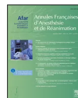

Article spécial

Prise en charge des complications hémorragiques graves et de la chirurgie en urgence chez les patients recevant un anticoagulant oral anti-IIa ou anti-Xa direct. Propositions du Groupe d'intérêt en Hémostase Périopératoire (GIHP) - mars 2013<sup>☆</sup>


*Management of major bleeding complications and emergency surgery in patients on long-term treatment with direct oral anticoagulants, thrombin or factor-Xa inhibitors. Proposals of the Working Group on Perioperative Haemostasis (GIHP) - March 2013*

G. Pernod<sup>a,b</sup>, P. Albaladejo<sup>b,c,\*</sup>, A. Godier<sup>d</sup>, C.M. Samama<sup>d</sup>, S. Susen<sup>e</sup>, Y. Gruel<sup>f</sup>, N. Blais<sup>g</sup>, P. Fontana<sup>h</sup>, A. Cohen<sup>i</sup>, J.V. Llau<sup>j</sup>, N. Rosencher<sup>k</sup>, J.F. Schved<sup>l</sup>, E. de Maistre<sup>m</sup>, M.M. Samama<sup>n</sup>, P. Mismetti<sup>o</sup>, P. Sié<sup>p</sup>

<sup>a</sup> Unité de médecine vasculaire, CHU de Grenoble, BP 217, 38043 Grenoble cedex 09, France

<sup>b</sup> UJF-Grenoble 1/CNRS TIMC-IMAG UMR 5525/Themas, 38041 Grenoble, France

<sup>c</sup> Pôle anesthésie-réanimation, CHU de Grenoble, BP 217, 38043 Grenoble cedex 09, France

<sup>d</sup> Service d'anesthésie-réanimation, Hôtel-Dieu, AP-HP, 1, place du Parvis-Notre-Dame, 75181 Paris cedex 04, France

<sup>e</sup> Pôle d'hématologie transfusion, centre de biologie pathologie, boulevard du Professeur-Jules-Leclercq, 59037 Lille cedex, France

<sup>f</sup> Laboratoire d'hémostase, 2 bis, boulevard Tonnellé, 37032 Tours cedex, France

<sup>g</sup> Laboratoire d'hémostase-thrombose, CHUM - hôpital Notre-Dame, 1560 Sherbrooke Est, H2L 4M1, Montréal, Canada

<sup>h</sup> Laboratoire d'hémostase spéciale, hôpital cantonal universitaire, 4, rue Gabrielle-Perret-Gentil, 1211 Genève 14, Suisse

<sup>i</sup> Service de cardiologie, hôpital St-Antoine, 184, rue du Faubourg-Saint-Antoine, 75571 Paris cedex 12, France

<sup>j</sup> Department of anesthesiology and critical care, hôpital universitaire, Valencia, Espagne

<sup>k</sup> Département d'anesthésie-réanimation, hôpital Cochin, AP-HP, 27, rue du Faubourg-Saint-Jacques, 75014 Paris, France

<sup>l</sup> Laboratoire central d'hématologie, hôpital Saint-Éloi, CHU de Montpellier, 80, avenue Augustin-Fliche, 34295 Montpellier cedex 5, France

<sup>m</sup> CRTH et centre des coagulopathies, hôpital du Bocage, BP 77 908, 21079 Dijon cedex, France

<sup>n</sup> Laboratoire d'hématologie, groupe hospitalier Hôtel-Dieu Cochin, 1, place du Parvis-Notre-Dame, 75181 Paris cedex 04, France

<sup>o</sup> Groupe de recherche sur la thrombose, unité de recherche clinique, innovation et pharmacologie, hôpital Nord, 120, avenue Albert-Raimond, 42055 Saint-Étienne cedex 2, France

<sup>p</sup> Laboratoire d'hématologie, hôpital Rangueil, CHU de Toulouse, 1, avenue du Pr-Jean-Poulhès, TSA 50032, 31059 Toulouse cedex, France

<sup>☆</sup> Membres du Groupe d'Intérêt en Hémostase Périopératoire (GIHP) : P. Albaladejo (anesthésie-réanimation, Grenoble), S. Belisle (anesthésie, Montréal, Canada), N. Blais (hématologie, Montréal, Canada), F. Bonhomme (anesthésie-réanimation, Genève, Suisse), A. Borel-Derlon (hématologie-hémostase, Caen), J.-Y. Borg (hémostase, Rouen), J.-L. Bosson (biostatistique, Grenoble), A. Cohen (cardiologie, Paris), J.-P. Collet (cardiologie, Paris), E. de Maistre (hématologie, Dijon), P. de Moerloose (angiologie-hémostase, Genève, Suisse), P. Fontana (angiologie-hémostase, Genève, Suisse), A. Godier (anesthésie-réanimation, Paris), Y. Gruel (hématologie, Tours), J. Guay (anesthésie, Montréal, Canada), J.F. Hardy (anesthésie, Montréal, Canada), Y. Huet (cardiologie, Paris), B. Ickx (anesthésie-réanimation, Bruxelles, Belgique), B. Jude (hématologie, Lille), S. Laporte (unité de recherche clinique, Saint-Étienne), D. Lasne (hématologie, Paris), J. Llau (anesthésie, Valencia, Espagne), T. Lecompte (hématologie, Genève, Suisse), G. Le Gal (médecine interne, Brest), D. Longrois (anesthésie-réanimation, Paris), E. Marret (anesthésie-réanimation, Paris), P. Mismetti (pharmacologie clinique, Saint-Étienne), S. Motte (pathologie vasculaire, Bruxelles, Belgique), N. Nathan (anesthésie-réanimation, Limoges), Y. Ozier (anesthésie-réanimation, Paris), G. Pernod (médecine vasculaire, Grenoble), N. Rosencher (anesthésie-réanimation, Paris), C.M. Samama (anesthésie-réanimation, Paris), S. Schlumberger (anesthésie-réanimation, Suresnes), J.F. Schved (hématologie, Montpellier), P. Sié (hématologie, Toulouse), A. Steib (anesthésie-réanimation, Strasbourg), S. Susen (hématologie transfusion, Lille), E. van Belle (cardiologie, Lille), P. van Der Linden (anesthésie-réanimation, Bruxelles, Belgique), A. Vincentelli (chirurgie cardiaque, Lille) et P. Zufferey (anesthésie-réanimation, Saint-Étienne).

\* Auteur correspondant.

Adresse e-mail : PAlbaladejo@chu-grenoble.fr (P. Albaladejo).INFO ARTICLEHistorique de l'article :

Reçu le 18 mars 2013

Accepté le 25 avril 2013

Mots clés :

Chirurgie

Hémorragie

Anticoagulants oraux

Anti-IIa

Anti-Xa

Urgence

Réversion

RÉSUMÉ

Les nouveaux anticoagulants oraux (NACO), anti-IIa ou anti-Xa directs, sont destinés à être largement utilisés dans le traitement de la maladie thromboembolique veineuse ou dans la fibrillation atriale en remplacement des antivitamines K (AVK). Comme tout traitement anticoagulant, notamment aux doses dites « curatives », ils sont associés à un risque hémorragique spontané ou provoqué. De plus, une proportion non négligeable de patients traités sera confrontée à la nécessité d'un geste invasif en urgence. Compte tenu de l'absence d'antidote spécifique, les mesures à prendre doivent être définies dans ces situations. Le peu de données disponibles ne permet pas d'émettre des recommandations, mais seulement des propositions qui seront amenées à évoluer en fonction de l'expérience accumulée. Les propositions présentées dans cet article s'appliquent au dabigatran (Pradaxa<sup>®</sup>) et au rivaroxaban (Xarelto<sup>®</sup>), les données relatives à l'apixaban et à l'edoxaban étant encore trop peu nombreuses. Pour la chirurgie urgente à risque hémorragique, il est proposé de doser le taux plasmatique du médicament. Des taux inférieurs ou égaux à 30 ng/mL, à la fois pour dabigatran et rivaroxaban, devraient permettre la réalisation d'une chirurgie à risque hémorragique élevé. Au-delà, il est convenu, dans la mesure du possible, de reporter l'intervention en surveillant l'évolution de la concentration du médicament. La conduite à tenir est alors définie selon le NACO et sa concentration. Si le dosage du médicament n'est pas disponible immédiatement, des propositions « dégradées » sur la base de tests usuels, TP et TCA, sont présentées. Ces tests ne permettent cependant pas d'évaluer réellement ni la concentration de médicament, ni le risque hémorragique qui en dépend. En cas d'hémorragie grave dans un organe critique, il est proposé de réduire l'effet du traitement anticoagulant par l'utilisation d'un médicament procoagulant non spécifique en première ligne [concentrés de complexe prothrombinique activé (FEIBA<sup>®</sup>) 30–50 U/kg] ou non activé (CCP 50 U/kg). En dehors de cette situation, pour tout autre type d'hémorragie grave, l'administration d'un médicament procoagulant, potentiellement thrombogène chez ces patients, sera discutée en fonction du taux de NACO et des possibilités d'hémostase mécanique.

© 2013 Société française d'anesthésie et de réanimation (Sfar). Publié par Elsevier Masson SAS. Tous droits réservés.

ABSTRACT

New direct oral anticoagulants (NOAC), inhibitors of factor IIa or Xa, are expected to be widely used for the treatment of venous thromboembolic disease, or in case of atrial fibrillation. Such anticoagulant treatments are known to be associated with haemorrhagic complications. Moreover, it is likely that such patients on long-term treatment with NOAC will be exposed to emergency surgery or invasive procedures. Due to the present lack of experience in such conditions, we cannot make recommendations, but only propose management for optimal safety as regards the risk of bleeding in such emergency conditions. In this article, only dabigatran and rivaroxaban were discussed. For emergency surgery at risk of bleeding, we propose to dose the plasmatic concentration of drug. Levels inferior or equal to 30 ng/mL for both dabigatran and rivaroxaban, should enable the realization of a high bleeding risk surgery. For higher concentration, it was proposed to postpone surgery by monitoring the evolution of the drug concentration. Action is then defined by the kind of NOAC and its concentration. If the dosage of the drug is not immediately available, proposals only based on the usual tests, PT and aPTT, also are presented. However, these tests do not really assess drug concentration or bleeding risk. In case of severe haemorrhage in a critical organ, it is proposed to reduce the effect of anticoagulant therapy using a nonspecific procoagulant drug (activated prothrombin concentrate, FEIBA, 30–50 U/kg, or non-activated 4-factors prothrombin concentrates 50 U/kg). For any other type of severe haemorrhage, the administration of such a procoagulant drug, potentially thrombogenic in these patients, will be discussed regarding concentration of NACO and possibilities for mechanical haemostasis.

© 2013 Société française d'anesthésie et de réanimation (Sfar). Published by Elsevier Masson SAS. All rights reserved.

1. Introduction

Les nouveaux anticoagulants oraux directs (NACO), ciblant directement la thrombine (facteur IIa) ou le facteur Xa, sont actuellement indiqués pour le traitement curatif de la thrombose veineuse profonde et de l'embolie pulmonaire (rivaroxaban, Xarelto<sup>®</sup>, Bayer Schering) ou pour la prévention des embolies systémiques dans la fibrillation atriale (FA) non valvulaire (rivaroxaban ; dabigatran, Pradaxa<sup>®</sup>, Boehringer Ingelheim). Compte tenu de leur facilité d'utilisation, il est attendu que ces médicaments soient largement utilisés dans des indications au long cours. Au-delà des complications hémorragiques potentielles rapportées dans les essais de phase III, une proportion non négligeable, estimée entre 10 et 20 % par an des patients traités, sera confrontée à la nécessité d'une prise en charge chirurgicale. L'encadrement des chirurgies programmées a déjà fait l'objet de

propositions du Groupe d'Intérêt en Hémostase Périopératoire (GIHP) [1]. Parallèlement, une réflexion a été menée au sein du même groupe concernant la prise en charge des hémorragies et des gestes invasifs en urgence pour des patients bénéficiant d'un traitement par NACO dans un schéma curatif (c'est-à-dire hors prévention en chirurgie orthopédique majeure).

La méthodologie permettant l'élaboration de ces propositions a reposé sur l'analyse de la littérature concernant les propriétés pharmacocinétiques de ces médicaments, et leur utilisation dans un contexte chirurgical. Le texte a ensuite été soumis à l'analyse critique des membres du GIHP jusqu'à l'obtention d'un consensus formalisé.

À l'heure où sont faites ces propositions, il n'existe que très peu de données permettant de donner des recommandations. Les propositions faites reposent souvent sur des extrapolations de données de la littérature. Ces propositions ne peuvent ainsiconstituer un guide absolu de prescription, mais définissent les bases d'une prise en charge qui nécessite d'être évaluée.

## 2. Argumentaire

### 2.1. Données concernant les règles de prise en charge des patients traités par de nouveaux anticoagulants oraux pour une chirurgie urgente sont mal définies

Au moment de la commercialisation du dabigatran et du rivaroxaban, les règles de prise en charge des patients dans le cadre de l'urgence ne sont pas établies. Les résumés des caractéristiques des produits (RCP) ne donnent aucune indication en dehors des précautions d'usage et de la nécessité de repousser au maximum les gestes d'urgence.

Il existe peu de données concernant la prise en charge périopératoire avec le dabigatran et le rivaroxaban, et a fortiori la prise en charge en urgence. Healey et al. [2] ont décrit la prise en charge de patients traités par dabigatran dans l'essai RELY et ayant bénéficié d'un geste invasif. Pendant la durée de cet essai, 4591 patients ont eu au moins une chirurgie ou un geste invasif, dont plus de la moitié était à faible risque hémorragique. La chirurgie urgente représentait 7,8 % de l'ensemble des chirurgies. Il n'y avait pas de différence significative pour les saignements majeurs entre les groupes traités par dabigatran ou antivitamine K (AVK). En revanche, il n'y a aucune indication précise des modalités de gestion des médicaments (délais, administration de médicaments procoagulants). Concernant le rivaroxaban, il n'existe pas, à ce jour, de description des patients de l'étude ROCKET- AF ayant bénéficié d'une chirurgie urgente [3].

Les recommandations publiées consistent en avis d'experts et restent d'ordre général. En France, l'ANSM, conseille pour la prise en charge des hémorragies graves, d'interrompre la prise du médicament, de transférer le patient vers un centre « spécialisé », et de retarder au maximum la chirurgie non programmée à risque hémorragique, ce que ne permet pas toujours l'état du patient. Ces recommandations sont donc peu utiles aux centres « spécialisés », en pratique les services d'accueil des urgences auxquels ces patients seront adressés.

### 2.2. Le traitement par anticoagulants oraux directs à dose curative est associé à un risque hémorragique

Dans l'essai EINSTEIN DVT, concernant le traitement curatif de la thrombose veineuse profonde (TVP), le taux d'hémorragies majeures avec le rivaroxaban (0,8 %) n'était pas significativement différent de celui observé dans le groupe comparateur traité par AVK, 1,2 % [4]. Dans l'essai EINSTEIN PE, concernant le traitement curatif de l'embolie pulmonaire, le taux d'hémorragies majeures, bien que deux fois inférieur à celui du groupe AVK, était de 1,1 % [5]. Dans le traitement de la maladie thromboembolique veineuse, le taux d'hémorragies graves chez les patients recevant du dabigatran 150 mg deux fois par jour était de 1,6 %, là encore comparable au groupe AVK (1,9 %) [6]. Dans la FA, le taux d'hémorragies intracrâniennes rapporté était largement diminué avec les NACO, mais celui des hémorragies graves globales restait similaire à celui du groupe AVK [3,7].

Des mesures spécifiques doivent donc être définies en cas de survenue de telles complications, et le risque hémorragique doit être pris en compte en cas de chirurgie ou d'acte invasif en urgence.

### 2.3. Les nouveaux anticoagulants oraux n'ont pas d'antidote spécifique validé

La prise en charge des hémorragies graves ou des actes chirurgicaux en urgence est délicate de par l'absence actuelle

d'antidote spécifique. Des antagonistes du dabigatran ou des xabans sont en phase I et II de développement clinique [8], et ne devraient pas être disponibles avant au minimum deux ans.

### 2.4. Bénéfice-risque des médicaments procoagulants incertain

Les médicaments procoagulants disponibles en France sont les concentrés de complexe prothrombinique (CCP) à quatre facteurs non activés (Kanokad<sup>®</sup>, LFB, Octaplex<sup>®</sup> Octapharma, Confidex<sup>®</sup> CSL Behring), un CCP activé (FEIBA<sup>®</sup> Baxter) et le facteur VIIa humain recombinant (Novoseven<sup>®</sup>, NovoNordisk). Leur utilisation dans cette indication est hors AMM.

En l'absence d'antidote spécifique, on peut proposer empiriquement de tenter de contrecarrer l'effet anticoagulant des NACO à l'aide de ces médicaments. L'analyse de leur efficacité potentielle repose sur des données expérimentales animales, ou in vivo/ex vivo chez le volontaire sain, et sur quelques cas cliniques ponctuels. Il n'existe aucune donnée expérimentale de neutralisation de l'effet d'un surdosage de NACO.

L'effet des CCP est difficile à analyser. Lorsqu'il a été rapportée, les doses utilisées étaient généralement supérieures (50 U/kg) à celles utilisées pour antagoniser l'effet des AVK [9,10]. Dans ce cadre, nous disposons de données de sécurité pour des doses permettant d'inhiber l'action des AVK. La fréquence des complications thrombotiques associées (non nécessairement imputables) à l'administration de CCP (quatre facteurs) pour inhiber l'action des AVK est faible (1,8 %) [11]. La survenue de ces complications thrombotiques est volontiers associée à l'administration de doses élevées (> 50 U/kg) ou au traitement de patients présentant une hépatopathie sévère [12].

L'effet de FEIBA<sup>®</sup> est évoqué, à des doses de 30 à 50 U/kg, soit deux fois moins que celles utilisés dans l'hémophilie [10]. Son utilisation en clinique humaine dans cette indication n'est rapportée que dans un cas [13]. Nous ne disposons pas de données sur la sécurité d'utilisation du FEIBA<sup>®</sup> dans la population ciblée, c'est-à-dire des patients présentant des facteurs de risque thrombotiques.

Il semble que le rFVIIa, dans des modèles animaux expérimentaux, soit peu efficace pour inhiber l'effet anticoagulant des deux médicaments, dabigatran et rivaroxaban [14,15].

Ces médicaments ne modifient pas l'élimination du médicament. L'utilisation de ces médicaments pro-hémostatiques ne corrige pas complètement les anomalies biologiques de l'hémostase induite par les NACO.

Enfin, ni l'efficacité, ni la sécurité, ni les conditions d'utilisation (doses, rythme, surveillance biologique) de ces médicaments dans cette indication ne sont précisément connues. Il n'existe notamment pas de données disponibles sur le risque thrombotique des fortes doses de CCP et de FEIBA chez ces patients. Cela explique qu'ils soient placés en seconde intention dans les propositions ci-dessous, sauf pour les hémorragies de pronostic vital ou fonctionnel immédiat.

### 2.5. Tests d'hémostase simples permettant de mesurer en urgence la concentration plasmatique des nouveaux anticoagulants oraux

Ces tests, qui mesurent le taux plasmatique de ces anticoagulants, exprimée en concentration pondérale (ng/mL), sont actuellement peu déployés dans les laboratoires desservant les services d'accueil des urgences, mais ils peuvent être mis en place facilement. Ils sont adaptés à la mesure des concentrations dans un domaine de valeurs entre 500 et 50 ng/mL comprenant la concentration maximale moyenne (Cmax : deux à quatre heures après la prise orale du médicament) et la concentration résiduelle moyenne (Cmin : juste avant la prise suivante). Ils sont moinsprécis pour les concentrations faibles et leur limite de détection est généralement voisine de 25 ng/mL.

Pour le dabigatran, plusieurs tests (Hémoclot<sup>®</sup>, Biophen DTI<sup>®</sup>, Hyphen Biomed ; ECA-T<sup>®</sup>, Diagnostica Stago) sont disponibles. Ils prétendent « dépister » les patients à risque hémorragique en phase stable de traitement, sur la base d'une concentration résiduelle supérieure à 200 ng/mL.

La mesure de l'activité anti-Xa, selon des méthodes dédiées (Biophen-DiXal, Hyphen Biomed<sup>®</sup> ; STA Liquid anti-Xa<sup>®</sup>, Diagnostica Stago), permet d'évaluer la concentration plasmatique de rivaroxaban [16].

### 2.6. Il est possible d'extrapoler des essais cliniques un seuil de sécurité hémostatique correspondant à une concentration plasmatique de nouveaux anticoagulants oraux qui autorise une intervention chirurgicale urgente

Il n'existe aucune donnée préclinique ou clinique qui ait établi un seuil de sécurité hémostatique. Cependant, celui-ci peut être extrapolé des protocoles retenus dans les essais cliniques et des propositions des RCP.

Le dabigatran est administré dans la FA, à la dose de 150 mg ou 110 mg, deux fois par jour. Le rivaroxaban est administré dans la FA (20 mg une fois par jour) et le traitement de la TVP et EP, à la dose de 15 mg deux fois par jour, puis 20 mg une fois par jour. Pour ces deux NACO, les concentrations plasmatiques sont relativement proches, tant pour la Cmax que pour la Cmin (Tableau 1).

En ce qui concerne le dabigatran, les données disponibles sont issues de l'article de Healey relatif à la chirurgie programmée chez des patients de l'étude RELY [2]. Dans cette étude, les patients dont la clairance de la créatinine était normale et devant bénéficier d'une chirurgie à risque hémorragique étaient opérés entre 24 et 72 heures après la dernière prise, soit quatre demi-vies moyennes. Considérant la demi-vie (13–18 heures) du dabigatran dans cette population, on peut en déduire que ces patients ont été opérés alors que la concentration plasmatique était probablement inférieure ou égale à 30 ng/mL.

En ce qui concerne le rivaroxaban, les seules données disponibles sont issues de l'étude ROCKET-AF [3]. Dans cette étude, le rivaroxaban était arrêté deux jours avant toute procédure chirurgicale programmée, soit là encore quatre demi-vies (7–13 heures). Considérant la Cmax moyenne du rivaroxaban dans cette population, ces patients ont donc été opérés alors que la concentration plasmatique du médicament était probablement inférieure ou égale à 30 ng/mL.

Il semble donc que l'on puisse retenir ce même seuil de 30 ng/mL, comme étant compatible avec une prise en charge chirurgicale sans majoration du risque hémorragique, notamment en urgence.

### 2.7. Si l'on ne dispose pas de la mesure des taux de médicament, les tests d'hémostase usuels (TP, TCA) peuvent être utiles

Les tests dédiés permettant une mesure de la concentration plasmatique de NACO ne sont pas disponibles 24 heures sur

24 dans tous les centres susceptibles de prendre en charge des urgences. À l'inverse, les tests d'hémostase usuels (Taux de prothrombine, TP ; temps de céphaline activé, TCA) sont disponibles à tout moment. Les test usuels sont relativement peu sensibles à l'effet des NACOs, en particulier dans les zones de concentrations basses et ont, en fonction du réactif, une variabilité importante aux concentrations élevées. Toutefois, sous réserve que le patient ne présente pas un trouble de la coagulation lié à une pathologie associée, un résultat normal de TP et TCA indique, avec une probabilité suffisante pour la majorité des situations rencontrées, que le médicament est présent à un taux résiduel très faible, proche du seuil de sécurité indiqué plus haut. Ils peuvent donc répondre à l'objectif de s'assurer, pour une chirurgie urgente, que celle-ci peut être réalisée sans plus de délai et sans majoration significative du risque hémorragique. Le TP et le TCA peuvent également servir à estimer le délai nécessaire pour atteindre le seuil de sécurité, mais cette estimation est moins précise que celle fondée sur les concentrations.

Le temps de Quick (TQ) est peu sensible au dabigatran. Son allongement, traduit par l'abaissement du TP (%) qui en dérive, est fonction de la concentration du médicament, et la sensibilité de la réponse dépend du réactif utilisé. Il ne peut ainsi être utilisé isolément, mais peut s'intégrer dans une démarche combinant le TP et le TCA. Le TCA est allongé sous dabigatran, mais mal corrélé à la concentration mesurée par un test dédié lorsque celle-ci est élevée. En revanche, sa valeur prédictive négative est intéressante, puisque un TCA normal reflète en général une faible concentration. Son utilisation est donc proposée par certains experts [17]. Douxfils et al. [18] ont étudié l'impact de différentes concentrations de dabigatran sur le TCA mesuré avec différents réactifs. Pour des concentrations de 10 ng/mL, tous les réactifs utilisés (Actin FS<sup>®</sup>, Cephascreen<sup>®</sup>, CKPrest<sup>®</sup>, PTT-A<sup>®</sup>, Synthasil<sup>®</sup>), même en tenant compte d'une certaine variabilité, donnent des résultats avec un rapport malade sur témoin (M/T) inférieure ou égal à 1,2.

Le TQ est décrit comme sensible à l'effet du rivaroxaban [19], avec chez les sujets traités un allongement du TQ, proportionnel à la concentration, variable selon le réactif utilisé [20,21]. Néanmoins, cette variabilité de réponse est très faible pour des concentrations de 25 ng/mL [22], et entre 30 et 50 ng/mL, le ratio M/T obtenu avec le TQ reste inférieure ou égal à 1,2 [21,22]. À l'inverse, une concentration de rivaroxaban de 150 ng/mL induit un allongement du TQ avec un ratio M/T entre 1,2 à 1,5, selon le réactif utilisé [20]. Hillarp et al. [22] ont montré que le TCA était sensible, avec une grande variabilité de réponse pour des concentrations élevées. Cependant, dans ce travail, pour des concentrations de 25 ng/mL, le ratio TCA est inférieure ou égal à 1,2, quel que soit le réactif utilisé (Actin FSL<sup>®</sup>, PTT-A<sup>®</sup>, Triniclot<sup>®</sup>, APTT-DG<sup>®</sup>, APTT-SP<sup>®</sup>).

De manière générale et dans la mesure du possible, il est recommandé que le laboratoire effectue les tests de coagulation usuels et transmette la demande de mesure spécifique, de manière à acquérir l'expérience nécessaire dans l'interprétation des tests usuels. Un des facteurs critiques est la sensibilité de la technique analytique (couple réactif-automate) et son aptitude à détecter de

**Tableau 1**  
Principales données pharmacocinétiques des nouveaux anticoagulants oraux (NACO).

<table border="1">
<thead>
<tr>
<th></th>
<th>Cmax (ng/mL)</th>
<th>Cmin (ng/mL)</th>
</tr>
</thead>
<tbody>
<tr>
<td><i>Dabigatran</i></td>
<td></td>
<td></td>
</tr>
<tr>
<td>220 mg od (van Ryn TH, en 2010)</td>
<td>183 (5–95 perc : 64–447)</td>
<td>37 (5–95 perc : 10–96) (24 h)</td>
</tr>
<tr>
<td>150 mg bd (Stangier Clin Pham 2008)</td>
<td>254 (± 70,5)</td>
<td>80,3 (18,7) (12 h)</td>
</tr>
<tr>
<td><i>Rivaroxaban</i></td>
<td></td>
<td></td>
</tr>
<tr>
<td>10 mg od (Mueck TH, en 2008)<sup>a</sup></td>
<td>125 (5–95 perc : 91–195)</td>
<td>9 (5–95 perc : 1–38) (24 h)</td>
</tr>
<tr>
<td>20 mg od</td>
<td>215 (5–95 perc : 22–535)</td>
<td>32 (5–95 perc : 6–239) (24 h)</td>
</tr>
</tbody>
</table>

Perc : percentile ; cmax : concentration maximale moyenne ; cmin : concentration résiduelle moyenne ; od : une prise par jour ; bd : deux prises par jour.

<sup>a</sup> On ne dispose pas de données pour le rivaroxaban 15 mg bid ; les données 10 mg sont donc ici indicatives.## Chirurgie urgente et Dabigatran (Pradaxa®)

Votre établissement dispose d'un dosage spécifique de dabigatran

```

graph TD
    subgraph Dabigatran_Dosage [Dabigatran Dosage]
        D1["[Dabigatran] ≤ 30 ng/ml"]
        D2["30 < [Dabigatran] ≤ 200 ng/ml"]
        D3["200 < [Dabigatran] ≤ 400 ng/ml"]
        D4["[Dabigatran] > 400 ng/ml"]
    end

    D1 --> O1[Opérer]
    D2 --> P1[Possibilité de retarder l'intervention]
    D3 --> P2[Retarder au maximum l'intervention]
    D4 --> O2[Surdosage Risque hémorragique majeur! Discuter la dialyse avant chirurgie]

    P1 --> O1a[Oui]
    P1 --> O1b[Non]
    O1a --> A1[Attendre jusqu'à 12h* Puis nouveau dosage**]
    O1b --> O1c[Opérer Si saignement anormal, Antagoniser***]

    P2 --> O2a[Non]
    P2 --> O2b[Oui]
    O2a --> A2[Attendre 12 – 24h Puis nouveau dosage** Si Cockcroft < 50 ml/mn Discuter la dialyse]
    O2b --> O2c[Attendre 12 – 24h Puis nouveau dosage**]
  
```

En cas d'insuffisance rénale sévère, la demi-vie du dabigatran est nettement augmentée

\*Il n'est pas possible de déterminer avec précision le délai d'obtention d'un seuil de 30 ng/ml, d'où la mention « jusqu'à 12 h »

\*\*Ce deuxième dosage peut permettre d'estimer le temps nécessaire à l'obtention du seuil de 30 ng/ml

\*\*\*Cette proposition s'applique essentiellement aux situations d'urgence où l'on ne peut pas attendre :

- ▪ CCP=25-50 UI/kg ou FEIBA=30-50 UI/Kg en fonction de la disponibilité
- ▪ Pas de données disponibles sur le risque thrombotique de fortes doses de CCP ou de FEIBA, chez ces patients
- ▪ L'antagonisation par CCP ou FEIBA ne corrige pas complètement les anomalies biologiques de l'hémostase
- ▪ Le rFVIIa n'est pas envisagé en première intention

**Fig. 1.** Prise en charge d'une chirurgie en urgence chez un patient traité par dabigatran selon un schéma « curatif », sur la base de la détermination de concentration plasmatique.

faibles concentrations de chacun des NACOs. Une sélection de réactifs plus sensibles à l'effet des NACOs pourrait s'avérer utile à la gestion des situations d'urgences.

Enfin, il est important de rappeler que la mesure de l'INR n'a aucune place dans la gestion des situations critiques chez les patients traités par les NACOs, ce mode d'expression étant conçu pour les patients traités par les AVK. Le rapport M/T des temps de Quick doit lui être préféré.

### 3. Propositions

Nous aborderons successivement le problème de la prise en charge de la chirurgie urgente à risque hémorragique devant être réalisée dans les 48 heures, puis des hémorragies graves survenant sous NACO (dabigatran et rivaroxaban).

Dans tous les cas, il importe de préciser l'âge, le poids du patient, le nom du médicament, l'indication, la dose, le nombre de prises par jour, l'heure de dernière prise, la clairance calculée selon la formule de Cockcroft et Gault.

Les propositions diffèrent selon que le laboratoire peut ou non fournir la mesure du taux du médicament en urgence.

#### 3.1. Chirurgie urgente à risque hémorragique guidée par la mesure du taux du médicament

Après avoir évalué le risque hémorragique de la chirurgie et la possibilité d'un report de celle-ci sans perte de chance pour le patient, le taux du médicament est demandé.

##### 3.1.1. Patient recevant du dabigatran

Il est proposé d'opérer sans délai les patients chez lesquels la concentration de dabigatran à l'admission est inférieure ou égale à 30 ng/mL, valeur seuil compatible avec l'intervention sans majoration du risque hémorragique (Fig. 1). Cependant, compte tenu de la prise biquotidienne de dabigatran, et considérant les données de pharmacocinétique de population [23], il est peu

probable qu'un patient ayant pris son traitement dans la journée ait une concentration inférieure ou égale à 30 ng/mL. Douze heures après la prise de 150 mg de dabigatran (dans un schéma  $150 \text{ mg} \times 2/\text{j}$ ), la concentration plasmatique de ce médicament varie entre 40 et 180 ng/mL chez 90 % des patients ayant une clairance de la créatinine supérieure à 30 mL/min (valeur médiane autour de 100 ng/mL) [23]. On ne dispose pas de donnée pharmacocinétique au-delà de 12 heures, et les simulations à 24 et 48 heures ne peuvent être que des extrapolations de données issues de patients et de volontaires sains [23,24]. Dès lors, les questions posées lorsqu'un délai chirurgical est possible sont : combien de temps faut-il attendre pour atteindre ce seuil ? et quelle est la probabilité que la concentration seuil de 30 ng/mL soit atteinte dans un délai acceptable, au maximum 48 heures ?

Si la concentration est comprise entre 30 et 200 ng/mL, un délai de 12 à 24 heures après la dernière prise, selon la fonction rénale, devrait permettre d'atteindre le seuil de 30 ng/mL. Il est donc proposé de retarder l'intervention de 12 heures si l'état du patient le permet et de répéter le dosage jusqu'à 12 heures<sup>1</sup> après la première mesure avant d'autoriser la chirurgie.

Si la concentration est comprise entre 200 et 400 ng/mL et en l'absence d'insuffisance rénale, un délai minimum de 24 heures est nécessaire pour atteindre la concentration seuil de sécurité hémostatique. Dans ce cas, il est proposé d'attendre 24 heures et de répéter le dosage.

Si la concentration est supérieure à 200 ng/mL et la fonction rénale est réduite (clairance estimée avec la formule de Cockcroft-Gault  $\text{ClCkr} < 50 \text{ mL/min}$ ), il est hautement improbable d'obtenir une concentration seuil acceptable en 24 heures à 48 heures. Dès lors, une hémodialyse doit être discutée avant la chirurgie. En effet, seulement 35 % du dabigatran circulant est lié à l'albumine, et

<sup>1</sup> Il n'est pas possible de déterminer avec précision le délai d'obtention d'un seuil de 30 ng/mL, d'où la mention « jusqu'à 12 heures » ; à contrario, ce délai peut éventuellement être prolongé en fonction des disponibilités du plateau technique permettant le dosage.## Chirurgie urgente et Rivaroxaban (Xarelto®)

Votre établissement dispose d'un dosage spécifique de rivaroxaban

```

graph TD
    C1["[Rivaroxaban] ≤ 30 ng/ml"] --> O1[Opérer]
    C2["30 < [Rivaroxaban] ≤ 200 ng/ml"] --> P1[Possibilité de retarder l'intervention]
    C3["200 < [Rivaroxaban] ≤ 400 ng/ml"] --> P2[Retarder au maximum l'intervention]
    C4["[Rivaroxaban] > 400 ng/ml"] --> S1[Surdosage Risque hémorragique majeur!]

    P1 -- Oui --> A1["Attendre jusqu'à 12h*  
Puis nouveau dosage**"]
    P1 -- Non --> O2[Opérer  
Si saignement anormal,  
Antagoniser***]

    P2 -- Non --> O3[Opérer]
    P2 -- Oui --> A2["Attendre 12 – 24h  
Puis nouveau dosage**"]
  
```

\*Il n'est pas possible de déterminer avec précision le délai d'obtention d'un seuil de 30 ng/ml, d'où la mention « jusqu'à 12 h »

\*\*Ce deuxième dosage peut permettre d'estimer le temps nécessaire à l'obtention du seuil de 30 ng/ml

\*\*\*Cette proposition s'applique essentiellement aux situations d'urgence où l'on ne peut pas attendre :

- ▪ CCP=25-50 UI/kg ou FEIBA=30-50 UI/Kg en fonction de la disponibilité
- ▪ Pas de données disponibles sur le risque thrombotique de fortes doses de CCP ou de FEIBA, chez ces patients
- ▪ L'antagonisation par CCP ou FEIBA ne corrige pas complètement les anomalies biologiques de l'hémostase
- ▪ Le rFVIIa n'est pas envisagé en première intention

**Fig. 2.** Prise en charge d'une chirurgie en urgence chez un patient traité par rivaroxaban selon un schéma « curatif », sur la base de la détermination de concentration plasmatique.

l'hémodialyse peut permettre une diminution de 40 à 60 % de la concentration en quatre heures [25]. Dans ces cas, il est proposé de retarder au maximum l'intervention chirurgicale.

Des concentrations supérieures à 400 ng/mL correspondent à un surdosage et exposent à un risque hémorragique majeur. Les moyens interventionnels et de réanimation périopératoire optimisés doivent être mis en œuvre. L'hémodialyse doit être systématiquement discutée. Néanmoins, la durée de la dialyse permettant d'atteindre le seuil de 30 ng/mL est longue en cas de surdosage, et ce délai doit être pris en compte dans la prise de décision du report de l'intervention.

### 3.1.2. Patient recevant du rivaroxaban

Sur la base des données de l'étude ROCKET AF [3], il est également estimé, pour une prise en charge chirurgicale en urgence, que la concentration de 30 ng/mL est un seuil de sécurité hémostatique acceptable (Fig. 2). Il est donc proposé d'opérer sans délai les patients chez lesquels la concentration de rivaroxaban à l'admission est inférieure ou égale à 30 ng/mL. Les données de pharmacocinétique du rivaroxaban en prise mono-quotidienne sont disponibles à 24 heures [26]. Dès lors, une approche identique à celle du dabigatran est proposée.

Pour des concentrations plasmatiques de rivaroxaban comprises entre 30 et 200 ng/mL, il est proposé de retarder l'intervention si possible jusqu'à 12 heures après la première mesure de concentration du médicament et de répéter le dosage.

Pour des concentrations plasmatiques de rivaroxaban comprises entre 200 et 400 ng/mL, il est proposé d'attendre 24 heures et de répéter le dosage.

Des concentrations supérieures à 400 ng/mL correspondent à un surdosage et exposent à un risque hémorragique majeur. Les moyens interventionnels et de réanimation périopératoire optimisés doivent être mis en œuvre. La dialyse n'est pas envisageable avec ce médicament. La probabilité d'atteindre le seuil de sécurité hémostatique est faible. Il est proposé de retarder au maximum l'intervention si l'état du patient le permet.

### 3.2. Chirurgie urgente à risque hémorragique guidée par les tests usuels d'hémostase

Les propositions ci-dessous, très voisines pour les deux médicaments, ne peuvent s'envisager dans le cadre de l'urgence qu'en cas d'indisponibilité de dosage du médicament. Il s'agit bien d'une proposition dégradée. Les tests usuels ont en effet plusieurs limites. Ils ne permettent pas de déterminer de façon absolue la valeur seuil de sécurité hémostatique de NACO, ce qui est souhaitable pour les chirurgies à très haut risque hémorragique (e.g., neurochirurgie). Ils peuvent être allongés pour d'autres raisons que la présence du médicament, ce qui expose au report inutile de l'intervention. Enfin, l'administration de certains médicaments procoagulants peut raccourcir les temps (e.g., facteur VIIa recombinant et temps de Quick) sans garantir un effet hémostatique in vivo.

#### 3.2.1. Patient recevant du dabigatran

La combinaison d'un TCA normal et d'un TP normal permet de conclure avec une relative fiabilité que la concentration plasmatique de dabigatran est inférieure à 30 ng/mL, compatible avec une intervention chirurgicale en urgence (Fig. 3).

Les valeurs proposées de rapport M/T sont inférieures ou égales à 1,2 pour chacun des deux tests, à valider par chaque laboratoire pour cette indication comme indiqué plus haut. Le temps de thrombine (TT), du fait de son extrême sensibilité au dabigatran, permet s'il est normal d'exclure la présence du médicament, ce qui n'est probablement pas nécessaire pour la majorité des situations et retarde la décision de l'intervention. Ce test est donc peu utile dans la situation d'urgence.

Si l'un ou l'autre des tests indique un ratio M/T supérieure à 1,2, le délai de la chirurgie peut être estimé comme suit sur la base du seul TCA :

- • un ratio TCA ≤ 1,5 mais > 1,2 correspond à des concentrations de 30 à 200 ng/mL [18]. Pour ces concentrations, un délai allant## Chirurgie urgente et Dabigatran (Pradaxa®)

Votre établissement ne dispose pas de dosage spécifique de dabigatran

**Il s'agit d'une solution dégradée en cas d'indisponibilité immédiate de dosage spécifique.  
Elle ne garantit pas de manière formelle l'absence de complications hémorragiques**

```

graph TD
    A[Ratio TCA ≤ 1.2  
et ratio TQ ≤ 1.2 (TP ≥ 70 - 80 %)] --> B[Opérer]
    C[Ratio 1.2 < TCA ≤ 1.5  
ou ratio TQ > 1.2 (TP < 70 - 80 %)] --> D[Possibilité de retarder  
l'intervention]
    D --> E[Oui]
    D --> F[Non]
    E --> G[Attendre jusqu'à 12h*  
Obtenir un dosage spécifique /  
Nouveau TP / TCA]
    F --> H[Opérer  
Si saignement anormal,  
Antagoniser***]
    I[Ratio TCA > 1.5] --> J[Retarder au maximum  
l'intervention]
    J --> K[Non]
    J --> L[Oui]
    K --> H
    L --> M[Attendre 12 – 24h  
Obtenir un dosage spécifique /  
Nouveau TP / TCA]
    M --> N[Si Cockcroft < 50 ml/mn  
Discuter la dialyse]
  
```

Le TQ dénomme le temps de Quick, duquel est dérivé le TP

\* Il n'est pas possible de déterminer avec précision le délai d'obtention d'un seuil TCA ≤ 1,2 et ratio TQ ≤ 1,2 (TP 70-80 %), d'où la mention « jusqu'à 12 h »

\*\* Cette proposition s'applique essentiellement dans les situations d'urgence où l'on ne peut pas attendre:

CCP=25-50 UI/kg ou FEIBA=30-50 UI/Kg en fonction de la disponibilité

Pas de données disponibles sur le risque thrombotique de fortes doses de CCP ou de FEIBA, chez ces patients

L'antagonisation par CCP ou FEIBA ne corrige pas complètement les anomalies biologiques de l'hémostase

Le rFVIIa n'est pas envisagé en première intention

**Remarque :** Les TP-TCA peuvent être perturbés pour d'autres raisons que l'anticoagulant. On pourra recourir, dans un second temps, à l'analyse du temps de thrombine (TT), si disponible, qui s'il est normal, permet d'exclure la présence de dabigatran.

Fig. 3. Prise en charge d'une chirurgie en urgence chez un patient traité par dabigatran selon un schéma « curatif », sur la base de la détermination TP/TCA.

jusqu'à 12 à 24 heures, selon la fonction rénale, devrait permettre d'atteindre des concentrations proches de 30 ng/mL. Dans ces conditions, il est proposé de répéter la mesure du TCA, et de profiter de ce délai d'attente (s'il reste compatible avec l'urgence chirurgicale) pour obtenir un dosage de concentration. En effet, il n'est pas possible, sur la base d'un ratio TCA compris entre 1,2 et 1,5, de déterminer avec précision le délai d'obtention d'un ratio seuil inférieur ou égal à 1,2 ;

- • un ratio TCA supérieur à 1,5 correspond à des concentrations supérieures à 200 ng/mL, soit la Cmax. En l'absence d'insuffisance rénale, un délai minimum de 24 heures est nécessaire pour espérer atteindre la concentration seuil de sécurité hémostatique. La mesure de concentration doit être obtenue dans ce délai pour dépister un éventuel surdosage. En cas de ClCr < 50 mL/min et de ratio TCA supérieur à 1,5, il est hautement improbable d'obtenir une concentration seuil de sécurité hémostatique acceptable en 24 heures à 48 heures. Il est impératif d'obtenir une mesure de concentration pour dépister un surdosage et d'envisager une dialyse.

### 3.3. Patient recevant du rivaroxaban

La combinaison d'un TCA normal et d'un TQ (ou TP) normal permet de conclure avec une relative fiabilité que la concentration plasmatique de rivaroxaban est inférieure à 30 ng/mL, compatible avec une intervention chirurgicale en urgence (Fig. 4).

Les valeurs proposées de rapport M/T sont inférieures ou égales à 1,2 pour chacun des deux tests, mais doivent être validées pour cette indication par chaque laboratoire comme indiqué plus haut. La mesure de l'activité anti-Xa par la technique usuelle convenant pour les héparines est très sensible au rivaroxaban. Une activité inférieure ou égale à 0,1 U/mL garantit l'absence du médicament, ce qui n'est probablement pas nécessaire pour la majorité des situations et retarde la décision de l'intervention. Ce test est donc peu utile dans la situation d'urgence.

Si les valeurs de ratio M/T sont supérieures à 1,2 avec l'un ou l'autre des tests, une approche identique à celle du dabigatran est proposée.

Un ratio de TCA compris entre 1,2 et 1,5 correspond à des concentrations de rivaroxaban de 30 à 200 ng/mL [22,26] et un délai d'attente jusqu'à 12 heures devrait permettre d'atteindre un taux inférieur à 30 ng/mL. Il est proposé de répéter le dosage du TCA, et de profiter de ce délai s'il est compatible avec l'urgence chirurgicale pour obtenir un dosage du médicament. En effet, il n'est pas possible, sur la base d'un ratio TCA compris entre 1,2 et 1,5, de déterminer avec précision le délai d'obtention d'un seuil inférieure ou égal à 1,2.

Un ratio TCA supérieur à 1,5 correspond à des concentrations de rivaroxaban supérieures à 200 ng/mL. Un délai minimum de 24 heures est nécessaire pour espérer atteindre la valeur seuil de sécurité hémostatique. Le dosage du médicament doit être obtenu dans ce délai. Dans ces cas, il est proposé de retarder au maximum l'intervention chirurgicale.

### 3.4. Que faire si la chirurgie ne peut être repoussée et que les seuils de sécurité hémostatique ne sont pas atteints ?

Dans cette situation, il est proposé d'opérer sans administration préventive de médicaments procoagulants, et d'avoir recours à ceux-ci (CCP 25 à 50 U/kg, ou FEIBA 30 à 50 U/kg ; éventuellement renouvelable une fois en cas d'échec) en cas de saignement anormal per- ou postopératoire. Il est conseillé, en première ligne, de privilégier la dose la plus faible proposée.

### 3.5. Conduite à tenir en cas d'hémorragie grave spontanée ou chirurgicale

Les recommandations pour la pratique clinique HAS/GEHT 2008 concernant les accidents des AVK ont défini les hémorragies graves comme indiqué sur la Fig. 5 [27]. Cette définition,## Hémorragie et Dabigatran (Pradaxa®) ou Rivaroxaban (Xarelto®)

Votre établissement dispose d'un dosage spécifique  
de dabigatran (Pradaxa®) ou rivaroxaban (Xarelto®)

```

graph TD
    A[Hémorragie dans un organe critique  
(intracérébral, sous dural aigu, intra-oculaire...)] --> B[1) FEIBA® 30-50 UI / kg*  
ou  
2) CCP 50 UI / kg*]
    C[Hémorragie grave autres  
selon la définition HAS 2008] --> D[Privilégier un geste hémostatique si réalisable]
    D --> E["[ ]** ≤ 30 ng / ml"]
    D --> F["Si pas de geste hémostatique  
immédiat  
et si [ ]*** > 30 ng / ml"]
    E --> G[pas d'antagonisation]
    F --> H[Discuter l'antagonisation]
  
```

\* Fonction de la disponibilité. Pas de données disponibles sur le risque thrombotique des fortes doses de CCP ou de FEIBA, chez ces patients  
\*\* [ ] signifie concentration  
\*\*\* CCP=25-50 UI/kg ou FEIBA=30-50 UI/Kg  
Le rFVIIa n'est pas envisagé en première intention

**Fig. 4.** Prise en charge d'une chirurgie en urgence chez un patient traité par rivaroxaban selon un schéma « curatif », sur la base de la détermination TP/TCA.

notamment pour les hémorragies potentiellement graves, met à un même niveau les hémorragies intracérébrales et les hématomes musculaires profonds par exemple. Cela tenait d'une part, à la demi-vie longue des AVK, d'autre part, à l'existence d'un antidote spécifique bien maîtrisé (CCP). Le contexte présent est en tout point différent : les NACOs ont une demi-vie courte avec une grande variabilité inter-individuelle, les possibilités de réversion disponibles sont mal codifiées, en particulier les profils d'efficacité/tolérance des médicaments procoagulants non spécifiques.

Dès lors, nous proposons de distinguer deux situations d'hémorragies graves.

Les hémorragies intracérébrales ou concernant un organe critique (oculaire par exemple) justifient une tentative de neutralisation immédiate de l'effet anticoagulant des NACO, par soit du FEIBA 30 à 50 U/kg, soit du CPP 50 U/kg, éventuellement renouvelé une fois à huit heures d'intervalle (Fig. 6). Le suivi de la concentration du médicament sera utile pour la décision opératoire complémentaire, selon les modalités présentées plus haut.

Pour les autres hémorragies graves répondant à la définition de l'HAS, trois situations sont à considérer :

- • si la concentration du médicament est inférieure ou égale à 30 ng/mL, l'hémorragie en cause ne peut être imputée au seul

## Hémorragie et Dabigatran (Pradaxa®) ou Rivaroxaban (Xarelto®)

Votre établissement dispose d'un dosage spécifique  
de dabigatran (Pradaxa®) ou rivaroxaban (Xarelto®)

```

graph TD
    A[Hémorragie dans un organe critique  
(intracérébral, sous dural aigu, intra-oculaire...)] --> B[1) FEIBA® 30-50 UI / kg*  
ou  
2) CCP 50 UI / kg*]
    C[Hémorragie grave autres  
selon la définition HAS 2008] --> D[Privilégier un geste hémostatique si réalisable]
    D --> E["[ ]** ≤ 30 ng / ml"]
    D --> F["Si pas de geste hémostatique  
immédiat  
et si [ ]*** > 30 ng / ml"]
    E --> G[pas d'antagonisation]
    F --> H[Discuter l'antagonisation]
  
```

\* Fonction de la disponibilité. Pas de données disponibles sur le risque thrombotique des fortes doses de CCP ou de FEIBA, chez ces patients  
\*\* [ ] signifie concentration  
\*\*\* CCP=25-50 UI/kg ou FEIBA=30-50 UI/Kg  
Le rFVIIa n'est pas envisagé en première intention

**Fig. 5.** Définition des hémorragies graves ou potentiellement grave sous antivitaminines K (AVK) [17].## Hémorragie et Dabigatran (Pradaxa®) ou Rivaroxaban (Xarelto®)

Votre établissement ne dispose pas d'un dosage spécifique  
de dabigatran (Pradaxa®) ou rivaroxaban (Xarelto®)

**Il s'agit d'une solution dégradée en cas d'indisponibilité immédiate de dosage spécifique**

```

graph TD
    A[Hémorragie dans un organe critique  
(intracérébral, sous dural aigu, intra-oculaire...)] --> B[1) FEIBA® 30-50 UI / kg*  
ou  
2) CCP 50 UI / kg*]
    C[Hémorragie grave autres  
selon la définition HAS 2008] --> D[Privilégier un geste hémostatique si réalisable]
    D --> E[ratio TCA ≤ 1.2  
et ratio TQ ≤ 1.2 (TP ≥ 70 - 80 %)]
    D --> F[Si pas de geste hémostatique  
immédiat  
et si ratio TCA > 1.2 (isolé)  
ou ratio TQ > 1.2 (TP < 70 - 80 %)]
    E --> G[pas d'antagonisation]
    F --> H[Discuter l'antagonisation  
Et obtenir un dosage spécifique]
  
```

\* Fonction de la disponibilité. Pas de données disponibles sur le risque thrombotique des fortes doses de CCP ou de FEIBA, chez ces patients

\*\* CCP=25-50 UI/kg ou FEIBA=30-50 UI/Kg

Le rFVIIa n'est pas envisagé en première intention

**Fig. 6.** Prise en charge d'une hémorragie grave chez un patient traité par dabigatran ou rivaroxaban selon un schéma « curatif », sur la base de la détermination de la concentration de médicament.

médicament. Cette situation ne nécessite pas l'administration d'un agent hémostatique (CPP ou FEIBA<sup>®</sup>) ;

- • si un geste hémostatique est praticable d'emblée (endoscopique, intravasculaire), celui-ci doit être privilégié quel que soit le taux du médicament ;
- • si la concentration du médicament est supérieure à 30 ng/mL et qu'aucun geste hémostatique n'est adapté, il est proposé de tenter d'inhiber l'effet anticoagulant (CPP 25 à 50 U/kg, ou FEIBA 30 à 50 U/kg ; éventuellement renouvelable une fois), d'optimisation la réanimation et, dans le cas du dabigatran, d'envisager une épuration par hémodialyse guidée par la mesure des concentrations du médicament.

Si le dosage de la concentration plasmatique de NACO n'est pas possible, le raisonnement et les mesures correctrices peuvent s'appuyer sur le TCA et le TP, mais avec un niveau élevé d'incertitude (Tableau 2).

**Tableau 2**

Prise en charge d'une hémorragie grave chez un patient traité par dabigatran ou rivaroxaban selon un schéma « curatif », sur la base de la détermination TP/TCA.

*Une hémorragie grave, ou potentiellement grave, dans la cadre d'un traitement par AVK est définie par la présence d'au moins un des critères suivants*

- Hémorragie extériorisée non contrôlable par les moyens usuels
- Instabilité hémodynamique PAS < 90 mmHg ou diminution de 40 mmHg par rapport à la PAS habituelle, ou PAM < 65 mmHg, ou tout signe de choc
- Nécessité d'un geste hémostatique urgent : chirurgie, radiologie interventionnelle, endoscopie
- Nécessité de transfusion de culots globulaires
- Localisation menaçant le pronostic vital ou fonctionnel, par exemple
  - Hémorragie intracrânienne et intraspinale
  - Hémorragie intraoculaire et rétro-orbitaire
  - Hémothorax, hemo- et rétopéritoine, hémopéricarde
  - Hématome musculaire profond et/ou syndrome de loge
  - Hémorragie digestive aiguë
  - Hémarthrose

AVK : antivitamines K.

## 4. Conclusion

La prise en charge chirurgicale en urgence et des hémorragies graves chez des patients traités par NACO nécessite des mesures spécifiques et doit être parfaitement codifiée. Malheureusement, les données disponibles en 2013 sont très faibles et une évaluation prospective est nécessaire afin de conforter rapidement ces propositions.

## Déclaration d'intérêts

Le GIHP a reçu un soutien éducationnel de Bayer, Boehringer Ingelheim, Bristol-Meyer Squibb-Pfizer, Daiichi Sankyo, LFB Biomédicaments, Novo-Nordisk, GlaxoSmithKline et CSL Behring.

## Références

1. [1] Sié P, Samama CM, Godier A, Rosencher N, Steib A, Llau JV, et al. Surgery and invasive procedures in patients on long-term treatment with direct oral anticoagulants: thrombin or factor-Xa inhibitors. Recommendations of the Working Group on perioperative haemostasis and the French Study Group on thrombosis and haemostasis. Arch Cardiovasc Dis 2011;104:669–76.
2. [2] Healey JS, Eikelboom J, Douketis J, Wallentin L, Oldgren J, Yang S, et al. Peri-procedural bleeding and thromboembolic events with dabigatran compared with warfarin: results from the Randomized Evaluation of Long-Term Anticoagulation Therapy (RE-LY) randomized trial. Circulation 2012;126:343–8.
3. [3] Patel MR, Mahaffey KW, Garg J, Pan G, Singer DE, Hacke W, et al. Rivaroxaban versus warfarin in nonvalvular atrial fibrillation. N Engl J Med 2011;365:883–91.
4. [4] EINSTEIN Investigators, Bauersachs R, Berkowitz SD, Brenner B, Buller HR, Decousus H, et al. Oral rivaroxaban for symptomatic venous thromboembolism. N Engl J Med 2010;363:2499–510.
5. [5] The EINSTEIN-PE Investigators, Büller HR, Prins MH, Lensin AW, Decousus H, Jacobson BF, et al. Oral rivaroxaban for the treatment of symptomatic pulmonary embolism. N Engl J Med 2012;366:1287–97.
6. [6] Schulman S, Kearon C, Kakkar AK, Mismetti P, Schellong S, Eriksson H, et al. Dabigatran versus warfarin in the treatment of acute venous thromboembolism. N Engl J Med 2009;361:2342–52.
7. [7] Connolly SJ, Ezekowitz MD, Yusuf S, Eikelboom J, Oldgren J, Parekh A, et al. Dabigatran versus warfarin in patients with atrial fibrillation. N Engl J Med 2009;361:1139–51.- [8] Lu G, DeGuzman FR, Hollenbach SJ, Karbarz MJ, Abe K, Lee G, et al. A specific antidote for reversal of anticoagulation by direct and indirect inhibitors of coagulation factor Xa. *Nat Med* 2013 [doi:10.1038/nm.3102].
- [9] Eerenberg ES, Kamphuisen PW, Sijpkens MK, Meijers JC, Buller HR, Levi M. Reversal of rivaroxaban and dabigatran by prothrombin complex concentrate: a randomized, placebo-controlled, crossover study in healthy subjects. *Circulation* 2011;124:1573–9.
- [10] Marlu R, Paris A, Hodaj E, Albaladejo P, Polack B, Pernod G. Reversal of anticoagulant effect of Dabigatran and Rivaroxaban by non-specific reversal agents: a randomized crossover ex-vivo study in healthy volunteers. *Thromb Haemost* 2012;108:217–24.
- [11] Dentali F, Marchesi C, Pierfranceschi MG, Crowther M, Garcia D, Hylek E, et al. Safety of prothrombin complex concentrates for rapid anticoagulation reversal of vitamin K antagonists. A meta-analysis. *Thromb Haemost* 2011;106:429–38.
- [12] Key NS, Negrier C. Coagulation factor concentrates: past, present, and future. *Lancet* 2007;370:439–48.
- [13] Dager W, Roberts A. Reversing dabigatran with FEIBA in a patient with a transeptal perforation during cardiac ablation. *Crit Care Med* 2011;39:867.
- [14] Godier A, Miclot A, Le Bonniec B, Durand M, Fischer AM, Emmerich J, et al. Evaluation of prothrombin complex concentrate and recombinant activated factor VII to reverse Rivaroxaban in a rabbit model. *Anesthesiology* 2012;116:1–9.
- [15] Zhou W, Schwarting S, Illanes S, Liesz A, Middelhoff M, Zorn M, et al. Hemostatic therapy in experimental intracerebral hemorrhage associated with the direct thrombin inhibitor Dabigatran. *Stroke* 2011;42:3594–9.
- [16] Samama MM, Contant G, Spiro TE, Perzborn E, Guinet C, Gourmelin Y, et al. Evaluation of the anti-factor Xa chromogenic assay for the measurement of rivaroxaban plasma concentrations using calibrators and controls. *Thromb Haemost* 2012;107:379–87.
- [17] Weitz JI, Quinlan DJ, Eikelboom JW. Periprocedural management and approach to bleeding in patients taking dabigatran. *Circulation* 2012;126:2428–32.
- [18] Douxfils J, Mullier F, Robert S, Chatelain C, Chatelain B, Dogné JM. Impact of dabigatran on a large panel of routine or specific coagulation assays. Laboratory recommendations for monitoring of dabigatran etexilate. *Thromb Haemost* 2012;107:985–97.
- [19] Perzborn E, Straussburger J, Pohlmann J, Roehrig S, Schlemmer KH, Straub A. In vitro and in vivo studies of the novel antithrombotic agent BAY 59-7939 – an oral, direct factor Xa inhibitor. *J Thromb Haemost* 2005;3:514–21.
- [20] Samama MM, Martinoli JL, LeFlem L, Guinet C, Plu-Bureau G, Depasse F, et al. Assessment of laboratory assays to measure rivaroxaban—an oral, direct factor Xa inhibitor. *Thromb Haemost* 2010;103:815–25.
- [21] Douxfils J, Mullier F, Loosen C, Chatelain C, Chatelain B, Dogné JM. Assessment of the impact of rivaroxaban on coagulation assays: laboratory recommendations for the monitoring of rivaroxaban and review of the literature. *Thromb Res* 2012;130:956–66.
- [22] Hillarp A, Baghaei F, Fagerberg Blixter I, Gustafsson KM, Stigendal L, Sten-Linder M, et al. Effects of the oral, direct factor Xa inhibitor rivaroxaban on commonly used coagulation assays. *J Thromb Haemost* 2011;9:133–9.
- [23] Dansirikul C, Lehr T, Liesenfeld KH, Haertter S, Staab A. A combined pharmacometric analysis of dabigatran etexilate in healthy volunteers and patients with atrial fibrillation or undergoing orthopaedic surgery. *Thromb Haemost* 2012;107:775–85.
- [24] Clemens A, van Ryn J, Sennewald R, Yamamura N, Stangier J, Feuring M, et al. Switching from enoxaparin to dabigatran etexilate: pharmacokinetics, pharmacodynamics, and safety profile. *Eur J Clin Pharmacol* 2012;68:607–16.
- [25] Stangier J, Rathgen K, Stähle H, Mazur D. Influence of renal impairment on the pharmacokinetics and pharmacodynamics of oral dabigatran etexilate: an open-label, parallel-group, single-centre study. *Clin Pharmacokinet* 2010;49:259–68.
- [26] Mueck W, Lensing AW, Agnelli G, Decousus H, Prandoni P, Misselwitz F. Rivaroxaban: population pharmacokinetic analyses in patients treated for acute deep-vein thrombosis and exposure simulations in patients with atrial fibrillation treated for stroke prevention. *Clin Pharmacokinet* 2011;50:675–86.
- [27] Pernod G, Godier A, Gozalo C, Tremey B, Sié P, French National Authority for Health. French clinical practice guidelines on the management of patients on vitamin K antagonists in at-risk situations (overdose, risk of bleeding, and active bleeding). *Thromb Res* 2010;126:167–74.