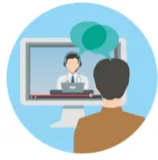
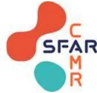
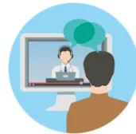

An icon depicting a person from behind, looking at a computer screen. On the screen, a doctor is visible, and there are speech bubbles above them, representing a video consultation.

## Ma consultation pré anesthésique à distance

Nous vous proposons de réaliser à distance une téléconsultation. Il s'agit d'une mise en relation vidéo à un horaire fixé à l'avance avec un médecin anesthésiste réanimateur.

*Pour cela, il vous faut être équipé d'un smartphone ou d'un ordinateur ayant une webcam et une fonction son / micro fonctionnelle ainsi qu'une connexion de débit correct.*

### Pourquoi une téléconsultation ?

La rencontre avec un médecin anesthésiste réanimateur est un moment important de votre prise en charge péri opératoire. C'est une obligation avant toute intervention pour garantir votre sécurité. Ce nouveau mode de communication vous permet ainsi d'éviter un déplacement.

### La préparation à cette consultation

Nous vous conseillons de préparer cette consultation selon le plan ci-dessous. Vous pouvez être assisté par la personne de votre choix dans ces démarches ainsi que le jour de la connexion pour la téléconsultation.

- Rassemblez :
  - ○ Les comptes rendus médicaux des spécialistes qui vous suivent ou vous ont suivi (notamment cardiologique). N'hésitez pas à contacter les secrétariats des spécialistes pour récupérer ceux qui vous manquent,
  - ○ Les résultats biologiques (de moins d'un an),
  - ○ Votre dernière ordonnance.
- Complétez le résumé de votre état de santé à l'aide du questionnaire qui vous a été envoyé.
- Consultez les différentes informations sur l'anesthésie diffusées par la Société Française d'Anesthésie Réanimation.  
  <https://sfar.org/pour-le-grand-public/information-medicale-sur-lanesthesie/>  
  <https://sfar.org/pour-le-grand-public/>
- Préparez vos questions pour pouvoir échanger / questionner l'anesthésiste lors de votre rencontre vidéo.
- Vous pouvez dès à présent vous connecter à la plateforme pour tester votre matériel.

## Le jour J

- Assurez-vous d'être installé dans un environnement silencieux permettant les échanges médicaux en toute discrétion.
- Ayez à vos côtés votre résumé de santé, votre dernière ordonnance ainsi que les comptes rendus récents de biologie et des spécialistes qui vous suivent.
- Gardez votre téléphone portable à proximité en cas de difficulté technique.
- Centrer l'écran de sorte à ce que votre visage et votre cou soient visibles. Parlez suffisamment fort.

**Vous êtes prêt !**

*Les données personnelles sont protégées et le secret médical assuré de la même façon que lors d'une consultation présente.*

*Le processus de facturation sera le même que lorsque vous vous déplacez en consultation.*