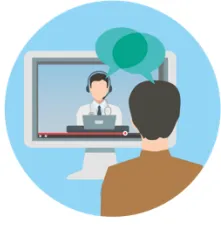
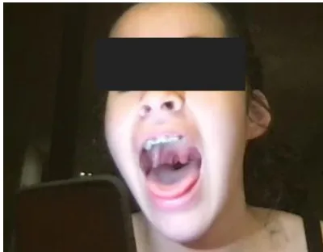
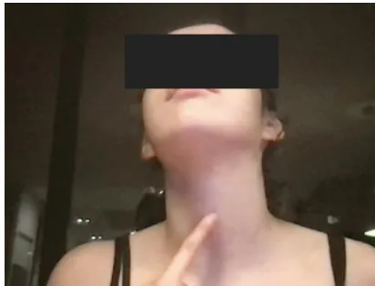
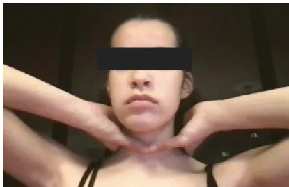
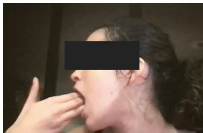
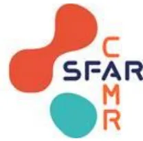
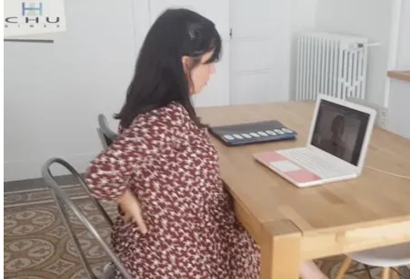
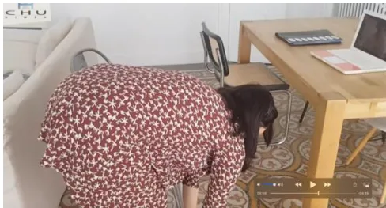
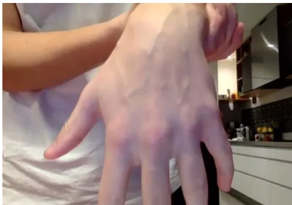

An icon showing a person from behind looking at a computer screen. On the screen, a doctor is visible, and there are speech bubbles above the doctor, indicating a video consultation.

## Adaptation de l'examen clinique

**Exemples d'examens réalisés pendant des téléconsultations  
(captures d'écran de visioconférence)**

Lumière du téléphone  
pour visualiser le pharynx

A close-up photograph of a patient's face with their mouth wide open, revealing the tongue and the back of the throat (pharynx). The patient's eyes are obscured by a black rectangle.

Doigt sur le cartilage cricoïde (pomme d'Adam)

A photograph of a patient's neck with their head tilted back. The patient is pointing their index finger to the cricoid cartilage, which is located at the base of the larynx. The patient's eyes are obscured by a black rectangle.

Tour de cou à deux mains

A photograph of a patient's neck from the front. Two hands are placed on the sides of the neck, just below the jawline, to feel for the cervical spine. The patient's eyes are obscured by a black rectangle.

Ouverture de bouche en travers de doigts

A photograph of a patient's mouth from the side. Two hands are used to open the mouth wide, with the fingers placed horizontally across the back of the throat. The patient's eyes are obscured by a black rectangle.

## Autopalpation des épineuses

## Evaluation de la souplesse rachidienne (distance main-sol)

## Evaluation du capital veineux

