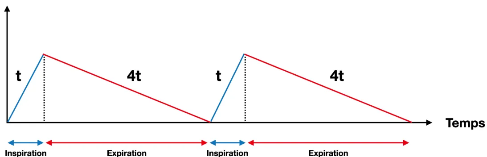

**Facteurs Humains en Santé**  
*Ensemble pour la qualité et la sécurité des soins*

## RECOMMANDATIONS DE PRATIQUES PROFESSIONNELLES

De la **Société Française d'Anesthésie et de Réanimation (SFAR)**

En association avec le **Groupe Facteurs Humains en Santé (FHS)**

## **FACTEURS HUMAINS EN SITUATIONS CRITIQUES**

**Human factors in critical situations**

**2022**

**Texte validé par le Comité des Référentiels Cliniques de la SFAR le 14/05/2022, et par les Conseils d'Administration de la SFAR le 19/05/2022 et de Facteurs Humains en Santé (FHS) le 04/07/2022.**

**Auteurs :** Benjamin Bijok\*, François Jaulin\*, Julien Picard, Daphné Michelet, Régis Fuzier, Ségolène Arzalier-Daret, Cédric Basquin, Antonia Blanié, Lucille Chauveau, Jérôme Cros, Véronique Delmas, Danièle Dupanloup, Tobias Gauss, Sophie Hamada, Yann Le Guen, Thomas Lopes, Nathalie Robinson, Anthony Vacher, Claude Valot, Pierre Pasquier, Alice Blet

*\* Ces deux auteurs ont contribué également au travail*

**Auteur pour correspondance :** Benjamin Bijok (benjamin.bijok@chu-lille.fr)**Coordonnateurs d'experts :**

SFAR : Benjamin Bijok, Pierre Pasquier, Julien Picard

Groupe FHS : François Jaulin, Régis Fuzier

**Organisateur :**

Alice Blet et Daphné Michelet, pour le CRC de la SFAR

**Groupe d'experts (par ordre alphabétique) :**

Ségolène Arzalier-Daret (SFAR), Cédric Basquin (FHS), Benjamin Bijok (SFAR), Antonia Blanié (SFAR), Lucille Chauveau (FHS), Jérôme Cros (FHS), Véronique Delmas (FHS), Danièle Dupanloup (SFAR), Régis Fuzier (FHS), Tobias Gauss (SFAR), Sophie Hamada (SFAR), François Jaulin (FHS), Yann Le Guen (SFAR), Thomas Lopes (FHS), Pierre Pasquier (SFAR), Julien Picard (SFAR), Nathalie Robinson (FHS), Anthony Vacher (FHS), Claude Valot (FHS)

**Groupes de lecture :**

*Comité des Référentiels cliniques de la SFAR* : Marc Garnier (Président), Alice Blet (Secrétaire), Anaïs Caillard, Hélène Charbonneau, Isabelle Constant (représentante du CA), Hugues de Courson, Audrey de Jong, Marc-Olivier Fischer, Denis Frasca, Matthieu Jabaudon, Daphné Michelet, Stéphanie Ruiz, Emmanuel Weiss

*Conseil d'Administration de la SFAR* : Pierre Albaladéjo (Président); Jean-Michel Constantin (1<sup>er</sup> vice-président); Marc Léone (2<sup>ème</sup> vice-président); Karine Nouette-Gaulain (secrétaire général); Frédéric Le Saché (secrétaire général adjoint); Marie-Laure Cittanova (trésorière); Isabelle Constantin (trésorière adjointe); Julien Amour; Hélène Beloeil; Valérie Billard; Marie-Pierre Bonnet; Julien Cabaton; Marion Costecalde; Laurent Delaunay; Delphine Garrigue; Pierre Kalfon; Olivier Joannes-Boyau ; Frédéric Lacroix; Olivier Langeron; Sigismond Lasocki; Jane Muret ; Olivier Rontes; Nadia Smail ; Paul Zetlaoui

*Conseil d'administration de Facteurs Humains en Santé* : Cédric Basquin, Thomas Baugnon, Jérôme Cros, Sébastien Follet, Régis Fuzier, Claire George, Cyril Goulenok, François Jaulin, Thomas Lopes, Ludovic Mieuisset, Christian Morel, Gilbert Mounier, Véronique Normier, Éric Petiot, Pierre Raynal, Franck Renouard, Nathalie Bobinson, Claude Valot.**Liens d'intérêts des experts SFAR au cours des cinq années précédant la date de validation par le CA de la SFAR.**

Ségolène Arzalier-Daret déclare avoir un lien, sans rapport avec la RPP, avec PFIZER PFE France (repas et hospitalité) et VYGON (repas).

Tobias Gauss déclare avoir un lien, sans rapport avec la RPP, avec le Laboratoire du Biomédicament Français.

Julien Picard déclare avoir un lien, sans rapport avec la RFE/RPP, pour des expertises scientifiques, co-financement de projets de recherche et prises en charge de frais de déplacement en congrès scientifiques avec LFB Biomédicaments, Pfizer, Fresenius, Laboratoire Aguettant et Werfen.

Benjamin Bijok, Antonia Blanié, Danièle Dupanloup, Sophie Hamada, Yann Le Guen et Pierre Pasquier déclarent n'avoir, au cours des cinq dernières années, aucun lien direct ou indirect avec l'industrie qui pourrait compromettre leur indépendance au regard de la mission qui leur est confiée au sein de la SFAR.

**Liens d'intérêts des experts FHS au cours des cinq années précédant la date de validation par le CA du groupe FHS.**

Cédric Basquin déclare avoir un lien, en rapport avec la RPP, avec la start up « medae » application MAX aide cognitive dynamique numérique (part minoritaire).

Jérôme Cros déclare avoir un lien, en rapport avec la RPP, pour des formations sur la communication, rémunérées par MSD, par LFB, et par FERRING.

Véronique Delmas déclare avoir des liens en rapport avec la RPP : être salariée du centre hospitalier Le mans et responsable du Centre d'Apprentissage par la Simulation, salariée et directrice générale de L2 DEVLOP ; et sans rapport avec la RPP : membre du groupe « formation de formateurs » SoFraSimS.

François Jaulin déclare avoir un lien en rapport avec la RPP avec l'ANESTHESIA SAFETY NETWORK - SafeTeam Academy & Patient Safety Database (cofondeur organisme de formation) et Emergensim (société de simulation in situ).

Lucille Chauveau, Régis Fuzier, Thomas Lopes, Nathalie Robinson, Anthony Vacher et Claude Valot déclarent n'avoir, au cours des cinq dernières années, aucun lien direct ou indirect avec l'industrie qui pourrait compromettre leur indépendance au regard de la mission qui leur est confiée au sein de la SFAR.## RÉSUMÉ

*Objectif.* Émettre des recommandations définissant la place des facteurs humains dans la gestion des situations critiques en anesthésie-réanimation.

*Conception.* Un comité de 19 experts issus de la SFAR et du groupe Facteurs Humains en Santé (FHS) a été constitué. Une politique de déclaration des liens d'intérêts a été appliquée et respectée durant tout le processus de réalisation du référentiel. De même, celui-ci n'a bénéficié d'aucun financement provenant d'une entreprise commercialisant un produit de santé (médicament ou dispositif médical). Le comité devait respecter et suivre la méthode GRADE® (*Grading of Recommendations Assessment, Development and Evaluation*) pour évaluer la qualité des données factuelles sur lesquelles étaient fondées les recommandations.

*Méthodes.* Nous avons formulé des recommandations selon la méthodologie GRADE® en identifiant quatre champs différents : 1/ communication, 2/organisation, 3/ formation et 4/ environnement de travail. Chaque question a été formulée selon le format PICO (*Patients, Intervention, Comparison, Outcome*). L'analyse de la littérature et les recommandations ont été formulées selon la méthodologie GRADE®.

*Résultats.* Le travail de synthèse des experts et l'application de la méthode GRADE® ont abouti à 21 recommandations après 2 tours de vote. Pour l'ensemble des questions, la méthode GRADE® ne pouvant pas s'appliquer en totalité, les recommandations ont été formulées sous forme d'avis d'experts.

*Conclusion.* A partir d'un accord fort entre experts, nous avons pu formuler 21 recommandations sur les facteurs humains en situations critiques.

**Mots-clés :** recommandation, facteurs humains, situations critiques, qualité des soins, sécurité des patients## **ABSTRACT**

*Objective.* To provide guidelines to define the place of human factors in the management of critical situations in anesthesia and critical care.

*Design.* A committee of nineteen experts from SFAR and FHS group learned societies has been set up. A policy of declaration of links of interest was applied and respected throughout the whole process of producing guidelines. Likewise, it has not benefited from any funding from a company marketing a health product (drug or medical device). The committee followed the GRADE® method (Grading of Recommendations Assessment, Development and Evaluation) to assess the quality of the evidence on which the recommendations were based.

*Methods.* We aimed to formulate recommendations according to the GRADE® methodology for four different fields: 1/ communication, 2/ organization, 3/ training and 4/ working environment. Each question was formulated according to the PICO format (Patients, Intervention, Comparison, Outcome). The literature review and recommendations were formulated according to the GRADE® methodology.

*Results.* The experts' synthesis work and the application of the GRADE® method resulted in 21 recommendations. The GRADE® method could not be entirely applied to all questions, so the recommendations were formulated as expert opinions.

*Conclusion.* Based on a strong agreement between experts, we were able to produce 21 recommendations to guide human factors in critical situations.

### **Keywords:**

*guidelines, human factors, critical situations, quality of care, patient safety*## INTRODUCTION

### Les facteurs humains

Les Facteurs Humains (FH) s'intéressent à la compréhension des interactions entre les humains et les autres éléments d'un système, afin d'optimiser la performance globale du système et le bien-être humain. Les spécialistes des facteurs humains contribuent à la conception et à l'évaluation des tâches, emplois, produits, environnements et systèmes afin de les rendre compatibles avec les besoins, les capacités et les limites des personnes [1,2]. Selon Keebler et al., les facteurs humains sont un champ scientifique multidisciplinaire où s'entrecroisent des notions d'ergonomie, d'ingénierie, de psychologie, de sécurité, et de design [3]. En effet, l'humain peut être affecté dans sa prise de décision et dans ses performances principalement par des baisses d'attention, des biais cognitifs, du stress ou de la fatigue. Les facteurs humains offrent des stratégies pour utiliser une approche systémique d'évaluation des processus de travail afin d'améliorer la sécurité, la performance et le bien-être des acteurs. Les facteurs humains et organisationnels sont composés de dimensions : cognitive et individuelle, collective et institutionnelle, technologique et environnementale. Ces quatre dimensions peuvent d'ailleurs interagir entre elles, y compris simultanément. Finalement, les facteurs humains peuvent être utilisés lors de l'analyse des erreurs et désigner alors « la contribution humaine impliquée dans un évènement » [4,5].

### Les situations critiques

Les situations critiques en anesthésie-réanimation peuvent être nombreuses et diverses : arrêt cardiaque, intubation difficile non prévue, états de choc, etc. Elles impliquent des situations au cours desquelles le pronostic vital et/ou fonctionnel du patient est directement engagé. Ces situations critiques peuvent concerner des cas individuels, mais aussi des cas collectifs (afflux massif de blessés par exemple). Les situations critiques évoquées dans ces Recommandations de Pratiques Professionnelles sont celles qui impliquent les équipes d'anesthésie-réanimation à l'hôpital, pour la prise en charge d'un patient unique : au bloc opératoire, en soins critiques et dans les autres services. Les situations critiques dites collectives, à type de situations sanitaires exceptionnelles (e.g afflux massif de victimes) ont été exclues du champ de ces recommandations. Néanmoins, la réflexion de la gestion d'un patient unique en situation critique doit s'intégrer avec le fait qu'une équipe doit le plus souvent prendre en charge d'autres patients non critiques mais susceptibles de le devenir [6,7].

Une situation critique peut, quel que soit le contexte, conduire à une perte de contrôle du système. Celle-ci peut survenir brutalement ou insidieusement, massivement ou ponctuellement, mais dans tous les cas, elle présente un mélange de caractéristiques dont la gestion n'est spontanément pas optimale.

- - incertitude (tous les éléments et les données ne peuvent être connus immédiatement) ;
- - système dynamique (même en ne faisant rien le système évolue et se transforme) ;
- - complexité (de nombreux éléments sont en interaction et la combinatoire de leurs effets n'est pas aisément prédictible) ;
- - criticité forte : risque vital et/ou fonctionnel (les enjeux de la prise de décision présentent un caractère vital et/ou fonctionnel) ;
- - contrainte temporelle (plus la perte de contrôle du système est réduite, meilleures sont les perspectives de récupération).L'enjeu est alors de proposer des réponses adaptées pour faire face à cette perte de contrôle du système [8]. Par son caractère inhabituel, la situation critique au bloc opératoire ou en soins critiques représente un point focal durant lequel la capacité d'analyse de la situation, la mobilisation des connaissances, les capacités techniques individuelles et les choix thérapeutiques, se confrontent au stress, au fonctionnement cognitif humain et à la difficulté du travail en équipe [9].

Devant ces éléments, les experts ont choisi comme principaux critères d'évaluation de ces Recommandations de Pratiques Professionnelles les critères concernant **la qualité des soins** et **la sécurité du patient**.

### **La qualité des soins**

La qualité des soins est une mesure dans laquelle les services de santé pour les individus et les populations augmentent la probabilité d'obtenir les résultats sanitaires escomptés et sont conformes aux connaissances professionnelles, sur la base des données scientifiques actuelles dont nous disposons [10]. Telle que définie ici, la qualité des soins recouvre la promotion, la prévention, le traitement, la réadaptation et les services palliatifs. Celle-ci doit pouvoir être mesurée et continuellement améliorée moyennant la prestation de soins fondés sur des données probantes et tenant compte des besoins et des préférences des utilisateurs (patients, familles et communautés). Un consensus clair se dégage aujourd'hui, selon lequel des services de santé de qualité devraient être :

- - efficaces, c'est-à-dire reposant sur des bases factuelles et être fournis à ceux qui en ont besoin ;
- - sûrs, c'est-à-dire n'entraînant pas de préjudice pour ceux à qui ils sont destinés ;
- - centrés sur la personne, c'est-à-dire prodiguant des soins aux préférences, aux besoins et aux valeurs individuelles et être intégrés à des services de santé structurés autour des besoins de la population ;
- - fournis en temps utile, en réduisant les délais d'attente et les retards qui peuvent porter préjudice à ceux qui reçoivent et prodiguent des soins ;
- - équitables, en assurant la même qualité de soins indépendamment de l'âge, du genre, de l'origine ethnique, de la situation géographique, de la religion, du statut socio-économique et des affiliations linguistiques ou politiques ;
- - intégrés, en assurant des soins qui soient coordonnés entre les différents niveaux et prestataires et en mettant à disposition l'ensemble des services de santé tout au long de la vie ;
- - efficaces, en optimisant les ressources disponibles et en évitant le gaspillage.

### **La sécurité des patients**

La sécurité des patients est un domaine des soins de santé qui a émergé avec la complexité croissante des systèmes de santé et la hausse des préjudices causés aux patients au sein des établissements de santé [11]. Il s'agit de prévenir et de réduire les risques, les erreurs et les préjudices causés aux patients dans le cadre de soins de santé. La sécurité des patients repose en premier lieu sur l'amélioration continue, grâce à des enseignements tirés des erreurs et des manifestations indésirables.

La sécurité des patients est essentielle pour fournir des services de santé de qualité. Il est clairement admis, en effet, qu'au niveau mondial des services de santé de qualité devraient être efficaces, sûrs et centrés sur la personne. De plus, pour concrétiser les bénéfices de soinsde santé de qualité, les services de santé devraient être fournis en temps utile et de manière équitable, intégrée et efficace.

Des politiques claires, des capacités de leadership de la part des tutelles et institutions de santé, des données pour orienter les améliorations de sécurité, des professionnels de santé compétents et la participation réelle des patients à leurs soins sont nécessaires pour parvenir à mettre en œuvre des stratégies en matière de sécurité des patients.

### **Objectif des recommandations**

L'objectif de ces recommandations est d'améliorer la gestion des situations critiques en Anesthésie-Réanimation par une meilleure prise en compte des facteurs humains.

Le groupe d'experts a produit un nombre minimal de recommandations afin de mettre en exergue les points forts à retenir dans les quatre champs prédéfinis : communication, organisation, environnement de travail et formation. Le public visé est large puisqu'il correspond à tous les professionnels médicaux et paramédicaux exerçant en situation critique.

### **Références**

- [1] Cros J. Facteurs humains et organisationnels en anesthésie-réanimation. *Anesth Reanim* 2021;7:218-29.
- [2] Health care comes home: the human factors. Washington, D.C: National Academies Press (US); 2011.
- [3] Keebler JR, Lazzara EH, Blickensderfer E, Looke TD. Human factors applied to perioperative process improvement. *Anesthesiol Clin* 2018;36:17-29.
- [4] <https://iea.cc/what-is-ergonomics/> [dernier accès : 24 avril 2022]
- [5] International Ergonomics Association: What is Human Factors and Ergonomics? <https://www.hfes.org/About-HFES/What-is-Human-Factors-and-Ergonomics> [dernier accès : 24 avril 2022]
- [6] Blanié A, De Saint Maurice G, Kurrek M, Picard J, Theissen A, Trouiller P, Comité analyse et maîtrise du risque (CAMR) de la SFAR. Crise au bloc opératoire ou en réanimation : la place des aides cognitives. *Anesth Réanim* 2020;6:515-522.
- [7] Gaba DM, Fish KJ, Howard SK: Crisis Management in Anesthesiology. New York, Churchill Livingstone, 1994, p 25.
- [8] Gazoni FM, Amato PE, Malik ZM, Durieux ME. The impact of perioperative catastrophes on anesthesiologists: results of a national survey. *Anesth Analg* 2012;114(3):596-603.
- [9] Hepner DL, Arriaga AF, Cooper JB, Goldhaber-Fiebert SN, Gaba DM, Berry WR, Boorman DJ, Bader AM. Operating Room Crisis Checklists and Emergency Manuals. *Anesthesiology*. 2017;127(2):384-392.
- [10] [https://www.who.int/fr/health-topics/quality-of-care#tab=tab\\_1](https://www.who.int/fr/health-topics/quality-of-care#tab=tab_1). [dernier accès 24 avril 2022]
- [11] <https://www.who.int/fr/news-room/fact-sheets/detail/patient-safety>. [dernier accès : 24 avril 2022]## Définitions utilisées dans ces recommandations

### Aide cognitive et Check-list

Une aide cognitive est un outil créé pour guider son utilisateur dans la réalisation d'une ou plusieurs tâches. Son objectif est de réduire le risque d'erreurs tout en augmentant la rapidité d'exécution de cette tâche et donc la performance de l'utilisateur [1]. Elle permet de standardiser un processus afin de s'assurer qu'aucune étape de sa réalisation ne soit omise. Elle est pensée pour être utilisée pendant la réalisation d'une tâche donnée [2]. Les aides cognitives de crise (ACC) correspondent le plus souvent à une liste claire et accessible sous format papier ou électronique qui permet au professionnel de santé de se remémorer et d'appliquer son savoir de façon appropriée à une situation d'urgence non prévisible avec pour objectif principal la réduction du risque d'erreur. En médecine et en santé, la déclinaison de cet objectif se traduit par une volonté d'améliorer la sécurité du patient. Les aides cognitives peuvent généralement être regroupées dans un manuel de référence rapide accessible et facile à utiliser.

Une aide cognitive peut être une check-list ou une liste de vérification, toutes deux constituant des outils qui soutiennent la mémoire et la compétence des professionnels de santé et garantissent que toutes les actions requises sont effectuées sans omission et de manière ordonnée dans les temps impartis. Une check-list va répertorier les actions requises ayant un enjeu sécuritaire et doit donc se limiter aux seuls items jugés critiques. Une liste de vérification (do-list ou read-and-do) va répertorier les actions requises avec un enjeu qualitatif et reprend donc tous les items de la procédure. Une check-list peut également servir d'outil de structuration du travail en équipe, avec des temps pouvant être abordés comme des briefings (1<sup>er</sup> et 2<sup>ème</sup> temps de la check-list OMS) ou un débriefing (3<sup>ème</sup> temps de la check-list OMS).

[1] Marshall S. The use of cognitive aids during emergencies in anesthesia: a review of the literature. *Anesth Analg* 2013;117(5):1162-71.

[2] Winters BD, Gurses AP, Lehmann H, Sexton JB, Rampersad CJ, Pronovost PJ. Clinical review: checklists - translating evidence into practice. *Crit Care* 2009;13(6):210.

### Ambiances de travail

Les ambiances de travail prennent en considération : l'ambiance sonore, de l'ambiance lumineuse, les températures de lieu de travail ou du climat de travail dans une équipe. Elles peuvent être des facteurs favorisant la collaboration et la communication efficace entre soignants ou, *a contrario*, générer des comportements hostiles et/ou des climats délétères qui nuisent à la qualité et la sécurité des soins.

### Briefing

Un briefing est un point de communication structuré, dans un lieu et un temps dédié, au sein d'un groupe de personnes, avant une activité ou une action, visant à partager au sein du groupe (équipe) la définition des objectifs, les méthodes et les moyens disponibles, les risques à anticiper en lien avec l'activité à venir. Le briefing peut être considéré comme le début de l'action. Pour la Haute Autorité de Santé, le briefing est une séance de partage d'information courte avant l'action permettant l'anticipation des situations à risques. Au cours du briefing, les enjeux liés aux personnels, aux équipements, aux flux des patients, à l'ambiance et auxsituations à risques potentiels ou avérés liés aux patients sont partagés entre les membres d'une même équipe, dans une perspective de sécurité.

### **Communication sécurisée et standardisée pendant la crise**

La communication sécurisée et standardisée consiste en un langage clair, concis et sans ambiguïté [1]. Elle vise à uniformiser les procédés de communication entre soignants en utilisant des expressions conventionnelles comprises par tous quel que soit leur niveau d'expérience dans l'équipe. Les soignants communiquent avec un code verbal qui se réfère à des normes partagées. Le communicant s'assure *in fine* de la compréhension du message par son interlocuteur.

[1] Organisation de l'aviation civile internationale, Annexe 10, vol II.

### **Compétence**

Ensemble de ressources dont la mobilisation conjointe permet au professionnel de santé d'agir efficacement dans les différentes situations qu'il rencontre dans l'exercice de son métier. Cet ensemble de ressources peut être segmenté en savoir, savoir-faire, et savoir être pour permettre un savoir agir (savoir qui se manifeste en situation) [1].

[1] Comment (mieux) former et évaluer les étudiants en médecine et en sciences de la santé ? Sous la direction de Thierry Pelaccia.

### **Compétences techniques**

Les compétences techniques font référence aux savoirs (ou connaissances) et aux savoir-faire (aptitudes) liés à un métier, permettant d'effectuer une tâche précise propre au métier. Ces compétences sont requises pour répondre à l'exigence de performance technique, *i.e.* l'adéquation des actions entreprises d'un point de vue médical et technique [1,2].

*Par exemple : connaître les critères de cricothyroïdotonomie (savoir) et être capable d'intuber par voie cricothyroïdienne (savoir-faire).*

[1] Gaba DM, Howard SK, Flanagan B, Smith BE, Fish KJ, Botney R. Assessment of clinical performance during simulated crises using both technical and behavioral ratings. *Anesthesiology* 1998;89(1):8-18.

[2] Bould MD, Crabtree NA, Naik VN. Assessment of procedural skills in anaesthesia. *Br J Anaesth* 2009;103(4):472-83.

### **Compétences non-techniques**

Les compétences non-techniques font référence au savoir-être et sont définies comme les compétences cognitives et sociales qui contribuent à mener une tâche de façon efficace [1]. Elles incluent entre autres la gestion de la charge de travail, le leadership et le travail en équipe, la prise de décision, la conscience de la situation, la communication et la connaissance de soi qui permet par exemple de gérer ses niveaux de stress, d'attention et de fatigue.

Elles peuvent être mesurées à travers l'observation d'attitudes et de comportements qui ne sont pas directement liés à la technique ou la connaissance du soin.

*Par exemple : vérifier que les tâches sont exécutées et produisent les effets attendus est un exemple de comportement associé à la gestion de la charge de travail.*[1] Flin R, Maran N. Basic concepts for crew resource management and non-technical skills. *Best Pract Res Clin Anaesthesiol* 2015;29(1):27-39.

### **Conscience situationnelle ou conscience de la situation**

La conscience de situation est la capacité à percevoir des signaux de l'environnement dans le temps et l'espace, à reconnaître et comprendre la signification de ces signaux, et à se projeter dans le futur en vue d'une action [1-3]. Par exemple, la patiente qui présentait une douleur thoracique est inconsciente et ne respire pas (perception des signaux) : elle est en arrêt cardiorespiratoire (reconnaissance et compréhension de ces signaux). Je dois faire débuter une réanimation cardio-pulmonaire et considérer les causes cardio-vasculaires d'arrêt cardiaque et les prendre en compte au cours de cette réanimation (projection dans le futur en vue d'une action). Enfin si la procédure habituelle ne produit pas d'effet escomptés dans un temps donné j'ai une solution alternative (plan B) à disposition.

[1] Endsley, M.R. (1995). Toward a theory of situation awareness in dynamic systems. *Human Factors*, 37, 32-64.

[2] Stanton et al. *Ergonomics* 2017; 60(4):449-466.

[3] Gluyas et al. *Nurs stand*. 2016 Apr 20;30(34):50-60.

### **Culture de sécurité**

La culture de sécurité désigne un ensemble cohérent et intégré de comportements individuels et organisationnels, fondé sur des croyances et des valeurs partagées, qui cherche continuellement à réduire les dommages aux patients, lesquels peuvent être liés aux soins [1]. Par "ensemble cohérent et intégré des comportements", il est fait référence à des façons d'agir, des pratiques communes, mais aussi à des façons de ressentir et de penser partagées en matière de sécurité des soins.

Le développement de la culture de sécurité est considéré depuis maintenant plus de deux décennies comme un levier d'amélioration de la qualité des soins et de la sécurité du patient [2]. La culture de sécurité est majoritairement évaluée à l'échelle des établissements de santé, au travers d'approches quantitatives qui mesurent le climat de sécurité, c'est-à-dire « l'ensemble des perceptions partagées par les membres de l'organisation en ce qui concerne leur environnement de travail et les politiques de sécurité de l'organisation » [3]. Le climat de sécurité est un concept multidimensionnel. Le nombre, la nature et la dénomination de ces dimensions varient et font l'objet de débats [4]. Le recours à des approches basées sur des méthodes qualitatives qui explorent plus en profondeur l'influence du management et des facteurs organisationnels sont plus rares. Une des exigences de la certification des établissements de santé par la Haute Autorité de Santé est que la gouvernance de ces établissements considère le développement de la culture de sécurité comme un objectif prioritaire [5]. Son évaluation périodique au travers de ses dimensions mesurables, telles qu'elles sont perçues par les professionnels de santé (c'est-à-dire le climat de sécurité) est toutefois difficile. En France, l'outil méthodologique qui est principalement utilisé pour mesurer la culture de sécurité des établissements de santé est une version française de l'Hospital Survey on Patient Safety Culture (HSOPSC) initialement développée aux États-Unis par l'Agency for Healthcare Research and Quality [6].[1] Kristensen S, Bartels P. In: Aarhus N, editor. Use of patient safety culture instruments and recommendations. Denmark: European Society for Quality in Healthcare - Office for Quality Indicators; 2010. p. 31.

[2] Corrigan JM, Kohn LT, Donaldson MS editors. To err is human: building a safer health system. Washington (DC): National Academies Press; 1999.

[3] Colla JB, Bracken AC, Kinney LM, Weeks WB. Measuring patient safety climate: a review of surveys. Qual Saf Health Care. 2005;14(5):364–6.

[4] Reis CT, Paiva SG, Sousa P. The patient safety culture: a systematic review by characteristics of hospital survey on patient safety culture dimensions. Int J Qual Health Care. 2018;30(9):660–77.

[5] Manuel de certification des établissements de santé de la HAS. Critère 3.3-02 page 160. [https://www.has-sante.fr/upload/docs/application/pdf/2020-11/referentiel\\_certification\\_es\\_qualite\\_soins.pdf](https://www.has-sante.fr/upload/docs/application/pdf/2020-11/referentiel_certification_es_qualite_soins.pdf)

[6] Occelli P, Quenon JL, Kret M, et al. Validation of the French version of the Hospital Survey on Patient Safety Culture questionnaire. Int J Qual Health Care. 2013;25(4):459-468. doi:10.1093/intqhc/mzt047.

## Débriefing

Un débriefing est un point de communication structuré, dans un lieu et un temps dédié, après une activité ou une action, visant à partager au sein d'un groupe de personnes les points positifs et axes d'amélioration en lien avec l'activité [1]. C'est une analyse réflexive, guidée ou facilitée, dans le cycle de l'apprentissage expérientiel des professionnels de santé. Ce débriefing peut avoir lieu en routine (par exemple après une journée de travail) ou après un événement imprévu (par exemple, une situation critique). Enfin, il peut être réalisé juste après l'action (temporalité retenue par la HAS et pour ces RPP), mais également pendant l'action (exemple : feedback en temps réel au cours de la réanimation de l'arrêt cardiaque) ou à distance (comités de retour d'expérience (CREX), revues de mortalité et de morbidité (RMM)) [2-4]. Le débriefing peut être fait en équipe, avec toutes les personnes impliquées dans la séance de soins, et peut aussi être fait individuellement (auto-débriefing).

[1] Arriaga AF, Szylld D, Pian-Smith MCM. Real-Time Debriefing After Critical Events. Anesthesiol Clin 2020;38:801–20. <https://doi.org/10.1016/j.anclin.2020.08.003>.

[2] Haute Autorité de Santé. Briefing et débriefing. Outil d'amélioration des pratiques professionnelles. 2016.

[3] Fanning RM, Gaba DM. The Role of Debriefing in Simulation-Based Learning. Simul Healthc J Soc Simul Healthc 2007;2:115–25. <https://doi.org/10.1097/SIH.0b013e3180315539>.

[4] Kessler DO, Cheng A, Mullan PC. Debriefing in the Emergency Department After Clinical Events: A Practical Guide. Ann Emerg Med 2015;65:690–8. <https://doi.org/10.1016/j.annemergmed.2014.10.019>.

## Événement indésirable

Un événement indésirable est une situation qui s'écarte de procédures ou de résultats escomptés dans une situation habituelle et qui est ou qui serait potentiellement source de dommages. Il existe plusieurs types d'événements indésirables : les dysfonctionnements, les incidents, les événements sentinelles, les précurseurs, les presque accidents, les accidents [1, 2]. Un événement indésirable grave, associé à des soins réalisés lors d'investigations, de traitements, d'actes médicaux à visée esthétique ou d'actions de prévention est un événement inattendu au regard de l'état de santé et de la pathologie de la personne et dont les conséquences sont le décès, la mise en jeu du pronostic vital, la survenue probable d'un déficit fonctionnel permanent y compris une anomalie ou une malformation congénitale [3]. Un événement indésirable évitable se définit comme tout événement qui peut être évité par une stratégie appropriée de gestion de l'erreur, ou encore, comme tout événement qui ne serait pas survenu si les soins ou leur environnement avaient été conformes à la prise en charge considérée comme satisfaisante [4].- [1] Manuel d'accréditation des établissements de santé. Deuxième procédure d'accréditation. Septembre 2004. Agence nationale d'accréditation et d'évaluation en santé.
- [2] Haute autorité de santé. Manuel de certification des établissements de santé V2010 révisé 2011 p 93.
- [3] Décret n° 2016-1606 du 25 novembre 2016 relatif à la déclaration des événements indésirables graves associés à des soins et aux structures régionales d'appui à la qualité des soins et à la sécurité des patients. JORF n°0276 du 27 novembre 2016.
- [4] Amalberti, R., Gremion, C., Auroy, Y., Michel, P., Salmi, R., Parneix, P., et al. (2007). Les systèmes de signalement des événements indésirables en médecine. Études et résultats (Vol. 584). Paris: Direction de la recherche, des études, de l'évaluation et des statistiques.

## **Formation**

Une formation ou action de formation est une démarche ayant pour but de favoriser l'acquisition et le développement de compétences, à travers des objectifs pédagogiques. L'ingénierie de formation regroupe l'ensemble des activités de conception qui précèdent la création d'une formation, afin de faire de celle-ci un dispositif efficace, modélisé et reproductible. Elle repose sur l'identification des besoins, la construction d'un programme et l'évaluation du dispositif. La formation peut être animée de différentes façons : cours magistral, cas clinique, séance d'apprentissage d'un geste, séance de simulation, séance d'apprentissage par problèmes, en présentiel ou à distance et par concordance, entre autres.

## **Gestion du stress**

La gestion du stress consiste à mettre en place des stratégies actives afin de moduler le processus d'activation émotionnelle, conséquence des pressions externes et de la perception interne de ces dernières. Ces processus peuvent engendrer une tension interne liée à une hyper ou une hypo activation physiologique ou cognitive, potentiellement délétère à l'action. Une fois identifiés les symptômes de stress, les stratégies d'atténuation peuvent être variées. Garder la maîtrise de soi en toute situation est un témoin d'une gestion du stress efficace.

## **Interruption de tâches**

L'interruption de tâches est l'arrêt inopiné, provisoire ou définitif d'une activité humaine dont la raison est propre à l'opérateur, ou au contraire, lui est externe. L'interruption de tâches induit une rupture dans le déroulement de l'activité, une perturbation de la concentration de l'opérateur et une altération de la performance de l'acte [1-3].

- [1] Brixey JJ, Robinson DJ, Turley JP, Zhang J. The roles of MDs and RNs as initiators and recipients of interruptions in workflow. Int J Med Inform 2010;79(6):e109-15.
- [2] Forsberg HH, Muntlin Athlin Å, von Thiele Schwarz U. Nurses' perceptions of multitasking in the emergency department: effective, fun and unproblematic (at least for me) – a qualitative study. Int Emerg Nurs 2015;23(2):59-64.
- [3] [https://www.has-sante.fr/jcms/c\\_2618396/fr/interruptions-de-tache-lors-de-l-administration-des-medicaments](https://www.has-sante.fr/jcms/c_2618396/fr/interruptions-de-tache-lors-de-l-administration-des-medicaments). [dernier accès : 24 avril 2022]

## **Optimisation de l'environnement de travail matériel**

L'optimisation de l'environnement de travail matériel vise à considérer et à améliorer l'ensemble des facteurs ergonomiques tels que : la disposition du lieu de travail, les posturesde travail, la manipulation des matériels, l'interaction homme-machine dans une démarche efficiente (atteindre un résultat avec un effort moindre ou dans un temps minimal).

### **Organisation du travail en équipe**

La définition d'une équipe proposée par Salas et al. est « un ensemble de deux personnes ou plus qui doivent interagir et s'adapter pour atteindre des objectifs spécifiés, partagés et valorisés, et dont les membres ont des interdépendances significatives entre les tâches et des connaissances pertinentes pour la tâche ».

Le travail en équipe vise ainsi à répartir pertinemment les différentes actions à mener en fonction de la disponibilité et des compétences de chaque membre [1]. Les composantes du travail en équipe sont détaillées dans différents outils d'évaluation. L'ANTS (Anaesthetists' non-technical skills) créée par Reader et Flin décrit le travail en équipe comme l'association de la répartition et coordination d'activités, de l'échange d'informations, d'une capacité à écouter, influencer, soutenir et motiver les membres de l'équipe pour atteindre un objectif commun (leadership) [2]. D'autres outils tels que le NOTECHS distinguent le leadership et management (autorité, planification, gestion de la charge de travail) du travail en équipe (construction et cohésion d'équipe, soutien mutuel, résolution de conflits, compréhension des besoins) [3]. Le modèle TeamSTEPPS repose sur la communication, le leadership, le monitoring de la situation et le soutien mutuel [4] (cf. **Annexes 1 et 2**). En raison de cette variabilité de nomenclature, nous avons fait le choix de nous intéresser à l'organisation du travail en équipe dans son ensemble et à son impact sur la qualité des soins et la sécurité du patient.

[1] Gaba DM. Crisis resource management and teamwork training in anaesthesia. *Br J Anaesth.* 1 juill 2010;105(1):3-6.

[2] Reader T, Flin R, Lauche K, Cuthbertson BH. Non-technical skills in the intensive care unit. *Br J Anaesth.* 2006;96(5):551-9

[3] Flin, R., Martin, L., Goeters, K.-M., Hormann, H. J., Amalberti, R., Valot, C., & Nijhuis, H. (2003). Development of the NOTECHS (non-technical skills) system for assessing pilots' CRM skills. *Human Factors and Aerospace Safety*, 3, 97–120. <https://doi.org/10.4324/9781315194035-1>

[4] Agency for healthcare research and Quality. TeamSTEPPS 2.0. 2015; [www.ahrq.gov/professionals/education/curriculum-tools/teamstepps/instructor/index.html](http://www.ahrq.gov/professionals/education/curriculum-tools/teamstepps/instructor/index.html).

### **Sécurité des patients**

La sécurité des patients est un cadre d'activités organisées qui crée des cultures, des processus, des procédures, des comportements, des technologies et des environnements dans le domaine des soins de santé qui diminuent les risques de manière constante et durable, réduisent l'occurrence des dommages évitables, rendent les erreurs moins probables et réduisent l'impact des dommages lorsqu'ils se produisent [1,2]. Ce cadre a émergé avec l'évolution de la complexité des systèmes de soins et l'augmentation des préjudices subis par les patients dans les établissements de soins de santé [3]. Il s'agit concrètement de s'appuyer sur l'apprentissage à partir des erreurs et des événements indésirables, la formation des professionnels de santé aux outils de sécurité, le développement d'une culture sécurité, une conception des outils et dispositifs intégrant le fonctionnement humain, l'entraînement des acteurs de santé, la mise en place de procédures métiers, les mesures techniques et organisationnelle, etc. [4]. Investir la sécurité des patients consiste à réduire à un niveau minimal acceptable le risque de dommages évitables associé aux soins de santé. Un niveau minimal acceptable fait référence aux notions collectives de connaissances actuelles, deressources disponibles et de contexte dans lequel les soins ont été prodigués, mis en balance avec le risque de non-traitement ou d'un autre traitement [5,6].

- [1] <https://apps.who.int/iris/rest/bitstreams/1360307/retrieve> [dernier accès : 24 avril 2022]
- [2] <https://www.who.int/news-room/fact-sheets/detail/patient-safety> [dernier accès : 24 avril 2022]
- [3] Cooper JB, Gaba D. No myth: anesthesia is a model for addressing patient safety. *Anesthesiology* 2002;97(6):1335-7. doi: 10.1097/00000542-200212000-00003.
- [4] Weinger MB, Gaba DM. Human factors engineering in patient safety. *Anesthesiology* 2014;120(4):801-6. doi: 10.1097/ALN.0000000000000144.
- [5] <http://www.ihl.org/Engage/Initiatives/National-Steering-Committee-Patient-Safety/Pages/National-Action-Plan-to-Advance-Patient-Safety.aspx> [dernier accès : 24 avril 2022]
- [6] <https://www.who.int/publications/i/item/WHO-IER-PSP-2010.2>. [dernier accès : 24 avril 2022]

## **Utilisabilité**

L'utilisabilité correspond au degré *selon lequel un produit peut être utilisé, par des utilisateurs identifiés, pour atteindre des buts définis avec efficacité, efficacité et satisfaction, dans un contexte d'utilisation spécifié.* [1]. Autrement dit, l'utilisabilité consiste à "*adapter la technologie aux caractéristiques de l'utilisateur et de son travail pour une utilisation optimale*" [2]. La mesure de l'utilisabilité d'une technologie passe par l'évaluation de multiples critères se rapportant à son usage : efficacité (capacité de la technologie à permettre l'atteinte de l'effet attendu par l'utilisateur), efficacité (capacité de la technologie à produire l'effet attendu avec le minimum d'efforts), facilité d'apprentissage, facilité d'appropriation (remémoration facile des étapes permettant l'utilisation de la technologie), fiabilité (capacité à atteindre l'objectif sans ou avec un faible taux d'erreurs), satisfaction (niveau de confort ressenti par l'utilisateur dans ses interactions avec la technologie) [3]. L'évaluation de l'utilisabilité d'une technologie inclut non seulement celle de l'interface Humain-Machine mais aussi celle des procédures pour l'installation, la maintenance et son utilisation [3].

- [1] International Organization for Standardization (ISO). ISO 9241-11:2018(en). *Ergonomics of human-system interaction—Part 11: Usability: Definitions and concepts*; 2018.
- [2] Brangier, E. et Barcenilla, J. (2021). Utilisabilité. In E. Brangier et G. Vallery (Eds), *L'Ergonomie : 150 notions clés*. Dictionnaire de l'ergonomie. Paris : DUNOD.
- [3] Nielsen J. *Usability engineering*. Cambridge, MA: Academic Press Inc.**Annexe 1. Composantes du travail en équipe selon outil d'évaluation (NOTECHS et ANTS).**

**COMPOSANTES DU TRAVAIL EN EQUIPE SELON OUTIL D'ÉVALUATION**

**NOTECHS**

<table border="1">
<tr>
<td><b>Leadership et management</b></td>
<td>Leadership<br/>Maintien des normes<br/>Planification et préparation<br/>Gestion de la charge de travail<br/>Autorité et assertivité</td>
</tr>
<tr>
<td><b>Travail d'équipe et coopération</b></td>
<td>Construction/maintenance d'une équipe<br/>Soutien des autres<br/>Compréhension des besoins de l'équipe<br/>Résolution de conflits</td>
</tr>
<tr>
<td><b>Conscience situationnelle</b></td>
<td>Conscience des systèmes de pilotage/monitorage<br/>Conscience de l'environnement<br/>Conscience du temps</td>
</tr>
<tr>
<td><b>Prise de décision</b></td>
<td>Définition des problèmes et diagnostic<br/>Génération des différentes options<br/>Évaluation des risques et choix des options</td>
</tr>
</table>

**ANTS (Anaesthetists' Non Technical Skills) – d'après Flin et al.**

<table border="1">
<tr>
<td><b>Gestion de tâches</b></td>
<td>Planification et préparation<br/>Priorisation<br/>Mise en place et suivi de procédures<br/>Identification et utilisation des ressources</td>
</tr>
<tr>
<td><b>Travail en équipe</b></td>
<td>Coordination d'activités en équipe<br/>Échange d'informations<br/>Autorité et affirmation<br/>Évaluation des capacités<br/>Soutien des membres de l'équipe</td>
</tr>
<tr>
<td><b>Conscience situationnelle</b></td>
<td>Collecte d'information<br/>Reconnaissance et compréhension des signaux<br/>Anticipation</td>
</tr>
<tr>
<td><b>Prise de décision</b></td>
<td>Identification des options<br/>Évaluation des risques et sélection d'options<br/>Réévaluation</td>
</tr>
</table>## Annexe 2. Modèle TeamSTEPPS®.

Ce modèle identifie :

- - les 4 composantes enseignables d'une équipe: Leadership, communication, monitoring de situation, soutien mutuel
- - les résultats liés à l'équipe : connaissance, attitudes, performance
- - les interactions entre compétences et résultats
- - des outils pour optimiser chaque composante (ici en orange)

Le diagramme illustre le modèle TeamSTEPPS®. Au centre, un cercle contient quatre quadrants colorés : Leadership (orange), Communication (violet), Monitoring de situation (bleu) et Soutien mutuel (jaune). Ce cercle est inscrit dans un triangle gris. Les sommets du triangle sont étiquetés : Performance (en haut), Connaissance (en bas à gauche) et Attitudes (en bas à droite). Des flèches orange indiquent des interactions bidirectionnelles entre les quadrants et les sommets du triangle.

**DIRIGER UNE ÉQUIPE**

- • Briefing
- • Concertation
- • Débriefing

**COMMUNICATION**

- • SCAR
- • Annonce à haute voix
- • Quittance de transmission
- • Transmission

**MONITORAGE DE SITUATION**

- • STEP
- • I'M SAFE

**SOUTIEN MUTUEL**

- • Entraide
- • Feedback
- • Déclaration affirmée
- • Règle des deux challenges
- • SMS
- • DESC

TeamSTEPPS (Team Strategies and Tools to Enhance Performance and Patient Safety); SCAR (Situation - Contexte - Appréciation - Recommendation), analogue francophone du SAED (Situation - Antécédents - Evaluation - Demande), traduction du SBAR (Situation - Background - Assessment - Recommendation); STEP (Status of the patient - Team members - Environment - Progress toward the goal); I'M SAFE (Illness - Medication - Stress - Alcohol and drugs - Fatigue - Eating and elimination); SMS (Souci - Mal à l'aise - Sécurité en jeu); DESC (Décrire la situation - Exprimer vos préoccupations - Suggérer des alternatives - Conclure sur les conséquences si la situation ou le comportement perdure)## Méthodologie

### ***Organisation générale***

Ces recommandations sont le résultat du travail d'un groupe d'experts réunis par la SFAR et le groupe Facteurs Humains en Santé (FHS). Chaque expert a rempli une déclaration de conflits d'intérêts avant de débuter le travail d'analyse. Dans un premier temps, le comité d'organisation a défini les objectifs, la méthodologie, le champ d'application ainsi que les questions à traiter de ces recommandations. Ces éléments ont ensuite été modifiés puis validés par les experts.

Les questions ont été formulées selon un format PICO (*Population – Intervention – Comparaison – Outcome*) chaque fois que possible. La population faisant l'objet de ces recommandations (le « P » du PICO) est pour l'ensemble des recommandations le personnel exerçant en situation critique, et n'est alors pas rappelée dans chaque recommandation.

### ***Champs des recommandations***

A l'unanimité les experts ont décidé de retenir les quatre champs suivants pour les présentes recommandations :

- CHAMP 1 – Communication
- CHAMP 2 – Organisation
- CHAMP 3 – Environnement de travail
- CHAMP 4 – Formation

Ces quatre champs ont été retenus compte tenu de leur homogénéité dans les facteurs humains en situation critique.

Une recherche bibliographique extensive, d'articles publiés entre janvier 2000 et janvier 2022, a été réalisée à partir des bases de données MEDLINE et [www.clinicaltrials.gov](http://www.clinicaltrials.gov), par 2 experts pour chaque champ d'application selon la méthodologie Preferred Reporting Items for Systematic Reviews and Meta-Analysis (PRISMA) pour les revues systématiques.

Les mots clés utilisés pour la recherche bibliographique ont été :

- – **Facteurs humains** : human factors; soft skills; non-technical skills; decision making; communication; leadership; teamwork; risk management
- – **Situation critique** : crisis; critical events
- – **Qualité des soins** : quality of care; mortality; severe morbidity; treatment delays; patient satisfaction; performance (quality indicator) of care; length of stay in intensive care unit structure; error mitigation; caregiver satisfaction; caregiver well-being; cognitive biases; fatigue; conflict; curriculum
- – **Sécurité des patients** : patient safety
- – **Briefing** : briefing; preparation- – **Communication sécurisée** : closed loop communication; SAED, SBAR, SCAR; speak up; speaking up ; time out; nonverbal communication; non-violent communication
- – **Débriefing** : debriefing; feedback
- – **Culture de sécurité** : safety culture
- – **Travail en équipe** : teamwork
- – **Aide cognitive / checklist de crise** : cognitive aids; checklists; emergency manual
- – **Conscience situationnelle** : situational awareness
- – **Environnement de travail matériel (Software; Hardware)** : ergonomics; physical/external environment; noise/sound; lighting/brightness; temperature; nuisance; disturbance; pollution; conflict management; disruptive behavior; SHELL Model ; Software; Hardware; Environment; Liveware; Workplace layout; workplace organization; work posture; working position; usability; acceptability; physical/external environment ; noise/sound ; lighting/brightness ; temperature ; nuisance/disturbance/pollution ; conflict management; disruptive behavior
- – **Interruption de tâches** : interruption ; distractions
- – **Organisation de l'environnement de travail** : tiredness; fatigue; sleep deprivation; risk; performance; insufficient rest break ; workload; workload management; amount of work; volume of work;
- – **Préparation à la gestion du stress** : stress management techniques
- – **Formations dédiées aux facteurs humains** : human factors training ; patient safety training

Ont été inclus dans l'analyse : les méta-analyses, essais contrôlés randomisés, essais prospectifs non randomisés, cohortes rétrospectives, séries de cas et case-reports ; conduits chez des patients et soignants au bloc opératoire ; publiés en langue anglaise ou française. Des travaux réalisés en contexte de simulation ont également été intégrés à l'analyse dès lors que la méthodologie utilisée était suffisamment robuste ; les preuves issues de ces études étaient alors considérées comme indirectes.

L'analyse de la littérature a ensuite été conduite selon la méthodologie GRADE® (Grade of Recommendation Assessment, Development and Evaluation). Les critères de jugement ont été définis en amont de la façon suivante :

- - Critères de jugement majeurs : mortalité (importance 9), incidence des événements indésirables graves (importance 8), performance en situation clinique (importance 8) ou simulée (importance 7)
- - Critère de jugement secondaire : durée de séjour hospitalier (importance 7), perception du climat de sécurité par les professionnels de santé (importance 4).

Du fait de la très faible quantité d'études répondant avec la puissance nécessaire au critère de jugement majeur d'importance la plus élevée (i.e. mortalité), ainsi que d'un nombre souvent limité d'études, avec un niveau de preuve apportée faible du fait de leur caractère observationnel et incluant de faibles effectifs, ou des preuves indirectes, il a été décidé, en amont de la rédaction des recommandations, d'adopter un format de Recommandationspour la Pratique Professionnelle (RPP) plutôt qu'un format de Recommandations Formalisées d'Experts (RFE). La méthodologie GRADE® a toutefois été appliquée pour l'analyse de la littérature et la rédaction des tableaux récapitulatifs des données de la littérature. Un niveau de preuve a donc été défini pour chacune des références bibliographiques citées en fonction du type de l'étude. Ce niveau de preuve pouvait être réévalué en tenant compte de la qualité méthodologique de l'étude, de la cohérence des résultats entre les différentes études, du caractère direct ou non des preuves, de l'analyse de coût et de l'importance du bénéfice. Les recommandations ont ensuite été rédigées en utilisant la terminologie des RPP de la SFAR « les experts suggèrent de faire » ou « les experts suggèrent de ne pas faire ». Les propositions de recommandations ont été présentées et discutées une à une. Le but n'était pas d'aboutir obligatoirement à un avis unique et convergent des experts sur l'ensemble des propositions, mais de dégager les points de concordance et les points de divergence ou d'indécision.

Chaque recommandation a été évaluée par chacun des experts et soumise à une cotation individuelle à l'aide d'une échelle allant de 1 (désaccord complet) à 9 (accord complet). La cotation collective a été validée par les experts selon une méthodologie GRADE® grid. Pour valider une recommandation, au moins 70 % des experts devaient exprimer une opinion allant dans la même direction, tandis que moins de 20 % d'entre eux exprimaient une opinion contraire. En l'absence de validation d'une ou de plusieurs recommandation(s), celle(s)-ci a (ont) reformulée(s) et, de nouveau, soumise(s) à cotation dans l'objectif d'aboutir à un consensus.

## Résultats

### *Champs des recommandations*

Les experts ont consensuellement décidé lors de la première réunion présentielle d'organisation de ces RPP, de traiter 12 questions réparties en 4 champs. Les questions suivantes ont été retenues pour le recueil et l'analyse de la littérature :

#### **Champ 1 - Communication**

- ● Pour l'équipe soignante en situation critique, la réalisation d'un **briefing** au début de la prise en charge permet-elle d'améliorer la qualité des soins et la sécurité du patient ?
- ● Pour l'équipe soignante en situation critique, une **communication sécurisée** permet-elle d'améliorer la qualité des soins et la sécurité du patient ?
- ● Pour l'équipe soignante en situation critique, la réalisation d'un **débriefing** juste après la fin de la prise en charge permet-elle d'améliorer la qualité des soins et la sécurité du patient ?## Champ 2 - Organisation

- ● Pour l'équipe soignante en situation critique, le développement de la **culture de sécurité** permet-il d'améliorer la qualité des soins et la sécurité du patient ?
- ● Pour l'équipe soignante en situation critique, l'organisation du **travail en équipe** permet-elle d'améliorer la qualité des soins et la sécurité du patient ?
- ● Pour l'équipe soignante en situation critique, l'utilisation d'une **aide cognitive / check list de crise** permet-elle d'améliorer la qualité des soins et la sécurité du patient ?
- ● Pour l'équipe soignante en situation critique, le développement de la **conscience situationnelle** permet-il d'améliorer la qualité des soins et la sécurité du patient ?

## Champ 3 - Environnement de travail

- ● Pour l'équipe soignante en situation critique, l'**optimisation de l'environnement de travail matériel (Software, Hardware)**, permet-elle d'améliorer la qualité des soins et la sécurité du patient ?
- ● Pour l'équipe soignante en situation critique, la **gestion des interruptions de tâches** permet-elle d'améliorer la qualité des soins et la sécurité du patient ?
- ● Pour l'équipe soignante en situation critique, l'organisation de l'environnement de travail tel que la **gestion du risque fatigue, de la charge de travail et des ambiances** de travail permet-elle d'améliorer la qualité des soins et la sécurité du patient ?

## Champ 4 - Formation

- ● Pour l'équipe soignante en situation critique, la **préparation à la gestion du stress** permet-elle d'améliorer le vécu par l'équipe soignante et la sécurité du patient ?
- ● Pour l'équipe soignante en situation critique, des **formations dédiées aux facteurs humains** permettent-elles d'améliorer la qualité des soins et la sécurité du patient ?

### ***Synthèse des résultats***

Après synthèse du travail des experts et application de la méthode GRADE®, 21 recommandations ont été formalisées. La totalité des recommandations a été soumise au groupe d'experts pour une cotation avec la méthode GRADE® Grid. Après deux tours de cotations, un accord fort a été obtenu pour 100 % des recommandations.

Ces RPP se substituent aux recommandations précédentes émanant de la SFAR et/ou du groupe FHS, sur un même champ d'application. La SFAR incite tous les anesthésistes-réanimateurs à se conformer à ces RPP pour assurer une qualité des soins dispensés aux patients. Cependant, dans l'application de ces recommandations, chaque praticien doit exercer son jugement, prenant en compte son expertise et les spécificités de sonétablissement, pour déterminer la méthode d'intervention la mieux adaptée à l'état du patient dont il a la charge.## CHAMP 1 : COMMUNICATION

*Coordonnateur d'experts : Régis Fuzier*

*Experts : Ségolène Arzalier-Daret, Cédric Basquin, Antonia Blanié, Jérôme Cros, Sophie Hamada, Nathalie Robinson*

**Question : Pour l'équipe soignante en situation critique, la réalisation d'un briefing au début de la prise en charge permet-elle d'améliorer la qualité des soins et la sécurité du patient ?**

*Experts : Nathalie Robinson, Sophie Hamada*

**R1.1 – Dans le cadre d'une situation critique, les experts suggèrent de réaliser un briefing avant la prise en charge afin d'améliorer les performances de l'équipe, le climat de sécurité et de diminuer les taux d'événements indésirables.**

### **Avis d'experts (accord fort)**

**Argumentaire :** Il existe peu d'études en situation critique dans le domaine de la santé. Il existe essentiellement des preuves indirectes montrant que les briefings permettent d'améliorer la qualité et la sécurité des soins. Cependant, ces travaux sont de faible puissance et de qualité méthodologique faible.

Les briefings sont conçus pour préparer les équipes à faire face aux situations à risque et à minimiser les erreurs. Ceci concerne aussi bien les situations de crise attendue (arrivée d'un patient au déchocage par exemple) que la survenue d'une crise dans une situation de routine (survenue d'un arrêt cardiaque au cours de l'induction anesthésique). Les protocoles, les checklists, la planification de scénarios ou les discussions ouvertes en équipe sont couramment utilisés. Ces briefings servent à établir une conscience collective de la situation et à partager un modèle mental commun (e.g. se préparer à accueillir un patient en choc hémorragique en partageant les plans d'action, l'activation des procédures spécifiques et le rôle de chacun afin de rendre plus prévisible le déroulement des actions). Les briefings sont bien acceptés par les équipes : ils sont courts (2 à 4 min maximum), positifs, améliorent la qualité de l'ambiance dans l'équipe et permettent une meilleure efficacité en réduisant notamment les délais. Des exemples de briefing sont donnés dans les **annexes 3 et 4**.

Les études réalisées au sein des blocs opératoires montrent que le briefing améliore les performances d'équipe [1,2], le climat de sécurité [1,3,4], diminue les délais (qualité) et diminue les taux d'événements indésirables au cours des procédures (sécurité) [1,5,6].

Les études réalisées dans des unités médicales, au service des urgences ou dans d'autres unités de soins montrent l'intérêt du briefing pour améliorer la coordination, le travail en équipe, la communication avec parfois des résultats positifs sur la prise en charge du patient [7–10]. Une seule publication réalisée à partir d'observations prises lors de briefings pré-opératoires retrouvait des effets paradoxaux dans 15% des cas (n=45). Les briefings pouvaient masquer des lacunes dans les connaissances, interrompre la communication positive, renforcer les divisions professionnelles, créer des tensions ou perpétuer une culture problématique. Quinze pour cent des briefings ne présentaient que ces effetsparadoxaux sans aucune utilité apparente. Cependant les auteurs relativisent ces observations minoritaires en insistant sur la communication et le partage des objectifs du briefing au sein de l'équipe [11].

Les études soulignent la plus-value des briefings et leur acceptabilité par les équipes. La valeur ajoutée du briefing permet une meilleure qualité du travail en équipe au travers de la structuration de la communication initiale, ce qui permet d'assurer une forme de sécurité dans le déroulement des soins.

#### Références :

- [1] Buljac-Samardzic M, Doekhie KD, van Wijngaarden JDH. Interventions to improve team effectiveness within health care: a systematic review of the past decade. *Hum Resour Health* 2020;18:2. <https://doi.org/10.1186/s12960-019-0411-3>.
- [2] Berenholtz SM, Schumacher K, Hayanga AJ, Simon M, Goeschel C, Pronovost PJ, et al. Implementing Standardized Operating Room Briefings and Debriefings at a Large Regional Medical Center. *The Joint Commission Journal on Quality and Patient Safety* 2009;35:391-AP3. [https://doi.org/10.1016/S1553-7250\(09\)35055-2](https://doi.org/10.1016/S1553-7250(09)35055-2).
- [3] Allard J, Bleakley A, Hobbs A, Coombes L. Pre-surgery briefings and safety climate in the operating theatre. *BMJ Quality & Safety* 2011;20:711–7. <https://doi.org/10.1136/bmjqs.2009.032672>.
- [4] Lagoo J, Singal R, Berry W, Gawande A, Lim C, Paibulsirijit S, et al. Development and Feasibility Testing of a Device Briefing Tool and Training to Improve Patient Safety During Introduction of New Devices in Operating Rooms: Best Practices and Lessons Learned. *Journal of Surgical Research* 2019;244:579–86. <https://doi.org/10.1016/j.jss.2019.05.056>.
- [5] Nundy S. Impact of Preoperative Briefings on Operating Room Delays: A Preliminary Report. *Arch Surg* 2008;143:1068. <https://doi.org/10.1001/archsurg.143.11.1068>.
- [6] Capella J, Smith S, Philp A, Putnam T, Gilbert C, Fry W, et al. Teamwork Training Improves the Clinical Care of Trauma Patients. *Journal of Surgical Education* 2010;67:439–43. <https://doi.org/10.1016/j.jsurg.2010.06.006>.
- [7] Carbo AR, Tess AV, Roy C, Weingart SN. Developing a High-Performance Team Training Framework for Internal Medicine Residents: The ABC'S of Teamwork 2011;7:5.
- [8] Purdy E, Alexander C, Shaw R, Brazil V. The team briefing: setting up relational coordination for your resuscitation. *Clin Exp Emerg Med* 2020;7:1–4. <https://doi.org/10.15441/ceem.19.021>.
- [9] Ryan S, Ward M, Vaughan D, Murray B, Zena M, O'Connor T, et al. Do safety briefings improve patient safety in the acute hospital setting? A systematic review. *J Adv Nurs* 2019;75:2085–98. <https://doi.org/10.1111/jan.13984>.
- [10] McDowell DS, McComb SA. Safety Checklist Briefings: A Systematic Review of the Literature. *AORN Journal* 2014;99:125-137.e13. <https://doi.org/10.1016/j.aorn.2013.11.015>.
- [11] Whyte S, Lingard L, Espin S, Baker GR, Bohnen J, Orser BA, et al. Paradoxical effects of interprofessional briefings on OR team performance. *Cogn Tech Work* 2007. <https://doi.org/10.1007/s10111-007-0086-8>.### Annexe 3. Mémo-Briefing selon la HAS.

## Mémo briefing

<table border="1"><tr><td><b>C'est quoi ?</b></td><td>Temps d'échange d'information bref entre les membres d'une équipe sur l'organisation des soins et les risques éventuels</td></tr><tr><td><b>Pourquoi ?</b></td><td><ul style="list-style-type: none;"><li>↪ Se préparer collectivement à l'action</li><li>↪ Anticiper les situations à risque et les actions préventives</li></ul></td></tr><tr><td><b>Quand ?</b></td><td><ul style="list-style-type: none;"><li>↪ En début de journée avant le début des soins au moment où tous les soignants sont disponibles</li><li>↪ Peut être réalisé lors de changement d'équipe</li><li>↪ Avant la réalisation d'un acte/d'une activité</li></ul></td></tr><tr><td><b>Où ?</b></td><td>Rassembler les professionnels dans la salle de soins</td></tr><tr><td><b>Qui anime ?</b></td><td><ul style="list-style-type: none;"><li>↪ Le cadre du service</li><li>↪ Un des membres de l'équipe</li></ul></td></tr><tr><td><b>Qui participe ?</b></td><td>L'ensemble des catégories professionnelles de l'équipe</td></tr><tr><td><b>Les questions</b></td><td><ul style="list-style-type: none;"><li>↪ <b>Liées aux personnels</b> : qui est là, l'effectif est-il complet ? Répartition des tâches, qui fait quoi, quand ? Comment ça va ?</li><li>↪ <b>Liées aux situations à risque</b> : comment se présente la journée de travail ? Avez-vous quelque chose à signaler ? (en termes de charge de travail, d'équipements, de dispositifs médicaux, lié à un patient et/ou son entourage, etc.)</li><li>⇒ <b>Que décide-t-on pour anticiper les problèmes ? Qui fait quoi ?</b></li></ul></td></tr><tr><td><b>Conclusion</b></td><td><ul style="list-style-type: none;"><li>↪ Remerciements</li><li>↪ Demander si quelqu'un veut compléter</li><li>↪ Reformulation par rapport aux décisions</li><li>↪ Rappeler le prochain briefing</li></ul></td></tr></table>

[https://www.has-sante.fr/upload/docs/application/pdf/2016-10/memo\\_briefing.pdf](https://www.has-sante.fr/upload/docs/application/pdf/2016-10/memo_briefing.pdf)## Annexe 4. Exemple de briefing avant une situation critique.

### Exemple de Briefing

#### Histoire clinique - Accident de la voie publique

Il s'agit d'un patient de 32 ans, victime d'un accident de la voie publique (AVP) moto avec traumatisme crânien (Glasgow Coma Scale (GCS) à 13), traumatisme thoracique, avec pelvis instable et fracture ouverte de jambe. Le patient est en état de choc : Fréquence cardiaque 125/min, Pression artérielle 100/55 mmHg, SpO2 imprenable, Fréquence respiratoire 22/min, Hémoglobine capillaire 12,3 g/dL. Il a été mis en place une ceinture du bassin, une attelle de jambe. Le patient a reçu 1 g d'acide tranexamique, 10 mg de morphine et 2 g d'amoxicilline-acide clavulanique.

#### Cible - tous les services

#### Animateur (Un membre de l'équipe formée)

- • Ce briefing sert à s'assurer que nous nous connaissons tous car nous allons tous travailler ensemble pour l'accueil de ce patient traumatisé sévère en choc hémorragique
- • Lisa, infirmière en 1, tu es responsable du déchocage et du déroulement de la prise en charge. Tu prépares le déchocage, les médicaments et le matériel.
- • Éric, infirmier en 2, tu assistes Lisa. Tu pré-actives en attendant la procédure de transfusion massive. Tu vérifies l'Hémocue® à l'arrivée du patient.
- • Samy, interne d'anesthésie-réanimation, posera les cathéters à l'arrivée du patient. En attendant, tu pré-actives l'équipe de radiologie interventionnelle, le bloc opératoire et les neurochirurgiens.
- • Fadia, autre interne, tu aideras Samy en cas de difficulté à poser les cathéters.
- • Pierre s'occupera de l'admission puis de tous les effets personnels du patient, essaiera de trouver le numéro de sa famille ou son code de téléphone.
- • La FAST-echo nous orientera rapidement. Selon l'état hémodynamique, nous réaliserons ensuite un TDM corps entier.
- • Nous allons préparer le bloc opératoire si besoin et activer les neurochirurgiens. L'objectif est de partir dans les premières 15 minutes au scanner corps entier. Nous verrons en fonction de l'état hémodynamique à l'arrivée et de la FAST-écho si nous posons les cathéters artériel et veineux d'emblée.---

**Membres de l'équipe**

IDE 1 : Lisa

IDE 2 : Éric

AS : Pierre

IDE 1 : En cas d'intubation difficile, quelle conduite à tenir ?

IDE 2 : De la même façon, quelle conduite à tenir en cas de coagulopathie mise en évidence sur le test d'hémostase délocalisé ?

---

**Animateur**

- • En cas d'intubation difficile, Pierre tu rapprocheras le chariot d'intubation difficile et le vidéolaryngoscope. Samy, tu appelleras Amandine qui est au bloc opératoire, pour avoir un senior de plus avec nous.
- • En cas de coagulopathie, il faudra réagir vite et transfuser les Plasmas Frais Congelés (PFC) précommandés, éventuellement du fibrinogène qui est au frigo et refaire une dose d'acide tranexamique selon notre protocole.

---

**Animateur Membres de l'équipe**

- • Vous avez des questions sur cette prise en charge ?
- • Y-a-t-il des points que vous voudriez éclaircir ?

---**Question : Pour l'équipe soignante en situation critique, une communication sécurisée et standardisée permet-elle d'améliorer la qualité des soins et la sécurité du patient ?**

*Experts : Ségolène Arzalier-Daret, Jérôme Cros*

**R1.2 – Les experts suggèrent que l'équipe soignante en situation de crise utilise une communication sécurisée et standardisée afin d'améliorer la morbi-mortalité et de limiter l'incidence des événements indésirables.**

**Avis d'experts (accord fort)**

**Argumentaire :** La communication sécurisée et standardisée consiste en un langage clair, concis et sans ambiguïté. Elle vise à uniformiser les procédés de communication entre soignants en utilisant des expressions conventionnelles comprises par tous. Les soignants communiquent avec un code verbal qui se réfère à des normes partagées.

Il n'a pas été retrouvé de preuve directe de l'impact de la communication sécurisée sur la qualité et la sécurité des soins en situation de crise en anesthésie-réanimation. Toutefois, il est démontré que les erreurs de communication sont fréquentes en péri-opératoire [1,2] et compromettent la sécurité du patient [3,4]. En observant directement 293 procédures chirurgicales, l'équipe de Mazzocco a montré que le défaut d'échange d'informations augmentait un score composite ajusté au score ASA comprenant la mortalité et la morbidité (OR 4,82, IC95% (1,30-17,87)) [5]. La cause la plus fréquente de procédures chirurgicales incorrectes (erreur de patient, de côté, de site, de procédure ou de dispositif médical implantable) était un défaut de communication [6]. Des résultats similaires sont observés en dehors de la situation de crise et des blocs opératoires [7].

La communication en situation de crise est un phénomène complexe, comme cela a été montré en traumatologie [8] et en cardiologie interventionnelle pédiatrique [9], ce qui rend son étude difficile. C'est un champ vaste où l'on trouve des preuves indirectes dont le niveau varie selon l'outil de communication utilisé et le moment auquel la standardisation est appliquée.

Il existe des outils spécifiques dont le degré de validation est assez variable :

- • La communication en boucle fermée, en anglais "*closed loop communication*" est définie comme un modèle de transmission où la répétition verbale est d'une grande importance afin de s'assurer que les membres de l'équipe ont compris correctement le message. Cette méthode d'échanges est peu utilisée même chez les équipes entraînées [10]. Elle améliorerait l'efficacité des équipes spécialisées en traumatologie pédiatrique [11]. La formation à la communication en boucle fermée par la simulation pourrait diminuer le nombre d'erreurs médicales [12]. Un exemple est donné en **Annexes 5 et 6**.
- • Le "*speaking up*", que l'on pourrait traduire par "oser dire", pourrait aussi améliorer la communication en situation de crise. Il s'agit de réussir à s'exprimer de manière assertive (avec assurance, sans agressivité et sans crainte) pendant une situation de soins, notamment dans une position de subordination (étudiant ou personnel paramédical) [13–17]. Un exemple de briefing est donné en **Annexe 7**.- • Un outil structuré a également été expérimenté, et recommandé par la HAS : le SAED (*Situation, Antécédents, Évaluation, Demande*) [18], version française du SBAR (*Situation, Background, Assessment, Recommendation*) ou du SCAR (*Situation, Contexte, Appréciation, Recommandation*) développé en Suisse, qui permet de créer un modèle mental partagé [19]. Il s'agit d'un outil mnémotechnique qui permet de structurer la communication orale en la rendant claire, concise et exhaustive. Cet outil améliore le travail d'équipe et le climat de sécurité (ou culture de sécurité) [20] et diminue les admissions imprévues en soins intensifs [21]. Mais une revue récente sur le sujet montre que les preuves sont limitées [22].

Différents temps de communication peuvent être analysés séparément. Dans une étude réalisée auprès de médecins urgentistes portant sur 1680 patients, la vérification croisée et systématique trois fois par jour de la prise en charge des patients admis aux urgences diminuait de 40% la survenue d'un événement indésirable (90 événements dans le groupe sans vérification croisée contre 54 dans le groupe avec) [23]. Hors du contexte d'une situation critique, une étude multicentrique internationale a montré que le partage de l'information lors de moments clés, par une check list au bloc opératoire a permis une diminution de la morbi-mortalité péri-opératoire [24]. Une étude instaurant une check list ciblée sur les transmissions postopératoires du patient lors de son transfert en SSPI montrait une diminution de la survenue d'évènements hypoxiques. La check list prévoyait un item favorisant les questions et demandant la confirmation de la bonne compréhension des informations reçues [25]. Une étude en simulation a montré que l'utilisation d'un comportement de communication positive lors de transmissions améliore les performances d'équipes en cas de crise après ces transmissions [26]. D'autres études proposent la standardisation des transmissions [27,28]. On trouve néanmoins peu d'études qui se concentrent sur la communication pendant la crise. Seule une étude en simulation a montré qu'une communication standardisée pendant l'arrêt cardiaque pouvait améliorer les temps de prise en charge [29].

Plus qu'une simple communication standardisée, les experts préconisent une culture plus large de la communication et du travail d'équipe, dont l'amélioration peut réduire la mortalité chirurgicale [30]. Il s'agit lors d'une situation de crise de partager des informations (intentions et planification des soins, conscience des risques), d'encourager la communication et l'expression de questions ou de doutes et de rechercher des informations pertinentes toujours dans le respect mutuel.

#### Références :

- [1] Haller G, Laroche T, Clergue F. Événements indésirables et problèmes de communication en périopératoire. *Ann Fr Anesth Réanimation* 2011;30:923–9. <https://doi.org/10.1016/j.annfar.2011.06.019>.
- [2] Hu Y-Y, Arriaga AF, Peyre SE, Corso KA, Roth EM, Greenberg CC. Deconstructing intraoperative communication failures. *J Surg Res* 2012;177:37–42. <https://doi.org/10.1016/j.jss.2012.04.029>.
- [3] Lingard L. Communication failures in the operating room: an observational classification of recurrent types and effects. *Qual Saf Health Care* 2004;13:330–4. <https://doi.org/10.1136/qshc.2003.008425>.
- [4] Leonard M. The human factor: the critical importance of effective teamwork and communication in providing safe care. *Qual Saf Health Care* 2004;13:i85–90. <https://doi.org/10.1136/qshc.2004.010033>.
- [5] Mazzocco K, Petitti DB, Fong KT, Bonacum D, Brookey J, Graham S, et al. Surgical team behaviors and patient outcomes. *Am J Surg* 2009;197:678–85. <https://doi.org/10.1016/j.amjsurg.2008.03.002>.[6] Neily J, Mills PD, Eldridge N, Dunn EJ, Samples C, Turner JR, et al. Incorrect Surgical Procedures Within and Outside of the Operating Room. *ARCH SURG* 2009;144:7.

[7] Sutcliffe KM, Lewton E, Rosenthal MM. Communication failures: an insidious contributor to medical mishaps. *Acad Med J Assoc Am Med Coll* 2004;79:186–94.

[8] Jacobsson M, Hargestam M, Hultin M, Brulin C. Flexible knowledge repertoires: communication by leaders in trauma teams. *Scand J Trauma Resusc Emerg Med* 2012;20:44. <https://doi.org/10.1186/1757-7241-20-44>.

[9] Santos R, Bakero L, Franco P, Alves C, Fragata I, Fragata J. Characterization of non-technical skills in paediatric cardiac surgery: communication patterns. *Eur J Cardiothorac Surg* 2012;41:1005–12. <https://doi.org/10.1093/ejcts/ezs068>.

[10] Härgestam M, Lindkvist M, Brulin C, Jacobsson M, Hultin M. Communication in interdisciplinary teams: exploring closed-loop communication during in situ trauma team training. *BMJ Open* 2013;3:e003525. <https://doi.org/10.1136/bmjopen-2013-003525>.

[11] El-Shafy IA, Delgado J, Akerman M, Bullaro F, Christopherson NAM, Prince JM. Closed-Loop Communication Improves Task Completion in Pediatric Trauma Resuscitation. *J Surg Educ* 2018;75:58–64. <https://doi.org/10.1016/j.jsurg.2017.06.025>.

[12] Diaz MCG, Dawson K. Impact of Simulation-Based Closed-Loop Communication Training on Medical Errors in a Pediatric Emergency Department. *Am J Med Qual* 2020;35:474–8. <https://doi.org/10.1177/1062860620912480>.

[13] Dwyer J. *Primum non tacere*. An ethics of speaking up. *Hastings Cent Rep* 1994;24:13–8.

[14] Kolbe M, Burtscher MJ, Wacker J, Grande B, Nohynkova R, Manser T, et al. Speaking up is related to better team performance in simulated anesthesia inductions: an observational study. *Anesth Analg* 2012;115:1099–108. <https://doi.org/10.1213/ANE.0b013e318269cd32>.

[15] Okuyama A, Wagner C, Bijnen B. Speaking up for patient safety by hospital-based health care professionals: a literature review. *BMC Health Serv Res* 2014;14:61. <https://doi.org/10.1186/1472-6963-14-61>.

[16] Beament T, Mercer SJ. Speak up! Barriers to challenging erroneous decisions of seniors in anaesthesia. *Anaesthesia* 2016;71:1332–40. <https://doi.org/10.1111/anae.13546>.

[17] Pattini N, Arzola C, Malavade A, Varmani S, Krimus L, Friedman Z. Challenging authority and speaking up in the operating room environment: a narrative synthesis. *Br J Anaesth* 2019;122:233–44. <https://doi.org/10.1016/j.bja.2018.10.056>.

[18] Haute Autorité de Santé. Saed : un guide pour faciliter la communication entre professionnels de santé 2014. [https://www.has-sante.fr/jcms/c\\_1776178/fr/saed-un-guide-pour-faciliter-la-communication-entre-professionnels-de-sante](https://www.has-sante.fr/jcms/c_1776178/fr/saed-un-guide-pour-faciliter-la-communication-entre-professionnels-de-sante).

[19] Haig KM, Sutton S, Whittington J. SBAR: a shared mental model for improving communication between clinicians. *Jt Comm J Qual Patient Saf* 2006;32:167–75.

[20] Beckett CD, Kipnis G. Collaborative communication: integrating SBAR to improve quality/patient safety outcomes. *J Healthc Qual Off Publ Natl Assoc Healthc Qual* 2009;31:19–28.

[21] De Meester, K. et al. SBAR improves nurse–physician communication and reduces unexpected death: A pre and post intervention study. *Resuscitation* 2013;119:2–6.

[22] Müller M, Jürgens J, Redaelli M, Klingberg K, Hautz WE, Stock S. Impact of the communication and patient hand-off tool SBAR on patient safety: a systematic review. *BMJ Open* 2018;8:e022202. <https://doi.org/10.1136/bmjopen-2018-022202>.

[23] Freund Y, Goulet H, Leblanc J, Bokobza J, Ray P, Maignan M, et al. Effect of Systematic Physician Cross-checking on Reducing Adverse Events in the Emergency Department: The CHARMED Cluster Randomized Trial. *JAMA Intern Med* 2018;178:812. <https://doi.org/10.1001/jamainternmed.2018.0607>.

[24] Haynes AB, Weiser TG, Berry WR, Lipsitz SR, Breizat A-HS, Dellinger EP, et al. A Surgical Safety Checklist to Reduce Morbidity and Mortality in a Global Population. *N Engl J Med* 2009;360:491–9. <https://doi.org/10.1056/NEJMsa0810119>.

[25] Jaulin F, Lopes T, Martin F. Standardised handover process with checklist improves quality and safety of care in the postanaesthesia care unit: the Postanaesthesia Team Handover trial. *Br J Anaesth* 2021;127:962–70. <https://doi.org/10.1016/j.bja.2021.07.002>.

[26] Bertrand B, Evain J-N, Piot J, Wolf R, Bertrand P-M, Louys V, et al. Positive communication behaviour during handover and team-based clinical performance in critical situations: a simulation randomised controlled trial. *Br J Anaesth* 2021;126:854–61. <https://doi.org/10.1016/j.bja.2020.12.011>.[27] Payne CE, Stein JM, Leong T, Dressler DD. Avoiding handover fumbles: a controlled trial of a structured handover tool versus traditional handover methods. *BMJ Qual Saf* 2012;21:925–32. <https://doi.org/10.1136/bmjqs-2011-000308>.

[28] Jullia M, Tronet A, Fraumar F, Minville V, Fourcade O, Alacoque X, et al. Training in intraoperative handover and display of a checklist improve communication during transfer of care: An interventional cohort study of anaesthesia residents and nurse anaesthetists. *Eur J Anaesthesiol* 2017;34:471–6. <https://doi.org/10.1097/EJA.0000000000000636>.

[29] Lauridsen KG, Watanabe I, Løfgren B, Cheng A, Duval-Arnould J, Hunt EA, et al. Standardising communication to improve in-hospital cardiopulmonary resuscitation. *Resuscitation* 2020;147:73–80. <https://doi.org/10.1016/j.resuscitation.2019.12.013>.

[30] Neily J, Mills PD, Young-Xu Y, Carney BT, West P, Berger DH, et al. Association between implementation of a medical team training program and surgical mortality. *JAMA* 2010;304:1693–700. <https://doi.org/10.1001/jama.2010.1506>.

**Annexe 5.** Un outil de communication sécurisée : la communication en boucle fermée d'après Härgestam [10].

```
graph LR; E[Émetteur] -- "1- Formule une demande" --> R[Récepteur]; R -- "2- Accuse réception" --> E; R -- "3- Ferme la boucle" --> E;
```

L'émetteur transmet le message, formule une demande (étape 1) ; le récepteur accuse réception du message (étape 2). L'émetteur vérifie que le message est correctement interprété : il ferme la boucle (étape 3).**Annexe 6.** Exemple de communication sécurisée lors d'une situation d'arrêt cardiaque au bloc opératoire.

ISABELLE (médecin anesthésiste-réanimatrice) : *“Thomas, injecte 1 milligramme d'adrénaline en intraveineux.”*

THOMAS (infirmier anesthésiste) : *“Ok, j'injecte 1 mg d'adrénaline en intraveineux.”*

ISABELLE : *“C'est bien cela Thomas. ”*

*(temps du geste)*

THOMAS : *“Isabelle, 1 milligramme d'adrénaline injectée.”*

ISABELLE : *“Ok adrénaline injectée. ”*

**Annexe 7.** Exemple de speaking-up.

"Un outil de communication sécurisée : le speaking up.

Chaque membre de l'équipe devrait s'exprimer lorsqu'il pense que la sécurité du patient est en jeu. Cela peut se faire par la méthode **DESC** en quatre étapes :

Exemple : un anesthésiste-réanimateur tente d'intuber le patient sans succès.

Le membre de l'équipe :

1. 1- **Décrire** les faits et la situation : “Je vois que le patient est difficile à intuber”
2. 2- **Exprimer** une opinion, un ressenti ou une émotion : “j'ai peur qu'il désature et que cela ne devienne compliqué”
3. 3- **Solutions** : exprimer ses besoins par rapport au résultat positif recherché centré sur le patient. Formuler une demande claire qui ouvre à la négociation : “Ne penses-tu pas qu'il faudrait le ventiler pendant que je vais chercher de l'aide et l'aide cognitive d'intubation difficile ? ”
4. 4- **Conséquences positives** : mettre en évidence les avantages de cette solution : “ainsi on pourra augmenter les chances en changeant de mains et en déroulant l'algorithme”.

*(Bower SA, Bower GH. Asserting Yourself: a practical guide for positive change. Broche 1991)***Question :** Pour l'équipe soignante en situation critique, la réalisation d'un **débriefing** juste après la fin de la prise en charge permet-elle d'améliorer la **qualité des soins et la sécurité du patient** ?

*Experts : Antonia Blanié, Cédric Basquin*

**R1.3 – Les experts suggèrent que l'équipe soignante en situation critique réalise un débriefing juste après la prise en charge afin d'améliorer les compétences techniques et certaines composantes des compétences non techniques.**

**Avis d'experts (accord fort)**

**Argumentaire :** Dans la littérature, de nombreux experts proposent que les professionnels de santé réalisent un débriefing "à chaud", juste après la prise en charge d'une situation critique afin d'améliorer la qualité des soins et la sécurité du patient [1–4]. Cette pratique issue du milieu militaire et de l'aviation s'implémente de plus en plus dans le domaine de la santé [4,5]. Elle est d'ailleurs fortement recommandée et pratiquée en simulation en santé [6–8].

*Concernant l'intérêt d'un débriefing sur la mortalité et la survie du patient, les études ont été principalement réalisées dans le domaine de la réanimation d'un arrêt cardiaque [2,3,9]. Les recommandations européennes de 2021 suggèrent de réaliser un débriefing des performances immédiatement après chaque arrêt cardiaque extra- et intra-hospitalier, chez l'adulte et l'enfant avec un niveau de preuve cependant très faible [2]. En effet, une méta-analyse de 2020 retrouvait une amélioration de la survie à la sortie de l'hôpital et une meilleure récupération spontanée d'un rythme cardiaque lors de l'utilisation d'un débriefing mais sans effet significatif sur la survie avec évolution neurologique favorable [3].*

*Concernant l'intérêt d'un débriefing sur les compétences techniques (CT) des professionnels, une amélioration des performances a été retrouvée mais avec un niveau de preuve très faible. Dans le domaine de la réanimation de l'arrêt cardiaque, une méta-analyse de 2020 a retrouvé une amélioration des compressions thoraciques en termes de profondeur mais pas de fréquence ni du temps des compressions efficaces [3]. Ces données sont par ailleurs limitées par une hétérogénéité des études incluses dans la méta-analyse.*

*En dehors de l'arrêt cardiaque, il existe peu d'études évaluant l'intérêt du débriefing en situation critique sur les CT (traumatologie, autres crises...) et elles sont principalement réalisées en simulation [10–15,17]. Ces études très hétérogènes ont montré soit des résultats positifs soit l'absence de différence concernant l'amélioration des CT. Ainsi, la réalisation d'un débriefing (par rapport à l'absence de débriefing) a retrouvé une amélioration significative à 6 mois des CT spécifiques de la crise [11]. Cependant, une amélioration du score global des CT était également observée qu'il y ait un débriefing ou pas.*

*Concernant l'intérêt d'un débriefing sur les compétences non techniques (CNT), une amélioration des performances a également été retrouvée avec un niveau de preuve faible [10,13,14,16,18]. Une méta-analyse a montré que la réalisation d'un débriefing permettait*une amélioration significative de certaines composantes des CNT [17]. Cependant le niveau de preuve reste faible et parfois indirect car les études incluses dans la méta-analyse étaient hétérogènes (simulation ou clinique), et les critères de jugement multiples. Une autre méta-analyse, incluant 46 études non médicales et médicales a montré une amélioration de la performance individuelle (+26%) et collective (+25%) [13]. Par exemple, une étude, réalisée en simulation, a mis en évidence une amélioration significative du score de CNT avec un débriefing par un instructeur (+15%) par rapport à l'absence de débriefing (-1%) après des scénarios de crise [18]. En revanche, Zauzig et al., également en simulation, ont retrouvé des résultats plus nuancés mais en comparant deux objectifs de débriefing différents [19]. Enfin, le débriefing pourrait prévenir le stress post-traumatique et l'épuisement professionnel chez les soignants, mais cet aspect est en dehors du champ de cette question [1].

En pratique, la réalisation systématique d'un débriefing après une situation critique reste inconstante [9, 13, 20–22] et n'a été observée que dans 26% à 49% des cas [20,22,23]. L'implémentation d'un débriefing dans la pratique clinique est donc une étape essentielle et pourrait être facilitée par les établissements de santé [25]. Elle doit notamment s'accompagner d'une phase indispensable de formation au débriefing [1,24]. Des outils pratiques d'aide à leur réalisation sont disponibles : l'outil PEARLS en simulation [23], des outils spécifiques en pratique clinique par exemple après un arrêt cardiaque pédiatrique [24], ou des outils de la HAS mais non spécifiques d'une crise (**Annexes 8 et 9**) [25]. Par ailleurs, il existe de nombreuses modalités de débriefing qui restent à préciser [14,25,29–31] : auto débriefing, débriefing avec un instructeur, avec ou sans vidéo, standardisé et guidé, court ou long, en équipe ou individuel...

En conclusion, bien qu'il y ait un faible niveau de preuve, il paraît souhaitable de réaliser un débriefing, au minimum collectif, juste après un événement critique. Des recherches cliniques de qualité, en situation critique, sont à poursuivre pour apporter des preuves supplémentaires à l'amélioration de la qualité des soins et la sécurité du patient.

#### Références :

- [1] Arriaga AF, Szyld D, Pian-Smith MCM. Real-Time Debriefing After Critical Events. *Anesthesiol Clin* 2020;38:801–20. <https://doi.org/10.1016/j.anclin.2020.08.003>.
- [2] Greif R, Lockey A, Breckwoldt J, Carmona F, Conaghan P, Kuzovlev A, et al. European Resuscitation Council Guidelines 2021: Education for resuscitation. *Resuscitation* 2021;161:388–407. <https://doi.org/10.1016/j.resuscitation.2021.02.016>.
- [3] Greif R, Bhanji F, Bigham BL, Bray J, Breckwoldt J, Cheng A, et al. Education, Implementation, and Teams. *Resuscitation* 2020;156:A188–239. <https://doi.org/10.1016/j.resuscitation.2020.09.014>.
- [4] Haute Autorité de Santé. briefing et debriefing. Outil d'amélioration des pratiques professionnelles. 2016.
- [5] Organisation Mondiale de la Santé. Guide pédagogique pour la sécurité des patients : édition multiprofessionnelle 2011.
- [6] L'Her E, Benhamou D, Blanié A. RPP. Intérêts de l'apprentissage par simulation en soins critiques. Recommandations communes de la Société de réanimation de langue française, de la Société française d'anesthésie et de réanimation, de la Société française de médecine d'urgence et de la Société francophone de simulation en santé. 2019.
- [7] Granry J-C, Moll M-C. Haute Autorité de Santé. Simulation en santé : état des lieux et perspectives de développement. Saint-Denis La Plaine: HAS: 2012.
- [8] Fanning RM, Gaba DM. The Role of Debriefing in Simulation-Based Learning. *Simul Healthc J Soc Simul Healthc* 2007;2:115–25. <https://doi.org/10.1097/SIH.0b013e3180315539>.[9] Malik AO, Nallamothu BK, Trumpower B, Kennedy M, Krein SL, Chinnakondepalli KM, et al. Association Between Hospital Debriefing Practices With Adherence to Resuscitation Process Measures and Outcomes for In-Hospital Cardiac Arrest. *Circ Cardiovasc Qual Outcomes* 2020;13. <https://doi.org/10.1161/CIRCOUTCOMES.120.006695>.

[10] Michelet D, Barre J, Truchot J, Piot M-A, Cabon P, Tesniere A. Effect of Computer Debriefing on Acquisition and Retention of Learning After Screen-Based Simulation of Neonatal Resuscitation: Randomized Controlled Trial. *JMIR Serious Games* 2020;8:e18633. <https://doi.org/10.2196/18633>.

[11] Morgan PJ, Tarshis J, LeBlanc V, Cleave-Hogg D, DeSousa S, Haley MF, et al. Efficacy of high-fidelity simulation debriefing on the performance of practicing anaesthetists in simulated scenarios. *Br J Anaesth* 2009;103:531–7. <https://doi.org/10.1093/bja/aep222>.

[12] Schwid HA, Rooke GA, Michalowski P, Ross BK. Screen-Based Anesthesia Simulation With Debriefing Improves Performance in a Mannequin-Based Anesthesia Simulator. *Teach Learn Med* 2001;13:92–6. [https://doi.org/10.1207/S15328015TLM1302\\_4](https://doi.org/10.1207/S15328015TLM1302_4).

[13] Tannenbaum SI, Cerasoli CP. Do Team and Individual Debriefs Enhance Performance? A Meta-Analysis. *Hum Factors J Hum Factors Ergon Soc* 2013;55:231–45. <https://doi.org/10.1177/0018720812448394>.

[14] Cheng A, Eppich W, Grant V, Sherbino J, Zendejas B, Cook DA. Debriefing for technology-enhanced simulation: a systematic review and meta-analysis. *Med Educ* 2014;48:657–66. <https://doi.org/10.1111/medu.12432>.

[15] Bandari J, Schumacher K, Simon M, Cameron D, Goeschel CA, Holzmueller CG, et al. Surfacing Safety Hazards Using Standardized Operating Room Briefings and Debriefings at a Large Regional Medical Center. *Jt Comm J Qual Patient Saf* 2012;38:154–AP2. [https://doi.org/10.1016/S1553-7250\(12\)38020-3](https://doi.org/10.1016/S1553-7250(12)38020-3).

[16] Couper K, Kimani PK, Davies RP, Baker A, Davies M, Husselbee N, et al. An evaluation of three methods of in-hospital cardiac arrest educational debriefing: The cardiopulmonary resuscitation debriefing study. *Resuscitation* 2016;105:130–7. <https://doi.org/10.1016/j.resuscitation.2016.05.005>.

[17] Couper K, Salman B, Soar J, Finn J, Perkins GD. Debriefing to improve outcomes from critical illness: a systematic review and meta-analysis. *Intensive Care Med* 2013;39:1513–23. <https://doi.org/10.1007/s00134-013-2951-7>.

[18] Savoldelli GL, Naik VN, Park J, Joo HS, Chow R, Hamstra SJ. Value of Debriefing during Simulated Crisis Management. *Anesthesiology* 2006;105:279–85. <https://doi.org/10.1097/00000542-200608000-00010>.

[19] Zausig YA, Grube C, Boeker-Blum T, Busch CJ, Bayer Y, Sinner B, et al. Inefficacy of simulator-based training on anaesthesiologists' non-technical skills. *Acta Anaesthesiol Scand* 2009;53:611–9. <https://doi.org/10.1111/j.1399-6576.2009.01946.x>.

[20] Arriaga AF, Sweeney RE, Clapp JT, Muralidharan M, Burson RC, Gordon EKB, et al. Failure to Debrief after Critical Events in Anesthesia Is Associated with Failures in Communication during the Event. *Anesthesiology* 2019;130:1039–48. <https://doi.org/10.1097/ALN.0000000000002649>.

[21] Pian-Smith MCM, Cooper JB. If We Don't Learn from Our Critical Events, We're Likely to Relive Them. *Anesthesiology* 2019;130:867–9. <https://doi.org/10.1097/ALN.0000000000002692>.

[22] Tan H. Debriefing after Critical Incidents for Anaesthetic Trainees. *Anaesth Intensive Care* 2005;33:768–72. <https://doi.org/10.1177/0310057X0503300611>.

[23] <https://debrief2learn.org/wp-content/uploads/2019/08/PEARLS-Pocket-Card-5.8x7.2-PDF-FR.pdf>

[24] Mullan PC, Wuestner E, Kerr TD, Christopher DP, Patel B. Implementation of an In Situ Qualitative Debriefing Tool for Resuscitations. *Resuscitation* 2013;84:946–51. <https://doi.org/10.1016/j.resuscitation.2012.12.005>.

[25] Kessler DO, Cheng A, Mullan PC. Debriefing in the Emergency Department After Clinical Events: A Practical Guide. *Ann Emerg Med* 2015;65:690–8. <https://doi.org/10.1016/j.annemergmed.2014.10.019>.

[26] Haute Autorité de Santé. Simulation en santé et gestion des risques : Outils du guide méthodologique. Saint-Denis La Plaine : HAS : 2019.

[27] Haute Autorité de Santé. Boîte à outils. Outil d'amélioration des pratiques professionnelles. 2016.

[28] 2016 - HAS Fiche debriefing.pdf n.d.

[29] Garden AL, Le Fevere DM, Waddington HL, Weller JM. Debriefing after Simulation-Based Non-Technical Skill Training in Healthcare: A Systematic Review of Effective Practice. *Anaesth Intensive Care* 2015;43:300–8. <https://doi.org/10.1177/0310057X1504300303>.

[30] Levett-Jones T, Lapkin S. A systematic review of the effectiveness of simulation debriefing in health professional education. *Nurse Educ Today* 2014;34:e58–63. <https://doi.org/10.1016/j.nedt.2013.09.020>.[31] Sawyer T, Eppich W, Brett-Fleegler M, Grant V, Cheng A. More Than One Way to Debrief: A Critical Review of Healthcare Simulation Debriefing Methods. Simul Healthc J Soc Simul Healthc 2016;11:209–17. <https://doi.org/10.1097/SIH.0000000000000148>.

## Annexe 8. Mémo Débriefing.

### Mémo *debriefing*

<table border="1"><tr><td><b>C'est quoi ?</b></td><td>Temps d'échange d'information court pour recueillir le ressenti et l'expérience sur une situation passée</td></tr><tr><td><b>Pourquoi ?</b></td><td><ul style="list-style-type: none;"><li>↪ Partager et capitaliser sur l'expérience vécue en vue d'en tirer des enseignements</li><li>↪ Mettre en avant ce qui a bien fonctionné et identifier les écarts par rapport à ce qui avait été prévu, la gestion des imprévus</li><li>➔ Décider des changements à venir</li></ul></td></tr><tr><td><b>Quand ?</b></td><td><ul style="list-style-type: none;"><li>↪ À la fin de la journée, avant le départ des professionnels</li><li>↪ Après un événement indésirable</li><li>↪ Après la réalisation d'un acte/d'une activité</li></ul></td></tr><tr><td><b>Où ?</b></td><td>Rassembler les professionnels dans la salle de soins</td></tr><tr><td><b>Qui anime ?</b></td><td><ul style="list-style-type: none;"><li>↪ Le cadre du service</li><li>↪ Un des membres de l'équipe</li></ul></td></tr><tr><td><b>Qui participe ?</b></td><td><ul style="list-style-type: none;"><li>↪ L'ensemble des catégories professionnelles de l'équipe</li><li>↪ Les professionnels concernés par l'événement, l'activité</li></ul></td></tr><tr><td><b>Les questions</b></td><td><ul style="list-style-type: none;"><li>↪ Mettre en avant <b>ce qui s'est bien passé</b> et pourquoi : avez-vous travaillé comme prévu, comme vous le vouliez ? Si non pourquoi ?</li><li>↪ Êtes-vous bien préparés ? Comment était l'ambiance aujourd'hui ? Êtes-vous satisfaits des modalités de communication ?</li><li>↪ Mettre en avant <b>ce qui s'est moins bien passé</b> et pourquoi : avez-vous géré des imprévus ? Avez-vous intercepté des erreurs, des dysfonctionnements ?</li></ul></td></tr><tr><td><b>Conclusion</b></td><td><ul style="list-style-type: none;"><li>↪ Remerciements</li><li>↪ Que retenir de ce qui s'est bien passé ?</li><li>↪ Que ferions-nous différemment la prochaine fois ?</li><li>↪ Y a-t-il des points à approfondir ?</li><li>↪ Rappeler le prochain <i>debriefing</i></li></ul></td></tr></table>

[https://www.has-sante.fr/upload/docs/application/pdf/2016-10/memo\\_debriefing.pdf](https://www.has-sante.fr/upload/docs/application/pdf/2016-10/memo_debriefing.pdf)## Annexe 9. Exemple de débriefing après une situation critique.

D'autres modèles de débriefing existent tels que : l'outil PEARLS en simulation (traduction Française sur <https://debrief2learn.org/wp-content/uploads/2019/08/PEARLS-Pocket-Card-5.8x7.2-PDF-FR.pdf>), des outils spécifiques in situ par exemple après un arrêt cardiaque pédiatrique (Mullan et al.2012)

### Exemple de Débriefing

#### Histoire clinique - Arrêt cardiaque dans un service de chirurgie

Patiente de 85 ans en postopératoire d'une prothèse de hanche pour une fracture du col fémoral, retrouvée dans sa chambre par l'infirmière diplômée d'Etat (IDE) Agnès, inconsciente et ne respirant pas. Elle a pour antécédents une hypertension artérielle et un diabète. Elle a été opérée la veille et a été vue quelques minutes plus tôt par l'aide-soignante (AS) Magalie. L'arrêt cardiaque a été diagnostiqué par l'IDE Agnès qui a demandé de l'aide à ses collègues. L'appel du réanimateur et le début des compressions thoraciques (CT) ont été effectués rapidement. Le chariot d'urgence a été ramené par l'AS Magalie mais le défibrillateur n'a pas été mis en place. A l'arrivée du réanimateur, il guide la prise en charge (Leader) et demande : la pose du défibrillateur par l'IDE Nicolas, la poursuite des CT par l'AS Magalie, la préparation et injection de l'adrénaline par l'IDE Agnès, l'intubation par l'interne de réanimation. Après 15 minutes, la patiente récupère une activité cardiaque spontanée et est transférée en réanimation.

#### Cible - tous les services

<table border="1"><tbody><tr><td><b>Animateur</b><br/>(un membre de l'équipe formée)</td><td><ul><li>Sommes-nous prêts pour commencer le débriefing ? Rappelez-vous, votre présence est importante. Comment vous sentez-vous ?</li></ul></td></tr><tr><td><b>Membres de l'équipe</b><br/>IDE 1 :<br/>Agnès<br/>AS : Magalie<br/>IDE 2 :<br/>Nicolas</td><td><p>IDE 1 : C'était très stressant. La patiente était un peu fatiguée ce matin mais elle allait bien et tout d'un coup on l'a retrouvée en arrêt cardiaque. J'ai eu très peur mais mes collègues sont arrivés tout de suite et on s'est aidé.</p><p>IDE 2 et AS : C'était un peu la panique au début mais ça a été après.</p></td></tr><tr><td><b>Animateur</b></td><td><ul><li>Qu'est ce qui s'est passé et qu'avez-vous fait ?</li><li>Qu'est-ce qui a bien fonctionné ?</li><li>Quelque chose aurait-il pu être fait pour optimiser la prise en charge ?</li></ul></td></tr></tbody></table><table border="1">
<tr>
<td data-bbox="121 87 288 341">
<p><b>Membres de l'équipe</b></p>
</td>
<td data-bbox="288 87 857 341">
<p><b>IDE 1 :</b> Quand je suis arrivée dans la chambre, la patiente ne respirait plus et ne répondait plus. J'ai tout de suite pensé qu'elle était en arrêt cardiaque. J'ai appelé mon collègue et l'aide-soignante pour qu'ils m'aident. Et j'ai commencé à masser.</p>
<p><b>AS :</b> Quand je suis arrivée, Agnès m'a demandé d'aller chercher le chariot d'urgence, que j'ai ramené. Puis je l'ai aidée pour le massage mais c'était la première fois en vrai, heureusement elle m'a expliqué comment faire.</p>
<p><b>IDE 2 :</b> Quand je suis arrivé, Agnès m'a demandé d'appeler les réanimateurs pour les prévenir qu'il y avait un arrêt cardiaque. Puis le réanimateur est arrivé et nous a demandé de continuer à masser puis de mettre en place le défibrillateur. On avait complètement oublié de le mettre. Puis Magalie a préparé de l'adrénaline et l'a administré quand le réanimateur lui a demandé. Puis l'interne de réanimation a intubé la patiente et quelques minutes après, son cœur est reparti et ils l'ont transférée en réanimation.</p>
</td>
</tr>
<tr>
<td data-bbox="121 341 288 446">
<p><b>Animateur</b></p>
</td>
<td data-bbox="288 341 857 446">
<ul>
<li>• <b>Êtes-vous satisfaits de la communication ? Chacun a-t-il pu intervenir comme il le souhaitait ?</b></li>
<li>• <b>Le travail d'équipe s'est-il bien passé ? Quelque chose aurait-il pu être fait pour l'optimiser ?</b></li>
</ul>
</td>
</tr>
<tr>
<td data-bbox="121 446 288 641">
<p><b>Membres de l'équipe</b></p>
</td>
<td data-bbox="288 446 857 641">
<p><b>IDE 1 :</b> Quand j'ai appelé à l'aide, mes collègues sont venus rapidement et on s'est bien coordonnés.</p>
<p><b>AS :</b> Oui Agnès m'a dit clairement ce qu'il fallait faire et ça m'a rassurée. Et après le réanimateur nous a guidés.</p>
<p><b>IDE 1 :</b> Par contre c'était la première fois que je préparais de l'adrénaline donc j'ai dû demander au réanimateur comment il fallait faire car il m'avait juste demandé de préparer de l'adrénaline.</p>
<p><b>Réanimateur :</b> Oui la prochaine fois il faudra que je précise la dilution de l'adrénaline. Après tu m'as prévenu quand tu avais fini de la préparer et ça m'a permis de savoir que c'était prêt et je t'ai dit d'administrer 1 mg.</p>
</td>
</tr>
<tr>
<td data-bbox="121 641 288 708">
<p><b>Animateur</b></p>
</td>
<td data-bbox="288 641 857 708">
<p><b>Que pouvons-nous améliorer ? Quelles leçons on retient ? Que ferions-nous différemment la prochaine fois ?</b></p>
</td>
</tr>
<tr>
<td data-bbox="121 708 288 831">
<p><b>Membres de l'équipe</b></p>
</td>
<td data-bbox="288 708 857 831">
<p><b>IDE 1 :</b> Il faudra penser à mettre le défibrillateur dès le début de la prise en charge.</p>
<p><b>Réanimateur :</b> Il faudra mieux préciser la dilution des médicaments.</p>
<p><b>AS :</b> J'ai appris à masser en vrai car j'avais uniquement fait sur un mannequin.</p>
<p><b>IDE 2 :</b> Notre travail d'équipe était bon ce qui est essentiel dans cette situation.</p>
</td>
</tr>
<tr>
<td data-bbox="121 831 288 895">
<p><b>Animateur</b></p>
</td>
<td data-bbox="288 831 857 895">
<p>OK, merci à vous tous pour votre participation. Nous allons organiser une formation à l'arrêt cardiaque prochainement dans le service.</p>
</td>
</tr>
</table>## CHAMP 2 : ORGANISATION

Coordonnateur d'experts : Julien Picard

Experts : Antonia Blanié, Jérôme Cros, Véronique Delmas, Danièle Dupanloup Meistelman, Yann Leguen, Nathalie Robinson, Anthony Vacher

**Question : Pour l'équipe soignante en situation critique, le développement de la conscience situationnelle permet-il d'améliorer la qualité des soins et la sécurité du patient ?**

Experts : Véronique Delmas, Julien Picard

**R2.1 – Les experts suggèrent que les soignants en situation critique développent une conscience situationnelle individuelle puis collective d'équipe pour améliorer la qualité des soins et la sécurité du patient (diminution des événements indésirables graves et amélioration de la performance clinique).**

### Avis d'experts (accord fort)

**Argumentaire :** L'élaboration d'une conscience situationnelle (CS) par les opérateurs est à la base des prises de décision et des actions dans les environnements dynamiques et à risque. Cette élaboration repose sur trois étapes successives : 1) la perception des éléments de l'environnement dans un volume de temps et d'espace, 2) la compréhension de leur signification (*sensemaking*) et 3) la projection de leur état dans un futur proche [1]. La CS est influencée par des facteurs internes à l'individu (capacités cognitives, état de vigilance et de fatigue, stress, formation, entraînement, expérience...) et des facteurs externes (difficulté de la tâche à réaliser, qualité des informations fournies par l'interface, organisation du travail). En équipe et en situation de crise, la CS est individuelle pour chacun des membres, mais l'équipe doit tendre vers une CS collective pour optimiser la prise en charge.

Des études ont mis en évidence les défaillances de conscience situationnelle comme une des causes fréquentes d'événements indésirables graves dans plus de 70% des cas [2-4]. Elles sont néanmoins de faible niveau de preuve. Les défauts de CS étaient majoritairement mis en évidence lors de la phase de perception (38-42%), puis lors de la phase de compréhension (29-32%) et minoritairement lors de la phase de projection (12-29%) [3,4]. Ces résultats diffèrent de ceux décrits en aéronautique où le défaut de CS portait sur la phase de perception dans 76% des cas [5].

D'autres travaux ont montré une corrélation entre CS et performance clinique [6-9]. Ces études, peu nombreuses, sont de faible niveau de preuve. Les plus intéressantes portent sur des preuves indirectes car reposant sur des évaluations en simulation. L'une a mis en évidence une corrélation positive entre la performance clinique simulée et l'existence d'une CS collective d'équipe grâce au partage d'informations avec le leader [8]. L'autre a montré une atteinte des objectifs de prise en charge significativement plus rapide lorsqu'un consensus sur le diagnostic (étape 2 de la CS) était atteint [9].Enfin, la littérature rapporte, avec des preuves indirectes mais souvent de meilleur niveau de preuve, que la formation aux compétences non techniques (dont la CS) permettrait d'avoir un impact sur la satisfaction, les compétences, les pratiques et le devenir du patient (soit sur les 4 niveaux de Kirkpatrick) [10,11]. Certaines études étaient en faveur d'une augmentation significative des performances non techniques des soignants [12] dont la CS [13]. D'autres ont rapporté une amélioration des performances cliniques [14,15]. En 2019, la RPP "Simulation en soins critiques" suggérait d'utiliser la simulation afin d'améliorer la CS en soins critiques, en formation initiale et continue, médicale et paramédicale avec un accord fort [16].

Pour aider à développer la CS, au-delà de l'appropriation du concept d'Endsley [17], de nombreux outils existent comme le SAED, le briefing, les aides cognitives, ou la fenêtre de Johari [18], qui doivent être diffusés pour optimiser la qualité des soins. Pour cela, les experts proposent une fiche de synthèse (**Annexe 10**). Des évolutions technologiques à venir pourraient être utiles dans ce champ de compétences comme l'analyse de la direction du regard par eye tracking ou des techniques de monitoring utilisant des avatars, c'est à dire des représentations imagées des patients et de leurs constantes vitales sous forme de personnages dont les caractéristiques (formes, couleurs ...) permettent d'améliorer leur visualisation et l'identification des paramètres critiques [19-22].

La CS peut être mesurée de nombreuses façons [23], en utilisant des échelles globales ou spécifiques de certaines de ses phases ou du contexte (environnement réel, simulé ou virtuel ...). Le SAGAT (*Situation Awareness Global Assessment Technique*) est probablement la plus connue [24]. Cette technique d'évaluation de la CS en simulation consiste à interrompre le scénario pour poser aux participants des questions sur l'environnement, leur perception et compréhension de certains signaux et la stratégie choisie (exemple de SAGAT en **Annexe 11**).

Ainsi, même si la littérature est pauvre et le niveau de preuve plutôt faible, le développement de la conscience situationnelle constitue un élément fondamental d'amélioration de la qualité des soins pour les professionnels exerçant en soins critiques, d'autant qu'elle est le point de départ de nombreuses autres CNT elles aussi indispensables à la sécurité des soins.

#### Références :

- [1] Endsley, M.R. (1995). Measurement of situation awareness in dynamic systems. *Human Factors*, 37, 65-84.
- [2] Flin R, Fioratou E, Frerk C, Trotter C, Cook TM. Human factors in the development of complications of airway management: preliminary evaluation of an interview tool. *Anaesthesia*. 2013 Aug;68(8):817-25. doi: 10.1111/anae.12253. Epub 2013 May 18. PMID: 23682749.
- [3] Schulz CM, Krautheim V, Hackemann A, Kreuzer M, Kochs EF, Wagner KJ. Situation awareness errors in anesthesia and critical care in 200 cases of a critical incident reporting system. *BMC Anesthesiol*. 2016 Jan 16;16:4. doi: 10.1186/s12871-016-0172-7. PMID: 26772179; PMCID: PMC4715310.
- [4] Schulz CM, Burden A, Posner KL, Mincer SL, Steadman R, Wagner KJ, Domino KB. Frequency and Type of Situational Awareness Errors Contributing to Death and Brain Damage: A Closed Claims Analysis. *Anesthesiology*. 2017 Aug;127(2):326-337. doi: 10.1097/ALN.0000000000001661. PMID: 28459735; PMCID: PMC6237430.[5] Jones DG, Endsley MR. Sources of situation awareness errors in aviation. *Aviat Space Environ Med*. 1996 Jun;67(6):507-12. PMID: 8827130.

[6] Brady PW, Muething S, Kotagal U, Ashby M, Gallagher R, Hall D, Goodfriend M, White C, Bracke TM, DeCastro V, Geiser M, Simon J, Tucker KM, Olivea J, Conway PH, Wheeler DS. Improving situation awareness to reduce unrecognized clinical deterioration and serious safety events. *Pediatrics*. 2013 Jan;131(1):e298-308. doi: 10.1542/peds.2012-1364. Epub 2012 Dec 10. PMID: 23230078; PMCID: PMC4528338.

[7] Aoki Y, Inata Y, Hatachi T, Shimizu Y, Takeuchi M. Outcomes of 'unrecognised situation awareness failures events' in intensive care unit transfer of children in a Japanese children's hospital. *J Paediatr Child Health*. 2019 Feb;55(2):213-215. doi: 10.1111/jpc.14185. Epub 2018 Aug 24. PMID: 30144187.

[8] Johnsen BH, Westli HK, Espevik R, Wisborg T, Brattebø G. High-performing trauma teams: frequency of behavioral markers of a shared mental model displayed by team leaders and quality of medical performance. *Scand J Trauma Resusc Emerg Med*. 2017 Nov 10;25(1):109. doi: 10.1186/s13049-017-0452-3. PMID: 29126452; PMCID: PMC5681813.

[9] Coolen E, Draisma J, Loeffen J. Measuring situation awareness and team effectiveness in pediatric acute care by using the situation global assessment technique. *Eur J Pediatr*. 2019 Jun;178(6):837-850. doi: 10.1007/s00431-019-03358-z. Epub 2019 Mar 21. PMID: 30900075; PMCID: PMC6511358.

[10] Hughes AM, Gregory ME, Joseph DL, Sonesh SC, Marlow SL, Lacerenza CN, Benishek LE, King HB, Salas E. Saving lives: A meta-analysis of team training in healthcare. *J Appl Psychol*. 2016 Sep;101(9):1266-304. doi: 10.1037/apl0000120. Epub 2016 Jun 16. PMID: 27599089.

[11] Boet S, Bould MD, Fung L, Qosa H, Perrier L, Tavares W, Reeves S, Tricco AC. Transfer of learning and patient outcome in simulated crisis resource management: a systematic review. *Can J Anaesth*. 2014 Jun;61(6):571-82. doi: 10.1007/s12630-014-0143-8. Epub 2014 Mar 25. PMID: 24664414; PMCID: PMC4028539.

[12] Leuschner S, Leuschner M, Kropf S, Niederbichler AD. Non-technical skills training in the operating theatre: A meta-analysis of patient outcomes. *Surgeon*. 2019 Aug;17(4):233-243. doi: 10.1016/j.surge.2018.07.001. Epub 2018 Aug 7. PMID: 30093229.

[13] Yee B, Naik VN, Joo HS, Savoldelli GL, Chung DY, Houston PL, Karatzoglou BJ, Hamstra SJ. Nontechnical skills in anesthesia crisis management with repeated exposure to simulation-based education. *Anesthesiology*. 2005 Aug;103(2):241-8. doi: 10.1097/00000542-200508000-00006. PMID: 16052105.

[14] Riley W, Davis S, Miller K, Hansen H, Sainfort F, Sweet R. Didactic and simulation nontechnical skills team training to improve perinatal patient outcomes in a community hospital. *Jt Comm J Qual Patient Saf*. 2011 Aug;37(8):357-64. doi: 10.1016/s1553-7250(11)37046-8. PMID: 21874971.

[15] Sonesh SC, Gregory ME, Hughes AM, Feitosa J, Benishek LE, Verhoeven D, Patzer B, Salazar M, Gonzalez L, Salas E. Team training in obstetrics: A multi-level evaluation. *Fam Syst Health*. 2015 Sep;33(3):250-61. doi: 10.1037/fsh0000148. PMID: 26348239.

[16] L'Her E, Geeraerts T, Desclefs JP, Benhamou D, Blanié A, Cerf C, Delmas V, Jourdain M, Lecomte F, Ouanes I, Garnier M, Mossadegh C. Simulation-based teaching in critical care, anaesthesia and emergency medicine. *Anaesth Crit Care Pain Med*. 2020 Apr;39(2):311-326. doi: 10.1016/j.accpm.2020.03.010. Epub 2020 Mar 26. PMID: 32223994.

[17] Endsley, M.R. (1995). Toward a theory of situation awareness in dynamic systems. *Human Factors*, 37, 32-64

[18] Luft, J., Ingham, H. (1961). The Johari Window: a graphic model of awareness in interpersonal relations. *Human relations training news*, 5(9), 6-7.

[19] Desvergez A, Winer A, Gouyon JB, Descoins M. An observational study using eye tracking to assess resident and senior anesthetists' situation awareness and visual perception in postpartum hemorrhage high fidelity simulation. *PLoS One*. 2019 Aug 29;14(8):e0221515. doi: 10.1371/journal.pone.0221515. PMID: 31465468; PMCID: PMC6715225.

[20] Grundgeiger T, Hohm A, Michalek A, Egenolf T, Markus C, Happel O. The Validity of the SEEV Model as a Process Measure of Situation Awareness: The Example of a Simulated Endotracheal Intubation. *Hum Factors*. 2021 Feb 17:18720821991651. doi: 10.1177/0018720821991651. Epub ahead of print. PMID: 33596693.

[21] Garot O, Rössler J, Pfarr J, Ganter MT, Spahn DR, Nöthiger CB, Tscholl DW. Avatar-based versus conventional vital sign display in a central monitor for monitoring multiple patients: a multicenter computer-based laboratory study. *BMC Med Inform Decis Mak*. 2020 Feb 10;20(1):26. doi: 10.1186/s12911-020-1032-4. PMID: 32041584; PMCID: PMC7011453.[22] Tscholl DW, Weiss M, Handschin L, Spahn DR, Nöthiger CB. User perceptions of avatar-based patient monitoring: a mixed qualitative and quantitative study. BMC Anesthesiol. 2018 Dec 11;18(1):188. doi: 10.1186/s12871-018-0650-1. PMID: 30537934; PMCID: PMC6290504.

[23] Gawron Valerie Jane. 09 Jan 2019, Measures of Situational Awareness from: Human Performance and Situation Awareness Measures CRC Press - Accessed on: 20 Oct 2021.

[24] Endsley M.R. (2000). Direct measurement of situation awareness: validity and use of SAGAT. In: Situation awareness analysis and measurement. Lawrence Erlbaum Associates Publishers, Mahwah, pp 147–173

## Annexe 10. Pistes pour optimiser la conscience situationnelle.

### PISTES PRATIQUES POUR OPTIMISER LA CONSCIENCE SITUATIONNELLE

<table border="1">
<thead>
<tr>
<th colspan="2">Bonnes pratiques pour optimiser la CS individuelle <i>(non exhaustives...)</i></th>
</tr>
</thead>
<tbody>
<tr>
<td><b>Phase de perception</b></td>
<td>
          Rester factuel dans la collecte des informations<br/>
          Partager les informations<br/>
          Se méfier des biais cognitifs<br/>
          Favoriser le positionnement en retrait du leader
        </td>
</tr>
<tr>
<td><b>Phase de compréhension</b></td>
<td>
          Déterminer et rechercher les informations pertinentes<br/>
          Se méfier des biais cognitifs<br/>
          Adopter une attitude interrogative<br/>
          Valider la compréhension en équipe
        </td>
</tr>
<tr>
<td><b>Phase d'anticipation</b></td>
<td>
          Partager sur les évolutions possibles<br/>
          Identifier les risques et menaces<br/>
          Se méfier des biais cognitifs<br/>
          Réévaluer car une situation est en permanence dynamique et évolutive
        </td>
</tr>
</tbody>
</table>

<table border="1">
<thead>
<tr>
<th colspan="2">Outils pour optimiser la CS collective <i>(non exhaustives...)</i></th>
</tr>
</thead>
<tbody>
<tr>
<td><b>SAED</b></td>
<td>Outil de communication professionnelle sécurisée, il permet de sécuriser les 3 étapes de la CS et renforcer la CS collective lorsqu'il est utilisé régulièrement lors de la prise en charge d'un patient grave (au début de la prise en charge, lors de l'arrivée d'un nouveau membre dans l'équipe, lors des points de situation, après chaque évolution notable ...).</td>
</tr>
<tr>
<td><b>Fenêtre de Johari</b></td>
<td>Modèle simple illustrant les 4 différents niveaux d'informations selon qu'elle soit connue de nous-même et/ou des autres. Cet outil permet de renforcer la CS individuelle mais surtout collective lorsque nous l'utilisons pour optimiser la zone publique (informations connues de soi ET des autres)</td>
</tr>
<tr>
<td><b>Briefing et débriefing</b></td>
<td>Briefing et débriefing sont essentiels pour favoriser la CS. Le briefing permet de tendre vers une CS collective et des objectifs communs afin d'atteindre une prise en charge optimale. Le débriefing permet de développer la conscience situationnelle à posteriori, étape essentielle pour modifier les pratiques.</td>
</tr>
<tr>
<td><b>Aides cognitives</b></td>
<td>Les ACC permettent d'optimiser les 3 phases de la conscience situationnelle en limitant les risques d'oublis ou d'erreurs qui peuvent altérer la CS et donc la performance.</td>
</tr>
</tbody>
</table>**Annexe 11.** Exemple de SAGAT (source : Centre d’Evaluation et de Simulation Alpes Recherche - Université Grenoble Alpes). Il s’agit après l’énoncé d’un cas clinique, de poser des questions dont les réponses reflètent la qualité de la Conscience Situationnelle dans ses différentes étapes (1. Perception, 2. Compréhension / Interprétation, 3. Projection / Prévision).


<table border="1">
<thead>
<tr>
<th colspan="2" style="text-align: center;">Scénario A</th>
</tr>
</thead>
<tbody>
<tr>
<td>Données patient au moment de l’appel</td>
<td>
<p>Patient de 40 ans, 0 ATCD. Cycliste, chute il y a 1h en descendant le col de la Croix de Fer, violent traumatisme abdominal (réception sur le guidon). TC sans PC. PEC SMUR H+45 min: GCS 15 non déficitaire, EVA 10/10. HD 90/60 FC 115. SaO2 95% AA, FR 22, Hemocue 9 g/dL. Rachis non suspect. Douleurs en regard de K4 et K5 gauche. Pas de volet. Défense abdominale diffuse. Douleurs à la palpation du bassin, instable. Doutes sur fracture de l’humérus gauche et de jambe gauche. Dermabrasions multiples. MHC, Ceinture pelvienne, KED + Collier, immobilisation et analgésie par Kéta 30mg + Morphine 10mg. Remplissage 1,5L de Cristalloïdes. HD stabilisée par 0,8 mg/h NAD avant transfert héliporté sur DCA 25 min. Maintenant GCS 14.</p>
</td>
</tr>
<tr>
<td>Script de l’annonce téléphonique par le SAMU</td>
<td>
<p><b>Bonjour, c’est le régulateur du SAMU, je t’appelle pour un AVP qui a eu lieu il y a 1h dans la descente du Col de la Croix de Fer côté Isère. C’est un homme de 40 ans, sans ATCD. Sportif, il descendait le col à vélo et a chuté en entrée de virage. Réception très violente sur l’hémicorps gauche, avec un TC sans PC, et surtout un trauma abdo avec réception sur son guidon. A la PEC SMUR à H+45 min, il est GCS 15, pas de déficit périphérique évident, pas de point d’appel rachidien. La tension est limite à 90/60, tachycarde à 115. L’auscultation est libre et symétrique, il a 95% de SaO2 en AA, douleurs costales gauches à la palpation. Il a un ventre de bois, très algique. Il est également très algique à la palpation de son bassin qui semble instable. On a enfin un doute sur une fracture de l’humérus gauche et de la jambe gauche. Ah oui, et un Hémocue à 9g avant remplissage. On n’a pas fait de FAST. Donc là ils l’ont soulagé avec Kéta + Morphine, immobilisé, ceinture pelvienne, KED et collier. Il est sous O2, rempli par cristalloïdes, il a un fond de Noradré, ils le montent dans l’hélico pour une arrivée au DCA dans 25 min, c’est bon pour toi ?</b></p>
</td>
</tr>
<tr>
<td>Questions possibles et réponses à donner</td>
<td>
<p>Question 1 : Est-il stable sur le plan HD ?<br/>
          - réponse : Sous 0,8 mg/h de NAD.<br/>
          Question 2 : Exacyl ?<br/>
          - réponse : Non, je lui demande de lui passer.<br/>
          Question 3 : Nouvel Hémocue ?<br/>
          - réponse : Non, je lui demande.<br/>
          Question 4: Etat neuro ?<br/>
          - réponse: Il est GCS 14 avant le décollage...<br/>
          Question 5: Relais DZ avec des CGR ?<br/>
          - réponse : Ok pour un relais DZ, je te rappelle pour les culots si besoin.</p>
</td>
</tr>
</tbody>
</table><table border="1">
<tr>
<td>Scénario A</td>
<td>Titre : AVP abdo + bassin # rate + bassin + ortho périph</td>
</tr>
<tr>
<td>SAGAT perception</td>
<td>
Item 1 : Il existe une défense abdominale diffuse. <b>Vrai</b><br/>
Item 2 : Le bassin est stable à la palpation. <b>Faux</b><br/>
Item 3 : Le patient a bénéficié seulement d'1,5L de cristalloïdes pour stabilisation hémodynamique. <b>Faux</b><br/>
Item 4 : L'Hémocue est à 9 g avant remplissage. <b>Vrai</b><br/>
Item 5 : Le délai de transport est de 25 min. <b>Vrai</b>
</td>
</tr>
<tr>
<td>SAGAT interprétation</td>
<td>
Item 1 : Il existe une défaillance respiratoire. <b>Faux</b><br/>
Item 2 : Le patient présente probablement un saignement intra-abdo. <b>Vrai</b><br/>
Item 3 : Il existe probablement une fracture plurifocale du bassin. <b>Vrai</b><br/>
Item 4 : La priorité est le contrôle de l'hémorragie. <b>Vrai</b><br/>
Item 5 : C'est un polytraumatisme GRADE B sur AVP. <b>Faux</b>
</td>
</tr>
<tr>
<td>SAGAT prévision</td>
<td>
Item 1 : Un examen clinique corps entier est recommandé. <b>Vrai</b><br/>
Item 2 : Une 2ème VVP doit être posée à l'arrivée du patient. <b>Vrai</b><br/>
Item 3 : Une E-Fast doit être réalisée à son arrivée. <b>Vrai</b><br/>
Item 4 : Le chirurgien digestif doit être appelé. <b>Vrai</b><br/>
Item 5 : Le radio-embolisateur doit être appelé. <b>Vrai</b>
</td>
</tr>
</table>**Question : Pour l'équipe soignante en situation critique, le développement de la culture de sécurité permet-il d'améliorer la qualité des soins et la sécurité du patient ?**

*Experts : Nathalie Robinson, Anthony Vacher*

**R2.2 – Les experts suggèrent que les équipes soignantes s'engagent dans une démarche visant à développer la culture de sécurité pour améliorer la qualité des soins et réduire l'incidence des événements indésirables graves en situation critique.**

**Avis d'experts (accord fort)**

**Argumentaire :** Les experts n'ont identifié aucune étude ayant exploré le lien entre la culture de sécurité et la qualité des soins/sécurité du patient dans le contexte spécifique et exclusif des situations critiques. La culture de sécurité est le plus souvent explorée au niveau de l'unité de soins et de l'établissement de santé. En revanche, des travaux sur le sujet incluient régulièrement des services de soins critiques ou des situations de soins critiques. Il n'a pas été retrouvé d'essai randomisé de forte puissance ni de méta-analyse permettant de prouver un lien fort entre la culture de sécurité et la qualité des soins/sécurité du patient. Les études étaient majoritairement observationnelles [1-4], plus rarement interventionnelles de type avant/après [5-7]. Elles mobilisaient presque exclusivement des approches quantitatives. La culture de sécurité était mesurée via des outils méthodologiques standardisés et validés qui sont complétés par les professionnels de santé, principalement le *Safety Attitudes Questionnaire* (SAQ) et l'*Hospital Survey on Patient Safety Culture* (HSOPSC). Les résultats montraient une association statistiquement significative entre qualité des soins/sécurité du patient et une ou plusieurs des dimensions qui constituent la partie mesurable du concept multidimensionnel qu'est la culture de sécurité ; il s'agissait de résultats globaux (taux de mortalité, de réadmission, scores composites basés sur des indicateurs qualité et sécurité, événements indésirables...)[3, 8-13], de critères cliniques spécifiques (ulcères de stress, chutes, infections associées aux soins...) ou relatifs au bien-être (satisfaction patient, qualité de vie...). Dans leur revue systématique (62 études), Braithwaite, et al. retrouvaient ainsi une association positive entre la culture "organisationnelle" et "sur le lieu de travail" dans près d'une étude sur deux [14].

Plusieurs travaux ont recherché une association entre l'incidence d'événements indésirables et la culture de sécurité. Dans une étude transversale bicentrique réalisée auprès de 250 infirmières, Han et al. ont rapporté malgré un faible effectif une association entre la fréquence estimée de certains événements indésirables et le climat de sécurité mesuré via le HSOPSC [3]. Plus intéressant, Profit et al. ont montré une association entre la qualité des soins mesurée au travers d'un indicateur composite et le climat sécurité à l'aide du SAQ auprès d'un échantillon de 2073 soignants en unité de soins intensifs néonataux. Le travail en équipe et le climat de sécurité étaient ainsi corrélés à l'absence d'infections associées aux soins ( $r = 0,39$  [ $p = 0,01$ ] et  $r = 0,29$  [ $p = 0,05$ ], respectivement) [4]. Il existe enfin de multiples études transversales bien conçues qui ont montré l'importance de la relation entre culture de sécurité et résultats bénéfiques pour le patient [1, 15].

Huang et al. ont recherché dans des unités de soins intensifs un lien entre la culture de sécurité (mesurée par le questionnaire SAQ), le taux de mortalité et la durée de séjourhospitalier [8]. Ils ont collecté les données issues de 65978 patients et ont montré une augmentation de la durée de séjour et de la mortalité lorsque les scores de perception de la qualité de la prise en charge et de la culture de sécurité étaient abaissés. Dans une étude transversale utilisant les données de 19357 patients pris en charge pour infarctus du myocarde et 257 enquêtes de mesure du climat de sécurité (HSOPSC), Shahian et al. n'ont pas montré d'association entre la culture de sécurité et le risque ajusté de décès à 30 jours [2].

La culture de sécurité est aussi utilisée comme un « résultat » pour mesurer l'effet d'une intervention/initiative visant à améliorer la sécurité du patient. Ainsi par exemple, l'implication dans des comités de retours d'expérience est associée à des scores plus importants de climat de sécurité [16]. De la même façon, l'analyse de scénarios cliniques d'événements indésirables (pouvant ou non être issus d'un ou de plusieurs retours d'expérience) est associée à une amélioration de la perception qu'ont les participants de la capacité de leur institution à l'apprentissage organisationnel et à l'amélioration continue [17]. Ces résultats sont en faveur de la mise en place d'actions/interventions visant à améliorer la culture de sécurité au sein des unités de soins et des établissements où exercent les équipes exposées à la prise en charge de patients en situation critique. Plusieurs travaux suggèrent ainsi qu'il est possible d'appliquer des méthodes ou outils issus des organisations de haute fiabilité [5, 6]. Ils insistent sur l'importance de mettre en pratique certains concepts de la culture de sécurité comme la « culture juste » pour favoriser le signalement des événements indésirables associés aux soins et leur analyse, pour ensuite les partager (retours d'expérience) [9, 18, 19].

Enfin, ces résultats suggèrent également qu'il est nécessaire de poursuivre les recherches portant sur l'influence des actions et initiatives du management et des décideurs sur le développement de la culture sécurité des équipes soignantes [10, 11], et d'impliquer les patients et leurs familles [20].

#### Références :

- [1] Ausserhofer D, Schubert M, Desmedt M, Blegen MA, De Geest S, Schwendimann R. The association of patient safety climate and nurse-related organizational factors with selected patient outcomes: a cross-sectional survey. *Int J Nurs Stud*. 2013 Feb;50(2):240-52. doi: 10.1016/j.ijnurstu.2012.04.007. Epub 2012 May 4. PMID: 22560562.
- [2] Shahian DM, Liu X, Rossi LP, Mort EA, Normand ST. Safety Culture and Mortality after Acute Myocardial Infarction: A Study of Medicare Beneficiaries at 171 Hospitals. *Health Serv Res*. 2018 Apr;53(2):608-631. doi: 10.1111/1475-6773.12725. Epub 2017 Oct 9. PMID: 28994106; PMCID: PMC5867101.
- [3] Han Y, Kim JS, Seo Y. Cross-Sectional Study on Patient Safety Culture, Patient Safety Competency, and Adverse Events. *West J Nurs Res*. 2020 Jan;42(1):32-40. doi: 10.1177/0193945919838990. Epub 2019 Mar 27. PMID: 30915918.
- [4] Profit J, Sharek PJ, Cui X, Nisbet CC, Thomas EJ, Tawfik DS, Lee HC, Draper D, Sexton JB. The Correlation Between Neonatal Intensive Care Unit Safety Culture and Quality of Care. *J Patient Saf*. 2020 Dec;16(4):e310-e316. doi: 10.1097/PTS.0000000000000546. PMID: 30407963; PMCID: PMC6504623.
- [5] Hill MR, Roberts MJ, Alderson ML, Gale TC. Safety culture and the 5 steps to safer surgery: an intervention study. *Br J Anaesth*. 2015 Jun;114(6):958-62. doi: 10.1093/bja/aev063. Epub 2015 Mar 16. PMID: 25783742.
- [6] Berry JC, Davis JT, Bartman T, Hafer CC, Lieb LM, Khan N, Brilli RJ. Improved Safety Culture and Teamwork Climate Are Associated With Decreases in Patient Harm and Hospital Mortality Across a Hospital System. *J Patient Saf*. 2020 Jun;16(2):130-136. doi: 10.1097/PTS.0000000000000251. PMID: 26741790.
- [7] Meddings J, Reichert H, Greene MT, Safdar N, Krein SL, Olmsted RN, Watson SR, Edson B, Albert Lesher M, Saint S. Evaluation of the association between Hospital Survey on Patient Safety Culture (HSOPS) measures and catheter-associated infections: results of two national collaboratives. *BMJ Qual Saf*. 2017 Mar;26(3):226-235. doi: 10.1136/bmjqs-2015-005012. Epub 2016 May 24. PMID: 27222593; PMCID: PMC5122467.[8] Huang DT, Clermont G, Kong L, Weissfeld LA, Sexton JB, Rowan KM, Angus DC. Intensive care unit safety culture and outcomes: a US multicenter study. *Int J Qual Health Care*. 2010 Jun;22(3):151-61. doi: 10.1093/intqhc/mzq017. Epub 2010 Apr 9. PMID: 20382662; PMCID: PMC2868527.

[9] Weaver SJ, Lubomksi LH, Wilson RF, Pfoh ER, Martinez KA, Dy SM. Promoting a culture of safety as a patient safety strategy: a systematic review. *Ann Intern Med*. 2013 Mar 5;158(5 Pt 2):369-74. doi: 10.7326/0003-4819-158-5-201303051-00002. PMID: 23460092; PMCID: PMC4710092.

[10] Sacks GD, Shannon EM, Dawes AJ, Rollo JC, Nguyen DK, Russell MM, Ko CY, Maggard-Gibbons MA. Teamwork, communication and safety climate: a systematic review of interventions to improve surgical culture. *BMJ Qual Saf*. 2015 Jul;24(7):458-67. doi: 10.1136/bmjqs-2014-003764. Epub 2015 May 22. PMID: 26002946.

[11] Lee SE, Scott LD, Dahinten VS, Vincent C, Lopez KD, Park CG. Safety Culture, Patient Safety, and Quality of Care Outcomes: A Literature Review. *West J Nurs Res*. 2019 Feb;41(2):279-304. doi: 10.1177/0193945917747416. Epub 2017 Dec 15. PMID: 29243563.

[12] Dunstan E, Cook JL, Coyer F. Safety culture in intensive care internationally and in Australia: A narrative review of the literature. *Aust Crit Care*. 2019 Nov;32(6):524-539. doi: 10.1016/j.aucc.2018.11.003. Epub 2019 Feb 22. PMID: 30799166.

[13] Ravi D, Tawfik DS, Sexton JB, Profit J. Changing safety culture. *J Perinatol*. 2021 Oct;41(10):2552-2560. doi: 10.1038/s41372-020-00839-0. Epub 2020 Oct 6. PMID: 33024255.

[14] Braithwaite J, Herkes J, Ludlow K, Testa L, Lamprell G. Association between organisational and workplace cultures, and patient outcomes: systematic review. *BMJ Open*. 2017 Nov 8;7(11):e017708. doi: 10.1136/bmjopen-2017-017708. PMID: 29122796; PMCID: PMC5695304.

[15] DiCuccio MH. The Relationship Between Patient Safety Culture and Patient Outcomes: A Systematic Review. *J Patient Saf*. 2015 Sep;11(3):135-42. doi: 10.1097/PTS.0000000000000058. PMID: 24583952.

[16] Boussat B, Seigneurin A, Gaii J, Kamalanavin K, Labarère J, François P. Involvement in Root Cause Analysis and Patient Safety Culture Among Hospital Care Providers. *J Patient Saf*. 2021;17(8):e1194-e1201. doi:10.1097/PTS.0000000000000456.

[17] Occelli P, Quenon JL, Kret M, et al. Improving the safety climate in hospitals by a vignette-based analysis of adverse events: a cluster randomised study. *Int J Qual Health Care*. 2019;31(3):212-218. doi:10.1093/intqhc/mzy126.

[18] Rall M, Dieckmann P. Safety culture and crisis resource management in airway management: general principles to enhance patient safety in critical airway situations. *Best Pract Res Clin Anaesthesiol*. 2005 Dec;19(4):539-57. doi: 10.1016/j.bpa.2005.07.005. PMID: 16408533.

[19] Shea KG. Strategies and Tools to Enhance Patient Safety: HROs, HEROs, and Safety Culture. *J Pediatr Orthop*. 2020 Jul;40 Suppl 1:S30-S32. doi: 10.1097/BPO.0000000000001500. PMID: 32502068.

[20] Thornton KC, Schwarz JJ, Gross AK, Anderson WG, Liu KD, Romig MC, Schell-Chaple H, Pronovost PJ, Sapirstein A, Gropper MA, Lipshutz AKM; Project Emerge Collaborators. Preventing Harm in the ICU-Building a Culture of Safety and Engaging Patients and Families. *Crit Care Med*. 2017 Sep;45(9):1531-1537. doi: 10.1097/CCM.0000000000002556. PMID: 28640023.

**Question. Pour l'équipe soignante en situation critique, l'organisation du travail en équipe permet-elle d'améliorer la qualité des soins et la sécurité du patient ?**

*Experts : Véronique Delmas, Yann Le Guen*

**R2.3 – Les experts suggèrent que les soignants en situation critique adoptent une organisation de travail en équipe reposant sur une identification claire d'un leader, un partage d'informations, une coordination et une répartition cohérente et équilibrée des tâches, pour améliorer la qualité et sécurité des soins et réduire l'incidence des événements indésirables.****Argumentaire :** Lorsque la nature du travail est complexe, il est reconnu dans de nombreux secteurs que le travail en équipe doit être organisé pour assurer un fonctionnement optimal. En santé, les défaillances du travail en équipe sont connues depuis de nombreuses années comme constituant une des causes principales de survenue des événements indésirables graves [1-4].

Concernant l'impact de l'organisation du travail en équipe sur la mortalité, Knaus et al. avaient montré en 1986 l'impact du travail en équipe (interactions et coordination) sur la mortalité observée des patients en unités de soins intensifs [5]. En France, les facteurs liés à l'équipe étaient à l'origine de 41% des événements indésirables graves liés aux soins (comprenant 52% de décès) [6]. Plusieurs études ont montré de façon indirecte et avec un faible niveau de preuve qu'une formation spécifique des professionnels de santé au travail en équipe permettait de diminuer le taux de mortalité [7-11].

Concernant l'impact de l'organisation du travail en équipe sur l'incidence des événements indésirables, des études de niveau de preuve modéré à élevé ont mis en évidence les défaillances du travail d'équipe comme une des causes principales des événements indésirables graves [1-4, 12]. Parmi les facteurs identifiés liés à l'équipe, étaient retrouvés deux types de défaillances majeures : la communication entre professionnels et la coordination des professionnels. Avant le rapport de la HAS, les défaillances d'équipe ont été identifiées comme des contributeurs substantiels à 68,3% des événements préjudiciables aux patients, faisant des échecs du travail en équipe une source majeure d'erreurs médicales évitables [10]. D'autres études retrouvaient une diminution des événements indésirables, complications ou taux d'erreur lorsque les professionnels étaient formés au travail en équipe. La plupart étaient des travaux observationnels avant-après de faible niveau de preuve [13-16]. Une étude contrôlée randomisée retrouvait une diminution significative de 26% du taux d'erreur dans le groupe formé au travail en équipe [17]. La réussite des équipes se caractérisait par l'identification de comportements adaptatifs spécifiques (changement dans la coordination d'activité) en réponse à différentes situations (changement de tâches ou augmentation de l'occurrence d'événements non routiniers) [18].

Concernant l'impact de l'organisation du travail en équipe sur les performances cliniques, une revue de littérature en 2013 mettait en évidence dans la plupart des études que le processus d'équipe influe de manière significative sur les performances cliniques [19]. Burtscher et al. ont observé une amélioration des performances cliniques de l'équipe de soin quand celle-ci adaptait ses activités de coordination au cours de scénarios de situations critiques simulées [20]. Yeung et al. ont montré que des équipes dirigées par des leaders possédant des compétences de travail en équipe menaient une réanimation cardio-pulmonaire de meilleure qualité avec de meilleures performances techniques [21]. Il est d'ailleurs intéressant de noter qu'en situation de réanimation cardio-pulmonaire, la performance non-technique du leader était liée à la performance technique de l'ensemble de l'équipe lorsque des facteurs de stress extérieurs étaient présents [22].Concernant l'impact d'une formation à l'organisation du travail en équipe sur les compétences non techniques des professionnels, les preuves sont essentiellement indirectes. Parmi elles, 2 études de niveau de preuve élevé ont été retrouvées. L'une mettait en évidence une augmentation du score du travail en équipe dans le groupe formation (score d'équipe « Team Dimension Ratings » de 30,4 avant et 57 après formation,  $p=0,002$ ) [17], l'autre retrouvait une tendance à l'augmentation du score de travail en équipe [23].

En conclusion, si l'impact négatif des défaillances du travail en équipe n'est plus à démontrer, les preuves de l'impact réel de l'organisation du travail en équipe sur la qualité et la sécurité des soins restent d'un faible niveau. La mise en place de formations spécifiques centrées sur le travail d'équipe apparaît comme une piste intéressante. Optimiser l'organisation du travail en équipe pour le rendre plus efficient est un enjeu majeur qui passe par deux étapes : 1. comprendre et appréhender les composantes du travail en équipe grâce à des outils d'évaluation reconnus et validés tels que l'ANTS (Anaesthetists' Non-Technical Skills) et le NOTECHS (Non Technical Skills) (**Annexe 1**) ; 2. connaître et mettre en application des outils validés pour mieux organiser le travail en équipe tels que le modèle TeamSTEPPS (**Annexe 2**) et le "Guide des comportements efficaces" [24].

#### Références :

- [1] Kohn LT, Corrigan JM, Donaldson MS, editors. Institute of Medicine (US) Committee on Quality of Health Care in America. To Err is Human: Building a Safer Health System. Washington (DC): National Academies Press (US); 2000. PMID: 25077248.
- [2] Sorbero ME, Farley DO, Mattke S, Lovejoy S. Outcome Measures for Effective Teamwork in Inpatient Care. Agency for Healthcare Research and Quality (AHRQ); ISBN 978-0-8330-4325-3; 2008.
- [3] Weaver S.J., Benishek L.E., Leeds I., Wick E.C. (2017) The Relationship Between Teamwork and Patient Safety. In: Sanchez J., Barach P., Johnson J., Jacobs J. (eds) Surgical Patient Care. Springer, Cham. [https://doi.org/10.1007/978-3-319-44010-1\\_5](https://doi.org/10.1007/978-3-319-44010-1_5)
- [4] Haute Autorité de Santé. Evaluation de la gestion du leadership, des équipes et de la qualité de vie au travail. 2020
- [5] Knaus WA, Draper EA, Wagner DP, Zimmerman JE. An evaluation of outcome from intensive care in major medical centers. Ann Intern Med. 1986 Mar;104(3):410-8. doi: 10.7326/0003-4819-104-3-410. PMID: 3946981.
- [6] Haute Autorité de Santé. Cahier technique : Les événements indésirables graves associés à des soins (EIGS) – 2020. Décembre 2021
- [7] Capella J, Smith S, Philp A, Putnam T, Gilbert C, Fry W, Harvey E, Wright A, Henderson K, Baker D, Ranson S, Remine S. Teamwork training improves the clinical care of trauma patients. J Surg Educ. 2010 Nov-Dec;67(6):439-43. doi: 10.1016/j.jsurg.2010.06.006. Epub 2010 Nov 5. PMID: 21156305.
- [8] Riley W, Davis S, Miller K, Hansen H, Sainfort F, Sweet R. Didactic and simulation nontechnical skills team training to improve perinatal patient outcomes in a community hospital. Jt Comm J Qual Patient Saf. 2011 Aug;37(8):357-64. doi: 10.1016/s1553-7250(11)37046-8. PMID: 21874971.
- [9] Armour Forse R, Bramble JD, McQuillan R. Team training can improve operating room performance. Surgery. 2011 Oct;150(4):771-8. doi: 10.1016/j.surg.2011.07.076. PMID: 22000190.
- [10] Joint Commission on Accreditation of Healthcare Organizations. The Joint Commission announces 2014 National Patient Safety Goal. Jt Comm Perspect. 2013 Jul;33(7):1, 3-4. PMID: 24137865.
- [11] Greif R, Bhanji F, Bigham BL, Bray J, Breckwoldt J, Cheng A, Duff JP, Gilfoyle E, Hsieh MJ, Iwami T, Lauridsen KG, Lockey AS, Ma MH, Monsieurs KG, Okamoto D, Pellegrino JL, Yeung J, Finn JC, Baldi E, Beck S, Beckers SK, Blewer AL, Boulton A, Cheng-Heng L, Yang CW, Coppola A, Dainty KN, Damjanovic D, Djärvi T, Donoghue A, Georgiou M, Gunson I, Krob JL, Kuzovlev A, Ko YC, Leary M, Lin Y, Mancini ME, Matsuyama T, Navarro K, Nehme Z, Orkin AM, Pellis T, Pflanzl-Knizacek L, Pisapia L, Saviani M, Sawyer T, Scapigliati A, Schnaubelt S,Scholefield B, Semeraro F, Shammet S, Smyth MA, Ward A, Zace D. Education, Implementation, and Teams: 2020 International Consensus on Cardiopulmonary Resuscitation and Emergency Cardiovascular Care Science With Treatment Recommendations. *Resuscitation*. 2020 Nov;156:A188-A239. doi: 10.1016/j.resuscitation.2020.09.014. Epub 2020 Oct 21. PMID: 33098918.

[12] Manser T. Teamwork and patient safety in dynamic domains of healthcare: a review of the literature. *Acta Anaesthesiol Scand*. 2009 Feb;53(2):143-51. doi: 10.1111/j.1399-6576.2008.01717.x. PMID: 19032571.

[13] Risser DT, Rice MM, Salisbury ML, Simon R, Jay GD, Berns SD. The potential for improved teamwork to reduce medical errors in the emergency department. The MedTeams Research Consortium. *Ann Emerg Med*. 1999 Sep;34(3):373-83. doi: 10.1016/s0196-0644(99)70134-4. PMID: 10459096.

[14] Edmondson AC. Learning From Mistakes Is Easier Said Than Done : Group and Organizational Influences on the Detection and Correction of Human Error. *The Journal of Applied Behavioral Science* 2014 32(1):5-28.

[15] Phipps MG, Lindquist DG, McConaughey E, O'Brien JA, Raker CA, Paglia MJ. Outcomes from a labor and delivery team training program with simulation component. *Am J Obstet Gynecol*. 2012 Jan;206(1):3-9. doi: 10.1016/j.ajog.2011.06.046. Epub 2011 Jun 21. PMID: 21840493.

[16] Herzberg S, Hansen M, Schoonover A, Skarica B, McNulty J, Harrod T, Snowden JM, Lambert W, Guise JM. Association between measured teamwork and medical errors: an observational study of prehospital care in the USA. *BMJ Open*. 2019 Oct 31;9(10):e025314. doi: 10.1136/bmjopen-2018-025314. PMID: 31676639; PMCID: PMC6830602.

[17] Morey JC, Simon R, Jay GD, Wears RL, Salisbury M, Dukes KA, Berns SD. Error reduction and performance improvement in the emergency department through formal teamwork training: evaluation results of the MedTeams project. *Health Serv Res*. 2002 Dec;37(6):1553-81. doi: 10.1111/1475-6773.01104. PMID: 12546286; PMCID: PMC1464040.

[18] Burtscher MJ, Wacker J, Grote G, Manser T. Managing nonroutine events in anesthesia: the role of adaptive coordination. *Hum Factors*. 2010 Apr;52(2):282-94. doi: 10.1177/0018720809359178. PMID: 20942256.

[19] Schmutz J, Manser T. Do team processes really have an effect on clinical performance? A systematic literature review. *Br J Anaesth*. 2013 Apr;110(4):529-44. doi: 10.1093/bja/aes513. Epub 2013 Mar 1. PMID: 23454826.

[20] Burtscher MJ, Manser T, Kolbe M, Grote G, Grande B, Spahn DR, Wacker J. Adaptation in anaesthesia team coordination in response to a simulated critical event and its relationship to clinical performance. *Br J Anaesth*. 2011 Jun;106(6):801-6. doi: 10.1093/bja/aer039. Epub 2011 Mar 23. PMID: 21429954.

[21] Yeung JH, Ong GJ, Davies RP, Gao F, Perkins GD. Factors affecting team leadership skills and their relationship with quality of cardiopulmonary resuscitation. *Crit Care Med*. 2012 Sep;40(9):2617-21. doi: 10.1097/CCM.0b013e3182591fda. PMID: 22732290.

[22] Krage R, Zwaan L, Tjon Soei Len L, Kolenbrander MW, van Groeningen D, Loer SA, Wagner C, Schober P. Relationship between non-technical skills and technical performance during cardiopulmonary resuscitation: does stress have an influence? *Emerg Med J*. 2017 Nov;34(11):728-733. doi: 10.1136/emermed-2016-205754. Epub 2017 Aug 26. PMID: 28844039; PMCID: PMC5750366.

[23] Shapiro MJ, Morey JC, Small SD, Langford V, Kaylor CJ, Jagminas L, Suner S, Salisbury ML, Simon R, Jay GD. Simulation based teamwork training for emergency department staff: does it improve clinical team performance when added to an existing didactic teamwork curriculum? *Qual Saf Health Care*. 2004 Dec;13(6):417-21. doi: 10.1136/qhc.13.6.417. PMID: 15576702; PMCID: PMC1743923.

[24] Guide des comportements efficaces <http://tirtiaux.com> › OB\_LEAF\_GEN\_v1.0\_MD.pdf**Question : Pour l'équipe soignante en situation critique, l'utilisation d'une aide cognitive / check list de crise permet-elle d'améliorer la qualité des soins et la sécurité du patient ?**

*Experts : Antonia Blanié, Jérôme Cros, Danièle Dupanloup Meistelman*

**R2.4 – Les experts suggèrent que l'équipe soignante en situation critique utilise une aide cognitive de crise afin d'améliorer la qualité des soins et la sécurité du patient.**

**Avis d'experts (accord fort)**

**Argumentaire :** De nombreux experts et sociétés savantes proposent que les professionnels de santé en situation critique utilisent des aides cognitives de crise (ACC) (ou checklists de crise) afin d'améliorer la qualité des soins et la sécurité du patient, mais le niveau de preuve quant à leur impact sur la morbi-mortalité des patients reste faible [1–8]. Elles sont parfois regroupées sous forme de manuels et peuvent être conçues pour le bloc opératoire ou pour les soins intensifs [1–3] (*Aides Cognitives de Crise de la SFAR* en **Annexe 12**). La rareté des situations cliniques abordées rend toute étude clinique difficile [4]. C'est pourquoi une grande partie des preuves des bénéfices de l'utilisation de ces outils sont des preuves indirectes obtenues en simulation où ces événements rares peuvent être reproduits de façon standardisée.

Concernant l'impact de l'utilisation d'ACC sur la mortalité, plusieurs études s'intéressant à l'effet sur la réanimation du polytraumatisé ne permettent pas de conclure formellement en raison de biais importants [5]. Néanmoins, l'implémentation d'une ACC spécifique du traumatisé grave dans 11 hôpitaux a permis une réduction de mortalité [6]. Dans le domaine de la réanimation de l'arrêt cardiaque, une méta-analyse récente n'a pas retrouvé d'étude s'intéressant à l'impact de l'ACC sur la survie [5].

Concernant l'impact de l'utilisation d'ACC sur la performance clinique (compétences techniques), des études en vie réelle [6, 7, 9, 10] ou en simulation [3,11–20] ont montré une amélioration de la prise en charge du patient. *En vie réelle*, l'étude randomisée de Fitzgerald et al. a retrouvé une réduction du pourcentage d'erreur lorsqu'une aide à la décision était utilisée pendant la réanimation d'un traumatisé ainsi qu'une augmentation des taux de réanimation sans erreur (de 16,0% à 21,8%). Dans la même étude, 18 des 19 items cliniques étaient améliorés après implémentation de l'ACC [7]. *En simulation*, l'étude randomisée d'Arriaga et al. a montré sur des scénarios de crise au bloc opératoire (17 équipes, 106 scénarios) que le pourcentage d'oubli d'étape lors d'une procédure de soins était plus élevé lorsqu'une ACC n'était pas utilisée (23% vs 6%),  $p < 0,001$  [12]. Dans une autre étude, une réduction de 33% à 10% des omissions d'éléments critiques était observée avec une ACC lors d'une crise (25 équipes de chirurgie, 75 scénarios) [16]. Enfin, l'étude de Lelaidier et al. a mis en évidence une amélioration du score de compétences techniques dans un groupe d'internes d'anesthésie-réanimation avec une ACC dynamique au cours de scénarios de crise [19]. Dans le domaine spécifique de la réanimation de l'arrêt cardiaque, la méta-analyse de Greif en 2020 n'a pas retrouvé d'étude sur l'impact de l'utilisation d'ACC sur la qualité de la performance de la réanimation cardiaque dans la vie réelle mais uniquementen simulation [5]. Ces études en simulation n'ont globalement pas mis en évidence de différences concernant les performances techniques.

Concernant l'intérêt des ACC sur les compétences non techniques de l'équipe soignante, les professionnels ressentent une amélioration du travail d'équipe quand ils utilisent les ACC pendant une crise réelle [21]. Des études en simulation ont pu objectiver ces données en confirmant globalement une amélioration des compétences non techniques lors de l'utilisation d'ACC [11,22,23]. L'étude d'Hardy et al. sur l'hyperthermie maligne a montré une augmentation du score ANTS (*Anaesthetists' Non-Technical Skills*, cf. version en français en **Annexe 1**) lorsque les médecins anesthésistes se servaient d'une ACC [11]. De même, une augmentation de ce score a également été mise en évidence avec l'utilisation d'une ACC dans l'étude randomisée de Marshall et al. portant sur des scénarios d'intubation-ventilation impossible [22]. Cependant, l'étude d'Everett et al. n'avait pas retrouvé de différence du travail en équipe mais dans 25% des cas ce n'était pas l'ACC correspondant à la situation clinique qui avait été utilisée [23]. Dans certaines situations cliniques, les preuves, même indirectes, nous paraissent suffisamment solides pour suggérer plus fortement l'utilisation des ACC. C'est le cas pour la prise en charge des intoxications aux anesthésiques locaux [15,17] ou de l'hyperthermie maligne [11,13]. La prise en charge d'une intubation difficile inattendue pourrait également être améliorée par l'utilisation d'un algorithme [24].

D'autres travaux se sont intéressés non pas uniquement à l'impact isolé de l'utilisation d'une ACC mais à la combinaison de la mise en place d'une procédure et de l'emploi d'une ACC associée à cette procédure. Jaber et al. ont ainsi montré une réduction de l'incidence des complications associées à l'intubation orotrachéale en réanimation grâce à la mise en place d'un protocole comprenant la création d'une procédure dédiée, la formation et l'entraînement des professionnels au suivi de cette procédure et à l'utilisation d'une ACC [28]. Toutefois, pour cette situation clinique particulière, une autre étude montre un résultat contradictoire [29]. Ainsi, c'est l'association ACC + appropriation par l'équipe + formation à son utilisation qui permettrait d'améliorer les compétences techniques et non techniques, grâce à un meilleur suivi de procédures existantes ou de recommandations, un gain de temps pour la préparation de médicaments rarement utilisés et une réduction des oublis. D'autres facteurs sont fondamentaux dans l'implémentation et la bonne utilisation des ACC : leur conception [30], l'implication et l'engagement des éléments organisationnels, le suivi du processus de mise en place [31], la disponibilité et le support de l'ACC ; en effet, leur accessibilité sous format papier ou informatique est un facteur essentiel d'utilisation et d'appropriation par les équipes [32]. A l'heure actuelle, il est difficile de donner un chiffre de fréquence d'utilisation des ACC mais il est assez bien établi que cette fréquence est en augmentation [25–27].

En conclusion, l'intérêt des ACC sur la mortalité n'est pas encore démontré mais des preuves en simulation et, plus modestement, dans la vie réelle sont en faveur de leur utilisation pour améliorer la performance de l'équipe soignante et donc la qualité des soins et la sécurité du patient.#### Références :

- [1] Hepner DL, Arriaga AF, Cooper JB, Goldhaber-Fiebert SN, Gaba DM, Berry WR, et al. Operating Room Crisis Checklists and Emergency Manuals: *Anesthesiology* 2017;127:384–92. <https://doi.org/10.1097/ALN.0000000000001731>.
- [2] Simmons WR, Huang J. Operating Room Emergency Manuals Improve Patient Safety: A Systemic Review. *Cureus* 2019. <https://doi.org/10.7759/cureus.4888>.
- [3] Just KS, Hubrich S, Schmidtke D, Scheifes A, Gerbershagen MU, Wappler F, et al. The effectiveness of an intensive care quick reference checklist manual—A randomized simulation-based trial. *J Crit Care* 2015;30:255–60. <https://doi.org/10.1016/j.jcrc.2014.10.007>.
- [4] Hannenberg AA. Cognitive Aids in the Management of Critical Events. *Anesthesiol Clin* 2020;38:789–800. <https://doi.org/10.1016/j.anclin.2020.08.002>.
- [5] Greif R, Bhanji F, Bigham BL, Bray J, Breckwoldt J, Cheng A, et al. Education, Implementation, and Teams. *Resuscitation* 2020;156:A188–239. <https://doi.org/10.1016/j.resuscitation.2020.09.014>.
- [6] Lashoher A, Schneider EB, Juillard C, Stevens K, Colantuoni E, Berry WR, et al. Implementation of the World Health Organization Trauma Care Checklist Program in 11 Centers Across Multiple Economic Strata: Effect on Care Process Measures. *World J Surg* 2017;41:954–62. <https://doi.org/10.1007/s00268-016-3759-8>.
- [7] Fitzgerald M, Bs M, Cameron P, Mackenzie C, Farrow N, Scicluna P, et al. Trauma Resuscitation Errors and Computer-Assisted Decision Support. *ARCH SURG* 2011;146:8.
- [8] Blanié A, De Saint Maurice G, Kurrek M, Picard J, Theissen A, Trouiller P, Comité Analyse et Maîtrise du Risque (CAMR) de la SFAR. Crise au bloc opératoire ou en réanimation : la place des aides cognitives. *Anesth Réanim* 2020;6:515-522. doi: 10.1016/j.anrea.2020.09.006.
- [9] Kelleher DC, Carter EA, Waterhouse LJ, Parsons SE, Fritzeen JL, Burd RS. Effect of a Checklist on Advanced Trauma Life Support Task Performance During Pediatric Trauma Resuscitation. *Acad Emerg Med* 2014;21:1129–34. <https://doi.org/10.1111/acem.12487>.
- [10] Bernhard M, Becker TK, Nowe T, Mohorovicic M, Sikinger M, Brenner T, et al. Introduction of a treatment algorithm can improve the early management of emergency patients in the resuscitation room. *Resuscitation* 2007;73:362–73. <https://doi.org/10.1016/j.resuscitation.2006.09.014>.
- [11] Hardy J-B, Gouin A, Damm C, Compère V, Veber B, Dureuil B. The use of a checklist improves anaesthesiologists' technical and non-technical performance for simulated malignant hyperthermia management. *Anaesth Crit Care Pain Med* 2018;37:17–23. <https://doi.org/10.1016/j.accpm.2017.07.009>.
- [12] Arriaga AF, Bader AM, Wong JM, Lipsitz SR, Berry WR, Ziewacz JE, et al. Simulation-Based Trial of Surgical-Crisis Checklists. *N Engl J Med* 2013;368:246–53. <https://doi.org/10.1056/NEJMs1204720>.
- [13] Harrison TK, Manser T, Howard SK, Gaba DM. Use of Cognitive Aids in a Simulated Anesthetic Crisis: *Anesth Analg* 2006;103:551–6. <https://doi.org/10.1213/01.ane.0000229718.02478.c4>.
- [14] St.Pierre M, Breuer G, Strembski D, Schmitt C, Luetcke B. Does an electronic cognitive aid have an effect on the management of severe gynaecological TURP syndrome? A prospective, randomised simulation study. *BMC Anesthesiol* 2017;17:72. <https://doi.org/10.1186/s12871-017-0365-8>.
- [15] McEvoy MD, Hand WR, Stoll WD, Furse CM, Nietert PJ. Adherence to Guidelines for the Management of Local Anesthetic Systemic Toxicity Is Improved by an Electronic Decision Support Tool and Designated “Reader”: *Reg Anesth Pain Med* 2014;39:299–305. <https://doi.org/10.1097/AAP.0000000000000097>.
- [16] Koers L, van Haperen M, Meijer CGF, van Wandelen SBE, Waller E, Dongelmans D, et al. Effect of Cognitive Aids on Adherence to Best Practice in the Treatment of Deteriorating Surgical Patients: A Randomized Clinical Trial in a Simulation Setting. *JAMA Surg* 2020;155:e194704. <https://doi.org/10.1001/jamasurg.2019.4704>.
- [17] Neal JM, Hsiung RL, Mulroy MF, Halpern BB, Dragnich AD, Slee AE. ASRA checklist improves trainee performance during a simulated episode of local anesthetic systemic toxicity. *Reg Anesth Pain Med* 2012;37:8–15. <https://doi.org/10.1097/AAP.0b013e31823d825a>.
- [18] Knoche BB, Busche C, Grodd M, Busch H-J, Lienkamp SS. A simulation-based pilot study of crisis checklists in the emergency department. *Intern Emerg Med* 2021;16:2269–76. <https://doi.org/10.1007/s11739-021-02670-7>.
- [19] Lelaidier R, Balança B, Boet S, Faure A, Lilot M, Lecomte F, et al. Use of a hand-held digital cognitive aid in simulated crises: the MAX randomized controlled trial. *Br J Anaesth* 2017;119:1015–21. <https://doi.org/10.1093/bja/aex256>.
- [20] Siddiqui A, Ng E, Burrows C, McLuckie D, Everett T. Impact of Critical Event Checklists on Anaesthetist Performance in Simulated Operating Theatre Emergencies. *Cureus* 2019.<https://doi.org/10.7759/cureus.4376>.

[21] Goldhaber-Fiebert SN, Berekneye Merrell S, Agarwala AV, De La Cruz MM, Cooper JB, Howard SK, et al. Clinical Uses and Impacts of Emergency Manuals During Perioperative Crises. *Anesth Analg* 2020;131:1815–26. <https://doi.org/10.1213/ANE.0000000000005012>.

[22] Marshall SD, Mehra R. The effects of a displayed cognitive aid on non-technical skills in a simulated ‘can’t intubate, can’t oxygenate’ crisis. *Anaesthesia* 2014;69:669–77. <https://doi.org/10.1111/anae.12601>.

[23] Everett TC, Morgan PJ, Brydges R, Kurrek M, Tregunno D, Cunningham L, et al. The impact of critical event checklists on medical management and teamwork during simulated crises in a surgical daycare facility. *Anaesthesia* 2017;72:350–8. <https://doi.org/10.1111/anae.13683>.

[24] Combes X, Sauvat S. Unanticipated Difficult Airway in Anesthetized Patients 2004;100:6.

[25] Goldhaber-Fiebert SN, Howard SK. Implementing Emergency Manuals: Can Cognitive Aids Help Translate Best Practices for Patient Care During Acute Events? *Anesth Analg* 2013;117:1149–61. <https://doi.org/10.1213/ANE.0b013e318298867a>.

[26] Goldhaber-Fiebert SN, Pollock J, Howard SK, Berekneye Merrell S. Emergency Manual Uses During Actual Critical Events and Changes in Safety Culture From the Perspective of Anesthesia Residents: A Pilot Study. *Anesth Analg* 2016;123:641–9. <https://doi.org/10.1213/ANE.0000000000001445>.

[27] Blanié A, Kurrek M, Gorse S, Baudrier D, Benhamou D. Use of Cognitive Aids: Results from a National Survey among Anaesthesia Providers in France and Canada. *Anesthesiol Res Pract* 2020;2020:1–6. <https://doi.org/10.1155/2020/1346051>.

[28] Jaber S, Jung B, Corne P, Sebbane M, Muller L, Chanques G, et al. An intervention to decrease complications related to endotracheal intubation in the intensive care unit: a prospective, multiple-center study. *Intensive Care Med* 2010;36:248–55. <https://doi.org/10.1007/s00134-009-1717-8>.

[29] Janz DR, Semler MW, Joffe AM, Casey JD, Lentz RJ, deBoisblanc BP, et al. A Multicenter Randomized Trial of a Checklist for Endotracheal Intubation of Critically Ill Adults. *Chest* 2018;153:816–24. <https://doi.org/10.1016/j.chest.2017.08.1163>.

[30] Evans D, McCahon R, Barley M, Norris A, Khajuria A, Moppett I. Cognitive Aids in Medicine Assessment Tool (CMAT): preliminary validation of a novel tool for the assessment of emergency cognitive aids. *Anaesthesia* 2015;70:922–32. <https://doi.org/10.1111/anae.13015>.

[31] Alidina S, Goldhaber-Fiebert SN, Hannenberg AA, Hepner DL, Singer SJ, Neville BA, et al. Factors associated with the use of cognitive aids in operating room crises: a cross-sectional study of US hospitals and ambulatory surgical centers. *Implement Sci* 2018;13. <https://doi.org/10.1186/s13012-018-0739-4>.

[32] Jelacic S, Bowdle A, Nair BG, Togashi K, Boorman DJ, Cain KC, et al. Aviation-Style Computerized Surgical Safety Checklist Displayed on a Large Screen and Operated by the Anesthesia Provider Improves Checklist Performance: *Anesth Analg* 2020;130:382–90. <https://doi.org/10.1213/ANE.00000000000004328>.**Annexe 12.** Exemple d'aide cognitive de la Société Française d'Anesthésie et de Réanimation (accès libre gratuit).

<https://sfar.org/espace-professionel-anesthesiste-reanimateur/outils-professionnels/boite-a-outils/aides-cognitives-en-anesthesie-reanimation/>

<https://youtu.be/6YUsGxplO1c>

<table border="1"><thead><tr><th colspan="2"> <b>ARRET CARDIAQUE SUR ASYSTOLIE AU BLOC OPÉRATOIRE</b></th></tr></thead><tbody><tr><td><b>CONFIRMER</b> l'absence de pouls</td><td><b>INITIER</b> la Réanimation Cardio-Pulmonaire</td></tr><tr><td><input type="checkbox"/> Tracé plat : _____</td><td><input type="checkbox"/> 100 à 120 compressions/minute</td></tr><tr><td><input type="checkbox"/> Effondrement de la capnie</td><td><input type="checkbox"/> 5 – 6 cm de profondeur</td></tr><tr><td><input type="checkbox"/> Noter l'heure : ..... h .....min</td><td><input type="checkbox"/> Relaxation complète</td></tr><tr><td><input type="checkbox"/> Designer le leader</td><td><input type="checkbox"/> Rotation toutes les 2 minutes</td></tr></tbody></table>

**APPEL A L'AIDE**  
**STOP Chirurgie**

<table border="1"><tbody><tr><td><b>TRAITER</b></td></tr><tr><td><input type="checkbox"/> Evaluer l'efficacité de la RCP<ul style="list-style-type: none;"><li>▪ <math>\text{EtCO}_2 &gt; 10 \text{ mmHg}</math></li><li>▪ Pression artérielle sanglante diastolique <math>&gt; 20 \text{ mmHg}</math></li></ul></td></tr><tr><td><input type="checkbox"/> Défibrillateur mis en place : pas de choc<br/>Evaluer toutes les 2 minutes si rythme choquable (cf. AC ACR sur TV ou FV)</td></tr><tr><td><input type="checkbox"/> Adrénaline 1 mg/3-5 min IVD</td></tr><tr><td><input type="checkbox"/> Massage cardiaque externe en continu (30 compressions / 2 insufflations)</td></tr><tr><td><input type="checkbox"/> Intuber sans Sellick (ou dispositif supra-glottique) avec capnographie</td></tr><tr><td><input type="checkbox"/> Bicarbonates seulement si hyperkaliémie : 50 ml à 8,4 % IVL</td></tr><tr><td><input type="checkbox"/> Calcium seulement si dissociation électromécanique liée à hyperkaliémie, hypocalcémie : 1 g IV</td></tr></tbody></table>

<table border="1"><tbody><tr><td><b>VÉRIFIER</b></td><td><b>RECHERCHER CAUSES (intérêt ETT)</b></td></tr><tr><td><input type="checkbox"/> <math>\text{FiO}_2 = 1</math>, haut débit de gaz frais</td><td><input type="checkbox"/> Respiratoires</td></tr><tr><td><input type="checkbox"/> Ventilation protectrice FR 10/min</td><td><input type="checkbox"/> Cardiovasculaires</td></tr><tr><td><input type="checkbox"/> Accès veineux disponible<br/>sinon KT intra-osseux</td><td><input type="checkbox"/> Métaboliques</td></tr><tr><td></td><td><input type="checkbox"/> Anesthésiques</td></tr><tr><td></td><td><input type="checkbox"/> Neurologiques</td></tr></tbody></table>

**En cas d'arrêt cardiaque réfractaire: réanimation prolongée**  
Massage cardiaque automatisé par planche à masser  
Discuter une coronarographie  
Envisager une assistance cardio-circulatoire (ECMO veino-artérielle) si possible dès 15 min d'ACR

<table border="1"><tbody><tr><td>Référence :<br/>ERC Guidelines 2021 <a href="http://www.cprguidelines.eu/">http://www.cprguidelines.eu/</a></td><td rowspan="2"></td></tr><tr><td>Réalisée en 2016, mise à jour en 2022 par le CAMR et le comité réanimation</td></tr></tbody></table>### CHAMP 3 : ENVIRONNEMENT DE TRAVAIL

*Coordonnateur d'experts : Benjamin Bijok*

*Experts : Ségolène Arzalier-Daret, Lucille Chauveau, Tobias Gauss, Sophie Hamada, Thomas Lopes, Anthony Vacher*

**Question : Pour l'équipe soignante en situation critique, l'optimisation de l'environnement de travail matériel, permet-elle d'améliorer la qualité des soins / la sécurité du patient ?**

*Experts : Tobias Gauss, Anthony Vacher*

**R3.1.1 - Les experts suggèrent que le matériel nécessaire à la prise en charge d'une situation critique soit disposé de façon logique et que son emplacement et agencement soit défini et connu de l'ensemble de l'équipe soignante afin de réduire la fréquence de survenue des événements indésirables graves associés aux soins.**

**Avis d'experts (accord fort)**

**R3.1.2 - Les experts suggèrent que le réapprovisionnement et la vérification du matériel nécessaire à la prise en charge d'une situation critique par l'équipe soignante soient organisés afin de réduire la fréquence de survenue des événements indésirables graves associés aux soins.**

**Avis d'experts (accord fort)**

**Argumentaire :** Les problèmes liés aux équipements, plus précisément leur non-fonctionnalité, leur absence, leur agencement, la méconnaissance de leur fonctionnement ou leur utilisation incorrecte contribuent fréquemment à la survenue d'événements indésirables. Ce constat a été documenté en soins critiques comme non critiques, et est probablement transposable aux situations critiques [1].

Les situations critiques nécessitent une réponse immédiate et adaptée de l'équipe soignante afin de maximiser la probabilité d'une issue favorable pour le patient. Cette réponse implique que l'équipe soignante se soit préparée en amont pour faire face à la situation. Cette préparation inclut l'organisation de son environnement de travail. Les équipements et les consommables nécessaires doivent être organisés de façon logique, c'est-à-dire agencés de façon à ce que l'équipe soignante puisse accomplir les multiples tâches nécessaires à la résolution de la situation. Les équipements et les consommables doivent être accessibles. Leur emplacement doit être connu de tous les membres de l'équipe. Des labels et une cartographie visuelle de l'emplacement des équipements d'urgence et autres matériels de soins critiques sont probablement utiles à cet effet [2]. Des exercices de simulation pour explorer différentes options d'agencement peuvent être utiles [3]. Bien que la vérification de la présence et de la fonctionnalité de certains équipementssoit obligatoire, certaines études rapportent des problèmes d'observance dans les services. Ainsi, dans une étude observationnelle réalisée dans un hôpital universitaire anglais les auteurs ont montré que sur une période d'une année, la vérification obligatoire du chariot d'urgence dans les services de chirurgie, de médecine et de pédiatrie était de 72,2%, 68,8% et 65,9% respectivement [4]. Pendant cette période, à deux reprises, un arrêt cardiaque est survenu le jour suivant une absence de vérification du chariot d'urgence.

En conséquence les experts suggèrent d'initier une démarche dans chaque unité de soins pour homogénéiser l'agencement et la vérification périodique des équipements pour la gestion de situation critique. Cette démarche adaptée au contexte de l'unité de soins aboutit à la désignation d'un personnel en charge de ces vérifications.

#### Références:

- [1] Thomas AN, Galvin I. Patient safety incidents associated with equipment in critical care: a review of reports to the UK National Patient Safety Agency. *Anaesthesia* 2008;63:1193–7. <https://doi.org/10.1111/j.1365-2044.2008.05607.x>.
- [2] Grigg EB, Martin LD, Ross FJ, Roesler A, Rampersad SE, Haberkern C, et al. Assessing the Impact of the Anesthesia Medication Template on Medication Errors During Anesthesia: A Prospective Study. *Anesthesia & Analgesia* 2017;124:1617–25. <https://doi.org/10.1213/ANE.0000000000001823>.
- [3] Jurewicz KA, Neyens DM, Catchpole K, Joseph A, Reeves ST, Abernathy JH. Observational study of anaesthesia workflow to evaluate physical workspace design and layout. *British Journal of Anaesthesia* 2021;126:633–41. <https://doi.org/10.1016/j.bja.2020.08.063>.
- [4] Smith A, Kinross J, Bailey M, Aggarwal R, Toresen D, Vincent C. Re-stocking the resuscitation trolley: how good is compliance with checking procedures? *Clinical Risk* 2008;14:4–7. <https://doi.org/10.1258/cr.2007.070008>.

**R3.2.1 - Les experts suggèrent qu'une formation à l'utilisation d'un nouveau matériel ou d'une interface numérique nécessaire à la prise en charge en situation critique soit systématiquement dispensée à l'ensemble de l'équipe soignante avant sa mise en place afin de réduire la fréquence de survenue des événements indésirables graves associés aux soins.**

**Avis d'experts (accord fort)**

**R3.2.2 - Les experts suggèrent également qu'au moins un référent par service soit formé à l'utilisation avancée de ce matériel afin de réduire la fréquence de survenue des événements indésirables graves associés aux soins.**

**Avis d'expert (accord fort)**

**Argumentaire :** En soins critiques, la méconnaissance ou l'utilisation incorrecte des équipements est un facteur contributif à la survenue d'événements indésirables [1]. Malgré les risques pour la sécurité du patient, la formation préalable des membres de l'équipesoignante à l'utilisation d'un nouvel équipement dans un contexte de soins critiques ne semble être ni obligatoire, ni systématique. Avant de pouvoir être utilisé de façon sûre et efficace par un professionnel, tout nouveau matériel nécessite un processus d'appropriation. Celle-ci porte sur le matériel lui-même, sur ses procédures d'utilisation et sur la nouvelle gestuelle et les nouvelles compétences requises.

Le récent règlement européen (UE) 2017/745 [2] relatif aux dispositifs médicaux fixe dans ses exigences générales en matière de sécurité et de performances, l'obligation pour le fabricant de fournir des informations de sécurité (mises en garde/précautions/contre-indications) et, le cas échéant, une formation aux utilisateurs. Cette obligation est pertinente notamment lorsque les risques liés au dispositif médical n'ont pas pu être éliminés par une conception et une fabrication sûre ou par des mesures de protection complémentaires adéquates (ex. alarmes). Il ne s'agit pas directement d'une obligation de formation préalable à l'utilisation.

Compte tenu des enjeux de sécurité, la plupart des industries à risque ont rendu obligatoire la formation préalable des professionnels à l'utilisation d'un nouvel équipement critique. La réglementation de l'aéronautique civile commerciale impose ainsi que, pour exercer ses fonctions sur un nouvel aéronef, tout membre d'équipage de conduite ait suivi au préalable une qualification sur le type d'aéronef particulier [3].

Pour ces raisons, les experts suggèrent que, pour préparer les équipes soignantes à faire face aux situations critiques, l'ensemble des membres concernés bénéficient systématiquement d'une formation préalable à l'utilisation de tout nouveau matériel ou toute nouvelle interface numérique (application de gestion de traitement, interface de ventilateur de réanimation...) nécessaire à la gestion de cette situation. Cette formation préalable s'applique aussi bien aux membres de l'équipe soignante en place qu'à tout nouvel arrivant. Les experts suggèrent également qu'au moins un référent par service soit formé à l'utilisation avancée du matériel.

#### Références:

- [1] Thomas AN, Galvin I. Patient safety incidents associated with equipment in critical care: a review of reports to the UK National Patient Safety Agency. *Anaesthesia* 2008;63:1193–7. <https://doi.org/10.1111/j.1365-2044.2008.05607.x>.
- [2] RÈGLEMENT (UE) 2017/745 DU PARLEMENT EUROPÉEN ET DU CONSEIL du 5 avril 2017 relatif aux dispositifs médicaux, modifiant la directive 2001/83/CE, le règlement (CE) no 178/2002 et le règlement (CE) no 1223/2009 et abrogeant les directives du Conseil 90/385/CEE et 93/42/CEE.
- [3] Journal officiel de l'Union européenne L 117/2 du 05 mai 2017. Arrêté du 3 juillet 2011 modifiant l'arrêté du 29 mars 1999 relatif aux licences et qualifications de membre d'équipage de conduite d'avions (FCL1) et fixant les conditions d'approbation pour les formations aux qualifications de type avion JORF n°0175 du 30 juillet 2011.**R3.3 - Les experts suggèrent que la notion d'*utilisabilité* des dispositifs complexes employés par l'équipe soignante en situation critique soit intégrée tout le long de son cycle de vie, depuis sa conception jusqu'à son utilisation dans les unités de soins, afin de réduire la fréquence de survenue des événements indésirables graves associés aux soins.**

**Avis d'experts (accord fort)**

**Argumentaire :** L'*utilisabilité* d'un dispositif technologique correspond à la capacité de ce dispositif à être utilisé de façon efficace, efficiente et satisfaisante par ses utilisateurs. Les experts n'ont pas identifié de preuve directe de l'impact de l'*utilisabilité* des dispositifs complexes employés par l'équipe soignante sur la qualité et la sécurité des soins en situation critique en anesthésie-réanimation. Néanmoins, l'introduction des outils numériques et dispositifs complexes (interface respirateur, pousse seringue électrique, échographe, scope, logiciel de prescription, etc.) au sein des établissements de soins demande aux professionnels de santé de nouveaux apprentissages, plus ou moins conséquents selon leur facilité d'appropriation et leur simplicité d'utilisation. De plus, ces outils ont modifié les pratiques des soignants dans leurs tâches journalières mais aussi les répartitions de ces tâches au sein des équipes, en modifiant potentiellement les rôles des uns et des autres.

Plusieurs études suggèrent un lien entre l'*utilisabilité* des dispositifs et équipements médicaux et la survenue d'événements indésirables graves justifiant que les fabricants appliquent des normes de conception visant à une meilleure intégration des principes ergonomiques [1-5]. Une étude observationnelle menée dans un hôpital pédiatrique médico-chirurgical rapporte ainsi que le déploiement d'un système de prescriptions médicales informatisées pour réduire la survenue d'erreurs médicamenteuses et faciliter les transmissions lors des transferts inter-établissements était associée à une hausse de la mortalité des patients (OR 3,28 IC95% (1,94-5,55)) [1]. Pour cette raison les experts suggèrent que l'*utilisabilité* des dispositifs complexes utilisés en situation critique soit un critère déterminant tout au long du cycle de vie des équipements et dispositifs médicaux (développement, acquisition, déploiement et retour d'expérience opérationnel, etc.), au moins tout autant que le critère "coût". Cela implique une participation forte des utilisateurs soignants au moment de la conception et du développement, du choix d'acquisition/renouvellement et du déploiement. Après le déploiement, un circuit structuré s'appuyant entre autres sur les registres d'évènements doit permettre un retour d'expérience simplifié et rapide pour améliorer l'*utilisabilité* et l'interaction utilisateur-machine, en complément des circuits de matériovigilance déjà existants.

**Références :**

[1] Han YY, Carcillo JA, Venkataraman ST, Clark RSB, Watson RS, Nguyen TC, et al. Unexpected Increased Mortality After Implementation of a Commercially Sold Computerized Physician Order Entry System. Pediatrics 2005;116:1506–12. <https://doi.org/10.1542/peds.2005-1287>.[2] Zahabi M, Kaber DB, Swangnetr M. Usability and Safety in Electronic Medical Records Interface Design: A Review of Recent Literature and Guideline Formulation. *Hum Factors* 2015;57:805–34. <https://doi.org/10.1177/0018720815576827>.

[3] Giuliano KK. Intravenous Smart Pumps. *Critical Care Nursing Clinics of North America* 2018;30:215–24. <https://doi.org/10.1016/j.cnc.2018.02.004>.

[4] Spaeth J, Schweizer T, Schmutz A, Buerkle H, Schumann S. Comparative usability of modern anaesthesia ventilators: a human factors study. *Br J Anaesth.* 2017;119(5):1000-1008. doi:10.1093/bja/aex226

[5] Reeson M, Kyeremanteng K, D'Egidio G. Defibrillator design and usability may be impeding timely defibrillation. *Joint Comm J Qual Patient Saf.* 2018;44(9):536–544.

**Question : Pour l'équipe soignante en situation critique, la gestion des interruptions de tâches permet-elle d'améliorer la qualité des soins et la sécurité du patient ?**

*Experts : Lucille Chauveau, Sophie Hamada, Thomas Lopes*

**R3.4 – Les experts suggèrent que les soignants en situation critique se protègent d'une interruption de tâche, particulièrement pendant les étapes les plus vulnérables de la résolution de la crise, sauf si l'interruption permet de rattraper une erreur concernant la tâche en cours, afin d'améliorer la qualité des soins et la sécurité du patient.**

*Les moyens de prévention sont détaillés dans les recommandations suivantes (3.5 et 3.6), ainsi que dans l'Annexe 13 qui s'y rapporte.*

**Avis d'experts (accord fort)**

**Argumentaire :** En situation critique, il n'y a pas de preuve directe d'un effet bénéfique de mesures préventives visant à réduire les distractions afin d'améliorer la qualité de soin et la sécurité du patient. Il existe en revanche dans d'autres secteurs de soins (réanimation, blocs opératoires, services d'urgences, services de soins non-critiques) des travaux apportant un éclairage sur l'impact des interruptions et distractions. Les interruptions sont nombreuses en environnement de soins (de 5 à 20 interruptions par heure avec des pics de 1 interruption toutes les 3 minutes) et souvent inevitables. Les interruptions sont nécessaires aux échanges d'information permettant à l'équipe de maintenir une conscience de la situation [1-2]. Le travail de Cracker et al. en réanimation montre que 63% des interruptions concernent une communication au sein de l'équipe utile à la prise en charge du patient (communication, coordination, prise en compte d'alarme) [1]. Elles concernaient un échange sur l'état clinique du patient, sur l'organisation des soins, la répartition de la charge de travail et les alarmes nécessaires au suivi de l'évolution du patient [1]. L'interruption de tâche occasionne chez le soignant des comportements à risque générateurs d'erreurs : saut attentionnel, activité multitâche [3-5]. L'introduction d'une tâche concurrente provoque chez le soignant une tendance à l'abandon de la tâche d'origine pour répondre à la tâche concurrente. Ce phénomène peut induire des erreurs d'omission lors de la reprise de la tâche d'origine, réduisant la qualité des soins [4]. Ainsi, aux urgences, 20% des tâches interrompues ne sont pas récupérées [4].Pour cette raison, il semble important d'isoler de manière spécifique les tâches vulnérables ou particulièrement à risque de conséquences pénétratives pour le patient et l'équipe en situation critique, afin d'en éviter l'interruption (par exemple : programmation de pousse seringue au bloc opératoire, contrôle transfusionnel en situation hémorragique, réglage du ventilateur en réanimation, etc.). Ces tâches sont propres à chaque milieu d'exercice et doivent être définies en amont par l'équipe. Il faut garder cependant à l'esprit que la plupart des interruptions étant utiles aux prises en charge, il est nécessaire de bien circonscrire les tâches à ne pas interrompre. Cette démarche est intitulée "cockpit stérile" dans l'aviation civile et est force de loi (6).

#### Références :

- [1] Craker, Nicole C., Robert A. Myers, Jessy Eid, Priti Parikh, Mary C. McCarthy, Kathy Zink, et Pratik J. Parikh. « Nursing Interruptions in a Trauma Intensive Care Unit: A Prospective Observational Study ». *The Journal of Nursing Administration* 47, n° 4 (avril 2017): 205-11. <https://doi.org/10.1097/NNA.0000000000000466>.
- [2] Sasangohar, Farzan, Birsen Donmez, Anthony C. Easty, et Patricia L. Trbovich. « The Relationship between Interruption Content and Interrupted Task Severity in Intensive Care Nursing: An Observational Study ». *International Journal of Nursing Studies* 52, n° 10 (octobre 2015): 1573-81. <https://doi.org/10.1016/j.ijnurstu.2015.06.002>.
- [3] Drews, Frank A., Boaz A. Markowitz, Gregory J. Stoddard, et Matthew H. Samore. « Interruptions and Delivery of Care in the Intensive Care Unit ». *Human Factors* 61, n° 4 (juin 2019): 564-76. <https://doi.org/10.1177/0018720819838090>.
- [4] Westbrook, Johanna I., Enrico Coiera, William T. M. Dunsmuir, Bruce M. Brown, Norm Kelk, Richard Paoloni, et Cuong Tran. « The Impact of Interruptions on Clinical Task Completion ». *Quality & Safety in Health Care* 19, n° 4 (août 2010): 284-89. <https://doi.org/10.1136/qshc.2009.039255>.
- [5] Haute Autorité de Santé. « Interruption de tâche lors des activités anesthésiques au bloc opératoire et en salle de surveillance post-interventionnelle Validé par le Collège le 18 mars 2020 ». [https://www.has-sante.fr/upload/docs/application/pdf/2016-03/guide\\_it\\_140316vf.pdf](https://www.has-sante.fr/upload/docs/application/pdf/2016-03/guide_it_140316vf.pdf)
- [6] 1982 -U.S. FAR 121.542/135.100, "Flight Crewmember Duties" / EU OPS 1.085

**R3.5 – Les experts suggèrent que les soignants n'interrompent pas les étapes aboutissant à l'administration d'une thérapeutique en situation critique, afin de réduire la fréquence d'événements indésirables graves associés aux soins.**

#### Avis d'experts (accord fort)

**Argumentaire :** Les tâches aboutissant à l'administration d'une thérapeutique sont définies par la prescription, la préparation, la programmation de pousse seringue et l'injection ou administration. Les tâches permettant de rattraper l'erreur correspondent aux actions de correction de dose, de la thérapeutique et de l'identification du patient.

Il n'y a pas de littérature en situation critique sur l'impact des interruptions de tâches lors de l'administration médicamenteuse. En revanche, des travaux ont analysé l'impact des distractions lors de l'administration médicamenteuse en réanimation [1-2]. Plus de 50% des soignants administrant des thérapeutiques en réanimation subissent une interruption de tâche [2]. Dans des services de soins susceptibles de basculer en situation critique (réanimation, soins intensifs, urgences ou services de médecine), l'interruption des étapesmenant à l'administration d'une thérapeutique est pourvoyeuse d'événements compromettant la sécurité des patients et la qualité des soins [2-3]. Dans certains travaux, les interruptions de tâche augmentent de 3% à 12% le risque d'erreur de procédure à l'administration médicamenteuse (rupture de la chaîne des 5B : Bon médicament/Bon patient/Bonne dose/Bonne voie/Bon moment) et de 13% le risque d'erreur clinique [3-4]. Ainsi, l'interruption des étapes aboutissant à l'administration médicamenteuse sont retrouvées comme ayant spécifiquement des conséquences pénétratives en termes de morbi-mortalité. Ces conséquences ont aussi été montrées lors de la transfusion [5]. Une circulaire de la Direction Générale de la Santé rappelle que l'administration de produit sanguin labile est une tâche vulnérable à ne pas interrompre. Les auteurs recommandent le respect d'une unité d'action par : « la réalisation de l'ensemble des contrôles par le même professionnel de santé sans interruption de tâches » [6].

Comme le suggèrent La Haute Autorité de Santé, la SFAR et la SFPC (Société Française de Pharmacie Clinique) dans leurs recommandations pour la prévention des erreurs médicamenteuses, lorsque les interruptions perturbent les séquences de préparation-administration médicamenteuse, elles sont à risque de provoquer des événements indésirables associés au soin [9-12]. Les experts suggèrent aux soignants de se former à la gestion des interruptions de tâches par une méthodologie similaire à celle présentée en **Annexe 13**, visant à protéger les tâches vulnérables [4, 13-14]. Une autre mesure est d'instaurer une "Zone de Non Interruption" (marquage au sol, espace dédié) encadrant les zones de préparation des thérapeutiques, ce qui a permis de réduire de 40% les interruptions de tâche lors de la préparation de médicaments dans un service de réanimation [1].

#### Références :

- [1] Anthony, Kyle, Claren Wienczek, Catherine Bauer, Barbara Daly, et Mary K. Anthony. « No Interruptions Please: Impact of a No Interruption Zone on Medication Safety in Intensive Care Units ». *Critical Care Nurse* 30, n° 3 (juin 2010): 21-29. <https://doi.org/10.4037/ccn2010473>.
- [2] Moss, Jacqueline, Eta Berner, Olaf Bothe, et Irina Rymarchuk. « Intravenous Medication Administration in Intensive Care: Opportunities for Technological Solutions ». *AMIA ... Annual Symposium Proceedings. AMIA Symposium*, 6 novembre 2008, 495-99.
- [3] Westbrook, Johanna I., Amanda Woods, Marilyn I. Rob, William T. M. Dunsmuir, et Richard O. Day. « Association of Interruptions With an Increased Risk and Severity of Medication Administration Errors ». *Archives of Internal Medicine* 170, n° 8 (26 avril 2010): 683-90. <https://doi.org/10.1001/archinternmed.2010.65>.
- [4] Pape, Tess M, Denise M Guerra, Marguerite Muzquiz, John B Bryant, Michelle Ingram, Bonnie Schrunner, Armando Alcalá, et al. « Innovative Approaches to Reducing Nurses' Distractions During Medication Administration ». *The Journal of Continuing Education in Nursing* 36, n° 3 (mai 2005): 108-16. <https://doi.org/10.3928/0022-0124-20050501-08>.
- [5] Liu, David, Tobias Grundgeiger, Penelope M. Sanderson, Simon A. Jenkins, et Terrence A. Leane. « Interruptions and Blood Transfusion Checks: Lessons from the Simulated Operating Room ». *Anesthesia and Analgesia* 108, n° 1 (janvier 2009): 219-22. <https://doi.org/10.1213/ane.0b013e31818e841a>.
- [6] Recommandation ministérielle transfusion 2021
- [7] Rivera-Rodriguez, A. J., et B.-T. Karsh. « Interruptions and Distractions in Healthcare: Review and Reappraisal ». *Quality & Safety in Health Care* 19, n° 4 (août 2010): 304-12. <https://doi.org/10.1136/qshc.2009.033282>.[8] Craker, Nicole C., Robert A. Myers, Jessy Eid, Priti Parikh, Mary C. McCarthy, Kathy Zink, et Pratik J. Parikh. « Nursing Interruptions in a Trauma Intensive Care Unit: A Prospective Observational Study ». *The Journal of Nursing Administration* 47, n° 4 (avril 2017): 205-11. <https://doi.org/10.1097/NNA.0000000000000466>.

[9] Sasangohar, Farzan, Birsen Donmez, Anthony C. Easty, et Patricia L. Trbovich. « The Relationship between Interruption Content and Interrupted Task Severity in Intensive Care Nursing: An Observational Study ». *International Journal of Nursing Studies* 52, n° 10 (octobre 2015): 1573-81. <https://doi.org/10.1016/j.ijnurstu.2015.06.002>.

[10] Haute Autorité de Santé. « Interruptions de tâche lors de l'administration des médicaments ». [https://www.has-sante.fr/jcms/c\\_2618396/fr/interruptions-de-tache-lors-de-l-administration-des-medicaments](https://www.has-sante.fr/jcms/c_2618396/fr/interruptions-de-tache-lors-de-l-administration-des-medicaments).

[11] Piriou, Vincent, Alexandre Theissen, Ségolène Arzalier-Daret, Marie Marcel, Pierre Trouiller, Stéphanie Parat, Catherine Stamm, et Rémy Collomp. « Prévention des erreurs médicamenteuses en anesthésie et en réanimation (texte court) ». *Anesthésie & Réanimation* 3, n° 1 (janvier 2017): 108-14. <https://doi.org/10.1016/j.anrea.2016.12.005>.

[12] Haute Autorité de Santé. « Interruption de tâche lors des activités anesthésiques au bloc opératoire et en salle de surveillance post-interventionnelle Validé par le Collège le 18 mars 2020 ». [https://www.has-sante.fr/upload/docs/application/pdf/2016-03/guide\\_it\\_140316vf.pdf](https://www.has-sante.fr/upload/docs/application/pdf/2016-03/guide_it_140316vf.pdf)

[13] Henneman, Elizabeth A., Jenna L. Marquard, Cheryl Nicholas, Vanessa Martinez, Kristine DeSotto, Susan S. Scott, William E. Soares, et Philip L. Henneman. « The Stay S.A.F.E. Strategy for Managing Interruptions Reduces Distraction Time in the Simulated Clinical Setting ». *Critical Care Nursing Quarterly* 41, n° 2 (juin 2018): 215-23. <https://doi.org/10.1097/CNQ.0000000000000201>.

[14] Lewis, Travis Pete, Charlene B. Smith, et Pamela Williams-Jones. « Tips to Reduce Dangerous Interruptions by Healthcare Staff ». *Nursing* 42, n° 11 (novembre 2012): 65-67. <https://doi.org/10.1097/01.NURSE.0000421387.36112.e0>.**Annexe 13. Gestion des interruptions de tâche.**

**QUE FAIRE SI JE DOIS INTERROMPRE ?**

The diagram illustrates a four-step process for interrupting a task, centered around a healthcare professional icon. The steps are as follows:

- **Étape 1:** L'interruption est-elle urgente ?  
  La tâche en cours est-elle vulnérable ?
- **Étape 2:** Je demande si je **peux** interrompre ?
- **Étape 3:** INTERRUPTION CONCISE COMPLÈTE COURTE
- **Étape 4:** Je rappelle la tâche interrompue

The process is divided into three phases: **Avant interruption:** (Step 1), **Pendant interruption:** (Steps 2 and 3), and **Après interruption:** (Step 4).

**QUE FAIRE SI JE SUIS INTERROMPU ?**  
(ex : lors d'une administration médicamenteuse)

The diagram details counter-measures for interruption, specifically during medication administration. It starts with a trigger: **Interruption d'une tâche vulnérable...** leading to **Reporter l'interruption quand possible**.

**Contre-mesures à l'interruption:**  
(exemple: interruption d'une administration médicamenteuse)

<table border="1">
<thead>
<tr>
<th>Barrières physiques</th>
<th>Barrière cognitive (effort de fixation)</th>
</tr>
</thead>
<tbody>
<tr>
<td>
<ul>
<li>❖ Chasuble</li>
<li>❖ zone de non interruption</li>
</ul>
</td>
<td>
<ol>
<li>① Je garde mon ampoule en main</li>
<li>② J'effectue un auto-contrôle : nom et concentration du médicament</li>
<li>③ J'effectue un contrôle croisé (avec celui qui m'interrompt ou un équipier)</li>
<li>④ Je verbalise « haut et fort » le produit et la dose à l'administration.</li>
</ol>
</td>
</tr>
</tbody>
</table>**R3.6 – Les experts suggèrent que les soignants accordent, en amont d'une situation de crise attendue ou anticipable, une attention particulière aux sources d'interruption de tâches d'origine technologique (réglages des alarmes de moniteur, sonnerie de téléphones, etc.), afin d'améliorer la qualité des soins et la sécurité des patients.**

**Avis d'experts (accord fort)**

**Argumentaire :** Les interruptions de tâches d'origine technologique incluent le réglage des alarmes de moniteur, les sonneries de téléphones personnels et professionnels, etc. En situation critique, il n'y a pas de preuve directe d'un effet bénéfique de mesures préventives visant à réduire les distractions technologiques afin d'améliorer la qualité de soin et la sécurité du patient. Cependant, en réanimation, les interruptions d'origines technologiques (alarmes de moniteur patient, alarmes de pousse seringue) induisent trois fois plus de retard de prise en charge ou de mise en danger du patient que les interruptions humaines [1]. Les interruptions d'origine technologique, comparées aux interruptions humaines, sont aussi plus pourvoyeuses d'évènements portant atteinte à la sécurité du patient [2]. Il semble que les interruptions de tâches et plus généralement les distractions (bruits de fond, conversations téléphoniques, alarmes) induisent une charge sur les fonctions exécutives (mémoire, travail...) [3]. Ce mécanisme induit une augmentation du risque d'erreur par incapacité de mobiliser sa mémoire prospective (« ne pas oublier de faire ») [4]. Lorsque des internes sont soumis à un environnement bruyant causé notamment par des alarmes et des sonneries de téléphones, leur performance lors d'un test de raisonnement clinique (test de concordance de script) diminue significativement [3]. Une étude en simulation, lors de la gestion d'un choc hémorragique au bloc opératoire, montre que les anesthésistes qui étaient absorbés au téléphone par une interruption (recherche téléphonique d'une place pour le patient en réanimation) ne rattrapaient pas les oublis lors du contrôle pré-transfusionnel [5].

Ainsi, les experts préconisent que les soignants, dans un contexte de soin critique, prennent en compte les possibles interruptions et/ou distractions d'origines technologiques et les préviennent, afin de protéger au mieux la qualité des soins et la sécurité du patient.

**Références :**

[1] Drews, Frank A., Boaz A. Markewitz, Gregory J. Stoddard, et Matthew H. Samore. « Interruptions and Delivery of Care in the Intensive Care Unit ». *Human Factors* 61, n° 4 (juin 2019): 564-76. <https://doi.org/10.1177/0018720819838090>.

[2] Khairat, Saif, Stevan Whitt, Catherine K. Craven, Youngju Pak, Chi-Ren Shyu, et Yang Gong. « Investigating the Impact of Intensive Care Unit Interruptions on Patient Safety Events and Electronic Health Records Use: An Observational Study ». *Journal of Patient Safety* 17, n° 4 (1 juin 2021): e321-26. <https://doi.org/10.1097/PTS.0000000000000603>.

[3] Enser, Maya, Jérôme Moriceau, Julien Abily, Cédric Damm, Emilie Occhiali, Emmanuel Besnier, Thomas Clavier, Antoine Lefevre-Scelles, Bertrand Dureuil, et Vincent Compère. « Background Noise Lowers the Performance of Anaesthesiology Residents' Clinical Reasoning When Measured by Script Concordance: A Randomised Crossover Volunteer Study ». *European Journal of Anaesthesiology* 34, n° 7 (juillet 2017): 464-70. <https://doi.org/10.1097/EJA.0000000000000624>.

[4] Westbrook, Johanna I., Magdalena Z. Raban, Scott R. Walter, et Heather Douglas. « Task Errors by Emergency Physicians Are Associated with Interruptions, Multitasking, Fatigue and Working Memory Capacity: A Prospective,Direct Observation Study ». *BMJ Quality & Safety* 27, n° 8 (août 2018): 655-63. <https://doi.org/10.1136/bmjqs-2017-007333>.

[5] Liu, David, Tobias Grundgeiger, Penelope M. Sanderson, Simon A. Jenkins, et Terrence A. Leane. « Interruptions and Blood Transfusion Checks: Lessons from the Simulated Operating Room ». *Anesthesia and Analgesia* 108, n° 1 (janvier 2009): 219-22. <https://doi.org/10.1213/ane.0b013e31818e841a>

**Question : Pour l'équipe soignante en situation critique, l'organisation de l'environnement de travail tel que la gestion du risque fatigue, de la charge de travail et des ambiances de travail permet-elle d'améliorer la qualité des soins et la sécurité du patient ?**

*Experts : Ségolène Arzalier-Daret, Lucille Chauveau, Thomas Lopes*

**R3.7 – Les experts suggèrent de prendre en compte le risque de fatigue des professionnels de santé exposés aux situations critiques et de mettre en place des stratégies organisationnelles collectives et individuelles préventives, afin de diminuer la fréquence des événements indésirables graves associés aux soins.**

**Avis d'experts (accord fort)**

**Argumentaire :** Il n'a pas été retrouvé de preuve directe de l'impact de la privation de sommeil et de la fatigue sur la sécurité des patients et la qualité des soins en situation critique. Il existe cependant de nombreuses preuves indirectes de l'impact de la fatigue et d'une privation de sommeil, avec un risque majoré d'erreurs ou d'évènements indésirables en lien avec la fatigue [1-4] ou en lien avec une dette de sommeil en lendemain de garde, lorsque la durée moyenne de sommeil était de 2h versus 7h la nuit précédant la simulation [5].

Ce risque lié à la fatigue s'explique en partie par :

- - l'altération de la performance cognitive [6], semblable à une alcoolémie de 1 g/L [7] ;
- - l'altération de la vigilance ou de l'attention sur des tests attentionnels [8], en électro-oculographie (lors d'un travail hebdomadaire supérieur à 80 heures par semaine comprenant des gardes de 24 heures) [9] ou en simulation [5, 10] ;
- - l'altération des fonctions exécutives [8] et la répercussion sur l'humeur [6] ;
- - la dégradation des marqueurs de travail d'équipe en simulation [11].

Au-delà d'une notion générale de fatigue ou de temps de travail, il existe plusieurs situations ayant un impact potentiellement propre :

- - Le temps de travail d'affilée : il existe des arguments pour considérer le temps cumulé de travail d'affilée comme étant à risque pour la sécurité des patients. Une étude réalisée chez les internes travaillant plus de 24 heures d'affilée a montré 36% d'erreurs médicales en plus par rapport à un temps de travail plus réduit ou entrecoupé de moments de repos ou de sieste [2]. Une autre étude en simulation a montré des phases de sommeil pouvant aller jusqu'à 10 minutes survenant pendant la prise en charge d'un patient au bloc opératoire après une nuit de garde [10].- Le temps de travail cumulé hebdomadaire : il existe des arguments pour considérer le temps cumulé de travail hebdomadaire comme étant à risque pour la sécurité des patients. Une étude réalisée avec des internes travaillant plus de 80 heures par semaine a montré deux fois plus d'erreurs d'attention que chez ceux ayant un travail hebdomadaire inférieur [9].

- La période de nuit profonde (au-delà de minuit). Ce créneau est identifié pour être particulièrement vulnérable au risque d'erreur en médecine [1,9,12] et dans l'aéronautique [13, 14]. De plus, l'inertie du sommeil survenant après un réveil soudain lorsque le sujet se situe en phase de sommeil profond impacte les fonctions cognitives pendant plusieurs dizaines de minutes après le réveil [15].

En conséquence, les experts suggèrent de développer et mettre en place les stratégies suivantes :

- des *mesures organisationnelles* telles qu'une politique ciblée sur le risque "fatigue" déclinée à tous les niveaux du système de soins (législateur, institutions, services de soins) : adaptation de l'organisation du travail, limitation du nombre de gardes, respect du repos de sécurité et du temps de travail, reconnaissance des périodes vulnérables, instauration de périodes de repos voire de siestes courtes [18], mesures favorisant l'hygiène de sommeil des soignants.

- des *mesures d'équipe* visant au développement de stratégies pour limiter l'impact de la fatigue : information des autres membres de l'équipe sur son état de fatigue pour une vigilance collective sans jugement, utilisation d'outils de sécurisation du risque, report d'un geste à risque dans un délai compatible ou changement d'opérateur si techniquement possible. La fatigue du soignant devrait pouvoir peser dans la balance bénéfice/risque lors d'une décision ou d'un geste invasif afin d'en limiter l'impact sur la sécurité des soins.

- des *mesures individuelles* par la promotion d'une bonne hygiène de vie dont le sommeil, la sensibilisation des soignants à l'identification et à la prise en compte de leur état de fatigue [19]. Il existe des arguments sur la détérioration de la perception de fatigue, surtout après de longues périodes de travail d'affilée et lorsque la fatigue devient la norme [16] alors que persiste une illusion de performance [17].

#### Références :

[1] Morris GP, Morris RW. Anaesthesia and fatigue: an analysis of the first 10 years of the Australian Incident Monitoring Study 1987-1997. Anaesth Intensive Care 2000;28(3):300-4. doi: 10.1177/0310057X0002800308. PMID: 10853213.

[2] Landrigan CP, Rothschild JM, Cronin JW, Kaushal R, Burdick E, Katz JT, Lilly CM, Stone PH, Lockley SW, Bates DW, Czeisler CA. Effect of reducing interns' work hours on serious medical errors in intensive care units. N Engl J Med 2004; 351(18):1838-48. doi: 10.1056/NEJMoa041406. PMID: 15509817.

[3] West CP, Tan AD, Habermann TM, Sloan JA, Shanafelt TD. Association of resident fatigue and distress with perceived medical errors. JAMA 2009 ;302(12):1294-300. doi: 10.1001/jama.2009.1389. PMID: 19773564.

[4] Thomas MJ, Ferguson SA. Prior sleep, prior wake, and crew performance during normal flight operations. Aviat Space Environ Med 2010 ;81(7):665-70. doi: 10.3357/asem.2711.2010. PMID: 20597246.

[5] Arzalier-Daret S, Buléon C, Bocca ML, Denise P, Gérard JL, Hanouz JL. Effect of sleep deprivation after a night shift duty on simulated crisis management by residents in anaesthesia. A randomised crossover study. Anaesth Crit Care Pain Med 2018 ;37(2):161-166. doi: 10.1016/j.accpm.2017.05.010. PMID: 28882740.[6] Pilcher JJ, Huffcutt AI. Effects of sleep deprivation on performance: a meta-analysis. *Sleep* 1996 ;19(4):318-26. doi: 10.1093/sleep/19.4.318. PMID: 8776790.

[7] Dawson D, Reid K. Fatigue, alcohol and performance impairment. *Nature* 1997;388(6639):235. doi: 10.1038/40775. PMID: 9230429.

[8] Choshen-Hillel S, Ishqer A, Mahameed F, Reiter J, Gozal D, Gileles-Hillel A, Berger I. Acute and chronic sleep deprivation in residents: Cognition and stress biomarkers. *Med Educ* 2021; ;55(2):174-184. doi: 10.1111/medu.14296. PMID: 32697336.

[9] Lockley SW, Cronin JW, Evans EE, Cade BE, Lee CJ, Landrigan CP, Rothschild JM, Katz JT, Lilly CM, Stone PH, Aeschbach D, Czeisler CA; Harvard Work Hours, Health and Safety Group. Effect of reducing interns' weekly work hours on sleep and attentional failures. *N Engl J Med* 2004 ;351(18):1829-37. doi: 10.1056/NEJMoa041404. PMID: 15509816.

[10] Howard SK, Gaba DM, Smith BE, Weinger MB, Herndon C, Keshavacharya S, Rosekind MR. Simulation study of rested versus sleep-deprived anesthesiologists. *Anesthesiology* 2003 ;98(6):1345-55; discussion 5A. doi: 10.1097/00000542-200306000-00008. PMID: 12766642.

[11] Neuschwander A, Job A, Younes A, Mignon A, Delgoulet C, Cabon P, Mantz J, Tesniere A. Impact of sleep deprivation on anaesthesia residents' non-technical skills: a pilot simulation-based prospective randomized trial. *Br J Anaesth* 2017 ;119(1):125-131. doi: 10.1093/bja/aex155. PMID: 28974071.

[12] Sharpe R, Koval V, Ronco JJ, Qayumi K, Dodek P, Wong H, Shepherd J, Fitzgerald JM, Ayas NT. The impact of prolonged continuous wakefulness on resident clinical performance in the intensive care unit: a patient simulator study. *Crit Care Med* 2010 ;38(3):766-70. doi: 10.1097/CCM.0b013e3181cd122a. Erratum in: *Crit Care Med*. 2010 Jun;38(6):1509. Qayumi, Karim [added]. PMID: 20068462.

[13] de Mello MT, Esteves AM, Pires ML, Santos DC, Bittencourt LR, Silva RS, Tufik S. Relationship between Brazilian airline pilot errors and time of day. *Braz J Med Biol Res* 2008;41(12):1129-31. doi: 10.1590/s0100-879x2008001200014. PMID: 19148377.

[14] Gander PH, Mulrine HM, van den Berg MJ, Smith AA, Signal TL, Wu LJ, Belenky G. Effects of sleep/wake history and circadian phase on proposed pilot fatigue safety performance indicators. *J Sleep Res* 2015;24(1):110-9. doi: 10.1111/jsr.12197. PMID: 25082509.

[15] Horne J, Moseley R. Sudden early-morning awakening impairs immediate tactical planning in a changing 'emergency' scenario. *J Sleep Res* 2011 ;20(2):275-8. doi: 10.1111/j.1365-2869.2010.00904.x. PMID: 21518064.

[16] Berastegui P, Jaspar M, Ghiyssen A, Nyssen AS. Fatigue-related risk perception among emergency physicians working extended shifts. *Appl Ergon* 2020 ;82:102914. doi: 10.1016/j.apergo.2019.102914. PMID: 31422293.

[17] Van Dongen HP, Baynard MD, Maislin G, Dinges DF. Systematic interindividual differences in neurobehavioral impairment from sleep loss: evidence of trait-like differential vulnerability. *Sleep* 2004 ;27(3):423-33. PMID: 15164894.

[18] Halm M. Night Shift Naps Improve Patient and Workforce Safety. *Am J Crit Care*. 2018 Mar;27(2):157-160. doi: 10.4037/ajcc2018861. PMID: 29496774.

[19] McKenna H, Wilkes M. Optimising sleep for night shifts. *BMJ* 2018 ;360:j5637. doi: 10.1136/bmj.j5637. PMID: 29496666.

**R.3.8 - Les experts suggèrent d'adapter la charge de travail aux effectifs présents, de la répartir parmi les membres de l'équipe et de veiller à son adéquation avec les ressources disponibles, afin de pouvoir faire face à une potentielle situation de crise et de diminuer la survenue d'événements indésirables graves associés aux soins.**

**Avis d'experts (accord fort)****Argumentaire :** Il n'a pas été retrouvé de preuve directe de l'impact de la charge de travail (en termes de quantité, d'intensité, de complexité, et de morcellement du travail) sur la sécurité des patients et la qualité des soins en situation critique. Il existe toutefois des arguments indirects en faveur de l'impact de la charge de travail sur le risque de survenue d'événements indésirables [1].

Concernant le morcellement du travail, une étude réalisée chez des urgentistes retrouvait deux fois plus d'erreurs médicamenteuses chez ceux devant accomplir simultanément plusieurs tâches, et près de trois fois plus lorsque les médecins étaient interrompus pendant leurs prescriptions [2]. Lorsque la quantité de travail n'était pas ajustée au nombre de soignants au regard de la charge en soins, le risque d'événements indésirables était majoré de 8 à 34% (selon le type d'événement) et la mortalité de 43% [3]. Le nombre de salles d'opération qu'un anesthésiste peut superviser simultanément est déterminé par la probabilité de survenue simultanée de plusieurs situations critiques. Une étude définissant les situations critiques comme l'induction, le réveil, la survenue d'une hypoxémie, d'une hypertension ou d'une hypotension prolongée a montré qu'avec deux salles par anesthésiste il existait dans 35% des jours étudiés une impossibilité à se rendre disponible pour gérer une situation critique, avec un pic d'incidence au moment des inductions simultanées. Cette impossibilité survenait dans 99% des jours lorsque l'anesthésiste avait la supervision de trois salles [4]. Une étude par simulation numérique a montré que pour deux salles d'intervention, le risque de ne pouvoir intervenir à tout moment variait de 87% lorsque les interventions étaient courtes à 40% lorsqu'elles étaient longues. Le risque était encore plus élevé lorsque l'anesthésiste avait la supervision de trois salles [5]. Il faut donc mettre en place une organisation tenant compte du risque d'émergence de situation de crise et permettant de faire face à tout moment à une complication liée à l'intervention ou à l'anesthésie effectuées (article D712-40 du Code de santé publique issu du décret du 5 décembre 1994) [4-6]. La gravité, la complexité des patients ou des interventions doit être prise en compte dans l'appréciation de cette charge de travail. Les experts suggèrent que la charge de travail soit ajustée à la dimension des équipes présentes et à leur expérience afin d'optimiser le ratio nombre d'anesthésistes-réanimateurs/nombre de salles d'intervention pour assurer la sécurité des patients [7].

#### Références :

- [1] Oliveira AC, Garcia PC, Nogueira LS. Nursing workload and occurrence of adverse events in intensive care: a systematic review. *Rev Esc Enferm USP* 2016;50(4):683-694. doi: 10.1590/S0080-623420160000500020. PMID: 27680056.
- [2] Westbrook JI, Raban MZ, Walter SR, Douglas H. Task errors by emergency physicians are associated with interruptions, multitasking, fatigue and working memory capacity: a prospective, direct observation study. *BMJ Qual Saf* 2018;27(8):655-663. doi: 10.1136/bmjqs-2017-007333. PMID: 29317463.
- [3] Fagerström L, Kinnunen M, Saarela J. Nursing workload, patient safety incidents and mortality: an observational study from Finland. *BMJ Open*. 2018 ;8(4):e016367. doi: 10.1136/bmjopen-2017-016367. PMID: 29691240.
- [4] Epstein RH, Dexter F. Influence of supervision ratios by anesthesiologists on first-case starts and critical portions of anesthetics. *Anesthesiology* 2012;116(3):683-91. doi: 10.1097/ALN.0b013e318246ec24. PMID: 22297567.
- [5] Paoletti X, Marty J: Consequences of running more operating theatres than anaesthetists to staff them: A stochastic simulation study. *Br J Anaesth* 2007; 98:462-9<table border="1"><tr><td>[6] SFAR 2010 référentiel métier compétences anesthésie-réanimation<br/>[7] CNEAR 2021 Groupe de travail sur l'autonomie supervisée des DESAR.</td></tr></table>

<table border="1"><tr><td><b>R3.9 – En situation de crise, les experts suggèrent de maintenir une ambiance de travail adaptée, en particulier une communication apaisée et un niveau sonore optimal pour améliorer la performance technique et non technique.</b></td></tr></table>

<table border="1"><tr><td><b>Avis d'experts (accord fort)</b></td></tr></table>

**Argumentaire :** Il n'a pas été retrouvé de preuve directe de l'impact des ambiances de travail sur la qualité des soins et la sécurité des patients lors de situations critiques. Il existe cependant des preuves indirectes en simulation en situation critique.

L'environnement hostile et agressif en simulation impacte la performance technique et non technique chez les internes d'anesthésie-réanimation [1]. Les éléments de preuve reliant les comportements perturbateurs ou hostiles et les conséquences pour les patients sont limités majoritairement à des enquêtes déclaratives rapportant la perception des soignants. L'impact sur la sécurité des soins peut être le fait de la réduction de la communication et du travail d'équipe, de l'altération de la concentration et de la capacité à prendre des décisions [2], ou de la majoration du stress ressenti [3]. Les comportements hostiles et intimidants entraînent un climat de peur et de défiance ne favorisant pas l'expression d'un doute sur la prise en charge en ce qui concerne la sécurité du patient, et induisent une modification des comportements en réponse à cette hostilité : perte d'objectivité dans la prise de décision (réponse passive, agressive, ou sarcastique), surcharge émotionnelle, rupture de la communication (**Annexe 14**) [4].

Concernant l'ambiance sonore élevée, il existe des preuves indirectes montrant un impact sur la réflexion médicale chez les internes d'anesthésie-réanimation dans une étude utilisant les tests de concordance de scripts [5]. Dans une étude réalisée chez 80 étudiants, la qualité des compressions thoraciques était meilleure dans un environnement inférieur à 70 décibels [6]. Les experts suggèrent de veiller à une ambiance sonore calme, spécifiquement pendant les situations à risque (par exemple la prise en charge des voies aériennes) ou la gestion de situations critiques. Le calme non seulement favorise la réflexion et la concentration, permet la discrimination des signaux sonores, améliore la communication, mais favorise aussi une ambiance apaisée nécessaire au bon enchaînement des actions dans la prise en charge des patients [7-9].

**Références :**

[1] Katz D, Blasius K, Isaak R, Lipps J, Kushelev M, Goldberg A, Fastman J, Marsh B, DeMaria S. Exposure to incivility hinders clinical performance in a simulated operative crisis. *BMJ Qual Saf* 2019 Sep;28(9):750-757. doi: 10.1136/bmjqs-2019-009598. PMID: 31152113.

[2] Dang D, Bae SH, Karlowicz KA, Kim MT. Do Clinician Disruptive Behaviors Make an Unsafe Environment for Patients? *J Nurs Care Qual* 2016;31(2):115-23. doi: 10.1097/NCQ.0000000000000150. PMID: 26323048.

[3] Rosenstein AH, O'Daniel M. Invited article: Managing disruptive physician behavior: impact on staff relationships and patient care. *Neurology* 2008 ;70(17):1564-70. doi: 10.1212/01.wnl.0000310641.26223.82. PMID: 18427073.[4] Villafranca A, Hamlin C, Enns S, Jacobsohn E. Disruptive behaviour in the perioperative setting: a contemporary review. *Can J Anaesth* 2017;64(2):128-140. doi: 10.1007/s12630-016-0784-x. PMID: 27900669.

[5] Enser M, Moriceau J, Abily J, Damm C, Occhiali E, Besnier E, Clavier T, Lefevre-Scelles A, Dureuil B, Compère V. Background noise lowers the performance of anaesthesiology residents' clinical reasoning when measured by script concordance: A randomised crossover volunteer study. *Eur J Anaesthesiol* 2017;34(7):464-470. doi: 10.1097/EJA.0000000000000624. PMID: 28394819.

[6] Park J, Ko C, Park S, Ham J, Jeong S, Kim H, Lee M, Lee E. Effects of Noise Levels in Cardiopulmonary Resuscitation on Chest Compressions. *International Journal Of Health Care And Information Technology* 2016; 1(1): 6-11

[7] Katz JD. Noise in the operating room. *Anesthesiology* 2014;121(4):894-8. doi: 10.1097/ALN.0000000000000319. PMID: 24878496.

[8] Arabacı A, Önlör E. The Effect of Noise Levels in the Operating Room on the Stress Levels and Workload of the Operating Room Team. *J Perianesth Nurs* 2021;36(1):54-58. doi: 10.1016/j.jopan.2020.06.024. Epub 2020 Oct 16. PMID: 33077358.

[9] Mcleod R, Myint-Wilks L, Davies SE, Elhassan HA. The impact of noise in the operating theatre: a review of the evidence. *Ann R Coll Surg Engl* 2021;103(2):83-87. doi: 10.1308/rcsann.2020.7001. PMID: 33559553.**Annexe 14.** Fiche de réaction immédiate face à un comportement hostile.

# FICHE DE RÉACTION IMMÉDiate

## COMMENT RÉAGIR FACE À UN COMPORTEMENT HOSTILE ?

1. **1** Toujours rester concentré sur les soins et la situation du patient
2. **2** Adopter soi-même un ton et une attitude calme, se montrer direct et honnête en restant respectueux et positif.
3. **3** Intervenir lorsque l'autre est accessible émotionnellement (attendre que l'émotion redescende).
4. **4** Apaiser la tension en communiquant sur une intention positive pour montrer que vous souhaitez être constructif pour améliorer la situation.
5. **5** Ecouter attentivement sans juger, que l'on soit d'accord ou non avec les dires.
6. **6** Reformuler afin de montrer votre compréhension du point de vue de l'autre.
7. **7** Demander à l'autre la confirmation de la bonne compréhension du problème.
8. **8** A partir de ce consensus, encourager à la communication autour de la recherche d'une solution de compromis

### 3 ATTITUDES CONTRE-PRODUCTIVES

1. **1** Éviter ou fuir
2. **2** Se montrer agressif en retour
3. **3** Répondre de façon sarcastique

### COMMENT EXPRIMER UN DÉSACCORD ?

**Avec la méthode DESC, en 4 étapes :**

- ↪ **D**écrire les faits ou la situation (ne pas utiliser le "tu" ou le "vous")
- ↪ **E**xprimer une opinion, un ressenti ou une émotion sur les faits constatés (utiliser le "je")
- ↪ **S**olutions:
  - - Exprimer ses besoins par rapport au résultat positif recherché centré sur le patient
  - - Formuler une demande claire et qui ouvre à la négociation
- ↪ **C**onsequences positives : mettre en évidence les avantages de cette solution pour les deux parties

**#1PATIENT1EQUIPE**  
**WWW.CFAR.ORG****R.3.10 – Les experts suggèrent de limiter les facteurs responsables d'épuisement professionnel chez les soignants exposés aux situations de crise pour diminuer le risque d'erreurs et de comportements non professionnels.**

**Avis d'experts (accord fort)**

**Argumentaire :** Il n'a pas été retrouvé de preuve directe de l'impact du burnout sur la qualité et la sécurité des soins en situation critique en anesthésie-réanimation. Il a été retrouvé en revanche de nombreuses preuves indirectes sur la majoration du risque d'erreurs et de comportements non professionnels en cas de burnout [1-6]. Par ailleurs l'épuisement professionnel des soignants entraîne une baisse de satisfaction des patients et une majoration des plaintes et réclamations [7].

Une méta-analyse récente nuance le fait que bien que le burnout des soignants soit associé à une altération de la qualité des soins dans la littérature, les études rigoureuses sont peu nombreuses et l'amplitude de l'effet peut être plus petit que celui rapporté, notamment concernant les mesures objectives de la qualité. La corrélation entre burnout et qualité des soins n'est pas encore bien comprise : la réduction du burnout améliore-t-elle la qualité des soins, ou bien l'augmentation de la qualité des soins réduit-elle le burnout [8] ? Il est probable que les deux hypothèses soient justes, mais cela nécessite des études suffisamment puissantes pour le confirmer.

La fatigue physique et mentale, la demande psychologique induite par la charge et le morcellement du travail, les ambiances délétères au travail peuvent conduire à un épuisement professionnel pouvant lui aussi impacter la qualité et la sécurité des soins. Ces facteurs de risque ont été abordés dans ces recommandations, auxquels il conviendrait d'ajouter le manque d'autonomie dans le travail, les conflits de valeur, la perte de sens et le manque de reconnaissance du travail [9]. La prévention passe par la reconnaissance de ces facteurs de risque et leur inclusion dans la réflexion sur l'organisation du travail.

**Références :**

- [1] Dewa CS, Loong D, Bonato S, Trojanowski L. The relationship between physician burnout and quality of healthcare in terms of safety and acceptability: a systematic review. *BMJ Open* 2017;7(6):e015141. doi: 10.1136/bmjopen-2016-015141. PMID: 28637730.
- [2] Shanafelt TD, Balch CM, Bechamps G, Russell T, Dyrbye L, Satele D, Collicott P, Novotny PJ, Sloan J, Freischlag J. Burnout and medical errors among American surgeons. *Ann Surg* 2010 ;251(6):995-1000. doi: 10.1097/SLA.0b013e3181bfdb3. PMID: 19934755.
- [3] West CP, Tan AD, Habermann TM, Sloan JA, Shanafelt TD. Association of resident fatigue and distress with perceived medical errors. *JAMA* 2009;302(12):1294-300. doi: 10.1001/jama.2009.1389. PMID: 19773564.
- [4] de Oliveira GS Jr, Chang R, Fitzgerald PC, Almeida MD, Castro-Alves LS, Ahmad S, McCarthy RJ. The prevalence of burnout and depression and their association with adherence to safety and practice standards: a survey of United States anesthesiology trainees. *Anesth Analg* 2013 ;117(1):182-93. doi: 10.1213/ANE.0b013e3182917da9. PMID: 23687232.
- [5] Dyrbye LN, Massie FS Jr, Eacker A, Harper W, Power D, Durning SJ, Thomas MR, Moutier C, Satele D, Sloan J, Shanafelt TD. Relationship between burnout and professional conduct and attitudes among US medical students. *JAMA* 2010;304(11):1173-80. doi: 10.1001/jama.2010.1318. PMID: 20841530.
- [6] Salyers MP, Bonfils KA, Luther L, Firmin RL, White DA, Adams EL, Rollins AL. The Relationship Between Professional Burnout and Quality and Safety in Healthcare: A Meta-Analysis. *J Gen Intern Med* 2017;32(4):475-482. doi: 10.1007/s11606-016-3886-9. PMID: 27785668.
- [7] Windover AK, Martinez K, Mercer MB, Neuendorf K, Boissy A, Rothberg MB. Correlates and Outcomes ofPhysician Burnout Within a Large Academic Medical Center. JAMA Intern Med 2018;178(6):856-858. doi: 10.1001/jamainternmed.2018.0019. PMID: 29459945.

[8] Tawfik DS, Scheid A, Profit J, Shanafelt T, Trockel M, Adair KC, Sexton JB, Ioannidis JPA. Evidence Relating Health Care Provider Burnout and Quality of Care: A Systematic Review and Meta-analysis. Ann Intern Med 2019;171(8):555-567. doi: 10.7326/M19-1152. PMID: 31590181.

[9] Gollac M, Bodier M. Mesurer les facteurs psychosociaux de risque au travail pour les maîtriser. Rapport du Collège d'expertise sur le suivi des risques psychosociaux au travail, faisant suite à la demande du ministre du Travail, de l'Emploi et de la Santé, 2011 (<https://travail-emploi.gouv.fr/>).## CHAMP 4 : FORMATION

*Coordonnateur d'experts : François JAULIN*

*Experts : Cédric BASQUIN, Tobias GAUSS, Antonia BLANIE, Véronique DELMAS, Danièle DUPANLOUP, Claude VALOT*

**Question : Pour l'équipe soignante en situation critique, la préparation psychologique à la gestion du stress permet-elle d'améliorer le vécu par l'équipe soignante et la sécurité du patient ?**

*Experts : Cédric BASQUIN, Tobias GAUSS*

<table border="1"><tr><td><b>R4.1 – Les experts suggèrent que les équipes soignantes confrontées aux situations critiques bénéficient d'une préparation psychologique à la gestion du stress pour améliorer leur vécu et leurs performances face à une telle situation critique.</b></td></tr></table>

<table border="1"><tr><td style="text-align: right;"><b>Avis d'experts (accord fort)</b></td></tr></table>

**Argumentaire :** Les situations critiques dans les soins (arrêt cardiaque, hémorragie incontrôlée, etc.) se caractérisent par des incertitudes liées à un manque de fiabilité et de disponibilité des informations. Elles sont de plus souvent imprévues et peu fréquentes. Elles s'associent par ailleurs à une charge de travail élevée (complexité de la situation, pression temporelle pour résoudre les problèmes, pronostic vital des patients engagés, etc.) [1]. L'ensemble de ces éléments exposent potentiellement les professionnels de santé à un stress psychologique. Celui-ci résulte souvent d'un déséquilibre perçu par les acteurs comme une perte de maîtrise de la situation : les exigences de la crise dépassent la capacité de réponse avec des conséquences potentiellement graves en cas d'échec. Survenant par ailleurs dans un moment critique pour le patient, ce stress peut altérer la capacité de prise de décision, la communication, le travail en équipe et réduire la performance globale des soignants [2,3]. De plus, l'exposition répétitive à un stress et sa gestion inappropriée expose les professionnels de santé au risque d'épuisement psychologique à long terme (qui peut aboutir au burnout). Celui-ci, dans des études type enquête, semble être pourvoyeur d'une diminution de la qualité des soins et de la sécurité du patient [12,13]. Des méthodes de préparation et gestion du stress existent et permettent probablement l'atténuation de cet épuisement chez les soignants [4–8].

Concernant l'effet sur la sécurité et le devenir des patients, les experts constatent l'absence de haut niveau de preuve d'une préparation psychologique des professionnels en situation critique. Quelques études en simulation ont rapporté un effet bénéfique d'une préparation psychologique à la gestion du stress sur la performance globale des soignants [9–11]. Les interventions les plus étudiées sont les exercices de respiration (**Annexes 15 et 16**), de répétition et d'imagerie mentale, de discours d'auto-motivation et renforcement verbalpositif, de focalisation de la conscience [1]. Une exposition détaillée dépasse le cadre de cette RPP ; des référentiels récents décrivent les méthodes sus-citées [1]. Il est possible de recourir à ces techniques avant, pendant ou après la prise en charge d'un patient en situation critique, même si une formation préalable à l'utilisation de ces techniques paraît indispensable.

En conclusion, les techniques de préparation psychologique (respiration, imagerie mentale, auto-motivation) améliorant la gestion du stress et probablement la performance des professionnels de santé exposés à une situation critique, les experts suggèrent d'implémenter ces techniques au sein des équipes exposées à ces situations. A ce jour, il n'est toutefois pas encore possible de conclure sur un effet de l'implémentation de ces techniques de gestion du stress sur la sécurité des patients et la qualité des soins.

#### Références :

- [1] Lauria MJ, Gallo IA, Rush S, Brooks J, Spiegel R, Weingart SD. Psychological Skills to Improve Emergency Care Providers' Performance Under Stress. *Ann Emerg Med* 2017;70:884–90. <https://doi.org/10.1016/j.annemergmed.2017.03.018>.
- [2] LeBlanc VR. The Effects of Acute Stress on Performance: Implications for Health Professions Education: *Acad Med* 2009;84:S25–33. <https://doi.org/10.1097/ACM.0b013e3181b37b8f>.
- [3] Mueller GR, Moloff AL, Wedmore IS, Schoeff JE, Laporta AJ. High intensity scenario training of military medical students to increase learning capacity and management of stress response. *J Spec Oper Med Peer Rev J SOF Med Prof* 2012;12:71–6.
- [4] Boselli E, Cuna J, Bernard F, Delaunay L, Virot C. Effects of a training program in medical hypnosis on burnout in anesthesiologists and other healthcare providers: A survey study. *Complement Ther Clin Pract* 2021;44:101431. <https://doi.org/10.1016/j.ctcp.2021.101431>.
- [5] Xie C, Zeng Y, Lv Y, Li X, Xiao J, Hu X. Educational intervention versus mindfulness-based intervention for ICU nurses with occupational burnout: A parallel, controlled trial. *Complement Ther Med* 2020;52:102485. <https://doi.org/10.1016/j.ctim.2020.102485>.
- [6] El Khamali R, Mouaci A, Valera S, Cano-Chervel M, Pinglis C, Sanz C, et al. Effects of a Multimodal Program Including Simulation on Job Strain Among Nurses Working in Intensive Care Units: A Randomized Clinical Trial. *JAMA* 2018;320:1988. <https://doi.org/10.1001/jama.2018.14284>.
- [7] Regehr C, Glancy D, Pitts A, LeBlanc VR. Interventions to Reduce the Consequences of Stress in Physicians: A Review and Meta-Analysis. *J Nerv Ment Dis* 2014;202:353–9. <https://doi.org/10.1097/NMD.0000000000000130>.
- [8] Angelopoulou P, Panagopoulou E. Resilience interventions in physicians: A systematic review and meta-analysis. *Appl Psychol Health Well-Being* 2021:aphw.12287. <https://doi.org/10.1111/aphw.12287>.
- [9] Sigwalt F, Petit G, Evain J-N, Claverie D, Bui M, Guinet-Lebreton A, et al. Stress Management Training Improves Overall Performance during Critical Simulated Situations. *Anesthesiology* 2020;133:198–211. <https://doi.org/10.1097/ALN.0000000000003287>.
- [10] Claverie D, Trousselard M, Sigwalt F, Petit G, Evain J-N, Bui M, et al. Impact of stress management strategies and experience on electrodermal activity during high-fidelity simulation of critical situations. *Br J Anaesth* 2020;125:e410–2. <https://doi.org/10.1016/j.bja.2020.07.024>.
- [11] Lorello GR, Hicks CM, Ahmed S-A, Unger Z, Chandra D, Hayter MA. Mental practice: a simple tool to enhance team-based trauma resuscitation. *CJEM* 2016;18:136–42. <https://doi.org/10.1017/cem.2015.4>.
- [12] Welp A, Meier LL, Manser T. Emotional exhaustion and workload predict clinician-rated and objective patient safety. *Front Psychol* 2015;5. <https://doi.org/10.3389/fpsyg.2014.01573>.
- [13] Shanafelt TD, Bradley KA, Wipf JE, Back AL. Burnout and Self-Reported Patient Care in an Internal Medicine Residency Program. *Ann Intern Med* 2002;136:358. <https://doi.org/10.7326/0003-4819-136-5-200203050-00008>.**Annexe 15.** Exemple d'un type de respiration relaxante avec une expiration lente, ample et profonde.

**Volume pulmonaire**



Le graphique illustre le volume pulmonaire en fonction du temps. L'axe vertical est étiqueté 'Volume pulmonaire' et l'axe horizontal 'Temps'. La respiration est représentée par deux cycles. Chaque cycle commence par une inspiration (montée bleue) et se termine par une expiration (descente rouge). Les temps sont indiqués par des flèches sous l'axe des temps : 't' pour l'inspiration, '4t' pour l'expiration, et 't' pour la prochaine inspiration. Des flèches bleues indiquent la durée de l'inspiration, et des flèches rouges indiquent la durée de l'expiration. Les étiquettes 'Inspiration' et 'Expiration' sont placées sous les phases correspondantes.

**Annexe 16.** Exemple d'une technique respiration relaxante "en carré". La respiration, de durée similaire entre l'inspiration et l'expiration, doit être lente, ample et profonde.

Le schéma illustre la technique de respiration 'en carré'. Il est représenté par un grand carré noir. Au centre du carré se trouve une flèche circulaire noire qui indique un mouvement continu. Les étiquettes sont placées autour du carré : 'Inspirer durant 4 secondes' en haut, 'Expirer durant 4 secondes' en bas, 'Pause expiratoire 4 secondes' à gauche, et 'Pause inspiratoire 4 secondes' à droite.**Question : Pour l'équipe soignante en situation critique, des formations dédiées aux facteurs humains permettent-elles d'améliorer la qualité des soins et la sécurité du patient?**

*Experts : Antonia Blanié, Véronique Delmas, Danièle Dupanloup, Claude Valot*

**R4.2 – Les experts suggèrent que les équipes soignantes confrontées aux situations critiques soient formées aux facteurs humains afin d'améliorer la qualité des soins et la sécurité du patient.**

**Avis d'experts (accord fort)**

**Argumentaire :** La prise en compte des facteurs humains (le travail en équipe, le leadership, les biais cognitifs, etc.) contribue à la qualité des soins et à la sécurité du patient notamment lors d'une situation de crise [1]. Pour optimiser la qualité et la sécurité des soins, l'amélioration de ces facteurs humains nécessite des formations pour les équipes soignantes [2,3].

**Intérêt sur la mortalité :** La littérature évaluant l'impact d'une formation aux facteurs humains sur la mortalité en soins critiques se base sur une majorité d'études observationnelles avant-après (niveau de preuve bas), une minorité d'études contrôlées non randomisées et quelques études contrôlées randomisées (niveau de preuve modéré à élevé) [4–13]. Par exemple, l'étude de Riley et al. a montré une diminution du score de mortalité périnatale de 37 % pour les professionnels exerçant en salle de naissance ayant bénéficié d'une formation complète (théorique et par simulation) basée sur le programme TeamSTEPPS par rapport aux groupes contrôles [10]. Toutes les études ont montré une tendance à une réduction de la mortalité ou une augmentation de la survie. Cependant, davantage d'études robustes sont nécessaires pour pouvoir définitivement conclure à un intérêt en termes de réduction de la mortalité de ces formations aux facteurs humains.

**Intérêt sur la morbidité** (complications, événements indésirables graves, etc.) : La littérature retrouve des études de bas niveau de preuve dont certaines ont montré des réductions des taux de complications [4,14–16], ainsi qu'une étude à haut niveau de preuve retrouvant une diminution significative des taux d'erreurs dans le groupe formé par rapport au groupe contrôle [17]. Plusieurs revues systématiques témoignent de l'impact des formations aux facteurs humains sur la morbidité [11–13]. Par exemple, en 2016, la méta-analyse de Hughes et al. mettait en évidence que la formation au travail d'équipe diminuait les erreurs médicales. Cependant, une méta-analyse en 2019 ne montrait aucun changement significatif pour les taux de complications dans les groupes de formation aux compétences non techniques par rapport aux groupes contrôle, mais elle comportait peu d'études et manquait probablement de puissance [18]. En conséquence, il semble raisonnable de conclure que la réalisation de formations aux facteurs humains des professionnels exerçant en soins critiques peut probablement diminuer la morbidité.

**Intérêt sur les compétences non techniques (CNT) :** La littérature retrouve une majorité d'articles évaluant l'impact d'une formation aux facteurs humains sur les compétences non-techniques en soins critiques. Plusieurs études observationnelles avant-après (niveau de preuve bas) et quelques études contrôlées randomisées (niveau de preuve modéré à élevé) ont montré des augmentations des scores des CNT après formation [5,19–23]. Une étude contrôlée randomisée identifiait une tendance à l'augmentation du score des CNT dans le groupe formé [24]. En 2016, la méta-analyse de Hughes et al. retrouvait que la formation au travail d'équipe était associée à une meilleure performance du travail en équipe [13]. En 2019, la méta-analyse de Leuschner et al. (niveau de preuve élevé) montrait une augmentation du score des CNT dans le groupe formation (Grille NOTECHS II). En 2020, la revue de la littérature sur l'impact de la formation au travail d'équipe et leadership dans la réanimation d'un arrêt cardiaque avait retrouvé des résultats similaires avec globalement une amélioration du travail d'équipe et du leadership [11]. La littérature est suffisamment riche pour témoigner de l'effet des défaillances des CNT dans les causes des événements indésirables graves liés aux soins [25–27]. Il est donc raisonnable de penser que cette amélioration des CNT au cours d'une formation aux facteurs humains pourrait avoir un effet bénéfique en termes de qualité et de sécurité des soins.

*Intérêt sur les compétences techniques :* Concernant l'impact des formations aux facteurs humains sur les compétences techniques, les résultats sont moins riches dans la littérature. En 2016, la méta-analyse de Hughes et al. a retrouvé que la formation d'équipe était associée à une meilleure performance des tâches cliniques [13]. La méta-analyse de Leuschner et al. n'a pas retrouvé de changement sur les performances techniques chirurgicales [18]. Par contre, les études de la revue de la littérature sur la réanimation de l'arrêt cardiaque ont montré globalement des effets positifs de la formation sur la prise en charge du patient [11].

En pratique, la littérature décrit différents types de formations, hétérogènes en termes de modalités, contenus ou de durées. Concernant les modalités, ces formations peuvent être réalisées en présentiel avec un instructeur, en e-learning ou de façon hybride. Elles peuvent également avoir recours à la simulation en santé (basse ou haute-fidélité), la ludopédagogie ou prendre la forme de cours magistraux [2,13]. Ces formations dédiées aux facteurs humains peuvent avoir des objectifs pédagogiques centrés sur une thématique précise (travail en équipe, communication sécurisée, checklist, SAED...) ou plus généraux organisés dans un programme (TeamSTEPPS par exemple) qui combinent différents aspects précédemment cités. Ceci explique l'hétérogénéité des publications. Des recherches cliniques et pédagogiques pour évaluer l'impact des différentes modalités de formation sont à poursuivre, notamment en développant des démarches méthodologiques fournissant des éléments de preuve plus robustes.

En conclusion, bien que l'impact réel sur la qualité des soins et la sécurité du patient reste d'un faible niveau de preuve, le bénéfice potentiel pour le patient est en faveur de la mise en place de formations dédiées aux facteurs humains en situation de crise [2,11–13,18].

#### Références :

- [1] Gaba DM, Howard SK, Fish KJ, Smith BE, Sowlb YA. Simulation-Based Training in Anesthesia Crisis Resource Management (ACRM): A Decade of Experience. *Simul Gaming* 2001;32:175–93. <https://doi.org/10.1177/104687810103200206>.
- [2] Buljac-Samardzic M, Doekhie KD, van Wijngaarden JDH. Interventions to improve team effectivenesswithin health care: a systematic review of the past decade. *Hum Resour Health* 2020;18:2. <https://doi.org/10.1186/s12960-019-0411-3>.

[3] Salas E, DiazGranados D, Klein C, Burke CS, Stagl KC, Goodwin GF, et al. Does Team Training Improve Team Performance? A Meta-Analysis. *Hum Factors J Hum Factors Ergon Soc* 2008;50:903–33. <https://doi.org/10.1518/001872008X375009>.

[4] Haerkens MHTM, Kox M, Lemson J, Houterman S, Hoeven JG, Pickkers P. Crew Resource Management in the Intensive Care Unit: a prospective 3-year cohort study. *Acta Anaesthesiol Scand* 2015;59:1319–29. <https://doi.org/10.1111/aas.12573>.

[5] Steinemann S, Berg B, Skinner A, DiTulio A, Anzelon K, Terada K, et al. In Situ, Multidisciplinary, Simulation-Based Teamwork Training Improves Early Trauma Care. *J Surg Educ* 2011;68:472–7. <https://doi.org/10.1016/j.jsurg.2011.05.009>.

[6] Andreatta P, Saxton E, Thompson M, Annich G. Simulation-based mock codes significantly correlate with improved pediatric patient cardiopulmonary arrest survival rates\*: *Pediatr Crit Care Med* 2011;12:33–8. <https://doi.org/10.1097/PCC.0b013e3181e89270>.

[7] Capella J, Smith S, Philp A, Putnam T, Gilbert C, Fry W, et al. Teamwork Training Improves the Clinical Care of Trauma Patients. *J Surg Educ* 2010;67:439–43. <https://doi.org/10.1016/j.jsurg.2010.06.006>.

[8] Forse RA, Bramble JD, McQuillan R. Team training can improve operating room performance. *Surgery* 2011;150:771–8. <https://doi.org/10.1016/j.surg.2011.07.076>.

[9] Neily J, Mills PD, Young-Xu Y, Carney BT, West P, Berger DH, et al. Association between implementation of a medical team training program and surgical mortality. *JAMA* 2010;304:1693–700. <https://doi.org/10.1001/jama.2010.1506>.

[10] Riley W, Davis S, Miller K, Hansen H, Sainfort F, Sweet R. Didactic and Simulation Nontechnical Skills Team Training to Improve Perinatal Patient Outcomes in a Community Hospital. *Jt Comm J Qual Patient Saf* 2011;37:357–64. [https://doi.org/10.1016/S1553-7250\(11\)37046-8](https://doi.org/10.1016/S1553-7250(11)37046-8).

[11] Greif R, Bhanji F, Bigham BL, Bray J, Breckwoldt J, Cheng A, et al. Education, Implementation, and Teams. *Resuscitation* 2020;156:A188–239. <https://doi.org/10.1016/j.resuscitation.2020.09.014>.

[12] Bogne kamdem valery, Daelemans C, Englert Y, Morin F, Sansregret A. Using simulation team training with human's factors components in obstetrics to improve patient outcome: A review of the literature. *Eur J Obstet Gynecol Reprod Biol* 2021;260:159–65. <https://doi.org/10.1016/j.ejogrb.2021.03.015>.

[13] Hughes AM, Gregory ME, Joseph DL, Sonesh SC, Marlow SL, Lacerenza CN, et al. Saving lives: A meta-analysis of team training in healthcare. *J Appl Psychol* 2016;101:1266–304. <https://doi.org/10.1037/apl0000120>.

[14] Phipps MG, Lindquist DG, McConaughey E, O'Brien JA, Raker CA, Paglia MJ. Outcomes from a labor and delivery team training program with simulation component. *Am J Obstet Gynecol* 2012;206:3–9. <https://doi.org/10.1016/j.ajog.2011.06.046>.

[15] Morgan L, Hadi M, Pickering S, Robertson E, Griffin D, Collins G, et al. The effect of teamwork training on team performance and clinical outcome in elective orthopaedic surgery: a controlled interrupted time series study. *BMJ Open* 2015;5:e006216–e006216. <https://doi.org/10.1136/bmjopen-2014-006216>.

[16] Robertson E, Morgan L, New S, Pickering S, Hadi M, Collins G, et al. Quality Improvement in Surgery Combining Lean Improvement Methods with Teamwork Training: A Controlled Before-After Study. *PLOS ONE* 2015;10:e0138490. <https://doi.org/10.1371/journal.pone.0138490>.

[17] Morey JC, Simon R, Jay GD, Wears RL, Salisbury M, Dukes KA, et al. Error Reduction and Performance Improvement in the Emergency Department through Formal Teamwork Training: Evaluation Results of the MedTeams Project. *Health Serv Res* 2002;37:1553–81. <https://doi.org/10.1111/1475-6773.01104>.

[18] Leuschner S, Leuschner M, Kropf S, Niederbichler AD. Non-technical skills training in the operating theatre: A meta-analysis of patient outcomes. *The Surgeon* 2019;17:233–43. <https://doi.org/10.1016/j.surge.2018.07.001>.

[19] Yee B, Naik VN, Joo HS, Savoldelli GL, Chung DY, Houston PL, et al. Nontechnical Skills in Anesthesia Crisis Management with Repeated Exposure to Simulation-based Education. *Anesthesiology* 2005;103:241–8. <https://doi.org/10.1097/00000542-200508000-00006>.

[20] Sonesh SC, Gregory ME, Hughes AM, Feitosa J, Benishek LE, Verhoeven D, et al. Team training in obstetrics: A multi-level evaluation. *Fam Syst Health* 2015;33:250–61. <https://doi.org/10.1037/fsh0000148>.

[21] Truta TS, Boeriu CM, Copotoiu S-M, Petrisor M, Turucz E, Vatau D, et al. Improving nontechnical skills of an interprofessional emergency medical team through a one day crisis resource management training. *Medicine (Baltimore)* 2018;97:e11828. <https://doi.org/10.1097/MD.00000000000011828>.

[22] Bertrand B, Evain J-N, Piot J, Wolf R, Bertrand P-M, Louys V, et al. Positive communication behaviourduring handover and team-based clinical performance in critical situations: a simulation randomised controlled trial. *Br J Anaesth* 2021;126:854–61. <https://doi.org/10.1016/j.bja.2020.12.011>.

[23] Fernandez R, Rosenman ED, Olenick J, Misisco A, Brolliar SM, Chipman AK, et al. Simulation-Based Team Leadership Training Improves Team Leadership During Actual Trauma Resuscitations: A Randomized Controlled Trial. *Crit Care Med* 2020;48:73–82. <https://doi.org/10.1097/CCM.0000000000004077>.

[24] Shapiro MJ. Simulation based teamwork training for emergency department staff: does it improve clinical team performance when added to an existing didactic teamwork curriculum? *Qual Saf Health Care* 2004;13:417–21. <https://doi.org/10.1136/qshc.2003.005447>.

[25] Institute of Medicine (US) Committee on Quality of Health Care in America. *To Err is Human: Building a Safer Health System*. Washington (DC): National Academies Press (US); 2000.

[26] Joint Commission on Accreditation of Healthcare Organizations. The Joint Commission announces 2014 National Patient Safety Goal. *Jt Comm Perspect Jt Comm Accreditation Healthc Organ* 2013;33:1, 3–4.

[27] Enquête nationale sur les événements indésirables liés aux soins (ENEIS) | Direction de la recherche, des études, de l'évaluation et des statistiques n.d. <https://drees.solidarites-sante.gouv.fr/sources-outils-et-enquetes/enquete-nationale-sur-les-evenements-indesirables-lies-aux-soins-eneis> (accessed January 25, 2022).