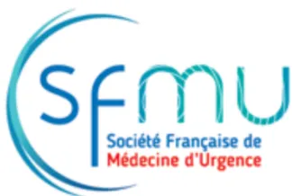

The logo of the Société Française de Médecine d'Urgence (SFMU) features the acronym 'sfmu' in a stylized blue font, with 'Société Française de Médecine d'Urgence' written in smaller red text below it.The logo of the Société Française d'Anesthésie et Réanimation (SFAR) consists of three overlapping circles in red, orange, and teal, with the acronym 'SFAR' in blue text to the right.

## RECOMMANDATIONS DE PRATIQUES PROFESSIONNELLES

De la **Société Française de Médecine d'Urgence (SFMU)**

En association avec la **Société Française d'Anesthésie et Réanimation (SFAR)**

*Avec la participation de la Société Française de Biologie Clinique (SFBC),  
de la Société Française de Radiologie (SFR),  
et de la Société Française de Médecine Physique et Réadaptation (SOFMER)*

## **PRISE EN CHARGE DES PATIENTS PRESENTANT UN TRAUMATISME CRÂNIEN LÉGER DE L'ADULTE**

**Management of patients suffering from mild traumatic brain injury**

**2022**

**Texte validé par la Commission des Référentiels de la SFMU le 19/05/2022, le conseil d'administration de la SFMU le 24/05/2022, le Comité des Référentiels Cliniques de la SFAR le 03/09/2022, le conseil d'administration de la SFAR le 15/09/2022.**

**Auteurs :** Cédric Gil-Jardiné, Jean-François Payen, Rémy Bernard, Xavier Bobbia, Pierre Bouzat, Pierre Catoire, Anthony Chauvin, Yann-Erick Claessens, Bénédicte Douay, Xavier Dubucs, Damien Galanaud, Tobias Gauss, Jean-Yves Gauvrit, Thomas Geeraerts, Bertrand Glize, Sybille Goddet, Anne Godier, Pierrick Le Borgne, Geoffroy Rousseau, Vincent Sapin, Lionel Velly, Damien Viglino, Bernard Vigue, Philippe Cuvillon, Denis Frasca, et Pierre-Géraud Claret.**Auteur pour correspondance :** Cédric Gil-Jardiné ; courriel : cedric.gil-jardine@chu-bordeaux.fr

**Coordonnateurs d'experts :** Cédric Gil-Jardiné (SFMU, Bordeaux) – Jean-François Payen (SFAR, Grenoble)

**Organisateurs :** Pierre-Géraud Claret (SFMU, Nîmes) – Denis Frasca (SFAR, Poitiers) – Philippe Cuvillon (SFAR, Nîmes)

**Groupe d'experts de la SFMU :** Xavier Bobbia (Montpellier), Pierre Catoire (Bordeaux), Anthony Chauvin (Paris), Yann-Erick Claessens (Monaco), Bénédicte Douay (Paris), Xavier Dubucs (Toulouse), Sybille Goddet (Autun), Pierrick Le Borgne (Strasbourg), Geoffroy Rousseau (Tours), Damien Viglino (Grenoble).

**Groupe d'experts de la SFAR :** Rémy Bernard (Paris), Pierre Bouzat (Grenoble), Tobias Gauss (Grenoble), Thomas Geeraerts (Toulouse), Anne Godier (Paris), Lionel Velly (Marseille), Bernard Vigué (Le Kremlin Bicêtre).

**Expert de le SFBC :** Vincent Sapin (Clermont-Ferrand)

**Expert de la SFR :** Jean-Yves Gauvrit (Rennes)

**Expert de la SOFMER :** Bertrand Glize (Bordeaux)

**Groupes de lecture :**

*Commission des Référentiels de la SFMU*

Anthony Chauvin (Président), Pierre-Géraud Claret (Past-président), Jean-Baptiste Bouillon, Pierre Catoire, Richard Chocron, Delphine Douillet, Xavier Dubucs, Cédric Gil-Jardine, Jérémy Guenezan, Maxime Jonchier, Pierrick Le Borgne, Philippe Le Conte, Mathieu Oberlin, Nicolas, Peschanski, Geoffroy Rousseau, Barbara Villoing.

*Conseil d'Administration de la SFMU*

Karim Tazarourte (Président), Thibaut Desmettre (Vice-président), Catherine Pradeau (Secrétaire Général), Muriel Vergne (Secrétaire générale adjointe), Jean-Paul Fontaine (Trésorier), Tahar Chouied (Trésorier adjoint), Florence Dumas, Delphine Hugenschmitt, Yann Penverne, Patrick Plaisance, Patrick Ray, Youri Yordanov.

*Comité des Référentiels Cliniques de la SFAR*

Marc Garnier (Président), Alice Blet (Secrétaire), Anaïs Caillard, Hélène Charbonneau, Hugues De Courson, Audrey De Jong, Marc-Olivier Fischer, Denis Frasca, Matthieu Jabaudon, Daphné Michelet, Stéphanie Ruiz, Emmanuel Weiss.

*Conseil d'Administration de la SFAR*Pierre Albaladejo (Président), Jean-Michel Constantin (1er Vice-président), Marc Leone (2e Vice-président), Marie-Laure Cittanova (Trésorière), Isabelle Constant (Trésorière-adjointe), Karine Nouette-Gaulain (Secrétaire générale), Frédéric Le Saché (Secrétaire général adjoint), Julien Amour, Hélène Beloeil, Valérie Billard, Marie-Pierre Bonnet, Julien Cabaton, Marion Costecalde, Laurent Delaunay, Delphine Garrigue, Pierre Kalfon, Olivier Joannes-Boyau, Frédéric Lacroix, Olivier Langeron, Sigismond Lasocki, Jane Muret, Olivier Rontes, Nadia Smail, Paul Zetlaoui.## **RESUME**

**Objectif.** Élaborer un référentiel français multidisciplinaire qui aborde la prise en charge initiale, pré- et intra-hospitalière, d'un patient victime de traumatisme crânien léger.

**Conception.** Un comité de 22 experts a été constitué sur invitation de la Société Française de Médecine d'Urgence (SFMU) et de la Société Française d'Anesthésie et Réanimation (SFAR). Une politique de déclaration et de suivi des liens d'intérêts a été appliquée et respectée durant tout le processus de réalisation du référentiel. De même, celui-ci n'a bénéficié d'aucun financement provenant d'une entreprise commercialisant un produit de santé (médicament ou dispositif médical). Le groupe d'experts devait respecter et suivre la méthode Grade® (*Grading of Recommendations Assessment, Development and Evaluation*) pour évaluer la qualité des données factuelles sur lesquelles étaient fondées les recommandations. Face à l'impossibilité d'obtenir un niveau de preuve élevé pour la majorité des recommandations, il a été décidé d'adopter un format de Recommandation de Pratiques Professionnelles (RPP), plutôt qu'un format de Recommandations Formalisées d'Experts (RFE), et de formuler les recommandations en utilisant la terminologie des RPP de la SFMU et de la SFAR.

**Méthodes.** Trois champs ont été définis : 1) Evaluation pré-hospitalière, 2) prise en charge aux urgences, et 3) modalités à la sortie des urgences. Le groupe a étudié 11 questions relatives au traumatisme crânien léger. Chaque question a été formulée selon un format PICO (*Patients Intervention Comparison Outcome*).

**Résultats.** Le travail de synthèse des experts et l'application de la méthode GRADE® ont abouti à l'élaboration de 13 recommandations. Après deux tours de cotation, un accord fort a été obtenu pour l'ensemble des recommandations. Pour une des questions, aucune recommandation n'a pu être formulée.

**Conclusion.** Un accord fort existait parmi les experts sur des recommandations importantes, transdisciplinaires, dont la finalité est l'amélioration des pratiques de prise en charge des patients victimes de traumatisme crânien léger.## **Abstract**

**Objective.** To develop a multidisciplinary French reference that addresses the initial pre- and in-hospital management of a mild traumatic brain injury patient.

**Design.** An expert panel of 22 experts was formed on request from the French Society of Emergency Medicine (SFMU) and the French Society of Anaesthesiology and Critical Care Medicine (SFAR). A policy of declaration and monitoring of links of interest was applied and respected throughout the process of producing the guidelines. Similarly, no funding was received from any company marketing a health product (drug or medical device). The expert panel had to respect and follow the Grade® (Grading of Recommendations Assessment, Development and Evaluation) methodology to evaluate the quality of the evidence on which the recommendations were based. Given the impossibility of obtaining a high level of evidence for most of the recommendations, it was decided to adopt a Professional Practice Recommendation (PPR) format, rather than a Formalized Expert Recommendation (FER) format, and to formulate the recommendations using the terminology of the SFMU and SFAR Guidelines.

**Methods.** Three fields were defined: 1) pre-hospital assessment, 2) emergency room management, and 3) emergency room discharge modalities. The group assessed 11 questions related to mild traumatic brain injury. Each question was formulated using a PICO (Patients Intervention Comparison Outcome) format.

**Results.** The experts' synthesis work and the application of the GRADE® method resulted in the formulation of 13 recommendations. After two rounds of rating, strong agreement was obtained for all recommendations. For one question, no recommendation could be made.

**Conclusion.** There was strong agreement among the experts on important, transdisciplinary recommendations, the purpose of which is to improve management practices for patients with mild head injury.## Introduction

Le Traumatisme Crânien Léger (TCL) est la résultante d'un transfert d'énergie mécanique reçue par la tête sous l'effet de forces physiques externes [1]. Cette définition inclut, ainsi, les chocs au niveau de la tête, les impacts d'objets au niveau du crâne et les mouvements d'accélération/décélération (i.e. « coup du lapin » par exemple) sans traumatisme direct au niveau du crâne. Il a pour conséquence une perturbation physiologique du fonctionnement cérébral.

En Europe, les traumatismes crâniens représentent plus 2,5 millions de cas chaque année, dont environ 90% sont qualifiés de « légers » [2, 3].

Les critères d'identification clinique sont présentés dans le Tableau 1. Ces manifestations ne doivent pas être dues à des toxiques (drogues, alcool, médicaments, anesthésiants...), à d'autres blessures (ex : état de choc), à d'autres problèmes (traumatisme psychologique, barrière de la langue ou conditions médicales co-existantes) ou à une blessure crânio-cérébrale pénétrante. Les conséquences des phénomènes d'anoxie/ischémie cérébrale, des processus expansifs ou encore infectieux sont, bien évidemment, également exclus de cette définition.

<table border="1"><thead><tr><th><b>Perturbation du fonctionnement cérébral définissant le traumatisme crânien léger selon l'OMS</b></th></tr></thead><tbody><tr><td>1. Une ou plusieurs des manifestations suivantes :</td></tr><tr><td>- confusion ou désorientation</td></tr><tr><td>- perte de conscience pendant 30 minutes ou moins</td></tr><tr><td>- amnésie post-traumatique pendant moins de 24 heures</td></tr><tr><td>- et/ou autres anomalies neurologiques transitoires telles que signes focaux, crise d'épilepsie et lésion intracrânienne ne nécessitant pas d'intervention chirurgicale</td></tr><tr><td>2. Score de 13 à 15 sur l'échelle de coma de Glasgow 30 minutes après la blessure ou plus tard lors de la présentation aux soins</td></tr></tbody></table>

Tableau 1 : Critères et Définition Traumatisme Crânien Léger (selon OMS 2004) [1]

Depuis les dernières recommandations françaises de la Société Française de Médecine d'Urgence de 2012, de nombreuses études multicentriques et internationales ont été conduites. En revanche, on retrouve très peu d'essais cliniques.

Le champ d'application des présentes recommandations de pratiques professionnelles correspond aux patients adultes pris en charge dans une structure de médecine d'urgence dans les 24 heures suivant un traumatisme crânien non pénétrant de la tête avec un score de Glasgow lors de l'évaluation initiale côté à 13, 14 ou 15.A travers ces recommandations, les experts se sont attachés à définir les principaux éléments de prise en charge des patients victimes de traumatismes crâniens légers en structure de médecine d'urgence, de la régulation médicale à la sortie des services d'urgence. A l'instar des recommandations de la société française de pédiatrie [4], les présentes recommandations se sont attachées à évaluer le niveau de risque de saignement intra- ou péri-cérébral des patients qui ont recours aux structures de médecine d'urgence dans les suites d'un traumatisme crânien léger.

## **Méthodologie**

Ces recommandations sont le résultat du travail d'un groupe d'experts réunis par la SFMU et la SFAR. Chaque expert a rempli une déclaration de conflits d'intérêts avant de débuter le travail d'analyse. Dans un premier temps, le comité d'organisation a défini les objectifs de ces recommandations et la méthodologie utilisée. Les différents champs d'application de ces Recommandations de Pratiques Professionnelles (RPP) et les questions à traiter ont ensuite été définies par le comité d'organisation avant d'être modifiées et validées par les experts. Les questions ont été formulées selon le format PICO (*Patients, Intervention, Comparison, Outcome*). La méthodologie GRADE (*Grade of Recommendation Assessment, Development and Evaluation*) a été appliquée pour l'analyse de la littérature et la rédaction des tableaux récapitulatifs des données de la littérature. Un niveau de preuve a été défini pour chacune des références bibliographiques citées en fonction du type de l'étude. Ce niveau de preuve pouvait être réévalué en tenant compte de la qualité méthodologique de l'étude, de la cohérence des résultats entre les différentes études, du caractère direct ou non des preuves, de l'analyse de cout et de l'importance du bénéfice. Malgré un nombre important d'étude s'intéressant aux différentes dimensions de la prise en charge initiale d'un traumatisme crânien léger, il n'existe que très peu d'étude à haut niveau de preuve. Leur qualité méthodologique et/ou leur puissance est le plus souvent faibles, avec très peu d'essais cliniques. De ce fait, face à l'impossibilité d'obtenir un niveau de preuve élevé pour la majorité des recommandations, il a donc été décidé en amont de la rédaction des recommandations d'adopter un format de Recommandation pour la pratique professionnelle (RPP), plutôt qu'un format de Recommandations Formalisées d'Experts (RFE), et de formuler les recommandations en utilisant la terminologie des RPP de la SFMU et de la SFAR. De ce fait, chaque recommandation a été rédigée comme suit : « les experts proposent de faire » ou « les experts proposent de ne pas faire ». Chaque recommandation a ensuite été évaluée par chacun des experts et soumise à une cotation individuelle à l'aide d'une échelle allant de 1 (désaccord complet) à 9 (accord complet). La cotation collective était établie selon une méthodologie GRADE grid. Pour valider une recommandation, au moins 50 % des experts devaient exprimer une opinion qui allait globalement dans la même direction, tandis que moins de 20 % d'entre eux devaient exprimer uneopinion contraire. Pour qu'une recommandation soit forte, au moins 70 % des participants devaient avoir une opinion qui allait globalement dans la même direction. En l'absence d'accord fort, les recommandations étaient reformulées et de nouveau soumises à cotation dans l'objectif d'aboutir à un consensus.

## **Résultats**

### *Champs des recommandations*

Les experts ont volontairement choisi de ne traiter que 11 questions, qui leur paraissaient couvrir des domaines ayant connu le plus de progrès et/ou sources de discussions et de diversités de prise en charge à encadrer.

### *Recommandations*

Après synthèse du travail des experts et application de la méthode GRADE, 13 recommandations ont été formalisées. Du fait du manque de données dans la littérature, une question a donné lieu à une « absence de recommandation ». La totalité des recommandations a été soumise au groupe d'experts pour une cotation avec la méthode GRADE Grid. Après deux tours de cotations et divers amendements, un accord fort a été obtenu pour 100 % des recommandations.

Les présentes RPP se substituent aux recommandations précédentes émanant de la SFMU sur un même champ d'application [5]. La SFMU et la SFAR incitent tous les médecins urgentistes à se conformer à ces RFE pour assurer une qualité des soins dispensés aux patients. Cependant, dans l'application de ces recommandations, chaque praticien doit exercer son jugement, prenant en compte son expertise et les spécificités de son établissement, pour déterminer la méthode d'intervention la mieux adaptée à l'état du patient dont il a la charge.## Champ 1 : Évaluation pré-hospitalière.

**Question 1 : Lors d'un appel en régulation médicale, quels sont les patients avec traumatisme crânien léger pouvant ne pas être orientés de façon systématique vers une structure des urgences pour une évaluation ?**

**Experts :** Damien Viglino (SFMU) - Tobias Gauss (SFAR)

P : Patient suspect de traumatisme crânien léger  
I : Orientation vers une structures d'accueil des urgences  
C : Laisse sur place  
O : Aggravation neurologique

**R1 - Les experts proposent que les patients victimes d'un traumatisme crânien léger, pour lesquels la régulation médicale est sollicitée, ne soient pas orientés de façon systématique vers une structure des urgences s'ils peuvent être surveillés par une tierce personne en l'absence :**

- - De trouble de coagulation préexistant (dont un traitement par anticoagulant) ;
- - D'âge > 65 ans ET de traitement par agent(s) antiplaquettaire(s) ;
- - D'intoxication (médicamenteuse, alcool, autre...) ;
- - De symptômes en dehors de céphalées (vomissement, perte de connaissance, amnésie > 30 min, convulsion, déficit focalisé, altération de la vigilance) ;
- - De signe de traumatisme (hématome en lunettes, embarrure, signes de fracture de la base du crâne, hématome mastoïdien).

### Avis d'experts (Accord Fort)

**Argumentaire :** Compte tenu des éléments disponibles dans la littérature, il est difficile de formuler des recommandations applicables au système de régulation médicale en France. La grande majorité des travaux identifiant avec un haut niveau de preuve des facteurs prédictifs de lésions intracrâniennes ou de recours à la neurochirurgie ont été réalisés dans un contexte ne comportant pas de régulation médicalisée et dans des services d'urgences. Plusieurs études cohortes indépendantes ont permis de valider des critères pour recourir à un scanner [6], en particulier le Canadian CT head rule (CCHR) [7]. Les facteurs identifiés sont toute altération de l'état de vigilance (GCS <15) lors de la prise en charge ou à 2h, une perte de connaissance, des convulsions, un déficit sensitivomoteur, des vomissements (notamment itératifs), un traumatisme crânien ouvert avec embarrure et ou des signes de fracture de la base du crâne (rhinorrhée, otorrhée, hématome en lunettes et mastoïdien), un âge >65, voire >60 ans, une amnésie antérograde. Ces travaux mettent particulièrement en garde en cas d'intoxication ou de lésion douloureuse qui pourrait détourner l'attention du patient ou perturber son examen, ou de mécanisme à cinétique élevée (piéton versus véhicule, projection en dehors de l'habitacle, chute > 2m ou 5 marches). Il est à noter que le CCHR,score de loin le plus étudié, exclut les patients sous traitement anticoagulant, d'âge < 16 ans, avec un GCS < 13 ou présentant un épisode de convulsion. L'application de ces critères au contexte de régulation médicale en France est une transposition sans validation par des études cliniques.

Dans le cas d'un patient de moins de 65 ans sous monothérapie antiplaquettaire ayant subi un traumatisme crânien mineur et asymptomatique, sans plaie, n'ayant pas d'autre facteur de risque de saignement (anticoagulation, éthyisme chronique, antécédent d'hémorragie intracrânienne), les experts proposent la possibilité d'une surveillance simple à domicile de l'apparition de symptômes, si elle est réalisable par une tierce personne dans de bonnes conditions. En effet, des études récentes et une méta-analyse retrouvent une incidence modérément augmentée d'hémorragie intracrânienne sous antiagrégation plaquettaire, sans augmentation du risque d'évolution nécessitant un acte neurochirurgical ou de décès, et questionnent le bénéfice-risque d'une imagerie systématique [8, 9].

Dans les autres cas, une indication d'imagerie cérébrale pourrait être retenue au premier contact médical. En l'absence de détresse vitale (neurologique, respiratoire, hémodynamique, ou à risque de pronostic fonctionnel pouvant nécessiter un geste médical), la médicalisation pré-hospitalière semble inutile et un transport non-médicalisé vers une structure disposant de capacités d'imagerie cérébrale doit être réalisé. L'orientation d'emblée vers un centre disposant de capacités de neurochirurgie est réservée aux patients traumatisés graves avec défaillance neurologique, n'entrant pas dans le cadre des traumatismes crâniens légers.## Champ 2 : Prise en charge aux services des urgences.

### Question 2.1 Quels sont les éléments cliniques et anamnestiques à risque de lésion intracrânienne ?

**Experts :** Xavier Dubucs (SFMU) - Rémy Bernard (SFAR)

P : Patient admis pour TCL aux urgences

I : Présence d'un élément

C : Absence d'un élément

O : Présence d'une lésion intracrânienne

**R2.1 - Les experts proposent de stratifier le risque d'aggravation clinique ou de lésion intracrânienne selon la classification suivante :**

- • **Risque élevé :**
  - ○ **Éléments anamnestiques :**
    - ▪ **Troubles de l'hémostase : anticoagulants, bithérapie antiplaquettaire ou maladie hémorragique congénitale (hémophilie, maladie de Willebrand...)**
  - ○ **Éléments cliniques :**
    - ▪ **Signes cliniques évoquant une fracture de la voûte du crâne ou de la base du crâne (*Tableau 2*)**
    - ▪ **Score de Glasgow inférieur à 15 à 2 heures du traumatisme sans intoxication**
    - ▪ **Plus d'un épisode de vomissements**
    - ▪ **Convulsions post-traumatiques**
    - ▪ **Déficit neurologique focalisé**
- • **Risque intermédiaire :**
  - ○ **Éléments anamnestiques :**
    - ▪ **Âge supérieur ou égal à 65 ans avec mono-antiagrégation plaquettaire**
    - ▪ **Score de Glasgow inférieur à 15 à 2 heures du traumatisme avec intoxication**
    - ▪ **Traumatisme avec une cinétique élevée (*Tableau 3*)**
  - ○ **Éléments cliniques :**
    - ▪ **Amnésie des faits survenus plus de 30 min avant le traumatisme**

#### Avis d'experts (Accord Fort)

**Argumentaire :** La seule modification apportée aux précédentes recommandations de 2012 concerne la modération de la place des antiagrégants. Une monothérapie par aspirine ou clopidogrel n'est plus considérée comme un facteur de risque de lésion hémorragique intracrânienne.

Tous les facteurs de risque de lésion intracérébrale et/ou d'aggravation clinique ont été retrouvés dans de nombreuses études établissant des règles de décision : CCHR [7] (*Canadian CT Head Rule*), NOC [10] (*New Orleans Criteria*), CHIP [11] (*CT in Head Injury Patients*), NEXUS II [12] (*National Emergency X-Ray Utilization Study*), NICE [13] (*National Institute for Health and Care Excellence*), SNC [14] (*Scandinavian Neurotrauma Committee*), NCWFS [15] (*Neurotraumatology Committee of the World Federation of Neurosurgical**Societies*) pour identifier les patients à faible risque de lésion cérébrale qui ne nécessitent ni surveillance prolongée en milieu hospitalier, ni scanner cérébral.

Pour faciliter la lecture et la comparaison de ces règles de décision, l'annexe 1 expose les différentes sensibilités et les rapports de vraisemblance. Ces valeurs sont issues de la méta-analyse de Easter et al. [16] publiée dans le JAMA en 2015, et de l'étude de Foks et al. [17] publiée en 2018 dans le BMJ d'une grande qualité méthodologique.

Aucune de ces règles n'est parfaite. Les règles de décision associant les meilleures performances et le plus grand nombre de validations externes sont le CCHR [7], le NOC [10] et le CHIP [11]. La méta-analyse de Easter *et al.* [16] montre une meilleure spécificité du CCHR par rapport au NOC, pour une sensibilité à peu près égale. L'étude plus récente de Foks et al. [17] montre une sensibilité et une spécificité moindre du CCHR par rapport à la règle de décision CHIP. Enfin, il est intéressant de noter qu'il n'existe pas à notre connaissance d'étude montrant la réduction du nombre de scanner cérébral secondaire lorsque les médecins utilisent des règles de décision. Un essai randomisé en cluster mené au Canada, chez 4531 patients atteints d'un traumatisme crânien léger n'a pas mis en évidence de différence significative entre le groupe avec l'intervention (éducation et entraînement des médecins à l'algorithme CCHR) par rapport au groupe sans intervention ( $p=0,16$ ) [18]. Un scanner était réalisé chez environ 75% des patients dans les 2 groupes.

Tous ces éléments nous incitent à établir une liste de critères synthétisant l'ensemble des connaissances acquises par ces études sans pour autant privilégier une règle de décision ou un score en particulier.

Le scanner cérébral sans injection est la seule imagerie cérébrale évaluée dans toutes les études s'intéressant à ces facteurs de risque. Un scanner cérébral avec injection doit être pratiqué devant les signes cliniques évocateurs de dissection carotidienne (*conférence d'actualisation 2013 : lésions traumatiques des vaisseaux du cou*) : fracture du rachis cervical, déficit neurologique non expliqué par l'imagerie, syndrome de Claude Bernard Horner, fracture de Lefort II ou III, fracture de la base du crâne, traumatisme des tissus mous de la région cervicale.

Malgré une grande hétérogénéité, la méta-analyse d'Easter *et al.* [16] estime la prévalence des lésions intracérébrales sévères à 7,1% IC95%(6,8% - 7,4%) chez les patients atteints d'un traumatisme crânien léger. Ces lésions sévères sont définies comme des lésions nécessitant une surveillance hospitalière, un avis ou une intervention neurochirurgicale : hématome sous-dural, hématome extra-dural, hémorragie intraventriculaire, hémorragie sous-arachnoïdienne, hémorragie intra-parenchymateuse, engagement cérébral ou embarrure. Le taux de lésions conduisant au décès ou à une intervention neurochirurgicale est estimé à seulement 0,9% (0,8% - 1,0%) des patients atteints de TCL. Les patients à risque faible (sans aucun des facteurs du CCHR) ont un risque de lésion intracérébrale sévère estimé à 0,31% (0% - 4,7%). Cependant,l'utilisation d'un critère de jugement composite dans cette étude conduit à considérer avec la même importance la nécessité d'une surveillance à l'hôpital et le recours à une intervention neurochirurgicale. L'étude de Foks *et al.* [17] menée chez 4557 patients avec un traumatisme crânien léger retrouve quant à elle une prévalence de 8,4% de lésions intracrâniennes. Les lésions potentiellement chirurgicales sont présentes chez 1,6% des patients avec un TCL mais seulement 0,4% des patients avec TCL ont réellement besoin d'une intervention neurochirurgicale dans les 30 jours suivant le traumatisme. Chez les patients sans facteur de risque du CCHR, 4% ont des lésions au scanner et 0,5% des lésions potentiellement chirurgicales. Chez les patients sans facteur de risque du CHIP, 2,6% ont des lésions au scanner et 0,2% des lésions potentiellement chirurgicales.

L'étude prospective de Probst *et al.* [19] ne met pas en évidence de sur-risque de lésions intracérébrales chez les patients sous monothérapie antiagrégante (aspirine ou clopidogrel). Ce surrisque est en revanche discuté chez les sujets âgés [9] et une étude conforte l'apport d'une pondération par l'âge de l'effet potentiel d'une antiagrégation plaquettaire [20]. Cette pondération par l'âge, instaurée dans les recommandations scandinaves depuis 2013 [21], a été validée par Unden *et al.* [22].

Enfin, l'antécédent neurochirurgical de valve interne, proposé comme facteur de risque par le NCWFS (*the Neurotraumatology Committee of the World Federation of Neurosurgical Societies*), ne sera pas retenu ici car il n'existe pas de littérature chez l'adulte et la littérature pédiatrique montre des résultats discordants [23].

**Tableau 2 :** Signes cliniques évocateurs d'une fracture de la base ou de la voûte crânienne

<table border="1">
<tr>
<td>Base du crâne</td>
<td>Otorrhée ou rhinorrhée, ecchymose mastoïdienne, ecchymose périorbitaire, hémotympan ou saignement extériorisé par le conduit auditif</td>
</tr>
<tr>
<td>Voûte du crâne</td>
<td>Discontinuité palpable de la voûte, suspicion d'embarrure ouverte ou fermée du crâne</td>
</tr>
</table>

**Tableau 3 :** Éléments anamnétiques évocateurs d'un traumatisme à cinétique élevée

<table border="1">
<tr>
<td>Occupant éjecté du véhicule,</td>
<td>Piéton et cycliste renversé et sans casque</td>
</tr>
<tr>
<td>Véhicule retourné</td>
<td>Chute d'une hauteur supérieure à 5 marches ou supérieur à 2 m</td>
</tr>
</table>**Question 2.2 : Quelle est la place des biomarqueurs dans l'évaluation et la prise en charge des patients admis aux urgences pour traumatisme crânien léger ?**

**Experts :** *Thomas Geeraerts (SFAR), Yann-Erick Claessens (SFMU), Vincent SAPIN (SFBC).*

P : Patient admis aux urgences pour traumatisme crânien léger

I : Dosage de biomarqueurs sanguins disponibles en pratique clinique

C : Examen clinique seul

O : Diminution du nombre de TDM

**R2.2.1 - Les experts proposent de réaliser un dosage sanguin de la protéine S100B, lorsque celui-ci est disponible, dans les 3 h suivant le traumatisme crânien léger, chez les patients à risque intermédiaire (cf. R2.1) pour limiter le nombre de scanners cérébraux.**

**R2.2.2 - Les experts proposent de réaliser un dosage sanguin combinant UCH-L1 et GFAP lorsque ceux-ci sont disponibles, dans 12 heures suivant le traumatisme crânien léger, chez les patients à risque intermédiaire (cf. R2.1) pour limiter le nombre de scanners cérébraux.**

**Avis d'experts (Accord Fort)**

**Argumentaire :** La protéine S100 Bêta appartient à la famille multigénique des protéines S100 de bas poids moléculaire (9-13kDa) transporteur de calcium (calciprotéines). Elle est essentiellement exprimée dans les cellules gliales du système nerveux central, plus particulièrement dans les astrocytes. Elle participe à la régulation de la morphologie cellulaire par l'interaction avec les éléments du cytosquelette cytoplasmique. Elle est activement secrétée par les astrocytes. Sa demi-vie biologique est d'environ 1,5 heures, et son pic plasmatique est observé 2 heures après le traumatisme. Elle peut être détectée à la fois dans le liquide cérébro-spinal et dans le sang.

Deux revues systématiques de la littérature avec méta-analyse [24, 25] ont été récemment publiées. Elles montrent que, dans une population générale de patients victimes d'un traumatisme crânien léger ou modéré, une concentration plasmatique de protéine S100 Bêta inférieure à 0,1 µg/L dans les 3 heures après le traumatisme permet d'éliminer avec une bonne performance la présence de lésion intracrânienne significative au scanner cérébral (sensibilité 96,4 à 100%, VPN 96,9 à 100% pour [24], et sensibilité de 87% IC95%(81%-92%) pour [25]). De bonnes performances diagnostiques ont également été retrouvées pour une concentration plasmatique de protéine S100 Bêta < 0,1 µg/L dans les 3 heures suivant le traumatisme chez les patients âgés de plus de 65 ans ayant subi un TCL à risque intermédiaire de complication [26]. Une adaptation du seuil à l'âge pourrait améliorer encore les performances. L'utilisation de la protéine S100 Bêta pourrait ainsi diminuer l'utilisation du scanner cérébral (épargne de scanners inutiles, sans modifier le pronostic) [27].Les études sont en revanche insuffisantes pour conclure que le dosage de la Protéine S100 Bêta améliore la prédiction du pronostic neurologique dans les TCL, en comparaison des critères cliniques seuls.

Il est important de noter que la protéine S100 Bêta est présente également dans d'autres tissus comme les adipocytes ou les chondrocytes. Ainsi, un taux élevé plasmatique de protéine S100 Bêta a pu être constaté après polytraumatisme sans lésions cérébrales [28], limitant sa spécificité dans le contexte de TCL associé à des lésions musculo-squelettiques.

L'Ubiquitin C-Terminal Hydrolase-L-1 (UCH-L1) est un marqueur caractéristique des neurones en raison de sa grande abondance et de son expression neuronale spécifique. Sa demi-vie biologique est d'environ 8 heures, et son pic plasmatique est observé 8 heures après le traumatisme.

La Glial Fibrillary Acidic Protein (GFAP) représente la majeure partie du cytosquelette des astrocytes et se trouve presque exclusivement dans les cellules gliales du SNC. Elle peut ainsi être considérée comme un marqueur spécifique des pathologies du SNC et est impliquée dans des processus neurologiques divers comme le maintien de la barrière hématoencéphalique. Sa demi-vie biologique est d'environ 38 heures, et son pic plasmatique est observé 24 heures après le traumatisme. La concentration plasmatique de GFAP n'est pas modifiée lors de polytraumatisme sans atteinte cérébrale.

Dans la méta-analyse de Amoo *et al.* [25], le dosage sérique de GFAP avec un seuil de 22 pg/mL, a une sensibilité pour détecter les lésions traumatiques cérébrales au scanner de 93% (73%–99%) et une spécificité de 36% (12%–68%). Dans la méta-analyse de Rogan *et al.* [24], la précision diagnostique de la GFAP pour détecter les lésions intracrâniennes sur le scanner a été évaluée dans 6 études. La sensibilité était comprise entre 67% et 100 % et la spécificité entre 0% et 89 %. La VPN de la GFAP était comprise entre 72,1% et 100 %. Pour l'UCH-L1, l'analyse a été faite sur 4 études, avec une sensibilité allant de 61% à 100%, et une spécificité de 21% à 63,7% pour détecter les lésions au scanner cérébral. La VPN de l'UCH-L1 pour éliminer une lésion au scanner allait de 70,7% à 100%.

Dosée dans les 12 heures qui suivent un traumatisme crânien léger non pénétrant de l'adulte, la combinaison du dosage sérique d'UCH-L1 et de GFAP, avec des seuils respectifs de 327 pg/mL et 22 pg/mL, permet d'éliminer avec une bonne performance la présence de lésion intracrânienne au scanner cérébral [spécificité : 36,7% (34,5%-39%), sensibilité 97,3% (92,4%-99,4%), VPN 99,5% (98,7%-99,9%)] [29].

L'utilisation du dosage combiné d'UCHL1 et de GFAP pourrait ainsi diminuer l'utilisation du scanner cérébral (épargne de scanners inutiles). Ce couple de biomarqueur a néanmoins fait l'objet d'un nombre moins important d'études cliniques que S100 bêta à ce jour.

**Question 2.3 : Quel est le délai optimal de réalisation de la TDM cérébrale pour exclure une lésion intracrânienne ?****Experts :** Pierre Catoire (SFMU), Jean-Yves Gauvrit (SFR)

P : Patient admis aux urgences pour TCL avec indication de TDM

I : Délai de réalisation de la TDM

C : Non respect du délai

O : Aggravation neurologique secondaire

**R2.4 - Les experts proposent de réaliser une TDM cérébrale le plus précocement possible pour identifier les lésions intracrâniennes significatives, chez les patients présentant un TCL :**

- • **Idéalement dans l'heure suivant l'admission en structures des urgences pour les patients à risque élevé d'aggravation clinique ou de lésion intracrânienne.**
- • **Au plus tard dans les huit heures pour les patients à risque intermédiaire d'aggravation clinique ou de lésion intracrânienne.**

#### **Avis d'experts (Accord Fort)**

**Argumentaire :** Le groupe d'experts a défini la notion de délai optimal de réalisation du scanner cérébral comme le délai qui minimise le risque de morbi-mortalité associée aux lésions intracérébrales post-traumatiques (décès, séquelles neurologiques post-traumatiques), chez les patients avec indication d'imagerie en urgence. Le risque d'un scanner réalisé trop tardivement est de retarder la prise en charge de lésions accessibles à un traitement (antagonisation d'anticoagulation, chirurgie, neuroprotection avancée). Le risque d'un scanner réalisé trop précocement est de méconnaître un saignement ou un œdème dont le volume serait trop faible pour être visible au moment de l'imagerie.

Le retard de prise en charge d'une lésion intracrânienne accessible à un traitement entraîne une détérioration du pronostic neurologique [32, 33]. Parmi les études déterminant les performances des éléments cliniques pour prédire une lésion intracrânienne, aucune d'entre elles n'a porté explicitement sur les patients traumatisés crâniens légers porteurs de lésions nécessitant une prise en charge neurochirurgicale immédiate, justifiant la réalisation de l'imagerie cérébrale sans délai. Parmi les patients traumatisés crâniens sévères éligibles à une chirurgie, la prise en charge précoce (dans les trois heures suivant l'admission) a montré une réduction de mortalité dans une étude rétrospective [34].

Si ces critères cliniques de haut risque de lésion significative sont absents, la réalisation d'une imagerie doit permettre d'identifier les lésions nécessitant une intervention spécifique, sans méconnaître une lésion à potentiel évolutif. Il n'existe pas à notre connaissance d'étude prospective ayant évalué le risque spécifique associé au délai d'imagerie pour la méconnaissance de ces lésions, sur critère clinique ou radiologique. Geijerstam *et al.* [38] ont réalisé une revue de littérature approfondie, de 1966 à 2003. Dans cette revue, onze cas ont rapporté une dégradation neurologique significative malgré un scanner initial normal, dont trois seulement documentaient le délai entre traumatisme et scanner initial. Par ailleurs, de nombreux facteurs limitent la pertinence de ces résultats pour la question étudiée, en particulier l'absencede relecture des images initiales, et l'évolution de la qualité des images scanographiques, les trois cas ayant été décrits avant les années 2000.

En l'absence de donnée probante permettant de déterminer un délai minimal optimal d'imagerie chez ces patients, le groupe d'experts retient les données d'études de validation [17, 39, 40] de recommandations internationales telles que les règles Canadian CT Head [7], New Orleans [10], ou NICE [13], ayant montré que l'utilisation d'un délai de 8 heures a permis d'identifier les lésions chez la quasi-totalité des patients des cohortes. Ces données de sécurité ont justifié le délai proposé par le groupe d'experts.

Il est rappelé qu'un scanner cérébral avec injection doit être pratiqué devant des signes cliniques évocateurs de dissection carotidienne [41] : fracture du rachis cervical, déficit neurologique non expliqué par l'imagerie, syndrome de Claude Bernard Horner, fracture de Lefort II ou III, fracture de la base du crâne, traumatisme des tissus mous de la régions cervicale.

#### **Question 2.4 : Quelle est la performance du Doppler transcrânien dans l'évaluation du risque d'aggravation neurologique des patients ?**

**Experts :** Pierre Bouzat (SFAR), Xavier Bobbia (SFMU)

P : Patient admis pour TCL aux urgences avec TDM cérébrale

I : Evaluation par Doppler transcrânien

C : Evaluation clinique seule

O : Aggravation neurologique

**R2.3 - Les experts proposent de réaliser, après un scanner cérébral anormal, un Doppler Transcrânien chez les patients traumatisés crâniens légers pour évaluer le risque d'aggravation neurologique précoce.**

#### **Avis d'experts (Accord Fort)**

**Argumentaire :** Le Doppler Transcrânien (DTC) réalisé à l'admission des patients a permis d'exclure le risque d'aggravation neurologique précoce dans deux cohortes prospectives. Dans une cohorte prospective monocentrique incluant des patients avec un TC léger ou modéré, un index de pulsatilité (IP) < 1,25 et une vitesse diastolique (Vd) > 25 cm/s étaient associés à une absence d'aggravation neurologique précoce [30]. Ces seuils ont été ensuite confirmés par une étude observationnelle multicentrique prospective incluant 356 patients avec un score de Glasgow entre 9 et 15. Dans cette étude, la valeur prédictive négative du DTC pour prédire l'aggravation neurologique était de 98 % (96 %-100 %), et 100% (97%-100%) pour les traumatismes crâniens légers [31]. Dans ces deux études, le DTC était réalisé après le scanner cérébral sans injection, au maximum dans les 12 heures suivant le traumatisme.**Question 2.5 : Parmi les patients présentant une lésion intracrânienne sur la TDM initiale, quels sont ceux qui doivent bénéficier d'une imagerie cérébrale de contrôle dans les 48 premières heures ?**

**Experts :** Lionel Velly (SFAR), Sybille Goddet (SFMU), Jean-Yves Gauvrit (SFR)

P : Patient présentant une lésion intracrânienne sur la TDM initiale

I : TDM de contrôle

C : Pas de TDM de contrôle

O : Aggravation radiologique

**R2.5 - Les experts proposent de ne pas réaliser d'imagerie de contrôle aux patients présentant une lésion intracrânienne sur la TDM initiale, en dehors des situations suivantes :**

- • **aggravation neurologique ;**
- • **patient âgé de plus de 65 ans ;**
- • **troubles de l'hémostase, en dehors de la prise d'aspirine seule.**

**Avis d'experts (Accord Fort)**

La question du contrôle scanographique est une question récurrente aux urgences et source d'échanges réguliers avec les services d'autres spécialités en termes d'utilité et de délai. Les données de la littérature sont contradictoires concernant la surveillance et la nécessité d'une imagerie de contrôle pour la mise en évidence d'une lésion hémorragique retardée justifiant d'une prise en charge neurochirurgicale, ou pour la surveillance d'un patient présentant une lésion hémorragique sur l'imagerie initiale.

5% des patients présentant un traumatisme crânien léger avec un GCS 15 ont une imagerie anormale, 30% lorsque le GCS est compris entre 13 et 15. Parmi eux, 1% nécessitent une prise en charge neurochirurgicale [42]. En 2012, une étude incluant des patients présentant un GCS > 13, avec une lésion hémorragique intracrânienne, sans indication neurochirurgicale et ne nécessitant pas de surveillance en soins intensifs, concluait à l'absence de nécessité de réaliser des imageries de contrôle systématiques sans aggravation clinique [43]. Une étude prospective incluant des patients présentant une lésion hémorragique initiale et hospitalisé pour surveillance, comparant des délais de réalisation d'un scanner de contrôle entre H12 et H48, concluait en 2018 que ce dernier pouvait raisonnablement être proposé après 48h en l'absence d'aggravation neurologique clinique [44]. D'autres études plus anciennes concluient aussi au peu d'utilité du contrôle de l'imagerie en l'absence d'aggravation neurologique clinique pour des patients présentant une lésion hémorragique initiale sans indication chirurgicale. Une étude précisait que les patients âgés ouprésentant une coagulopathie avaient cependant un risque évolutif majoré [45]. A l'inverse, dans le cadre d'une hémorragie sous-arachnoïdienne traumatique, il semblait utile de répéter l'imagerie après 24-48h d'évolution [46]. La CENTER-TBI study constatait récemment, l'augmentation des lésions à J7 chez les patients sous antiagrégants ou anticoagulants (54% des patients), sans impact sur la durée hospitalisation, le recours à une intervention chirurgicale, la mortalité et les troubles fonctionnels à 6 mois [47]. Une autre étude retrouvait une augmentation des lésions intracérébrales dans 50% des cas dans les 24h [48]. Les résultats de ces études ne permettent en revanche pas de conclure sur le délai idéal de l'imagerie de contrôle chez les patients présentant une lésion intracérébrale initiale avec facteurs de risque d'aggravation. L'imagerie de contrôle sera en revanche réalisée immédiatement en cas d'aggravation neurologique clinique.

**Question 2.6 : Chez un patient traité par anticoagulant oral (AOD, AVK), quelles sont les indications et modalités de réversion de ces thérapeutiques ?**

**Experts :** Anne Godier (SFAR), Geoffroy Rousseau (SFMU)

P : Patient avec TCL sous anticoagulant (AOD, AVK)

I : Réversion des médicaments anticoagulants

C : Pas de réversion

O : Aggravation neurologique

**R2.6.1 - Les experts proposent de réaliser une réversion immédiate des anti-vitamine K chez les patients présentant une lésion hémorragique intracrânienne objectivée par une imagerie après un traumatisme crânien léger pour limiter le risque d'aggravation neurologique.**

**R 2.6.2 - Les experts proposent de réaliser une réversion immédiate des anticoagulants oraux directs chez les patients présentant une lésion hémorragique intracrânienne objectivée par une imagerie après un traumatisme crânien léger pour limiter le risque d'aggravation neurologique.**

**R2.6.3 – Les experts proposent de discuter la conduite à tenir de façon collégiale chez les patients porteurs d'une valve cardiaque mécanique.**

**Avis d'experts (Accord Fort)****Argumentaire :** Il y a peu de littérature évaluant l'efficacité de la réversion des anticoagulants (AOD ou AVK) sur l'aggravation neurologique ou la mortalité dans le cadre du traumatisé crânien.

Un traitement par AVK augmente le risque d'HIC après un TC léger [36, 49]. Le risque est plus élevé en cas d'INR élevé [36]. Un INR > 3 à la prise en charge semble associé à un risque plus élevé de saignement retardé [RR 14 IC95%(4-49)] [50]. La réversion des AVK a été évaluée dans un essai randomisé dans les hémorragies intracrâniennes spontanées, mais pas dans les TC [51] : les concentrés de complexe prothrombinique (CCP) ont permis une correction rapide de l'INR, une moindre expansion de l'hématome et une tendance à une moindre mortalité à J90 (19% vs. 35%) comparés au plasma. Chez les TC, la réversion des AVK semble aussi réduire l'expansion de l'hématome [52].

Les anticoagulants oraux directs (AOD) exposent à un risque hémorragique moindre que les AVK, néanmoins leur impact sur le pronostic du TC léger est mal évalué [36, 53, 54]. La réversion non spécifique des AOD par les CCP, et la réversion spécifique du dabigatran par l'idarucizumab et des anti-Xa directs par l'andexanet semblent montrer des résultats satisfaisants, mais dont l'interprétation est limitée par l'absence de groupe contrôle [55–57].

Au total, les experts proposent de suivre les recommandations de prise en charge des hémorragies graves sous anticoagulants, avec une réversion immédiate en cas de lésion hémorragique intracrânienne selon les modalités suivantes [58, 59] :

- • AVK : Concentré de complexe prothrombinique (CCP) non activé 25 UI/kg + Vitamine K 10 mg IV ou PO.
- • Apixaban ou rivaroxaban : CCP 50 UI/kg (maximum 5000 UI; antidote non disponible à ce jour).
- • Dabigatran : Idarucizumab 5 g IV (CCP 50 UI/kg IV si non disponible).

**Question 2.7 : Chez un patient traité par agent antiplaquettaire oral, quelles sont les indications et modalités de neutralisation de cette thérapeutique ?**

**Experts :** Anne Godier (SFAR), Geoffroy Rousseau (SFMU)

P : Patient avec TCL sous antiagrégant plaquettaire

I : Réversion des antiagrégants plaquettaires

C : Pas de réversion

O : Aggravation neurologique

**R2.7 - Les experts proposent de ne pas neutraliser l'aspirine chez un patient traité par aspirine avec lésion hémorragique intracrânienne après un traumatisme crânien léger pour limiter le risque d'aggravation neurologique.**#### Avis d'experts (Accord Fort)

**Absence de recommandation :** En l'absence de donnée, les experts ne sont pas en mesure d'émettre une recommandation concernant une prise en charge spécifique des patients traités par un inhibiteur des récepteurs P2Y12 (clopidogrel, prasugrel, ticagrelor) présentant une lésion hémorragique intracrânienne après un traumatisme crânien léger pour limiter le risque d'aggravation neurologique.

**Argumentaire :** Les études évaluant le risque hémorragique de l'aspirine après un TC sont discordantes mais beaucoup suggèrent que l'aspirine n'aggrave pas le pronostic. La transfusion plaquettaire chez les patients traités par aspirine et présentant un TC ne semble pas apporter de bénéfice en termes d'expansion de l'hématome, de recours à une intervention neurochirurgicale ou de mortalité. Dans la méta-analyse Alvikas *et al.*, l'absence de transfusion de plaquettes n'était pas associée à la progression de l'hémorragie (pooled OR 0,88 IC95%[0,34-2,28]) [60]. La transfusion plaquettaire n'était pas associée à une réduction du recours à l'intervention neurochirurgicale (OR 1,00 [0,53-,90]) ou à la mortalité (OR 1,29 [0,76-2,18]). La méta-analyse de Leong *et al.* retrouvait des résultats similaires sur la mortalité (OR 1,17 [1,00-3,13]) [61]. Toutefois, ces méta-analyses sont basées sur des études de cohorte de faible effectif, incluant des patients parfois traités de façon concomitante par anticoagulants. A notre connaissance, il n'existe pas d'étude randomisée dans la population de patients présentant un TCL, mais il est à noter qu'un essai randomisé ayant inclus des patients présentant une hémorragie intracrânienne spontanée traités par aspirine rapporte que la transfusion plaquettaire aggravait le pronostic (décès + handicap) [62].

Après un TC, le clopidogrel augmente le risque de resaignement et de recours à la chirurgie [63]. Des résultats préliminaires suggèrent qu'en cas d'hémorragie intracrânienne la transfusion plaquettaire pourrait réduire le risque de resaignement, le recours à la neurochirurgie et la mortalité [64], mais ces résultats sont insuffisants à ce jour pour émettre une recommandation. Le prasugrel et le ticagrelor s'associent à un risque hémorragique plus intense que le clopidogrel, mais la réversion de leur effet n'a pas été évalué dans le TC.

**Question 2.8 : Quels sont les critères permettant d'envisager le retour à domicile depuis la structure des urgences ?**

**Experts :** Pierre Bouzat (SFAR), Bénédicte Douay (SFMU)

P : Patient admis aux urgences pour TCL avec réalisation d'une TDM

I : Retour à domicile

C : Hospitalisation

O : Aggravation neurologique**R2.8 - Les experts proposent d'autoriser un retour à domicile des patients depuis la structure des urgences même en présence d'anticoagulants ou d'agents antiplaquettaires si au moins un de ces éléments est présent :**

- - **Le patient est à faible risque de saignement (*cf. R2.1*)**
- - **Le dosage d'un biomarqueur sérique est négatif**
- - **La TDM initiale ne retrouve pas de saignement**

**Avis d'experts (Accord Fort)**

**Argumentaire :** Après une imagerie cérébrale normale, les risques d'aggravation peuvent être jugés suffisamment faibles pour permettre le retour à domicile à partir du service des urgences [65, 66]. Les patients sous anticoagulants ou sous agents antiagrégants plaquettaires, sous réserve de répondre aux éléments cliniques ci-dessous, peuvent être également autorisés à sortir des urgences pour leur domicile [65]. La plupart des études s'accordent à dire que les saignements intracrâniens retardés chez ces patients sont extrêmement rares et ne justifient pas une hospitalisation [66–69].

Les éléments cliniques permettant un retour à domicile sont : l'absence d'intoxication associée, l'absence de vomissements itératifs, l'absence de céphalées importantes persistantes, un Score de Glasgow à 15, l'absence de déficit neurologique et l'absence d'autres motifs pouvant justifier une hospitalisation.### CHAMP 3 : MODALITES DE SORTIE DU SERVICE DES URGENCES.

#### Question 3.1 : Quels sont les patients qui doivent être orientés dans une filière de soins post-traumatisme crânien ?

**Experts :** Pierrick Le Borgne (SFMU), Bernard Vigué (SFAR), Bertrand Glize (SOFMER)

P : Patient victime d'un TCL et admis aux urgences

I : Signe clinique et/ou paraclinique présent

C : Signe clinique et/ou paraclinique absent

O : Qualité de vie

**R3.1 - Les experts proposent que la persistance de symptômes jugés invalidants par le patient au-delà de 7 jours après le traumatisme doit amener à une évaluation médicale.**

#### Avis d'experts (Accord Fort)

**Argumentaire :** De récents travaux montrent que des plaintes cognitives chroniques (>3 mois) sont présentes au cours de 50% des TCL [70]. Le retentissement cognitif est invalidant et sévère dans 10% des cas [71]. Cependant, le suivi semble être insuffisant pour de nombreux patients. Dans une large étude américaine, moins d'un patient sur 2 recevait une information au cours de son passage aux urgences sur ce risque de désordres cognitifs chroniques, et moins d'un patient sur 2 bénéficiait d'un suivi dans les 3 mois qui suivaient [72]. Un accès aux filières de soins spécifiques doit donc être possible pour les patients victimes de TCL, y compris à distance de la prise en charge initiale.

Dans ce contexte, il est important de prendre en compte plusieurs aspects :

- • Tous les patients doivent bénéficier d'une information adaptée à la sortie des urgences [73], permettant une meilleure connaissance de la pathologie et comprenant les éléments indispensables au suivi immédiat (dont les signes de gravité à surveiller), mais aussi au suivi en cas de symptômes persistants ;
- • Cette information doit inclure des recommandations pour la reprise des activités (travail, études, sports, etc.), incluant une période d'exclusion des activités à risque de nouveau traumatisme, ainsi qu'un temps de repos si nécessaire, puis une reprise progressive des activités entraînant un risque de récidive, comme la pratique de certains sports [74] ;
- • Les patients qui ont présenté des symptômes très marqués à la phase initiale et/ou qui gardent des symptômes persistants au-delà de 7 jours doivent bénéficier d'un suivi actif [75] :- - en ambulatoire s'il est simple et concerne des déficiences facilement identifiables et traitables ;
- - par des équipes spécialisées pour les patients présentant une forte complexité du tableau clinique ou des facteurs de risques (antécédents neurologiques ou neuropsychologiques) [76] ou les patients gardant des séquelles > 4-6 semaines.

En effet, la prise en charge des troubles cognitifs, notamment des troubles attentionnels en post-traumatisme crânien, est reconnue comme bénéfique. Le dépistage, et le traitement s'ils sont présents, des troubles de l'humeur, d'une anxiété ou d'un syndrome de stress post-traumatique sont des éléments importants de cette prise en charge [74, 77]. Cette évaluation peut être faite en ambulatoire avec des outils standardisés de screening, certains étant validés dans la pathologie. Cette prise en charge implique l'identification de partenaires et l'organisation en filière de soins, car elle doit faire l'objet d'une évaluation multidimensionnelle. En effet, les symptômes persistants sont souvent le fait d'une intrication complexe entre les séquelles et des facteurs bio-psycho-sociaux. Cette évaluation fait en général intervenir les équipes de rééducation spécialisées dans le traumatisme crânien

Les signes cliniques justifiant un suivi actif sont la persistance de vertiges, de troubles du sommeil, de troubles de la vue, d'une fatigue ; ce d'autant que ces symptômes peuvent être traités ou nécessiter une exploration particulière à la recherche d'un diagnostic différentiel. A l'inverse, les signes cliniques rassurants, et qui ne nécessiteraient pas de suivi actif sont les suivants : avoir de faibles symptômes s'amendant en moins de 24-48h [76].

### **Question 3.2 : Quelles modalités d'informations doivent être délivrées aux patients TCL lors de la sortie des urgences ?**

**Experts :** Anthony Chauvin (SFMU), Pierre Bouzat (SFAR)

P : Patients admis aux urgences pour TCL et rentré au domicile

I : Signe présent

C : Signe absent

O : Compréhension de l'information

**R3.2 - Les experts proposent que les patients présentant un TCL traité en ambulatoire, et le cas échéant leur entourage, bénéficient d'une information éclairée écrite et orale standardisée sur les motifs devant amener à reconsulter aux urgences dans les 48 heures suivant le retour à domicile.**

**Avis d'experts (Accord Fort)****Argumentaire :** Une revue systématique et méta-analyse de 51 articles portant sur l'évaluation de la compréhension et la mémorisation des instructions de sortie (i.e. diagnostic, traitement, suivi et instructions de retour) des patients présentant un TCL a été publiée en 2020 [78]. La qualité des essais était discutable et leurs résultats très hétérogènes. L'information sous forme d'instructions vidéo semblait produire la meilleure rétention (66,8 %), mais elle n'était pas statistiquement meilleure que les instructions écrites (57,8 %) ou verbales (47,0 %).

Malgré ces résultats, les experts s'accordent sur le fait que tout patient présentant un TCL, pour lequel une prise en charge ambulatoire a été décidée, doit bénéficier d'une information claire, complète et écrite sur les motifs devant motiver une nouvelle consultation en urgence et ses modalités (numéro du service, appel du 15) (cf. Annexe 2). Le praticien devra lire la feuille d'information avec le patient et s'assurer de sa bonne compréhension.

Ces patients sont à faible risque de complications secondaires nécessitant un geste neurochirurgical ou une surveillance en soins intensifs. Les principales complications sont des atteintes cognitives ou neurologiques chroniques [79, 80]. De ce fait, les experts proposent de surveiller au cours des 48h suivant la sortie des urgences, les signes suivants : céphalées d'intensité croissante ne cédant pas malgré les antalgiques, vomissements répétés, somnolence ou difficultés à se réveiller, perte de conscience, troubles du comportement, de la vision, de la parole, ou de la marche, difficultés à bouger un membre, écoulement de sang ou de liquide par le nez ou les oreilles.

L'apparition de symptômes au-delà de ce délai devra motiver une consultation médicale non-urgente (i.e. médecin généraliste ou permanence d'accès aux soins) pour discuter des modalités de suivi. Il semble pertinent que les patients et leur entourage soient informés de la possibilité de survenue de symptômes invalidants, anciennement appelés syndrome post-commotionnel, dans les jours, voire les semaines qui suivent le TCL [81, 82].## Bibliographie

1. 1. Carroll L, Cassidy JD, Holm L, et al (2004) Methodological issues and research recommendations for mild traumatic brain injury: the who collaborating centre task force on mild traumatic brain injury. *J Rehabil Med* 36(0):113–125
2. 2. Maas AIR, Menon DK, Adelson PD, et al (2017) Traumatic brain injury: integrated approaches to improve prevention, clinical care, and research. *Lancet Neurol* 16(12):987–1048
3. 3. Feigin VL, Theadom A, Barker-Collo S, et al (2013) Incidence of traumatic brain injury in New Zealand: a population-based study. *Lancet Neurol* 12(1):53–64
4. 4. Lorton F, Levieux K, Vrignaud B, et al (2014) Actualisation des recommandations pour la prise en charge du traumatisme crânien léger chez l'enfant. *Arch Pédiatrie* 21(7):790–796
5. 5. Jehlé E, Honnart D, Grasleguen C, et al (2012) Traumatisme crânien léger (score de Glasgow de 13 à 15) : triage, évaluation, examens complémentaires et prise en charge précoce chez le nouveau-né, l'enfant et l'adulte. *Ann Fr Médecine Urgence* 2(3):199–214
6. 6. Svensson S, Vedin T, Clausen L, et al (2019) Application of NICE or SNC guidelines may reduce the need for computerized tomographies in patients with mild traumatic brain injury: a retrospective chart review and theoretical application of five guidelines. *Scand J Trauma Resusc Emerg Med* 27(1):99
7. 7. Stiell IG, Wells GA, Vandemheen K, et al (2001) The Canadian CT Head Rule for patients with minor head injury. *Lancet Lond Engl* 357(9266):1391–1396
8. 8. Colas L, Graf S, Ding J, et al (2021) Limited benefit of systematic head CT for mild traumatic brain injury in patients under antithrombotic therapy. *J Neuroradiol J Neuroradiol* S0150-9861(21)00045–6
9. 9. Fiorelli EM, Bozzano V, Bonzi M, et al (2020) Incremental Risk of Intracranial Hemorrhage After Mild Traumatic Brain Injury in Patients on Antiplatelet Therapy: Systematic Review and Meta-Analysis. *J Emerg Med* 59(6):843–855
10. 10. Haydel MJ, Preston CA, Mills TJ, et al (2000) Indications for computed tomography in patients with minor head injury. *N Engl J Med* 343(2):100–105
11. 11. Smits M, Dippel DWJ, Steyerberg EW, et al (2007) Predicting intracranial traumatic findings on computed tomography in patients with minor head injury: the CHIP prediction rule. *Ann Intern Med* 146(6):397–405
12. 12. Mower WR, Hoffman JR, Herbert M, et al (2005) Developing a decision instrument to guide computed tomographic imaging of blunt head injury patients. *J Trauma* 59(4):954–959
13. 13. National Clinical Guideline Centre (UK) (2014) Head Injury: Triage, Assessment, Investigation and Early Management of Head Injury in Children, Young People and Adults. National Institute for Health and Care Excellence (UK), London1. 14. Ingebrigtsen T, Romner B, Kock-Jensen C (2000) Scandinavian guidelines for initial management of minimal, mild, and moderate head injuries. The Scandinavian Neurotrauma Committee. *J Trauma* 48(4):760–766
2. 15. Servadei F, Teasdale G, Merry G, et al (2001) Defining acute mild head injury in adults: a proposal based on prognostic factors, diagnosis, and management. *J Neurotrauma* 18(7):657–664
3. 16. Easter JS, Haukoos JS, Meehan WP, et al (2015) Will Neuroimaging Reveal a Severe Intracranial Injury in This Adult With Minor Head Trauma?: The Rational Clinical Examination Systematic Review. *JAMA* 314(24):2672–2681
4. 17. Foks KA, van den Brand CL, Lingsma HF, et al (2018) External validation of computed tomography decision rules for minor head injury: prospective, multicentre cohort study in the Netherlands. *BMJ* 362:k3527
5. 18. Stiell IG, Clement CM, Grimshaw JM, et al (2010) A prospective cluster-randomized trial to implement the Canadian CT Head Rule in emergency departments. *CMAJ Can Med Assoc J J Assoc Medicale Can* 182(14):1527–1532
6. 19. Probst MA, Gupta M, Hendey GW, et al (2020) Prevalence of Intracranial Injury in Adult Patients With Blunt Head Trauma With and Without Anticoagulant or Antiplatelet Use. *Ann Emerg Med* 75(3):354–364
7. 20. Fabbri A (2004) Prospective validation of a proposal for diagnosis and management of patients attending the emergency department for mild head injury. *J Neurol Neurosurg Psychiatry* 75(3):410–416
8. 21. Astrand R, Rosenlund C, Undén J, et al (2016) Scandinavian guidelines for initial management of minor and moderate head trauma in children. *BMC Med* 14(1):33
9. 22. Undén L, Calcagnile O, Undén J, et al (2015) Validation of the Scandinavian guidelines for initial management of minimal, mild and moderate traumatic brain injury in adults. *BMC Med* 13:292
10. 23. Babl FE, Lyttle MD, Phillips N, et al (2020) Mild traumatic brain injury in children with ventricular shunts: a PREDICT study. *J Neurosurg Pediatr* 27(2):196–202
11. 24. Rogan A, O’Sullivan MB, Holley A, et al (2021) Can serum biomarkers be used to rule out significant intracranial pathology in emergency department patients with mild traumatic brain injury? A Systemic Review & Meta-Analysis. *Injury* S0020-1383(21)00883–4
12. 25. Amoo M, Henry J, O’Halloran PJ, et al (2021) S100B, GFAP, UCH-L1 and NSE as predictors of abnormalities on CT imaging following mild traumatic brain injury: a systematic review and meta-analysis of diagnostic test accuracy. *Neurosurg Rev*. doi: 10.1007/s10143-021-01678-z
13. 26. Oris C, Pereira B, Durif J, et al (2018) The Biomarker S100B and Mild Traumatic Brain Injury: A Meta-analysis. *Pediatrics* 141(6):e201800371. 27. Ananthaharan A, Kravdal G, Straume-Naesheim TM (2018) Utility and effectiveness of the Scandinavian guidelines to exclude computerized tomography scanning in mild traumatic brain injury - a prospective cohort study. *BMC Emerg Med* 18(1):44
2. 28. Müller M, Münster JM, Hautz WE, et al (2020) Increased S-100 B levels are associated with fractures and soft tissue injury in multiple trauma patients. *Injury* 51(4):812–818
3. 29. Bazarian JJ, Biberthaler P, Welch RD, et al (2018) Serum GFAP and UCH-L1 for prediction of absence of intracranial injuries on head CT (ALERT-TBI): a multicentre observational study. *Lancet Neurol* 17(9):782–789
4. 30. Bouzat P, Francony G, Declety P, et al (2011) Transcranial Doppler to screen on admission patients with mild to moderate traumatic brain injury. *Neurosurgery* 68(6):1603–1609; discussion 1609-1610
5. 31. Bouzat P, Almeras L, Manhes P, et al (2016) Transcranial Doppler to Predict Neurologic Outcome after Mild to Moderate Traumatic Brain Injury. *Anesthesiology* 125(2):346–354
6. 32. Zhang K, Jiang W, Ma T, et al (2016) Comparison of early and late decompressive craniectomy on the long-term outcome in patients with moderate and severe traumatic brain injury: a meta-analysis. *Br J Neurosurg* 30(2):251–257
7. 33. Joosse P, Saltzherr T-P, van Lieshout WAM, et al (2012) Impact of secondary transfer on patients with severe traumatic brain injury. *J Trauma Acute Care Surg* 72(2):487–490
8. 34. Matsushima K, Inaba K, Siboni S, et al (2015) Emergent operation for isolated severe traumatic brain injury: Does time matter? *J Trauma Acute Care Surg* 79(5):838–842
9. 35. Fuller G, Sabir L, Evans R, et al (2020) Risk of significant traumatic brain injury in adults with minor head injury taking direct oral anticoagulants: a cohort study and updated meta-analysis. *Emerg Med J EMJ* 37(11):666–673
10. 36. Cipriano A, Park N, Pecori A, et al (2021) Predictors of post-traumatic complication of mild brain injury in anticoagulated patients: DOACs are safer than VKAs. *Intern Emerg Med* 16(4):1061–1070
11. 37. Cipriano A, Pecori A, Bionda AE, et al (2018) Intracranial hemorrhage in anticoagulated patients with mild traumatic brain injury: significant differences between direct oral anticoagulants and vitamin K antagonists. *Intern Emerg Med* 13(7):1077–1087
12. 38. af Geijerstam J-L (2005) Mild head injury: reliability of early computed tomographic findings in triage for admission. *Emerg Med J* 22(2):103–107
13. 39. Smits M, Dippel DWJ, de Haan GG, et al (2005) External validation of the Canadian CT Head Rule and the New Orleans Criteria for CT scanning in patients with minor head injury. *JAMA* 294(12):1519–15251. 40. Sultan HY, Boyle A, Pereira M, et al (2004) Application of the Canadian CT head rules in managing minor head injuries in a UK emergency department: implications for the implementation of the NICE guidelines. *Emerg Med J EMJ* 21(4):420–425
2. 41. Bouzat P, Payen J-F Lésions traumatiques des vaisseaux du cou. 13
3. 42. Borg J, Holm L, Cassidy JD, et al (2004) Diagnostic procedures in mild traumatic brain injury: results of the who collaborating centre task force on mild traumatic brain injury. *J Rehabil Med* 36(0):61–75
4. 43. Washington CW, Grubb RL (2012) Are routine repeat imaging and intensive care unit admission necessary in mild traumatic brain injury? *J Neurosurg* 116(3):549–557
5. 44. Trevisi G, Scerrati A, Peppucci E, et al (2018) What Is the Best Timing of Repeated CT Scan in Mild Head Trauma with an Initially Positive CT Scan? *World Neurosurg* 118:e316–e322
6. 45. Schuster R, Waxman K (2005) Is repeated head computed tomography necessary for traumatic intracranial hemorrhage? *Am Surg* 71(9):701–704
7. 46. Fainardi E, Chieregato A, Antonelli V, et al (2004) Time course of CT evolution in traumatic subarachnoid haemorrhage: a study of 141 patients. *Acta Neurochir (Wien)* 146(3):257–263; discussion 263
8. 47. Mathieu F, Güting H, Gravesteijn B, et al (2020) Impact of Antithrombotic Agents on Radiological Lesion Progression in Acute Traumatic Brain Injury: A CENTER-TBI Propensity-Matched Cohort Analysis. *J Neurotrauma* 37(19):2069–2080
9. 48. Narayan RK, Maas AIR, Servadei F, et al (2008) Progression of traumatic intracerebral hemorrhage: a prospective observational study. *J Neurotrauma* 25(6):629–639
10. 49. Minhas H, Welsher A, Turcotte M, et al (2018) Incidence of intracranial bleeding in anticoagulated patients with minor head injury: a systematic review and meta-analysis of prospective studies. *Br J Haematol* 183(1):119–126
11. 50. Menditto VG, Lucci M, Polonara S, et al (2012) Management of minor head injury in patients receiving oral anticoagulant therapy: a prospective study of a 24-hour observation protocol. *Ann Emerg Med* 59(6):451–455
12. 51. Steiner T, Poli S, Griebe M, et al (2016) Fresh frozen plasma versus prothrombin complex concentrate in patients with intracranial haemorrhage related to vitamin K antagonists (INCH): a randomised trial. *Lancet Neurol* 15(6):566–573
13. 52. Koyama H, Yagi K, Hara K, et al (2021) Combination Therapy Using Prothrombin Complex Concentrate and Vitamin K in Anticoagulated Patients with Traumatic Intracranial Hemorrhage Prevents Progressive Hemorrhagic Injury: A Historically Controlled Study. *Neurol Med Chir (Tokyo)* 61(1):47–541. 53. Prexl O, Bruckbauer M, Voelckel W, et al (2018) The impact of direct oral anticoagulants in traumatic brain injury patients greater than 60-years-old. *Scand J Trauma Resusc Emerg Med* 26(1):20
2. 54. Seiffge DJ, Goeldlin MB, Tatlisumak T, et al (2019) Meta-analysis of haematoma volume, haematoma expansion and mortality in intracerebral haemorrhage associated with oral anticoagulant use. *J Neurol* 266(12):3126–3135
3. 55. Majeed A, Ågren A, Holmström M, et al (2017) Management of rivaroxaban- or apixaban-associated major bleeding with prothrombin complex concentrates: a cohort study. *Blood* 130(15):1706–1712
4. 56. Pollack CV, Reilly PA, van Ryn J, et al (2017) Idarucizumab for Dabigatran Reversal - Full Cohort Analysis. *N Engl J Med* 377(5):431–441
5. 57. Connolly SJ, Crowther M, Eikelboom JW, et al (2019) Full Study Report of Andexanet Alfa for Bleeding Associated with Factor Xa Inhibitors. *N Engl J Med* 380(14):1326–1335
6. 58. Prise en charge des surdosages, des situations à risque hémorragique et des accidents hémorragiques chez les patients traités par antivitamines K en ville et en milieu hospitalier. In: Haute Aut. Santé. [https://www.has-sante.fr/jcms/c\\_682188/fr/prise-en-charge-des-surdosages-des-situations-a-risque-hemorragique-et-des-accidents-hemorragiques-chez-les-patients-traites-par-antivitamines-k-en-ville-et-en-milieu-hospitalier](https://www.has-sante.fr/jcms/c_682188/fr/prise-en-charge-des-surdosages-des-situations-a-risque-hemorragique-et-des-accidents-hemorragiques-chez-les-patients-traites-par-antivitamines-k-en-ville-et-en-milieu-hospitalier). Accessed 9 Jan 2022
7. 59. Albaladejo P, Pernod G, Godier A, et al (2018) Management of bleeding and emergency invasive procedures in patients on dabigatran: Updated guidelines from the French Working Group on Perioperative Haemostasis (GIHP) - September 2016. *Anaesth Crit Care Pain Med* 37(4):391–399
8. 60. Alvikas J, Myers SP, Wessel CB, et al (2020) A systematic review and meta-analysis of traumatic intracranial hemorrhage in patients taking prehospital antiplatelet therapy: Is there a role for platelet transfusions? *J Trauma Acute Care Surg* 88(6):847–854
9. 61. Leong LB, David TKP (2015) Is Platelet Transfusion Effective in Patients Taking Antiplatelet Agents Who Suffer an Intracranial Hemorrhage? *J Emerg Med* 49(4):561–572
10. 62. Baharoglu MI, Cordonnier C, Al-Shahi Salman R, et al (2016) Platelet transfusion versus standard care after acute stroke due to spontaneous cerebral haemorrhage associated with antiplatelet therapy (PATCH): a randomised, open-label, phase 3 trial. *Lancet Lond Engl* 387(10038):2605–2613
11. 63. Joseph B, Pandit V, Aziz H, et al (2014) Clinical outcomes in traumatic brain injury patients on preinjury clopidogrel: a prospective analysis. *J Trauma Acute Care Surg* 76(3):817–820
12. 64. Jehan F, Zeeshan M, Kulvatunyoun N, et al (2019) Is There a Need for Platelet Transfusion After Traumatic Brain Injury in Patients on P2Y12 Inhibitors? *J Surg Res* 236:224–2291. 65. Unden J, Romner B (2010) Can Low Serum Levels of S100B Predict Normal CT Findings After Minor Head Injury in Adults?: An Evidence-Based Review and Meta-Analysis. *J HEAD TRAUMA Rehabil* 13
2. 66. Docimo S, Demin A, Vinces F (2014) Patients with blunt head trauma on anticoagulation and antiplatelet medications: can they be safely discharged after a normal initial cranial computed tomography scan? *Am Surg* 80(6):610–613
3. 67. Colombo G, Bonzi M, Fiorelli E, et al (2021) Incidence of delayed bleeding in patients on antiplatelet therapy after mild traumatic brain injury: a systematic review and meta-analysis. *Scand J Trauma Resusc Emerg Med* 29(1):123
4. 68. Verschoof MA, Zuurbier CCM, de Beer F, et al (2018) Evaluation of the yield of 24-h close observation in patients with mild traumatic brain injury on anticoagulation therapy: a retrospective multicenter study and meta-analysis. *J Neurol* 265(2):315–321
5. 69. Bauman ZM, Ruggero JM, Squindo S, et al (2017) Repeat Head CT? Not Necessary for Patients with a Negative Initial Head CT on Anticoagulation or Antiplatelet Therapy Suffering Low-Altitude Falls. *Am Surg* 83(5):429–435
6. 70. McInnes K, Friesen CL, MacKenzie DE, et al (2017) Mild Traumatic Brain Injury (mTBI) and chronic cognitive impairment: A scoping review. *PloS One* 12(4):e0174847
7. 71. Theadom A, Parag V, Dowell T, et al (2016) Persistent problems 1 year after mild traumatic brain injury: a longitudinal population study in New Zealand. *Br J Gen Pract J R Coll Gen Pract* 66(642):e16-23
8. 72. Seabury SA, Gaudette É, Goldman DP, et al (2018) Assessment of Follow-up Care After Emergency Department Presentation for Mild Traumatic Brain Injury and Concussion: Results From the TRACK-TBI Study. *JAMA Netw Open* 1(1):e180210
9. 73. Nygren-de Boussard C, Holm LW, Cancelliere C, et al (2014) Nonsurgical interventions after mild traumatic brain injury: a systematic review. Results of the International Collaboration on Mild Traumatic Brain Injury Prognosis. *Arch Phys Med Rehabil* 95(3 Suppl):S257-264
10. 74. Makdissi M, Schneider KJ, Feddermann-Demont N, et al (2017) Approach to investigation and treatment of persistent symptoms following sport-related concussion: a systematic review. *Br J Sports Med* 51(12):958–968
11. 75. Marshall S, Bayley M, McCullagh S, et al (2018) Guideline for Concussion/Mild Traumatic Brain Injury and Persistent Symptoms: 3rd Edition (for Adults 18+ years of age). Toronto, ON: Ontario Neurotrauma Foundation.
12. 76. Iverson GL, Gardner AJ, Terry DP, et al (2017) Predictors of clinical recovery from concussion: a systematic review. *Br J Sports Med* 51(12):941–9481. 77. Carlson KF, Kehler SM, Meis LA, et al (2011) Prevalence, assessment, and treatment of mild traumatic brain injury and posttraumatic stress disorder: a systematic review of the evidence. *J Head Trauma Rehabil* 26(2):103–115
2. 78. Hoek AE, Anker SCP, van Beeck EF, et al (2020) Patient Discharge Instructions in the Emergency Department and Their Effects on Comprehension and Recall of Discharge Instructions: A Systematic Review and Meta-analysis. *Ann Emerg Med* 75(3):435–444
3. 79. de Koning ME, Scheenen ME, van der Horn HJ, et al (2017) Non-Hospitalized Patients with Mild Traumatic Brain Injury: The Forgotten Minority. *J Neurotrauma* 34(1):257–261
4. 80. Nordhaug LH, Linde M, Follestad T, et al (2019) Change in Headache Suffering and Predictors of Headache after Mild Traumatic Brain Injury: A Population-Based, Controlled, Longitudinal Study with Twelve-Month Follow-Up. *J Neurotrauma* 36(23):3244–3252
5. 81. Lagarde E, Salmi L-R, Holm LW, et al (2014) Association of symptoms following mild traumatic brain injury with posttraumatic stress disorder vs. postconcussion syndrome. *JAMA Psychiatry* 71(9):1032–1040
6. 82. Laborey M, Masson F, Ribéreau-Gayon R, et al (2014) Specificity of postconcussion symptoms at 3 months after mild traumatic brain injury: results from a comparative cohort study. *J Head Trauma Rehabil* 29(1):E28-36
7. 83. Vaniyapong T, Phinyo P, Patumanond J, et al (2020) Development of clinical decision rules for traumatic intracranial injuries in patients with mild traumatic brain injury in a developing country. *PLoS One* 15(9):e0239082
8. 84. Svensson S, Vedin T, Clausen L, et al (2019) Application of NICE or SNC guidelines may reduce the need for computerized tomographies in patients with mild traumatic brain injury: a retrospective chart review and theoretical application of five guidelines. *Scand J Trauma Resusc Emerg Med* 27(1):99## Annexe 1. Performance des différents scores clinique de prise en charge des TCL

<table border="1">
<thead>
<tr>
<th></th>
<th>CCHR</th>
<th>NOC</th>
<th>NEXUS II</th>
<th>NICE</th>
<th>SNC</th>
<th>CHIP</th>
<th>NCWFNS</th>
<th>RV individuel</th>
</tr>
</thead>
<tbody>
<tr>
<td>Suspicion de fracture du crâne</td>
<td>majeur</td>
<td></td>
<td>majeur</td>
<td>majeur</td>
<td>majeur</td>
<td>majeur</td>
<td>majeur</td>
<td>16 [CI, 3,1-59]</td>
</tr>
<tr>
<td>Score de Glasgow</td>
<td>majeur : &lt; 15 à 2 heures après le trauma</td>
<td>ne concerne que les patients GCS 15</td>
<td>majeur</td>
<td>majeur &lt; 15</td>
<td><u>majeur</u>: GCS 13 <u>mineur</u> : GCS 14-15</td>
<td>majeur</td>
<td>majeur</td>
<td>4,9 [CI, 2,8-8,5]</td>
</tr>
<tr>
<td>Vomissements</td>
<td>majeur &gt; 1 épisode</td>
<td>majeur ≥1 épisode</td>
<td>majeur</td>
<td>majeur ≥1 épisode</td>
<td>mineur : ≥2 épisodes</td>
<td>majeur ≥1 épisode</td>
<td>majeur</td>
<td>3,6 [CI 3,1-4,1]</td>
</tr>
<tr>
<td>Circonstance dangereuse du traumatisme</td>
<td>majeur</td>
<td></td>
<td></td>
<td>majeur</td>
<td></td>
<td>majeur ou mineur</td>
<td></td>
<td>range, (3,0-4,3)</td>
</tr>
<tr>
<td>Épilepsie</td>
<td></td>
<td>majeur post-trauma</td>
<td></td>
<td>majeur post-trauma</td>
<td>majeur post-trauma</td>
<td>majeur post-trauma</td>
<td>majeur pre-trauma</td>
<td>2,5 [1,3 - 4,3]</td>
</tr>
<tr>
<td>Age</td>
<td>majeur &gt; 65 ans</td>
<td>majeur &gt; 60 ans</td>
<td>majeur: &gt; 65 ans</td>
<td>majeur &gt; 65 ans</td>
<td><u>mineur</u> : &gt; 65 ans</td>
<td><u>majeur</u>: &gt; 60 ans <u>mineur</u>: entre 40 et 60 ans</td>
<td>majeur &gt; 60 ans</td>
<td>2,3 [CI 1,8-3,1]</td>
</tr>
<tr>
<td>Déficit neurologique</td>
<td></td>
<td></td>
<td>majeur</td>
<td>majeur</td>
<td>majeur</td>
<td>mineur</td>
<td>majeur</td>
<td>range (1,9- 7,0)</td>
</tr>
<tr>
<td>Coagulopathie</td>
<td></td>
<td></td>
<td><u>majeur</u>: héréditaire, induite par les drogues ou acquise</td>
<td><u>majeur</u> : anticoagulant <u>doute</u>: antiagrégant</td>
<td><u>majeur</u> : anticoagulant, trouble de l'hémostase <u>mineur</u> : antiagrégant</td>
<td><u>majeur</u>: anticoagulant</td>
<td>majeur</td>
<td>2,2 [1,0-4,2]</td>
</tr>
<tr>
<td>Amnésie</td>
<td>majeur &gt; 30 min</td>
<td>majeur</td>
<td></td>
<td>majeur &gt; 30 min</td>
<td></td>
<td><u>majeur</u> : &gt; 4 h <u>mineur</u>: Entre 2h et 4heures</td>
<td>majeur</td>
<td>1,5 [0,81-2,8]</td>
</tr>
<tr>
<td>Perte de connaissance</td>
<td></td>
<td></td>
<td></td>
<td></td>
<td>mineur</td>
<td>mineur</td>
<td>majeur</td>
<td>1,6 [1,1-2,1]</td>
</tr>
<tr>
<td>Stigmate de traumatisme au-dessus de la clavicule</td>
<td></td>
<td>majeur</td>
<td>majeur : hématome du scalp</td>
<td></td>
<td></td>
<td>mineur: hematome du scalp</td>
<td></td>
<td>1,3 [1,1-1,5]</td>
</tr>
<tr>
<td>Céphalées</td>
<td></td>
<td>majeur</td>
<td></td>
<td></td>
<td></td>
<td></td>
<td>majeur</td>
<td>1,2 [1,0-1,5]</td>
</tr>
<tr>
<td>Intoxication</td>
<td></td>
<td>majeur</td>
<td></td>
<td></td>
<td></td>
<td></td>
<td>majeur</td>
<td>LR inclus 1</td>
</tr>
<tr>
<td>Antécédent de neurochirurgie</td>
<td></td>
<td></td>
<td></td>
<td></td>
<td>majeur</td>
<td></td>
<td>majeur</td>
<td>⊗</td>
</tr>
<tr>
<td colspan="9">Critère de jugement : Hémorragie intracrânienne sévère et Critère d'inclusion WHO</td>
</tr>
<tr>
<td>Sensibilité</td>
<td>99 [78-100]</td>
<td>99 [90-100]</td>
<td>84 [75-90]</td>
<td>86 [80-90]</td>
<td>⊗</td>
<td>⊗</td>
<td>range :97-98</td>
<td>⊗</td>
</tr>
<tr>
<td>RV</td>
<td>0,04 [0,0-0,65]</td>
<td>0,08 [0,01-0,84]</td>
<td>0,47 [0,3-0,7]</td>
<td>0,31 [0,23-0,43]</td>
<td>⊗</td>
<td>⊗</td>
<td>range: 0,17-0,58</td>
<td>⊗</td>
</tr>
<tr>
<td>Se : études post. par ordre de NdP Foks [17], Vanijpong [83], Svensson [84]</td>
<td>80, 88, 87</td>
<td>99, ⊗, 97</td>
<td>⊗, ⊗, 86</td>
<td>73, ⊗, 76</td>
<td>⊗, ⊗, 89</td>
<td>94, ⊗, ⊗</td>
<td>⊗</td>
<td>⊗</td>
</tr>
<tr>
<td colspan="9">Critère de jugement : Intervention neurochirurgicale ou mortalité et critère d'inclusion Critère WHO</td>
</tr>
<tr>
<td>Sensibilité</td>
<td>100 [98-100]</td>
<td>100 [89-100]</td>
<td>100 [54-100]</td>
<td>94 [69- 100]</td>
<td>⊗</td>
<td>⊗</td>
<td>94 [69-100]</td>
<td>⊗</td>
</tr>
<tr>
<td>RV</td>
<td>0,05 [0,01-0,21]</td>
<td>0,70 [0,14-3,4]</td>
<td>0,22 [0,02-3,2]</td>
<td>⊗</td>
<td>⊗</td>
<td>⊗</td>
<td>2,1 [0,31-14,6]</td>
<td>⊗</td>
</tr>
<tr>
<td>Se : études post. par ordre de NdP</td>
<td>88, 95, ⊗</td>
<td>100, ⊗, ⊗</td>
<td>⊗, ⊗, ⊗</td>
<td>85, ⊗, ⊗</td>
<td>⊗, ⊗, ⊗</td>
<td>97, ⊗, ⊗</td>
<td>⊗, ⊗, ⊗</td>
<td>⊗</td>
</tr>
</tbody>
</table>## Annexe 2. Fiche de recommandation de sortie

Madame, Monsieur,

Vous ou l'un de vos proches a été pris en charge pour un traumatisme crânien à priori bénin. Il est nécessaire de surveiller l'apparition éventuelle de signes dans les jours qui suivent le traumatisme. Cette surveillance peut être effectuée par vous-même et votre entourage :

**Si un des symptômes suivant (ré)apparaissait dans les 48h suivant votre sortie, il conviendrait de solliciter un avis médical en urgence (SAMU 15) :**

- • Perte de connaissance, somnolence excessive ou baisse de la vigilance
- • Trouble du comportement ou convulsions
- • Trouble de la vision, de l'audition ou de la parole
- • Trouble de l'équilibre
- • Difficulté à mobiliser un membre
- • Maux de tête intenses ou résistants aux antalgiques
- • Vomissements ou nausées
- • Écoulement par le nez ou les oreilles
- • Douleurs cervicales

Fréquemment, certains des symptômes que vous avez présenté à la phase initiale peuvent persister et doivent disparaître dans les 7 jours. Il peut s'agir par exemple :

- • D'un mal de tête modéré
- • De nausées sans vomissement
- • De vertiges
- • De difficultés de concentration ou de mémoire
- • De troubles de sommeil ou de fatigue
- • D'un manque d'appétit.

En cas de doute ou de persistance au-delà de 7 jours, vous pouvez consulter votre médecin traitant.

Évitez toute prise médicamenteuse sans avis médical.

Par ailleurs, si vous pratiquez une activité ou un sport à risque de nouveau traumatisme crânien, il est recommandé de ne pas reprendre cette activité à risque dans les 15 jours.