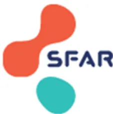

## RECOMMANDATIONS DE PRATIQUES PROFESSIONNELLES

De la **Société Française d'Anesthésie et Réanimation (SFAR)**

*Avec la participation de la Société Française d'Hygiène Hospitalière (SF2H),  
et de la Société Française de Pharmacie Clinique (SFPC)*

# REDUCTION DE L'IMPACT ENVIRONNEMENTAL DE L'ANESTHESIE GENERALE

**Guidelines for Reducing the environmental impact of general anaesthesia**

**2022**

Référentiel validé par le Comité des Référentiels Cliniques de la SFAR le 02/06/2022, par le Conseil d'Administration de la SFAR le 29/06/2022, par le Conseil Scientifique de la SF2H le 12/08/2022, et par le Conseil d'Administration de la SFPC le 01/09/2022.

**Auteurs :** El-Mahdi Hafiani\*, Jean-Claude Pauchard\*, Stéphanie Pons, Laure Bonnet, Jérémie Garnier, Florence Lallement, Delphine Cabelguenne, Valérie Sautou, Philippe Carenco, Pierre Cassier, Audrey De Jong, Anaïs Caillard.

*\*ont contribué de manière égale à la rédaction de ce référentiel*

**Auteurs pour correspondance :**

El-Mahdi Hafiani (el-mahdi.hafiani@aphp.fr) ; Jean-Claude PAUCHARD (jc\_pauchard@hotmail.com)**Coordonnateurs d'experts :** Jean-Claude Pauchard, El-Mahdi Hafiani

**Organisatrices :** Audrey De Jong, Anaïs Caillard, pour le CRC de la SFAR

**Groupe d'experts (ordre alphabétique) :**

Laure Bonnet (SFAR, Médecin Anesthésiste-Réanimateur), Delphine Cabelguenne (SFPC, Pharmacienne), Philippe Carenco (SF2H, Médecin Hygiéniste), Pierre Cassier (SF2H, Pharmacien Hygiéniste), Jérémie Garnier (SFAR, Médecin Anesthésiste-Réanimateur), Florence Lallement (SFAR, Médecin Anesthésiste-Réanimateur), Stéphanie Pons (SFAR, Médecin Anesthésiste-Réanimateur), Valérie Sautou (SFPC, Pharmacienne).

**Groupes de lecture :**

Comité des Référentiels cliniques de la SFAR : Marc Garnier (Président), Alice Blet (Secrétaire), Anaïs Caillard, Hélène Charbonneau, Isabelle Constant, Hugues de Courson, Philippe Cuvillon, Marc-Olivier Fischer, Denis Frasca, Matthieu Jabaudon, Audrey De Jong, Daphné Michelet, Stéphanie Ruiz, Emmanuel Weiss.

Conseil d'Administration de la SFAR : Pierre Albaladéjo (Président); Jean-Michel Constantin (1er vice-président); Marc Léone (2ème vice-président); Karine Nouette-Gaulain (secrétaire général); Frédéric Le Saché (secrétaire général adjoint); Marie-Laure Cittanova (trésorière); Isabelle Constantin (trésorière adjointe); Julien Amour; Hélène Beloeil; Valérie Billard; Marie-Pierre Bonnet; Julien Cabaton; Marion Costecalde; Laurent Delaunay; Delphine Garrigue; Pierre Kalfon; Olivier Joannes-Boyau ; Frédéric Lacroix; Olivier Langeron; Sigismond Lasocki; Jane Muret ; Olivier Rontes; Nadia Smail ; Paul Zetlaoui

Conseil Scientifique de la SF2H : Serge Aho, Raoul Baron, Yolène Carre, Pierre Cassier, Cédric Dananche, Florence Depaix-Champagnac, Jean-Winoc Decousser, Sandra Fournier, Olivia Keita-Perse, Thierry Lavigne, Véronique Merle, Anne-Marie Rogues, Sara Romano-Bertrand, Corinne Tamames.

Conseil d'administration de la SFPC : Benoit Allenet ; Jean Didier Bardet, Félicia Bibas Ferrera ; Delphine Cabelguenne, Marie Camille Chaumais, Catherine Chenaillet ; Florian Correard ; Muriel Dahan ; Anne Laure Debruyne ; Anne Charlotte Desbuquois ; Antoine Dupuis ; Benedicte Gourieux ; Julien Gravoulet ; Stéphane Honoré; Jean François Huon ; Sandrine Masseron ; Céline Mongaret ; Stéphanie Mosnier Thoumas ; Arnaud Potier ; Sonia Prot-Labarthe ; Xavier Pourrat ; Clarisse Roux Marson ; Céline Mongaret ; Eric Ruspini ; Laurence Spiesser Robelet ; Thierry Berod.**Liens d'intérêts des auteurs SFAR au cours des cinq années précédant la date de validation par le CA de la SFAR.**

Laure Bonnet ne déclare aucun conflit d'intérêt qui pourrait avoir un lien avec le travail de la RPP

Anais Caillard ne déclare aucun conflit d'intérêt qui pourrait avoir un lien avec le travail de la RPP

Audrey De Jong ne déclare aucun conflit d'intérêt qui pourrait avoir un lien avec le travail de la RPP

Jérémie Garnier ne déclare aucun conflit d'intérêt qui pourrait avoir un lien avec le travail de la RPP

El-Mahdi Hafiani ne déclare aucun conflit d'intérêt qui pourrait avoir un lien avec le travail de la RPP

Florence Lallement ne déclare aucun conflit d'intérêt qui pourrait avoir un lien avec le travail de la RPP

Jean-Claude Pauchard ne déclare aucun conflit d'intérêt qui pourrait avoir un lien avec le travail de la RPP

Stéphanie Pons ne déclare aucun conflit d'intérêt qui pourrait avoir un lien avec le travail de la RPP

**Liens d'intérêts des auteurs SF2H au cours des cinq années précédant la date de validation par le CA de la SF2H.**

Philippe Carenco ne déclare aucun conflit d'intérêt qui pourrait avoir un lien avec le travail de la RPP

Pierre Cassier ne déclare aucun conflit d'intérêt qui pourrait avoir un lien avec le travail de la RPP

**Liens d'intérêts des auteurs SFPC au cours des cinq années précédant la date de validation par le CA de la SFPC.**

Delphine Cabelguenne ne déclare aucun conflit d'intérêt qui pourrait avoir un lien avec le travail de la RPP

Valérie Sautou ne déclare aucun conflit d'intérêt qui pourrait avoir un lien avec le travail de la RPP## RESUME

*Objectif.* Émettre des recommandations pour la réduction de l'impact environnemental de l'anesthésie générale.

*Conception.* Un comité de dix experts issus de la SFAR, de la SF2H et de la SFPC a été constitué. Une politique de déclaration des liens d'intérêts a été appliquée et respectée durant tout le processus de réalisation du référentiel. De même, celui-ci n'a bénéficié d'aucun financement provenant d'une entreprise commercialisant un produit de santé (médicament ou dispositif médical). Le comité devait respecter et suivre la méthode GRADE® (Grading of Recommendations Assessment, Development and Evaluation) pour évaluer la qualité des données factuelles sur lesquelles étaient fondées les recommandations.

*Méthodes.* Nous avons formulé des recommandations selon la méthodologie GRADE® en identifiant trois champs différents : vapeurs et gaz d'anesthésie, médicaments intraveineux, dispositifs médicaux et environnement de travail. Chaque question a été formulée selon le format PICO (*Patients, Intervention, Comparaison, Outcome*). L'analyse de la littérature et les recommandations ont été formulées selon la méthodologie GRADE®.

*Résultats.* Le travail de synthèse des experts et l'application de la méthode GRADE® ont abouti à 17 recommandations. Pour l'ensemble des questions, la méthode GRADE® ne pouvant pas s'appliquer en totalité, les recommandations ont été formulées sous forme d'avis d'experts.

*Conclusion.* A partir d'un accord fort entre experts, nous avons pu formuler 17 recommandations sur la réduction de l'impact environnemental de l'anesthésie générale au bloc opératoire.

**Mots-clés :** recommandation, développement durable, bloc opératoire, impact environnemental, vapeurs anesthésiques, gaz anesthésique, médicaments intraveineux, dispositifs médicaux, environnement de travail, déchets## **ABSTRACT**

*Objective.* To provide guidelines for reducing the environmental impact of general anaesthesia.

*Design.* A committee of ten experts from SFAR and SF2H and SFPC learned societies has been set up. A policy of declaration of links of interest was applied and respected throughout the whole process of producing guidelines. Likewise, it has not benefited from any funding from a company marketing a health product (drug or medical device). The committee followed the GRADE® method (Grading of Recommendations Assessment, Development and Evaluation) to assess the quality of the evidence on which the recommendations were based.

*Methods.* We aimed to formulate recommendations according to the GRADE® methodology for three different fields: anaesthesia vapours and gases, intravenous drugs, medical devices and the working environment. Each question was formulated according to the PICO format (Patients, Intervention, Comparison, Outcome). The literature review and recommendations were formulated according to the GRADE® methodology.

*Results.* The experts' synthesis work and the application of the GRADE® method resulted in 17 recommendations. The GRADE® method could not be entirely applied to all questions, so the recommendations were formulated as expert opinions.

*Conclusion.* Based on a strong agreement between experts, we were able to produce 17 recommendations to guide reducing the environmental impact of general anaesthesia.

**Keywords:** guidelines, sustainable development, operating room, environmental impact, anesthetic vapors, anesthetic gas, intravenous drugs, medical devices, work environment, waste.## INTRODUCTION

La réduction de l'impact environnemental de l'anesthésie générale est devenue une préoccupation humanitaire et légale afin de lutter contre le réchauffement climatique à l'échelle des professionnels de l'anesthésie réanimation.

Le changement climatique lié à l'activité humaine, sous le nom de "réchauffement climatique d'origine anthropique", progresse depuis l'ère pré-industrielle (1850-1900) et a engendré l'augmentation de produits de gaz à effet de serre (GES), dont le CO2, séquestrant l'énergie dans l'atmosphère terrestre. La température terrestre globale a ainsi augmenté de 1°C depuis cette ère et s'accroît actuellement de 0,2°C par décennie [1–3]. Les conséquences sur la santé sont une augmentation de la morbi-mortalité de l'être humain avec une augmentation des vagues de chaleur et de froid, des inondations, des sécheresses, des maladies infectieuses, et une modification de la qualité de l'eau et de l'air [4]. On impute actuellement 150000 décès par an au réchauffement climatique, avec un risque de doublment des événements violents d'ici 2030 [5]. Un rapport de l'ONU de 2014 estime l'excès de mortalité dû au réchauffement climatique en 2030 à 230000 personnes par an. Le groupe d'expert intergouvernemental sur l'évolution du climat (GIEC) a édité un rapport en 2022 sur l'évolution actuelle du réchauffement climatique estimant qu'il restait moins de 10 ans pour changer drastiquement nos habitudes et diminuer nos émissions de GES afin de limiter le réchauffement climatique à 1,5°C [6]. Pour ce faire, il faudrait limiter de 45% les émissions de GES de 2010 à 2030 pour les rendre nulles en 2050.

Selon les différentes études présentes dans la littérature, les systèmes de santé mondiaux représentent entre 5,5% et 8% des émissions de GES [7]. La France est classée au 5ème rang des pays et des systèmes de santé en termes de quantité d'émission de GES, avec des émissions de GES du système de santé estimées entre 4,6 à 8% des émissions du pays. A l'échelle d'un établissement de santé, désormais soumis à l'obligation de réaliser son bilan carbone et de conduire une politique de réduction de son impact environnemental, les principaux postes d'émission de GES sont la consommation d'énergie (électricité, chauffage, etc.), le fret pour la livraison, les gaz médicaux (dont le protoxyde d'azote et les vapeurs halogénées) ainsi que la gestion des déchets. Toutefois, l'impact environnemental du système de santé ne se limite pas uniquement aux GES. Il existe d'autres indicateurs comprenant les émissions de particules fines, les polluants atmosphériques (oxydes d'azote NOx et dioxyde de soufre SO2), l'écotoxicité des médicaments pour les eaux et les sols, qui concernent tout particulièrement les molécules utilisées quotidiennement en anesthésie- réanimation avec un fort taux de gaspillage [8].

Face à ces nouveaux enjeux auxquels doivent répondre les établissements et les professionnels de santé, la Société Française d'Anesthésie et de Réanimation (SFAR) en collaboration avec la Société Française d'Hygiène Hospitalière (SF2H) et la Société Française de Pharmacie Clinique (SFPC) se sont associées pour proposer un référentiel sur la réduction de l'impact environnemental de l'anesthésie générale au bloc opératoire.

[1] Haustein K, Allen MR, Forster PM, Otto FEL, Mitchell DM, Matthews HD, et al. A real-time Global Warming Index. Sci Rep 2017;7:15417. <https://doi.org/10.1038/s41598-017-14828-5>.

[2] Callendar GS. The artificial production of carbon dioxide and its influence on temperature. Quarterly Journal of the Royal Meteorological Society 1938;64:223–40. <https://doi.org/10.1002/qj.49706427503>.[3] Plass GN. The Carbon Dioxide Theory of Climatic Change. Tellus 1956;8:140–54. <https://doi.org/10.1111/j.2153-3490.1956.tb01206.x>.

[4] Haines A, Ebi K. The Imperative for Climate Action to Protect Health. New England Journal of Medicine 2019.

[5] Watts N, Amann M, Arnell N, Ayeb-Karlsson S, Belesova K, Boykoff M, et al. The 2019 report of The Lancet Countdown on health and climate change: ensuring that the health of a child born today is not defined by a changing climate. Lancet 2019;394:1836–78. [https://doi.org/10.1016/S0140-6736\(19\)32596-6](https://doi.org/10.1016/S0140-6736(19)32596-6).

[6] Rapport 2022 du Giec : une nouvelle alerte face au réchauffement climatique. Vie publique.fr n.d. <https://www.vie-publique.fr/en-bref/284117-rapport-2022-du-giec-nouvelle-alerte-face-au-rechauffement-du-climat> (accessed April 9, 2022).

[7] Pichler P-P, Jaccard I, Weisz U, Weisz H. International comparison of health care carbon footprints. Environmental Research Letters 2019;14. <https://doi.org/10.1088/1748-9326/ab19e1>.

[8] Lenzen M, Malik A, Li M, Fry J, Weisz H, Pichler P-P, et al. The environmental footprint of health care: a global assessment. The Lancet Planetary Health 2020;4:e271–9. [https://doi.org/10.1016/S2542-5196\(20\)30121-2](https://doi.org/10.1016/S2542-5196(20)30121-2).

## Objectif des recommandations

L'objectif de ces recommandations est de fournir aux anesthésistes-réanimateurs des données d'impact environnemental des différentes stratégies d'anesthésie générale, afin que cette dimension entre dans les multiples arguments qu'ils prennent en compte quotidiennement pour décider pour chaque patient de la meilleure stratégie anesthésique à appliquer. Cela fournirait un cadre facilitant la prise de décision pour réduire l'impact environnemental de l'anesthésie générale.

Ces recommandations n'ont pas pour vocation de préconiser l'usage de telle ou telle stratégie anesthésique sur des arguments uniquement environnementaux, qui seraient découplées des données cliniques (pharmacodynamiques, pronostiques, etc.) disponibles soit en population générale soit dans des sous-populations particulières.

Le groupe d'experts a produit un nombre minimal de recommandations afin de mettre en exergue les points forts à retenir dans les trois champs prédéfinis : vapeurs et gaz d'anesthésie, médicaments intraveineux, dispositifs médicaux et environnement de travail. Le public visé est large, et correspond à tous les professionnels médicaux et paramédicaux exerçant l'anesthésie-réanimation.

## 1. Méthodologie

### 1.1 Organisation générale

Ces recommandations sont le résultat du travail d'un groupe d'experts réunis par la SFAR, la SFPC et la SF2H. Chaque expert a rempli une déclaration de conflits d'intérêts avant de débuter le travail d'analyse. Dans un premier temps, le comité d'organisation a défini les objectifs, la méthodologie, le champ d'application ainsi que les questions à traiter de ces recommandations. Ces éléments ont ensuite été modifiés puis validés par les experts.

Les questions ont été formulées selon un format PICO (Population – Intervention – Comparaison – Outcome) chaque fois que possible. La population faisant l'objet de ces recommandations (le « P » du PICO) est pour l'ensemble des recommandations lepersonnel d'anesthésie-réanimation exerçant au bloc opératoire, et n'est alors pas rappelée dans chaque recommandation.

## **1.2 Champs des recommandations**

A l'unanimité les experts ont décidé de retenir les trois champs suivants pour les présentes recommandations :

CHAMP 1 – Vapeurs et gaz d'anesthésie

CHAMP 2 – Médicaments intraveineux

CHAMP 3 – Dispositifs médicaux et environnement de travail.

Ces trois champs ont été retenus compte tenu de leur homogénéité en termes d'impact environnemental lors d'une anesthésie générale.

Une recherche bibliographique extensive jusqu'à mars 2022 a été réalisée à partir des bases de données MEDLINE et [www.clinicaltrials.gov](http://www.clinicaltrials.gov), par au moins deux experts pour chaque champ d'application selon la méthodologie Preferred Reporting Items for Systematic Reviews and Meta-Analyses (PRISMA) pour les revues systématiques.

Ont été inclus dans l'analyse : les méta-analyses, essais contrôlés randomisés, essais prospectifs non randomisés, cohortes rétrospectives, séries de cas et case-reports, études scientifiques (dans le domaine de la climatologie, chimie, physique) ; conduits chez des patients et soignants ou dans leur environnement ; traitant de l'impact environnemental des procédures liées à l'anesthésie générale ; publiés en langue anglaise ou française.

L'analyse de la littérature a ensuite été conduite selon la méthodologie GRADE® (Grade of Recommendation Assessment, Development and Evaluation). Les critères de jugement ont été définis en amont de la façon suivante :

- - critères de jugement majeurs : impact environnemental (importance 7) ;
- - critères de jugement secondaires : caractéristiques d'usage et confort pour le patient (importance 6), et caractéristiques d'usage et confort pour le soignant (importance 4).

Du fait de la très faible quantité d'études répondant avec la puissance nécessaire au critère de jugement majeur d'importance la plus élevée (*i.e.* impact environnemental), il a été décidé, en amont de la rédaction des recommandations, d'adopter un format de Recommandations pour la Pratique Professionnelle (RPP) plutôt qu'un format de Recommandations Formalisées d'Experts (RFE). La méthodologie GRADE® a toutefois été appliquée pour l'analyse de la littérature et la rédaction des tableaux récapitulatifs des données de la littérature. Un niveau de preuve a donc été défini pour chacune des références bibliographiques citées en fonction du type de l'étude. Ce niveau de preuve pouvait être réévalué en tenant compte de la qualité méthodologique de l'étude, de la cohérence des résultats entre les différentes études, du caractère direct ou non despreuves, de l'analyse de coût et de l'importance du bénéfice. Les recommandations ont ensuite été rédigées en utilisant la terminologie des RPP de la SFAR « les experts suggèrent de faire » ou « les experts suggèrent de ne pas faire ». Les propositions de recommandations ont été présentées et discutées une à une. Le but n'était pas d'aboutir obligatoirement à un avis unique et convergent des experts sur l'ensemble des propositions, mais de dégager les points de concordance et les points de divergence ou d'indécision.

Chaque recommandation a été évaluée par chacun des experts et soumise à une cotation individuelle à l'aide d'une échelle allant de 1 (désaccord complet) à 9 (accord complet). La cotation collective a été validée par les experts selon une méthodologie GRADE® grid. Pour valider une recommandation, au moins 70 % des experts devaient exprimer une opinion allant dans la même direction, tandis que moins de 20 % d'entre eux exprimaient une opinion contraire. En l'absence de validation d'une ou de plusieurs recommandation(s), celle(s)-ci a (ont) reformulé(s) et, de nouveau, soumise(s) à cotation dans l'objectif d'aboutir à un consensus.

## **2. Résultats**

### ***2.1 Champs des recommandations***

Les experts ont consensuellement décidé lors de la première réunion d'organisation de ces RPP, de traiter 11 questions réparties en trois champs. Les questions suivantes ont été retenues pour le recueil et l'analyse de la littérature :

#### **CHAMP 1 – Vapeurs et gaz anesthésiques**

##### **Questions:**

- ● Une anesthésie générale inhalée par sévoflurane, offre-t-elle un bénéfice sur la réduction de l'impact environnemental par rapport à une anesthésie inhalée par desflurane ou isoflurane ?
- ● Une anesthésie générale inhalée sans protoxyde d'azote, offre-t-elle un bénéfice sur la réduction de l'impact environnemental par rapport à une anesthésie inhalée avec protoxyde d'azote ?
- ● La réduction du débit de gaz frais lors d'une anesthésie générale inhalée offre-t-elle un bénéfice sur la réduction de l'impact environnemental par rapport à une anesthésie inhalée à haut débit de gaz frais ?
- ● L'utilisation des systèmes de recapture des vapeurs anesthésiques lors d'une anesthésie générale inhalée, offre-t-elle un bénéfice sur la réduction de l'impact environnemental par rapport à une anesthésie inhalée avec élimination del'effluent de vapeurs et gaz par les systèmes d'évacuation des gaz anesthésiques (SEGA) ?

- ● L'utilisation d'un monitoring de la profondeur d'anesthésie en plus du monitoring par fraction expirée en vapeur anesthésique, lors d'une anesthésie générale inhalée, offre-t-elle un bénéfice sur la réduction de l'impact environnemental par rapport à une anesthésie inhalée utilisant seul le monitoring par fraction expirée en vapeur anesthésique ?
- ● Une anesthésie générale totale intraveineuse, offre-t-elle un bénéfice sur la réduction de l'impact environnemental par rapport à une anesthésie générale inhalée entretenue par vapeurs halogénés ?

## **CHAMP 2 – Médicaments intraveineux**

### **Questions :**

- ● Une préparation extemporanée des médicaments d'anesthésie et d'urgence offre-t-elle un bénéfice sur la réduction de l'impact environnemental par rapport à une préparation à l'avance sans compromettre la sécurité des patients ?
- ● L'utilisation d'un monitoring de la profondeur d'anesthésie lors d'une anesthésie générale totale intraveineuse, offre-t-elle un bénéfice sur la réduction de l'impact environnemental par rapport à une anesthésie générale totale intraveineuse sans monitoring de la profondeur d'anesthésie ?

## **CHAMP 3 – Dispositifs médicaux et environnement de travail**

### **Questions :**

- ● L'utilisation de dispositifs médicaux d'anesthésie réutilisables (plateaux de médicaments, masques faciaux, circuits du respirateur, lames de laryngoscope, etc.) offre-t-elle un bénéfice sur la réduction de l'impact environnemental par rapport à des dispositifs médicaux à usage unique sans compromettre la sécurité des patients ?
- ● Le changement hebdomadaire des circuits de respirateurs offre-t-il un bénéfice sur la réduction de l'impact environnemental par rapport à un changement quotidien sans compromettre la sécurité des patients ?
- ● Une politique de tri, de recyclage et de valorisation des déchets en anesthésie réanimation offre-t-elle un bénéfice sur la réduction de l'impact environnemental sans compromettre la sécurité des patients ?

## ***2.2 Synthèse des résultats***Après synthèse du travail des experts et application de la méthode GRADE®, 17 recommandations ont été formalisées. La totalité des recommandations a été soumise au groupe d'experts pour une cotation avec la méthode GRADE® Grid. Après deux tours de cotations, un accord fort a été obtenu pour 100 % des recommandations.

Ces RPP se substituent aux recommandations précédentes émanant de la SFAR sur un même champ d'application. La SFAR incite tous les anesthésistes-réanimateurs à considérer la dimension environnementale dans les multiples arguments qu'ils prennent en compte pour assurer une qualité des soins dispensés aux patients. Cependant, dans l'application de ces recommandations, chaque praticien doit exercer son jugement, prenant en compte son expertise et les spécificités de son établissement, pour déterminer la méthode d'intervention la mieux adaptée à l'état du patient dont il a la charge.## **CHAMP 1 : VAPEURS ET GAZ ANESTHESIQUES**

***Question : Une anesthésie générale inhalée par sévoflurane, offre-t-elle un bénéfice sur la réduction de l'impact environnemental par rapport à une anesthésie inhalée par desflurane ou isoflurane ?***

Experts : Jérémie Garnier (Amiens) ; Jean-Claude Pauchard (Biarritz) ; Laure Bonnet (Monaco) ; Valérie Sautou (Clermont-Ferrand).

**R1.1 – Les experts suggèrent, qu'à bénéfice clinique égal pour le patient, les professionnels d'anesthésie utilisent préférentiellement le sévoflurane au desflurane ou à l'isoflurane lors d'une anesthésie inhalée, pour diminuer l'impact environnemental de l'anesthésie générale.**

**Avis d'experts (Accord fort)**

**Argumentaire :**

Données environnementales :

Toutes les vapeurs halogénées appartiennent à la classe des fluorocarbones qui sont classés comme gaz à effet de serre (GES), dont la puissance de contribution au réchauffement climatique se mesure par le potentiel de réchauffement global à 100 ans ( $PRG_{100}$ ) comparé à la référence du gaz  $CO_2$  dont le  $PRG_{100}$  est égal à 1. Les propriétés physico-chimiques de ces gaz leurs confèrent un pouvoir de réchauffement du climat car ils répondent aux 3 caractéristiques des Gaz à Effet de Serre [1] une longue durée de vie atmosphérique ; une absorption d'infrarouge importante durant toute leur durée de vie ; et un spectre d'absorption des infrarouges situés dans la « fenêtre atmosphérique », qui est la région spectrale dans le spectre d'émission infrarouge de la Terre où l'absorption par les gaz à effet de serre naturels ( $H_2O$ ,  $CO_2$ ,  $CH_4$ ,  $N_2O$ ) est la plus faible [2]. Pour le desflurane la durée de vie atmosphérique est de 14 ans et le  $PRG_{100}$  est de 2540, pour l'isoflurane la durée de vie atmosphérique est de 3,2 ans et son  $PRG_{100}$  est égal à 510, quant au sévoflurane sa durée de vie atmosphérique est de 1,1 an et son  $PRG_{100}$ , n'est "que" de 130[3–7]. De plus, certains gaz halogénés possèdent un atome de Brome ou de Chlore, et ont ainsi également un potentiel de déplétion de la couche d'ozone (PDO)[8]. L'isoflurane fait partie de ces ChloroFluoroCarbones (CFC) ainsi que l'halothane. Comparé au Trichlorofluorométhane (CFC-11), leurs PDO respectifs sont de 0,01 pour l'isoflurane et 0,4 pour l'halothane [2].

Lors de leur utilisation au cours d'une anesthésie générale, le métabolisme de ces vapeurs est très faible : 5 % pour le sévoflurane, 0,2 à 0,5% pour l'isoflurane et 0,05% pour le desflurane [9]. La quasi-totalité des halogénés est donc expirée par le patient sous forme inchangée, et rejetée directement dans l'atmosphère via la prise SEGA (Système d'Évacuation des Gaz d'Anesthésie), pour les salles qui en sont équipées. D'ailleurs, la concentration des différents halogénés dans l'atmosphère augmente constamment depuis plusieurs années, et l'augmentation la plus importante est celle du desflurane. Sur les 3,1 +/- 0,6 millions tonnes d'équivalent  $CO_2$  ( $eqCO_2$ ) inhérentes au relargage des halogénés dans l'atmosphère, 80% sont dues au desflurane [10]. Les émissions de GES au cours du cycle de vie du desflurane sont 20 fois supérieures à celles du sévoflurane et 15 fois supérieures à celles de l'isoflurane [11]. La quasi-totalité des halogénés est donc expirée par le patient sous forme inchangée, et rejetée directement dans l'atmosphère via la prise SEGA (Système d'Évacuation des Gaz d'Anesthésie), pour les salles qui en sont équipées. D'ailleurs, la concentration des différents halogénés dans l'atmosphère augmente constamment depuis plusieurs années, et l'augmentation la plus importante est celle du desflurane. Sur les 3,1 +/- 0,6 millions tonnes d'équivalent  $CO_2$  ( $eqCO_2$ ) inhérentes au relargage des halogénés dans l'atmosphère, 80% sont dues au desflurane [9]. A l'échelle du bloc opératoire, les émissions de GES dues aux agents anesthésiques inhalés étaient divisées par 10, lorsque le desflurane ne faisait pas partie de l'arsenal thérapeutique [12,13]. A l'échelle d'une intervention chirurgicale, une réduction de 25% des émissions de GES engendrées par cetteintervention est observée si l'on utilise le sévoflurane au lieu du desflurane [14]. Enfin, si l'on compare l'équivalent carbone d'une heure d'anesthésie, à un débit de gaz frais de 1 L/min, avec une cible de 1 MAC/heure, l'utilisation de sévoflurane équivaut à conduire une voiture sur 6,5 km, d'isoflurane sur 13 km et le desflurane sur 300 km (voiture nord-américaine 200g eqCO2/km) [15].

#### Références :

- [1] Özsel TJ-P, Sondekoppam RV, Buro K. The future is now-it's time to rethink the application of the Global Warming Potential to anesthesia. *Can J Anaesth J Can Anesth* 2019;66:1291–5. <https://doi.org/10.1007/s12630-019-01385-w>.
- [2] Sulbaek Andersen MP, Nielsen OJ, Wallington TJ, Karpichev B, Sander SP. Medical intelligence article: assessing the impact on global climate from general anesthetic gases. *Anesth Analg* 2012;114:1081–5. <https://doi.org/10.1213/ANE.0b013e31824d6150>.
- [3] Sulbaek Andersen MP, Nielsen OJ, Karpichev B, Wallington TJ, Sander SP. Atmospheric chemistry of isoflurane, desflurane, and sevoflurane: kinetics and mechanisms of reactions with chlorine atoms and OH radicals and global warming potentials. *J Phys Chem A* 2012;116:5806–20. <https://doi.org/10.1021/jp2077598>.
- [4] Ryan SM, Nielsen CJ. Global warming potential of inhaled anesthetics: application to clinical use. *Anesth Analg* 2010;111:92–8. <https://doi.org/10.1213/ANE.0b013e3181e058d7>.
- [5] Ishizawa Y. General Anesthetic Gases and the Global Environment. *Anesth Analg* 2011;112:213. <https://doi.org/10.1213/ANE.0b013e3181fe02c2>.
- [6] McCulloch A. Volatile anaesthetics and the atmosphere: atmospheric lifetimes and atmospheric effects of halothane, enflurane, isoflurane, desflurane and sevoflurane. *Br J Anaesth* 2000;84:534–6. <https://doi.org/10.1093/oxfordjournals.bja.a013486>.
- [7] Sulbaek Andersen MP, Sander SP, Nielsen OJ, Wagner DS, Sanford TJ, Wallington TJ. Inhalation anaesthetics and climate change. *Br J Anaesth* 2010;105:760–6. <https://doi.org/10.1093/bja/aeq259>.
- [8] Hass SA, Andersen ST, Sulbaek Andersen MP, Nielsen OJ. Atmospheric Chemistry of Methoxyflurane (CH3OCF2CHCl2): Kinetics of the gas-phase reactions with OH radicals, Cl atoms and O3. *Chem Phys Lett* 2019;722:119–23. <https://doi.org/10.1016/j.cplett.2019.02.041>.
- [9] Odin I, Nathan N. Anesthésiques halogénés. *EMC - Anesth-Réanimation* 2005;2:79–113. <https://doi.org/10.1016/j.emcar.2005.03.001>.
- [10] Vollmer MK, Rhee TS, Rigby M, Hofstetter D, Hill M, Schoenenberger F, et al. Modern inhalation anesthetics: Potent greenhouse gases in the global atmosphere. *Geophys Res Lett* 2015;42:1606–11. <https://doi.org/10.1002/2014GL062785>.
- [11] Sherman J, Le C, Lamers V, Eckelman M. Life cycle greenhouse gas emissions of anesthetic drugs. *Anesth Analg* 2012;114:1086–90. <https://doi.org/10.1213/ANE.0b013e31824f6940>.
- [12] MacNeill AJ, Lillywhite R, Brown CJ. The impact of surgery on global climate: a carbon footprinting study of operating theatres in three health systems. *Lancet Planet Health* 2017;1:e381–8. [https://doi.org/10.1016/S2542-5196\(17\)30162-6](https://doi.org/10.1016/S2542-5196(17)30162-6).
- [13] Zuegge KL, Bunsen SK, Volz LM, Stromich AK, Ward RC, King AR, et al. Provider Education and Vaporizer Labeling Lead to Reduced Anesthetic Agent Purchasing With Cost Savings and Reduced Greenhouse Gas Emissions. *Anesth Analg* 2019;128:e97–9. <https://doi.org/10.1213/ANE.0000000000003771>.
- [14] Thiel CL, Woods NC, Bilec MM. Strategies to Reduce Greenhouse Gas Emissions from Laparoscopic Surgery. *Am J Public Health* 2018;108:S158–64. <https://doi.org/10.2105/AJPH.2018.304397>.
- [15] Hanna M, Bryson GL. A long way to go: minimizing the carbon footprint from anesthetic gases. *Can J Anaesth J Can Anesth* 2019;66:838–9. <https://doi.org/10.1007/s12630-019-01348-1>.
- [16] Khan KS, Hayes I, Buggy D. Pharmacology of anaesthetic agents II: inhalation anaesthetic agents 2014. <https://doi.org/10.1093/BJACEACCP/MKT038>.
- [17] Gupta A, Stierer T, Zuckerman R, Sakima N, Parker SD, Fleisher LA. Comparison of recovery profile after ambulatory anesthesia with propofol, isoflurane, sevoflurane and desflurane: a systematic review. *Anesth Analg* 2004;98:632–41, table of contents. <https://doi.org/10.1213/01.ane.0000103187.70627.57>.
- [18] Agoliati A, Dexter F, Lok J, Masursky D, Sarwar MF, Stuart SB, et al. Meta-analysis of average and variability of time to extubation comparing isoflurane with desflurane or isoflurane with sevoflurane. *Anesth Analg* 2010;110:1433–9. <https://doi.org/10.1213/ANE.0b013e3181d58052>.
- [19] Macario A, Dexter F, Lubarsky D. Meta-analysis of trials comparing postoperative recovery after anesthesia with sevoflurane or desflurane. *Am J Health-Syst Pharm AJHP Off J Am Soc Health-Syst Pharm* 2005;62:63–8. <https://doi.org/10.1093/ajhp/62.1.63>.
- [20] Singh PM, Borle A, McGavin J, Trikha A, Sinha A. Comparison of the Recovery Profile between Desflurane and Sevoflurane in Patients Undergoing Bariatric Surgery-a Meta-Analysis of Randomized Controlled Trials. *Obes Surg* 2017;27:3031–9. <https://doi.org/10.1007/s11695-017-2929-6>.
- [21] Liu F-L, Cherng Y-G, Chen S-Y, Su Y-H, Huang S-Y, Lo P-H, et al. Postoperative recovery after anesthesia in morbidly obese patients: a systematic review and meta-analysis of randomized controlled trials. *Can J Anaesth J Can Anesth* 2015;62:907–17. <https://doi.org/10.1007/s12630-015-0405-0>.
- [22] Wang T-T, Lu H-F, Poon Y-Y, Wu S-C, Hou S-Y, Chiang M-H, et al. Sevoflurane versus desflurane for early postoperative vomiting after general anesthesia in hospitalized adults: A systematic review and meta-analysis of randomized controlled trials. *J Clin Anesth* 2021;75:110464. <https://doi.org/10.1016/j.jclinane.2021.110464>.
- [23] Chen W-S, Chiang M-H, Hung K-C, Lin K-L, Wang C-H, Poon Y-Y, et al. Adverse respiratory events with sevofluranecompared with desflurane in ambulatory surgery: A systematic review and meta-analysis. Eur J Anaesthesiol 2020;37:1093–104. <https://doi.org/10.1097/EJA.0000000000001375>.

[24] Chen G, Zhou Y, Shi Q, Zhou H. Comparison of early recovery and cognitive function after desflurane and sevoflurane anaesthesia in elderly patients: A meta-analysis of randomized controlled trials. J Int Med Res 2015;43:619–28. <https://doi.org/10.1177/0300060515591064>.

[25] He J, Zhang Y, Xue R, Lv J, Ding X, Zhang Z. Effect of Desflurane versus Sevoflurane in Pediatric Anesthesia: A Meta-Analysis. J Pharm Pharm Sci Publ Can Soc Pharm Sci Soc Can Sci Pharm 2015;18:199–206. <https://doi.org/10.18433/j31882>.

**Question : Une anesthésie générale inhalée sans protoxyde d'azote, offre-t-elle un bénéfice sur la réduction de l'impact environnemental par rapport à une anesthésie inhalée avec protoxyde d'azote ?**

Experts : Valérie Sautou (Clermont Ferrand) ; Jérémie Garnier (Amiens) ; Laure BONNET (Monaco).

**R1.2.1 – Les experts suggèrent, qu'à bénéfice clinique égal pour le patient, les professionnels d'anesthésie n'utilisent pas le protoxyde d'azote lors d'une anesthésie inhalée, pour diminuer l'impact environnemental de l'anesthésie générale.**

**Avis d'experts (Accord fort)**

**R1.2.2 – Les experts suggèrent qu'en cas d'utilisation du protoxyde d'azote lors d'une anesthésie inhalée, une alternative puisse être d'utiliser un système d'administration par bouteille plutôt qu'un système d'administration par cadres et circuit de distribution, pour diminuer l'impact environnemental de l'anesthésie générale.**

**Avis d'experts (Accord fort)**

**Argumentaire :**

Données environnementales : Le protoxyde d'azote (N2O) est un GES présentant un impact très fort sur le réchauffement climatique avec un PRG100 de 265 et une durée de vie dans l'atmosphère de 114 ans [1]. Par ailleurs, il a un rôle destructeur de la couche d'ozone [2]. L'utilisation de N2O en anesthésie représenterait 1 à 3% des émissions mondiales de N2O [3,4]. Pour autant ce pourcentage est considéré comme non négligeable en raison du fort impact du N2O sur l'environnement, et de sa capacité à augmenter l'impact environnemental d'autres vapeurs anesthésiques auxquelles il est associé. En effet, l'utilisation du N2O comme gaz vecteur augmente l'impact environnemental du sévoflurane et de l'isoflurane : leurs valeurs de CDE20 et 100 (équivalents en dioxyde de carbone sur 20 et 100 ans) sont multipliées respectivement d'un facteur 6 et 3 lorsque le gaz vecteur est un mélange N2O/O2 versus O2/Air [5]. Ainsi, la suppression du N2O dans les mélanges anesthésiques, associée à une diminution du débit de gaz frais, peut entraîner une diminution des émissions de GES pouvant aller jusqu'à un facteur 20 pour une utilisation à une MAC/heure [6]. De nombreux auteurs ont mis en exergue l'impact environnemental du N2O et la plupart incitent les anesthésistes à revoir leurs pratiques pour diminuer voire totalement supprimer le protoxyde d'azote [7–11]. Il est également important de souligner que l'alimentation des blocs opératoires en N2O se fait par le biais de canalisations à partir de cadres (ensemble de bouteilles de stockage en réseau) contenant le gaz sous sa forme liquide. Or il a été démontré que ces canalisations sont l'objet de fuites difficiles à éviter en raison des difficultés à les repérer et à entretenir les réseaux. Segleniek et al. ont objectivé la présence de ces fuites, à un niveau très important (plus de 75% de la consommation réelle de leur hôpital) en montrant l'écart entre les quantités consommées au bloc opératoire pour l'anesthésie des patients et celles mesurées au niveau des cadres de stockage [12]. A l'échelle d'un bloc opératoire de 8 salles, cette quantité de N2O gâchée par fuites tout au long du circuit d'acheminement représentait 38400 heures d'anesthésie à 3% de sévoflurane ou encore 600000 km parcourus en voiture. Outre cette pollution, cette "consommation" abusive de gaz anesthésique avait un impact financier non négligeable [12].**Données cliniques :** Au regard de ces critères environnementaux incontestablement défavorables au N2O, la question de l'intérêt clinique du gaz se pose. Le N2O présente un faible pouvoir anesthésique ne permettant pas de l'utiliser seul pour la réalisation d'une anesthésie générale. Il est dès lors associé aux gaz halogénés dont il réduit la consommation à effet équivalent. Sa grande diffusibilité et sa faible liposolubilité expliquent sa rapidité d'action par voie pulmonaire [13]. Par ailleurs il contribue à l'effet « deuxième gaz » : ajouté secondairement à un mélange de gaz contenant un agent halogéné, il diffuse plus vite du compartiment alvéolaire au compartiment sanguin, augmentant ainsi la concentration du gaz halogéné et accélérant la vitesse d'induction et la décroissance de l'halogéné au réveil. Cependant, ces effets sont limités pour les gaz les moins liposolubles comme le desflurane et le sévoflurane. Une bonne gestion de l'administration des halogénés et des débits de gaz frais à l'induction et en phase de réveil permettent de s'en affranchir [14]. En pédiatrie, le N2O est particulièrement utilisé en raison de la rapidité de l'induction inhalatoire. Cependant le N2O ne peut présenter un avantage immédiat à la pose du masque, ce qui incite à utiliser d'autres méthodes de distraction s'avérant généralement efficaces et suffisantes [14]. Le N2O présente des effets anti-hyperalgésiques du fait de son action anti-NMDA qui participe à la réduction des phénomènes de sensibilisation centrale per et postopératoires, mais pourrait être remplacée par d'autres molécules qui ont les mêmes effets anti-NMDA comme la Kétamine par exemple [15]. De plus, le N2O n'est pas dénué d'effets indésirables. Les nausées et vomissements sont plus fréquents dans les anesthésies avec N2O [16]. Son caractère hautement diffusible lui donne également accès aux cavités closes dès 30 minutes, ce qui amène à déconseiller son utilisation pendant les opérations du tube digestif prolongées [17]. Le N2O ne semble pas avoir d'intérêt majeur lors d'une anesthésie générale. Il paraît tout à fait envisageable de s'affranchir des réseaux d'alimentation de N2O au bloc opératoire. Dans le cadre spécifique de la pédiatrie, l'usage de bouteilles de Mélange Équimolaire Oxygène-Protoxyde d'Azote (MEOPA) pourrait être envisagé. Dans tous les cas, si une structure choisit de se passer de protoxyde d'azote, il est important de ne pas simplement clore le circuit au niveau du bloc opératoire, mais de déposer les cadres et de condamner le circuit, au risque de continuer à « consommer » du N2O via les fuites du circuit d'acheminement.

**Références :**

- [1] Organization (WMO) WM, Administration (NOAA) National Oceanic and Atmospheric, Programme (UNEP) United Nations Environment, Administration (NASA) National Aeronautics and Space, Commission E, World Meteorological Organization (WMO). Scientific Assessment of Ozone Depletion: 2010 (GORMP 52). Geneva: WMO; 2011.
- [2] Ravishankara AR, Daniel JS, Portmann RW. Nitrous oxide (N2O): the dominant ozone-depleting substance emitted in the 21st century. *Science* 2009;326:123–5. <https://doi.org/10.1126/science.1176985>.
- [3] Ishizawa Y. General Anesthetic Gases and the Global Environment. *Anesth Analg* 2011;112:213. <https://doi.org/10.1213/ANE.0b013e3181fe02c2>.
- [4] Sherman SJ, Cullen BF. Nitrous oxide and the greenhouse effect. *Anesthesiology* 1988;68:816–7. <https://doi.org/10.1097/00000542-198805000-00037>.
- [5] Ryan SM, Nielsen CJ. Global warming potential of inhaled anesthetics: application to clinical use. *Anesth Analg* 2010;111:92–8. <https://doi.org/10.1213/ANE.0b013e3181e058d7>.
- [6] Sherman J, Le C, Lamers V, Eckelman M. Life cycle greenhouse gas emissions of anesthetic drugs. *Anesth Analg* 2012;114:1086–90. <https://doi.org/10.1213/ANE.0b013e31824f6940>.
- [7] Hanna M, Bryson GL. A long way to go: minimizing the carbon footprint from anesthetic gases. *Can J Anaesth J Can Anesth* 2019;66:838–9. <https://doi.org/10.1007/s12630-019-01348-1>.
- [8] Lopes R, Shelton C, Charlesworth M. Inhalational anaesthetics, ozone depletion, and greenhouse warming: the basics and status of our efforts in environmental mitigation. *Curr Opin Anaesthesiol* 2021;34:415–20. <https://doi.org/10.1097/ACO.0000000000001009>.
- [9] McGain F, Muret J, Lawson C, Sherman JD. Environmental sustainability in anaesthesia and critical care. *Br J Anaesth* 2020;125:680–92. <https://doi.org/10.1016/j.bja.2020.06.055>.
- [10] Buhre W, Disma N, Hendrickx J, DeHert S, Hollmann MW, Huhn R, et al. European Society of Anaesthesiology Task Force on Nitrous Oxide: a narrative review of its role in clinical practice. *Br J Anaesth* 2019;122:587–604. <https://doi.org/10.1016/j.bja.2019.01.023>.
- [11] Muret J, Fernandes TD, Gerlach H, Imberger G, Jörnwall H, Lawson C, et al. Environmental impacts of nitrous oxide: no laughing matter! Comment on *Br J Anaesth* 2019; 122: 587–604. *Br J Anaesth* 2019;123:e481–2. <https://doi.org/10.1016/j.bja.2019.06.013>.
- [12] Seglenieks R, Wong A, Pearson F, McGain F. Discrepancy between procurement and clinical use of nitrous oxide: waste not, want not. *Br J Anaesth* 2022;128:e32–4. <https://doi.org/10.1016/j.bja.2021.10.021>.
- [13] Stenqvist O. Nitrous oxide kinetics. *Acta Anaesthesiol Scand* 1994;38:757–60. <https://doi.org/10.1111/j.1399-6576.1994.tb03997.x>.[14] Masson E. Faut-il encore utiliser le protoxyde d'azote en anesthésie ? EM-Consulte n.d. <https://www.em-consulte.com/article/665270/faut-il-encore-utiliser-le-protoxyde-dazote-en-ane> (accessed April 9, 2022).

[15] Sanders RD, Weimann J, Maze M. Biologic effects of nitrous oxide: a mechanistic and toxicologic review. *Anesthesiology* 2008;109:707–22. <https://doi.org/10.1097/ALN.0b013e3181870a17>.

[16] Myles PS, Chan MTV, Kasza J, Paech MJ, Leslie K, Peyton PJ, et al. Severe Nausea and Vomiting in the Evaluation of Nitrous Oxide in the Gas Mixture for Anesthesia II Trial. *Anesthesiology* 2016;124:1032–40. <https://doi.org/10.1097/ALN.0000000000001057>.

[17] Orhan-Sungur M, Apfel C, Akça O. Effects of nitrous oxide on intraoperative bowel distension. *Curr Opin Anaesthesiol* 2005;18:620–4. <https://doi.org/10.1097/01.aco.0000188417.00011.78>.

**Question : La réduction du débit de gaz frais lors d'une anesthésie générale inhalée offre-t-elle un bénéfice sur la réduction de l'impact environnemental par rapport à une anesthésie inhalée à haut débit de gaz frais ?**

**Experts :** Laure Bonnet (Monaco) ; Jérémie Garnier (Amiens) ; Valérie Sautou (Clermont Ferrand) ; Jean-Claude Pauchard (Biarritz)

**R1.3.1 – Les experts suggèrent que les professionnels d'anesthésie utilisent un bas débit de gaz frais lors de l'anesthésie inhalée, pour diminuer l'impact environnemental de l'anesthésie générale.**

**Avis d'experts (Accord fort)**

**R1.3.2 – Les experts suggèrent aux professionnels d'anesthésie qui disposent d'un système d'anesthésie inhalée à objectif de concentration (AINOC), d'utiliser préférentiellement le mode automatisé que le mode manuel pour diminuer le débit de gaz frais et l'impact environnemental de l'anesthésie générale.**

**Avis d'experts (Accord fort)**

**Argumentaire :**

Données environnementales : Il y a un intérêt croissant pour les coûts économiques du changement climatique, autrement appelés « coûts sociaux du carbone (CSC) » qui peuvent être utilisés pour évaluer les avantages économiques de la politique en matière de changement climatique. Le coût social du carbone est généralement estimé comme la valeur actuelle nette des impacts du changement climatique au cours des 100 prochaines années (ou plus) d'une tonne supplémentaire de carbone émise aujourd'hui dans l'atmosphère. Le CSC lié aux gaz anesthésiques peut être jusqu'à 12 fois supérieur pour le desflurane que pour l'isoflurane selon le DGF utilisé. Le DGF a donc une influence directe (autant que le choix de l'agent) sur le changement climatique et ses enjeux économiques au niveau mondial [1].

La réduction du DGF diminue la pollution liée aux halogénés en réduisant les émissions de GES. Ainsi lorsque le DGF diminue, le CDE20 (Équivalent Carbone sur 20 ans) du desflurane passait de 26,8 pour un DGF à 2 L/min à 6,7 pour un DGF à 0,5 L/min [1]. L'impact environnemental du desflurane utilisé à un DGF de 1 L/min est 13 fois plus important que celui du sévoflurane utilisé à un DGF de 2 L/min [2]. Quel que soit le mode de gestion du DGF (manuel ou automatisé), la réduction du DGF entraîne une réduction des consommations d'agents inhalés. Ceci a été bien démontré lors du réglage manuel du DGF [3–5]. Concernant l'AINOC (Anesthésie inhalée à Objectif de concentration), elle permet une réduction des consommations plus importantes qu'en mode manuel (estimée à 65% pour le desflurane). De plus, elle permet une réduction de l'ordre de 40% des émissions en CO2, une anesthésie plus précise et une réduction de la charge de travail pour l'équipe d'anesthésie permettant une pérennisation de l'utilisation d'un BDGF [6–9]. Plusieurs études évaluant les consommations de gaz halogénés ont également évalué l'impact financier et, sans surprise, il s'avère que des réductions de consommations entraînent des réductions importantes de coûts [3,5,8–10]. Cet argument mérite d'être souligné car il peut avoir un poids majeur lors de la négociation d'achat de ventilateurs équipés d'une fonction AINOC. Néanmoins, une surconsommationde chaux sodée lors de l'utilisation de l'AINOC est à noter, pouvant être à l'origine d'une production de déchets supplémentaire dont l'impact n'est pas connu à ce jour, aucune analyse de cycle de vie de la chaux sodée n'étant actuellement disponible [11]. Les coûts liés à cette augmentation de consommation de chaux sodée seraient de 2 à 4 fois supérieurs [12].

**Données cliniques :** La classification des différents débits de gaz frais est issue d'un travail de Simonescu en 1986 repris plus tard par Baker [13] qui définit un bas débit de gaz frais (BDGF) pour un débit compris entre 0,5 et 1 L/min. Un des principaux risques de l'utilisation d'un BDGF est l'appauvrissement du mélange en oxygène et donc un risque de désaturation et d'hypoxie. L'avènement puis la diffusion de divers moyens de monitoring comme les analyseurs de gaz, le monitoring de la saturation en oxygène et le réglage des alarmes permettent de prévenir ce risque et ont ainsi démocratisé l'utilisation de BDGF [3,14-16]. Un autre risque largement évoqué dans la littérature est la formation du composé A (pentafluoro-isopropyl-fluorométhyl éther) qui correspond au produit de dégradation du sévoflurane au contact des bases fortes contenues dans la chaux sodée (hydroxyde de sodium ou hydroxyde de potassium). Sa production dépend de la concentration en sévoflurane, et de la température et de l'hydratation de la chaux sodée [2]. Lorsque le DGF diminue, la concentration de sévoflurane au contact de la chaux sodée et sa dégradation sont augmentées. Ainsi, plus le DGF est bas, plus le risque de production de composé A augmente. La toxicité du composé A est rénale et a été démontrée chez le rongeur [17]. La Food and Drug Administration encadre l'utilisation de sévoflurane avec l'utilisation d'un DGF >2L/min et pas plus de 1 MAC pendant 2h par principe de précaution. Or, à ce jour aucune preuve de la toxicité rénale du composé A n'a été démontrée chez l'Homme [12,18,19]. L'utilisation de nouvelles chaux sodées, au coût cependant supérieur, ne produisant pas de Composé A est actuellement possible, permettant de s'affranchir totalement de ce problème [6]. La pratique de l'anesthésie inhalée en bas débit de gaz frais est donc possible en toute sécurité.

#### **Références :**

- [1] Ryan SM, Nielsen CJ. Global warming potential of inhaled anesthetics: application to clinical use. *Anesth Analg.* 2010 Jul;111(1):92-8. doi: 10.1213/ANE.0b013e3181e058d7. Epub 2010 Jun 2. PMID: 20519425. n.d.
- [2] Meyer MJ. Desflurane Should Des-appear: Global and Financial Rationale. *Anesth Analg.* 2020 Oct;131(4):1317-1322. doi: 10.1213/ANE.00000000000005102. PMID: 32925355. n.d.
- [3] Feldman JM. Managing fresh gas flow to reduce environmental contamination. *Anesth Analg.* 2012 May;114(5):1093-101. doi: 10.1213/ANE.0b013e31824eeee0d. Epub 2012 Mar 13. PMID: 22415533. n.d.
- [4] Weiskopf RB, Eger EI 2nd. Comparing the costs of inhaled anesthetics. *Anesthesiology.* 1993 Dec;79(6):1413-8. doi: 10.1097/00000542-199312000-00033. PMID: 8068064. n.d.
- [5] Kennedy RR, French RA. Changing patterns in anesthetic fresh gas flow rates over 5 years in a teaching hospital. *Anesth Analg.* 2008 May;106(5):1487-90, table of contents. doi: 10.1213/ane.0b013e31816841c0. PMID: 18420864. n.d.
- [6] Varughese S, Ahmed R. Environmental and Occupational Considerations of Anesthesia: A Narrative Review and Update. *Anesth Analg.* 2021 Oct 1;133(4):826-835. doi: 10.1213/ANE.00000000000005504. PMID: 33857027; PMCID: PMC8415729. n.d.
- [7] Lortat-Jacob B, Billard V, Buschke W, Servin F. Assessing the clinical or pharmaco-economical benefit of target controlled desflurane delivery in surgical patients using the Zeus anaesthesia machine. *Anaesthesia.* 2009 Nov;64(11):1229-35. doi: 10.1111/j.1365-2044.2009.06081.x. PMID: 19825059. n.d.
- [8] Singaravelu S, Barclay P. Automated control of end-tidal inhalation anaesthetic concentration using the GE Aisys Carestation™. *Br J Anaesth.* 2013 Apr;110(4):561-6. doi: 10.1093/bja/aes464. Epub 2013 Jan 4. PMID: 23293274. n.d.
- [9] Tay S, Weinberg L, Peyton P, Story D, Briedis J. Financial and environmental costs of manual versus automated control of end-tidal gas concentrations. *Anaesth Intensive Care.* 2013 Jan;41(1):95-101. doi: 10.1177/0310057X1304100116. PMID: 23362897. n.d.
- [10] Özelsel T, Kim SH, Rashiq S, Tsui BC. A closed-circuit anesthesia ventilator facilitates significant reduction in sevoflurane consumption in clinical practice. *Can J Anaesth.* 2015 Dec;62(12):1348-9. doi: 10.1007/s12630-015-0478-9. Epub 2015 Sep 11. PMID: 26362798. n.d.
- [11] Epstein RH, Dexter F, Maguire DP, Agarwalla NK, Gratch DM. Economic and Environmental Considerations During Low Fresh Gas Flow Volatile Agent Administration After Change to a Nonreactive Carbon Dioxide Absorbent. *Anesth Analg.* 2016 Apr;122(4):996-1006. doi: 10.1213/ANE.00000000000001124. PMID: 26735317. n.d.
- [12] Edmonds A, Stambaugh H, Petey S, Daratha KB. Evidence-Based Project: Cost Savings and Reduction in Environmental Release With Low-Flow Anesthesia. *AANA J.* 2021 Feb;89(1):27-33. PMID: 33501906. n.d.
- [13] Baker AB. Low flow and closed circuits. *Anaesth Intensive Care.* 1994 Aug;22(4):341-2. doi: 10.1177/0310057X9402200402. PMID: 7978192. n.d.
- [14] Upadya M, Saneesh PJ. Low-flow anaesthesia - underused mode towards "sustainable anaesthesia". *Indian J Anaesth.* 2018Mar;62(3):166-172. doi: 10.4103/ija.IJA\_413\_17. PMID: 29643549; PMCID: PMC5881317. n.d.  
[15]Brattwall M, Warrén-Stomberg M, Hesselvik F, Jakobsson J. Brief review: theory and practice of minimal fresh gas flow anesthesia. Can J Anaesth. 2012 Aug;59(8):785-97. doi: 10.1007/s12630-012-9736-2. Epub 2012 Jun 1. PMID: 22653840. n.d.  
[16]McGain F, Muret J, Lawson C, Sherman JD. Environmental sustainability in anaesthesia and critical care. Br J Anaesth. 2020 Nov;125(5):680-692. doi: 10.1016/j.bja.2020.06.055. Epub 2020 Aug 12. PMID: 32798068; PMCID: PMC7421303. n.d.  
[17]Ong Sio LCL, Dela Cruz RGC, Bautista AF. Sevoflurane and renal function: a meta-analysis of randomized trials. Med Gas Res. 2017 Oct 17;7(3):186-193. doi: 10.4103/2045-9912.215748. PMID: 29152212; PMCID: PMC5674657. n.d.  
[18]Ebert TJ, Arain SR. Renal responses to low-flow desflurane, sevoflurane, and propofol in patients. Anesthesiology. 2000 Dec;93(6):1401-6. doi: 10.1097/00000542-200012000-00010. PMID: 11149433. n.d.  
[19]Obata R, Bito H, Ohmura M, Moriwaki G, Ikeuchi Y, Katoh T, Sato S. The effects of prolonged low-flow sevoflurane anesthesia on renal and hepatic function. Anesth Analg. 2000 Nov;91(5):1262-8. doi: 10.1097/00000539-200011000-00039. PMID: 11049919. n.d.

**Question : L'utilisation des systèmes de recapture des vapeurs anesthésiques lors d'une anesthésie générale inhalée, offre-t-elle un bénéfice sur la réduction de l'impact environnemental par rapport à une anesthésie inhalée avec élimination de l'effluent de vapeurs et gaz par les systèmes d'évacuation des gaz anesthésiques (SEGA) ?**

Experts : Jean-Claude Pauchard (Biarritz) ; El Mahdi Hafiani (Paris)

**Absence de recommandation. A ce jour, les données de la littérature ne permettent pas de comparer les systèmes de recapture des vapeurs anesthésiques aux systèmes d'évacuation des gaz anesthésiques ni sur la sécurité des patients et soignants, ni sur le plan environnemental.**

**Argumentaire :** Il n'existe pas, en matière de pollution par les vapeurs anesthésiques des salles de bloc opératoire stricto-sensu, de norme réglementaire. Cependant l'analyse de la circulaire du 10 octobre 1985 du ministère de la santé [1], s'appuyant sur les recommandations de la commission nationale d'anesthésie stipule que les salles où se font des anesthésies doivent être équipées de dispositifs assurant l'évacuation des gaz et vapeurs anesthésiques et que « ces dispositifs doivent permettre, durant la phase d'entretien de l'anesthésie d'abaisser à proximité du malade et du personnel, les concentrations à moins de 25 ppm pour le protoxyde d'azote et à moins de 2 ppm pour les halogènes ». Les spécifications publiées par l'OMS préconisent pour les salles d'opération un renouvellement minimum d'air des locaux de 15 vol/h. Un guide édité par la CRAMIF/CPAM en 1996, relatif à la prévention des expositions professionnelles aux gaz et vapeurs anesthésiques [3], indique que pour éviter cette exposition les taux de renouvellement horaire de l'air doivent être d'environ 15 à 25 vol/h. A titre préventif donc, tous les blocs opératoires correctement équipés devraient comporter un système de ventilation générale permettant le renouvellement de l'air de l'ensemble des locaux.

La SFAR recommande [2] l'utilisation dans les sites d'anesthésie de systèmes antipollution évacuant à l'extérieur du bâtiment le protoxyde d'azote et les vapeurs halogénées sortant de la valve d'échappement du système anesthésique et du ventilateur. Les cartouches absorbantes quant à elles retiennent les vapeurs halogénées mais pas le protoxyde d'azote. Cependant la prise SEGA qui aspire les gaz polluants grâce à l'effet venturi, avec son branchement direct sur le réseau d'air (débit entre 40 et 60 L/min) déplace simplement la pollution et la toxicité des gaz d'anesthésie de l'intérieur vers l'extérieur du bâtiment, sans traitement ni filtre. De plus, le SEGA est branché sur le système de vide et possède un certain coût énergétique pour fonctionner.

**Références :**

[1] Ministère des Affaires Sociales et de la Solidarité Nationale. Circulaire DGS/3A/667 bis du 10 octobre 1985 relative à la distribution des gaz à usage médical et à la création d'une commission locale de surveillance de cette distribution.  
[2] Mr. J. Ancellin, Dr. J.B. Cazalaà, Pr. F. Clergue, Pr. P. Feiss, Mme S. Fougère, Pr. J. Fusiardi, Pr. G. Janvier, Pr. Y. Nivoche Pr. D. Safran. L'équipement d'un site ou d'un ensemble de sites d'anesthésie SFAR. 1995[3] *GUIDE POUR PREVENIR LES EXPOSITIONS PROFESSIONNELLES AUX GAZ ET VAPEURS ANESTHESIQUES*. Document réalisé par le groupe disciplinaire « Anesthésie et qualité de l'air » 1996. Disponible sur : [https://sofia.medicalistes.fr/spip/IMG/pdf/Guide\\_pour\\_prevenir\\_les\\_expositions\\_professionnelles\\_aux\\_gaz\\_et\\_vapeurs\\_anesthesiques.pdf](https://sofia.medicalistes.fr/spip/IMG/pdf/Guide_pour_prevenir_les_expositions_professionnelles_aux_gaz_et_vapeurs_anesthesiques.pdf) (consulté le 05/04/2022)

**Question : L'utilisation d'un monitoring de la profondeur d'anesthésie en plus du monitoring par fraction expirée en vapeur anesthésique, lors d'une anesthésie générale inhalée, offre-t-elle un bénéfice sur la réduction de l'impact environnemental par rapport à une anesthésie inhalée utilisant seul le monitoring par fraction expirée en vapeur anesthésique ?**

Experts : Stéphanie Pons (Paris) ; El Mahdi Hafiani (Paris)

**R1.4 – Les experts suggèrent que lors de l'anesthésie inhalée, les professionnels d'anesthésie utilisent un monitoring de la profondeur d'anesthésie en association avec la fraction expirée en vapeur anesthésique, pour diminuer la consommation de vapeurs anesthésiques et ainsi l'impact environnemental de l'anesthésie générale.**

**Avis d'experts (Accord fort)**

**Argumentaire :**

Données environnementales : A notre connaissance aucune étude n'a évalué d'une manière directe l'impact environnemental de l'utilisation d'un monitoring de la profondeur d'anesthésie au cours de l'anesthésie générale inhalée qui pourrait néanmoins être indirectement évalué par les études sur l'effet de ce monitoring sur la consommation des vapeurs halogénées.

Plusieurs études ayant comme critère de jugement principal la consommation d'halogénés ont retrouvé une diminution de cette consommation avec l'utilisation d'un monitoring de la profondeur d'anesthésie [1–4], alors que d'autres n'ont pas retrouvé de différence [5–7]. D'autres études évaluant ce paramètre comme critère de jugement secondaire ont rapporté une diminution de la consommation d'halogénés avec le monitoring pour quatre d'entre elles [8–11], et une absence de différence pour trois d'entre elles [12–14]. La méta-analyse de Liu et al. incluant 1380 patients issus de 11 études a retrouvé une diminution de la consommation en anesthésiques intraveineux et inhalés de 19% avec l'utilisation d'un monitoring par BIS [15]. De même, la méta-analyse conduite par Punjasawadong et al. met en évidence une diminution de consommations de gaz anesthésiques lors du monitoring par BIS, mais celle-ci inclut des études avec des groupes contrôles hétérogènes, basés soit sur les signes cliniques, soit sur la fraction expirée de vapeurs anesthésiques [16]. Dans une autre méta-analyse, il est montré que l'utilisation de l'entropie diminue significativement la consommation de sévoflurane [17]. Ainsi, la tendance est en faveur d'une diminution de la consommation en vapeurs halogénées avec un monitoring de la profondeur d'anesthésie au cours de l'anesthésie inhalée. Cette diminution de consommation entraîne logiquement une diminution des émissions des GES inhérentes à ces vapeurs halogénées et donc une diminution de leur impact environnemental.

Données cliniques : L'étude du bénéfice clinique du monitoring de la profondeur d'anesthésie au cours d'une anesthésie générale entretenue par vapeurs anesthésiques est très hétérogène notamment sur les paramètres évalués. Concernant la survenue de mémorisation per-opératoire, dans une première méta-analyse, le monitoring par index bispectral (BIS) ne permettait pas de diminuer les mémorisations au cours des anesthésies inhalées par isoflurane [18]. De même, il n'a pas été mis en évidence de différence d'incidence des mémorisations per-opératoires entre les groupes de patients monitorés par BIS ou par fraction expirée seule. Cependant, une autre méta-analyse, montrait que le monitoring par BIS permettait de diminuer le risque de survenue de mémorisation par rapport à une surveillance clinique standard, maisque ce bénéfice n'était pas confirmé lors du monitoring par alarme de la fraction expirée en vapeurs anesthésiques [19]. L'American Society for Enhanced Recovery and Perioperative Quality a ainsi émis des recommandations pour l'utilisation indifférenciée de l'une ou l'autre méthode pour prévenir le risque de mémorisation au cours des anesthésies générales inhalées [19]. Concernant la réduction du délai avant ouverture des yeux et d'extubation lors d'un monitoring de la profondeur d'anesthésie, la littérature est divergente avec des études positives [8,12] et d'autres négatives [5,6,20]. Une méta-analyse a démontré que le délai à l'ouverture des yeux était significativement inférieur lors d'un monitoring par BIS chez les patients anesthésiés par sévoflurane et isoflurane, mais pas par desflurane [18]. Cependant dans l'ensemble de ces études, les délais étaient réduits de seulement 2 à 6 minutes. Pour les chirurgies ambulatoires, l'utilisation d'un monitoring par BIS permet de diminuer le risque de nausées et vomissements post-opératoires ainsi que le temps passé en salle de surveillance post-interventionnelle [15] [21], cependant d'autres études en chirurgie ambulatoire et conventionnelle contestent ces résultats [1,5,9]. Concernant l'intérêt du monitoring de la profondeur d'anesthésie sur la survenue de délirium postopératoire, les études sont également discordantes. Cependant les recommandations de la société européenne d'anesthésie préconisent son utilisation, si disponible, chez tous les patients à faible ou à haut risque de délirium postopératoire [22]. La SFAR recommande également l'utilisation du monitoring de la profondeur d'anesthésie chez les personnes âgées afin de prévenir le délirium postopératoire et le surdosage en anesthésiques [23]. Cependant, Wildes et al. à partir d'un large essai randomisé n'ont pas montré d'apport d'un tel monitoring sur la survenue du délirium postopératoire par rapport à une surveillance clinique standard au cours de l'anesthésie inhalée [24]. Les auteurs retrouvaient néanmoins une diminution de la mortalité à 30 jours dans le groupe avec monitoring, possiblement secondaire à une incidence moindre d'instabilité cardio-vasculaire peropératoire. Cette diminution de la morbi-mortalité à moyen terme chez les patients monitorés par index bispectral avait déjà été mis en évidence dans d'autres études [25].

Une question légitime est de savoir si cette approche serait coût-efficace au vu du prix des électrodes de monitoring de la profondeur d'anesthésie. Si quelques études rapportent une économie sur les halogénés ne compensant pas le prix de l'électrode [21][3], l'étude randomisée de Bocskai et al. [5] et une revue systématique de la littérature médico-économique [26] rapportent que l'utilisation du monitoring par BIS ou par entropie permet une diminution des coûts en rapport avec l'économie d'halogénés plus importante que le coût du monitoring.

#### Références :

1. [1] Poon Y-Y, Chang H-C, Chiang M-H, Hung K-C, Lu H-F, Wang C-H, et al. "A real-world evidence" in reduction of volatile anesthetics by BIS-guided anesthesia. *Sci Rep* 2020;10:11245. <https://doi.org/10.1038/s41598-020-68193-x>.
2. [2] Paventi S, Santevecchi A, Metta E, Annetta MG, Perilli V, Sollazzi L, et al. Bispectral index monitoring in sevoflurane and remifentanil anesthesia. Analysis of drugs management and immediate recovery. *Minerva Anesthesiol* 2001;67:435–9.
3. [3] Muralidhar K, Banakal S, Murthy K, Garg R, Rani GR, Dinesh R. Bispectral index-guided anaesthesia for off-pump coronary artery bypass grafting. *Ann Card Anaesth* 2008;11:105–10. <https://doi.org/10.4103/0971-9784.41578>.
4. [4] El Hor T, Van Der Linden P, De Hert S, Mélot C, Bidgoli J. Impact of Entropy Monitoring on Volatile Anesthetic Uptake. *Anesthesiology* 2013;118:868–73. <https://doi.org/10.1097/ALN.0b013e3182850c36>.
5. [5] Bocskai T, Loibl C, Vamos Z, Woth G, Molnar T, Bogar L, et al. Cost-effectiveness of anesthesia maintained with sevoflurane or propofol with and without additional monitoring: a prospective, randomized controlled trial. *BMC Anesthesiol* 2018;18:100. <https://doi.org/10.1186/s12871-018-0563-z>.
6. [6] Goyal K, Nileshwar A, Budania L, Gaude Y, Mathew S, Vaidya S. Evaluation of effect of entropy monitoring on isoflurane consumption and recovery from anesthesia. *J Anaesthesiol Clin Pharmacol* 2017;33:529. <https://doi.org/10.4103/0970-9185.222523>.
7. [7] Başar H, Ozcan S, Buyukkocak U, Akpinar S, Apan A. Effect of bispectral index monitoring on sevoflurane consumption. *Eur J Anaesthesiol* 2003;20:396–400.
8. [8] Kreuer S, Bruhn J, Stracke C, Aniset L, Silomon M, Larsen R, et al. Narcotrend or bispectral index monitoring during desflurane-remifentanil anesthesia: a comparison with a standard practice protocol. *Anesth Analg* 2005;101:427–34. <https://doi.org/10.1213/01.ANE.0000157565.00359.E2>.
9. [9] Wong J, Song D, Blanshard H, Grady D, Chung F. Titration of isoflurane using BIS index improves early recovery of elderly patients undergoing orthopedic surgeries. *Can J Anaesth* 2002;49:13–8. <https://doi.org/10.1007/BF03020413>.
10. [10] White PF, Ma H, Tang J, Wender RH, Sloninsky A, Kariger R. Does the use of electroencephalographic bispectral index or auditory evoked potential index monitoring facilitate recovery after desflurane anesthesia in the ambulatory setting? *Anesthesiology* 2004;100:811–7. <https://doi.org/10.1097/00000542-200404000-00010>.
11. [11] Dinu AR, Rogobete AF, Popovici SE, Bedreag OH, Papurica M, Dumbuleu CM, et al. Impact of General Anesthesia Guided byState Entropy (SE) and Response Entropy (RE) on Perioperative Stability in Elective Laparoscopic Cholecystectomy Patients—A Prospective Observational Randomized Monocentric Study. Entropy 2020;22:356. <https://doi.org/10.3390/e22030356>.

[12] Bruhn J, Kreuer S, Bischoff P, Kessler P, Schmidt GN, Grzesiak A, et al. Bispectral index and A-line AAI index as guidance for desflurane-remifentanil anaesthesia compared with a standard practice group: a multicentre study. Br J Anaesth 2005;94:63–9. <https://doi.org/10.1093/bja/aei013>.

[13] Avidan MS, Zhang L, Burnside BA, Finkel KJ, Searleman AC, Selvidge JA, et al. Anesthesia awareness and the bispectral index. N Engl J Med 2008;358:1097–108. <https://doi.org/10.1056/NEJMoa0707361>.

[14] Avidan MS, Jacobsohn E, Glick D, Burnside BA, Zhang L, Villafranca A, et al. Prevention of Intraoperative Awareness in a High-Risk Surgical Population. N Engl J Med 2011;365:591–600. <https://doi.org/10.1056/NEJMoa1100403>.

[15] Liu SS. Effects of Bispectral Index monitoring on ambulatory anesthesia: a meta-analysis of randomized controlled trials and a cost analysis. Anesthesiology 2004;101:311–5. <https://doi.org/10.1097/00000542-200408000-00010>.

[16] Punjasawadwong Y, Phongchiewboon A, Bunchungmongkol N. Bispectral index for improving anaesthetic delivery and postoperative recovery. Cochrane Database of Systematic Reviews 2014. <https://doi.org/10.1002/14651858.CD003843.pub3>.

[17] Chhabra A, Subramaniam R, Srivastava A, Prabhakar H, Kalaivani M, Paranjape S. Spectral entropy monitoring for adults and children undergoing general anaesthesia. Cochrane Database of Systematic Reviews 2016;2016. <https://doi.org/10.1002/14651858.CD010135.pub2>.

[18] Lewis SR, Pritchard MW, Fawcett LJ, Punjasawadwong Y. Bispectral index for improving intraoperative awareness and early postoperative recovery in adults. Cochrane Database of Systematic Reviews 2019. <https://doi.org/10.1002/14651858.CD003843.pub4>.

[19] Chan MTV, Hedrick TL, Egan TD, García PS, Koch S, Purdon PL, et al. American Society for Enhanced Recovery and Perioperative Quality Initiative Joint Consensus Statement on the Role of Neuromonitoring in Perioperative Outcomes: Electroencephalography. Anesthesia & Analgesia 2020;130:1278–91. <https://doi.org/10.1213/ANE.00000000000004502>.

[20] White PF, Ma H, Tang J, Wender RH, Sloninsky A, Kariger R. Does the Use of Electroencephalographic Bispectral Index or Auditory Evoked Potential Index Monitoring Facilitate Recovery after Desflurane Anesthesia in the Ambulatory Setting? Anesthesiology 2004;100:811–7. <https://doi.org/10.1097/00000542-200404000-00010>.

[21] Satisha M, Sanders GM, Badrinath MR, Ringer JM, Morley AP. Introduction of bispectral index monitoring in a district general hospital operating suite: a prospective audit of clinical and economic effects. Eur J Anaesthesiol 2010;27:196–201. <https://doi.org/10.1097/EJA.0b013e32832ff540>.

[22] Aldecoa C, Bettelli G, Bilotta F, Sanders RD, Audisio R, Borozdina A, et al. European Society of Anaesthesiology evidence-based and consensus-based guideline on postoperative delirium. European Journal of Anaesthesiology 2017;34:192–214. <https://doi.org/10.1097/EJA.0000000000000594>.

[23] Aubrun F, Baillard C, Beuscart J-B, Billard V, Boddaert J, Boulanger É, et al. Recommandation sur l'anesthésie du sujet âgé : l'exemple de fracture de l'extrémité supérieure du fémur. Anesthésie & Réanimation 2019;5:122–38. <https://doi.org/10.1016/j.anrea.2018.12.002>.

[24] Wildes TS, Mickle AM, Ben Abdallah A, Maybrier HR, Oberhaus J, Budelier TP, et al. Effect of Electroencephalography-Guided Anesthetic Administration on Postoperative Delirium Among Older Adults Undergoing Major Surgery: The ENGAGES Randomized Clinical Trial. JAMA 2019;321:473. <https://doi.org/10.1001/jama.2018.22005>.

[25] Leslie K, Myles PS, Forbes A, Chan MTV. The Effect of Bispectral Index Monitoring on Long-Term Survival in the B-Aware Trial. Anesthesia & Analgesia 2010;110:816–22. <https://doi.org/10.1213/ANE.0b013e3181c3bfb2>.

[26] Shepherd J, Jones J, Frampton G, Bryant J, Baxter L, Cooper K. Clinical effectiveness and cost-effectiveness of depth of anaesthesia monitoring (E-Entropy, Bispectral Index and Narcotrend): a systematic review and economic evaluation. Health Technol Assess 2013;17. <https://doi.org/10.3310/hta17340>.

**Question : Une anesthésie générale totale intraveineuse, offre-t-elle un bénéfice sur la réduction de l'impact environnemental par rapport à une anesthésie générale inhalée entretenue par vapeurs halogénées ?**

**Experts :** Jean-Claude Pauchard (Biarritz) ; Delphine Cabelguenne (Lyon)

**R1.5 – Sous l'angle de l'impact environnemental, les experts suggèrent, qu'à bénéfice clinique égal pour le patient, les professionnels d'anesthésie aient recours indifféremment à un entretien de l'anesthésie générale par vapeurs inhalées ou par anesthésie générale totale intraveineuse au propofol ; les premières ayant un impact environnemental par émission de gaz à effet de serre, mais la seconde ayant une écotoxicité pour le sol et les eaux.**

**Avis d'experts (Accord fort)**### **Argumentaire :**

**Données environnementales :** Les vapeurs halogénées contribuent au réchauffement climatique anthropique par leur qualité de GES. Environ 98% de ces gaz sont rejetés tels quels dans l'atmosphère, car peu métabolisés. Ainsi, le coût carbone des vapeurs halogénées est estimé à environ 3,1 millions +/- 0,6 tonnes EqCO2 dans le monde[1], représentant 5 % de l'empreinte carbone pour le secteur des hôpitaux [2] et la composante la plus importante de l'empreinte carbone des salles d'opération [3,4]. Ainsi, les vapeurs halogénées associées au protoxyde d'azote contribuent pour 42 % des émissions de carbone générées au cours des interventions chirurgicales [5]. Cet impact écologique des vapeurs halogénées pourrait être réduit par les systèmes de recapture [6].

Les agents intraveineux ne sont pas, par définition, des gaz à effet de serre mais sont des polluants pour les sols et les eaux. Une partie de ces agents n'est même pas utilisée avant d'être jetée (de 14 à 49% selon les auteurs pour le propofol par exemple) [7–9]. Concernant la partie administrée au patient, 1% du propofol est excrété sous forme inchangé dans les urines et pénètre dans la biosphère. Les 99 % restants sont métabolisés notamment par glucurono-conjugaison. Le propofol non métabolisé (qu'il soit excrété par le patient ou provenant de la part de gaspillage) est très toxique pour les organismes aquatiques, chez qui il peut causer des effets nocifs à long terme. Le propofol présente également un potentiel élevé de bioaccumulation et une grande mobilité dans le sol. Il s'accumule dans les corps gras. L'indice PBT (persistance, bioaccumulation et toxicité) établi en Suède, soumet chaque molécule-médicamenteuse à une classification par risque d'écotoxicité, notée sur une échelle de 0 à 9. L'indice PBT du propofol est à 6 sur 9 [10]. Il n'y a aucune preuve de biodégradabilité dans l'eau, il n'est pas non plus biodégradable dans des conditions anaérobiques. Pour la destruction complète il faut une incinération à 1000 °C pendant au moins 2 secondes [11]. Des études antérieures ont montré que le propofol est préféré aux vapeurs halogénées pour des raisons environnementales [1,5]. Cependant l'étude de Hu et al. de 2021 qui a comparé l'anesthésie inhalée par vapeur halogénée et l'anesthésie intraveineuse par propofol en prenant en compte l'approche d'évaluation du cycle de vie (ACV) de l'ingrédient actif pharmaceutique a montré que l'empreinte carbone entre le sévoflurane et le propofol pouvait être équivalente si on utilisait un mélange oxygène/air comme gaz vecteur, au débit le plus bas (0,5 L/min), tout en utilisant une technologie de recapture et de recyclage à 70% des vapeurs halogénées (0,996 kg d'équivalent CO2 par MAC/h d'anesthésie pour le sévoflurane ainsi utilisé vs. 1,013 kg d'équivalent CO2 par MAC/h d'anesthésie au propofol) [12]. Ces résultats, en apparente contradiction avec des études antérieures concluant à une meilleure empreinte carbone du propofol, sont les seuls à intégrer le cycle de vie complet de ce médicament. Toutes les études antérieures ayant pour objet l'évaluation de l'empreinte carbone, ne prenaient pas en compte les plastiques gaspillés et autres objets piquants (ex : aiguilles) associés à l'utilisation du propofol, même si l'empreinte carbone des procédés de traitement de ces déchets est bien moindre. Toutefois, aucune de ces études, y compris celle de Hu et al. ne prenait en compte les autres impacts environnementaux, notamment la grande écotoxicité du propofol dans les eaux et les sols en l'absence d'élimination dans une filière spécifique [8]. En ce qui concerne les vapeurs halogénées, tous les gaz non métabolisés sont exhalés par les patients et pénètrent dans l'atmosphère par le système d'anesthésie en l'absence de technologie de recapture des gaz. Ils sont donc inclus dans le calcul de l'empreinte carbone. Cependant, les matériaux constitutifs des dispositifs médicaux, tels que les tubes, les circuits et les absorbeurs de CO2, étaient considérés comme équivalents pour toutes les vapeurs halogénées et ne sont donc pas inclus dans les précédents calculs.

**Données Cliniques :** Il ne semble pas exister de différence cliniquement significative entre l'anesthésie générale intraveineuse par propofol et l'anesthésie par vapeurs halogénées sur le délai de réveil, le délai de l'extubation, la sortie de la SSPI, le délire postopératoire, la mortalité ou la durée du séjour [13–19]. En comparaison à une anesthésie intraveineuse totale au propofol, l'anesthésie par inhalation de vapeurs halogénées est associée à un doublement du risque de NVPO précoces, sans qu'il n'y ait de spécificité notable liée à l'agent halogéné utilisé [20,21].

### **Références :**

[1] Vollmer MK, Rhee TS, Rigby M, Hofstetter D, Hill M, Schoenenberger F, et al. Modern inhalation anesthetics: Potentgreenhouse gases in the global atmosphere. *Geophysical Research Letters* 2015;42:1606–11. <https://doi.org/10.1002/2014GL062785>.

[2] McGain F, Muret J, Lawson C, Sherman JD. Environmental sustainability in anaesthesia and critical care. *Br J Anaesth* 2020;125:680–92. <https://doi.org/10.1016/j.bja.2020.06.055>.

[3] MacNeill AJ, Lillywhite R, Brown CJ. The impact of surgery on global climate: a carbon footprinting study of operating theatres in three health systems. *Lancet Planet Health* 2017;1:e381–8. [https://doi.org/10.1016/S2542-5196\(17\)30162-6](https://doi.org/10.1016/S2542-5196(17)30162-6).

[4] Thiel CL, Eckelman M, Guido R, Huddleston M, Landis AE, Sherman J, et al. Environmental impacts of surgical procedures: life cycle assessment of hysterectomy in the United States. *Environ Sci Technol* 2015;49:1779–86. <https://doi.org/10.1021/es504719g>.

[5] Whiting A, Tennison I, Roschnik S, Collins M. Surgery and the NHS carbon footprint. *Bulletin* 2020;102:182–5. <https://doi.org/10.1308/rcsbull.2020.152>.

[6] For a greener NHS, 2020. Delivering a ‘Net Zero’ national health service. <https://www.england.nhs.uk/greenernhs/wp-content/uploads/sites/51/2020/10/delivering-a-net-zero-national-health-service.pdf> (Accessed: 05/04/2022). n.d.

[7] Sherman JD, Barrick B. Total Intravenous Anesthetic Versus Inhaled Anesthetic: Pick Your Poison. *Anesth Analg* 2019;128:13–5. <https://doi.org/10.1213/ANE.0000000000003898>.

[8] Barbariol F, Deana C, Lucchese F, Cataldi G, Bassi F, Bove T, et al. Evaluation of Drug Wastage in the Operating Rooms and Intensive Care Units of a Regional Health Service. *Anesth Analg* 2021;132:1450–6. <https://doi.org/10.1213/ANE.0000000000000547>.

[9] Petre M-A, Malherbe S. Environmentally sustainable perioperative medicine: simple strategies for anesthetic practice. *Can J Anaesth* 2020;67:1044–63. <https://doi.org/10.1007/s12630-020-01726-0>.

[10] Environmental classified Pharmaceuticals 2014-2015, accessible en ligne : <https://noharmeururope.org/sites/default/files/documentsfiles/2633/Environmental%20classified%20pharmaceuticals%202014-2015%20booklet.pdf> n.d.

[11] Mankes RF. Propofol wastage in anesthesia. *Anesth Analg* 2012;114:1091–2. <https://doi.org/10.1213/ANE.0b013e31824ea491>.

[12] Hu X, Pierce JT, Taylor T, Morrissey K. The carbon footprint of general anaesthetics: A case study in the UK. *Resources, Conservation and Recycling* 2021;167:105411. <https://doi.org/10.1016/j.resconrec.2021.105411>.

[13] Shelton CL, Sutton R, White SM. Desflurane in modern anaesthetic practice: walking on thin ice(caps)? *Br J Anaesth* 2020;125:852–6. <https://doi.org/10.1016/j.bja.2020.09.013>.

[14] Macario A, Dexter F, Lubarsky D. Meta-analysis of trials comparing postoperative recovery after anesthesia with sevoflurane or desflurane. *Am J Health Syst Pharm* 2005;62:63–8. <https://doi.org/10.1093/ajhp/62.1.63>.

[15] Gupta A, Stierer T, Zuckerman R, Sakima N, Parker SD, Fleisher LA. Comparison of recovery profile after ambulatory anesthesia with propofol, isoflurane, sevoflurane and desflurane: a systematic review. *Anesth Analg* 2004;98:632–41, table of contents. <https://doi.org/10.1213/01.ane.0000103187.70627.57>.

[16] Stevanovic A, Rossaint R, Fritz HG, Froeba G, Heine J, Puehringer FK, et al. Airway reactions and emergence times in general laryngeal mask airway anaesthesia: a meta-analysis. *Eur J Anaesthesiol* 2015;32:106–16. <https://doi.org/10.1097/EJA.0000000000000183>.

[17] Lim BG, Lee IO, Ahn H, Lee DK, Won YJ, Kim HJ, et al. Comparison of the incidence of emergence agitation and emergence times between desflurane and sevoflurane anesthesia in children: A systematic review and meta-analysis. *Medicine (Baltimore)* 2016;95:e4927. <https://doi.org/10.1097/MD.00000000000004927>.

[18] Guo J, Jin X, Wang H, Yu J, Zhou X, Cheng Y, et al. Emergence and Recovery Characteristics of Five Common Anesthetics in Pediatric Anesthesia: a Network Meta-analysis. *Mol Neurobiol* 2017;54:4353–64. <https://doi.org/10.1007/s12035-016-9982-3>.

[19] Miller D, Lewis SR, Pritchard MW, Schofield-Robinson OJ, Shelton CL, Alderson P, et al. Intravenous versus inhalational maintenance of anaesthesia for postoperative cognitive outcomes in elderly people undergoing non-cardiac surgery. *Cochrane Database Syst Rev* 2018;8:CD012317. <https://doi.org/10.1002/14651858.CD012317.pub2>.

[20] Ahmed MM, Tian C, Lu J, Lee Y. Total Intravenous Anesthesia Versus Inhalation Anesthesia on Postoperative Analgesia and Nausea and Vomiting After Bariatric Surgery: A Systematic Review and Meta-Analysis. *Asian J Anaesthesiol* 2021;59:135–51. [https://doi.org/10.6859/aja.202112\\_59\(4\).0002](https://doi.org/10.6859/aja.202112_59(4).0002).

[21] Prise en charge des nausées et vomissements postopératoires - La SFAR. Société Française d’Anesthésie et de Réanimation 2015. <https://sfar.org/prise-en-charge-des-nausees-et-vomissements-postoperatoires/> (accessed April 9, 2022).## **CHAMP 2 : MEDICAMENTS INTRAVEINEUX**

***Question : Une préparation extemporanée des médicaments d'anesthésie et d'urgence offre-t-elle un bénéfice sur la réduction de l'impact environnemental par rapport à une préparation à l'avance sans compromettre la sécurité des patients ?***

Experts : Florence Lallement (Lille) ; Pierre Cassier (Lyon)

**R2.1.1 – En dehors d'une situation d'urgence attendue ou prévisible, les experts suggèrent que les professionnels d'anesthésie préparent juste avant leur utilisation les médicaments uniquement nécessaires à l'anesthésie d'un patient donné, plutôt qu'une préparation systématique en amont, pour diminuer l'impact environnemental de l'anesthésie générale.**

**Avis d'experts (Accord fort)**

**R2.1.2 – Les experts suggèrent que les professionnels d'anesthésie utilisent préférentiellement des seringues pré-remplies pour les médicaments à usage occasionnel lorsqu'ils en disposent, plutôt que de préparer à l'avance ces médicaments dans des seringues classiques, pour diminuer l'impact environnemental de l'anesthésie générale.**

**Avis d'experts (Accord fort)**

**Argumentaire :** Une part non négligeable des médicaments d'anesthésie est inutilisée, et jetée après chaque intervention ou à la fin de chaque journée pour éviter tout risque de contamination. Des études relèvent qu'entre 20 à 50% des médicaments préparés sont inutilisés [1]. Ces médicaments jetés sont de différentes natures selon le type d'intervention, les habitudes et les protocoles de préparation des services. Selon le lieu de l'étude, le propofol non utilisé peut représenter jusqu'à 45% des déchets de médicaments [2]. Concernant les drogues d'urgences, l'éphédrine, la phényléphrine, l'atropine, l'adrénaline et le suxamethonium sont les médicaments les plus souvent jetés sans avoir été utilisés [3,4]. Les curares font partie de la liste des médicaments d'intérêt thérapeutique majeur (MITM) faisant actuellement l'objet de difficultés d'approvisionnement et pour lesquels il n'y a pas ou pas suffisamment d'alternative thérapeutique disponible sur le marché français. L'ANSM réalise le suivi de la gestion de ces ruptures de stock, d'où l'intérêt renforcer de limiter son gaspillage.

Ces médicaments inutilisés ont un coût financier et environnemental évitable. Le propofol fait partie des médicaments contaminant l'environnement car il n'est pas biodégradable et a un taux de bioaccumulation élevé le rendant toxique pour le milieu aquatique [2,4]. Les seringues jetées non utilisées représentent par ailleurs un certain poids annuel de déchets. La réduction du gaspillage médicamenteux permet une réduction des coûts de santé et un bénéfice environnemental en préservant les ressources. Les bénéfices financiers et environnementaux sont souvent alignés. Afin d'assurer la sécurité des patients, les médicaments doivent être à portée de main pour pouvoir être utilisés immédiatement lors des situations d'urgence. L'utilisation de seringues pré-remplies est alors une solution proposée pour les médicaments d'urgence par rapport aux préparations par avance à partir de flacons unidoses. Le bénéfice financier de cette approche représente souvent un montant non négligeable bien que le prix unitaire des seringues pré-remplies soit plus élevé que celui des seringues préparées par avance [5,6]. Une étude de coût intégrant également le temps de préparation a été menée pour l'éphédrine et a retrouvé un intérêt économique [7]. L'utilisation de médicaments d'urgence sous le format de seringues pré-remplies ne semble pas avoir de retentissement sur la qualité et la sécurité des soins. La dilution des médicaments et la stérilité de la préparation sont mieux assurées avec les seringues pré-remplies qu'avec celles préparées par avance [4]. Des études sont à mener sur les autres médicaments d'urgence afin de confirmer le bénéfice en termes de gaspillage. Dans certains établissements, certains médicaments sont préparés par la pharmacie centrale et ce mode de préparation pourrait être comparé à celui des seringues pré-remplies [4]. Un travail de réductionde gaspillage doit tenir compte des habitudes du service afin d'apporter des solutions adaptées aux conditions de terrain.

**Références :**

- [1] Rinehardt EK, Sivarajan M. Costs and wastes in anesthesia care. Curr Opin Anaesthesiol 2012;25:221–5. <https://doi.org/10.1097/ACO.0b013e32834f00ec>.
- [2] Mankes RF. Propofol wastage in anesthesia. Anesth Analg 2012;114:1091–2. <https://doi.org/10.1213/ANE.0b013e31824ea491>.
- [3] Atcheson CLH, Spivack J, Williams R, Bryson EO. Preventable drug waste among anesthesia providers: opportunities for efficiency. J Clin Anesth 2016;30:24–32. <https://doi.org/10.1016/j.jclinane.2015.12.005>.
- [4] Barbariol F, Deana C, Lucchese F, Cataldi G, Bassi F, Bove T, et al. Evaluation of Drug Wastage in the Operating Rooms and Intensive Care Units of a Regional Health Service. Anesth Analg 2021;132:1450–6. <https://doi.org/10.1213/ANE.00000000000005457>.
- [5] Driver RP, Jr., Snyder IS, North FP, Fife TJ. Sterility of anesthetic and resuscitative drug syringes used in the obstetric operating room. Anesth Analg 1998; 86: 994-7.
- [6] Rueangchira-Urai R, Rujirojindakul P, Geater AF,2 and McNeil E. Turk J Anaesthesiol Reanim. 2017 Feb; 45(1): 47–52. <https://doi:10.5152/TJAR.2017.21703>
- [7] Crégut-Corbaton J, Malbranche C, Guignard M-H, Fagnoni P. [Economic impact of strategies using ephedrine prefilled syringes]. Ann Fr Anesth Reanim 2013;32:760–5. <https://doi.org/10.1016/j.annfar.2013.06.019>.

**Question : L'utilisation d'un monitoring de la profondeur d'anesthésie lors d'une anesthésie générale totale intraveineuse, offre-t-elle un bénéfice sur la réduction de l'impact environnemental par rapport à une anesthésie générale totale intraveineuse sans monitoring de la profondeur d'anesthésie ?**

Experts : Stéphanie Pons (Paris) ; El Mahdi Hafiani (Paris)

**R2.2 – Les experts suggèrent que lors de l'anesthésie générale totale intraveineuse, les professionnels d'anesthésie utilisent un monitoring de la profondeur d'anesthésie, pour diminuer la consommation de médicaments anesthésiques et ainsi l'impact environnemental de l'anesthésie générale.**

**Avis d'experts (Accord fort)**

**Argumentaire :**

Données environnementales : A notre connaissance aucune étude n'a évalué d'une manière directe l'impact environnemental de l'utilisation du monitoring de la profondeur d'anesthésie au cours de l'anesthésie intraveineuse totale. Toutefois cet impact environnemental pourrait être indirectement évalué par les études sur l'effet de ce monitoring sur la consommation de drogues anesthésiques intraveineuses. Dans un grand nombre d'entre elles, s'il a été montré une diminution significative de la consommation de propofol au cours de l'anesthésie totale intraveineuse avec l'utilisation d'un monitoring électro-encéphalographique par index bispectral (BIS) ou entropie [1–11]. Toutefois ces résultats n'ont pas été confirmés dans d'autres études en chirurgie ORL et orthopédique [12,13]. Concernant la consommation de morphiniques, les résultats diffèrent selon les études, la plupart ne mettant pas en évidence de diminution significative de consommation au cours du monitoring de la profondeur d'anesthésie [1,3–5,12,13], bien que deux études la retrouvent [9,14]. Ainsi, les résultats de ces différentes études semblent en faveur d'une diminution de la consommation en propofol au cours de l'anesthésie intraveineuse totale, cette diminution de consommation entraînant logiquement une diminution de la toxicité environnementale liée à l'utilisation du propofol. En parallèle, cette diminution de consommation s'accompagne d'une économie financière [12], même si la question de savoir si cette réduction des coûts liée à l'économie de propofol compense le prix d'une électrode de BIS [15]. Néanmoins, si on intègre à ce calcul les coûts engendrés parles complications induites par un sous- ou surdosage en propofol, notamment en cas de mémorisation peropératoire, l'utilisation d'un monitoring de la profondeur d'anesthésie apparaît coût-efficace [16].

**Données cliniques :** Deux méta-analyses récentes montrent qu'en cas d'anesthésie intraveineuse totale, un monitoring par BIS permet de réduire significativement le risque de mémorisation peropératoire [17,18]. L'American Society for Enhanced Recovery and Perioperative Quality a ainsi émis des recommandations en faveur de l'utilisation du monitoring de la profondeur d'anesthésie au cours de l'anesthésie intraveineuse totale afin de diminuer les mémorisations [18]. Les études s'intéressant à la stabilité hémodynamique peropératoire et au réveil des patients ont cependant montré des résultats hétérogènes. Certaines études ont démontré une meilleure stabilité hémodynamique peropératoire grâce à l'utilisation du monitoring de la profondeur d'anesthésie [1,2], non confirmée par d'autres [3,19]. Plusieurs études ont par ailleurs mis en évidence une diminution du délai d'extubation ou de réveil avec le monitoring de la profondeur d'anesthésie au cours des anesthésies générales intraveineuses totales [3,4,12], mais là encore non retrouvé dans d'autres publications [1,13,19]. Dans tous les cas, les délais gagnés n'étaient que de quelques minutes seulement. Le monitoring par index bispectral pour les chirurgies ambulatoires par anesthésie intraveineuse totale ou par anesthésie inhalée permet de diminuer significativement le risque de nausées et vomissements post-opératoire ainsi que le temps passé en salle de surveillance post-interventionnelle [3,20,21]. Au cours des procédures d'endoscopie bronchique, il a été montré que le monitoring de la profondeur de sédation par propofol/rémifentanil permettait de diminuer le nombre de désaturations et la fréquence des événements indésirables [5]. Ces données n'ont pas été confirmées pour l'anesthésie en endoscopie digestive [6]. Le monitoring de la profondeur d'anesthésie permettait de diminuer le délirium postopératoire des patients adultes en chirurgie non cardiaque [7]. Les recommandations de la société européenne d'anesthésie préconisent son utilisation, si disponible, chez tous les patients à faible ou à haut risque de délirium postopératoire [22]. La SFAR recommande également l'utilisation du monitoring de la profondeur d'anesthésie chez les personnes âgées afin de prévenir le délirium postopératoire et le surdosage en anesthésiques [8].

#### Références :

- [1] Gruenewald M, Zhou J, Schloemerkemper N, Meybohm P, Weiler N, Tonner PH, et al. M-Entropy guidance vs standard practice during propofol-remifentanil anaesthesia: a randomised controlled trial\*: M-Entropy guidance vs standard practice. *Anaesthesia* 2007;62:1224–9. <https://doi.org/10.1111/j.1365-2044.2007.05252.x>.
- [2] Riad W, Schreiber M, Saeed AB. Monitoring with EEG entropy decreases propofol requirement and maintains cardiovascular stability during induction of anaesthesia in elderly patients: *European Journal of Anaesthesiology* 2007;24:684–8. <https://doi.org/10.1017/S026502150700018X>.
- [3] Luginbühl M, Wüthrich S, Petersen-Felix S, Zbinden AM, Schnider TW. Different benefit of bispectral index (BISTM) in desflurane and propofol anesthesia: **BIS monitoring with desflurane and propofol**. *Acta Anaesthesiologica Scandinavica* 2003;47:165–73. <https://doi.org/10.1034/j.1399-6576.2003.00041.x>.
- [4] Gan TJ, Glass PS, Windsor A, Payne F, Rosow C, Sebel P, et al. Bispectral Index Monitoring Allows Faster Emergence and Improved Recovery from Propofol, Alfentanil, and Nitrous Oxide Anesthesia. *Anesthesiology* 1997;87:808–15. <https://doi.org/10.1097/00000542-199710000-00014>.
- [5] Quesada N, Júdez D, Martínez Ubieto J, Pascual A, Chacón E, De Pablo F, et al. Bispectral Index Monitoring Reduces the Dosage of Propofol and Adverse Events in Sedation for Endobronchial Ultrasound. *Respiration* 2016;92:166–75. <https://doi.org/10.1159/000448433>.
- [6] Park SW, Lee H, Ahn H. Bispectral Index Versus Standard Monitoring in Sedation for Endoscopic Procedures: A Systematic Review and Meta-Analysis. *Dig Dis Sci* 2016;61:814–24. <https://doi.org/10.1007/s10620-015-3945-9>.
- [7] Punjasawadwong Y, Chau-in W, Laopaiboon M, Punjasawadwong S, Pin-on P. Processed electroencephalogram and evoked potential techniques for amelioration of postoperative delirium and cognitive dysfunction following non-cardiac and non-neurosurgical procedures in adults. *Cochrane Database of Systematic Reviews* 2018;2018. <https://doi.org/10.1002/14651858.CD011283.pub2>.
- [8] Aubrun F, Baillard C, Beuscart J-B, Billard V, Boddaert J, Boulanger É, et al. Recommandation sur l'anesthésie du sujet âgé : l'exemple de fracture de l'extrémité supérieure du fémur. *Anesthésie & Réanimation* 2019;5:122–38. <https://doi.org/10.1016/j.anrea.2018.12.002>.
- [9] Zhou Y, Li Y, Wang K. Bispectral Index Monitoring During Anesthesia Promotes Early Postoperative Recovery of Cognitive Function and Reduces Acute Delirium in Elderly Patients with Colon Carcinoma: A Prospective Controlled Study using the Attention Network Test. *Med Sci Monit* 2018;24:7785–93. <https://doi.org/10.12659/MSM.910124>.
- [10] Cao Y-H, Chi P, Zhao Y-X, Dong X-C. Effect of bispectral index-guided anesthesia on consumption of anesthetics and early postoperative cognitive dysfunction after liver transplantation: An observational study. *Medicine* 2017;96:e7966.<https://doi.org/10.1097/MD.0000000000007966>.

- [11] Chhabra A, Subramaniam R, Srivastava A, Prabhakar H, Kalaiyani M, Paranjape S. Spectral entropy monitoring for adults and children undergoing general anaesthesia. *Cochrane Database of Systematic Reviews* 2016;2016. <https://doi.org/10.1002/14651858.CD010135.pub2>.
- [12] Bocskai T, Loibl C, Vamos Z, Woth G, Molnar T, Bogar L, et al. Cost-effectiveness of anesthesia maintained with sevoflurane or propofol with and without additional monitoring: a prospective, randomized controlled trial. *BMC Anesthesiol* 2018;18:100. <https://doi.org/10.1186/s12871-018-0563-z>.
- [13] Ellerkmann RK, Soehle M, Riese G, Zinserling J, Wirz S, Hoeft A, et al. The Entropy Module® and Bispectral Index® as Guidance for Propofol-Remifentanil Anaesthesia in Combination with Regional Anaesthesia Compared with a Standard Clinical Practice Group. *Anaesth Intensive Care* 2010;38:159–66. <https://doi.org/10.1177/0310057X1003800125>.
- [14] Kim SC, Kim CS, Cho HS, Lee SM. The Usefulness of the Bispectral Index during Propofol and Fentanyl Anesthesia for Coronary Bypass Surgery under Cardiopulmonary Bypass. *Korean J Anesthesiol* 2003;44:370. <https://doi.org/10.4097/kjae.2003.44.3.370>.
- [15] Satisha M, Sanders GM, Badrinath MR, Ringer JM, Morley AP. Introduction of bispectral index monitoring in a district general hospital operating suite: a prospective audit of clinical and economic effects: *European Journal of Anaesthesiology* 2010;27:196–201. <https://doi.org/10.1097/EJA.0b013e32832ff540>.
- [16] Shepherd J, Jones J, Frampton G, Bryant J, Baxter L, Cooper K. Clinical effectiveness and cost-effectiveness of depth of anaesthesia monitoring (E-Entropy, Bispectral Index and Narcotrend): a systematic review and economic evaluation. *Health Technol Assess* 2013;17. <https://doi.org/10.3310/hta17340>.
- [17] Lewis SR, Pritchard MW, Fawcett LJ, Punjasawadwong Y. Bispectral index for improving intraoperative awareness and early postoperative recovery in adults. *Cochrane Database of Systematic Reviews* 2019. <https://doi.org/10.1002/14651858.CD003843.pub4>.
- [18] Chan MTV, Hedrick TL, Egan TD, García PS, Koch S, Purdon PL, et al. American Society for Enhanced Recovery and Perioperative Quality Initiative Joint Consensus Statement on the Role of Neuromonitoring in Perioperative Outcomes: Electroencephalography. *Anesthesia & Analgesia* 2020;130:1278–91. <https://doi.org/10.1213/ANE.00000000000004502>.
- [19] Bresil P, Nielsson MS, Malver LP, Kraemer K, Schjørring O, Dethlefsen C, et al. Impact of Bispectral Index for monitoring propofol remifentanil anaesthesia. A randomised clinical trial: Bispectral index in anaesthesia. *Acta Anaesthesiol Scand* 2013;57:978–87. <https://doi.org/10.1111/aas.12158>.
- [20] Liu SS. Effects of Bispectral Index monitoring on ambulatory anesthesia: a meta-analysis of randomized controlled trials and a cost analysis. *Anesthesiology* 2004;101:311–5. <https://doi.org/10.1097/00000542-200408000-00010>.
- [21] Satisha M, Sanders GM, Badrinath MR, Ringer JM, Morley AP. Introduction of bispectral index monitoring in a district general hospital operating suite: a prospective audit of clinical and economic effects. *Eur J Anaesthesiol* 2010;27:196–201. <https://doi.org/10.1097/EJA.0b013e32832ff540>.
- [22] Aldecoa C, Bettelli G, Bilotta F, Sanders RD, Audisio R, Borozdina A, et al. European Society of Anaesthesiology evidence-based and consensus-based guideline on postoperative delirium. *European Journal of Anaesthesiology* 2017;34:192–214. <https://doi.org/10.1097/EJA.0000000000000594>.### CHAMP 3 – DISPOSITIFS MÉDICAUX ET ENVIRONNEMENT DE TRAVAIL

**Question :** L'utilisation de dispositifs médicaux d'anesthésie réutilisables (plateaux de médicaments, masques faciaux, circuits du respirateur, lames de laryngoscope, etc.) offre-t-elle un bénéfice sur la réduction de l'impact environnemental par rapport à des dispositifs médicaux à usage unique sans compromettre la sécurité des patients ?

Experts : El Mahdi Hafiani (Paris) ; Laure Bonnet (Monaco) ; Delphine Cabelguenne (Lyon) ; Valérie Sautou (Clermont Ferrand).

**R3.1.1 – Les experts suggèrent que les professionnels d'anesthésie privilégient au maximum les dispositifs médicaux réutilisables plutôt qu'à usage unique, pour diminuer l'impact environnemental de l'anesthésie générale.**

**Avis d'experts (Accord fort)**

**R3.1.2 – Les experts suggèrent que, lorsque les professionnels d'anesthésie ont recours à des dispositifs médicaux réutilisables, de mettre en place des procédures d'inventaire et d'exploitation qui garantissent que les dispositifs soient réutilisés dans la plus grande mesure possible, pour diminuer l'impact environnemental et le coût financier de l'anesthésie générale.**

**Avis d'experts (Accord fort)**

**R3.1.3 – Les experts suggèrent que les professionnels d'anesthésie n'utilisent pas, pour un dispositif médical donné, une combinaison de dispositifs à usage unique et multiple, en raison de l'effet additif de l'impact environnemental des deux types de dispositifs, pour diminuer l'impact environnemental de l'anesthésie générale.**

**Avis d'experts (Accord fort)**

**R3.1.4 – Les experts suggèrent que lorsque les professionnels d'anesthésie ont recours à des dispositifs médicaux en plastique, ils sélectionnent des modèles qui ne contiennent pas de diéthylhexyle phtalate (DEHP) et qu'ils passent commande auprès de fabricants locaux, pour diminuer l'impact environnemental de l'anesthésie générale.**

**Avis d'experts (Accord fort)**

**Argumentaire :**

En plus des critères traditionnels de sélection et d'achat des dispositifs médicaux qui incluent la sécurité, l'efficacité et le coût, la prise de conscience croissante des impacts négatifs de la pratique des soins de santé sur l'environnement et la santé publique appelle à l'inclusion systématique de critères de cycle de vie dans le processus de sélection des produits.

Données environnementales : A notre connaissance aucune étude n'a comparé l'usage unique au réutilisable en termes d'impact environnemental pour les câbles de monitoring ECG et les brassards de tensiomètre. Pour les lames et manches de laryngoscopes, le manche de laryngoscope à usage unique génère 16 à 18 fois plus d'eqCO2 durant son cycle de vie par rapport à une désinfection traditionnelle de bas niveau du manche en acier réutilisable [1]. Dans la même étude, les lames de laryngoscopes à usage unique en plastique génèrent 5 à 6 fois plus d'eqCO2 que la lame en acier réutilisable traitée avec une désinfection de haut niveau. Par ailleurs, les composants métalliques à usage unique ont généré des émissions beaucoup plus élevées que toutes les alternatives à usage unique en plastique ou réutilisables. D'autres données montrent de plus une réduction significative des coûts des dispositifs réutilisables par rapport aux jetables [2,3]. Les masques laryngés (ML) réutilisables ont 50% moins d'effets négatifs sur l'environnement que lesML jetables dans presque toutes les catégories de pollution considérées [3]. La plus grande différence est observée dans la catégorie de la cancérogenèse, dans laquelle les ML réutilisables ont 95% d'impact en moins que les ML jetables. Les impacts sur la santé humaine et la cancérogenèse des ML jetables sont en grande partie liés au type de plastiques et à la présence de diéthylhexyle phtalate (DEHP) qui est un plastifiant couramment ajouté pour donner de la flexibilité aux produits à base de PVC (notamment dans les sondes d'intubation). Le DEHP est un possible perturbateur endocrinien, en plus d'être un agent cancérigène [4]. Par ailleurs, les deux types de ML sont presque équivalents en termes d'eutrophisation (pollution de l'eau par des déchets organiques). La consommation en eau pour un ML réutilisable (960 L pour 40 utilisations) est plus élevée que pour 40 ML à usage unique. Pour les émissions de GES, un ML réutilisable produit 7,4 kg d'eqCO2 au cours de son cycle de vie, et les 40 ML jetables équivalents aux 40 utilisations prévues d'un ML réutilisable produisent 11,3 kg d'eqCO2. Le coût unitaire des ML jetables est 20 % plus élevé que celui du réutilisable. Néanmoins, pour présenter les avantages environnementaux et économiques maximum, les ML réutilisables doivent être réutilisés au maximum de leurs capacités, ce qui implique un suivi précis de leur exploitation et des cycles de stérilisation. Ainsi, pour 20 cycles de réutilisation d'un ML réutilisable, les émissions de GES et le coût financier augmentent respectivement de 20 % et 26% par rapport à la réutilisation recommandée de 40 cycles [5]. A l'inverse, doubler la durée de vie d'un ML réutilisable par rapport aux préconisations habituelles des fabricants (80 utilisations) réduit les émissions de GES de 9 % et le coût économique de 30% [16]. Souvent les fabricants de ML réutilisables ne recommandent pas plus de 40 utilisations par unité, mais plusieurs études rapportent 100 à 200 utilisations par ML sans complication [6,7].

Dans une modélisation à cinq scénarios de combinaisons de matériel d'anesthésie réutilisable et à usage unique (circuits de respirateurs, masques faciaux, ML, laryngoscopes et vidéolaryngoscopes), McGain et al. ont montré que l'utilisation d'un équipement d'anesthésie à usage unique coûte toujours plus cher qu'un équipement réutilisable [2]. La plupart des impacts environnementaux (eutrophisation, déchets solides, toxicité humaine, écotoxicité terrestre et marine) liés à l'utilisation des équipements réutilisables étaient inférieurs à ceux d'équipements à usage unique ; seules les émissions d'eqCO2 et la consommation d'eau étaient plus élevées. Dans cette étude, la conversion d'équipements à usage unique en réutilisables a augmenté les émissions d'eqCO2 de près de 10 %. Néanmoins, cet effet est directement lié au type de sources utilisées pour produire de l'énergie. En Australie, lieu de l'étude de McGain et al., la production d'énergie est essentiellement basée sur le charbon. En Europe/Royaume-Uni et aux États-Unis, où un virage vers une production d'énergie décarbonée a déjà été pris, la conversion d'articles à usage unique en articles réutilisables réduirait au contraire les émissions d'eqCO2 de respectivement 85 et 50 %. Notons que dans cette étude, l'utilisation d'une combinaison d'équipements à usage unique et réutilisables a entraîné des émissions d'eqCO2 plus importantes que l'utilisation d'équipements réutilisables ou à usage unique seuls, en raison de l'addition à l'impact environnemental de l'usage unique de celui des laveuses et stériliseurs encore nécessaires pour le traitement du réutilisable.

Enfin, dans une autre modélisation comparant le cycle de vie de plateaux de médicaments anesthésiques à usage unique versus réutilisable, les auteurs montrent que les plateaux à usage unique coûtent deux fois plus cher, produisent 15 % de plus d'eqCO2 et consomment trois fois plus d'eau [8].

***Données cliniques :*** Les dispositifs médicaux à usage unique en salle d'opération n'atténuent pas le risque infectieux pour les patients mais ont un impact environnemental, financier et social plus important que les dispositifs réutilisables [9]. Pour les brassards de tensiomètre réutilisables, la plupart sont contaminés par des agents pathogènes par défaut de désinfection [10,11], même si aucune preuve n'est établie entre cette contamination et la survenue d'infections nosocomiales. Concernant les câbles réutilisables pour le monitoring d'ECG, les résultats sont divergents sur le risque d'infection du site opératoire [12,13]. Les lames et manches de laryngoscopes réutilisables, souvent mal nettoyés et donc contaminés [14], peuvent être impliqués dans des cas d'infection du site opératoire [15,16]. Toutefois aucune étude ne compare les lames réutilisables et jetables sur le risque d'infection. La perception générale est que les masques laryngés (ML) réutilisables possèdent un profil de sécurité inférieur à celui des ML jetables. En effet, il existe un risque théorique que des matières protéiques (prion) puissent rester sur les ML réutilisables exposant les patientsà l'encéphalopathie spongiforme transmissible de Creutzfeldt-Jakob [17]. La transmission iatrogène de Creutzfeldt-Jakob a été signalée chez 250 patients dans le monde, dont six d'entre eux en rapport avec des équipements contaminés de neurochirurgie. Tous ces cas liés à l'équipement sont survenus avant la mise en œuvre systématique des procédures de stérilisation actuellement utilisées dans les établissements de santé. Aucun cas de ce type n'a été signalé depuis 1976. Aucun cas d'infection iatrogène de quelque type que ce soit lié à un ML réutilisable n'a été signalé. Plusieurs essais cliniques comparant la fonction et la facilité de placement des ML n'ont démontré de différence entre les versions jetables et réutilisables [18–21].

#### **Références :**

1. [1] Sherman JD, Raibley LA, Eckelman MJ. Life Cycle Assessment and Costing Methods for Device Procurement: Comparing Reusable and Single-Use Disposable Laryngoscopes. *Anesth Analg* 2018;127:434–43. <https://doi.org/10.1213/ANE.0000000000002683>.
2. [2] McGain F, Story D, Lim T, McAlister S. Financial and environmental costs of reusable and single-use anaesthetic equipment. *Br J Anaesth* 2017;118:862–9. <https://doi.org/10.1093/bja/aex098>.
3. [3] Eckelman M, Mosher M, Gonzalez A, Sherman J. Comparative life cycle assessment of disposable and reusable laryngeal mask airways. *Anesth Analg* 2012;114:1067–72. <https://doi.org/10.1213/ANE.0b013e31824f6959>.
4. [4] U.S. Environmental Protection Agency. Di(2-ethylhexyl) phthalate (DEHP) Hazard Summary. Washington, DC: U.S. Environmental Protection Agency, 2000 rev n.d.
5. [5] Goodman EJ, Haas AJ. The natural half life of a large stock of reusable laryngeal mask airways at a teaching hospital. *Anesth Analg* 2004;99:626–7. <https://doi.org/10.1213/01.ANE.0000130912.23771.B3>.
6. [6] Wat LI, Brimacombe JR, Gee S. Laryngeal mask airway longevity and pilot-balloon failure. *J Clin Anesth* 1997;9:432. [https://doi.org/10.1016/s0952-8180\(97\)00076-7](https://doi.org/10.1016/s0952-8180(97)00076-7).
7. [7] Biro P. Damage to laryngeal masks during sterilization. *Anesth Analg* 1993;77:1079. <https://doi.org/10.1213/00000539-199311000-00042>.
8. [8] McGain F, McAlister S, McGavin A, Story D. The financial and environmental costs of reusable and single-use plastic anaesthetic drug trays. *Anaesth Intensive Care* 2010;38:538–44. <https://doi.org/10.1177/0310057X1003800320>.
9. [9] Reynier T, Berahou M, Albaladejo P, Beloeil H. Moving towards green anaesthesia: Are patient safety and environmentally friendly practices compatible? A focus on single-use devices. *Anaesth Crit Care Pain Med* 2021;40:100907. <https://doi.org/10.1016/j.accpm.2021.100907>.
10. [10] Grewal H, Varshney K, Thomas LC, Kok J, Shetty A. Blood pressure cuffs as a vector for transmission of multi-resistant organisms: colonisation rates and effects of disinfection. *Emerg Med Australas* 2013;25:222–6. <https://doi.org/10.1111/1742-6723.12076>.
11. [11] Uneke CJ. Are non-critical medical devices potential sources of infections in healthcare facilities? *World Health Popul* 2014;15:13–24.
12. [12] Albert NM, Slifcak E, Roach JD, Bena JF, Horvath G, Wilson S, et al. Infection Rates in Intensive Care Units by Electrocardiographic Lead Wire Type: Disposable vs Reusable. *American Journal of Critical Care* 2014;23:460–8. <https://doi.org/10.4037/ajcc2014362>.
13. [13] Saunders R, Lankiewicz J. The Cost Effectiveness of Single-Patient-Use Electrocardiograph Cable and Lead Systems in Monitoring for Coronary Artery Bypass Graft Surgery. *Front Cardiovasc Med* 2019;6:61. <https://doi.org/10.3389/fcvm.2019.00061>.
14. [14] Machan MD. Infection control practices of laryngoscope blades: a review of the literature. *AANA J* 2012;80:274–8.
15. [15] Yee KF. Decontamination Issues and Perceived Reliability of the Laryngoscope—A Clinician's Perspective. *Anaesth Intensive Care* 2003;31:658–62. <https://doi.org/10.1177/0310057X0303100608>.
16. [16] Jones BL, Gorman LJ, Simpson J, Curran ET, McNamee S, Lucas C, et al. An outbreak of *Serratia marcescens* in two neonatal intensive care units. *Journal of Hospital Infection* 2000;46:314–9. <https://doi.org/10.1053/jhin.2000.0837>.
17. [17] Chu LF, Mathur P, Trudell JR, Brock-Utne JG. Contamination problems with reuse of laryngeal mask airways and laryngoscopes. *Saudi Journal of Anaesthesia* 2008;2:58.
18. [18] Brimacombe J, Keller C, Morris R, Mecklem D. A comparison of the disposable versus the reusable laryngeal mask airway in paralyzed adult patients. *Anesth Analg* 1998;87:921–4. <https://doi.org/10.1097/00000539-199810000-00033>.
19. [19] Cao MM, Webb T, Bjorksten AR. Comparison of disposable and reusable laryngeal mask airways in spontaneously ventilating adult patients. *Anaesth Intensive Care* 2004;32:530–4. <https://doi.org/10.1177/0310057X0403200410>.
20. [20] Teoh WHL, Lim Y. Comparison of the single use and reusable intubating laryngeal mask airway. *Anaesthesia* 2007;62:381–4. <https://doi.org/10.1111/j.1365-2044.2007.04980.x>.
21. [21] Van Zundert AAJ, Fonck K, Al-Shaikh B, Mortier E. Comparison of the LMA-classic with the new disposable soft seal laryngeal mask in spontaneously breathing adult patients. *Anesthesiology* 2003;99:1066–71. <https://doi.org/10.1097/00000542-200311000-00011>.**Question : Le changement hebdomadaire des circuits de respirateurs offre-t-il un bénéfice sur la réduction de l'impact environnemental par rapport à un changement quotidien sans compromettre la sécurité des patients ?**

Experts : Stéphanie Pons (Paris) ; El Mahdi Hafiani (Paris)

**R3.2.1 – Les experts suggèrent qu'en association avec un changement de filtre à haute efficacité pour chaque patient, et qu'en dehors de souillure visible du circuit, les professionnels d'anesthésie ne réalisent qu'un changement hebdomadaire des circuits de ventilateur plutôt qu'un changement quotidien, pour réduire l'impact environnemental de l'anesthésie générale.**

**Avis d'experts (Accord fort)**

**Argumentaire :**

Données environnementales : A notre connaissance, aucune étude n'a évalué d'une manière directe l'impact environnemental du changement hebdomadaire du circuit de respirateur d'anesthésie par rapport à un changement quotidien. De même, l'évaluation du cycle de vie du circuit de respirateur n'a pas été spécifiquement étudiée. Toutefois, l'impact environnemental d'un changement plus espacé dans le temps pourrait être indirectement évalué par la diminution directe de consommation de circuits d'anesthésie jetables. Il serait par ailleurs intéressant de mener des évaluations du cycle de vie des filtres à haute efficacité [1].

Une étude s'est également intéressée à la fréquence de stérilisation de circuits de respirateurs réutilisables. Une stérilisation hebdomadaire au lieu de quotidienne permettait une diminution de la consommation annuelle de 2460 kW d'électricité et de 48000 litres d'eau pour un hôpital avec 6 blocs opératoires [2].

Sur le plan financier un changement quotidien de circuit du respirateur par rapport à un changement entre chaque patient permet une diminution de dépenses jusqu'à 40% prenant en compte à la fois le coût du matériel et celui de la prise en charge des déchets [3-5].

Données cliniques : Dans la pratique anesthésique, la réutilisation des circuits de respirateur implique leur utilisation pour plusieurs patients consécutifs. Le risque principal du maintien de circuit de respirateur au cours de plusieurs anesthésies consécutives est la contamination croisée et la survenue d'infections, notamment respiratoires, dans les suites opératoires. Plusieurs études se sont intéressées à la sécurité du maintien du circuit de ventilateur au cours de plusieurs anesthésies consécutives. Dans l'ensemble de ces études, l'utilisation et le changement systématiques du filtre antibactérien et antiviral à haute efficacité (HEPA) en aval de la pièce en Y entre chaque patient permettait la réutilisation du circuit du respirateur pour plusieurs patients sans contamination bactérienne du circuit [3,6]. Par ailleurs, il n'a pas été mis en évidence d'augmentation significative de la colonisation du circuit du respirateur qu'il soit changé toutes les 24, 48 ou 72 heures, lorsqu'un filtre antibactérien et antiviral à usage unique est utilisé pour chaque patient [7]. De plus, il n'a pas été observé de contamination bactérienne ou virale plus élevée à l'intérieur du circuit du respirateur en cas de changement tous les sept jours par rapport à un changement quotidien lorsqu'un filtre HEPA était utilisé ; ni d'infection virale nosocomiale due au cytomégalovirus, aux virus Influenza et Parainfluenza, au virus respiratoire syncitial ou aux Herpès simplex virus [8]. Ces données sont confirmées par une étude australienne ayant comparé plusieurs fréquences de stérilisation de circuit de respirateurs réutilisables [2]. Il n'y avait pas d'augmentation de la contamination des circuits en cas de changement tous les 7 jours par rapport à un changement quotidien. Ainsi, la SFAR en 1997 et la société d'hygiène hospitalière allemande en 2010 ont formulé des recommandations préconisant d'adopter une fréquence hebdomadaire de changement du circuit du respirateur d'anesthésie à condition d'utiliser et de changer systématiquement le filtre antiviral et antibactérien à haute efficacité entre chaque patient et de suivre les recommandations constructeurs des circuits [4,9]. Le circuit sera bien entendu changé immédiatement en cas de souillure ou de dysfonctionnement ou fuite. Il n'existe pas à notre connaissance de données dans la littérature sur la sécurité d'un changement plus espacé des circuits de respirateur.#### Références :

- [1] Petre M-A, Malherbe S. Environmentally sustainable perioperative medicine: simple strategies for anesthetic practice. Can J Anaesth 2020;67:1044–63. <https://doi.org/10.1007/s12630-020-01726-0>.
- [2] McGain F, Algie CM, O’Toole J, Lim TF, Mohebbi M, Story DA, et al. The microbiological and sustainability effects of washing anaesthesia breathing circuits less frequently. Anaesthesia 2014;69:337–42. <https://doi.org/10.1111/anae.12563>.
- [3] Daggan R, Zefeiridis A, Steinberg D, Larjani G, Gratz I, Goldberg ME. High-quality filtration allows reuse of anesthesia breathing circuits resulting in cost savings and reduced medical waste. Journal of Clinical Anesthesia 1999;11:536–9. [https://doi.org/10.1016/S0952-8180\(99\)00083-5](https://doi.org/10.1016/S0952-8180(99)00083-5).
- [4] Axel Kramer, Jörg Rathgeber, Klaus Züchner, Ojan Assadian, Georg Daeschlein, Nils-Olaf Hübner, Edeltrut Dietlein, Martin Exner, Matthias Gründling, Christian Lehmann, Michael Wendt, B.M. Graf, Dietmar Holst, Lutz Jatzwauk, Birgit Puhlmann, Thomas Welte, Antony R. Wilkes, Kranabetter R. Infektionsprävention bei der Narkosebeatmung durch Einsatz von Atemsystemfiltern: Gemeinsame Empfehlung der Deutschen Gesellschaft für Krankenhaushygiene e.V. (DGKH) und der Deutschen Gesellschaft für Anästhesiologie und Intensivmedizin e.V. (DGAI). Anaesthesist 2010;59:1124–32. <https://doi.org/10.1007/s00101-010-1818-3>.
- [5] Halbeis CBE, Macario A, Brock-Utne JG. The reuse of anesthesia breathing systems: another difference of opinion and practice between the United States and Europe. Journal of Clinical Anesthesia 2008;20:81–3. <https://doi.org/10.1016/j.jclinane.2007.10.006>.
- [6] Vézina DP, Trépanier CA, Lessard MR, Gourdeau M, Tremblay C. Anesthesia breathing circuits protected by the DAR Barrierbac S® breathing filter have a low bacterial contamination rate. Can J Anesth/J Can Anesth 2001;48:748–54. <https://doi.org/10.1007/BF03016689>.
- [7] Hartmann D, Jung M, Neubert TR, Susin C, Nonnenmacher C, Mutters R. Microbiological risk of anaesthetic breathing circuits after extended use: Microbiological risk of anaesthetic breathing circuits. Acta Anaesthesiologica Scandinavica 2008;52:432–6. <https://doi.org/10.1111/j.1399-6576.2007.01529.x>.
- [8] Dubler S, Zimmermann S, Fischer M, Schnitzler P, Bruckner T, Weigand MA, et al. Bacterial and viral contamination of breathing circuits after extended use - an aspect of patient safety? Acta Anaesthesiol Scand 2016;60:1251–60. <https://doi.org/10.1111/aas.12768>.
- [9] Société Française d’Anesthésie Réanimation (SFAR). Recommandations concernant l’hygiène en anesthésie. 1997.

**Question : Une politique de tri, de recyclage et de valorisation des déchets d’anesthésie offre-t-elle un bénéfice sur la réduction de l’impact environnemental sans compromettre la sécurité des patients ?**

Experts : Florence Lallement (Lille) ; Pierre Cassier (Lyon) ; Philippe Carenco (Hyères)

**R3.3.1 – Les experts suggèrent que les professionnels d’anesthésie mettent en place un programme de tri des déchets, pour diminuer l’impact environnemental de l’anesthésie générale.**

**Avis d’experts (Accord fort)**

**R3.3.2 – Les experts suggèrent que les professionnels d’anesthésie mettent en place un programme de recyclage et valorisation des déchets, pour diminuer l’impact environnemental et le coût de l’anesthésie générale.**

**Avis d’experts (Accord fort)**

#### Argumentaire :

L’activité de soins a un impact direct sur l’environnement, notamment par la production des déchets qu’elle génère [1]. Un mauvais tri des déchets a un coût financier et environnemental important, dû au prix plus élevé de l’élimination des déchets infectieux non recyclables et à la perte de ressources ainsi jetées. Les erreurs de tri peuvent être très élevées, une étude retrouvant 57% d’erreurs, et jusqu’à 70% pour les déchets avec un potentiel de recyclage [2]. Cette question est d’importance au bloc opératoire, les blocs générant à eux seuls 30% des déchets de l’hôpital [3], dont un quart est lié à l’anesthésie [4]. La nature des déchets est diverse et reste dominée par les emballages. La phase préopératoire est la plus productrice avec 48% des déchets.La gestion des déchets englobe les différents moyens de réduire la production de déchets permettant de préserver les ressources et de réduire les émissions de GES émis lors de leur élimination. Le premier axe d'amélioration est d'améliorer le tri des déchets (*Cf. Annexe 1 pour la réglementation concernant les déchets à éliminer en DASRI ou non*). En effet, un programme de tri a permis de réduire l'impact environnemental en équivalent CO2 grâce à la réduction de 43% des déchets infectieux et l'augmentation consécutive en matières recyclées [5]. Le second axe d'amélioration est de promouvoir le recyclage, qui entraîne une réduction des émissions de CO2 car la fabrication à partir des matériaux recyclés est moins énergivore et permet également de préserver les ressources naturelles [1]. Le recyclage et la valorisation de la matière sont des axes de réduction de l'impact environnemental des déchets (*Cf. annexe 2 Fiche Comité Développement Durable de la SFAR sur le tri des déchets au bloc opératoire pour la description des déchets recyclables et leur filière*). Plusieurs filières de recyclage existent actuellement : papier, carton, plastique (polypropylène, chlorure de polyvinyle) et métal (acier, aluminium) [6]. Des études ont identifié comme principaux obstacles au recyclage des déchets du bloc opératoire, le manque de formation et de connaissance des produits recyclables, les problèmes de manipulation, d'espace et d'ergonomie, d'étiquetage et de connaissance du bénéfice attendu [7–9]. Des études évaluant le coût du recyclage sont nécessaires, mais certaines études préliminaires suggèrent qu'il pourrait être moins cher que celui de l'élimination des déchets [1]. Le bénéfice financier pourrait aussi être dû aux coûts évités par les déchets non éliminés car recyclés, plus que par la valorisation même de la matière recyclée [3]. La valorisation est actuellement faible, autour de 1% [2]. D'autres approches sont nécessaires pour la promouvoir et augmenter l'adhésion au tri et au recyclage, comme l'analyse complète du cycle de vie d'un produit utilisé puis recyclé ou jeté, et l'étude de l'impact financier du recyclage et de la valorisation des déchets.

Est proposée en Annexe 2, la fiche SFAR sur le tri et la valorisation des déchets au bloc opératoire pour faciliter le choix et le raisonnement du personnel de soins dans la gestion et le tri des déchets au bloc opératoire

#### **Références :**

- [1] Lewis SR, Pritchard MW, Fawcett LJ, Punjasawadwong Y. Bispectral index for improving intraoperative awareness and early postoperative recovery in adults. *Cochrane Database of Systematic Reviews* 2019. <https://doi.org/10.1002/14651858.CD003843.pub4>.
- [2] Chan MTV, Hedrick TL, Egan TD, García PS, Koch S, Purdon PL, et al. American Society for Enhanced Recovery and Perioperative Quality Initiative Joint Consensus Statement on the Role of Neuromonitoring in Perioperative Outcomes: Electroencephalography. *Anesthesia & Analgesia* 2020;130:1278–91. <https://doi.org/10.1213/ANE.00000000000004502>.
- [3] Babu MA, Dalenberg AK, Goodsell G, Holloway AB, Belau MM, Link MJ. Greening the Operating Room: Results of a Scalable Initiative to Reduce Waste and Recover Supply Costs. *Neurosurgery* 2019;85:432–7. <https://doi.org/10.1093/neuros/nyy275>.
- [4] Denny NA, Guyer JM, Schroeder DR, Marienau MS. Operating Room Waste Reduction. *AANA J* 2019;87:477–82.
- [5] Muret J, Matezak M-P, Houllé M. Le bloc opératoire durable. *Le Praticien en Anesthésie Réanimation* 2017;21:98–101. <https://doi.org/10.1016/j.pratan.2017.02.009>.
- [6] Décret n° 2016-288 du 10 mars 2016 portant diverses dispositions d'adaptation et de simplification dans le domaine de la prévention et de la gestion des déchets. 2016.
- [7] Azouz S, Boyll P, Swanson M, Castel N, Maffi T, Rebecca AM. Managing barriers to recycling in the operating room. *Am J Surg* 2019;217:634–8. <https://doi.org/10.1016/j.amjsurg.2018.06.020>.
- [8] Selvy M, Bellin M, Slim K, Muret J. Eco-responsibility in the operating theater: An urgent need for organizational transformation. *J Visc Surg* 2020;157:301–7. <https://doi.org/10.1016/j.jviscsurg.2020.07.001>.
- [9] McGain F, White S, Mossenson S, Kayak E, Story D. A survey of anesthesiologists' views of operating room recycling. *Anesth Analg* 2012;114:1049–54. <https://doi.org/10.1213/ANE.0b013e31824d273d>.## Annexe 1. Synthèse sur la réglementation du déchet d'activité de soin (P. Carenco, EM. Hafiani)

Selon l'**article R1335-1 du code de santé publique** : Les déchets d'activités de soins sont les déchets issus des activités de diagnostic, de suivi et de traitement préventif, curatif ou palliatif, dans les domaines de la médecine humaine et vétérinaire.

**Parmi ces déchets**, sont soumis aux dispositions de la présente section ceux :

1. Qui présentent un **risque infectieux**, du fait qu'ils **contiennent des micro-organismes viables ou leurs toxines**, dont on sait ou dont on a de bonnes raisons de croire qu'en raison de leur nature, de leur quantité ou de leur métabolisme, ils **causent la maladie** chez l'homme ou chez d'autres organismes vivants.

2. Soit, **même en l'absence de risque infectieux**, relèvent de l'une des catégories suivantes :

1. a) Matériels et matériaux **piquants ou coupants** destinés à l'abandon, qu'ils aient été ou non en contact avec un produit biologique ;
2. b) **Produits sanguins** à usage thérapeutique incomplètement utilisés ou arrivés à péremption (et non pas linge ni compresses souillées de sang +++)
3. c) **Déchets anatomiques humains**, correspondant à des fragments humains non aisément identifiables.

Donc au final **pas de notion de souillure par un liquide biologique ni par le sang**

Ainsi deux questions s'imposent :

### 1. Quels sont ces microorganismes qui causent la maladie ?

Pour certains : Ceux qui ont causé l'infection présente sur le patient, pour d'autres les rares agents infectieux les plus graves listés en classe 4 selon l'article R4421-3 du code du travail (type Ébola).

### 2. Qui détermine leur présence et comment ?

Dans un contexte de soins

- o Le soignant connaît le contexte du soin, à quoi a servi le dispositif, pour quel soin et pour quel patient
- o En tant que producteur, il est responsable du tri des déchets qu'il produit : seul maître de son choix
- o Dans un contexte de laboratoire, de travail sur les microorganismes → l'ensemble des déchets biologiques

Dans cette lecture, sont à éliminer en DASRI :

Déchet contenant un micro-organisme exprimant sa virulence, responsable d'une infection chez le patient soigné. Exemples :

- · Pansement imbibé de liquide purulent,
- · Liquide de ponction ou d'aspiration réalisée pour infection virale ou bactérienne
- · Couche contenant des selles diarrhéiques d'origine infectieuse
- · Piquant-coupant-tranchant, même non utilisé
- · Produit sanguin incomplètement utilisé ou périmé
- · Déchet anatomique non reconnaissable

Ne sont pas à éliminer en DASRI, selon la réglementation :- · Sondes, tubulures, seringues, couches (**même si patient porteur de BMR, car un portage n'est pas une maladie**)
- · Emballages de matériel médical
- · Poches à urines, poches de perfusion et transfusion vides
- · Compressees et drapage chirurgical tachées de sang, pansements non purulents, protections gynécologiques

Toutefois l'application du guide de la DGOS de 2009 actualisé en 2016 oriente vers un autre choix que celui strictement réglementaire : **Les déchets à éliminer systématiquement par la filière des déchets à risques infectieux en raison de leur nature** : *d'une manière plus générale, tout article de soins et tout objet souillé par (ou contenant) du sang ou un autre liquide biologique (liquide pleural, péritonéal, péricardique, amniotique, synovial...).***Annexe 2.** Fiche du Comité Développement Durable de la SFAR : « Tri des déchets de soins au bloc opératoire et en réanimation » (E. d'Aranda, M. Paries, F. Lallemand, L. Bonnet)

## **DONNEES**

Les établissements de santé sont de grands producteurs de déchets. Les blocs opératoires et les réanimations y participent activement [1]. La gestion des déchets repose sur la responsabilité du producteur de déchets.

Les déchets assimilés aux soins (DAS) peuvent présenter des propriétés de danger : infectieux, radioactif, cytotoxique, chimique... Les déchets ne présentant pas ces propriétés dangereuses sont nommés DAS non dangereux (DASND), anciennement dit déchets assimilés aux ordures ménagères (DAOM). Les déchets d'activité de soins à risque infectieux et assimilés (DASRIA) sont : soit « déchets présentant un risque infectieux, du fait qu'ils contiennent des micro-organismes viables ou leurs toxines... » ; soit des déchets, même en l'absence de risque infectieux, relevant de l'une des catégories suivantes : Matériels et matériaux piquants, Produits sanguins, Déchets anatomiques humains [2,3].

**La gestion des déchets est très dépendante des filières territoriales et des prestataires de prise en charge des déchets**, avec des coûts importants pour les établissements : DASND de 100 € à 200 € / tonne, et DASRIA de 450 à plus de 1 000 € / tonne [3]. Le coût environnemental des DASRIA, lié aux contraintes logistiques importantes (stockage, transport sécurisé, désinfection et lavage des contenaires...), est majeur avec une production de GES 3 fois plus importante que les DASND.

La maîtrise des déchets est un enjeu essentiel du développement durable, et permet de réduire les coûts et les impacts environnementaux. Il s'intègre pleinement dans le plan national de gestion des déchets d'octobre 2019, dans le « pilier 2 » du Ségur de la Santé et dans la loi LOI n° 2020-105 du 10 février 2020 relative à la lutte contre le gaspillage et à l'économie circulaire. Elle s'intègre pleinement dans l'écoconception des soins avec l'application du principe des 5R : Réduire, Réutiliser, Recycler, Repenser, Rechercher.

Le tri à la source permet d'assurer la sécurité des personnes, de respecter les règles d'hygiène et la réglementation, de contrôler l'incidence économique de l'élimination des déchets et d'optimiser la valorisation des déchets produits. Ce tri a pour finalité d'orienter chaque type de déchet vers une filière appropriée. Le décret du 10 mars 2016, dit « décret obligation tri 5 flux », impose le tri à la source des déchets non dangereux des 5 flux (plastiques, papier/carton, verre, bois et métaux). Le tri à la source (hors risque infectieux et spécifiques) est rarement réalisé dans les services de soins mais les services logistiques de l'établissement ont déjà mis en place les filières de tri, il suffit de les enrichir de certains de nos DASND.

Concrètement si le meilleur déchet est celui que l'on ne produit pas, que faire du DAS que j'ai produit [3,4,5] :

1. 1- Éliminer le risque infectieux ou assimilé : filière DASRIA ; OU un risque spécifique (radiologique, médicament cytotoxique ou cytostatique, chimique...) : filière spécifique dédiée
2. 2- Pour les DASND restants : s'adapter à son territoire et à son prestataire. En effet, les prises en charge sont variables et les prestations de traitement peuvent aller de la gratuité à des coûts parfois excessivement onéreux. On pourra valoriser :
   1. a. Plastique- i. Ils sont classés en 7 types et sont potentiellement tous recyclables. Néanmoins, selon votre prestataire vous trierez soit seulement les plastiques rigides, soit les plastiques rigides et souples ou de manière plus fine par catégorie...
- ii. Certains plastiques rigides des dispositifs médicaux (bouchons...) peuvent être récupérés par des associations (Bouchons de l'espoir...) pour être recyclés puis valorisés pour financer du matériel handisport, et donner plus de sens humain à votre tri.
- iii. Les éléments de protection individuel (calot, surblouse, ...), les tenues jetables, les champs stériles ou d'emballage sont souvent constitués de polymère de plastique non recyclable avec les plastiques (ou le papier). Selon votre territoire des solutions de valorisation peuvent exister.

- b. Papier/Petit Carton d'emballage : une attention sera portée aux documents confidentiels (des solutions de recyclage existent), aux papiers « broyés » (qui pourraient ne plus être recyclable selon la technique de broyage), aux papiers plastifiés (ce qui se déchire est du papier).
- c. Gros Carton : filière de valorisation spécifique
- d. Verre : Le verre pharmaceutique est un verre pur dont la composition est strictement définie pour conserver sa neutralité : sa composition est différente de celle du verre ménager. Les filières de recyclage sont rares alors que ce verre peut être recyclé et qu'il représente jusqu'à plus de 30% du poids des DASRI où il est mis par défaut. Une filière de récupération spécifique doit être créée pour éviter le risque de blessure des personnels (transport dans des bidons de canoë par exemple).
- e. Bois : peu applicable pour les services de soins.
- f. Métaux :
  - i. Les lames de laryngoscopes et déchets métalliques UU non piquants/coupants/tranchants (pince, câbles de bistouri électrique en cuivre, emballage de fils de suture, flacons de produits en aluminium...), certaines capsules à café
  - ii. A noter que certains métaux précieux (argent, or, iridium, platine...) présents dans certains dispositifs médicaux (sondes de cardiologie/radiologie interventionnelle...) peuvent bénéficier d'une filière spécifique avec rémunération de l'établissement.
- g. Les poches / flacons avec médicaments non entièrement administrés (hors cytotoxiques) et les médicaments non utilisés : filière DIMED avec incinération. En pratique, la filière DIMED est très rarement existante dans les hôpitaux, les résidus médicamenteux doivent être jetés dans une filière incinérée, selon votre territoire et vos prestataires, ce sera la filière DASND (ancienne DAOM) ou DASRIA. Il ne faut jamais jeter ses résidus médicamenteux dans les eaux usées.
- h. Biodéchets : des salles de repos ou des patients, certaines capsules à café. Ce sera une obligation légale au 1er janvier 2023.
- i. Piles : vidéolaryngoscopes, laryngoscopes, boîtiers des sondes de cardiologie/radiologie interventionnelle, autres dispositifs médicaux.
- j. Les pacemakers.
- k. Les cartouches d'imprimante.- 3- Les autres DASND sont à jeter dans la poubelle noire des DASND.
- 4- Les effluents liquides du bloc opératoire peuvent être aspirés et filtrés avant d'être rejetés dans les eaux usées. Seuls les dispositifs de filtrage seront à éliminer en DASND ou DASRIA selon leur caractère infectieux ou non.

Ces filières ont pour objectif de permettre le recyclage, c'est-à-dire la valorisation du déchet en une substance réutilisable. L'intérêt du recyclage est de réduire le gaspillage des matières premières, de renforcer l'indépendance en ce qui concerne l'approvisionnement en matières premières, de diminuer les dépenses énergétiques et budgétaires et de diminuer le volume global des déchets à éliminer. La valorisation énergétique des déchets par incinération n'est pas à considérer comme du recyclage même si elle reste intéressante pour les plastiques : en moyenne de 22 à 44 MJ/kg (sauf PVC 17 MJ/kg) contre 18-20 MJ/kg pour le carton.

## ACTIONS

- 1- Identifier ses déchets et poser la question des 5R : Puis-je l'éviter, le réutiliser ou le recycler, à défaut puis-je repenser mes pratiques ou mes achats ?
- 2- Travailler en collaboration avec le service en charge de la gestion des déchets et de l'équipe d'hygiène hospitalière
- 3- Intégrer dans la procédure de gestion des déchets le tri sélectif.
- 4- Optimiser le tri existant, créer de nouvelles filières
- 5- Optimiser l'ergonomie du tri : choix des contenants et de leur position
- 6- Informer et sensibiliser le personnel au tri à la source
- 7- Évaluer les bénéfices financiers du tri à la source et de la valorisation des déchets triés pour faire financer par la direction de futurs projets de développement durable (cercle vertueux)
- 8- Intégrer le tri des déchets dans les Évaluation des Pratiques Professionnelles (EPP) [7]

## REFERENCES

- [1] Evaluation of Drug Wastage in the Operating Rooms and Intensive Care Units of a Regional Health Service. Barbariol F, Deana C, Lucchese F, Cataldi G, Bassi F, Bove T, Vetrugno L, De Monte A. Anesth Analg. 2021 May 1;132(5):1450-1456. doi: 10.1213/ANE.00000000000005457
- [2] Guide pratique. Pour une bonne gestion des déchets produits par les établissements de santé et médico-sociaux Déchets issus de médicaments. Ministère des Affaires sociales et de la Santé. DGS. Mars 2016.
- [3] Guide régional pour Ets Santé et méd-soc : Cpias-ARS « Déchets d'activités de soins et risque infectieux : mise au point » 02/21 (pdf, 952.62 Ko) . <https://www.occitanie.ars.sante.fr/media/75151/download?inline>
- [4] Guide pratique : Développement durable au bloc opératoire Ed. C2DS et SFAR, 2017, page 33. <https://www.c2ds.eu/sortie-guide-c2dssf-ar-guide-pratique-developpement-durable-bloc-operatoire/>
- [5] d'Aranda E, Garnier J, Marcantoni J. Gestion des déchets liés aux soins au bloc opératoire. Prat Anesth Reanim 2021 ; 25: pp. 223-232. <https://doi.org/10.1016/j.pratan.2021.09.004>