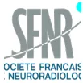
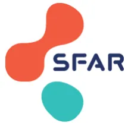
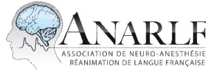

## RECOMMANDATIONS DE PRATIQUES PROFESSIONNELLES

De la **Société Française d'Anesthésie et Réanimation (SFAR)**

En association avec l'**Association des Neuro-Anesthésistes-Réanimateurs de Langue Française (ANARLF)**

*Avec la participation de la Société Française de Neuro-Radiologie (SFNR),  
de la Société Française de Neuro-Vasculaire (SFNV),  
et du Groupe Français d'Études sur l'Hémostase et la Thrombose (GFHT)*

## **PRISE EN CHARGE ANESTHESIQUE PERI-PROCEDURALE D'UNE REVASCULARISATION CÉRÉBRALE PAR THROMBECTOMIE**

**Anaesthetic and peri-operative management for thrombectomy procedure in stroke patients**

**2022**

Texte validé par le Comité des Référentiels Cliniques de la SFAR le 16/05/2022, le conseil d'administration de la SFAR le 29/06/2022, le bureau de l'ANARLF le 29/06/2022, le conseil scientifique/d'administration de la SFNV le 07/10/2022 et le conseil scientifique de la SFNR le 16/08/2022.

**Auteurs :** Hervé Quintard, Vincent Degos, Mikael Mazighi, Jérôme Berge, Pierre Boussemart, Russel Chabanne, Samy Figueiredo, Thomas Geeraerts, Yoann Launey, Ludovic Meuret, Jean-Marc Olivot, Julien Pottecher, Francesca Rapido, Sébastien Richard, Suzana Saleme, Virginie Siguret-Depasse, Olivier Naggara, Hugues De Courson, et Marc Garnier.**Auteur pour correspondance :** Hervé Quintard, service de soins intensifs, Hôpitaux Universitaires de Genève, Rue Gabrielle Perret Gentil 4 - 1205 Genève (Suisse). Herve.quintard@hcuge.ch

**Coordonnateurs d'experts SFAR**

Hervé Quintard (Genève)

**Coordonnateurs d'experts ANARLF**

Vincent Degos (Paris)

**Organisateurs SFAR**

Marc Garnier (Paris) et Hugues De Courson (Bordeaux), pour le Comité des Référentiels Cliniques SFAR

**Groupe d'experts SFAR et ANARLF**

Pierre Boussemart (Lille/SFAR), Russel Chabanne (Clermont-Ferrand/ANARLF), Samy Figueiredo (Paris/SFAR), Thomas Geeraerts (Toulouse/ANARLF), Yoann Launey (Rennes/ANARLF), Ludovic Meuret (Rennes/SFAR), Julien Pottecher (Strasbourg/SFAR), Francesca Rapido (Montpellier/SFAR)

**Groupe d'experts SFNV**

Mikael Mazighi (Paris), Jean-Marc Olivot (Toulouse), Sébastien Richard (Nancy)

**Groupe d'experts SFNR**

Jérôme Berge (Bordeaux), Olivier Naggara (Paris), Suzana Saleme (Limoges)

**Experte GFHT (Groupe Français d'Études sur l'Hémostase et la Thrombose)**

Virginie Siguret-Depasse (Paris)

**Groupes de lecture :**

*Comité des Référentiels Cliniques de la SFAR*

Marc Garnier (Président), Alice Blet (Secrétaire), Anaïs Caillard, Hélène Charbonneau, Hugues De Courson, Audrey De Jong, Marc-Olivier Fischer, Denis Frasca, Matthieu Jabaudon, Daphné Michelet, Stéphanie Ruiz, Emmanuel Weiss.

*Conseil d'Administration de la SFAR*

Pierre Albaladejo (Président), Jean-Michel Constantin (1er Vice-président), Marc Leone (2e Vice-président), Marie-Laure Cittanova (Trésorière), Isabelle Constant (Trésorière-adjointe), Karine Nouette-Gaulain (Secrétaire générale), Frédéric Le Saché (Secrétaire général adjoint), Julien Amour, Hélène Beloeil, Valérie Billard, Marie-Pierre Bonnet, Julien Cabaton, Marion Costecalde, Laurent Delaunay, Delphine Garrigue, Pierre Kalfon, Olivier Joannes-Boyau, Frédéric Lacroix, Olivier Langeron, Sigismond Lasocki, Jane Muret, Olivier Rontes, Nadia Smail, Paul Zetlaoui.

*Conseil d'administration de la SFNV*Igor Sibon (Président), Sonia Alamowitch (Vice-présidente), Charlotte Cordonnier (Secrétaire générale), Valérie Domigo (Trésorière).

*Conseil d'administration de la SFNR*

Hubert Desal (Président), Jean-Pierre Pruvo (Vice-Président), Claire Boutet (Vice-Présidente Neuroradiologie diagnostique), Jérôme Berge (Vice-Président Neuroradiologie interventionnelle), François Cotton (Président sortant), Jildaz Caroff (Trésorier), Arnaud Attye, Grégoire Boulouis, Augustin Leclerc, Olivier Nagarra, Charles Mellerio, Nicolas Menjot-de-Champfleur, François Zhu.**Liens d'intérêts des experts SFAR et ANARLF au cours des cinq années précédant la date de validation par le CA de la SFAR.**

*Pierre Boussemart* déclare n'avoir aucun lien d'intérêt direct ou indirect en rapport avec le contenu de ces RPP.

*Russel Chabanne* déclare n'avoir aucun lien d'intérêt en rapport avec le contenu de ces RPP, et des liens d'intérêt avec Sophysa et Roche Diagnostics en dehors du contenu de ces RPP.

*Hugues de Courson* déclare n'avoir aucun lien d'intérêt direct ou indirect en rapport avec le contenu de ces RPP.

*Vincent Degos* déclare n'avoir aucun lien d'intérêt en rapport avec le contenu de ces RPP, et des liens d'intérêt avec AirLiquide, Idorsia, Sophysa, MSD et Medtronic en dehors du contenu de ces RPP.

*Samy Figueiredo* déclare n'avoir aucun lien d'intérêt direct ou indirect en rapport avec le contenu de ces RPP.

*Marc Garnier* déclare n'avoir aucun lien d'intérêt direct ou indirect en rapport avec le contenu de ces RPP.

*Thomas Geeraerts* déclare n'avoir aucun lien d'intérêt direct ou indirect en rapport avec le contenu de ces RPP.

*Yoann Launey* déclare n'avoir aucun lien d'intérêt en rapport avec le contenu de ces RPP, et des liens d'intérêt avec LFB Biomédicaments, Pfizer et Idorisa Pharmaceuticals en dehors du contenu de ces RPP.

*Ludovic Meuret* déclare n'avoir aucun lien d'intérêt direct ou indirect en rapport avec le contenu de ces RPP.

*Julien Pottecher* déclare n'avoir aucun lien d'intérêt en rapport avec le contenu de ces RPP, et des liens d'intérêt avec Baxter, Edwards Lifesciences et Masimo en dehors du contenu de ces RPP.

*Hervé Quintard* déclare n'avoir aucun lien d'intérêt direct ou indirect en rapport avec le contenu de ces RPP.

*Francesca Rapido* déclare n'avoir aucun lien d'intérêt en rapport avec le contenu de ces RPP, et des liens d'intérêt avec Astellas Pharma et Medtronic en dehors du contenu de ces RPP.

**Liens d'intérêts des experts SFNV au cours des cinq années précédant la date de validation par le CA de la SFNV.**

*Mikael Mazighi* déclare des liens d'intérêt avec Acticor Biotech, Air Liquid et Boehringer Ingelheim en rapport avec le contenu de ces RPP et des liens d'intérêt avec Amgen, Novonordisk et Actelion en dehors du contenu de ces RPP.

*Jean-Marc Olivot* déclare n'avoir aucun lien d'intérêt en rapport avec le contenu de ces RPP, et des liens d'intérêt avec Aptoll, Abbvie, Medtronic, Bristol Myers Squibb et Pfizer en dehors du contenu de ces RPP.

*Sébastien Richard* déclare n'avoir aucun lien d'intérêt en rapport avec le contenu de ces RPP, et des liens d'intérêt avec Boehringer Ingelheim, Bristol Myers Squibb, TBWA Adelphi, WorldOne Group, Daiichi Sankyo, Icomed, Pfizer, SESC, Abbot Medical, Bayer Healthcare en dehors du contenu de ces RPP.

**Liens d'intérêts des experts SFNR au cours des cinq années précédant la date de validation par le CA de la SFNV.**

*Jérôme Berge* déclare n'avoir aucun lien d'intérêt direct ou indirect en rapport avec le contenu de ces RPP.

*Olivier Naggara* déclare n'avoir aucun lien d'intérêt en rapport avec le contenu de ces RPP, et des liens d'intérêt avec Stryker et Boston Scientific en dehors du contenu de ces RPP.

*Suzana Saleme* déclare n'avoir aucun lien d'intérêt direct ou indirect en rapport avec le contenu de ces RPP.

**Liens d'intérêts de l'experte du GFHT au cours des cinq années précédant la date de validation par le CA du GFHT.**

*Virginie Siguret-Depasse* déclare n'avoir aucun lien d'intérêt direct ou indirect en rapport avec le contenu de ces RPP.## Résumé

**Objectif** : Fournir des recommandations sur la prise en charge anesthésique et péri-interventionnelle lors de la procédure de thrombectomie chez les patients victimes d'un AVC.

**Conception** : Un comité de 15 experts issus de la Société Française d'Anesthésie et Réanimation (SFAR), de l'Association des Neuro-Anesthésistes Réanimateurs de Langue Française (ANARLF), de la Société Française de Neuro-Vasculaire (SFNV) et de la Société Française de Neuro-Radiologie interventionnelle (SFNR) a été constitué sous la supervision de 2 coordonnateurs d'experts issus de la SFAR et de l'ANARLF. Une politique officielle en matière de conflits d'intérêts a été élaborée dès le début du processus et appliquée tout au long de celui-ci. L'ensemble du processus d'élaboration des recommandations a été mené indépendamment de tout financement industriel. Il a été demandé aux auteurs de suivre les principes du système GRADE (Grading of Recommendations Assessment, Development and Evaluation) pour guider leur évaluation de la qualité des preuves.

**Méthodes** : Quatre champs d'application ont été définis en amont de la recherche bibliographique : 1) Gestion péri-procédurale, 2) Prévention et gestion des agressions cérébrales secondaires, 3) Gestion des traitements antiplaquettaires et anticoagulants, 4) Gestion post-procédurale et orientation du patient. Les questions ont été formulées au format PICO (Population, Intervention, Comparaison et Outcomes [« résultats »]). L'analyse de la littérature et les recommandations ont ensuite été menées selon la méthodologie GRADE.

**Résultats** : Le groupe d'experts SFAR/ANARLF/SFNV/ SFNR a formulé 18 recommandations concernant la gestion anesthésique péri-procédurale de thrombectomie mécanique. Devant le manque de données dans la littérature permettant de conclure avec un haut niveau de preuve sur des critères de jugement de haute pertinence clinique, les experts ont décidé de formuler l'ensemble de ces préconisations au format de « Recommandations de Pratiques Professionnelles (RPP) » plutôt qu'en « Recommandations Formalisées d'Experts ». Après deux tours de cotation et quelques amendements, un accord fort a été atteint pour 100% des recommandations. Aucune recommandation n'a pu être formulée pour deux questions.

**Conclusions** : Un accord substantiel entre les experts a été obtenu pour fournir 18 préconisations visant à optimiser la gestion de l'anesthésie pour la thrombectomie mécanique chez les patients victimes d'un AVC.

**Mots-clés** : Thrombectomie ; Recommandations ; Accident vasculaire cérébral ; Gestion.## **Abstract**

**Purpose:** To provide recommendations for the anaesthetic and peri-operative management for thrombectomy procedure in stroke patients

**Design:** A consensus committee of 15 experts issued from the French Society of Anaesthesia and Intensive Care Medicine (Société Française d'Anesthésie et Réanimation, SFAR), the Association of Neuro-Anaesthetists of French language (Association des Neuro-Anesthésistes Réanimateurs de Langue Française, ANARLF), the French Neuro-Vascular Society (Société Française de Neuro-Vasculaire, SFNV), and the French Neuro-Radiology Society (Société Française de Neuro-Radiologie, SFNR) was convened, under the supervision of 2 experts coordinators from the SFAR and the ANARLF. A formal conflict-of-interest policy was developed at the onset of the process and enforced throughout. The entire guideline elaboration process was conducted independently of any industry funding. The authors were required to follow the principles of the Grading of Recommendations Assessment, Development and Evaluation (GRADE) system to guide their assessment of quality of evidence.

**Methods:** Four fields were defined prior to the literature search: 1) Peri-procedural management, 2) Prevention and management of secondary brain injuries, 3) Management of antiplatelet and anticoagulant treatments, 4) Post-procedural management and orientation of the patient. Questions were formulated using the PICO format (Population, Intervention, Comparison and Outcomes) and updated as needed. The analysis of the literature and the recommendations were then conducted according to the GRADE methodology.

**Results:** The SFAR/ANARLF/SFNV/ SFNR guideline panel provided 18 statements regarding the anaesthetic management of mechanical thrombectomy procedures. Due to the lack of data in the literature allowing to conclude with high certainty on relevant clinical outcomes, the experts decided to formulate these guidelines as “Practical Professional Guidelines” instead of “Formalized Experts Guidelines”. After two rounds of rating and several amendments, strong agreement was reached for 100% of the recommendations. No recommendation could have been made for two questions.

**Conclusions:** Substantial agreement among experts has been obtained to provide a sizable number of recommendations aimed at optimising the anaesthetic management for thrombectomy in patients suffering from stroke.

**Keywords:** Thrombectomy; Guidelines; Stroke; Management.## Introduction

La prise en charge de l'accident vasculaire cérébral ischémique (AVCi) doit être proposée en extrême urgence, ce qui constitue un véritable enjeu de santé publique. Jusqu'en 2015, le traitement de l'accident vasculaire cérébral ischémique reposait sur la recanalisation rapide de l'artère occluse par thrombolyse intraveineuse. L'arrivée de la thrombectomie mécanique (TM) a permis d'élargir le choix thérapeutique et de modifier la prise en charge. La TM est indiquée, soit d'emblée en association avec la thrombolyse intraveineuse, soit en technique de recours (après échec d'un traitement par thrombolyse IV ou seul en cas de contre-indication à la thrombolyse IV), dans un délai de six heures après le début des symptômes des patients ayant un AVCi aigu, en rapport avec une occlusion d'un gros tronc artériel de la circulation antérieure, et possiblement de la circulation postérieure, visible à l'imagerie. Compte tenu des résultats des études contrôlées randomisées récentes, certaines indications peuvent être étendues jusqu'à 24H. L'occlusion vasculaire doit être diagnostiquée par une méthode non invasive en première intention (angio-tomodensitométrie ou angiographie par résonance magnétique) avant d'envisager la phase thérapeutique par TM. La décision d'entreprendre une TM doit être prise par une équipe multidisciplinaire comprenant au moins un neurologue et/ou un médecin compétent en pathologies neurovasculaires d'une unité de soins neuro-vasculaires sur le site et un médecin qualifié pour la réalisation de la TM. Les nouvelles recommandations de la HAS ([https://www.has-sante.fr/jcms/c\\_2757616/fr/organisation-de-la-prise-en-charge-precoce-de-l-accident-vasculaire-cerebral-ischemique-aigu-par-thrombectomie-mecanique](https://www.has-sante.fr/jcms/c_2757616/fr/organisation-de-la-prise-en-charge-precoce-de-l-accident-vasculaire-cerebral-ischemique-aigu-par-thrombectomie-mecanique)) spécifient aussi la présence nécessaire d'une équipe anesthésique avec en particulier un anesthésiste ayant l'expérience de la prise en charge des patients traités par des actes de neuroradiologie interventionnelle ainsi qu'un(e) infirmier(e) anesthésiste diplômée d'état (IADE). L'éligibilité des patients pour TM doit aussi être discutée de manière collégiale avec une concertation entre le neurologue vasculaire, le neuroradiologue interventionnel et l'anesthésiste en charge.

Les cliniciens en charge des TM utilisent en pratique courante plusieurs scores nécessaires aux différentes étapes de la prise en charge :

- **Score NIHSS** : Score clinique NIHSS (NIH Stroke Scale) diagnostique et de gravité des accidents vasculaires cérébraux ischémique ou hémorragique qui permet de mesurer l'intensité des signes neurologiques pour en surveiller l'évolution et en estimer la gravité. Le NIH Stroke Scale [1] est basé sur le recueil de 15 items neurologiques cliniques. Il permet une évaluation précise et rapide des déficits observés et il est étroitement lié au devenir des patients. Il a à la fois une fonction quantitative et une fonction pronostique avec une corrélation avec le volume de l'infarctus cérébral. Il y a peu de différence de cotation inter observateurs. Un score NIHSS entre 1 et 4 signifie un AVC mineur, entre 5 et 15, un AVC modéré, entre 15 et 20, sévère, et au-dessus de 20 points, un AVC grave.

*Brott T, Adams HP, Olinger CP, Marler JR, Barsan WG, Biller J, Spilker J, Holleran R, Eberne R, Hertzberg V, Rorick M, Moomaw CJ, Walker M. Measurements of acute cerebral infarction : a clinical examination scale. Stroke 1989;20:864-70*

- **Score ASPECTS** : Score radiologique (Alberta Stroke Program Early CT Score) permettant d'évaluer les AVC ischémiques dans le territoire de l'artère cérébrale moyenne sur un scanner cérébral sans injection, sur une échelle en 10 points. En pratique, le score divise le territoire de l'artère cérébrale moyenne (ACM) en 10 secteurs dont 3 régions profondes ou sous-corticales et 7 régions superficielles ou corticales. Pour chaque secteur, l'absence d'une hypodensité ramène 1 point. Un score  $\leq 7$  est prédictif d'un pronostic péjoratif tant en termes de handicap résiduel que de risque de transformation hémorragique. Un score ASPECTS à 0 correspond à hypodensité de tout le territoire de l'ACM.

*Pexman JH, Barber PA, Hill MD, Sevick RJ, Demchuk AM, Hudon ME, Hu WY, Buchan AM. Use of the Alberta Stroke Program Early CT Score (ASPECTS) for assessing CT scans in patients with acute stroke. AJNR Am J Neuroradiol. 2001 Sep;22(8):1534-42.*- **Score TICI** : Score angiographique TICI (Treatment In Cerebral Ischemia Scale revisited) quantifiant le degré de la revascularisation. Un score TICI 3 correspond à un succès radiologique complet ; un score TICI 2c à la quasi-totalité du territoire revascularisé avec la persistance d'un retard de perfusion sur une partie du territoire ; un score TICI 2b à plus de la moitié du territoire revascularisé ; un score TICI 2a à moins de la moitié du territoire ; un score TICI 1 correspond à la pénétration du produit de contraste mais avec absence de recanalisation ; et enfin un score TICI 0 correspond à l'absence de revascularisation. On considère qu'un score TICI 2c/3 est un bon résultat de la thrombectomie.

*Goyal M, Fargen KM, Turk AS, Mocco J, Liebeskind DS, Frei D, Demchuk AM. 2C or not 2C: defining an improved revascularization grading scale and the need for standardization of angiography outcomes in stroke trials. J Neurointerv Surg. 2014 Mar;6(2):83-6.*

- **Score de Rankin modifié** : Score d'évaluation clinique et globale du handicap. L'échelle de Rankin modifiée est réalisée en 5 minutes. Échelle à six niveaux allant de 0 pour aucun symptôme, 1 pour absence de handicap significatif en dehors d'éventuels symptômes (capable d'assumer ses rôles, capable de mener ses activités), 2 pour handicap léger (incapable de mener à bien toutes ses activités antérieures, capable de mener ses propres affaires sans assistance), 3 pour handicap modéré (requiert certaines aides, capable de marcher sans assistance), 4 pour handicap modérément sévère (incapable de marcher sans assistance, incapable de s'occuper de ses propres besoins sans assistance), 5 pour handicap sévère (confiné au lit, incontinent et nécessitant une attention et des soins constants de nursing) et 6 pour décès.

*Van Swieten JC, Koudstaal PJ, Visser MC, Schouten HJ, van Gijn J. Interobserver agreement for the assessment of handicap in stroke patients. Stroke 1988;19(5):604-7.*

### **Objectif des recommandations**

L'objectif de ces recommandations est de produire un cadre facilitant la prise de décision, en situation d'urgence face à un patient devant être pris en charge pour une procédure de thrombectomie. Le groupe s'est efforcé de produire un nombre minimal de recommandations afin de mettre en exergue les points forts à retenir dans les quatre champs prédéfinis : 1/ modalités de prise en charge péri interventionnelle, 2/ gestion des ACSOS, 3/ gestion des anticoagulants et antiagrégants plaquettaires, 4/ prise en charge post interventionnelle et orientation. Les règles de base des bonnes pratiques médicales universelles en réanimation étant considérées connues ont été exclues de ces recommandations. Est également exclue du champ de ces recommandations la prise en charge pré-hospitalière. Le public visé est large puisqu'il correspond à tous les professionnels de santé (neurologues, radiologues, anesthésistes-réanimateurs, etc.) participant à cette prise en charge.

### **Organisation générale**

Ces recommandations sont le résultat du travail d'un groupe d'experts réunis par la SFAR et l'ANARLF, en collaboration avec la SFNV et la SFNR. Chaque expert a rempli une déclaration de conflits d'intérêts avant de débuter le travail d'analyse. Dans un premier temps, le comité d'organisation a défini les objectifs, la méthodologie, le champ d'application ainsi que les questions à traiter de ces recommandations. Ces éléments ont ensuite été modifiés puis validés par les experts.

Les questions ont été formulées selon un format PICO (Population – Intervention – Comparaison – Outcome) chaque fois que possible. La population faisant l'objet de ces recommandations (le « P » du PICO) est pour l'ensemble des recommandations "les patients présentant une occlusion artérielle cérébrale et éligible à un traitement endovasculaire", et n'est alors pas rappelée dans chaque recommandation.## **Champs des recommandations**

A l'unanimité les experts ont décidé de retenir les quatre champs suivants pour les présentes recommandations :

CHAMP 1 – Modalités de prise en charge per interventionnelle

CHAMP 2 – Gestion des ACSOS

CHAMP 3 – Gestion des antiagrégants plaquettaires et des anticoagulants

CHAMP 4 – Gestion post-interventionnelle et orientation.

## **Méthodologie de la recherche bibliographique et de la rédaction des recommandations**

Une recherche bibliographique extensive jusqu'à mars 2022 a été réalisée à partir des bases de données MEDLINE PubMed™ et www.clinicaltrials.gov, par au moins deux experts pour chaque champ d'application selon la méthodologie Preferred Reporting Items for Systematic Reviews and Meta-Analyses (PRISMA) pour les revues systématiques.

Ont été inclus dans l'analyse : les méta-analyses, essais contrôlés randomisés, essais prospectifs non randomisés, cohortes rétrospectives, séries de cas et case-reports, conduits chez des patients présentant une occlusion artérielle cérébrale et éligible à un traitement endovasculaire, publiés en langue anglaise ou française.

L'analyse de la littérature a ensuite été conduite selon la méthodologie GRADE® (Grade of Recommendation Assessment, Development and Evaluation). Les critères de jugement ont été définis en amont de la façon suivante :

- - critère de jugement majeur : pronostic neurologique à 3 mois (évalué par le score de Rankin (importance 8) ;
- - critères de jugement secondaires : morbidité neurologique à court terme (importance 7), succès de la thrombectomie (évalué par le score TICI) (importance 6).

Du fait de la très faible quantité d'études disponibles à ce jour répondant avec la puissance nécessaire au critère de jugement majeur d'importance la plus élevée, il a été décidé, en amont de la rédaction des recommandations, d'adopter un format de Recommandations pour la Pratique Professionnelle (RPP) plutôt qu'un format de Recommandations Formalisées d'Experts (RFE). La méthodologie GRADE® a toutefois été appliquée pour l'analyse de la littérature et la rédaction des tableaux récapitulatifs des données de la littérature. Un niveau de preuve a donc été défini pour chacune des références bibliographiques citées en fonction du type de l'étude. Ce niveau de preuve pouvait être réévalué en tenant compte de la qualité méthodologique de l'étude, de la cohérence des résultats entre les différentes études, du caractère direct ou non des preuves, de l'analyse de coût et de l'importance du bénéfice. Les recommandations ont ensuite été rédigées en utilisant la terminologie des RPP de la SFAR « les experts suggèrent de faire » ou « les experts suggèrent de ne pas faire ». Les propositions de recommandations ont été présentées et discutées une à une. Le but n'était pas d'aboutir obligatoirement à un avis unique et convergent des experts sur l'ensemble des propositions, mais de dégager les points de concordance et les points de divergence ou d'indécision.

## **Résultats**

### ***Champs des recommandations***

Les experts ont consensuellement décidé lors de la première réunion d'organisation de ces RPP, de traiter 15 questions réparties en quatre champs. Les questions suivantes ont été retenues pour le recueil et l'analyse de la littérature :

### **CHAMP 1 – Modalités de prise en charge per interventionnelle**

#### **Questions :**- ● Chez le patient présentant une occlusion artérielle cérébrale et éligible à un traitement endovasculaire, l'anesthésie locale seule, comparativement à l'anesthésie générale ou à la sédation, permet-elle d'améliorer le pronostic neurologique à 3 mois ?
- ● Chez le patient présentant une occlusion artérielle cérébrale et éligible à un traitement endovasculaire, la sédation, comparativement à l'anesthésie générale, permet-elle d'améliorer le pronostic neurologique à 3 mois ?

## CHAMP 2 – Gestion des ACSOS

### Questions :

- ● Chez le patient présentant une occlusion artérielle cérébrale et ayant bénéficié d'un traitement endovasculaire, l'utilisation d'une cible de pression artérielle (PA) en post-recanalisation est-elle associée à une amélioration du pronostic neurologique à 3 mois ?
- ● Chez le patient présentant une occlusion artérielle cérébrale, et bénéficiant d'un traitement endovasculaire, l'utilisation d'un objectif cible de saturation permet-il d'améliorer le pronostic neurologique à 3 mois ?
- ● Chez le patient présentant une occlusion artérielle cérébrale, et bénéficiant d'un traitement endovasculaire sous anesthésie générale, le monitoring per-procédure du CO2 permet-il d'améliorer le pronostic neurologique à 3 mois ?
- ● Chez le patient présentant une occlusion artérielle cérébrale, et bénéficiant d'un traitement endovasculaire sous sédation, le monitoring per-procédure du CO2 permet-il d'améliorer le pronostic neurologique à 3 mois ?
- ● Chez le patient présentant une occlusion artérielle cérébrale, et bénéficiant d'un traitement endovasculaire, le monitoring per-procédure de la glycémie permet-il d'améliorer le pronostic neurologique à 3 mois ?

## CHAMP 3 – Gestion des antiagrégants plaquettaires et des anticoagulants

### Questions :

- ● Chez le patient présentant une occlusion artérielle cérébrale, et bénéficiant d'un traitement endovasculaire après avoir été préalablement traité par thrombolyse intraveineuse, l'héparinisation systémique per-procédure permet-elle d'améliorer le pronostic neurologique à 3 mois ?
- ● Chez le patient présentant une occlusion artérielle cérébrale, et bénéficiant d'un traitement endovasculaire sans avoir été préalablement traité par thrombolyse intraveineuse, l'héparinisation systémique per-procédure permet-elle d'améliorer le pronostic neurologique à 3 mois ?
- ● Chez le patient présentant une occlusion artérielle cérébrale, et bénéficiant d'un traitement endovasculaire, l'antiagrégation per-procédure permet-elle d'améliorer le pronostic neurologique à 3 mois ?
- ● Chez le patient présentant une occlusion artérielle cérébrale, bénéficiant d'un traitement endovasculaire nécessitant un stenting en urgence, une antiagrégation plaquettaire permet-elle d'améliorer le pronostic neurologique à 3 mois ?

## CHAMP 4 – Gestion post-interventionnelle et orientation

### Questions :

- ● Chez le patient ayant bénéficié d'une thrombectomie cérébrale sous anesthésie générale, une stratégie d'évaluation neurologique précoce (arrêt des sédations, extubation précoce) permet-elle d'améliorer la morbi-mortalité ?- ● Chez le patient ayant bénéficié d'une thrombectomie cérébrale sous anesthésie générale, une stratégie d'extubation précoce guidée par des échelles (score VISAGE, etc.), permet-elle d'améliorer la morbi-mortalité ?
- ● Chez le patient ayant bénéficié d'une thrombectomie cérébrale, l'orientation vers une structure de soins adaptées (soins critiques vs. USINV), en fonction de critères de gravité permet-elle d'améliorer la morbi-mortalité ?
- ● Chez le patient ayant bénéficié d'une thrombectomie cérébrale, le maintien sur le centre expert, éventuellement en fonction de critères d'orientation, permet-il d'améliorer la morbi-mortalité ?

### ***Synthèse des résultats***

Après synthèse du travail des experts et application de la méthode GRADE®, 18 préconisations ont été formalisées et les experts se sont abstenus d'émettre des préconisations sur 2 questions. La totalité de ces préconisations a été soumise au groupe d'experts pour une cotation avec la méthode GRADE® Grid. Après deux tours de cotations, un accord fort a été obtenu pour 100 % des recommandations.

Ces RPP se substituent aux recommandations précédentes émanant de la SFAR sur un même champ d'application. La SFAR incite tous les professionnels impliqués dans la prise en charge des patients traités par thrombectomie cérébrale endovasculaire à se conformer à ce référentiel. Cependant, dans l'application de ces préconisations, chaque praticien doit exercer son jugement, prenant en compte son expertise et les spécificités de son établissement, pour déterminer la méthode d'intervention la mieux adaptée à l'état du patient dont il a la charge.## **CHAMP 1. Modalités de prise en charge per-interventionnelle**

*Experts : Y. Launey (ANARLF) – S. Saleme (SFNR) – O. Naggara (SFNR) - L. Meuret (SFAR)*

**Question : Chez le patient présentant une occlusion artérielle cérébrale et éligible à un traitement endovasculaire, l'anesthésie locale seule, comparativement à l'anesthésie générale ou à la sédation, permet-elle d'améliorer le pronostic neurologique à 3 mois ?**

**R1.1.1 - Les experts suggèrent de privilégier l'anesthésie générale avec intubation oro-trachéale, réalisée par une équipe anesthésique, plutôt que l'anesthésie locale seule, afin d'améliorer le pronostic neurologique à 3 mois, lorsqu'au moins une des situations suivantes est présente :**

- **- en cas d'atteinte de la circulation postérieure**
- **- en cas de neuronavigation radiologique prévue délicate**
- **- en cas de score NIHSS  $\geq 15$**
- **- en cas d'altération de la vigilance**
- **- en cas de défaillance respiratoire**
- **- en cas d'agitation du patient**
- **- en cas de vomissements.**

**Avis d'experts (Accord fort)**

**R1.1.2 - À l'exception des situations ci-dessus nécessitant une intubation, les experts suggèrent de ne pas privilégier une anesthésie générale, par rapport à une anesthésie locale sous surveillance par une équipe d'anesthésie, pour améliorer le pronostic neurologique à 3 mois.**

**Avis d'experts (Accord fort)**

**Argumentaire :** La distinction entre anesthésie locale (AL) et sédation procédurale (SP) n'est que relativement récente dans les études visant à évaluer l'impact de la stratégie anesthésique sur le pronostic des patients pris en charge pour une occlusion artérielle cérébrale aigüe. En effet, l'analyse post-hoc de l'essai IMS-III rapportait une plus grande morbi-mortalité d'un traitement endovasculaire sous anesthésie générale (AG) comparé à un traitement sous « anesthésie locale », entité qui regroupe dans cette étude toute anesthésie sans intubation (avec ou sans sédation) [1].

### Pour les occlusions de la circulation antérieure

Les études s'intéressant aux différences entre AL seule et SP sont de méthodologie peu robuste car pour une grande partie observationnelles ou rétrospectives [2,3]. Bien qu'il existe une méta-analyse d'essais randomisés [4] dans laquelle sont comparées AG et AL avec ou sans sédation, et 2 analyses du registre observationnel prospectif Hollandais de thrombectomies [5,6], les résultats s'avèrent parfois contradictoires et émaillés de plusieurs biais potentiels (méthodologie, définition de l'AL, données manquantes). Ainsi, l'étude de Benvegnù et al. fait émerger un signal en défaveur de l'AL lorsqu'elle est comparée à la SP car associée à un moins bon devenir fonctionnel neurologique, un taux de reperfusion plus bas et une mortalité plus élevée à 3 mois [7] ; tandis que les analyses du registre MR CLEAN (5,6) retrouvent une association inverse de l'AL à un meilleur pronostic fonctionnel par rapport à la SP. De même, dans une étude de cohorte prospective italienne portant sur 4429 patients traités par thrombectomie endovasculaire [8], l'AG était associée à un moins bon pronostic fonctionnel à 3 mois lorsqu'elle était comparée à l'AL ou à la sédation consciente (SC). A noter que dans cette étude, le score NHISS initial médian était plus bas dans le groupe AL que dans les groupes SP ou AG et que les raisons de conversion vers l'AG n'étaient pas rapportées, source de biais important. De fait, il n'est pas possible de privilégier une technique lors d'un geste dethrombectomie endovasculaire dans l'AVC ischémique de la circulation antérieure. En attendant les résultats d'études randomisées contrôlées plus robustes dans lesquelles l'AL sera clairement identifiée par rapport aux autres techniques d'anesthésie (NCT02677415), il semble raisonnable de privilégier une gestion de l'anesthésie optimisée par une approche adaptée aux caractéristiques du patient et dépendante de l'expertise locale.

#### Pour les occlusions de la circulation postérieure

L'occlusion aiguë de la circulation artérielle postérieure, impliquant l'artère vertébrale ou le tronc basilaire, est responsable d'AVC plus sévères et de moins bon pronostic que ceux de la circulation antérieure. Elle entraîne notamment en cas d'occlusion basilaire, une dysfonction du tronc cérébral (substance réticulée activatrice ascendante, voies longues motrices et sensitives, nerfs crâniens notamment mixtes, système nerveux autonome). La revascularisation endovasculaire par thrombectomie est réalisable dans cette indication malgré l'absence de validation scientifique formelle. La physiopathologie est différente de la circulation antérieure avec un mécanisme occlusif plutôt athérosclérotique qu'embolique. Les concepts de collatéralité, de pénombre ischémique, de délai et donc de sélection radiologique des patients sont également différents de ceux de la circulation antérieure. Les indications sont d'ordre compassionnel, particulièrement en cas de forme grave, avec des bénéfices individuels retrouvés pour des délais parfois prolongés. Les procédures sont techniquement plus difficiles qu'en circulation antérieure et donc souvent plus longues. La littérature évaluant la prise en charge anesthésique des occlusions de la circulation cérébrale postérieure est limitée et uniquement observationnelle sur bases de données incluant peu de patients (au maximum 298 patients dans une série espagnole) [9]. La définition du groupe « Anesthésie générale » se résume généralement à « patient intubé » et le groupe « Sédation/Anesthésie locale » à « patient non intubé ». Certains essais n'incluent que les occlusions basilaires, d'autres toute occlusion de la circulation postérieure. Quatre essais sur 7 analysés concernent une population asiatique comportant beaucoup plus d'étiologie athérosclérotique, des organisations de soins probablement différentes, source de biais de sélection et de biais de validité externe. Une étude pilote randomisée contrôlée monocentrique chinoise en cours [10] cherche à démontrer l'équivalence voire le bénéfice de la SP et de l'AL versus l'AG chez des patients sélectionnés, les moins sévères. Dans l'attente des résultats de cette étude et d'autres études randomisées à venir, et compte tenu de possibles formes sévères avec coma et/ou détresse respiratoire, les experts se sont positionnés pour privilégier l'AG avec intubation lors des procédures de thrombectomie endovasculaire pour occlusion de la circulation postérieure.

Lorsqu'une AG est envisagée en fonction des critères sus cités, la présence d'une équipe anesthésique habituée à cette procédure et disponible pour encadrer cette prise en charge est à privilégier.

#### **Références :**

1. 1. Abou-Chebl A, Yeatts SD, Yan B, Cockcroft K, Goyal M, Jovin T, Khatri P, Meyers P, Spilker J, Sugg R, Wartenberg KE, Tomsick T, Broderick J, Hill MD. Impact of General Anesthesia on Safety and Outcomes in the Endovascular Arm of Interventional Management of Stroke (IMS) III Trial. *Stroke*. 2015 Aug;46(8):2142-8. doi: 10.1161/STROKEAHA.115.008761. Epub 2015 Jul 2. PMID: 26138125; PMCID: PMC4519363.
2. 2. Pop R, Severac F, Happi Ngankou E, Harsan O, Martin I, Mihoc D, Manisor M, Simu M, Chibbaro S, Wolff V, Gheoca R, Meyer A, Pottecher J, Audibert G, Derelle AL, Tonnelet R, Liao L, Zhu F, Bracard S, Anxionnat R, Richard S, Beaujeux R, Gory B. Local anesthesia versus general anesthesia during endovascular therapy for acute stroke: a propensity score analysis. *J Neurointerv Surg*. 2021 Mar;13(3):207-211. doi: 10.1136/neurintsurg-2020-015916. Epub 2020 Jun 2. PMID: 32487768.
3. 3. Wu L, Jadhav AP, Chen J, Sun C, Ji K, Li W, Zhao W, Li C, Wu C, Wu D, Ji X. Local anesthesia vs general anesthesia during endovascular therapy for acute posterior circulation stroke. *J Neurol Sci*. 2020 Sep 15;416:117045. doi: 10.1016/j.jns.2020.117045. Epub 2020 Jul 16. PMID: 32717535.
4. 4. Goyal N, Malhotra K, Ishfaq MF, Tsivgoulis G, Nickele C, Hoit D, Arthur AS, Alexandrov AV, Elijovich L. Current evidence for anesthesia management during endovascular stroke therapy: updated systematic review and meta-analysis. *J Neurointerv Surg*. 2019 Feb;11(2):107-113. doi: 10.1136/neurintsurg-2018-013916. Epub 2018 Jun 15. PMID: 29907575.1. 5. Goldhoorn RB, Bernsen MLE, Hofmeijer J, Martens JM, Lingsma HF, Dippel DWJ, van der Lugt A, Buhre WFFA, Roos YBWEM, Majoie CBLM, Vos JA, Boiten J, Emmer B, van Oostenbrugge RJ, van Zwam WH; MR CLEAN Registry Investigators. Anesthetic management during endovascular treatment of acute ischemic stroke in the MR CLEAN Registry. *Neurology*. 2020 Jan 7;94(1):e97-e106. doi: 10.1212/WNL.0000000000008674. Epub 2019 Dec 5. PMID: 31806692.
2. 6. van de Graaf RA, Samuels N, Mulder MJHL, Eralp I, van Es ACGM, Dippel DWJ, van der Lugt A, Emmer BJ; Multicenter Randomized Clinical Trial of Endovascular Treatment of Acute Ischemic Stroke in the Netherlands (MR CLEAN) Registry Investigators. Conscious sedation or local anesthesia during endovascular treatment for acute ischemic stroke. *Neurology*. 2018 Jul 3;91(1):e19-e25. doi: 10.1212/WNL.0000000000005732. Epub 2018 Jun 1. PMID: 29858471; PMCID: PMC6537649.
3. 7. Benvegnù F, Richard S, Marnat G, Bourcier R, Labreuche J, Anadani M, Sibon I, Dargazanli C, Arquizán C, Anxionnat R, Audibert G, Zhu F, Mazighi M, Blanc R, Lapergue B, Consoli A, Gory B; ETIS Registry Investigators. Local Anesthesia Without Sedation During Thrombectomy for Anterior Circulation Stroke Is Associated With Worse Outcome. *Stroke*. 2020 Oct;51(10):2951-2959. doi: 10.1161/STROKEAHA.120.029194. Epub 2020 Sep 8. PMID: 32895016.
4. 8. Cappellari M, Pracucci G, Forlivesi S, Saia V, Nappini S, Nencini P, Inzitari D, Greco L, Sallustio F, Vallone S, Bigliardi G, Zini A, Pitrone A, Grillo F, Musolino R, Bracco S, Tinturini R, Tassi R, Bergui M, Cerrato P, Saletti A, De Vito A, Casetta I, Gasparotti R, Magoni M, Castellan L, Malfatto L, Menozzi R, Scoditti U, Causin F, Baracchini C, Puglielli E, Casalena A, Ruggiero M, Malatesta E, Comelli C, Chianale G, Lauretti DL, Mancuso M, Lafe E, Cavallini A, Cavasini N, Critelli A, Ciceri EFM, Bonetti B, Chiumarulo L, Petruzzelli M, Giorgianni A, Versino M, Ganimede MP, Tinelli A, Auteri W, Petrone A, Guidetti G, Nicolini E, Allegretti L, Tassinari T, Filauri P, Sacco S, Pavia M, Invernizzi P, Nuzzi NP, Carmela Spinelli M, Amistà P, Russo M, Ferrandi D, Corrain S, Craparo G, Mannino M, Simonetti L, Toni D, Mangiafico S. General Anesthesia Versus Conscious Sedation and Local Anesthesia During Thrombectomy for Acute Ischemic Stroke. *Stroke*. 2020 Jul;51(7):2036-2044. doi: 10.1161/STROKEAHA.120.028963. Epub 2020 Jun 10. PMID: 32517584.
5. 9. Terceño M, Silva Y, Bashir S, Vera-Monge VA, Cardona P, Molina C, et al. Impact of general anesthesia on posterior circulation large vessel occlusions after endovascular thrombectomy. *International Journal of Stroke*. oct 2021;16(7):792-7.
6. 10. Liang F, Zhao Y, Yan X, Wu Y, Li X, Zhou Y, et al. Choice of ANaesthesia for EndoVAscular treatment of acute ischaemic stroke at posterior circulation (CANVAS II): protocol for an exploratory randomised controlled study. *BMJ Open*. 31 juill 2020;10(7):e036358.

**Question : Chez le patient présentant une occlusion artérielle cérébrale et éligible à un traitement endovasculaire, la sédation, comparativement à l'anesthésie générale, permet-elle d'améliorer le pronostic neurologique à 3 mois ?**

**R1.2 - A l'exception des situations nécessitant une intubation oro-trachéale (cf. R1.1.1), les experts suggèrent de ne pas privilégier une anesthésie générale par une équipe anesthésique par rapport à une sédation procédurale par une équipe anesthésique pour améliorer le pronostic neurologique à 3 mois.**

**Avis d'experts (Accord fort)**

**Argumentaire :**

Pour les occlusions de la circulation antérieure :

La littérature concernant la prise en charge anesthésique (anesthésie générale (AG) ou sédation procédurale (SP)) des occlusions artérielles cérébrales de la circulation antérieure est importante mais de mauvaise qualité. Il existe beaucoup de données observationnelles avec méta-analyses comportant de nombreux biais particulièrement de sélection (intervention anesthésique non contrôlée, patients plus sévères pris en charge sous AG). Dans ces séries, la définition des groupes AG et sédation est imprécise (patients pris en charge uniquement sous anesthésie locale dans le groupe sédation ou patients secondairement intubés sur complications et analysés dans le groupe AG). Depuis 2015, les méta-analyses observationnelles retrouvent un bénéfice de la sédation en termes d'autonomie fonctionnelle à 3 mois (Score de Rankin modifié "mR"  $\leq 2$ ). Néanmoins, il n'existe que 3 études randomisées contrôlées s'intéressant spécifiquement à la prise en charge anesthésique. Ces études européennes, monocentriques [1-3] ont inclus peu de patients puisque toutes sauf une [2] avaient un critère de jugement principal intermédiaire (NIHSS à J1 ou volume infarcté en IRM). De plus, les patients, qui étaient pris en charge dans les 8 heures après lessymptômes, étaient particulièrement sélectionnés et notamment exclus si NIHSS < 10, agitation, vomissements et/ou pertes des réflexes de protection des voies aériennes ou en cas de non-disponibilité de l'équipe anesthésique. Ainsi, environ 40% des patients éligibles à une thrombectomie n'ont pas été randomisés. Les équipes prenant en charge les patients étaient spécialisées en neuro-anesthésie et/ou neuro-réanimation respectant parfaitement les objectifs thérapeutiques fixés par les protocoles d'étude notamment en termes de pression artérielle. Dans ces études, les délais de reperfusion n'étaient pas augmentés sous AG malgré une légère majoration des délais d'accès vasculaire. Elles ne retrouvaient pas de différence significative sur leur critère de jugement principal mais 2 de ces études retrouvaient un signal en faveur de l'AG sur le pronostic fonctionnel à J90. Une méta-analyse de ces 3 essais sur données individuelles [4] retrouvait un bénéfice de l'AG sur l'autonomie J90. Néanmoins, la puissance restait limitée car seulement 368 patients ont été inclus et l'intervalle de confiance était large (mRS $\leq$ 2 : 65/185 sédations (35,1%) vs 90/183 AG (49,2%), OR 0,46 IC95% (0,28-0,76) p=0,003). L'inhomogénéité de la sédation réside également dans le type de molécules anesthésiques utilisées, ou les taux de conversion vers l'AG observés variant de 6 à 16%, eux-mêmes associés à un moins bon pronostic fonctionnel [4]. Enfin, plus récemment, les 2 essais randomisés contrôlés multicentriques français (GASS [5] et AMETIS [6]) comparant AG versus sédation ne retrouvaient pas de différence significative concernant leurs critères de jugement principal respectif (GASS : mRS $\leq$ 2 à J90: 36% (AG) vs 40% (sédation) - OR 0,91 (0,64-1,31), et AMETIS : critère composite associant autonomie fonctionnelle (mRS $\leq$ 2) à J90 et absence de complications majeures à J7 : 39,1 (sédation) % vs 33,3% (AG) - OR 1,18 (0,86-1,61) - p=0,80.

#### Pour les occlusions de la circulation postérieure :

En l'absence d'études bien conduites sur la sédation procédurale pour thrombectomie lors d'occlusion artérielle de la circulation cérébrale postérieure, et pour les mêmes raisons que celles évoquées dans l'argumentaire de la R1.1.1, la réalisation d'une anesthésie générale avec intubation oro-trachéale doit probablement être privilégiée en cas de geste de thrombectomie dans cette situation, tout particulièrement en cas d'occlusion du tronc basilaire.

#### **Références :**

1. 1. Schönenberger S, Uhlmann L, Hacke W, Schieber S, Mundiyanapurath S, Purrucker JC, Nagel S, Klose C, Pfaff J, Bendszus M, Ringleb PA, Kieser M, Möhlenbruch MA, Bösel J. Effect of Conscious Sedation vs General Anesthesia on Early Neurological Improvement Among Patients With Ischemic Stroke Undergoing Endovascular Thrombectomy: A Randomized Clinical Trial. JAMA. 2016 Nov 15;316(19):1986-1996. doi: 10.1001/jama.2016.16623. Erratum in: JAMA. 2017 Feb 7;317(5):538. PMID: 27785516.
2. 2. Löwhagen Hendén P, Rentzos A, Karlsson JE, Rosengren L, Leiram B, Sundeman H, Dunker D, Schnabel K, Wikholm G, Hellström M, Ricksten SE. General Anesthesia Versus Conscious Sedation for Endovascular Treatment of Acute Ischemic Stroke: The AnStroke Trial (Anesthesia During Stroke). Stroke. 2017 Jun;48(6):1601-1607. doi: 10.1161/STROKEAHA.117.016554. PMID: 28522637.
3. 3. Simonsen CZ, Yoo AJ, Sørensen LH, Juul N, Johnsen SP, Andersen G, Rasmussen M. Effect of General Anesthesia and Conscious Sedation During Endovascular Therapy on Infarct Growth and Clinical Outcomes in Acute Ischemic Stroke: A Randomized Clinical Trial. JAMA Neurol. 2018 Apr 1;75(4):470-477. doi: 10.1001/jamaneurol.2017.4474. PMID: 29340574; PMCID: PMC5885172.
4. 4. Simonsen CZ, Schönenberger S, Hendén PL, Yoo AJ, Uhlmann L, Rentzos A, Bösel J, Valentin J, Rasmussen M. Patients Requiring Conversion to General Anesthesia during Endovascular Therapy Have Worse Outcomes: A Post Hoc Analysis of Data from the SAGA Collaboration. AJNR Am J Neuroradiol. 2020 Dec;41(12):2298-2302. doi: 10.3174/ajnr.A6823. Epub 2020 Oct 22. PMID: 33093133; PMCID: PMC7963249
5. 5. Maurice A, Eugène F, Ronzière T, Devys JM, Taylor G, Subileau A, Huet O, Gherbi H, Laffon M, Esvan M, Laviolle B, Beloeil H; GASS (General Anesthesia versus Sedation for Acute Stroke Treatment) Study Group and the French Society of Anesthesiologists (SFAR) Research Network. General Anesthesia versus Sedation, Both with Hemodynamic Control, during Intraarterial Treatment for Stroke: The GASS Randomized Trial. Anesthesiology. 2022 Apr 1;136(4):567-576. doi: 10.1097/ALN.0000000000004142. PMID: 35226737.
6. 6. Chabanne R, Fernandez-Canal C, Degos V, Lukaszewicz AC, Velly L, Mrozek S, Perrigault PF, Molliex S, Tavernier B, Dahyot-Fizelier C, Verdonk F, Caumon E, Masgrau A, Begard M, Chabert E, Ferrier A, Jaber S, Bazin JE, Pereira B, Futier E; ANARLF Network and the AMETIS study group. Sedation versus general anaesthesia in endovascular therapy for anterior circulation acute ischaemic stroke: the multicentre randomised controlled AMETIS trial study protocol. BMJ Open. 2019 Sep 13;9(9):e027561. doi: 10.1136/bmjopen-2018-027561. PMID: 31519668; PMCID: PMC6747652.## **CHAMP 2. Gestion des ACSOS**

*Experts : T. Geeraerts (ANARLF) – M. Mazighi (SFNV) - S. Figueiredo (SFAR) – JM Olivot (SFNV)*

**Question : Chez le patient présentant une occlusion artérielle cérébrale et ayant bénéficié d'un traitement endovasculaire, l'utilisation d'une cible de pression artérielle en post-recanalisation est-elle associée à une amélioration du pronostic neurologique à 3 mois ?**

**R2.1.1 - Les experts suggèrent, en cas de recanalisation TICI <2b, de maintenir une pression artérielle systolique post-procédure entre 130 et 180 mmHg pour améliorer le pronostic neurologique à 3 mois.**

**Avis d'experts (Accord fort)**

**R2.1.2 - Les experts suggèrent, en cas de recanalisation TICI ≥2b, de maintenir une pression artérielle systolique post-procédure entre 130 et 160 mmHg pour améliorer le pronostic neurologique à 3 mois.**

**Avis d'experts (Accord fort)**

**Argumentaire :** La gestion de la pression artérielle a de multiples objectifs thérapeutiques : d'une part assurer une perfusion cérébrale adéquate, d'autre part éviter les phénomènes hémorragiques ou le développement d'œdème cérébral ou d'autres complications malignes. L'atteinte de cibles de pression artérielle adéquates dans les 24 h post-thrombectomie pourrait donc améliorer le pronostic du patient et réduire les complications postopératoires.

Les recommandations proposées par l'AHA/ASA (American Heart Association/American Stroke Association) sont principalement fondées sur la littérature concernant la thrombolyse intraveineuse. Elles préconisent le maintien de la pression artérielle (PA) à des valeurs < 180 mmHg pour la PA systolique (PAs) et < 105 mmHg pour la PA diastolique (PAd) après revascularisation TICI 2b ou 3 [1]. La SNACC (Society for Neuroscience in Anesthesiology and Critical Care) recommande plutôt une PAs per-procédurale entre 140 et 180 mmHg, et une PAd < 105 mmHg [2].

Le statut de recanalisation de l'artère est un point important, car il est observé une baisse spontanée de la pression artérielle suite à l'obtention d'une recanalisation et d'une normalisation de l'hémodynamique intracrânienne [3].

La seule étude randomisée sur le sujet actuellement disponible est l'étude TARGET (Blood Pressure Target in Acute Stroke to Reduce Haemorrhage After Endovascular Therapy) [4]. Il s'agit d'une étude prospective randomisée contrôlée multicentrique, ayant inclus des patients recanalisés avec succès (TICI 2b et 3), dans laquelle une stratégie intensive (PAs cible 100-129 mmHg) vs. une stratégie standard (PAs cible 130-185 mmHg) de contrôle de la pression artérielle post-thrombectomie a été proposée. Le critère de jugement principal était la survenue d'une hémorragie sur le scanner à 24-36 heures. Au total, 158 patients randomisés dans le bras de prise en charge intensive de la PAs ont eu la même incidence d'hémorragie cérébrale que les 160 patients du bras standard et un pronostic fonctionnel comparable à 3 mois. Par conséquent, il n'y aurait aucun intérêt à maintenir des cibles de PAs <130 mmHg selon les preuves actuellement disponibles en termes de risque hémorragique ou de pronostic fonctionnel à trois mois.

De multiples études rétrospectives rapportent des résultats concordants concernant la borne haute de PAs autorisée. L'étude rétrospective de Matusevicius et al., dans laquelle 2920 patients ont été inclus, a constaté qu'une PAs > 160 mmHg était associée à un mauvais pronostic pour les patients avec une bonne reperfusion (TICI > 2b) [5]. Dans l'étude rétrospective de An et al. la PAs maximale de 155 mmHg a été identifiée comme valeur seuil associée à un risque accru d'hémorragieintracrânienne [6]. Ding et al. retrouvent un résultat similaire avec des PAs seuils associée à un mauvais pronostic neurologique de 151 mmHg (AUROC 0,74 IC95%(0,66 - 0,82) ;  $p < 0,001$ ) et associée à l'apparition d'hémorragie intracrânienne de 155 mmHg (AUROC 0,64 IC95%(0,55 - 0,73) ;  $p = 0,006$ ) [7]. Enfin, une PAs  $> 180$  mmHg survenant au moins une fois au cours des 24 heures post-thrombectomie était associée à un score mRS à la sortie plus péjoratif selon l'étude observationnelle rétrospective de Gigliotti et al. [8].

L'objectif tensionnel doit être aussi individualisé en tenant compte des caractéristiques de base du patient. Une hypertension artérielle chronique sous-jacente peut nécessiter des cibles de PA particulières en post-thrombectomie. En effet, dans deux études, des variations excessives de la PAs dans les 24h post-thrombectomie représentait un facteur de risque d'hémorragie intracérébrale uniquement chez les patients avec antécédent d'HTA chronique [5,9].

#### Références :

1. 1. Powers WJ, Derdeyn CP, Biller J, Coffey CS, Hoh BL, Jauch EC, Johnston KC, Johnston SC, Khalessi AA, Kidwell CS, Meschia JF, Ovbiagele B, Yavagal DR. 2015 American Heart Association/American Stroke Association Focused Update of the 2013 Guidelines for the Early Management of Patients With Acute Ischemic Stroke Regarding Endovascular Treatment: A Guideline for Healthcare Professionals From the American Heart Association/American Stroke Association. *Stroke* 2015;46(10):3020-3035. PMID:26123479
2. 2. Talke PO, Sharma D, Heyer EJ, Bergese SD, Blackham KA, Stevens RD. Society for Neuroscience in Anesthesiology and Critical Care Expert consensus statement: anesthetic management of endovascular treatment for acute ischemic stroke\*: endorsed by the Society of NeuroInterventional Surgery and the Neurocritical Care Society. *J Neurosurg Anesthesiol* 2014;26(2):95-108. PMID:24594652
3. 3. Mattle HP, Kappeler L, Arnold M, Fischer U, Nedeltchev K, Remonda L, Jakob SM, Schroth G. Blood pressure and vessel recanalization in the first hours after ischemic stroke. *Stroke* 2005;36(2):264-268. PMID:15637309
4. 4. Mazighi M, Richard S, Lapergue B, et al. Safety and efficacy of intensive blood pressure lowering after successful endovascular therapy in acute ischaemic stroke (BP-TARGET): a multicentre, open-label, randomised controlled trial. *The Lancet Neurology*. 2021.
5. 5. Matusevicius M, Cooray C, Bottai M, Mazya M, Tsvigoulis G, Nunes AP, Moreira T, Ollikainen J, Tassi R, Strbian D, Toni D, Holmin S, Ahmed N. Blood Pressure After Endovascular Thrombectomy: Modeling for Outcomes Based on Recanalization Status. *Stroke* 2020;51(2):519-525. PMID:31822252
6. 6. An J, Tang Y, Cao X, Yuan H, Wei M, Yuan X, Zhang A, Li Y, Saguner A, Li G, Luo G. Systemic arterial blood pressure and intracerebral hemorrhage after mechanical thrombectomy in anterior cerebral circulation. *J Investig Med* 2021;69(5):1008-1014. PMID:33653704
7. 7. Ding X, Xu c, Zhong W, et al. Association of maximal systolic blood pressure with poor outcome in patients with hyperattenuated lesions on immediate NCCT after mechanical thrombectomy. *J NeuroIntervent Surg* 2020;12:127-131.
8. 8. Gigliotti MJ, Padmanaban V, Richardson A, Simon SD, Church EW, Cockcroft KM. Effect of Blood Pressure Management Strategies on Outcomes in Patients with Acute Ischemic Stroke After Successful Mechanical Thrombectomy. *World Neurosurg* 2021;148:e635-e642. PMID:33497823
9. 9. Anadani M, Matusevicius M, Tsvigoulis G, Peeters A, Nunes AP, Mancuso M, Roffe C, Havenon A de, Ahmed N. Magnitude of blood pressure change and clinical outcomes after thrombectomy in stroke caused by large artery occlusion. *Eur J Neurol* 2021;28(6):1922-1930. PMID:33682232

**Question : Chez le patient présentant une occlusion artérielle cérébrale, et bénéficiant d'un traitement endovasculaire, l'utilisation d'un objectif cible de saturation permet-il d'améliorer le pronostic neurologique à 3 mois ?**

**R2.2 – Les experts suggèrent de maintenir la SpO2 du patient  $\geq 95\%$  en per et post-procédure afin de ne pas aggraver le pronostic neurologique à 3 mois.**

**Avis d'experts (Accord fort)**

**Argumentaire :** Aucune étude n'a étudié l'influence de différents niveaux de SpO2 lors des procédures de thrombectomie mécanique sur le pronostic neurologique des patients.Plusieurs études randomisées contrôlées ont testé l'intérêt d'une administration systématique d'oxygène chez les patients présentant un AVC ischémique mais aucune n'a montré d'efficacité de cette mesure sur l'évolution neurologique à 3 mois [1–3]. Cependant, aucune de ces études ne s'est spécifiquement intéressée aux patients ayant bénéficié d'une recanalisation par thrombectomie, et le taux de recanalisation parmi les patients inclus n'est pas rapporté.

Une seule étude a testé l'effet de l'oxygénéothérapie normobare dans le cadre d'une procédure de thrombectomie (4). Il s'agit d'une étude monocentrique réalisée sur une population de patients admis pour AVC ischémique de la circulation antérieure ayant bénéficié d'une thrombectomie avec recanalisation sans anesthésie générale. L'intervention consistait en l'administration de 15 L/min d'O2 au masque Venturi sur une durée de 6 heures après la recanalisation. Le groupe contrôle bénéficiait d'une oxygénéothérapie à bas débit par lunette nasale (3 L/min) durant les mêmes 6 heures. Quatre-vingt-huit patients ont été inclus dans le groupe intervention et 87 dans le groupe contrôle. Un bénéfice de l'oxygénéothérapie à 15 L/min sur le pronostic neurologique à 3 mois est rapporté (OR ajusté 2,20 (1,26-3,87)) de même que sur la mortalité (RR 0,35 (0,13-0,93)). Cette étude seule n'est cependant pas suffisante pour recommander l'utilisation systématique d'oxygénéothérapie à haut débit après recanalisation par thrombectomie. D'autres études sont nécessaires afin de confirmer ces résultats.

**Références :**

1. 1. Mahmood A, Neilson S, Biswas V, Muir K. Normobaric Oxygen Therapy in Acute Stroke: A Systematic Review and Meta-Analysis. *Cerebrovasc Dis.* 4 janv 2022;1-11.
2. 2. Roffe C, Nevatte T, Sim J, Bishop J, Ives N, Ferdinand P, et al. Effect of Routine Low-Dose Oxygen Supplementation on Death and Disability in Adults With Acute Stroke. *JAMA.* 26 sept 2017;318(12):1125-35.
3. 3. Ding J, Zhou D, Sui M, Meng R, Chandra A, Han J, et al. The effect of normobaric oxygen in patients with acute stroke: a systematic review and meta-analysis. *Neurol Res.* juin 2018;40(6):433-44.
4. 4. Cheng Z, Geng X, Tong Y, Dornbos D, Hussain M, Rajah GB, et al. Adjuvant High-Flow Normobaric Oxygen After Mechanical Thrombectomy for Anterior Circulation Stroke: a Randomized Clinical Trial. *Neurotherapeutics.* avr 2021;18(2):1188-97.

**Question : Chez le patient présentant une occlusion artérielle cérébrale, et bénéficiant d'un traitement endovasculaire sous anesthésie générale, le monitoring per-procédure du CO2 permet-il d'améliorer le pronostic neurologique à 3 mois ?**

**R2.3 - Les experts suggèrent, lors des procédures de thrombectomie réalisées sous anesthésie générale, de surveiller l'etCO2 et de le maintenir entre 35-40 mmHg pour ne pas aggraver le pronostic neurologique à 3 mois.**

**Avis d'experts (Accord fort)**

**Argumentaire :** L'autorégulation cérébrale (modification du débit sanguin cérébral en réponse à une modification de la pression artérielle moyenne) est profondément impactée par le niveau de PaCO2 [1]. Chez le patient traité par thrombectomie dans le cadre d'un AVC ischémique, la vasoconstriction induite par une hypocapnie excessive pourrait transformer la zone de pénombre ischémique en zone irréversiblement infarctie. Ainsi, toute diminution incrémentale de 1 mmHg de la PaCO2 induit une réduction de 3,5% du débit sanguin dans l'artère cérébrale moyenne [2]. A l'inverse, une hypoventilation alvéolaire, en plus d'exposer le patient à un risque d'hypoxémie, provoque une vasodilatation artériolaire cérébrale pouvant aboutir à une hypertension intracrânienne et à un phénomène de « vol vasculaire » au détriment des régions insuffisamment perfusées. Les études observationnelles mettent en évidence une hypocapnie spontanée chez les patients à la phase aiguë d'un AVC ischémique [3, 4]. Celle-ci pourrait être provoquée par le stress somatique et psychologique ainsi que par une perturbation des « patterns » respiratoires liée à l'atteinte centrale[5]. Il est également établi que l'autorégulation cérébrale, le couplage neurovasculaire et la réactivité vasculaire au  $\text{CO}_2$  sont modifiés chez le sujet atteint d'AVC ischémique [4]. L'influence de la capnie sur le pronostic des patients bénéficiant d'une thrombectomie n'a été étudiée que dans 2 études de cohorte prospectives [6, 7] et dans une étude de type avant-après [8]. Dans l'étude de Takahashi et al. [6] publiée en 2014 à partir d'une base de données de patients recueillie de 2007 à 2010 de façon prospective avec analyse rétrospective, les patients avec un bon pronostic neurologique à 3 mois (mRS 0-3) présentaient une mesure d' $\text{etCO}_2$  plus élevé à 60 et 90 min que ceux ayant un mauvais pronostic neurologique (mRS 4-6) (respectivement 35,2 vs. 32,2 mmHg à 60 min ; OR 0,76 IC95%(0,65-0,92) ;  $p=0,03$  et 34,9 vs. 31,9 mmHg à 90 min ; OR 0,76 IC95%(0,61—0,93) ;  $p=0,01$ ). L'étude d'Athiraman et al. [7] publiée en 2018, est une étude rétrospective, monocentrique, ayant recueilli les données de patients bénéficiant d'un traitement par thrombectomie sous anesthésie générale entre 2010 et 2014. Elle a inclus 88 patients. Après ajustement sur l'âge et le score NIHSS, les auteurs constataient que les patients avec un bon pronostic neurologique (mRS 0-2) présentaient un niveau maximal d' $\text{etCO}_2$  plus élevé que ceux ayant un mauvais pronostic neurologique (mRS 3-6) ( $49 \pm 8$  vs.  $45 \pm 7$  mmHg ; OR 1,14 IC95%(1,02-1,28) ;  $p=0,02$ ). Cependant, cette étude ne retrouvait pas de différence de niveau médian d' $\text{etCO}_2$  entre les groupes bon vs. mauvais pronostic neurologique (36 [34-40] vs. 35 [33-37] mmHg ;  $p=0,09$ ). L'étude de Mundiyanapurath et al. [8] publiée en 2016, est une étude de type avant/après, incluant des patients bénéficiant d'une thrombectomie sous anesthésie générale. Elle a été réalisée avec un recueil rétrospectif de données de 2008 à 2010 (60 patients) puis, après mise en place d'un protocole imposant un contrôle strict de l' $\text{etCO}_2$  entre 40 et 45 mmHg, par un recueil prospectif de données en 2012 (64 patients). Cette étude retrouve une association statistiquement significative entre un temps prolongé ( $>105$  min) passé entre 40 et 45 mmHg d' $\text{etCO}_2$  et mauvais pronostic (mRS 3-6) mais uniquement dans l'analyse univariée. Ainsi, lorsque l' $\text{etCO}_2$  est mesuré chez des patients sous anesthésie générale avec abord invasif des voies aériennes, des valeurs en dehors des normes physiologiques ( $<35$  et  $>40$  mmHg) semblent être associées à un pronostic neurologique plus défavorable conduisant les experts à suggérer des valeurs cibles d' $\text{etCO}_2$  entre 35 et 40 mmHg.

#### Références :

1. 1. Panerai RB, Minhas JS, Llwyd O, Salinet ASM, Katsogridakis E, Maggio P, et al. The critical closing pressure contribution to dynamic cerebral autoregulation in humans: influence of arterial partial pressure of  $\text{CO}_2$ . *J Physiol*. 2020;598(24):5673-5685.
2. 2. Sato K, Sadamoto T, Hirasawa A, Oue A, Subudhi AW, Miyazawa T, et al. Differential blood flow responses to  $\text{CO}_2$  in human internal and external carotid and vertebral arteries. *J Physiol*. 2012;590(14):3277-90
3. 3. Lam MY, Haunton VJ, Panerai RB, Robinson TG. Cerebral hemodynamics in stroke thrombolysis (CHiST) study. *PLoS One*. 2020;15(9):e0238620
4. 4. Salinet AS, Robinson TG, Panerai RB. Effects of cerebral ischemia on human neurovascular coupling,  $\text{CO}_2$  reactivity, and dynamic cerebral autoregulation. *J Appl Physiol* (1985). 2015;118(2):170-7.
5. 5. Mundiyanapurath S, Schönenberger S, Rosales ML, Carrilho Romeiro AM, Möhlenbruch M, Bendszus M, et al. Circulatory and Respiratory Parameters during Acute Endovascular Stroke Therapy in Conscious Sedation or General Anesthesia. *J Stroke Cerebrovasc Dis*. 2015;24(6):1244-9.
6. 6. Takahashi CE, Brambrink AM, Aziz MF, Macri E, Raines J, Multani-Kohol A, et al. Association of Intraprocedural Blood Pressure and End Tidal Carbon Dioxide with Outcome After Acute Stroke Intervention. *Neurocrit Care*. 2014;20(2):202-8.
7. 7. Athiraman U, Sultan-Qurraie A, Nair B, Tirschwell DL, Ghodke B, Havenon AD, et al. Endovascular Treatment of Acute Ischemic Stroke Under General Anesthesia: Predictors of Good Outcome. *Journal of Neurosurgical Anesthesiology*. juill 2018;30(3):223-30.
8. 8. Mundiyanapurath S, Stehr A, Wolf M, Kieser M, Möhlenbruch M, Bendszus M, et al. Pulmonary and circulatory parameter guided anesthesia in patients with ischemic stroke undergoing endovascular recanalization. *J NeuroIntervent Surg*. avr 2016;8(4):335-41.**Question : Chez le patient présentant une occlusion artérielle cérébrale, et bénéficiant d'un traitement endovasculaire sous sédation, le monitoring per-procédure du CO2 permet-il d'améliorer le pronostic neurologique à 3 mois ?**

**R2.4 – Les experts suggèrent, lors des procédures de thrombectomie réalisées sous sédation, de monitorer de façon continue le CO2 télé-expiratoire (etCO2) afin de surveiller la persistance de la ventilation spontanée du patient.**

**Avis d'experts (Accord fort)**

**Argumentaire :** Concernant la préconisation d'utilisation systématique du monitoring de l'etCO2 durant les procédures de thrombectomie réalisées sous sédation, celle-ci repose principalement sur l'apport de cette technique sur la diminution des épisodes de désaturation et d'hypoxémie per-procéduraux. Ceci a été objectivé dans deux méta-analyses [1, 2]. Le monitoring de l'etCO2 a connu des améliorations récentes [3, 4, 5] qui permettent une surveillance fiable de la fréquence respiratoire et une détection précoce des épisodes d'hypoventilation chez des patients en ventilation spontanée. Néanmoins, l'évaluation non invasive de la PaCO2 par l'etCO2 dans ces situations n'est ni fiable ni précise, et est de plus influencée par le débit de supplémentation en oxygène, la contamination par l'air atmosphérique et une ventilation préférentielle de l'espace mort chez les patients atteints de maladie respiratoire chronique [3, 4, 6]. Dans une étude clinique prospective, Lemurzeaux et al. ont comparé etCO2 et PaCO2 chez 25 patients non intubés en détresse respiratoire toutes les 30 minutes pendant deux heures [6]. Dans cette population, la corrélation (R=0,62), le biais moyen (13,9 mmHg) et les limites d'agrément (-5,6 à 33,6 mmHg) entre les mesures fournies par les deux techniques ne permettaient pas de les rendre interchangeables. A l'inverse, les valeurs fournies par les mesures de pression transcutanée en CO2 (PtcCO2) étaient mieux corrélées avec la PaCO2 (R=0,97) avec un biais moyen (1,7 ± 3,9 mmHg) et des limites d'agrément (-5,8 à 9 mmHg) plus resserrés et proches de celles recommandées par l'American Association for Respiratory Care (1,96 ± 7,5 mmHg) [5]. Les limites de l'utilisation large de la technologie de PtcCO2 sont actuellement liées à son coût, sa disponibilité, la nécessité d'une calibration régulière et d'un délai incompressible de quelques minutes entre la mise en place sur la peau du patient et l'obtention d'une valeur [5].

**Références :**

1. 1. Saunders R, Struys MMRF, Pollock RF, Mestek M, Lightdale JR. Patient safety during procedural sedation using capnography monitoring: a systematic review and meta-analysis. *BMJ Open*. juin 2017;7(6):e013402.
2. 2. Askar H, Misch J, Chen Z, Chadha S, Wang H-L. Capnography monitoring in procedural intravenous sedation: a systematic review and meta-analysis. *Clin Oral Invest*. nov 2020;24(11):3761-70.
3. 3. Phillips JS, Pangilinan LP, Mangalindan ER, Booze JL, Kallet RH. A Comparison of Different Techniques for Interfacing Capnography With Adult and Pediatric Supplemental Oxygen Masks. *Respir Care*. 2017;62(1):78-85.
4. 4. Aoyagi T, Kabumoto K, Takatori F, Inoue M. A Novel Nasal Cannula Type Mainstream Capnometer System Capable of Oxygen Administration. *Annu Int Conf IEEE Eng Med Biol Soc*. 2020;2020:4450-4453
5. 5. Umeda A, Ishizaka M, Ikeda A, Miyagawa K, Mochida A, Takeda H, et al. Recent Insights into the Measurement of Carbon Dioxide Concentrations for Clinical Practice in Respiratory Medicine. *Sensors (Basel)*. 2021;21(16):5636.
6. 6. Lermuzeaux M, Meric H, Sauneuf B, Girard S, Normand H, Lofaso F, et al. Superiority of transcutaneous CO2 over end-tidal CO2 measurement for monitoring respiratory failure in nonintubated patients: A pilot study. *J Crit Care*. 2016;31(1):150-6.

**Question : Chez le patient présentant une occlusion artérielle cérébrale, et bénéficiant d'un traitement endovasculaire, le monitoring per-procédure de la glycémie permet-il d'améliorer le pronostic neurologique à 3 mois ?****R2.5 - Les experts suggèrent de monitorer et traiter les épisodes d'hyperglycémie, tout en évitant les hypoglycémies pouvant être induites par ce contrôle, afin de ne pas aggraver le pronostic neurologique à 3 mois.**

**Avis d'experts (Accord fort)**

**Argumentaire :** Une hyperglycémie à l'admission à l'hôpital est observée chez 40 à 50% des patients admis pour accident vasculaire cérébral ischémique (AVCi), qu'ils soient diabétiques ou non [1]. De nombreuses études montrent que cette hyperglycémie est associée à un devenir neurologique de ces patients moins favorable, qu'ils bénéficient d'une revascularisation par thrombolyse ou par thrombectomie mécanique (TM) : infarctus plus étendu, complications hémorragiques plus nombreuses, récupération fonctionnelle à 6 mois moins bonne, taux de mortalité à J30 plus élevé [2-7]. D'un point de vue physiopathologique, l'hyperglycémie augmente l'acidose lactique et l'œdème cytotoxique, diminue la vaso-réactivité cérébrale et la circulation collatérale, altère la barrière hématoencéphalique, augmentant ainsi le risque de transformation hémorragique après revascularisation. A la lumière de ces données, l'hypothèse a été émise qu'un contrôle glycémique strict pourrait avoir un effet bénéfique sur le devenir des patients. A ce jour, l'analyse des études randomisées et des méta-analyses publiées montre qu'un contrôle strict par insuline en intraveineux continu de la glycémie n'améliore ni la récupération fonctionnelle ni la mortalité des patients présentant un AVCi, notamment ceux qui sont éligibles à une TM. Au contraire, un contrôle strict de la glycémie augmente le risque d'hypoglycémie, probablement aussi délétère que l'hyperglycémie dans ce contexte [1, 8-11].

**Références :**

1. 1. Johnston KC, Bruno A, Pauls Q, et al. Intensive vs Standard Treatment of Hyperglycemia and Functional Outcome in Patients With Acute Ischemic Stroke: The SHINE Randomized Clinical Trial. JAMA. 2019;322:326–335. doi:10.1001/jama.2019.9346
2. 2. Li F, Ren Y, Cui X, et al. Postoperative hyperglycemia predicts symptomatic intracranial hemorrhage after endovascular treatment in patients with acute anterior circulation large artery occlusion. J Neurol Sci. 2020;409:116588. doi:10.1016/j.jns.2019.116588
3. 3. Goyal N, Tsivgoulis G, Pandhi A, et al. Admission hyperglycemia and outcomes in large vessel occlusion strokes treated with mechanical thrombectomy. J Neurointerv Surg. 2018;10:112–117. doi:10.1136/neurintsurg-2017-012993
4. 4. Yaghi S, Dehkharghani S, Raz E, et al. The effect of hyperglycemia on infarct growth after reperfusion: an analysis of the DEFUSE 3 trial. J Stroke Cerebrovasc Dis. 2021;1:105380. doi:10.1016/j.jstrokecerebrovasdis.2020.105380
5. 5. Huo X, Liu R, Gao F, et al. Effect of hyperglycemia at presentation on outcomes in acute large artery occlusion patients treated with solitary stent thrombectomy. Front Neurol. 2019;10:71. doi:10.3389/fneur.2019.00071
6. 6. Kim J, Liebeskind DS, Jahan R, et al. Impact of hyperglycemia according to the collateral status on outcomes in mechanical thrombectomy. Stroke. 2018;49:2706–2714. doi:10.1161/STROKEAHA.118.022167
7. 7. Masrur S, Cox M, Bhatt DL, et al. Association of acute and chronic hyperglycemia with acute ischemic stroke outcomes post-thrombolysis: findings from get with the guidelines-stroke. J Am Heart Assoc. 2015;4:e002193. doi:10.1161/JAHA.115.002193
8. 8. Asaithambi G, Tipps M.E, PhD. Effect of Intensive Glucose Control on Outcomes of Hyperglycemic Stroke Patients Receiving Mechanical Thrombectomy: Secondary Analysis of the SHINE Trial. J Neurosurg Anesthesiol. 2021;00:000–000
9. 9. Fuentes B, Ntaios G, Putaala J, Thomas B, Turc G, Díez-Tejedor E; European Stroke Organisation. European Stroke Organisation (ESO) guidelines on glycaemia management in acute stroke. Eur Stroke J. 2018;3:5-21.
10. 10. Klingbeil KD, Koch S, Dave KR. Potential link between post-acute ischemic stroke exposure to hypoglycemia and hemorrhagic transformation. Int J Stroke. 2020;15:477-483.### **CHAMP 3. Gestion des anticoagulants et antiagrégants plaquettaires**

*Experts : V. Seguret (GFHT) – J. Pottecher (SFAR) – JM.Olivot (SFNV) – M. Mazighi (SFNV) –S. Richard (SFNV)*

**Question : Chez le patient présentant une occlusion artérielle cérébrale, et bénéficiant d'un traitement endovasculaire après avoir été préalablement traité par thrombolyse intraveineuse, l'héparinisation systémique per-procédure permet-elle d'améliorer le pronostic neurologique à 3 mois ?**

**R3.1 – Les experts suggèrent de ne pas procéder à une héparinisation systémique en per-procédure d'une revascularisation endovasculaire cérébrale chez des patients ayant bénéficié préalablement d'une thrombolyse intraveineuse, afin de ne pas aggraver le pronostic à 3 mois.**

#### **Avis d'experts (Accord fort)**

**Argumentaire :** Dans le contexte de la revascularisation cérébrale, l'utilisation per-procédure d'une héparinisation systémique vise à empêcher le phénomène de non-reperfusion dans la microcirculation distale, à prévenir les phénomènes de thrombose autour des cathéters et au niveau des lésions endothéliales générées et à empêcher la formation de neutrophil extracellular traps (NETs). Ces effets qui peuvent concourir à une meilleure revascularisation distale (évaluée par un score TICI supérieur ou égal à 2b) sont contrebalancés par un risque théorique d'une plus grande fréquence des hémorragies intra-parenchymateuses cérébrales. Ainsi, l'effet de l'héparinisation systémique sur le pronostic neurologique à 3 mois (mRS à 90 jours) doit-il être évalué à l'aune de la qualité de la revascularisation cérébrale d'une part et des conséquences des hémorragies intra-parenchymateuses symptomatiques (HICs) d'autre part.

Les études les plus anciennes [1, 2] et/ou celles rassemblant les effectifs les plus faibles sont celles qui rapportent un effet bénéfique de l'héparinisation systémique sur le mRS à 3 mois avec des Odds Ratio supérieurs à 5. Les études rétrospectives qui rassemblent des effectifs plus importants rapportent soit une absence d'effet sur le mRS à 3 mois [3-6] soit un effet défavorable [7]. La seule étude prospective multicentrique randomisée avec un plan factoriel [8] qui croisait l'utilisation d'aspirine avec celle d'héparine (dose faible et modérée) a dû être arrêtée prématurément en raison d'un signal fort de surmortalité (Odds ratio ajusté 5,85 IC95%(1,7-20,2)) dans le groupe des patients qui recevaient des doses modérées d'héparine (5000 unités en bolus puis 1250 UI par heure pendant 6 heures).

Concernant la qualité de la revascularisation cérébrale à la fin de la procédure (TICI 2b et 3), les résultats de l'héparinisation systémique sont soit non significatifs [1-5, 7], soit en défaveur de l'héparine [6].

Enfin, pour ce qui concerne l'association de l'héparinisation systémique per-procédure et le risque d'hémorragie intracrânienne symptomatique, les résultats des analyses rétrospectives des grands registres prospectifs sont soit non significatifs [1-3, 5-6], soit en défaveur de l'héparine [4, 7, 9]. Dans les deux dernières études il existait soit un effet seuil [9], soit un effet concentration-dépendant [4] avec une augmentation parallèle de l'incidence des HICs avec la concentration d'héparine utilisée dans le liquide de rinçage. En définitive, la seule étude prospective randomisée de van der Steen et al., précédemment citée [8] retrouve une augmentation très significative des HICs dans le groupe des patients traités par héparine (13%, toutes doses confondues) par rapport à ceux qui n'en recevaient pas (7% ; aOR 1,98 (1,14-3,46)).

Ainsi, chez les patients ayant bénéficié d'une thrombolyse intraveineuse première et bénéficiant d'une revascularisation cérébrale endovasculaire, l'héparinisation systémique ne semble ni augmenter la proportion de pronostic neurologique favorable ni la qualité de la revascularisation et ce notamment dans les essais les plus récents. A l'inverse, l'administration intraveineuse systémiqued'héparine expose à un sur-risque d'hématome intra-parenchymateux symptomatique qui semble dose-dépendant. Ainsi, l'héparinisation systématique n'est pas recommandée, et si des conditions procédurales l'imposent (acte long...), des doses faibles devraient probablement être utilisées.

**Références :**

1. 1. Nahab F, Walker GA, Dion JE, Smith WS. Safety of periprocedural heparin in acute ischemic stroke endovascular therapy: the multi MERCI trial. *J Stroke Cerebrovasc Dis*. 2012;21(8):790-3.
2. 2. Winningham MJ, Haussen DC, Nogueira RG, Liebeskind DS, Smith WS, Lutsep HL, Jovin TG, Xiang B, Nahab F. Periprocedural heparin use in acute ischemic stroke endovascular therapy: the TREVO 2 trial. *J Neurointerv Surg*. 2018;10(7):611-614.
3. 3. van de Graaf RA, Chalos V, van Es ACGM, Emmer BJ, Lycklama À Nijeholt GJ, van der Worp HB, et al. Periprocedural Intravenous Heparin During Endovascular Treatment for Ischemic Stroke: Results From the MR CLEAN Registry. *Stroke*. 2019;50(8):2147-2155.
4. 4. Benali F, Hinsenveld WH, van der Leij C, Roozenbeek B, van de Graaf RA, Staals J, et al. Effect of Heparinized Flush Concentration on Safety and Efficacy During Endovascular Thrombectomy for Acute Ischemic Stroke: Results from the MR CLEAN Registry. *Cardiovasc Intervent Radiol*. 2021;44(5):750-755.
5. 5. Zhu F, Piotin M, Steglich-Arnholm H, Labreuche J, Holtmannspötter M, Taschner C, et al. Periprocedural Heparin During Endovascular Treatment of Tandem Lesions in Patients with Acute Ischemic Stroke: A Propensity Score Analysis from TITAN Registry. *Cardiovasc Intervent Radiol*. 2019;42(8):1160-1167.
6. 6. Sallustio F, Motta C, Merolla S, Koch G, Mori F, Alemseged F, et al. Heparin during endovascular stroke treatment seems safe. *J Neuroradiol*. 2019;46(6):373-377
7. 7. Yang M, Huo X, Gao F, Wang A, Ma N, Liebeskind DS, Wang Y, Miao Z. Safety and Efficacy of Heparinization During Mechanical Thrombectomy in Acute Ischemic Stroke. *Front Neurol*. 2019;10:299
8. 8. van der Steen W, van de Graaf RA, Chalos V, Lingsma HF, van Doormaal PJ, Coutinho JM, et al. Safety and efficacy of aspirin, unfractionated heparin, both, or neither during endovascular stroke treatment (MR CLEAN-MED): an open-label, multicentre, randomised controlled trial. *Lancet*. 2022; 399(10329):1059-1069. doi: 10.1016/S0140-6736(22)00014-9
9. 9. Da Ros V, Scaggiantè J, Sallustio F, Lattanzi S, Bandettini M, Sgreccia A, et al. Carotid Stenting and Mechanical Thrombectomy in Patients with Acute Ischemic Stroke and Tandem Occlusions: Antithrombotic Treatment and Functional Outcome. *AJNR Am J Neuroradiol*. 2020

**Question :** Chez le patient présentant une occlusion artérielle cérébrale, et bénéficiant d'un traitement endovasculaire sans avoir été préalablement traité par thrombolyse intraveineuse, l'héparinisation systémique per-procédure permet-elle d'améliorer le pronostic neurologique à 3 mois ?

**ABSENCE DE RECOMMANDATION – À ce jour, la littérature disponible ne permet pas de se prononcer sur un éventuel intérêt de l'héparinisation systémique chez les patients présentant une occlusion artérielle cérébrale prise en charge par thrombectomie endovasculaire et n'ayant pas été traité préalablement par thrombolyse intraveineuse.**

**Argumentaire :** Les données relatives à l'héparinisation systémique des patients traités par thrombectomie seule sans thrombolyse préalable sont rares. Elles concernent soit les patients contre-indiqués pour la thrombolyse intraveineuse [1], soit les patients admis au-delà des délais autorisés pour la thrombolyse et inclus dans une étude interventionnelle qui comparait traitement médical seul à l'association traitement médical et revascularisation interventionnelle [2].

Dans l'analyse rétrospective du registre prospectif français ETIS (6 centres), 751 patients étaient contre-indiqués pour la thrombolyse dont 27% recevaient de l'héparine [1]. Dans cette étude, l'administration d'héparine était associée de façon significative à un mauvais pronostic neurologique (Odds ratio ajusté 1,58 (1,05-2,40) ; p=0,03). La qualité de la revascularisation cérébrale était soit augmentée dans le groupe héparine (si on considère les grades TICI 2b et 3 ; aOR 1,62 (1,06-2,48) ; p=0,03) soit diminuée (en considérant le seul grade de revascularisation complèteTICI 3 ; aOR 0,68 (0,49-0,95) ; p=0,02) alors que la fréquence des complications hémorragiques était, de façon contre-intuitive, réduite (OR 0,48 (0,34-0,68) ; p<0,001).

Dans l'analyse rétrospective des 107 patients inclus dans l'étude DAWN qui bénéficiaient d'une revascularisation cérébrale, 30% étaient également traités par héparinisation systémique [2]. Un statut neurologique favorable à 3 mois (mRS 0-2) était observé chez 37,5% des patients traités par héparine et 52,1% des patients non traités, différence non significative (p=0,17). Une revascularisation cérébrale TICI 2b-3 était obtenue chez 65,3% des patients traités par héparine et 75,3% des patients non traités, différence non significative (p=0,35) alors que les complications hémorragiques n'étaient pas rapportées. Chez les 162 patients de l'étude MR CLEAN MED n'ayant pas bénéficié d'une thrombolyse intraveineuse préalable et inclus dans le bras « héparinisation systémique », il n'existait pas de différence significative pour ce qui concerne le statut neurologique favorable à 3 mois ou l'incidence des HICs [3]. Ce résultat est probablement lié à un manque de puissance statistique et ne permet pas d'être extrapolé à la population générale.

L'analyse en sous-groupe de MR CLEAN ne permet pas non plus de retrouver un bénéfice à l'utilisation d'héparine dans ce groupe de patients [4].

#### Références :

1. 1. Hebert S, Clavel P, Maier B, Mizutani K, Delvoie F, Lapergue B, et al. Benefits and Safety of Periprocedural Heparin During Thrombectomy in Patients Contra-Indicated for Alteplase. *J Stroke Cerebrovasc Dis.* 2020;29(10):105052
2. 2. Tekle WG, Hassan AE, Jadhav AP, Haussen DC, Budzik RF, Bonafe A, Bhuva P, Yavagal DR, Hanel RA, Ribo M, Cognard C, Sila CA, Smith WS, Saver JL, Liebeskind DS, Shields R, Nogueira RG, Jovin TG; DAWN Trial Investigators. Impact of Periprocedural and Technical Factors and Patient Characteristics on Revascularization and Outcome in the DAWN Trial. *Stroke.* 2020;51(1):247-253
3. 3. van der Steen W, van de Graaf RA, Chalos V, Lingsma HF, van Doormaal PJ, Coutinho JM, et al. Safety and efficacy of aspirin, unfractionated heparin, both, or neither during endovascular stroke treatment (MR CLEAN-MED): an open-label, multicentre, randomised controlled trial. *Lancet.* 2022; 399(10329):1059-1069. doi: 10.1016/S0140-6736(22)00014-9
4. 4. van der Steen W, van de Graaf RA, Chalos V, Lingsma HF, van Doormaal PJ, Coutinho JM, et al. Safety and efficacy of aspirin, unfractionated heparin, both, or neither during endovascular stroke treatment (MR CLEAN-MED): an open-label, multicentre, randomised controlled trial. *Lancet.* 2022; 399(10329):1059-1069. doi: 10.1016/S0140-6736(22)00014-9

**Question : Chez le patient présentant une occlusion artérielle cérébrale, et bénéficiant d'un traitement endovasculaire, l'antiagrégation per-procédure permet-elle d'améliorer le pronostic neurologique à 3 mois ?**

**R3.2 – En l'absence de thrombolyse intraveineuse préalable, les experts suggèrent de ne pas administrer systématiquement à tous les patients une anti-agrégation plaquettaire par anti-GPIIb/IIIa ou inhibiteur direct de la thrombine ; ce traitement pouvant être proposé en cas d'emboles distaux pendant la procédure de thrombectomie mécanique ou en cas d'occlusion persistante en fin de la procédure, afin d'améliorer le pronostic neurologique à 3 mois.**

#### Avis d'experts (Accord fort)

**Argumentaire :** L'utilisation d'antiagrégants plaquettaires pendant la procédure de thrombectomie mécanique (TM) aurait pour but de prévenir la migration d'emboles distaux, et de favoriser une reperfusion optimale. Les antiagrégants plaquettaires sont aussi utilisés en second recours, pour des occlusions ou des sténoses persistantes après TM [1,2].

La grande majorité des études dans ce contexte évaluent l'utilisation de tirofiban (inhibiteur de la liaison du fibrinogène au récepteur GPIIb/IIIa, à demi-vie courte de l'ordre de 2 heures) [1-12], ou d'argatroban (inhibiteur direct de la thrombine, qui inhibe également l'agrégation plaquettaire et possède une demi-vie < 1 heure) [13]. Il n'existe qu'une seule étude dans laquelle aucun patient inclus n'avait reçu de thrombolyse intraveineuse (TIV) préalable [4]. Pour les autres études, uneproportion variable de 24 à 88 % des patients avaient reçu une TIV préalablement à la TM [3,7]. Il n'existe qu'un seul essai randomisé, ayant inclus 60 patients par groupe (traités ou non par tirofiban) avec uniquement des analyses univariées pour les critères de jugement [11]. Les autres études sont observationnelles prospectives ou rétrospectives. Une méta-analyse a regroupé 844 patients traités par tirofiban pendant la procédure de TM contre 1645 ne l'ayant pas été [9].

Pour le pronostic fonctionnel, un gain en termes d'indépendance à 3 mois (score de Rankin modifié 0-2) est observé dans 5 études pour les patients traités par tirofiban, avec un odds ratio le plus élevé à 2,99 (1,01-8,85) [2]. Cet effet bénéfique est confirmé par l'étude randomisée de Zhang et al. [11], avec une proportion de patients atteignant une indépendance à 3 mois plus élevée pour les patients traités par tirofiban comparés à ceux qui ne l'ont pas été (61,7 % versus 45%,  $p=0,024$ ), et retrouvé également dans la méta-analyse de Zhang et al. qui rapporte une association significative entre traitement par tirofiban et indépendance fonctionnelle à 3 mois (OR 1,29 (1,05-1,58)) [9].

Pour la qualité de la reperfusion, une reperfusion optimale (TICI 2b-3) est obtenue plus fréquemment dans le groupe tirofiban dans l'étude rétrospective de Kim et al. (86,4% vs. 42,4% ;  $p=0,016$ ) [2], et l'étude randomisée de Zhang et al. (88,3% vs. 66,7% ;  $p=0,036$ ) [10] ; sans qu'aucune association significative en analyse multivariée n'ait toutefois été mise en évidence dans l'ensemble de la littérature, notamment dans la méta-analyse de Zhang et al. (OR 1,32 (0,97-1,79)) [9].

Pour la sécurité de l'emploi des antiplaquettaires sus-cités pendant la procédure de TM, de 3,3 à 17,6% des patients ont présenté une hémorragie intra-parenchymateuse symptomatique (HICs) après utilisation de tirofiban [3,11] et 1% après utilisation d'argatroban [13]. Une seule étude sur 12 trouve une fréquence de la survenue d'HICs plus élevée chez les patients traités par tirofiban (14,6% vs. 5,7% ;  $p=0,027$  et OR 2,8 (1,0-7,9) ;  $p=0,049$ ) [7], sans que cela ne se traduise par une augmentation significative de la mortalité dans aucune des études.

Pour les complications locales de la procédure de TM, seuls Kim et al. rapportent 2 cas de dissection artérielle (une dans le groupe argatroban vs. une dans le groupe sans traitement), et 3 cas de perforation artérielle dont une dans le groupe traité par argatroban [14].

Au total, l'utilisation de tirofiban et d'argatroban pendant la procédure de TM semble favoriser le retour à une indépendance fonctionnelle des patients pris en charge pour une occlusion d'un tronc artériel cérébral. Concernant la sécurité, la grande majorité de la littérature ne rapporte pas d'augmentation de la survenue d'HIC, ni de complications locales inhérentes à la procédure de TM, ni de la mortalité. Ces conclusions sont toutefois issues d'études dont le niveau de preuve reste majoritairement faible et la population hétérogène notamment en ce qui concerne le traitement préalable par TIV.

Depuis la parution de ces études de petits collectifs, une étude randomisée multicentrique chinoise contre placebo s'est intéressée à l'effet du Tirofiban chez 948 patients avec un AVC ischémique de moins de 24 heures avec occlusion de la carotide interne ou de la partie proximale de la cérébrale moyenne et score NIHSS  $\leq 30$ , et n'a pas trouvé de bénéfice de ce traitement en termes de pronostic fonctionnel à J90 (mRS 3 (1-4) dans les 2 groupes, adjusted Odds Ratio 1,08 IC95%(0,86-1,36 ;  $P=0,50$ )) [15]. Il n'existait pas de différence d'incidence de saignement intracrânien majeur entre les 2 groupes (9,7% vs 6,4%; aOR 1,56 IC95%(0,97-2,56)), mais l'incidence de tout saignement intracrânien radiologique était augmenté dans le groupe Tirofiban (34,9% vs 28,0%; aOR 1,40 IC95%(1,06-1,86) ;  $P=0,02$ ) [15].

#### Références :

1. 1. Yang M, Huo X, Gao F, Wang A, Ma N, Shi H, et al. Low-dose rescue tirofiban in mechanical thrombectomy for acute cerebral large-artery occlusion. Eur J Neurol. 2020;27:1056-61.
2. 2. Kim Y-W, Sohn S-I, Yoo J, Hong J-H, Kim C-H, Kang D-H, et al. Local tirofiban infusion for remnant stenosis in large vessel occlusion: tirofiban ASSIST study. BMC Neurol. 2020;20:284.
3. 3. Cai L, Yu X, Yu J, Xu J, Xu L, Ling C, et al. Can Tirofiban Improve the Outcome of Patients With Acute Ischemic Stroke: A Propensity Score Matching Analysis. Front Neurol. 2021;12:688019.1. 4. Luo Y, Yang Y, Xie Y, Yuan Z, Li X, Li J. Therapeutic effect of pre-operative tirofiban on patients with acute ischemic stroke with mechanical thrombectomy within 6–24 hours. *Interv Neuroradiol*. 2019;25:705-9.
2. 5. Pan X, Zheng D, Zheng Y, Chan PWL, Lin Y, Zou J, et al. Safety and efficacy of tirofiban combined with endovascular treatment in acute ischaemic stroke. *Eur J Neurol*. 2019;26:1105-10.
3. 6. Sun C, Li X, Zhao Z, Chen X, Huang C, Li X, et al. Safety and Efficacy of Tirofiban Combined With Mechanical Thrombectomy Depend on Ischemic Stroke Etiology. *Front Neurol*. 2019;10:1100.
4. 7. Wu Y, Yin C, Yang J, Jiang L, Parsons MW, Lin L. Endovascular Thrombectomy: Tirofiban Increases Bleeding Risk in Acute Stroke Patients. *Stroke*. 2018;49:2783-5.
5. 8. Yi HJ, Sung JH, Lee DH. Safety and Efficacy of Intra-arterial Tirofiban Injection During Mechanical Thrombectomy for Large Artery Occlusion. *Curr Neurovasc Res*. 2020;16:416-24.
6. 9. Zhang P, Guo Y, Shen J, Li H, Wang R, Wang Y, et al. Efficacy and safety of tirofiban therapy in patients receiving endovascular treatment after large vessel ischaemic stroke: A systematic review and meta-analysis. *J Clin Neurosci*. 2020;80:112-20.
7. 10. Zhang S, Hao Y, Tian X, Zi W, Wang H, Yang D, et al. Safety of Intra-Arterial Tirofiban Administration in Ischemic Stroke Patients after Unsuccessful Mechanical Thrombectomy. *J Vasc Interv Radiol*. 2019;30:141-7.
8. 11. Zhang Y, Zhang Q-Q, Fu C, Wang L, Zhang G-Q, Cao P-W, et al. Clinical efficacy of tirofiban combined with a Solitaire stent in treating acute ischemic stroke. *Braz J Med Biol Res*. 2019;52:e8396.
9. 12. Zhao W, Che R, Shang S, Wu C, Li C, Wu L, et al. Low-Dose Tirofiban Improves Functional Outcome in Acute Ischemic Stroke Patients Treated With Endovascular Thrombectomy. *Stroke*. 2017;48:3289-94.
10. 13. Kim J, Yi HJ, Lee DH, Sung JH. Safety and Feasibility of Using Argatroban Immediately After Mechanical Thrombectomy for Large Artery Occlusion. *World Neurosurgery*. 2019;132:e341-9.
11. 14. van der Steen W, van de Graaf RA, Chalos V, Lingsma HF, van Doormaal PJ, Coutinho JM, et al. Safety and efficacy of aspirin, unfractionated heparin, both, or neither during endovascular stroke treatment (MR CLEAN-MED): an open-label, multicentre, randomised controlled trial. *Lancet*. 2022; 399(10329):1059-1069. doi: 10.1016/S0140-6736(22)00014-9
12. 15. RESCUE BT Trial Investigators, Qiu Z, Li F, Sang H, Luo W, Liu S, et al. Effect of Intravenous Tirofiban vs Placebo Before Endovascular Thrombectomy on Functional Outcomes in Large Vessel Occlusion Stroke: The RESCUE BT Randomized Clinical Trial. *JAMA*. 2022 Aug 9;328(6):543-553.

**R3.3 – Les experts suggèrent de ne pas administrer d'aspirine en per-procédure d'une revascularisation endovasculaire cérébrale, que les patients aient bénéficié ou non d'une thrombolyse intraveineuse préalable, afin de ne pas augmenter le risque d'hémorragie intraparenchymateuse symptomatique.**

**Avis d'experts (Accord fort)**

L'étude prospective multicentrique randomisée MR CLEAN MED de van der Steen et al. [1] publiée en 2022 rapporte un risque deux fois plus élevé d'hémorragie intracérébrale symptomatique chez les patients traités par aspirine au cours de la TM (300 mg administrés IV après la ponction artérielle) par rapport à ceux qui n'en ont pas reçu (14% vs. 7%; OR ajusté 1,95 (1,13–3,35)). Ce résultat est retrouvé sur la totalité de l'effectif (628 patients ayant bénéficié ou non d'une thrombolyse préalable). Sur l'effectif des seuls patients traités préalablement par TIV (n=466), l'odds ratio, quoique toujours en défaveur de l'aspirine (OR ajusté : 1,72 [0,93-3,18] pour le risque de HIC) n'atteint plus la significativité statistique. De même, dans le sous-groupe de patients non préalablement traités par thrombolyse IV, l'administration d'aspirine ne s'accompagnait pas d'une amélioration du pronostic neurologique à 3 mois mais était associée à une augmentation substantielle des HIC (OR 3,01 [0,88-10,26]), bien que non significative possiblement par manque de puissance de cette analyse en sous-groupe.

**Références :**

1. 1. van der Steen W, van de Graaf RA, Chalos V, Lingsma HF, van Doormaal PJ, Coutinho JM, et al. Safety and efficacy of aspirin, unfractionated heparin, both, or neither during endovascular stroke treatment (MR CLEAN-MED): an open-label, multicentre, randomised controlled trial. *Lancet*. 2022**Question : Chez le patient présentant une occlusion artérielle cérébrale, bénéficiant d'un traitement endovasculaire nécessitant un stenting en urgence, une antiagrégation plaquettaire permet-elle d'améliorer le pronostic neurologique à 3 mois ?**

<table border="1"><tr><td><b>R3.4.1 – Les experts suggèrent d'utiliser une antiagrégation plaquettaire (simple ou double) lors de la pose d'un stent pour éviter sa thrombose et améliorer le pronostic neurologique à 3 mois.</b></td></tr><tr><td style="text-align: right;"><b>Avis d'experts (Accord fort)</b></td></tr><tr><td><b>R3.4.2 – Les experts suggèrent de n'initier cette antiagrégation plaquettaire en post-procédure qu'après avoir éliminé une hémorragie cérébrale par imagerie de contrôle au cours des premières 24 heures suivant le geste, afin de ne pas aggraver le pronostic neurologique.</b></td></tr><tr><td style="text-align: right;"><b>Avis d'experts (Accord fort)</b></td></tr><tr><td>
<b>Argumentaire :</b> Il n'existe pas d'étude prospective randomisée évaluant le gain potentiel de l'antiagrégation plaquettaire lorsque la procédure de TM est accompagnée d'un stenting. Toutes les études publiées sont rétrospectives et avec des stratégies antiagrégantes hétérogènes (procédures en tandem au travers d'une sténose carotidienne, ...) [1-5]. Les études citées ci-dessous n'ont ainsi jamais comparé réellement le stenting seul au stenting avec antiagrégation.

Compte tenu de la méthodologie des études, il est impossible de conclure quant à un potentiel gain en termes <u>d'indépendance fonctionnelle</u> en faveur de l'emploi des antiagrégants plaquettaires encadrant le stenting des occlusions en tandem. A 3 mois, l'indépendance fonctionnelle (mRS 0-2) a été obtenue pour 37,4% à 50% des patients avec stenting et antiplaquettaires [3,5], avec une marche sans aide pour 53,1 à 62% des patients (mRS 0-3) [2,3]. Da Ros et al. trouvent une association significative entre l'emploi d'une double antiagrégation plaquettaire après la procédure de stenting et l'indépendance fonctionnelle (OR 6,03 (1,87–19,4) ; p=0,003) [4].

Les pourcentages observés de <u>reperfusion optimale</u> (TICI 2b-3) sont excellents, pour respectivement 90 et 61,1% des patients avec stenting et antiagrégation dans les études de Lee et al. et Da Ros et al. [2,4], et pour tous les patients rapportés par Elhorany et al. [5].

<u>Concernant la sécurité</u>, entre 3,2 et 27,7% des patients traités par antiagrégants plaquettaires présentent des HIC dans le cadre d'un stenting pendant la procédure de TM [1,4]. L'étude de Neuberger et al. ne trouve aucune association entre l'emploi de tirofiban, ou d'une double antiagrégation plaquettaire, et la survenue de HIC [3]. Da Ros et al. observent une association négative entre la double antiagrégation post-TM et la survenue de HIC (OR 0,21 (0,06–0,78) ; p=0,02) [4]. Bucke et al. rapportent une fréquence plus élevée d'HIC dans une population de patients sous double antiagrégation lorsque l'aspirine est associée au ticagrelor (7,1%) en comparaison à une association avec aspirine-clopidogrel (aucune HIC observée) [1]. Cette différence ne s'accompagne pas d'une surmortalité, de même que pour l'ensemble des stratégies d'antiagrégation plaquettaire évaluées dans les différentes études, avec la limite d'effectifs faibles.

En résumé, les études observationnelles de la littérature ne permettent pas d'évaluer le gain en termes de pronostic fonctionnel de l'antiagrégation plaquettaire encadrant un stenting pendant la procédure de TM. L'antiagrégation plaquettaire pendant la procédure de stenting ne semble pas associée à la survenue d'HIC mais il n'existe pas de compareur associant stenting sans antiagrégant. Ainsi, dans l'attente d'étude de meilleur niveau de preuve et compte tenu de la pratique actuelle, les experts s'accordent pour préconiser l'utilisation d'antiagrégants plaquettaires en cas de stenting accompagnant la procédure de TM, sans pouvoir préciser le meilleur schéma thérapeutique. Certaines données récentes, rapportant un sur-risque hémorragique intracrânien en cas de TIV préalable [6] ont conduit les experts à ne préconiser l'introduction du traitement antiagrégant plaquettaire qu'après la réalisation d'une imagerie de contrôle post-TM. Cette approche semble sécuritaire en attendant la publication d'études à haut niveau de preuve.
</td></tr></table>**Références :**

1. 1. Bücke P, Aguilar Pérez M, Almatter M, Hellstern V, Bänzner H, Henkes H. Functional Outcome and Safety of Intracranial Thrombectomy After Emergent Extracranial Stenting in Acute Ischemic Stroke Due to Tandem Occlusions. *Front Neurol.* 2018;9:940.
2. 2. Lee J-I, Gliem M, Gerdes G, Turowski B, Kaschner M, Kraus B, et al. Safety of bridging antiplatelet therapy with the gpIIb-IIIa inhibitor tirofiban after emergency stenting in stroke. Gelderblom M, éditeur. *PLoS One.* 2017;12:e0190218.
3. 3. Neuberger U, Moteva K, Vollherbst DF, Schönenberger S, Reiff T, Ringleb PA, et al. Tandem occlusions in acute ischemic stroke – impact of antithrombotic medication and complementary heparin on clinical outcome and stent patency. *J NeuroIntervent Surg.* 2020;12:1088-93.
4. 4. Da Ros V, Scaggiane J, Sallustio F, Lattanzi S, Bandettini M, Sgreccia A, et al. Carotid Stenting and Mechanical Thrombectomy in Patients with Acute Ischemic Stroke and Tandem Occlusions: Antithrombotic Treatment and Functional Outcome. *AJNR Am J Neuroradiol.* 2020;41:2088-93.
5. 5. Elhorany M, Lenck S, Degos V, Sourour N-A, Frasca Polara G, Shotar E, et al. Cangrelor and Stenting in Acute Ischemic Stroke: Monocentric Case Series. *Clin Neuroradiol.* 2021;31:439-48.
6. 6. van der Steen W, van de Graaf RA, Chalos V, Lingsma HF, van Doormaal PJ, Coutinho JM, et al. Safety and efficacy of aspirin, unfractionated heparin, both, or neither during endovascular stroke treatment (MR CLEAN-MED): an open-label, multicentre, randomised controlled trial. *Lancet.* 2022; 399(10329):1059-1069. doi: 10.1016/S0140-6736(22)00014-9## **CHAMP 4 - Prise en charge post-interventionnelle immédiate et orientation**

*Experts : R. Chabane (ANARLF) – S. Richard (SFNV) – F. Rapido (SFAR) – T. Geeraerts (ANARLF)*

**Question : Chez le patient ayant bénéficié d'une thrombectomie cérébrale sous anesthésie générale, une stratégie d'évaluation neurologique précoce (arrêt des sédations, extubation précoce) permet-elle d'améliorer la morbi-mortalité ?**

**R4.1.1 – Les experts suggèrent d'arrêter les médicaments d'anesthésie dès la fin de la procédure de thrombectomie en l'absence de défaillance ventilatoire ou de complications faisant craindre l'existence d'une hypertension intracrânienne ou d'un état de mal épileptique, pour ne pas aggraver la morbi-mortalité.**

**Avis d'experts (Accord fort)**

**R4.1.2 – Les experts suggèrent d'extuber le patient immédiatement après la procédure de thrombectomie si les prérequis habituels sont présents et que l'état de vigilance est satisfaisant (composante visuelle du score de Glasgow  $\geq 3$ ) pour ne pas aggraver la morbi-mortalité ; la réponse aux ordres n'étant cependant pas nécessaire. La déglutition et la toux devront également être spécifiquement évaluées pour les occlusions de la circulation postérieure.**

**Avis d'experts (Accord fort)**

**Argumentaire :** Il n'existe pas dans la littérature d'étude ayant comparé, après thrombectomie sous anesthésie générale, une stratégie d'évaluation neurologique précoce à une évaluation décalée pour laquelle sédation et ventilation mécanique seraient poursuivies en post-interventionnel. Il est reconnu qu'un des inconvénients théoriques d'une prise en charge sous anesthésie générale est de ne plus pouvoir surveiller cliniquement le patient vis-à-vis d'une amélioration de l'examen neurologique mais surtout du dépistage précoce d'une complication neurologique [1]. Il n'apparaît donc pas logique de prolonger indûment une anesthésie générale et se priver d'un examen clinique fiable, et il est donc préconisé d'extuber le patient le plus rapidement après la procédure si les prérequis habituels à toute extubation sont présents (cf. RFE SFAR 2017 « Intubation difficile et extubation en anesthésie »). Par ailleurs, la ventilation mécanique prolongée est associée à des complications propres notamment à la survenue de pneumonies nosocomiales, et le délai d'extubation est associé à une augmentation de la mortalité chez les patients victimes d'AVC admis en réanimation [2]. Or, le retard d'extubation reste très fréquent. Ainsi, dans l'étude SIESTA, il existait un retard d'extubation (défini comme une absence d'extubation 2 heures après la fin de la TM) chez 49% des patients du groupe AG et 9,2% des patients étaient toujours intubés à H24 (en raison d'AVC malin, d'hémorragie cérébrale, de pneumonie).

Dans un essai observationnel monocentrique autrichien incluant 441 patients traités par TM de la circulation antérieure sous anesthésie générale (hors AVC malin) [4], la médiane de ventilation mécanique était de 3 [1-530] heures. Cinquante-huit pourcent pouvaient être extubés dans les 6h, 34% entre 6 et 24h et 8% après 24h. L'extubation précoce (< 6 heures) était associée à un meilleur pronostic neurologique ( $mRS \leq 2$ ) à 3 mois en comparaison à une extubation réalisée entre 6 et 24 heures et au-delà de 24 heures. Le délai d'extubation 6-24 heures vs. < 6 heures était associé à une admission pendant la période de permanence des soins, favorisant les retards d'extubation probablement indus. En plus d'être associé au pronostic à 3 mois, la durée de ventilation mécanique était significativement associée à la survenue de pneumonie et à la durée de séjour.

Il faut cependant se rappeler que la population des patients bénéficiant d'une thrombectomie endovasculaire est une population à risque d'échec de sevrage ventilatoire et/ou d'extubation, notamment du fait de ses fréquentes comorbidités. L'existence d'une insuffisance cardiaque, d'undiabète ou d'une maladie respiratoire chronique étaient associés à une ventilation mécanique prolongée (> 96h) dans une importante cohorte américaine de patients traités par TM [6]. A cela s'ajoute un risque de saignement ORL chez les patients ayant été thrombolysés, et la possibilité de survenue d'un angio-œdème lié au rt-PA (incidence de 0,9 à 7,9%) [5]. Enfin, il existe plus d'échecs en cas d'AVCi de la circulation postérieure, qui constitue un marqueur indépendant d'échec d'extubation [7]. En effet, ces AVC entraînent plus volontiers une répercussion respiratoire en raison de possibles anomalies de conscience et de dysfonction des nerfs mixtes du tronc cérébral, altérant les réflexes de protection des voies aériennes supérieures voire d'une dysfonction du contrôle ventilatoire central par atteinte bulbo-pontique [9]. De plus, la revascularisation par TM est plus difficile à obtenir qu'en cas de geste sur la circulation antérieure, entraînant une plus fréquente non réversibilité des lésions ischémiques et une gravité clinique souvent sévère. Certains patients peuvent néanmoins être extubés facilement si le tronc basilaire n'est pas atteint (artère vertébrale, artère cérébrale postérieure) ou si la revascularisation a pu être réalisée en l'absence d'infarctus cérébral constitué.

#### Références :

1. 1. Valent A, Maier B, Chabanne R, Degos V, Lapergue B, Lukaszewicz A-C, et al. Anaesthesia and haemodynamic management of acute ischaemic stroke patients before, during and after endovascular therapy. *Anaesthesia Critical Care & Pain Medicine*. 2020;39(6):859-70.
2. 2. Gujjar AR, Deibert E, Manno EM, Duff S, Diringer MN. Mechanical ventilation for ischemic stroke and intracerebral hemorrhage: Indications, timing, and outcome. *Neurology*. 1998;51(2):447-51.
3. 3. Schonenberger S, Henden PL, Simonsen CZ, Uhlmann L, Klose C, Pfaff JAR, et al. Association of General Anesthesia vs Procedural Sedation With Functional Outcome Among Patients With Acute Ischemic Stroke Undergoing Thrombectomy: A Systematic Review and Meta-analysis. *Jama*. 2019;322(13):1283-93.
4. 4. Fandler-Höfler S, Heschl S, Kneihsl M, Argüelles-Delgado P, Niederkorn K, Pichler A, et al. Ventilation time and prognosis after stroke thrombectomy: the shorter, the better! *Eur J Neurol*. 2020;27(5):849-55.
5. 5. Lin S-Y, Tang S-C, Tsai L-K, Yeh S-J, Hsiao Y-J, Chen Y-W, et al. Orolingual angioedema after alteplase therapy of acute ischaemic stroke: incidence and risk of prior angiotensin-converting enzyme inhibitor use. *Eur J Neurol*. 2014;21(10):1285-91.
6. 6. Saber H, Palla M, Kazemlou S, Navi BB, Yoo AJ, Simonsen CZ, et al. Prevalence, Predictors, and Outcomes of Prolonged Mechanical Ventilation After Endovascular Stroke Therapy. *Neurocrit Care*. 2021;34(3):1009-16.
7. 7. Suntrup-Krueger S, Schmidt S, Warnecke T, Steidl C, Muhle P, Schroeder JB, et al. Extubation Readiness in Critically Ill Stroke Patients: A Prospective Observational Trial on When and How to Assess. *Stroke*. 2019;50(8):1981-8.
8. 8. Lahiri S, Mayer SA, Fink ME, Lord AS, Rosengart A, Mangat HS, et al. Mechanical Ventilation for Acute Stroke: A Multi-state Population-Based Study. *Neurocrit Care*. 2015;23(1):28-32.
9. 9. Wijdicks EFM, Scott JP. Outcome in Patients With Acute Basilar Artery Occlusion Requiring Mechanical Ventilation. *Stroke*. 1996;27(8):1301-3.

**Question : Chez le patient ayant bénéficié d'une thrombectomie cérébrale sous anesthésie générale, une stratégie d'extubation précoce guidée par des échelles (score VISAGE, etc.), permet-elle d'améliorer la morbi-mortalité ?**

**ABSENCE DE RECOMMANDATION – À ce jour la littérature disponible ne permet pas de se prononcer sur un éventuel intérêt de l'utilisation d'échelles ou de scores pour guider l'extubation précoce et améliorer la morbi-mortalité chez les patients traités par thrombectomie sous anesthésie générale.**

**Argumentaire :** Il n'existe aucune étude ayant spécifiquement défini des critères d'extubation après TM. Une étude observationnelle monocentrique avec 133 patients victimes d'AVC a tenté de définir un score permettant de prédire l'échec d'extubation. Soixante-dix-sept pourcents des patients avaient bénéficié d'une TM de la circulation antérieure (69%) ou postérieure (8%) mais cette étude regroupait également des AVC hémorragiques. Les critères indépendants intégrés dans le score étaient : durée de ventilation mécanique  $\geq 24$  heures (1 point), score de fonction oro-motrice  $\geq 4$  (2points), AVC infratentorial (2 points) et NIHSS avant extubation (5-15 = 1 point ; >15 = 2 points). L'AUC du score était de 0,89 [0,83-0,95] avec, pour un score total  $\geq 4$ , une sensibilité de 81,3% et une spécificité de 78,2% pour prédire le succès de l'extubation. Ce score n'avait pas de validation externe [1].

Lioutas et al. ont proposé comme critères d'évaluation neurologique en faveur d'un succès de l'extubation, un NIHSS  $\leq 15$  et l'absence de dysarthrie avant l'intubation [2].

Il existe également des scores d'extubation définis sur des populations variées de neuro-réanimation. Les études de Godet et al. [3] et Asehnoune et al. [4], respectivement 8,6% et 5% des patients seulement étaient hospitalisés en réanimation dans les suites d'un AVC ischémique. L'extrapolation des résultats obtenus dans une population hétérogène de patients cérébro-lésés (traumatisés crâniens, victimes d'hémorragie sous-arachnoïdienne ou d'hématome intracérébral spontané) n'est donc pas forcément transposable à celle de patient ayant récemment bénéficié d'une TM.

Wang et al., dans une revue systématique avec méta-analyse, ont identifié la présence d'une maladie pulmonaire, d'une atélectasie, d'une ventilation mécanique prolongée, d'un GCS réduit et de l'incapacité à exécuter certaines commandes (en particulier fermer les yeux), des sécrétions "épaisses" et l'altération du réflexe nauséux comme facteurs prédictifs d'échec d'extubation en neuro-réanimation. L'incapacité à exécuter d'autres types de commandes n'était pas prédictive de l'échec de l'extubation dans cette étude [5].

#### Références :

1. 1. Suntrup-Krueger S, Schmidt S, Warnecke T, Steidl C, Muhle P, Schroeder JB, et al. Extubation Readiness in Critically Ill Stroke Patients: A Prospective Observational Trial on When and How to Assess. *Stroke*. 2019;50(8):1981-8.
2. 2. Lioutas V-A, Hanafy KA, Kumar S. Predictors of extubation success in acute ischemic stroke patients. *Journal of the Neurological Sciences*. sept 2016;368:191-4.
3. 3. Godet T, Chabanne R, Marin J, Kauffmann S, Futier E, Pereira B, et al. Extubation Failure in Brain-injured Patients. *Anesthesiology*. 1 janv 2017;126(1):104-14.
4. 4. Asehnoune K, Seguin P, Lasocki S, Roquilly A, Delater A, Gros A, et al. Extubation Success Prediction in a Multicentric Cohort of Patients with Severe Brain Injury. *Anesthesiology*. 1 août 2017;127(2):338-46.
5. 5. Wang A, Abramowicz AE. Role of anesthesia in endovascular stroke therapy. *Current opinion in anaesthesiology*. 2017;30(5):563-9.

**Question : Chez le patient ayant bénéficié d'une thrombectomie cérébrale, l'orientation vers une structure de soins adaptée (unité de soins critiques, USINV, réanimation), en fonction de critères de gravité permet-elle d'améliorer la morbi-mortalité ?**

**R4.2 – Les experts suggèrent que le patient venant d'être traité par procédure de TM soit admis en unité de soins critiques, en priorité en USINV, avec surveillance clinique (incluant la glycémie et la température) et monitoring incluant une mesure de la pression artérielle, de la saturation en oxygène, et un enregistrement de l'ECG, au minimum jusqu'à la réalisation de l'imagerie cérébrale de contrôle à H24, afin d'assurer la neuroprotection, la détection et le traitement précoce des complications.**

**Avis d'experts (Accord fort)**

**Argumentaire :** A l'heure actuelle, la validation de critères permettant l'orientation en USINV ou en réanimation des patients après TM est difficile car :

- - Très peu d'études ont abordé la question, une seule après la TM [1], et 2 autres après TIV [2,3].
- - La méthodologie de ces études, dont l'objectif était d'identifier des critères prédictifs du recours aux soins critiques lourds, est observationnelle rétrospective et ne permet pas de démontrer un éventuel gain de morbi-mortalité.- Le recours à la réanimation est différent entre la France et les États-Unis où ont été conduites les études, ainsi que le niveau des soins réalisés dans les USINV Françaises et les Stroke Units Américaines. A titre d'exemple, le recours à la réanimation en France est surtout conditionné par les troubles de conscience et la protection des voies aériennes, alors qu'il peut être requis simplement pour effectuer le monitoring tensionnel aux États-Unis.

L'étude de Duan et al. réalisée à partir d'une cohorte de patients après TM a établi des facteurs radiologiques prédictifs du recours aux soins critiques [1]. Il s'agit d'une recanalisation non optimale (TICI<2b) (OR 3,63), un score ASPECT <8 (OR 3,64), et la persistance d'une hyperdensité spontanée de l'artère occluse sur la tomodensitométrie de contrôle (OR 2,49). Faigle et al. identifient dans une étude avec un faible effectif (16 patients orientés en soins critiques versus 30 ne nécessitant pas la réanimation) une association entre l'augmentation du volume d'ischémie en séquence IRM de diffusion et le recours aux soins critiques après TIV [2]. Enfin la même équipe établit en 2016 un score clinique de prédiction de recours à la réanimation après TIV incluant la couleur de peau noire (OR 3,81 (1,46-9,93) ; p=0,006), le sexe masculin (OR 3,79 (1,42-10,1) ; p=0,008), le niveau de pression artérielle systolique à l'admission à l'hôpital (OR 1,45 (1,19-1,77) par incrément de 10 mmHg ; p<0,001), et le score NIHSS (OR 1,09 (0,99-1,19) ; p=0,07) [3].

**Références :**

1. 1. Duan Y, Shammassian B, Srivatsa S, Sunshine K, Chugh A, Pace J, et al. Bypassing the intensive care unit for patients with acute ischemic stroke secondary to large-vessel occlusion. J Neurosurg. 2021;1-5.
2. 2. Faigle R, Wozniak AW, Marsh EB, Llinas RH, Urrutia VC. Infarct volume predicts critical care needs in stroke patients treated with intravenous thrombolysis. Neuroradiology. 2015;57:171-8.
3. 3. Faigle R, Marsh EB, Llinas RH, Urrutia VC, Gottesman RF. ICAT: a simple score predicting critical care needs after thrombolysis in stroke patients. Crit Care. 2015;20:26.

**Question : Chez le patient ayant bénéficié d'une thrombectomie cérébrale, le maintien sur le centre expert, éventuellement en fonction de critères d'orientation, permet-il d'améliorer la morbid-mortalité ?**

**R4.3 - Les experts suggèrent de ne pas ré-adresser le patient immédiatement après la procédure de thrombectomie vers le centre adresseur, afin de pouvoir prendre en charge une complication neurologique secondaire grave en urgence, en cas :**

- - **d'instabilité hémodynamique**
- - **de déficit neurologique sévère (NIHSS≥15)**
- - **de résultat incomplet après le contrôle de la procédure (TICI <2b).**

**Avis d'experts (Accord fort)**

**Argumentaire :** La littérature ne permet pas de répondre de façon formelle à ce jour à la question de l'existence de critères permettant d'orienter le patient vers le maintien sur le centre de recours où a eu lieu la TM, ou vers un transfert vers un autre centre (retour vers l'UNV territoriale d'admission initiale) dans les suites immédiates de la TM. En particulier, il n'existe aucune étude comparant directement ces deux stratégies. Seule une publication rapporte 10 cas de patients en post TM, dont 8 étaient ré-adressés vers leur centre d'admission initial, et 2 maintenus sur le site de recours de la TM à cause d'une instabilité hémodynamique, et d'un infarctus sylvien malin, sans qu'aucun devenir ne soit précisé [1]. En conséquence, aucune recommandation forte ne peut être émise à ce jour. En attendant de futures études, les experts proposent par précaution de garder sur site dans la période post-procédurale immédiate les patients instables hémodynamiquement, ayant les déficits neurologiques les plus sévères, et ayant un résultat de thrombectomie non optimal (TICI< 2b), pour éviter une aggravation neurologique à court terme et le retour en urgence du patient sur le plateau de radiologie et de soins critiques spécialisés.

**Références :**

1. 1. Al-Jehani H, AlHamid M, Hudhiah K, Al-Bakr A, Bunayan R, AlAbbas F. "Thrombectomy and Back:" A novel approach for treating patients with large vessel occlusion in the Eastern Province of Saudi Arabia. Saudi J Med Med Sci. 2021;9:175.